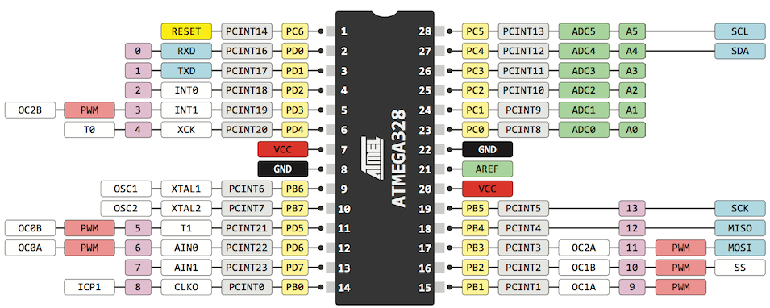

# Arduino 함수를 이용한 예제들
시뮬레이션은 [TinkerCAD](https://www.tinkercad.com/)에서 진행해 보시면 됩니다.

## 준비작업
[Visual Studio Code](https://visualstudio.microsoft.com/) 개발 환경에서 [PlatformIO extension](https://marketplace.visualstudio.com/publishers/platformio)를 활용하여 개발하였기에
[Examples](Examples/) 폴더의 코드 중 하나를 [Src](Src/) 디렉토리에 복사하여 진행한다.

## Pinmap 정보



## 기본 예제
아래는 각 코드를 Thinker로 시뮬레이션할 수 있는 링크이다.
주의할 점은 코드 첫줄의 아래 라인을 리마크 시킨다.
``` C
#include <Arduino.h> // Remove this line if you run in the TinkerCAD
=>
//#include <Arduino.h> // Remove this line if you run in the TinkerCAD
```
1. GPIO output
  + [LED blink](https://www.tinkercad.com/things/9tTlsAQfxbS) ([Source](/Examples/blink.cpp))
  + [7 Segments](https://www.tinkercad.com/things/iTgaQUFvTuf) ([Source](/Examples/7%20segments.cpp))
3. GPIO input, Get switch status
4. External interrupt
  + [Input (Interrupt)](https://www.tinkercad.com/things/6u8BhxqMTaT-3inputint)
5. Pin change interrupt
  + [Serial Output(PCI)](https://www.tinkercad.com/things/cKVdkyogXOZ)
  + [7 segment display with button(INT, REG)](https://www.tinkercad.com/things/8TSdRIwjUST)

6. Serial Communication  
  + [Serial Output](https://www.tinkercad.com/things/joOPFwP0VYM-serial-output)
  + [Serial Input](https://www.tinkercad.com/things/9yasydLUGJB-serial-inoutput)
7. ADC
  + [ADC map](https://www.tinkercad.com/things/dASaPhUIBIO)
8. PWM
  + [LED](https://www.tinkercad.com/things/iXQAoo5EQi2)
  + [color LED](https://www.tinkercad.com/things/iXQAoo5EQi2)
  + [DC Motor](https://www.tinkercad.com/things/9QvffBg2ctE)
  + [DC Motor(L293)](https://www.tinkercad.com/things/4gsk9CvOitZ)
9. SPI
10. I2C
11. Timer

## 고급 예제
1. 4자리 7segments
2. Matrix LED
4. LCD
5. ADC
  + 조도
  + 온도
  + Multi key 입력
7. PWM, RC Servo
8. 
9. Timer

## 응용 예제
1. 포트 확장, PCF8574
1. 초음파 거리 측정
1. 모스 부호 
1. Encoder가 있는 DC 모터
5. 적외선 리모컨 RC 카
6. 콘덴서 용량 측정기
7. 외부 라이브러리 활용
  + Timer
  + Neo Pixel
  + Software Serial
  + Realtime clock
  + Bluetooth
  + Ethernet

## Python으로 제어하기

## Register와 혼용한 예제