# Multisim을 이용한 논리회로 시뮬레이션
Simulating Logic Circuit by using Multisim

강의자료  
+ [Multisim을 이용한 조합논리회로 실험](https://docs.google.com/document/d/1WXezy9JFQiraSLnUy9R7dk9Pz-jLC-JfszJM1WIOl5E/edit#heading=h.85b5f0p6fkux) (Combinational Logic Circuits in Multisim)

+ [Multisim을 이용한 순차논리회로 실험](https://docs.google.com/document/d/1jX-wdGTK424XunvFu4a4CxtR17Vvwe2NsozZ4Cq2cl0/edit#heading=h.cqoc0zbtcqou) (Sequential Logic Circuits in Multisim)

## 예제 - Multisim을 이용한 조합논리회로 실험

### 1. 기본 논리게이트 (Basic Logic Gates)

1.1~1.3 [AND, OR, XOR gate](1_1_and_or_xor.ms14) (AND, OR, XOR gate)

  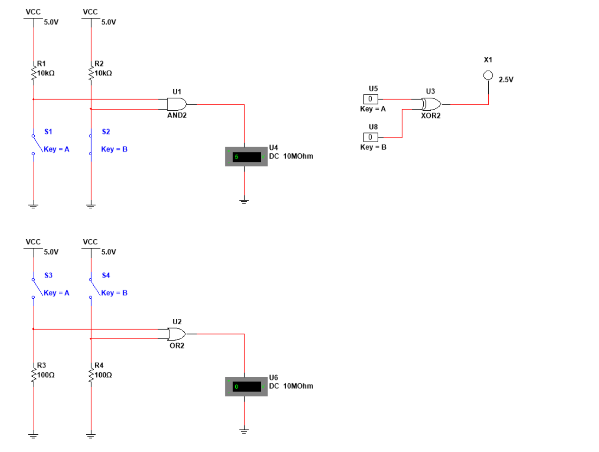

1.4~1.5 [NAND, NOR gate](1_4_nand_nor.ms14) (NAND, NOR gate)

  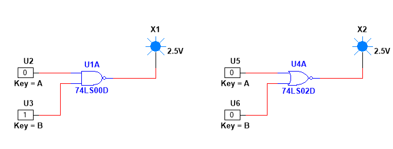

1.6 [NAND로 NOT, AND, OR, XOR 구현](1_6_not_and_or_xor_by_nand.ms14) (NOT, AND, OR, XOR Gates using NAND Gate)

  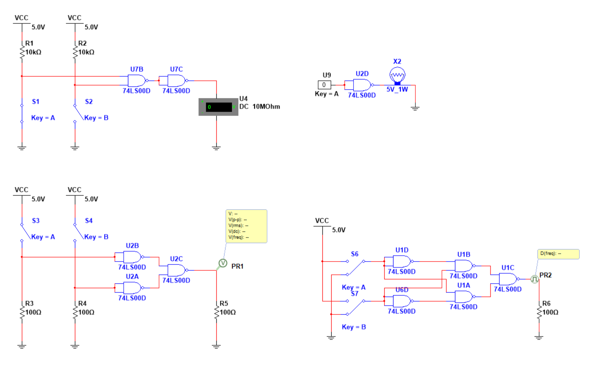

1.7 [NOR로 NOT, AND, OR, XOR 구현](1_7_not_and_or_xor_by_nor.ms14) (NOT, AND, OR, XOR Gates using NOR Gate)

  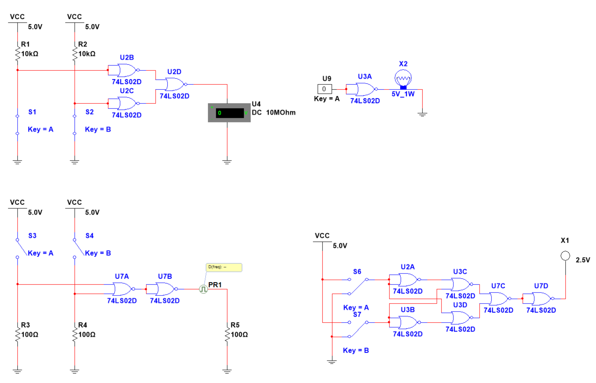
  

### 2. 기본 조합논리회로 (Basic Combinational Logic Circuits)

#### 2.1 [반가산기](2_1_bit_half_adder.ms14) (Half Adder)

  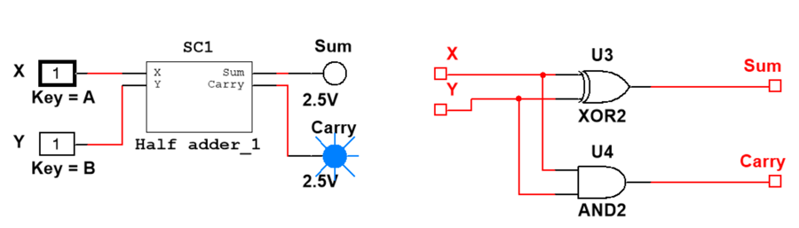

#### 2.2 [전가산기](2_2_bit_full_adder.ms14) (Full Adder)

  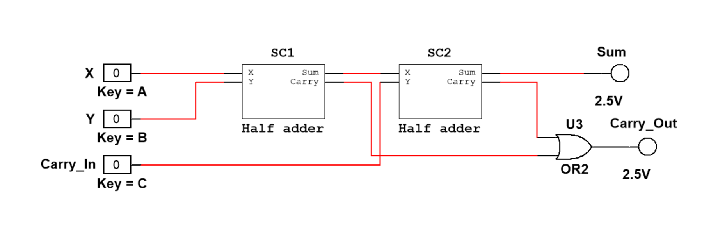

2.3.1 [4비트 전가산기](2_3_1_4bit_full_adder.ms14) (4-bit Full Adder)

  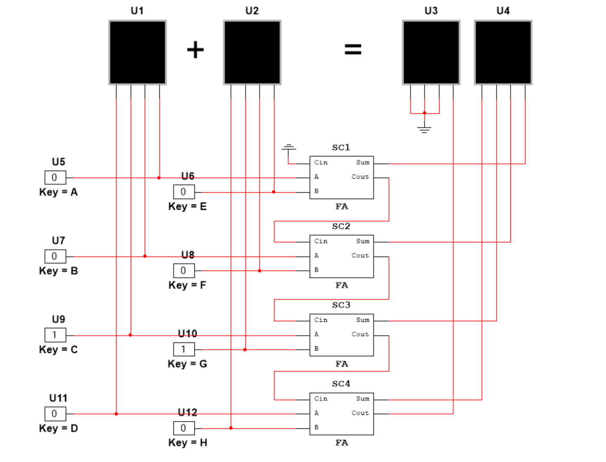

2.3.2 [74ls283을 이용한 가감산기](2_3_2_add_sub_74ls283.ms14) (Adder and subtracter using 74ls283)

  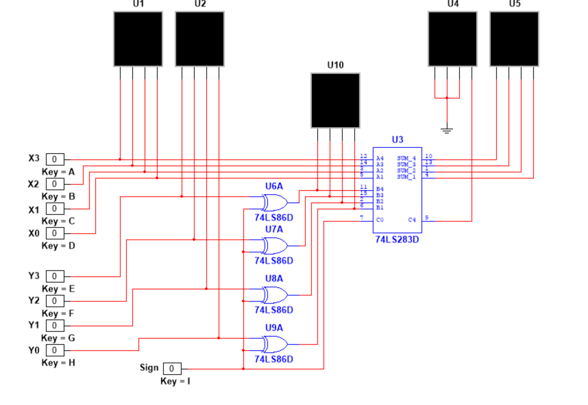

2.3.4 [4비트 BCD 가산기](2_3_4_4bit_bcd_adder.ms14) (4-bit BCD Adder)

  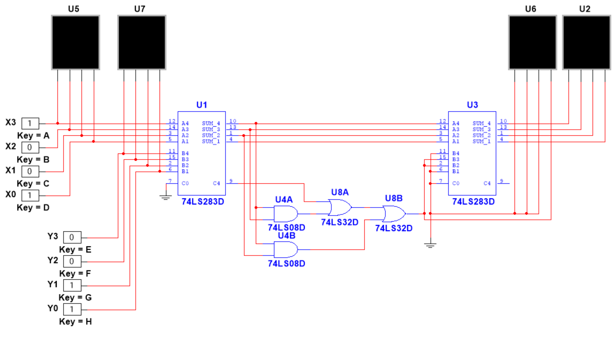

#### 2.4 비교기 (Comparator)

2.4.1 [74ls85를 이용한 4비트 비교기](2_4_1_4bit_comparator_74ls85.ms14) (4-bit Comparator using 74ls85)

  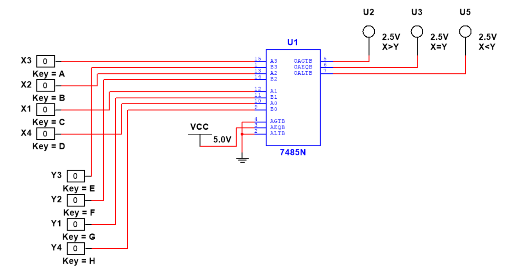

2.4.2 [8비트 비교기](2_4_2_8bit_comparator.ms14) (8-bit Comparator)

  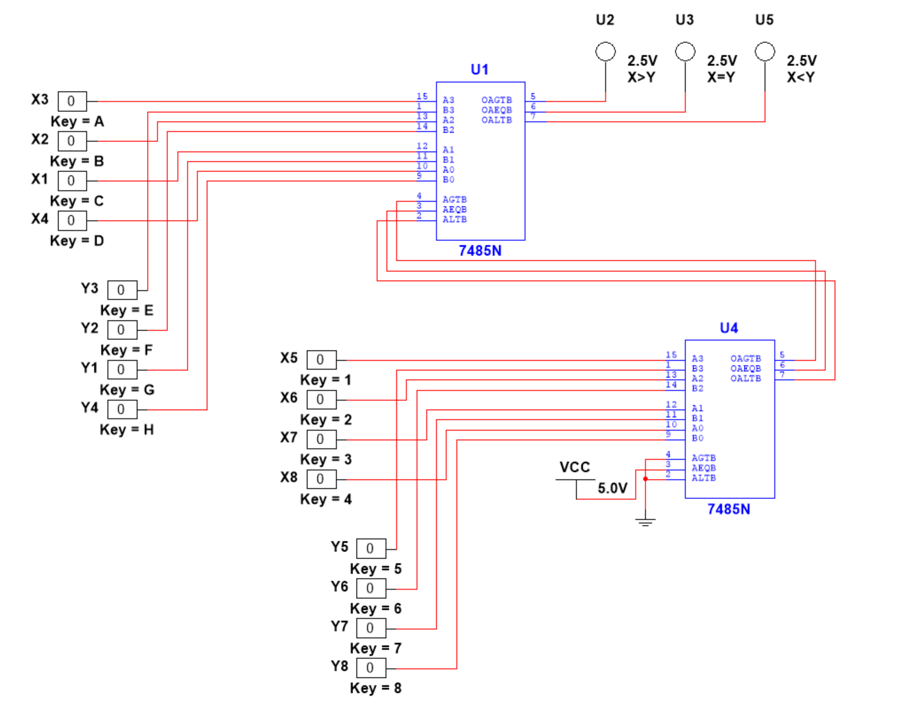

2.4.3 [12비트 비교기](2_4_3_12bit_comparator.ms14) (12-bit Comparator)

  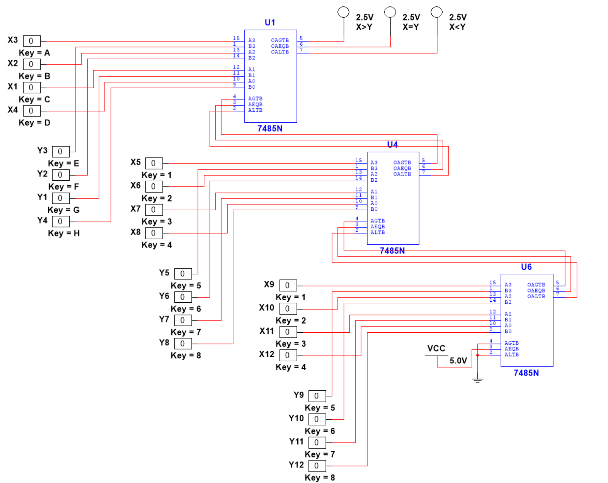

#### 2.5 디코더 (Decoder)

2.5.6 [디코더를 이용한 전가산기 구현](2_5_6_full_adder_by_decoder.ms14) (Full Adder by using Decoder)

  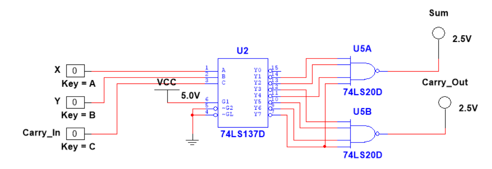

### 3. 응용조합논리회로 (Application of Combinational Logic Circuits)

#### 3.4 BCD-3초과 코드 변환기 [(Logic Gates)](3_4_bcd_2_excess3_code_conv_logicgates.ms14) | [(74ls283)](3_4_bcd_2_excess3_code_conv_74ls283.ms14) (BCD to Excess 3 Code Converter)

  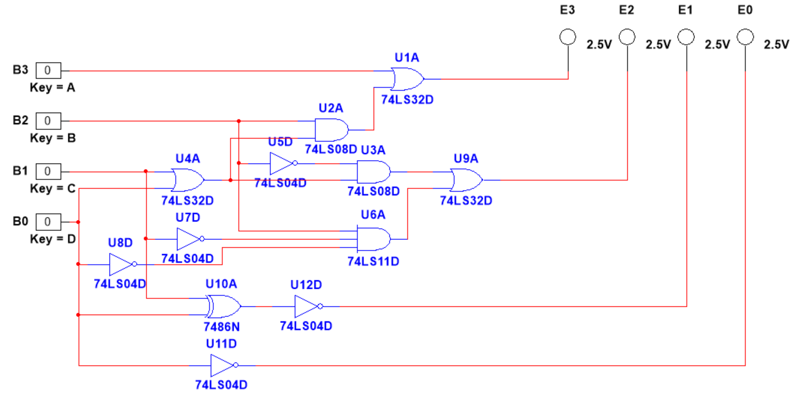

  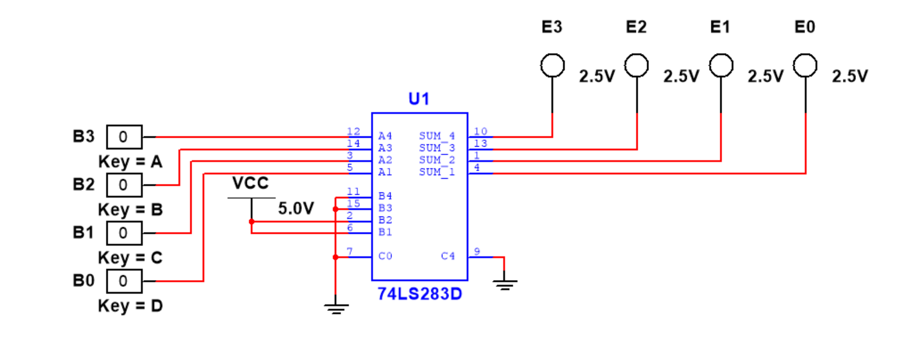

## 예제 - Multisim을 이용한 순차논리회로 실험

### 2. 레지스터 (Register)

#### 2.8 비동기식 카운터 (Asynchronous Counter)

2.8.1 [3비트 Ripple Up 카운터](sequential_logic_circuits/2_8_1_3bit_ripple_up_counter.ms14) (3-bit Ripple Up Counter)

  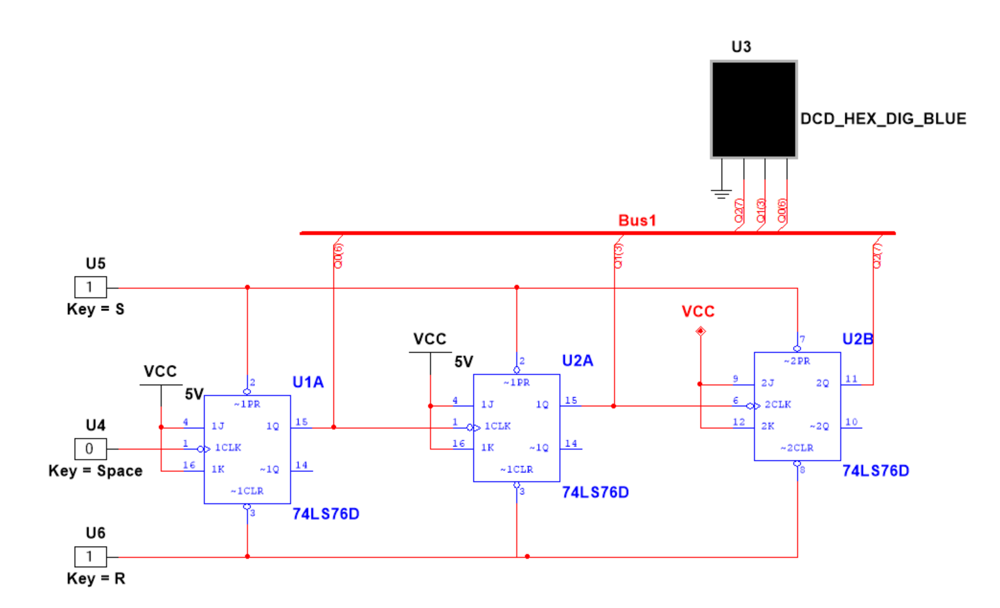

2.8.4 [4비트 Modulo-m Ripple 카운터](sequential_logic_circuits/2_8_4_4bit_modulom_ripple_counter.ms14) (4-bits Modulo-m Ripple Counter)

  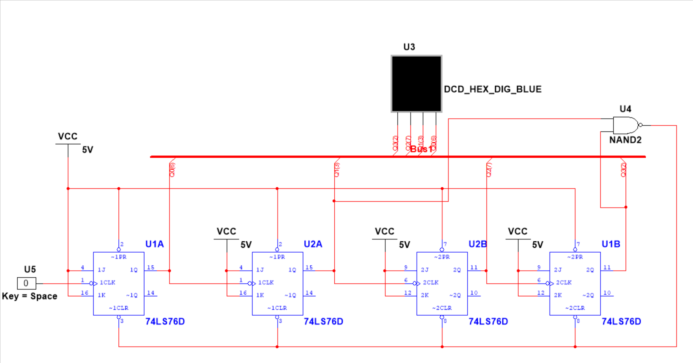

추가 : [3-bit Set/Reset Counter](sequential_logic_circuits/2_8_5_3bit_set_reset_counter.ms14) (3-bit Set/Reset Counter)

  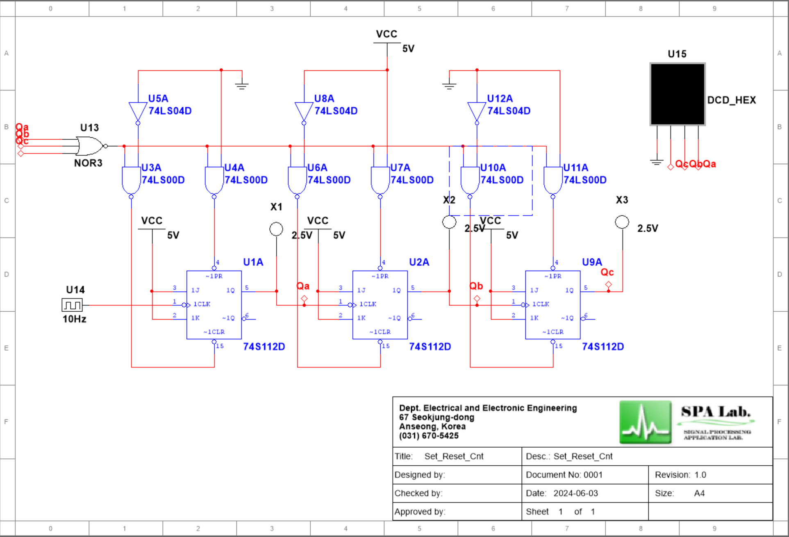