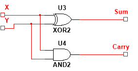

# Multisim을 이용한 논리회로 시뮬레이션

Simulating Logic Circuit by using Multisim

강의자료
+ [Multisim을 이용한 조합논리회로 실험](https://docs.google.com/document/d/1WXezy9JFQiraSLnUy9R7dk9Pz-jLC-JfszJM1WIOl5E/edit#heading=h.85b5f0p6fkux)

+ [Multisim을 이용한 순차논리회로 실험](https://docs.google.com/document/d/1jX-wdGTK424XunvFu4a4CxtR17Vvwe2NsozZ4Cq2cl0/edit#heading=h.cqoc0zbtcqou)

## 예제

1. [반가산기](반가산기.ms14) (Half Adder)

    
    

2. [3 비트 Ripple counter](3bits ripple cnt.ms14) (3 bits Ripple counter)

  

3. [4 비트 BCD 가산기](4bit BCD 가산기.ms14) (4 bits BCD Adder)

  

4. [4 비트 전가산기](4bit Full adder.ms14) (4 bits Full Adder)

  

5. [4 비트 가감산기](4bit 가감산기.ms14) (4 bits Adder & Substracter)

  

6. [4 비트 modulus](4bits ripple cnt with modulus.ms14) (4 bits Ripple counter with modulus)

  

7. [4비트 비교기](4비트 비교기.ms14) (4 bits Comparator)

  

8. [8비트 비교기](8비트 비교기.ms14) (8 bits Comparator)

  

9. [12비트 비교기](12비트 비교기.ms14) (12 bits Comparator)

  

10. [AND OR XOR](AND_OR_XOR.ms14) (AND OR XOR)

  

11. [BCD-3초과 코드 변환기](BCD-3초과 코드 변환기.ms14) (BCD-3초과 코드 변환기)

  

12. [NAND NOR](NAND_NOR.ms14) (NAND NOR)

  

13. [NAND로 AND OR XOR](NAND로 AND_OR_XOR.ms14) (AND OR XOR using NAND)

  

14. [NOR로 AND OR XOR](NOR로 AND_OR_XOR.ms14) (AND OR XOR using NOR)

  

15. [Set/Reset 카운터](Set_Reset_Cnt.ms14) (Set/Reset counter)

  

16. [디코더를 이용한 전가산기](디코더를 이용한 전가산기.ms14) (Full Adder by using Decoder)

  

17. [전가산기](전가산기.ms14) (Full Adder)

  

18. [전가산기를 이용한 BCD-3초과 코드 변환기](전가산기를 이용한 BCD-3초과 코드 변환기.ms14) (BCD-3초과 코드 변환기 by using Full Adder)

  

 ()
  

