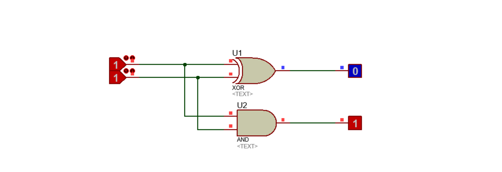
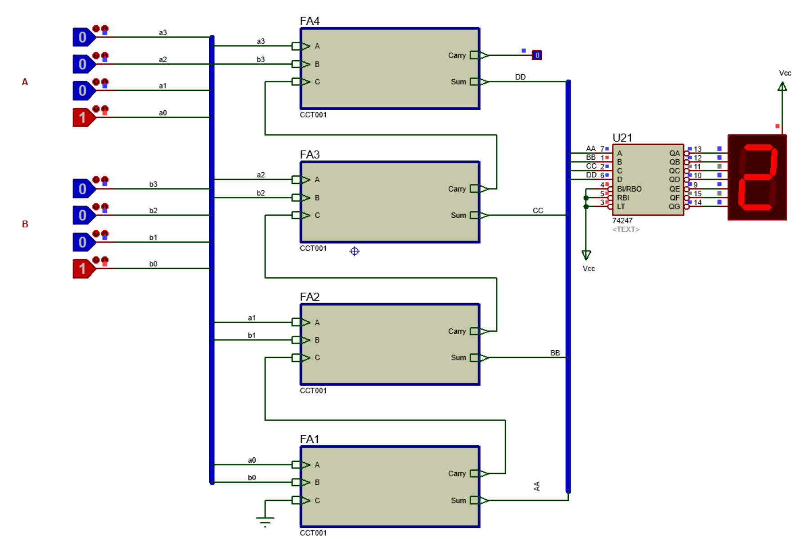
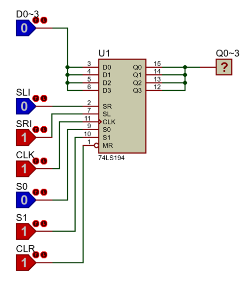

# Proteus를 이용한 논리회로 시뮬레이션
Simulating Logic Circuit by using Proteus

강의자료  
+ [Proteus를 이용한 조합논리회로 실험](https://docs.google.com/document/d/1fc-gf7ssCuh3Qt104MFrx15XqotCBZvXcE7OXDTSIRw/edit) (Combinational Logic Circuits in Proteus)

+ [Proteus를 이용한 순차논리회로 실험](https://docs.google.com/document/d/1Bt5hzK4daAi6tXBZO7RS8zhi8J9hEL-TYFtcSkawnpE/edit#heading=h.a8czxwntf37) (Sequential Logic Circuits in Proteus)

## 예제 - Proteus를 이용한 조합논리회로 실험

4. Bit Full Adder 만들기
    

    ### 4.1 [1 비트 반가산기](combinational_logic_circuit/4_1_bit_half_adder.pdsprj) (1 bit Half Adder) 

      

    ### 4.5 [4 비트 전가산기](combinational_logic_circuit/4_5_4bits_full_adder.pdsprj) (4 bit Full Adder) 

      

    ### 4.7 디코더 (Decoder)

    #### 4.7.1 디코더를 이용한 7-segments 제어 

        

    #### 4.7.2 디코더를 이용한 다중 7-segments 제어 [(case 1)](combinational_logic_circuit/4_7_2_multi_7segments_decoder.pdsprj) | [(case 2)](combinational_logic_circuit/4_7_2_multi_7segments_decoder_2.pdsprj) (controlling multi 7-segments by using Decoder)

       

      

    #### 4.7.3 [3x8 디코더를 이용한 4x16 디코더 설계](combinational_logic_circuit/4_7_3_4x16d_using_3x8d.pdsprj) (4x16 Decoder using 3x8 Decoder) 

      

    #### 4.7.5 [디코더를 이용한 전가산기 구현](combinational_logic_circuit/4_7_5_full_adder_using_decoder.pdsprj) () 

      

    ### 4.8 멀티플렉서 (Multiplexer,Mux)

    #### 4.8.1 [4x1 Mux를 이용한 16x1 Mux로의 확장](combinational_logic_circuit/4_8_1_16x1mux_using_4x1mux.pdsprj) (16x1 Muliplexer using 4x1 Multiplexer) 

      

    #### 4.8.2 멀티플렉서를 활용한 부울방정식 구현 [(3x1 Mux)](combinational_logic_circuit/4_8_2_booleq_3x1_mux.pdsprj) | [(4x1 Mux)](combinational_logic_circuit/4_8_2_booleq_4x1_mux.pdsprj) (Boolean Equation using Multiplexer) 

      

      

5. 응용 조합논리회로 (Application of Combinational Logic Circuits )

    ### 5.1 [짝수 패리티 발생 회로](combinational_logic_circuit/5_1_even_parity_generator.pdsprj) (Even Parity Generator Circuit) 

      

    ### 5.3 BCD-3초과 코드 변환기 [(Logic Gates, - 3)](combinational_logic_circuit/5_3_bcd_2_excess3_code_conv_logicgates.pdsprj) | [(74ls283 4-Bit Full Adder, + 3)](combinational_logic_circuit/5_3_bcd_2_excess3_code_conv_74ls283.pdsprj) (BCD to Excess 3 Code Converter) 

      

        

       

## 예제 - Proteus를 이용한 순차논리회로 실험

1. 기본 FlipFlop (Basic FlipFlop)

    ### 1.1 [NOR로 구성한 SR Latch](1_1_sr_latch_nor.pdsprj) (SR Latch using NOR) 
      

    ### 1.2 [NAND로 구성한 SR Latch](1_1_sr_latch_nand.pdsprj) (SR Latch using NAND) 

      

    ### 1.3 SR FlipFlop [(NAND)](1_3_sr_ff_nand.pdsprj) | [(NOR)](1_3_sr_ff_nor.pdsprj) (SR FlipFlop) 

      

      
   
    ### 1.4 [Master-Slave F/F](1_4_master_slave_ff.pdsprj) (Master-Slave FlipFlop) 

      

    ### 1.5 JK F/F [(NAND)](1_5_jk_ff_nand.pdsprj) | [(NOR)](1_5_jk_ff_nor.pdsprj) (JK FlipFlop) 
    
      

      

     #### 1.5.1 JK F/F의 동작 특성 [Falling Edge Trigger](1_5_1_jk_ff_falling_edge.pdsprj) | [Rising Edge Trigger](1_5_1_jk_ff_rising_edge.pdsprj) (Operating Characteristics of JF FlipFlop)

      

      
   
    ### 1.6 D F/F [(NAND)](1_6_d_ff_nand.pdsprj) | [(NOR)](1_6_d_ff_nor.pdsprj) | [(74LS74)](1_6_d_ff_74ls74.pdsprj) | [(Falling Edge Trigger)](1_6_d_ff_falling_edge_trigger.pdsprj) (D FlipFlop) 

      

      

      

      

    ### 1.7 [T F/F](1_7_t_ff.pdsprj) (T FlipFlop) 

      
    
    ### 1.8 Debounce(Debounce) 

2. 레지스터 (Register)

    ### 2.1 [SISO](2_1_siso_4bits_right_shift_register.pdsprj) (Serial Input Serial Output) 

      

    #### 2.1.1 [74ls91을 이용한 예제](2_1_1_siso_7491.pdsprj) (SISO using 74ls91) 

      

    ### 2.2 [SIPO](2_2_sipo_74ls164.pdsprj) (Serial Input Parallel Output using 74ls164) 

      

    ### 2.3 [PISO](2_3_piso_74ls165.pdsprj) (Parallel Input Serial Output using 74ls165) 

      

    ### 2.4 [PIPO](2_4_pipo_74ls195.pdsprj) (Parallel Input Serial Output using 74ls195) 

      

    ### 2.5 [범용 쉬프트 레지스터](2_5_universal_shift_register_74ls194.pdsprj) (74ls194 Universal Shift Register) 

      

3. 순차회로 해석

4. 순차회로 설계
