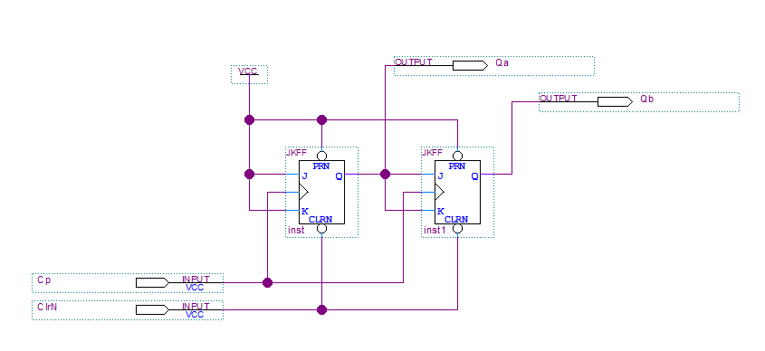
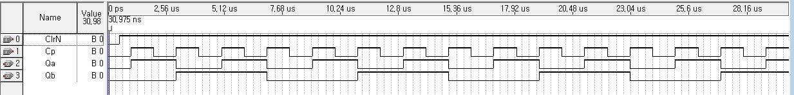

# Quartus에서의 논리회로 시뮬레이션 (회로도)
Simulating Logic Circuits in Quartus by using Schematic Design

[2_3_Quartus II(Schematic)를 이용한 순차논리회로 실험](https://docs.google.com/document/d/18B2oY9i0UkC5DJaRiA0vmYNfsSaPw23wI-6OQMqPB7Y/edit#heading=h.754qeavoagw5)

## 예제
1. 기본 FlipFlop (Basic FlopFlop)

2.  [2비트 카운터](2bits_Counter/2bits_counter.zip) (2 bits counter)

3.  [3비트 카운터](3bits_Counter\3bits_counter.zip) (3 bits counter)

4. bits counter