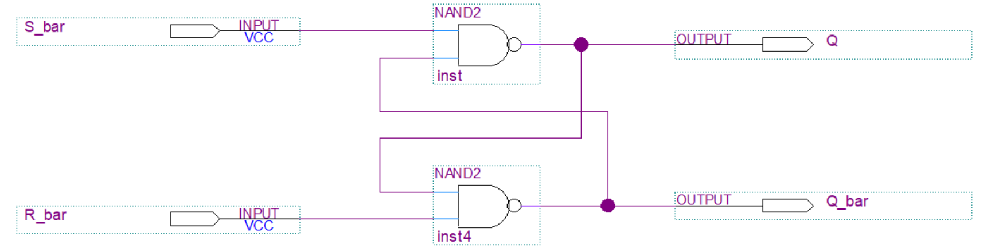

# Quartus를 이용한 논리회로 시뮬레이션
Simulating Logic Circuit by using Proteus

강의자료  
+ [Quartus를 이용한 조합논리회로 실험(링크삽입필요)]() (Combinational Logic Circuits in Quartus)

+ [Quartus를 이용한 순차논리회로 실험](https://docs.google.com/document/d/18B2oY9i0UkC5DJaRiA0vmYNfsSaPw23wI-6OQMqPB7Y/edit?usp=sharing) (Sequential Logic Circuits in Quartus)

## 예제 - Quartus를 이용한 순차논리회로 실험

## 4. 순차회로 실습 (Basic Sequential Logic Circuits)

### 4.1 기본 Flip Flop (Basic Flip Flops) 

#### 4.1.1  [SR Latch](4_1_1_sr_latch) (SR Latch)

#### 4.1.2, 4, 5, 6   [기본 FlipFlop](4_1_2_basic_flipflops) (Basic Flip Flops)

 
 

#### 4.1.3  [Master-Slave F/F](4_1_3_master_slave_ff) (Master-Slave F/F)

 

##### 4.1.3.1  [Master-Slave F/F (Ver.Subblock)](4_1_3_1_master_slave_ff_subblock) (Master-Slave F/F (Ver.Subblock))

 _schematic.png _vwf_sim.png

#### 4.1.7  [F/F 응용- Debounce](4_1_7_debouncing_circuit) (Debouncing Circuit)

    
### 4.2  레지스터 (Register)

#### 4.2.1 [SISO 레지스터](SISO_Register/SISO_Register.zip) (Serial Input Serial Output Register)
        
        
        
        

#### 4.2.1.1 [8비트 SISO 레지스터](SISO_Register/8-bits_SISO_Register.zip) (8-bits SISO Register)
            
            

    + 2.2 [SIPO 레지스터](SIPO_Register/SIPO_Register.zip) (Serial Input Parallel Output Register)
        
        
    
    + 2.3 [레지스터 응용-디지털 금고](Digital_StrongBox/Digital_StrongBox.zip) (Digital Locker)
        
        

    + 2.4 [레지스터 응용-난수 발생 회로](RandomNumber_Generator/RandomNumber_Generator.zip) (Random Number Generator)
        
        

3. n비트 카운터 (n-bits counter)

    + 3.1 [2비트 카운터](2bits_Counter/2bits_counter.zip) (2 bits counter)
        
        

    + 3.2 [3비트 카운터](3bits_Counter/3bits_counter.zip) (3 bits counter)
        
        
     
    + 3.3 [3비트 Ripple 카운터](3bit_ripple) (3 bits Ripple counter)
        
          
        
    + 3.5  [3비트 Up/Down 카운터](3bits_UpDown_Counter/3bits_updown_counter.zip) (3 bits Up/Down counter)
        
          

    + 3.6  [4비트 카운터](4bits_Counter/4bits_counter.zip) (4 bit counter)
        
         

    + 3.7  [Modulo-m Ripple 카운터](Modulo-m_ripple_counter/Modulo-m ripple counter.zip) (Modulo-m Ripple counter)
        
        

    + 3.8  [BCD 카운터](BCD_Counter/BCD_counter.zip) (Binary Coded Decimal counter)
         
        
    
    + 3.9  [Ripple up 카운터](Ripple up counter/Ripple up counter.zip) (Ripple up counter)
        
        

    + 3.10  [Ripple down 카운터](Ripple down counter/Ripple down counter.zip) (Ripple down counter)
        
        

    + 3.7  [Ripple up down 카운터](Ripple up down counter/Ripple up down counter.zip) (Ripple up down counter)
        
        

4. 순차회로 예제 (Sequential Logic Circuit Example)

    + 4.1 [순차회로 예제](Sequential logic circuit example/Seq_exam.zip) (Sequential Logic circuit example)
        
        

5. 순차회로 설계 (Sequential Logic Circuit Design)   

    + 5.1 [순차회로 설계](Design_Sequential_Circuit/Design_Sequential_Circuit.zip) (Sequential Logic Circuit Design)
        
        
         

