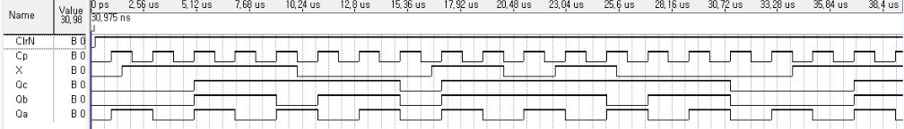

# Quartus를 이용한 논리회로 시뮬레이션
Simulating Logic Circuit by using Proteus

강의자료  
+ [Quartus를 이용한 조합논리회로 실험(링크삽입필요)]() (Combinational Logic Circuits in Quartus)

+ [Quartus를 이용한 순차논리회로 실험](https://docs.google.com/document/d/18B2oY9i0UkC5DJaRiA0vmYNfsSaPw23wI-6OQMqPB7Y/edit?usp=sharing) (Sequential Logic Circuits in Quartus)

## 예제 - Quartus를 이용한 순차논리회로 실험

## 4. 순차회로 실습 (Basic Sequential Logic Circuits)

### 4.1 기본 Flip Flop (Basic Flip Flops) 

#### 4.1.1  [SR Latch](4_1_1_sr_latch) (SR Latch)

#### 4.1.2, 4, 5, 6   [기본 FlipFlop](4_1_2_basic_flipflops) (Basic Flip Flops)

 
 

#### 4.1.3  [Master-Slave F/F](4_1_3_master_slave_ff) (Master-Slave F/F)

 

##### 4.1.3.1  [Master-Slave F/F (Ver.Subblock)](4_1_3_1_master_slave_ff_subblock) (Master-Slave F/F (Ver.Subblock))

#### 4.1.7  [F/F 응용- Debounce](4_1_7_debouncing_circuit) (Debouncing Circuit)

### 4.2  레지스터 (Register)

#### 4.2.1 [SISO 레지스터](4_2_1_siso_reg) (Serial Input Serial Output Register)

#### 4.2.1.1 [8비트 SISO 레지스터](4_2_1_siso_reg) (8-bits SISO Register)

#### 4.2.2 [SIPO 레지스터](4_2_2_sipo_reg) (Serial Input Parallel Output Register)

    
#### 4.2.6 [레지스터 응용-디지털 금고](4_2_6_digital_locker_reg) (Digital Locker)

#### 4.2.7 [레지스터 응용-난수 발생 회로](4_2_7_random_num_gen_reg) (Random Number Generator)

### 4.3  비동기식 카운터 (Asynchronous Counter)

#### 4.3.1 [Ripple up 카운터](4_3_1_ripple_up_counter) (Ripple up counter)

#### 4.3.2 [Ripple down 카운터](4_3_2_ripple_down_counter) (Ripple down counter)

#### 4.3.3 [Ripple up down 카운터](4_3_3_ripple_up_down_counter) (Ripple up down counter)

#### 4.3.4 [Modulo-m Ripple 카운터](4_3_4_modulom_ripple_counter) (Modulo-m Ripple counter)

## 5. 순차회로 해석 (Analysis of Sequential Logic Circuits)

## 6. 순차회로 설계 (Designing Sequential Logic Circuits)

### 6.1 [2비트 카운터](6_1_2bit_counter) (2 bits counter)

### 6.2 [3비트 카운터](6_2_3bit_counter) (3 bits counter)

        
### 6.3 [4비트 카운터](6_3_syn_4bit_counter) (4 bit counter)

### 6.4 [BCD 카운터](6_4_syn_bcd_counter) (Binary Coded Decimal counter)

### 6.5 [3비트 Up/Down 카운터](6_5_syn_3bit_updown_counter) (3 bits Up/Down counter)

3. 미분류

    
    + 3.3 [3비트 Ripple 카운터](3bit_ripple) (3 bits Ripple counter)
        
          

    + 4.1 [순차회로 예제](Sequential logic circuit example/Seq_exam.zip) (Sequential Logic circuit example)
        
        

    + 5.1 [순차회로 설계](Design_Sequential_Circuit/Design_Sequential_Circuit.zip) (Sequential Logic Circuit Design)
        
        
         

