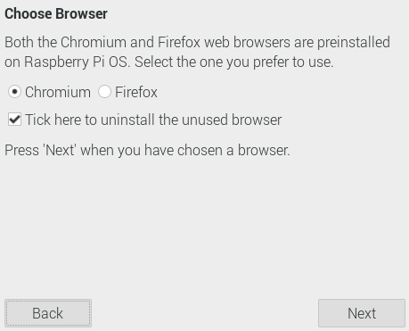

# 4.1.1. 개발환경 구축

이 문서는 특정 개발 환경을 기준으로 작성되었다. 처음 이 분야를 배우는 분들은 가능한 아래에 명시된 환경과 동일한 보드와 소프트웨어 버전을 사용하는 것이 좋다. 왜냐하면, 문서의 내용을 가장 정확히 따라할 수 있기 때문이다.

만약 다른 보드를 가지고 있거나 최신 버전의 소프트웨어를 사용 중이라면, 일부 내용이나 화면이 이 문서와 다를 수 있다. 이런 경우 약간의 차이점을 감안하고 진행한다. 처음에는 이 문서에 명시된 환경으로 학습하고, 기본 개념을 이해한 후에 최신 버전이나 다른 보드로 시도해보는 것이 좋다. 차이점이 발견되더라도 기본 원리는 대부분 동일하므로, 조금만 응용하면 따라할 수 있다.

* Raspberry Pi: Raspberry Pi 4
* Raspberry Pi OS: Raspbian GNU/Linux 12
* Visual Studio Code: 1.83.0
* Python: 3.11.2

## Raspberry Pi 설치

Raspberry Pi를 사용하기 위해 OS를 설치한다. 다음 링크에 접속하여 Raspberry Pi Imager를 다운로드한다. 각자 자신이 사용 중인 운영 체계에 맞는 것을 선택한다. 여기서는 macOS를 사용했기 때문에 Download for macOS버전을 다운로드한다.

[https://www.raspberrypi.com/software/](https://www.raspberrypi.com/software/)

<figure style="text-align: center;"><figcaption>
Raspberry Pi 설치 프로그램 다운로드
</figcaption></figure>

설치 프로그램을 실행하면 화면이 나타난다. 좌측에 Raspberry Pi Imager.app을 드래그해 Applications로 이동해 놓아 설치를 진행한다.

<figure style="text-align: center;"><figcaption>
Raspberry Pi 설치 방법
</figcaption></figure>

설치가 완료되면 Raspberry Pi Imager를 실행한다. 좌측의 운영체제 선택을 클릭한다.

<figure style="text-align: center;"><figcaption>
Raspberry Pi Image 실행
</figcaption></figure>

상단의 Raspberry Pi를 클릭하여 설치 운영체제를 선택한다.

<figure style="text-align: center;"><figcaption>
설치 운영체제 선택
</figcaption></figure>

SD카드를 컴퓨터에 삽입한 후 저장소를 선택한다.

<figure style="text-align: center;"><figcaption>
설치 저장소 선택
</figcaption></figure>

설치 운영체제와 저장소 선택 후 우측의 쓰기 버튼을 클릭해 운영체제를 설치한다.

<figure style="text-align: center;"><figcaption>
Raspberry Pi 설치버튼 클릭
</figcaption></figure>

설치완료 후 SD카드를 Raspberry Pi에 삽입 후 USB-C 타입의 전원을 연결하면 Raspberry Pi 설정 화면이 나타난다. Next 버튼을 클릭한다.

<figure style="text-align: center;"><figcaption>
Raspberry Pi 설정 시작
</figcaption></figure>

국가 설정 화면으로 전환되면 Country를 South Korea로 변경하고, Use English language 옵션을 체크한 후 Next 버튼을 클릭한다.

<figure style="text-align: center;"><figcaption>
국가 선택
</figcaption></figure>

사용자명 설정 화면으로 전환되면 사용자 이름과 비밀번호를 입력 후 Next 버튼을 클릭한다.

<figure style="text-align: center;"><figcaption>
사용자명, 패스워드 생성
</figcaption></figure>

WiFi 설정 화면으로 전환되면 사용 가능한 WiFi 선택 후 Next 버튼을 클릭한다.

<figure style="text-align: center;"><figcaption>
WiFi 설정
</figcaption></figure>

브라우저 선택 화면으로 전환되면 사용할 브라우저 선택 후 Next 버튼을 클릭한다. 여기서는 Chromium으로 선택 후 진행한다.

<figure style="text-align: center;"><figcaption>
브라우저 선택
</figcaption></figure>

소프트웨어 업데이트 화면으로 전환되면 Next 버튼을 클릭해 업데이트를 진행한다.

<figure style="text-align: center;"><figcaption>
소프트웨어 업데이트
</figcaption></figure>

설정완료 화면으로 전환되면 Restart 버튼을 클릭해 Raspberry Pi를 재시작한다.

<figure style="text-align: center;"><figcaption>
라즈베리파이 설정 완료
</figcaption></figure>

라즈베리파이를 재시작하면 화면과 같은 화면이 나타난다.

<figure style="text-align: center;"><figcaption>
라즈베리파이 실행
</figcaption></figure>

## Visual Studio Code 설치

여기서는 개발 에디터인 Visual Studio Code(이하 VSCode)를 사용해 개발을 진행한다. Terminal을 실행해 명령어를 순차적으로 입력한다.

<pre data-overflow="wrap"><code>// 설치 가능한 패키지 리스트 최신화
sudo apt update
sudo apt upgrade

<strong>// Visual Studio Code 설치
</strong>sudo apt install code
</code></pre>

<figure style="text-align: center;"><figcaption>
VSCode 설치
</figcaption></figure>

VSCode 설치 이후 그림과 같이 클릭하면 실행된다.

<figure style="text-align: center;"><figcaption>
Visual Studio Code 실행방법
</figcaption></figure>

VSCode를 실행하면 화면이 나타나는것을 확인할 수 있다.

<figure style="text-align: center;"><figcaption>
Visual Studio Code 실행
</figcaption></figure>

## Python 확장 패키지 설치

VSCode(Visual Studio Code)는 강력한 텍스트 에디터이다. 하지만 기본 상태의 VSCode는 범용 텍스트 편집기일 뿐, 특정 프로그래밍 언어를 위한 기능은 제한적이다. 이를 보완하기 위해 플러그인 개념의 '확장 모듈'을 제공한다. 각 프로그래밍 언어나 작업에 특화된 기능을 추가할 수 있다. 여기서는 Python을 활용할 예정이므로 Python 확장 모듈을 설치한다.

<figure style="text-align: center;"><figcaption>
Python Extension 설치
</figcaption></figure>

## 관련 모듈 설치

바나나 체온계와 BLE 통신을 수행하고, 그 결과를 시각화하기 위해 그래프로 보여주기 위한 추가 모듈이 필요하다. 이 추가모듈은 VSCode의 확장 모듈이 아니라 Python의 확장 모듈임을 혼돈하지 말아야 한다. 파이썬의 모듈은 C 언어에서 라이브러리와 유사한 개념이다. 다음 방법을 따라 설치해 보자.

Terminal을 실행해 명령어를 차례대로 입력한다. sudo reboot를 입력하면 Raspberry Pi가 재실행된다.
