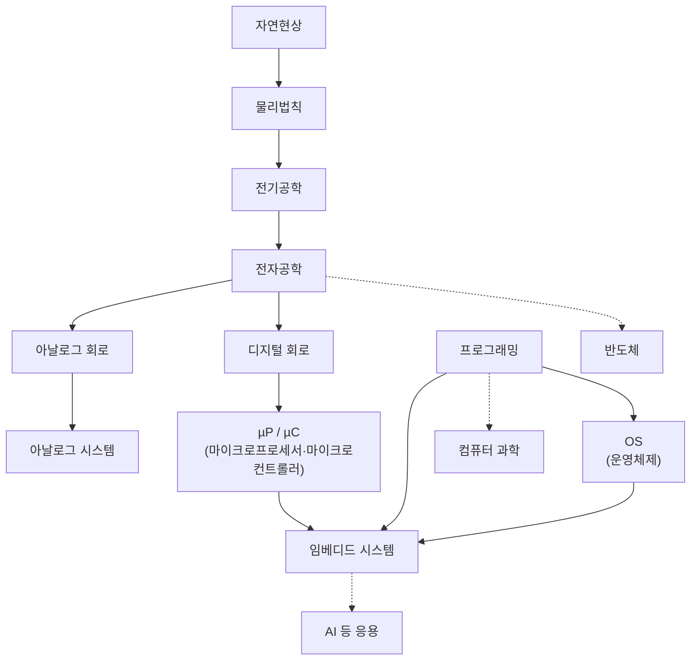
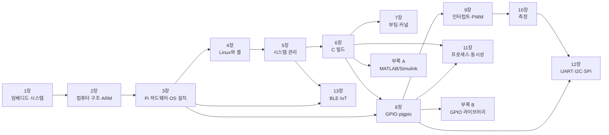

# 머리말

> **이 머리말에서 알 수 있는 것**
> - 이 책이 누구를 위해, 무엇을 목표로 쓰였는가
> - 임베디드 시스템을 왜 배우고, 전자공학의 다른 과목과 어떻게 이어지는가
> - 13개 장과 부록 3개가 무엇을 다루고, 어떤 순서로 읽으면 좋은가
> - 한 학기 15주 수업에서 이 책을 어떻게 나누어 쓸 수 있는가
> - 실습에 필요한 부품과 개발 환경, 이 책의 표기 규칙
> - 공부하는 방법과 과제 제출 규칙

---

## 이 책의 목적과 독자

이 책은 한경국립대학교 전자공학전공 3학년 2학기 과목 「임베디드시스템」의 교재이다. 2023년부터 2025년까지 **Raspberry Pi 4 Model B**로 진행한 강의의 녹취, 강의 슬라이드, 실습 문서, 예제 코드를 한 권으로 다시 정리했다.

라즈베리파이는 신용카드 크기의 단일 보드 컴퓨터(SBC, Single Board Computer)이다. 2012년 영국의 라즈베리파이 재단이 컴퓨터 교육을 위해 만들었고, 값이 싸고 확장하기 쉬우며 교육 자료가 풍부해서 지금은 교육뿐 아니라 여러 임베디드 프로젝트에도 널리 쓰인다. 이 책은 그 보드 위에서 **리눅스가 어떻게 하드웨어를 다루는지**, 그리고 **C 프로그램으로 핀과 주변장치를 어떻게 움직이는지**를 처음부터 끝까지 따라가 본다.

**이 책의 독자**는 다음과 같은 학생이다.

| 갖추고 있으면 좋은 것 | 이 책에서 쓰는 곳 |
|---|---|
| **C 언어 기초**: 변수, 조건문, 반복문, 함수, 배열, **포인터**, **비트 연산** | 6장부터 모든 실습 코드 |
| 디지털 회로: 2진수, 논리 게이트, 플립플롭, 메모리의 개념 | 1·2장 |
| 1학기 마이크로컨트롤러 과목의 경험: 핀 입출력, 타이머, 인터럽트, UART | 8·9·12장에서 "MCU에서는 이렇게 했는데 Linux에서는?"으로 비교 |
| 전자회로: 옴의 법칙, 저항 분압, 풀업 저항 | 8·9·12장의 회로 |

강의계획서는 선수과목으로 마이크로컨트롤러, 디지털회로설계, 디지털시스템설계, 프로그래밍 언어, 전자회로, 신호및시스템을 든다. 모두 들었으면 좋지만, 꼭 필요한 것은 **C 언어**이다. 특히 포인터와 비트 연산자는 이 과목 내내 나오므로, 자신이 없으면 첫 주에 C 교재로 다시 확인해 두자. 리눅스는 몰라도 된다. [4장](04_linux_shell.md)에서 처음부터 다룬다.

이 과목의 **교과목표**는 다음 세 가지이다.

1. 임베디드 시스템의 정의와 개념을 이론으로 이해한다.
2. 라즈베리파이를 사용하여 실습한다.
3. 다양한 시스템 구현 방안을 기획하고 설계한다.

그리고 한 학기를 마쳤을 때 다음을 할 수 있기를 기대한다(**학습 성과**).

| 학습 성과 | 확인 방법 | 관련 장 |
|---|---|---|
| 임베디드 시스템을 이해한다 | 퀴즈, 중간·기말고사 | 1, 2, 7장 |
| 라즈베리파이로 GPIO, 스레드, 통신 등을 구현한다 | 퀴즈, 중간·기말고사 | 8, 9, 11, 12장 |
| 임베디드 시스템을 설계하고 구현한다 | 설계 과제 | 10, 12, 13장, 부록 A |

---

## 왜 임베디드 시스템을 배우는가

"임베디드(embedded)"는 "안에 들어가 있다"는 뜻이다. 휴대전화, 리모컨, 벽시계, 세탁기, 냉장고, 자동차, 의료기기처럼 우리가 쓰는 전자기기 대부분의 안에는 작은 컴퓨터가 들어 있다. 그 컴퓨터는 사용자 눈에 보이지 않지만, 정해진 일을 정해진 시간 안에 해내야 한다. [1장](01_embedded_system.md)에서 자세히 정의하겠지만, 이렇게 **특정한 기능을 위해 기기 안에 넣은 컴퓨터 시스템**이 임베디드 시스템이다.

전자공학을 전공한 사람이 회사에 들어가면, 하는 일이 회로 설계든 반도체든 통신이든 결국 어딘가에서 **프로세서와 소프트웨어가 하드웨어를 움직이는 지점**을 만나게 된다. 임베디드 시스템은 그 지점을 다루는 과목이다. 회로를 아는 사람이 소프트웨어를, 소프트웨어를 아는 사람이 회로를 이해할 수 있게 해 주는 다리 역할을 한다.

### 전자공학의 계보에서 본 임베디드 시스템

첫 수업에서 보여 주는 그림이 있다. 자연현상에서 출발해 임베디드 시스템에 이르기까지, 우리가 배워 온 과목들이 어떻게 이어지는지를 한 줄로 세운 그림이다.



<!-- 그림 필요: 「강의일정_01_임베디드 강의소개」 slides "History" (원본 그림은 노드 배치가 다르다. 위 Mermaid는 그 순서를 단순화한 것) -->

이 그림을 읽는 방법은 간단하다.

- **위에서 아래로**: 자연현상을 수식으로 정리한 것이 물리법칙이고, 그중 전기와 자기를 다루는 것이 전기공학, 전자의 흐름을 소자로 제어하는 것이 전자공학이다. 전자공학은 연속적인 신호를 다루는 **아날로그 회로**와 0과 1을 다루는 **디지털 회로**로 갈라진다.
- **디지털 회로의 끝**에 프로그램을 실행하는 디지털 회로, 즉 <strong>마이크로프로세서(µP)와 마이크로컨트롤러(µC)</strong>가 있다. 1학기 마이크로컨트롤러 과목이 여기까지였다.
- **옆에서 들어오는 줄기**가 프로그래밍과 운영체제(OS)이다. 하드웨어만으로는 아무 일도 하지 않는다. 프로그램이 있어야 하고, 프로그램이 많아지면 그것을 관리할 운영체제가 필요하다.
- **세 줄기가 만나는 곳**이 임베디드 시스템이다. 하드웨어(µP/µC), 소프트웨어(프로그래밍), 시스템 소프트웨어(OS)를 함께 이해해야 비로소 "기기 안에 들어가는 컴퓨터"를 만들 수 있다.

이 책은 그림의 아래쪽 세 줄기를 Raspberry Pi 한 대로 모두 경험하게 짜여 있다. 칩 안의 구조는 [2장](02_computer_arch_arm.md), 운영체제는 [4장](04_linux_shell.md)·[5장](05_sysadmin.md)·[7장](07_boot_kernel.md)·[11장](11_process_concurrency.md), 프로그래밍과 하드웨어 제어는 [6장](06_c_build.md)과 [8장](08_gpio_pigpio.md)부터 [13장](13_ble_iot.md)까지에서 다룬다.

### 왜 Raspberry Pi와 Linux인가

1학기 마이크로컨트롤러 실습에서는 전원을 넣으면 곧바로 내 `main()`이 돌았다. 레지스터에 값을 쓰면 핀이 바로 움직였다. 그런데 오늘날 임베디드 제품의 상당수는 그 위에 **운영체제**를 얹는다. 스마트 TV, 공유기, 자동차의 정보 단말, 산업용 게이트웨이가 모두 그렇다. 기능이 많아지면 [1장](01_embedded_system.md)의 비유처럼 혼자 주문받고 요리하고 계산하는 **1인 분식집**(베어메탈)으로는 감당할 수 없고, 요리사와 홀 직원에게 일을 나누어 주는 **레스토랑 총지배인**(OS)이 필요하기 때문이다.

Raspberry Pi 4는 이런 "OS가 있는 임베디드 시스템"을 싼값에 손에 쥐어 볼 수 있는 보드이다. 64비트 ARM 프로세서(Cortex-A72) 4개를 가진 SoC(BCM2711) 위에서 Linux가 돌고, 동시에 40핀 헤더로 LED, 버튼, 센서, 통신 장치를 직접 연결할 수 있다. 그래서 다음 두 가지를 한 보드에서 모두 배울 수 있다.

- **위에서 아래로**: 셸 명령 한 줄, C 프로그램 한 줄이 커널과 드라이버를 거쳐 어떻게 핀의 전압이 되는가.
- **아래에서 위로**: 핀에 들어온 신호(버튼, 센서, 통신 프레임)가 인터럽트와 스레드를 거쳐 어떻게 프로그램의 데이터가 되는가.

강의에서 여러 번 강조한 말이 있다. "**된다고 알고 있는 것과 관찰한 것은 다르다.**" 이 책은 코드를 실행해 LED가 켜지는 것에서 멈추지 않고, [10장](10_measurement.md)에서 계측기로 실제 파형을 확인하는 데까지 간다.

---

## 이 책의 구성

### 장별 요약

| 장 | 제목 | 무엇을 배우나 |
|---|---|---|
| [1장](01_embedded_system.md) | 임베디드 시스템이란 | 임베디드 시스템의 정의와 특징, 하드·소프트 실시간, CPU·MCU·DSP·SoC·FPGA·ASIC의 차이, 설계 절차와 메모리 선정, 베어메탈과 OS, RTOS와 임베디드 Linux. 과목 전체의 지도 |
| [2장](02_computer_arch_arm.md) | 컴퓨터 구조와 ARM 프로세서 | CPU의 명령어 실행 과정, 메모리 계층과 주소 디코딩, 메모리 맵 I/O, AMBA 버스, ARM의 IP 비즈니스, ISA·Cortex·SoC의 관계, RISC/CISC, 레지스터와 동작 모드(EL0~EL3), 파이프라인, 엔디언, 예외와 벡터 테이블, AAPCS. C 코드가 ARM 명령어로 바뀌는 모습 관찰 |
| [3장](03_rpi_hw_os.md) | Raspberry Pi 하드웨어와 OS 설치 | Pi의 역사와 모델, Pi 4 보드 구성, 전원 조건(5 V 3 A), Imager로 OS 설치, `config.txt`·`cmdline.txt`, USB-TTL 어댑터로 UART 콘솔 로그인, SSH 접속과 고정 IP, 원격 데스크톱 |
| [4장](04_linux_shell.md) | Linux와 셸 | 커널·셸·유틸리티의 관계, 시스템 콜과 VFS, "모든 것은 파일", 디렉터리 구조, 파일·권한·링크, 파이프와 리다이렉션, 텍스트 처리 도구, vi와 nano, 셸 스크립트 |
| [5장](05_sysadmin.md) | 시스템 관리 | root와 `sudo`, 사용자와 그룹(`gpio`·`i2c`·`dialout`), `apt`와 패키지, 프로세스와 시그널, systemd 서비스와 `journalctl`, `cron`, 디스크·파티션·마운트, 메모리·온도·클록 감시, 시간 동기화 |
| [6장](06_c_build.md) | C 개발 환경과 빌드 | 네이티브·교차 개발, gcc 4단계(전처리·컴파일·어셈블·링크), 헤더와 라이브러리 오류, 정적·공유 라이브러리, ELF와 섹션, 링커와 시작 코드, `volatile`, Makefile, gdb, VS Code Remote-SSH, Git |
| [7장](07_boot_kernel.md) | 부팅 과정과 커널 | PC와 임베디드의 부팅 비교, Pi 4의 부팅 체인, `config.txt`·`cmdline.txt` 깊이 보기, device tree, 커널 구조와 모듈, WSL2에서 커널 교차 빌드와 안전한 교체, (심화) Buildroot·듀얼 부팅·커널 모듈 |
| [8장](08_gpio_pigpio.md) | GPIO 기초와 pigpio | GPIO의 전기적 특성(3.3 V, 5 V 금지), 40핀 헤더와 핀 번호 체계, push-pull/open-drain, 풀업·풀다운, Linux GPIO 소프트웨어 스택, pigpio의 두 가지 사용 방식, `pigs`·`pinctrl`, LED와 버튼 |
| [9장](09_pigpio_advanced.md) | pigpio 심화: 인터럽트·PWM·서보 | 폴링과 인터럽트, 알림 콜백, 채터링과 디바운스, PWM(DMA·하드웨어), 서보 모터, 부저, HC-SR04 초음파 센서, 웨이브폼, Python 원격 GPIO |
| [10장](10_measurement.md) | 측정 장비로 신호 확인하기 | 측정의 기초(그라운드, 샘플링, 대역폭, 트리거), Analog Discovery 2와 WaveForms 사용법, GPIO 토글 속도, 논리 레벨, 채터링, PWM, UART·I2C·SPI 파형 측정 |
| [11장](11_process_concurrency.md) | 프로세스와 동시성 | 프로세스 메모리 구조, 가상 메모리와 MMU, `fork`·`exec`·`wait`, 스케줄링, POSIX 스레드, race condition과 mutex·원자적 연산·세마포어, 교착 상태, pigpio 콜백과 스레드 |
| [12장](12_communication.md) | 디바이스 간 통신: UART·I2C·SPI | 직렬/병렬·동기/비동기, 전압 레벨과 레벨 시프팅, UART 프레임과 보율, I2C 주소와 ACK(PCF8574 LCD, DS3231, BMP280), SPI 모드(MCP3008), 데이터시트만 보고 구현하는 DS1302 비트뱅 |
| [13장](13_ble_iot.md) | BLE와 IoT | IoT의 세 층과 게이트웨이, BLE 프로토콜 스택과 GATT, Health Thermometer 데이터 해석, BlueZ와 D-Bus, Python bleak로 만드는 게이트웨이, SQLite 저장, systemd 서비스, 클라우드 업로드 구조 |
| [부록 A](appendix_a_matlab_simulink.md) | MATLAB/Simulink 모델 기반 설계 | 모델 기반 설계와 MIL·SIL·PIL·HIL, MATLAB에서 Pi 제어, MATLAB Coder로 C 코드 생성, Simulink·Stateflow 모델을 Pi에서 실행, FIR/IIR 필터 설계와 C 구현 비교 |
| [부록 B](appendix_b_gpio_libraries.md) | GPIO 라이브러리의 변천 | WiringPi → sysfs → libgpiod·pigpio·gpiozero의 역사, wPi·BCM·물리 핀 번호 대응, WiringPi ↔ pigpio 함수 대응표, 이전 강의 예제의 pigpio 판 |
| [부록 C](appendix_c_reference.md) | 명령어 요약과 오류 모음 | Linux 명령어·pigpio API·설정 파일 빠른 참조, 책 전체의 핀 사용표, 장별 트러블슈팅을 모은 오류 색인, 용어집, 공식 참고 자료 |

### 장 사이의 관계

각 장은 앞 장의 내용을 바탕으로 한다. 화살표는 "이 장을 읽기 전에 먼저 읽어 두면 좋은 장"을 가리킨다.



이 그림에서 알 수 있는 것 몇 가지:

- **1~7장은 한 줄로 이어진다.** 개념(1·2장) → 보드 준비(3장) → 리눅스 사용(4·5장) → 프로그램 만들기(6장) → 시스템이 켜지는 과정(7장) 순서이다.
- **8장은 3장과 6장만 있으면 시작할 수 있다.** 실습 시간이 부족하거나 하드웨어를 빨리 만져 보고 싶다면 7장을 뒤로 미루고 8장으로 건너뛰어도 된다.
- **12장은 10장의 측정 실습과 짝을 이룬다.** 12장의 통신 파형은 10장의 방법으로 확인한다.
- **13장은 GPIO를 쓰지 않는다.** 3장(블루투스 설정)과 5장(가상 환경, 서비스)만 있으면 된다.
- 부록 A와 B는 필요할 때 펼쳐 보는 장이다. 부록 C는 책 전체를 읽는 동안 옆에 두고 찾아보는 용도이다.

---

## 15주 수업 계획 (예시)

아래 표는 이 책으로 한 학기를 진행할 때의 **예시**이다. 2025년 실제 강의는 1~3주차에 1학기 마이크로컨트롤러 복습, 4주차에 임베디드 시스템과 Raspberry Pi 소개, 10주차에 GPIO와 커널 빌드, 14주차에 ARM 프로세서와 바나나 체온계를 다루는 순서였다. 이 책은 1학기 복습 내용을 빼고, 개념 → 보드 → 리눅스 → 빌드 → 하드웨어 제어 순서로 다시 배치했다. 수업의 형편에 따라 장의 순서와 비중은 바뀔 수 있다.

| 주 | 장 | 수업 내용 | 실습·과제 |
|---|---|---|---|
| 1 | 머리말, [1장](01_embedded_system.md) | 과목 소개, 임베디드 시스템의 정의·특징·실시간성, 프로세서 종류, OS가 필요한 이유 | 실습 1-1 주변 기기 분석. 실습 키트 확인 |
| 2 | [2장](02_computer_arch_arm.md) | 메모리 계층, 메모리 맵 I/O, AMBA, ARM 아키텍처와 프로그래머 모델, 예외와 벡터 테이블 | 실습 2-1~2-4 (3장 설치 뒤 Pi에서 다시 해 본다) |
| 3 | [3장](03_rpi_hw_os.md) | Pi 4 하드웨어, OS 설치, `config.txt`, UART 콘솔, SSH, 고정 IP | 실습 3-1~3-4 |
| 4 | [4장](04_linux_shell.md) | Linux 구조, 파일·권한·링크, 파이프, 셸 스크립트 | 실습 4-1~4-4 |
| 5 | [5장](05_sysadmin.md) | `sudo`, 사용자·그룹, `apt`, 프로세스, systemd, 디스크, 상태 감시 | 실습 5-1~5-5 |
| 6 | [6장](06_c_build.md) | gcc 4단계, 라이브러리, ELF, Makefile, gdb, VS Code Remote-SSH, Git | 실습 6-1~6-7 |
| 7 | [7장](07_boot_kernel.md) | 부팅 체인, device tree, 커널 교차 빌드와 교체 | 실습 7-1~7-3 (7-4 선택) |
| 8 | — | **중간고사** | |
| 9 | [8장](08_gpio_pigpio.md), [부록 B](appendix_b_gpio_libraries.md) | GPIO 전기적 특성, 핀 번호, pigpio 구조, LED·버튼 (부록 B는 스스로 읽기) | 실습 8-1~8-5 (8-6 선택) |
| 10 | [9장](09_pigpio_advanced.md) | 인터럽트와 콜백, 디바운스, PWM, 서보, HC-SR04 | 실습 9-1~9-6 (9-7·9-8 선택) |
| 11 | [10장](10_measurement.md) | Analog Discovery 2와 WaveForms, 토글 속도·논리 레벨·PWM·통신 파형 측정 | 실습 10-0~10-7 (10-8 선택) |
| 12 | [11장](11_process_concurrency.md), [부록 A](appendix_a_matlab_simulink.md) | 프로세스 메모리 구조, fork/exec, 스레드, mutex·세마포어, 콜백과 스레드 (부록 A는 시연 또는 선택) | 실습 11-1~11-7 (11-8 선택) |
| 13 | [12장](12_communication.md) | UART·I2C·SPI, 레벨 시프팅, LCD·RTC·ADC, DS1302 비트뱅 | 실습 12-1~12-6 (12-7 선택) |
| 14 | [13장](13_ble_iot.md) | BLE와 GATT, bleak 게이트웨이, SQLite, systemd 서비스 | 실습 13-0~13-5 (13-6 선택) |
| 15 | — | **기말고사** | |

> 한 주에 한 장씩이지만 장마다 분량이 다르다. 2·6·11장처럼 내용이 많은 장은 핵심 절만 수업에서 다루고 나머지는 스스로 읽도록 나누어도 된다. 각 장의 "정리" 절과 "스스로 점검 질문"이 핵심을 고르는 기준이 된다.

---

## 실습 키트

이 책의 실습에 쓰는 부품을 장별로 모았다. "확인 필요"는 실습 키트에 들어 있는지, 또는 어떤 제품이 들어 있는지 아직 확정되지 않은 항목이다. 수업 전에 담당 교수자에게 확인한다.

### 기본 (거의 모든 장)

| 부품 | 규격·비고 | 쓰는 장 |
|---|---|---|
| Raspberry Pi 4 Model B | 케이스·방열판 권장 | 2~13장, 부록 |
| microSD 카드 | 32 GB 권장(최소 16 GB), Class 10 / A1 이상 | 3장 |
| USB microSD 카드 리더 | PC에 SD 슬롯이 없을 때. 7장 커널 교체 실패 시 복구에도 필요 | 3, 7장 |
| 전원 어댑터 | **USB-C 5 V 3 A** (공식 27 W 어댑터 등). PC USB 포트로 전원을 넣지 않는다 | 3장 |
| 랜 케이블 | 또는 Wi-Fi. 13장의 BLE는 유선 LAN이 안정적이다 | 3, 13장 |
| USB-TTL 시리얼 어댑터 | **3.3 V 레벨**. FT232·CP2102·CH340 계열, 또는 1학기 프로그래머 보드의 TTL 시리얼 포트 | 3, 7, 12장 |
| 점퍼선 | F-F, M-F, M-M 여러 색 | 3장부터 |
| 브레드보드 | 400홀 이상 | 8장부터 |
| LED | 10개 정도. 표준 배선의 LED 바 8개는 **LED0 빨강, LED1 노랑, LED2 초록**(부록 A 신호등과 같은 색), LED3~LED7은 아무 색이나 된다. 그 밖에 GPIO18 PWM 디밍용 1개, 부록 B `pwm1` 예제에서 GPIO13에 잠시 꽂는 1개 | 8~12장, 부록 A·B |
| 저항 330 Ω | LED 전류 제한용, LED 수만큼(10개 정도) | 8~12장, 부록 A·B |
| 택트 스위치(푸시 버튼) | 1개(표준 배선의 BTN0, GPIO26). 여분 1개 권장 | 7(선택)~12장, 부록 A·B |
| 멀티미터 | 전압 확인용(권장) | 3, 12장 |

### 장별 추가 부품

| 부품 | 규격·비고 | 쓰는 장 |
|---|---|---|
| 수동 피에조 부저 | passive buzzer (주파수 = 음 높이). GPIO18(하드웨어 PWM)에 연결 | 9장, 부록 B |
| 서보 모터 | 소형 서보. 신호선은 GPIO13(하드웨어 PWM1). 펄스 범위는 제품마다 다르다 — **확인 필요**(키트 서보의 펄스 범위) | 9장 |
| 서보용 별도 5 V 전원 | Pi의 5 V 핀에서 서보 전류를 끌어 쓰지 않는다. GND는 Pi와 공통 | 9장 |
| HC-SR04 초음파 센서 | 5 V 모듈 기준. TRIG/ECHO = GPIO20/21, 레벨 시프터 경유. 3.3 V 동작 모델 여부 **확인 필요** | 9장 |
| **4채널 양방향 레벨 시프터** | **BSS138 모듈(LV = 3.3 V, HV = 5 V) 1개. 이 책의 표준 부품**이다. 채널 1·2 = I2C SDA·SCL(5 V LCD), 채널 3·4 = HC-SR04 TRIG·ECHO. 하나로 두 장치를 동시에 연결한다. 키트 포함 여부 **확인 필요** | 9, 12장 (10장 선택) |
| 저항 1 kΩ, 2 kΩ | (대안) 레벨 시프터가 없을 때만 HC-SR04 ECHO(5 V)를 3.3 V로 낮추는 분압기. 양방향인 I2C에는 쓸 수 없다 | 9장 |
| Analog Discovery 2 (AD2) | Digilent USB 계측기, 플라이와이어 포함. WaveForms 소프트웨어 | 9, 10, 11, 12장 |
| AD2 BNC 어댑터, ×10 프로브 | (선택) 상승 시간 측정 등 정밀 측정 | 10장 |
| 저항 1 kΩ, 470 Ω, 세라믹 커패시터 470 pF~1 nF | 구동 세기·상승 시간 실험 | 10장 |
| 16x2 문자 LCD + PCF8574 I2C 백팩 | 1학기 키트. 또는 PCF8574 단독 확장 모듈 | 10, 12장 |
| DS3231 RTC 모듈 | 코인 배터리 장착. 모듈 종류(EEPROM 0x57 포함 여부) **확인 필요** | 12장 |
| DS1302 RTC 모듈 | 코인 배터리 장착. 전원 3.3 V, CE/SCLK/I/O = GPIO12/19/16 | 12장 |
| MCP3008 ADC + 10 kΩ 가변저항 | DIP 16핀. 키트 보유 여부 **확인 필요** | 12장 |
| BMP280 센서 모듈 | I2C. BME280이 들어 있을 수도 있다 — **확인 필요** | 12장 (실습 12-7, 선택) |
| 코인 배터리 | DS3231·DS1302 모듈용(CR2032 등 모듈에 맞는 것) | 12장 |
| 바나나 체온계(TS100) | BLE 체온 패치 | 13장 |
| Arduino Nano 33 IoT | 체온계가 없을 때 TS100 시뮬레이터 펌웨어를 올려 쓴다(선택) | 13장 |
| DHT11 또는 RHT03 온습도 센서 + 4.7~10 kΩ 풀업 | (선택) 이전 강의 예제. 전원 3.3 V, 데이터 = GPIO4 — 실센서 동작 **확인 필요** | 부록 B |

> 5 V로 동작하는 모듈(HC-SR04, 5 V로 켠 LCD 백팩)을 연결할 때는 **절대로 5 V 신호를 Pi의 GPIO 핀에 직접 넣지 않는다.** Pi의 GPIO는 3.3 V 전용이고, 5 V가 들어가면 핀이나 SoC가 망가질 수 있다. 이 책은 5 V 장치를 모두 **레벨 시프터**로 연결한다([8장](08_gpio_pigpio.md) 8.2.4절, [9장](09_pigpio_advanced.md), [12장](12_communication.md)). 저항 분압기는 시프터가 없을 때의 대안으로만 소개한다.

### 표준 배선

이 책의 모든 실습은 **하나의 표준 핀 계획**을 따른다. 한 핀에는 한 역할만 정해 두었으므로(예: LED0 = GPIO17, 버튼 BTN0 = GPIO26, PWM 출력 = GPIO18, 서보 = GPIO13, HC-SR04 = GPIO20/21, DHT11 = GPIO4, DS1302 = GPIO12/19/16), 8장에서 LED 바·버튼·레벨 시프터를 한 번 꽂아 두면 다음 실습으로 넘어갈 때 배선을 뜯지 않아도 된다. 배선을 바꾸는 경우는 본문의 "⚠ 핀 예외" 상자 세 가지뿐이다. 전체 배선표와 헤더 그림은 [8장](08_gpio_pigpio.md) 8.2.4절 **이 교재의 표준 배선**에, 핀별 사용처와 옛 강의 자료의 핀을 바꿔 읽는 표는 [부록 C](appendix_c_reference.md) C.4절에 있다.

---

## 개발 환경

이 수업은 Pi에 모니터와 키보드를 꽂지 않고 **PC에서 Pi를 다루는 방식**(헤드리스, headless)으로 진행한다.

| 구분 | 프로그램 | 용도 | 처음 나오는 장 |
|---|---|---|---|
| Pi의 OS | **Raspberry Pi OS (64-bit, Bookworm)** | 이 책의 기준 OS | [3장](03_rpi_hw_os.md) |
| PC | Windows 10/11 | 실습실 PC 기준 | — |
| PC | Raspberry Pi Imager | SD 카드에 OS 기록, 사용자·SSH·Wi-Fi 미리 설정 | [3장](03_rpi_hw_os.md) |
| PC | **PuTTY** | UART 시리얼 콘솔(115200 bps, 8N1), SSH | [3장](03_rpi_hw_os.md) |
| PC | OpenSSH 클라이언트(`ssh`, `scp`) | Windows에 기본 설치. PowerShell에서 사용 | [3장](03_rpi_hw_os.md) |
| PC | **WSL2** (Windows Subsystem for Linux) | PC 안의 Linux. 셸 연습, 교차 컴파일, 커널 빌드 | [4장](04_linux_shell.md), [7장](07_boot_kernel.md) |
| PC | **VS Code + Remote - SSH 확장** | PC에서 Pi의 파일을 편집하고 빌드·디버깅 | [6장](06_c_build.md) |
| PC | Git | 코드 이력 관리 | [6장](06_c_build.md) |
| PC | WaveForms | Analog Discovery 2 계측 소프트웨어 | [10장](10_measurement.md) |
| PC | MATLAB/Simulink + Raspberry Pi 지원 패키지 | 모델 기반 설계(선택) | [부록 A](appendix_a_matlab_simulink.md) |
| Pi | gcc, make, gdb, pigpio | C 개발과 GPIO 제어 | [6장](06_c_build.md), [8장](08_gpio_pigpio.md) |
| Pi | Python 가상 환경(venv) + bleak | BLE 게이트웨이 | [13장](13_ble_iot.md) |

> **WSL 배포판에 대하여.** 본문에서 `출력 출처: WSL Debian 12 실행 결과`로 표시한 출력은 **WSL의 Debian 12**(Raspberry Pi OS Bookworm과 같은 Debian 버전)에서 실행한 것이다. 7장의 커널 교차 빌드는 **WSL2 Ubuntu**를 기준으로 설명한다. 어느 쪽이든 `apt`로 필요한 패키지를 설치하면 같은 절차를 따를 수 있다.

> **OS 버전에 대하여.** 이 책은 Raspberry Pi OS **Bookworm**(Debian 12) 기준으로 쓰였다. Raspberry Pi 공식 문서는 이미 다음 버전인 Trixie(Debian 13)를 기준으로 바뀌고 있으므로, 새로 설치할 때 Imager의 OS 목록에서 Bookworm을 찾는 방법은 [3장](03_rpi_hw_os.md)을 참고한다.

> **Raspberry Pi 5를 쓰는 경우.** 이 책의 GPIO 실습에 쓰는 pigpio는 Pi 5(RP1 칩)를 지원하지 않는다. Pi 5 사용자는 [부록 B](appendix_b_gpio_libraries.md)의 libgpiod 절을 참고한다.

---

## 이 책의 표기 규칙

| 표기 | 뜻 | 예 |
|---|---|---|
| `GPIO17 (물리 핀 11)` | 핀은 **BCM 번호**(SoC의 GPIO 번호)와 40핀 헤더의 **물리 핀 번호**를 함께 적는다. 코드에는 BCM 번호를 쓴다 | LED는 `GPIO17 (물리 핀 11)`, 버튼은 `GPIO26 (물리 핀 37)` |
| 한/영 병기 | 전공 용어가 처음 나올 때 우리말과 영어를 함께 적는다 | 인터럽트(interrupt) |
| `> 📌 보강:` 또는 `(📌 보강)` | 강의·원본 자료에는 없지만 **공식 문서**로 확인해 보탠 내용. 출처 링크를 함께 단다 | 2.9절 폰 노이만 구조와 하버드 구조 (📌 보강) |
| `> **원본 자료 정정:**` | 강의 슬라이드·문서·예제의 오류를 바로잡은 상자. 무엇이 틀렸고 무엇이 맞는지 적는다 | `pigs p`는 주파수가 아니라 듀티 설정 |
| `> **흔한 오해**` | 학생들이 자주 잘못 이해하는 내용 | "`volatile`이면 스레드 동기화가 된다?" |
| ⚠ | 하드웨어 손상이나 데이터 손실 위험 | 5 V 신호를 GPIO에 직접 연결하지 말 것 |
| `> 출력 출처: …` | 실행 결과 블록 바로 위에 그 출력을 **어디서 얻었는지** 한 줄로 밝힌다. 종류는 아래 「출력 출처 표시」 표를 본다 | `> 출력 출처: WSL Debian 12 실행 결과` |
| `$ 명령` | 셸 프롬프트 뒤에 입력하는 명령. `$`는 입력하지 않는다 | `$ uname -a` |
| `sudo` | 관리자 권한이 필요한 명령 | `sudo ./led_blink` |
| `192.168.0.xx` | IP 주소의 예. 실제 값은 자기 Pi의 주소로 바꾼다 | `ssh student@192.168.0.xx` |
| `code/chNN/` | 그 장의 예제 코드 위치. 본문의 코드 블록은 이 폴더의 파일과 같다 | [`code/ch08/led_blink.c`](code/ch08/led_blink.c) |
| `[8장](08_gpio_pigpio.md)` | 다른 장으로 가는 링크 | — |

빌드 명령은 각 장의 Makefile을 쓰거나 다음처럼 직접 입력한다. pigpio C 라이브러리를 쓰는 프로그램은 하드웨어에 직접 접근하므로 `sudo`로 실행한다([8장](08_gpio_pigpio.md)).

```bash
gcc -Wall -o led_blink led_blink.c -lpigpio -lrt -pthread
sudo ./led_blink
```

### 출력 출처 표시

명령이나 프로그램의 출력을 보여 주는 블록에는 바로 위에 다음 가운데 하나를 한 줄로 단다. 괄호 안에는 필요하면 짧은 설명(예: "x86-64라 주소가 Pi와 다르다")을 덧붙인다.

| 표시 | 뜻 |
|---|---|
| `> 출력 출처: WSL Debian 12 실행 결과` | Windows의 WSL(Debian 12, x86-64)에서 실제로 실행한 출력. 명령의 동작과 메시지 문구는 Pi와 같고, 주소·아키텍처 이름(`x86_64`)·실행 시간은 다를 수 있다. 7장 커널 빌드처럼 WSL2 Ubuntu에서 실행한 것은 `WSL2 Ubuntu 실행 결과`로 적는다 |
| `> 출력 출처: aarch64 교차 빌드 결과(WSL에서 교차 binutils로 분석)` | Pi의 기본 컴파일러와 같은 버전의 AArch64 교차 컴파일러(`aarch64-linux-gnu-gcc` 12.2.0)로 만든 파일을 PC에서 `objdump`·`readelf` 등으로 분석한 출력. Pi에서 같은 명령을 실행하면 같은 결과가 나와야 한다 |
| `> 출력 출처: aarch64 교차 빌드 + qemu 실행 결과` | 교차 빌드한 AArch64 프로그램을 PC에서 qemu 에뮬레이터로 실행한 출력 |
| `> 출력 출처: Pi 4 실기기 캡처(자료 이름)` | 강의 자료(Linux 백서, Matlab 백서, 강의 슬라이드 등)에 남아 있는 실제 Pi 4 화면을 옮긴 출력. 사용자·호스트 이름은 바꾸었다 |
| `> 출력 출처: Pi 4 실기기 실행 결과(2026-10)` | 집필 중에 Pi 4 Model B(2 GB, Raspberry Pi OS Bookworm 64비트, 한국어 로캘)에서 직접 실행해 얻은 출력. 사용자·호스트 이름은 `pi@raspberrypi`로, 시리얼 번호·MAC 주소·IP 주소는 예시 값으로 바꾸었다. 이 Pi는 `rpi-update`로 받은 커널 `6.12.58-v8+`를 쓰고 있어서, `apt`로만 업데이트한 Pi(`6.12.47+rpt-rpi-v8` 등)와 커널 버전 문자열이 다를 수 있다 |
| `> 출력 출처: 예시(Pi 4 실기기에서 확인 필요)` | 공식 문서와 강의 기록을 바탕으로 만든 **예시**. 아직 Pi 4 실기기에서 캡처하지 않았으므로 형식은 같아도 숫자·버전·순서가 다를 수 있다. 원고 관리를 위해 `<!-- PI-CHECK -->` 표지가 함께 붙어 있다(인쇄본에는 보이지 않는다) |

괄호 안의 설명으로 조금 다른 경우를 구분하기도 한다. 예를 들어 2장의 32비트 Arm 명령어 인코딩은 `교차 빌드 결과(32비트 ARM, …)`, 6장에서 `gcc -S`로 만든 어셈블리는 `aarch64 교차 빌드 결과(WSL에서 교차 gcc -S로 생성)`, 부록 A에서 MATLAB 쪽 확인이 필요한 출력은 `예시(MATLAB + Pi 4에서 확인 필요)`로 적었다.

커널 버전이 들어가는 **예시** 출력은 2025년 수업에서 쓴 Pi의 커널 `6.12.47+rpt-rpi-v8`(Bookworm)로 통일했다. 강의 자료에서 옮긴 실제 캡처는 그때의 버전(`6.12.25`, `6.12.34`)을 그대로 두었다. 3장의 UART 부팅 화면 예시는 함께 실린 강의 슬라이드의 실제 로그인 줄에 맞춰 `6.12.25`를 썼다.

> **실기기 확인 상태.** 일부 장의 출력은 집필 환경(WSL)에서 실행했거나, Pi 실기기에서 다시 캡처해야 하는 "예시"로 표시되어 있다. 내 Pi의 출력이 책과 조금 다르면(주소, 날짜, 버전 번호, PID), 그것이 정상이다. 무엇이 다르고 왜 다른지 설명할 수 있으면 충분하다.

---

## 공부하는 방법

첫 수업의 마지막에 늘 하는 당부를 여기에 옮긴다.

1. **의심을 갖고 60분 복습한다.** 수업이 끝난 날 60분 안에 그날 내용을 다시 본다. 그냥 다시 읽지 말고 "이건 왜 이렇게 되지?"를 물으며 읽는다. 각 장의 "흔한 오해" 상자가 그런 질문의 예이다.
2. **복습 후 백지에 적어 본다.** 책을 덮고 빈 종이에 오늘 배운 그림(부팅 체인, GPIO 소프트웨어 스택, I2C 프레임)과 핵심 용어를 적어 본다. 적지 못하는 부분이 아직 모르는 부분이다. 각 장 끝의 "스스로 점검 질문"을 이 용도로 쓴다.
3. **질문은 공개적으로 한다.** 개인 메시지보다 수업 게시판(질의응답)에 올린다. 내가 궁금한 것은 다른 학생도 궁금하다. 이름을 밝히기 어려운 질문은 익명 창구를 이용한다.
4. **직접 타이핑한다.** 명령어와 코드는 복사해 붙이지 말고 손으로 입력한다. 처음 몇 주는 화살표 키로 이전 명령을 불러오지 말고 20~30번 직접 쳐 보자([4장](04_linux_shell.md)).
5. **용어를 알고, 의미를 이해하고, 실제로 해 본다.** 어떤 분야든 이 세 단계이다. 처음 보는 용어는 정의를 외우기보다 **왜 그런 이름이 붙었는지**를 찾아본다. [부록 C](appendix_c_reference.md)의 용어집이 출발점이 된다.
6. **관찰한 것을 믿는다.** "된다고 알고 있는 것"과 "계측기로 본 것"은 다르다. LED가 켜졌다고 끝내지 말고, 가능하면 [10장](10_measurement.md)의 방법으로 파형을 확인한다.
7. **큰 그림을 먼저 잡는다.** 강의에서 "개발 환경 전체를 그린 그림이 머릿속에 있으면 중간중간은 찾아보면 된다. 그 그림이 없으면 무엇을 찾아봐야 할지조차 모른다"고 했다. 각 장 첫머리의 그림과 표를 먼저 이해하고 세부로 들어간다.

### 실습할 때의 습관

- **설정 파일을 고치기 전에 백업한다.** `config.txt`, `cmdline.txt`, `/etc/fstab`을 고치기 전에 `.bak` 사본을 만든다([3장](03_rpi_hw_os.md), [5장](05_sysadmin.md), [7장](07_boot_kernel.md)).
- **배선은 전원을 끄고 한다.** 연결을 마친 뒤 핀 번호를 한 번 더 확인하고 전원을 넣는다.
- **오류 메시지를 끝까지 읽는다.** 대부분의 해결책은 메시지 안에 있다. 각 장의 "트러블슈팅" 표와 [부록 C](appendix_c_reference.md)의 오류 모음에서 메시지 문구로 찾을 수 있다.
- **개인 정보를 가리고 제출한다.** 화면 캡처에 보이는 보드 고유 번호(`Serial`), 사용자 이름, 호스트 이름, IP 주소는 가린다.

---

## AI 도구 활용 안내

코드 작성, 오류 해석, 개념 설명에 생성형 AI 도구를 쓰는 것은 좋은 공부 방법이 될 수 있다. 다만 다음을 지킨다.

- **AI는 도구이다.** AI가 써 준 코드나 설명을 그대로 복사해 제출하지 않는다. 결과를 읽고, 실행하고, 왜 그렇게 되는지 스스로 설명할 수 있을 때 내 것이 된다.
- **문법과 동작 원리는 본인이 알아야 한다.** AI가 코드를 써 주더라도, 그 코드가 어떤 레지스터와 시스템 콜을 거쳐 하드웨어를 움직이는지는 직접 이해해야 한다. 시험에서는 AI 도구와 인터넷 사용이 제한될 수 있다.
- **AI의 답도 확인한다.** AI는 오래된 정보(예: 지원이 끝난 라이브러리, 바뀐 명령어)나 틀린 정보를 그럴듯하게 말하기도 한다. 이 책이 원본 자료의 오류를 공식 문서로 바로잡았듯이, AI의 답도 공식 문서와 실제 실행 결과로 확인한다.

---

## 과제 제출 규칙

- 과제는 **PDF로만** 제출한다. 한글(HWP)이나 Word 파일은 받지 않는다.
- 실행 결과는 터미널 출력을 **텍스트로 복사**하거나 화면 캡처를 넣는다. 캡처에서는 위의 개인 정보를 가린다.
- 코드는 전체를 붙이되, 내가 고치거나 추가한 부분을 표시한다.
- 실습 결과가 책과 다르면 감추지 말고 **무엇이 다르고, 왜 다르다고 생각하는지** 적는다. 이것이 가장 좋은 보고서이다.
- 다른 사람의 보고서를 베끼면 해당 보고서는 0점 처리한다.

---

## 참고 도서와 자료

### 참고 도서

강의계획서에서 부교재로 소개한 Raspberry Pi 도서이다. 둘 중 한 권을 곁에 두면 도움이 된다.

- 서민우, 『진짜 코딩하며 배우는 라즈베리파이 4』, 앤써북
- 장문철, 『만들면서 배우는 라즈베리파이와 40개의 작품들』, 앤써북

### 공식 문서

- [Raspberry Pi Documentation](https://www.raspberrypi.com/documentation/) — 하드웨어, OS, `config.txt`, 부팅, 커널 빌드
- [BCM2711 ARM Peripherals](https://datasheets.raspberrypi.com/bcm2711/bcm2711-peripherals.pdf) — GPIO, UART, I2C, SPI, PWM 레지스터
- [Arm Cortex-A72 MPCore Processor Technical Reference Manual](https://developer.arm.com/documentation/100095/0003/) — CPU 코어
- [pigpio library](https://abyz.me.uk/rpi/pigpio/) — 8·9·12장의 GPIO 라이브러리

장마다 쓴 공식 문서는 [부록 C](appendix_c_reference.md)의 C.7절에 모아 두었다.

### 강의 자료

- 강의 예제 코드 저장소: <https://github.com/sckim/Embedded_System>, <https://github.com/sckim/Lectures>
- 「BLE 바나나 체온계를 활용한 IoT 따라잡기」 GitBook: <https://lstgrp.gitbook.io/banana-thermometer> ([13장](13_ble_iot.md))

---

## 감사의 글

<!-- 감사의 글: 저자가 직접 작성 (함께한 수강생, 수업 도우미, 자료 제공처 등) -->

이 책은 여러 학기 동안 수업에 참여해 질문하고, 실습하며 오류를 찾아 준 학생들 덕분에 만들어졌다.

---

2026년

김수찬 (한경국립대학교 전자공학전공)
