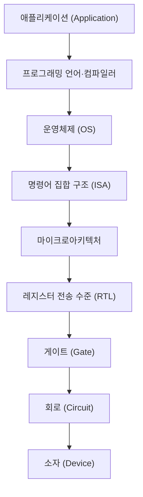
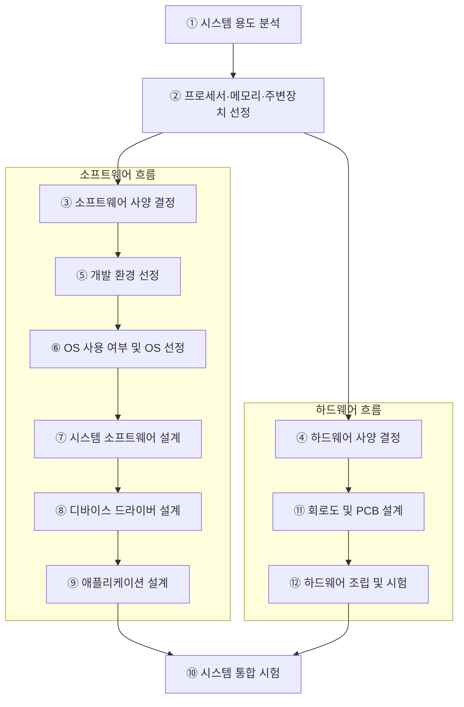
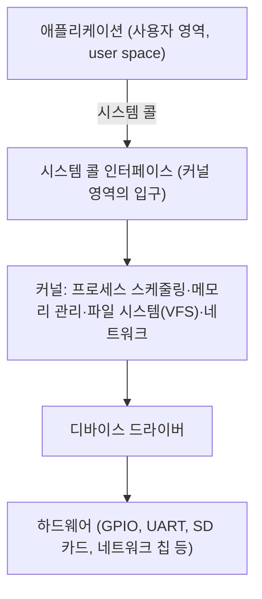
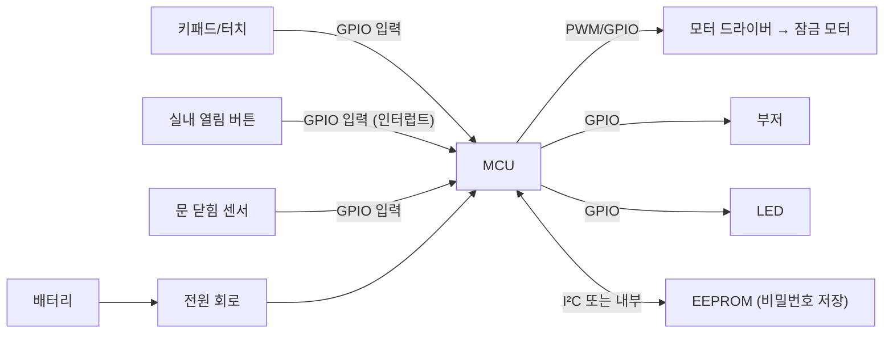
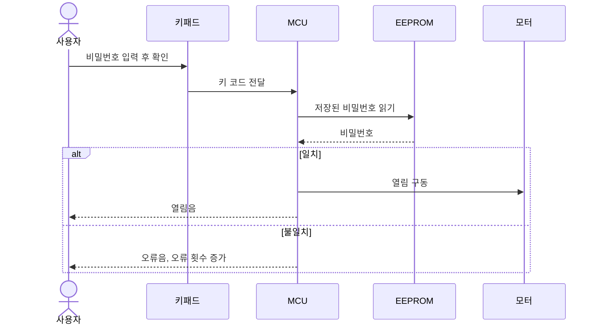
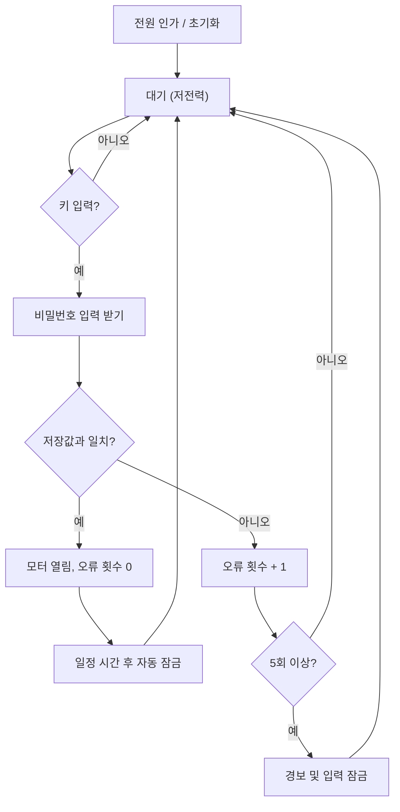
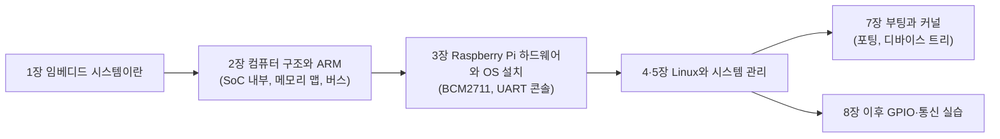
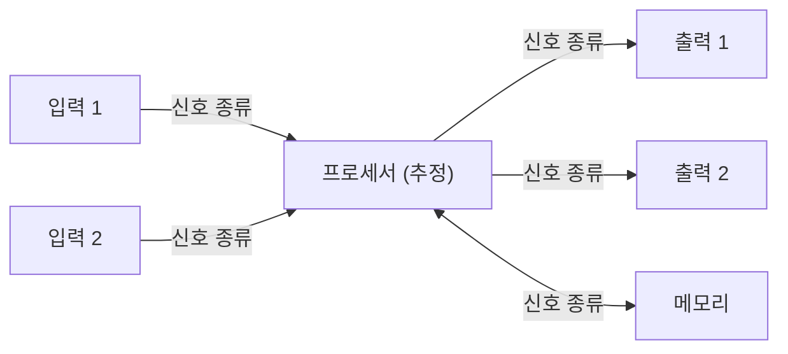

# 1장. 임베디드 시스템이란

> **학습 목표**
> - 임베디드 시스템(embedded system)을 정의하고, 범용 컴퓨터와 무엇이 다른지 설명할 수 있다.
> - 임베디드 시스템을 하드웨어·펌웨어·소프트웨어로 나누어 구성 요소를 말할 수 있다.
> - 실시간(real-time) 시스템의 뜻을 이해하고, 하드 리얼타임과 소프트 리얼타임을 예를 들어 구분할 수 있다.
> - CPU·MCU·DSP·SoC·FPGA·ASIC의 차이를 설명하고 대표 칩을 분류할 수 있다.
> - 임베디드 시스템 설계 절차와 프로세서·메모리 선정 기준을 설명할 수 있다.
> - 베어메탈(bare-metal)과 OS 탑재 방식을 비교하고, 임베디드 OS가 필요한 이유를 말할 수 있다.
> - RTOS와 임베디드 Linux의 특징을 비교하고, 이 과목에서 Raspberry Pi와 Linux를 쓰는 이유를 설명할 수 있다.

이 장은 과목 전체의 지도이다. 여기서 나온 용어들(SoC, 메모리 맵, 커널, 디바이스 드라이버, 실시간성)은 뒤의 장에서 하나씩 자세히 다룬다. 지금은 "어디에 무엇이 있는지"를 파악하는 데 집중하자. 처음 보는 용어는 정의를 외우기보다 **왜 그런 이름이 붙었는지**를 찾아보는 습관을 들이면 좋다. 한국정보통신기술협회(TTA)의 정보통신용어사전 같은 용어 사전을 곁에 두고 찾아보기를 권한다.

---

## 1.1 임베디드 시스템의 정의

### 1.1.1 특정한 목적을 수행하는 컴퓨터

**임베디드 시스템**은 하드웨어와 소프트웨어가 결합되어 **특정한 목적**을 수행하도록 설계된 시스템이다. 특정 기능을 수행하도록 마이크로프로세서와 입출력 장치를 내장하고, 이를 제어하는 프로그램을 함께 탑재한 전자기기·가전제품·제어장치 등이 모두 여기에 속한다.

"시스템"이라는 말이 막연하게 느껴지면 **컴퓨터**로 바꾸어 읽어도 된다. 다만 우리가 매일 쓰는 PC는 워드프로세서도 되고 게임기도 되고 개발 도구도 되는 **범용(general-purpose) 컴퓨터**이다. 반면 임베디드 시스템은 용도가 거의 정해져 있다. 일반인에게 설명할 때는 "웬만한 **전자제품**"이라고 해도 크게 틀리지 않는다. 요즘 전자제품에는 대부분 마이크로컨트롤러가 들어 있기 때문이다.

| 구분 | 범용 컴퓨터(PC) | 임베디드 시스템 |
|---|---|---|
| 목적 | 정해지지 않음(문서 작성, 게임, 개발 등 대부분의 작업) | 미리 정해진 특정 기능 |
| 하드웨어 | 범용 CPU + 넉넉한 메모리·저장장치 | 목적에 필요한 것만 넣은 최적화된 하드웨어 |
| 비용 | 상대적으로 비싸다(수십만 원 이상) | 필요한 기능만 넣어 싸게 만든다(MCU는 수천 원 수준도 많다) |
| 겉모습 | 모니터·키보드·본체가 있어 컴퓨터로 보인다 | 제품 안에 숨어 있어 컴퓨터로 보이지 않는다 |
| 예 | 데스크톱, 노트북 | 도어락, 세탁기, 공유기, 자동차 제어기, 키오스크 |

**embedded**는 "박혀 있는, 내장된"이라는 뜻이다. 밥솥이나 신호등을 보면서 "컴퓨터가 들어 있다"고 생각하는 사람은 드물다. 겉모양은 컴퓨터가 아니지만 안에 컴퓨터가 내장되어 일을 한다는 뜻에서 이런 이름이 붙었다.

### 1.1.2 경계가 늘 분명하지는 않다

임베디드 시스템과 범용 컴퓨터의 경계는 생각보다 흐릿하다. 음식점의 **키오스크**를 보자. 화면이 있고, 터치 입력이 있고, 내부에서 연산을 한다. 겉으로 보면 컴퓨터와 다를 바가 없다. 실제로 일반 PC를 그대로 넣고 주문 프로그램만 돌리는 키오스크도 꽤 많다. 개발 환경이 편하기 때문이다. 같은 기능을 전용 임베디드 하드웨어로 다시 설계하면 단가를 훨씬 낮출 수 있다.

반대 방향의 예도 있다. USB 메모리 안에는 플래시 메모리와 간단한 제어 회로만 있어 보통 임베디드 시스템이라고 부르지 않는다. 그러나 여기에 시계나 만보기 기능을 넣으면 그것은 임베디드 시스템이 된다. 정리하면, 하나의 정답 정의를 외우기보다 <strong>"범용이 아니라 특정 목적에 맞추어 하드웨어와 소프트웨어를 함께 설계했는가"</strong>를 기준으로 판단하면 된다.

### 1.1.3 단일 칩 컴퓨터, 마이크로컨트롤러

과거의 임베디드 시스템은 CPU, 메모리, 입출력 칩을 보드 위에 따로 배치했다. 지금은 CPU·메모리·입출력 모듈을 하나의 칩에 모은 <strong>마이크로컨트롤러(microcontroller, MCU, µC)</strong>가 흔하다. 이런 칩을 <strong>단일 칩 컴퓨터(single-chip computer)</strong>라고도 한다. MCU 한 개가 그 자체로 하나의 임베디드 시스템이 될 수 있다.

### 1.1.4 관련 용어: 유비쿼터스, IoT, IoE, 웨어러블

임베디드 시스템과 함께 유행했던 용어들이 있다. 흐름을 알아 두면 기사나 자료를 읽을 때 도움이 된다.

| 용어 | 뜻 |
|---|---|
| 유비쿼터스 컴퓨팅(ubiquitous computing) | "어디에나 존재한다"는 라틴어에서 온 말. 사용자가 네트워크나 컴퓨터를 의식하지 않고 장소에 상관없이 접속할 수 있는 환경. 1990년대 후반~2000년대에 많이 쓰였다 |
| 사물인터넷(IoT, Internet of Things) | 사물에 컴퓨터와 통신 기능을 넣어 서로 연결하는 것 |
| IoE(Internet of Everything) | 사물을 넘어 모든 것을 연결한다는 확장 개념 |
| 웨어러블 컴퓨터(wearable computer) | 스마트워치, 스마트 의류처럼 몸에 지니는 컴퓨터 |

컴퓨터와 사람의 관계도 바뀌어 왔다. 메인프레임 시대(1대의 컴퓨터를 여러 사람이 공유) → PC 시대(1인 1대) → 모바일 시대(1인이 여러 대) → 사물 간 연결(사람 + 컴퓨터 + 사물) 순서로 컴퓨터가 점점 작아지고 많아지며 눈에 보이지 않게 되었다. 그 대부분이 임베디드 시스템이다.

<!-- 그림 필요: 「임베디드 시스템의 이해」 slides의 컴퓨팅 발전 타임라인(메인프레임·서버 ~1980 → PC ~2000 → 모바일·정보가전 ~2010 → Things that Think·Wearable ~2020) -->

---

## 1.2 응용 분야

전자장치가 들어가는 거의 모든 곳에 임베디드 시스템이 있다. 우리가 가장 흔히 보는 것은 가전이지만, 공장·항공·의료처럼 평소에 볼 기회가 적은 분야에도 많이 쓰인다.

| 분야 | 예 |
|---|---|
| 정보 가전 | 세탁기, 오디오, 인터넷 냉장고, 디지털 TV, 밥솥 |
| 제어 | 공장 자동화, 가정 자동화, 로봇 제어, 공정 제어 |
| 정보 단말 | 휴대전화, 스마트폰, 내비게이션, 디지털 카메라 |
| 네트워크 기기 | 교환기, 라우터, 공유기, 홈 게이트웨이(아파트 월패드), 네트워크 허브 |
| 게임 기기 | 가정용 게임기, 지능형 장난감 |
| 항공·군용 | 비행기, 우주선, 로켓, 위성, 야전 이동 단말(GPS) |
| 물류·금융 | ATM, RFID 단말, 버스 카드 단말기, 물류 단말 |
| 차량·교통 | 자동차 전자제어, 지능형 교통 시스템(ITS), 신호등 제어 |
| 사무·의료 | 전화기, 프린터, 심박 조율기(pacemaker), 수술 로봇 |

예전에는 PDA, MP3 플레이어, 내비게이션, 디지털 카메라가 각각 따로 있었지만 지금은 대부분 스마트폰 하나에 들어갔다. 기능이 합쳐지는 **컨버전스(convergence)** 덕분에 임베디드 시스템에 탑재되는 애플리케이션도 점점 많아지고 있다.

임베디드 시스템을 만들려면 회로이론, 전자회로, 디지털 논리, 프로그래밍 언어, 통신, 신호 및 시스템 등 지금까지 배운 거의 모든 과목이 필요하다. 거꾸로 말하면 **배운 것을 모두 활용해 볼 수 있는 분야**이다. 여기에 한 가지가 더 필요하다. 의료기기를 만들려면 의료를, 항공기 장비를 만들려면 항공을 알아야 한다. 즉 **응용 분야의 도메인 지식**이 함께 요구된다. 웹·앱 개발자가 업무 흐름과 데이터베이스를 알면 개발할 수 있는 것과 비교하면, 임베디드 개발자가 알아야 할 범위는 훨씬 넓다.

---

## 1.3 임베디드 시스템의 구성: 하드웨어·펌웨어·소프트웨어

### 1.3.1 세 가지 "웨어"

영어 **ware**는 "물건, 제품"이라는 뜻이다. 컴퓨터 분야에서는 단단함의 정도에 따라 세 가지로 나누어 생각하면 편하다.

| 구분 | 뜻 | 예 |
|---|---|---|
| 하드웨어(hardware) | 눈에 보이고 만질 수 있는 물리적 구성품 | 프로세서, 메모리, 센서, 모터, 보드 |
| 펌웨어(firmware) | 하드웨어에 밀착되어 하드웨어를 직접 제어하는 소프트웨어. 하드(hard)보다는 덜 단단하지만 소프트(soft)보다는 단단하다(firm) | MCU 제어 프로그램, PC의 BIOS/UEFI |
| 소프트웨어(software) | 형태가 없는 프로그램 전체 | 운영체제, 응용 프로그램 |

PC에도 펌웨어가 있다. 전원을 켜면 OS보다 먼저 메인보드의 **BIOS(Basic Input/Output System)** 또는 **UEFI**가 실행되어 메모리·디스크 같은 기본 하드웨어를 점검하고 OS를 불러온다. 이것이 PC의 대표적인 펌웨어이다. 과거 BIOS는 한 번 기록하면 바꿀 수 없는 ROM에 들어 있었지만, 지금은 플래시 메모리에 들어 있어 업데이트할 수 있다. 부팅 과정은 [7장](07_boot_kernel.md)에서 자세히 다룬다.

임베디드 시스템을 "하드웨어 + 펌웨어"의 조합으로 보는 시각도 있다. 다만 펌웨어의 수준은 시스템마다 크게 다르다. MCU의 레지스터를 직접 다루는 펌웨어가 있는가 하면, OS가 많은 것을 대신해 주어 하드웨어를 잘 몰라도 소프트웨어만으로 제어할 수 있는 시스템도 있다. 이 과목에서 쓰는 Raspberry Pi는 Linux가 올라가므로 후자에 가깝다.

### 1.3.2 하드웨어와 소프트웨어의 구성 요소

| 구분 | 구성 요소 |
|---|---|
| 하드웨어 | 프로세서(컨트롤러), 메모리 장치(ROM, RAM), 입출력 장치(네트워크 장치, 센서, 구동기(actuator) 등) |
| 소프트웨어 | 운영체제(OS), 시스템 소프트웨어, 응용 소프트웨어, 디바이스 드라이버 |

소프트웨어는 크게 **시스템 소프트웨어**와 **응용 소프트웨어**로 나뉜다. 펌웨어, 디바이스 드라이버, 유틸리티는 시스템 소프트웨어이고, 문서 편집기나 게임은 응용 소프트웨어이다. OS 없이 MCU를 직접 다루는 프로그램은 시스템 소프트웨어에 가깝다. 반면 프로그래밍 언어를 배우는 것 자체는 소프트웨어 개발이 아니다. 그 언어로 게임이나 편집기 같은 무언가를 만들어야 응용 소프트웨어가 된다.

<strong>디바이스 드라이버(device driver)</strong>도 프로그램이다. 보드를 PC의 USB에 꽂으면 장치 관리자에 직렬 포트(COM 포트)가 잡히는데, 이것이 가능한 이유는 PC에 USB-직렬 변환용 디바이스 드라이버가 설치되어 있기 때문이다. 드라이버 개발은 하드웨어 지식이 꼭 필요한 일이어서, 전자공학 전공자에게 경쟁력이 있는 분야이다.

요즘은 시스템에서 소프트웨어의 비중이 계속 커지고 있다. 스마트폰 하드웨어 하나 위에 수많은 앱이 올라가듯이, 하드웨어와 애플리케이션 **사이**에서 해야 할 일(드라이버, 플랫폼, 시스템 소프트웨어)이 매우 많다. 이 일은 하드웨어를 아는 사람이 잘할 수 있고, 할 줄 아는 사람이 많지 않아 수요도 많다.

---

## 1.4 임베디드 시스템의 특징

| 특징 | 설명 |
|---|---|
| 특정 기능 수행 | 수행할 기능이 미리 정해져 있다. 범용 시스템이 아니다 |
| 소형·경량·저전력 | 휴대용(portable) 기기가 많고, 배터리로 동작하면 전력 소모가 곧 사용 시간이다. 항공기·자동차처럼 콘센트에 꽂지 않고 자체 전원으로 동작하는 시스템도 마찬가지이다 |
| 가격에 민감 | 같은 기능이면 싸야 팔린다. 대량 생산하면 부품 하나의 몇백 원 차이도 크다 |
| 높은 안정성·신뢰성 | PC는 멈추면 껐다 켜면 되지만, 의료기기·항공기·통신 장비는 한 번의 장애가 치명적이다 |
| 실시간성 | 정해진 시간 안에 반응해야 하는 시스템이 많다(1.5절) |

여기서 **도어락**을 예로 들어 보자. 도어락에는 아날로그 신호를 측정하는 ADC가 필요 없다. 버튼(또는 정전식 터치) 입력, 비밀번호 저장, 모터 구동만 있으면 된다. 필요 없는 기능을 모두 빼면 **가격이 내려가고, 시스템이 단순해져 안정성도 높아진다.** "필요한 것만 넣는다"는 원칙이 위 표의 특징 대부분을 설명한다. 이 장에서는 도어락을 계속 예제로 사용한다.

---

## 1.5 실시간 시스템

### 1.5.1 실시간은 "빠르다"가 아니라 "제시간에"이다

PC에서 한글을 입력하다 보면 가끔 화면이 입력을 못 따라올 때가 있다. 문서 작성에서는 참을 만하지만, 자동차 **에어백**이 터져야 할 순간에 이런 지연이 생기면 안 된다.

**실시간(real-time) 시스템**은 주어진 입력 조건을 **주어진 시간 안에** 처리하는 시스템이다. 흔히 "실시간 = 매우 빠름"으로 오해하는데, 핵심은 속도가 아니라 **마감 시간(deadline)을 지키는 것**이다. 그리고 그 "주어진 시간"은 응용에 따라 다르다.

| 시스템 | 요구되는 반응 시간의 감각 |
|---|---|
| 미사일·모터 제어 | 마이크로초(µs) 단위 |
| 에어백 | 밀리초(ms) 단위 |
| 키오스크·도어락 버튼 | 0.1초 정도면 사용자는 "바로 반응했다"고 느낀다 |
| 음성 통화 | 약간의 지연은 견딜 수 있다 |

키오스크 버튼이 0.1초 뒤에 반응해도 정해진 시간 안에 처리했다면 그것도 실시간 시스템이다.

### 1.5.2 하드 리얼타임과 소프트 리얼타임

| 구분 | 의미 | 예 |
|---|---|---|
| 하드 리얼타임(hard real-time) | 시간 제약이 보장되지 않으면 시스템에 **치명적인 오류**가 생긴다. 마감을 한 번이라도 놓치면 실패이다 | 대부분의 제어용 기기, 공장 자동화, 반도체 공정 장비, 자동차 안전 장치, 무기 |
| 소프트 리얼타임(soft real-time) | 주어진 시간 안에 결과를 내지 못해도 **시스템 전반에 큰 영향이 없다**. 품질이 조금 나빠질 뿐이다 | 네트워크 장비, 음성·영상 스트리밍 |

같은 기능이라도 하드 리얼타임으로 만들면 **비용이 올라간다.** 더 빠른 프로세서, 검증된 RTOS, 더 많은 시험이 필요하기 때문이다. 실무에서 만나는 시스템의 상당수는 소프트 리얼타임이다. 따라서 설계할 때는 "이 기능이 마감을 놓치면 무슨 일이 생기는가?"를 먼저 묻고, 꼭 필요한 부분에만 하드 리얼타임을 적용한다.

### 1.5.3 결정론적 동작

실시간 시스템에서 중요한 것은 **평균** 응답 시간이 아니라 **최악의 경우(worst case)** 응답 시간이다. 평균 1ms에 반응하더라도 1만 번에 한 번 50ms가 걸린다면, 마감이 10ms인 하드 리얼타임 시스템에서는 쓸 수 없다. 같은 입력에 대해 언제나 예측 가능한 시간 안에 반응하는 성질을 **결정론적(deterministic) 동작**이라고 한다. RTOS가 존재하는 이유가 바로 이 결정론을 보장하기 위해서이다(1.12절).

---

## 1.6 전자공학의 추상화 계층에서 본 임베디드 시스템

전자공학의 대표적인 산물은 컴퓨터이다. 컴퓨터는 아래와 같은 <strong>추상화 계층(abstraction layer)</strong>으로 나누어 볼 수 있다. 아래로 갈수록 물리에 가깝고, 위로 갈수록 추상적이다.



<!-- 그림 필요: 2025 W4 강의에서 사용한 전자공학 추상화 계층 그림(컴퓨터 아키텍처 영역을 분홍색으로 표시한 원본) -->

이 그림은 외울 대상이 아니라 **지금 배우는 과목들이 어디에 위치하는지** 보여 주는 지도이다. 반도체 소자는 맨 아래, 칩 설계는 게이트·RTL 부근, 디지털 논리와 마이크로컨트롤러는 RTL~ISA 부근, 이 과목은 ISA~애플리케이션에 걸쳐 있다.

### 1.6.1 명령어는 제어 신호의 묶음이다

우리는 ISA를 직접 만들지 않고 **활용**한다. 그 활용의 단위가 <strong>레지스터(register)</strong>이다. C 코드는 컴파일러를 거쳐 어셈블리로 바뀌고, 어셈블리의 각 줄은 명령어(instruction)에 대응한다.

그렇다면 명령어는 하드웨어에서 무엇인가? 디지털 논리에서 배운 **직렬 입력-병렬 출력(SIPO) 시프트 레지스터**를 떠올려 보자. 데이터를 4비트 넣으려면 클록을 4번 주어야 하고, 다 차면 출력 제어 신호를 주어야 한다. 칩을 설계할 때 "클록 4번 + 출력 신호 Low"라는 동작 전체를 **하나의 명령**으로 정의하면, 그 명령은 해당 제어 신호들을 순서대로 만들어 내는 회로까지 포함하게 된다. 즉 **명령어 = 하드웨어 제어 신호의 묶음**이고, 이런 명령어들의 모음이 <strong>명령어 집합(instruction set)</strong>이다.

하드웨어는 고정되어 있고, 그 위에서 명령어로 동작을 구성한다. 매번 기계어로 프로그램을 짤 수 없으므로 OS와 프로그래밍 언어가 올라간다. 알고리즘은 특정 계층에 속한다기보다 모든 계층에 두루 쓰인다.

임베디드 시스템도 이 계층 구조는 똑같다. 다른 점은 맨 위의 애플리케이션이 **특정 목적의 애플리케이션**이고, 맨 아래 하드웨어도 **그 목적에 최적화된 하드웨어**라는 것이다.

---

## 1.7 프로세서의 종류: XPU 토폴로지

### 1.7.1 큰 분류

프로세서와 가속기는 이름 끝이 "PU"인 경우가 많아 묶어서 XPU라고 부르기도 한다. 강의 자료의 분류를 정리하면 다음과 같다.

| 분류 그룹 | 해당 프로세서·가속기 | 실리콘 회로의 성격 | 실무적 가치 |
|---|---|---|---|
| 시스템 제어 | CPU, MCU | 범용, 고정된 하드웨어 | 시스템 전체 통제, OS 실행 환경 |
| 특수 데이터 처리 | DSP, DPU | 특정 데이터 처리에 맞춘 고정 회로 | 실시간 신호 처리, 네트워크 병목 제거 |
| 병렬 연산·AI | GPU, NPU, TPU, LPU | 행렬·벡터 연산 가속 고정 회로 | 딥러닝 학습·추론 가속 |
| 반도체 플랫폼 | SoC, FPGA, ASIC | 프로세서들을 집적하거나 회로를 구성하는 물리적 방식 | 최종 상용화, 하드웨어 가변성 확보 |

마지막 줄의 SoC·FPGA·ASIC은 위의 프로세서들과 **차원이 다르다**는 점에 주의하자. CPU·GPU·MCU는 "무엇을 하는 회로인가"에 따른 이름이고, SoC·FPGA·ASIC은 "회로를 어떤 방식으로 칩에 구현했는가"에 따른 이름이다. 그래서 넓게 보면 CPU, GPU, MCU도 모두 ASIC(특정 용도용 IC)으로 만든 것이다.

### 1.7.2 종류별 설명과 대표 칩

| 종류 | 설명 | 대표 예 |
|---|---|---|
| CPU (Central Processing Unit) | 명령을 해석하고 데이터 연산을 수행하는 컴퓨터의 중심. 범용 프로세서 | Intel Core i7, AMD Ryzen, Apple M1 |
| GPU (Graphics Processing Unit) | 대량의 병렬 연산(행렬·컨볼루션)에 강하다. 그래픽에서 출발해 지금은 AI 연산의 중심 | NVIDIA GeForce 계열 |
| MCU (Microcontroller Unit) | CPU·메모리·입출력 포트·타이머 등을 한 칩에 집적한 소형 컴퓨터 | STMicroelectronics STM32F103, Microchip PIC16F877A, NXP LPC1768 |
| DSP (Digital Signal Processor) | 디지털 신호 처리(오디오·영상·통신)에 특화된 고속 연산 프로세서 | TI TMS320C67x, Analog Devices ADSP-BF706, Qualcomm Hexagon DSP |
| SoC (System on Chip) | 시스템 전체 기능(CPU, GPU, 메모리 컨트롤러, 입출력, 네트워크 등)을 한 칩에 집적 | Qualcomm Snapdragon 888, Apple A15 Bionic, NVIDIA Jetson Xavier NX, **Broadcom BCM2711 (Raspberry Pi 4)** |
| FPGA (Field-Programmable Gate Array) | 사용자가 하드웨어 논리를 직접 설계해 프로그래밍하는 칩. 시제품이나 맞춤 하드웨어에 쓴다 | AMD(Xilinx) Spartan-7, Intel(Altera) Cyclone V, Lattice ECP5, Intel(Altera) Stratix 10 |
| ASIC (Application-Specific IC) | 특정 응용을 위해 맞춤 설계한 IC. 대량 생산 시 성능·효율이 최고지만 설계 후 변경할 수 없다 | Google TPU, Bitmain Antminer S19의 채굴 칩, Apple W1 무선 칩 |

> 📌 보강: 원본 슬라이드는 Intel Stratix 10 GX를 ASIC 예로 들었으나, Stratix 10은 Intel(현 Altera)의 **고성능 FPGA** 제품군이므로 FPGA 행으로 옮겼다. 출처: [Intel Stratix 10 FPGA](https://www.intel.com/content/www/us/en/products/details/fpga/stratix/10.html)
>
> 📌 보강: 원본 슬라이드의 SoC 예 Broadcom BCM2837은 Raspberry Pi 3의 SoC이다. 이 교재의 실습 보드인 Raspberry Pi 4 Model B는 **BCM2711**(Cortex-A72 4코어)을 쓴다. 출처: [Raspberry Pi 공식 문서 – Processors](https://www.raspberrypi.com/documentation/computers/processors.html)

몇 가지 덧붙일 점이 있다.

- **GPU와 DSP**: DSP가 주로 하는 일은 신호의 컨볼루션(필터링)이다. GPU가 이 연산을 대량으로 잘하게 되면서 DSP의 역할을 상당 부분 대체하고 있다. 그래도 저전력·저지연이 중요한 오디오·통신 분야에서는 DSP가 계속 쓰인다. Texas Instruments와 Analog Devices가 대표적인 DSP 회사이다.
- **MCU 회사**: 대표적인 MCU 제조사로 Microchip, STMicroelectronics, NXP가 있다. 이 회사들은 대부분 국내 지사가 있으니 진로를 생각할 때 찾아보기를 권한다.
- **SoC**: 임베디드 시스템은 공간이 제한되어 있어 원칩이 많이 쓰인다. 스마트폰, 태블릿, Raspberry Pi에 들어간 것이 모두 SoC이다. SoC는 보통 수만 대 이상 대량 생산하는 제품을 위해 필요한 기능만 모아 칩으로 만드는 것이어서, 개인이 SoC를 직접 설계할 일은 드물다.
- **FPGA**: 디지털 논리 실습에서 쓴 Intel(Altera) Cyclone 계열 키트가 FPGA이다. 이 과목에서는 FPGA 실습을 하지 않는다.

<!-- 그림 필요: 「임베디드 시스템의 이해」 slides의 XPU Topology 도식(분류 그룹별 배치 그림) -->

### 1.7.3 MCU와 MPU

임베디드 프로세서는 크게 <strong>MCU(마이크로컨트롤러)</strong>와 **MPU(마이크로프로세서, microprocessor unit)** 계열로 나누어 볼 수 있다. MPU는 CPU 코어가 중심이고 대용량 메모리를 바깥에 붙여 쓰는 칩으로, SoC 형태로 나오는 경우가 많다.

| 구분 | MCU | MPU(응용 프로세서 SoC) |
|---|---|---|
| 메모리 | 플래시(프로그램)·SRAM(데이터)이 칩 **안**에 있다. 용량은 KB~수 MB | 수 GB의 DRAM을 칩 **밖**에 붙인다. 프로그램은 SD 카드·eMMC 등에 저장 |
| 프로그램 실행 | 플래시에서 직접 명령을 가져와 실행한다 | 저장장치의 프로그램을 **RAM에 올린 뒤** 실행한다 |
| 메모리 관리 장치(MMU) | 보통 없다 | 있다. 프로세스마다 독립된 메모리 공간을 만들 수 있다 |
| OS | 없음(베어메탈) 또는 소형 RTOS | Linux, Android 같은 범용 OS |
| 클록·성능 | 수십~수백 MHz | 1GHz 이상, 멀티코어 |
| 전력·가격 | 매우 낮다 | 상대적으로 높다 |
| 부팅 | 전원을 켜면 거의 즉시 동작 | 부트로더 → 커널 → 파일 시스템 순서로 수 초 걸린다 |
| ARM 코어 예 | Cortex-M 계열 | Cortex-A 계열 |
| 보드 예 | Raspberry Pi Pico | Raspberry Pi 4 |

> 📌 보강: 일반적인 Linux는 가상 메모리를 위해 MMU가 있는 프로세서를 전제로 한다. MMU가 없는 프로세서용 구성(no-MMU)도 있지만 제약이 많아, 실무에서 MMU가 없는 MCU에는 보통 RTOS나 베어메탈을 쓴다. 출처: [Linux kernel 문서 – No-MMU memory mapping support](https://docs.kernel.org/admin-guide/mm/nommu-mmap.html)

ARM 코어의 계열(Cortex-A·R·M)과 내부 구조는 [2장](02_computer_arch_arm.md)에서 다룬다.

---

## 1.8 임베디드 시스템 설계 절차

### 1.8.1 12단계 절차

여기서 "설계"는 개발·구현까지 포함한다. 임베디드 시스템은 **하드웨어와 소프트웨어를 함께** 설계해야 한다. 강의 자료의 12단계를 하드웨어 흐름과 소프트웨어 흐름으로 나누어 그리면 다음과 같다.



강의에서는 같은 내용을 4단계 표로 요약하기도 했다.

| 단계 | 하드웨어 | 소프트웨어 |
|---|---|---|
| 1 | 하드웨어 사양 결정(프로세서·메모리·주변장치, 요구되는 실시간성) | 소프트웨어 사양 결정(사용 시나리오) |
| 2 | 버스 타입·인터페이스 결정, 회로 설계 | OS 탑재 여부, 실시간성, 라이선스 결정 |
| 3 | PCB 부품 배치·배선, 부품 장착 | 디바이스 드라이버·애플리케이션 개발 |
| 4 | 보드 완성(제품이면 케이스까지 조립) | 탑재(deploy / porting), 통합·검증 |

하드웨어와 소프트웨어는 **병렬로** 진행된다. 보드가 완성될 때까지 소프트웨어 팀이 기다리지 않는다. 프로세서가 정해지면 그 제조사가 파는 <strong>개발 보드(evaluation board)</strong>나 시뮬레이터로 펌웨어 개발을 먼저 시작하고, 보드가 나오면 옮겨 붙인다. 하드웨어와 소프트웨어 모두 처음부터 완벽할 수 없으므로, 양쪽을 오가며 디버깅하면서 완성해 간다. 대부분의 전자기기 개발이 이런 식으로 진행된다.

소프트웨어를 완성된 하드웨어에 올리는 것을 **탑재**라고 한다. MATLAB/Simulink 같은 도구에서는 **배포(deploy)**, OS를 특정 하드웨어에 맞추어 올리는 경우에는 <strong>포팅(porting)</strong>이라는 말을 쓴다.

<!-- 그림 필요: 「임베디드 시스템의 이해」 slides의 '회로 설계', 'PCB 설계', '하드웨어 조립 및 시험' 슬라이드 사진(원본이 이미지뿐) -->

### 1.8.2 프로세서 선정

프로세서는 바로 고르는 것이 아니라 **사양을 먼저 정한 뒤** 고른다.

1. **사양 결정**: 이 일을 하려면 얼마나 빨리 처리해야 하는가? 메모리는 얼마나 쓸 것 같은가? GPIO 핀은 몇 개 필요한가? 어떤 통신(UART, I²C, SPI, Wi-Fi, Bluetooth)이 필요한가?
2. **후보 목록 작성**: 사양을 만족하는 프로세서를 여러 개 찾는다.
3. **비교·결정**: 다음 기준으로 하나를 고른다.

| 기준 | 내용 |
|---|---|
| 제품 특성 | 실시간성, 전력, 크기, 동작 온도 |
| 가격 | 대량 생산하면 단가 차이가 크게 누적된다 |
| 개발의 용이성 | 개발 환경(IDE, 컴파일러, 디버거), 벤더가 주는 라이브러리, 참고 자료 |
| 안정성 | 검증된 칩인가 |
| 제조사의 지원 능력 | 기술 지원, 문서 품질 |
| 수급 | 값이 싸도 1만 개가 필요할 때 1만 개를 받을 수 없다면 쓸 수 없다 |

같은 코어라도 **플래시(ROM)·RAM 용량**에 따라 제품이 여러 개로 나뉜다. 문제는 개발하기 전에는 프로그램 크기를 예측하기 어렵다는 것이다. 이 판단에는 경험이 필요하다. 의사 코드(pseudo code) 수준으로 대략 만들어 크기를 가늠한 뒤 칩을 정하기도 한다.

현실에서는 개발 기간이 짧기 때문에 회사가 **이전에 만든 플랫폼**을 기반으로 개발하는 경우가 많다. 신입 엔지니어는 프로세서를 고르기보다 **남이 만든 코드를 분석**하는 일부터 하게 될 가능성이 높다. 개인 프로젝트라면 **내가 쓰기 편한 것**을 고르는 것도 합리적인 선택이다.

### 1.8.3 주변장치 선정

시스템의 용도에 맞추어 LCD, 터치, 유선 LAN, 무선 LAN, Bluetooth 같은 주변장치를 정한다. 요즘은 터치나 무선통신이 MCU에 내장된 제품도 많으므로, 외장 칩을 붙일지 내장된 칩을 고를지도 판단한다. 대량 생산 제품에서는 필요한 주변장치를 모두 가진 **SoC**를 고르는 것이 일반적이다. 예전에는 PDA 전용 SoC, 인터넷 공유기 전용 SoC처럼 용도별 SoC가 따로 나왔다.

---

## 1.9 메모리 선정

### 1.9.1 ROM과 RAM, 이름의 유래

메모리를 나누는 가장 큰 기준은 **전원이 꺼져도 내용이 남는가**이다.

| 구분 | 휘발성 | 쓰임 |
|---|---|---|
| ROM 계열(비휘발성, non-volatile) | 전원이 꺼져도 유지 | 코드와 고정 데이터 저장 |
| RAM 계열(휘발성, volatile) | 전원이 꺼지면 사라짐 | 프로그램 실행 중 사용하는 데이터 |

그런데 이름을 보면 이상하다. <strong>ROM(Read-Only Memory)</strong>은 "읽기만 하는 메모리"이고 <strong>RAM(Random Access Memory)</strong>은 "임의 접근 메모리"이다. 휘발성과는 관계가 없는 이름이고, 서로 반대말도 아니다. 이런 의문이 들 때는 **역사로 거슬러 올라가 보면** 이유가 보인다.

- **ROM**: 초기 메모리는 공장에서 한 번 기록하면 바꿀 수 없었다. 기록된 값을 읽기만 하므로 "Read-Only"라는 이름이 붙었다. 지금은 여러 번 지우고 쓸 수 있는 플래시도 넓은 의미의 ROM으로 부른다. 즉 오늘날 "ROM"은 사실상 **비휘발성 메모리**를 가리킨다.
- **RAM**: 초기 저장장치에는 자기 테이프가 있었다. 테이프는 원하는 위치의 데이터를 읽으려면 감거나 풀어야 해서, 위치에 따라 접근 시간이 달랐다. 이렇게 순서대로 접근하는 메모리를 <strong>순차 접근 메모리(sequential access memory)</strong>라고 한다. 이와 달리 **어느 주소든 같은 시간에 접근**할 수 있는 메모리가 나오자 "임의(random) 접근"이라는 이름이 붙었다.

ROM 계열은 다음 순서로 발전했다.

| 종류 | 특징 |
|---|---|
| 마스크 ROM(mask ROM) | 제조 공정에서 내용을 기록. 바꿀 수 없다 |
| PROM(Programmable ROM) | 사용자가 전용 장치로 **한 번** 기록할 수 있다 |
| EPROM(Erasable PROM) | 자외선을 쬐어 지우고 다시 기록할 수 있다. 전용 장치가 필요하다 |
| EEPROM(Electrically EPROM) | 전기 신호만으로 바이트 단위로 지우고 쓸 수 있다 |
| 플래시 메모리(flash memory) | 전기로 지우고 쓰되, **블록 단위로 지운다**. 대용량·저가 |

**플래시는 블록 단위로 지운다**는 점을 꼭 기억하자. 비어 있는(지워진) 영역에는 원하는 만큼 쓸 수 있지만, 기록된 값 하나만 지울 수는 없다. 4KB 블록 안의 2바이트만 바꾸려 해도 블록 전체를 읽어 두고, 블록을 지운 뒤, 수정한 내용을 다시 써야 한다. 평소에는 USB 메모리나 SD 카드 내부의 컨트롤러가 이 일을 대신하므로 의식하지 못한다. 그러나 MCU의 내장 플래시에 데이터를 직접 저장하는 프로그램을 짜다 보면 "왜 일부만 안 지워지지?"라는 문제를 만나게 된다.

### 1.9.2 SRAM과 DRAM

RAM은 만드는 방식에 따라 **리프레시(refresh)가 필요한지**로 나뉜다.

| 구분 | SRAM(Static RAM) | DRAM(Dynamic RAM) |
|---|---|---|
| 구조 | 플립플롭으로 1비트를 저장. 셀당 트랜지스터가 많다 | 커패시터에 전하로 1비트를 저장. 셀 구조가 단순하다 |
| 리프레시 | 필요 없다 | 커패시터가 방전되므로 주기적으로 다시 충전해야 한다 |
| 속도 | 매우 빠르다 | 상대적으로 느리다 |
| 집적도·가격 | 집적도가 낮고 비싸다 | 집적도가 높고 싸다 |
| 쓰임 | CPU 캐시(cache), MCU 내장 RAM | PC·Raspberry Pi의 메인 메모리(수 GB) |

이 표를 외울 필요는 없다. 플립플롭은 게이트가 여러 개 들어가니 크고 비싸지만 빠르고, 커패시터는 작아서 많이 넣을 수 있지만 전하가 새니 리프레시가 필요하다. 구조를 알면 나머지 성질은 자연스럽게 따라 나온다. 이렇게 이해한 것은 시험에서 헷갈리지 않는다. "아깝게 틀렸다"는 것은 사실 정확히 몰랐다는 뜻이다.

### 1.9.3 용도에 따른 메모리 선정

강의 자료의 메모리 선정 기준을 정리하면 다음과 같다.

| 용도 | 메모리 | 선정 기준 |
|---|---|---|
| 코드·데이터 저장(ROM) | EEPROM | 소용량. 시스템 동작 중 코드나 데이터를 거의 갱신하지 않는 경우(설정값, 보정값) |
| | NOR 플래시 | 저용량. 동작 중 코드나 데이터 갱신이 가끔 발생하는 경우 |
| | NAND 플래시 | 대용량. 갱신이 빈번하고 많은 데이터를 저장하는 경우(SD 카드, eMMC, SSD) |
| 프로그램 실행(RAM) | SDRAM(DRAM 계열) | 시스템 성능을 좌우하므로 빨라야 한다. 기능에 맞추어 가격 대비 적절한 크기를 고른다 |

> 📌 보강: NOR 플래시는 바이트 단위 임의 읽기가 빨라 칩에서 코드를 직접 실행(XIP, eXecute In Place)하기에 유리하고, NAND 플래시는 페이지·블록 단위로 접근하는 대신 집적도가 높아 대용량 저장에 유리하다. MCU의 내장 플래시가 코드를 직접 실행하는 것, Raspberry Pi가 NAND 기반 SD 카드의 OS를 DRAM에 올려 실행하는 것이 각각의 예이다. 출처: [Linux kernel 문서 – MTD (Memory Technology Device)](https://docs.kernel.org/driver-api/mtd/index.html)

Raspberry Pi 4에 대입하면 OS와 파일은 microSD 카드(NAND 플래시)에, 실행 중인 프로그램은 1~8GB LPDDR4 SDRAM에, CPU 캐시는 SoC 내부의 SRAM에 있다. 메모리 계층 구조는 [2장](02_computer_arch_arm.md)에서 자세히 다룬다.

---

## 1.10 입출력 장치 제어와 버스

### 1.10.1 메모리 맵 I/O와 I/O 맵 I/O

프로세서가 입출력 장치를 제어하려면 장치에 **주소**를 할당하고, 데이터 버스와 제어 신호로 값을 주고받아야 한다. 주소를 어떻게 할당하느냐에 따라 두 가지 방식이 있다.

| 방식 | 설명 | 예 |
|---|---|---|
| I/O 맵 방식(I/O-mapped I/O, isolated I/O) | 입출력 장치 전용 주소 공간을 따로 두고, 전용 명령어와 제어 신호로 접근한다 | Intel x86 계열(`IN`, `OUT` 명령) |
| 메모리 맵 방식(memory-mapped I/O) | 메모리 주소 공간의 일부를 입출력 장치에 할당하고, 일반 메모리처럼 읽고 쓴다 | 대부분의 임베디드 프로세서(ARM 등) |

메모리 맵 방식에서는 주변장치의 **레지스터**가 특정 주소에 놓여 있다. 그 주소에 값을 쓰면 핀이 High가 되고, 그 주소를 읽으면 핀의 상태를 알 수 있다. 메모리를 다루는 명령만으로 주변장치를 제어할 수 있으므로 명령어 집합이 단순해진다. C 언어의 **포인터**가 하드웨어 제어에 그토록 중요한 이유도 여기에 있다.

> 📌 보강: Raspberry Pi 4의 BCM2711 데이터시트는 GPIO·UART·SPI 같은 주변장치 레지스터 주소를 `0x7E00_0000`부터 시작하는 버스 주소로 표기한다. 즉 Raspberry Pi도 메모리 맵 방식을 쓴다. 이 주소가 CPU에서 실제로 어떤 주소로 보이는지는 2장에서 다룬다. 출처: [BCM2711 ARM Peripherals](https://datasheets.raspberrypi.com/bcm2711/bcm2711-peripherals.pdf)

### 1.10.2 버스

<strong>버스(bus)</strong>는 고속 SRAM, DMA 제어기, 타이머, UART 등 빠르고 느린 여러 모듈의 신호를 공유하도록 만든 신호의 집합이다. CPU 같은 구동 주체가 버스를 통해 장치에 데이터를 읽거나 쓴다.

버스는 단순한 전선 다발이 아니다. 데이터 라인뿐 아니라 **제어 라인**과, 언제 어떤 순서로 주고받을지 정한 <strong>규약(protocol)</strong>까지 포함한다. ARM 계열 SoC에서는 **AMBA**라는 버스 규격을 쓰며, 그 안에 고속용 AXI·AHB와 저속 주변장치용 APB가 있다. 같은 ARM 코어에 AMBA 버스로 서로 다른 주변장치를 붙여 다양한 SoC를 만든다. 그래서 BCM2711 데이터시트에는 ARM 코어 설명이 거의 없고 주변장치 설명이 대부분이다.

MCU처럼 원칩이 아닌 시스템을 설계할 때는 메모리와 주변장치를 어떤 버스 타입으로 연결할지도 정해야 한다. AMBA 버스와 메모리 맵의 자세한 내용은 [2장](02_computer_arch_arm.md)에서 다룬다.

---

## 1.11 OS를 쓸 것인가: 베어메탈과 임베디드 OS

### 1.11.1 소프트웨어 사양에서 결정할 것

소프트웨어 사양을 정할 때 결정할 일은 다음과 같다.

- **OS 사용 여부**: OS가 필요한가? 필요하다면 실시간성과 시스템 메모리 크기를 고려해 어떤 OS를 쓸 것인가?
- **소프트웨어 개발 방식**: 개발 시간, 난이도, 비용에 따라 직접 개발할지 외주를 줄지 정한다.
- **라이선스(license)**: 소프트웨어의 사용 권한과 제한 사항을 확인한다. 가장 골치 아픈 문제 중 하나이다. OS나 코덱(MPEG, MP3 등)이 유료라면 대당 비용은 작아도 **많이 생산할수록 부담이 커진다.**

이 가운데 OS 사용 여부가 개발 방식을 가장 크게 바꾼다.

### 1.11.2 베어메탈: 1인 분식집 사장님

OS 없이 하드웨어 위에서 프로그램이 바로 동작하는 방식을 <strong>베어메탈(bare-metal)</strong>이라고 한다. "아무것도 덮이지 않은 금속"이라는 뜻이다. 베어메탈 프로그램은 대개 초기화를 한 번 하고, 무한 루프 안에서 정해진 일을 차례로 반복한다. 이런 구조를 <strong>슈퍼루프(super loop)</strong>라고 부른다. 아래 코드는 구조를 보여 주기 위한 의사 코드로, 함수 본체가 없어 그대로 컴파일되지는 않는다.

```c
/* 의사 코드: 베어메탈 슈퍼루프의 구조 (컴파일용 아님) */
int main(void)
{
    init_hardware();          /* 초기 설정: 딱 한 번 */

    while (1) {               /* 무한 반복 */
        int t = read_temperature();   /* 1. 온도 센서 값을 읽는다 */
        lcd_show(t);                  /* 2. LCD에 온도를 표시한다 */
        delay_ms(1000);               /* 3. 1초 기다린다 */
    }
}
```

이 방식은 **혼자서 모든 일을 순서대로 처리하는 1인 분식집 사장님**과 같다. 주문받기 → 요리하기 → 서빙하기 → 계산하기 → 설거지하기 → 다시 주문받기. 메뉴가 한두 개뿐인 작은 가게라면 이 방식이 가장 효율적이다. 디지털 온도계, 간단한 디지털 시계, 전자레인지처럼 정해진 일만 반복하는 시스템에는 굳이 OS가 필요 없다. 구조가 단순하고, 다음에 무엇이 실행될지 **예측 가능**하다는 것이 큰 장점이다.

하지만 손님이 몰리고 메뉴가 늘어나면 한계가 드러난다. 요리하는 동안에는 주문을 받을 수 없다. 위 코드도 `delay_ms(1000)` 동안 버튼 입력을 놓칠 수 있다. 여러 일을 **동시에** 처리하는 것, 즉 <strong>멀티태스킹(multitasking)</strong>을 베어메탈로 직접 구현하기는 매우 어렵다.

### 1.11.3 임베디드 OS: 대형 레스토랑 총지배인

OS는 **여러 명의 전문 요리사(태스크, task)에게 일을 나누어 주고 감독하는 대형 레스토랑의 총지배인**과 같다. 총지배인이 하는 핵심 역할은 세 가지이다.

1. **멀티태스킹**: 총지배인은 요리사들에게 아주 짧은 시간(예: 0.01초)씩 번갈아 일을 시킨다. "A 요리사, 0.01초 동안 재료 손질!", "B 요리사, 0.01초 동안 소스 끓이기!" 전환이 워낙 빨라서 밖에서 보면 모두가 동시에 일하는 것처럼 보인다.
2. **우선순위 기반 스케줄링(priority-based scheduling)**: 손님이 물을 쏟아 바로 닦아야 하는 긴급 상황과 주방 바닥 청소 같은 일상 업무가 있으면, 총지배인은 긴급 상황을 먼저 처리하게 한다.
3. **자원 관리(충돌 방지)**: 화구가 하나뿐이라면 A와 B가 동시에 쓰려고 다투지 않도록 교통정리를 한다.

여기서 헷갈리지 말아야 할 점이 두 가지 있다.

- 코어가 하나인 CPU의 멀티태스킹은 진짜 동시 실행이 아니라 <strong>시분할(time sharing)</strong>이다. CPU가 A 일을 잠깐, B 일을 잠깐, C 일을 잠깐 돌아가며 처리할 뿐이다. 요즘 CPU는 코어가 여러 개라 실제로 동시에 실행하기도 하지만, 원리는 같다.
- **물리적인 하드웨어가 하나이면 두 곳에서 동시에 쓸 수 없다.** A 태스크가 어떤 자원을 쓰는 동안 B는 기다리게 해야 한다. OS가 이를 관리해 주지만, 개발자도 어느 정도 규칙을 지켜야 한다. 이 문제는 [11장](11_process_concurrency.md)에서 mutex와 semaphore로 직접 다룬다.

OS는 이 밖에도 디스플레이, 키보드, 네트워크처럼 **표준적이고 반복적인 장치 처리**를 대신 맡아 준다.

### 1.11.4 스마트 TV의 예

스마트 TV에 OS의 세 가지 역할을 대입해 보자.

| 역할 | 스마트 TV에서 |
|---|---|
| 멀티태스킹 | [영상 처리], [리모컨 확인], [시간 표시] 등의 태스크에 아주 짧은 CPU 시간을 번갈아 할당한다. 영상이 끊김 없이 재생되면서도 리모컨이 즉시 반응하는 "동시 실행"이 가능해진다 |
| 우선순위 스케줄링 | 사용자가 누른 **전원 끄기** 버튼은 스트리밍 영상 데이터 처리보다 우선순위가 높다. 그렇지 않으면 영상이 끝나야 전원이 꺼지는 일이 생긴다 |
| 자원 관리 | 여러 태스크가 동시에 오디오 스피커나 네트워크 칩을 쓰려 할 때 OS가 중재한다. 영상의 소리가 나오는 동안 알람 소리를 섞을지 막을지도 정해야 한다 |

### 1.11.5 정리: 베어메탈과 OS 탑재 비교

| 구분 | OS 없음(베어메탈) | 임베디드 OS 탑재 |
|---|---|---|
| 비유 | 1인 분식집 사장님 | 대형 레스토랑 총지배인 |
| 규모·업무 | 작고 단순하다 | 크고 복잡하다 |
| 작업 방식 | 순차적, 단일 흐름(`while(1)`) | 동시성, 멀티태스킹 |
| 장점 | 구조가 단순하고 반응을 예측하기 쉽다 | 복잡한 작업을 효율적으로 관리한다. 우선순위 조절, 자원 충돌 방지, 표준 장치 처리 |
| 단점 | 복잡한 동시 작업을 처리하기 어렵다 | 구조가 복잡하다. CPU·메모리 자원이 더 필요하고, 라이선스를 따져야 한다 |
| 적합한 예 | 디지털 온도계, 세탁기, 전자레인지 | 스마트폰, 자동차, 스마트 TV, IoT 기기, Raspberry Pi |

뒤집어 보면 **OS가 해야 할 일**이 무엇인지도 알 수 있다. Windows든 Linux든 Android든 OS의 가장 중요한 일은 멀티태스킹과 자원을 잘 나누어 운영하는 것이다.

과거에는 임베디드 시스템에 OS를 거의 올리지 않았다. OS를 돌릴 만큼 CPU와 메모리가 넉넉하지 않았기 때문이다. 지금은 사정이 다르다.

- 시스템이 커지면서 **멀티태스킹**이 필요해졌다.
- 네트워킹, GUI, 오디오, 비디오가 시스템의 기본 요소가 되었다.
- 실시간성의 중요성이 커졌다.
- 기능이 많아지고 복잡해져 순차적인 프로그램으로는 감당할 수 없게 되었다.
- **CPU 성능이 좋아져** OS를 올리는 부담이 줄었고, 작고 가벼운 OS도 많아졌다.

예를 들어 스마트워치를 만든다고 하자. 시계, 알림, 심박 측정, 블루투스 연결 같은 기본 기능을 펌웨어로 하나하나 만들면 시간이 오래 걸리고 어렵다. 이럴 때는 워치용 OS를 쓰기로 결정하는 것이 합리적이다. 그래서 요즘은 임베디드 시스템이라고 하면 **OS를 탑재한 상태에서** 개발하는 경우가 많고, 어떤 OS를 쓰느냐에 따라 개발 방식이 크게 달라진다.

---

## 1.12 임베디드 OS의 선택: RTOS와 임베디드 Linux

### 1.12.1 OS 구조: 커널, 시스템 콜, 디바이스 드라이버

OS의 핵심 기능을 담당하는 부분을 <strong>커널(kernel)</strong>이라고 한다. OS 위의 애플리케이션은 하드웨어를 직접 건드리지 못한다. 그 이유가 아래 구조에 있다.



<!-- 그림 필요: 「임베디드 시스템의 이해」 slides의 '디바이스 드라이버 구조(Virtual File System)' 그림 -->

- 애플리케이션이 접근할 수 있는 것은 <strong>시스템 콜 인터페이스(system call interface)</strong>까지이다. 이것이 커널 영역의 입구이다.
- 커널 안에서 하드웨어와 맞닿는 부분이 **디바이스 드라이버**이다. 드라이버는 실제 장치를 추상화하여, 사용자 프로그램이 정해진 인터페이스로 장치에 접근하게 해 준다. 덕분에 애플리케이션을 하드웨어와 독립적으로 작성할 수 있다.
- MCU에서는 모터를 붙이면 포트 레지스터를 직접 제어했다. OS가 올라가면 반드시 OS를 거쳐야 한다. 이것이 베어메탈 개발과 OS 위 개발의 가장 큰 차이이다.

OS를 새로운 하드웨어에서 동작하게 만드는 작업을 <strong>커널 포팅(kernel porting)</strong>이라고 한다. 프로세서, 메모리, 예외(trap/exception), 인터럽트, 타이머를 그 하드웨어에 맞추어 OS의 스케줄러가 정상 동작하게 하는 일이다. 포팅하는 개발자는 하드웨어와 소프트웨어를 모두 알아야 한다. 요즘은 반도체·SoC 회사가 커널을 포팅해서 제공하는 추세이다. Raspberry Pi도 재단이 포팅한 Linux 커널을 제공한다. 직접 커널을 빌드하고 교체하는 실습은 [7장](07_boot_kernel.md)에서 한다.

### 1.12.2 임베디드 OS의 종류

임베디드 시스템에 쓰는 OS는 크게 다음과 같이 나눌 수 있다.

| 종류 | 특징 | 예 |
|---|---|---|
| RTOS(Real-Time OS) | 시간 제약과 신뢰성을 가장 중요하게 여긴다. 결정론적 응답, 우선순위 기반 **선점형(preemptive)** 스케줄링, 멀티스레드. 보통 한 가지 목적에 최적화되어 있고 작다 | FreeRTOS, VxWorks, QNX (과거: pSOS, VRTX) |
| 임베디드 Linux | 범용 OS의 풍부한 기능(네트워크, 파일 시스템, GUI, 다양한 라이브러리)을 임베디드에 맞게 줄여 쓴다. 멀티프로세스, MMU 필요 | Raspberry Pi OS, Yocto·Buildroot로 만든 맞춤 Linux, Android |
| 기타 | 특정 생태계와의 연계가 강점 | Windows IoT(데스크톱 Windows와 같은 NT 계열), Android Automotive, (과거) Windows CE/Embedded Compact, Embedded Java |

원본 강의 자료에는 상용 RTOS를 "Hard real-time / multi-thread / preemptive", 임베디드 OS(Windows CE, 임베디드 Linux)를 "Soft real-time / multi-process / **non-preemptive**"로 구분한 표가 있다. 앞의 두 항목은 대체로 맞지만 **"Linux는 비선점형"이라는 부분은 틀렸다.**

> 📌 보강: **Linux는 선점형(preemptive) 커널이다.** 사용자 프로세스는 처음부터 선점형으로 스케줄링되었고, 커널 코드 실행 중에도 선점할 수 있는 옵션(`CONFIG_PREEMPT`)이 2.6 커널부터 들어갔다. 실제로 Raspberry Pi OS에서 `uname -a`를 실행하면 출력에 `PREEMPT`가 보인다(실습 1-1). 다만 일반 Linux는 최악의 경우 지연 시간을 보장하지 않아 **기본적으로는 소프트 리얼타임**에 가깝다. 이를 하드 리얼타임에 가깝게 만드는 **PREEMPT_RT** 패치는 약 20년간 커널 밖에서 관리되다가 **2024년 9월 Linux 6.12에서 메인라인에 병합**되어 커널 설정 옵션 하나로 켤 수 있게 되었다. 이 밖에 Linux 옆에 별도의 실시간 커널을 두는 Xenomai 같은 방식도 있다. 출처: [Linux Foundation Real-Time Linux 위키](https://wiki.linuxfoundation.org/realtime/start), [KernelNewbies – Linux 6.12](https://kernelnewbies.org/Linux_6.12)

정리하면 RTOS와 임베디드 Linux는 선점 여부가 아니라 **최악의 응답 시간을 보장하느냐**와 **얼마나 많은 기능과 자원을 쓰느냐**로 구분하는 것이 정확하다.

| 비교 항목 | RTOS | 임베디드 Linux |
|---|---|---|
| 실시간성 | 하드 리얼타임, 결정론적 | 기본은 소프트 리얼타임(PREEMPT_RT로 개선 가능) |
| 스케줄링 | 우선순위 기반 선점형 | 선점형(공정성과 처리량도 고려) |
| 실행 단위 | 태스크(스레드). 보통 하나의 메모리 공간 공유 | 프로세스(독립 메모리 공간) + 스레드 |
| 필요한 하드웨어 | MCU(KB 단위 메모리)로 충분 | MMU가 있는 MPU, 수십 MB 이상의 RAM |
| 부팅 시간 | 매우 짧다 | 수 초 |
| 기능·생태계 | 꼭 필요한 기능만 | 네트워크, 파일 시스템, GUI, 수많은 오픈소스 라이브러리 |
| 비용 | 오픈소스(FreeRTOS)부터 고가의 상용·인증 제품(VxWorks, QNX)까지 | 오픈소스(무료). 상용 지원판도 있다 |
| 대표 응용 | 엔진·브레이크 제어, 의료기기, 항공 전자, 센서 노드 | 셋톱박스, 공유기, 차량 인포테인먼트, 산업용 게이트웨이 |

### 1.12.3 임베디드 OS 시장의 흐름

임베디드 OS 시장을 숫자로 정확히 말하기는 어렵다. 보고서마다 시장의 범위(OS만인지, 미들웨어와 서비스까지인지)를 다르게 잡아 **시장조사 기관에 따라 차이**가 크기 때문이다. 대략적인 감각만 잡으면, OS를 포함한 전체 임베디드 소프트웨어 시장은 2024년 기준 약 180억~210억 달러 규모로 추정되고, 연 9~10% 안팎으로 성장할 것으로 전망된다. 숫자보다 다음과 같은 **흐름**을 기억하는 것이 유용하다.

- **RTOS는 여전히 가장 큰 부문이다.** 항공우주, 자동차 제어, 산업 자동화, 의료기기처럼 정밀한 타이밍과 신뢰성이 필요한 곳에서는 대체할 수 없다.
  - **FreeRTOS**: MIT 라이선스의 오픈소스 RTOS. 매우 가벼워 소형 MCU와 IoT 기기에 널리 쓰인다. 2017년 Amazon이 관리를 맡으면서 클라우드 연동 기능이 강화되었다.
  - **VxWorks**(Wind River): 항공우주·방위·산업 분야의 대표적인 상용 RTOS. 항공·자동차·산업 안전 인증을 갖추었다.
  - **QNX**(BlackBerry): 마이크로커널 구조의 상용 RTOS. 자동차 디지털 콕핏, 의료기기 등 안전이 중요한 분야에서 강하다.
- **범용 OS(Linux, Android 등)의 성장 속도가 가장 빠르다.** 유연성, 풍부한 기능, 넓은 개발자 생태계 때문이다. Android도 Linux 커널 위에 만들어졌으므로, 스마트폰까지 생각하면 Linux 커널은 연결된 기기 생태계의 기반이라고 할 수 있다.
- **자동차**에서는 Android Automotive가 인포테인먼트를 중심으로 빠르게 늘고 있다. 다만 핵심 차량 제어에 필요한 실시간성과 안전 인증은 별도의 RTOS가 맡는다.
- **하이브리드 구조**가 늘고 있다. 멀티코어 프로세서 하나에서 하이퍼바이저로 Linux(화면, 네트워크, 애플리케이션)와 RTOS(시간이 중요한 제어)를 함께 돌려 두 OS의 장점을 모두 취하는 방식이다.
- 과제도 있다. 연결된 기기가 많아지면서 **보안**이 중요해졌고, 하드웨어와 소프트웨어를 모두 아는 **임베디드 전문 인력이 부족**하다. 여러분에게는 기회이다.

과거 강의 자료에는 Windows CE와 임베디드 Linux가 기존 RTOS보다 점유율이 높아지는 추세라고 되어 있었다. 그 뒤 Windows CE 계열은 지원이 끝났고 Linux 계열이 그 자리를 넓혔다. 프로세서 쪽에서는 **ARM**이 임베디드 시장을 사실상 장악했다.

> 📌 보강: Windows CE의 마지막 계열인 Windows Embedded Compact 2013은 2023년 10월 연장 지원이 종료되었다. 현재 Microsoft의 임베디드용 제품인 Windows IoT는 CE의 후속이 아니라 데스크톱 Windows와 같은 NT 계열이다. 출처: [Microsoft Lifecycle – Windows Embedded Compact 2013](https://learn.microsoft.com/en-us/lifecycle/products/windows-embedded-compact-2013)

### 1.12.4 범용 OS 한눈에 보기

임베디드 OS를 고를 때 비교 대상이 되는 범용 OS도 간단히 정리해 둔다. 강의에서는 각 OS를 지형에 비유했다.

| OS | 비유 | 특징 |
|---|---|---|
| Unix | 고대 제국 | 1960년대 말 AT&T 벨 연구소에서 시작. 멀티태스킹·멀티유저 개념을 정립한 현대 OS의 뿌리. 상용 라이선스가 비싸다 |
| Windows | 가장 많은 사람이 사는 대도시 | 1985년 Windows 1.0, 1995년 Windows 95로 대중화. 전신은 DOS. 점유율이 높은 만큼 공격 대상이 되기 쉽다 |
| macOS | 정교하게 세워진 성 | Unix 계열. 한 회사가 하드웨어와 OS를 함께 관리해 일관성이 높다 |
| Linux | 자유롭게 펼쳐진 평원 | 1991년 리누스 토르발스(Linus Torvalds)가 시작한 오픈소스 커널. 비영리 Linux 재단이 관리. Ubuntu, Debian 등 많은 배포판이 있다 |
| Android | 끝없이 펼쳐진 대륙 | 2008년 등장. Linux 커널 기반. 기기와 제조사가 다양하다 |
| iOS | 높은 담장으로 둘러싸인 정원 | 2007년 첫 iPhone과 함께 등장. 통제가 강한 대신 일관된 경험 |

Linux가 무료라고 해서 주인이 없는 것은 아니다. 비영리 재단과 전 세계 개발자 공동체가 관리한다. 토르발스는 Linux뿐 아니라 버전 관리 시스템 **Git**도 만들었다. Git은 [6장](06_c_build.md)에서 사용한다.

---

## 1.13 펌웨어 설계 도구: 요구사항에서 다이어그램까지

### 1.13.1 개발 프로세스

제품 개발은 대개 **기획 → 설계 → 개발 → 검증 → 양산** 단계를 거친다. 이 단계를 한 번에 차례로 진행하는 방식을 **폭포수 모델(waterfall model)**, 기능을 나누어 작은 단위로 개발·검증을 반복하며 완성해 가는 방식을 <strong>점증 모델(incremental model)</strong>이라고 한다.

어느 방식이든 시작은 **요구사항 명세서**이다. 무엇을 만들지 글로 정한 뒤, 다음과 같은 다이어그램으로 구체화한다.

| 다이어그램 | 표현하는 것 | 질문 |
|---|---|---|
| UseCase 다이어그램 | 사용자 입장에서 시스템이 제공해야 할 기능 | 사용자가 무엇을 원하는가? |
| 블록 다이어그램 | 세부 기능 블록과 신호·데이터의 흐름 | 시스템이 어떤 부품으로 이루어지는가? |
| 시퀀스 다이어그램 | 특정 시나리오에서 구성 요소 사이의 상호작용을 시간 순서대로 | 누가 누구에게 언제 무엇을 보내는가? |
| 플로우차트(순서도) | 일의 순서와 분기 | 프로그램이 어떤 순서로 판단·실행하는가? |
| 타이밍 다이어그램 | 각 신호의 시간에 따른 파형 | 신호가 언제 High/Low가 되는가? |

아래에서는 디지털 도어락을 예로 각 다이어그램을 그려 본다.

### 1.13.2 UseCase 다이어그램

도어락의 사용자는 **거주자**와 <strong>관리자(설치 기사)</strong>이다.

| 행위자(actor) | 유스케이스 |
|---|---|
| 거주자 | 비밀번호로 문 열기, 안에서 버튼으로 문 열기, 비밀번호 변경 |
| 관리자 | 초기 비밀번호 설정, 배터리 상태 확인 |
| (시스템) | 비밀번호 5회 오류 시 경보, 일정 시간 후 자동 잠금 |

<!-- 그림 필요: 도어락 UseCase 다이어그램(UML 표기: 행위자 2명, 유스케이스 타원, 시스템 경계 상자). Mermaid에는 UseCase 다이어그램 형식이 없어 그림으로 그려야 함 -->

### 1.13.3 블록 다이어그램



이 블록 다이어그램만 보아도 1.8절의 사양이 나온다. GPIO 핀이 몇 개 필요한지, 비밀번호 저장에 EEPROM이 필요하다는 것(1.9.3의 "갱신이 거의 없는 소용량 데이터"), ADC는 필요 없다는 것을 알 수 있다.

### 1.13.4 시퀀스 다이어그램



### 1.13.5 플로우차트



### 1.13.6 타이밍 다이어그램

타이밍 다이어그램은 신호들의 시간 관계를 보여 준다. 예를 들어 버튼을 누르면 접점이 수 ms 동안 떨리는 <strong>바운싱(bouncing)</strong>이 생기는데, 펌웨어는 이를 무시하고 한 번만 눌린 것으로 처리해야 한다(디바운싱, [9장](09_pigpio_advanced.md)).

```
버튼 입력   ‾‾‾‾‾‾|_|‾|_|‾|________________________|‾‾‾‾‾‾
                  ←바운싱→
판정 신호   ‾‾‾‾‾‾‾‾‾‾‾‾‾‾‾‾‾‾‾|____________________|‾‾‾‾‾‾
                  ←  약 20ms  →
모터 구동   ________________________|‾‾‾‾‾‾‾‾‾|____________
                                    ← 0.5s →
```

<!-- 그림 필요: 「임베디드시스템」 doc의 '타이밍 다이어그램에서 사용되는 기본 도식'(High/Low/천이/Don't care/고임피던스 표기) -->

실제 신호의 타이밍은 오실로스코프나 로직 분석기로 측정해 다이어그램과 비교한다. 이 과정은 [10장](10_measurement.md)에서 Analog Discovery 2로 실습한다.

### 1.13.7 펌웨어 성능에 영향을 미치는 요인

같은 기능이라도 다음 요인에 따라 펌웨어의 성능이 크게 달라진다. 설계 단계에서부터 의식해야 한다.

| 요인 | 예 |
|---|---|
| 알고리즘과 제어 방식 | polling인가 interrupt인가, 계산량 |
| 하드웨어 사양 | CPU 속도, 메모리 용량 |
| 프로그래밍 언어와 컴파일러 최적화 | C/어셈블리, 최적화 옵션(`-O2` 등) |
| 인터럽트 처리와 응답 시간 | 인터럽트 서비스 루틴의 길이 |
| 입출력 처리 효율 | DMA 사용 여부, 버퍼링 |
| 전력 관리 | 대기 시 저전력 모드 진입 |
| 멀티태스킹·스케줄링 정책 | 태스크 우선순위 설계 |
| 디바이스 드라이버 성능 | 드라이버 구현 방식 |

좋은 펌웨어를 만들려면 코딩 규칙(이름 짓기, 주석, 들여쓰기), 버전 관리(Git과 커밋 메시지 규칙), 코드 리뷰와 테스트, 문서화(API 명세, 설계 문서) 같은 **개발 규칙**도 정해 두어야 한다.

### 1.13.8 디버깅 절차: DMAIC

문제가 생겼을 때 이것저것 바꾸어 보는 것은 디버깅이 아니다. 강의 자료는 품질 관리 기법인 6시그마(Six Sigma)의 **DMAIC** 절차를 디버깅에 적용하도록 권한다.

> 📌 보강: DMAIC는 Define(정의)–Measure(측정)–Analyze(분석)–Improve(개선)–Control(관리)의 머리글자이다. 아래 표의 디버깅 대응은 교재에서 정리한 것이다.

| 단계 | 디버깅에서 할 일 | 도어락 예 |
|---|---|---|
| Define(정의) | 증상을 재현 가능한 형태로 정확히 적는다 | "비밀번호가 맞아도 가끔 열리지 않는다(10번 중 2번)" |
| Measure(측정) | 로그, 오실로스코프, 로직 분석기로 사실을 측정한다 | 키 입력 신호와 모터 구동 신호를 동시에 측정 |
| Analyze(분석) | 측정값에서 원인을 좁힌다 | 키 입력에 바운싱이 있어 한 키가 두 번 입력됨 |
| Improve(개선) | 원인을 고치고 다시 측정한다 | 디바운싱 시간을 추가 |
| Control(관리) | 재발하지 않도록 테스트와 규칙에 반영한다 | 회귀 테스트 항목에 "연속 100회 입력" 추가 |

---

## 1.14 Raspberry Pi는 어디에 있는가

이제 이 과목의 실습 보드인 **Raspberry Pi 4 Model B**를 지금까지의 개념에 위치시켜 보자.

| 관점 | Raspberry Pi 4 Model B |
|---|---|
| 프로세서 종류 | SoC — Broadcom **BCM2711** (ARM **Cortex-A72**, 64비트, 4코어, 1.5GHz — 2022년 이후 보드는 1.8GHz) + GPU + 주변장치 |
| MCU/MPU | MPU(응용 프로세서) 계열. 외부 DRAM, MMU, 수 초의 부팅 |
| 메모리 | 1~8GB LPDDR4 SDRAM, OS는 microSD 카드(NAND 플래시) |
| 입출력 | 40핀 GPIO 헤더(UART, I²C, SPI, PWM), USB 2.0/3.0, 이더넷, Wi-Fi, Bluetooth, HDMI 2개 |
| I/O 방식 | 메모리 맵 I/O |
| OS | Raspberry Pi OS(Debian 계열 Linux) — 선점형, 기본은 소프트 리얼타임 |
| 실시간성 | 하드 리얼타임 제어에는 적합하지 않다. 필요하면 PREEMPT_RT를 쓰거나 MCU를 함께 쓴다 |

엄밀히 말하면 **Raspberry Pi 4는 임베디드 시스템이라기보다 범용 소형 컴퓨터**이다. 키보드와 모니터를 연결하면 PC처럼 쓸 수 있다. 그런데도 이 과목에서 쓰는 이유는 다음과 같다.

- **SoC를 썼다**: ARM Cortex 메인 CPU 옆에 네트워크, Wi-Fi, 다양한 주변장치가 한 칩에 들어 있어 그대로 쓸 수 있다.
- **Linux를 쓴다**: 무료이고(Windows는 라이선스 비용이 든다), 소스가 공개되어 있어 공부하기 좋다. 실제 장비와 임베디드 시스템에서 매우 많이 쓰인다.
- **하드웨어에 접근할 수 있다**: GPIO 헤더로 UART, I²C, SPI 같은 통신과 주변장치 제어를 직접 해 볼 수 있다.
- **자료와 커뮤니티가 풍부하다**: 교육용 프로젝트에서 출발해 문서, 포럼, 공개 프로젝트가 매우 많다. 모를 때 물어볼 수 있고, 혼자서도 배울 수 있다.

라즈베리파이 재단은 저렴한 교육용 컴퓨터를 보급하자는 취지로 출발했다(처음 목표는 "35달러 컴퓨터"). 같은 회사의 **Raspberry Pi Pico**는 Cortex-M 계열 MCU를 쓰는 소형 보드로, 1.7.3절의 MCU 쪽에 해당한다. 하나의 회사 제품군 안에서 MPU와 MCU를 모두 볼 수 있는 셈이다.

> 📌 보강: Raspberry Pi Pico는 RP2040(Arm Cortex-M0+ 듀얼코어), Pico 2는 RP2350(Cortex-M33)을 쓴다. Raspberry Pi 5는 BCM2712(Cortex-A76)를 쓴다. 출처: [Raspberry Pi 공식 문서 – Microcontrollers](https://www.raspberrypi.com/documentation/microcontrollers/), [Processors](https://www.raspberrypi.com/documentation/computers/processors.html)

또 하나 기억할 점이 있다. 사소해 보이는 사양도 제품 설계에서는 중요하다. 강의에서 소개한 Raspberry Pi 4의 동작 온도 범위는 대략 0~50°C이다. 값이 싸다고 겨울철 영하로 내려가는 옥외 장비에 그대로 쓰면 동작하지 않을 수 있다.

졸업작품을 준비할 때도 이 관점이 도움이 된다. 맨땅에서 시작하기보다, 라즈베리파이 재단 등에 공개된 완성도 있는 프로젝트(남이 쌓아 둔 언덕) 위에서 시작해 기능을 더하는 편이 결과가 좋다. 단, **충분히 이해하고** 써야 한다. 이해 없이 그대로 따라 하면 언덕 위에서 조금도 높아지지 않는다.

다음 장부터의 흐름은 다음과 같다.



---

## 실습 1-1. 주변 기기 분석하기와 내 컴퓨터의 프로세서 확인하기

### 목표

- 주변의 전자제품 하나를 임베디드 시스템의 관점에서 분석하고, 블록 다이어그램과 실시간 요구사항을 정리한다(**A. 필수**, 하드웨어 불필요).
- Linux PC나 Raspberry Pi에서 명령어로 프로세서와 커널 정보를 확인하고, 이 장의 개념(SoC, 코어, 선점형 커널)과 연결한다(**B. 선택**).

### 준비물

| 구분 | 준비물 |
|---|---|
| A (필수) | 분석할 전자제품 1개(전자레인지, 도어락, 공유기, 세탁기, 스마트워치, 무선 이어폰 등), 제품 설명서나 제조사 웹 페이지, 필기도구 또는 Mermaid를 쓸 수 있는 편집기 |
| B (선택) | 다음 중 하나: Raspberry Pi(3장 설치 후), Linux PC, Windows의 WSL. 셋 다 없으면 Windows PowerShell |

### 회로·핀 표

해당 없음. 이 실습은 회로를 연결하지 않는다.

### A. 주변 기기 분석 (필수)

**1단계 — 기본 정보 표 채우기**

선택한 제품에 대해 다음 표를 채운다. 모르는 항목은 설명서, 제조사 사이트, 분해 사진(검색)을 참고해 **추정**하되, 추정 근거를 함께 적는다.

| 항목 | 내 분석 | 근거 |
|---|---|---|
| 제품명과 주 기능(한 문장) | | |
| 입력 장치(버튼, 센서, 통신 등) | | |
| 출력 장치(디스플레이, 모터, 부저 등) | | |
| 통신 기능(Wi-Fi, Bluetooth, 적외선 등) | | |
| 프로세서 종류 추정(MCU / SoC / 기타) | | |
| 저장해야 하는 데이터와 메모리 종류 추정 | | |
| 전원(배터리 / 상용 전원) | | |
| OS 탑재 여부 추정(베어메탈 / RTOS / Linux 등) | | |

**2단계 — 블록 다이어그램 그리기**

1.13.3절의 도어락 예처럼 블록 다이어그램을 그린다. 프로세서를 가운데 두고, 입력은 왼쪽, 출력은 오른쪽에 두며, 화살표에 신호 종류(GPIO, PWM, UART, I²C, SPI, 무선 등)를 적는다. 손으로 그려 사진을 찍어도 되고, 아래 Mermaid 틀을 고쳐 써도 된다.



**3단계 — 실시간 요구사항 분류하기**

제품의 기능을 3개 이상 골라, 마감 시간과 마감을 놓쳤을 때의 결과를 적고 하드/소프트 리얼타임으로 분류한다.

| 기능 | 마감 시간(추정) | 마감을 놓치면? | 분류 |
|---|---|---|---|
| (예) 전자레인지 문이 열리면 마그네트론 정지 | 수 ms 이내 | 사용자가 전자파에 노출될 수 있다 | 하드 |
| (예) 전자레인지 남은 시간 표시 갱신 | 1초 | 표시가 잠깐 늦을 뿐이다 | 소프트 |
| | | | |

**4단계 — OS 필요성 판단하기**

1.11.5절의 표를 기준으로, 이 제품에 OS가 필요한지 판단하고 그 이유를 세 문장 이내로 쓴다. 동시에 처리해야 하는 일이 몇 가지인지, 네트워크나 GUI가 있는지를 근거로 삼는다.

### B. 내 컴퓨터의 프로세서 확인하기 (선택)

Raspberry Pi에서 실행하려면 먼저 [3장](03_rpi_hw_os.md)의 OS 설치와 접속을 마쳐야 한다. 그 전에는 Linux PC나 WSL에서 해 보고, 3장을 마친 뒤 Raspberry Pi에서 다시 실행해 비교하면 좋다.

**코드**

```bash
uname -a                       # 커널 이름, 버전, 빌드 옵션, 아키텍처
cat /proc/cpuinfo              # CPU 코어별 정보
lscpu                          # CPU 정보 요약
cat /proc/device-tree/model    # (Raspberry Pi 등 ARM 보드) 보드 모델명
```

Windows만 있는 경우 PowerShell에서 다음을 실행한다.

```powershell
Get-CimInstance Win32_Processor | Select-Object Name, NumberOfCores, NumberOfLogicalProcessors
```

**빌드·실행**

빌드할 것은 없다. 터미널에서 위 명령을 한 줄씩 입력한다. 모두 일반 사용자 권한으로 실행할 수 있다(`sudo` 불필요).

### 결과 확인

**A. 주변 기기 분석** — 다음을 모두 만족하면 완료이다.

- [ ] 기본 정보 표의 모든 추정 항목에 근거가 적혀 있다.
- [ ] 블록 다이어그램의 모든 화살표에 신호 종류가 적혀 있다.
- [ ] 실시간 요구사항 표에 하드 리얼타임 기능이 1개 이상 있고, 마감을 놓쳤을 때의 결과가 구체적으로 적혀 있다.
- [ ] OS 필요성 판단이 동시에 처리할 일의 수, 네트워크·GUI 유무 같은 근거를 들고 있다.

**B. 프로세서 확인** — Raspberry Pi 4(Raspberry Pi OS 64비트)에서는 대략 다음과 같은 결과가 나온다. 버전 번호와 날짜는 설치 시기에 따라 다르다. 아래를 실행한 Pi는 커널을 따로 최신 버전으로 올려 두어 커널 이름이 `6.12.58-v8+`이다. Raspberry Pi OS를 새로 설치하고 `apt`로만 업데이트한 Pi에서는 `6.12.47+rpt-rpi-v8`처럼 `+rpt-rpi-v8`로 끝나는 이름이 나온다.

> 출력 출처: Pi 4 실기기 실행 결과(2026-10, `lscpu`는 발췌)

```text
$ uname -a
Linux raspberrypi 6.12.58-v8+ #1921 SMP PREEMPT Fri Nov 14 14:23:00 GMT 2025 aarch64 GNU/Linux

$ cat /proc/device-tree/model
Raspberry Pi 4 Model B Rev 1.5

$ lscpu
Architecture:                aarch64
  CPU op-mode(s):            32-bit, 64-bit
  Byte Order:                Little Endian
CPU(s):                      4
  On-line CPU(s) list:       0-3
Vendor ID:                   ARM
  Model name:                Cortex-A72
...
```

출력에서 다음을 찾아 이 장의 개념과 연결해 본다.

| 출력 항목 | 의미 | 관련 절 |
|---|---|---|
| `aarch64` | 64비트 ARM 아키텍처(ISA) | 1.6, 2장 |
| `CPU(s): 4` | 코어 4개 — 진짜 동시 실행이 가능하다 | 1.11.3 |
| `Cortex-A72` | BCM2711 SoC 안의 CPU 코어 | 1.7, 1.14 |
| `PREEMPT` | 커널이 선점형으로 빌드되었다 — "Linux는 비선점형"이 틀린 이유 | 1.12.2 |
| `SMP` | 대칭형 멀티프로세싱(여러 코어를 대칭으로 사용) | 1.11.3 |

PC(x86-64)에서 실행했다면 `x86_64`, Intel 또는 AMD 모델명이 나온다. 이 차이가 곧 서로 다른 ISA이며, PC에서 컴파일한 프로그램을 Raspberry Pi에서 그대로 실행할 수 없는 이유이다([6장](06_c_build.md)의 교차 개발).

> 📌 보강: `/proc/cpuinfo`의 `CPU part` 값 `0xd08`은 Arm Cortex-A72를 뜻하는 부품 번호이다. 32비트 Raspberry Pi OS 커널에서는 `Hardware` 줄에 SoC가 `BCM2835`로 표시될 수 있는데, 이는 Raspberry Pi 계열 커널이 SoC 계열 이름을 공통으로 쓰기 때문이며 실제 칩은 BCM2711이다. 보드 모델은 `/proc/device-tree/model`이나 `Revision` 코드로 확인하는 것이 정확하다. 출처: [Arm Cortex-A72 Technical Reference Manual](https://developer.arm.com/documentation/100095/latest), [Raspberry Pi 공식 문서 – Revision codes](https://www.raspberrypi.com/documentation/computers/raspberry-pi.html#raspberry-pi-revision-codes)

---

## 트러블슈팅

| 증상 | 원인 / 조치 |
|---|---|
| 분석할 제품의 프로세서를 알 수 없다 | 정상이다. 대부분의 제품은 칩 정보를 공개하지 않는다. "제품명 + teardown" 또는 "분해"로 검색하면 분해 사진에서 칩 이름을 찾을 수 있는 경우가 많다. 찾지 못하면 기능으로 추정하고 근거를 적는다 |
| 하드인지 소프트인지 판단이 애매하다 | "마감을 한 번 놓치면 사람이 다치거나 장비가 망가지는가?"를 기준으로 삼는다. 그렇다면 하드, 품질이 조금 나빠질 뿐이면 소프트이다 |
| Mermaid 그림이 표시되지 않는다 | 편집기가 Mermaid를 지원하는지 확인한다(GitHub, VS Code 확장 등). 괄호나 `/`가 들어간 이름은 `A["이름 (설명)"]`처럼 큰따옴표로 감싼다 |
| `cat /proc/device-tree/model`: No such file or directory | x86 PC나 WSL에는 디바이스 트리가 없다. 정상이므로 `lscpu`를 사용한다 |
| `lscpu`의 Model name이 비어 있거나 `-`로 나온다 | 커널·`util-linux` 버전에 따라 ARM 코어 이름을 표시하지 못할 수 있다. `cat /proc/cpuinfo`의 `CPU part` 값(Cortex-A72는 `0xd08`)으로 확인한다 |
| Raspberry Pi인데 `uname -a`가 `armv7l`로 나온다 | 32비트 OS를 설치한 것이다. 이 교재는 64비트(`aarch64`) Raspberry Pi OS를 기준으로 한다([3장](03_rpi_hw_os.md)) |
| Windows에서 `cat`, `uname`이 동작하지 않는다 | PowerShell에는 `uname`이 없다. WSL을 설치하거나 위의 `Get-CimInstance` 명령을 사용한다 |

---

## 정리

- **임베디드 시스템**은 하드웨어와 소프트웨어(펌웨어)가 결합되어 **특정 목적**을 수행하는 시스템이다. 범용 컴퓨터와 달리 필요한 것만 넣어 싸고, 작고, 안정적으로 만든다. 컴퓨터가 제품 안에 숨어 있어 "embedded"라고 부른다.
- 특징은 특정 기능, 소형·경량·저전력, 가격 민감, 높은 신뢰성, 실시간성이다.
- **실시간**은 "빠르다"가 아니라 "주어진 시간 안에"이다. 마감을 놓치면 치명적이면 **하드 리얼타임**, 품질만 나빠지면 **소프트 리얼타임**이다. 실시간 시스템에서는 평균이 아니라 최악의 응답 시간, 즉 **결정론**이 중요하다.
- 컴퓨터는 소자 → 회로 → 게이트 → RTL → 마이크로아키텍처 → ISA → OS → 언어 → 애플리케이션의 **추상화 계층**으로 볼 수 있다. 명령어는 하드웨어 제어 신호의 묶음이다.
- CPU·GPU·MCU·DSP는 하는 일에 따른 이름이고, SoC·FPGA·ASIC은 회로를 칩에 구현하는 방식에 따른 이름이다. Raspberry Pi 4는 **BCM2711 SoC**를 쓴다. Stratix 10은 FPGA이다.
- **MCU**는 내장 플래시·SRAM으로 베어메탈이나 RTOS를 돌리고, **MPU**는 외부 DRAM과 MMU를 갖추고 Linux 같은 범용 OS를 돌린다.
- 설계는 용도 분석 → 프로세서·메모리·주변장치 선정 → HW/SW 사양 → (SW) 개발 환경·OS·시스템 SW·드라이버·애플리케이션 / (HW) 회로도·PCB·조립 → **통합 시험**의 12단계로 진행되며, HW와 SW는 병렬로 진행된다.
- 메모리는 ROM(비휘발)과 RAM(휘발), RAM은 SRAM(플립플롭, 빠르고 비쌈, 캐시)과 DRAM(커패시터, 리프레시, 메인 메모리)으로 나뉜다. 저장용은 용량과 갱신 빈도에 따라 EEPROM·NOR·NAND 플래시 중에서 고른다. 플래시는 블록 단위로 지운다.
- 대부분의 임베디드 프로세서는 **메모리 맵 I/O**를 쓴다. 버스는 신호선과 규약의 묶음이다.
- **베어메탈**은 1인 분식집 사장님처럼 단순하고 예측 가능하지만 멀티태스킹이 어렵다. **OS**는 대형 레스토랑 총지배인처럼 멀티태스킹·우선순위 스케줄링·자원 관리를 맡는다(스마트 TV의 전원 끄기 우선).
- 애플리케이션은 시스템 콜 → 커널 → 디바이스 드라이버를 거쳐서만 하드웨어에 접근한다. 커널을 하드웨어에 맞추는 일이 **포팅**이다.
- **RTOS**(FreeRTOS, VxWorks, QNX)는 결정론적 하드 리얼타임, **임베디드 Linux**는 풍부한 기능의 소프트 리얼타임이다. **Linux는 선점형 커널**이며, PREEMPT_RT는 2024년 Linux 6.12에서 메인라인에 들어갔다.
- Raspberry Pi 4는 엄밀히는 범용 미니 컴퓨터지만, SoC·Linux·GPIO·풍부한 자료 덕분에 임베디드 시스템을 배우기에 좋은 플랫폼이다.

---

## 스스로 점검 질문

1. 임베디드 시스템과 범용 컴퓨터의 차이를 목적, 비용, 겉모습의 세 가지 측면에서 설명하라. 키오스크는 어느 쪽에 가까운가? 그 이유는?
2. 하드웨어·펌웨어·소프트웨어를 구분하고, PC에서 펌웨어에 해당하는 것을 하나 들어라.
3. "실시간 시스템은 매우 빠르게 반응하는 시스템이다"라는 문장의 문제점을 지적하고 올바르게 고쳐라.
4. 하드 리얼타임과 소프트 리얼타임의 예를 하나씩 들고, 하드 리얼타임 시스템이 더 비싼 이유를 설명하라.
5. 명령어 집합(ISA)이 하드웨어 제어 신호와 어떤 관계인지 시프트 레지스터 예로 설명하라.
6. SoC·FPGA·ASIC이 CPU·GPU·MCU와 "차원이 다른" 분류인 이유를 설명하라. Intel Stratix 10과 Broadcom BCM2711은 각각 어디에 속하는가?
7. MCU와 MPU를 메모리 위치, 프로그램 실행 방식, MMU, OS의 네 가지 측면에서 비교하라.
8. 임베디드 시스템 설계 12단계 중 하드웨어 흐름과 소프트웨어 흐름이 만나는 단계는 무엇인가? 하드웨어와 소프트웨어를 병렬로 개발할 수 있는 방법은?
9. ROM과 RAM이 서로 반대말처럼 보이지 않는 이유를 이름의 역사로 설명하라. 플래시 메모리에서 2바이트만 바꾸려면 어떤 과정이 필요한가?
10. SRAM과 DRAM의 차이를 저장 소자의 구조에서 출발해 속도·가격·용도까지 설명하라.
11. 식당 비유를 사용해 베어메탈과 OS 탑재 방식을 비교하고, 스마트 TV에서 OS의 세 가지 역할이 각각 어떻게 나타나는지 설명하라.
12. "임베디드 Linux는 비선점형이므로 실시간성이 떨어진다"는 주장을 바로잡고, RTOS와 임베디드 Linux를 구분하는 더 정확한 기준을 제시하라.

---

## 과제

> 모든 과제는 **PDF로만** 제출한다. 그림은 손으로 그려 사진을 넣어도 되지만, 글씨와 화살표가 선명하게 보여야 한다.

**과제 1-1. 임베디드 시스템 분석 보고서**

실습 1-1 A의 결과를 보고서로 정리한다. 다음을 포함한다.

1. 기본 정보 표(1단계)와 추정 근거
2. 블록 다이어그램(2단계)
3. 실시간 요구사항 표(3단계) — 기능 4개 이상, 하드 리얼타임 1개 이상 포함
4. OS 필요성 판단과 이유(4단계)
5. 이 제품을 다시 설계한다면 바꾸고 싶은 점 한 가지(예: 프로세서, 메모리, 통신 방식)와 그 이유

**과제 1-2. 펌웨어 설계 다이어그램**

과제 1-1에서 분석한 제품(또는 디지털 온도계, 전자레인지 중 하나)의 핵심 기능 하나를 골라 1.13절처럼 다음을 작성한다.

1. UseCase 표(행위자와 유스케이스)
2. 시퀀스 다이어그램 1개(정상 시나리오)
3. 플로우차트 1개(오류 처리 분기 포함)
4. 이 기능을 베어메탈 슈퍼루프로 구현할 때와 RTOS 태스크로 나누어 구현할 때를 비교하는 짧은 글(10줄 이내)

**과제 1-3. (선택) 프로세서 비교**

실습 1-1 B를 Raspberry Pi와 자신의 PC(또는 WSL)에서 모두 실행하고, 출력 화면을 캡처하여 다음 표를 채운다. 개인정보(사용자 이름, 호스트 이름, IP 주소 등)가 보이면 가리고 제출한다.

| 항목 | Raspberry Pi | 내 PC |
|---|---|---|
| 아키텍처(ISA) | | |
| CPU 모델명 | | |
| 코어 수 | | |
| 커널 버전과 `PREEMPT` 여부 | | |

표 아래에 두 시스템의 차이가 이 장의 어떤 개념(ISA, SoC, MPU, 선점형 커널)과 관련되는지 5줄 이내로 설명한다.
