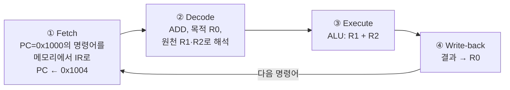
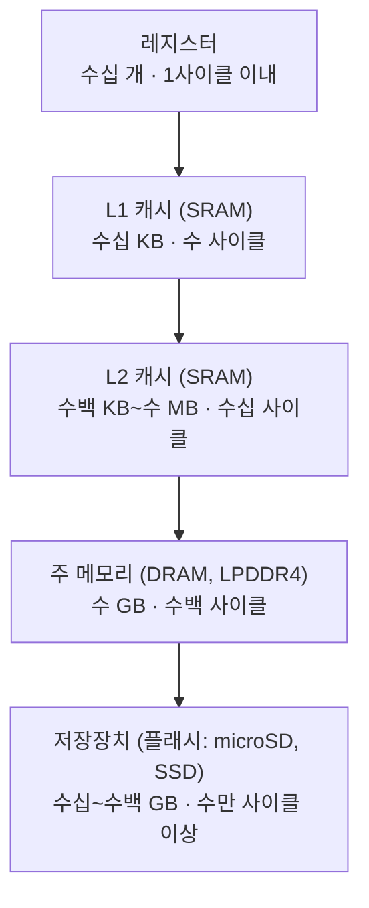
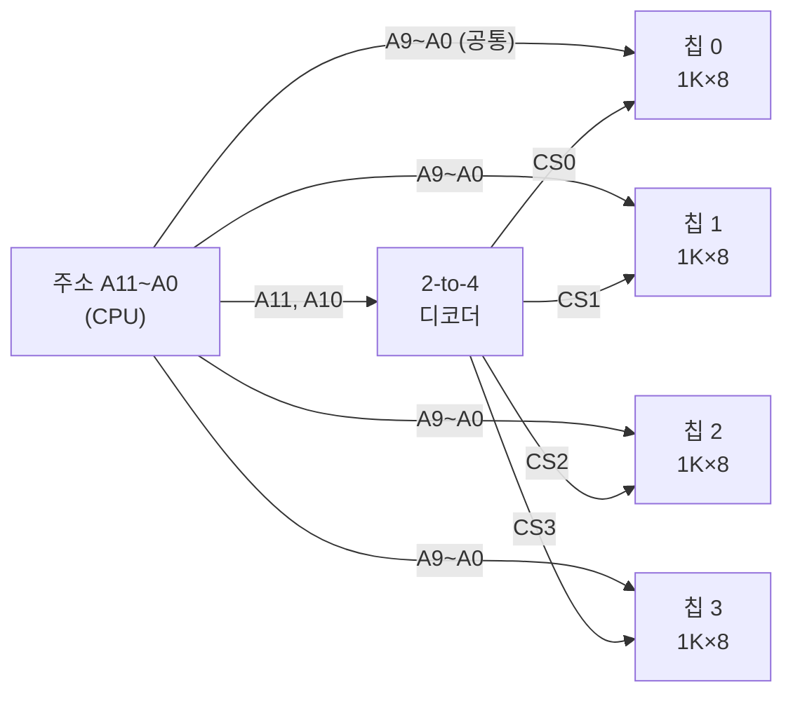
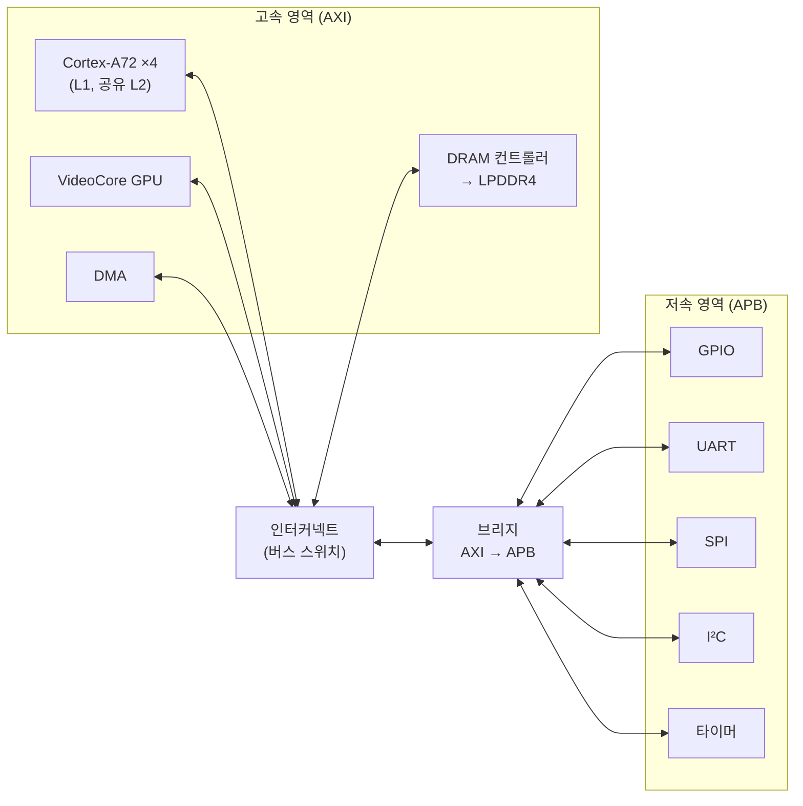
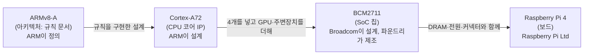
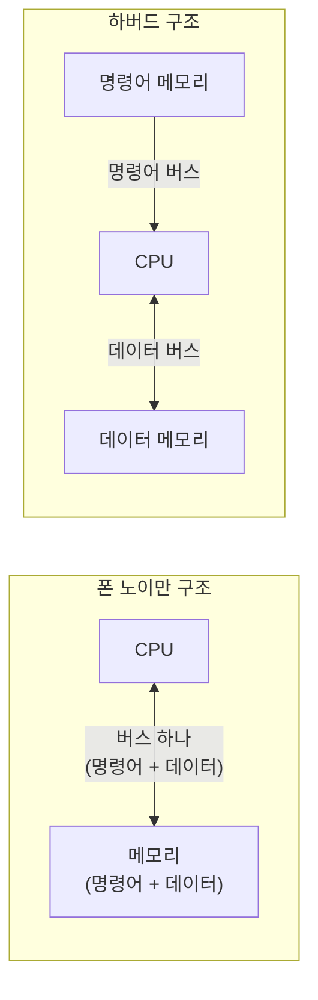
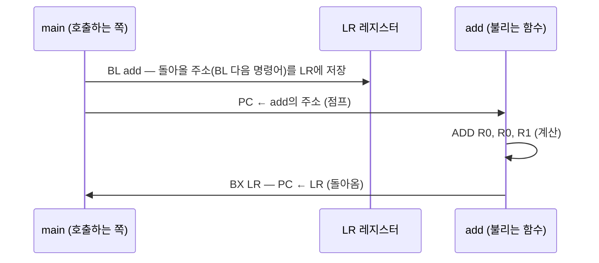
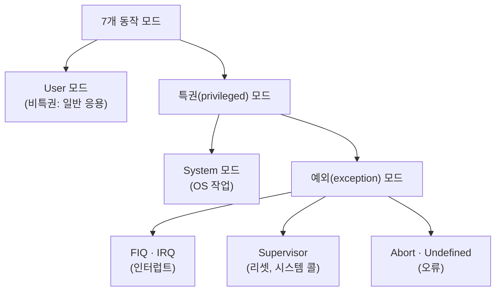

# 2장. 컴퓨터 구조와 ARM 프로세서

> **학습 목표**
> - CPU가 명령어를 가져오고(fetch) 해석하고(decode) 실행하는(execute) 과정을 MAR·MBR과 주소·데이터·제어 버스로 설명할 수 있다.
> - 레지스터 → 캐시(SRAM) → 주 메모리(DRAM) → 저장장치로 이어지는 메모리 계층과 지역성의 원리를 설명하고, Raspberry Pi 4의 실제 계층을 확인할 수 있다.
> - 주소 디코딩으로 메모리를 확장하는 원리를 이해하고, 이것이 메모리 맵 I/O로 이어지는 과정을 BCM2711의 실제 주소로 설명할 수 있다.
> - AMBA 버스(AXI·AHB·APB)의 역할을 구분할 수 있다.
> - ARM의 IP 비즈니스 모델과 반도체 산업의 분업 구조(IP·팹리스·파운드리·IDM)를 설명할 수 있다.
> - 아키텍처(ISA)·Cortex 코어·SoC를 구분하고 ARMv8-A → Cortex-A72 → BCM2711의 관계로 설명할 수 있다.
> - RISC와 CISC, 폰 노이만 구조와 하버드 구조를 올바르게 비교할 수 있다.
> - ARM의 프로그래머 모델(레지스터, CPSR, 동작 모드, AArch64의 X 레지스터와 예외 레벨)을 설명할 수 있다.
> - ARM 명령어의 형식, 조건 플래그, 파이프라인, 엔디언과 정렬, 예외와 벡터 테이블, 함수 호출 규약(AAPCS)을 이해하고, 실제 컴파일 결과에서 이를 찾아낼 수 있다.

[1장](01_embedded_system.md)에서 Raspberry Pi 4가 **BCM2711**이라는 SoC를 쓰고, 그 안에 **Cortex-A72**라는 ARM 코어가 4개 들어 있다는 것을 보았다. 이 장에서는 그 칩 안으로 한 단계 더 들어간다. CPU가 프로그램 한 줄을 어떻게 실행하는지, 메모리는 왜 여러 층으로 나뉘는지, GPIO 레지스터가 왜 "메모리 주소"를 갖는지, ARM이라는 회사는 무엇을 팔고 Cortex는 무엇인지, 그리고 C 코드가 실제로 어떤 ARM 명령어로 바뀌는지를 차례로 살펴본다.

내용이 많아 보이지만 줄기는 하나이다. **CPU는 메모리에서 명령어를 하나씩 꺼내 실행하는 디지털 회로이고, 나머지는 모두 그 일을 빠르고 안전하게 하기 위한 장치이다.** 메모리 계층은 "꺼내는 일"을 빠르게 하려고, 파이프라인은 "실행하는 일"을 겹쳐 하려고, 동작 모드와 예외는 "안전하게" 하려고 만든 것이다. 각 절을 읽을 때 "이것은 어느 일을 돕는 장치인가?"를 스스로 물어 보면 길을 잃지 않는다.

강의에서 교수가 매우 좋아한다고 소개한 그림이 있다. 반도체 공정에서 시작해 소자, 회로, 마이크로아키텍처, 명령어 집합(ISA), 운영체제, 응용 프로그램까지 컴퓨터를 이루는 층을 한 장에 쌓은 그림이다. 전공을 살려 엔지니어가 되면 대부분 이 중 **한 층**에서 일하게 된다. 그런데 전체 그림을 알고 있으면 지금 내가 어느 층에 있는지 알기 때문에 길을 잃지 않는다. 이 장은 그 그림의 가운데 부분, 즉 마이크로아키텍처·ISA·하드웨어와 소프트웨어의 경계를 다룬다.

<!-- 그림 필요: 「ARM 프로세서」 slides "A look at the computer engineering stack" (반도체 공정 → … → 응용까지 쌓은 계층 그림) -->

---

## 2.1 CPU는 프로그램을 어떻게 실행하는가

### 2.1.1 "머신"은 기계가 아니라 디지털 회로이다

ARM은 **Advanced RISC Machine**의 약자이다(처음에는 Acorn RISC Machine이었다). 여기서 <strong>머신(machine)</strong>은 톱니바퀴가 돌아가는 기계가 아니다. 2학년 순차회로에서 배운 **무어 머신(Moore machine)**·<strong>밀리 머신(Mealy machine)</strong>과 같은 뜻, 즉 <strong>디지털 논리 회로(시스템)</strong>이다.

순차회로는 상태도를 그리고, 클록이 들어올 때마다 정해진 규칙에 따라 다음 상태로 넘어간다. 이 규칙은 회로를 만들 때 고정된다. CPU는 여기서 한 걸음 더 나아간 회로이다. **다음에 무엇을 할지를 회로 밖에서 들어오는 "명령어"가 정한다.** 그래서 회로를 다시 만들지 않고 명령어만 바꾸면 전혀 다른 일을 시킬 수 있다. 이것이 "프로그램으로 동작하는 디지털 회로", 즉 CPU의 본질이다.

- 디지털 분야에서 명령어는 command가 아니라 **instruction**이라고 부른다.
- CPU가 알아듣는 명령어의 목록을 <strong>명령어 집합(instruction set)</strong>이라고 하고, 명령어의 종류·형식·레지스터·메모리 접근 방식까지 포함한 규칙 전체를 <strong>명령어 집합 구조(ISA, Instruction Set Architecture)</strong>라고 한다.
- **명령어 코드를 순서대로 늘어놓은 것이 곧 프로그램**이다.

[1장](01_embedded_system.md)의 1.6.1절에서 본 것처럼 명령어 하나는 결국 "어떤 레지스터를 ALU에 연결하고, 덧셈을 하고, 결과를 어디에 저장하라"는 **하드웨어 제어 신호의 묶음**이다. CPU가 "더한다"는 개념을 이해하는 것은 아니다. 덧셈기 회로에 전기가 흘러 결과가 나올 뿐이다. 강의에서 교수는 이것을 요즘의 AI에 빗대었다. AI가 "1 더하기 2는 3"이라고 답해도 덧셈의 개념을 이해한 것이 아니라 정해진 방식대로 계산한 결과를 내놓는 것처럼, CPU도 생각하지 않고 명령어대로 신호를 흘려 보낼 뿐이다.

### 2.1.2 CPU 안의 주요 부품

CPU 내부 구조를 처음 보면 복잡해 보이지만, 어느 프로세서든 핵심 부품은 거의 같다. 8비트 MCU든 64비트 Cortex-A72든 마찬가지이다. 강의에서도 "빠르다는 ARM 코어도 8비트 MCU와 전체 구조가 비슷하다"고 강조하였다. 차이는 데이터 폭(8/32/64비트)과, 같은 일을 더 빨리 하기 위해 덧붙인 장치들이다.

| 부품 | 하는 일 | 비유(도서관 사서) |
|---|---|---|
| 레지스터(register) | CPU 안의 아주 작고 빠른 저장 공간. 연산할 값과 결과를 잠시 담는다 | 사서의 손바닥 메모지 |
| ALU(Arithmetic Logic Unit, 산술 논리 장치) | 덧셈·뺄셈·AND·OR·비교 같은 연산을 한다 | 계산기 |
| 제어 장치·명령어 디코더(control unit, decoder) | 명령어를 해석해 각 부품에 제어 신호를 보낸다 | 작업 지시서를 읽는 사서의 머리 |
| PC(Program Counter, 프로그램 카운터) | **다음에 가져올 명령어의 주소**를 가리킨다 | "다음에 할 일" 책갈피 |
| IR(Instruction Register, 명령어 레지스터) | 방금 가져온 명령어를 담아 둔다 | 지금 읽고 있는 지시서 |
| MAR(Memory Address Register, 메모리 주소 레지스터) | 메모리에 보낼 **주소**를 담는다 | 서가 위치를 적은 쪽지 |
| MBR(Memory Buffer Register, 메모리 버퍼 레지스터. MDR이라고도 함) | 메모리와 주고받을 **데이터**를 잠시 담는 통로 | 책을 올려 두는 대출·반납 카트 |
| 상태 레지스터(status register) | 직전 연산 결과의 성질(0인가, 음수인가, 자리올림이 있었나)을 기록한다 | "방금 계산 결과가 0이었음" 체크 표시 |

ARM 코어에는 여기에 두 가지가 더 눈에 띈다. 강의에서 교수가 짚은 부분이다.

- **배럴 시프터(barrel shifter)**: 값을 여러 비트 한꺼번에 밀어 주는 회로이다. 고전 ARM 명령어는 ALU에 들어가기 직전에 두 번째 피연산자를 시프트할 수 있어서, `ADD R0, R1, R2, LSL #2`(R0 = R1 + R2×4)처럼 "곱하기 4 하고 더하기"를 명령어 하나로 처리한다.
- **곱셈-누산기(MAC, Multiply-Accumulate)**: 네트워크의 MAC 주소가 아니라 **곱하고 더하기**(A = A + B×C) 회로이다. 신호및시스템에서 배우는 **컨볼루션**이 바로 곱하고 더하기의 반복이다. 디지털 필터, 영상 처리, 인공지능 연산의 기본이 모두 MAC이므로 이를 잘하는 프로세서가 빠르다. ARM에는 오래전부터 `MLA`(곱하고 더하기) 같은 명령어가 있었다. 단순한 8비트 MCU는 곱셈 명령은 있어도 곱셈과 누산을 한 명령으로 처리하는 구조는 없는 경우가 많다.

<!-- 그림 필요: 「ARM 프로세서」 slides "ARM 코어의 구조" / "ARM 프로세서의 레지스터" (Register–Barrel Shifter–ALU–명령어 Decoder–메모리, A 버스·B 버스·ALU 버스 블록도) -->

어느 그림을 보든 핵심 규칙은 하나이다. **ALU는 메모리의 값을 직접 계산하지 않는다.** 메모리 → 레지스터로 가져오고, 레지스터끼리 계산한 뒤, 결과를 레지스터 → 메모리로 보낸다. 레지스터는 수십 개뿐이지만 메모리는 수 GB이다. CPU는 이 좁은 레지스터를 오가며 "가져오고, 계산하고, 내보내는" 단순한 일을 엄청나게 빠르게 반복하고, 그 조합으로 게임도 돌리고 영상도 처리한다.

### 2.1.3 명령어 사이클: Fetch → Decode → Execute

CPU가 명령어 하나를 처리하는 과정을 <strong>명령어 사이클(instruction cycle)</strong>이라고 한다. 단계 이름은 반드시 기억하자.

| 단계 | 영문 | 하는 일 |
|---|---|---|
| 1 | **Fetch**(인출) | PC가 가리키는 주소에서 명령어를 가져와 IR에 넣고, PC를 다음 명령어로 옮긴다 |
| 2 | **Decode**(해독) | IR의 비트 패턴을 해석해 "무슨 연산을, 어느 레지스터로" 할지 정하고 제어 신호를 만든다 |
| 3 | **Execute**(실행) | ALU가 연산하거나, 메모리 주소를 계산하거나, 분기할 주소를 계산한다 |
| (4) | Memory / Write-back | 필요하면 메모리를 읽거나 쓰고, 결과를 레지스터에 기록한다 |

교재마다 3단계(F·D·E)로 묶기도 하고 4~5단계(F·D·E·Memory·Write-back, 또는 F·D·E·Store)로 나누기도 한다. 강의 슬라이드는 고전 ARM(ARM7)의 구조를 따라 3단계로 표현하였다. 몇 단계로 세느냐보다 **각 단계가 무엇을 하는지**가 중요하다.

예를 들어 메모리 0x1000번지에 `ADD R0, R1, R2`(R0 = R1 + R2)라는 명령어가 있고, PC = 0x1000이라고 하자.



1. **Fetch**: PC 값 0x1000을 주소로 메모리에서 4바이트(ARM 명령어 하나)를 읽어 IR에 넣는다. PC는 0x1004가 된다.
2. **Decode**: 디코더가 IR의 비트를 보고 "데이터 처리 명령, 연산은 ADD, 목적지 R0, 원천 R1과 R2"라고 해석한다.
3. **Execute**: R1과 R2의 값이 ALU로 들어가 더해진다.
4. **Write-back**: 결과가 R0에 기록된다. 그리고 다시 1번으로 돌아가 0x1004의 명령어를 가져온다.

CPU가 하는 일은 이 반복이 전부이다. 전원이 들어오면 정해진 주소(리셋 벡터, 2.19절)에서 첫 명령어를 가져오고, 전원이 꺼질 때까지 가져오기–해석–실행을 끝없이 되풀이한다.

### 2.1.4 메모리 읽기와 쓰기: MAR과 MBR의 순서

Fetch든, 변수를 읽는 LDR 명령이든, 결과를 저장하는 STR 명령이든 결국은 **메모리 읽기**와 **메모리 쓰기** 두 동작의 조합이다. 디지털 논리 교재(「메모리와 프로그래머블 논리장치」)의 순서를 그대로 따라가 보자.

**메모리 읽기(read)**

1. 읽을 워드의 **주소를 MAR로** 보낸다. MAR의 값이 주소 버스에 실린다.
2. **읽기 제어 신호**를 활성화한다.
3. 메모리가 그 주소의 데이터를 데이터 버스에 올리고, CPU는 그 값을 **MBR로** 받아들인다.

**메모리 쓰기(write)**

1. 쓸 위치의 **주소를 MAR로** 보낸다.
2. 저장할 **데이터를 MBR로** 보낸다. MBR의 값이 데이터 버스에 실린다.
3. **쓰기 제어 신호**를 활성화한다. 메모리가 데이터 버스의 값을 그 주소에 기록한다.

순서를 비교하면 차이가 분명하다. 읽기는 "주소 → 명령 → 데이터가 들어온다", 쓰기는 "주소 → 데이터 → 명령"이다. 쓰기에서는 데이터를 먼저 버스에 올려 두고 나서 "지금 기록하라"고 명령해야 엉뚱한 값이 기록되지 않는다.

메모리 칩 쪽에서 보면 이 과정에 쓰이는 제어 신호는 보통 다음과 같다(강의 자료 「강의13_메모리」).

| 신호 | 이름 | 역할 |
|---|---|---|
| CS 또는 CE | Chip Select / Chip Enable | 이 칩을 선택한다. 비활성이면 칩은 다른 모든 입력을 무시한다. **주소 디코딩**의 결과로 만들어진다(2.3절) |
| RE / OE | Read Enable / Output Enable | 읽기 동작 중에 칩의 출력을 데이터 버스에 연결한다 |
| WE | Write Enable | 데이터 버스의 값을 지정된 주소에 기록하게 한다 |

실제 칩에서는 이 신호들이 대부분 **액티브 로우**(Low일 때 활성)여서 데이터시트에 CS#, /WE, nOE처럼 표기하거나 이름 위에 줄을 그어 표기한다.

<!-- 그림 필요: 「제12장-메모리와 프로그래머블 논리장치」 "2. 메모리의 동작" 읽기 동작 전·후, 쓰기 동작 전·후 그림 (MAR·MBR과 메모리 워드) -->

### 2.1.5 세 가지 버스와 방향

CPU와 메모리·주변장치 사이에는 세 종류의 신호선 묶음, 즉 <strong>버스(bus)</strong>가 있다.

| 버스 | 실어 나르는 것 | 방향 | 폭이 결정하는 것 |
|---|---|---|---|
| **주소 버스(address bus)** | 어느 위치를 읽고 쓸지(주소) | **단방향**: CPU → 메모리·주변장치 | 접근할 수 있는 **주소 공간의 크기** |
| **데이터 버스(data bus)** | 실제 데이터 | **양방향**: 읽을 때는 메모리 → CPU, 쓸 때는 CPU → 메모리 | 한 번에 옮길 수 있는 데이터 양 |
| **제어 버스(control bus)** | 읽기/쓰기, 칩 선택, 클록 등 | 주로 CPU → 메모리·주변장치 | — |

디지털 논리 교재는 "주소 버스와 제어 버스는 단방향, 데이터 버스는 양방향"으로 정리한다. 처음에는 이렇게 기억하면 된다. 다만 제어 신호 중 일부(인터럽트 요청, 메모리가 "아직 준비 안 됨"을 알리는 대기 신호 등)는 주변장치 → CPU 방향이라는 점도 알아 두자.

택배에 비유해 보자. 주소 버스는 **송장에 적힌 주소**이다. 주소는 언제나 보내는 쪽(CPU)이 정한다. 데이터 버스는 **상자를 실은 트럭**이다. 물건을 보낼 때도 받을 때도 같은 길로 오간다. 제어 버스는 "수거해 가세요", "배달해 주세요" 같은 **지시**이다.

**주소 버스 폭과 주소 공간**

주소선이 n개이면 $2^n$개의 서로 다른 주소를 만들 수 있다. 주소 하나가 1바이트를 가리키면(바이트 주소 지정) 주소 공간은 $2^n$바이트이다.

| 주소선 수 | 주소 공간 | 예 |
|---|---|---|
| 16 | $2^{16}$ = 64KB | 여러 8비트 MCU |
| 20 | $2^{20}$ = 1MB | Intel 8086 |
| 32 | $2^{32}$ = 4GB | 32비트 ARM(Cortex-M3 등) |
| 35 | $2^{35}$ = 32GB | BCM2711의 내부 주소(2.4.3절) |
| 48 | $2^{48}$ = 256TB | AArch64 Linux에서 흔히 쓰는 가상 주소 공간 |

> **흔한 오해 — "8086은 16비트이므로 주소 공간이 64KB이다"**: 강의 슬라이드의 8086과 Cortex-M3 비교표에는 8086의 최대 주소 공간이 64KB로 적혀 있지만 정확하지 않다. 8086은 레지스터가 16비트이지만 **주소선이 20개**여서 **1MB**를 다룬다. 16비트 레지스터 두 개(세그먼트와 오프셋)를 `세그먼트 × 16 + 오프셋`으로 합쳐 20비트 주소를 만든다. 64KB는 세그먼트 **하나**의 크기이다. "몇 비트 CPU"는 보통 레지스터·ALU의 폭을 말하며, 주소 버스의 폭과 같을 필요는 없다.

강의 슬라이드의 비교표를 바로잡으면 다음과 같다.

| 항목 | Intel 8086 (16비트) | Cortex-M3 (32비트) |
|---|---|---|
| 레지스터 크기 | 16비트 | 32비트 |
| 최대 주소 공간 | 1MB(20비트 주소, 64KB 세그먼트 단위) | 4GB($2^{32}$바이트) |
| 명령어 길이 | 1~6바이트 가변 길이 | 16/32비트 혼합(Thumb-2) |
| 데이터 처리 단위 | 16비트 | 32비트 |

---

## 2.2 메모리 계층 구조

### 2.2.1 왜 메모리를 여러 층으로 나누는가

이상적인 메모리는 **빠르고, 크고, 싸고, 전원이 꺼져도 내용이 남는** 메모리이다. 그런 메모리는 없다. 빠른 메모리는 비싸고 작으며, 큰 메모리는 느리다. 그래서 컴퓨터는 성질이 다른 메모리를 **층층이 쌓아** 쓴다. CPU에 가까울수록 빠르고 작고 비싸며, 멀어질수록 느리고 크고 싸다. 이것을 <strong>메모리 계층(memory hierarchy)</strong>이라고 한다.

도서관에서 리포트를 쓰는 학생을 떠올려 보자.

| 층 | 도서관 비유 | 컴퓨터 |
|---|---|---|
| 1 | 손에 들고 있는 메모 몇 장 | **레지스터** |
| 2 | 책상 위에 펼쳐 둔 책 몇 권 | **캐시(cache)** — SRAM |
| 3 | 열람실 서가 전체 | **주 메모리(main memory)** — DRAM |
| 4 | 지하 보존 서고, 다른 도서관에서 빌려 오기 | **저장장치(storage)** — 플래시(SD 카드, SSD), 하드디스크 |

책상 위의 책은 펼치기만 하면 되지만, 서가에 가면 몇 분이 걸리고, 보존 서고에 신청하면 며칠이 걸린다. 그래서 자주 볼 책은 책상 위에 둔다. 컴퓨터도 마찬가지로 **자주 쓰는 데이터를 CPU 가까이** 둔다.



위로 갈수록 빠르고 비싸며 작고, 아래로 갈수록 느리고 싸며 크다. 각 층의 접근 시간은 프로세서마다 다르므로 위 그림의 수치는 "몇 배쯤 차이가 나는가"를 감 잡기 위한 대략적인 크기이다.

전원이 꺼지면 레지스터·캐시·DRAM의 내용은 모두 사라지고(휘발성), 저장장치만 남는다(비휘발성). 그래서 프로그램과 파일은 평소에 저장장치에 있다가, 실행할 때 DRAM으로 올라오고, 실행 중에 자주 쓰는 부분이 캐시로, 지금 계산 중인 값이 레지스터로 올라온다.

<!-- 그림 필요: 「강의13_메모리」 "Memory hierarchy (메모리 계층)" / "Computer Memory hierarchy" 피라미드 그림 -->

### 2.2.2 지역성: 계층 구조가 통하는 이유

캐시는 작다. Cortex-A72의 L1 데이터 캐시는 32KB로, 4GB DRAM의 십만분의 일도 안 된다. 그런데도 대부분의 메모리 접근이 캐시에서 해결된다. 프로그램이 메모리를 아무렇게나 쓰지 않기 때문이다. 이 성질을 <strong>지역성(locality)</strong>이라고 한다.

| 지역성 | 뜻 | 예 |
|---|---|---|
| 시간 지역성(temporal locality) | 방금 쓴 데이터는 **곧 다시** 쓸 가능성이 높다 | 반복문의 카운터 `i`, 합계 변수 `s` |
| 공간 지역성(spatial locality) | 방금 쓴 데이터의 **이웃**도 곧 쓸 가능성이 높다 | 배열을 앞에서부터 차례로 읽기, 명령어를 순서대로 실행하기 |

공간 지역성을 이용하기 위해 캐시는 바이트 하나가 아니라 <strong>캐시 라인(cache line)</strong>이라는 덩어리 단위로 메모리를 가져온다. Cortex-A72의 캐시 라인은 **64바이트**이다. `int` 배열의 원소 하나를 읽으면 이웃한 원소 15개(4바이트 × 16 = 64바이트)가 함께 캐시에 올라오므로, 다음 원소들은 캐시에서 바로 읽힌다.

| 용어 | 뜻 |
|---|---|
| 적중(hit) | 찾는 데이터가 캐시에 있다 → 빠르다 |
| 실패(miss) | 캐시에 없다 → 아래 층(L2, DRAM)에서 라인을 통째로 가져온다 → 느리다 |
| 적중률(hit rate) | 전체 접근 중 적중의 비율. 보통의 프로그램에서 90%를 훨씬 넘는다 |

층과 층 사이에서 옮기는 단위도 층마다 다르다. 강의 자료(「강의13_메모리」)의 정리대로 **레지스터 ↔ 캐시는 워드(word)**, **캐시 ↔ 주 메모리는 블록(block, 캐시 라인)**, **주 메모리 ↔ 저장장치는 페이지(page, 보통 4KB)** 단위이다. 아래로 갈수록 한 번 가져오는 비용이 크므로 더 큰 덩어리로 가져온다.

> **생각해 보기**: 2차원 배열 `a[1000][1000]`의 합을 구할 때 `for (i…) for (j…) s += a[i][j];`와 `for (j…) for (i…) s += a[i][j];` 중 어느 쪽이 빠를까? C의 2차원 배열은 행 단위로 이어서 저장되므로, 앞쪽이 메모리를 연속으로 읽어 캐시 라인을 알뜰하게 쓴다. 뒤쪽은 매번 4000바이트씩 건너뛰므로 캐시 실패가 훨씬 많다. 결과는 같아도 속도는 몇 배 차이 날 수 있다.

### 2.2.3 Raspberry Pi 4의 메모리 계층

Raspberry Pi 4에 대입하면 다음과 같다. 캐시 크기는 실습 2-1에서 직접 확인한다.

| 층 | Raspberry Pi 4 (BCM2711, Cortex-A72 ×4) | 위치 | 소자 |
|---|---|---|---|
| 레지스터 | 코어마다 범용 레지스터 31개(64비트) + SIMD/부동소수점 레지스터 32개(128비트) | 각 코어 안 | 플립플롭 |
| L1 명령어 캐시 | 코어마다 **48KB**, 3-way, 라인 64B | 각 코어 안 | SRAM |
| L1 데이터 캐시 | 코어마다 **32KB**, 2-way, 라인 64B | 각 코어 안 | SRAM |
| L2 캐시 | 4개 코어가 공유하는 **1MB**, 16-way, 라인 64B | SoC 안 | SRAM |
| 주 메모리 | 1/2/4/8GB **LPDDR4** SDRAM | 보드 위 별도 칩 | DRAM |
| 저장장치 | microSD 카드(또는 USB SSD) | 보드 밖 | NAND 플래시 |

> 📌 보강: 캐시 크기·라인 크기·연관도(way)는 Raspberry Pi 커널의 디바이스 트리(`bcm2711.dtsi`)에 L1 D 32KiB(256 sets × 64B × 2-way), L1 I 48KiB(256 sets × 64B × 3-way), L2 1MiB(1024 sets × 64B × 16-way)로 기술되어 있다. 디바이스 트리는 이 값의 근거로 Arm Cortex-A72 TRM과 Raspberry Pi 공식 문서를 인용한다. 출처: [raspberrypi/linux `bcm2711.dtsi`](https://github.com/raspberrypi/linux/blob/rpi-6.12.y/arch/arm/boot/dts/broadcom/bcm2711.dtsi), [Arm Cortex-A72 MPCore Processor TRM](https://developer.arm.com/documentation/100095/latest), [Raspberry Pi 공식 문서 – BCM2711](https://www.raspberrypi.com/documentation/computers/processors.html#bcm2711)

L1 캐시가 **명령어용과 데이터용으로 나뉘어 있다**는 점을 눈여겨 두자. 2.9절의 하버드 구조와 직접 연결된다.

### 2.2.4 메모리의 종류 다시 보기

ROM과 RAM의 이름이 생긴 역사, SRAM과 DRAM의 구조 차이, EEPROM·NOR·NAND 플래시의 선정 기준은 [1장](01_embedded_system.md)의 1.9절에서 다루었다. 여기서는 계층 구조와 연결해 몇 가지만 덧붙인다.

**분류 기준 정리**

| 기준 | 종류 | 설명 |
|---|---|---|
| 접근 방식 | RAM(Random Access Memory) | 어느 주소든 접근 시간이 같다 |
| | SAM(Sequential Access Memory) | 원하는 위치까지 차례로 가야 하므로 위치에 따라 접근 시간이 다르다(자기 테이프) |
| 기록 기능 | RWM(Read/Write Memory) | 읽고 쓸 수 있다. 흔히 RAM이라고 부르는 것 |
| | ROM(Read Only Memory) | 읽기만(또는 주로 읽기만) 한다. Mask ROM → PROM → EPROM → EEPROM → 플래시 |
| 전원 | 휘발성(volatile) | 전원이 꺼지면 사라진다: SRAM, DRAM |
| | 비휘발성(non-volatile) | 전원이 꺼져도 남는다: ROM 계열, 플래시, 자기 디스크 |
| 읽은 뒤의 정보 | 파괴 읽기(destructive read-out) | 읽으면 정보가 손상되어 다시 써 주어야 한다. DRAM 셀이 그렇다(읽은 뒤 내부에서 재기록) |
| | 비파괴 읽기(nondestructive read-out) | 읽어도 정보가 유지된다: SRAM |

**SRAM은 캐시로, DRAM은 주 메모리로**

1장에서 본 대로 SRAM은 플립플롭(트랜지스터 6개 정도)으로 1비트를 저장하므로 빠르지만 크고 비싸다. DRAM은 트랜지스터 1개와 커패시터 1개로 1비트를 저장하므로 집적도가 높고 싸지만, 전하가 새어 나가므로 수 ms마다 **리프레시**해야 하고 상대적으로 느리다. 그래서 **빨라야 하는 캐시는 SRAM**, **커야 하는 주 메모리는 DRAM**이다. 강의에서 "SRAM과 DRAM은 반드시 구별할 수 있어야 한다"고 강조한 이유이다.

**DDR과 LPDDR**

PC와 Raspberry Pi의 DRAM은 **SDRAM**(Synchronous DRAM, 클록에 동기된 DRAM)이고, 그중에서도 클록의 상승·하강 에지 모두에서 데이터를 옮기는 **DDR**(Double Data Rate) 계열이다. 강의 자료의 정리처럼 메모리 내부 클록 대비 전송 배율은 DDR이 2, DDR2가 4, DDR3가 8로 세대마다 커졌다. 예를 들어 DDR3-1600은 초당 1600M회 전송하고, 64비트(8바이트) 버스이면 1600M × 8 = 12,800MB/s이므로 모듈 이름을 PC3-12800이라고 붙인다.

Raspberry Pi 4가 쓰는 **LPDDR4**는 스마트폰처럼 배터리로 동작하는 기기를 위해 전력을 줄인(Low Power) DDR4 계열이다. 보드 위 SoC 옆에 붙어 있는 검은 칩 하나가 바로 이 DRAM이다.

**HBM**: 최근 AI 가속기에 쓰이는 **HBM**(High Bandwidth Memory)은 DRAM 다이를 수직으로 쌓고 아주 넓은 버스로 프로세서 바로 옆에 붙인 메모리이다. 메모리 계층에서 "주 메모리 층을 CPU에 최대한 가깝게, 최대한 넓게" 만든 것이라고 이해하면 된다.

### 2.2.5 프로그램은 어디에서 실행되는가: MCU와 OS 시스템의 차이

강의에서 교수는 워드프로세서(아래아한글, Word) 예를 들었다. 한글 프로그램은 평소 <strong>하드디스크(SSD)</strong>에 설치되어 있다. 실행 아이콘을 누르면 OS가 프로그램 파일을 **DRAM으로 복사**하고, CPU는 DRAM에 올라온 코드를 가져와 실행한다. 문서를 편집하는 동안 문서 내용도 DRAM에 있다가, 저장을 누르면 다시 디스크에 기록된다.

| 구분 | 작은 MCU(베어메탈) | OS가 있는 시스템(Raspberry Pi) |
|---|---|---|
| 프로그램이 평소 있는 곳 | 칩 내장 플래시 | microSD 카드(파일 시스템) |
| 실행 중 코드가 있는 곳 | **플래시에서 직접** 가져와 실행(XIP) | 파일을 **DRAM에 올린 뒤** 실행 |
| 변수가 있는 곳 | 칩 내장 SRAM | DRAM(프로세스마다 따로) |
| 캐시 | 없거나 작다 | L1/L2 캐시 |

같은 C 프로그램이라도 실행 환경에 따라 메모리를 쓰는 방식이 이렇게 다르다. 실행 중인 프로그램이 DRAM 안에서 코드(.text)·데이터(.data/.bss)·힙·스택으로 어떻게 나뉘는지는 [11장](11_process_concurrency.md)에서, 링커가 그 배치를 어떻게 정하는지는 [6장](06_c_build.md)에서 다룬다.

---

## 2.3 주소 디코딩과 메모리 확장

### 2.3.1 메모리 칩의 겉모습

메모리 칩을 블록으로 그리면 입출력은 세 묶음뿐이다. 예를 들어 **256×4 SRAM**(4비트 워드 256개 = 1024비트)은 다음과 같다.

| 핀 | 개수 | 이유 |
|---|---|---|
| 주소 입력 A7~A0 | 8개 | 워드 256개를 구분하려면 $2^8$ = 256 |
| 데이터 입출력 D3~D0 | 4개 | 워드 하나가 4비트 |
| 제어 입력 CS, WE, OE | 3개 | 칩 선택, 쓰기, 읽기(출력) |

"k×n 메모리"라고 쓰면 <strong>k는 워드 수(주소 개수), n은 워드 하나의 비트 수(데이터 폭)</strong>이다. 주소선 수는 $\log_2 k$, 데이터선 수는 n이다.

<!-- 그림 필요: 「제12장-메모리와 프로그래머블 논리장치」 "256×4 SRAM의 외부 구조", "4×4 정적 RAM의 기본구조" -->

### 2.3.2 데이터 폭 늘리기: 1K×8 두 개로 1K×16 만들기

칩 하나가 8비트인데 16비트 CPU에 연결해야 한다면, 칩 두 개를 **나란히** 놓는다(디지털 논리 교재 예제 12-2).

- 주소선 A9~A0(1K = $2^{10}$이므로 10개)과 CS·WE·OE는 **두 칩에 똑같이** 연결한다.
- 데이터선은 나누어, 한 칩은 D7~D0, 다른 칩은 D15~D8을 맡는다.

같은 주소를 주면 두 칩이 동시에 반응해 각자 8비트씩, 합쳐서 16비트를 내놓는다. 워드 수(1K)는 그대로이고 워드 폭만 두 배가 된다.

### 2.3.3 워드 수 늘리기: 1K×8 네 개로 4K×8 만들기

이번에는 워드 폭은 8비트 그대로 두고 **용량**을 네 배로 늘려 보자(예제 12-3). 4K = $2^{12}$이므로 주소선이 12개(A11~A0) 필요하다. 그런데 칩 하나는 주소선이 10개(A9~A0)뿐이다. 남는 두 줄 **A11, A10**이 "네 칩 중 어느 것인가"를 고르는 데 쓰인다.

1. A9~A0은 네 칩 모두에 **공통**으로 연결한다(칩 안에서의 위치).
2. A11~A10을 **2-to-4 디코더**에 넣는다. 디코더는 입력값에 따라 출력 4개 중 **하나만** 활성화한다.
3. 디코더의 출력 4개를 각 칩의 **CS**에 연결한다.
4. 데이터선 D7~D0과 WE·OE는 네 칩 모두에 공통으로 연결한다. CS가 꺼진 칩은 출력을 끊어(하이 임피던스) 버스에서 비켜나므로 서로 충돌하지 않는다.



그 결과 각 칩이 맡는 주소 범위는 다음과 같다.

| A11 A10 | 선택되는 칩 | 주소 범위(16진수) |
|---|---|---|
| 0 0 | 칩 0 | 0x000 ~ 0x3FF |
| 0 1 | 칩 1 | 0x400 ~ 0x7FF |
| 1 0 | 칩 2 | 0x800 ~ 0xBFF |
| 1 1 | 칩 3 | 0xC00 ~ 0xFFF |

이처럼 **주소의 윗부분 비트로 어느 장치를 선택할지 정하는 회로**를 <strong>주소 디코더(address decoder)</strong>라고 하고, 그 과정을 **주소 디코딩**이라고 한다.

<!-- 그림 필요: 「제12장-메모리와 프로그래머블 논리장치」 "두개의 16×4 RAM을 16×8 RAM으로 확장", "2개의 16×4 RAM을 이용하여 32×4 RAM으로 확장", 예제 12-2·12-3 회로도 -->

### 2.3.4 주소 디코딩이 곧 메모리 맵이다

위 표를 다시 보자. "0x000~0x3FF는 칩 0, 0x400~0x7FF는 칩 1…" 이것이 바로 <strong>메모리 맵(memory map)</strong>이다. 메모리 맵이란 거창한 것이 아니라 **"어느 주소 범위에 어떤 장치가 응답하도록 디코더를 설계했는가"를 적은 표**이다.

이제 한 걸음 더 나가 보자. 칩 3 자리에 메모리 대신 **GPIO 컨트롤러**를 연결하면 어떻게 될까? CPU가 0xC00번지에 값을 쓰면 디코더가 CS3을 켜고, GPIO 컨트롤러가 그 값을 받아 핀 전압을 바꾼다. CPU 입장에서는 메모리에 쓴 것과 구별이 없다. 이것이 다음 절의 **메모리 맵 I/O**이다.

메모리 맵 그림을 볼 때 한 가지 주의할 점이 있다. 강의에서도 지적했듯이 자료마다 **낮은 주소를 위에 그리기도 하고 아래에 그리기도 한다.** 그림을 보면 먼저 주소가 어느 방향으로 커지는지부터 확인하자.

---

## 2.4 메모리 맵 I/O 깊이 보기

### 2.4.1 다시 정리: 주변장치도 주소를 가진다

[1장](01_embedded_system.md)의 1.10.1절에서 입출력 방식을 두 가지로 나누었다. 전용 주소 공간과 전용 명령어(`IN`, `OUT`)를 쓰는 **I/O 맵 방식**(x86 계열)과, 메모리 주소 공간의 일부를 주변장치에 나누어 주는 **메모리 맵 방식**(ARM을 비롯한 대부분의 임베디드 프로세서)이다.

메모리 맵 방식의 장점은 세 가지이다.

1. **명령어가 단순하다.** 주변장치 전용 명령어가 필요 없다. 메모리를 읽는 `LDR`, 쓰는 `STR`로 주변장치도 다룬다. RISC 철학(2.8절)과 잘 맞는다.
2. **C 언어로 바로 다룰 수 있다.** 주소를 포인터에 넣고 읽고 쓰면 된다. C의 포인터가 하드웨어 제어에 그토록 중요한 이유이다.
3. **주소 디코딩 하나로 모든 장치를 배치한다.** 메모리든 GPIO든 UART든 디코더가 CS를 나누어 줄 뿐이다.

### 2.4.2 코어 레지스터와 주변장치 레지스터

"레지스터"라는 말이 두 가지 뜻으로 쓰여서 처음에 헷갈리기 쉽다. 강의 자료의 Cortex-M3 기반 MCU(STM32) 슬라이드는 이 둘을 분명히 나누어 보여 준다.

| 구분 | 코어 레지스터(core register) | 주변장치 레지스터(peripheral register, SFR) |
|---|---|---|
| 어디에 있나 | CPU **코어 안** | 각 주변장치 **컨트롤러 안**(GPIO, UART, 타이머…) |
| 무엇으로 지정하나 | **이름**(R0, SP, PC…)으로 명령어 안에 직접 적는다 | **메모리 주소**로 지정한다 |
| 어떻게 접근하나 | `ADD R0, R1, R2`처럼 연산 명령이 직접 사용 | `LDR`/`STR`로 그 주소를 읽고 쓴다 |
| 하는 일 | 연산 값, 주소, 프로그램 흐름(PC·SP·LR), 상태 플래그 | 핀 방향, 출력값, 통신 속도, 타이머 주기 등 하드웨어 설정 |
| 예 (Cortex-M3) | R0~R12, SP(MSP/PSP), LR, PC, xPSR, PRIMASK·FAULTMASK·BASEPRI, CONTROL | 0x4000_0000부터 배치된 GPIO·USART·타이머·ADC·클록 제어 레지스터 |
| 예 (Raspberry Pi 4) | X0~X30, SP, PC, PSTATE(2.13절) | 0xFE20_0000부터 배치된 GPIO 레지스터 등(아래) |

코어 레지스터는 아키텍처가 정하므로 같은 ARM 아키텍처면 칩이 달라도 같다. 반면 주변장치 레지스터는 **칩마다 다르다**. 그래서 ARM 코어를 쓰는 칩의 데이터시트는 코어 설명은 짧고 주변장치 레지스터 설명이 대부분을 차지한다. BCM2711 주변장치 데이터시트가 바로 그렇다.

칩 제조사는 주변장치 레지스터의 주소 배치를 C 구조체로 정의한 헤더 파일을 제공하는 경우가 많다. 구조체 멤버의 순서와 크기를 레지스터 오프셋과 똑같이 맞추고, 구조체 포인터를 주변장치 시작 주소에 놓으면 `GPIOA->ODR = 1;`처럼 이름으로 레지스터를 다룰 수 있다. 아래에서 BCM2711로 같은 원리를 확인한다.

### 2.4.3 BCM2711의 주소는 세 가지 얼굴을 가진다

Raspberry Pi 4의 GPIO 레지스터 주소를 찾다 보면 숫자가 자료마다 달라 당황하게 된다. 같은 레지스터를 **누가 보느냐**에 따라 주소가 다르기 때문이다.

| 관점 | GPIO 시작 주소 | 누가 이 주소를 쓰나 |
|---|---|---|
| ① 레거시 버스 주소(legacy master address) | **0x7E20_0000** | BCM2711 데이터시트의 레지스터 표기, DMA·VideoCore GPU가 보는 주소. 이전 칩(BCM2835/6/7)과 같은 번호 체계 |
| ② ARM 물리 주소(low peripheral mode) | **0xFE20_0000** | ARM 코어가 실제로 버스에 내보내는 주소. 베어메탈 프로그램, 커널 드라이버가 쓰는 물리 주소 |
| ③ 가상 주소(virtual address) | 실행할 때마다 다름 | Linux 프로세스가 보는 주소. MMU가 ②로 바꾼다 |

①과 ②의 관계는 간단하다. 공통 주변장치 영역에서는 **앞자리 0x7E를 0xFE로 바꾸면** 된다. 데이터시트의 레지스터 표에 0x7E20_0000으로 적혀 있으면, ARM에서는 0xFE20_0000으로 접근한다.

> 📌 보강: BCM2711은 내부적으로 35비트 주소를 쓰며, Raspberry Pi 4의 기본 설정인 low peripheral mode에서는 주변장치가 ARM 물리 주소 공간의 4GB 바로 아래(0xFC00_0000~0xFFFF_FFFF)에 보이도록 매핑된다. Raspberry Pi 커널 디바이스 트리의 `soc` 노드는 이 변환을 다음과 같이 기술한다.
> ```text
> ranges = <0x7e000000  0x0 0xfe000000  0x01800000>,   /* 공통 BCM283x 주변장치 */
>          <0x7c000000  0x0 0xfc000000  0x02000000>,   /* BCM2711 전용 주변장치 */
>          <0x40000000  0x0 0xff800000  0x00800000>;   /* ARM 로컬 주변장치 */
> ```
> 각 줄의 왼쪽이 레거시 버스 주소, 가운데 두 칸이 ARM 물리 주소(64비트를 두 칸에 나누어 표기), 오른쪽이 크기이다. pigpio도 Pi 4에서 주변장치 물리 시작 주소를 `0xFE000000`으로 잡는다(`pigpio.c`의 `pi_peri_phys`). 데이터시트는 주변장치 주소를 주로 레거시 주소로 표기하고 low peripheral mode는 앞부분(1.2절 Address map)에서만 설명한다. 출처: [BCM2711 ARM Peripherals](https://datasheets.raspberrypi.com/bcm2711/bcm2711-peripherals.pdf) 1.2절, [raspberrypi/linux `bcm2711.dtsi`](https://github.com/raspberrypi/linux/blob/rpi-6.12.y/arch/arm/boot/dts/broadcom/bcm2711.dtsi), [raspberrypi/documentation issue #2289](https://github.com/raspberrypi/documentation/issues/2289)

BCM2711의 주요 영역을 ARM 물리 주소 기준으로 정리하면 다음과 같다(4GB 아래 영역만, 디바이스 트리 기준).

| ARM 물리 주소 | 레거시 버스 주소 | 내용 |
|---|---|---|
| 0x0000_0000 ~ | — | DRAM(SDRAM). 일부는 GPU(VideoCore)와 펌웨어용으로 예약된다 |
| 0xFC00_0000 ~ 0xFDFF_FFFF | 0x7C00_0000 ~ 0x7DFF_FFFF | BCM2711 전용 주변장치(PCIe, 이더넷 등) |
| 0xFE00_0000 ~ 0xFF7F_FFFF | 0x7E00_0000 ~ 0x7F7F_FFFF | 공통 주변장치(GPIO, UART, SPI, I²C, PWM, DMA, 타이머 등) |
| 0xFF80_0000 ~ 0xFFFF_FFFF | 0x4000_0000 ~ 0x407F_FFFF (ARM 로컬) | ARM 로컬 주변장치(코어별 타이머·인터럽트 제어, GIC-400 인터럽트 컨트롤러) |

주요 주변장치의 시작 주소 몇 개를 보자. 디바이스 트리의 레거시 주소에서 앞자리를 바꾸어 계산한 값이다.

| 주변장치 | 레거시 주소 | ARM 물리 주소 | 관련 장 |
|---|---|---|---|
| GPIO | 0x7E20_0000 | 0xFE20_0000 | [8장](08_gpio_pigpio.md) |
| UART0(PL011) | 0x7E20_1000 | 0xFE20_1000 | [3장](03_rpi_hw_os.md), [12장](12_communication.md) |
| GIC-400 분배기(distributor) | 0x4004_1000 (ARM 로컬) | 0xFF84_1000 | 2.19절 |

### 2.4.4 GPIO 레지스터로 보는 메모리 맵 I/O

GPIO 컨트롤러 안에는 32비트 레지스터가 여러 개 차례로 놓여 있다. 그중 [8장](08_gpio_pigpio.md)과 관계 깊은 핵심 레지스터 몇 개는 다음과 같다(오프셋은 GPIO 시작 주소로부터의 거리).

| 레지스터 | 오프셋 | ARM 물리 주소 | 역할 |
|---|---|---|---|
| GPFSEL0 | 0x00 | 0xFE20_0000 | GPIO0~9의 기능 선택(핀마다 3비트: 입력 000, 출력 001, ALT0~5) |
| GPFSEL1 | 0x04 | 0xFE20_0004 | GPIO10~19의 기능 선택 |
| GPSET0 | 0x1C | 0xFE20_001C | 1을 쓴 비트의 핀을 High로(GPIO0~31) |
| GPCLR0 | 0x28 | 0xFE20_0028 | 1을 쓴 비트의 핀을 Low로(GPIO0~31) |
| GPLEV0 | 0x34 | 0xFE20_0034 | 핀의 현재 레벨 읽기(GPIO0~31) |
| GPIO_PUP_PDN_CNTRL_REG0 | 0xE4 | 0xFE20_00E4 | GPIO0~15의 풀업/풀다운 설정(BCM2711에서 바뀐 방식) |

> 📌 보강: 오프셋은 pigpio 소스의 레지스터 인덱스(`GPFSEL0 0`, `GPSET0 7`, `GPCLR0 10`, `GPLEV0 13`, `GPPUPPDN0 57`)로 대조하였다. 이 값들은 32비트 워드 단위 인덱스이므로 4를 곱하면 바이트 오프셋이 된다(7×4 = 0x1C). 레지스터의 정식 설명은 BCM2711 데이터시트 5장(General Purpose I/O)에 있다. 출처: [BCM2711 ARM Peripherals](https://datasheets.raspberrypi.com/bcm2711/bcm2711-peripherals.pdf) 5장, [pigpio 소스 `pigpio.c`](https://github.com/joan2937/pigpio/blob/master/pigpio.c)

이제 [8장](08_gpio_pigpio.md)의 예제 LED가 연결된 <strong>GPIO17 (물리 핀 11)</strong>을 켜는 과정을 레지스터 수준에서 따라가 보자.

1. **출력으로 설정**: GPIO17은 GPFSEL1(0xFE20_0004)이 맡는다. GPIO10이 비트 2~0, GPIO11이 비트 5~3, … 이므로 GPIO17은 비트 23~21이다. 이 3비트에 `001`(출력)을 쓴다.
2. **High 출력**: GPSET0(0xFE20_001C)에 `1 << 17`(= 0x0002_0000)을 쓴다.
3. **Low 출력**: GPCLR0(0xFE20_0028)에 `1 << 17`을 쓴다.
4. **상태 읽기**: GPLEV0(0xFE20_0034)를 읽어 17번 비트를 본다.

GPSET0과 GPCLR0이 따로 있는 이유도 생각해 보자. 출력 레지스터가 하나뿐이라면 GPIO17 하나만 바꾸려 해도 "읽고 → 17번 비트만 고치고 → 다시 쓰는" 세 단계를 거쳐야 하고, 그 사이에 다른 스레드나 인터럽트가 같은 레지스터의 다른 비트를 바꾸면 그 변경이 사라진다. "1을 쓴 비트만 켜는/끄는" 레지스터를 따로 두면 쓰기 한 번으로 끝나므로 이런 문제가 없다.

C로 쓰면 개념적으로 다음과 같다. 아래 조각은 **원리를 보이기 위한 개념 코드**로, 베어메탈 환경이나 커널처럼 물리 주소에 직접 접근할 수 있는 곳에서만 의미가 있다. Linux 사용자 프로그램에서 그대로 실행하면 0xFE200000이 물리 주소가 아니라 가상 주소로 해석되어 세그멘테이션 오류(segmentation fault)가 난다.

```c
/* 개념 코드: 물리 주소에 직접 접근할 수 있는 환경을 가정한다 (실습용 아님) */
#define GPIO_BASE  0xFE200000UL
#define GPFSEL1    (*(volatile unsigned int *)(GPIO_BASE + 0x04))
#define GPSET0     (*(volatile unsigned int *)(GPIO_BASE + 0x1C))
#define GPCLR0     (*(volatile unsigned int *)(GPIO_BASE + 0x28))

GPFSEL1 = (GPFSEL1 & ~(7u << 21)) | (1u << 21);   /* GPIO17 = 출력 */
GPSET0  = 1u << 17;                                /* GPIO17 = High */
GPCLR0  = 1u << 17;                                /* GPIO17 = Low  */
```

컴파일러는 `GPSET0 = 1u << 17;`을 결국 "0xFE20001C를 한 레지스터에, 0x20000을 다른 레지스터에 넣고, `STR`로 저장"하는 명령어로 바꾼다. 메모리에 변수를 저장하는 것과 **똑같은 명령어**이다. 차이는 그 주소에 DRAM이 아니라 GPIO 컨트롤러가 응답한다는 것뿐이다.

**Linux에서는 어떻게 하는가**: Linux 위의 사용자 프로그램은 물리 주소를 직접 쓸 수 없다(2.12절의 EL0). 대신 커널에게 부탁해 `/dev/mem`이나 `/dev/gpiomem`을 **mmap**하면, 커널이 GPIO 레지스터의 물리 주소를 프로세스의 가상 주소 하나에 연결해 준다. pigpio가 바로 이 방법으로 레지스터를 직접 읽고 쓴다([8장](08_gpio_pigpio.md)의 GPIO 소프트웨어 스택). 실습 2-4에서 `/proc/iomem`으로 이 물리 주소 배치를 직접 확인한다.

### 2.4.5 volatile: 컴파일러에게 "이 값은 저절로 바뀐다"고 알리기

위 코드의 `volatile`은 꼭 필요하다. 컴파일러는 최적화할 때 "같은 주소를 연달아 읽으면 값이 같을 테니 한 번만 읽자", "쓰고 나서 아무도 안 읽으니 쓰기를 생략하자" 같은 판단을 한다. 일반 변수라면 맞는 판단이지만, 하드웨어 레지스터는 **프로그램이 건드리지 않아도 값이 바뀌고**(버튼을 누르면 GPLEV0가 바뀐다), **쓰는 행위 자체가 동작**이다(GPSET0에 쓰면 핀이 켜진다). `volatile`은 "이 주소는 매번 실제로 읽고 쓰라"는 지시이다. 주변장치 레지스터와, 인터럽트 핸들러와 공유하는 변수에는 반드시 붙인다.

---

## 2.5 버스: AMBA(AXI, AHB, APB)

### 2.5.1 왜 버스 규격이 필요한가

2.1.5절의 버스는 CPU 하나와 메모리 하나를 잇는 단순한 그림이었다. 실제 SoC 안에는 CPU 코어 4개, GPU, DMA 컨트롤러, DRAM 컨트롤러, USB, 이더넷, GPIO, UART, SPI, I²C… 수십 개의 블록이 있다. 이 블록들은 **서로 다른 회사가 설계한 IP**(2.6절)인 경우가 많다. 모두가 같은 신호 이름과 타이밍 규칙을 따르지 않으면 연결할 수 없다.

그래서 [1장](01_embedded_system.md)에서 말한 것처럼 버스는 단순한 전선 다발이 아니라 <strong>신호선 + 주고받는 규약(protocol)</strong>이다. ARM이 1996년에 공개한 온칩 버스 규격이 **AMBA**(Advanced Microcontroller Bus Architecture)이다. 공개 규격이므로 ARM 코어를 쓰는 SoC 대부분이 AMBA로 블록을 연결하고, 덕분에 다른 회사의 IP도 레고 블록처럼 끼울 수 있다.

버스에 연결된 블록은 역할에 따라 둘로 나뉜다.

| 역할 | 하는 일 | 예 |
|---|---|---|
| 마스터(master, 최신 규격 용어로는 manager) | 주소를 내보내고 전송을 **시작**한다 | CPU, DMA 컨트롤러, GPU |
| 슬레이브(slave, 최신 규격 용어로는 subordinate) | 주소에 **응답**한다 | DRAM 컨트롤러, GPIO, UART |

### 2.5.2 AXI, AHB, APB

AMBA 안에는 속도와 복잡도가 다른 여러 버스가 있다. 도로에 비유하면 이해하기 쉽다.

| 버스 | 이름 | 도로 비유 | 특징 | 연결 대상 |
|---|---|---|---|---|
| **AXI** | Advanced eXtensible Interface | 상행·하행·진출입로가 분리된 다차선 고속도로 | 읽기 주소·읽기 데이터·쓰기 주소·쓰기 데이터·쓰기 응답의 **5개 채널이 독립**. 여러 요청을 한꺼번에 보내 두고(multiple outstanding), 응답이 요청 순서와 다르게 와도 된다(out-of-order). 버스트 전송 | 고성능 CPU(Cortex-A·R), DRAM 컨트롤러, GPU, 고속 DMA |
| **AHB** | Advanced High-performance Bus | 왕복 4차선 국도 | 파이프라인·버스트 전송을 지원하는 고속 버스. 전송을 순서대로 하나씩 처리 | Cortex-M3/M4(AHB-Lite), 내장 SRAM·플래시, DMA |
| **APB** | Advanced Peripheral Bus | 동네 골목길 | 파이프라인 없이 단순한 2단계(설정 → 접근) 전송. 회로가 작고 전력이 적다 | **저속 주변장치**: UART, 타이머, GPIO, I²C, SPI |

고속도로와 골목길 사이에 <strong>나들목(IC)</strong>이 있듯이, AXI/AHB와 APB 사이에는 <strong>브리지(bridge)</strong>가 있어 프로토콜을 바꾸어 준다. 느린 UART를 고속도로에 직접 붙이면 그 구간이 느린 차 때문에 막히고 회로도 커진다. 그래서 느린 장치는 골목길(APB)에 모아 두고 브리지 하나로 연결한다.



위 그림은 AMBA로 SoC를 구성하는 **일반적인 모습**을 BCM2711의 블록 이름으로 그린 개념도이다. BCM2711 내부 버스의 정확한 구조는 공개되어 있지 않다.

> 📌 보강: AMBA의 세대는 다음과 같다. AMBA(1996, ASB·APB) → AMBA 2(1999, **AHB** 추가) → AMBA 3(2003, **AXI3**, AHB-Lite, APB3) → AMBA 4(2010, AXI4, 캐시 일관성을 위한 ACE) → AMBA 5(2013~, 다수 코어 연결용 CHI, AXI5, AHB5). 강의 자료 「강의일정_04」에는 "AHB는 Cortex-M3/M4와 Cortex-A 계열에 쓰인다"고 되어 있으나, Cortex-M3/M4가 AHB-Lite를 쓰는 반면 Cortex-A 계열 코어는 주로 **AXI**(캐시 일관성이 필요하면 ACE·CHI)로 시스템에 연결된다. 출처: [Arm – AMBA](https://www.arm.com/architecture/system-architectures/amba), [Arm AMBA AXI Protocol Specification](https://developer.arm.com/documentation/ihi0022/latest)

이것이 [1장](01_embedded_system.md)에서 "같은 ARM 코어에 AMBA 버스로 서로 다른 주변장치를 붙여 다양한 SoC를 만든다"고 한 말의 실체이다. Broadcom은 ARM에게서 Cortex-A72 IP를 받고, 자신들의 GPU·주변장치와 함께 버스로 엮어 BCM2711을 만들었다. 그래서 BCM2711 데이터시트에는 ARM 코어 설명이 거의 없다. 코어는 ARM의 문서(TRM, Technical Reference Manual)를 보면 되기 때문이다.

---

## 2.6 ARM이라는 회사와 IP 비즈니스

### 2.6.1 공장이 없는 반도체 회사

ARM은 영국 **케임브리지**에 있는 회사이다. 미국 회사가 아니다. 역사를 간단히 정리하면 다음과 같다.

| 연도 | 사건 |
|---|---|
| 1983~1985 | 영국 컴퓨터 회사 Acorn이 자사 컴퓨터용 RISC 프로세서를 개발. 1985년 첫 칩 ARM1(Acorn RISC Machine) |
| 1990 | Acorn·Apple·VLSI Technology의 합작으로 **Advanced RISC Machines Ltd** 설립. 엔지니어 12명과 CEO로 출발 |
| 1998 | 런던 증권거래소(LSE)와 미국 나스닥(NASDAQ)에 상장. 회사 이름을 ARM Holdings로 바꿈 |
| 2016 | 일본 소프트뱅크가 인수하며 상장 폐지 |
| 2023 | 나스닥에 다시 상장 |

> 📌 보강: 강의 슬라이드의 "1998년 NASDAQ과 LSE 등록"은 첫 상장 시점이다. 2016년 소프트뱅크 인수로 상장 폐지되었다가 2023년 나스닥에만 재상장되었다. 슬라이드의 "70개 이상의 반도체 파트너"는 설립 초기 무렵의 숫자로, 지금은 라이선스 파트너가 수백 곳에 이른다. 출처: [Arm – Company history](https://www.arm.com/company)

ARM의 가장 큰 특징은 **반도체를 만들어 팔지 않는다**는 것이다. ARM은 프로세서의 <strong>설계도(IP)</strong>만 만들어 반도체 회사에 빌려주고, 그 회사가 칩을 만들어 팔 때마다 **로열티**를 받는다. 강의에서 교수는 "공장이 없고 말 그대로 도면만 제공한다. 제조사가 따로 있다는 것 자체가 매우 신기한 구조"라고 강조하였다.

### 2.6.2 IP란 무엇인가

여기서 **IP**(Intellectual Property, 지식재산)는 칩 안에 들어가는 **기능 블록의 설계**를 말한다. 소프트웨어 개발자가 직접 짜지 않고 라이브러리를 가져다 쓰듯이, 칩 설계자도 CPU·메모리 컨트롤러·USB 같은 블록을 직접 설계하지 않고 검증된 IP를 사서 붙인다. 강의 자료(「강의일정_05」)는 IP를 다음과 같이 분류한다.

| IP 종류 | 내용 | 예 |
|---|---|---|
| 프로세서 IP | CPU 코어, DSP 코어, 전용 연산 유닛 | ARM Cortex 시리즈 |
| 메모리 IP | 메모리 컨트롤러, DRAM·SRAM·플래시 인터페이스, 메모리 관리 블록 | DDR 컨트롤러 |
| 주변장치 IP | UART, SPI, I²C, 타이머, GPIO 컨트롤러 | ARM PL011 UART |
| 인터페이스 IP | 구성 요소나 시스템 사이의 표준 통신 | PCIe, USB, 이더넷 |
| 커넥티비티 IP | 무선 통신 블록 | Bluetooth, Wi-Fi, 셀룰러 모뎀 |
| 그래픽·멀티미디어 IP | GPU, 비디오 코덱, 이미지 신호 처리기(ISP) | Imagination의 GPU IP |

대표적인 IP 공급 회사로는 ARM(프로세서 코어와 시스템 IP), Synopsys와 Cadence(각종 인터페이스 IP와 칩 설계 소프트웨어인 EDA 도구), Imagination Technologies(GPU) 등이 있다.

재미있는 예가 있다. Raspberry Pi 4의 기본 시리얼 포트인 UART0은 데이터시트에 **PL011**이라고 적혀 있다. PL011은 ARM이 설계한 UART IP의 이름이다. 즉 BCM2711 안에는 ARM의 CPU IP뿐 아니라 ARM의 주변장치 IP도 들어 있다.

### 2.6.3 하드 IP와 소프트 IP

ARM은 설계를 두 가지 형태로 제공한다. 강의 슬라이드의 표를 정리하면 다음과 같다.

| 비교 항목 | 소프트 IP (Soft IP, 합성 가능 IP, synthesizable core) | 하드 IP (Hard IP, 하드 매크로셀, hard macrocell) |
|---|---|---|
| 제공 형태 | Verilog·VHDL 같은 HDL로 쓴 **RTL 소스 코드** | 트랜지스터 배치와 배선까지 끝난 **물리 레이아웃**(GDSII 파일) |
| 공정 이동성 | 매우 높다. 공정이 바뀌어도 다시 합성하면 된다 | 없다. 특정 파운드리의 특정 공정 전용 |
| 성능·면적·전력(PPA) | 설계자의 합성·배치 능력에 따라 달라진다 | 이미 최적화되어 있다(최대 클록, 최소 면적 보장) |
| 설계 유연성 | 필요하면 설정을 바꾸거나 일부를 고칠 수 있다 | 고칠 수 없다. 블랙박스로 붙인다 |
| 개발 기간 | 타이밍을 맞추는(timing closure) 데 시간이 든다 | 검증이 끝난 상태라 통합 기간이 짧다 |
| 소프트웨어 비유 | **소스 코드**로 받은 오픈소스 라이브러리 | 컴파일이 끝난 **바이너리 라이브러리**(.so, .dll) |

집에 비유하면, 소프트 IP는 **설계도면**이다. 땅 모양(공정)에 맞게 다시 그려 지을 수 있지만, 짓는 사람의 솜씨에 따라 품질이 달라진다. 하드 IP는 공장에서 **완성해 온 모듈러 주택**이다. 그대로 놓기만 하면 되고 품질도 보장되지만, 방 하나 옮길 수 없고 정해진 부지(공정)에만 놓을 수 있다.

하드 IP의 핵심은 **레이아웃이 고정**되어 있다는 것이다. 트랜지스터의 위치(placement)와 그 사이를 잇는 금속 배선(routing)이 이미 확정되어 있다.

### 2.6.4 반도체 산업의 분업 구조

우리는 흔히 "반도체 회사"라고 뭉뚱그려 부르지만, 실제로는 하는 일이 전혀 다른 회사들이 섞여 있다. 강의에서 교수는 이 점을 여러 번 강조하였다. ARM 같은 회사에는 웨이퍼 공정 지식이 거의 필요 없고, 공정 지식이 정말 필요한 곳은 파운드리이다. 진로를 정할 때도 이 구분을 알아야 한다.

| 형태 | 핵심 역할 | 파는 것 | 대표 기업 | 건축 비유 |
|---|---|---|---|---|
| **IP 기업**(칩리스, chipless) | 칩 설계의 기본 뼈대나 기능 블록 설계를 개발 | **설계도(IP 라이선스)** | ARM, Synopsys, Cadence, SiFive | 설계도면만 그리는 유명 **건축가** |
| **팹리스**(fabless) | 공장 없이 칩을 설계하고, 제조는 파운드리에 맡긴다 | **칩** | NVIDIA, Qualcomm, AMD, Broadcom, Apple | 설계도로 건물을 지어 분양하는 **시행사** |
| **파운드리**(foundry) | 받은 도면(GDSII)대로 웨이퍼에 칩을 **제조만** 한다 | **제조 서비스** | TSMC, Samsung Foundry, Intel Foundry, GlobalFoundries | 도면대로 짓기만 하는 **시공사(건설사)** |
| **종합 반도체**(IDM, Integrated Device Manufacturer) | 설계·공정 개발·제조·판매를 모두 직접 | **칩** | Intel, Samsung(메모리), SK hynix, Texas Instruments | 설계부터 시공·분양까지 다 하는 회사 |

- **팹리스**의 "fab"은 fabrication(제조 공장)이다. 공장이 없다(less)는 뜻이다. 강의에서 든 비유처럼 **나이키**가 신발을 디자인하고 제조는 외부 공장에 맡긴 뒤 판매는 직접 하는 것과 같다.
- 팹리스와 IP 기업의 차이는 **칩을 파느냐**이다. Qualcomm은 칩(Snapdragon)을 판다. ARM은 칩도 팔지 않는다.
- NVIDIA·Qualcomm·Broadcom은 각자 GPU, 통신 모뎀, 네트워크 칩에 특화되어 있지만, 그런 칩에도 전체를 관리할 메인 CPU는 필요하다. 그래서 ARM의 CPU IP를 사서 넣는다. Raspberry Pi의 BCM2711을 만든 Broadcom도 팹리스이다.

**삼성의 딜레마**: 삼성전자는 칩을 설계하기도 하고(Exynos), 다른 회사의 칩을 제조해 주기도 한다(파운드리). 내가 칩 설계 회사라면 경쟁자이기도 한 삼성과, 설계는 하지 않고 제조만 하는 TSMC 중 어디에 도면을 맡기겠는가? 비밀유지 계약이 있고 부서가 나뉘어 있어도 맡기는 쪽은 망설이게 된다. 강의에서는 TSMC를 **선택과 집중**을 잘한 회사의 예로 들었다.

**SK hynix는 파운드리인가?** 강의 슬라이드가 던진 질문이다. SK hynix는 주로 DRAM, NAND 플래시, HBM 같은 **메모리를 직접 설계하고 직접 만들어 파는** 회사이므로 **IDM**에 속한다(자회사를 통한 소규모 파운드리 사업은 있다). 다른 회사의 도면을 받아 만들어 주는 것이 주업이 아니다.

### 2.6.5 코어 라이선스와 아키텍처 라이선스

ARM의 고객이 ARM을 쓰는 방법은 크게 두 가지이다.

| 라이선스 | 받는 것 | 고객이 하는 일 | 예 |
|---|---|---|---|
| **코어 라이선스** | ARM이 설계한 **Cortex 코어 IP** | 코어를 그대로 가져다 SoC에 붙인다 | Broadcom BCM2711(Cortex-A72 ×4), 대부분의 MCU 회사 |
| **아키텍처 라이선스** | **명령어 집합 규격(ISA)** 사용 권리 | 규격만 지키면서 코어를 **직접 설계**한다 | Apple(M 시리즈, A 시리즈), Qualcomm 일부 코어 |

강의 슬라이드의 표에는 Apple A16이 Cortex-A 행에 들어 있다. A16은 ARMv8-A 계열의 명령어를 실행하는 **ARM 아키텍처 칩**은 맞지만, 그 안의 CPU 코어는 Cortex가 아니라 Apple이 직접 설계한 코어이다. "ARM 칩 = Cortex 코어"가 아니라는 점을 이 예로 기억해 두자. 이 구분은 다음 절의 아키텍처와 Cortex의 차이로 바로 이어진다.

---

## 2.7 아키텍처, Cortex, SoC

### 2.7.1 세 단계로 나누어 보기

이 절은 이 장에서 가장 중요한 개념이다. 강의에서 교수는 학기 마지막 수업에서 "아키텍처와 Cortex를 잘 구분하라"를 가장 먼저 꼽았다. 셋은 다음과 같은 관계이다.

| 단계 | 무엇인가 | 형태 | 예(Raspberry Pi 4) |
|---|---|---|---|
| ① **아키텍처**(Architecture, ISA) | 명령어 형식, 레지스터, 데이터 폭, 엔디언, 예외 처리 방식 등 **소프트웨어가 지켜야 할 규칙**을 정한 **명세서(문서)** | 하드웨어가 전혀 없는 순수한 규칙 | **ARMv8-A** |
| ② **코어**(Core, Cortex) | 그 규칙을 만족하도록 트랜지스터와 논리 회로를 배치한 **CPU 코어 설계(IP)** | 칩에 넣을 수 있는 설계 블록 | **Cortex-A72** |
| ③ **SoC**(System on a Chip) | CPU 코어에 GPU, 메모리 컨트롤러, 주변장치(UART, SPI 등)를 더해 **한 실리콘 칩에 집적한 완제품** | 실제로 살 수 있는 칩 | **BCM2711** |
| (④ 보드) | SoC에 DRAM, 전원, 커넥터를 붙인 기판 | 제품 | Raspberry Pi 4 Model B |



건물에 비유해 보자.

- **아키텍처**는 **건축 법규와 KS 규격**이다. "콘센트 구멍은 이 모양, 전압은 220V, 계단 한 칸 높이는 이 이하"처럼 누구나 지켜야 할 약속이다. 규격만 있지 건물은 없다. 하지만 규격을 지킨 건물이라면 어느 집이든 같은 전기제품(소프트웨어)을 꽂아 쓸 수 있다.
- **Cortex 코어**는 그 규격을 지켜 건축가가 그린 **주택 설계도**이다. 같은 법규를 지키는 설계도도 여러 가지가 있을 수 있다(작은 집, 큰 집).
- **SoC**는 그 설계도로 지은 집에 주방·욕실·보일러까지 다 갖춘 **완성된 건물**이다.

강의의 표현으로는 "**아키텍처는 문서상의 규약**이고, **Cortex는 그 규약에 따라 실제로 만든 결과물(CPU 코어)**"이다. 그리고 Cortex 하나를 SoC로 착각하면 안 된다. 스마트폰을 살 때 듣는 Snapdragon, Exynos 같은 이름은 대부분 SoC의 이름이다. 한 단계 들어가 그 안에 **어떤 Cortex 코어**(또는 자체 설계 코어)가 몇 개 들어 있는지를 보면 CPU 성능을 비교할 수 있다.

<!-- 그림 필요: 「ARM 프로세서」 slides "ARM SoC" (ARM 코어를 중심으로 메모리·주변장치를 집적한 SoC 블록도) -->

### 2.7.2 아키텍처가 같으면 프로그램이 호환된다

아키텍처를 구분하는 이유는 **호환성** 때문이다. 같은 아키텍처를 따르는 CPU는 같은 명령어를 같은 뜻으로 실행한다. 그래서 ARMv8-A용으로 컴파일한 프로그램은 Cortex-A53에서도, Cortex-A72에서도, Apple의 코어에서도(OS만 맞으면) 돌아간다. 반대로 같은 회사의 칩이라도 아키텍처가 다르면 다시 컴파일해야 한다. PC(x86-64)에서 컴파일한 프로그램이 Raspberry Pi(AArch64)에서 실행되지 않는 이유가 이것이다.

강의 슬라이드는 이 관계를 이렇게 정리한다.

- **동일한 아키텍처에도 여러 개의 프로세서(코어)가 있을 수 있다.** ARMv8-A 아키텍처를 구현한 코어로 Cortex-A53, A57, A72, A73 등이 있다. 저전력 코어도 있고 고성능 코어도 있지만 명령어는 같다.
- **동일한 제품군(family)이라도 아키텍처가 다를 수 있다.** 예를 들어 고전 ARM9 계열에는 ARMv4T를 구현한 ARM920T와 ARMv5TE를 구현한 ARM946E-S가 함께 있다.

같은 아키텍처를 구현하는 내부 회로 설계를 <strong>마이크로아키텍처(microarchitecture)</strong>라고 한다. Cortex-A53과 Cortex-A72는 아키텍처(ARMv8-A)는 같고 마이크로아키텍처가 다르다. A53은 명령어를 순서대로 실행하는 단순한 구조이고, A72는 순서를 바꾸어 여러 명령어를 동시에 실행하는 복잡한 구조이다(2.17절). 강의에서 언급한 Intel의 **틱톡(tick-tock) 전략**도 같은 맥락이다. 한 해는 같은 마이크로아키텍처를 더 미세한 공정으로 옮기고(tick), 다음 해는 같은 공정에서 마이크로아키텍처를 새로 설계하는(tock) 식으로 번갈아 발전시켰다. 명령어 집합(x86)은 계속 같으므로 프로그램은 그대로 돌아간다.

### 2.7.3 프로그래머 모델: 아키텍처가 정하는 것

강의 슬라이드는 "**프로그래머 모델(Programmer's Model)이 ARM 아키텍처의 분류 기준**이고, 아키텍처가 같으면 프로그래머 모델이 같다"고 설명한다. 프로그래머 모델이란 **어셈블리어로 프로그램을 짜는 사람이 알아야 하는 CPU의 모든 것**이다.

| 프로그래머 모델의 구성 | 이 장에서 다루는 곳 |
|---|---|
| 명령어 집합(instruction set) | 2.14~2.16절 |
| 데이터 형식(바이트·하프워드·워드), 메모리 구조, 엔디언 | 2.18절 |
| 동작 모드(operating mode) | 2.12절 |
| 레지스터 구성과 용도 | 2.11절, 2.13절 |
| 예외 처리 방식 | 2.19절 |

C로 프로그램을 짤 때는 이것들을 직접 다루지 않는다. 컴파일러가 대신 처리해 준다. 그러나 부팅 코드, 인터럽트 핸들러, 디바이스 드라이버, 그리고 "왜 이 코드가 느린가"를 따지는 일에는 프로그래머 모델을 알아야 한다. 강의에서 교수는 이렇게 말하였다. "컴파일러 개발자가 정말 대단하다. 대충 만드는 것은 누구나 할 수 있지만, CPU 하드웨어를 꿰뚫고 최적화까지 잘하는 컴파일러를 만드는 것은 어렵다."

---

## 2.8 RISC와 CISC

### 2.8.1 이름의 유래

**RISC**는 Reduced Instruction Set Computer, **CISC**는 Complex Instruction Set Computer의 약자이다. 처음부터 두 가지가 있었던 것은 아니다. 초기 컴퓨터는 그냥 "컴퓨터"였고, 메모리가 비싸고 컴파일러가 미숙하던 시절이라 **명령어 하나가 많은 일을 하도록** 명령어를 점점 복잡하고 많게 만들었다.

1980년 무렵 연구자들(버클리의 David Patterson, IBM의 801 프로젝트, 스탠퍼드의 MIPS 등)이 실제 프로그램을 분석해 보니, 복잡한 명령어는 거의 쓰이지 않고 단순한 명령어가 대부분이었다. 그래서 **자주 쓰는 단순한 명령어만 남기고 빠르게 실행**하자는 설계를 제안하고 RISC라고 이름 붙였다. 그러고 나서 비교를 위해 기존 방식을 CISC라고 부르게 되었다. 강의의 표현대로 "RISC가 나오면서 기존 방식에 Complex라는 이름을 붙였다." 강의에서 교수는 "무엇이든 하나만 있으면 비교가 안 된다. 앞의 것의 문제를 개선해 새것이 나오면, 둘을 구분하려고 이름이 생긴다"고 설명하였다.

### 2.8.2 비교

레고에 비유하면 이해하기 쉽다. CISC는 "자동차 바퀴 세트", "창문 세트"처럼 **완성된 큰 부품**이 많이 들어 있는 상자이다. 부품 하나로 큰 일을 하지만, 부품 종류가 많고 모양이 제각각이다. RISC는 **기본 블록 몇 종류**만 들어 있는 상자이다. 같은 것을 만들려면 블록을 더 많이 끼워야 하지만, 블록이 단순하고 규격이 같아서 빠르게, 기계적으로 조립할 수 있다.

| 구분 | CISC | RISC |
|---|---|---|
| 명령어 수와 복잡도 | 많고 복잡하다. 명령어 하나가 여러 단계의 일을 한다 | 적고 단순하다. 복잡한 일은 기본 명령어 여러 개로 나누어 처리한다 |
| 명령어 길이 | **가변 길이**(x86은 1~15바이트) | **고정 길이**(ARM A32·A64는 모두 4바이트) |
| 메모리 접근 | 연산 명령어가 메모리를 직접 읽고 쓸 수 있다 | **Load/Store 구조**: 메모리 접근은 LDR/STR만, 연산은 레지스터끼리만 |
| 주소 지정 방식 | 많다 | 적다 |
| 범용 레지스터 | 상대적으로 적다(x86-32는 8개) | 많다(ARM A32는 16개, A64는 31개) |
| 제어 방식(전통적) | 마이크로프로그램(명령어를 내부의 작은 프로그램으로 해석) | 하드와이어드(논리 회로로 직접 해독) |
| 파이프라인 | 명령어 길이·실행 시간이 제각각이라 만들기 어렵다 | 길이가 같고 단순해서 만들기 쉽다 |
| 하드웨어 | 디코더가 복잡하다 | 단순하다 → 면적·전력이 작다 |
| 코드 크기 | 작다(명령어 하나가 많은 일을 함) | 크다(그래서 ARM은 Thumb을 만들었다, 2.14절) |
| 대표 | Intel·AMD x86, 과거의 VAX, 68000 | ARM, RISC-V, MIPS, PowerPC, 8비트 MCU 상당수 |

예를 들어 "메모리 a의 값과 b의 값을 더해 a에 저장하라"를 생각해 보자.

| CISC 방식(개념) | RISC 방식(ARM) |
|---|---|
| `ADD [a], [b]` — 명령어 하나 | `LDR R0, [a의 주소]` → `LDR R1, [b의 주소]` → `ADD R0, R0, R1` → `STR R0, [a의 주소]` — 명령어 넷 |

CISC는 명령어 하나지만 그 안에서 메모리 읽기 두 번, 덧셈, 메모리 쓰기를 모두 하므로 실행에 여러 사이클이 걸린다. RISC는 명령어가 넷이지만 각각 단순하므로 파이프라인으로 겹쳐서 빠르게 흘려 보낼 수 있다.

### 2.8.3 강의 자료의 표현 바로잡기

RISC/CISC는 자격시험에 자주 나오는 주제이다. 강의 자료에는 시험 대비용으로 널리 퍼진 문장들이 실려 있는데, 몇 가지는 오해를 부르므로 바로잡는다.

| 자료의 표현 | 바로잡은 설명 |
|---|---|
| "RISC는 모든 명령어가 같은 사이클에 실행된다" | **목표**는 "대부분의 명령어를 1사이클 단계들로 나누어 파이프라인에서 **매 사이클 하나씩 완료**"하는 것이다. 실제로는 LDR(메모리 대기), MUL·나눗셈, LDM/STM(여러 레지스터 전송)처럼 더 오래 걸리는 명령어가 있다 |
| "RISC는 효율성이 떨어지고 전력 소모가 적다" | 앞부분은 근거가 약하다. 명령어 수가 늘어 **코드 크기**가 커지는 단점은 있지만, 하드웨어가 단순해 **전력 대비 성능이 좋다**는 것이 ARM이 모바일을 장악한 이유이다 |
| "RISC는 고성능 워크스테이션이나 그래픽용 컴퓨터에서 주로 사용된다" | 1990년대의 이야기이다. 지금은 스마트폰, 태블릿, 임베디드, Apple Mac, 서버까지 RISC(ARM)가 쓰인다 |
| "RISC는 명령어가 하드웨어적이라 호환성이 낮고, CISC는 소프트웨어적이라 호환성이 좋다" | 호환성은 RISC/CISC가 아니라 **아키텍처를 유지하느냐**의 문제이다. x86은 40년 넘게 하위 호환을 지켰고, ARM도 같은 아키텍처 안에서는 호환된다 |
| "CISC는 컴파일 과정이 쉽다" | 오히려 현대 컴파일러는 단순하고 규칙적인 RISC 명령어를 더 잘 다룬다. 복잡한 명령어는 컴파일러가 잘 쓰지 못해서 RISC가 등장했다 |

> **흔한 오해 — 폰 노이만 = CISC?**: 강의에서는 "폰 노이만이 제안한 초기 컴퓨터가 CISC 방식이었다"는 설명이 나온다. 초기 명령어 집합이 지금 기준으로 CISC 쪽에 가까웠다는 뜻으로는 맞지만, **폰 노이만 구조와 CISC는 서로 다른 축**이다. 폰 노이만/하버드는 **메모리와 버스를 어떻게 구성하느냐**(2.9절)의 구분이고, RISC/CISC는 **명령어 집합을 어떻게 설계하느냐**의 구분이다. 폰 노이만 구조의 RISC도, 하버드 구조의 CISC도 있을 수 있다.

### 2.8.4 오늘날: 경계가 흐려졌다

요즘은 순수한 RISC, 순수한 CISC가 드물다. 최신 x86 CPU는 복잡한 x86 명령어를 내부에서 <strong>RISC 같은 작은 연산(µop)</strong>으로 쪼갠 뒤 실행한다. 겉은 CISC, 속은 RISC인 셈이다. 반대로 ARM도 LDM/STM(여러 레지스터를 한 번에 전송)처럼 여러 일을 하는 명령어를 갖고 있고, Cortex-A72 역시 명령어를 µop로 쪼개 실행한다(2.17절). 그래도 **고정 길이 명령어와 Load/Store 구조**라는 RISC의 핵심은 ARM에 그대로 남아 있다.

ARM 외에 요즘 주목받는 RISC 아키텍처로 **RISC-V**가 있다. 누구나 라이선스 비용 없이 쓸 수 있는 **개방형(open) ISA**이다. 2.6절의 표에 나온 SiFive가 RISC-V 코어 IP를 파는 회사이다. 상용 제품에서는 아직 ARM이 압도적이지만, 마이크로컨트롤러와 특수 목적 코어를 중심으로 RISC-V가 빠르게 늘고 있다.

---

## 2.9 폰 노이만 구조와 하버드 구조 (📌 보강)

### 2.9.1 두 구조의 차이

강의에서 교수는 폰 노이만(John von Neumann)을 "천재 중의 천재"로 소개하였다. 그가 1945년에 정리한 컴퓨터 구조의 핵심은 **프로그램(명령어)도 데이터처럼 메모리에 저장한다**는 것(내장 프로그램 방식)이다. 그 전의 컴퓨터는 배선을 바꾸어 프로그램을 바꾸었다.

| 구분 | 폰 노이만 구조 | 하버드 구조 |
|---|---|---|
| 메모리 | 명령어와 데이터가 **한 메모리**를 함께 쓴다 | 명령어 메모리와 데이터 메모리가 **분리**되어 있다 |
| 버스 | 버스(통로)가 **하나** | 명령어 버스와 데이터 버스가 **따로** 있다 |
| 동시 접근 | 명령어를 가져오는 동안 데이터를 읽고 쓸 수 없다 | 명령어를 가져오면서 **동시에** 데이터를 읽고 쓸 수 있다 |
| 장점 | 구조가 단순하다. 메모리를 유연하게 나누어 쓸 수 있다 | 빠르다. 파이프라인과 잘 맞는다 |
| 단점 | 통로가 하나라 병목이 생긴다(**폰 노이만 병목**) | 회로가 복잡하다. 두 메모리의 크기를 미리 정해야 한다 |



**폰 노이만 병목**을 비유하면, 한 줄짜리 출입문으로 손님(명령어)과 식재료(데이터)가 함께 드나드는 식당과 같다. 손님이 들어오는 동안 식재료는 기다려야 한다. 하버드 구조는 손님용 정문과 식재료용 뒷문을 따로 낸 식당이다.

강의에서 교수가 덧붙인 중요한 관점이 있다. 하버드 구조가 "메모리를 물리적으로 두 개 둔다"는 뜻으로만 생각할 필요는 없다. **주소를 내보내고 데이터를 가져오는 통로가 분리되어 있으면**, 메모리가 하나라도 명령어와 데이터를 동시에 가져올 수 있다. 핵심은 "통로가 분리되어 동시에 접근할 수 있는가"이다.

### 2.9.2 왜 한 번 정한 구조는 바꾸기 어려운가

"하버드가 더 좋다면 PC는 왜 처음부터 바꾸지 않았을까?" 강의에서 교수가 던진 질문이다. 답은 **호환성**이다. 윈도우를 새 버전으로 올려도 예전 프로그램이 돌아가야 하는 것처럼, 한 번 자리 잡은 구조는 그 위에 쌓인 소프트웨어 때문에 쉽게 바꿀 수 없다.

교수는 도로에 비유하였다. 땅이 좁던 시절 우리나라는 2차선 도로를 딱 2차선 폭으로 깔았다. 나중에 넓히려니 이미 길가에 건물이 들어서 있어 비용이 엄청났다. 반면 처음부터 나중을 내다보고 넓게 부지를 잡아 두고 가운데 2차선만 깐 뒤, 필요할 때 안쪽으로 넓히면 비용이 훨씬 적다. **처음에 구조를 잘 잡는 것이 매우 중요하다**는 교훈이다.

### 2.9.3 현대 프로세서: 수정 하버드 구조

그렇다면 Raspberry Pi의 Cortex-A72는 어느 쪽일까? 답은 **둘 다**이다.

- **코어 바로 옆(L1 캐시)은 하버드 구조**이다. 2.2.3절에서 본 것처럼 L1 명령어 캐시(48KB)와 L1 데이터 캐시(32KB)가 **따로** 있고 통로도 따로 있다. 그래서 명령어를 가져오면서 동시에 데이터를 읽고 쓸 수 있다.
- **그 아래(L2 캐시, DRAM)는 폰 노이만 구조**이다. L2와 DRAM은 명령어와 데이터를 구분하지 않고 함께 담는다. 그래서 프로그램 파일을 메모리에 "데이터로" 읽어 들인 다음 그것을 "명령어로" 실행할 수 있다. OS가 프로그램을 로드하는 것이 바로 이것이다.

이런 구조를 <strong>수정 하버드 구조(modified Harvard architecture)</strong>라고 한다. 바깥에서 보면 폰 노이만의 유연함을, 코어 가까이에서는 하버드의 속도를 얻는 절충안이다. 오늘날의 고성능 프로세서는 x86이든 ARM이든 대부분 이 방식이다.

강의에서 교수가 "같은 ARM 코어라도 폰 노이만 방식을 따르는 것도 있고 그렇지 않은 것도 있다"고 한 것도 이런 사정이다. 예를 들어 고전 ARM7TDMI는 명령어와 데이터가 버스 하나를 함께 쓰는 폰 노이만 구조이고, ARM9 계열부터는 명령어와 데이터 인터페이스를 분리한 하버드 구조이다. 많은 Cortex-M 코어도 명령어 버스와 데이터 버스를 따로 두면서 주소 공간은 하나로 통일한다.

| 프로세서 | 구조 |
|---|---|
| 고전 ARM7TDMI | 폰 노이만(버스 하나) |
| ARM9TDMI 이후의 고전 ARM | 하버드(명령어·데이터 인터페이스 분리) |
| 많은 8비트 MCU | 하버드(플래시는 프로그램 전용, SRAM은 데이터 전용) |
| Cortex-M3/M4 | 버스는 분리(하버드), 주소 공간은 하나 |
| Cortex-A72(Raspberry Pi 4) | 수정 하버드: L1 I/D 분리, L2·DRAM 통합 |
| x86 PC | 수정 하버드: L1 I/D 분리, 그 아래 통합 |

> 📌 보강: 명령어와 데이터가 아래 층에서 합쳐져 있기 때문에 생기는 주의점이 하나 있다. 프로그램이 실행 중에 메모리에 **기계어를 직접 써 넣고 실행**하는 경우(JIT 컴파일러, 부트로더가 커널을 메모리에 복사한 뒤 점프하는 경우)에는, 새로 쓴 내용이 데이터 캐시에만 있고 명령어 캐시에는 옛 내용이 남아 있을 수 있다. 그래서 ARM에서는 이럴 때 데이터 캐시를 내보내고 명령어 캐시를 무효화하는 **캐시 유지 명령**을 실행해야 한다(GCC의 `__builtin___clear_cache()`). 출처: [Arm Architecture Reference Manual for A-profile](https://developer.arm.com/documentation/ddi0487/latest), [GCC 문서 – Other Builtins](https://gcc.gnu.org/onlinedocs/gcc/Other-Builtins.html)

---

## 2.10 ARM 아키텍처 버전과 Cortex 프로파일

### 2.10.1 아키텍처 버전: v4에서 v9까지

ARM 아키텍처는 **ARMv1부터 ARMv9**까지 버전이 올라왔다. `v` 뒤의 숫자가 아키텍처 버전이고, 그 뒤의 글자가 확장 기능이다. 예를 들어 **ARMv4T**의 T는 Thumb 명령어 지원, **ARMv5TE**의 E는 DSP 확장, **ARMv5TEJ**의 J는 Jazelle(Java 바이트코드 실행)이다.

> **헷갈리지 말 것**: 제품 이름의 숫자와 아키텍처 버전의 숫자는 **다르다**. ARM7TDMI는 ARMv4T 아키텍처, ARM9TDMI도 ARMv4T, ARM11(ARM1136)은 ARMv6 아키텍처이다. "ARM7은 v7"이 아니다. 이 혼란 때문에 ARM은 2000년대 중반부터 제품 이름을 **Cortex**로 바꾸었다.

강의 슬라이드의 표에 보강·정정을 더해 정리하면 다음과 같다.

| 아키텍처 | 주요 특징 | 대표 코어(구현) |
|---|---|---|
| v1~v3 | 초기 버전(26비트 주소 → v3에서 32비트 주소). 지금은 거의 쓰지 않음 | ARM1, ARM2, ARM610 |
| v4 | System 모드 추가, 하프워드 Load/Store | StrongARM(SA-110, SA-1110) |
| **v4T** | v4 + **Thumb**(16비트 명령어) | **ARM7TDMI**, ARM720T, ARM9TDMI, ARM920T, ARM940T |
| v5TE | ARM/Thumb 상호 전환 개선(BLX), CLZ, 포화 연산, DSP 곱셈 명령 | ARM946E-S, ARM966E-S, ARM1020E, Intel XScale |
| v5TEJ | v5TE + **Jazelle**(Java 바이트코드 하드웨어 실행) | ARM7EJ-S, ARM926EJ-S, ARM1026EJ-S |
| v6 | 미디어 처리용 SIMD 명령, **비정렬(unaligned) 접근 지원**, 멀티프로세서 지원 강화. v6T2에서 Thumb-2 도입 | ARM1136J(F)-S, ARM1176JZF-S(첫 Raspberry Pi), ARM11 MPCore |
| v7 | **A·R·M 세 프로파일로 분리**, Thumb-2 전면 채택, NEON SIMD(A) | Cortex-A7/A8/A9/A15, Cortex-R4/R5, Cortex-M3/M4/M7 |
| **v8** | **64비트 AArch64 상태와 A64 명령어 집합** 도입, 예외 레벨 EL0~EL3 | **Cortex-A53, A57, A72**, A73(v8-A); Cortex-R52(v8-R); Cortex-M23/M33(v8-M) |
| v8.x | v8의 개선판(v8.1~v8.9) | Cortex-A55, A76(v8.2-A, Raspberry Pi 5), Cortex-M55·M85(v8.1-M) |
| v9 | 보안(메모리 태깅 등)과 벡터 확장(SVE2) 강화 | Cortex-A510, A710, A715, X 시리즈 |

> 📌 보강: 강의 슬라이드에는 "Jazelle은 2003년 ARMv6에서 처음 도입되었다"고 되어 있으나, Jazelle DBX는 **ARMv5TEJ**(ARM926EJ-S 등, 2001년 무렵)에서 처음 도입되었다. 슬라이드 제목의 ThumbEE는 Jazelle과 다른 기능(ARMv7에서 동적 언어 실행용으로 추가된 Thumb 변형)이며 지금은 둘 다 쓰지 않는다. 또 "Thumb은 1994년에 처음 도입되었으며 ARMv4 아키텍처에서부터 지원"은 정확히는 **ARMv4T**(ARM7TDMI, 1994~1995년)이다. 출처: [Arm Architecture Reference Manual (ARMv7-A/R) – Jazelle, ThumbEE](https://developer.arm.com/documentation/ddi0406/latest)

### 2.10.2 Cortex의 세 프로파일: A, R, M

ARMv7부터 ARM은 용도에 따라 아키텍처를 세 갈래(**프로파일**, profile)로 나누고, 코어 이름도 그에 맞추어 **Cortex-A, Cortex-R, Cortex-M**으로 붙였다.

| 계열 | 뜻 | 특징 | 쓰이는 곳 |
|---|---|---|---|
| **Cortex-A** | **Application** | 고성능. **MMU**(가상 메모리)가 있어 Linux·Android 같은 범용 OS를 돌린다. 클록이 높고 캐시가 크다 | 스마트폰, 태블릿, **Raspberry Pi**, 서버, 자동차 인포테인먼트 |
| **Cortex-R** | **Real-time** | 응답 시간이 예측 가능하도록 설계. MPU(메모리 보호)와 밀결합 메모리(TCM), 오류 검출(ECC, 이중 코어 비교 실행) | 자동차 제어기(ECU), 하드디스크·SSD 컨트롤러, 통신 모뎀, 항공·산업 제어 |
| **Cortex-M** | **Microcontroller** | 저전력·저가·작은 크기. 인터럽트 응답이 빠르다(NVIC). Thumb 명령어만 실행 | MCU(STM32 등), 센서, 웨어러블, IoT 기기, Raspberry Pi Pico(RP2040의 Cortex-M0+) |

> **용어 정리**: 강의에서는 M을 "모바일(저전력)"로도 설명하였는데, 이는 저전력 특성을 기억하기 쉽게 한 표현이다. ARM의 공식 명칭에서 **M은 Microcontroller**이다. 스마트폰(모바일)의 메인 CPU는 오히려 Cortex-A이다.

강의에서는 R의 용도로 우주선·로켓·비행기·미사일처럼 "실시간성이 필수인 곳"을 들었다. 여기에 더해, 우리 주변에서 가장 많이 쓰이는 Cortex-R은 **자동차 제어기와 저장장치 컨트롤러**라는 점도 알아 두자. 여러분이 실제로 가장 많이 접할 것은 A 아니면 M이다.

### 2.10.3 프로파일별 아키텍처 버전

강의 슬라이드의 라인업 표에는 Cortex-M의 과거 ISA로 **ARMv4T**가 적혀 있는데, 이는 잘못이다. Cortex-M은 ARMv6-M부터 시작하며 ARMv4T(ARM7TDMI 시대)를 구현한 Cortex-M은 없다. 바로잡은 표는 다음과 같다.

| 계열 | ① ISA(아키텍처) | ② 코어 IP(Cortex) | ③ SoC·MCU(실물 칩) 예 |
|---|---|---|---|
| Cortex-M | ARMv6-M | Cortex-M0, M0+ | RP2040(Raspberry Pi Pico), STM32F0 |
| | ARMv7-M / ARMv7E-M | Cortex-M3 / Cortex-M4, M7 | STM32F103(M3), STM32F4(M4), Renesas RA4M1(M4) |
| | ARMv8-M / ARMv8.1-M | Cortex-M23, M33 / M55, M85 | RP2350(Raspberry Pi Pico 2, M33), STM32U5(M33) |
| Cortex-R | ARMv7-R | Cortex-R4, R5, R7, R8 | 자동차 ECU, SSD 컨트롤러 |
| | ARMv8-R | Cortex-R52, R82 | 차세대 자동차 제어 칩 |
| Cortex-A | ARMv7-A | Cortex-A7, A8, A9, A15 | BCM2836(Raspberry Pi 2 초기형, A7) |
| | ARMv8-A | Cortex-A53, A57, **A72** | BCM2837(Raspberry Pi 3, A53), **BCM2711(Raspberry Pi 4, A72)** |
| | ARMv8.2-A | Cortex-A55, A76 | BCM2712(Raspberry Pi 5, A76) |
| | ARMv9-A | Cortex-A510, A710 | 최신 스마트폰 SoC |

> 📌 보강: 각 Cortex 코어가 구현하는 아키텍처 버전은 Arm의 코어별 제품 페이지와 TRM에 명시되어 있다. Raspberry Pi 각 모델의 SoC와 코어는 Raspberry Pi 공식 문서의 Processors 항목을 따랐다. 출처: [Arm – Cortex-M processors](https://developer.arm.com/Processors#q=Cortex-M), [Raspberry Pi 공식 문서 – Processors](https://www.raspberrypi.com/documentation/computers/processors.html)

강의 슬라이드에는 고전 ARM 코어가 어떤 Cortex 계열로 이어졌는지를 보여 주는 표도 있다. 이 표는 **회로가 그대로 이어졌다는 뜻이 아니라, 그 코어들이 맡던 시장(용도)을 어느 Cortex가 물려받았는가**로 읽어야 한다.

| 고전 ARM 코어 | 용도를 물려받은 Cortex | 용도의 변화 |
|---|---|---|
| ARM7TDMI, ARM720T | Cortex-M0, M3 | 과거에는 저가 임베디드와 작은 임베디드 OS(uClinux 등)용 → 지금은 순수 MCU 영역 |
| ARM9TDMI, ARM920T, ARM966E-S | Cortex-M4, M7 (일부는 Cortex-R) | DSP 기능(E 확장)이 강화된 ARM9 세대 → 고성능 MCU와 실시간 제어 코어 |
| ARM1136EJ-S, ARM1176 | Cortex-A5, A7 | 초기 스마트폰의 메인 AP 코어 → 현대 애플리케이션 프로세서(AP) |

<!-- 그림 필요: 「ARM 프로세서」 slides "ARM Architecture" (아키텍처 버전과 프로세서 계보 그림) -->

---

## 2.11 프로그래머 모델 (1): AArch32 고전 레지스터와 CPSR

ARMv8부터 ARM 코어는 두 가지 <strong>실행 상태(execution state)</strong>를 가진다. 32비트인 **AArch32**와 64비트인 **AArch64**이다. Raspberry Pi OS 64비트에서 우리 프로그램은 AArch64로 실행된다. 그런데 강의 자료와 대부분의 임베디드 교재, 그리고 Cortex-M은 32비트 ARM의 레지스터 구조를 기준으로 설명한다. 32비트 구조가 더 단순하고 개념(SP, LR, PC, 상태 레지스터, 모드)을 익히기에 좋으므로 먼저 고전 ARM(AArch32)의 레지스터를 보고, 2.13절에서 AArch64로 넘어간다.

### 2.11.1 R0~R15

고전 ARM에서 프로그램이 한 번에 볼 수 있는 레지스터는 <strong>32비트 레지스터 16개(R0~R15)</strong>와 상태 레지스터 **CPSR**이다.

| 레지스터 | 별칭 | 용도 |
|---|---|---|
| R0 ~ R12 | — | **범용 레지스터**(general-purpose register). 연산 값, 주소, 함수 인자 등 |
| R13 | **SP**(Stack Pointer) | 스택의 현재 위치(맨 위)를 가리킨다 |
| R14 | **LR**(Link Register) | 함수(서브루틴)에서 **돌아갈 주소**를 담는다 |
| R15 | **PC**(Program Counter) | 실행 위치를 가리킨다 |
| CPSR | Current Program Status Register | 조건 플래그, 인터럽트 마스크, 현재 모드 |

특이한 점은 SP·LR·PC도 **R13·R14·R15라는 번호를 가진 범용 레지스터의 일부**라는 것이다. 그래서 `ADD`나 `MOV` 같은 일반 명령어로 PC를 바꿀 수 있다. 예를 들어 `MOV PC, LR`은 "LR의 값을 PC에 넣어라", 즉 "돌아갈 주소로 점프하라"는 뜻이다. 강의 슬라이드에 "ADD나 SUB 같은 연산 명령으로 되돌아갈 위치를 조정할 수도 있다"는 말이 나오는 이유이다.

**PC에 관한 두 가지 사실**

- ARM 명령어는 4바이트이고 4의 배수 주소에 놓이므로 PC의 하위 2비트는 늘 0이다(슬라이드의 "ARM state에서는 비트 [31:2] 저장"). Thumb 명령어는 2바이트 단위이므로 하위 1비트만 0이다.
- 고전 ARM에서 명령어가 PC를 읽으면 **현재 명령어 주소 + 8**이 나온다(Thumb 상태에서는 + 4). 3단계 파이프라인(2.17절)에서 어떤 명령어가 실행 단계에 있을 때, 이미 두 명령어 뒤의 명령어를 가져오고 있었던 흔적이 아키텍처 규칙으로 굳어진 것이다.

### 2.11.2 모드마다 따로 있는 레지스터: 뱅크드 레지스터

고전 ARM에는 7개의 동작 모드가 있다(2.12절). 인터럽트가 들어와 IRQ 모드로 바뀌었는데, 인터럽트 처리 코드가 SP와 LR을 마음대로 쓰면 원래 프로그램의 SP와 LR이 망가진다. 그래서 ARM은 일부 레지스터를 **모드마다 따로** 두었다. 이것을 <strong>뱅크드 레지스터(banked register)</strong>라고 한다. 이름이 같아도 모드가 바뀌면 다른 물리 레지스터가 연결된다.

| 레지스터 | User / System | FIQ | IRQ | Supervisor | Abort | Undefined |
|---|---|---|---|---|---|---|
| R0 ~ R7 | 공통 | 공통 | 공통 | 공통 | 공통 | 공통 |
| R8 ~ R12 | 공통 | **R8_fiq ~ R12_fiq** | 공통 | 공통 | 공통 | 공통 |
| R13(SP) | SP | **SP_fiq** | **SP_irq** | **SP_svc** | **SP_abt** | **SP_und** |
| R14(LR) | LR | **LR_fiq** | **LR_irq** | **LR_svc** | **LR_abt** | **LR_und** |
| R15(PC) | 공통 | 공통 | 공통 | 공통 | 공통 | 공통 |
| CPSR | 공통 | 공통 | 공통 | 공통 | 공통 | 공통 |
| SPSR | 없음 | **SPSR_fiq** | **SPSR_irq** | **SPSR_svc** | **SPSR_abt** | **SPSR_und** |

FIQ(빠른 인터럽트) 모드는 R8~R12까지 따로 가지고 있다. FIQ 핸들러는 원래 레지스터를 스택에 저장하지 않고도 R8~R12를 마음껏 쓸 수 있어서 "빠르다(Fast)".

**레지스터는 모두 몇 개인가?** 범용 레지스터를 세어 보면 공통 16개(R0~R15) + FIQ 전용 7개(R8~R14) + IRQ·SVC·ABT·UND 전용 각 2개(R13, R14)씩 8개 = **31개**, 상태 레지스터는 CPSR 1개 + SPSR 5개 = **6개**, 합계 **37개**이다. 강의 슬라이드의 "32비트 레지스터 31(37)개"는 바로 이 고전 ARM(ARM7TDMI 등 ARMv4/v5)의 숫자이다.

> **흔한 오해 — "Cortex-A53의 레지스터는 32비트 31(37)개"**: 강의 슬라이드는 이 숫자에 "Cortex-A53 기준"이라는 주석을 달았지만, 두 가지가 섞인 것이다. 31(37)개는 **고전 AArch32**의 숫자이고, Cortex-A53·A72가 **AArch64** 상태에서 쓰는 레지스터는 <strong>64비트 범용 레지스터 31개(X0~X30)</strong>와 별도의 SP·PC이다(2.13절). 우연히 "31"이 겹쳐 생긴 혼동이다. 또 강의에서 "8비트 MCU도 범용 레지스터가 32개"라는 비교가 나왔는데, 레지스터 수는 아키텍처마다 다르므로(고전 ARM 16개, Thumb에서 주로 쓰는 것 8개, AArch64 31개) 숫자 자체를 외울 필요는 없다.

### 2.11.3 CPSR: 상태와 제어를 담는 레지스터

**CPSR**(Current Program Status Register)은 지금 CPU의 상태를 담는다. 예외가 발생하면 CPSR의 값이 그 모드의 **SPSR**(Saved Program Status Register)에 저장되었다가, 예외 처리를 마치고 돌아갈 때 복원된다. 강의에서 교수는 "함수나 인터럽트에서 돌아올 때 상태까지 복구해야 하므로 SPSR이 필요하다"고 설명하였다.

```text
 31 30 29 28 27   24        19..16        9   8   7   6   5   4 ........ 0
+--+--+--+--+--+--...--+--+--...--+--...--+---+---+---+---+---+-----------+
| N| Z| C| V| Q|      | J|   GE   |       | E | A | I | F | T |  M[4:0]   |
+--+--+--+--+--+--...--+--+--...--+--...--+---+---+---+---+---+-----------+
 \_____조건 플래그____/                      \______제어 비트________/ \모드/
```

| 비트 | 이름 | 뜻 |
|---|---|---|
| 31 | **N**(Negative) | 결과가 음수(최상위 비트가 1)이면 1 |
| 30 | **Z**(Zero) | 결과가 0이면 1 |
| 29 | **C**(Carry) | 덧셈에서 자리올림이 생기면 1. **뺄셈에서는 빌림(borrow)이 없으면 1**. 시프트에서 밀려 나간 비트 |
| 28 | **V**(oVerflow) | 부호 있는 연산에서 오버플로가 생기면 1 |
| 27 | Q | 포화(saturation) 연산에서 포화가 일어나면 1. 소프트웨어가 지울 때까지 유지(v5TE 이후) |
| 24 | J | Jazelle 상태(Java 바이트코드 실행 중)임을 표시(v5TEJ) |
| 19~16 | GE | SIMD 명령의 비교 결과(v6 이후) |
| 9 | E | 데이터 엔디언(v6 이후, 2.18절) |
| 8 | A | 비동기 abort 금지(v6 이후) |
| 7 | **I** | 1이면 **IRQ 금지**, 0이면 허용 |
| 6 | **F** | 1이면 **FIQ 금지**, 0이면 허용 |
| 5 | **T** | 1이면 **Thumb 상태**, 0이면 ARM 상태 |
| 4~0 | **M[4:0]** | 현재 **동작 모드**(2.12절) |

조건 플래그(N, Z, C, V)는 2.16절에서 예와 함께 자세히 본다. 제어 비트에 대해 몇 가지만 보충한다.

- **I, F 비트**는 8비트 MCU의 "전역 인터럽트 허용/금지" 비트와 같은 역할이다. 단, ARM은 인터럽트가 두 종류(IRQ, FIQ)라 비트도 두 개이고, **1이 금지**라는 점에 주의하자.
- **T 비트**는 현재 명령어 상태를 **표시**한다. 강의 슬라이드에는 "BX 명령에 의해서만 제어된다"고 되어 있지만, 정확히는 `BX`, `BLX`, (v5 이후) PC에 값을 로드하는 `LDR PC`·`POP {PC}`, 그리고 예외에서 돌아올 때 SPSR을 복원하는 것으로 바뀐다. 프로그램이 MSR 명령으로 T 비트를 직접 고쳐 상태를 바꾸는 것은 허용되지 않는다.
- 슬라이드의 그림에 표시된 **f, s, x, c**는 CPSR을 8비트씩 나눈 필드 이름(flags [31:24], status [23:16], extension [15:8], control [7:0])이다. `MSR CPSR_c, #0xD3`처럼 한 필드만 골라 쓸 때 사용한다.

<!-- 그림 필요: 「ARM 프로세서」 slides "Program Status Register (PSR)" (비트 31~0 필드 그림) -->

### 2.11.4 스택과 LR: "BL은 왜 돌아갈 주소를 LR에 넣는가"

**스택이 필요한 이유**

함수 `main`이 `add`를 부르고, `add`가 다시 `sub`를 부른다고 하자. `sub`가 끝나면 `add`로, `add`가 끝나면 `main`으로 돌아가야 한다. **나중에 불린 함수가 먼저 끝나고**, 돌아갈 주소는 쌓인 순서의 **반대로** 꺼내야 한다. 이런 구조를 <strong>스택(stack)</strong>이라고 하며 LIFO(Last In First Out, 후입선출) 또는 같은 말로 FILO(First In Last Out)라고 한다. 접시를 쌓으면 맨 위에 마지막으로 올린 접시를 먼저 꺼내는 것과 같다. 반대로 줄을 서서 먼저 온 사람이 먼저 나가는 구조는 **큐(queue)**, FIFO(First In First Out)이다.

| 구조 | 넣기 | 꺼내기 | 일상 예 |
|---|---|---|---|
| 스택(LIFO) | push: 맨 위에 쌓는다 | pop: 맨 위(마지막에 넣은 것)부터 꺼낸다 | 접시 쌓기, 웹 브라우저 뒤로 가기 |
| 큐(FIFO) | 뒤에 줄 선다 | 맨 앞(먼저 넣은 것)부터 꺼낸다 | 매표소 줄, UART 수신 버퍼 |

스택은 보통 **메모리의 높은 주소에서 시작해 낮은 주소 쪽으로 자란다**. SP는 스택의 맨 위(가장 최근에 넣은 위치)를 가리킨다. 스택은 돌아갈 주소뿐 아니라 레지스터가 모자랄 때 임시 값을 맡겨 두는 곳, 지역 변수와 함수 인자를 담는 곳으로도 쓰인다. 레지스터의 개수는 하드웨어로 정해져 있으므로, 스택은 **레지스터를 메모리로 확장하는 임시 보관소**라고 할 수 있다.

**많은 프로세서의 방식: CALL이 스택에 주소를 넣는다**

x86이나 많은 8비트 MCU는 `CALL` 명령을 실행하면 하드웨어가 돌아갈 주소를 **자동으로 스택에 push**하고, `RET` 명령이 스택에서 **pop**해 PC에 넣는다. 함수를 부를 때마다 메모리(스택)에 쓰고 읽는 일이 생긴다.

**ARM의 방식: BL이 LR에 주소를 넣는다**

강의 슬라이드는 "ARM은 별도의 스택 명령이 없다. Push나 Pop 같은 별도의 스택 명령을 제공하지 않는다"고 설명한다. 대신 ARM은 <strong>링크 레지스터(LR, R14)</strong>를 두었다.

1. `BL 함수`(Branch with Link)를 실행하면, CPU는 **돌아올 주소(BL 다음 명령어의 주소)를 LR에 복사**하고 함수로 점프한다. 메모리에 쓰지 않는다.
2. 함수가 끝나면 `MOV PC, LR` 또는 `BX LR`로 LR의 값을 PC에 넣어 돌아온다.



**왜 이렇게 했을까?** RISC의 원칙(2.8절) 때문이다. 메모리 접근은 LDR/STR만 하고, 나머지 명령어는 레지스터만 다루게 하면 하드웨어가 단순해진다. 그리고 실제 프로그램에서는 다른 함수를 부르지 않는 <strong>말단 함수(leaf function)</strong>가 아주 많다. 말단 함수는 LR을 건드릴 일이 없으므로, 호출과 복귀가 **메모리 접근 없이 레지스터만으로** 끝난다. 그만큼 빠르다.

**그런데 함수가 또 함수를 부르면?** `add_ten_plus_one`이 `add`를 `BL`로 부르면 LR이 새 주소로 **덮어써진다**. 그러면 `add_ten_plus_one` 자신이 돌아갈 주소를 잃어버린다. 그래서 다른 함수를 부르는 함수는 시작할 때 **LR을 스택에 저장**하고, 끝날 때 꺼낸다. 이때 쓰는 것이 여러 레지스터를 한 번에 메모리로 옮기는 **STM**(Store Multiple)과 **LDM**(Load Multiple) 명령이다.

```text
add_ten_plus_one:
    STMDB SP!, {R4, LR}    @ SP를 먼저 줄이고(DB: Decrement Before) R4, LR을 저장
    MOV   R1, #10
    BL    add              @ LR이 덮어써지지만, 원래 값은 스택에 있다
    ADD   R0, R0, #1
    LDMIA SP!, {R4, PC}    @ 저장해 둔 값을 꺼내되, LR 자리의 값을 바로 PC로 → 복귀
```

마지막 줄이 재미있다. 저장할 때는 LR을 넣었지만 꺼낼 때는 그 값을 **PC로 바로** 꺼낸다. 꺼내는 것이 곧 돌아가는 것이다. 실습 2-3의 32비트 컴파일 결과에서 이와 같은 모양(`ldr pc, [sp], #4`, `pop {r3, pc}`)을 직접 볼 수 있다.

> **흔한 오해 — "ARM에는 PUSH/POP이 전혀 없다"**: 고전 ARM 명령어 집합에 스택 전용 명령이 없다는 말은 맞다. 그러나 요즘의 ARM 어셈블러(UAL 문법)는 `PUSH {R4, LR}`, `POP {R4, PC}`라는 이름을 받아 준다. 이것은 새 명령어가 아니라 `STMDB SP!, {…}`와 `LDMIA SP!, {…}`의 <strong>다른 이름(별칭, alias)</strong>이다. 실습 2-3에서 `push {r4, lr}`와 `stmdb sp!, {r4, lr}`를 어셈블하면 <strong>똑같은 기계어(0xE92D4010)</strong>가 나오는 것을 확인할 수 있다. 한편 Thumb 명령어 집합에는 처음부터 16비트 `PUSH`/`POP` 인코딩이 있었고, AArch64에도 전용 PUSH/POP은 없어서 `STP`/`LDP`(레지스터 두 개 저장·로드)로 스택을 다룬다.

---

## 2.12 동작 모드: 7개 모드 → Thread/Handler → EL0~EL3

### 2.12.1 왜 모드가 필요한가

스마트폰에 일반 모드와 절전 모드가 있듯이, CPU에도 상황에 따른 동작 모드가 있다. 그런데 ARM의 동작 모드는 절전보다 <strong>권한(privilege)</strong>과 **예외 처리**에 관한 것이다.

[1장](01_embedded_system.md)의 레스토랑 비유를 떠올려 보자. 손님(응용 프로그램)이 주방에 들어가 가스 밸브를 마음대로 만지면 안 된다. 주방은 총지배인(OS 커널)과 직원만 들어갈 수 있다. CPU도 마찬가지로 **응용 프로그램은 권한이 낮은 모드**에서 돌리고, 하드웨어 설정·메모리 관리·인터럽트 처리는 **권한이 높은 모드**에서만 하게 한다. 응용 프로그램이 하드웨어를 직접 건드리지 못하고 시스템 콜을 거쳐야 하는 이유가 바로 이 모드 구분이다.

### 2.12.2 고전 ARM의 7개 모드

| 모드 | 약칭 | M[4:0] | 권한 | 언제 들어가나 |
|---|---|---|---|---|
| User | usr | 10000 | **비특권** | 일반 응용 프로그램 실행 |
| FIQ | fiq | 10001 | 특권 | 빠른 인터럽트(FIQ) 발생 |
| IRQ | irq | 10010 | 특권 | 일반 인터럽트(IRQ) 발생 |
| Supervisor | svc | 10011 | 특권 | **리셋**, **SWI(SVC) 명령**(시스템 콜). OS 커널이 주로 머무는 모드 |
| Abort | abt | 10111 | 특권 | 메모리 접근 실패(명령어 가져오기 실패: prefetch abort, 데이터 접근 실패: data abort) |
| Undefined | und | 11011 | 특권 | 정의되지 않은 명령어를 만났을 때 |
| System | sys | 11111 | 특권 | User와 같은 레지스터를 쓰면서 특권이 필요한 OS 작업(ARMv4에서 추가) |

강의에서 교수가 제안한 대로, 7개를 따로 외우기보다 다음처럼 묶으면 기억하기 쉽다.



일반 사용자의 프로그램은 대부분 User 모드에서 돈다. OS가 올라가는 경우에는 나머지 모드들이 상황에 따라 **자동으로** 바뀌며 동작한다. 개발자가 손으로 모드를 바꾸는 것이 아니다. 그래도 알아야 하는 이유는 그 자동 전환을 만드는 코드(부트 코드, 예외 핸들러, OS 커널)를 여러분이 개발하거나 고칠 수 있기 때문이다.

> 📌 보강: 강의에서 "모드가 7개면 3비트로 충분할 텐데 왜 5비트를 쓰는지 모르겠다"는 질문이 나왔다. 이는 역사적 이유이다. 초기 ARM(v1~v2)은 26비트 주소 모드를 썼고, ARMv3에서 32비트 모드가 추가되면서 M[4] 비트가 "32비트 모드(1)인가 26비트 모드(0)인가"를 나타내게 되었다. 그래서 32비트 모드는 모두 M[4] = 1이고, 나머지 4비트로 모드를 구분한다. 나중에 보안 확장(TrustZone)의 Monitor 모드(10110)와 가상화 확장의 Hyp 모드(11010)도 이 남는 번호를 써서 추가되었다. 출처: [Arm Architecture Reference Manual ARMv7-A/R – ARM processor modes](https://developer.arm.com/documentation/ddi0406/latest)

### 2.12.3 Cortex-M: Thread 모드와 Handler 모드

MCU용인 Cortex-M은 모드를 극단적으로 줄였다.

| 모드 | 언제 | 권한 | 스택 포인터 |
|---|---|---|---|
| **Thread 모드** | 평소의 프로그램(main, RTOS 태스크) | 특권 또는 비특권(CONTROL 레지스터로 선택) | MSP 또는 PSP |
| **Handler 모드** | 예외·인터럽트 처리 중 | 항상 특권 | 항상 MSP |

Cortex-M3의 SP가 "물리적으로 2개(MSP/PSP)"라는 강의 슬라이드의 설명이 여기서 나온다. **MSP**(Main Stack Pointer)는 OS 커널과 인터럽트용, **PSP**(Process Stack Pointer)는 RTOS 태스크용이다. 태스크마다 스택을 따로 두고 PSP만 바꿔 끼우면 태스크 전환이 쉬워진다. 인터럽트 우선순위와 중첩은 **NVIC**(Nested Vectored Interrupt Controller)라는 전용 하드웨어가 맡는다. 레지스터를 모드마다 뱅크하는 대신, 소프트웨어가 쓰기 쉽도록 모드를 두 개로 줄이고 인터럽트 관리를 하드웨어에 넘긴 것이다.

### 2.12.4 AArch64: 예외 레벨 EL0~EL3

ARMv8의 AArch64는 모드 대신 <strong>예외 레벨(Exception Level, EL)</strong>이라는 계층 구조를 쓴다. 숫자가 클수록 권한이 높다.

| 예외 레벨 | 이름 | 주로 실행되는 소프트웨어 | 권한과 역할 |
|---|---|---|---|
| **EL0** | User | 일반 응용 프로그램 | **비특권**. 하드웨어에 직접 접근할 수 없다 |
| **EL1** | Kernel | Linux, Android 등의 **OS 커널** | 특권. 인터럽트, MMU(가상 메모리), 캐시 등을 관리 |
| **EL2** | Hypervisor | 가상화 소프트웨어(KVM, Xen) | 여러 게스트 OS를 띄우고 자원을 나누어 준다 |
| **EL3** | Secure Monitor | 부트 펌웨어(Arm Trusted Firmware 등), TrustZone 보안 모니터 | **최고 권한**. 리셋 직후 가장 먼저 실행되고, 보안 영역과 일반 영역의 전환을 관리 |

레벨을 올라가는 것은 **예외**(시스템 콜 `SVC`, 하이퍼바이저 콜 `HVC`, 보안 모니터 콜 `SMC`, 인터럽트, 오류)로만 가능하고, 내려가는 것은 `ERET`(예외 복귀) 명령으로 한다. 응용 프로그램(EL0)이 파일을 읽고 싶으면 `SVC` 명령으로 커널(EL1)에 부탁하는 것이 바로 시스템 콜이다.

Raspberry Pi 4에서는 대략 다음과 같이 쓰인다.

| 레벨 | Raspberry Pi 4(Raspberry Pi OS 64비트)에서 |
|---|---|
| EL3 | 펌웨어가 ARM 코어를 깨울 때 실행하는 작은 초기화 코드(armstub) |
| EL2 | 커널이 처음 시작되는 레벨. Linux는 여기에 가상화(KVM)용 최소 코드만 남기고 EL1로 내려간다 |
| EL1 | Linux 커널 |
| EL0 | 우리가 만든 프로그램, 셸, pigpio 데몬 등 모든 사용자 프로세스 |

> 📌 보강: Raspberry Pi의 64비트 부팅에서 GPU 펌웨어는 ARM 코어를 EL3에서 시작시켜 armstub을 실행하고, armstub은 커널을 EL2에서 시작시킨다. Linux는 부팅 중에 `CPU: All CPU(s) started at EL2`라는 메시지를 남긴다. Pi 4 실기기에서 확인한 결과는 `[    0.004627] ... CPU: All CPU(s) started at EL2`였다. 부팅 직후라면 `dmesg | grep -i EL2`로 볼 수 있다. Pi를 오래 켜 두어 `dmesg`의 버퍼가 새 메시지로 밀려났다면 이번 부팅의 커널 로그를 모아 둔 `journalctl -k -b | grep -i EL2`로 확인한다. 부팅 과정 전체는 [7장](07_boot_kernel.md)에서 다룬다. 출처: [Arm – Exception levels (Learn the architecture: AArch64 exception model)](https://developer.arm.com/documentation/102412/latest), [raspberrypi/tools – armstubs](https://github.com/raspberrypi/tools/tree/master/armstubs), [Linux kernel 문서 – Booting AArch64 Linux](https://docs.kernel.org/arch/arm64/booting.html)

### 2.12.5 세 세대 비교

강의 슬라이드의 세대별 비교를 정리하면 다음과 같다.

| 구분 | 고전 ARM (ARM7·ARM9·ARM11) | Cortex-M (ARMv6-M·v7-M·v8-M) | Cortex-A (ARMv8-A·v9-A, AArch64) |
|---|---|---|---|
| 동작 모드 체계 | 7개 모드(User, FIQ, IRQ, SVC, ABT, UND, System) | Thread 모드 / Handler 모드 | 예외 레벨 EL0~EL3 |
| 특권 구분 | User만 비특권, 나머지 6개는 특권 | Thread는 선택, Handler는 항상 특권 | EL0 비특권, EL1~EL3 단계적 특권 |
| 특징 | 모드마다 **뱅크드 레지스터**를 두어 하드웨어로 격리 | 모드를 둘로 줄이고 인터럽트 관리는 **NVIC**에 맡김 | 커널 보호, **가상화(EL2)**, <strong>보안(EL3)</strong>을 계층으로 체계화 |

---

## 2.13 프로그래머 모델 (2): AArch64 레지스터 (📌 보강)

Raspberry Pi OS 64비트에서 우리 프로그램이 실제로 쓰는 레지스터는 AArch64의 것이다. 강의 슬라이드에는 이 부분이 없으므로 Arm의 공식 문서를 바탕으로 보강한다.

### 2.13.1 X0~X30과 W0~W30

| 레지스터 | 크기 | 용도 |
|---|---|---|
| **X0 ~ X30** | 64비트 | 범용 레지스터 31개 |
| **W0 ~ W30** | 32비트 | 같은 레지스터의 **아래 32비트**를 부르는 이름. W에 쓰면 위 32비트는 0이 된다 |
| X29 | 64비트 | 관례상 **프레임 포인터(FP)** |
| **X30** | 64비트 | **링크 레지스터(LR)**. `BL`이 돌아갈 주소를 여기에 넣는다 |
| **XZR / WZR** | 64/32비트 | **제로 레지스터**. 읽으면 늘 0, 쓰면 버려진다(레지스터 번호 31을 명령어에 따라 SP 또는 ZR로 해석) |
| **SP** | 64비트 | 스택 포인터. 범용 레지스터가 아니라 별도이며, 예외 레벨마다 하나씩 있다(SP_EL0, SP_EL1, SP_EL2, SP_EL3) |
| **PC** | 64비트 | 프로그램 카운터. **범용 레지스터가 아니다**. 명령어로 직접 쓸 수 없고 분기 명령으로만 바뀐다 |
| V0 ~ V31 | 128비트 | SIMD(NEON)·부동소수점 레지스터. Q·D·S·H·B 이름으로 128·64·32·16·8비트를 부른다 |

C의 `int`(32비트)를 다루면 `w0`, `w1` 같은 W 이름이, 포인터나 `long`(64비트)을 다루면 `x0` 같은 X 이름이 어셈블리에 나타난다. 실습 2-3에서 `int add(int a, int b)`가 `add w0, w0, w1`로 바뀌는 것을 보게 된다.

### 2.13.2 PSTATE와 예외 관련 레지스터

AArch32의 CPSR에 해당하는 것은 **PSTATE**(Process State)이다. 하나의 레지스터라기보다 여러 상태 필드의 묶음이다.

| PSTATE 필드 | 뜻 |
|---|---|
| N, Z, C, V | 조건 플래그(2.16절, 뜻은 AArch32와 같다) |
| D, A, I, F | 예외 마스크: 디버그, SError(비동기 오류), IRQ, FIQ. 1이면 금지 |
| CurrentEL | 현재 예외 레벨(EL0~EL3) |
| SPSel | 현재 레벨의 전용 SP(SP_ELx)를 쓸지, SP_EL0을 쓸지 |
| nRW | 실행 상태(0: AArch64, 1: AArch32) |

예외가 발생해 ELx로 올라가면 하드웨어가 PSTATE를 **SPSR_ELx**에, 돌아갈 주소를 **ELR_ELx**(Exception Link Register)에 저장하고, 예외의 원인을 **ESR_ELx**(Exception Syndrome Register)에 기록한다. AArch32의 "SPSR + 모드별 LR"이 "SPSR_ELx + ELR_ELx"로 바뀐 셈이다.

### 2.13.3 AArch32와 AArch64 비교

| 항목 | AArch32(고전 ARM) | AArch64 |
|---|---|---|
| 범용 레지스터 | R0~R15 (32비트, 16개) | X0~X30 (64비트, 31개) + 제로 레지스터 |
| SP | R13(범용 레지스터 중 하나), 모드마다 뱅크 | 별도 레지스터, EL마다 하나(SP_EL0~3) |
| LR | R14, 모드마다 뱅크 | X30(범용 레지스터 중 하나), 예외 복귀 주소는 ELR_ELx |
| PC | R15(범용 레지스터처럼 쓸 수 있음) | 범용 레지스터 아님 |
| 상태 레지스터 | CPSR, SPSR(모드별) | PSTATE, SPSR_ELx |
| 권한 구조 | 7개 모드(+Monitor, Hyp) | EL0~EL3 |
| 명령어 집합 | A32(ARM), T32(Thumb/Thumb-2) | A64 |
| 조건 실행 | 대부분의 A32 명령어가 조건부 실행 가능 | 조건 분기(`B.cond`)와 조건 선택(`CSEL`) 등 일부 명령어만 |
| 스택 저장 명령 | STM/LDM(PUSH/POP 별칭) | STP/LDP(레지스터 두 개씩) |

> 📌 보강: Cortex-A72는 모든 예외 레벨에서 AArch32와 AArch64를 지원한다. 그래서 64비트 Raspberry Pi OS에서도 커널이 허용하면 32비트(armhf) 프로그램을 EL0에서 AArch32 상태로 실행할 수 있다(`lscpu`의 `CPU op-mode(s): 32-bit, 64-bit`). 실행 상태는 예외 레벨이 바뀔 때만 바뀔 수 있다. 출처: [Arm Cortex-A72 MPCore Processor TRM](https://developer.arm.com/documentation/100095/latest), [Arm – Learn the architecture: AArch64 Registers](https://developer.arm.com/documentation/102374/latest)

---

## 2.14 명령어 집합: ARM, Thumb, Thumb-2, A64

### 2.14.1 한눈에 보기

| 명령어 집합 | 길이 | 실행 상태 | 등장 | 특징 |
|---|---|---|---|---|
| **ARM**(A32) | 32비트 고정 | AArch32 | 처음부터 | 거의 모든 명령어가 **조건부 실행** 가능. 레지스터 3개 지정(`ADD R0, R1, R2`) |
| **Thumb**(T16) | 16비트 | AArch32 | ARMv4T(1994~1995, ARM7TDMI) | ARM 명령어의 축약판. 코드 크기가 약 30% 작다. 주로 R0~R7만 쓰고 레지스터 2개 지정 형식이 많다 |
| **Thumb-2**(T32) | 16/32비트 혼합 | AArch32 | ARMv6T2(2003), ARMv7부터 표준 | Thumb의 코드 밀도 + ARM 수준의 기능. **IT 블록**으로 조건부 실행. Cortex-M은 Thumb(-2)만 실행 |
| **A64** | 32비트 고정 | AArch64 | ARMv8(2011) | 레지스터 31개, 64비트 주소. 일반적인 조건부 실행은 없애고 `B.cond`·`CSEL`·`CCMP`로 대신 |
| (Jazelle) | 8비트 Java 바이트코드 | AArch32 | ARMv5TEJ | Java 바이트코드를 하드웨어가 직접 실행. 지금은 쓰지 않는다 |

ARM 명령어를 32비트 **고정 길이**로 정한 이유는 RISC의 장점 그대로이다. 강의 슬라이드의 정리대로 파이프라인을 구성하기 쉽고, 명령어 디코더를 만들기 쉬우며, 그래서 빠르게 처리할 수 있다.

### 2.14.2 Thumb: 왜 16비트 명령어를 만들었나

1990년대 중반 휴대폰 같은 기기는 메모리가 비싸고 작았으며, 메모리 버스가 16비트인 경우가 많았다. 32비트 ARM 명령어는 RISC답게 코드가 커서 불리했다. 그래서 ARM은 자주 쓰는 명령어만 골라 **16비트로 압축한 Thumb**을 만들었다. 실행할 때는 하드웨어가 Thumb 명령어를 내부적으로 ARM 명령어로 풀어서 처리한다.

강의 슬라이드의 ARM/Thumb 비교를 정리하면 다음과 같다.

| 특징 | ARM | Thumb |
|---|---|---|
| 명령어 길이 | 32비트 | 16비트(ARM의 부분 집합) |
| 레지스터 지정 | 3개(목적, 원천 2개) | 대부분 2개(목적 = 원천 하나) |
| 주로 쓰는 범용 레지스터 | 16개 | 8개(R0~R7) |
| 장점 | 최대 성능, 규칙적인 인코딩 | **코드 밀도**가 높아 메모리를 아낀다 |

슬라이드의 장단점 설명에는 바로잡을 부분이 있다.

- "Thumb은 프로그램 실행 속도가 빠르다"는 **조건부로만** 맞다. 명령어 하나가 하는 일이 적어서 같은 일을 하려면 명령어가 더 많이 필요하다. 그래서 32비트 메모리에서는 보통 ARM 코드가 더 빠르다. 다만 **16비트 메모리 버스**나 작은 캐시를 쓰는 시스템에서는 한 번에 명령어 하나씩 가져올 수 있는 Thumb이 더 빠를 수 있다.
- "Thumb은 조건부 실행이 안 된다"는 <strong>초기 Thumb(16비트)</strong>에만 해당한다. 조건부 분기 명령은 있었다. **Thumb-2**에는 `IT`(If-Then) 명령이 있어서 뒤따르는 최대 4개 명령어를 조건부로 실행한다. 실습 2-3의 Thumb 컴파일 결과에 `it lt` / `movlt r0, r1`이 나오는 것을 볼 수 있다.

**ARM/Thumb 상호 전환(interworking)**: AArch32 프로세서는 ARM 상태와 Thumb 상태를 오갈 수 있다. 전환은 `BX`(Branch and eXchange)나 `BLX` 명령으로 한다. 점프할 주소의 최하위 비트가 1이면 Thumb, 0이면 ARM 상태로 바뀐다(명령어 주소는 항상 2의 배수이므로 최하위 비트를 "상태 표시"로 쓸 수 있다). C로 짠 프로그램은 컴파일 옵션(`-marm`, `-mthumb`)으로 정하면 컴파일러와 링커가 전환 코드를 알아서 넣어 준다.

강의 슬라이드에는 "Reset과 모든 예외가 발생하면 프로세서는 무조건 ARM 상태가 된다"고 되어 있다. 고전 ARM(ARMv4~v6)에서는 맞지만, ARMv7에서는 시스템 제어 레지스터의 TE 비트로 예외 처리를 Thumb 상태에서 시작하게 할 수 있고, **Cortex-M은 Thumb만 실행하므로 예외도 Thumb 상태에서 처리**한다.

### 2.14.3 Jazelle 이야기

Java가 휴대폰 응용 프로그램의 주류이던 2000년대 초, ARM은 Java 바이트코드(8비트 명령어)를 CPU가 **하드웨어로 직접 실행**하는 Jazelle을 ARMv5TEJ에 넣었다. Java 가상 머신이 바이트코드를 소프트웨어로 하나씩 해석하는 것보다 빨랐다. 그러나 Java 가상 머신이 바이트코드를 미리 기계어로 번역하는 **JIT 컴파일**이 발전하면서 하드웨어 실행의 이점이 사라졌다. 지금은 Jazelle을 쓰지 않고, 강의 슬라이드의 설명처럼 CPU 자체의 범용 연산 성능과 SIMD 명령(NEON, SVE)을 키워 소프트웨어 가상 머신을 빠르게 돌리는 방식을 쓴다.

### 2.14.4 고전 ARM 명령어의 종류

강의 슬라이드는 32비트 ARM 명령어를 11가지 형식으로 분류한다. 몇 가지를 바로잡아 정리하면 다음과 같다.

| 형식 | 명령어 | 하는 일 |
|---|---|---|
| 1. 분기 | `B`, `BL` | 점프, 돌아올 주소를 LR에 남기고 점프 |
| 2. 데이터 처리 | `ADD`, `ADC`, `SUB`, `SBC`, `RSB`, `RSC`, `AND`, `ORR`, `EOR`, `BIC`, `MOV`, `MVN`, `CMP`, `CMN`, `TST`, `TEQ` | 산술·논리 연산, 값 이동, 비교 |
| 3. 곱셈 | `MUL`, `MLA`, `UMULL`, `UMLAL`, `SMULL`, `SMLAL` | 곱셈, 곱셈-누산(MAC), 64비트 결과 곱셈(슬라이드에 `SMULL`이 두 번 적힌 것은 `UMULL`의 오기) |
| 4. Load/Store | `LDR`, `LDRB`, `LDRH`, `LDRSB`, `LDRSH`, `STR`, `STRB`, `STRH` 등 | 메모리 ↔ 레지스터 한 개 |
| 5. 다중 Load/Store | `LDM`, `STM` | 메모리 ↔ 레지스터 여러 개(스택에 사용) |
| 6. 교환 | `SWP`, `SWPB` | 메모리와 레지스터 값 맞바꾸기(ARMv6부터는 `LDREX`/`STREX`로 대체 권장) |
| 7. 소프트웨어 인터럽트 | `SWI`(지금 이름은 `SVC`) | 시스템 콜: Supervisor 모드로 들어간다 |
| 8. PSR 전송 | `MRS`, `MSR` | CPSR/SPSR 읽기·쓰기 |
| 9. 보조 프로세서 | `MRC`, `MCR`, `LDC`, `STC` | 보조 프로세서(시스템 제어, 부동소수점) 접근 |
| 10. 분기 + 상태 전환 | `BX` | 레지스터의 주소로 점프하면서 ARM/Thumb 전환 |
| 11. 정의되지 않은 명령 | — | 실행하면 Undefined 예외 발생 |

강의에서 교수는 "ARM은 RISC라 명령어가 많지 않다. 분기 몇 개, 데이터 처리 몇 개, 비트 연산 몇 개 정도인데 이것만으로 게임이든 그래픽 프로그램이든 다 돌아간다"고 강조하였다. 물론 우리는 어셈블리가 아니라 C로 짜고, 컴파일러가 이 명령어들로 바꾸어 준다.

---

## 2.15 명령어 형식 읽기

### 2.15.1 데이터 처리 명령: SUB R0, R1, R2

명령어는 <strong>연산 코드(opcode)</strong>와 <strong>피연산자(operand)</strong>로 이루어진다. 어셈블리어는 그 비트 패턴을 사람이 읽을 수 있게 쓴 것이다.

```text
SUB     R0,     R1,     R2
 │       │       │       └── 오퍼랜드 2 (Operand2: 레지스터, 시프트된 레지스터, 또는 상수)
 │       │       └────────── 오퍼랜드 1 (원천 레지스터, Rn)
 │       └────────────────── 목적 레지스터 (Rd)
 └────────────────────────── 연산 코드 (opcode)
의미: R0 := R1 - R2
```

이 명령어를 어셈블러로 기계어로 바꾸면 **0xE0410002**라는 32비트 값이 된다(실습 2-3에서 확인). 비트를 나누어 보면 규칙이 그대로 보인다.

| 비트 | 31~28 | 27~26 | 25 | 24~21 | 20 | 19~16 | 15~12 | 11~0 |
|---|---|---|---|---|---|---|---|---|
| 필드 | cond | 형식 | I | opcode | S | Rn | Rd | Operand2 |
| 값 | 1110 | 00 | 0 | 0010 | 0 | 0001 | 0000 | 0000 0000 0010 |
| 뜻 | AL(항상 실행) | 데이터 처리 | 레지스터 피연산자 | SUB | 플래그 갱신 안 함 | R1 | R0 | 시프트 없이 R2 |

- 맨 앞 4비트 **cond**가 모든 ARM 명령어에 있다. 이것이 "모든 ARM 명령어는 조건부 실행이 가능하다"의 정체이다. 1110(AL)은 "조건 없이 항상"이다.
- **S 비트**가 1이면 결과에 따라 CPSR의 플래그를 바꾼다. `SUBS R0, R1, R2`는 0xE0510002로 S 비트만 다르다.
- 같은 뺄셈을 AArch64로 쓰면 `sub w0, w1, w2` = 0x4B020020, 64비트로 `sub x0, x1, x2` = 0xCB020020이다. 맨 앞 비트(sf) 하나로 32/64비트를 구분한다.

강의에서 교수는 이렇게 강조하였다. "괜히 어렵게 생각하지 말라. 명령어 집합의 규칙에 따라 어셈블리를 **바이너리로 바꾸는 것**이 핵심이다. 컴파일러(어셈블러)는 이 작업을 **자동화**한 것이고, 규약이 있어야 자동으로 바꿀 수 있다."

### 2.15.2 Load/Store 명령: LDR R0, [R4, R5]

```text
LDR     R0,     [R4,    R5]
 │       │        │      └── 오프셋 (offset)
 │       │        └───────── 베이스 레지스터 (base)
 │       └────────────────── 대상 레지스터
 └────────────────────────── 연산 코드
의미: R0 := 메모리[R4 + R5]       (STR R0, [R4, R5] 는 메모리[R4 + R5] := R0)
```

어셈블리에서 **대괄호 `[ ]`<strong>는 "괄호 안의 값을 </strong>주소**로 보고 그 주소의 메모리를 참조하라"는 뜻이다. 예를 들어 R4 = 0x2000(배열의 시작 주소), R5 = 8(오프셋)이면 0x2008번지의 4바이트를 읽어 R0에 넣는다. `LDR R0, [R4, R5]`는 0xE7940005, `STR R0, [R4, R5]`는 0xE7840005로 인코딩된다. L 비트(비트 20) 하나만 다르다.

강의에서 교수는 이것이 C의 **포인터**의 기원이라고 설명하였다. 명령어 집합 수준에서 "레지스터의 값을 데이터로 쓰는 경우"와 "레지스터의 값을 주소로 쓰는 경우"를 구별하므로, 그 위에 만든 고급 언어도 이 구별을 제공해야 했다. 그래서 C에 포인터가 들어갔다. **하늘에서 떨어진 개념이 아니라 필요해서 만들어진 것**이다. C로 `x = p[2];`(p는 `int *`)라고 쓰면, 컴파일러는 이것을 `LDR`의 베이스 + 오프셋 형식으로 바꾼다.

ARM의 Load/Store는 주소를 계산하는 방식(**주소 지정 방식**, addressing mode)이 몇 가지 있다.

| 형식 | 예 | 동작 |
|---|---|---|
| 오프셋(offset) | `LDR R0, [R1, #4]` | R0 ← 메모리[R1 + 4]. R1은 그대로 |
| 사전 인덱스(pre-indexed) | `LDR R0, [R1, #4]!` | R1 ← R1 + 4 한 뒤 R0 ← 메모리[R1] |
| 사후 인덱스(post-indexed) | `LDR R0, [R1], #4` | R0 ← 메모리[R1] 한 뒤 R1 ← R1 + 4 (배열을 차례로 읽을 때 유용) |
| 레지스터 오프셋 | `LDR R0, [R4, R5]` | R0 ← 메모리[R4 + R5] |

강의 슬라이드의 "Load/Store와 Branch 명령은 모두 간접 주소 방식을 쓴다"는 말은, 명령어 안에 32비트 주소를 통째로 적을 수 없으므로(명령어 자체가 32비트이므로) **레지스터에 담긴 주소**나 **PC 기준 상대 주소**를 쓴다는 뜻이다. 같은 이유로 명령어 안에 넣을 수 있는 상수(immediate)도 크기가 제한된다. 큰 상수나 주소는 여러 명령어로 나누어 만들거나 메모리(리터럴 풀)에서 읽어 온다.

<!-- 그림 필요: 「ARM 프로세서」 slides "데이터 처리 명령어", "LDR/STR 명령어" (필드에 화살표로 설명을 단 그림) -->

---

## 2.16 조건 플래그와 조건 실행

### 2.16.1 플래그는 if 문의 재료이다

강의에서 교수는 "상태 레지스터가 없으면 비교나 상태를 알 수 없다. 대부분의 마이크로컨트롤러에 상태 레지스터가 반드시 있는 이유이다"라고 설명하였다. C의 `if (a == b)`를 CPU는 이렇게 처리한다.

1. `CMP a, b`: a − b를 계산하되 결과는 버리고 **플래그만** 바꾼다.
2. 결과가 0이었다면(Z = 1) 두 값이 같다.
3. 조건부 분기 `BEQ`(Z = 1이면 분기)로 다음에 실행할 곳을 정한다.

### 2.16.2 네 가지 플래그를 예로 익히기

32비트 연산의 결과에 따라 플래그가 어떻게 바뀌는지 표로 보자(16진수는 32비트 값).

| 연산 | 결과 | N | Z | C | V | 설명 |
|---|---|---|---|---|---|---|
| `CMP` 5, 5 (5 − 5) | 0 | 0 | **1** | 1 | 0 | 같다 → Z = 1. 빌림이 없으므로 C = 1 |
| `CMP` 3, 5 (3 − 5) | −2 (0xFFFFFFFE) | **1** | 0 | **0** | 0 | 음수 → N = 1. 부호 없는 수로 보면 3 < 5라 빌림 발생 → C = 0 |
| `CMP` 5, 3 (5 − 3) | 2 | 0 | 0 | 1 | 0 | 양수, 빌림 없음 |
| `ADDS` 0x7FFFFFFF + 1 | 0x80000000 | 1 | 0 | 0 | **1** | 가장 큰 양수 + 1 = 음수로 바뀜 → 부호 있는 오버플로 V = 1 |
| `ADDS` 0xFFFFFFFF + 1 | 0 | 0 | 1 | **1** | 0 | 부호 없는 수로 보면 자리올림 → C = 1. 부호 있는 수로는 −1 + 1 = 0이라 정상 → V = 0 |

두 가지를 꼭 기억하자.

- **C는 부호 없는 수, V는 부호 있는 수**의 넘침을 알려 준다. 같은 비트 패턴이라도 부호 없는 수로 보느냐 부호 있는 수로 보느냐에 따라 "넘쳤는가"가 다르다.
- ARM에서 <strong>뺄셈의 C는 "빌림이 없으면 1"</strong>이다. 다른 프로세서(빌림이 있으면 1)와 반대이므로 헷갈리기 쉽다.

### 2.16.3 조건 코드

플래그를 조합한 조건 코드가 명령어 이름 뒤에 붙는다(`BEQ`, `MOVGT`, `B.NE`…).

| 코드 | 뜻 | 플래그 조건 | C 표현(CMP a, b 뒤) |
|---|---|---|---|
| EQ | Equal | Z = 1 | `a == b` |
| NE | Not Equal | Z = 0 | `a != b` |
| GT | Greater Than (부호 있음) | Z = 0 그리고 N = V | `a > b` (int) |
| GE | Greater or Equal (부호 있음) | N = V | `a >= b` (int) |
| LT | Less Than (부호 있음) | N ≠ V | `a < b` (int) |
| LE | Less or Equal (부호 있음) | Z = 1 또는 N ≠ V | `a <= b` (int) |
| HI | Higher (부호 없음) | C = 1 그리고 Z = 0 | `a > b` (unsigned) |
| HS(=CS) | Higher or Same (부호 없음) | C = 1 | `a >= b` (unsigned) |
| LO(=CC) | Lower (부호 없음) | C = 0 | `a < b` (unsigned) |
| LS | Lower or Same (부호 없음) | C = 0 또는 Z = 1 | `a <= b` (unsigned) |
| MI / PL | Minus / Plus | N = 1 / N = 0 | 음수 / 0 이상 |
| VS / VC | oVerflow Set / Clear | V = 1 / V = 0 | 오버플로 있음 / 없음 |
| AL | Always | — | 항상 |

C에서 `int`를 비교하면 GT·LT 계열이, `unsigned`를 비교하면 HI·LO 계열이 쓰인다. 컴파일러가 변수 형(type)을 보고 고른다. `int`와 `unsigned`를 섞어 비교하면 생각과 다른 결과가 나오는 이유가 여기에 있다.

### 2.16.4 같은 if 문, 세 가지 번역

`max_of(a, b)`(큰 값 돌려주기)를 컴파일러가 어떻게 번역하는지 실습 2-3의 결과로 미리 보자.

| 분기로 번역(개념) | AArch32 조건부 실행(실제 출력) | AArch64 조건 선택(실제 출력) |
|---|---|---|
| `CMP R0, R1`<br/>`BGT L1`<br/>`MOV R0, R1`<br/>`L1: BX LR` | `cmp r0, r1`<br/>`movlt r0, r1`<br/>`bx lr` | `cmp w0, w1`<br/>`csel w0, w0, w1, ge`<br/>`ret` |

- 왼쪽은 가장 직관적인 번역이다. a > b이면 건너뛰고, 아니면 b를 결과로 옮긴다.
- 가운데는 **조건부 실행**이다. `movlt`는 "LT 조건(a < b)일 때만 MOV를 실행하라"이다. 분기가 없다.
- 오른쪽은 A64의 **조건 선택**이다. `csel w0, w0, w1, ge`는 "GE이면 w0, 아니면 w1을 w0에 넣어라"이다. 역시 분기가 없다.

컴파일러가 분기를 피하는 이유는 2.17절의 파이프라인에 있다. 분기 방향을 잘못 예측하면 파이프라인을 비우고 다시 채워야 하는데, 조건부 실행이나 조건 선택은 분기 자체가 없으므로 그런 손해가 없다.

---

## 2.17 파이프라인 (📌 보강)

### 2.17.1 빨래로 이해하는 파이프라인

빨래 세 바구니(A, B, C)를 하는데, 세탁기 30분, 건조기 30분, 개기 30분이 걸린다고 하자.

- **순차 처리**: A를 세탁·건조·개기까지 다 끝낸 뒤 B를 시작하면 3바구니 × 90분 = **270분**.
- **파이프라인 처리**: A가 건조기에 들어가는 순간 B를 세탁기에 넣는다. A를 개는 동안 B는 건조기, C는 세탁기에 있다. 처음 90분 뒤 A가 끝나고, 그 뒤로 30분마다 한 바구니씩 끝난다. 90 + 30 + 30 = **150분**.

바구니 하나를 처리하는 시간(90분)은 그대로인데, **세탁기·건조기·개는 사람이 동시에 일하므로** 전체 시간이 줄었다. CPU의 <strong>파이프라인(pipeline)</strong>도 같다. Fetch·Decode·Execute를 맡는 회로가 각각 따로 있으므로, 명령어 A를 해석하는 동안 명령어 B를 가져오고, A를 실행하는 동안 B를 해석하면서 C를 가져온다.

### 2.17.2 3단계 파이프라인

| 클록 | 1 | 2 | 3 | 4 | 5 |
|---|---|---|---|---|---|
| 명령 A | **F** | D | E | | |
| 명령 B | | **F** | D | E | |
| 명령 C | | | **F** | D | E |

- 파이프라인 없이 3단계 명령 3개를 처리하면 3 × 3 = **9클록**이 걸린다.
- 파이프라인으로는 **5클록**이다. 일반적으로 k단계 파이프라인에서 명령어 n개는 k + (n − 1) 클록이 걸린다. 파이프라인이 한 번 채워진 뒤에는 **매 클록 명령어 하나씩 완료**된다.
- 5단계 명령 3개라면 순차 처리 15클록, 파이프라인 7클록이다. 명령어가 많아질수록 거의 k배 빨라진다.

강의에서 교수는 두 가지를 강조하였다. 첫째, 파이프라인은 **하드웨어**가 처리한다. 소프트웨어가 하는 일이 아니다("그래서 칩 설계자가 머리가 아프다"). 둘째, 파이프라인은 **병렬 처리**와 밀접하다. 여러 명령어의 서로 다른 단계가 동시에 진행되기 때문이다.

<!-- 그림 필요: 「ARM 프로세서」 slides "ARM 명령어 처리 과정", "ARM 명령어 파이프 라인" (Fetch–Decode–Execute 단계 그림) -->

### 2.17.3 파이프라인의 약점: 해저드

파이프라인이 늘 매끄럽게 흐르지는 않는다. 흐름을 막는 상황을 <strong>해저드(hazard)</strong>라고 한다.

| 해저드 | 원인 | 예 | 대처 |
|---|---|---|---|
| **제어 해저드**(control hazard) | **분기**: 조건을 계산하기 전에는 다음에 어느 명령어를 가져올지 모른다 | `if`, 반복문 끝의 조건 분기 | 분기를 잘못 짐작했으면 미리 가져온 명령어를 **버리고(flush)** 다시 채운다. **분기 예측기**로 짐작을 잘 맞춘다. 컴파일러는 조건부 실행·`CSEL`로 분기를 줄인다 |
| **데이터 해저드**(data hazard) | 앞 명령어의 결과가 나오기 전에 뒤 명령어가 그 값을 필요로 한다 | `LDR R0, [R1]` 바로 뒤에 `ADD R2, R0, R3` | 결과를 다음 단계로 바로 넘겨 주는 **포워딩(forwarding)**, 그래도 안 되면 잠시 멈춤(stall) |
| **구조 해저드**(structural hazard) | 두 명령어가 같은 하드웨어를 동시에 쓰려 한다 | 명령어 가져오기와 데이터 읽기가 메모리 통로 하나를 다툼 | **하버드 구조**(명령어·데이터 통로 분리, 2.9절)로 해결 |

강의에서 교수의 설명대로 분기가 있으면 "원래 파이프라인에서는 당연히 다음 명령이 실행될 줄 알고 가져왔는데, 그것을 못 쓰게 된다." 그래도 프로그램은 대부분 순서대로 진행되고 분기는 상대적으로 드물기 때문에, 파이프라인은 전체적으로 큰 이득이다.

### 2.17.4 Cortex-A72의 파이프라인

ARM 코어의 파이프라인은 세대마다 깊어지고 넓어졌다.

| 코어 | 파이프라인 |
|---|---|
| ARM7TDMI(ARMv4T) | 3단계(Fetch, Decode, Execute). 명령어를 순서대로 한 번에 하나씩 |
| ARM9TDMI | 5단계(Fetch, Decode, Execute, Memory, Write-back) |
| ARM11 | 8단계 |
| Cortex-A53 | 순서대로(in-order) 실행, 한 번에 최대 2개(dual-issue) |
| **Cortex-A72** | **비순차(out-of-order) 실행 슈퍼스칼라**: 여러 명령어를 동시에, 준비된 것부터 실행 |

Cortex-A72는 3단계 파이프라인과는 차원이 다르다. Arm의 Cortex-A72 소프트웨어 최적화 안내서에 따르면 명령어는 다음 과정을 거친다.


1. 명령어를 가져와(fetch) 해석하면서 내부의 작은 연산 단위인 **µop**(micro-operation)으로 쪼갠다.
2. <strong>레지스터 이름 바꾸기(register renaming)</strong>로 "같은 레지스터 이름을 쓰지만 실제로는 서로 관계없는" 명령어들을 분리한다.
3. µop들은 대기열에서 **피연산자가 준비되는 대로**, 프로그램 순서와 관계없이 8개의 실행 파이프라인 중 하나로 발행된다(out-of-order issue). 예를 들어 `LDR`이 메모리를 기다리는 동안, 그와 관계없는 뒤쪽 `ADD`가 먼저 실행된다.
4. 결과는 마지막에 **원래 프로그램 순서대로** 확정되므로, 프로그래머가 보기에는 명령어가 순서대로 실행된 것과 같다.

> 📌 보강: Cortex-A72 파이프라인 설명은 Arm의 공식 문서 「Cortex-A72 Software Optimization Guide」(ARM UAN 0016A) 2.1절과 4.1절을 따랐다. 이 문서는 "명령어를 가져와 µop로 디코드하고, 레지스터 이름 바꾸기와 디스패치를 거친 뒤, µop는 피연산자를 기다렸다가 8개 실행 파이프라인 중 하나로 비순차 발행된다. 디스패치 단계는 사이클당 최대 3개의 µop를 처리한다"고 설명한다. 디코드 폭(사이클당 명령어 3개)과 파이프라인 깊이(약 15단계) 같은 세부 수치는 공식 안내서가 아니라 Arm 발표를 소개한 기술 기사(Tom's Hardware 등)에 나오는 값이므로 참고로만 알아 두면 된다. 출처: [Arm Cortex-A72 Software Optimization Guide (UAN 0016A)](https://documentation-service.arm.com/static/5ed75eeeca06a95ce53f93c7), [Arm Cortex-A72 MPCore Processor TRM](https://developer.arm.com/documentation/100095/latest)

이렇게 복잡한 하드웨어가 하는 일도 결국 2.1절의 "가져오고, 해석하고, 실행한다"이다. 다만 여러 명령어를 겹치고, 동시에, 준비된 순서대로 처리할 뿐이다. Raspberry Pi 4가 같은 클록의 단순한 코어(Cortex-A53, Raspberry Pi 3)보다 훨씬 빠른 이유가 여기에 있다.

---

## 2.18 엔디언과 정렬

### 2.18.1 바이트 순서: 리틀 엔디언과 빅 엔디언

메모리는 **바이트 단위**로 주소가 붙는다. 데이터가 1바이트라면 문제가 없다. 그런데 `int`처럼 하나의 값이 4바이트를 차지하면, **4바이트를 어떤 순서로 주소 0, 1, 2, 3에 놓을지** 정해야 한다. 이것을 <strong>엔디언(endianness)</strong>이라고 한다.

`0x12345678`을 주소 0x1000부터 저장한다고 하자. 0x12가 가장 무거운 바이트(MSB, Most Significant Byte), 0x78이 가장 가벼운 바이트(LSB, Least Significant Byte)이다.

| 주소 | 0x1000 | 0x1001 | 0x1002 | 0x1003 |
|---|---|---|---|---|
| **리틀 엔디언**(little-endian) | **78** | 56 | 34 | 12 |
| **빅 엔디언**(big-endian) | **12** | 34 | 56 | 78 |

- **리틀 엔디언**: 낮은 주소에 **LSB**(작은 쪽 끝)를 놓는다. Intel x86, ARM(대부분의 설정), RISC-V, 대부분의 MCU.
- **빅 엔디언**: 낮은 주소에 **MSB**(큰 쪽 끝)를 놓는다. 과거의 Motorola 68000 계열, 많은 네트워크 프로토콜(**네트워크 바이트 순서**).

빅 엔디언은 사람이 숫자를 쓰는 순서와 같아서 직관적으로 보인다. 그런데 강의에서 교수는 "따져 보면 **리틀 엔디언이 더 합리적**"이라고 설명하였다. 가중치가 낮은 바이트가 낮은 주소에, 높은 바이트가 높은 주소에 들어가므로 **주소 순서와 자릿값 순서가 일치**한다. 덕분에 4바이트 값의 주소에서 1바이트만 읽으면 그 값의 하위 바이트가 바로 나온다(형 변환이 주소 계산 없이 된다).

> 엔디언(endian)이라는 이름은 『걸리버 여행기』에서 삶은 달걀을 큰 쪽 끝(big end)부터 깨느냐 작은 쪽 끝(little end)부터 깨느냐로 전쟁을 벌인 두 나라 이야기에서 따왔다. 어느 쪽이든 결과는 같지만 서로 정한 규칙이 달라 다툰다는 풍자이다.

**ARM은 둘 다 지원한다(bi-endian)**

| 세대 | 엔디언을 정하는 방법 |
|---|---|
| 고전 ARM(v4~v5) | 칩의 외부 핀이나 시스템 제어 보조 프로세서(CP15)의 설정으로 하드웨어적으로 결정 |
| ARMv6~v7 | 데이터 엔디언을 CPSR의 E 비트로 정하고, `SETEND` 명령으로 실행 중에 바꿀 수도 있다 |
| ARMv8 AArch64 | 시스템 레지스터 SCTLR_ELx의 EE·E0E 비트로 예외 레벨별로 정한다 |

강의 슬라이드에는 "외부의 핀에 의해서 하드웨어적으로 결정된다"고만 되어 있는데, 이는 고전 ARM의 방식이다. **Raspberry Pi OS(Linux)는 리틀 엔디언**으로 동작한다. 실습 2-2에서 직접 확인한다.

**언제 엔디언을 신경 써야 하나**

- 다른 기기와 **바이너리 데이터를 주고받을 때**: 네트워크 프로토콜은 빅 엔디언이므로 C에서 `htonl()`, `ntohl()` 같은 변환 함수를 쓴다.
- **센서 레지스터를 읽을 때**: I²C 센서가 16비트 값을 상위 바이트부터 보내면 `(buf[0] << 8) | buf[1]`처럼 직접 조립해야 한다([12장](12_communication.md)).
- **파일을 16진수 편집기로 볼 때**: 강의에서 제안한 방법처럼 C로 정수를 파일에 저장하고 hex editor로 열면 `78 56 34 12`가 보인다.

### 2.18.2 데이터 형식과 정렬

ARM이 다루는 데이터 단위는 다음과 같다.

| 이름 | 크기 | 정렬된 주소 |
|---|---|---|
| 바이트(byte) | 8비트, 1바이트 | 아무 주소 |
| 하프워드(halfword) | 16비트, 2바이트 | 2의 배수(0, 2, 4, …) |
| 워드(word) | 32비트, 4바이트 | 4의 배수(0, 4, 8, …) |
| 더블워드(doubleword) | 64비트, 8바이트 | 8의 배수(AArch64에서 자연스러운 크기) |

데이터가 **자기 크기의 배수 주소**에 놓이는 것을 **정렬된 접근(aligned access)**, 그렇지 않은 것을 <strong>비정렬 접근(unaligned access)</strong>이라고 한다. 예를 들어 4바이트 워드를 0x1001번지에서 읽으면 비정렬 접근이다.

비정렬 접근이 왜 문제일까? 메모리는 내부적으로 4바이트(또는 8바이트, 캐시 라인) 단위로 묶여 있다. 0x1001~0x1004를 읽으려면 0x1000~0x1003 묶음과 0x1004~0x1007 묶음을 **두 번** 읽어 이어 붙여야 한다. 하드웨어가 이것을 해 주지 않으면 오류가 난다.

| 세대 | 비정렬 워드 접근 |
|---|---|
| ARMv4T~v5(ARM7, ARM9) | 지원하지 않는다. 설정에 따라 **정렬 오류(alignment fault)** 예외가 나거나, 오류 없이 **엉뚱하게 회전된 값**을 읽는다(더 위험하다) |
| ARMv6 이후, ARMv8 | 일반 메모리에 대한 LDR/STR·LDRH/STRH의 비정렬 접근을 하드웨어가 처리한다. 다만 LDM/STM, 배타적 접근(LDREX 등), **장치(Device) 메모리**(주변장치 레지스터)에 대한 비정렬 접근은 여전히 오류이다 |

강의에서 교수가 "비정렬 접근이 되면 시스템이 죽어 버리는 경우가 있다"고 한 것은 고전 ARM이나 주변장치 레지스터 접근에서 그대로 해당하는 이야기이다. 보통 C로 프로그램을 짜면 컴파일러가 변수를 알아서 정렬하므로 문제가 없다. 위험한 것은 **포인터를 억지로 형 변환할 때**이다. 예를 들어 `uint8_t buf[]`의 1번 원소 주소를 `uint32_t *`로 바꾸어 읽으면 비정렬 접근이 된다.

> 📌 보강: Cortex-A72는 일반 메모리에 대한 대부분의 비정렬 접근을 성능 손실 없이 처리하지만, 64바이트 캐시 라인 경계를 넘는 로드와 16바이트 경계를 넘는 스토어는 대역폭이 줄거나 지연이 늘어난다. 출처: [Arm Cortex-A72 Software Optimization Guide (UAN 0016A)](https://documentation-service.arm.com/static/5ed75eeeca06a95ce53f93c7) 4.6절, [Arm Architecture Reference Manual – Alignment support](https://developer.arm.com/documentation/ddi0487/latest)

**구조체의 빈칸(padding)**

컴파일러는 정렬을 지키기 위해 구조체 멤버 사이에 빈 바이트를 넣는다. 실습 2-2의 구조체를 보자.

```text
struct sample { char c; uint32_t i; uint16_t h; };

오프셋:  0    1    2    3    4    5    6    7    8    9   10   11
        [c ][pad][pad][pad][ i  i   i   i  ][ h   h ][pad][pad]
```

멤버만 더하면 1 + 4 + 2 = 7바이트지만 `sizeof`는 **12**이다. `i`를 4의 배수 위치(4)에 놓으려고 `c` 뒤에 3바이트를 비웠고, 구조체 배열을 만들어도 다음 원소의 `i`가 정렬되도록 끝에 2바이트를 더 붙였다. 멤버 순서를 `uint32_t i; uint16_t h; char c;`로 바꾸면 8바이트로 줄어든다. 메모리가 작은 MCU에서는 이런 차이도 중요하다.

### 2.18.3 자료형의 크기: AArch32와 AArch64는 다르다

강의 자료(「ARM 프로세서와 임베디드 하드웨어 설계」)의 "ARM 컴파일러의 데이터 타입" 표에는 `long`과 포인터가 32비트로 적혀 있다. 이는 <strong>32비트 ARM(AArch32)</strong>의 규칙이다. 64비트 Raspberry Pi OS(AArch64 Linux)에서는 다르다.

| C 자료형 | AArch32 (ILP32) | AArch64 Linux (LP64) | ARM 용어 |
|---|---|---|---|
| `char` | 8비트 | 8비트 | 바이트 |
| `short` | 16비트 | 16비트 | 하프워드 |
| `int` | 32비트 | 32비트 | 워드 |
| `long` | **32비트** | **64비트** | — |
| `long long` | 64비트 | 64비트 | 더블워드 |
| 포인터 | **32비트** | **64비트** | — |
| `float` / `double` | 32 / 64비트(IEEE 754) | 32 / 64비트(IEEE 754) | 단정밀도 / 배정밀도 |

ILP32는 "Int, Long, Pointer가 32비트", LP64는 "Long과 Pointer가 64비트"라는 뜻이다. 실습 2-2의 출력에서 `long=8 pointer=8`을 확인할 수 있다. 포인터를 `int`에 담는 오래된 코드가 64비트에서 오동작하는 이유가 이것이다. 크기가 중요한 곳에서는 `<stdint.h>`의 `uint32_t`, `int64_t`처럼 크기가 이름에 박힌 자료형을 쓰자.

---

## 2.19 예외와 벡터 테이블

### 2.19.1 예외란

<strong>예외(exception)</strong>는 정상적으로 진행되던 프로그램을 **잠시 멈추고**, 동작 모드를 바꾸고, **미리 정해 둔 처리 프로그램**으로 가서 외부의 요청이나 오류를 처리하게 하는 것이다. C++·Java의 `try`/`catch` 예외 처리와 이름은 같지만, 여기서는 **하드웨어 수준**의 이야기이다.

수업 중에 강의실 전화가 울리는 상황을 생각해 보자. 교수는 설명하던 곳을 기억해 두고(돌아올 주소 저장), 하던 상태를 기억한 뒤(상태 저장), 전화를 받고(처리 루틴), 끊은 뒤 기억해 둔 곳부터 다시 설명한다(복귀). 화재 경보가 울리면 전화보다 우선한다(우선순위). 수업 시작 종이 울리면 무엇을 하고 있었든 처음부터 시작한다(리셋).

인터럽트는 예외의 한 종류이다. 외부 장치가 보내는 신호(IRQ, FIQ)로 생기는 예외를 특히 **인터럽트**라고 부른다.

### 2.19.2 고전 ARM의 예외 7가지와 벡터 테이블

예외가 발생하면 CPU는 **미리 정해진 주소**로 점프한다. 이 주소를 <strong>예외 벡터(exception vector)</strong>라고 하고, 예외마다 벡터를 모아 둔 표를 <strong>벡터 테이블(vector table)</strong>이라고 한다. 고전 ARM은 0x0000_0000번지부터 예외마다 **명령어 하나(4바이트) 자리**를 둔다.

| 예외 | 벡터 주소 | 우선순위 | 바뀌는 모드 | 언제 |
|---|---|---|---|---|
| Reset | 0x0000_0000 | 1 (가장 높음) | Supervisor | 전원 인가, 리셋 핀 |
| Undefined Instruction | 0x0000_0004 | 6 (가장 낮음) | Undefined | 해석할 수 없는 명령어 |
| Software Interrupt (SWI/SVC) | 0x0000_0008 | 6 | Supervisor | `SWI`(`SVC`) 명령 실행: **시스템 콜** |
| Prefetch Abort | 0x0000_000C | 5 | Abort | 명령어를 가져오다가 메모리 오류 |
| Data Abort | 0x0000_0010 | 2 | Abort | 데이터를 읽고 쓰다가 메모리 오류 |
| (Reserved) | 0x0000_0014 | — | — | 사용하지 않음 |
| IRQ | 0x0000_0018 | 4 | IRQ | 일반 인터럽트 |
| FIQ | 0x0000_001C | 3 | FIQ | 빠른 인터럽트 |

- 각 자리가 4바이트, 즉 **명령어 하나**뿐이므로 보통은 실제 처리 루틴으로 가는 **분기 명령**(`B Reset_Handler`, `LDR PC, =IRQ_Handler`)을 넣는다.
- <strong>FIQ는 맨 끝(0x1C)</strong>에 있다. 뒤에 다른 벡터가 없으므로, 분기 명령 없이 처리 루틴을 그 자리부터 바로 써 넣을 수 있다. 분기 한 번을 아끼는 것도 "Fast"의 이유이다.
- Undefined와 SWI는 같은 우선순위 6이다. 하나의 명령어가 동시에 둘 다일 수는 없으므로 겹칠 일이 없다.

<!-- 그림 필요: 「ARM 프로세서」 slides "예외처리 과정", "예외 처리와 레지스터 사용" -->

### 2.19.3 예외가 들어올 때 하드웨어가 하는 일

예외가 발생하면 고전 ARM 하드웨어는 다음을 **자동으로** 한다.

1. 돌아올 주소(정확히는 예외 종류에 따라 정해진 오프셋을 더한 PC 값)를 새 모드의 <strong>LR_<mode></strong>에 저장한다.
2. 현재 **CPSR**을 새 모드의 <strong>SPSR_<mode></strong>에 복사한다.
3. CPSR을 바꾼다: 모드 비트를 새 모드로, **T = 0**(ARM 상태), **I = 1**(IRQ 금지). FIQ와 Reset에서는 **F = 1**도 함께.
4. **PC ← 벡터 주소**. 다음 명령어부터 벡터 테이블의 분기 명령이 실행된다.

처리가 끝나면 핸들러는 예를 들어 `SUBS PC, LR, #4`(IRQ의 경우)를 실행한다. 이 특별한 명령은 LR에서 오프셋을 빼 PC에 넣으면서 **동시에 SPSR을 CPSR로 복원**한다. 그래서 모드, 인터럽트 상태, ARM/Thumb 상태까지 예외 이전으로 돌아간다.

### 2.19.4 리셋 순서

리셋도 예외의 하나이지만 돌아갈 곳이 없다는 점이 다르다. 강의 슬라이드의 리셋 순서를 바로잡아 정리하면 다음과 같다.

1. 리셋 신호가 들어오면 실행 중이던 명령을 멈춘다.
2. CPSR을 바꾼다: 모드 비트 M[4:0] = **10011**(Supervisor 모드), **I = 1, F = 1**(인터럽트 모두 금지), **T = 0**(ARM 상태).
3. **PC ← 0x0000_0000**(리셋 벡터)으로 바꾼다.
4. 리셋 벡터의 분기 명령으로 **리셋 핸들러**에 가서 시스템 초기화를 시작한다.

> 📌 보강: 강의 슬라이드에는 리셋 때 "SPSR_svc에 CPSR 값을 복사하고 PC 값을 LR_svc에 복사한다"는 단계가 들어 있다. 이는 일반 예외의 진입 과정을 리셋에 그대로 적용한 것이다. ARM 아키텍처 매뉴얼은 리셋 후 <strong>LR_svc와 SPSR_svc의 값은 정해지지 않는다(UNKNOWN)</strong>고 규정한다. 리셋 직전의 상태는 의미가 없으므로 돌아갈 곳도 복원할 상태도 없기 때문이다. 출처: [Arm Architecture Reference Manual ARMv7-A/R – Reset](https://developer.arm.com/documentation/ddi0406/latest)

<strong>리셋 핸들러(부트 코드, startup 코드)</strong>가 하는 일은 대략 다음과 같다. 대부분 어셈블리로 작성된다. C 코드가 돌아가려면 스택이 있어야 하는데, 스택을 준비하는 것 자체가 리셋 핸들러의 일이기 때문이다.

| 순서 | 하는 일 |
|---|---|
| 1 | 예외 벡터 테이블 설정 |
| 2 | 불필요한 하드웨어 동작 중지(워치독 등) |
| 3 | 시스템 클록 설정 |
| 4 | 메모리 컨트롤러 설정(DRAM을 쓸 수 있게) |
| 5 | 필요하면 MMU나 MPU 설정 |
| 6 | 각 모드의 **스택 영역** 설정(SP 초기화) |
| 7 | C 변수 영역 초기화(.data 복사, .bss를 0으로) |
| 8 | 필요하면 IRQ 핸들러 설정 후 인터럽트 허용 |
| 9 | `main()` 같은 C 함수 호출 |

강의에서 교수는 "부팅도 단순한 MCU와 똑같다. **리셋 번지가 0번지**라는 정도만 기억하고, 나머지는 실제로 부딪혔을 때 공부하면 된다"고 하였다. 부트 코드를 쓰려면 프로그래머 모델(특히 명령어)과 시스템 하드웨어 구조를 모두 알아야 한다. Raspberry Pi에서 이 과정이 어떻게 진행되는지(GPU 펌웨어가 먼저 부팅하고, 커널의 `head.S`가 초기화를 한 뒤 `start_kernel()`을 부르는 과정)와 부트로더의 역할은 [7장](07_boot_kernel.md)에서 다룬다.

### 2.19.5 벡터 테이블은 옮길 수 있다

강의 슬라이드에는 "ARM은 기본적으로 0x00000000에 벡터 테이블을 두며, MMU 제어 프로그램에 의해 위치를 변경할 수 있다"고 되어 있다. 정확히는 다음과 같다.

- 고전 ARM은 시스템 제어 레지스터의 **V 비트**(또는 칩의 설정 핀)로 벡터 테이블을 0x0000_0000(low vectors)이나 **0xFFFF_0000**(high vectors) 중에서 고른다. 32비트 ARM Linux는 high vectors를 쓴다.
- ARMv7(보안 확장 포함)부터는 **VBAR**(Vector Base Address Register)에 원하는 주소를 넣어 벡터 테이블을 어디에나 둘 수 있다.

벡터 테이블을 옮기려는 이유는 이렇다. 전원이 켜지면 0번지에는 비휘발성인 ROM이나 플래시가 있어야 한다(리셋 벡터가 거기 있어야 하므로). 그런데 ROM·플래시는 DRAM보다 느리고, 동작 중에 내용을 바꾸기 어렵다. 그래서 OS는 초기화 중에 벡터 테이블을 RAM에 새로 만들고 그쪽을 가리키게 한다.

### 2.19.6 다른 세대의 벡터 테이블 (📌 보강)

**Cortex-M**: 벡터 테이블에 **명령어가 아니라 주소**가 들어 있다. 0번 칸에는 **초기 스택 포인터 값**, 4번 칸에는 리셋 핸들러의 주소, 그 뒤로 NMI, HardFault, …, 외부 인터럽트 핸들러의 주소가 차례로 놓인다. 예외가 들어오면 하드웨어가 R0~R3, R12, LR, PC, xPSR을 **자동으로 스택에 저장**하므로, 인터럽트 핸들러를 보통의 C 함수로 쓸 수 있다.

**AArch64(Raspberry Pi 4)**: 벡터 테이블의 시작 주소를 예외 레벨마다 **VBAR_EL1, VBAR_EL2, VBAR_EL3**에 넣는다. 테이블은 2KB 크기이고, 칸 하나가 <strong>128바이트(명령어 32개)</strong>라서 짧은 처리 코드를 그 자리에 바로 쓸 수 있다. 칸은 "어디에서 왔는가(4가지) × 무슨 예외인가(4가지)"로 16개이다.

| 오프셋 | 어디에서 발생했나 | Synchronous | IRQ | FIQ | SError |
|---|---|---|---|---|---|
| 0x000 | 같은 EL, SP_EL0 사용 중 | +0x000 | +0x080 | +0x100 | +0x180 |
| 0x200 | 같은 EL, SP_ELx 사용 중 | +0x000 | +0x080 | +0x100 | +0x180 |
| 0x400 | 낮은 EL(AArch64)에서 | +0x000 | +0x080 | +0x100 | +0x180 |
| 0x600 | 낮은 EL(AArch32)에서 | +0x000 | +0x080 | +0x100 | +0x180 |

- **Synchronous**: 명령어 실행 때문에 생긴 예외(시스템 콜 `SVC`, 정의되지 않은 명령어, 메모리 접근 오류 등). 고전 ARM의 SWI·Undefined·Abort를 하나로 묶고, 구체적 원인은 ESR_ELx에 기록한다.
- **IRQ / FIQ**: 인터럽트. Raspberry Pi 4에서는 GIC-400 인터럽트 컨트롤러(0xFF84_1000)가 여러 주변장치의 인터럽트를 모아 코어에 전달한다.
- **SError**: 비동기적으로 보고되는 시스템 오류.

예를 들어 우리 프로그램(EL0, AArch64)이 `read()` 시스템 콜을 부르면 C 라이브러리가 `SVC #0`을 실행하고, CPU는 EL1로 올라가 VBAR_EL1 + 0x400(낮은 EL, AArch64, Synchronous)의 코드를 실행한다. Linux 커널의 `arch/arm64/kernel/entry.S`에 이 벡터 테이블이 있다.

> 📌 보강 출처: [Arm – Learn the architecture: AArch64 Exception Model](https://developer.arm.com/documentation/102412/latest), [Arm Cortex-M3 Devices Generic User Guide – Vector table](https://developer.arm.com/documentation/dui0552/latest), [Linux 소스 `arch/arm64/kernel/entry.S`](https://github.com/torvalds/linux/blob/master/arch/arm64/kernel/entry.S)

---

## 2.20 함수 호출 규약: APCS와 AAPCS

### 2.20.1 왜 규약이 필요한가

C 함수 `add(3, 4)`를 부를 때 인자 3과 4는 어디에 두고, 결과는 어디로 돌려받을까? 부르는 쪽과 불리는 쪽이 같은 약속을 지키지 않으면 값이 엉뚱한 곳으로 간다. 특히 서로 다른 컴파일러로 만든 코드, 어셈블리로 짠 함수, 미리 컴파일된 라이브러리를 섞어 쓰려면 약속이 반드시 있어야 한다. 이 약속을 **함수 호출 규약(calling convention)** 또는 <strong>프로시저 호출 표준(Procedure Call Standard)</strong>이라고 한다.

강의 자료에는 옛 이름인 **APCS**(ARM Procedure Call Standard)와 Thumb용 **ATPCS**가 나온다. 지금은 이것들을 통합한 **AAPCS**(Procedure Call Standard for the Arm Architecture)를 쓰고, 64비트용은 **AAPCS64**이다. ARM의 ABI(Application Binary Interface, 바이너리 수준의 약속) 문서의 일부이다.

### 2.20.2 AArch32: R0~R3이 인자

강의 자료의 APCS 표를 현재의 AAPCS 이름과 함께 정리하면 다음과 같다.

| 레지스터 | APCS 별칭 | AAPCS에서의 역할 | 함수가 보존해야 하나 |
|---|---|---|---|
| R0 | a1 | 인자 1, **결과값** | 아니오(호출한 쪽이 필요하면 저장) |
| R1 | a2 | 인자 2 (64비트 결과의 상위 32비트) | 아니오 |
| R2 | a3 | 인자 3 | 아니오 |
| R3 | a4 | 인자 4 | 아니오 |
| R4 ~ R8 | v1 ~ v5 | 레지스터 변수(오래 쓸 지역 변수) | **예**(불린 함수가 쓰려면 저장 후 복원) |
| R9 | v6 / sb | 플랫폼에 따라 정적 기준 주소 등, 아니면 변수 | 플랫폼에 따름 |
| R10 | v7 / sl | 레지스터 변수(옛 APCS에서는 스택 한계) | **예** |
| R11 | v8 / fp | 레지스터 변수 또는 프레임 포인터 | **예** |
| R12 | ip | 함수 사이 호출에 쓰는 임시 레지스터 | 아니오 |
| R13 | sp | 스택 포인터 | **예**(원래 값으로) |
| R14 | lr | 링크 레지스터(돌아갈 주소) | — |
| R15 | pc | 프로그램 카운터 | — |

- 인자가 **4개 이하**이면 모두 레지스터로 전달되어 빠르다. 5번째 인자부터는 **스택**으로 전달된다. 강의 자료의 최적화 팁 "인자는 가능하면 4개 이하를 사용하라"의 근거가 이것이다.
- R4~R11은 **피호출자 보존(callee-saved)** 레지스터이다. 불린 함수가 이 레지스터를 쓰고 싶으면 처음에 스택에 저장했다가 끝날 때 복원해야 한다. 그래서 함수 시작 부분에 `PUSH {R4-R7, LR}` 같은 코드가 자주 보인다.
- 스택 포인터는 함수 경계에서 8바이트 정렬을 유지한다. 실습 2-3의 Thumb 출력에서 저장할 필요가 없는 r3을 LR과 함께 저장하는 것(`strd r3, lr, …`)은 8바이트를 채우기 위해서이다.

### 2.20.3 AArch64: X0~X7이 인자

| 레지스터 | 역할 | 함수가 보존해야 하나 |
|---|---|---|
| X0 ~ X7 | **인자 1~8**, 결과값(X0, 필요하면 X1까지) | 아니오 |
| X8 | 큰 구조체를 돌려줄 때 그 주소 | 아니오 |
| X9 ~ X15 | 임시 레지스터 | 아니오 |
| X16, X17 | IP0, IP1: 링커가 끼워 넣는 중간 코드용 | 아니오 |
| X18 | 플랫폼 레지스터(OS에 따라 예약) | 플랫폼에 따름 |
| X19 ~ X28 | 레지스터 변수 | **예** |
| X29 | 프레임 포인터(FP) | **예** |
| X30 | 링크 레지스터(LR) | — |
| SP | 스택 포인터(**16바이트 정렬**) | **예** |

64비트에서는 인자 8개까지 레지스터로 전달된다. 실습 2-3에서 이 규약을 그대로 확인할 수 있다.

- `int add(int a, int b)`: a는 **w0**, b는 **w1**으로 들어오고, 결과는 **w0**으로 돌아간다 → `add w0, w0, w1` 한 줄과 `ret`.
- `add_ten_plus_one(x)`: `add(x, 10)`을 부르기 위해 x는 이미 w0에 있으므로 두 번째 인자 10만 `mov w1, 10`으로 넣고 `bl add`. 그 전에 `bl`이 X30(LR)을 덮어쓸 것이므로 <strong>`stp x29, x30, [sp, -16]!`</strong>로 프레임 포인터와 LR을 스택에 저장하고, 끝에서 `ldp x29, x30, [sp], 16`으로 복원한 뒤 `ret`한다. 2.11.4절에서 본 "다른 함수를 부르는 함수는 LR을 스택에 저장한다"가 그대로 나타난다.

> 📌 보강 출처: [Arm – Procedure Call Standard for the Arm Architecture (AAPCS32)](https://github.com/ARM-software/abi-aa/blob/main/aapcs32/aapcs32.rst), [Procedure Call Standard for the Arm 64-bit Architecture (AAPCS64)](https://github.com/ARM-software/abi-aa/blob/main/aapcs64/aapcs64.rst)

실행 파일이 어떤 섹션(.text, .data, .bss)으로 이루어지는지, 링커와 링커 스크립트가 코드와 데이터를 메모리 어디에 배치하는지는 [6장](06_c_build.md)과 [11장](11_process_concurrency.md)에서 이어서 다룬다.

---

## 실습 2-1. 내 Raspberry Pi의 CPU와 캐시 확인하기

### 목표

- `lscpu`와 `/proc/cpuinfo`로 CPU의 아키텍처, 코어 이름, 코어 수, 엔디언을 확인하고 2.7절의 "ISA → Cortex → SoC"와 연결한다.
- sysfs에서 L1·L2 캐시의 크기, 캐시 라인 크기, 연관도(way)를 읽어 2.2.3절의 표와 비교한다.

### 준비물

| 구분 | 준비물 |
|---|---|
| 필수 | Raspberry Pi 4 + Raspberry Pi OS 64비트([3장](03_rpi_hw_os.md)에서 설치), SSH 또는 UART 콘솔 접속 |
| 대안 | Linux PC 또는 WSL(결과가 x86-64로 나오며, 비교용으로 좋다) |

### 회로·핀 표

해당 없음. 이 실습은 회로를 연결하지 않는다.

### 코드

명령어는 다음과 같다.

```bash
lscpu                                      # CPU 요약
cat /proc/cpuinfo                          # 코어별 상세 정보
getconf LEVEL1_DCACHE_LINESIZE             # L1 데이터 캐시 라인 크기(바이트)
ls /sys/devices/system/cpu/cpu0/cache/     # 캐시 정보 디렉터리
```

캐시 정보를 한눈에 보기 위해 sysfs 파일을 읽어 표로 출력하는 스크립트 `code/ch02/cache_info.sh`를 쓴다.

```sh
#!/bin/sh
# cache_info.sh - CPU0의 캐시 계층 정보를 sysfs에서 읽어 한 줄씩 출력한다
# 실행: sh cache_info.sh

CACHE=/sys/devices/system/cpu/cpu0/cache

if [ ! -d "$CACHE" ]; then
    echo "$CACHE 가 없습니다. 이 커널은 캐시 정보를 sysfs로 알려 주지 않습니다."
    exit 1
fi

printf "%-7s %-6s %-12s %-6s %-6s %-5s %s\n" \
       "index" "level" "type" "size" "line" "ways" "shared_cpus"
for d in "$CACHE"/index*; do
    printf "%-7s %-6s %-12s %-6s %-6s %-5s %s\n" \
        "$(basename "$d")" \
        "L$(cat "$d/level")" \
        "$(cat "$d/type")" \
        "$(cat "$d/size")" \
        "$(cat "$d/coherency_line_size" 2>/dev/null)B" \
        "$(cat "$d/ways_of_associativity" 2>/dev/null)" \
        "$(cat "$d/shared_cpu_list")"
done
```

### 빌드·실행

빌드할 것은 없다. 일반 사용자 권한으로 실행한다.

```bash
cd ~/Textbook/code/ch02   # 교재 코드를 복사해 둔 위치
lscpu
cat /proc/cpuinfo
getconf LEVEL1_DCACHE_LINESIZE
sh cache_info.sh
```

### 결과 확인

Raspberry Pi 4(Raspberry Pi OS 64비트, Bookworm)에서는 다음과 같은 결과가 나온다. 커널·펌웨어 버전과 보드 리비전에 따라 일부 값(최대 클록, 취약점 목록 등)은 다를 수 있다. 예를 들어 `CPU max MHz`는 아래 Rev 1.5 보드에서 1800이지만, 초기 리비전 보드(BCM2711 칩의 B0 스테핑)에서는 1500으로 나온다.

> 출력 출처: Pi 4 실기기 실행 결과(2026-10, 발췌)

```text
$ lscpu
Architecture:                aarch64
  CPU op-mode(s):            32-bit, 64-bit
  Byte Order:                Little Endian
CPU(s):                      4
  On-line CPU(s) list:       0-3
Vendor ID:                   ARM
  Model name:                Cortex-A72
    Model:                   3
    Thread(s) per core:      1
    Core(s) per cluster:     4
    Socket(s):               -
    Cluster(s):              1
    Stepping:                r0p3
    CPU(s) scaling MHz:      100%
    CPU max MHz:             1800.0000
    CPU min MHz:             600.0000
    BogoMIPS:                108.00
    Flags:                   fp asimd evtstrm crc32 cpuid
Caches (sum of all):
  L1d:                       128 KiB (4 instances)
  L1i:                       192 KiB (4 instances)
  L2:                        1 MiB (1 instance)
...
```

> 출력 출처: Pi 4 실기기 실행 결과(2026-10, 발췌. Serial은 가린 값)

```text
$ cat /proc/cpuinfo
processor       : 0
BogoMIPS        : 108.00
Features        : fp asimd evtstrm crc32 cpuid
CPU implementer : 0x41
CPU architecture: 8
CPU variant     : 0x0
CPU part        : 0xd08
CPU revision    : 3
(processor 1~3 반복)

Revision        : b03115           (보드마다 다름)
Serial          : 100000001a2b3c4d (보드마다 다름)
Model           : Raspberry Pi 4 Model B Rev 1.5
```

> 출력 출처: Pi 4 실기기 실행 결과(2026-10)

```text
$ getconf LEVEL1_DCACHE_LINESIZE
64

$ sh cache_info.sh
index   level  type         size   line   ways  shared_cpus
index0  L1     Data         32K    64B    2     0
index1  L1     Instruction  48K    64B    3     0
index2  L2     Unified      1024K  64B    16    0-3
```

출력에서 다음을 찾아 이 장의 개념과 연결한다.

| 출력 항목 | 의미 | 관련 절 |
|---|---|---|
| `Architecture: aarch64` | 64비트 실행 상태(AArch64), 명령어 집합은 A64 | 2.13, 2.14 |
| `CPU op-mode(s): 32-bit, 64-bit` | AArch32 프로그램도 실행 가능 | 2.13.3 |
| `Byte Order: Little Endian` | 리틀 엔디언으로 동작 | 2.18 |
| `CPU implementer: 0x41` | 0x41 = ASCII 'A' = **Arm**이 설계한 코어 | 2.6.5 |
| `CPU architecture: 8` | ARMv8 아키텍처 | 2.10 |
| `CPU part: 0xd08` | **Cortex-A72**의 부품 번호 | 2.7 |
| `CPU variant 0x0`, `CPU revision 3` | r0p3: 코어 설계의 0번째 큰 개정, 3번째 작은 개정 | — |
| `Features: fp asimd …` | 부동소수점, Advanced SIMD(NEON) 지원 | 2.13.1 |
| L1d 32K / L1i 48K, 코어마다 | **L1이 명령어·데이터로 분리**: 수정 하버드 구조 | 2.9.3 |
| L2 1024K, `shared_cpus 0-3` | L2는 네 코어가 공유 | 2.2.3 |
| `line 64B` | 캐시 라인 64바이트: 공간 지역성의 단위 | 2.2.2 |

> 📌 보강: `/proc/cpuinfo`의 `CPU part` 값은 Arm이 각 코어에 붙인 번호(MIDR_EL1 레지스터의 PartNum 필드)이다. 0xd03은 Cortex-A53(Raspberry Pi 3), 0xd08은 Cortex-A72(Raspberry Pi 4), 0xd0b는 Cortex-A76(Raspberry Pi 5)이다. `lscpu`는 이 번호를 표에서 찾아 `Model name`을 보여 준다. 64비트 커널에서는 `Hardware` 줄이 없을 수 있고, 32비트 커널에서는 `Hardware : BCM2835`처럼 계열 이름이 표시될 수 있으나 실제 칩은 BCM2711이다. 출처: [Arm Cortex-A72 TRM – Main ID Register](https://developer.arm.com/documentation/100095/latest), [util-linux `lscpu-arm.c`](https://github.com/util-linux/util-linux/blob/master/sys-utils/lscpu-arm.c)

**PC와 비교해 보기**: 같은 명령을 WSL이나 Linux PC에서 실행하면 `Architecture: x86_64`, Intel 또는 AMD 모델명이 나오고, 캐시도 L1d/L1i/L2/L3 네 단계로 나오는 경우가 많다. 아키텍처(ISA)가 다르다는 것이 곧 2.7.2절의 "PC에서 만든 실행 파일이 Pi에서 돌지 않는" 이유이다.

---

## 실습 2-2. 엔디언과 정렬 직접 확인하기

### 목표

- C 프로그램으로 `0x12345678`이 메모리에 어떤 순서로 놓이는지 바이트 단위로 확인한다(2.18.1절).
- `union`과 바이트 포인터라는 두 가지 방법을 비교한다.
- 자료형의 크기(LP64)와 구조체의 빈칸(padding)을 확인한다(2.18.2~2.18.3절).

### 준비물

| 구분 | 준비물 |
|---|---|
| 필수 | Raspberry Pi 4(64비트 OS) 또는 아무 Linux 환경, `gcc`, `make` |

### 회로·핀 표

해당 없음.

### 코드

`code/ch02/endian.c`

```c
/* endian.c - 바이트 순서(엔디언)와 정렬(alignment)을 직접 확인한다
 *
 * 빌드: gcc -Wall -O1 -o endian endian.c
 * 실행: ./endian
 */
#include <stdio.h>
#include <stdint.h>
#include <stddef.h>

union word {               /* 같은 4바이트를 두 가지 방식으로 본다 */
    uint32_t value;        /* 4바이트 정수로 보기 */
    uint8_t  bytes[4];     /* 바이트 배열로 보기 */
};

struct sample {            /* 정렬 때문에 생기는 빈칸(padding) 확인용 */
    char     c;            /* 1바이트 */
    uint32_t i;            /* 4바이트: 4의 배수 위치에 놓인다 */
    uint16_t h;            /* 2바이트 */
};

int main(void)
{
    uint32_t x = 0x12345678;
    uint8_t *p = (uint8_t *)&x;    /* x를 바이트 단위로 읽는 포인터 */
    union word w;
    int i;

    printf("[1] pointer: 0x%08X in memory\n", (unsigned)x);
    for (i = 0; i < 4; i++)
        printf("    address +%d : 0x%02X\n", i, p[i]);

    w.value = 0x12345678;
    printf("[2] union bytes[0..3] : %02X %02X %02X %02X\n",
           w.bytes[0], w.bytes[1], w.bytes[2], w.bytes[3]);

    if (p[0] == 0x78)
        printf("    => little-endian (LSB at the lowest address)\n");
    else if (p[0] == 0x12)
        printf("    => big-endian (MSB at the lowest address)\n");
    else
        printf("    => unknown byte order\n");

    printf("[3] sizeof: char=%zu short=%zu int=%zu long=%zu "
           "long long=%zu pointer=%zu\n",
           sizeof(char), sizeof(short), sizeof(int), sizeof(long),
           sizeof(long long), sizeof(void *));

    printf("[4] struct sample: size=%zu, offset c=%zu i=%zu h=%zu\n",
           sizeof(struct sample), offsetof(struct sample, c),
           offsetof(struct sample, i), offsetof(struct sample, h));
    printf("    (address of x) %% 4 = %lu\n",
           (unsigned long)((uintptr_t)&x % 4));
    return 0;
}
```

코드의 핵심은 두 가지이다.

- **바이트 포인터**: `uint8_t *p = (uint8_t *)&x;`는 4바이트 정수 `x`의 주소를 "1바이트짜리를 가리키는 포인터"로 바꾼 것이다. `p[0]`, `p[1]`, …은 `x`가 놓인 첫 번째, 두 번째 … 바이트를 그대로 읽는다. 2.15.2절에서 본 "레지스터 값을 주소로 쓰는" 포인터의 힘이다.
- **union**: `union`의 멤버들은 **같은 메모리를 공유**한다. `w.value`로 4바이트 정수를 쓰고 `w.bytes[]`로 같은 4바이트를 바이트 배열로 읽는다.

### 빌드·실행

```bash
cd ~/Textbook/code/ch02
make endian               # 또는: gcc -Wall -O1 -o endian endian.c
./endian
lscpu | grep -i endian
file endian
od -A d -t x1 -N 6 endian
```

### 결과 확인

`./endian`의 출력은 다음과 같다. x86-64 PC(Linux)와 Raspberry Pi OS 64비트는 둘 다 리틀 엔디언·LP64 환경이라 결과가 똑같다.

> 출력 출처: Pi 4 실기기 실행 결과(2026-10. x86-64 WSL Debian 12에서도 같은 값이 나온다)

```text
[1] pointer: 0x12345678 in memory
    address +0 : 0x78
    address +1 : 0x56
    address +2 : 0x34
    address +3 : 0x12
[2] union bytes[0..3] : 78 56 34 12
    => little-endian (LSB at the lowest address)
[3] sizeof: char=1 short=2 int=4 long=8 long long=8 pointer=8
[4] struct sample: size=12, offset c=0 i=4 h=8
    (address of x) % 4 = 0
```

| 출력 | 해석 |
|---|---|
| 주소 +0에 `0x78` | 낮은 주소에 LSB → **리틀 엔디언** |
| union도 `78 56 34 12` | 두 방법의 결과가 같다 |
| `long=8 pointer=8` | AArch64 Linux는 **LP64**. 32비트 ARM이라면 4와 4가 나온다 |
| `size=12`, `i=4`, `h=8` | `c` 뒤에 3바이트, 끝에 2바이트 빈칸. 7바이트가 아니라 12바이트 |
| `% 4 = 0` | 컴파일러가 `x`를 4의 배수 주소에 정렬해 두었다 |

나머지 명령은 Raspberry Pi에서 다음과 같이 나온다.

> 출력 출처: Pi 4 실기기 실행 결과(2026-10. `file` 출력의 뒷부분은 생략)

```text
$ lscpu | grep -i endian
Byte Order:                              Little Endian

$ file endian
endian: ELF 64-bit LSB pie executable, ARM aarch64, version 1 (SYSV), dynamically linked, interpreter /lib/ld-linux-aarch64.so.1, ...

$ od -A d -t x1 -N 6 endian
0000000 7f 45 4c 46 02 01
0000006
```

`file`의 **LSB**는 "Least Significant Byte first", 즉 리틀 엔디언이라는 뜻이다. `od`로 본 실행 파일의 첫 6바이트는 ELF 파일 형식의 머리부이다. `7f 45 4c 46`은 `\x7f` + `"ELF"`라는 표지이고, 다섯 번째 바이트 `02`는 64비트, 여섯 번째 바이트 `01`은 **리틀 엔디언 파일**이라는 표시이다. 실행 파일 형식 자체가 엔디언을 기록하고 있다는 것을 알 수 있다. ELF 형식은 [6장](06_c_build.md)에서 자세히 다룬다.

**더 해 보기**

1. `struct sample`의 멤버 순서를 `uint32_t i; uint16_t h; char c;`로 바꾸고 다시 실행해 크기가 8이 되는지 확인한다.
2. `x`의 값을 `0x0A0B0C0D`로 바꾸어 실행해 본다.

---

## 실습 2-3. C 코드가 ARM 명령어로 바뀌는 모습 보기

### 목표

- `gcc -S`로 C 함수를 AArch64 어셈블리로 바꾸어 읽고, 이 장의 개념(ADD, CMP, 조건 분기 `B.cond`, 조건 선택 `CSEL`, `BL`/`RET`, LR = X30, 함수 호출 규약)을 실제 코드에서 찾는다.
- `objdump -d`로 명령어 하나하나가 32비트 기계어로 인코딩된 모습을 본다.
- (선택) 32비트 ARM(A32)과 Thumb-2로 컴파일한 결과를 비교해 조건부 실행과 PUSH/STM의 관계를 확인한다.

### 준비물

| 구분 | 준비물 |
|---|---|
| 필수 | Raspberry Pi 4 + Raspberry Pi OS 64비트, `gcc`, `make`, `objdump`(binutils, 기본 설치) |
| 선택 | 32비트 ARM 교차 도구: `sudo apt install gcc-arm-linux-gnueabihf binutils-arm-linux-gnueabihf` |

### 회로·핀 표

해당 없음.

### 코드

`code/ch02/asm_demo.c` — 어셈블리로 바꾸어 볼 함수 네 개

```c
/* asm_demo.c - C 함수가 ARM 명령어로 어떻게 바뀌는지 보기 위한 예제
 *
 * 어셈블리 보기 : make asm   (asm_demo.s 생성)
 * 기계어 보기   : make dis   (objdump로 역어셈블)
 */

/* 1) 덧셈: 인자 a, b는 레지스터로 들어오고 결과도 레지스터로 돌아간다.
 *    noinline: 컴파일러가 이 함수를 호출하는 쪽에 끼워 넣지(inline) 못하게 해서
 *    4)에서 함수 호출(BL) 명령이 그대로 보이도록 한다. */
__attribute__((noinline)) int add(int a, int b)
{
    return a + b;
}

/* 2) if/else: 비교(CMP)한 뒤 조건에 따라 둘 중 하나를 고른다 */
int max_of(int a, int b)
{
    if (a > b)
        return a;
    else
        return b;
}

/* 3) 반복문: 비교와 조건 분기(B.cond)가 되풀이된다 */
int sum_to(int n)
{
    int s = 0;

    for (int i = 1; i <= n; i++)
        s += i;
    return s;
}

/* 4) 함수 호출: BL로 add를 부르고, 돌아올 주소(LR)를 스택에 보관한다 */
int add_ten_plus_one(int x)
{
    return add(x, 10) + 1;
}
```

`code/ch02/asm_main.c` — 위 함수를 호출해 결과를 출력한다

```c
/* asm_main.c - asm_demo.c의 함수를 실제로 호출해 결과를 확인한다 */
#include <stdio.h>

int add(int a, int b);
int max_of(int a, int b);
int sum_to(int n);
int add_ten_plus_one(int x);

int main(void)
{
    printf("add(3, 4)           = %d\n", add(3, 4));
    printf("max_of(7, 2)        = %d\n", max_of(7, 2));
    printf("max_of(-1, 5)       = %d\n", max_of(-1, 5));
    printf("sum_to(10)          = %d\n", sum_to(10));
    printf("add_ten_plus_one(5) = %d\n", add_ten_plus_one(5));
    return 0;
}
```

`code/ch02/Makefile`

```makefile
# 2장 실습 코드 빌드 (Raspberry Pi OS 64비트에서 실행)
CC      = gcc
CFLAGS  = -Wall -O1
# 어셈블리를 읽기 쉽게: 예외 처리·디버깅용 .cfi 지시어를 만들지 않는다
ASMFLAGS = -O1 -S -fno-asynchronous-unwind-tables -fno-unwind-tables

.PHONY: all asm dis enc enc32 clean

all: endian asm_demo

endian: endian.c
	$(CC) $(CFLAGS) -o $@ $<

asm_demo: asm_main.c asm_demo.c
	$(CC) $(CFLAGS) -o $@ asm_main.c asm_demo.c

# C -> 어셈블리 (asm_demo.s)
asm: asm_demo.c
	$(CC) $(ASMFLAGS) -o asm_demo.s asm_demo.c

# 목적 파일을 역어셈블하여 기계어(16진수)와 명령어를 나란히 본다
dis: asm_demo.o
	objdump -d asm_demo.o

asm_demo.o: asm_demo.c
	$(CC) $(CFLAGS) -c -o $@ $<

# A64 명령어의 기계어 확인 (Pi의 기본 어셈블러 사용)
enc: enc_a64.s
	as -o enc_a64.o enc_a64.s
	objdump -d enc_a64.o

# (선택) A32 명령어의 기계어 확인: sudo apt install binutils-arm-linux-gnueabihf
enc32: enc_a32.s
	arm-linux-gnueabihf-as -o enc_a32.o enc_a32.s
	arm-linux-gnueabihf-objdump -d enc_a32.o

clean:
	rm -f endian asm_demo asm_demo.o asm_demo.s enc_a64.o enc_a32.o
```

`add()`에 붙인 `__attribute__((noinline))`은 GCC 확장 문법이다. 최적화를 켜면 컴파일러는 `add` 같은 짧은 함수를 부르는 대신 그 내용을 호출한 곳에 바로 끼워 넣는다(인라인). 그러면 `add_ten_plus_one`에서 `BL` 명령이 사라지므로, 함수 호출을 관찰하기 위해 인라인을 막았다.

`ASMFLAGS`의 `-fno-asynchronous-unwind-tables -fno-unwind-tables`는 어셈블리 출력에 끼어드는 `.cfi_…` 지시어(예외 처리·디버거가 스택을 거슬러 올라갈 때 쓰는 정보)를 빼서 읽기 쉽게 하려는 것이다. 코드의 동작에는 영향이 없다.

### 빌드·실행

```bash
cd ~/Textbook/code/ch02
make asm_demo && ./asm_demo     # 1) 함수가 제대로 동작하는지 확인
make asm && cat asm_demo.s      # 2) C → 어셈블리
make dis                        # 3) 기계어와 어셈블리 나란히 보기
make enc                        # 4) 명령어 하나의 인코딩 확인
```

### 결과 확인

**1) 실행 결과**

> 출력 출처: Pi 4 실기기 실행 결과(2026-10)

```text
add(3, 4)           = 7
max_of(7, 2)        = 7
max_of(-1, 5)       = 5
sum_to(10)          = 55
add_ten_plus_one(5) = 16
```

**2) 어셈블리(`asm_demo.s`)**

아래는 `aarch64-linux-gnu-gcc 12.2.0`(Debian 12.2.0-14 교차 컴파일러)으로 `-O1 -S -fno-asynchronous-unwind-tables -fno-unwind-tables` 옵션을 주어 실제로 생성한 결과이다. Raspberry Pi OS(Bookworm)의 기본 `gcc`도 같은 버전(Debian 12.2.0-14)이므로 Pi에서도 같은 명령어가 나와야 한다. 맨 끝의 `.ident` 줄 정도만 다를 수 있다.

> 출력 출처: aarch64 교차 빌드 결과(WSL에서 aarch64-linux-gnu-gcc 12.2.0으로 생성)

```text
	.arch armv8-a
	.file	"asm_demo.c"
	.text
	.align	2
	.global	add
	.type	add, %function
add:
	add	w0, w0, w1
	ret
	.size	add, .-add
	.align	2
	.global	max_of
	.type	max_of, %function
max_of:
	cmp	w0, w1
	csel	w0, w0, w1, ge
	ret
	.size	max_of, .-max_of
	.align	2
	.global	sum_to
	.type	sum_to, %function
sum_to:
	cmp	w0, 0
	ble	.L6
	add	w2, w0, 1
	mov	w1, 1
	mov	w0, 0
.L5:
	add	w0, w0, w1
	add	w1, w1, 1
	cmp	w1, w2
	bne	.L5
.L3:
	ret
.L6:
	mov	w0, 0
	b	.L3
	.size	sum_to, .-sum_to
	.align	2
	.global	add_ten_plus_one
	.type	add_ten_plus_one, %function
add_ten_plus_one:
	stp	x29, x30, [sp, -16]!
	mov	x29, sp
	mov	w1, 10
	bl	add
	add	w0, w0, 1
	ldp	x29, x30, [sp], 16
	ret
	.size	add_ten_plus_one, .-add_ten_plus_one
	.ident	"GCC: (Debian 12.2.0-14) 12.2.0"
	.section	.note.GNU-stack,"",@progbits
```

`.`으로 시작하는 줄은 명령어가 아니라 어셈블러에게 주는 <strong>지시어(directive)</strong>이다. `.global add`는 "add라는 이름을 다른 파일에서도 쓸 수 있게 공개하라", `.align 2`는 "2²=4바이트 경계에 맞추라"(명령어 정렬), `.type`·`.size`는 심벌 정보이다. `.L5:` 같은 이름은 컴파일러가 만든 **분기 목적지 라벨**이다.

함수별로 읽어 보자.

| 함수 | 어셈블리 | 해석 | 관련 절 |
|---|---|---|---|
| `add` | `add w0, w0, w1` / `ret` | 인자 a는 **w0**, b는 **w1**로 들어온다. 더한 값을 **w0**에 넣으면 그것이 반환값이다. `ret`은 X30(LR)의 주소로 돌아간다. 다른 함수를 부르지 않는 **말단 함수**라 스택을 전혀 쓰지 않는다 | 2.20.3, 2.11.4 |
| `max_of` | `cmp w0, w1` / `csel w0, w0, w1, ge` / `ret` | `if/else`가 **분기 없이** 번역되었다. CMP로 플래그를 만들고, GE(N = V)이면 w0, 아니면 w1을 고른다. 분기 예측 실패로 파이프라인을 비울 일이 없다 | 2.16.4, 2.17.3 |
| `sum_to` | `cmp w0, 0` / `ble .L6` … `.L5:` … `cmp w1, w2` / `bne .L5` | 반복문은 **조건 분기**로 번역된다. `ble`(B.LE)는 n ≤ 0이면 반복을 건너뛰고, `bne`(B.NE)는 i가 n+1이 아니면 `.L5`로 되돌아간다. 컴파일러가 `i <= n`을 `i != n+1`로 바꾸어 비교를 단순하게 했다 | 2.16.3 |
| `add_ten_plus_one` | `stp x29, x30, [sp, -16]!` … `bl add` … `ldp x29, x30, [sp], 16` / `ret` | `bl add`가 **X30(LR)을 덮어쓰므로**, 함수 시작에서 X29(FP)와 **X30(LR)을 스택에 저장**하고 끝에서 복원한다. `[sp, -16]!`는 SP를 16 줄인 뒤 저장(사전 인덱스), `[sp], 16`은 읽은 뒤 SP를 16 늘림(사후 인덱스). x는 이미 w0에 있으므로 두 번째 인자 10만 `mov w1, 10`으로 준비한다 | 2.11.4, 2.15.2, 2.20.3 |

모든 산술이 레지스터끼리만 일어나고, 메모리(스택)는 `stp`/`ldp`로만 접근한다는 점도 확인하자. **Load/Store 구조**(2.8.2절)이다.

**3) 역어셈블(`make dis`)**

> 출력 출처: aarch64 교차 빌드 결과(WSL에서 교차 binutils로 분석)

```text
asm_demo.o:     file format elf64-littleaarch64


Disassembly of section .text:

0000000000000000 <add>:
   0:	0b010000 	add	w0, w0, w1
   4:	d65f03c0 	ret

0000000000000008 <max_of>:
   8:	6b01001f 	cmp	w0, w1
   c:	1a81a000 	csel	w0, w0, w1, ge	// ge = tcont
  10:	d65f03c0 	ret

0000000000000014 <sum_to>:
  14:	7100001f 	cmp	w0, #0x0
  18:	5400012d 	b.le	3c <sum_to+0x28>
  1c:	11000402 	add	w2, w0, #0x1
  20:	52800021 	mov	w1, #0x1                   	// #1
  24:	52800000 	mov	w0, #0x0                   	// #0
  28:	0b010000 	add	w0, w0, w1
  2c:	11000421 	add	w1, w1, #0x1
  30:	6b02003f 	cmp	w1, w2
  34:	54ffffa1 	b.ne	28 <sum_to+0x14>  // b.any
  38:	d65f03c0 	ret
  3c:	52800000 	mov	w0, #0x0                   	// #0
  40:	17fffffe 	b	38 <sum_to+0x24>

0000000000000044 <add_ten_plus_one>:
  44:	a9bf7bfd 	stp	x29, x30, [sp, #-16]!
  48:	910003fd 	mov	x29, sp
  4c:	52800141 	mov	w1, #0xa                   	// #10
  50:	94000000 	bl	0 <add>
  54:	11000400 	add	w0, w0, #0x1
  58:	a8c17bfd 	ldp	x29, x30, [sp], #16
  5c:	d65f03c0 	ret
```

이 출력은 binutils 2.40(`aarch64-linux-gnu-objdump`)으로 얻었다. Raspberry Pi OS Bookworm의 `objdump`도 같은 버전이다.

| 관찰할 것 | 설명 |
|---|---|
| 주소가 0, 4, 8, c, 10 … | 모든 명령어가 **4바이트 고정 길이**(RISC) |
| 가운데 열(예: `0b010000`) | 명령어의 32비트 기계어. 리틀 엔디언 파일이지만 objdump는 명령어를 32비트 값으로 읽어 보여 준다 |
| `cmp` = `subs` | `cmp w0, w1`의 기계어 0x6B01001F는 사실 "결과를 버리는(WZR에 쓰는) `subs`"이다. CMP는 뺄셈을 하되 플래그만 남기는 명령어라는 2.16.1절의 설명 그대로이다 |
| `b.le`, `b.ne` | A64의 조건 분기 `B.cond` |
| `bl 0 <add>`, 기계어 `94000000` | 아직 링크 전(.o 파일)이라 add의 최종 주소가 정해지지 않아 0으로 비워 두었다. 링커가 나중에 채운다([6장](06_c_build.md)의 재배치) |
| `ret` = `d65f03c0` | 모든 함수의 `ret`이 같은 기계어. "X30으로 분기"가 기본값으로 인코딩되어 있다 |

**4) 명령어 인코딩(`make enc`)**

`code/ch02/enc_a64.s`

```asm
// enc_a64.s - A64 명령어가 어떤 32비트 기계어가 되는지 확인한다
// 실행: make enc   (Raspberry Pi OS 64비트의 기본 as/objdump 사용)
        .text
        sub     w0, w1, w2      // W0 = W1 - W2 (32비트)
        sub     x0, x1, x2      // X0 = X1 - X2 (64비트)
        ldr     w0, [x4, x5]    // W0 = 메모리[X4 + X5]
        str     w0, [x4, x5]    // 메모리[X4 + X5] = W0
        ret                     // PC = X30(LR)로 복귀
```

> 출력 출처: aarch64 교차 빌드 결과(WSL에서 교차 binutils로 분석)

```text
enc_a64.o:     file format elf64-littleaarch64


Disassembly of section .text:

0000000000000000 <.text>:
   0:	4b020020 	sub	w0, w1, w2
   4:	cb020020 	sub	x0, x1, x2
   8:	b8656880 	ldr	w0, [x4, x5]
   c:	b8256880 	str	w0, [x4, x5]
  10:	d65f03c0 	ret
```

`sub w0, w1, w2`(0x4B020020)와 `sub x0, x1, x2`(0xCB020020)는 맨 앞 비트(sf, 32/64비트 선택) 하나만 다르다. `ldr`과 `str`도 로드/스토어를 구분하는 비트 하나만 다르다(0xB865… / 0xB825…). 명령어 집합이 **규칙적인 비트 필드**로 이루어져 있음을 확인할 수 있다.

**5) (선택) 32비트 ARM으로 비교하기**

Raspberry Pi의 64비트 `gcc`는 AArch64 전용이라 `-marm` 옵션을 쓸 수 없다(트러블슈팅 참고). 32비트 교차 도구를 설치하면 같은 C 코드를 A32와 Thumb-2로도 바꾸어 볼 수 있다.

```bash
sudo apt install gcc-arm-linux-gnueabihf binutils-arm-linux-gnueabihf
arm-linux-gnueabihf-gcc -O1 -S -marm   -fno-asynchronous-unwind-tables -fno-unwind-tables -o asm_a32.s asm_demo.c
arm-linux-gnueabihf-gcc -O1 -S -mthumb -fno-asynchronous-unwind-tables -fno-unwind-tables -o asm_t32.s asm_demo.c
make enc32
```

아래는 `arm-none-eabi-gcc 12.2.1`(`-mcpu=cortex-a72 -marm` / `-mthumb`, `-O1`)으로 실제 생성한 결과에서 명령어 부분만 추린 것이다. Raspberry Pi OS용 `arm-linux-gnueabihf-gcc`는 기본 CPU 설정이 달라서 함수 앞뒤의 레지스터 저장 방식 등이 조금 다를 수 있지만, 같은 의미의 코드가 나온다.

| 함수 | A32(`-marm`) | Thumb-2(`-mthumb`) |
|---|---|---|
| `add` | `add r0, r0, r1`<br/>`bx lr` | `add r0, r0, r1`<br/>`bx lr` |
| `max_of` | `cmp r0, r1`<br/>**`movlt r0, r1`**<br/>`bx lr` | `cmp r0, r1`<br/>**`it lt`**<br/>**`movlt r0, r1`**<br/>`bx lr` |
| `add_ten_plus_one` | `str r4, [sp, #-8]!`<br/>`str lr, [sp, #4]`<br/>`mov r1, #10`<br/>`bl add`<br/>`add r0, r0, #1`<br/>`ldr r4, [sp]`<br/>`add sp, sp, #4`<br/>**`ldr pc, [sp], #4`** | `strd r3, lr, [sp, #-8]!`<br/>`mov r1, #10`<br/>`bl add`<br/>`add r0, r0, #1`<br/>**`pop {r3, pc}`** |

- **A32의 `movlt`<strong>: 2.16.4절의 </strong>조건부 실행**이다. 명령어 맨 앞 4비트(cond)가 LT인 MOV이다.
- **Thumb-2의 `it lt`**: "다음 명령어는 LT일 때만 실행하라"는 IT 블록이다. "Thumb은 조건부 실행이 안 된다"는 설명이 Thumb-2에는 맞지 않는다는 증거이다(2.14.2절).
- **복귀 방법**: 말단 함수는 `bx lr`로 돌아가고, 다른 함수를 부르는 함수는 LR을 스택에 저장했다가 그 값을 **PC로 바로 꺼내며**(`ldr pc, …`, `pop {…, pc}`) 돌아간다(2.11.4절).
- **인자와 결과**: R0, R1에 인자, R0에 결과(2.20.2절).

`make enc32`의 결과에서는 PUSH가 STMDB의 별칭이라는 것을 확인할 수 있다(`arm-none-eabi-as`/`objdump` 2.40으로 실제 확인한 결과).

`code/ch02/enc_a32.s`

```asm
@ enc_a32.s - A32(32비트 ARM) 명령어가 어떤 기계어가 되는지 확인한다
@ 실행: make enc32   (binutils-arm-linux-gnueabihf 패키지 필요)
        .arm
        .text
        sub     r0, r1, r2          @ R0 = R1 - R2
        subs    r0, r1, r2          @ 같은 뺄셈 + 플래그 갱신(S 비트)
        addgt   r0, r1, r2          @ GT 조건일 때만 실행(cond 필드)
        ldr     r0, [r4, r5]        @ R0 = 메모리[R4 + R5]
        str     r0, [r4, r5]        @ 메모리[R4 + R5] = R0
        mov     pc, lr              @ 옛 방식의 함수 복귀
        bx      lr                  @ 요즘 방식의 함수 복귀
        push    {r4, lr}            @ PUSH라는 이름(별칭)
        stmdb   sp!, {r4, lr}       @ 원래 이름: 위와 같은 기계어가 나온다
```

> 출력 출처: 교차 빌드 결과(32비트 ARM, WSL에서 arm-none-eabi-as/objdump 2.40으로 분석)

```text
enc_a32.o:     file format elf32-littlearm


Disassembly of section .text:

00000000 <.text>:
   0:	e0410002 	sub	r0, r1, r2
   4:	e0510002 	subs	r0, r1, r2
   8:	c0810002 	addgt	r0, r1, r2
   c:	e7940005 	ldr	r0, [r4, r5]
  10:	e7840005 	str	r0, [r4, r5]
  14:	e1a0f00e 	mov	pc, lr
  18:	e12fff1e 	bx	lr
  1c:	e92d4010 	push	{r4, lr}
  20:	e92d4010 	push	{r4, lr}
```

- `sub r0, r1, r2` = **0xE0410002**: 2.15.1절에서 비트 필드로 나누어 본 바로 그 값이다.
- `subs`는 S 비트만, `addgt`는 맨 앞 cond 필드(0xC = GT)가 다르다.
- 0x1C의 `push {r4, lr}`과 0x20의 `stmdb sp!, {r4, lr}`가 **똑같은 기계어 0xE92D4010**으로 어셈블되고, 역어셈블러는 둘 다 `push`로 보여 준다. PUSH는 별도의 명령어가 아니라 STMDB의 다른 이름이다.

---

## 실습 2-4. /proc/iomem으로 메모리 맵 보기

### 목표

- Linux가 관리하는 **물리 주소 공간의 배치**를 `/proc/iomem`으로 확인한다.
- GPIO·UART 레지스터가 2.4.3절에서 계산한 물리 주소(0xFE20_0000, 0xFE20_1000)에 실제로 있는지 확인하고, DRAM과 주변장치가 한 주소 공간을 나누어 쓰는 **메모리 맵 I/O**를 눈으로 본다.

### 준비물

| 구분 | 준비물 |
|---|---|
| 필수 | Raspberry Pi 4 + Raspberry Pi OS 64비트, `sudo` 권한 |

### 회로·핀 표

해당 없음.

### 코드

```bash
cat /proc/iomem                                        # 일반 사용자: 주소가 모두 0으로 보인다
sudo cat /proc/iomem                                   # 전체 물리 주소 배치
sudo grep -i -E "system ram|gpio|serial" /proc/iomem   # 관심 있는 줄만
od -A x -t x1 /proc/device-tree/soc/ranges             # (선택) 디바이스 트리의 주소 변환 표
```

### 빌드·실행

빌드할 것은 없다. 위 명령을 한 줄씩 실행한다.

### 결과 확인

**일반 사용자로 실행하면** 주소가 모두 0으로 보인다. 물리 주소는 보안상 민감한 정보라 커널이 root에게만 보여 준다.

> 출력 출처: Pi 4 실기기 실행 결과(2026-10, 발췌)

```text
$ cat /proc/iomem
00000000-00000000 : System RAM
  00000000-00000000 : reserved
  00000000-00000000 : Kernel code
...
00000000-00000000 : fe200000.gpio gpio@7e200000
00000000-00000000 : fe201000.serial serial@7e201000
...
```

**sudo로 실행하면** 다음과 비슷한 결과가 나온다. 아래는 2GB 보드(Pi 4 Model B Rev 1.5)에서 실행해 일부만 추린 것이다. DRAM 구간은 RAM 용량과 펌웨어 설정(GPU 메모리 등)에 따라, 주변장치 목록은 커널 버전과 활성화한 기능에 따라 달라진다.

> 출력 출처: Pi 4 실기기 실행 결과(2026-10, 2GB 보드, 발췌)

```text
$ sudo cat /proc/iomem
00000000-37ffffff : System RAM
  00000000-00000fff : reserved
  00200000-0149ffff : Kernel code
  ...
40000000-7fffffff : System RAM
  ...
fd500000-fd50930f : fd500000.pcie pcie@7d500000
fd580000-fd58ffff : fd580000.ethernet ethernet@7d580000
...
fe007000-fe007aff : fe007000.dma-controller dma-controller@7e007000
fe00b880-fe00b8bf : fe00b880.mailbox mailbox@7e00b880
fe100000-fe100113 : fe100000.watchdog pm
fe200000-fe2000b3 : fe200000.gpio gpio@7e200000
fe201000-fe2011ff : fe201000.serial serial@7e201000
fe204000-fe2041ff : fe204000.spi spi@7e204000
fe215000-fe215007 : fe215000.aux aux@7e215000
fe215040-fe21507f : serial
fe340000-fe3400ff : fe340000.mmc mmc@7e340000
fe804000-fe804fff : fe804000.i2c i2c@7e804000
...
```

DRAM은 `00000000-37ffffff`(896MB)와 `40000000-7fffffff`(1GB) 두 구간으로 나뉘어 있다. 합치면 약 1.9GB이다. 4GB 보드라면 두 번째 구간이 `40000000-fbffffff`까지 늘어나고, 8GB 보드에서는 4GB 위의 DRAM이 `100000000-1ffffffff : System RAM`처럼 따로 나타난다.

읽는 방법은 다음과 같다. 줄 앞부분의 `fe200000.gpio`는 커널이 붙인 장치 이름이고, 뒷부분의 `gpio@7e200000`이 디바이스 트리의 노드 이름이다.

| 줄 | 해석 | 관련 절 |
|---|---|---|
| `00000000-37ffffff : System RAM` | 물리 주소 0번지부터 DRAM. 중간에 빠진 구간(0x3800_0000~0x3FFF_FFFF, 128MB)은 GPU용으로 떼어 둔 메모리이다. 이 Pi에서 `vcgencmd get_mem gpu`를 실행하면 `gpu=128M`이 나와 크기가 딱 맞는다 | 2.4.3 |
| `fe200000-fe2000b3 : … gpio@7e200000` | **GPIO 레지스터가 ARM 물리 주소 0xFE20_0000에 있다.** 이름의 `@7e200000`은 디바이스 트리에 적힌 레거시 버스 주소. 0x7E → 0xFE 변환이 그대로 보인다 | 2.4.3, 2.4.4 |
| `fe201000-fe2011ff : … serial@7e201000` | UART0(PL011) 레지스터 | 2.6.2 |
| `fe215040-fe21507f : serial` | 보조 UART(mini UART). 레거시 주소 0x7E21_5040에 해당한다 | [12장](12_communication.md) |
| DRAM과 주변장치가 한 표에 함께 | **메모리와 주변장치가 같은 주소 공간을 나누어 쓴다** = 메모리 맵 I/O | 2.3.4, 2.4.1 |

(선택) 디바이스 트리의 주소 변환 표는 다음과 같이 보인다.

> 출력 출처: Pi 4 실기기 실행 결과(2026-10)

```text
$ od -A x -t x1 /proc/device-tree/soc/ranges
000000 7e 00 00 00 00 00 00 00 fe 00 00 00 01 80 00 00
000010 7c 00 00 00 00 00 00 00 fc 00 00 00 02 00 00 00
000020 40 00 00 00 00 00 00 00 ff 80 00 00 00 80 00 00
000030
```

16바이트씩 한 줄이 "레거시 주소(4바이트) + ARM 물리 주소(8바이트) + 크기(4바이트)"이다. 2.4.3절의 `ranges` 세 줄과 같다. 그런데 바이트가 `7e 00 00 00`처럼 **사람이 읽는 순서 그대로** 놓여 있다. 디바이스 트리는 CPU와 관계없이 항상 **빅 엔디언**으로 저장하도록 정해져 있기 때문이다. 같은 Raspberry Pi 안에서도 데이터 형식에 따라 엔디언이 다를 수 있다는 좋은 예이다(2.18.1절).

> 📌 보강: `/proc/iomem`은 커널이 각 드라이버에 나누어 준 물리 주소 영역의 목록이다. 드라이버가 등록하지 않은 영역(예: 인터럽트 컨트롤러 일부)은 나타나지 않을 수 있다. 디바이스 트리의 값이 빅 엔디언으로 저장된다는 것은 Devicetree 규격에 정해져 있다. 출처: [Linux kernel 문서 – /proc/iomem](https://docs.kernel.org/filesystems/proc.html), [Devicetree Specification](https://www.devicetree.org/specifications/)

**생각해 보기**: pigpio는 `/dev/mem`을 열고 0xFE20_0000을 mmap해서 GPIO 레지스터를 직접 다룬다([8장](08_gpio_pigpio.md)). 이 실습에서 본 주소가 바로 그 주소이다. 반대로 일반 사용자 프로그램이 포인터에 0xFE200000을 넣고 바로 읽으면 왜 실패할까? (힌트: 2.4.3절의 세 번째 주소, 가상 주소)

---

## 트러블슈팅

| 증상 | 원인 / 조치 |
|---|---|
| `lscpu`의 `Model name`이 비어 있거나 `-`로 나온다 | `util-linux` 버전에 따라 ARM 코어 이름을 표시하지 못할 수 있다. `/proc/cpuinfo`의 `CPU part` 값(Cortex-A72는 `0xd08`)으로 확인한다 |
| `lscpu`에 `Caches` 항목이 없다 / `cache_info.sh`가 "… 가 없습니다. 이 커널은 캐시 정보를 sysfs로 알려 주지 않습니다."를 출력한다 | 커널이 캐시 정보를 디바이스 트리나 하드웨어 레지스터에서 얻지 못한 경우이다. 오래된 커널이나 일부 가상 환경에서 생긴다. `sudo apt update && sudo apt full-upgrade`로 커널을 갱신하거나, 2.2.3절의 표(데이터시트 값)를 참고한다 |
| `getconf LEVEL1_DCACHE_LINESIZE`가 `0`이나 빈 값을 출력한다 | C 라이브러리 버전에 따라 AArch64에서 이 값을 구하지 못할 수 있다. `cat /sys/devices/system/cpu/cpu0/cache/index0/coherency_line_size`로 직접 읽는다(64가 나와야 한다) |
| `Architecture`가 `armv7l`로 나온다 | 32비트 Raspberry Pi OS를 설치했다. 이 교재는 64비트(`aarch64`)를 기준으로 한다([3장](03_rpi_hw_os.md)). 32비트 OS에서는 실습 2-2의 `long`·포인터 크기가 4로 나오고, 실습 2-3의 어셈블리가 A32/Thumb-2로 나온다 |
| PC(WSL)에서 `make asm`을 했더니 `movl`, `%eax` 같은 낯선 명령어가 나온다 | 정상이다. PC의 `gcc`는 x86-64 명령어를 만든다. **ISA가 다르다**는 것을 보여 주는 좋은 예이다. ARM 어셈블리는 Raspberry Pi에서 실행하거나 `aarch64-linux-gnu-gcc` 교차 컴파일러로 만든다 |
| Raspberry Pi에서 `gcc -marm`을 하면 `error: unrecognized command-line option '-marm'` | 64비트 OS의 기본 `gcc`는 AArch64 전용이다. `-marm`, `-mthumb`는 32비트 ARM 컴파일러의 옵션이다. 실습 2-3의 선택 단계처럼 `gcc-arm-linux-gnueabihf`를 설치해 `arm-linux-gnueabihf-gcc`로 실행한다 |
| `asm_demo.s`에 `.cfi_startproc` 같은 줄이 가득하다 | Makefile을 쓰지 않고 `gcc -S`만 실행했다. `.cfi` 지시어는 예외 처리·디버깅용 정보이다. `make asm`(또는 `-fno-asynchronous-unwind-tables -fno-unwind-tables` 옵션)으로 다시 만든다 |
| 교재와 어셈블리가 다르다(명령어 순서, 레지스터 번호, 라벨 이름) | 컴파일러 버전과 최적화 옵션이 다르면 결과가 달라진다. `gcc --version`과 옵션(`-O1`)을 확인한다. `-O0`이면 모든 변수를 스택에 저장하는 긴 코드가, `-O2` 이상이면 반복문이 아예 바뀐 코드가 나올 수 있다. 의미가 같으면 정상이다 |
| `add_ten_plus_one`에 `bl add`가 없다 | `add`가 인라인되었다. `asm_demo.c`의 `__attribute__((noinline))`이 지워지지 않았는지 확인한다 |
| `make dis`의 `bl` 대상이 `0 <add>`로 나온다 | 링크 전의 목적 파일(.o)이라 주소가 비어 있는 것이 정상이다. 링크된 실행 파일을 보려면 `objdump -d asm_demo \| less`로 `<add_ten_plus_one>:`을 찾는다 |
| `make enc32`에서 `arm-linux-gnueabihf-as: not found` | 32비트 교차 binutils가 없다. `sudo apt install binutils-arm-linux-gnueabihf` 후 다시 실행한다 |
| `/proc/iomem`의 주소가 모두 `00000000-00000000` | 일반 사용자로 실행했다. `sudo cat /proc/iomem`으로 실행한다 |
| `/proc/iomem`에서 `gpio`를 찾을 수 없다 | `sudo`를 빠뜨렸거나, 커널이 다른 이름(예: `gpio@7e200000` 대신 `pinctrl`)으로 등록했을 수 있다. `sudo grep -i 7e200000 /proc/iomem`처럼 레거시 주소로 찾는다 |
| `od: /proc/device-tree/soc/ranges: No such file or directory` | x86 PC나 WSL에는 디바이스 트리가 없다. Raspberry Pi에서 실행한다 |
| 실습 결과를 캡처해 제출하려는데 `Serial` 값이 보인다 | 보드 고유 번호이므로 가리고 제출한다. 사용자 이름, 호스트 이름, IP 주소도 마찬가지이다 |

---

## 정리

- CPU는 **명령어가 다음 동작을 정하는 디지털 회로**이다. ARM의 "Machine"도 기계가 아니라 디지털 시스템이다. CPU는 PC가 가리키는 명령어를 **Fetch → Decode → Execute**하는 일을 끝없이 반복한다.
- 메모리 읽기는 "주소 → MAR, 읽기 신호, 데이터 → MBR", 쓰기는 "주소 → MAR, 데이터 → MBR, 쓰기 신호" 순서이다. **주소 버스는 단방향, 데이터 버스는 양방향**이다. 주소선이 n개면 주소 공간은 $2^n$바이트이다(8086은 20비트 = 1MB).
- 메모리는 <strong>레지스터 → 캐시(SRAM) → 주 메모리(DRAM) → 저장장치(플래시)</strong>의 계층으로 나뉘며, **지역성** 덕분에 작은 캐시로도 대부분의 접근이 해결된다. Raspberry Pi 4는 코어마다 L1 I 48KB·D 32KB, 공유 L2 1MB, 캐시 라인 64B, LPDDR4 DRAM을 쓴다.
- 메모리를 확장할 때 **주소의 윗비트를 디코더에 넣어 칩 선택(CS)을 만든다.** 이렇게 "어느 주소에 어느 장치가 응답하는가"를 정한 것이 **메모리 맵**이고, 그 자리에 주변장치를 두면 **메모리 맵 I/O**이다.
- BCM2711의 GPIO는 데이터시트의 레거시 주소 **0x7E20_0000**, ARM 물리 주소 **0xFE20_0000**, 그리고 Linux 프로세스의 가상 주소라는 세 가지 얼굴을 가진다. 하드웨어 레지스터 접근에는 `volatile`이 필요하다.
- SoC 안의 블록은 **AMBA** 버스로 연결된다. 고속은 **AXI**(5채널, 비순차 응답), 중간은 **AHB**, 저속 주변장치는 **APB**이며 사이를 브리지가 잇는다.
- ARM은 공장도 칩도 없이 **설계 IP**를 팔고 로열티를 받는 회사이다. IP 기업(ARM) – 팹리스(Broadcom, Qualcomm) – 파운드리(TSMC) – IDM(Intel, SK hynix)을 구분하자. IP는 소스 형태의 **소프트 IP**와 레이아웃이 고정된 **하드 IP**로 제공된다.
- **아키텍처(ARMv8-A, 규칙 문서) → Cortex 코어(Cortex-A72, 설계 IP) → SoC(BCM2711, 실물 칩)**. 아키텍처가 같으면 프로그램이 호환된다. Apple처럼 아키텍처 라이선스로 자체 코어를 만드는 회사도 있다.
- **RISC**는 고정 길이·Load/Store·단순 명령어로 파이프라인에 유리하고, **CISC**는 가변 길이·복잡한 명령어이다. 지금은 경계가 흐려졌다. **폰 노이만/하버드**는 메모리·버스 구성의 구분으로 RISC/CISC와 다른 축이며, 현대 프로세서는 L1만 나눈 **수정 하버드 구조**이다.
- Cortex는 <strong>A(Application, MMU·OS), R(Real-time), M(Microcontroller)</strong>의 세 프로파일이다. Cortex-M의 아키텍처는 ARMv6-M 이후이며 ARMv4T가 아니다.
- 고전 ARM은 R0~R15(SP = R13, **LR = R14**, PC = R15)와 CPSR(N·Z·C·V, I·F·T, 모드 비트)을 가지며, 7개 모드와 뱅크드 레지스터로 총 37개의 레지스터가 있다. **BL은 돌아갈 주소를 메모리가 아닌 LR에 넣는다.** 다른 함수를 부르는 함수만 LR을 STM(=PUSH)으로 스택에 저장한다.
- 동작 모드는 고전 ARM의 **7개 모드** → Cortex-M의 **Thread/Handler** → AArch64의 <strong>EL0(응용)~EL3(보안 모니터)</strong>로 발전했다. Linux 커널은 EL1, 우리 프로그램은 EL0에서 돈다.
- AArch64는 64비트 **X0~X30**(W0~W30은 하위 32비트), X30 = LR, 별도의 SP_ELx와 PC, PSTATE를 쓴다.
- 명령어 집합은 **ARM(A32), Thumb, Thumb-2(T32), A64**이다. A32는 거의 모든 명령어가 조건부 실행 가능하고, Thumb-2는 IT 블록, A64는 `B.cond`와 `CSEL`을 쓴다.
- 조건 플래그 **N·Z·C·V**는 if 문의 재료이다. C는 부호 없는 수, V는 부호 있는 수의 넘침이며, ARM에서 뺄셈의 C는 "빌림이 없으면 1"이다.
- **파이프라인**은 명령어의 단계를 겹쳐 매 클록 하나씩 완료하게 하고(3단계·3개: 9 → 5클록), 분기는 파이프라인을 비우게 만든다. Cortex-A72는 µop 단위의 **비순차 슈퍼스칼라** 코어이다.
- Raspberry Pi의 Linux는 **리틀 엔디언**(낮은 주소에 LSB)이다. ARM은 둘 다 지원한다. ARMv6 이후 일반 메모리의 비정렬 접근은 허용되지만 장치 메모리에는 정렬이 필요하다. AArch64 Linux는 **LP64**(long·포인터 64비트)이다.
- 예외가 오면 하드웨어가 LR·SPSR을 저장하고 모드를 바꾼 뒤 **벡터 테이블**로 점프한다. 고전 ARM은 0x0(Reset)~0x1C(FIQ), Cortex-M은 주소 표, AArch64는 **VBAR_ELx**에 16칸 테이블을 둔다. 리셋 핸들러는 클록·메모리·스택·변수를 준비한 뒤 `main()`을 부른다.
- **AAPCS**: AArch32는 R0~R3, AArch64는 X0~X7로 인자를 넘기고 R0/X0으로 결과를 돌려받는다.

---

## 스스로 점검 질문

1. "CPU는 명령어에 의해 시퀀서가 결정되는 디지털 회로"라는 말을 순차회로(무어 머신)와 비교해 설명하라. ARM의 M(Machine)은 무슨 뜻인가?
2. 메모리 읽기와 쓰기의 순서를 MAR, MBR, 제어 신호를 사용해 각각 단계별로 쓰고, 두 순서가 다른 이유를 설명하라. 주소 버스와 데이터 버스의 방향은 각각 어떠한가?
3. "8086은 16비트 CPU이므로 64KB의 메모리만 다룰 수 있다"는 문장의 오류를 지적하고 바로잡아라.
4. 메모리 계층이 필요한 이유와 이것이 잘 동작하는 이유(지역성 두 가지)를 도서관 비유로 설명하라. 캐시 라인이 64바이트일 때 `int` 배열을 차례로 읽으면 몇 번에 한 번 캐시 실패가 나는가?
5. 1K×8 RAM 네 개로 4K×8 메모리를 만드는 회로를 그리고, 각 칩의 주소 범위를 16진수로 써라. 이 회로와 "메모리 맵 I/O"는 어떤 관계인가?
6. BCM2711 GPIO의 주소 0x7E20_0000, 0xFE20_0000, 그리고 Linux 프로세스가 보는 주소는 각각 누가 쓰는 주소인가? GPIO17을 High로 만들려면 어느 물리 주소에 어떤 값을 써야 하는가?
7. AXI, AHB, APB를 도로에 비유해 비교하고, UART를 AXI가 아니라 APB에 연결하는 이유를 설명하라.
8. IP 기업·팹리스·파운드리·IDM을 건축 비유로 구분하고, ARM, Broadcom, TSMC, SK hynix가 각각 어디에 속하는지 말하라. 하드 IP와 소프트 IP의 장단점은?
9. ARMv8-A, Cortex-A72, BCM2711, Raspberry Pi 4의 관계를 설명하라. Apple A16이 "ARM 칩이지만 Cortex 칩은 아닌" 이유는 무엇인가?
10. RISC와 CISC의 차이를 명령어 길이, 메모리 접근 방식, 파이프라인의 관점에서 설명하라. "RISC는 모든 명령어가 1사이클에 실행된다"는 문장은 왜 정확하지 않은가?
11. 폰 노이만 구조와 하버드 구조를 비교하고, Raspberry Pi 4의 Cortex-A72가 "수정 하버드 구조"라고 불리는 이유를 실습 2-1의 결과를 근거로 설명하라.
12. Cortex-A, R, M의 용도를 하나씩 들고, 각각의 대표 아키텍처 버전을 써라. "Cortex-M은 ARMv4T 아키텍처를 쓴다"는 문장을 바로잡아라.
13. ARM의 `BL` 명령이 돌아갈 주소를 스택이 아니라 LR에 저장하는 이유는 무엇인가? 실습 2-3의 `add`와 `add_ten_plus_one`의 어셈블리를 비교해 LR을 스택에 저장하는 경우와 그렇지 않은 경우를 설명하라.
14. 고전 ARM의 7개 모드, Cortex-M의 2개 모드, AArch64의 EL0~EL3을 비교하라. Raspberry Pi에서 우리 프로그램과 Linux 커널은 각각 어느 레벨에서 실행되는가? "고전 ARM의 레지스터 37개"는 어떻게 세어진 숫자인가?
15. `CMP R0, R1` 뒤에 R0 = 0xFFFFFFFF, R1 = 5일 때 N, Z, C, V 값을 쓰고, `BGT`(부호 있음)와 `BHI`(부호 없음) 중 어느 것이 분기하는지 이유와 함께 설명하라. 3단계 파이프라인에서 명령어 10개를 처리하는 데 걸리는 클록 수를 파이프라인이 있을 때와 없을 때로 구하라.

---

## 과제

> 모든 과제는 **PDF로만** 제출한다. 화면 캡처에 보드의 `Serial` 값, 사용자 이름, 호스트 이름, IP 주소가 보이면 가리고 제출한다.

**과제 2-1. 내 Raspberry Pi 해부 보고서**

실습 2-1, 2-2, 2-4를 Raspberry Pi에서 실행하고 결과를 캡처하여 다음을 정리한다.

1. 다음 표를 채우고, 각 값을 어느 명령의 출력에서 얻었는지 적는다.

   | 항목 | 내 Raspberry Pi의 값 | 근거(명령과 출력 줄) |
   |---|---|---|
   | 아키텍처(실행 상태) | | |
   | 코어 이름과 부품 번호(CPU part) | | |
   | 코어 수 | | |
   | L1 명령어/데이터 캐시 크기, L2 캐시 크기 | | |
   | 캐시 라인 크기 | | |
   | 엔디언 | | |
   | `long`과 포인터의 크기 | | |
   | GPIO 레지스터의 물리 주소 범위 | | |
   | UART0 레지스터의 물리 주소 범위 | | |
   | DRAM이 차지하는 물리 주소 구간 | | |

2. 위 결과를 바탕으로 Raspberry Pi 4의 **메모리 계층 그림**(2.2.1절과 같은 형태)과 **물리 주소 맵 그림**(낮은 주소부터 DRAM, 주변장치 영역, ARM 로컬 영역)을 직접 그린다.
3. 교재(2.2.3절, 2.4.3절)의 값과 내 결과가 다른 부분이 있으면 그 이유를 추정해 쓴다.

**과제 2-2. 컴파일러가 만든 코드 읽기**

`asm_demo.c`에 다음 두 함수를 추가하고 `make asm`, `make dis`로 어셈블리와 기계어를 얻는다.

```c
int abs_val(int x)          /* 절댓값 */
{
    if (x < 0)
        return -x;
    return x;
}

unsigned int umax(unsigned int a, unsigned int b)   /* 부호 없는 최댓값 */
{
    return (a > b) ? a : b;
}
```

1. 두 함수의 어셈블리를 줄마다 주석을 달아 설명한다(어느 레지스터가 인자이고 결과인지 포함).
2. `max_of`(int)와 `umax`(unsigned int)에서 컴파일러가 고른 **조건 코드**가 어떻게 다른지 비교하고, 2.16.3절의 표로 그 이유를 설명한다.
3. 분기 명령(`B.cond`)이 쓰였는지, 조건 선택(`CSEL`, `CSNEG` 등)이 쓰였는지 확인하고, 컴파일러가 분기를 피하는 이유를 파이프라인과 연결해 설명한다.
4. `-O0`과 `-O2`로도 컴파일해(`gcc -O0 -S -fno-asynchronous-unwind-tables -fno-unwind-tables …`) `sum_to`의 어셈블리를 `-O1`과 비교하고, 차이를 세 줄 이내로 요약한다.

**과제 2-3. 개념 정리: 강의 자료 바로잡기**

이 장에서는 강의 자료의 몇몇 설명을 바로잡았다(8086의 주소 공간, Cortex-M의 아키텍처, 레지스터 개수, Jazelle의 도입 시기, RISC의 "모든 명령어 1사이클", Thumb의 조건부 실행, 리셋 때의 LR_svc, AHB와 Cortex-A 등). 이 중 **세 가지**를 골라 각각 다음을 쓴다.

1. 원래 설명과 바로잡은 설명
2. 바로잡은 근거(교재의 절, 공식 문서의 이름과 링크, 또는 실습에서 얻은 직접 증거 — 예: 실습 2-3의 `it lt`, `push`와 `stmdb`의 기계어)
3. 처음 배우는 사람이 왜 그렇게 오해하기 쉬운지에 대한 자신의 생각(세 줄 이내)
