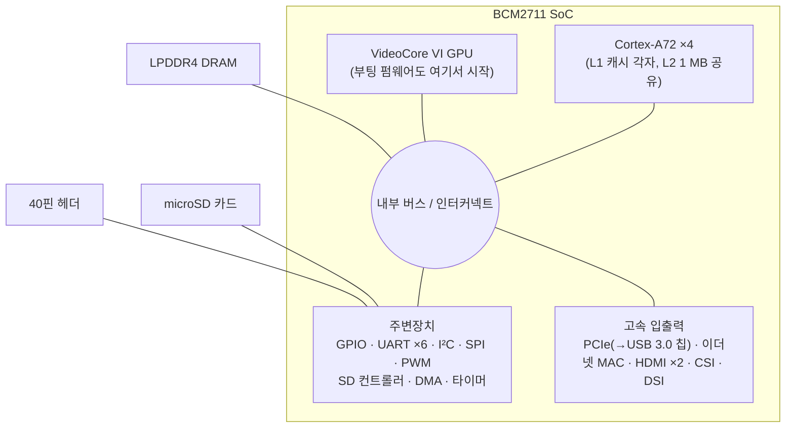
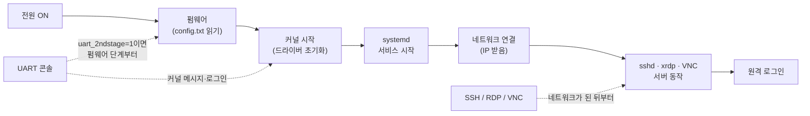
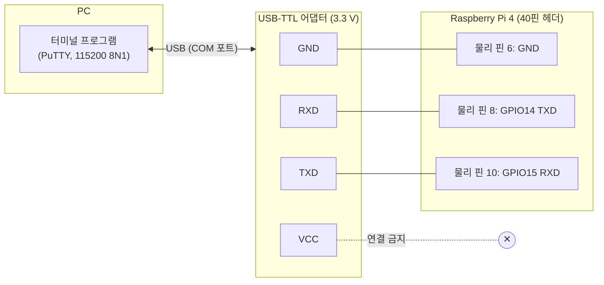

# 3장. Raspberry Pi 하드웨어와 OS 설치

> **학습 목표**
> - Raspberry Pi가 어떤 종류의 컴퓨터(SBC)인지 설명하고, 마이크로컨트롤러 보드(Arduino, Pico)와 무엇이 다른지 비교할 수 있다.
> - Raspberry Pi의 역사와 주요 모델, Raspberry Pi OS의 버전 이름(코드명)을 표로 정리할 수 있다.
> - Raspberry Pi 4 Model B 보드에서 SoC, 메모리, 전원, 영상·USB·네트워크 포트, 40핀 헤더, microSD 슬롯의 위치와 역할을 말할 수 있다.
> - 전원 어댑터의 조건(5 V, 3 A)과 저전압의 증상을 설명하고, `vcgencmd get_throttled`로 전원 상태를 확인할 수 있다.
> - Raspberry Pi Imager로 OS를 microSD 카드에 기록하면서 사용자 지정 설정(호스트 이름, 사용자, SSH, Wi-Fi, 로캘)을 할 수 있다.
> - 부트 파티션(`/boot/firmware`)의 `config.txt`와 `cmdline.txt`가 하는 일을 이해하고, UART 콘솔을 위한 설정 줄의 의미를 하나씩 설명할 수 있다.
> - HDMI·UART·SSH·RDP·VNC 접속 방식의 장단점을 비교하고, USB-TTL 어댑터로 시리얼 콘솔에 로그인할 수 있다.
> - IP 주소를 찾아 SSH로 접속하고, NetworkManager(`nmcli`)로 고정 IP를 설정할 수 있다.
> - `uname`, `free`, `df`, `lsblk`, `vcgencmd` 등으로 시스템 상태를 점검하는 스크립트를 작성할 수 있다.

[1장](01_embedded_system.md)에서 Raspberry Pi 4가 SoC를 쓴 MPU 계열 보드이고, 엄밀히 말하면 임베디드 시스템이라기보다 **범용 소형 컴퓨터**라는 것을 보았다. [2장](02_computer_arch_arm.md)에서는 그 안의 ARM 프로세서와 메모리 맵, 버스 구조를 보았다. 이 장에서는 드디어 보드를 손에 들고 **운영체제를 설치하고 처음 접속하는 데까지** 간다.

1학기 마이크로컨트롤러 실습에서는 프로그램을 컴파일해서 보드의 플래시 메모리에 써 넣으면 리셋 후 곧바로 내 프로그램이 돌았다. Raspberry Pi는 다르다. 보드 위에는 내 프로그램을 받아 줄 운영체제가 아직 없다. PC를 새로 샀을 때 Windows를 먼저 설치하듯이, Raspberry Pi도 **먼저 OS를 저장장치(microSD 카드)에 설치**해야 한다. 그리고 우리 수업은 모니터와 키보드를 Pi에 꽂지 않고 **PC 화면에서 Pi를 다루는 방식**으로 진행한다. 그래서 OS를 설치할 때 몇 가지 설정을 미리 해 두어야 하는데, 이 장은 그 설정이 **왜 필요한지**를 하나씩 풀어서 설명한다.

이 장에서 다루지 않는 것도 미리 정리해 둔다.

| 주제 | 다루는 곳 |
|---|---|
| 전원을 켠 뒤 커널이 올라오기까지의 부팅 과정 전체, device tree, 커널 빌드 | [7장](07_boot_kernel.md) |
| 40핀 헤더 전체 핀 맵, GPIO의 전기적 특성 | [8장](08_gpio_pigpio.md) |
| Linux 명령어와 셸 | [4장](04_linux_shell.md) |
| `apt`, `systemctl`, 디스크·사용자 관리 | [5장](05_sysadmin.md) |
| VS Code Remote-SSH로 개발하기 | [6장](06_c_build.md) |
| UART 프레임과 통신 프로토콜 | [12장](12_communication.md) |

---

## 3.1 Raspberry Pi란 무엇인가

### 3.1.1 신용카드만 한 컴퓨터: SBC

**왜 이런 보드가 필요했을까?** 컴퓨터를 배우려면 컴퓨터가 있어야 한다. 그런데 2000년대 중반의 PC는 비쌌고, 가정의 PC는 대개 가족이 함께 쓰는 물건이라 아이가 마음대로 뜯어 보거나 OS를 지웠다 깔았다 할 수 없었다. 망가뜨려도 부담 없는, 싸고 작은 컴퓨터가 필요했다.

**비유로 보자.** 데스크톱 PC는 메인보드, CPU, 메모리, 그래픽카드, 저장장치를 각각 사서 케이스에 조립하는 **조립식 주택**과 같다. Raspberry Pi는 이 모든 것을 손바닥만 한 기판 한 장에 올려놓은 **원룸형 소형 주택**이다. 방은 하나뿐이지만 부엌(CPU), 수납장(메모리), 현관(USB·네트워크)이 다 들어 있어 혼자 살기에는 충분하다.

**정확한 정의.** 이렇게 CPU, 메모리, 입출력 장치를 **기판 한 장(single board)** 위에 모두 갖춘 컴퓨터를 **단일 보드 컴퓨터**(SBC, Single Board Computer)라고 한다. Raspberry Pi는 영국의 라즈베리파이 재단(Raspberry Pi Foundation)이 교육용으로 만든 SBC이며, 키보드·마우스·모니터만 연결하면 그대로 PC처럼 쓸 수 있다. 실제 제조와 판매는 재단의 자회사인 Raspberry Pi Ltd가 맡는다.

**흔한 오해.** "Raspberry Pi는 아두이노 같은 마이크로컨트롤러 보드의 고급형이다"라고 생각하기 쉽다. 그렇지 않다. 아래 3.1.2절에서 보듯이 둘은 **컴퓨터의 종류 자체가 다르다**. Raspberry Pi 4는 스마트폰과 같은 부류의 응용 프로세서(MPU)를 쓰고, 운영체제가 있어야 동작한다.

### 3.1.2 SBC와 마이크로컨트롤러 보드

라즈베리파이 재단은 SBC만 만드는 것이 아니다. 2021년부터는 **Raspberry Pi Pico**라는 마이크로컨트롤러(MCU) 보드도 만든다. 같은 회사의 두 제품을, 1학기에 쓴 Arduino와 함께 비교해 보면 SBC와 MCU 보드의 차이가 분명해진다.

| 항목 | Raspberry Pi 4 Model B (SBC) | Raspberry Pi Pico / Pico 2 (MCU 보드) | Arduino Uno 계열 (MCU 보드) |
|---|---|---|---|
| 프로세서 | BCM2711 SoC, Cortex-A72 4코어, 1.5~1.8 GHz | RP2040(Cortex-M0+ 2코어, 133 MHz) / RP2350(Cortex-M33 2코어, 150 MHz) | 8비트 또는 32비트 MCU, 수십 MHz |
| 메모리 | 외부 LPDDR4 DRAM 1~8 GB | 칩 내부 SRAM 264 KB / 520 KB | 칩 내부 SRAM 수 KB~수십 KB |
| 저장장치 | microSD 카드(수십 GB) | 보드의 플래시 2 MB / 4 MB | 칩 내부 플래시 수십 KB~ |
| 운영체제 | **필요**(Linux) | 없음(베어메탈) 또는 RTOS | 없음(베어메탈) |
| 전원을 켜면 | 수십 초 동안 OS 부팅 후 로그인 | 즉시 내 프로그램 실행 | 즉시 내 프로그램 실행 |
| 프로그램 올리기 | OS 위에서 파일로 복사하고 실행 | PC에서 컴파일한 이미지를 플래시에 기록 | PC에서 컴파일한 이미지를 플래시에 기록 |
| 강점 | 네트워크, 파일, 멀티태스킹, 큰 프로그램 | 정확한 타이밍, 저전력, 즉시 시작 | 단순함, 풍부한 예제 |
| 약점 | 하드 리얼타임 어려움, 전력 소모, SD 카드 손상 위험 | 큰 데이터·네트워크 처리 부담 | 성능·메모리 한계 |

> 📌 **보강:** Pico는 RP2040(Arm Cortex-M0+ 듀얼코어, 264 KB SRAM), 2024년에 나온 Pico 2는 RP2350(Arm Cortex-M33 듀얼코어 또는 RISC-V Hazard3 듀얼코어 중 선택, 150 MHz, 520 KB SRAM)을 쓴다. 출처: [Raspberry Pi Documentation – Microcontrollers](https://www.raspberrypi.com/documentation/microcontrollers/), [Raspberry Pi Pico 2 제품 페이지](https://www.raspberrypi.com/products/raspberry-pi-pico-2/)

이 표의 "전원을 켜면" 줄이 핵심이다. MCU 보드는 리셋되면 플래시 0번지부터 내 프로그램을 곧바로 실행한다. Raspberry Pi는 전원을 켜면 펌웨어 → 커널 → 각종 서비스 순서로 **운영체제가 먼저 올라오고**, 내 프로그램은 그 위에서 하나의 프로세스로 실행된다. 이 차이가 [1장](01_embedded_system.md)의 "1인 분식집 사장님(베어메탈)"과 "레스토랑 총지배인(OS)" 비유이다. 이 장에서 OS 설치에 공을 들이는 이유도 여기에 있다.

### 3.1.3 왜 임베디드 교육에 Raspberry Pi인가

강의 슬라이드는 교육용 플랫폼으로서의 강점을 다음 다섯 가지로 정리한다.

| 강점 | 설명 |
|---|---|
| 실제 Linux 환경 | 완전한 Linux를 구동하므로, 실무와 같은 환경에서 명령어·빌드·프로세스를 배운다 |
| 하드웨어 접근성 | 40핀 헤더의 GPIO로 LED·센서·모터를 직접 제어하며 소프트웨어와 하드웨어의 상호작용을 이해한다 |
| 다양한 언어 | C/C++, Python, Java 등 수준과 목적에 맞는 언어를 고른다 |
| 라이브러리와 커뮤니티 | 전 세계 사용자가 많아 예제와 질문 답변을 쉽게 찾는다 |
| 실제 프로젝트 | LED 제어부터 웹 서버, IoT 기기까지 동작하는 결과물을 만들 수 있어 동기 부여가 된다 |

여기에 [1장](01_embedded_system.md) 1.14절에서 본 이유(SoC를 써서 CPU·네트워크·주변장치가 한 칩에 있다, Linux는 무료이고 소스가 공개되어 있다)가 더해진다. 강의에서 강조한 것처럼 **Raspberry Pi 자체를 임베디드 시스템으로 보기보다는, 임베디드 Linux와 하드웨어 제어를 배우기 위한 학습 플랫폼**으로 보는 것이 정확하다. Raspberry Pi와 비슷한 SBC(BeagleBone, Orange Pi, Jetson 등)도 많으며, 이 과목에서 배운 개념은 그 보드들에도 그대로 통한다.

---

## 3.2 역사와 모델

### 3.2.1 탄생 배경

라즈베리파이의 뿌리는 1980년대 영국 BBC 방송의 컴퓨터 교육 프로젝트인 **BBC Micro**에 있다. 그 시절 영국의 많은 아이들이 학교에서 BBC Micro로 프로그래밍을 배웠다. 그런데 2000년대에 들어 컴퓨터가 "쓰기만 하는 가전제품"이 되면서, 대학 컴퓨터학과 지원자들의 프로그래밍 경험이 오히려 줄어들었다.

| 연도 | 사건 |
|---|---|
| 2006 | 영국 케임브리지 대학교의 에벤 업튼(Eben Upton) 박사와 동료들이 "어린이의 프로그래밍 학습 확대"와 "부모의 비용 부담 경감"을 목표로 저렴한 컴퓨터 개발을 시작한다. 1차 목표는 **비용 절감**이었다 |
| 2009 | 컴퓨터 교육 증진을 목적으로 영국에 **라즈베리파이 재단**(Raspberry Pi Foundation)이 설립된다 |
| 2011 | 알파 보드와 프로토타입을 공개한다 |
| 2012 | 첫 제품 **Raspberry Pi Model B**가 35달러에 출시된다("35달러 컴퓨터") |

재단은 개발을 담당하고 제조는 위탁한다(강의 슬라이드는 영국·미국·일본 시장용은 Sony 영국 공장, 중국 시장용은 별도 업체가 생산한다고 소개한다). 처음 가격은 35달러였지만 지금 Pi 4는 메모리 용량에 따라 그보다 비싸다. 그래도 강의에서 말했듯이 같은 성능의 PC와 비교하면 **가성비가 매우 뛰어난 플랫폼**이다.

### 3.2.2 모델 연표

| 출시 | 모델 | SoC / CPU | 메모리 | 주요 변화 |
|---|---|---|---|---|
| 2012 | Raspberry Pi 1 Model B | BCM2835 / ARM1176JZF-S 1코어 700 MHz | 256 MB → 512 MB | 첫 제품. 26핀 헤더, SD 카드 |
| 2014 | Raspberry Pi 1 Model B+ | BCM2835 | 512 MB | **GPIO 40핀**으로 확장, microSD |
| 2015 | Raspberry Pi 2 Model B | BCM2836 / Cortex-A7 4코어 900 MHz | 1 GB | 쿼드코어 |
| 2015 | Raspberry Pi Zero | BCM2835 1 GHz | 512 MB | 5달러 초소형 |
| 2016 | Raspberry Pi 3 Model B | BCM2837 / Cortex-A53 4코어 1.2 GHz (64비트) | 1 GB | **Wi-Fi·Bluetooth 내장** |
| 2018 | Raspberry Pi 3 Model B+ | BCM2837B0 / 1.4 GHz | 1 GB | 기가비트 이더넷(내부 USB 2.0 연결이라 실속도는 약 300 Mbps) |
| 2019 | **Raspberry Pi 4 Model B** | **BCM2711 / Cortex-A72 4코어 1.5 GHz (이후 1.8 GHz)** | 1·2·4·8 GB LPDDR4 | USB 3.0, 진짜 기가비트 이더넷, micro-HDMI 2개(4K), USB-C 전원 |
| 2020 | Raspberry Pi 400 | BCM2711 | 4 GB | 키보드 일체형 |
| 2021 | Raspberry Pi Pico | RP2040 / Cortex-M0+ 2코어 133 MHz | 264 KB SRAM | 재단의 첫 **마이크로컨트롤러** 보드 |
| 2021 | Raspberry Pi Zero 2 W | RP3A0 / Cortex-A53 4코어 1 GHz | 512 MB | Zero 크기에 쿼드코어 |
| 2022 | Raspberry Pi Pico W | RP2040 + 무선 칩 | 264 KB SRAM | Pico에 Wi-Fi(이후 Bluetooth) 추가 |
| 2023 | **Raspberry Pi 5** | **BCM2712 / Cortex-A76 4코어 2.4 GHz** | 4·8 GB (이후 2·16 GB 추가) | 입출력 전용 칩 **RP1**, PCIe, 전원 버튼, 전용 UART 커넥터 |
| 2024 | Raspberry Pi Pico 2 | RP2350 / Cortex-M33 2코어 (또는 RISC-V) 150 MHz | 520 KB SRAM | 보안 기능 강화 |

> 📌 **보강:** 강의 슬라이드의 연표(2012 Model B ~ 2023 Pi 5)에 Zero, 400, Zero 2 W, Pi 5의 SoC 이름(BCM2712), Pico 2를 더했다. 첫 Model B는 256 MB로 출시되었다가 2012년 말부터 512 MB로 바뀌었다. Pi 4는 출시 때 1.5 GHz였으나 이후 생산분은 1.8 GHz로 동작한다(제품 브리프 기준). 출처: [Raspberry Pi Documentation – Processors](https://www.raspberrypi.com/documentation/computers/processors.html), [Raspberry Pi hardware – Models and specifications](https://www.raspberrypi.com/documentation/computers/raspberry-pi.html), [Raspberry Pi 4 Model B 사양](https://www.raspberrypi.com/products/raspberry-pi-4-model-b/specifications/), [Raspberry Pi 4 product brief](https://datasheets.raspberrypi.com/rpi4/raspberry-pi-4-product-brief.pdf)

**모델 번호를 외울 필요는 없다.** 강의에서 말한 것처럼 이 계열은 제품이 매우 빨리 바뀌므로, 숫자를 외우기보다 "숫자가 크면 대체로 최신·고성능", "Cortex-A는 고성능, Cortex-M은 저전력" 정도를 알고 **필요할 때 데이터시트를 찾아볼 수 있으면 된다.** 이 수업은 Pi 5가 나온 뒤에도 Pi 4로 진행한다. Pi 4로도 웬만한 일은 다 할 수 있고, 수업에서 쓰는 pigpio 라이브러리가 Pi 5를 지원하지 않기 때문이다([8장](08_gpio_pigpio.md) 참고).

### 3.2.3 모델 이름 읽는 법

| 이름 요소 | 의미 | 예 |
|---|---|---|
| 숫자(1~5) | 세대 | Raspberry Pi **4** |
| Model B | 이더넷과 USB가 많은 표준형 | Pi 4 Model **B** |
| Model A | 이더넷을 빼고 작고 싸게 만든 형 | Pi 3 Model **A+** |
| + (플러스) | 같은 세대의 개량판 | Pi 3 Model B<strong>+</strong> |
| Zero | 초소형·초저가 | Pi **Zero 2 W** (W = 무선 내장) |
| 400 / 500 | 키보드 일체형 | Pi **400** |
| Compute Module(CM) | 제품에 꽂아 쓰는 모듈형(커넥터만 있고 포트 없음) | **CM4**, CM5 |
| Pico | 마이크로컨트롤러 보드 | **Pico**, Pico W, Pico 2 |

Compute Module은 실제 임베디드 제품에 Raspberry Pi를 넣을 때 쓰는 형태이다. 회사는 CM을 꽂을 자기만의 기판(캐리어 보드)을 설계하고, 소프트웨어는 우리가 Pi 4에서 배운 것을 그대로 쓴다. 그래서 Pi 4에서 배운 내용이 실제 제품 개발로 이어진다.

<!-- 그림 필요: Raspberry Pi 실습 슬라이드 "모델별 하드웨어 사양 비교", "모델에 따라서 단자수의 차이" (Pi 1 Model B 26핀 vs Pi 3/4 40핀 사진) -->

---

## 3.3 Raspberry Pi OS

### 3.3.1 Raspberry Pi OS는 Debian 계열 Linux이다

**Raspberry Pi OS**는 라즈베리파이 재단이 공식 배포하는 운영체제이다. 새로 만든 OS가 아니라 **Debian**(데비안) Linux를 바탕으로, Raspberry Pi 하드웨어에 맞춘 커널·펌웨어·설정 도구·데스크톱을 더한 **배포판**(distribution)이다. Ubuntu도 Debian에서 갈라져 나온 배포판이므로, Ubuntu에서 쓰던 `apt` 명령과 대부분의 사용법이 그대로 통한다.

> **배포판이란?** Linux라는 이름은 엄밀히는 **커널**만을 가리킨다. 커널만으로는 아무것도 할 수 없으므로, 셸·명령어·라이브러리·패키지 관리자·설치 프로그램을 묶어 "바로 쓸 수 있는 OS"로 만든 것이 배포판이다. 같은 엔진(커널)을 얹은 서로 다른 자동차 브랜드(배포판)라고 생각하면 된다. 자세한 구조는 [4장](04_linux_shell.md)에서 다룬다.

이름도 바뀌어 왔다. 처음에는 **Raspbian**(Raspberry + Debian)이라는 커뮤니티 프로젝트였고, 2020년부터 공식 명칭이 **Raspberry Pi OS**로 바뀌었다. 오래된 자료나 강의 녹취에 "라즈비안"이라는 말이 나오면 Raspberry Pi OS와 같은 것으로 읽으면 된다.

### 3.3.2 버전 이름(코드명)

Debian은 버전마다 영화 「토이 스토리」 캐릭터 이름을 코드명으로 붙이고, Raspberry Pi OS는 그 코드명을 그대로 쓴다. 인터넷 자료를 볼 때 **어느 버전 기준인지**를 먼저 확인해야 하는 이유는, 버전에 따라 파일 경로와 네트워크 설정 방법이 바뀌기 때문이다.

| Raspberry Pi OS 버전 이름 | Debian 버전 | 공개 시기 | 이 교재와 관련된 변화 |
|---|---|---|---|
| Wheezy (위지) | 7 | 2013 | Raspbian 초기 |
| Jessie (제시) | 8 | 2015 | systemd 도입 |
| Stretch (스트레치) | 9 | 2017 | |
| Buster (버스터) | 10 | 2019 | Pi 4 출시와 함께. 2020년 Raspberry Pi OS로 이름 변경 |
| Bullseye (불스아이) | 11 | 2021 | 2022년 64비트 정식판, 기본 사용자 `pi` 폐지 |
| **Bookworm (북웜)** | **12** | **2023** | **이 교재의 기준.** 부트 파티션 경로가 `/boot/firmware`로 바뀜, 네트워크 관리가 **NetworkManager**로 바뀜, 데스크톱이 Wayland로 바뀜 |
| Trixie (트릭시) | 13 | 2025 | 최신판. Imager의 기본 선택이 이것으로 바뀜 |

> **원본 자료 정정:** 강의 슬라이드의 코드명 표는 Bullseye(11)에서 끝나 있다. 이 교재가 기준으로 삼는 <strong>Bookworm(Debian 12)</strong>과 그 뒤의 Trixie(Debian 13)를 추가했다.

> 📌 **보강:** Bookworm은 2023년 10월에 공개되었으며 부트 파티션 마운트 위치를 `/boot`에서 `/boot/firmware`로 옮기고 네트워크 관리를 dhcpcd에서 NetworkManager로 바꾸었다. Debian 13 기반 **Trixie**는 2025년 10월에 공개되었고, 같은 해 11월의 **Raspberry Pi Imager 2.0**부터는 Trixie가 기본 선택이며 초기 설정을 cloud-init 방식으로 기록한다. 출처: [Bookworm — the new version of Raspberry Pi OS](https://www.raspberrypi.com/news/bookworm-the-new-version-of-raspberry-pi-os/), [Raspberry Pi OS 릴리스 노트와 뉴스](https://www.raspberrypi.com/news/), [A new Raspberry Pi Imager](https://www.raspberrypi.com/news/a-new-raspberry-pi-imager/), [Cloud-init on Raspberry Pi OS](https://www.raspberrypi.com/news/cloud-init-on-raspberry-pi-os/)

**이 교재는 왜 최신판(Trixie)이 아니라 Bookworm인가?** 수업 예제(pigpio 패키지, 경로, 출력 예시)가 모두 Bookworm에서 확인된 것이기 때문이다. OS를 바꾸면 패키지 구성과 설정 파일이 달라져 실습이 예상과 다르게 동작할 수 있다. 실제 제품 개발에서도 **검증된 버전을 고정해 쓰는 것**이 원칙이다. 그래서 실습 3-1에서 Imager의 OS 목록 중 **Bookworm 기반 64비트 항목을 일부러 골라야 한다.** 이 장의 설명 대부분(`config.txt`, UART, SSH)은 Trixie에서도 같지만, 초기 설정 파일의 형식 등 세부 사항은 다를 수 있다.

### 3.3.3 OS 종류: 데스크톱, Lite, 64비트

같은 Bookworm 안에서도 여러 이미지가 있다.

| 이미지 | 내용 | 언제 쓰나 |
|---|---|---|
| Raspberry Pi OS **with desktop** | 그래픽 데스크톱 포함(기본) | 모니터를 연결하거나 원격 데스크톱을 쓸 때. **이 수업의 기본** |
| Raspberry Pi OS **Lite** | 데스크톱 없음, 명령줄만 | 서버, 헤드리스 장비, 작은 SD 카드 |
| Raspberry Pi OS **Full** | 데스크톱 + 추천 프로그램(오피스 등) | 일반 PC 대용 |
| 32비트 / **64비트** | CPU 동작 모드 | Pi 4·5는 **64비트**를 고른다 |

PC에 32비트·64비트 Windows가 있듯이, Raspberry Pi OS도 두 가지가 있다. Pi 4의 Cortex-A72는 64비트(AArch64) CPU이므로 64비트를 고른다. 공식 입문서도 "Pi 4나 Pi 5라면 특별한 이유가 없는 한 64비트를 선택하라"고 권한다. 64비트 OS에서는 `uname -m`이 `aarch64`를 출력한다(3.13절).

> **역사 노트: NOOBS와 Raspbian 시절의 설치법**
>
> 2020년 무렵까지는 설치 방법이 지금과 달랐다. 재단 홈페이지에서 **NOOBS**(New Out Of the Box Software)라는 설치 도우미 파일 묶음을 내려받아 FAT32로 포맷한 SD 카드에 **그냥 복사**하고, Pi를 모니터·키보드와 함께 부팅해 화면에서 Raspbian을 골라 설치했다. NOOBS Lite는 부트 파일만 담고 나머지는 네트워크로 받았다. 또는 Raspbian 이미지 파일(`.img`)을 받아 Etcher 같은 "이미지 굽기" 프로그램으로 SD 카드에 썼다. 이 시절 기본 계정은 `pi` / `raspberry`였고, SSH를 켜려면 부트 파티션에 `ssh`라는 빈 파일을 만들었다.
>
> 지금은 이 과정을 **Raspberry Pi Imager** 하나가 대신한다. Imager는 OS 이미지를 인터넷에서 직접 받아 SD 카드에 쓰고, 사용자 계정과 SSH까지 미리 설정해 준다. 오래된 블로그 글에서 NOOBS, `pi/raspberry`, `/boot/config.txt`, `/etc/dhcpcd.conf`가 보이면 **옛 버전 기준 글**이라고 판단하면 된다.

---

## 3.4 Raspberry Pi 4 Model B 보드 둘러보기

### 3.4.1 사양

| 항목 | Raspberry Pi 4 Model B |
|---|---|
| SoC | Broadcom **BCM2711** |
| CPU | Arm **Cortex-A72** 4코어, 64비트(Armv8-A). 출시 때 1.5 GHz, 이후 생산분 1.8 GHz |
| GPU | VideoCore VI (OpenGL ES 3.1, Vulkan 1.x) |
| 메모리 | **LPDDR4**-3200 SDRAM 1·2·4·8 GB (모델별) |
| 저장장치 | **microSD 카드 슬롯**(OS와 데이터 저장). 보드에 eMMC 없음 |
| 무선 | 2.4/5 GHz Wi-Fi(802.11ac), **Bluetooth 5.0**, BLE |
| 유선 네트워크 | **기가비트 이더넷**(RJ45). PoE HAT을 달면 랜선으로 전원 공급 가능 |
| USB | **USB 3.0** 포트 2개(파란색), **USB 2.0** 포트 2개(검은색) |
| 영상 출력 | **micro-HDMI** 포트 2개(최대 4Kp60), 2-lane MIPI **DSI** 디스플레이 커넥터 |
| 카메라 | 2-lane MIPI **CSI** 카메라 커넥터 |
| 오디오 | 4극 3.5 mm 스테레오 오디오·컴포지트 비디오 단자 |
| GPIO | **40핀** 헤더(GPIO, UART, I²C, SPI, PWM, 3.3 V/5 V/GND) |
| 전원 | **USB-C 5 V, 최소 3 A** (또는 GPIO 헤더의 5 V 핀으로 5 V 3 A) |
| 동작 온도 | 주변 온도 **0~50 °C** |
| 크기 | 85 mm × 56 mm |

> 📌 **보강:** 위 표는 강의 슬라이드·녹취의 사양에 공식 사양 페이지와 제품 브리프의 값(1.8 GHz, LPDDR4-3200, Bluetooth 5.0, 4Kp60, 동작 온도)을 더해 정리한 것이다. 출처: [Raspberry Pi 4 Model B specifications](https://www.raspberrypi.com/products/raspberry-pi-4-model-b/specifications/), [Raspberry Pi 4 product brief](https://datasheets.raspberrypi.com/rpi4/raspberry-pi-4-product-brief.pdf)

사양표에서 놓치기 쉬운 두 가지를 강의에서 강조했다.

- **동작 온도 0~50 °C.** 값이 싸다고 겨울철 영하로 내려가는 옥외 장비(예: 옥외 중계기)에 그대로 넣으면 겨울에 동작하지 않을 수 있다. 제품에 쓰려면 온도를 범위 안으로 유지하는 장치가 필요하다. 반대로 케이스 안에서 오래 무거운 일을 시키면 SoC 온도가 올라가 클록이 자동으로 낮아진다(스로틀링, 3.5.3절).
- **SD 카드 용량.** 데스크톱 포함 OS만으로도 수 GB를 차지한다. 실습과 개발 도구 설치를 생각하면 **32 GB**를 권한다(8 GB 카드는 OS만으로 거의 찬다).

### 3.4.2 보드 위의 부품 위치

보드를 GPIO 헤더가 위쪽, USB·이더넷 포트가 오른쪽에 오도록 놓고 살펴보자.

<!-- 그림 필요: Raspberry Pi 실습 슬라이드 "Raspberry Pi 4 Model B" 보드 사진과 부품 이름표 (또는 Beginner's Guide 5th Ed. Figure 1-x 형식의 번호 붙은 보드 그림) -->

| 위치 | 부품 | 하는 일 |
|---|---|---|
| 가운데 금속 뚜껑 | **BCM2711 SoC** | CPU·GPU·주변장치가 든 칩. 방열판을 붙이는 곳 |
| SoC 옆 검은 칩 | **LPDDR4 RAM** | 주기억장치(DRAM) |
| 위쪽 긴 핀 두 줄 | **40핀 GPIO 헤더** | 외부 회로 연결. UART 콘솔도 여기서 나온다 |
| 오른쪽 | USB 3.0 ×2(파랑), USB 2.0 ×2(검정), 기가비트 이더넷 | 키보드·저장장치·네트워크 |
| 아래쪽 왼쪽부터 | **USB-C 전원**, micro-HDMI 0, micro-HDMI 1, 오디오 단자 | 전원과 영상·소리 출력. 모니터는 **HDMI 0**(전원 쪽)에 연결한다 |
| 아래쪽 가운데 | **CSI** 카메라 커넥터 | 리본 케이블로 카메라 모듈 연결 |
| 왼쪽 가장자리 | **DSI** 디스플레이 커넥터 | 공식 터치스크린 연결 |
| 뒷면 왼쪽 | **microSD 카드 슬롯** | OS가 들어 있는 카드. 여기서 부팅한다 |
| 왼쪽 아래 모서리 | **LED 두 개** | 빨강 = 전원(PWR), 초록 = SD 카드 접근·상태(ACT) |
| 위쪽 무선 칩 근처 | Wi-Fi·Bluetooth 모듈 | 무선 통신(안테나는 기판 패턴) |

강의에서 말한 대로 이 보드는 앞뒷면만 있는 단순한 양면 기판이 아니라 가운데에도 여러 층이 있는 **다층 기판**(multi-layer PCB)이다. 1장의 설계 절차에서 "칩을 고르고 회로를 설계하고 PCB를 배치·배선하는" 하드웨어 단계의 결과물이 바로 이 보드이다.

**LED 두 개는 부팅 진단에 쓴다.** 빨간 LED는 전원이 정상이면 계속 켜져 있다. 초록 LED는 SD 카드를 읽고 쓸 때 깜빡이며, 부팅에 실패하면 정해진 횟수로 깜빡여 원인을 알려 준다(트러블슈팅 표 참고).

### 3.4.3 BCM2711 SoC 안을 들여다보기

BCM2711은 Broadcom이 만든 **SoC**(System on Chip)이다. ARM이 설계한 Cortex-A72 코어 4개를 가져와, 그 주변에 GPU와 각종 주변장치를 버스로 붙여 한 칩으로 만들었다. [2장](02_computer_arch_arm.md)에서 본 "ARM은 코어 설계(IP)를 팔고, 칩 회사는 그 코어에 자기 주변장치를 붙여 SoC를 만든다"는 구조의 실제 예이다.



- **데이터시트.** BCM2711 전체 데이터시트는 공개되지 않았고, 주변장치 부분만 담은 **BCM2711 ARM Peripherals** 문서가 공개되어 있다(강의 자료 "Raspberry Pi Codes" §1.1에 링크). 1학기 MCU 데이터시트처럼 레지스터 표가 나온다. 강의에서 말했듯이 메인 ARM 코어는 어느 칩이든 기본적으로 같고, 칩마다 다른 것은 주변장치이기 때문에 주변장치 문서만으로 충분하다. 처음부터 다 읽을 필요는 없고, **필요할 때 찾아볼 수 있도록 어디 있는지 알아 두면 된다.** 출처: [BCM2711 ARM Peripherals (raspberrypi.com)](https://datasheets.raspberrypi.com/bcm2711/bcm2711-peripherals.pdf)
- **GPU가 먼저 깨어난다.** PC와 달리 Raspberry Pi는 전원을 켜면 ARM CPU가 아니라 **VideoCore GPU 쪽의 펌웨어가 먼저** 실행되어 SD 카드에서 설정 파일(`config.txt`)과 커널을 읽은 뒤 ARM 코어를 깨운다. 그래서 `config.txt`가 CPU보다 먼저 읽히는 "하드웨어 설정 파일" 역할을 한다. 자세한 부팅 순서는 [7장](07_boot_kernel.md)에서 다룬다.

### 3.4.4 40핀 헤더 개요

40핀 헤더는 2.54 mm 간격의 2열 핀으로, Raspberry Pi와 바깥 세상을 잇는 통로이다. 전체 핀 맵과 전기적 특성은 [8장](08_gpio_pigpio.md)에 있으므로 여기서는 이 장에 필요한 것만 짚는다.

| 분류 | 핀 | 이 장과의 관계 |
|---|---|---|
| 전원 출력 | 3.3 V(물리 핀 1, 17), 5 V(물리 핀 2, 4) | USB-TTL 어댑터의 전원선은 **연결하지 않는다** |
| GND | 물리 핀 6, 9, 14, 20, 25, 30, 34, 39 | 시리얼 콘솔에서 **물리 핀 6**을 쓴다 |
| UART | **TXD = GPIO14 (물리 핀 8)**, **RXD = GPIO15 (물리 핀 10)** | **시리얼 콘솔에 사용** |
| I²C, SPI, PWM, 범용 GPIO | 나머지 | [8장](08_gpio_pigpio.md), [12장](12_communication.md) |

헤더를 볼 때는 **SD 카드 쪽이 위**가 되게 놓으면 왼쪽 열이 홀수(1, 3, 5, …), 오른쪽 열이 짝수(2, 4, 6, …)이다. 1번 핀은 기판 뒷면에서 사각형 패드로 표시되어 있다. 시리얼 콘솔에 쓰는 6, 8, 10번은 **오른쪽 열의 위에서 세 번째, 네 번째, 다섯 번째**이다(1·2번째인 2, 4번은 5 V이므로 건드리지 않는다).

**Pi 4에는 UART 전용 커넥터가 없다.** 강의에서 말했듯이 다른 보드는 디버그용 UART 포트가 따로 나와 있는 경우가 많은데, Pi 4는 UART가 **GPIO 헤더 핀으로만** 나온다. (Pi 5에는 micro-HDMI 사이에 3핀 UART 커넥터가 따로 생겼다.) 그래서 점프선으로 헤더 핀에 직접 연결한다.

**핀 맵을 Pi에서 바로 보려면** 로그인한 뒤 `pinout` 명령을 실행한다([8장](08_gpio_pigpio.md) 8.2절).

<!-- 그림 필요: Raspberry Pi 실습 슬라이드 "Raspberry Pi 4 Model B" GPIO 핀맵 그림 (6·8·10번 핀 강조) -->

---

## 3.5 준비물과 전원

### 3.5.1 준비물

| 구분 | 항목 | 비고 |
|---|---|---|
| 보드 | Raspberry Pi 4 Model B | 케이스·방열판 권장 |
| 저장장치 | **microSD 카드 32 GB** 권장 (최소 16 GB) | Class 10 / A1 이상 |
| 카드 리더 | USB microSD 카드 리더 | PC에 SD 슬롯이 없을 때 |
| 전원 | **USB-C 5 V 3 A** 어댑터 | 공식 27 W 어댑터(5.1 V 3 A) 등. PC USB 포트 금지 |
| 네트워크 | 랜 케이블 | 또는 Wi-Fi |
| 시리얼 | **USB-TTL 시리얼 어댑터(3.3 V 레벨)** | FT232·CP2102·CH340 계열, 또는 프로그래머 보드의 TTL 시리얼 포트 |
| 점프선 | 암-암(F-F) 3개, **서로 다른 색** | GND·TX·RX 구분용 |
| (선택) | micro-HDMI–HDMI 케이블, 모니터, USB 키보드·마우스 | 직접 연결 방식을 쓸 때 |
| PC 소프트웨어 | **Raspberry Pi Imager** | OS 기록 |
| PC 소프트웨어 | **PuTTY** (또는 Tera Term, MobaXterm) | 시리얼·SSH 터미널 |
| PC 소프트웨어 | USB-TTL 어댑터 드라이버 | 장치에 따라 Windows가 자동 설치 |
| PC 소프트웨어 | OpenSSH 클라이언트 | Windows 10/11에 기본 포함(`ssh` 명령) |

점프선을 서로 다른 색으로 준비하라는 것은 강의 슬라이드의 지시이다. 세 가닥이 모두 같은 색이면 TX와 RX를 바꿔 꽂아도 알아채기 어렵다. 예를 들어 **GND = 검정, Pi의 TX(핀 8)로 가는 선 = 노랑, Pi의 RX(핀 10)로 가는 선 = 초록**처럼 정해 두고 매번 같은 색을 쓰자.

### 3.5.2 전원: 왜 5 V 3 A인가

**왜 중요한가?** Raspberry Pi 4는 부팅 중이나 CPU를 많이 쓸 때, USB 장치를 꽂았을 때 순간적으로 큰 전류를 끌어간다. 전원이 이를 감당하지 못하면 전압이 순간적으로 떨어지고(**전압 강하**, voltage droop), 그러면 SoC가 오동작하거나 재부팅되고, 최악의 경우 SD 카드에 쓰던 파일이 깨진다.

**비유.** 수도관이 가늘면 샤워기와 세탁기를 동시에 틀었을 때 물살이 약해진다. 전원 어댑터의 전류 용량(A)은 수도관의 굵기와 같다. 평소에는 가는 관으로도 충분해 보이지만, 여러 곳에서 동시에 물을 쓰는 순간에 문제가 드러난다.

**정확한 조건.** Pi 4는 **USB-C로 5 V, 최소 3 A**를 요구한다. 공식 입문서는 Pi 5는 5 V 5 A, Pi 4는 5 V 3 A, Zero 2 W는 5 V 2.5 A(micro USB)를 권장한다고 적고 있다.

- **PC의 USB 포트로 전원을 넣지 않는다.** 강의에서 강조했듯이 PC USB 2.0 포트는 보통 500 mA(USB 3.0은 900 mA)까지만 보장하므로 Pi 4에는 부족하다.
- **휴대폰 충전기는 조심한다.** 고속 충전기는 5 V보다 높은 전압을 협상하는 방식이라 Pi에서는 5 V 저전류로만 동작할 수 있다. 공식 어댑터처럼 **5 V에서 3 A**를 명시한 제품을 쓴다.
- **케이블도 중요하다.** 가늘고 긴 케이블은 저항 때문에 전압이 떨어진다. 공식 어댑터가 5.0 V가 아니라 5.1 V를 내는 것도 케이블 전압 강하를 고려한 것이다.

### 3.5.3 저전압 경고와 `vcgencmd get_throttled` (📌 보강)

전원이 약하면 Raspberry Pi 스스로 알려 준다.

- 데스크톱 화면 오른쪽 위에 **번개 모양 아이콘**과 "low voltage warning"이 뜬다. 공식 입문서는 이 경고가 보이면 전원 어댑터를 바꿀 때까지 사용을 멈추라고 권한다.
- 커널 로그(`dmesg`, `journalctl -k`)에 `Undervoltage detected!`가 찍힌다.
- 모니터가 없는 우리 환경에서는 명령으로 확인한다.

```bash
vcgencmd get_throttled
```

> 출력 출처: Pi 4 실기기 실행 결과(2026-10)

```
throttled=0x0
```

`0x0`이면 정상이다. 0이 아니면 아래 비트 표로 원인을 읽는다. 아래쪽 비트(0~3)는 **지금 이 순간**의 상태이고, 위쪽 비트(16~19)는 **부팅 이후 한 번이라도 있었는지**를 나타낸다.

| 비트 | 16진수 값 | 의미 |
|---|---|---|
| 0 | 0x1 | 지금 저전압 상태 |
| 1 | 0x2 | 지금 ARM 클록 상한이 걸려 있음 |
| 2 | 0x4 | 지금 스로틀링(클록 강제 감속) 중 |
| 3 | 0x8 | 지금 소프트 온도 한계 도달 |
| 16 | 0x10000 | 부팅 후 저전압이 **있었음** |
| 17 | 0x20000 | 부팅 후 클록 상한이 **있었음** |
| 18 | 0x40000 | 부팅 후 스로틀링이 **있었음** |
| 19 | 0x80000 | 부팅 후 소프트 온도 한계가 **있었음** |

예를 들어 `throttled=0x50000`은 0x10000 + 0x40000이므로 "지금은 괜찮지만 **부팅 후 저전압이 있었고, 그 때문에 스로틀링도 있었다**"는 뜻이다. 이런 값이 나오면 어댑터와 케이블을 바꾼다.

> 📌 **보강:** 저전압 경고 아이콘과 `get_throttled`의 비트 정의는 강의 자료에 없어 공식 문서로 확인했다. 출처: [Raspberry Pi Documentation – vcgencmd (get_throttled)](https://www.raspberrypi.com/documentation/computers/os.html#vcgencmd), *The Official Raspberry Pi Beginner's Guide* 5th Ed., Ch.3 (저장소 `Docs/BeginnersGuide-5thEd-Eng_v3.pdf`)

### 3.5.4 전원을 켜고 끄는 순서

- **켤 때:** SD 카드, 랜선, 시리얼 점프선, (쓴다면) 모니터·키보드를 **모두 연결한 뒤 전원을 마지막에** 꽂는다. Pi 4에는 전원 스위치가 없어 USB-C를 꽂는 순간 켜진다.
- **끌 때:** 전원선을 그냥 뽑지 않는다. OS가 SD 카드에 쓰는 중일 수 있기 때문이다. 먼저 명령으로 종료한다.

```bash
sudo shutdown -h now      # 또는 sudo poweroff
```

초록 LED가 몇 번 깜빡이다가 완전히 꺼지면(빨간 LED만 남으면) 그때 전원을 뽑는다. 재부팅은 `sudo reboot`이다. 전원을 함부로 뽑는 습관은 SD 카드 파일 시스템 손상의 가장 흔한 원인이다.

---

## 3.6 Raspberry Pi Imager로 OS 설치하기

### 3.6.1 OS를 "설치"한다는 것의 의미

PC에 Windows를 설치할 때는 USB 설치 디스크로 부팅해 설치 프로그램이 하드디스크에 파일을 하나씩 복사했다. Raspberry Pi는 다르다. 이미 **설치가 끝난 상태의 디스크 전체를 통째로 찍어 둔 파일**(이미지 파일, `.img`)을 SD 카드에 **그대로 덮어쓴다.** 그래서 흔히 "이미지를 **굽는다**"고 말한다.

**비유.** 책을 한 장씩 손으로 베껴 쓰는 것(설치 프로그램)이 아니라, 완성된 책을 **복사기로 통째로 복사**하는 것(이미지 기록)이다. 그래서 빠르고 결과가 늘 같다. 대신 SD 카드에 원래 있던 내용은 **모두 지워진다.**

이 일을 하는 공식 도구가 **Raspberry Pi Imager**이다. Windows·macOS·Linux용이 있고, 다음 일을 한 번에 해 준다.

1. 내 Pi 모델에 맞는 OS 목록을 보여 주고, 고른 이미지를 인터넷에서 내려받는다(압축 파일 `.img.xz`도 직접 쓸 수 있다).
2. 이미지를 SD 카드에 기록(Writing)하고, 제대로 써졌는지 다시 읽어 비교(Verifying)한다.
3. **OS 사용자 지정(OS customisation)**: 사용자 계정, 호스트 이름, Wi-Fi, SSH 등을 첫 부팅 때 자동으로 적용되도록 미리 기록해 둔다.

### 3.6.2 OS 사용자 지정: 왜 반드시 해야 하나

모니터와 키보드를 Pi에 연결하지 않는 **헤드리스**(headless, 3.8절) 방식에서는, 첫 부팅 때 화면에 뜨는 설정 마법사를 볼 수 없다. 그래서 Imager 단계에서 아래 항목을 **미리** 정해 둔다.

| 항목 | 의미 | 수업에서의 값(예) | 왜 필요한가 |
|---|---|---|---|
| 호스트 이름(hostname) | 네트워크에서 Pi를 부르는 이름 | `pi-07` (좌석 번호 등으로 **서로 다르게**) | 같은 이름이 여러 대면 `pi-07.local` 같은 이름 접속이 충돌한다 |
| 사용자 이름·암호 | 로그인 계정 | 수업에서 안내한 공통 사용자 이름, 본인이 기억할 암호 | **설정하지 않으면 로그인할 계정이 없다** |
| Wi-Fi(SSID·암호·국가) | 무선 접속 정보 | 실습실이 유선이면 생략 | 무선으로만 접속할 때 |
| 로캘(locale) | 시간대, 키보드 배열 | 시간대 `Asia/Seoul`, 키보드 `us` | 시각 표시, 키 입력이 맞도록 |
| SSH 사용 | 원격 셸 서버를 켬 | **켠다**, 암호 인증 | 나중에 네트워크로 접속하기 위해 |

**기본 사용자 `pi`가 없어졌다.** 예전 Raspberry Pi OS는 모든 Pi에 사용자 `pi`, 암호 `raspberry`가 미리 만들어져 있었다. 전 세계 Pi의 계정과 암호가 같으니, 인터넷에 연결된 Pi가 공격 프로그램의 쉬운 표적이 되었다. 여기에 일부 나라에서 "인터넷에 연결되는 기기에 기본 로그인 정보를 두지 못하게" 하는 법이 생기면서, 2022년 4월 릴리스부터 기본 사용자를 없애고 **첫 설정 때 반드시 사용자를 만들게** 바꾸었다. Imager에서 사용자를 만들지 않고 헤드리스로 부팅하면 로그인할 방법이 없다(강의에서 가장 흔했던 실수이다).

> **원본 자료 정정:** 강의 슬라이드는 기본 사용자 `pi`/`raspberrypi`가 "2023.8월 최근 버전에서" 없어졌다고 적고 있으나, 기본 사용자 제거는 <strong>2022년 4월 릴리스(Bullseye)</strong>부터이며 옛 기본 암호는 `raspberry`였다. 또 슬라이드의 사용자 지정 화면에 적힌 실습실 공통 암호는 교재에서 뺐다. 수업 공통 계정은 강의 시간에 안내받는다.
>
> 📌 출처: [An update to Raspberry Pi OS Bullseye (2022-04)](https://www.raspberrypi.com/news/raspberry-pi-bullseye-update-april-2022/)

**수업 공통 계정을 쓰는 이유.** 강의에서는 "키트를 매번 같은 것을 쓰지 못할 수도 있으므로, 다른 사람이 그 보드를 쓰더라도 무리가 없도록 수업에서 안내한 공통 사용자 이름·암호로 통일하자"고 했다. 실습실 안에서만 쓰는 보드이므로 편의를 택한 것이다. 반대로 **집이나 인터넷에 직접 연결되는 곳에서는 절대 쉬운 공통 암호를 쓰지 않는다.** 이 교재의 예시는 사용자 `student`, 호스트 이름 `pi-07`을 쓴다.

### 3.6.3 Imager 화면은 버전마다 다르다

Imager는 자주 바뀐다. 2025년 강의(Imager 1.8~1.9)와 2025년 11월에 나온 Imager 2.0의 화면은 다음처럼 다르다. 어느 쪽이든 **장치 → OS → 저장소 → 사용자 지정 → 쓰기** 순서는 같다.

| 단계 | Imager 1.8~1.9 (2025년 강의 화면) | Imager 2.0 이후 (📌 보강) |
|---|---|---|
| 장치 | `CHOOSE DEVICE` → Raspberry Pi 4 | Device 단계에서 Raspberry Pi 4 |
| OS | `CHOOSE OS` → Raspberry Pi OS (64-bit) | OS 단계. 맨 위 기본값은 **Trixie**이므로 <strong>Raspberry Pi OS (other)</strong>에서 **Bookworm 기반 64비트** 항목을 고른다 |
| 저장소 | `CHOOSE STORAGE` → SD 카드 | Storage 단계 |
| 사용자 지정 | `NEXT` → "OS 커스터마이징 설정을 적용하시겠습니까?" → `EDIT SETTINGS` → **General** 탭(호스트 이름, 사용자, Wi-Fi, 로캘) / **Services** 탭(**Enable SSH**) / Options 탭 | Customisation이 한 단계씩 나온다: **Hostname → Localisation → User → Wi-Fi → Remote access(SSH) → Raspberry Pi Connect** |
| 쓰기 | `YES` → Writing → Verifying | Write 단계 |

> 📌 **보강:** Imager 2.0은 사용자 지정 내용을 Trixie용 cloud-init 파일(`user-data`, `network-config`)로 부트 파티션에 기록한다. Bookworm 이미지를 고른 경우 어떤 형식으로 기록되는지는 Imager 버전에 따라 다를 수 있으므로, 쓰기가 끝난 뒤 부트 파티션의 파일 목록을 확인해 보자(실습 3-1). 출처: [A new Raspberry Pi Imager](https://www.raspberrypi.com/news/a-new-raspberry-pi-imager/), [Getting started – Raspberry Pi Documentation](https://www.raspberrypi.com/documentation/computers/getting-started.html)

<!-- 그림 필요: Raspberry Pi 실습 슬라이드 "3. Run Imagers and Copy" (장치·OS·저장소 선택 화면), "Use OS customisation" (General/Services 탭) 캡처. 암호 칸은 가린다 -->

### 3.6.4 저장소 선택은 가장 위험한 단계

Imager의 저장소(Storage) 단계에서 **엉뚱한 드라이브를 고르면 그 드라이브의 내용이 전부 지워진다.** 강의에서도 "잘못해서 C 드라이브를 선택하면 큰일"이라고 여러 번 강조했다. Imager는 보통 시스템 디스크를 목록에서 숨기지만, USB 외장 디스크나 다른 USB 메모리는 목록에 나온다.

- 쓰기 전에 **SD 카드 외의 USB 저장장치는 모두 뽑는다.** 공식 입문서도 "헷갈리면 Imager를 닫고, 목표 SD 카드만 남기고 이동식 드라이브를 모두 뺀 뒤 다시 열라"고 권한다.
- 목록의 **용량**(예: 31.9 GB)이 내 SD 카드와 맞는지 확인한다.

### 3.6.5 이전에 쓰던 SD 카드: 파티션 삭제

이전에 다른 용도로 쓰던 SD 카드는 여러 **파티션**(partition)으로 나뉘어 있을 수 있다. 파티션은 물리적인 디스크 하나를 여러 구역으로 나누어 각각 독립된 드라이브처럼 쓰는 것이다. 보통은 Imager가 알아서 덮어쓰지만, 쓰기 오류가 나거나 Windows가 카드를 이상하게 인식하면 기존 파티션을 지우고 다시 시도한다.

1. Windows 시작 메뉴에서 **"하드 디스크 파티션 만들기 및 포맷"**(디스크 관리)을 실행한다.
2. 아래쪽 디스크 목록에서 **SD 카드에 해당하는 디스크**(용량으로 확인, 보통 "이동식")를 찾는다.
3. 그 디스크의 파티션마다 마우스 오른쪽 → **볼륨 삭제**를 해서 전체가 "할당되지 않음"이 되게 한다.
4. Imager로 다시 쓴다.

> ⚠ **디스크 0(C:), D: 등 PC의 디스크는 절대 건드리지 않는다.** 디스크 관리는 시스템 디스크도 지울 수 있는 도구이다. 용량과 "이동식" 표시를 두 번 확인한다.

Imager 자체에도 OS 목록 맨 아래에 **Erase**(카드 전체 지우기) 기능이 있어, 디스크 관리 대신 쓸 수 있다.

---

## 3.7 부트 파티션 들여다보기: `config.txt`와 `cmdline.txt`

### 3.7.1 SD 카드의 두 파티션

Imager로 쓰기를 마치고 SD 카드를 PC에 다시 꽂으면, 드라이브 문자는 PC마다 달라도 이름이 <strong>`bootfs`</strong>인 드라이브가 하나 보인다. 카드에는 사실 파티션이 두 개 있는데 Windows에는 하나만 보인다.

| 파티션 | 장치 이름(Pi에서) | 파일 시스템 | Pi에서의 위치 | 내용 | Windows에서 |
|---|---|---|---|---|---|
| 1번 `bootfs` | `/dev/mmcblk0p1` | **FAT32** | **`/boot/firmware`** | 펌웨어, 커널, device tree, `config.txt`, `cmdline.txt` | **보인다** |
| 2번 `rootfs` | `/dev/mmcblk0p2` | **ext4** | `/` (루트) | Linux의 나머지 전부(`/home`, `/usr`, `/etc` …) | 보이지 않는다 |

**왜 두 개로 나누었나?** 전원을 켰을 때 가장 먼저 동작하는 GPU 펌웨어는 단순한 프로그램이라 **FAT32만 읽을 수 있다.** 그래서 부팅에 필요한 파일은 FAT32 파티션에 두고, Linux가 쓰는 본격적인 파일 시스템(권한·링크·소유자를 지원하는 ext4)은 따로 둔다. Windows는 ext4를 기본적으로 읽지 못하므로 `bootfs`만 보인다. **고장이 아니라 정상이다.**

**경로 주의: `/boot/firmware`.** Bookworm부터 부트 파티션은 Pi 안에서 `/boot/firmware`에 연결(mount)된다. 그 이전 버전에서는 `/boot`였다. 그래서 인터넷 글에 `/boot/config.txt`라고 되어 있으면 Bookworm에서는 <strong>`/boot/firmware/config.txt`</strong>로 읽어야 한다. (Bookworm의 `/boot/config.txt`에는 "이 파일은 `/boot/firmware/config.txt`로 옮겨졌다"는 안내만 들어 있다.)

> **원본 자료 정정:** Linux 백서 Booting 탭은 `config.txt`를 `/boot/config.txt`, `cmdline.txt`를 `boot/cmdlist.txt`로 적고 있다. Bookworm에서는 <strong>`/boot/firmware/config.txt`<strong>, </strong>`/boot/firmware/cmdline.txt`</strong>가 맞다.

부트 파티션의 주요 파일은 다음과 같다.

| 파일 | 역할 |
|---|---|
| `start4.elf`, `fixup4.dat` | Pi 4용 GPU 펌웨어. `config.txt`를 읽고 커널을 메모리에 올린다 |
| `kernel8.img` | **64비트 Linux 커널** (Pi 5용은 `kernel_2712.img`) |
| `bcm2711-rpi-4-b.dtb` | Pi 4 하드웨어 구성을 기술한 **device tree** |
| `overlays/` | device tree를 부분 수정하는 **오버레이** 파일들(`disable-bt.dtbo` 등) |
| `config.txt` | **하드웨어 설정 파일** (펌웨어가 읽는다) |
| `cmdline.txt` | **커널에 넘겨줄 명령줄** (커널이 읽는다) |
| `initramfs8` | 커널이 처음 쓰는 임시 루트 파일 시스템 |
| (첫 부팅 전에만) `firstrun.sh` 또는 `user-data`·`network-config` | Imager 사용자 지정 내용. 첫 부팅 때 적용된다 |

Pi 4는 칩 안의 부트 ROM(1단계) 다음 단계의 부트로더가 보드의 **EEPROM**에 들어 있어서, 예전 모델이 SD 카드에서 읽던 2단계 부트로더 `bootcode.bin`을 쓰지 않는다. 이 파일들이 어떤 순서로 쓰이는지는 [7장](07_boot_kernel.md)에서 자세히 본다. 이 장에서는 **우리가 직접 고칠 두 파일**, `config.txt`와 `cmdline.txt`만 다룬다.

### 3.7.2 `config.txt`: 펌웨어가 읽는 하드웨어 설정

**왜 필요한가?** PC에서는 BIOS/UEFI 설정 화면에서 하드웨어 옵션을 바꾼다. Raspberry Pi에는 그런 설정 화면이 없다. 대신 GPU 펌웨어가 부팅할 때 **`config.txt`라는 텍스트 파일**을 읽어 CPU 클록, 메모리 분할, 어떤 주변장치를 켤지 등을 정한다. 즉 `config.txt`는 **Raspberry Pi의 BIOS 설정 화면을 텍스트 파일로 만든 것**이다.

**문법은 단순하다.**

- 한 줄에 하나씩 `이름=값` 형식으로 쓴다. `=` 앞뒤에 공백을 넣지 않는 것이 안전하다.
- `#`으로 시작하는 줄은 **주석**이다. 설정이 아니라 사람을 위한 메모이다.
- `[pi4]`, `[cm4]`, `[all]` 같은 대괄호 줄은 **조건 필터**이다. 그 아래 줄들은 해당 모델에서만 적용된다. `[all]`은 "모든 모델에 적용"으로 되돌린다. 그래서 우리가 추가하는 줄은 **파일 맨 끝, `[all]` 아래**에 둔다.
- `dtparam=…`는 기본 device tree의 옵션을 켜고 끄며, `dtoverlay=…`는 `overlays/` 폴더의 오버레이를 적용한다.

Bookworm에서 Imager로 막 쓴 `config.txt`는 대략 다음과 같다(Linux 백서 Booting 탭의 기본 파일).

```ini
# For more options and information see
# http://rptl.io/configtxt
# Some settings may impact device functionality. See link above for details

# Uncomment some or all of these to enable the optional hardware interfaces
#dtparam=i2c_arm=on
#dtparam=i2s=on
#dtparam=spi=on

# Enable audio (loads snd_bcm2835)
dtparam=audio=on

# Additional overlays and parameters are documented
# /boot/firmware/overlays/README

# Automatically load overlays for detected cameras
camera_auto_detect=1

# Automatically load overlays for detected DSI displays
display_auto_detect=1

# Automatically load initramfs files, if found
auto_initramfs=1

# Enable DRM VC4 V3D driver
dtoverlay=vc4-kms-v3d
max_framebuffers=2

# Don't have the firmware create an initial video= setting in cmdline.txt.
# Use the kernel's default instead.
disable_fw_kms_setup=1

# Run in 64-bit mode
arm_64bit=1

# Disable compensation for displays with overscan
disable_overscan=1

# Run as fast as firmware / board allows
arm_boost=1

[cm4]
# Enable host mode on the 2711 built-in XHCI USB controller.
# This line should be removed if the legacy DWC2 controller is required
# (e.g. for USB device mode) or if USB support is not required.
otg_mode=1

[cm5]
dtoverlay=dwc2,dr_mode=host

[all]
```

몇 줄만 읽어 보자. `#dtparam=i2c_arm=on`은 주석 처리되어 있으므로 I²C는 꺼져 있다. 나중에 [12장](12_communication.md)에서 `#`을 지우거나 `raspi-config`로 켠다. `arm_64bit=1`은 64비트 커널(`kernel8.img`)로 부팅하라는 뜻이다. `[cm4]`, `[cm5]` 아래 줄은 Compute Module에만 적용되므로 Pi 4 Model B와 무관하다. 각 항목의 정확한 의미는 공식 문서([config.txt](https://www.raspberrypi.com/documentation/computers/config_txt.html))에서 찾을 수 있다.

### 3.7.3 UART 콘솔을 위해 추가하는 네 줄

수업에서는 `config.txt`를 **메모장**으로 열고 **맨 끝**에 다음을 그대로 추가한다(강의 슬라이드 "config.txt ← 아래와 같은 내용 추가(필수)").

```ini
[all]
# UART 시리얼 콘솔 설정
enable_uart=1
uart_2ndstage=1
# Bluetooth가 UART0(PL011)을 쓰고 있어 끄고, PL011을 GPIO14/15로 돌린다
dtoverlay=disable-bt
# 부팅 때 무지개색 화면(펌웨어 스플래시)을 표시하지 않는다
disable_splash=1
```

Imager는 시리얼 콘솔을 켜는 옵션을 주지 않기 때문에(강의: "Imager 설정 화면에 시리얼 포트를 활성화하는 기능이 있으면 좋은데 없다") 이렇게 직접 고친다. 한 줄씩 왜 필요한지 보자.

**① `enable_uart=1` — UART 콘솔을 켠다(가장 중요).**
GPIO14/15에 연결된 **기본 UART**(primary UART)를 활성화한다. Pi 4에서는 이 줄이 없으면 기본값이 0(꺼짐)이어서, 배선을 아무리 잘해도 아무것도 나오지 않는다. 3.9절의 시리얼 콘솔이 동작하기 위한 필수 조건이다.

**② `uart_2ndstage=1` — 부트로더·펌웨어의 진단 메시지도 UART로 내보낸다.**
보통 UART에는 커널이 올라온 뒤의 메시지부터 나온다. 이 줄을 넣으면 그보다 앞 단계인 <strong>펌웨어(`start4.elf`)가 SD 카드에서 무엇을 읽었는지<strong> 같은 진단 정보까지 UART0으로 출력한다. 부팅이 커널까지 가지 못하고 멈출 때 원인을 찾는 데 쓴다. 공식 문서 기준으로 이 출력은 </strong>UART0(PL011)</strong>으로 나가므로, ③의 `disable-bt`로 PL011을 GPIO14/15에 연결해 두어야 우리 어댑터로 보인다.

**③ `dtoverlay=disable-bt` — Bluetooth를 끄고, 성능 좋은 UART를 헤더로 돌린다.**
이 줄을 이해하려면 Pi 4의 UART 구조를 알아야 한다. Pi 4에는 UART가 여러 개 있는데, 헤더의 GPIO14/15와 관련된 것은 두 개이다.

| UART | 종류 | 특징 |
|---|---|---|
| UART0 | **PL011** (ARM 표준 UART) | 독립 클록, 보율이 안정적. 성능이 좋다 |
| UART1 | **mini UART** | 기능이 적다. 보율이 GPU 코어(VPU) 클록에 묶여 있어, 코어 클록이 바뀌면 보율도 바뀐다 |

Wi-Fi·Bluetooth가 있는 모델(Pi 3, 4, Zero W 등)은 기본적으로 **좋은 UART(PL011)를 Bluetooth 칩에 주고, 헤더(GPIO14/15)에는 mini UART를 연결**한다. Linux는 헤더 쪽 UART를 늘 같은 이름으로 부를 수 있도록 `/dev/serial0`이라는 별명(심볼릭 링크)을 만든다.

| 설정 | GPIO14/15(헤더)에 연결된 UART | `/dev/serial0` → | Bluetooth |
|---|---|---|---|
| 기본값 | mini UART (UART1) | `ttyS0` | 사용 가능(PL011 사용) |
| `dtoverlay=disable-bt` | **PL011 (UART0)** | **`ttyAMA0`** | **꺼짐** |
| `dtoverlay=miniuart-bt` | PL011 (UART0) | `ttyAMA0` | mini UART로 옮겨 사용(코어 클록 고정 필요) |

비유하면, 집에 좋은 전화선(PL011)과 잡음 많은 전화선(mini UART)이 하나씩 있는데, 좋은 선을 Bluetooth가 쓰고 있어서 손님(우리 PC)에게는 잡음 많은 선을 내준 상황이다. `disable-bt`는 **Bluetooth를 끄고 좋은 선을 손님에게 돌려주는** 설정이다. 그 결과 부팅 중 클록이 바뀌어도 보율이 흔들리지 않는 안정된 콘솔을 얻고, ②의 펌웨어 진단 출력도 헤더로 나온다.

> 📌 **보강:** 공식 문서는 `disable-bt`가 "Bluetooth 장치를 끄고 첫 번째 PL011(UART0)을 기본 UART로 만든다"고 설명하며, 이때 Bluetooth 모뎀을 초기화하는 서비스가 UART에 붙지 않도록 `sudo systemctl disable hciuart`도 실행하라고 권한다. 또 `enable_uart`의 기본값은 기본 UART가 mini UART이면 0, PL011이면 1이다. mini UART는 VPU 코어 클록에 보율이 묶여 있어 코어 클록이 고정되어야 한다. 기본 UART가 mini UART일 때는 `enable_uart=1`을 두면 펌웨어가 코어 클록을 250 MHz로 고정하고, mini UART를 보조 UART로 쓰는 `miniuart-bt`에서는 `core_freq=250`(또는 `force_turbo=1`)을 직접 넣는다. 출처: [Raspberry Pi Documentation – Configuration: Configure UARTs](https://www.raspberrypi.com/documentation/computers/configuration.html#configure-uarts), [config.txt – enable_uart, uart_2ndstage](https://www.raspberrypi.com/documentation/computers/config_txt.html)

> ⚠ **Bluetooth를 끈다는 것을 기억하자.** 이 설정을 넣으면 Pi의 Bluetooth가 동작하지 않는다. [13장](13_ble_iot.md)처럼 Pi의 Bluetooth(BLE)를 써야 할 때는 다음 중 하나를 한다.
> - `config.txt`에서 `dtoverlay=disable-bt` 줄 앞에 `#`을 붙여 끄고 재부팅한다. 콘솔은 mini UART로 계속 쓸 수 있다(`enable_uart=1`이 있으면 펌웨어가 코어 클록을 250 MHz로 고정해 보율이 흔들리지 않는다).
> - 또는 `dtoverlay=miniuart-bt`로 바꿔 Bluetooth를 mini UART로 보낸다(공식 문서는 이때 `force_turbo=1` 또는 `core_freq=250`으로 코어 클록을 고정하라고 한다).
> - `hciuart` 서비스를 꺼 두었다면 `sudo systemctl enable --now hciuart`로 다시 켠다(기본값 `krnbt=on`에서는 커널이 Bluetooth 드라이버를 직접 붙이므로 이 서비스가 실행되지 않을 수 있다. [13장](13_ble_iot.md) 실습 13-0의 📌 참고).
>
> 강의 슬라이드에는 "Bluetooth 재설치" 명령(`apt purge bluetooth bluez blueman` 후 재설치)이 있는데, 이는 패키지가 실제로 망가졌을 때의 **최후 수단**이다. 대부분은 위처럼 오버레이 줄만 되돌리면 해결된다(3.12.4절).

> **원본 자료 정정:** 오버레이 이름은 `dtoverlay=disable-bt`이다. 옛 자료의 `pi3-disable-bt`는 Pi 3 시절 이름이며, 철자를 틀리면(`disable_bt`, `disablebt`) 펌웨어가 오류 없이 무시하므로 콘솔이 mini UART로 남는다.

**④ `disable_splash=1` — 무지개 화면을 끈다.**
Pi는 전원을 켜면 HDMI로 **무지개색 사각형 화면**(펌웨어 스플래시)을 잠깐 보여 준다. 이 줄은 그 화면만 표시하지 않게 한다. 모니터가 없는 우리에게 꼭 필요한 줄은 아니고, 부팅을 조금 단순하게 만드는 정도이다.

> **원본 자료 정정(보충):** 슬라이드 주석은 이 줄을 "그래픽 스플래시만 제거, 텍스트는 표시"라고 설명하고, 2025년 강의에서는 "그래픽 비활성화"라고 말했다. 정확히는 **펌웨어의 무지개 화면만** 없앤다. 부팅 중 Raspberry Pi 로고가 나오는 그래픽 화면(Plymouth)은 `cmdline.txt`의 `splash` 단어가 켜는 것이고, 데스크톱 자체를 끄는 것도 아니다.

**고친 뒤 확인할 것.** 메모장에서 저장한 뒤, 파일 이름이 `config.txt.txt`로 바뀌지 않았는지 확인한다(Windows 탐색기의 "파일 확장명" 표시를 켜 두면 좋다). 그리고 작업 표시줄에서 <strong>"하드웨어 안전하게 제거"</strong>를 한 뒤 SD 카드를 뺀다.

### 3.7.4 `cmdline.txt`: 커널에 넘기는 명령줄

`config.txt`가 펌웨어를 위한 설정이라면, **`cmdline.txt`는 Linux 커널을 위한 설정<strong>이다. 펌웨어는 이 파일의 내용을 읽지 않고 </strong>커널에 그대로 전달**만 한다. 커널은 이것을 프로그램의 명령줄 인자(`argv`)처럼 받아 루트 파일 시스템이 어디 있는지, 콘솔을 어디로 낼지 등을 정한다. Bookworm의 기본 내용은 대략 다음과 같다.

```text
console=serial0,115200 console=tty1 root=PARTUUID=xxxxxxxx-02 rootfstype=ext4 fsck.repair=yes rootwait quiet splash plymouth.ignore-serial-consoles
```

| 항목 | 의미 |
|---|---|
| `console=serial0,115200` | 커널 콘솔을 `/dev/serial0`(헤더 UART)에 **115200 bps**로 낸다. **PC 터미널의 속도도 이 값과 같아야 한다** |
| `console=tty1` | 화면(HDMI)의 첫 번째 가상 콘솔에도 낸다. 여러 개를 쓰면 마지막 것이 주 콘솔(`/dev/console`)이 된다 |
| `root=PARTUUID=xxxxxxxx-02` | 루트 파일 시스템 = 이 SD 카드의 **2번 파티션**. 틀리면 부팅 중 커널 패닉 |
| `rootfstype=ext4` | 루트 파티션 형식 |
| `fsck.repair=yes` | 부팅 때 파일 시스템 검사에서 오류를 자동으로 고친다 |
| `rootwait` | SD 카드가 준비될 때까지 기다린다 |
| `quiet` | 커널 메시지를 대부분 숨긴다 |
| `splash`, `plymouth.ignore-serial-consoles` | 부팅 그래픽 화면(Plymouth)을 켜되, 시리얼 콘솔에는 그리지 않는다 |

`PARTUUID` 값은 SD 카드마다 다르므로 남의 파일을 복사해 오면 안 된다. Imager로 사용자 지정을 했다면, **첫 부팅 전에는** 이 줄 끝에 다음과 같은 항목이 더 붙어 있다.

```text
… init=/usr/lib/raspberrypi-sys-mods/firstboot systemd.run=/boot/firstrun.sh systemd.run_success_action=reboot systemd.unit=kernel-command-line.target
```

이것은 **첫 부팅 때 사용자 계정·SSH·Wi-Fi 설정을 적용하는 스크립트를 실행하라**는 지시이며, 실행이 끝나면 스스로 지워지고 Pi가 한 번 재부팅된다. 그래서 첫 부팅은 평소보다 오래 걸리고 중간에 한 번 재시작하는 것이 정상이다.

> ⚠ **`cmdline.txt` 편집 규칙**
> 1. **반드시 한 줄**이어야 한다. 중간에 줄바꿈(Enter)이 들어가면 두 번째 줄부터는 무시되어 부팅이 이상해진다. 메모장의 "자동 줄 바꿈"은 화면 표시일 뿐이므로 괜찮지만, Enter를 누르면 안 된다.
> 2. 항목은 **공백 하나**로 구분한다.
> 3. `root=` 항목은 절대 고치지 않는다.
> 4. 첫 부팅 전에 보이는 `init=…firstboot`, `systemd.run=…` 항목을 **지우지 않는다.** 지우면 사용자 계정이 만들어지지 않아 로그인할 수 없다.
> 5. 고치기 전에 원본을 `cmdline.txt.bak`로 복사해 둔다.

**수업에서는 `cmdline.txt`를 고치지 않아도 된다.** `console=serial0,115200`이 이미 들어 있기 때문이다. 강의 슬라이드의 제목도 "cmdline.txt – 안 해도 됨"이다. 다만 부팅 과정을 **자세히** 보고 싶을 때는 다음과 같이 고칠 수 있다(선택).

| 바꾸는 것 | 효과 |
|---|---|
| `quiet` 삭제 | 커널 부팅 메시지가 모두 보인다 |
| `splash`, `plymouth.ignore-serial-consoles` 삭제 | 그래픽 부팅 화면을 끈다 |
| `loglevel=7` 추가 | 디버그 수준까지 커널 메시지를 콘솔에 출력한다 |
| `printk.time=1` 추가 | 메시지마다 부팅 후 경과 시간 `[    1.234567]`을 붙인다 |
| `earlycon` 추가 | 콘솔 드라이버가 준비되기 전의 아주 초기 메시지도 출력한다 |

> **원본 자료 정정(보충):** 슬라이드의 수정 예는 `earlyprintk`를 추가하는데, 이것은 주로 32비트 ARM·x86에서 쓰던 옵션으로 64비트(arm64) 커널에서는 효과가 없다. arm64에서 같은 목적이면 `earlycon`을 쓴다. 또 슬라이드의 예에는 첫 부팅용 `init=…firstboot`, `systemd.run=/boot/firstrun.sh` 항목이 들어 있는데, 이는 그 카드의 첫 부팅 전 상태일 때만 있는 것이므로 **그 줄을 통째로 복사해 붙이면 안 된다.** 자기 카드의 줄에서 단어만 지우거나 더한다.
>
> 📌 출처: [The Linux kernel – kernel-parameters (earlycon, loglevel, printk.time)](https://docs.kernel.org/admin-guide/kernel-parameters.html), [Raspberry Pi Documentation – cmdline.txt](https://www.raspberrypi.com/documentation/computers/configuration.html#kernel-command-line-cmdline-txt)

**나중에 Pi 안에서 고치려면** 부트 파티션이 `/boot/firmware`에 연결되어 있으므로 다음처럼 연다(편집기 사용법은 [4장](04_linux_shell.md)).

```bash
sudo nano /boot/firmware/config.txt
sudo nano /boot/firmware/cmdline.txt
cat /proc/cmdline        # 지금 실제로 적용된 커널 명령줄 보기
```

`config.txt`와 `cmdline.txt`는 부팅할 때 한 번 읽히므로, 고친 뒤에는 **재부팅해야** 적용된다. 잘못 고쳐 부팅이 안 되면, SD 카드를 PC에 꽂아 `bootfs`의 파일을 백업본으로 되돌리면 된다. 이것이 부트 파티션이 PC에서 보이는 FAT32인 덕분이다.

---

## 3.8 Raspberry Pi에 접속하는 방법

### 3.8.1 더미 터미널: 처리는 Pi가 한다

PC의 터미널 창에서 `ls`를 치면 파일 목록이 나온다. 그런데 그 목록은 **내 PC의 파일이 아니라 Raspberry Pi의 파일**이다. 내 PC는 키보드로 친 글자를 Pi에 보내고, Pi가 처리한 결과 글자를 받아 화면에 보여 줄 뿐이다. 실제 일은 모두 Pi에서 일어난다.

이처럼 처리 능력 없이 **입력과 출력만 하는 단말**을 **더미 터미널**(dumb terminal)이라고 한다. 1970년대에는 컴퓨터가 너무 비싸서 한 사람이 한 대씩 쓸 수 없었다. 그래서 큰 컴퓨터 한 대에 여러 개의 단말기(키보드 + 화면)를 연결해 나누어 썼다. 옛날 은행 창구 직원이 두드리던 단말기도 그 자체에는 처리 장치가 없는 더미 터미널이었다.

지금 우리 PC에는 강력한 CPU가 있으므로 PC 자체를 더미 터미널이라 하기는 어렵다. 다만 **터미널 프로그램만 놓고 보면** 더미 터미널과 같은 역할을 한다. UART 콘솔, SSH, 원격 데스크톱 모두 이 개념이다. 차이는 통로가 UART선이냐 네트워크냐, 주고받는 것이 글자냐 화면 그림이냐이다. UART는 글자(ASCII)만 주고받으므로 대역폭이 좁아도 되고, 네트워크가 빨라지면서 그래픽 화면 전체를 끌어오는 원격 데스크톱도 가능해졌다.

### 3.8.2 헤드리스(headless)

모니터·키보드·마우스(사람의 "머리"에 해당하는 입출력 장치)를 연결하지 않고 운용하는 컴퓨터를 **헤드리스**(headless)라고 한다. 서버, 공유기, 셋톱박스처럼 실제 임베디드 장비는 대부분 헤드리스이다. 수업에서 모니터를 쓰지 않는 것도 실습실 사정 때문만은 아니다. **개발자는 실제로 이렇게 일한다.** 개발 PC 앞에 앉아 대상 보드(타깃)에 시리얼이나 네트워크로 접속해 작업하는 방식을 익히는 것이 목적이다.

### 3.8.3 다섯 가지 접속 방법 비교

| 방식 | 통로 | 화면 | 장점 | 단점 |
|---|---|---|---|---|
| **직접 연결**(HDMI + 키보드·마우스) | 케이블 | 그래픽 | 가장 안정적, 설정 불필요, 응답성 최고 | 모니터·키보드 등 추가 장비, 이동성 제한, 공간 차지 |
| **UART 시리얼 콘솔** | GPIO14/15 + USB-TTL 어댑터 | 텍스트 | **부팅 초기부터** 접근 가능, 네트워크·OS 문제 시에도 접근 가능, 하드웨어 수준의 안정적 통신 | 텍스트만 가능, USB-TTL 어댑터 필요, 물리적 배선 필요, 느림(115200 bps) |
| **SSH** | 네트워크(포트 22) | 텍스트 | 네트워크만 있으면 어디서든 접속, **암호화**로 보안성 높음, 설정 간단, 파일 전송(`scp`)도 가능 | GUI 불가, 네트워크 필수, 처음에 IP를 알아야 함 |
| **RDP**(xrdp) | 네트워크(포트 3389) | 그래픽 | Windows 기본 "원격 데스크톱 연결"과 호환, 사용이 직관적 | 리소스·대역폭 많이 사용, 별도 서버 설치 필요 |
| **VNC** | 네트워크(포트 5900) | 그래픽 | 운영체제에 상관없이 사용(크로스 플랫폼), Pi의 실제 화면을 그대로 공유 | 설정이 다소 복잡, 화면 갱신 지연, SSH보다 보안 설정에 신경 써야 함 |

(강의 슬라이드 "라즈베리파이 접근법" 표를 바탕으로 정리)

> 📌 **보강:** 공식 원격 접속 서비스로 **Raspberry Pi Connect**도 있다. Pi가 인터넷에 연결되어 있으면 웹 브라우저로 Pi의 화면이나 셸에 접속할 수 있고, Imager 2.0에서 미리 설정할 수 있다. 같은 네트워크에 있지 않아도 되는 대신 Raspberry Pi 계정이 필요하다. 수업에서는 쓰지 않는다. 출처: [Raspberry Pi Connect – Raspberry Pi Documentation](https://www.raspberrypi.com/documentation/services/connect.html)

### 3.8.4 왜 수업은 UART 콘솔부터 시작하나: "디버그 모듈"

접속 방법마다 **부팅 과정의 어느 시점부터 쓸 수 있는가**가 다르다. 이 차이가 핵심이다.



옛 강의 자료(Raspberry Pi(old) §2.3)는 이렇게 설명한다. "시리얼로 연결해 두면 부팅의 시작부터 종료 시까지 **모든 터미널 정보**를 얻을 수 있다. SSH는 네트워크가 활성화된 이후부터 가능하기 때문에, 부팅 초기 과정에 대한 정보를 얻으려면 HDMI 단자를 모니터에 연결하거나 시리얼 통신을 이용해야 한다. USB-TTL(FT232) 케이블을 **Debug module**이라고 부르는 이유이다."

즉 **SSH는 모든 것이 잘 됐을 때만 쓸 수 있는 통로**이다. 네트워크 설정을 잘못했거나, 커널이 부팅 중에 멈췄거나, 방금 고친 설정 때문에 sshd가 뜨지 않으면 SSH로는 아무것도 볼 수 없다. 반면 UART 콘솔은 그런 상황에서도 무엇이 잘못됐는지 보여 준다. 실제 임베디드 보드 개발에서 가장 먼저 살리는 것이 디버그 UART인 이유가 이것이다. 그래서 이 수업은 다음 순서로 진행한다.

1. **UART 콘솔**로 첫 로그인(네트워크가 없어도 된다) → 실습 3-2
2. UART 콘솔에서 IP를 확인하고 **SSH**로 넘어가기, 고정 IP 설정 → 실습 3-3
3. 필요하면 **원격 데스크톱**(xrdp/VNC)으로 그래픽 화면 사용 → 3.11절

---

## 3.9 UART 시리얼 콘솔

### 3.9.1 USB-TTL 어댑터가 필요한 이유

UART로 통신하려면 양쪽 모두 UART가 있어야 한다. Raspberry Pi에는 GPIO14/15에 UART가 있지만, **요즘 PC에는 UART 포트가 없다.** 그래서 PC의 USB를 UART로 바꿔 주는 **USB-UART 변환기**가 필요하다. PC에 꽂으면 운영체제는 이것을 가상의 시리얼 포트(Windows에서는 `COM5` 같은 **COM 포트**, Linux에서는 `/dev/ttyUSB0`)로 인식한다. 대표적인 변환 칩이 FTDI의 **FT232**, Silicon Labs의 CP2102, WCH의 CH340이다.

여기서 반드시 구분해야 할 것이 **전압 레벨**이다. 같은 "시리얼"이라도 전기 신호의 규격이 다르다.

| 규격 | 논리 1(idle) | 논리 0 | 쓰는 곳 | Pi에 직접 연결 |
|---|---|---|---|---|
| **TTL 3.3 V** | 약 3.3 V | 0 V | Raspberry Pi, 대부분의 32비트 MCU | **가능** (이것을 쓴다) |
| TTL 5 V | 약 5 V | 0 V | 5 V로 동작하는 MCU 보드 | **불가** — Pi의 RXD가 손상될 수 있다 |
| **RS-232** | **−3 ~ −15 V** | **+3 ~ +15 V** | PC의 옛 DB-9 COM 포트, 산업 장비 | **절대 불가** — 극성도 반대이고 전압이 높다 |

Raspberry Pi의 GPIO는 **3.3 V 논리이며 5 V를 견디지 못한다**([8장](08_gpio_pigpio.md) 8.1.1절). 그래서 어댑터는 반드시 **3.3 V 레벨**이어야 한다. 많은 어댑터에 3.3 V/5 V 선택 점퍼가 있으니 3.3 V에 두었는지 확인한다. 이름에 "USB to RS232"라고 적힌 DB-9 커넥터 케이블은 RS-232 레벨이므로 쓸 수 없다. UART와 RS-232의 차이는 [12장](12_communication.md)에서 다시 다룬다.

**쓸 수 있는 장치들**

1. **USB-TTL 어댑터 / FT232 보드** — 가장 일반적이다. 케이블 색은 제품마다 다르므로 <strong>반드시 기판의 라벨(GND, TXD, RXD)</strong>을 보고 연결한다.
2. **프로그래머 보드의 TTL 시리얼 포트** — 2025년 강의에서는 1학기에 쓰던 프로그래머 보드를 썼다. 이 보드는 USB로 꽂으면 **포트가 두 개**(프로그래밍 포트와 TTL 시리얼 포트) 잡히는데, **TTL 시리얼 포트** 쪽을 쓴다. 이런 보드는 I/O 전압이 보드 설정(3.3 V/5 V)을 따를 수 있으므로 **3.3 V로 설정되어 있는지 확인**해야 한다.
3. **3.3 V 마이크로컨트롤러 보드를 USB-시리얼 다리로 쓰기** — 변환기가 없으면, USB 시리얼(`Serial`)과 별도의 하드웨어 UART(`Serial1`, 핀 0/1)를 따로 가진 **3.3 V I/O** 보드(예: Arduino Zero, Adafruit Feather nRF52840 Express)에 "PC에서 받은 글자는 `Serial1`로, `Serial1`에서 받은 글자는 PC로" 넘기는 짧은 프로그램을 올려 변환기처럼 쓸 수 있다. Pi의 TXD(GPIO14)는 보드의 RX(핀 0)에, Pi의 RXD(GPIO15)는 보드의 TX(핀 1)에 연결한다.

> **원본 자료 정정:** 강의 슬라이드는 이 용도로 쓸 수 있는 "IO 출력 레벨이 3.3 V인" 보드의 예로 Arduino UNO R4 Minima를 함께 들고 있다. 그러나 UNO R4 Minima는 **5 V로 동작하는 보드**이므로 레벨 변환 없이 Pi의 RXD에 연결하면 안 된다. 이 용도에는 Arduino Zero나 Feather nRF52840처럼 3.3 V로 동작하는 보드만 쓴다.

> ⚠ **연결 전에 테스터로 확인하자.** 어댑터만 PC에 꽂은 상태(Pi와는 연결하지 않음)에서 어댑터의 **TXD 핀과 GND 사이 전압**을 멀티미터로 재어 본다. UART는 쉬는 동안 High를 유지하므로 **약 3.3 V**가 나와야 정상이다. 5 V 가까이 나오면 그 어댑터는 Pi에 연결하지 않는다.

### 3.9.2 배선: TX는 RX로, 전원선은 연결하지 않는다

UART는 **송신**(TX, transmit) 선과 **수신**(RX, receive) 선이 따로 있다. 한쪽의 TX(입)는 상대의 RX(귀)로 가야 한다. 두 사람이 전화를 할 때 내 입(송화기)이 상대의 귀(수화기)로 연결되는 것과 같다. 그래서 **TX와 RX를 서로 엇갈려(크로스) 연결**한다.

| 어댑터 쪽 | 연결 | Raspberry Pi 쪽 | 비고 |
|---|---|---|---|
| **GND** | ─── | **GND (물리 핀 6)** | **반드시 연결.** 전압의 기준점을 맞춘다 |
| **RXD** (어댑터가 받는 선) | ─── | **GPIO14 TXD (물리 핀 8)** | Pi가 보낸 글자를 어댑터가 받는다 |
| **TXD** (어댑터가 보내는 선) | ─── | **GPIO15 RXD (물리 핀 10)** | 어댑터(PC)가 보낸 키 입력을 Pi가 받는다 |
| VCC (3.3 V 또는 5 V) | ✕ | **연결하지 않는다** | Pi는 USB-C 어댑터로 따로 전원을 받는다 |



**왜 VCC를 연결하지 않나?** Pi는 USB-C 전원 어댑터에서 전원을 받는다. 여기에 어댑터의 VCC까지 연결하면 두 전원이 서로 부딪혀(서로 다른 전원끼리 직접 연결) 어느 한쪽이 손상될 수 있고, 어댑터의 5 V를 3.3 V 핀에 꽂는 사고가 나기도 쉽다. 신호선 두 가닥과 <strong>기준점(GND)</strong>만 연결한다. GND를 빼먹으면 두 장치가 서로 다른 기준으로 전압을 재게 되어 글자가 깨지거나 아예 통신이 되지 않는다([8장](08_gpio_pigpio.md) 8.2.3절 "그라운드는 반드시 공통으로").

**핀 찾는 요령.** SD 카드 쪽을 위로 놓고 **오른쪽 열**을 위에서부터 센다. 첫 번째(핀 2)와 두 번째(핀 4)는 5 V이므로 건너뛰고, <strong>세 번째 = 핀 6(GND), 네 번째 = 핀 8(TXD), 다섯 번째 = 핀 10(RXD)</strong>이다. 강의에서도 "1번 핀 위치를 확인하고 1, 2, 3, 4, 5, 6 순으로 번호를 세어 연결하라"고 했다. 배선은 **반드시 Pi 전원을 끈 상태에서** 한다.

<!-- 그림 필요: Raspberry Pi 실습 슬라이드 "설치 후 UART로 접근하기"(TTL Serial Port 배선 사진), "2. FT232 board" 배선 사진, "전원 연결"(UART 핀맵·LAN·USB-C 위치) -->

### 3.9.3 터미널 프로그램과 115200 8N1

PC 쪽에서는 시리얼 포트를 열어 글자를 주고받는 **터미널 프로그램**이 필요하다. 1학기 Arduino IDE의 시리얼 모니터도 일종의 터미널 프로그램이다. Windows에서는 **PuTTY**를 가장 많이 쓴다.

**먼저 COM 포트 번호를 찾는다.** 어댑터를 PC에 꽂고 Windows <strong>장치 관리자 → 포트(COM & LPT)</strong>를 연다. `USB Serial Port (COM5)`처럼 보이는 것이 어댑터이다. 번호는 PC마다 다르다(강의에서도 교수 PC는 16번, 실습실 PC는 5번이었다). 어댑터를 뺐다 꽂으며 어느 항목이 사라졌다 나타나는지 보면 확실하다. 프로그래머 보드처럼 포트가 두 개 잡히는 장치는 이름에 "TTL"이나 "Serial"이 들어간 쪽을 고른다.

**PuTTY 설정**

| PuTTY 항목 | 값 | 의미 |
|---|---|---|
| Session → Connection type | **Serial** | SSH가 아니라 시리얼 포트를 연다 |
| Session → Serial line | **COM5** (장치 관리자에서 확인한 번호) | |
| Session → Speed | **115200** | 보율(baud rate). `cmdline.txt`의 `console=serial0,115200`과 **같아야 한다** |
| Connection → Serial → Data bits | 8 | |
| Connection → Serial → Stop bits | 1 | |
| Connection → Serial → Parity | None | |
| Connection → Serial → Flow control | **None** | 기본값 XON/XOFF를 None으로 바꾼다(RTS/CTS 선을 연결하지 않았으므로) |
| Session → Saved Sessions | 예: `rpi-serial` → **Save** | 다음부터 불러 쓰기 |

<!-- 그림 필요: Raspberry Pi 실습 슬라이드 "Putty setting" (Serial 선택, COM 번호, 115200) 캡처 -->

**115200 8N1이란?** UART 통신 조건을 줄여 쓰는 관용 표기이다. **115200**은 1초에 보내는 비트 수(bps, 보율)이고, **8N1**은 데이터 **8**비트, 패리티 없음(**N**one), 정지 비트 **1**개라는 뜻이다. UART에는 클록 선이 없어서 **양쪽이 같은 속도를 미리 약속**해야 한다. 한쪽은 1초에 115200비트로 말하는데 다른 쪽은 9600비트 속도로 들으면 글자가 엉뚱하게 해석되어 `�x�x` 같은 **깨진 글자**가 나온다. 비트 하나의 시간과 프레임 모양은 [12장](12_communication.md)에서 계산해 본다.

**다른 터미널 프로그램**

| 환경 | 명령 / 프로그램 | 예 |
|---|---|---|
| Windows | PuTTY, Tera Term, MobaXterm | 위 표처럼 설정 |
| Linux·macOS | `screen` | `screen /dev/ttyUSB0 115200` (끝내기: `Ctrl+A` 다음 `K`, `y`) |
| Linux | `minicom` | `minicom -D /dev/ttyUSB0 -b 115200` (설정 메뉴 `Ctrl+A` `O`에서 Hardware Flow Control을 No로) |
| macOS | 장치 이름 | `/dev/tty.usbserial-XXXX` |

Linux에서 `/dev/ttyUSB0`을 열 때 `Permission denied`가 나면 사용자를 `dialout` 그룹에 넣는다(`sudo usermod -aG dialout $USER` 후 다시 로그인).

### 3.9.4 PuTTY를 열었는데 아무것도 안 나온다?

강의에서 많이 받은 질문이다. PuTTY를 열면 **까만 빈 창**만 뜬다. 고장이 아니다. 터미널은 상대가 보낸 글자를 보여 줄 뿐인데, Pi가 아직 꺼져 있으면 보낼 글자가 없다. **PuTTY를 먼저 열어 둔 상태에서 Pi에 전원을 넣으면** 잠시 뒤 부팅 메시지가 쭉 올라온다. 이미 부팅이 끝난 뒤에 PuTTY를 열었다면 **Enter**를 한 번 눌러 보자. 로그인 프롬프트가 다시 나온다.

### 3.9.5 첫 부팅 메시지와 로그인

`uart_2ndstage=1`을 넣었으므로 처음에는 펌웨어의 진단 메시지(`MESS:`로 시작)가 나오고, 이어서 커널과 systemd의 메시지, 마지막으로 로그인 프롬프트가 나온다. `cmdline.txt`에 `quiet`가 있으면 커널 메시지는 대부분 숨겨져, 펌웨어 메시지 뒤 잠시 조용하다가 로그인 프롬프트가 나온다. 아래는 형태를 보여 주는 예이며, 숫자와 버전은 보드·펌웨어마다 다르다.

> 출력 출처: 예시(Pi 4 실기기에서 확인 필요: MESS 줄과 커널 줄의 형식. 로그인 부분은 강의 슬라이드의 실제 화면) <!-- PI-CHECK -->

```text
MESS:00:00:05.xxxxxx:0: brfs: File read: /mfs/sd/config.txt
…
MESS:00:00:06.xxxxxx:0: Loaded 'kernel8.img' to 0x… size 0x…
MESS:00:00:06.xxxxxx:0: Device tree loaded to 0x… (size 0x…)
…
[    0.000000] Booting Linux on physical CPU 0x0000000000 [0x410fd083]
[    0.000000] Linux version 6.12.25+rpt-rpi-v8 … #1 SMP PREEMPT Debian 1:6.12.25-1+rpt1 (2025-04-30)
[    0.000000] Machine model: Raspberry Pi 4 Model B Rev 1.5
…

Debian GNU/Linux 12 pi-07 ttyAMA0

My IP address is 192.168.0.23

pi-07 login: student
Password:
Linux pi-07 6.12.25+rpt-rpi-v8 #1 SMP PREEMPT Debian 1:6.12.25-1+rpt1 (2025-04-30) aarch64
…
student@pi-07:~ $
```

읽는 법을 짚어 보자.

- `Loaded 'kernel8.img'`: 펌웨어가 64비트 커널을 메모리에 올렸다. 여기까지 나오고 멈추면 커널이나 device tree 쪽 문제이다.
- `[0x410fd083]`: CPU ID. `41`은 Arm사, `d08`은 **Cortex-A72**를 뜻한다(3.13절의 `CPU part : 0xd08`과 같다).
- `ttyAMA0`: 로그인 프롬프트가 나온 장치. `disable-bt`가 적용되어 PL011이 헤더에 연결되었다는 증거이다(적용되지 않았다면 `ttyS0`).
- `My IP address is …`: 네트워크가 연결되어 있으면 IP를 알려 준다(Bookworm의 로그인 안내 문구, 버전에 따라 없을 수 있다).
- 로그인: Imager에서 만든 **사용자 이름과 암호**를 입력한다. **암호는 입력해도 화면에 아무것도 표시되지 않는다**(별표도 안 나온다). 고장이 아니니 그대로 치고 Enter를 누른다.
- 프롬프트 `student@pi-07:~ $`: `사용자@호스트이름:현재디렉터리 $`. `~`는 홈 디렉터리, `$`는 일반 사용자라는 뜻이다(관리자 root면 `#`).

강의 슬라이드의 로그인 화면(커널 `6.12.25+rpt-rpi-v8`, `aarch64`)도 같은 형태이다. 여기까지 오면 **OS 설치와 콘솔 접속이 모두 성공**한 것이다.

---

## 3.10 네트워크로 접속하기: IP 주소와 SSH

### 3.10.1 IP 주소 찾기

**왜 IP가 필요한가?** 네트워크로 상대를 찾아가려면 주소가 있어야 한다. 사람은 `pi-07` 같은 **이름**이 편하지만, 네트워크 장비는 `192.168.0.23` 같은 **숫자 주소**(IP 주소)로 상대를 찾는다. 강의에서 말했듯이 웹 사이트도 이름 뒤에 실제로는 숫자 주소가 있다. 전화번호부에서 이름으로 번호를 찾는 것처럼 이름을 숫자로 바꿔 주는 장치(DNS, mDNS)가 있지만, 그것이 동작하지 않을 때를 대비해 **숫자 IP를 직접 알아내는 방법**을 익혀 두어야 한다.

UART 콘솔에 로그인한 상태에서 다음을 실행한다.

```bash
hostname -I
```

> 출력 출처: Pi 4 실기기 실행 결과(2026-10. IP 주소는 교재의 예시 주소로 바꿈)

```
192.168.0.23 192.168.4.23
```

이 Pi는 유선(랜선)과 무선(Wi-Fi)이 둘 다 연결되어 있어서 IPv4 주소가 두 개 나왔다. 공백으로 구분된 값 하나하나가 주소이고, 보통 첫 번째 값이 유선(`eth0`)의 주소이다. 랜선만 꽂혀 있다면 하나만 나온다. 어느 주소가 어느 장치의 것인지 정확히 보려면 `ip addr`을 쓴다.

```bash
ip addr
```

> 출력 출처: Pi 4 실기기 실행 결과(2026-10, 발췌. MAC·IP 주소는 예시 값으로 바꿈)

```
1: lo: <LOOPBACK,UP,LOWER_UP> mtu 65536 qdisc noqueue state UNKNOWN group default qlen 1000
    link/loopback 00:00:00:00:00:00 brd 00:00:00:00:00:00
    inet 127.0.0.1/8 scope host lo
    …
2: eth0: <BROADCAST,MULTICAST,UP,LOWER_UP> mtu 1500 qdisc mq state UP group default qlen 1000
    link/ether dc:a6:32:12:34:56 brd ff:ff:ff:ff:ff:ff
    inet 192.168.0.23/23 brd 192.168.1.255 scope global dynamic noprefixroute eth0
       valid_lft 13688sec preferred_lft 13688sec
    …
3: wlan0: <BROADCAST,MULTICAST,UP,LOWER_UP> mtu 1500 qdisc pfifo_fast state UP group default qlen 1000
    link/ether dc:a6:32:12:34:57 brd ff:ff:ff:ff:ff:ff
    inet 192.168.4.23/22 brd 192.168.7.255 scope global dynamic noprefixroute wlan0
    …
```

| 출력 | 의미 |
|---|---|
| `lo` | 자기 자신(loopback). `127.0.0.1`은 늘 "나"이다 |
| `eth0` | 유선 이더넷. `inet 192.168.0.23/23`이 IPv4 주소와 네트워크 크기(서브넷). 가정용 공유기는 보통 `/24`이고, 실습실처럼 큰 네트워크는 `/23`, `/22`처럼 숫자가 더 작을 수 있다 |
| `wlan0` | 무선 Wi-Fi. 연결되면 위처럼 `inet` 주소가 붙고, 연결되지 않으면 `<NO-CARRIER,…>`와 `state DOWN`이 보이며 `inet` 줄이 없다 |
| `dynamic` | 공유기(DHCP 서버)가 **자동으로 나눠 준** 주소라는 뜻. `valid_lft`는 그 주소를 빌려 쓸 수 있는 남은 시간(초) |
| `link/ether` | MAC 주소(네트워크 카드 고유 번호) |

> **원본 자료 정정(보충):** 강의 슬라이드는 `ifconfig`로 IP를 확인한다. `ifconfig`는 net-tools 패키지의 옛 명령으로, 최근 배포판에는 기본으로 없을 수 있다(`command not found`). 현재 표준은 `ip addr`(줄여서 `ip a`)이다. 슬라이드의 `sudo ip link set eth0 up`(인터페이스 켜기)은 그대로 유효하다.

**IP는 바뀔 수 있다.** 2024년 강의 끝에 "다음 시간에 같은 자리에서 똑같이 하면 오늘 알아본 IP가 똑같이 뜰까?"라는 질문이 있었다. 답은 "**바뀔 수 있다**"이다. 공유기의 **DHCP**(Dynamic Host Configuration Protocol) 서버는 IP를 일정 기간 빌려주는(lease) 방식으로 나눠 주므로, 시간이 지나거나 다른 장치가 먼저 받아 가면 다른 번호를 줄 수 있다. 매번 UART로 IP를 확인하기 번거로우므로 두 가지 방법을 쓴다.

1. **이름으로 접속(mDNS)**: Raspberry Pi OS는 `호스트이름.local`이라는 이름을 같은 네트워크에 알린다. PC에서 `ping pi-07.local`이 응답하면 IP 대신 이 이름을 쓸 수 있다. 같은 이름의 Pi가 여러 대면 충돌하므로 호스트 이름을 서로 다르게 정한 것이다. 네트워크 환경이나 PC 설정에 따라 동작하지 않을 수도 있다.
2. **고정 IP**: Pi가 항상 같은 주소를 쓰게 정한다(3.10.4절).

### 3.10.2 SSH란

**SSH**(Secure Shell)는 네트워크로 다른 컴퓨터에 로그인해 명령을 실행하고 파일을 주고받는 프로토콜이자 프로그램이다. 옛날의 텔넷(telnet)은 암호까지 평문으로 보내서 누군가 네트워크를 엿보면 다 보였다. SSH는 **모든 통신을 암호화**하고 상대 서버가 진짜인지 확인(**호스트 키**)하므로 안전하지 않은 네트워크에서도 쓸 수 있다. 기본 포트는 **22번**이다. 이름의 "Shell"이 말해 주듯 **텍스트 셸**을 원격으로 쓰는 것이고 그래픽 화면은 보내지 않는다.

SSH는 **클라이언트**(접속하는 쪽, PC)와 **서버**(접속받는 쪽, Pi의 `sshd`)로 이루어진다. Pi의 SSH 서버를 켜는 방법은 세 가지이다.

| 방법 | 언제 |
|---|---|
| Imager 사용자 지정에서 **Enable SSH** | 설치할 때 (수업 방식) |
| `sudo raspi-config` → **3 Interface Options → I1 SSH → Yes** | 설치 후 콘솔로 접속했을 때 |
| `sudo systemctl enable --now ssh` | 명령으로 바로 |

(옛 방식: 부트 파티션에 `ssh`라는 빈 파일을 만들면 첫 부팅 때 SSH가 켜졌다. 강의 슬라이드에도 남아 있는 방법이다.)

### 3.10.3 Windows에서 SSH 접속하기

Windows 10/11에는 OpenSSH 클라이언트가 기본으로 들어 있다. **PowerShell**이나 **명령 프롬프트**를 열고 `ssh 사용자이름@주소` 형식으로 입력한다.

```powershell
ssh student@192.168.0.23
```

**처음 접속할 때**는 다음과 같은 질문이 나온다.

> 출력 출처: 실기기 실행 결과(2026-10. Pi 4의 SSH 서버에 처음 접속할 때 OpenSSH 9.2 클라이언트가 출력한 화면. Windows의 OpenSSH도 같은 문구를 출력한다. IP·사용자 이름은 교재의 예시로 바꿈)

```text
The authenticity of host '192.168.0.23 (192.168.0.23)' can't be established.
ED25519 key fingerprint is SHA256:9cSu…(생략)…kI4.
This key is not known by any other names.
Are you sure you want to continue connecting (yes/no/[fingerprint])? yes
Warning: Permanently added '192.168.0.23' (ED25519) to the list of known hosts.
student@192.168.0.23's password:
```

이 질문은 "**이 서버를 처음 본다. 정말 네가 접속하려던 그 컴퓨터가 맞느냐?**"는 뜻이다. 서버마다 고유한 **호스트 키**(얼굴 같은 것)가 있는데, 처음 만난 상대의 얼굴을 기억해 두는 단계이다. `yes`를 입력하면 PC의 `C:\Users\<내이름>\.ssh\known_hosts` 파일에 이 주소와 키가 저장되고, 다음부터는 묻지 않는다(강의 슬라이드: "처음 연결할 때 경고가 나타난다. Accept하면 그 후로는 나타나지 않는다"). 그다음 Pi 사용자의 암호를 입력한다(역시 화면에 표시되지 않는다).

**호스트 키가 바뀌었다는 경고.** 어느 날 같은 주소로 접속했는데 다음 경고가 나오며 접속이 거부될 수 있다.

> 출력 출처: 실기기 실행 결과(2026-10. Windows 11의 OpenSSH 9.5로 Pi 4에 접속하면서, known_hosts에 일부러 다른 키를 넣어 재현한 화면. 경로·IP는 예시로 바꿈)

```text
@@@@@@@@@@@@@@@@@@@@@@@@@@@@@@@@@@@@@@@@@@@@@@@@@@@@@@@@@@@
@    WARNING: REMOTE HOST IDENTIFICATION HAS CHANGED!     @
@@@@@@@@@@@@@@@@@@@@@@@@@@@@@@@@@@@@@@@@@@@@@@@@@@@@@@@@@@@
IT IS POSSIBLE THAT SOMEONE IS DOING SOMETHING NASTY!
Someone could be eavesdropping on you right now (man-in-the-middle attack)!
It is also possible that a host key has just been changed.
The fingerprint for the ED25519 key sent by the remote host is
SHA256:9cSu…(생략)…kI4.
Please contact your system administrator.
Add correct host key in C:\\Users\\<내이름>/.ssh/known_hosts to get rid of this message.
Offending ED25519 key in C:\\Users\\<내이름>/.ssh/known_hosts:3
Host key for 192.168.0.23 has changed and you have requested strict checking.
Host key verification failed.
```

기억해 둔 얼굴과 지금 얼굴이 다르다는 뜻이다. 원래는 누군가 중간에서 가로채는 공격을 막기 위한 경고이지만, 수업에서는 대부분 **SD 카드에 OS를 새로 썼거나**(새 호스트 키가 생성됨), **DHCP가 그 IP를 다른 친구의 Pi에 줬기 때문**이다. 내가 OS를 다시 설치한 것이 확실하면, 기억해 둔 옛 키를 지우고 다시 접속한다.

```powershell
ssh-keygen -R 192.168.0.23
```

반대로 **SD 카드를 통째로 복제**한 Pi 두 대는 호스트 키와 호스트 이름이 똑같아진다. 5주차 강의의 "부팅되는 친구의 SD 카드를 복사하는 것도 방법"이라는 조언을 쓸 때는, 복제 후 호스트 이름을 바꾸고(`sudo raspi-config` → System Options → Hostname) 호스트 키도 새로 만드는 것이 좋다(`sudo rm /etc/ssh/ssh_host_*` 후 `sudo dpkg-reconfigure openssh-server`).

**PuTTY로 SSH 접속하기.** PuTTY에서 Connection type을 **SSH**로 하고 Host Name에 `192.168.0.23`, Port 22로 Open 해도 된다. 처음 접속 때 같은 "호스트 키 확인" 창이 뜨며 **Accept**를 누른다.

**`ls` 결과에 색이 있다.** SSH로 접속해 `ls`를 하면 디렉터리는 파랑, 실행 파일은 초록, 링크는 하늘색처럼 색이 입혀져 나온다(Raspberry Pi OS에서 `ls`는 `ls --color=auto`의 별칭이다). 가독성을 높이는 기능일 뿐이므로 색의 의미를 외울 필요는 없다. 자세한 것은 [4장](04_linux_shell.md)에서 본다.

**파일 주고받기: `scp`.** SSH가 되면 PC와 Pi 사이에 파일도 복사할 수 있다. PC의 PowerShell에서:

```powershell
scp .\sysinfo.sh student@192.168.0.23:~/        # PC → Pi 홈 디렉터리
scp student@192.168.0.23:~/result.txt .\         # Pi → PC 현재 폴더
```

SSH 위에서 VS Code로 Pi의 파일을 직접 편집하고 빌드하는 방법(Remote-SSH)은 [6장](06_c_build.md)에서 다룬다.

### 3.10.4 고정 IP 설정: NetworkManager와 `nmcli`

**왜 필요한가?** DHCP 주소는 바뀔 수 있으므로, 매번 같은 주소로 접속하려면 Pi가 늘 같은 IP를 쓰도록 정해 둔다. 서버, 프린터, 실험 장비처럼 **다른 장치가 찾아와야 하는 장비**는 보통 고정 IP를 쓴다.

**누가 네트워크를 관리하나?** Bookworm부터 Raspberry Pi OS의 네트워크는 **NetworkManager**라는 서비스가 관리하고, 명령줄 도구는 <strong>`nmcli`</strong>이다. 이전 버전에서는 dhcpcd가 관리했고 `/etc/dhcpcd.conf`를 고쳤다. 인터넷의 고정 IP 글 대부분이 아직 dhcpcd 방식이므로 버전을 꼭 확인한다.

> ⚠ **고정 IP는 아무 번호나 쓰면 안 된다.** 같은 네트워크에 같은 IP가 두 개 있으면 둘 다 통신이 끊긴다. 학교·회사 네트워크에서는 **네트워크 관리자(또는 교수)가 배정한 주소**만 쓴다. 강의 슬라이드는 실습실 주소 범위 안에서 "가능하면 좌석 번호"를 끝자리로 쓰게 했다. 이 교재의 예시는 가정용 공유기에서 흔한 `192.168.0.xx` 대역을 쓴다. 자기 네트워크의 게이트웨이 주소는 `ip route`의 `default via` 뒤에서 확인한다.

**① 연결(connection) 이름 확인.** NetworkManager는 설정을 "연결" 단위로 관리한다. 먼저 이름을 확인한다.

```bash
nmcli connection show
```

> 출력 출처: Pi 4 실기기 실행 결과(2026-10. UUID는 생략, Wi-Fi 이름은 예시로 바꿈)

```
NAME         UUID                                  TYPE      DEVICE
유선 연결 1  b80a…(생략)                           ethernet  eth0
MyWiFi       1b2d…(생략)                           wifi      wlan0
lo           a198…(생략)                           loopback  lo
```

유선 연결의 이름은 시스템 언어에 따라 다르다. 위 Pi는 언어가 한국어(`ko_KR.UTF-8`)라 `유선 연결 1`로 나왔고, 영어로 설치한 Pi에서는 `Wired connection 1`로 나온다. Wi-Fi 연결은 Imager에서 설정했다면 `preconfigured`라는 이름으로, 설치 후 데스크톱이나 `nmcli`로 연결했다면 Wi-Fi 이름(SSID, 위에서는 `MyWiFi`)으로 만들어진다. 아래 명령은 `Wired connection 1`을 예로 들었으니, 연결 이름을 **자기 출력에 맞게** 바꾼다(예: `"유선 연결 1"`. 이름에 빈칸이 있으므로 큰따옴표로 감싼다).

**② 현재 게이트웨이 확인.**

```bash
ip route
```

> 출력 출처: Pi 4 실기기 실행 결과(2026-10. IP 주소는 교재의 예시 주소로 바꿈)

```
default via 192.168.0.1 dev eth0 proto dhcp src 192.168.0.23 metric 100
default via 192.168.4.1 dev wlan0 proto dhcp src 192.168.4.23 metric 600
192.168.0.0/23 dev eth0 proto kernel scope link src 192.168.0.23 metric 100
192.168.4.0/22 dev wlan0 proto kernel scope link src 192.168.4.23 metric 600
```

`default via 192.168.0.1`이 유선(`eth0`) 쪽 게이트웨이(공유기) 주소이고, `/23`이 네트워크 크기이다. 이 Pi는 Wi-Fi도 연결되어 있어서 `default` 줄이 두 개이다. 이때는 `metric` 숫자가 **작은 쪽**(여기서는 유선, 100)이 먼저 쓰인다. 랜선만 연결했다면 `eth0` 줄 두 개만 나온다.

**③ 고정 IP로 바꾸기.** (예: 주소 `192.168.0.50`, 게이트웨이 `192.168.0.1`)

```bash
sudo nmcli connection modify "Wired connection 1" \
    ipv4.method manual \
    ipv4.addresses 192.168.0.50/24 \
    ipv4.gateway 192.168.0.1 \
    ipv4.dns "8.8.8.8 1.1.1.1"
```

| 항목 | 의미 |
|---|---|
| `ipv4.method manual` | DHCP(auto) 대신 **수동** 설정 |
| `ipv4.addresses 192.168.0.50/24` | 내 IP와 네트워크 크기(서브넷 마스크 255.255.255.0) |
| `ipv4.gateway 192.168.0.1` | 다른 네트워크(인터넷)로 나가는 문 |
| `ipv4.dns "8.8.8.8 1.1.1.1"` | 이름을 IP로 바꿔 주는 DNS 서버(학교망은 학교 DNS를 쓰는 것이 좋다) |
| `\` | 긴 명령을 다음 줄로 이어 쓴다는 셸 기호 |

**④ 적용(연결 다시 올리기).**

```bash
sudo nmcli connection down "Wired connection 1"
sudo nmcli connection up "Wired connection 1"
```

> ⚠ **이 단계는 UART 콘솔에서 한다.** SSH로 접속한 상태에서 `down`을 실행하면, 그 순간 네트워크가 끊겨 SSH 세션도 끊긴다. `up`을 칠 기회조차 없다. 네트워크 설정을 바꿀 때 시리얼 콘솔이 왜 "디버그 모듈"인지 실감할 수 있는 장면이다. 네트워크가 바로 올라오지 않으면 `sudo reboot`한다.

**⑤ 확인.**

```bash
hostname -I
nmcli -g ipv4.method,ipv4.addresses connection show "Wired connection 1"
ping -c 3 192.168.0.1
```

**되돌리기(DHCP로).**

```bash
sudo nmcli connection modify "Wired connection 1" \
    ipv4.method auto ipv4.addresses "" ipv4.gateway "" ipv4.dns ""
sudo nmcli connection up "Wired connection 1"
```

메뉴 화면이 편하면 `sudo nmtui`(텍스트 메뉴)로도 같은 설정을 할 수 있다. 설정은 `/etc/NetworkManager/system-connections/` 안의 파일에 저장되어 재부팅 후에도 유지된다.

> **원본 자료 정정:** 강의 슬라이드의 고정 IP 예시에는 실습실 네트워크 주소가 들어 있어 교재에서는 `192.168.0.xx` 예시로 바꾸었다. 또 슬라이드 뒤쪽의 "고정 IP 만들기, CLI"(`/etc/dhcpcd.conf` 편집)와 "Network restart"(`sudo service dhcpcd restart`, `sudo systemctl restart networking`)는 **Bookworm 이전 방식**이다. Bookworm에서는 dhcpcd가 기본 네트워크 관리자로 쓰이지 않으므로 `dhcpcd.conf`를 고쳐도 아무 효과가 없고, `networking` 서비스(`/etc/network/interfaces`)도 기본 네트워크 관리에 쓰이지 않는다. 네트워크 서비스 전체를 다시 시작하려면 `sudo systemctl restart NetworkManager`를 쓴다.
>
> 📌 출처: [Raspberry Pi Documentation – Networking (NetworkManager)](https://www.raspberrypi.com/documentation/computers/configuration.html#networking), [nmcli(1) manual](https://networkmanager.dev/docs/api/latest/nmcli.html)

---

## 3.11 원격 데스크톱: xrdp와 VNC

텍스트 터미널로 충분하지 않을 때, 예를 들어 그래픽 프로그램을 띄우거나 데스크톱 환경을 보고 싶을 때는 화면 전체를 네트워크로 가져온다. 이 기능은 **Raspberry Pi OS with desktop** 이미지에서만 의미가 있다.

### 3.11.1 xrdp: Windows "원격 데스크톱 연결"로 접속

**RDP**(Remote Desktop Protocol)는 Microsoft가 만든 원격 데스크톱 프로토콜이다. Windows에는 클라이언트(**원격 데스크톱 연결**, `mstsc`)가 기본으로 들어 있으므로, Pi에 RDP 서버인 **xrdp**만 설치하면 PC에 프로그램을 더 깔 필요가 없다. 강의 슬라이드의 순서는 다음과 같다.

```bash
sudo apt update
sudo apt upgrade
sudo apt install xrdp -y
sudo systemctl set-default multi-user.target
sudo reboot
```

재부팅 후 Windows에서 **원격 데스크톱 연결**을 실행해 Pi의 IP를 입력하고, xrdp 로그인 창에서 Pi의 사용자 이름과 암호를 넣는다.

**`set-default multi-user.target`은 왜 하나?<strong> systemd의 </strong>타깃**(target)은 "부팅을 어디까지 진행할지"를 정한다. `graphical.target`이면 Pi 자신의 화면(HDMI)에 데스크톱과 로그인 화면까지 띄우고, `multi-user.target`이면 텍스트 콘솔과 네트워크 서비스까지만 띄운다. xrdp는 접속할 때마다 **새 데스크톱 세션**을 따로 만들어 주는데, 같은 사용자가 Pi 화면에서 이미 데스크톱에 로그인해 있으면 새 세션이 제대로 열리지 않고 검은 화면에서 끊기는 일이 많다. 모니터가 없는 Pi라면 로컬 데스크톱은 필요 없으므로 텍스트 모드로 부팅하게 해 두는 것이다. systemd와 타깃은 [5장](05_sysadmin.md)과 [7장](07_boot_kernel.md)에서 다시 다룬다.

**모니터 화면으로 되돌리기.** 나중에 모니터를 연결해 데스크톱을 다시 쓰려면 기본 타깃을 되돌린다.

```bash
sudo systemctl set-default graphical.target
sudo reboot
```

강의 슬라이드("X window UI mode 되돌리기")에는 데스크톱 패키지를 재설치하는 방법(`sudo apt install --reinstall raspberrypi-ui-mods`)이 있다. 이는 데스크톱 구성 요소가 실제로 지워지거나 망가졌을 때 쓰는 방법이고, 타깃만 바꿨다면 위 명령으로 충분하다.

> 📌 **보강: Bookworm의 Wayland와 원격 데스크톱.** Bookworm부터 Pi 4·5의 데스크톱은 X11 대신 **Wayland**(컴포지터 wayfire, 2024년 말부터 labwc) 위에서 동작한다. xrdp는 접속마다 별도의 X11 세션을 새로 만들어 주는 방식이라 Wayland 데스크톱 화면을 그대로 공유하지는 않는다. 화면이 깨지거나 접속 직후 끊기면 `sudo raspi-config` → **Advanced Options → Wayland**에서 X11로 바꾸어 시험해 본다. 출처: [Bookworm — the new version of Raspberry Pi OS](https://www.raspberrypi.com/news/bookworm-the-new-version-of-raspberry-pi-os/), [Raspberry Pi Documentation – raspi-config](https://www.raspberrypi.com/documentation/computers/configuration.html#raspi-config)

### 3.11.2 VNC: Pi의 실제 화면 공유

**VNC**(Virtual Network Computing)는 Pi가 지금 보여 주고 있는 **실제 데스크톱 화면을 그대로** 다른 컴퓨터로 보내는 방식이다. xrdp가 "새 방을 하나 더 내주는 것"이라면 VNC는 "지금 쓰는 방을 창문으로 들여다보는 것"이다. 그래서 VNC를 쓸 때는 기본 타깃이 `graphical.target`이어야 한다.

1. Pi에서 `sudo raspi-config` → **3 Interface Options → VNC → Yes**
2. PC에 VNC 클라이언트를 설치한다(TigerVNC Viewer, RealVNC Viewer 등).
3. 클라이언트에서 `192.168.0.23`(포트 5900)으로 접속하고 Pi 사용자 이름·암호를 넣는다.

> 📌 **보강:** Bookworm의 Wayland 데스크톱에서는 예전의 RealVNC Server 대신 **wayvnc**가 VNC 서버로 쓰인다. 공식 문서는 클라이언트로 TigerVNC를 권장하며, 모니터 없이 VNC를 쓰면 화면 해상도가 작게 잡힐 수 있어 `raspi-config` → Display Options에서 헤드리스 해상도를 정할 수 있다. 옛 자료의 `tightvncserver` 설치법(Raspberry Pi(old) §2.8.3)은 X11 시절 방식이다. 출처: [Remote access – Raspberry Pi Documentation](https://www.raspberrypi.com/documentation/computers/remote-access.html)

---

## 3.12 설치 후 처음 해야 할 설정

### 3.12.1 `raspi-config` 둘러보기

`raspi-config`는 Raspberry Pi 전용 설정 도구로, 메뉴를 고르면 `config.txt`나 시스템 파일을 대신 고쳐 준다. 텍스트 메뉴라서 UART 콘솔이나 SSH에서도 쓸 수 있다.

```bash
sudo raspi-config
```

방향키로 이동하고 Enter로 선택, Tab으로 `<Select>`/`<Finish>` 사이를 오간다.

| 메뉴 | 하는 일 | 이 수업에서 쓰는 것 |
|---|---|---|
| 1 System Options | 호스트 이름, 암호, Wi-Fi, 부팅 방식(데스크톱/콘솔, 자동 로그인) | 호스트 이름 변경 |
| 2 Display Options | 화면 해상도, 화면 보호기 | VNC 헤드리스 해상도 |
| 3 Interface Options | **SSH, VNC, SPI, I2C, Serial Port, 1-Wire, Remote GPIO** 켜기/끄기 | **SSH**, Serial Port, 나중에 I2C·SPI([12장](12_communication.md)) |
| 4 Performance Options | 오버레이 파일 시스템, 팬 제어 | |
| 5 Localisation Options | 로캘, 시간대, 키보드, Wi-Fi 국가 | 시간대 `Asia/Seoul` |
| 6 Advanced Options | 파일 시스템 확장, 네트워크 이름 방식, **Wayland/X11** 선택, 부트로더 버전 | 원격 데스크톱 문제 시 X11 |
| 8 Update | `raspi-config` 자체를 최신으로 | |
| 9 About raspi-config | 도구 정보 | |

**Interface Options → Serial Port**는 두 가지를 묻는다. "시리얼로 **로그인 셸**에 접근하게 할까?"(= `cmdline.txt`의 `console=serial0,115200`)와 "시리얼 포트 **하드웨어**를 켤까?"(= `config.txt`의 `enable_uart=1`)이다. 콘솔로 쓰려면 둘 다 Yes, [12장](12_communication.md)처럼 **내 프로그램이 UART로 다른 장치와 통신**하려면 로그인 셸은 No, 하드웨어는 Yes로 한다. 콘솔이 같은 포트를 쓰고 있으면 내 프로그램의 데이터와 로그인 메시지가 뒤섞이기 때문이다.

`raspi-config`가 하는 일은 결국 3.7절의 두 파일을 고치는 것이다. 메뉴를 쓴 뒤 `cat /boot/firmware/config.txt`로 무엇이 바뀌었는지 확인해 보면 이해가 깊어진다. 같은 기능의 그래픽 도구(데스크톱의 Raspberry Pi Configuration)도 있다.

### 3.12.2 처음 업데이트하기

설치 이미지가 만들어진 뒤에도 보안 패치와 버그 수정이 계속 나온다. 네트워크가 연결되면 먼저 업데이트한다.

```bash
sudo apt update && sudo apt full-upgrade -y
```

| 명령 | 하는 일 |
|---|---|
| `sudo apt update` | 저장소에서 **최신 패키지 목록**만 받아 온다(설치는 하지 않는다) |
| `sudo apt upgrade` | 설치된 패키지를 새 버전으로 바꾼다. 다른 패키지를 **새로 설치하거나 지워야 하는** 업그레이드는 건너뛴다 |
| `sudo apt full-upgrade` | 필요하면 패키지를 새로 설치하거나 지우면서까지 **전체를 일관되게** 업그레이드한다(옛 이름 `dist-upgrade`) |
| `&&` | 앞 명령이 성공했을 때만 뒤 명령을 실행한다 |
| `-y` | "계속하시겠습니까?"에 자동으로 yes |

Raspberry Pi 공식 문서는 커널·펌웨어 갱신까지 제대로 받으려면 `full-upgrade`를 쓰라고 권한다. 커널이 바뀌었으면 `sudo reboot`한다. 업데이트에는 네트워크가 필요하고, 시간이 꽤 걸리며, 중간에 전원을 끊으면 안 된다. `sudo` 없이 `apt update`를 하면 잠금 파일(lock) 권한 오류가 난다. `apt`의 자세한 사용법은 [5장](05_sysadmin.md)에서 다룬다.

> ⚠ **`rpi-update`는 쓰지 않는다.** 강의 슬라이드의 "시스템 초기화 방법"에 `sudo rpi-update`(펌웨어 업데이트)가 있는데, 이것은 **개발 중인 시험판 커널·펌웨어**를 설치하는 도구이다. 공식 문서도 특별한 이유(개발자의 요청 등)가 없으면 쓰지 말라고 한다. 일반적인 업데이트는 `apt full-upgrade`로 충분하다. 📌 출처: [Raspberry Pi Documentation – Updating the firmware (rpi-update)](https://www.raspberrypi.com/documentation/computers/os.html#rpi-update)

### 3.12.3 사용자와 로캘 정리

| 하고 싶은 일 | 명령 |
|---|---|
| 내 암호 바꾸기 | `passwd` |
| 새 사용자 추가 / 삭제 | `sudo adduser 이름` / `sudo deluser 이름` |
| 로캘(언어·문자 집합) 다시 설정 | `sudo dpkg-reconfigure locales` 또는 `raspi-config` → 5 |
| 키보드 배열 다시 설정 | `sudo dpkg-reconfigure keyboard-configuration` |
| 시간대 확인 | `timedatectl` |

**한글이 깨질 때.** UART 콘솔이나 PuTTY에서 한글 메시지가 `?`나 이상한 기호로 보이면, PuTTY의 **Window → Translation → Remote character set**이 **UTF-8**인지 확인한다. Pi의 로캘이 한국어(`ko_KR.UTF-8`)이면 `free`, `df` 같은 명령의 제목 줄도 한국어로 나온다(3.13절 예시). 영어 출력이 편하면 로캘을 `en_US.UTF-8`로 두거나, 명령 앞에 `LC_ALL=C`를 붙인다. Pi의 데스크톱에서 한글 글꼴이 깨지면 `sudo apt install fonts-unfonts-core`로 한글 글꼴을 설치한다(Raspberry Pi(old) §2.4).

### 3.12.4 Bluetooth 되살리기

3.7.3절의 `dtoverlay=disable-bt` 때문에 Bluetooth가 꺼져 있다. Pi의 Bluetooth가 필요해지면 다음 순서로 되살린다.

```bash
sudo nano /boot/firmware/config.txt      # dtoverlay=disable-bt 앞에 # 를 붙인다
sudo systemctl enable hciuart            # 꺼 두었다면 다시 켠다
sudo reboot
bluetoothctl show                        # Controller … 가 보이면 정상
```

그래도 Bluetooth 서비스가 동작하지 않을 때의 최후 수단이 강의 슬라이드의 재설치 순서이다.

```bash
sudo apt update
sudo apt purge bluetooth bluez blueman
sudo apt autoremove
sudo apt install bluetooth bluez blueman
sudo systemctl enable --now bluetooth
sudo usermod -a -G bluetooth $USER
sudo reboot
```

`purge`는 패키지와 설정 파일까지 지우고, `autoremove`는 더 이상 필요 없어진 의존 패키지를 정리한다. `usermod -a -G bluetooth $USER`는 현재 사용자를 `bluetooth` 그룹에 추가해 sudo 없이 Bluetooth를 쓰게 한다(`-a`를 빼면 다른 그룹에서 빠지므로 주의).

---

## 3.13 시스템 정보 확인하기

설치와 접속이 끝나면 "내가 지금 어떤 보드, 어떤 OS, 어떤 상태에서 작업하고 있는가"를 확인하는 습관을 들이자. 보고서나 질문 글에도 이 정보를 함께 적어야 다른 사람이 문제를 재현할 수 있다.

| 확인할 것 | 명령 | 주목할 부분 |
|---|---|---|
| 커널·아키텍처 | `uname -a` | `6.12.x+rpt-rpi-v8`, `aarch64` |
| 보드 모델 | `cat /proc/device-tree/model` | `Raspberry Pi 4 Model B Rev 1.x` |
| OS 버전 | `cat /etc/os-release` | `VERSION_CODENAME=bookworm` |
| CPU 정보 | `cat /proc/cpuinfo`, `lscpu` | `CPU part : 0xd08`(Cortex-A72), 코어 4개 |
| SoC 온도 | `vcgencmd measure_temp` | `temp=48.7'C` |
| 전원·스로틀 상태 | `vcgencmd get_throttled` | `throttled=0x0`이면 정상 |
| CPU 클록 | `vcgencmd measure_clock arm` | 현재 클록(Hz). 쉬는 중에는 낮다 |
| 메모리 | `free -h` | 전체, 사용 가능(available) |
| 디스크 사용량 | `df -h` | `/`(루트)와 `/boot/firmware` |
| 블록 장치 구조 | `lsblk` | `mmcblk0`과 파티션 `p1`, `p2` |
| IP 주소 | `hostname -I`, `ip addr` | |
| 부팅 후 경과 시간 | `uptime` | |

`-h`는 human-readable, 즉 `1.8Gi`, `510M`처럼 **사람이 읽기 쉬운 단위**로 보여 달라는 옵션이다. `vcgencmd`는 VideoCore GPU 펌웨어에 질문을 보내는 Raspberry Pi 전용 도구이므로 일반 Linux PC에는 없다.

아래는 2025년 2학기 실습에 쓴 Pi 4(Bookworm)에서 얻은 출력이다(MATLAB에서 SSH로 실행한 결과를 정리. 로캘이 한국어라 `free`, `df`의 제목이 한국어로 나온다. 일련번호는 가렸다).

> 출력 출처: Pi 4 실기기 캡처(강의 자료 Matlab 백서 §4.2)

```text
$ uname -a
Linux raspberrypi 6.12.34+rpt-rpi-v8 #1 SMP PREEMPT Debian 1:6.12.34-1+rpt1~bookworm (2025-06-26) aarch64 GNU/Linux
```

한 단어씩 읽으면: 커널 이름 `Linux`, 호스트 이름 `raspberrypi`(이 Pi는 기본 이름을 그대로 썼다), 커널 버전 `6.12.34`, `+rpt-rpi-v8`은 Raspberry Pi 팀(rpt)이 만든 **Armv8(64비트)용** 커널, `SMP`는 다중 코어 지원, `PREEMPT`는 선점형 커널, `~bookworm`은 Bookworm용 빌드, `aarch64`는 64비트 ARM이라는 뜻이다.

> 출력 출처: Pi 4 실기기 캡처(강의 자료 Matlab 백서 §4.2)

```text
$ cat /proc/cpuinfo
processor       : 0
BogoMIPS        : 108.00
Features        : fp asimd evtstrm crc32 cpuid
CPU implementer : 0x41
CPU architecture: 8
CPU variant     : 0x0
CPU part        : 0xd08
CPU revision    : 3
… (processor 1, 2, 3도 같은 내용)
Revision        : b03115
Serial          : 10000000xxxxxxxx
Model           : Raspberry Pi 4 Model B Rev 1.5
```

`processor`가 0~3까지 4개이므로 **4코어**이다. `CPU implementer 0x41`은 ASCII 문자 `A`, 즉 **Arm**사가 설계했다는 뜻이고, `CPU part 0xd08`은 **Cortex-A72**의 부품 번호이다. `CPU architecture: 8`은 Armv8. `Revision b03115`는 보드의 종류·메모리 용량·제조사를 담은 코드로, 이 보드는 **2 GB** 모델이다(`Revision` 코드 해석은 📌 [Raspberry Pi revision codes](https://www.raspberrypi.com/documentation/computers/raspberry-pi.html#raspberry-pi-revision-codes) 참고).

> 출력 출처: Pi 4 실기기 캡처(강의 자료 Matlab 백서 §4.2)

```text
$ free -h
               총계        사용        여분        공유   버퍼/캐시        가용
메모리:        1.8Gi       207Mi       1.0Gi       1.3Mi       656Mi       1.6Gi
스  왑:        511Mi          0B       511Mi
```

2 GB 보드인데 1.8Gi로 보이는 것은 GPU가 쓰는 메모리 등을 뺐기 때문이다. **"여분(free)"이 적다고 걱정할 필요는 없다.** Linux는 남는 메모리를 디스크 캐시(버퍼/캐시)로 적극 활용하고, 필요하면 바로 돌려준다. 실제로 쓸 수 있는 양은 **"가용(available)"** 열을 본다. 스왑(swap)은 메모리가 모자랄 때 SD 카드 일부를 메모리처럼 쓰는 공간이다.

> 출력 출처: Pi 4 실기기 캡처(강의 자료 Matlab 백서 §4.2)

```text
$ df -h
파일 시스템     크기  사용  가용 사용% 마운트위치
udev            657M     0  657M    0% /dev
tmpfs           185M  1.2M  184M    1% /run
/dev/mmcblk0p2   21G   14G  6.3G   69% /
tmpfs           923M  8.0K  923M    1% /dev/shm
tmpfs           5.0M   16K  5.0M    1% /run/lock
/dev/mmcblk0p1  510M   99M  412M   20% /boot/firmware
tmpfs           185M   44K  185M    1% /run/user/1000
```

여기서 3.7.1절의 두 파티션을 확인할 수 있다. <strong>`/dev/mmcblk0p2`가 루트(`/`, ext4)<strong>, </strong>`/dev/mmcblk0p1`이 `/boot/firmware`(FAT32, 510 MB)</strong>이다. `mmcblk0`은 SD 카드(MMC 장치 0번), `p1`, `p2`는 파티션 번호이다. `udev`, `tmpfs`는 실제 디스크가 아니라 메모리 위에 만든 임시 파일 시스템이다. 이 Pi는 루트가 69% 차 있다. 강의에서 말했듯이 OS와 개발 도구를 설치하면 SD 카드가 금방 찬다.

`lsblk`는 같은 정보를 장치 구조(나무 모양)로 보여 준다.

> 출력 출처: Pi 4 실기기 실행 결과(2026-10)

```text
$ lsblk
NAME        MAJ:MIN RM  SIZE RO TYPE MOUNTPOINTS
mmcblk0     179:0    0 29.7G  0 disk
├─mmcblk0p1 179:1    0  512M  0 part /boot/firmware
├─mmcblk0p2 179:2    0 21.4G  0 part /
└─mmcblk0p3 179:3    0  7.8G  0 part
```

위는 32 GB 카드를 쓰는 실습용 Pi의 출력이다. 이 Pi는 SD 카드에 파티션(`mmcblk0p3`)을 하나 더 만들어 두었기 때문에 세 개가 보인다. Imager로 새로 설치한 카드에는 `mmcblk0p1`과 `mmcblk0p2` 두 개만 있고, 첫 부팅 때 `p2`가 카드의 남은 공간을 모두 차지하도록 늘어난다(32 GB 카드라면 `p2`가 약 29 G). 용량은 카드마다 다르다.

> **리눅스에서는 모든 것이 파일이다.** SD 카드는 `/dev/mmcblk0`, 그 파티션은 `/dev/mmcblk0p1`·`p2`, UART는 `/dev/serial0`(→ `/dev/ttyAMA0`)라는 **장치 파일**로 나타난다. `ls -l /dev/serial*`로 `serial0`이 어느 장치를 가리키는지 확인해 보자. 이 원칙은 [4장](04_linux_shell.md)과 [12장](12_communication.md)에서 계속 나온다.

---

## 실습 3-1. Raspberry Pi Imager로 OS 설치하기 (사용자 지정 포함)

### 목표
- microSD 카드에 Raspberry Pi OS(Bookworm, 64비트)를 기록하면서 호스트 이름·사용자·SSH·로캘을 미리 설정한다.
- 기록이 끝난 카드에서 `bootfs` 파티션과 `config.txt`, `cmdline.txt`를 찾는다.

### 준비물
- Windows PC(관리자 권한), 인터넷 연결
- microSD 카드(32 GB 권장)와 카드 리더
- 수업에서 안내받은 사용자 이름(이 교재의 예: `student`)과 본인이 정한 암호, 배정받은 번호(호스트 이름용)

### 순서
1. **Imager 설치.** 공식 다운로드 페이지(<https://www.raspberrypi.com/software/>)에서 Windows용 Raspberry Pi Imager를 받아 설치한다.
2. **SD 카드 연결.** 다른 USB 저장장치는 모두 뽑고 SD 카드만 연결한다. 탐색기에 보이는 드라이브 문자와 용량을 메모한다.
3. **장치 선택.** Imager를 실행하고 장치(Device)에서 **Raspberry Pi 4**를 고른다.
4. **OS 선택.** OS에서 <strong>Raspberry Pi OS (other)</strong>로 들어가 설명에 **Bookworm**(Debian 12)이라고 적힌 **64비트, desktop 포함** 항목을 고른다. 맨 위의 기본 항목이 Trixie일 수 있으므로 **설명 문구를 꼭 읽고** 고른다(3.3.2절).
5. **저장소 선택.** Storage에서 SD 카드를 고른다. **용량이 2번에서 메모한 값과 같은지** 확인한다.
6. **사용자 지정.** "OS 사용자 지정 설정을 적용하시겠습니까?"에 **설정 편집**(Edit settings)을 고르거나(Imager 1.x), Customisation 단계로 넘어간다(Imager 2.0). 다음 표대로 입력한다.

   | 항목 | 입력 |
   |---|---|
   | Hostname | `pi-번호` (예: `pi-07`). 영문 소문자·숫자·하이픈만 |
   | Username / Password | 수업 공통 사용자 이름 / 본인 암호 (**반드시 입력**) |
   | Wi-Fi | 실습실이 유선이면 비워 둔다. 무선이면 SSID·암호·국가(KR) |
   | Locale | 시간대 `Asia/Seoul`, 키보드 `us` |
   | SSH | **Enable SSH**, **Use password authentication** |

7. **쓰기.** 저장(Save) 후 "기존 데이터가 모두 지워진다"는 경고에 **예**를 누른다. **Writing → Verifying**이 끝날 때까지 기다린다(수 분~십여 분). 이 동안 카드를 뽑지 않는다.
8. **완료 확인.** "Write Successful"이 뜨면 카드를 뺀다(Imager가 카드를 자동으로 꺼내 준다).
9. **bootfs 확인.** 카드를 PC에 다시 꽂는다. `bootfs`라는 드라이브가 열리면 다음 파일이 있는지 확인한다.
   - `config.txt`, `cmdline.txt`, `kernel8.img`, `start4.elf`, `bcm2711-rpi-4-b.dtb`, `overlays` 폴더
   - 사용자 지정 파일: `firstrun.sh`(또는 `user-data`, `network-config`) — Imager 버전에 따라 이름이 다르다
10. Windows가 "드라이브를 사용하려면 포맷해야 합니다"라는 창을 띄우면 **반드시 취소**한다. ext4 파티션(`rootfs`)을 Windows가 읽지 못해서 묻는 것이다. 포맷하면 OS가 지워진다.

### 결과 확인
- [ ] Imager가 Writing과 Verifying을 오류 없이 끝냈다.
- [ ] PC에서 `bootfs` 드라이브가 보이고 `config.txt`, `cmdline.txt`가 있다.
- [ ] `cmdline.txt`를 메모장으로 열어 보면 **한 줄**이고 `console=serial0,115200`이 들어 있다. 사용자 지정 내용을 적용하는 항목(`systemd.run=…` 등)이 줄 끝에 있는지도 확인해 기록한다.
- [ ] 쓰기 오류가 나면 3.6.5절대로 SD 카드 파티션을 지우고 다시 한다.

---

## 실습 3-2. `config.txt` 설정과 UART 시리얼 콘솔 로그인

### 목표
- `config.txt`에 UART 콘솔 설정을 추가하고, 각 줄의 의미를 설명한다.
- USB-TTL 어댑터로 Pi와 PC를 배선하고, PuTTY로 부팅 메시지를 보고 로그인한다.

### 준비물
- 실습 3-1의 SD 카드, Raspberry Pi 4, USB-C 5 V 3 A 어댑터
- USB-TTL 시리얼 어댑터(3.3 V), 서로 다른 색의 F-F 점프선 3개
- PC: PuTTY, 어댑터 드라이버, (권장) 멀티미터

### 1단계: `config.txt` 수정 (PC에서)
1. `bootfs` 드라이브의 `config.txt`를 **메모장**으로 연다. 고치기 전에 `config.txt`를 복사해 `config.txt.bak`을 만들어 둔다.
2. 파일 **맨 끝**으로 가서 다음을 그대로 추가한다.

   ```ini
   [all]
   # UART 시리얼 콘솔 설정
   enable_uart=1
   uart_2ndstage=1
   # Bluetooth가 UART0(PL011)을 쓰고 있어 끄고, PL011을 GPIO14/15로 돌린다
   dtoverlay=disable-bt
   # 부팅 때 무지개색 화면(펌웨어 스플래시)을 표시하지 않는다
   disable_splash=1
   ```

3. 저장한다. 파일 이름이 `config.txt`인지(확장자가 두 번 붙지 않았는지) 확인한다.
4. `cmdline.txt`는 **고치지 않는다.** 열어서 내용만 확인한다.
5. 작업 표시줄의 **하드웨어 안전하게 제거**로 카드를 꺼낸 뒤 Pi의 슬롯에 꽂는다(금속 접점이 기판 쪽).

### 2단계: 배선 (Pi 전원을 끈 상태에서)

| 어댑터 | 점프선 색(예) | Raspberry Pi |
|---|---|---|
| GND | 검정 | **GND (물리 핀 6)** |
| RXD | 노랑 | **GPIO14 TXD (물리 핀 8)** |
| TXD | 초록 | **GPIO15 RXD (물리 핀 10)** |
| VCC | — | **연결하지 않음** |

1. 어댑터를 PC에만 꽂은 상태에서 멀티미터로 **어댑터 TXD–GND 전압이 약 3.3 V**인지 확인한다. 5 V면 중단하고 어댑터의 전압 선택을 바꾸거나 다른 어댑터를 쓴다.
2. 헤더를 SD 카드 쪽이 위로 오게 놓고 오른쪽 열 위에서 세 번째(6), 네 번째(8), 다섯 번째(10) 핀에 연결한다.
3. 한 번 더 점검한다: **5 V 핀(2, 4)에 아무것도 꽂혀 있지 않은가? TX와 RX가 엇갈렸는가?**
4. 랜 케이블을 Pi와 실습실 네트워크에 연결해 둔다(실습 3-3에서 쓴다).

### 3단계: PuTTY 열기
1. 장치 관리자 → 포트(COM & LPT)에서 어댑터의 COM 번호를 확인한다.
2. PuTTY를 3.9.3절의 표대로 설정한다: **Serial, COMx, 115200, 8, 1, None, Flow control None**. `rpi-serial`로 저장한다.
3. **Open**. 까만 빈 창이 뜨면 정상이다.

### 4단계: 전원 넣고 로그인
1. Pi에 USB-C 전원을 꽂는다. 빨간 LED가 켜지고 초록 LED가 깜빡이는지 본다.
2. PuTTY 창에 `MESS:…` 줄과 커널 메시지가 지나가는지 본다(3.9.5절 예시). **첫 부팅은 사용자 지정 적용 후 한 번 재부팅하므로** 메시지가 두 번 흐를 수 있다. 1~2분 기다린다.
3. `pi-07 login:`이 나오면 사용자 이름과 암호를 입력한다. 아무것도 안 보이면 Enter를 한 번 누른다.
4. 로그인 후 다음을 실행해 설정이 적용되었는지 확인한다.

```bash
ls -l /dev/serial*
cat /proc/cmdline
grep -E 'enable_uart|uart_2ndstage|disable-bt|disable_splash' /boot/firmware/config.txt
```

Pi에서는 다음과 같이 나온다.

> 출력 출처: 예시(Pi 4 실기기에서 확인 필요) <!-- PI-CHECK -->

```text
lrwxrwxrwx 1 root root 7 10월  2 14:05 /dev/serial0 -> ttyAMA0
coherent_pool=1M … console=ttyAMA0,115200 console=tty1 root=PARTUUID=xxxxxxxx-02 rootfstype=ext4 fsck.repair=yes rootwait quiet …
enable_uart=1
uart_2ndstage=1
dtoverlay=disable-bt
disable_splash=1
```

`serial0 -> ttyAMA0`이면 PL011이 헤더에 연결된 것이다(`disable-bt`가 없으면 `serial0 -> ttyS0`이 된다. 이때 `serial1 -> ttyAMA0`도 보일 수 있지만, 공식 문서에 따르면 Bookworm 이후에는 `serial1`이 기본으로 없을 수 있다). `/proc/cmdline`에는 `cmdline.txt`의 내용 앞에 펌웨어가 덧붙인 항목들이 보이고, `serial0`이 실제 장치 이름 `ttyAMA0`으로 바뀌어 있다(펌웨어가 바꿔서 넘긴다).

5. 실습을 마칠 때는 `sudo shutdown -h now`로 끄고, 초록 LED가 꺼진 뒤 전원을 뽑는다.

### 결과 확인
- [ ] PuTTY에 부팅 메시지가 보였고, 그 화면을 캡처했다.
- [ ] Imager에서 만든 계정으로 로그인했다.
- [ ] `/dev/serial0`이 `ttyAMA0`을 가리킨다.
- [ ] (생각해 보기) `dtoverlay=disable-bt` 줄 앞에 `#`을 붙이고 재부팅하면 `/dev/serial0`은 무엇을 가리키는가? 콘솔은 여전히 동작하는가?

---

## 실습 3-3. IP 확인, SSH 접속, 고정 IP 설정

### 목표
- UART 콘솔에서 IP를 확인하고 PC에서 SSH로 접속한다.
- `nmcli`로 고정 IP를 설정하고, 새 주소로 다시 SSH 접속한 뒤 원래대로 되돌린다.

### 준비물
- 실습 3-2 상태(UART 콘솔 로그인), 랜 케이블 연결
- 배정받은 고정 IP 주소(예: `192.168.0.50`)와 게이트웨이(예: `192.168.0.1`)

### 1단계: IP 확인 (UART 콘솔)

```bash
hostname -I
ip addr show eth0
ip route
```

`eth0`의 `inet` 주소와 `default via` 뒤의 게이트웨이를 기록한다. IP가 보이지 않으면 랜 케이블과 `ip link`의 `eth0` 상태(`UP`/`DOWN`)를 확인하고, `DOWN`이면 `sudo ip link set eth0 up`을 해 본다.

### 2단계: SSH 접속 (PC)
1. PC에서 `ping 192.168.0.23`(자기 Pi의 IP)이 응답하는지 확인한다.
2. PowerShell에서 접속한다.

   ```powershell
   ssh student@192.168.0.23
   ```

3. 호스트 키 확인 질문에 `yes`, 암호를 입력한다. `student@pi-07:~ $` 프롬프트가 나오면 성공이다.
4. `ssh student@pi-07.local`로도 접속되는지 시험해 본다(되지 않아도 괜찮다. 결과만 기록한다).
5. 접속이 거부되면(`Connection refused`) UART 콘솔에서 `sudo systemctl enable --now ssh` 후 다시 시도한다.
6. SSH 창에서 `exit`로 접속을 끊는다. **UART 콘솔 창은 계속 열어 둔다.**

### 3단계: 고정 IP 설정 (반드시 UART 콘솔에서)

```bash
nmcli connection show
sudo nmcli connection modify "Wired connection 1" \
    ipv4.method manual \
    ipv4.addresses 192.168.0.50/24 \
    ipv4.gateway 192.168.0.1 \
    ipv4.dns "8.8.8.8 1.1.1.1"
sudo nmcli connection down "Wired connection 1"
sudo nmcli connection up "Wired connection 1"
hostname -I
```

연결 이름과 주소는 자기 환경에 맞게 바꾼다. `hostname -I`가 `192.168.0.50`을 보이면 PC에서 새 주소로 다시 SSH 접속한다.

```powershell
ssh student@192.168.0.50
```

`sudo reboot` 후에도 같은 주소가 유지되는지 확인한다.

### 4단계: 되돌리기 (UART 콘솔)
수업이 끝나면(또는 배정받은 고정 IP를 계속 쓰라는 지시가 없으면) DHCP로 되돌린다.

```bash
sudo nmcli connection modify "Wired connection 1" \
    ipv4.method auto ipv4.addresses "" ipv4.gateway "" ipv4.dns ""
sudo nmcli connection up "Wired connection 1"
hostname -I
```

### 결과 확인
- [ ] DHCP 주소로 SSH 접속한 화면을 캡처했다(처음 접속 때의 호스트 키 질문 포함).
- [ ] 고정 IP 설정 후 `hostname -I`, `nmcli -g ipv4.method,ipv4.addresses connection show "Wired connection 1"` 결과를 캡처했다.
- [ ] 새 주소로 SSH 접속에 성공했다. 같은 주소에 예전 키가 남아 경고가 나왔다면 `ssh-keygen -R`로 해결한 과정을 기록했다.
- [ ] (생각해 보기) 3단계를 SSH 창에서 했다면 어떤 일이 일어났을까?

---

## 실습 3-4. 시스템 정보 확인과 `sysinfo.sh` 스크립트

### 목표
- 시스템 정보 명령을 하나씩 실행하고 출력의 각 부분을 해석한다.
- 그 명령들을 묶어 한 번에 보여 주는 셸 스크립트를 작성·실행한다.

### 준비물
- SSH 또는 UART 콘솔로 로그인한 Pi
- 예제 파일 `code/ch03/sysinfo.sh`

### 1단계: 명령 하나씩 실행하기

```bash
uname -a
cat /proc/device-tree/model; echo
cat /etc/os-release
lscpu | head -n 15
vcgencmd measure_temp
vcgencmd get_throttled
vcgencmd measure_clock arm
free -h
df -h
lsblk
hostname -I
uptime
pinout
```

`cat /proc/device-tree/model` 뒤에 `; echo`를 붙인 이유는, 이 파일이 줄바꿈 대신 NUL 문자(`\0`)로 끝나서 출력 뒤에 프롬프트가 같은 줄에 붙어 버리기 때문이다. 각 출력을 3.13절의 설명과 대조해 다음 표를 채운다.

| 항목 | 내 Pi의 값 |
|---|---|
| 보드 모델과 리비전 | |
| OS 코드명(`VERSION_CODENAME`) | |
| 커널 버전 | |
| 아키텍처 | |
| CPU 코어 수, `CPU part` | |
| 현재 온도 / `get_throttled` 값 | |
| 메모리 전체 / 가용 | |
| `/`와 `/boot/firmware`의 장치 이름, 크기, 사용률 | |
| IP 주소 | |

### 2단계: 스크립트 작성

`code/ch03/sysinfo.sh`는 위 정보를 보기 좋게 한 화면에 모아 출력한다. Pi에 파일을 옮기는 방법은 두 가지이다.

- PC에서 `scp`로 복사: `scp .\sysinfo.sh student@192.168.0.50:~/`
- 또는 Pi에서 `nano sysinfo.sh`로 열어 직접 입력한다.

```bash
#!/bin/bash
# sysinfo.sh : 실습 3-4  Raspberry Pi 시스템 정보를 한 화면에 정리해 출력
# 실행 : bash sysinfo.sh   또는  chmod +x sysinfo.sh && ./sysinfo.sh
# 참고 : vcgencmd가 없는 환경(PC의 WSL 등)에서는 해당 항목을 "확인 불가"로 표시한다.

line() { printf '%-14s: %s\n' "$1" "$2"; }

echo "===== Raspberry Pi 시스템 정보 ====="

# 1. 보드 모델: device tree의 model 문자열 (끝의 NUL 문자를 지운다)
if [ -r /proc/device-tree/model ]; then
    MODEL=$(tr -d '\0' < /proc/device-tree/model)
else
    MODEL="확인 불가 (device tree 없음)"
fi
line "Model" "$MODEL"

# 2. 호스트 이름과 OS 이름
line "Hostname" "$(hostname)"
if [ -r /etc/os-release ]; then
    . /etc/os-release
    line "OS" "$PRETTY_NAME"
fi

# 3. 커널 버전과 아키텍처
line "Kernel" "$(uname -r)"
line "Arch" "$(uname -m)"

# 4. CPU 코어 수와 최대 클록
CORES=$(nproc)
MAXF=/sys/devices/system/cpu/cpu0/cpufreq/cpuinfo_max_freq
if [ -r "$MAXF" ]; then
    line "CPU" "${CORES} cores, max $(( $(cat "$MAXF") / 1000 )) MHz"
else
    line "CPU" "${CORES} cores"
fi

# 5. SoC 온도와 전원 상태 (vcgencmd는 Raspberry Pi 전용 도구)
if command -v vcgencmd > /dev/null 2>&1; then
    line "Temperature" "$(vcgencmd measure_temp | cut -d= -f2)"
    THR=$(vcgencmd get_throttled | cut -d= -f2)
    if [ "$THR" = "0x0" ]; then
        line "Throttled" "$THR (정상: 저전압·과열 기록 없음)"
    else
        line "Throttled" "$THR (0이 아님: 전원 어댑터와 온도를 점검할 것)"
    fi
else
    line "Temperature" "확인 불가 (vcgencmd 없음)"
fi

# 6. 메모리: free -h 의 Mem 줄에서 전체(2번째 칸)와 사용 가능(7번째 칸)
MEM=$(LC_ALL=C free -h | awk '/^Mem:/ {print "total " $2 ", available " $7}')
line "Memory" "$MEM"

# 7. 디스크: 루트(/)와 부트 파티션(/boot/firmware)
for MP in / /boot/firmware; do
    if mountpoint -q "$MP" 2> /dev/null; then
        USE=$(LC_ALL=C df -h "$MP" | awk 'NR == 2 {print $1 "  size " $2 ", used " $3 " (" $5 ")"}')
        line "Disk $MP" "$USE"
    fi
done

# 8. IP 주소: 인터페이스 이름과 IPv4 주소 (lo 제외)
ip -4 -o addr show 2> /dev/null | awk '$2 != "lo" {print $2, $4}' | while read -r IF ADDR; do
    line "IP ($IF)" "$ADDR"
done

# 9. 부팅 후 경과 시간
line "Uptime" "$(uptime -p)"
```

스크립트의 구성은 다음과 같다.

| 부분 | 하는 일 |
|---|---|
| `#!/bin/bash` | 이 파일을 bash로 실행하라는 표시(셔뱅, shebang) |
| `line() { … }` | 이름과 값을 `이름 : 값` 형식으로 정렬해 출력하는 작은 함수. `printf '%-14s'`는 14칸 왼쪽 정렬 |
| `tr -d '\0' < /proc/device-tree/model` | 모델 문자열 끝의 NUL 문자를 지운다 |
| `. /etc/os-release` | 파일 안의 `PRETTY_NAME=…` 같은 변수를 현재 셸로 읽어 들인다 |
| `command -v vcgencmd` | 명령이 있는지 확인한다. 없으면(PC의 WSL 등) "확인 불가"를 출력하고 넘어간다 |
| `$(( … / 1000 ))` | 셸의 정수 계산. kHz 단위 최대 클록을 MHz로 바꾼다 |
| `LC_ALL=C free -h \| awk …` | 로캘과 상관없이 영어 제목으로 출력하게 한 뒤, `awk`로 필요한 칸만 뽑는다 |
| `mountpoint -q` | 그 경로가 실제로 마운트되어 있을 때만 `df`를 실행한다 |
| `ip -4 -o addr show` | 인터페이스마다 IPv4 주소를 한 줄씩 출력. `lo`는 뺀다 |

### 3단계: 문법 검사와 실행

```bash
bash -n sysinfo.sh          # 실행하지 않고 문법만 검사. 아무 출력이 없으면 통과
chmod +x sysinfo.sh         # 실행 권한 부여
./sysinfo.sh
```

Pi에서는 다음과 같이 나온다(값은 보드와 상태에 따라 다르다).

> 출력 출처: Pi 4 실기기 실행 결과(2026-10. 호스트 이름·IP 주소는 교재의 예시로 바꿈)

```text
===== Raspberry Pi 시스템 정보 =====
Model         : Raspberry Pi 4 Model B Rev 1.5
Hostname      : pi-07
OS            : Debian GNU/Linux 12 (bookworm)
Kernel        : 6.12.58-v8+
Arch          : aarch64
CPU           : 4 cores, max 1800 MHz
Temperature   : 57.4'C
Throttled     : 0x0 (정상: 저전압·과열 기록 없음)
Memory        : total 1.8Gi, available 1.5Gi
Disk /        : /dev/mmcblk0p2  size 21G, used 20G (97%)
Disk /boot/firmware: /dev/mmcblk0p1  size 510M, used 93M (19%)
IP (eth0)     : 192.168.0.23/23
IP (wlan0)    : 192.168.4.23/22
Uptime        : up 34 weeks, 2 days, 23 hours, 15 minutes
```

`Disk /boot/firmware` 줄은 이름이 14칸보다 길어서 정렬이 조금 어긋난다. `printf`의 폭을 바꿔 고쳐 보자(과제 3-3). 위 출력은 Pi 4 실기기에서 실행한 결과이다. 이 Pi는 유선과 Wi-Fi가 모두 연결되어 있어 `IP` 줄이 두 개이고, 오래 켜 두어서 `Uptime`이 길게 나왔다. 같은 스크립트를 PC의 WSL(x86_64 Debian)에서 실행하면 `Model`과 `Temperature`가 "확인 불가"로 나오고, `Disk /boot/firmware` 줄은 나오지 않는다.

### 결과 확인
- [ ] 1단계 표를 모두 채웠다.
- [ ] `bash -n`이 오류 없이 통과하고, `./sysinfo.sh`의 출력 화면을 캡처했다.
- [ ] `./sysinfo.sh` 대신 `sysinfo.sh`만 입력하면 `command not found`가 나는 이유를 설명할 수 있다(현재 디렉터리는 `PATH`에 없다. [4장](04_linux_shell.md)).
- [ ] `Throttled`가 `0x0`이 아니라면 3.5.3절의 표로 원인을 해석했다.

---

## 트러블슈팅

| 증상 | 원인 | 조치 |
|---|---|---|
| Imager에서 쓰기(Writing) 중 오류, 또는 Verifying 실패 | 이전 파티션 문제, 카드 불량, 카드 리더 접촉 불량 | 3.6.5절대로 SD 카드 파티션 삭제(또는 Imager의 Erase) 후 재시도. 다른 카드 리더·카드로 시험 |
| SD 카드를 꽂자 Windows가 "포맷해야 합니다"라고 묻는다 | Windows가 ext4(`rootfs`)를 읽지 못해서 묻는 것 | **취소**한다. 포맷하면 OS가 지워진다 |
| 탐색기에 `bootfs`만 보이고 리눅스 파일이 없다 | 정상. Windows는 FAT32 부트 파티션만 읽는다 | 루트 파일 시스템은 Pi 안에서 본다 |
| 전원을 넣어도 LED가 전혀 안 켜진다 | 전원 어댑터·케이블 불량, 전원이 공급되지 않음 | 다른 5 V 3 A 어댑터·케이블로 시험 |
| 빨간 LED만 켜지고 초록 LED가 전혀 깜빡이지 않는다 | SD 카드를 읽지 못함(카드 미삽입·불량·OS 미기록) | 카드를 다시 꽂고, 다른 카드에 다시 기록해 시험 |
| 초록 LED가 일정한 패턴으로 반복해 깜빡이고 부팅되지 않는다 | 부트로더가 알려 주는 **오류 코드**. 예: 긴 깜빡임 0번 + 짧은 깜빡임 4번 = `start*.elf`를 찾지 못함, 0 + 7 = 커널 이미지를 찾지 못함 | 패턴(긴 횟수, 짧은 횟수)을 세어 공식 표와 대조한다. 대부분 SD 카드에 다시 기록하면 해결된다. 📌 [LED warning flash codes](https://www.raspberrypi.com/documentation/computers/configuration.html#led-warning-flash-codes) |
| 모니터에 무지개 화면만 보이고 더 진행되지 않는다 | 펌웨어 단계에서 멈춤(커널을 못 읽음, `config.txt` 오류), 전원 부족 | `config.txt`를 백업본으로 되돌린다. UART 콘솔의 `MESS:` 메시지로 어디서 멈췄는지 본다. 전원 확인 |
| PuTTY를 열었는데 아무것도 안 나온다 | ① Pi 전원이 아직 꺼져 있음(정상) ② 이미 부팅이 끝남 | ① PuTTY를 연 상태에서 전원을 넣는다 ② Enter를 한 번 누른다 |
| 부팅 메시지가 전혀 나오지 않는다 | ① **TX/RX를 엇갈리지 않고 같은 것끼리 연결** ② `enable_uart=1` 누락 또는 다른 파일에 저장 ③ GND 미연결 ④ COM 번호 틀림(프로그래머 보드는 포트가 2개) ⑤ 다른 핀(물리 번호 착각)에 연결 | ① 어댑터 RXD ↔ 핀 8, 어댑터 TXD ↔ 핀 10 ② `bootfs`의 `config.txt` 맨 끝 확인 ③ 핀 6 확인 ④ 장치 관리자에서 확인, TTL 시리얼 쪽 포트 사용 ⑤ 오른쪽 열 3·4·5번째 |
| 글자가 깨져서 나온다(`�x�`, 이상한 기호) | ① **보율 불일치**(PuTTY ≠ 115200) ② GND 미연결·접촉 불량 ③ mini UART 사용 중 코어 클록 변화(`disable-bt` 미적용) | ① PuTTY Speed를 `cmdline.txt`의 값(115200)과 같게 ② GND 확인 ③ `dtoverlay=disable-bt` 철자 확인, `ls -l /dev/serial0`이 `ttyAMA0`인지 확인 |
| 출력은 보이는데 키보드 입력이 안 된다 | 어댑터 TXD → Pi RXD(핀 10) 선이 빠짐, PuTTY Flow control이 XON/XOFF | 핀 10 배선 확인, Flow control을 None으로 |
| 부팅 중간에 같은 메시지가 반복되며 계속 재부팅된다 | 전원 부족(저전압), 첫 부팅의 정상 재부팅(1회) | 1회는 정상. 반복되면 5 V 3 A 어댑터로 교체 |
| 로그인이 안 된다(`Login incorrect`) | Imager에서 사용자를 만들지 않음, 사용자 이름 오타, 키보드 배열 차이로 특수문자 오입력 | Imager로 다시 기록하며 사용자 지정을 확인. 암호는 화면에 안 보이는 것이 정상 |
| `pi` / `raspberry`로 로그인이 안 된다 | 2022년 4월부터 기본 사용자 `pi`가 없다 | Imager에서 만든 사용자로 로그인 |
| 데스크톱에 번개 아이콘, `vcgencmd get_throttled`가 0이 아님, 로그에 `Undervoltage detected!` | 전원 어댑터·케이블 용량 부족, PC USB 포트로 전원 공급 | 5 V 3 A 어댑터와 짧고 굵은 케이블 사용. 3.5.3절의 비트 표로 해석 |
| `hostname -I`에 아무것도 안 나온다 | 랜 케이블 미연결, 인터페이스 꺼짐, DHCP 서버 없음 | `ip link`로 `eth0` 상태 확인, `sudo ip link set eth0 up`, 케이블·스위치 확인 |
| `ifconfig: command not found` | 최신 OS에 net-tools 미설치 | `ip addr` 사용 |
| `ssh: connect to host … port 22: Connection refused` | Pi의 SSH 서버가 꺼져 있음 | UART 콘솔에서 `sudo systemctl enable --now ssh` 또는 `raspi-config` → Interface Options → SSH |
| `ssh: connect to host … Connection timed out` | IP가 틀렸거나 바뀜, 다른 네트워크, 방화벽 | UART 콘솔에서 `hostname -I`로 다시 확인, PC에서 `ping` |
| `WARNING: REMOTE HOST IDENTIFICATION HAS CHANGED!` | OS를 새로 기록했거나, 같은 IP를 다른 Pi가 받음 | 내 Pi가 맞는지 확인한 뒤 PC에서 `ssh-keygen -R <IP>` 후 재접속 |
| `pi-07.local`로 접속이 안 된다 | mDNS가 그 네트워크·PC에서 동작하지 않음, 호스트 이름 중복 | IP로 접속. 호스트 이름이 서로 다른지 확인 |
| 고정 IP 설정 후 SSH가 끊기고 다시 안 된다 | SSH 세션에서 `nmcli … down` 실행, 주소·게이트웨이 오타, IP 충돌 | UART 콘솔에서 `nmcli connection show`로 확인 후 수정하거나 DHCP로 되돌림 |
| `/etc/dhcpcd.conf`를 고쳤는데 고정 IP가 적용되지 않는다 | Bookworm은 dhcpcd가 아니라 NetworkManager 사용 | `nmcli`로 설정(3.10.4절) |
| `sudo apt update`가 `Could not resolve …` 오류 | 네트워크 미연결, DNS 설정 오류 | `ping 8.8.8.8`, `ping google.com`으로 구분. 고정 IP라면 `ipv4.dns` 확인 |
| `apt update` 시 `Permission denied`, lock 오류 | `sudo` 누락 | `sudo apt update` |
| 원격 데스크톱(xrdp) 접속 직후 검은 화면 또는 끊김 | 같은 사용자가 로컬 데스크톱에 로그인 중, Wayland 관련 | `sudo systemctl set-default multi-user.target` 후 재부팅. 그래도 안 되면 `raspi-config` → Advanced → Wayland에서 X11 선택 |
| Bluetooth가 동작하지 않는다(`bluetoothctl`에 컨트롤러 없음) | `config.txt`의 `dtoverlay=disable-bt` | 3.12.4절대로 그 줄을 주석 처리하고 재부팅 |
| 파일 날짜·시각이 이상하다 | 네트워크가 없어 시간 동기화가 안 됨(Pi 4에는 배터리 시계가 없다) | 네트워크 연결 후 `timedatectl`로 확인 |
| `cmdline.txt`를 고친 뒤 부팅이 안 된다 | 줄바꿈이 들어감, `root=` 손상, 첫 부팅 항목 삭제 | PC에서 `cmdline.txt.bak`으로 되돌린다 |

---

## 정리

- **Raspberry Pi**는 CPU·메모리·입출력을 기판 한 장에 담은 **SBC**이며, OS(Linux)가 있어야 동작하는 MPU 계열 컴퓨터이다. 같은 회사의 **Pico**는 OS 없이 바로 프로그램을 실행하는 MCU 보드이다. 이 과목은 Pi를 임베디드 Linux와 하드웨어 제어를 배우는 **학습 플랫폼**으로 쓴다.
- Pi는 2006년 교육용 저가 컴퓨터 구상에서 출발해 2012년 첫 Model B, 2019년 **Pi 4(BCM2711, Cortex-A72 4코어, 1.5 GHz → 이후 1.8 GHz)**, 2023년 Pi 5(BCM2712)로 이어졌다. 모델 번호보다 Cortex-A(고성능)와 Cortex-M(저전력)의 차이, 데이터시트를 찾아보는 능력이 중요하다.
- **Raspberry Pi OS**는 Debian 기반 배포판이다. 이 교재는 **Bookworm(Debian 12) 64비트**를 기준으로 한다. Bookworm부터 부트 파티션은 <strong>`/boot/firmware`<strong>, 네트워크는 </strong>NetworkManager(`nmcli`)</strong>이다. 최신 Trixie가 Imager 기본값이므로 OS 선택 때 주의한다.
- Pi 4는 **USB-C 5 V 3 A** 전원이 필요하다. 전원이 약하면 저전압 경고가 뜨고 `vcgencmd get_throttled`가 0이 아닌 값을 보인다. 끌 때는 `sudo shutdown -h now`.
- **Raspberry Pi Imager**는 OS 이미지를 SD 카드에 통째로 기록하고 **사용자 지정**(호스트 이름, 사용자·암호, Wi-Fi, 로캘, SSH)을 미리 넣는다. 기본 사용자 `pi`는 2022년부터 없으므로 **사용자를 반드시 만든다.** 저장소 선택에서 PC 디스크를 고르지 않도록 주의한다.
- SD 카드는 <strong>FAT32 부트 파티션(`bootfs`, `/boot/firmware`)<strong>과 </strong>ext4 루트 파티션(`/`)<strong>으로 나뉜다. </strong>`config.txt`<strong>는 펌웨어가 읽는 하드웨어 설정, </strong>`cmdline.txt`</strong>는 커널에 넘기는 한 줄짜리 명령줄이다.
- UART 콘솔을 위해 `config.txt` 끝에 **`enable_uart=1`<strong>(UART 켜기), </strong>`uart_2ndstage=1`<strong>(펌웨어 진단 출력), </strong>`dtoverlay=disable-bt`**(Bluetooth를 끄고 PL011을 GPIO14/15로, `serial0 → ttyAMA0`), **`disable_splash=1`**(무지개 화면 끄기)을 추가한다. `disable-bt`는 Bluetooth를 끈다는 점을 기억한다.
- 접속 방법은 HDMI 직접 연결, **UART 콘솔**, **SSH**, RDP(xrdp), VNC가 있다. 터미널은 처리 없이 입출력만 하는 **더미 터미널** 개념이다. UART 콘솔은 부팅 초기부터, 네트워크가 망가져도 쓸 수 있는 **디버그 통로**이고, SSH·RDP·VNC는 네트워크가 된 뒤부터 쓸 수 있다.
- USB-TTL 어댑터는 **3.3 V 레벨**이어야 하며 <strong>GND–핀 6, 어댑터 RX–GPIO14 TXD(핀 8), 어댑터 TX–GPIO15 RXD(핀 10)</strong>로 엇갈려 연결하고 VCC는 연결하지 않는다. 터미널은 **115200 8N1, 흐름 제어 없음**.
- IP는 `hostname -I`, `ip addr`로 찾고, Windows에서 `ssh 사용자@주소`로 접속한다. 처음 접속 때 호스트 키를 기억하고, 키가 바뀌면 `ssh-keygen -R`로 지운다. 고정 IP는 `nmcli connection modify … ipv4.method manual …`로 설정하며, **UART 콘솔에서** 작업한다.
- 설치 후 `raspi-config`로 인터페이스·로캘을 정리하고, `sudo apt update && sudo apt full-upgrade`로 업데이트한다. `uname -a`, `/proc/device-tree/model`, `vcgencmd`, `free -h`, `df -h`, `lsblk`로 시스템 상태를 확인하는 습관을 들인다.

---

## 스스로 점검 질문

1. SBC와 마이크로컨트롤러 보드의 차이를 Raspberry Pi 4와 Raspberry Pi Pico를 예로 들어, 전원을 켰을 때 일어나는 일의 관점에서 설명하라.
2. 강의에서 "Raspberry Pi는 엄밀히 말하면 임베디드 시스템이 아니다"라고 한 이유는 무엇이며, 그럼에도 이 과목에서 쓰는 이유는 무엇인가?
3. Raspberry Pi 4의 SoC, CPU 코어, 메모리 종류를 쓰고, `cat /proc/cpuinfo`의 `CPU implementer 0x41`, `CPU part 0xd08`이 각각 무엇을 뜻하는지 말하라.
4. Raspberry Pi OS의 코드명 Buster, Bullseye, Bookworm, Trixie는 각각 Debian 몇 버전인가? 인터넷 자료가 어느 버전 기준인지 확인해야 하는 이유를 Bookworm의 변화 두 가지로 설명하라.
5. Pi 4에 PC의 USB 포트로 전원을 넣으면 안 되는 이유는? `vcgencmd get_throttled`가 `throttled=0x50000`을 출력했다면 무슨 뜻인가?
6. Raspberry Pi Imager의 사용자 지정 설정에서 사용자 이름과 암호를 반드시 설정해야 하는 이유는 무엇인가? 기본 사용자 `pi`는 왜 없어졌는가?
7. SD 카드를 Windows PC에 꽂으면 파티션 하나만 보이는 이유는? 두 파티션의 파일 시스템, Pi 안에서의 마운트 위치, 담긴 내용을 비교하라.
8. `config.txt`와 `cmdline.txt`는 각각 누가 읽는가? `cmdline.txt`를 편집할 때 지켜야 할 규칙 세 가지를 말하라.
9. `enable_uart=1`, `uart_2ndstage=1`, `dtoverlay=disable-bt`, `disable_splash=1`이 각각 하는 일을 설명하라. `disable-bt`를 넣으면 무엇을 잃는가?
10. Pi 4의 PL011과 mini UART의 차이를 설명하고, `disable-bt` 적용 전후에 `/dev/serial0`이 가리키는 장치가 어떻게 바뀌는지 말하라.
11. USB-TTL 어댑터와 Pi를 연결하는 세 가닥의 배선을 물리 핀 번호와 함께 쓰고, TX와 RX를 엇갈려 연결하는 이유와 VCC를 연결하지 않는 이유를 설명하라.
12. RS-232 레벨의 "USB to Serial" 케이블이나 5 V 어댑터를 Pi의 UART에 바로 연결하면 안 되는 이유는 무엇인가?
13. PuTTY에서 글자가 깨져 나올 때와, 아무것도 나오지 않을 때 각각 의심해야 할 원인을 두 가지 이상 들어라.
14. SSH가 UART 콘솔을 완전히 대신할 수 없는 이유를 "부팅 과정의 어느 시점부터 쓸 수 있는가"로 설명하라. 고정 IP 설정을 UART 콘솔에서 해야 하는 이유는 무엇인가?
15. SSH로 접속할 때 `REMOTE HOST IDENTIFICATION HAS CHANGED!`가 나오는 원인을 수업 상황에서 두 가지 들고, 해결 방법을 말하라.

---

## 과제

> 제출 형식: **PDF로만 제출**한다. 각 과제마다 배선 사진(또는 배선 표), 입력한 명령과 실행 화면 캡처, 고찰을 포함한다. 캡처에 암호가 보이지 않게 주의한다. 고찰에는 "내가 확실히 이해한 것"을 조목조목 구체적으로 쓴다.

**과제 3-1. 설치부터 첫 로그인까지 보고서**
실습 3-1과 3-2를 수행하고 다음을 정리하라.
1. Imager에서 고른 장치·OS(설명 문구 포함)·사용자 지정 항목을 표로 정리한다(암호 제외).
2. `config.txt`에 추가한 네 줄을 쓰고, 각 줄이 없으면 어떤 일이 일어나는지 예상해 적는다. 그중 **`dtoverlay=disable-bt`를 주석 처리하고 재부팅**해 본 뒤 `ls -l /dev/serial*`의 결과와 콘솔 동작이 어떻게 달라졌는지 실제로 확인해 기록한다.
3. 시리얼 콘솔에 나온 부팅 메시지 중 펌웨어 단계(`MESS:`)와 커널 단계(`[    0.000000] …`)를 각각 한 줄 이상 골라, 그 줄이 무엇을 뜻하는지 설명한다.

**과제 3-2. 접속 방법 비교 실험**
UART 콘솔, SSH, (가능하면) xrdp 또는 VNC로 각각 접속해 보고 다음을 수행하라.
1. 세 방식 각각에서 `who` 명령을 실행해 로그인한 터미널 이름(`ttyAMA0`, `pts/0` 등)이 어떻게 다른지 캡처하고, 그 차이를 설명한다.
2. Pi를 재부팅하면서 UART 콘솔과 SSH 창에 각각 무엇이 보이는지(언제 끊기고 언제 다시 접속 가능한지) 시간 순서로 기록하고, 3.8.4절의 그림과 연결해 "디버그 모듈"의 의미를 자기 말로 설명한다.
3. 고정 IP를 설정하고 되돌린 과정(실습 3-3)의 명령과 결과를 정리한다.

**과제 3-3. `sysinfo.sh` 개선**
`code/ch03/sysinfo.sh`를 고쳐 다음 기능을 추가하라. 고친 스크립트 전체, `bash -n` 결과, Pi에서의 실행 화면을 제출한다.
1. 이름 칸의 폭을 늘려 `Disk /boot/firmware` 줄도 정렬되게 한다.
2. `vcgencmd get_throttled` 값이 0이 아닐 때, 3.5.3절 표의 비트 가운데 **어떤 비트가 켜져 있는지** 문장으로 출력한다(힌트: `$(( THR & 0x10000 ))`처럼 bash 산술의 비트 AND를 쓴다).
3. `vcgencmd measure_clock arm`으로 현재 CPU 클록을 MHz 단위로 출력한다. 아무 일도 하지 않을 때와, 다른 터미널에서 `yes > /dev/null`을 실행해 CPU에 부하를 줄 때의 클록과 온도를 비교해 기록한다(측정 후 `Ctrl+C`로 `yes`를 반드시 끈다).
