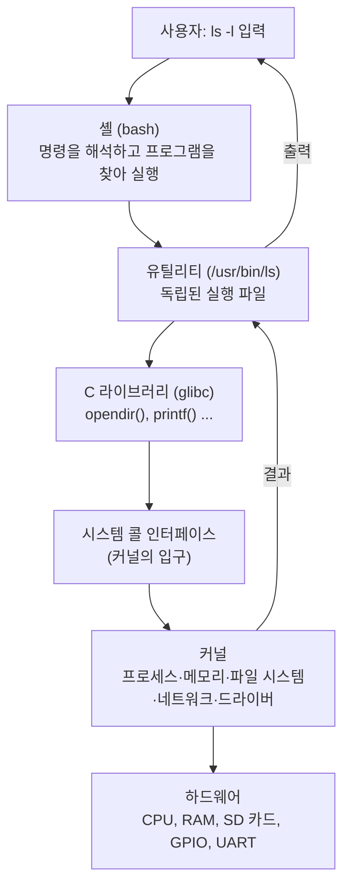
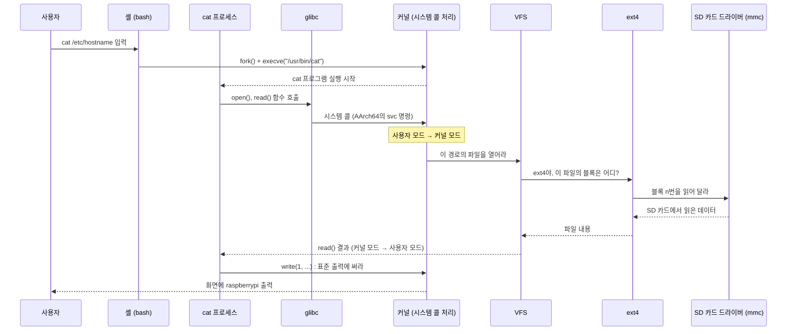
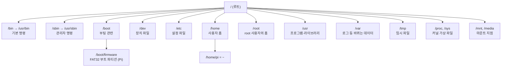
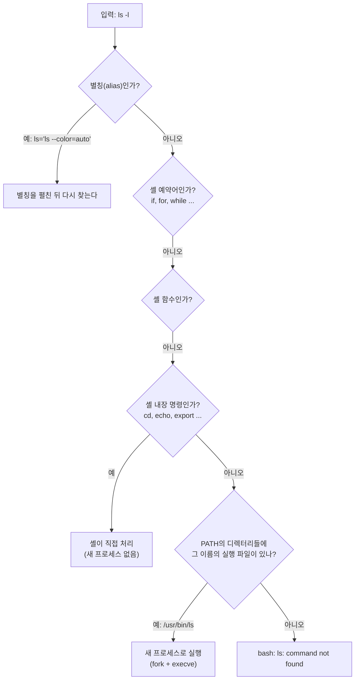
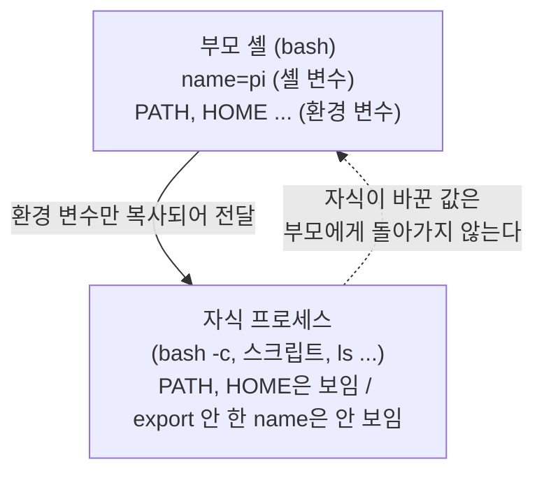
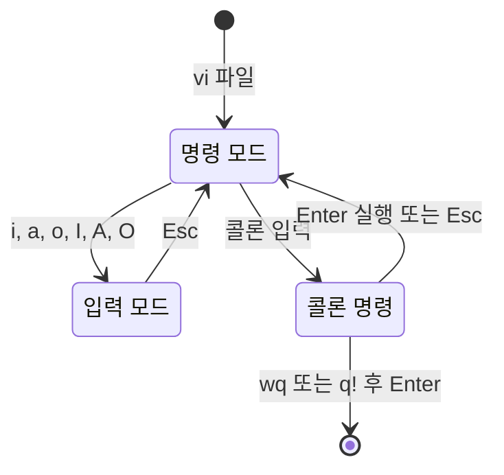
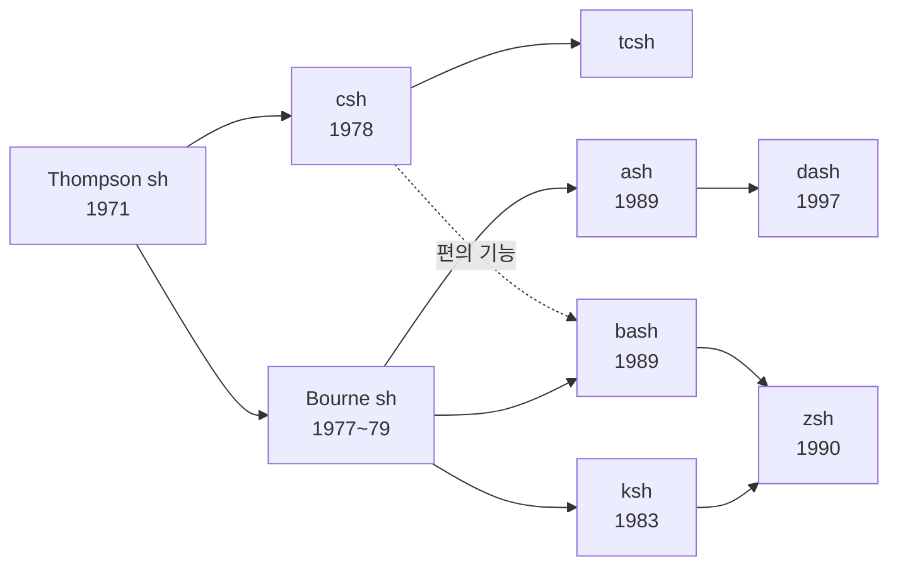

# 4장. Linux와 셸

> **학습 목표**
> - 운영체제·커널·셸·유틸리티가 각각 무엇이고 서로 어떤 관계인지 비유와 그림으로 설명할 수 있다.
> - Unix에서 Linux, Debian, Raspberry Pi OS로 이어지는 흐름을 연도와 인물 중심으로 말할 수 있다.
> - 사용자 영역과 커널 영역, 시스템 콜, VFS의 역할을 이해하고, `cat` 한 줄이 SD 카드에 닿는 경로를 그릴 수 있다.
> - "모든 것은 파일이다"의 뜻과 Linux 디렉터리 구조(FHS)를 Windows 폴더와 비교하여 설명할 수 있다.
> - 명령의 구조(명령 -옵션 인자)를 읽고, 셸 내장 명령과 외부 유틸리티를 `type`·`which`·`command -v`로 구별할 수 있다.
> - 경로·파일·디렉터리 명령, 와일드카드, 따옴표를 써서 원하는 파일을 정확히 다룰 수 있다.
> - `ls -l`의 권한 문자열을 읽고 `chmod`로 바꿀 수 있으며, `chmod 777`이 왜 나쁜지 설명할 수 있다.
> - inode를 이용해 하드 링크·심볼릭 링크·복사의 차이를 실험으로 확인할 수 있다.
> - `grep`·`sort`·`uniq`·`cut`·`awk` 등을 파이프로 연결하고 리다이렉션으로 결과를 파일에 저장할 수 있다.
> - 환경 변수와 `.bashrc`를 이해하고, 변수·조건·반복·함수·인자를 쓰는 셸 스크립트를 작성·실행할 수 있다.

[3장](03_rpi_hw_os.md)에서 Raspberry Pi에 OS를 설치하고 UART·SSH로 접속하는 데까지 성공했다. 화면에는 `pi@raspberrypi:~ $` 같은 글자와 깜빡이는 커서만 있다. 마우스도, 아이콘도 없다. 이 장은 그 까만 화면에서 무엇을 할 수 있는지를 처음부터 차근차근 익히는 장이다.

명령어를 처음 보면 "list를 왜 `ls`라고 쓰는가"처럼 이유 없이 외워야 할 것 같아 답답하다. 하지만 몇 가지 원리(커널과 셸의 관계, 모든 것은 파일, 파이프)를 이해하면 수백 개의 명령이 몇 개의 규칙으로 정리된다. 강의에서도 강조했듯이 **처음 몇 주는 화살표 키로 이전 명령을 불러오지 말고 직접 20~30번 타이핑**해 손에 익히자. 한번 익숙해지면 마우스보다 훨씬 빠르다.

이 장의 범위는 다음과 같다. 패키지 설치(`apt`), 서비스(`systemctl`), 프로세스 관리(`ps`, `kill`, `bg`), 디스크·마운트, 사용자 관리, `cron`, `raspi-config`는 [5장](05_sysadmin.md)에서, `gcc`와 `make`는 [6장](06_c_build.md)에서, 부팅과 커널 빌드는 [7장](07_boot_kernel.md)에서 다룬다.

> 실습 환경: 모든 명령은 Raspberry Pi 4B + Raspberry Pi OS(64-bit, Bookworm)를 기준으로 한다. 이 장의 명령 출력 대부분은 같은 Debian 12(Bookworm) 기반인 WSL에서 실제로 실행해 확인했다. 출력 블록마다 바로 위에 `> 출력 출처:` 줄을 달아 어디서 얻은 결과인지 밝혔다([머리말](00_preface.md)의 「이 책의 표기 규칙」). Pi에서만 볼 수 있는 출력(SD 카드, GPIO 장치 파일 등)은 "예시(Pi 4 실기기에서 확인 필요)"로 표시했다. 날짜, 파일 크기, inode 번호, 프로세스 번호(PID)는 실행할 때마다 다르다.

---

## 4.1 운영체제, 커널, 셸: 엔진과 통역사

### 4.1.1 C를 배웠는데 왜 Windows 프로그램은 못 만들까

C 언어를 배운 뒤에 "C로 Windows 창을 하나 띄워 보라"고 하면 대부분 못 한다. 문법을 모르는 것이 아니다. `printf`와 `scanf`는 알지만, **Windows라는 운영체제가 창을 띄우기 위해 제공하는 함수**를 배운 적이 없기 때문이다. 어떤 OS 위에서 제대로 된 프로그램을 만들려면 그 OS가 제공하는 서비스를 알아야 한다.

1학기 마이크로컨트롤러 실습에서는 OS가 없었으므로 칩의 레지스터와 라이브러리만 알면 됐다. Raspberry Pi에서 LED 하나를 켜려면 사정이 다르다. Linux가 하드웨어를 관리하고 있으므로 **Linux를 거쳐야** LED에 닿는다. 그래서 임베디드 Linux에서는 OS를 먼저 배우고 시작한다. 활용만 하는 것이 아니라 그 위에서 개발할 것이기 때문이다. 공학에서는 이것이 원래 맞는 순서이다.

### 4.1.2 1장의 레스토랑으로 돌아가 보자

[1장](01_embedded_system.md)에서 OS를 **대형 레스토랑의 총지배인**에 비유했다. 총지배인은 요리사(태스크)들에게 시간을 나누어 주고(멀티태스킹), 급한 일을 먼저 처리하게 하고(우선순위), 화구 하나를 두고 다투지 않게 정리한다(자원 관리). 이 장에서는 그 레스토랑을 조금 더 자세히 들여다본다.

| 레스토랑 | Linux | 하는 일 |
|---|---|---|
| 주방과 총지배인 | **커널(kernel)** | 하드웨어(CPU, 메모리, SD 카드, GPIO)를 실제로 다루고 여러 프로그램에 나누어 준다. 손님은 주방에 들어갈 수 없다 |
| 홀 직원(주문 접수) | **셸(shell)** | 손님(사용자)의 말을 알아듣고 주방에 전달한 뒤, 결과를 손님에게 가져다준다 |
| 주방 도구와 반찬 코너 | **유틸리티(utility)** | `ls`, `cp`, `grep`처럼 특정한 일 하나를 잘하는 독립 프로그램들 |
| 정해진 주문서 양식 | **시스템 콜(system call)** | 주방에 무언가를 부탁하는 정해진 양식. 이 양식으로만 주문할 수 있다 |

자동차로 비유해도 좋다. **커널은 엔진**이다. 엔진은 차의 핵심이지만 운전자가 엔진을 직접 만지지는 않는다. 운전자는 핸들과 페달로 의사를 전달하고, 그 신호가 엔진에 전달된다. **셸은 운전자의 말을 엔진이 알아듣는 신호로 바꾸어 주는 통역사**이다. 사용자가 `ls`라고 입력하면 셸이 그 뜻을 해석해 알맞은 프로그램을 찾아 실행하고, 그 프로그램은 시스템 콜로 커널에 "이 디렉터리의 목록을 읽어 달라"고 부탁한다.

<strong>셸(shell)</strong>이라는 이름은 "껍데기(조개껍데기)"라는 뜻이다. 커널이라는 알맹이(kernel, 씨앗의 알맹이)를 감싸고 바깥 세상(사용자)과 만나는 부분이라서 붙은 이름이다. 강의에서는 셸을 "**OS와 소통하는 가장 단순한 창**"이라고 설명했다. OS가 있으면 사용자가 무언가를 시킬 최소한의 첫 번째 응용 프로그램이 필요한데, 그것이 셸이다.



### 4.1.3 셸과 커널의 차이

| 구분 | 셸(shell) | 커널(kernel) |
|---|---|---|
| 한 줄 정의 | 사용자와 OS 사이의 인터페이스(명령어 해석기) | OS의 핵심, 하드웨어를 직접 제어 |
| 위치 | 커널 위의 사용자 영역(user space) 프로그램 | 운영체제의 가장 안쪽(kernel space) |
| 하는 일 | 명령 해석, 프로그램 실행, 파이프·리다이렉션 연결, 변수·스크립트 | 프로세스 스케줄링, 메모리 관리, 파일 시스템, 네트워크, 디바이스 드라이버 |
| 사용자에게 | 보인다. 명령을 입력하는 곳 | 보이지 않는다. 시스템 콜로만 부탁할 수 있다 |
| 바꿀 수 있나 | 쉽다. bash, zsh, fish 등 골라 쓴다 | 어렵다. 커널을 교체하려면 다시 부팅해야 한다([7장](07_boot_kernel.md)) |
| 예 | bash, dash, zsh, fish, csh, Windows의 cmd·PowerShell | Linux 커널, Windows NT 커널, macOS의 XNU |

**흔한 오해 1: "셸이 곧 OS이다."** 아니다. 셸은 OS 위에서 도는 **프로그램 하나**일 뿐이다. 셸을 bash에서 zsh로 바꾸어도 커널은 그대로이다.

**흔한 오해 2: "리눅스 명령어는 모두 셸의 기능이다."** 4.7절에서 자세히 보지만 미리 말하면, `ls`, `cp`, `grep`, `tar` 같은 이른바 "리눅스 기본 명령어"의 <strong>대부분은 셸과 무관한 독립 프로그램(시스템 유틸리티)</strong>이다. 셸은 그것을 찾아 실행하고 입력과 출력을 이어 줄 뿐이다. 셸 안에 들어 있는 명령(내장 명령)은 `cd`, `echo`, `export`처럼 수십 개에 불과하다.

### 4.1.4 OS = 커널 + 셸 + 유틸리티 + 라이브러리

정리하면 우리가 "Linux"라고 부르는 것은 다음을 모두 합친 것이다.

| 구성 요소 | 예 | 누가 만들었나 |
|---|---|---|
| 커널 | Linux 커널 6.x | 리누스 토르발스와 전 세계 개발자 |
| C 라이브러리 | GNU C Library(glibc) | GNU 프로젝트 |
| 셸 | bash, dash | GNU 프로젝트(bash), Debian(dash) |
| 기본 유틸리티 | `ls`, `cp`, `mv`, `cat`(GNU coreutils), `grep`, `sed`, `tar` | 대부분 GNU 프로젝트 |
| 응용 프로그램 | 편집기, 웹 브라우저, 컴파일러(`gcc`) | 여러 공동체와 회사 |

엄밀하게 말하면 **Linux는 커널의 이름**이고, 위 전체를 묶은 운영체제는 "GNU/Linux"라고 부르자는 주장도 있다. 다음 절에서 그 이유를 역사로 확인한다.

---

## 4.2 Unix에서 Linux까지

역사의 연도를 모두 외울 필요는 없다. 다만 **왜 이렇게 생겼는지**를 알면 명령어와 구조가 훨씬 잘 이해된다. 핵심 인물은 켄 톰슨, 데니스 리치, 리처드 스톨만, 리누스 토르발스 네 사람이다.

### 4.2.1 Unix의 탄생 (1969)

1960년대 말 AT&T <strong>벨 연구소(Bell Labs)</strong>는 MIT·GE와 함께 **Multics**라는 거대한 시분할 OS를 만들다가 너무 복잡해 1969년에 손을 뗐다. 이 프로젝트에 참여했던 <strong>켄 톰슨(Ken Thompson)</strong>과 <strong>데니스 리치(Dennis Ritchie)</strong>는 남는 미니컴퓨터 PDP-7에서 훨씬 작고 단순한 OS를 직접 만들었다. "여러 것(Multi-)" 대신 "하나(Uni-)"를 잘하자는 농담 섞인 이름이 **Unix**이다.

Unix가 남긴 생각들은 지금 Linux에서 그대로 쓰인다.

| Unix의 철학·특징 | 이 장에서 다시 만나는 곳 |
|---|---|
| 작은 프로그램이 한 가지 일을 잘하게 만든다 | `grep`은 찾기만, `sort`는 정렬만, `wc`는 세기만 한다(4.14절) |
| 프로그램을 **파이프**로 연결해 큰 일을 한다 | `grep ERROR 로그 \| sort \| uniq -c`(4.15절) |
| **모든 것은 파일**이다(장치도 파일) | `/dev/null`, `/dev/mmcblk0`(4.4절) |
| 계층적(트리) 디렉터리 구조 | `/`에서 시작하는 하나의 트리(4.5절) |
| 멀티유저·멀티태스킹 | 권한의 소유자·그룹·그 외(4.11절) |
| 텍스트로 설정하고 텍스트로 주고받는다 | `/etc`의 설정 파일, 로그 파일 처리 |

### 4.2.2 C 언어와 Unix: 이식성의 시작

초기 Unix는 어셈블리어로 작성되었다. 어셈블리어는 CPU마다 다르므로, 다른 컴퓨터로 옮기려면 처음부터 다시 써야 했다. 리치는 톰슨의 B 언어를 발전시켜 **C 언어**를 만들었고(1972년 무렵), 1973년에는 Unix 커널의 대부분을 C로 다시 작성했다. 이제 C 컴파일러만 새 CPU용으로 만들면 Unix를 그 컴퓨터로 옮길 수 있게 되었다. 이것이 <strong>이식성(portability)</strong>이다. "OS를 고급 언어로 쓴다"는 당시로서는 파격적인 생각이었다.

5주차 강의에서 본 프로그래밍 언어 인기 순위 영상을 떠올려 보자. 머신 코드 → 어셈블리 → FORTRAN·COBOL → BASIC → Pascal → **C(1970년대 중반부터)** → C++ → Java → Python으로 주류가 바뀌어 왔다. 잘나가던 언어도 20년쯤 지나면 바뀐다. 그런데도 전자공학에서 C가 여전히 중요한 이유는 **포인터로 메모리에 직접 접근**할 수 있기 때문이다. 하드웨어 레지스터는 모두 메모리 주소에 매핑되어 있으므로(메모리 맵 I/O), 포인터로 그 주소를 읽고 쓰는 C가 하드웨어를 다루기에 가장 편하다. Linux 커널도, 이 교재의 pigpio 예제도 C로 작성되어 있다.

> 그래서 "어떤 언어를 배울까"보다 "**프로그램을 어떻게 짜는가**"를 배워야 한다. 변수·데이터 타입, 제어문·반복문, 함수라는 공통 요소를 이해하면 새 언어는 금방 익힌다. 이 장 4.19절의 셸 스크립트도 정확히 이 세 요소로 이루어져 있다.

### 4.2.3 GNU 프로젝트와 자유 소프트웨어 (1983)

Unix는 대학과 기업으로 퍼졌지만 **상용 제품**이어서 비싼 라이선스를 사야 했고 소스 코드를 마음대로 고칠 수 없었다. 1983년 MIT의 <strong>리처드 스톨만(Richard Stallman)</strong>은 누구나 자유롭게 쓰고, 고치고, 나눌 수 있는 Unix 호환 OS를 만들겠다며 **GNU 프로젝트**를 시작했다. GNU는 "GNU's Not Unix"의 약자이다(이름 안에 자기 자신이 들어 있는 재귀 약어).

GNU 프로젝트는 컴파일러(`gcc`), 셸(`bash`), C 라이브러리(`glibc`), 기본 유틸리티(`coreutils`) 등 OS에 필요한 거의 모든 부품을 만들었다. 그런데 **커널**만은 완성하지 못했다(GNU Hurd라는 커널은 아직도 개발 중이다).

### 4.2.4 리누스 토르발스와 Linux (1991)

1991년 핀란드 헬싱키 대학의 학생 <strong>리누스 토르발스(Linus Torvalds)</strong>는 교육용 Unix인 Minix를 쓰다가 그 제한적인 라이선스와 기능에 불만을 느꼈다. 그래서 자기 PC(인텔 80386)에서 돌아가는 커널을 처음부터 새로 작성했다. 1991년 8월 25일 Usenet의 comp.os.minix 게시판에 "그냥 취미로 만드는 OS인데 GNU처럼 크고 전문적이지는 않을 것"이라는 유명한 글을 올렸고, 같은 해 9월 버전 0.01을 공개했다.

이름에 얽힌 이야기도 있다. 토르발스는 처음에 Free + freak + Unix의 x를 합쳐 **Freax**라고 부르려 했다. 그런데 파일을 올려 준 FTP 서버 관리자(동료 Ari Lemmke)가 디렉터리 이름을 마음대로 "linux"로 지었고, 그 이름이 굳었다. **Linux = Linus + Unix**라고 기억하면 된다. 마스코트는 펭귄 턱스(Tux)이다.

토르발스의 커널과 GNU의 부품들이 만나 비로소 완전한 무료 OS가 되었다. 이것이 "GNU/Linux"라는 이름이 나온 이유이다.

| 연도 | 사건 |
|---|---|
| 1969 | 톰슨·리치, 벨 연구소에서 Unix 개발 시작 |
| 1972~1973 | C 언어 완성, Unix 커널을 C로 재작성 |
| 1983 | 스톨만, GNU 프로젝트 발표 |
| 1989 | GNU의 셸 bash 공개 |
| 1991 | 토르발스, Linux 0.01 공개 |
| 1993 | 이언 머독, Debian 배포판 시작 |
| 2005 | 토르발스, 커널 소스 관리를 위해 Git 개발([6장](06_c_build.md)에서 사용) |
| 2008 | Linux 커널 기반의 Android 첫 출시 |
| 2012 | Raspberry Pi 출시, Debian 기반의 Raspbian 등장 |
| 2020 | Raspbian이 **Raspberry Pi OS**로 이름을 바꿈 |
| 2023 | Debian 12 "Bookworm" 기반 Raspberry Pi OS 출시(이 교재의 기준) |

> 📌 보강(참고 자료): Unix와 C의 역사는 D. M. Ritchie, "The Evolution of the Unix Time-sharing System"(1979)과 "The Development of the C Language"(1993), GNU 프로젝트는 [GNU 프로젝트 최초 발표문(1983)](https://www.gnu.org/gnu/initial-announcement.html), Linux의 시작은 토르발스의 1991년 8월 25일 comp.os.minix 게시글, Raspberry Pi OS 이름 변경은 Raspberry Pi 공식 블로그(2020년 5월)를 참고했다. 위 연표의 연도는 널리 알려진 값이며, 원문 링크는 집필 시점에 접속 확인을 마치지 못했다(TODO 참고).

토르발스의 가치관은 강의에서 소개한 잡스·게이츠 농담과 대비된다. 게이츠가 천국이 어떠냐고 묻자 잡스가 "벽도 울타리도 없다(no **Windows**, no **Gates**)"고 받아쳤고, 게이츠는 "사과도 일자리도 없겠군(no **Apple**, no **Jobs**)"이라고 응수했다는 우스갯소리이다. 두 사람이 소프트웨어를 상업적으로 팔아야 한다고 보았다면, 토르발스는 **소프트웨어는 공개되고 누구나 쓸 수 있어야 한다**는 쪽에 섰다.

### 4.2.5 배포판: 커널에 옷을 입힌 것

커널만으로는 아무것도 할 수 없다. 커널에 셸, 유틸리티, 라이브러리, 설치 프로그램, 패키지 관리자, 기본 설정을 묶어 바로 쓸 수 있게 만든 것을 <strong>배포판(distribution, distro)</strong>이라고 한다. 같은 Linux 커널을 쓰지만 묶는 방식과 철학이 다르다.

| 계열 | 대표 배포판 | 패키지 관리자 | 특징 |
|---|---|---|---|
| Debian 계열 | **Debian**, Ubuntu, **Raspberry Pi OS**, Linux Mint | `apt`(`.deb`) | 안정성 중시, 공동체 운영 |
| Red Hat 계열 | RHEL, Fedora, Rocky Linux | `dnf`/`yum`(`.rpm`) | 기업 서버에 많다 |
| 기타 | Arch, Alpine, Yocto·Buildroot로 만든 맞춤 Linux | `pacman`, `apk` 등 | Alpine은 작아서 컨테이너·임베디드에 쓰인다 |

**Raspberry Pi OS는 Debian 기반**이다. 예전 이름은 **Raspbian**(Raspberry + Debian)이었고 2020년에 지금 이름으로 바뀌었다. Debian은 버전마다 영화 「토이 스토리」의 캐릭터 이름을 코드명으로 붙인다. 이 교재가 쓰는 **Bookworm은 Debian 12**이다. 그래서 Debian이나 Ubuntu용 자료 대부분이 Raspberry Pi OS에도 그대로 통한다. 패키지 설치(`apt`)는 [5장](05_sysadmin.md)에서 다룬다.

### 4.2.6 왜 임베디드에 Linux인가

강의에서 정리한 이유는 두 가지였다. ① 소스가 **공개**되어 있어 학습에 유리하다. ② **라이선스 비용이 없어** 제품에 넣기 좋다. 노트북을 살 때 OS 포함 모델과 미포함 모델의 가격 차이가 수만 원인데, 그것이 Windows 라이선스 값이다. 제품을 수십만 대 만든다고 생각하면 큰돈이다. PC 시장 점유율만 보면 Linux가 작아 보이지만, 공유기·셋톱박스·산업 장비·자동차 같은 장비와 임베디드 시스템, 서버, 그리고 Linux 커널 위에 만든 Android까지 합치면 Linux는 가장 널리 쓰이는 커널이다.

ARM 리눅스 강의 자료는 Linux의 특징을 다음과 같이 정리한다. Unix와 호환된다(POSIX 표준 준수). 많은 표준 유틸리티를 제공한다. **입출력 장치를 특수한 파일로 추상화**해 보통 파일과 같은 방법으로 접근한다. 프로세스와 파일에 소유자와 접근 권한이 있다. 계층적 파일 시스템을 쓴다. x86, ARM, RISC-V 등 거의 모든 CPU를 지원한다.

> 📌 보강: **오픈소스라고 의무가 없는 것은 아니다.** Linux 커널은 **GPL 버전 2** 라이선스로 배포된다. GPL은 "GPL 소프트웨어를 고치거나 포함한 결과물을 **다른 사람에게 배포**할 때, 받는 사람에게 그 소스 코드도 같은 조건으로 제공하라"고 요구한다. 따라서 Linux 커널을 수정해 제품에 넣어 판매하면 수정한 커널 소스를 공개해야 한다. 반면 Linux 위에서 시스템 콜로 동작하는 **자기 응용 프로그램까지 공개해야 하는 것은 아니다**(커널 소스의 라이선스 규칙 문서가 이를 명시한다). 라이브러리마다 라이선스(GPL, LGPL, MIT, BSD 등)가 다르므로 제품을 만들 때는 사용한 오픈소스 목록과 라이선스를 반드시 확인하고 고지해야 한다. 출처: [Linux kernel licensing rules](https://docs.kernel.org/process/license-rules.html), [GNU GPL v2 전문](https://www.gnu.org/licenses/old-licenses/gpl-2.0.html)

---

## 4.3 Linux의 구조와 시스템 콜

### 4.3.1 아키텍처와 커널 레이어는 다른 말이다

자료를 읽다 보면 "Linux 아키텍처"와 "Linux 커널 레이어"라는 말이 섞여 나온다. 범위가 다르다.

| 구분 | Linux 아키텍처(architecture) | Linux 커널 레이어(kernel layer) |
|---|---|---|
| 범위 | 운영체제 **전체**: 커널 + 라이브러리 + 셸 + 유틸리티 + 응용 프로그램 | **커널 내부**의 기능 분할 |
| 관심사 | 전체 시스템이 어떤 부품으로 이루어졌나 | 커널을 어떻게 모듈화해 유지보수·확장하나 |
| 예 | glibc, bash, `ls`, 웹 브라우저까지 포함 | 프로세스 관리, 메모리 관리, VFS, 네트워크 스택, 드라이버 |

즉 **아키텍처 ⊃ 커널 ⊃ 커널 레이어**의 관계이다.

### 4.3.2 커널 안의 계층

Linux 강의 슬라이드는 커널과 그 주변을 다음 여섯 층으로 나누어 설명한다. 아래로 갈수록 하드웨어에 가깝다.

| 층 | 하는 일 | 주요 구성 요소 |
|---|---|---|
| 사용자 영역(user space)과 라이브러리 | 응용 프로그램과 셸이 사는 곳. 엄밀히는 커널 밖이다 | 셸, 응용 프로그램, C 라이브러리(glibc) |
| 시스템 호출 계층(system call interface) | 사용자 영역과 커널 영역을 잇는 **유일한 공식 입구** | `open()`, `read()`, `write()`, `fork()`, `execve()`, `mmap()` |
| 가상 파일 시스템(VFS, Virtual File System) | ext4, FAT32, NTFS, 네트워크 파일 시스템, 장치 파일을 **같은 방법**으로 다루게 해 준다 | `open/read/write`를 각 파일 시스템의 구현으로 연결 |
| 네트워크 계층 | TCP/IP 프로토콜, 소켓, 패킷 송수신 | 소켓 인터페이스, TCP/UDP/IP |
| 커널 핵심 계층 | 프로세스 생성·스케줄링, 물리·가상 메모리 관리, 프로세스 간 통신(IPC) | 스케줄러, 메모리 관리자 |
| 하드웨어 추상화 계층(HAL) | 하드웨어와 직접 대화한다. 위 계층이 특정 칩을 몰라도 되게 한다 | 디바이스 드라이버, 인터럽트 처리, CPU 아키텍처별 코드(`arch/arm64`) |

강의에서 강조한 점이 하나 있다. 여기서 말하는 **하드웨어는 주변장치만이 아니라 CPU와 메모리도 포함**한다. 스케줄러가 CPU 시간을 나누고 메모리 관리자가 RAM을 나누는 것도 하드웨어 관리이다.

전자공학 전공자에게 특히 중요한 곳은 맨 아래 **디바이스 드라이버**이다. 응용 프로그램을 만드는 개발자는 매우 많지만, 새로 만든 하드웨어를 커널에 붙이는 드라이버를 만들 수 있는 사람은 적다. 하드웨어를 아는 사람이 잘할 수 있는 분야이다.

### 4.3.3 커널의 종류: 모놀리식, 마이크로, 하이브리드

커널에 기능을 얼마나 넣느냐에 따라 세 가지로 나눈다.

| 종류 | 구조 | 장점 | 단점 | 예 |
|---|---|---|---|---|
| 모놀리식(monolithic) 커널 | 스케줄러, 메모리, 파일 시스템, 드라이버, 네트워크가 **모두 커널 안**에서 한 덩어리로 동작 | 내부 호출이 빨라 성능이 좋다 | 드라이버 하나의 버그가 커널 전체를 멈출 수 있다 | **Linux**, 전통적인 Unix |
| 마이크로커널(microkernel) | 커널에는 최소 기능(스케줄링, 프로세스 간 통신, 기본 메모리 관리)만. 드라이버·파일 시스템은 **사용자 영역의 서버 프로세스** | 한 부분이 죽어도 전체는 산다. 안전 인증에 유리 | 메시지 전달이 많아 느려질 수 있다 | QNX, Mach 3.0, seL4 |
| 하이브리드(hybrid) 커널 | 마이크로커널 구조를 바탕으로 성능을 위해 일부 서비스를 커널 안에 둔다 | 절충 | 경계가 모호하다 | Windows NT, macOS의 XNU |

> 📌 보강: Linux는 모놀리식이지만 <strong>적재 가능한 커널 모듈(loadable kernel module)</strong>을 지원해, 드라이버를 부팅 후에 끼웠다 뺄 수 있다(`lsmod`로 확인). 그래서 "모듈식 모놀리식 커널"이라고도 한다. 또 ARM 리눅스 강의 자료에 있는 "Linux는 실행 중인 프로세스를 선점하지 않는다(비선점)"는 설명은 오래된 내용으로, **지금의 Linux는 선점형 커널**이다. 이 내용은 [1장](01_embedded_system.md) 1.12.2절의 보강을 참고한다. 출처: [The Linux Kernel documentation – Building External Modules](https://docs.kernel.org/kbuild/modules.html)

### 4.3.4 사용자 모드와 커널 모드

CPU에는 권한 수준이 있다. 일반 프로그램은 <strong>사용자 모드(user mode)</strong>에서 돌고, 이 모드에서는 하드웨어 레지스터나 다른 프로그램의 메모리를 직접 건드릴 수 없다. 커널은 <strong>커널 모드(kernel mode)</strong>에서 돌며 모든 것을 할 수 있다. ARM 프로세서에서는 이것이 예외 레벨(EL0: 사용자, EL1: 커널)로 구현된다([2장](02_computer_arch_arm.md)).

강의에서 이렇게 설명했다. "OS가 있으면 일반 개발자가 하드웨어를 직접 건드릴 일은 거의 없고, 직접 건드리려 하면 OS가 막는다. 최소한 슈퍼유저 권한이 있어야 한다." 1학기 MCU에서는 레지스터에 값을 쓰는 한 줄로 핀을 바꿀 수 있었지만, Linux에서는 그 길이 막혀 있다. 대신 **시스템 콜**이라는 정해진 창구로 커널에 부탁해야 한다. [8장](08_gpio_pigpio.md)의 pigpio가 `sudo`를 요구하는 이유도 여기에 있다.

### 4.3.5 시스템 콜이 지나가는 길: `cat` 한 줄이 SD 카드에 닿기까지

[1장](01_embedded_system.md)의 OS 구조 그림을 실제 명령 하나로 따라가 보자. `cat /etc/hostname`을 입력하면 다음 일이 일어난다.



이 그림에서 기억할 것은 세 가지이다.

1. **셸은 `cat`을 직접 실행하지 않는다.** 셸도 시스템 콜(`fork()`로 자신을 복제하고 `execve()`로 `cat` 프로그램으로 바꾸기)로 커널에 부탁한다. 프로세스 생성은 [11장](11_process_concurrency.md)에서 자세히 다룬다.
2. **`cat`은 파일이 SD 카드에 있는지, USB 메모리에 있는지, 네트워크 너머에 있는지 모른다.** VFS가 그 차이를 숨겨 주기 때문에 `open()`·`read()`만 부르면 된다. 이것이 다음 절의 "모든 것은 파일"이 가능한 이유이다.
3. **화면에 출력하는 것도 파일에 쓰는 것이다.** `cat`은 1번 파일(표준 출력)에 `write()`할 뿐이고, 그 1번 파일이 터미널에 연결되어 있을 뿐이다(4.15절).

> 📌 보강: AArch64 Linux에서 시스템 콜은 레지스터 `x8`에 시스템 콜 번호를, `x0`~`x5`에 인자를 넣고 `svc #0` 명령을 실행해 커널로 들어간다. 각 시스템 콜의 설명은 매뉴얼 2장에 있다(`man 2 read`, `man 2 open`). 프로그램이 어떤 시스템 콜을 부르는지 보려면 `strace`를 쓴다(`sudo apt install strace` 후 `strace -e trace=openat,read,write cat /etc/hostname`). 출처: [syscall(2) – Linux manual page](https://man7.org/linux/man-pages/man2/syscall.2.html)

---

## 4.4 모든 것은 파일이다

### 4.4.1 무슨 뜻인가

Unix·Linux의 가장 유명한 원칙은 "**Everything is a file**"이다. 일반 문서뿐 아니라 디렉터리, 하드디스크, SD 카드, UART 포트, 키보드, 터미널 화면, 심지어 커널의 상태 정보까지 **파일처럼 이름이 있고, 열고(open), 읽고(read), 쓰고(write), 닫을(close) 수 있다**.

왜 이렇게 만들었을까? 프로그램이 장치마다 다른 방법을 배울 필요가 없게 하려는 것이다. 우체국에 비유하면, 받는 곳이 아파트든 회사든 시골집이든 **주소 하나**만 쓰면 편지가 간다. 배달 방법(드라이버)은 우체국(커널)이 안다. 마찬가지로 `cat`은 일반 파일을 읽던 방법 그대로 `/dev/serial0`(UART)도 읽을 수 있다.

강의에서는 이렇게 말했다. "하드디스크를 하나 더 붙이면 리눅스는 이 디바이스를 **파일**로 인식한다. 하드디스크도 파일이고 UART도 파일이다." Windows는 장치를 `C:`, `D:`, `COM3`처럼 파일과 다른 별도 개체로 다룬다는 점과 대조된다.

### 4.4.2 파일의 종류

`ls -l` 출력의 맨 앞 글자가 파일 종류를 알려 준다.

| 첫 글자 | 종류 | 예 |
|---|---|---|
| `-` | 일반 파일(regular file) | 문서, 소스 코드, 실행 파일 |
| `d` | 디렉터리(directory) | `/home`, `/etc` |
| `l` | 심볼릭 링크(symbolic link) | `/bin -> usr/bin` |
| `c` | 문자 장치(character device): 한 바이트씩 흘러가는 장치 | `/dev/null`, `/dev/tty`, `/dev/ttyS0`(UART), `/dev/gpiochip0` |
| `b` | 블록 장치(block device): 블록 단위로 임의 접근하는 저장 장치 | `/dev/mmcblk0`(SD 카드), `/dev/sda`(USB 디스크) |
| `p` | 이름 있는 파이프(named pipe, FIFO) | 프로세스 간 통신용 |
| `s` | 소켓(socket) | 프로세스 간 네트워크식 통신용 |

직접 확인해 보자.

> 출력 출처: WSL Debian 12 실행 결과

```text
$ ls -l /dev/null /dev/zero /dev/random /dev/tty
crw-rw-rw- 1 root root 1, 3 Oct  2 13:52 /dev/null
crw-rw-rw- 1 root root 1, 8 Oct  2 13:52 /dev/random
crw-rw-rw- 1 root tty  5, 0 Oct  2 13:52 /dev/tty
crw-rw-rw- 1 root root 1, 5 Oct  2 13:52 /dev/zero
```

맨 앞이 `c`이고, 보통 파일 크기가 나올 자리에 `1, 3` 같은 두 숫자가 있다. 이것은 <strong>주 번호(major)와 부 번호(minor)</strong>로, 커널이 "어떤 드라이버의 몇 번째 장치인가"를 구별하는 번호이다. 크기가 아니다.

| 장치 파일 | 역할 | 쓰임 |
|---|---|---|
| `/dev/null` | 블랙홀. 쓰면 사라지고, 읽으면 바로 끝(EOF) | 필요 없는 출력 버리기(4.15절) |
| `/dev/zero` | 읽으면 0 바이트가 끝없이 나온다 | 빈 파일 만들기 |
| `/dev/random`, `/dev/urandom` | 읽으면 난수가 나온다 | 암호 키 생성 |
| `/dev/tty` | 지금 내 터미널 | 스크립트에서 터미널에 직접 쓰기 |

> 출력 출처: WSL Debian 12 실행 결과

```text
$ head -c 8 /dev/urandom | od -An -tx1
 3c 67 06 51 1d c8 3f 0b
```

(`od`는 바이트를 16진수로 보여 주는 도구이다. 실행할 때마다 값이 다르다.)

Raspberry Pi에는 하드웨어와 연결된 장치 파일이 더 있다. Pi 4에서는 다음과 같이 보인다(주·부 번호와 날짜는 생략했고, 설정에 따라 다를 수 있다).

> 출력 출처: Pi 4 실기기 실행 결과(2026-10, 주·부 번호와 날짜는 `...`로 줄임)

```text
$ ls -l /dev/mmcblk0 /dev/mmcblk0p1 /dev/mmcblk0p2 /dev/gpiochip0 /dev/i2c-1 /dev/serial0
crw-rw---- 1 root gpio ... /dev/gpiochip0       ← GPIO 컨트롤러 (8장)
crw-rw---- 1 root i2c  ... /dev/i2c-1           ← I2C 버스 1 (12장, 활성화한 경우)
brw-rw---- 1 root disk ... /dev/mmcblk0         ← SD 카드 전체 (블록 장치)
brw-rw---- 1 root disk ... /dev/mmcblk0p1       ← 1번 파티션 (FAT32, /boot/firmware)
brw-rw---- 1 root disk ... /dev/mmcblk0p2       ← 2번 파티션 (ext4, /)
lrwxrwxrwx 1 root root ... /dev/serial0 -> ttyS0   ← UART 별칭 (3장)
```

(`ls`는 이름을 알파벳 순서로 정렬해 보여 준다. 그래서 명령에 적은 순서와 출력 순서가 다르다.)

장치 파일의 그룹이 `gpio`, `i2c`, `disk`처럼 정해져 있다는 점을 눈여겨보자. Raspberry Pi OS는 Imager로 만든 기본 사용자를 `gpio`, `i2c`, `spi` 그룹에 넣어 두므로 `sudo` 없이 이 장치들을 쓸 수 있다. 권한은 4.11절에서 다룬다.

### 4.4.3 /proc과 /sys: 커널이 보여 주는 가상 파일

`/proc`과 `/sys` 안의 파일은 디스크에 저장된 파일이 아니다. **읽는 순간 커널이 내용을 만들어 보여 주는 가상 파일**이다. 커널의 상태를 파일처럼 읽을 수 있게 한 것이다.

| 파일 | 내용 |
|---|---|
| `/proc/version` | 커널 버전과 빌드 정보 |
| `/proc/cpuinfo` | CPU 코어별 정보 |
| `/proc/meminfo` | 메모리 사용량 |
| `/proc/<PID>/` | 실행 중인 프로세스 하나의 정보(PID는 프로세스 번호) |
| `/sys/class/...` | 장치와 드라이버의 속성(예: [8장](08_gpio_pigpio.md)의 sysfs GPIO) |

7주차 강의에서 확인한 Pi의 커널 버전은 6.12.47(`6.12.47+rpt-rpi-v8`, `apt`로 설치되는 Raspberry Pi OS 기본 커널)이었다. 다음은 교재를 만들며 확인한 Pi 4의 출력이다. 이 Pi는 커널을 따로 업데이트(`rpi-update`)해서 버전이 `6.12.58-v8+`로 나온다. 커널 버전은 설치 시기와 업데이트 방법에 따라 다르므로 여러분의 Pi와 숫자가 달라도 괜찮다.

> 출력 출처: Pi 4 실기기 실행 결과(2026-10)

```text
$ cat /proc/version
Linux version 6.12.58-v8+ (dom@buildbot) (aarch64-linux-gnu-gcc (Ubuntu 11.4.0-1ubuntu1~22.04) 11.4.0, GNU ld (GNU Binutils for Ubuntu) 2.38) #1921 SMP PREEMPT Fri Nov 14 14:23:00 GMT 2025
$ grep -c processor /proc/cpuinfo
4
```

`grep -c processor`는 "processor"라는 글자가 들어간 줄의 개수를 센다. Pi 4의 Cortex-A72 코어가 4개이므로 4가 나온다. 출력에 `PREEMPT`가 보이는 것도 확인하자. [1장](01_embedded_system.md)에서 설명한 선점형 커널이라는 표시이다.

---

## 4.5 디렉터리 구조: 하나의 나무

### 4.5.1 드라이브 문자가 없다

Windows는 저장 장치마다 `C:\`, `D:\` 같은 **드라이브 문자**가 있고 각각이 따로 나무를 이룬다. Linux에는 드라이브 문자가 없다. **모든 것이 `/`(루트, root) 하나에서 시작하는 하나의 나무<strong>이고, SD 카드의 두 파티션이든 USB 메모리든 이 나무의 어느 가지(디렉터리)에 </strong>붙여서(mount)** 쓴다. 강의의 표현을 빌리면 "Windows는 드라이브 문자로 올리고, 리눅스는 드라이브 개념이 없고 모두 폴더 개념"이다. 마운트 명령은 [5장](05_sysadmin.md)에서 다룬다.

### 4.5.2 주요 디렉터리와 Windows 대응

Linux 배포판들은 디렉터리 이름과 용도를 <strong>FHS(Filesystem Hierarchy Standard)</strong>라는 표준에 맞춘다. 그래서 어느 배포판에 가도 설정 파일은 `/etc`, 사용자 파일은 `/home`에 있다.



| 디렉터리 | 용도 | 기억법 | Windows에서 비슷한 곳 |
|---|---|---|---|
| `/` | 모든 것의 시작(루트) | 나무의 뿌리 | `C:\` (단, Linux는 이것 하나뿐) |
| `/bin` | 누구나 쓰는 기본 명령(`ls`, `cp`, `cat`) | **bin**ary | `C:\Windows\System32`의 명령 |
| `/sbin` | 시스템 관리 명령(`fdisk`, `reboot`) | **s**ystem **bin** | `C:\Windows\System32`의 관리 도구 |
| `/usr` | 설치된 프로그램과 라이브러리(`/usr/bin`, `/usr/lib`) | **U**nix **S**ystem **R**esources | `C:\Program Files` |
| `/usr/local` | 사용자가 직접 빌드해 설치한 프로그램 | local = 이 컴퓨터에만 | `C:\Program Files`(직접 설치분) |
| `/etc` | 시스템 설정 파일(텍스트) | "etcetera"에서 유래 | 레지스트리(Registry) |
| `/home` | 사용자별 홈 디렉터리(`/home/pi`) | 내 집 | `C:\Users` |
| `/root` | root(관리자) 계정의 홈 | | `C:\Users\Administrator` |
| `/boot` | 커널과 부팅 파일. Pi는 `/boot/firmware`에 FAT32 파티션이 붙는다 | | EFI 시스템 파티션 |
| `/dev` | 장치 파일 | **dev**ice | 장치 관리자(파일은 아님) |
| `/proc`, `/sys` | 커널 정보를 보여 주는 가상 파일 | **proc**ess, **sys**tem | 작업 관리자·장치 관리자 |
| `/var` | 실행 중 계속 바뀌는 데이터(로그 `/var/log`, 캐시) | **var**iable | `C:\ProgramData` 일부 |
| `/tmp` | 임시 파일(재부팅 때 지워질 수 있다) | **t**e**mp**orary | `C:\Windows\Temp`, `%TEMP%` |
| `/lib` | 공유 라이브러리와 커널 모듈 | **lib**rary | `.dll`이 있는 `System32` |
| `/opt` | 덩치 큰 외부 패키지(선택 설치) | **opt**ional | `C:\Program Files`의 일부 |
| `/mnt`, `/media` | 저장 장치를 붙이는 자리 | **m**ou**nt** | `D:`, `E:` 드라이브 |

직접 둘러보자. Pi 4에서는 다음과 같이 보인다(WSL에서는 `init` 같은 WSL 전용 항목이 더 보인다).

> 출력 출처: Pi 4 실기기 실행 결과(2026-10)

```text
pi@raspberrypi:~ $ cd /
pi@raspberrypi:/ $ ls
bin  boot  dev  etc  home  lib  lost+found  media  mnt  opt  proc  root  run  sbin  srv  sys  tmp  usr  var
```

`ls -l`로 보면 몇 개는 맨 앞이 `l`(링크)이다. Raspberry Pi OS Bookworm도 Debian 12와 같은 구조이다.

> 출력 출처: WSL Debian 12 실행 결과

```text
$ ls -ld /bin /sbin /lib
lrwxrwxrwx 1 root root 7 Nov 30  2024 /bin -> usr/bin
lrwxrwxrwx 1 root root 7 Nov 30  2024 /lib -> usr/lib
lrwxrwxrwx 1 root root 8 Nov 30  2024 /sbin -> usr/sbin
```

6주차 강의에서 "`cd /bin` 후 `ls`를 한 결과와 `/usr/bin`에서 `ls`를 한 결과가 똑같다"고 확인한 이유가 이것이다. `/bin`은 `/usr/bin`을 가리키는 <strong>바로 가기(심볼릭 링크)</strong>일 뿐이다.

> 📌 보강: 옛 Unix는 디스크가 작아 부팅에 꼭 필요한 명령(`/bin`)과 나머지(`/usr/bin`)를 다른 디스크에 나누어 두었다. 지금은 그럴 필요가 없어 Debian 12부터 `/bin`, `/sbin`, `/lib`를 `/usr` 아래로 합치고 링크만 남겼다(merged-/usr). 그래서 `which ls`는 `/usr/bin/ls`를 보여 준다. 출처: [Debian Wiki – UsrMerge](https://wiki.debian.org/UsrMerge), [FHS 3.0](https://refspecs.linuxfoundation.org/FHS_3.0/fhs/index.html)

### 4.5.3 파일 시스템과 SD 카드의 두 파티션

<strong>파일 시스템(file system)</strong>은 저장 장치에 파일을 어떤 형식으로 기록할지 정한 규칙이다. OS마다 주로 쓰는 것이 다르고, OS가 지원하지 않는 형식의 파티션은 보이지 않는다.

| 파일 시스템 | 주로 쓰는 곳 | 특징 |
|---|---|---|
| ext4 | Linux의 기본 | 권한·소유자·링크를 모두 저장. Windows는 기본적으로 못 읽는다 |
| FAT32 / exFAT | USB 메모리, SD 카드, Pi의 부트 파티션 | 거의 모든 OS가 읽는다. 권한 개념이 없다 |
| NTFS | Windows의 기본 | Linux에서도 읽고 쓸 수 있다 |

그래서 Raspberry Pi OS가 설치된 SD 카드를 Windows PC에 꽂으면 **파티션 하나만 보인다**. 보이는 것은 커널과 `config.txt`, `cmdline.txt`가 있는 **FAT32 부트 파티션**이고, `ls`로 보던 나머지 파일이 있는 **ext4 루트 파티션**은 보이지 않는다. 고장이 아니라 정상이다. Pi에서는 부트 파티션이 `/boot/firmware`에, 루트 파티션이 `/`에 붙어 있다. 부팅 과정에서 이 두 파티션이 어떻게 쓰이는지는 [7장](07_boot_kernel.md)에서 다룬다.

| 비교 | Linux | Windows |
|---|---|---|
| 나무의 개수 | `/` 하나 | 드라이브마다 하나(`C:\`, `D:\`) |
| 경로 구분자 | `/` (슬래시) | `\` (역슬래시) |
| 대소문자 | 구분한다(`File.txt` ≠ `file.txt`) | 구분하지 않는다 |
| 장치 | 파일(`/dev/mmcblk0`) | 별도 개체(`C:`, `COM3`) |
| 시스템 설정 | `/etc`의 **텍스트 파일**, 편집기로 직접 고친다 | 대부분 **레지스트리**(이진 데이터베이스) |
| 실행 파일 표시 | 확장자와 무관, <strong>실행 권한(x)</strong>으로 정한다 | 확장자(`.exe`, `.com`, `.bat`) |
| 숨김 파일 | 이름이 `.`으로 시작(`.bashrc`) | 파일 속성 |

---

## 4.6 터미널, 콘솔, 셸

### 4.6.1 더미 터미널 이야기

6주차 수업은 UART로 Raspberry Pi에 접속한 상태에서 시작했다. 그때 이런 질문을 했다. "지금 터미널 창에서 `ls`를 치면, 그 목록은 누가 만든 것인가?" 내 PC가 아니라 **Raspberry Pi**이다. PC의 터미널 프로그램은 키보드로 친 글자를 UART로 보내고, Pi가 돌려준 글자를 화면에 찍을 뿐이다.

1970년대에는 컴퓨터 한 대가 매우 비싸 한 사람이 한 대를 쓸 수 없었다. 그래서 큰 컴퓨터 한 대에 키보드와 화면만 있는 단말기 여러 대를 연결해 나누어 썼다. 단말기 자체에는 처리 기능이 없으므로 "멍청한 단말기", 즉 <strong>더미 터미널(dumb terminal)</strong>이라고 불렀다. 옛날 은행 창구 직원이 두드리던 단말기가 그런 것이다. 그보다 앞서서는 전신용 타자기(teletypewriter)를 단말기로 썼는데, 그 약자 **TTY**가 지금도 Linux에서 터미널 장치의 이름(`/dev/tty`, `/dev/ttyS0`)으로 남아 있다.

지금의 UART 콘솔, SSH, 원격 데스크톱도 같은 개념이다. 처리는 모두 저쪽(Pi)에서 하고, 이쪽(PC)은 입출력만 한다. UART는 글자(ASCII)만 주고받아 대역폭이 좁아도 되고, 네트워크가 빨라지면서 원격 데스크톱처럼 그래픽 화면까지 가져올 수 있게 되었다. 다만 지금의 PC는 자체 CPU가 있으므로 엄밀히는 "**이 터미널 환경만 놓고 볼 때** 더미 터미널 개념"이라고 이해하면 된다.

### 4.6.2 비슷한 말 정리

| 용어 | 뜻 | 예 |
|---|---|---|
| 터미널(terminal) | 원래는 입출력만 하는 단말기 하드웨어. 지금은 아래 터미널 에뮬레이터를 흔히 이렇게 부른다 | VT100, 은행 단말기 |
| 터미널 에뮬레이터 | 터미널을 흉내 내는 **창(프로그램)**. 글자를 보내고 받은 글자를 그린다 | PuTTY, Windows Terminal, Pi 데스크톱의 터미널 |
| 콘솔(console) | 컴퓨터에 **직접** 붙은 주 터미널. 부팅 메시지가 나오는 곳 | Pi에 HDMI 모니터·키보드를 꽂은 화면, UART 시리얼 콘솔 |
| TTY / PTS | 커널 안에서 터미널을 나타내는 장치 파일. 실제 장치면 `tty`, SSH 같은 가짜 터미널이면 `pts`(pseudo-terminal) | `/dev/ttyS0`, `/dev/pts/0` |
| 셸(shell) | 터미널 안에서 돌면서 **명령을 해석하는 프로그램** | bash |
| CLI / GUI | 명령줄 인터페이스 / 그래픽 인터페이스 | 셸 / 파일 탐색기 |

정리하면 **터미널은 창(입출력 장치), 셸은 그 창 안에서 내 말을 알아듣는 프로그램**이다. 같은 터미널 창에서 bash를 끄고 zsh를 켤 수도 있다. 자기 터미널 장치 이름은 `tty` 명령으로 볼 수 있다(SSH로 접속했다면 `/dev/pts/0` 같은 이름이 나온다).

CLI가 처음에 답답한 이유는 태어나서 처음 접했기 때문이다. 그러나 강의에서 말했듯이 **GUI는 OS의 CLI 기능을 그래픽으로 예쁘게 포장한 것**이라고 보아도 거의 무방하다. 파일 탐색기에서 폴더를 여는 것이 `cd`와 `ls`, 파일을 끌어다 놓는 것이 `mv`이다. 그래픽 환경이 있어도 개발자가 CLI를 배워야 하는 이유는 셸로 할 수 있는 일이 매우 많고(자동화, 원격 작업), OS의 **핵심 원리**를 이해하는 데 도움이 되기 때문이다.

### 4.6.3 프롬프트 읽기

셸이 명령을 기다리며 보여 주는 글자를 <strong>프롬프트(prompt)</strong>라고 한다. Raspberry Pi OS의 기본 프롬프트는 이렇게 생겼다.

```text
pi@raspberrypi:~ $
```

| 부분 | 뜻 |
|---|---|
| `pi` | 로그인한 사용자 이름. Raspberry Pi Imager에서 OS를 구울 때 정한 이름이다(이 교재는 예시로 `pi`를 쓴다. 예전의 고정 기본 계정 `pi`는 보안 때문에 없어졌고 지금은 직접 정한다) |
| `@raspberrypi` | 컴퓨터 이름(호스트 이름, hostname). 역시 Imager에서 정한다 |
| `:` | 구분 기호 |
| `~` | **현재 작업 디렉터리**. `~`는 내 홈 디렉터리(`/home/pi`)의 줄임 표기이다. `cd /etc`를 하면 이 자리가 `/etc`로 바뀐다 |
| `$` | 일반 사용자라는 표시. <strong>root(관리자)로 로그인하면 `#`</strong>으로 바뀐다 |

프롬프트 모양은 변수 `PS1`로 정해지며 바꿀 수 있다(4.16절).

> **이 교재의 표기**: 명령과 결과를 함께 보일 때는 `pi@raspberrypi:~ $ ls`처럼 프롬프트까지 쓰거나, 디렉터리가 중요하지 않으면 `$ ls`처럼 줄여 쓴다. **`$`는 입력하지 않는다.** `$`가 없는 줄은 출력이다. 명령 뒤의 `# ...`는 설명을 위한 주석이므로 입력하지 않아도 된다(입력해도 셸이 무시한다). `←` 뒤의 글은 교재가 덧붙인 설명이다.

### 4.6.4 집에서 연습하기: WSL

Raspberry Pi가 없어도 Windows에서 Linux 명령을 연습할 수 있다. <strong>WSL(Windows Subsystem for Linux)</strong>을 설치하면 Windows 안에서 Debian이나 Ubuntu를 실행할 수 있다. 관리자 PowerShell에서 `wsl --install -d Debian`을 실행하면 된다. 이 장의 출력도 대부분 WSL의 Debian 12에서 실제로 실행해 얻은 것이다.

| 비교 | WSL(WSL 2) | Cygwin |
|---|---|---|
| 동작 방식 | 가벼운 가상 머신에서 **진짜 Linux 커널**을 실행 | Windows API로 Linux 환경을 **흉내**(에뮬레이션) |
| Linux 실행 파일 | 그대로 실행된다 | 실행되지 않는다. 다시 컴파일해야 한다 |
| 패키지 관리 | `apt` 등 배포판의 것 그대로 | Cygwin 자체 설치 프로그램(setup.exe) |
| 권장 | 지금은 이쪽을 권한다 | 예전부터 써 온 환경에서 여전히 쓰인다 |

다만 WSL은 Pi가 아니다. SD 카드(`/dev/mmcblk0`), GPIO(`/dev/gpiochip0`), UART(`/dev/serial0`)가 없고, CPU도 x86-64이다. 또 Windows 드라이브(`/mnt/c`, `/mnt/d`) 위에서는 `chmod`와 링크가 제대로 동작하지 않을 수 있으므로, 이 장의 실습은 WSL의 홈 디렉터리(`~`) 안에서 하자. 명령어 연습은 WSL로, 하드웨어 실습은 Pi로 하자.

---

## 4.7 명령의 구조와 종류

### 4.7.1 명령 한 줄의 문법

셸 명령은 거의 모두 다음 모양이다.

```text
명령  [-옵션]  [인자 ...]
ls     -l      /etc
```

| 부분 | 뜻 | 예 |
|---|---|---|
| 명령(command) | 무엇을 할지. 프로그램이나 내장 명령의 이름 | `ls`, `cp`, `cd` |
| 옵션(option) | **어떻게** 할지. `-`로 시작한다 | `-l`(자세히), `-a`(숨김 파일까지) |
| 인자(argument) | **무엇에** 할지. 대상 파일·디렉터리·문자열 | `/etc`, `hello.c` |

규칙 몇 가지를 기억하자.

- 각 부분은 **공백**으로 나눈다. `ls-l`은 `ls-l`이라는 이름의 명령을 찾다가 실패한다.
- **대소문자를 구분**한다. `LS`는 `ls`가 아니다. 명령은 거의 모두 소문자이다.
- 짧은 옵션은 `-` 한 개와 한 글자이고 **합쳐 쓸 수 있다**. `ls -l -a -h` = `ls -lah`.
- 긴 옵션은 `--` 두 개와 단어이다. `ls --all` = `ls -a`. 긴 옵션은 읽기 쉬워 스크립트에 좋다.
- 함수 호출이 아니므로 괄호를 쓰지 않는다. `head(config.txt)`가 아니라 `head config.txt`이다.
- 옵션 순서는 대개 상관없지만, 값을 받는 옵션(`head -n 5`)은 값이 바로 뒤에 와야 한다.

### 4.7.2 셸이 명령을 찾는 순서

`ls`를 입력했을 때 셸은 그 이름이 무엇인지 다음 순서로 찾는다. 먼저 찾은 것이 실행된다.



여기서 두 종류를 구별하는 것이 중요하다.

| 구분 | 셸 내장 명령(built-in) | 외부 명령(external, 유틸리티) |
|---|---|---|
| 정체 | 셸 프로그램 **안에 들어 있는** 기능 | 디스크에 있는 **독립 실행 파일** |
| 실행 방식 | 셸이 직접 처리. 새 프로세스를 만들지 않는다 | 셸이 새 프로세스를 만들어 실행한다 |
| 왜 그런가 | 셸 자신의 상태를 바꾸는 명령은 내장일 수밖에 없다. 예를 들어 `cd`가 외부 프로그램이면, 그 프로그램의 디렉터리만 바뀌고 셸은 그대로이다 | 독립적으로 일하므로 어느 셸에서나 쓸 수 있다 |
| 예 | `cd`, `pwd`, `echo`, `export`, `alias`, `history`, `type`, `read`, `exit`, `source`(`.`), `jobs`, `bg`, `fg`, `kill`, `help`, `umask` | `ls`, `cp`, `mv`, `rm`, `cat`, `grep`, `find`, `tar`, `chmod`, `gcc`, `nano`, `which` |
| 도움말 | `help cd` | `man ls`, `ls --help` |

`cd`가 외부 프로그램이면 왜 안 되는지 비유해 보자. 내가 친구에게 "너 서울로 이사 가"라고 시키면 친구가 이사할 뿐 나는 그대로이다. 내가 이사하려면 내가 직접 가야 한다. 셸의 현재 디렉터리를 바꾸는 일은 셸이 직접 해야 하므로 `cd`는 내장 명령이다.

> **백서 목록 정정**: Linux 백서 탭 A의 "시스템 유틸리티" 목록에는 `jobs`, `bg`, `fg`, `alias`, `export`, `echo`가 들어 있지만, 이것들은 **bash 내장 명령**이다(`type jobs` → `jobs is a shell builtin`). 그중 `echo`, `kill`, `printf`, `test`, `pwd`는 **내장 명령과 같은 이름의 외부 프로그램도 함께** 있다. bash에서 그냥 `echo`라고 치면 내장 명령이 먼저 실행된다. 실습 4-4의 `type -a` 결과로 확인할 수 있다.

### 4.7.3 직접 구별해 보기: type, which, command -v, whereis

| 확인 명령 | 종류 | 내장 명령에 쓰면 | 외부 명령에 쓰면 |
|---|---|---|---|
| `type 이름` | bash 내장 | `cd is a shell builtin` | `ls is /usr/bin/ls` 또는 별칭이면 `ls is aliased to ...` |
| `type -t 이름` | bash 내장 | `builtin` | `file` (별칭이면 `alias`, 예약어면 `keyword`) |
| `type -a 이름` | bash 내장 | 같은 이름의 **모든** 후보를 보여 준다 | |
| `command -v 이름` | 내장(POSIX 표준이라 sh에도 있다) | 이름만 출력(`cd`) | 경로 출력(`/usr/bin/ls`) |
| `which 이름` | 외부 프로그램 | **아무것도 출력하지 않는다** | `PATH`에서 찾은 경로 |
| `whereis 이름` | 외부 프로그램 | 매뉴얼 위치만(있으면) | 실행 파일과 매뉴얼 위치 |

판단 규칙은 간단하다. **경로가 나오면 외부 명령, builtin이라고 나오거나 경로가 안 나오면 내장 명령**이다. 강의에서 말했듯이 이것을 외울 필요는 없고, 모를 때 확인할 줄만 알면 된다.

Linux 백서에 실린 Pi의 대화형 결과는 다음과 같다(사용자 이름만 이 교재의 예시 `pi`로 바꾸었다). 한국어 로캘이면 메시지도 한국어로 나온다.

> 출력 출처: Pi 4 실기기 캡처(강의 자료 Linux 백서 「명령어」, 사용자 이름만 `pi`로 바꿈)

```text
pi@raspberrypi:~ $ type ls
ls은(는) `ls --color=auto'의 별칭임
pi@raspberrypi:~ $ type cat
cat은(는) 해시됨 (/usr/bin/cat)
pi@raspberrypi:~ $ type type
type은(는) 셸 내장임
pi@raspberrypi:~ $ which ls
/usr/bin/ls
pi@raspberrypi:~ $ which cd
pi@raspberrypi:~ $ type pwd
pwd은(는) 셸 내장임
pi@raspberrypi:~ $ which pwd
/usr/bin/pwd
```

몇 가지를 눈여겨보자.

- `type ls`가 **별칭**이라고 나온다. Raspberry Pi OS의 `~/.bashrc`가 `alias ls='ls --color=auto'`를 정해 두어서, `ls`를 치면 실제로는 색상 옵션이 붙은 `ls`가 실행된다. 그래서 디렉터리는 파란색, 실행 파일은 초록색으로 보인다(색의 의미는 외울 필요 없다).
- `type cat`의 "해시됨(hashed)"은 셸이 한 번 찾은 경로를 기억해 두었다는 뜻이다. 다음부터는 `PATH`를 다시 뒤지지 않는다.
- `which cd`는 아무것도 출력하지 않는다. `which`는 **외부 프로그램**이라 셸의 내장 명령을 알지 못하고, `PATH` 안의 **파일**만 찾기 때문이다.
- `type pwd`는 내장이라고 하는데 `which pwd`는 `/usr/bin/pwd`를 보여 준다. 같은 이름의 파일도 있지만 bash에서는 내장 명령이 먼저 쓰인다. **`which`의 답이 실제로 실행되는 것과 다를 수 있다**는 증거이다. 정확히 알고 싶으면 `type`을 쓰자.

`type -t`는 한 단어로 종류를 알려 준다.

> 출력 출처: WSL Debian 12 실행 결과

```text
$ type -t cd ls grep if
builtin
file
file
keyword
$ command -v cd ls grep
cd
/usr/bin/ls
/usr/bin/grep
$ whereis ls cd bash
ls: /usr/bin/ls /usr/share/man/man1/ls.1.gz
cd:
bash: /usr/bin/bash /usr/share/man/man1/bash.1.gz
```

bash 내장 명령 전체 목록은 `help` 또는 `compgen -b`로 볼 수 있다. Bookworm의 bash 5.2에서는 61개이다.

> 출력 출처: WSL Debian 12 실행 결과

```text
$ compgen -b | wc -l
61
$ compgen -b | head -n 20 | tr "\n" " "
. : [ alias bg bind break builtin caller cd command compgen complete compopt continue declare dirs disown echo enable
```

여러 명령을 한꺼번에 확인하는 스크립트는 실습 4-4의 `sh_cmd.sh`에서 만든다.

### 4.7.4 도움말 얻기: man, --help, help

명령과 옵션은 수천 개이다. 다 외우는 사람은 없다. **찾는 방법**을 아는 것이 중요하다.

| 방법 | 대상 | 예 |
|---|---|---|
| `man 명령` | 외부 명령의 공식 매뉴얼(manual) | `man ls`, `man grep` |
| `명령 --help` | 대부분의 외부 명령이 제공하는 짧은 요약 | `ls --help`, `chmod --help` |
| `help 명령` | **bash 내장 명령**의 도움말 | `help cd`, `help read` |
| `man -k 낱말` (= `apropos`) | 설명에 그 낱말이 들어간 매뉴얼 검색. 명령 이름을 모를 때 | `man -k "copy files"` |
| `whatis 명령` (= `man -f`) | 한 줄 설명 | `whatis ls` |

> 출력 출처: WSL Debian 12 실행 결과

```text
$ whatis ls
ls (1)               - list directory contents
$ man -k "copy files"
cp (1)               - copy files and directories
cpio (1)             - copy files to and from archives
...
$ man cd
No manual entry for cd
$ help cd | head -n 2
cd: cd [-L|[-P [-e]] [-@]] [dir]
    Change the shell working directory.
```

`man cd`가 실패하는 이유를 이제 알 것이다. `cd`는 bash 내장 명령이라 따로 매뉴얼 페이지가 없다. 내장 명령은 `help`로 본다.

**man 화면 조작법** (`less`와 같다)

| 키 | 동작 |
|---|---|
| Space / `f` | 다음 페이지 |
| `b` | 이전 페이지 |
| ↑ ↓ 또는 `j` `k` | 한 줄씩 이동 |
| `/낱말` Enter | 아래쪽으로 검색 |
| `?낱말` Enter | 위쪽으로 검색 |
| `n` / `N` | 다음 / 이전 검색 결과 |
| `q` | 끝내기 |

예를 들어 `man ls`에서 `/-l` Enter를 치면 `-l` 옵션 설명("use a long listing format")으로 바로 간다.

매뉴얼은 <strong>장(section)</strong>으로 나뉜다. 같은 이름이 여러 장에 있을 수 있다.

| 장 | 내용 | 예 |
|---|---|---|
| 1 | 사용자 명령 | `man 1 printf` (셸 명령 printf) |
| 2 | 시스템 콜 | `man 2 read` (4.3절의 그 read) |
| 3 | C 라이브러리 함수 | `man 3 printf` (C의 printf) |
| 5 | 파일 형식·설정 파일 | `man 5 passwd` |
| 8 | 시스템 관리 명령 | `man 8 mount` |

> 출력 출처: WSL Debian 12 실행 결과

```text
$ man -f printf
printf (1)           - format and print data
printf (3)           - formatted output conversion
```

C로 프로그램을 짤 때도 `man 3 printf`로 필요한 헤더 파일과 사용법을 볼 수 있다(C 함수의 매뉴얼은 `manpages-dev` 패키지에 들어 있다). 그래도 모르면 검색 엔진이나 AI에게 물어보는 것도 좋은 방법이다. 강의에서도 "웬만한 명령어와 정보는 다 찾을 수 있다"고 했다. 다만 찾은 명령을 실행하기 전에 **무슨 일을 하는지 이해**하고 실행하자(특히 `sudo`와 `rm`이 들어간 명령).

---

## 4.8 디렉터리 이동과 경로

### 4.8.1 현재 위치: pwd

셸은 항상 **어느 디렉터리 안에 있다**. 이것을 <strong>현재 작업 디렉터리(current working directory)</strong>라고 한다. 파일 탐색기에서 지금 열어 둔 폴더와 같다. `pwd`(**p**rint **w**orking **d**irectory)로 확인한다.

> 출력 출처: WSL Debian 12 실행 결과

```text
pi@raspberrypi:~ $ pwd
/home/pi
```

### 4.8.2 절대 경로와 상대 경로

파일의 위치를 말하는 방법은 두 가지이다. 길 안내에 비유하면 이해가 쉽다.

| 구분 | 절대 경로(absolute path) | 상대 경로(relative path) |
|---|---|---|
| 비유 | 도로명 **전체 주소**("○○시 ○○로 327") | **지금 위치 기준** 설명("여기서 옆 건물 2층") |
| 시작 | 반드시 `/`로 시작 | `/`가 아닌 것으로 시작 |
| 예 | `/home/pi/ch04/project/src/main.c` | `project/src/main.c`, `../doc` |
| 장점 | 어디서 실행해도 같은 곳 | 짧다 |

상대 경로에서 쓰는 특별한 이름들이 있다.

| 기호 | 뜻 | 예 |
|---|---|---|
| `.` | 현재 디렉터리 | `./hello.sh` (여기 있는 hello.sh) |
| `..` | 한 단계 위(부모) 디렉터리 | `cd ..`, `../doc` |
| `~` | 내 홈 디렉터리(`/home/pi`) | `cd ~`, `~/ch04` |
| `~사용자` | 그 사용자의 홈 | `~root` → `/root` |
| `-` | (`cd`에서) 바로 전 디렉터리 | `cd -` |

### 4.8.3 cd로 이동하기

> 출력 출처: WSL Debian 12 실행 결과

```text
pi@raspberrypi:~ $ cd /             # 루트로
pi@raspberrypi:/ $ pwd
/
pi@raspberrypi:/ $ cd ~             # 홈으로 (cd 만 쳐도 된다)
pi@raspberrypi:~ $ cd -             # 바로 전 위치로 되돌아가기
/
pi@raspberrypi:/ $ cd
pi@raspberrypi:~ $ echo ~ ; echo ~root
/home/pi
/root
```

프롬프트의 `~` 자리가 `/`로 바뀌었다가 돌아오는 것을 확인하자. `cd -`는 이동한 곳을 출력해 준다.

### 4.8.4 ls로 목록 보기

`ls`(**l**i**s**t)는 가장 많이 쓰는 명령이다. 옵션 몇 개만 알면 충분하다.

| 명령 | 뜻 |
|---|---|
| `ls` | 현재 디렉터리 목록 |
| `ls 경로` | 그 디렉터리의 목록 |
| `ls -l` | **자세히(long)**: 종류·권한·링크 수·소유자·그룹·크기·날짜·이름 |
| `ls -a` | 숨김 파일(`.`으로 시작하는 이름)까지 **모두(all)** |
| `ls -h` | `-l`과 함께 크기를 K, M, G로 읽기 쉽게(**h**uman-readable) |
| `ls -t` / `ls -r` | 수정 시간순 정렬 / 역순 |
| `ls -ltr` | 오래된 것부터 자세히(방금 만든 파일이 맨 아래에 와서 편하다) |
| `ls -d 디렉터리` | 디렉터리 **안**이 아니라 디렉터리 **자신**의 정보 |
| `ls -R` | 하위 디렉터리까지 모두(**R**ecursive) |
| `ls -i` | inode 번호(4.12절) |
| `ls -F` | 이름 뒤에 종류 표시(`/` 디렉터리, `*` 실행 파일, `@` 링크) |

숨김 파일을 보자. 홈 디렉터리에는 `.bashrc`, `.profile` 같은 설정 파일이 숨어 있다(목록은 사람마다 다르다).

> 출력 출처: Pi 4 실기기 실행 결과(2026-10, 발췌: 설치 직후에도 있는 항목만 남김)

```text
pi@raspberrypi:~ $ ls -a
.            .bash_history  .cache   .profile  Documents  Pictures   Videos
..           .bash_logout   .config  .ssh      Downloads  Public
.Xauthority  .bashrc        .local   Desktop   Music      Templates
```

맨 앞의 `.`과 `..`는 "현재 디렉터리"와 "부모 디렉터리"를 가리키는 특별한 항목이다. 이름이 `.`으로 시작하면 숨김 파일이라는 것은 규칙일 뿐, 특별한 속성이 있는 것은 아니다.

**흔한 오해: "디렉터리와 폴더는 다르다."** 같은 것이다. Unix 전통에서는 디렉터리(directory, 전화번호부처럼 이름과 위치를 적어 둔 목록)라고 부르고, Windows·macOS의 그래픽 환경에서는 폴더라고 부른다.

---

## 4.9 파일과 디렉터리 다루기

### 4.9.1 만들기: touch, mkdir

| 명령 | 하는 일 | 예 |
|---|---|---|
| `touch 파일` | 파일이 없으면 **빈 파일**을 만들고, 있으면 수정 시각만 지금으로 바꾼다 | `touch a.txt b.txt` |
| `mkdir 디렉터리` | 디렉터리 만들기(**m**a**k**e **dir**ectory) | `mkdir ch04` |
| `mkdir -p 경로` | 중간 디렉터리까지 한꺼번에(**p**arents). 이미 있어도 오류가 나지 않는다 | `mkdir -p project/src` |

### 4.9.2 복사·이동·삭제: cp, mv, rm, rmdir

| 명령 | 하는 일 | 주의 |
|---|---|---|
| `cp 원본 대상` | 복사(**c**o**p**y). 원본은 남는다 | 대상이 이미 있으면 **묻지 않고 덮어쓴다** |
| `cp -r 디렉터리 대상` | 디렉터리를 통째로(**r**ecursive) 복사 | `-r` 없이 디렉터리를 복사하면 오류 |
| `cp -i`, `cp -v` | 덮어쓰기 전에 묻기(**i**nteractive), 진행 내용 보이기(**v**erbose) | 습관처럼 `-i`를 붙이면 안전하다 |
| `mv 원본 대상` | 이동(**m**o**v**e). 원본은 사라진다. **같은 디렉터리 안에서 옮기면 이름 바꾸기**가 된다 | 대상이 있으면 덮어쓴다 |
| `rm 파일` | 삭제(**r**e**m**ove) | **휴지통이 없다. 되돌릴 수 없다** |
| `rm -r 디렉터리` | 디렉터리와 그 안의 모든 것 삭제 | 매우 위험. 실행 전 `pwd`와 `ls`로 확인 |
| `rm -i` | 하나씩 물어보고 삭제 | 초보자 권장 |
| `rm -f` | 묻지 않고, 없는 파일이어도 오류 없이(**f**orce) | `-rf` 조합은 트러블슈팅 절을 반드시 읽자 |
| `rmdir 디렉터리` | **빈** 디렉터리만 삭제 | 안에 무엇이 있으면 실패한다(안전장치) |

Windows의 "이름 바꾸기"에 해당하는 별도 명령은 없다. `mv old.txt new.txt`가 이름 바꾸기이다.

### 4.9.3 직접 해 보기

다음은 실습 4-1에서 할 내용의 미리보기이다.

> 출력 출처: WSL Debian 12 실행 결과

```text
pi@raspberrypi:~ $ mkdir ch04
pi@raspberrypi:~ $ cd ch04
pi@raspberrypi:~/ch04 $ mkdir -p project/src project/doc
pi@raspberrypi:~/ch04 $ touch project/src/main.c project/src/util.c project/README.md
pi@raspberrypi:~/ch04 $ ls -R project
project:
README.md  doc  src

project/doc:

project/src:
main.c  util.c
pi@raspberrypi:~/ch04 $ cd project/src
pi@raspberrypi:~/ch04/project/src $ cd ../doc
pi@raspberrypi:~/ch04/project/doc $ cd ../..
pi@raspberrypi:~/ch04 $ cp -r project project_bak
pi@raspberrypi:~/ch04 $ rmdir project_bak
rmdir: failed to remove 'project_bak': Directory not empty
pi@raspberrypi:~/ch04 $ rm -r project_bak
```

`rmdir`이 실패하는 것은 고장이 아니라 **안전장치**이다. 비어 있지 않은 디렉터리를 실수로 지우지 않게 막아 준다.

### 4.9.4 파일 내용 보기: cat, less, head, tail

| 명령 | 하는 일 | 자주 쓰는 형태 |
|---|---|---|
| `cat 파일` | 파일 내용을 한꺼번에 출력(con**cat**enate: 여러 파일을 이어 붙여 출력) | `cat -n 파일`(줄 번호) |
| `less 파일` | 한 화면씩 보기. 위아래로 자유롭게 이동, 검색 가능. `q`로 종료 | `less /etc/services` |
| `more 파일` | 한 화면씩 보기(오래된 명령, 주로 앞으로만). Space로 다음, `q`로 종료 | `ls -l /usr/bin \| more` |
| `head 파일` | 앞부분 10줄 | `head -n 3 파일` |
| `tail 파일` | 끝부분 10줄 | `tail -n 3 파일` |
| `tail -f 파일` | 파일 끝을 보여 주고, **새 줄이 추가될 때마다 계속** 보여 준다(**f**ollow). Ctrl+C로 종료 | 로그 실시간 관찰 |

> 출력 출처: WSL Debian 12 실행 결과

```text
$ cat -n sample.log | head -n 3
     1	2025-10-16 09:00:00 INFO temp1 23.4 boot ok
     2	2025-10-16 09:00:00 INFO temp2 24.1 boot ok
     3	2025-10-16 09:00:00 INFO hum1 41.0 boot ok
$ tail -n 3 sample.log
2025-10-16 09:08:00 INFO temp1 23.8 ok
2025-10-16 09:08:00 ERROR temp2 NA i2c read timeout
2025-10-16 09:08:00 INFO hum1 40.2 ok
```

(`sample.log`는 이 장의 실습용 센서 로그로 `code/ch04/`에 있다. 4.14절에서 자세히 쓴다.)

`tail`은 강의에서 이렇게 소개했다. "파일 맨 뒤에 무언가를 추가했다면 `cat`보다 `tail`로 보는 편이 추가한 부분을 바로 확인할 수 있다." 센서 값을 로그 파일에 계속 기록하는 프로그램을 돌려 두고 다른 터미널에서 `tail -f 로그파일`을 실행하면, 새 측정값이 들어올 때마다 화면에 나타난다. 임베디드 시스템을 디버깅할 때 매우 자주 쓰는 방법이다.

### 4.9.5 파일의 정체 알아보기: file, stat

Linux는 확장자로 파일 종류를 정하지 않는다. `hello.txt`라는 이름의 실행 파일도 있을 수 있다. 내용을 보고 종류를 판단하는 명령이 `file`이다.

> 출력 출처: WSL Debian 12 실행 결과(x86-64. Pi에서는 `ARM aarch64`로 나온다)

```text
$ file /bin/ls sample.log backup.sh /dev/null /etc
/bin/ls:      ELF 64-bit LSB pie executable, x86-64, version 1 (SYSV), dynamically linked, ...
sample.log:   ASCII text
backup.sh:    Bourne-Again shell script, Unicode text, UTF-8 text executable
/dev/null:    character special (1/3)
/etc:         directory
```

`/bin/ls`가 **ELF** 실행 파일이라고 나온다. 리눅스와 대부분의 임베디드 툴체인이 쓰는 실행 파일 형식이다([6장](06_c_build.md)에서 자세히 본다). 위 결과는 WSL(x86-64)의 것이고, Pi에서 실행하면 `x86-64` 대신 `ARM aarch64`라고 나온다. 같은 `ls`라도 CPU에 따라 다른 기계어로 빌드되어 있다는 뜻이다.

`stat`은 파일의 모든 정보(inode의 내용)를 보여 준다.

> 출력 출처: WSL Debian 12 실행 결과

```text
$ stat sample.log
  File: sample.log
  Size: 1156      	Blocks: 8          IO Block: 4096   regular file
Device: 8,32	Inode: 87826       Links: 1
Access: (0644/-rw-r--r--)  Uid: ( 1000/      pi)   Gid: ( 1000/      pi)
Access: 2026-10-02 13:51:44.809306277 +0900
Modify: 2026-10-02 13:51:44.789306283 +0900
Change: 2026-10-02 13:51:44.799306281 +0900
 Birth: 2026-10-02 13:51:44.789306283 +0900
```

`Inode`, `Links`, `Access: (0644/-rw-r--r--)`의 뜻은 4.11절과 4.12절에서 하나씩 풀어 본다. Modify는 내용을 고친 시각, Change는 권한 같은 속성을 바꾼 시각이다.

---

## 4.10 와일드카드, 따옴표, 이스케이프

### 4.10.1 와일드카드(glob): 이름 패턴으로 여러 파일 가리키기

`*.c`처럼 특수 문자로 여러 파일 이름을 한꺼번에 가리키는 것을 **와일드카드(wildcard)** 또는 **glob 패턴**이라고 한다. 카드 게임에서 무엇이든 대신할 수 있는 조커 카드(wild card)에서 온 말이다.

| 패턴 | 뜻 | 예 | 맞는 이름 |
|---|---|---|---|
| `*` | 아무 글자나 0개 이상 | `*.c` | `main.c`, `util.c` |
| `?` | 아무 글자나 정확히 1개 | `test?.txt` | `test1.txt` (O), `test10.txt` (X) |
| `[abc]` | 괄호 안의 글자 중 하나 | `test[12].txt` | `test1.txt`, `test2.txt` |
| `[a-z]`, `[0-9]` | 범위 안의 글자 하나 | `*[0-9].txt` | 숫자로 끝나는 `.txt` |
| `[!a]` | 괄호 안의 글자가 **아닌** 하나 | `[!t]*` | `t`로 시작하지 **않는** 이름 |

다음 파일들이 있는 디렉터리에서 실행해 보자.

> 출력 출처: WSL Debian 12 실행 결과

```text
$ ls
README.md  Test3.txt  data_2025.csv  main.c  main.h  test1.txt  test10.txt  test2.txt  util.c
$ ls *.c
main.c  util.c
$ ls main.*
main.c  main.h
$ ls test?.txt
test1.txt  test2.txt
$ ls test*.txt
test1.txt  test10.txt  test2.txt
$ ls [!t]*
README.md  Test3.txt  data_2025.csv  main.c  main.h  util.c
$ ls *[0-9].txt
Test3.txt  test1.txt  test10.txt  test2.txt
```

`[!t]*`의 결과에 `Test3.txt`가 들어 있는 것을 보자. 대문자 `T`는 소문자 `t`와 다른 글자이다. **Linux는 대소문자를 구분**한다.

**중요한 원리: 와일드카드는 셸이 펼친다.** `ls *.c`를 입력하면 셸이 먼저 `*.c`를 `main.c util.c`로 바꾼 다음 `ls main.c util.c`를 실행한다. `ls`는 `*`라는 글자를 보지도 못한다. `echo`로 확인할 수 있다.

> 출력 출처: WSL Debian 12 실행 결과

```text
$ echo *.c
main.c util.c
$ echo '*.c'
*.c
$ echo *.xyz
*.xyz
$ ls *.xyz
ls: cannot access '*.xyz': No such file or directory
```

맞는 파일이 없으면 bash는 패턴을 **그대로** 넘긴다. 그래서 `ls`는 이름이 정말 `*.xyz`인 파일을 찾다가 실패한다.

<strong>중괄호 확장(brace expansion)</strong>은 와일드카드와 비슷해 보이지만, 파일이 있든 없든 **글자를 펼쳐 만드는** 기능이다. 디렉터리 여러 개를 한 번에 만들 때 편하다.

> 출력 출처: WSL Debian 12 실행 결과

```text
$ echo test{1,2,3}.txt
test1.txt test2.txt test3.txt
$ mkdir -p demo/{src,include,build} && ls demo
build  include  src
```

**흔한 오해: "와일드카드와 정규 표현식은 같다."** 다르다. 와일드카드의 `*`는 "아무 글자 0개 이상"이지만, `grep`이 쓰는 정규 표현식에서 `*`는 "**바로 앞 글자**가 0번 이상 반복", `.`은 "아무 글자 하나"이다(4.14.2절). 같은 기호가 다른 뜻이므로 헷갈리지 말자.

### 4.10.2 따옴표와 이스케이프

셸에서 공백, `*`, `$`, `|`, `>` 같은 글자는 특별한 뜻이 있다. 이 글자를 **그냥 글자로** 쓰고 싶을 때 따옴표나 역슬래시를 쓴다.

| 표기 | 이름 | 안에서 일어나는 일 | 예 → 결과 |
|---|---|---|---|
| `'...'` | 작은따옴표 | **아무것도 해석하지 않는다**. 보이는 그대로 | `echo '$HOME'` → `$HOME` |
| `"..."` | 큰따옴표 | `$변수`, `$(명령)`은 **해석**하고, 공백과 `*`는 그대로 둔다 | `echo "$HOME"` → `/home/pi` |
| `\문자` | 역슬래시(이스케이프) | 바로 뒤 한 글자의 특별한 뜻을 없앤다 | `echo \$HOME` → `$HOME` |
| `$(명령)` | 명령 치환 | 명령을 실행해 그 **출력**으로 바꾼다 | `echo "today is $(date +%A)"` → `today is Friday` |

### 4.10.3 공백이 들어간 파일 이름

Windows에서 만든 파일에는 `my file.txt`처럼 공백이 들어간 이름이 흔하다. 셸에서는 공백이 인자 구분자이므로 문제가 생긴다.

> 출력 출처: WSL Debian 12 실행 결과

```text
$ touch "my file.txt"
$ ls -l my file.txt
ls: cannot access 'my': No such file or directory
ls: cannot access 'file.txt': No such file or directory
$ ls -l "my file.txt"
-rw-r--r-- 1 pi pi 0 Oct  2 13:51 my file.txt
$ ls -l my\ file.txt
-rw-r--r-- 1 pi pi 0 Oct  2 13:51 my file.txt
```

따옴표 없이 쓰면 `ls`는 `my`와 `file.txt`라는 **두 파일**을 찾는다. 변수에 담아도 마찬가지이다.

> 출력 출처: WSL Debian 12 실행 결과

```text
$ f="my file.txt"; wc -c $f
wc: my: No such file or directory
wc: file.txt: No such file or directory
0 total
$ f="my file.txt"; wc -c "$f"
0 my file.txt
```

> **습관**: 변수를 쓸 때는 **항상 큰따옴표로 감싸자** (`"$f"`, `"$1"`). 파일 이름에는 되도록 공백 대신 `_`나 `-`를 쓰자. Tab 키 자동 완성을 쓰면 셸이 공백 앞에 `\`를 알아서 붙여 준다.

---

## 4.11 파일 권한

### 4.11.1 왜 권한이 필요한가

내 PC는 나 혼자 쓰므로 권한을 신경 쓸 일이 거의 없다. Unix는 처음부터 **여러 사람이 한 컴퓨터를 동시에 쓰는(멀티유저)** 시스템으로 만들어졌다. 그러면 "내 파일을 남이 지우면 안 된다", "시스템 설정 파일은 관리자만 고칠 수 있어야 한다" 같은 규칙이 필요하다. 그 규칙이 <strong>권한(permission)</strong>이다. Raspberry Pi를 혼자 쓰더라도 시스템 파일과 하드웨어(GPIO, SD 카드)는 권한으로 보호되므로 권한을 이해해야 한다.

### 4.11.2 ls -l 한 줄 읽기

```text
-rwxr-xr-x 1 pi pi 835 Oct  2 13:51 sh_cmd.sh
```

| 위치 | 값 | 뜻 |
|---|---|---|
| 1번째 글자 | `-` | 파일 종류(4.4.2절 표: `-` 일반, `d` 디렉터리, `l` 링크 ...) |
| 2~4번째 | `rwx` | <strong>소유자(user, u)</strong>의 권한 |
| 5~7번째 | `r-x` | <strong>그룹(group, g)</strong>의 권한 |
| 8~10번째 | `r-x` | <strong>그 외 모든 사람(others, o)</strong>의 권한 |
| 다음 숫자 | `1` | 하드 링크 수(4.12절) |
| 다음 두 이름 | `pi pi` | 소유자 이름, 그룹 이름 |
| 다음 숫자 | `835` | 크기(바이트) |
| 날짜 | `Oct  2 13:51` | 마지막 수정 시각 |
| 마지막 | `sh_cmd.sh` | 이름 |

`rwx`가 왜 세 번 반복될까? 6주차 강의에서 숙제처럼 던졌던 질문이다. 답은 **소유자(나) / 그룹(나와 같은 팀) / 그 외(남)** 세 범주에 권한을 따로 주기 때문이다. 내가 만든 파일을 남이 못 보게 하려면 세 번째 범주에서 `r`을 빼면 된다. 집으로 비유하면 내 방(소유자), 가족이 함께 쓰는 거실(그룹), 손님(그 외)의 출입 규칙을 따로 정하는 것과 같다.

### 4.11.3 r, w, x의 뜻: 파일과 디렉터리에서 다르다

| 권한 | 파일에서 | 디렉터리에서 |
|---|---|---|
| `r` (read) | 내용을 읽을 수 있다(`cat`) | 안의 **이름 목록**을 볼 수 있다(`ls`) |
| `w` (write) | 내용을 고칠 수 있다 | 안에 파일을 **만들고, 지우고, 이름을 바꿀** 수 있다 |
| `x` (execute) | 프로그램으로 **실행**할 수 있다 | 안으로 **들어가고(`cd`), 안의 파일에 접근**할 수 있다 |
| `-` | 그 권한 없음 | 그 권한 없음 |

강의에서 "디렉터리에 `x`가 있다고 실행되는 것은 아니다"라고 강조한 부분이다. 디렉터리의 `x`는 "통과 권한"이다. 직접 실험해 보면 확실해진다.

> 출력 출처: WSL Debian 12 실행 결과

```text
$ echo "secret" > dir1/a.txt
$ chmod -x dir1              # 디렉터리에서 x만 뺀다
$ ls -ld dir1
drw-r--r-- 2 pi pi 4096 Oct  2 13:51 dir1
$ ls dir1                    # r이 있으니 이름 목록은 보인다
a.txt
$ cat dir1/a.txt             # 그러나 x가 없으니 안의 파일에 접근할 수 없다
cat: dir1/a.txt: Permission denied
$ cd dir1
bash: cd: dir1: Permission denied

$ chmod +x dir1
$ chmod -r dir1              # 이번에는 r만 뺀다
$ ls dir1                    # 목록은 못 보지만
ls: cannot open directory 'dir1': Permission denied
$ cat dir1/a.txt             # 이름을 알면 들어가서 읽을 수 있다
secret
$ chmod +r dir1              # 원래대로
```

또 하나 중요한 점: 파일을 **지울 수 있는지는 그 파일의 권한이 아니라 파일이 들어 있는 디렉터리의 `w` 권한**으로 정해진다. 지우는 것은 "디렉터리의 이름 목록에서 한 줄을 빼는 일"이기 때문이다.

### 4.11.4 8진수 표기

`r`, `w`, `x` 각각을 1비트로 보면 한 범주는 3비트이고, 3비트는 8진수 한 자리(0~7)로 나타낼 수 있다. **r = 4, w = 2, x = 1**을 더한다.

| 기호 | 2진수 | 계산 | 8진수 |
|---|---|---|---|
| `rwx` | 111 | 4 + 2 + 1 | **7** |
| `rw-` | 110 | 4 + 2 | **6** |
| `r-x` | 101 | 4 + 1 | **5** |
| `r--` | 100 | 4 | **4** |
| `-wx` | 011 | 2 + 1 | 3 |
| `-w-` | 010 | 2 | 2 |
| `--x` | 001 | 1 | 1 |
| `---` | 000 | 0 | **0** |

세 범주를 이어 쓰면 세 자리 숫자가 된다. 자주 쓰는 조합은 몇 개뿐이다.

| 숫자 | 기호 | 쓰는 곳 |
|---|---|---|
| **755** | `rwxr-xr-x` | 실행 파일, 스크립트, 디렉터리. 모두 실행·읽기 가능, 고치기는 나만 |
| **644** | `rw-r--r--` | 일반 파일(문서, 소스 코드). 모두 읽기 가능, 고치기는 나만 |
| **700** | `rwx------` | 나만 쓰는 스크립트·디렉터리 |
| **600** | `rw-------` | 비밀 파일(SSH 개인 키, 비밀번호가 든 설정) |
| 744 | `rwxr--r--` | 나만 실행, 남은 읽기만(강의의 `cmd.sh` 예) |
| 777 | `rwxrwxrwx` | **모두가 모든 것 가능. 쓰지 말 것**(4.11.9절) |

`stat -c "%A %a %n"`으로 기호와 숫자를 함께 볼 수 있다.

> 출력 출처: WSL Debian 12 실행 결과

```text
$ stat -c "%A %a %n" hi.sh file.txt dir1
-rwxr-xr-x 755 hi.sh
-rw-r--r-- 644 file.txt
drwxr-xr-x 755 dir1
```

### 4.11.5 chmod: 권한 바꾸기

**chmod**(**ch**ange **mod**e)는 두 가지 방식으로 쓴다.

**① 숫자 방식**: 세 자리를 한꺼번에 정한다.

> 출력 출처: WSL Debian 12 실행 결과

```text
$ chmod 640 file.txt
$ ls -l file.txt
-rw-r----- 1 pi pi 0 Oct  2 13:51 file.txt
```

**② 기호 방식**: `누구` `+/-/=` `무엇`으로 **일부만** 바꾼다.

| 부분 | 기호 |
|---|---|
| 누구 | `u`(소유자), `g`(그룹), `o`(그 외), `a`(모두). 생략하면 모두(단, umask 적용) |
| 연산 | `+`(추가), `-`(제거), `=`(정확히 이것으로) |
| 무엇 | `r`, `w`, `x` |

> 출력 출처: WSL Debian 12 실행 결과

```text
$ chmod go-r file.txt        # 그룹과 그 외에서 읽기 제거
$ ls -l file.txt
-rw------- 1 pi pi 0 Oct  2 13:51 file.txt
$ chmod a+r,u-w file.txt     # 모두에게 읽기 추가, 소유자의 쓰기 제거 (쉼표로 여러 개)
$ ls -l file.txt
-r--r--r-- 1 pi pi 0 Oct  2 13:51 file.txt
$ echo test >> file.txt      # 내 파일이지만 w가 없으니 쓸 수 없다
bash: file.txt: Permission denied
$ chmod u+w file.txt         # 되돌리기
```

숫자 방식은 전체를 정확히 정할 때, 기호 방식은 "실행 권한만 추가" 같은 부분 수정에 편하다. 강의에서 말했듯이 3비트 2진수가 헷갈리면 `+`, `-`를 쓰면 된다. 디렉터리 안의 모든 것을 한꺼번에 바꾸는 `chmod -R`도 있지만, 파일과 디렉터리에 같은 숫자를 주면 파일까지 실행 권한이 생기므로 조심해서 쓴다.

### 4.11.6 소유자, 그룹, root, sudo

내가 누구이고 어느 그룹에 속하는지는 `id`로 본다. Pi 4에서는 다음과 같이 나온다(`gpio`, `i2c`, `spi`처럼 900번대 그룹의 번호와 목록은 설치에 따라 조금 다를 수 있다).

> 출력 출처: Pi 4 실기기 실행 결과(2026-10)

```text
$ id
uid=1000(pi) gid=1000(pi) groups=1000(pi),4(adm),20(dialout),24(cdrom),27(sudo),29(audio),44(video),46(plugdev),60(games),100(users),102(input),105(render),110(netdev),115(lpadmin),993(gpio),994(i2c),995(spi)
```

`dialout`(시리얼 포트), `gpio`, `i2c`, `spi` 그룹에 들어 있으므로 `/dev/ttyS0`, `/dev/gpiochip0`, `/dev/i2c-1`을 `sudo` 없이 쓸 수 있다(4.4.2절). 단, `/dev/ttyS0`을 시리얼 콘솔(로그인 창)로 쓰고 있을 때는 그 포트에 로그인한 사람이 주인이 되므로 `dialout` 그룹과 상관없이 쓸 수 없다([5장](05_sysadmin.md) 5.2.4절). `sudo` 그룹에 들어 있으므로 관리자 권한도 빌릴 수 있다.

**root**는 모든 권한 검사를 통과하는 관리자 계정이다(사용자 번호 0). 시스템 파일은 대부분 root 소유이다.

> 출력 출처: WSL Debian 12 실행 결과

```text
$ ls -l /etc/passwd /etc/shadow
-rw-r--r-- 1 root root   1457 Feb  2  2025 /etc/passwd     ← 사용자 목록: 누구나 읽기
-rw-r----- 1 root shadow  772 Feb  2  2025 /etc/shadow     ← 암호 해시: root와 shadow 그룹만
$ cat /etc/shadow
cat: /etc/shadow: Permission denied
$ chown root file.txt
chown: changing ownership of 'file.txt': Operation not permitted
```

| 명령 | 하는 일 | 예 |
|---|---|---|
| `sudo 명령` | 그 명령 하나만 root 권한으로 실행(**s**uper**u**ser **do**). 내 암호를 묻는다 | `sudo cp cmdline.txt cmdline_bak.txt` |
| `chown 사용자[:그룹] 파일` | 소유자 바꾸기(**ch**ange **own**er). root만 가능 | `sudo chown pi:pi file.txt` |
| `chgrp 그룹 파일` | 그룹만 바꾸기 | `sudo chgrp gpio file` |
| `sudo -i` | root 셸을 연다. 프롬프트가 `#`으로 바뀐다. 끝나면 `exit` | |

7주차 강의에서 부트 파티션의 `cmdline.txt`를 백업할 때 `sudo`가 필요했던 이유가 이것이다. `/boot/firmware` 안의 파일은 소유자가 `root`이고 root만 쓰기 권한이 있다. Raspberry Pi OS에서는 root로 직접 로그인하지 않고, 필요한 순간에만 `sudo`로 권한을 빌리는 것이 원칙이다.

> **주의**: `sudo echo 1 > /sys/...`는 `Permission denied`가 난다. `sudo`는 `echo`에만 적용되고, `>` 리다이렉션은 sudo가 붙지 않은 **지금 셸**이 처리하기 때문이다. 이럴 때는 `echo 1 | sudo tee /sys/...`를 쓴다([8장](08_gpio_pigpio.md) 트러블슈팅 참고, `tee`는 4.15절).

사용자와 그룹을 만들고 그룹에 사용자를 넣는 방법은 [5장](05_sysadmin.md)에서 다룬다.

### 4.11.7 umask: 새 파일의 기본 권한

새로 만든 파일은 왜 `644`, 디렉터리는 왜 `755`일까? 프로그램은 보통 파일을 `666`(rw-rw-rw-), 디렉터리를 `777`로 만들어 달라고 요청하는데, 셸의 **umask**(user file-creation mode **mask**) 값에 해당하는 권한 비트가 **꺼진 채로** 만들어진다.

> 출력 출처: WSL Debian 12 실행 결과

```text
$ umask
0022
$ touch file.txt; mkdir dir1; ls -l
drwxr-xr-x 2 pi pi 4096 Oct  2 13:51 dir1          ← 777에서 022를 끄면 755
-rw-r--r-- 1 pi pi    0 Oct  2 13:51 file.txt      ← 666에서 022를 끄면 644
$ umask 077; touch private.txt; ls -l private.txt; umask 022
-rw------- 1 pi pi 0 Oct  2 13:51 private.txt      ← 666에서 077을 끄면 600
```

`022`는 "그룹과 그 외에게서 쓰기(2)를 끄라"는 뜻이다. 새 파일에 실행 권한이 자동으로 붙지 않는 이유는 처음 요청이 `666`이기 때문이다. 그래서 스크립트를 만들면 항상 `chmod +x`를 해야 한다.

### 4.11.8 실행 권한과 ./

스크립트 파일을 만들고 실행해 보자(대화형 셸의 메시지).

> 출력 출처: WSL Debian 12 실행 결과(대화형 셸)

```text
$ printf '#!/bin/bash\necho hi from script\n' > hi.sh
$ ls -l hi.sh
-rw-r--r-- 1 pi pi 32 Oct  2 13:51 hi.sh
$ ./hi.sh
bash: ./hi.sh: Permission denied
$ chmod u+x hi.sh
$ ls -l hi.sh
-rwxr--r-- 1 pi pi 32 Oct  2 13:51 hi.sh
$ ./hi.sh
hi from script
$ hi.sh
bash: hi.sh: command not found
```

두 가지 오류를 구별하자.

| 메시지 | 원인 | 해결 |
|---|---|---|
| `Permission denied` | 파일은 찾았지만 **실행 권한(x)이 없다**. OS는 실행할 때 파일의 모드(권한)를 확인한다 | `chmod +x hi.sh` (또는 `bash hi.sh`처럼 셸에게 읽혀서 실행) |
| `command not found` | 셸이 그 이름의 프로그램을 **찾지 못했다**. 현재 디렉터리는 명령 검색 경로(`PATH`)에 들어 있지 않다 | `./hi.sh`처럼 경로를 붙인다 |

왜 현재 디렉터리를 `PATH`에 넣지 않을까? 보안 때문이다. 누군가 `/tmp`에 `ls`라는 이름의 악성 프로그램을 넣어 두었을 때, 내가 `/tmp`에서 `ls`를 쳤는데 그 프로그램이 실행되면 안 된다. 그래서 **현재 디렉터리의 프로그램은 반드시 `./`로 "여기 있는 것"이라고 밝혀야** 실행된다. DOS·Windows의 명령 창과 다른 점이다. [6장](06_c_build.md)에서 `gcc`로 만든 `a.out`을 `./a.out`으로 실행하는 것도 같은 이유이다. `PATH`는 4.16절에서 다룬다.

### 4.11.9 chmod 777을 쓰면 안 되는 이유

Linux 백서에는 스크립트를 실행하기 위해 `chmod 777 sh_cmd`를 하는 예가 있다. 동작은 하지만 **나쁜 습관**이다. 이 교재에서는 `chmod +x` 또는 `chmod 755`로 바꾸어 쓴다.

| 문제 | 설명 |
|---|---|
| 아무나 고칠 수 있다 | 마지막 자리 `7`에는 `w`가 들어 있다. 그 컴퓨터의 **모든 사용자와 모든 프로그램**이 스크립트 내용을 바꿀 수 있다. 내가 나중에 `sudo ./sh_cmd`로 실행하면, 누군가 몰래 넣은 명령이 root 권한으로 실행된다 |
| 필요 이상의 권한 | 실행에 필요한 것은 `x`뿐이다. 보안의 기본 원칙은 **최소 권한(least privilege)**: 필요한 만큼만 준다 |
| 문제를 숨긴다 | "Permission denied가 나면 777"이라는 습관은 진짜 원인(소유자가 틀렸다, 그룹에 안 들어 있다, sudo가 필요하다)을 찾지 못하게 한다 |
| 일부 프로그램은 거부한다 | SSH는 `~/.ssh`의 권한이 너무 열려 있으면 키를 쓰지 않는다 |

| 하고 싶은 일 | 777 대신 |
|---|---|
| 내 스크립트를 실행 | `chmod +x script.sh` 또는 `chmod 755` / 나만 쓰면 `700` |
| 다른 사용자와 디렉터리 공유 | 공통 그룹을 만들고 `chmod 775` 또는 `770` |
| root 소유 파일 수정 | 권한을 열지 말고 `sudo nano 파일` |
| 장치 파일 접근(GPIO, I2C) | 사용자를 `gpio`, `i2c` 그룹에 넣는다([5장](05_sysadmin.md)) |

> 📌 보강: 권한 문자열에 `s`나 `t`가 보이는 경우가 있다. `/usr/bin/passwd`는 `-rwsr-xr-x`로, 소유자 자리의 `s`(setuid)는 "누가 실행하든 **파일 소유자(root)의 권한으로** 실행된다"는 뜻이다. 그래서 일반 사용자도 `passwd`로 root만 쓸 수 있는 `/etc/shadow`의 자기 암호를 바꿀 수 있다. `/tmp`는 `drwxrwxrwt`로, 마지막의 `t`(sticky bit)는 "누구나 파일을 만들 수 있지만 **남의 파일은 지울 수 없다**"는 뜻이다. 출처: [chmod(1)](https://man7.org/linux/man-pages/man1/chmod.1.html), [inode(7)](https://man7.org/linux/man-pages/man7/inode.7.html)

> 출력 출처: WSL Debian 12 실행 결과

```text
$ ls -ld /usr/bin/passwd /tmp
-rwsr-xr-x 1 root root   68248 Mar 23  2023 /usr/bin/passwd
drwxrwxrwt 8 root root    4096 Oct  2 13:51 /tmp
```

---

## 4.12 링크와 inode

7주차 강의에서 "여기 정리되지 않은 중요한 것이 하나 있다"며 따로 시간을 들인 주제이다. 처음에는 `cp`와 무엇이 다른지 헷갈리는 것이 정상이다. 핵심 개념 **inode**를 먼저 이해하자.

### 4.12.1 inode: 파일의 진짜 정체

ext4 같은 Linux 파일 시스템에서 파일은 두 부분으로 나뉘어 저장된다.

| 부분 | 들어 있는 것 | 비유(도서관) |
|---|---|---|
| **inode**(index node) | 파일의 **실체 정보**: 크기, 소유자, 권한, 시각, 링크 수, 그리고 **데이터 블록의 위치**. 번호(inode 번호)로 구별한다 | 서고에 있는 **책 자체**와 그 책의 청구 기호 |
| **디렉터리 항목**(directory entry) | **이름 → inode 번호**의 짝 | 목록 카드: "『임베디드 입문』 → 청구 기호 87864" |

즉 **파일 이름은 inode를 가리키는 이름표일 뿐**이다. 이름은 inode 안에 들어 있지 않고 디렉터리에 들어 있다. 그래서 하나의 inode(책)에 여러 이름표(목록 카드)를 붙일 수 있다. `ls -i`로 inode 번호를 볼 수 있다.

### 4.12.2 하드 링크와 심볼릭 링크

| 종류 | 만드는 법 | 정체 | 비유 |
|---|---|---|---|
| **하드 링크**(hard link) | `ln 원본 새이름` | **같은 inode에 이름표를 하나 더** 붙인다. 원본과 새 이름은 완전히 대등하다 | 같은 책에 목록 카드를 하나 더 만든다. 강의 비유로는 **Google Docs 공유 문서**: 각자 다른 이름으로 보지만 문서는 하나이다 |
| **심볼릭 링크**(symbolic link, soft link) | `ln -s 원본 새이름` | 원본의 <strong>경로(글자)</strong>를 담은 작은 파일. 따로 inode가 있다 | Windows의 **바로 가기**: "책은 3층 A서가에 있음"이라는 쪽지 |

### 4.12.3 실험으로 확인하기

실습 4-2에서 직접 할 실험을 미리 보자(inode 번호는 매번 다르다).

> 출력 출처: WSL Debian 12 실행 결과

```text
$ echo "hello" > a.txt
$ cp a.txt copy.txt          # 복사
$ ln a.txt hard.txt          # 하드 링크
$ ln -s a.txt soft.txt       # 심볼릭 링크
$ ls -li a.txt copy.txt hard.txt soft.txt
87864 -rw-r--r-- 2 pi pi 6 Oct  2 13:51 a.txt
87865 -rw-r--r-- 1 pi pi 6 Oct  2 13:51 copy.txt
87864 -rw-r--r-- 2 pi pi 6 Oct  2 13:51 hard.txt
87866 lrwxrwxrwx 1 pi pi 5 Oct  2 13:51 soft.txt -> a.txt
```

이 출력에서 네 가지를 읽어 낼 수 있다.

1. `a.txt`와 `hard.txt`는 **inode 번호가 같다(87864)**. 같은 파일이다.
2. 두 파일의 **링크 수가 2**이다. 이 inode에 이름표가 두 개 붙어 있다는 뜻이다.
3. `copy.txt`는 inode가 다르다(87865). 데이터가 따로 복제된 별개의 파일이다.
4. `soft.txt`는 종류가 `l`이고, 크기가 **5바이트**이다. `a.txt`라는 다섯 글자를 담고 있을 뿐이다. 권한이 `rwxrwxrwx`로 보이지만 의미 없다(실제 접근 권한은 원본을 따른다).

이제 한쪽을 고쳐 보자.

> 출력 출처: WSL Debian 12 실행 결과

```text
$ echo "world" >> hard.txt   # 하드 링크 쪽에 한 줄 추가
$ cat a.txt                  # 원본에도 반영된다 (같은 파일이므로)
hello
world
$ cat copy.txt               # 복사본은 그대로
hello
$ cat soft.txt               # 심볼릭 링크는 원본을 따라가서 읽는다
hello
world
```

원본을 지워 보자.

> 출력 출처: WSL Debian 12 실행 결과

```text
$ rm a.txt
$ ls -li hard.txt soft.txt copy.txt
87865 -rw-r--r-- 1 pi pi  6 Oct  2 13:51 copy.txt
87864 -rw-r--r-- 1 pi pi 12 Oct  2 13:51 hard.txt
87866 lrwxrwxrwx 1 pi pi  5 Oct  2 13:51 soft.txt -> a.txt
$ cat soft.txt
cat: soft.txt: No such file or directory
$ cat hard.txt
hello
world
```

- `hard.txt`의 링크 수가 **1로 줄었을 뿐** 데이터는 살아 있다. `rm`은 사실 "이름표 하나 떼기(unlink)"이다. **링크 수가 0이 되어야** 비로소 inode와 데이터가 지워진다. 강의의 표현대로 "데이터를 공유하는 링크가 여러 개일 때 모두 지워지지 않는 이상 하나라도 남아 있으면 데이터는 살아 있다."
- `soft.txt`는 **깨진 링크**(dangling link)가 되었다. 가리키는 경로에 아무것도 없기 때문이다. 색상 `ls`에서는 빨간색으로 보인다.

같은 이름으로 새 파일을 만들면 어떻게 될까?

> 출력 출처: WSL Debian 12 실행 결과

```text
$ echo "new" > a.txt
$ cat soft.txt
new
$ ls -li a.txt hard.txt soft.txt
87867 -rw-r--r-- 1 pi pi  4 Oct  2 13:51 a.txt
87864 -rw-r--r-- 1 pi pi 12 Oct  2 13:51 hard.txt
87866 lrwxrwxrwx 1 pi pi  5 Oct  2 13:51 soft.txt -> a.txt
```

심볼릭 링크는 이름(경로)만 기억하므로 **다시 살아나서** 새 파일을 가리킨다. 반면 새 `a.txt`는 <strong>새 inode(87867)</strong>를 받았으므로 `hard.txt`(87864)와 아무 관계가 없다. 7주차 수업 시연에서 하드 링크가 `cp` 사본처럼 따로 움직였던 이유가 바로 이것이다. 원본을 지우고 같은 이름으로 다시 만들었기 때문에 연결이 끊어진 것이다. 하드 링크와 복사의 차이를 보려면 **원본을 지우기 전에** 비교해야 한다.

### 4.12.4 제한과 정리

> 출력 출처: WSL Debian 12 실행 결과

```text
$ ln dir1 dirlink
ln: dir1: hard link not allowed for directory
$ ln -s dir1 dirlink; ls -l dirlink
lrwxrwxrwx 1 pi pi 4 Oct  2 13:51 dirlink -> dir1
```

| 비교 | 복사 `cp` | 하드 링크 `ln` | 심볼릭 링크 `ln -s` |
|---|---|---|---|
| inode | 새 inode | **같은 inode** | 새 inode(경로만 저장) |
| 디스크 공간 | 원본 크기만큼 더 쓴다 | 더 쓰지 않는다(이름표만) | 거의 쓰지 않는다 |
| 한쪽 수정 | 서로 영향 없다 | **양쪽 모두 반영** | 원본이 바뀐다 |
| 원본 삭제 | 사본은 그대로 | 데이터 유지(링크 수만 감소) | **깨진다** |
| 원본을 같은 이름으로 다시 만들면 | 무관 | 무관(옛 데이터를 계속 가리킴) | **새 파일을 가리킨다** |
| 디렉터리 | `cp -r`로 가능 | **불가** | 가능 |
| 다른 파일 시스템(파티션) | 가능 | **불가**(inode 번호는 파티션 안에서만 의미가 있다) | 가능 |
| `ls -l` 표시 | 보통 파일 | 보통 파일, 링크 수 2 이상 | `l`, `이름 -> 원본` |
| 확인 방법 | inode가 다르다 | `ls -li`로 inode가 같다 | `ls -l`의 `->` |

하드 링크는 "**하나의 파일을 여러 이름으로 부르는 것**", 복사는 "**내용이 같은 두 개의 독립된 파일을 만드는 것**", 심볼릭 링크는 "**다른 파일이 있는 곳을 적어 둔 쪽지**"이다.

**어디에 쓰나?** 심볼릭 링크는 매우 흔하다. 이미 본 `/bin -> usr/bin`, `/dev/serial0 -> ttyS0`이 그 예이다. 소프트웨어 버전을 바꿀 때 `python3 -> python3.11`처럼 링크만 바꾸어 끼우기도 한다. 하드 링크는 백업 도구가 바뀌지 않은 파일을 공간 낭비 없이 여러 백업에 넣을 때 쓴다.

> 📌 보강: 하드 링크 쪽을 편집기로 고쳐도 원본에 반영되지 않는 경우가 있다. 일부 편집기는 저장할 때 원래 파일을 고치지 않고 **새 파일을 만든 뒤 이름을 바꾸어** 교체하기 때문이다. 이 경우 새 inode가 생겨 링크가 끊어진다. 실험할 때는 `>>`나 nano로 고치고 `ls -li`로 inode를 확인하자. 출처: [ln(1)](https://man7.org/linux/man-pages/man1/ln.1.html), [unlink(2)](https://man7.org/linux/man-pages/man2/unlink.2.html)

---

## 4.13 찾기: find, grep, which, whereis, locate

"찾기"에는 두 종류가 있다. **파일을 이름·크기·날짜로 찾기**(`find`)와 **파일 안의 내용(글자)으로 찾기**(`grep`)이다. 강의에서 정리한 대로 "`find`는 파일을 찾고, `grep`은 파일 내 내용을 검색한다."

### 4.13.1 find: 파일 찾기

```text
find  [어디서]  [조건 ...]  [할 일]
```

| 조건 | 뜻 | 예 |
|---|---|---|
| `-name "패턴"` | 이름이 패턴과 맞는 것(대소문자 구분). 패턴은 **따옴표로 감싼다** | `find . -name "*.sh"` |
| `-iname "패턴"` | 대소문자 무시 | `find . -iname "readme*"` |
| `-type f` / `-type d` / `-type l` | 일반 파일 / 디렉터리 / 링크만 | `find ~ -type d -name "ch04*"` |
| `-maxdepth N` | N단계 아래까지만 | `find ~ -maxdepth 2 ...` |
| `-size +1M` / `-size -10k` | 1 MB보다 큰 / 10 KB보다 작은 | `find /var/log -size +1M` |
| `-mmin -5` / `-mtime -1` | 5분 안에 / 하루 안에 수정된 | `find . -mmin -5` |
| `-newer 파일` | 그 파일보다 나중에 수정된 | `find . -newer sample.log` |
| `-exec 명령 {} \;` | 찾은 것마다 명령 실행. `{}` 자리에 파일 이름이 들어간다 | 아래 예 |

> 출력 출처: WSL Debian 12 실행 결과

```text
$ find . -name "*.sh"
./hello.sh
./args.sh
./sh_cmd.sh
...
$ find ~ -maxdepth 2 -type d -name "ch04*"
/home/pi/ch04_lab
/home/pi/ch04
$ find . -name "*.sh" -exec grep -l "awk" {} \;
./sensor_stats.sh
./func.sh
$ find /etc -name "*.conf" 2>/dev/null | head -n 3
/etc/gai.conf
/etc/pam.conf
/etc/deluser.conf
```

`find`의 패턴을 따옴표로 감싸는 이유는 4.10절의 원리 때문이다. 따옴표가 없으면 **셸이 먼저** `*.sh`를 현재 디렉터리의 파일 이름으로 펼쳐 버려, `find`가 원래 패턴을 받지 못한다. `2>/dev/null`은 권한이 없어 읽지 못한 디렉터리의 오류 메시지를 버리는 것이다(4.15절).

### 4.13.2 grep: 내용 찾기

**grep**은 파일(또는 입력)에서 **패턴과 맞는 줄**을 골라 출력한다. 이름은 옛 편집기 명령 `g/re/p`(global / regular expression / print)에서 왔다. 강의에서 "정말 많이 쓰는 명령 중 하나"라고 했듯이, 로그 분석에서 빠질 수 없다. Linux는 누가 언제 로그인했는지까지 모두 기록하는데, 그 많은 로그에서 특정 낱말을 찾을 때 Windows의 Ctrl+F 대신 쓰는 것이 `grep`이다.

| 옵션 | 뜻 | 예 |
|---|---|---|
| (없음) | 맞는 줄 출력 | `grep ERROR sample.log` |
| `-i` | 대소문자 무시(**i**gnore case) | `grep -i error sample.log` |
| `-n` | 줄 번호 표시 | `grep -n WARN sample.log` |
| `-c` | 맞는 줄의 **개수**만 | `grep -c ERROR sample.log` |
| `-v` | 맞지 **않는** 줄(반전, in**v**ert) | `grep -v INFO sample.log` |
| `-w` | 낱말 단위로만(`temp1`은 맞고 `temp10`은 안 맞게) | `grep -w temp1 sample.log` |
| `-r` | 디렉터리 안의 모든 파일을 재귀적으로 | `grep -r "exit 3" .` |
| `-l` | 맞는 줄이 있는 **파일 이름**만 | `grep -rl "#!/bin/bash" .` |
| `-E` | 확장 정규 표현식(`\|`, `+`, `()` 사용) | `grep -E "WARN\|ERROR" sample.log` |
| `-q` | 아무것도 출력하지 않고 종료 상태로만 알림(스크립트용) | `grep -q ERROR log && echo 있음` |

가장 자주 쓰는 조합은 <strong>`grep -rni "낱말" 디렉터리`</strong>이다. "이 디렉터리 아래 모든 파일에서 대소문자 상관없이 찾아 줄 번호와 함께 보여 줘"라는 뜻이다.

> 출력 출처: WSL Debian 12 실행 결과

```text
$ grep -rni "usage\|사용법" --include="*.sh" .
./sensor_stats.sh:3:# 사용법 : ./sensor_stats.sh [로그파일]        (생략하면 sample.log)
./backup.sh:3:# 사용법 : ./backup.sh <원본_디렉터리> [백업_저장_디렉터리]
./backup.sh:9:    echo "사용법: $0 <원본_디렉터리> [백업_저장_디렉터리]" >&2
```

### 4.13.3 명령 파일 찾기: which, whereis, locate

| 명령 | 하는 일 | 비고 |
|---|---|---|
| `which 명령` | `PATH`에서 실행 파일 위치 | 내장 명령은 못 찾는다(4.7.3절). `which -a`는 모든 후보 |
| `whereis 명령` | 실행 파일 + 매뉴얼 + 소스 위치 | |
| `type 명령` | 셸이 실제로 무엇을 실행할지 | 가장 정확하다 |
| `locate 낱말` | 미리 만들어 둔 **파일 이름 데이터베이스**에서 아주 빠르게 검색 | Raspberry Pi OS에는 기본 설치되어 있지 않다(`plocate` 패키지, [5장](05_sysadmin.md)의 `apt`로 설치). 데이터베이스는 하루 한 번 갱신되므로 방금 만든 파일은 안 나올 수 있다 |

---

## 4.14 텍스트 처리 도구

### 4.14.1 왜 텍스트 도구인가

임베디드 시스템은 로그를 많이 남긴다. 센서 측정값, 오류 메시지, 부팅 기록이 모두 텍스트 파일이다. Unix의 텍스트 도구는 **각자 한 가지 일만 잘하는 작은 칼**이다. 이 칼들을 파이프(4.15절)로 이어 붙이면 프로그램을 짜지 않고도 큰 일을 할 수 있다. 이 절에서는 실습용 로그 `code/ch04/sample.log`를 계속 쓴다. 가상의 온습도 센서 기록기가 남긴 로그로, 한 줄의 형식은 다음과 같다.

```text
2025-10-16 09:02:00 ERROR temp2 NA i2c read timeout
└── 1 ───┘ └─ 2 ──┘ └─ 3 ┘ └ 4 ┘ └5┘ └──── 6 이후 ────┘
   날짜       시각    레벨   센서  값   메시지
```

공백으로 나뉜 칸을 <strong>필드(field)</strong>라고 한다. 레벨은 `INFO`(정상), `WARN`(경고), `ERROR`(오류)이고, 오류일 때 값은 `NA`(값 없음)이다. 중간에 기록기가 다시 시작되며 남긴 `### logger restarted ###`라는 **형식이 다른 줄**이 하나 섞여 있다. 실제 로그에도 이런 줄이 흔하므로 이것을 걸러 내는 연습도 한다. 전체 내용은 실습 4-3에 있다.

### 4.14.2 정규 표현식 맛보기

`grep`, `sed`, `awk`는 패턴을 <strong>정규 표현식(regular expression, regex)</strong>으로 쓴다. 다음 몇 개만 알면 대부분 해결된다.

| 기호 | 뜻 | 예 | 맞는 것 |
|---|---|---|---|
| `.` | 아무 글자 하나 | `t..p` | `temp`, `trap` (`tmp`는 X) |
| `*` | 바로 앞 글자가 0번 이상 | `ab*c` | `ac`, `abc`, `abbc` |
| `^` | 줄의 시작 | `^#` | `#`으로 시작하는 줄 |
| `$` | 줄의 끝 | `ok$` | `ok`로 끝나는 줄 |
| `[0-9]` | 범위 안의 글자 하나 | `temp[0-9]` | `temp1`, `temp2` |
| `\.` | 진짜 점(특별한 뜻을 없앰) | `\.c$` | `.c`로 끝나는 줄 |
| `A\|B` | A 또는 B (`grep -E`) | `WARN\|ERROR` | |
| `+` | 바로 앞 글자가 1번 이상 (`-E`) | `[0-9]+` | 숫자 한 개 이상 |

7주차 강의에서 확장자가 `.c`인 파일만 보려고 `ls -l | grep .c`를 했더니 `c`가 들어간 줄이 모두 나와 버렸다. `.`이 "아무 글자 하나"라서 `.c`가 "아무 글자 + c"가 되었기 때문이다. 정답은 점을 이스케이프하고 줄 끝을 붙인 <strong>`grep '\.c$'`</strong>이다. `.c`와 `.cpp`를 함께 보려면 `grep -E '\.(c|cpp)$'`이다. 패턴은 셸이 건드리지 않게 **작은따옴표로 감싸는** 습관을 들이자.

### 4.14.3 wc: 세기

**wc**(**w**ord **c**ount)는 줄 수, 낱말 수, 바이트 수를 센다.

> 출력 출처: WSL Debian 12 실행 결과

```text
$ wc sample.log
  28  178 1156 sample.log
$ wc -l sample.log
28 sample.log
$ wc -l < sample.log
28
```

28줄, 178낱말, 1156바이트이다. 마지막처럼 `<`로 입력을 주면(4.15절) 파일 이름 없이 숫자만 나와 스크립트에서 쓰기 좋다.

### 4.14.4 grep으로 고르기

> 출력 출처: WSL Debian 12 실행 결과

```text
$ grep ERROR sample.log
2025-10-16 09:02:00 ERROR temp2 NA i2c read timeout
2025-10-16 09:05:00 ERROR temp2 NA i2c read timeout
2025-10-16 09:06:00 ERROR hum1 NA crc mismatch
2025-10-16 09:08:00 ERROR temp2 NA i2c read timeout
$ grep -c ERROR sample.log
4
$ grep -n WARN sample.log
13:2025-10-16 09:04:00 WARN temp1 31.2 over threshold
16:2025-10-16 09:05:00 WARN temp1 32.5 over threshold
$ grep -E "WARN|ERROR" sample.log | wc -l
6
$ grep -w temp1 sample.log | wc -l
9
```

### 4.14.5 cut: 칸 잘라 내기

**cut**은 각 줄에서 원하는 필드만 잘라 낸다. `-d`로 구분자(delimiter), `-f`로 필드 번호를 정한다.

> 출력 출처: WSL Debian 12 실행 결과

```text
$ grep ERROR sample.log | cut -d" " -f2,4
09:02:00 temp2
09:05:00 temp2
09:06:00 hum1
09:08:00 temp2
```

`cut`은 구분자가 **정확히 한 글자**일 때만 잘 동작한다. 공백이 여러 개 이어진 출력(예: `ls -l`)에서는 `awk`가 낫다.

### 4.14.6 sort와 uniq: 정렬하고 세기

| 명령 | 하는 일 |
|---|---|
| `sort` | 줄을 사전 순으로 정렬 |
| `sort -n` | **숫자** 크기로 정렬(`-n` 없으면 `10`이 `9`보다 앞에 온다) |
| `sort -r` | 역순 |
| `sort -k5` | 5번째 필드를 기준으로 |
| `sort -u` | 정렬하고 중복 제거 |
| `uniq` | **바로 이웃한** 같은 줄을 하나로 합친다. 그래서 거의 항상 `sort` 뒤에 쓴다 |
| `uniq -c` | 합치면서 몇 번 나왔는지 센다 |

"레벨별로 몇 줄인가?"는 로그 분석의 기본 질문이다. 3번째 필드를 잘라 정렬하고 센다.

> 출력 출처: WSL Debian 12 실행 결과

```text
$ cut -d" " -f3 sample.log | sort | uniq -c
      4 ERROR
     21 INFO
      2 WARN
      1 restarted
```

`restarted`가 한 번 섞였다. `### logger restarted ###` 줄의 3번째 칸이 `restarted`이기 때문이다. `#`으로 시작하는 줄을 먼저 빼고(`grep -v "^#"`), 많은 순서로 다시 정렬해 보자.

> 출력 출처: WSL Debian 12 실행 결과

```text
$ grep -v "^#" sample.log | cut -d" " -f3 | sort | uniq -c | sort -rn
     21 INFO
      4 ERROR
      2 WARN
```

<strong>`sort | uniq -c | sort -rn`</strong>은 "무엇이 몇 번 나왔는지 많은 순서로"를 구하는 Unix의 관용구이다. 외워 두자.

temp1의 최저·최고 온도와 가장 높았던 세 번은 다음과 같이 구한다.

> 출력 출처: WSL Debian 12 실행 결과

```text
$ grep temp1 sample.log | cut -d" " -f5 | sort -n | head -n 1
23.4
$ grep temp1 sample.log | cut -d" " -f5 | sort -n | tail -n 1
32.5
$ grep temp1 sample.log | sort -k5 -n -r | head -n 3
2025-10-16 09:05:00 WARN temp1 32.5 over threshold
2025-10-16 09:04:00 WARN temp1 31.2 over threshold
2025-10-16 09:06:00 INFO temp1 26.0 ok
```

> 참고: `sort`의 순서는 로캘(언어 설정)에 따라 조금 달라질 수 있다. 이 로그는 대문자 레벨과 소문자 센서 이름, 고정된 날짜 형식(`2025-10-16`)을 써서 어느 로캘에서나 같은 순서가 나오도록 만들었다. 날짜를 `연-월-일 시:분:초`로 쓰면 글자 순 정렬이 곧 시간 순 정렬이 된다는 점도 기억해 두자.

### 4.14.7 tr: 글자 바꾸기

**tr**(**tr**anslate)은 글자 단위로 바꾸거나 지운다. 파일 이름을 받지 않고 **표준 입력**만 읽는다.

> 출력 출처: WSL Debian 12 실행 결과

```text
$ head -n 2 sample.log | tr 'a-z' 'A-Z'
2025-10-16 09:00:00 INFO TEMP1 23.4 BOOT OK
2025-10-16 09:00:00 INFO TEMP2 24.1 BOOT OK
$ head -n 2 sample.log | tr -s ' ' | tr ' ' ','
2025-10-16,09:00:00,INFO,temp1,23.4,boot,ok
2025-10-16,09:00:00,INFO,temp2,24.1,boot,ok
```

두 번째 예는 공백을 쉼표로 바꾸어 CSV(엑셀에서 열 수 있는 형식)를 만든다. `-s`는 연속된 같은 글자를 하나로 줄인다(**s**queeze). 4.16절에서는 `tr ":" "\n"`으로 `PATH`를 한 줄씩 보기 좋게 바꾼다. 트러블슈팅의 CRLF 문제도 `tr -d '\r'`로 고칠 수 있다.

### 4.14.8 sed: 줄 편집기

**sed**(**s**tream **ed**itor)는 입력을 한 줄씩 흘려보내며 편집한다. 가장 많이 쓰는 것은 <strong>바꾸기(s)</strong>이다.

```text
sed 's/찾을패턴/바꿀글자/'      # 각 줄에서 처음 한 번만 바꾼다
sed 's/찾을패턴/바꿀글자/g'     # 줄 안의 모든 것을 바꾼다 (global)
```

> 출력 출처: WSL Debian 12 실행 결과

```text
$ sed 's/temp/T/' sample.log | head -n 3
2025-10-16 09:00:00 INFO T1 23.4 boot ok
2025-10-16 09:00:00 INFO T2 24.1 boot ok
2025-10-16 09:00:00 INFO hum1 41.0 boot ok
$ sed -n '7,9p' sample.log
2025-10-16 09:02:00 INFO temp1 23.9 ok
2025-10-16 09:02:00 ERROR temp2 NA i2c read timeout
2025-10-16 09:02:00 INFO hum1 40.5 ok
$ sed '/^#/d' sample.log | wc -l
27
```

| 형태 | 뜻 |
|---|---|
| `sed 's/a/b/g' 파일` | 바꾸어 **화면에** 출력. 원본 파일은 그대로 |
| `sed -i 's/a/b/g' 파일` | **원본 파일을 직접** 고친다(**i**n-place). 되돌릴 수 없으니 먼저 백업 |
| `sed -n '7,9p' 파일` | 7~9번째 줄만 출력(`-n`: 자동 출력 끄기, `p`: 출력) |
| `sed '/^#/d' 파일` | `#`으로 시작하는 줄 삭제(**d**elete) |

`sed -i`는 트러블슈팅의 CRLF 문제를 고칠 때 다시 쓴다. vi의 `:%s/a/b/g`(4.18절)와 문법이 같다. 둘 다 옛 Unix 편집기 `ed`의 후손이기 때문이다.

### 4.14.9 awk: 칸 단위 계산기

**awk**는 줄을 필드로 나누어 조건을 걸고 계산까지 하는 작은 프로그래밍 언어이다. 만든 세 사람(Aho, Weinberger, Kernighan)의 이름 첫 글자에서 이름이 왔다. 기본 문법은 다음과 같다.

```text
awk '조건 { 할 일 }' 파일
```

- 각 줄을 공백 기준으로 자동으로 나누어 `$1`, `$2`, ...에 넣는다. `$0`은 줄 전체, `NF`는 필드 개수, `NR`은 줄 번호이다.
- 조건을 생략하면 모든 줄에, 할 일을 생략하면 그 줄을 출력한다.
- `BEGIN { }`은 첫 줄 전에, `END { }`는 마지막 줄 뒤에 한 번 실행된다.
- 셸 변수와 헷갈리지 않도록 awk 프로그램은 **작은따옴표**로 감싼다(`$4`를 셸이 펼치면 안 되므로).

> 출력 출처: WSL Debian 12 실행 결과

```text
$ awk '$4=="temp1" && $5>30 {print $2, $5}' sample.log
09:04:00 31.2
09:05:00 32.5
$ awk '$4=="temp1" {s+=$5; n++} END {printf "n=%d avg=%.2f\n", n, s/n}' sample.log
n=9 avg=25.93
$ awk 'NF < 6' sample.log
### logger restarted ###
```

첫 번째는 "temp1이면서 30도가 넘는 줄의 시각과 값", 두 번째는 "temp1의 개수와 평균", 세 번째는 "필드가 6개 미만인 줄", 즉 형식이 깨진 줄을 찾는다. `cut`과 달리 공백이 여러 개여도 잘 나눈다. 실습 4-4의 `sensor_stats.sh`는 이 awk를 함수로 감싸 센서마다 통계를 낸다.

> 📌 보강: Debian과 Raspberry Pi OS의 기본 `awk`는 가볍고 빠른 **mawk**이다(Debian 12에서 `readlink -f /usr/bin/awk` → `/usr/bin/mawk` 확인). 이 장의 예제는 mawk와 GNU awk(gawk) 양쪽에서 동작하는 기능만 썼다. `asort()`, `strftime()` 같은 gawk 전용 함수가 필요하면 `sudo apt install gawk`로 설치한다. 출처: [Debian 패키지 mawk](https://packages.debian.org/bookworm/mawk)

| 도구 | 한 줄 요약 | 대표 사용 |
|---|---|---|
| `wc` | 센다 | `wc -l` |
| `grep` | 줄을 고른다 | `grep -c ERROR` |
| `cut` | 칸을 자른다 | `cut -d" " -f2,4` |
| `sort` | 줄을 정렬한다 | `sort -n`, `sort -k5 -rn` |
| `uniq` | 이웃한 중복을 합친다 | `sort \| uniq -c` |
| `tr` | 글자를 바꾼다 | `tr 'a-z' 'A-Z'` |
| `sed` | 줄을 편집한다 | `sed 's/a/b/g'` |
| `awk` | 칸 단위로 조건·계산 | `awk '{s+=$5} END {print s}'` |
| `head` / `tail` | 앞 / 뒤 일부 | `head -n 3` |

---

## 4.15 리다이렉션과 파이프

### 4.15.1 표준 입력, 표준 출력, 표준 오류

Linux의 모든 프로그램은 태어날 때 세 개의 파일을 열어 둔 채로 시작한다. 번호로 부르며, 이 번호를 <strong>파일 디스크립터(file descriptor)</strong>라고 한다.

| 번호 | 이름 | 기본 연결 | 쓰임 |
|---|---|---|---|
| 0 | 표준 입력(stdin) | 키보드 | 프로그램이 읽을 데이터 |
| 1 | 표준 출력(stdout) | 화면(터미널) | 정상 결과 |
| 2 | 표준 오류(stderr) | 화면(터미널) | 오류·경고 메시지 |


평소에는 1번과 2번이 모두 화면에 연결되어 있어 구별되지 않는다. 하지만 서로 다른 통로이다. 4.3.5절의 `cat`이 `write(1, ...)`로 출력했던 것을 떠올리자. 프로그램은 "1번에 쓴다"고만 할 뿐, 그 1번이 화면인지 파일인지 모른다. **그 연결을 셸이 바꾸어 끼우는 것이 리다이렉션**이다. 모든 것이 파일이라서 가능한 일이다.

### 4.15.2 리다이렉션: 통로 바꾸어 끼우기

| 표기 | 뜻 | 예 |
|---|---|---|
| `> 파일` | 표준 출력을 파일로. 파일이 있으면 **내용을 지우고 새로 쓴다** | `ls > list.txt` |
| `>> 파일` | 표준 출력을 파일 **끝에 덧붙인다** | `echo second >> note.txt` |
| `< 파일` | 표준 입력을 파일에서 | `wc -l < sample.log` |
| `2> 파일` | 표준 오류를 파일로 | `ls nofile 2> err.txt` |
| `2>&1` | 표준 오류를 **지금 표준 출력이 가는 곳**으로 | `명령 > all.txt 2>&1` |
| `&> 파일` | 표준 출력과 오류를 모두 파일로(bash 전용 줄임 표기) | `명령 &> all.txt` |
| `> /dev/null` | 출력을 버린다(4.4.2절의 블랙홀) | `명령 > /dev/null 2>&1` |
| `<< 끝표시` | 여러 줄을 그 자리에서 입력으로(here document) | 아래 예 |

`>`와 `>>`의 차이부터 확인하자. **`>`는 기존 내용을 경고 없이 지운다.** 중요한 파일에 실수로 `>`를 쓰면 되돌릴 수 없다.

> 출력 출처: WSL Debian 12 실행 결과

```text
$ echo first > note.txt
$ echo second >> note.txt
$ cat note.txt
first
second
$ echo third > note.txt
$ cat note.txt
third
```

표준 출력과 표준 오류가 따로라는 것을 보자. 있는 파일(`sample.log`)과 없는 파일(`nofile`)을 함께 `ls`한다.

> 출력 출처: WSL Debian 12 실행 결과

```text
$ ls sample.log nofile
ls: cannot access 'nofile': No such file or directory      ← 2번(오류)
sample.log                                                   ← 1번(정상)
$ ls sample.log nofile > out.txt
ls: cannot access 'nofile': No such file or directory      ← 1번만 파일로 갔으므로 오류는 여전히 화면에
$ cat out.txt
sample.log
$ ls sample.log nofile 2> err.txt
sample.log                                                   ← 이번에는 오류만 파일로
$ cat err.txt
ls: cannot access 'nofile': No such file or directory
$ ls sample.log nofile > all.txt 2>&1
$ cat all.txt
ls: cannot access 'nofile': No such file or directory
sample.log
$ ls nofile 2> /dev/null
$                                                            ← 오류를 버렸으므로 아무것도 안 보인다
```

**`2>&1`의 순서가 중요하다.<strong> 셸은 리다이렉션을 </strong>왼쪽부터 차례로** 처리한다.

| 명령 | 처리 순서 | 결과 |
|---|---|---|
| `명령 > all.txt 2>&1` | ① 1번을 파일로 → ② 2번을 "지금 1번이 가는 곳(파일)"으로 | 둘 다 파일로 |
| `명령 2>&1 > all.txt` | ① 2번을 "지금 1번이 가는 곳(화면)"으로 → ② 1번만 파일로 | 오류는 **화면**에 남는다 |

> 출력 출처: WSL Debian 12 실행 결과

```text
$ ls sample.log nofile 2>&1 > only_out.txt
ls: cannot access 'nofile': No such file or directory
```

`2>&1`은 "2번을 1번에 영원히 묶는다"가 아니라 "2번을 **지금 이 순간** 1번이 연결된 곳에 연결한다"로 읽으면 헷갈리지 않는다.

입력 리다이렉션과 here document의 예이다.

> 출력 출처: WSL Debian 12 실행 결과

```text
$ grep -c ERROR < sample.log
4
$ cat > memo.txt <<END
line one
home is $HOME
END
$ cat memo.txt
line one
home is /home/pi
```

here document 안에서도 `$HOME` 같은 변수는 펼쳐진다. 펼치지 않으려면 `<<'END'`처럼 끝 표시를 작은따옴표로 감싼다.

> 팁: `set -o noclobber`를 해 두면 `>`가 기존 파일을 덮어쓰려 할 때 `cannot overwrite existing file`이라며 막아 준다. 정말 덮어쓰려면 `>|`를 쓴다.

### 4.15.3 파이프: 프로그램을 잇는 컨베이어 벨트

**파이프(pipe) `|`<strong>는 앞 명령의 </strong>표준 출력<strong>을 뒤 명령의 </strong>표준 입력**으로 바로 연결한다. 키보드에서 Enter 위의 `\`(원화 표시) 키를 Shift와 함께 누르면 나온다. 공장의 컨베이어 벨트처럼 앞 공정의 결과물이 다음 공정으로 바로 넘어간다. 중간에 파일을 만들 필요가 없다.


강의에서 처음 쓴 파이프는 `ls -l | more`였다. `ls -l`의 결과가 길어 화면이 넘어갈 때 `more`가 한 페이지씩 끊어 보여 준다. 파이프로 연결된 명령들은 **동시에** 실행되며, 앞 명령이 출력을 내놓는 대로 뒤 명령이 받아 처리한다.

| 파이프 예 | 뜻 |
|---|---|
| `ls -l /usr/bin \| less` | 긴 목록을 한 화면씩 |
| `ls -l \| grep '\.c$'` | 목록에서 `.c` 파일만 |
| `history \| grep chmod` | 예전에 입력한 chmod 명령 찾기 |
| `ls \| wc -l` | 파일 개수 |
| `cat /proc/cpuinfo \| grep -c processor` | CPU 코어 수(사실 `grep -c processor /proc/cpuinfo`로 충분하다) |

**파이프와 리다이렉션의 차이**: `>`는 **명령 → 파일**, `|`는 **명령 → 명령**이다. `ls > grep`은 `grep`이라는 이름의 **파일**을 만들어 버리는 흔한 실수이다.

**표준 오류는 파이프를 타지 않는다.** 오류까지 넘기려면 `명령 2>&1 | grep ...`처럼 먼저 묶는다.

### 4.15.4 tee: T자 배관

결과를 **파일에도 저장하고 화면(또는 다음 명령)에도 넘기고** 싶을 때 `tee`를 쓴다. 이름은 물을 두 갈래로 나누는 T자 배관에서 왔다.

> 출력 출처: WSL Debian 12 실행 결과

```text
$ grep ERROR sample.log | tee errors.txt | wc -l
4
$ cat errors.txt
2025-10-16 09:02:00 ERROR temp2 NA i2c read timeout
2025-10-16 09:05:00 ERROR temp2 NA i2c read timeout
2025-10-16 09:06:00 ERROR hum1 NA crc mismatch
2025-10-16 09:08:00 ERROR temp2 NA i2c read timeout
```

`tee -a`는 덧붙이기이다. 4.11.6절에서 본 `echo 1 | sudo tee 파일`은 root 소유 파일에 쓰는 표준 방법이다. 리다이렉션은 셸이 하지만, `tee`는 **프로그램**이므로 `sudo`를 붙일 수 있기 때문이다.

### 4.15.5 종료 상태: 성공했나 실패했나

모든 명령은 끝날 때 0~255의 숫자 하나를 셸에 돌려준다. 이것을 <strong>종료 상태(exit status)</strong>라고 하고, 바로 직전 명령의 값은 특수 변수 <strong>`$?`</strong>에 들어 있다. C의 `main()`이 `return 0;`하는 그 0이다.

| 값 | 뜻 |
|---|---|
| **0** | **성공** |
| 1 | 일반적인 실패(예: `grep`이 아무것도 못 찾음) |
| 2 | 사용법 오류, 심각한 문제(예: `ls`가 파일을 못 찾음) |
| 126 | 찾았지만 실행할 수 없다(실행 권한 없음) |
| 127 | 명령을 찾을 수 없다(command not found) |
| 130 | Ctrl+C로 중단됨(128 + 시그널 번호 2) |

> 출력 출처: WSL Debian 12 실행 결과

```text
$ ls sample.log; echo $?
sample.log
0
$ ls nofile; echo $?
ls: cannot access 'nofile': No such file or directory
2
$ grep -q ERROR sample.log; echo $?
0
$ grep -q FATAL sample.log; echo $?
1
$ nosuchcmd; echo $?
bash: nosuchcmd: command not found
127
```

**흔한 오해: "0은 거짓, 1은 참."** C 언어의 조건식과 반대이다. 셸에서는 <strong>0이 성공(참)</strong>이고 0이 아니면 실패(거짓)이다. 성공하는 방법은 하나뿐이지만 실패하는 이유는 여러 가지라서, 실패 쪽에 여러 숫자를 남겨 둔 것이다.

### 4.15.6 명령 연결하기: ; && ||

| 표기 | 뜻 | 예 |
|---|---|---|
| `A ; B` | A가 끝나면 **무조건** B | `cd ~ ; ls` |
| `A && B` | A가 **성공(0)했을 때만** B | `mkdir build && cd build` |
| `A \|\| B` | A가 **실패했을 때만** B | `mkdir build \|\| echo "이미 있음"` |
| `A && B \|\| C` | A가 성공하면 B, 실패하면 C(간단한 경우만) | `grep -q ERROR log && echo 오류 있음 \|\| echo 깨끗함` |

> 출력 출처: WSL Debian 12 실행 결과

```text
$ mkdir newdir && cd newdir && pwd
/home/pi/ch04/redir/newdir
$ cd ..
$ mkdir newdir && echo "created"
mkdir: cannot create directory ‘newdir’: File exists
$ mkdir newdir || echo "already exists"
mkdir: cannot create directory ‘newdir’: File exists
already exists
$ grep -q ERROR sample.log && echo "error found" || echo "clean"
error found
```

`&&`는 "앞이 잘되면 계속", `||`는 "앞이 안 되면 대신"이라고 읽는다. 위험한 명령을 이을 때 특히 중요하다. `cd /some/dir; rm -rf *`는 `cd`가 실패해도 **현재 디렉터리**에서 `rm`이 실행된다. 반드시 `cd /some/dir && rm -rf *`처럼 `&&`로 잇는다(트러블슈팅 참고).

---

## 4.16 변수와 환경

### 4.16.1 셸 변수

셸도 프로그래밍 언어이므로 변수가 있다.

> 출력 출처: WSL Debian 12 실행 결과

```text
$ name=pi
$ echo $name
pi
$ name = pi
bash: name: command not found
$ echo "${name}_backup" "$name_backup"
pi_backup
```

- 대입할 때 **`=` 양옆에 공백이 없어야** 한다. `name = pi`는 "`name`이라는 명령에 `=`와 `pi`를 인자로 준다"로 해석된다.
- 값을 꺼낼 때는 `$`를 붙인다. 변수 이름 바로 뒤에 글자가 붙으면 `${name}`처럼 중괄호로 경계를 표시한다. `$name_backup`은 `name_backup`이라는 (없는) 변수로 읽혀 빈 값이 된다.
- 변수에는 자료형이 없다. 모두 문자열이고, 계산할 때만 `$(( ))`로 정수로 다룬다(4.19절).

### 4.16.2 환경 변수와 export

셸 변수는 **그 셸 안에서만** 보인다. 셸이 실행하는 자식 프로그램에게도 물려주려면 `export`해야 한다. 이렇게 물려지는 변수를 <strong>환경 변수(environment variable)</strong>라고 한다. Windows의 "시스템 속성 → 환경 변수"에 해당한다.

> 출력 출처: WSL Debian 12 실행 결과

```text
$ name=pi
$ bash -c 'echo child sees: [$name]'
child sees: []
$ export name
$ bash -c 'echo child sees: [$name]'
child sees: [pi]
$ VAR=1 bash -c 'echo once: $VAR'; echo "after: [$VAR]"
once: 1
after: []
```



마지막 예처럼 `변수=값 명령`으로 쓰면 그 명령 하나에게만 환경 변수를 준다. 중요한 성질 하나: **자식은 부모의 환경을 복사해 갈 뿐, 자식이 바꾼 값은 부모에게 돌아오지 않는다.** 그래서 스크립트 안에서 `cd`나 `export`를 해도 스크립트가 끝나면 원래 셸은 그대로이다(4.19절의 `source`가 예외).

| 명령 | 하는 일 |
|---|---|
| `export 이름=값` | 환경 변수로 만들기(bash). 옛 본 셸에서는 `이름=값; export 이름`, C 셸은 `setenv 이름 값` |
| `env` 또는 `printenv` | 환경 변수 전체 보기 |
| `printenv HOME` | 하나만 보기 |
| `set` | 셸 변수와 환경 변수, 함수까지 모두 보기 |
| `unset 이름` | 변수 지우기 |

### 4.16.3 꼭 알아야 할 환경 변수

> 출력 출처: WSL Debian 12 실행 결과

```text
$ echo $HOME; echo $USER; echo $SHELL; echo $PWD
/home/pi
pi
/bin/bash
/home/pi/ch04/redir
```

| 변수 | 뜻 |
|---|---|
| `HOME` | 내 홈 디렉터리. `cd`만 치면 여기로 간다 |
| `USER` | 내 사용자 이름 |
| `SHELL` | **로그인할 때 쓰도록 정해진** 셸(지금 쓰는 셸과 다를 수 있다, 4.20절) |
| `PWD` / `OLDPWD` | 현재 / 바로 전 디렉터리(`cd -`가 쓴다) |
| `PATH` | 명령을 찾을 디렉터리 목록 |
| `PS1` | 프롬프트 모양 |
| `LANG` | 언어·문자 설정(로캘). 메시지가 한국어로 나올지 영어로 나올지를 정한다 |
| `EDITOR` | `crontab -e` 같은 명령이 쓸 기본 편집기 |

### 4.16.4 PATH: 명령을 찾는 길

`PATH`는 **콜론(`:`)으로 구분한 디렉터리 목록<strong>이다. 4.7.2절의 순서도에서 셸이 외부 명령을 찾을 때 이 디렉터리들을 </strong>앞에서부터 차례로** 뒤져 처음 찾은 것을 실행한다. Pi 4에서는 다음과 같이 나온다. `~/.profile`은 `~/bin`이나 `~/.local/bin` 디렉터리가 **있을 때만** 그 디렉터리를 맨 앞에 붙인다. 이 Pi에는 둘 다 없어서 붙지 않았다(`mkdir ~/bin`으로 만들고 다시 로그인하면 `/home/pi/bin:`이 맨 앞에 붙는다).

> 출력 출처: Pi 4 실기기 실행 결과(2026-10)

```text
$ echo $PATH
/usr/local/sbin:/usr/local/bin:/usr/sbin:/usr/bin:/sbin:/bin:/usr/local/games:/usr/games
$ echo $PATH | tr ":" "\n"
/usr/local/sbin
/usr/local/bin
/usr/sbin
/usr/bin
/sbin
/bin
/usr/local/games
/usr/games
```

목록에 **현재 디렉터리(`.`)가 없다.** 그래서 `./hi.sh`처럼 경로를 써야 한다(4.11.8절). 내가 만든 스크립트를 어디서나 이름만으로 실행하고 싶다면, `~/bin` 같은 디렉터리를 만들어 스크립트를 넣고 그 디렉터리를 `PATH`에 추가한다.

```bash
mkdir -p ~/bin
cp backup.sh ~/bin/
export PATH="$HOME/bin:$PATH"     # 지금 셸에서만 유효. 영구 적용은 4.16.6절
backup.sh ~/ch04                  # 이제 ./ 없이 실행된다
```

`PATH="$HOME/bin:$PATH"`는 기존 목록 **앞에** 새 디렉터리를 붙인다. `PATH=$HOME/bin`처럼 기존 값을 빼먹으면 `ls`조차 `command not found`가 된다. 실수했다면 터미널을 닫고 다시 열면 원래대로 돌아온다.

> 📌 보강: Raspberry Pi OS(Debian)의 `~/.profile`에는 "`~/bin`이나 `~/.local/bin` 디렉터리가 있으면 `PATH` 앞에 붙인다"는 코드가 이미 들어 있다(아래 4.16.6절의 실제 내용). 따라서 `~/bin`을 만든 뒤 **다시 로그인**하면 `PATH`를 직접 고치지 않아도 된다. 출처: Debian `/etc/skel/.profile`

### 4.16.5 특수 변수

| 변수 | 뜻 |
|---|---|
| `$?` | 직전 명령의 종료 상태(4.15.5절) |
| `$$` | **지금 셸의 프로세스 번호(PID)** |
| `$0` | 지금 셸(또는 스크립트)의 이름 |
| `$1`, `$2`, ... `$#`, `$@` | 스크립트의 인자(4.19절) |
| `$!` | 마지막으로 백그라운드(`&`)로 실행한 프로세스의 PID([5장](05_sysadmin.md)) |

`$$`를 이용하면 **지금 쓰고 있는 셸이 무엇인지** 정확히 알 수 있다.

> 출력 출처: WSL Debian 12 실행 결과

```text
$ echo $$
202
$ ps -p $$
    PID TTY          TIME CMD
    202 pts/0    00:00:00 bash
```

`ps -p 번호`는 그 번호의 프로세스 정보를 보여 준다(`ps`는 [5장](05_sysadmin.md)에서 자세히 다룬다). Linux 백서에는 이 명령이 `ps -p %%`로 잘못 적혀 있다. <strong>`%%`가 아니라 `$$`</strong>이다.

### 4.16.6 시작 파일: .bashrc와 .profile

셸에서 `export`나 `alias`로 정한 것은 **터미널을 닫으면 사라진다.** 매번 다시 입력하지 않으려면 셸이 시작할 때 자동으로 읽는 **시작 파일**에 적어 둔다.

| 파일 | 언제 읽나 | 무엇을 넣나 |
|---|---|---|
| `~/.profile` | **로그인 셸**이 시작될 때 한 번(UART·SSH 로그인, 데스크톱 로그인) | `PATH` 같은 환경 변수 |
| `~/.bashrc` | **대화형 bash**가 시작될 때마다(새 터미널 창을 열 때마다) | `alias`, 프롬프트(`PS1`), 셸 옵션 |
| `/etc/profile`, `/etc/bash.bashrc` | 모든 사용자 공통(root만 수정) | |

헷갈리면 이렇게 기억하자. Debian의 `~/.profile`은 bash로 로그인하면 `~/.bashrc`도 불러오도록 되어 있다. 그래서 **개인 설정은 `~/.bashrc` 끝에 추가**하면 대부분의 경우에 적용된다. 실제 `~/.profile`의 내용(주석 제외)은 다음과 같다.

> 출력 출처: WSL Debian 12 실행 결과

```text
$ grep -v "^#" ~/.profile | grep -v "^$"
if [ -n "$BASH_VERSION" ]; then
    # include .bashrc if it exists
    if [ -f "$HOME/.bashrc" ]; then
	. "$HOME/.bashrc"
    fi
fi
if [ -d "$HOME/bin" ] ; then
    PATH="$HOME/bin:$PATH"
fi
if [ -d "$HOME/.local/bin" ] ; then
    PATH="$HOME/.local/bin:$PATH"
fi
```

`.bashrc`를 고친 뒤에는 터미널을 새로 열거나 `source ~/.bashrc`(또는 `. ~/.bashrc`)로 지금 셸에 바로 적용한다. `source`는 파일의 명령을 **새 프로세스가 아니라 지금 셸에서** 실행하는 내장 명령이다.

```bash
cp ~/.bashrc ~/.bashrc.bak  # 고치기 전에 백업
nano ~/.bashrc              # 파일 맨 끝에 아래 두 줄을 추가하고 저장
#   export PATH="$HOME/bin:$PATH"
#   alias ll='ls -alF'
source ~/.bashrc            # 지금 셸에 적용
```

> 주의: `.bashrc`에 오타가 있으면 터미널을 열 때마다 오류가 난다. 위처럼 먼저 백업해 두면 `cp ~/.bashrc.bak ~/.bashrc`로 되돌릴 수 있다.

### 4.16.7 alias: 명령에 별명 붙이기

`alias`는 긴 명령에 짧은 별명을 붙인다. 다음은 대화형 셸에서 실행한 결과이다.

> 출력 출처: WSL Debian 12 실행 결과(대화형 셸)

```text
$ type ls
ls is aliased to `ls --color=auto'
$ alias ll='ls -alF'
$ type ll
ll is aliased to `ls -alF'
$ alias
alias ll='ls -alF'
alias ls='ls --color=auto'
$ unalias ll
```

강의에서 예로 든 것처럼 `alias dir='ls -l'`로 DOS의 `dir` 명령을 흉내 낼 수도 있다. 백서의 `alias update='sudo apt update && sudo apt upgrade'`처럼 여러 명령을 묶을 수도 있다. 영구히 쓰려면 `~/.bashrc`에 적는다. Raspberry Pi OS의 `~/.bashrc`에는 `ll`, `la` 같은 별명이 주석(`#`)으로 준비되어 있어 앞의 `#`만 지우면 된다.

**alias는 대화형 셸에서만 동작한다.** 스크립트 안에서는 펼쳐지지 않는다. 실제로 실습 4-4의 `sh_cmd.sh`를 실행하면 `type ls`가 별칭이 아니라 `ls is /usr/bin/ls`로 나온다. 스크립트는 `.bashrc`를 읽지 않기 때문이다. 스크립트에서 반복되는 명령은 alias 대신 **함수**(4.19절)로 만든다.

---

## 4.17 명령 기록과 단축키

### 4.17.1 history

bash는 입력한 명령을 기억해 두었다가 `~/.bash_history` 파일에 저장한다. Debian 계열의 기본 `~/.bashrc`는 메모리에 1000개(`HISTSIZE=1000`), 파일에 2000개(`HISTFILESIZE=2000`)까지 저장하도록 되어 있다. 7주차 강의에서 "1,000개 정도 기록되며 이 개수도 설정할 수 있을 것"이라고 했던 것이 이 값이다.

| 입력 | 동작 |
|---|---|
| `history` | 기록 전체를 번호와 함께 |
| `history \| grep chmod` | 예전에 쓴 chmod 명령 찾기 |
| ↑ / ↓ | 이전 / 다음 명령 불러오기 |
| `!!` | 바로 전 명령 다시 실행 |
| `sudo !!` | 바로 전 명령을 sudo를 붙여 다시(권한 오류가 났을 때 유용) |
| `!번호` | history의 그 번호 명령 다시 실행(예: `!322`) |
| `!문자열` | 그 문자열로 시작한 가장 최근 명령 |
| `!$` | 바로 전 명령의 **마지막 인자**(예: `mkdir newdir` 다음 `cd !$`) |
| Ctrl+R | 기록을 **거꾸로 검색**. 글자를 치면 맞는 명령이 나타나고, Ctrl+R을 더 누르면 더 이전 것, Enter로 실행, Ctrl+G로 취소 |

`!`로 시작하는 기능은 무엇이 실행될지 눈으로 확인하지 못하고 바로 실행된다. 익숙해지기 전에는 ↑와 Ctrl+R로 불러와 **확인한 뒤** Enter를 누르는 편이 안전하다. 그리고 다시 강조하지만, 명령을 처음 배울 때는 불러오지 말고 **직접 쳐서** 손에 익히자.

### 4.17.2 꼭 알아야 할 단축키

| 키 | 동작 |
|---|---|
| **Tab** | **자동 완성**. 명령·파일 이름의 앞 몇 글자를 치고 누르면 나머지를 채운다. 후보가 여러 개면 Tab을 두 번 눌러 목록을 본다. 오타와 공백 문제를 함께 줄여 주는 최고의 습관 |
| **Ctrl+C** | 실행 중인 명령 **중단(종료)**. 입력 중인 줄 취소 |
| **Ctrl+Z** | 실행 중인 명령 **일시 정지**(종료가 아니다!). 이어서 하는 방법(`fg`, `bg`)은 [5장](05_sysadmin.md)에서 다룬다 |
| **Ctrl+D** | 입력의 끝(EOF)을 알린다. 빈 프롬프트에서 누르면 셸이 끝난다(`exit`과 같다) |
| Ctrl+L | 화면 지우기(`clear`와 같다) |
| Ctrl+A / Ctrl+E | 줄의 맨 앞 / 맨 뒤로 커서 이동 |
| Ctrl+U / Ctrl+K | 커서 앞 / 뒤를 모두 지우기 |
| Ctrl+W | 커서 앞의 한 낱말 지우기 |
| Ctrl+S / Ctrl+Q | 화면 출력 멈춤 / 다시 시작(실수로 Ctrl+S를 눌러 화면이 굳었을 때 Ctrl+Q) |
| Shift+PageUp | (터미널 창에서) 지나간 출력 위로 보기 |

Ctrl+C와 Ctrl+Z의 차이는 중요하다. [8장](08_gpio_pigpio.md)에서 LED를 깜빡이는 프로그램을 Ctrl+Z로 멈추면 프로그램은 **살아 있는 채로 멈춰** LED가 켜진 상태로 남을 수 있다. 끝낼 때는 Ctrl+C를 쓰자.

---

## 4.18 텍스트 편집기: nano와 vi

컴퓨터의 첫 번째 목적은 문서 편집과 계산이다. 그래픽 환경이 없는 터미널에서도 설정 파일과 소스 코드를 고쳐야 하므로 터미널용 편집기를 하나는 다룰 줄 알아야 한다.

### 4.18.1 nano: 초보자용

nano는 화면 아래에 단축키 안내가 항상 보이는 쉬운 편집기이다. 이 교재의 실습은 nano를 기준으로 한다. 안내의 `^`는 Ctrl, `M-`은 Alt를 뜻한다.

```bash
nano hello.sh                          # 파일 열기(없으면 새로 만든다)
sudo nano /boot/firmware/config.txt    # root 소유 파일은 sudo로
```

| 키 | 동작 |
|---|---|
| 그냥 타이핑 | 바로 입력된다 |
| **Ctrl+O** 후 Enter | 저장(Write **O**ut) |
| **Ctrl+X** | 끝내기. 저장 안 한 내용이 있으면 저장할지 묻는다(Y/N) |
| Ctrl+W | 찾기(**W**here is) |
| Ctrl+\\ | 찾아 바꾸기 |
| Ctrl+K / Ctrl+U | 현재 줄 잘라 내기 / 붙여 넣기 |
| Ctrl+_ (또는 Alt+G) | 줄 번호로 이동 |
| Alt+U | 실행 취소 |
| Ctrl+G | 도움말 |

`nano -l 파일`로 열면 줄 번호가 보인다. 오류 메시지가 "12번째 줄"을 가리킬 때 편하다.

### 4.18.2 vi: 어디에나 있는 편집기

**vi**는 1976년에 만들어진 오래된 편집기이다. 거의 모든 Unix·Linux에 기본으로 들어 있어, 아주 작은 임베디드 Linux(예: BusyBox 기반)에서 쓸 수 있는 편집기가 vi뿐인 경우도 많다. 지금은 주로 개량판인 **vim**(Vi IMproved)을 쓴다. Debian 계열에서 `vi`를 실행하면 보통 vim의 축소판(`vim.tiny`)이 실행된다.

처음 vi를 열면 글자를 쳐도 입력되지 않고, 백스페이스도 동작하지 않아 당황한다(6주차 수업에서 함께 겪었다). vi는 <strong>모드(mode)</strong>가 있는 편집기이기 때문이다.



| 모드 | 하는 일 | 들어가는 법 |
|---|---|---|
| **명령 모드**(normal mode) | 키 하나하나가 **명령**이다. 이동·삭제·복사·붙여 넣기 | 처음 열었을 때. 다른 모드에서 **Esc** |
| **입력 모드**(insert mode) | 키가 글자로 **입력**된다. 화면 아래에 `-- INSERT --` 표시 | 명령 모드에서 `i` 등 |
| **콜론 명령**(command-line mode) | 저장, 종료, 바꾸기, 설정 | 명령 모드에서 `:` |

**길을 잃으면 Esc를 두세 번 누른다.** 그러면 무조건 명령 모드로 돌아온다. 거기서 `:q!` Enter를 치면 저장하지 않고 빠져나온다.

### 4.18.3 vi 필수 명령표

아래 표는 강의 슬라이드의 vi 명령표를 바로잡아 정리한 것이다. 슬라이드에는 줄 복사 명령이 `yu`로, `h`와 `l`의 방향이 서로 바뀌어, Ctrl+U가 "한 화면 아래로"로 잘못 적혀 있었다. 정확한 것은 다음과 같다.

**입력 모드로 들어가기**

| 키 | 동작 |
|---|---|
| `i` | 커서 **앞**에서 입력 시작(insert) |
| `a` | 커서 **뒤**에서 입력 시작(append) |
| `I` / `A` | 줄의 맨 앞 / 맨 뒤에서 입력 시작 |
| `o` / `O` | 아래 / 위에 새 줄을 만들고 입력 시작 |
| `r` + 글자 | 커서의 한 글자를 그 글자로 바꾼다(명령 모드에 머문다) |
| `R` | 덮어쓰기 모드 |
| **Esc** | 명령 모드로 돌아가기 |

**이동 (명령 모드)**

| 키 | 동작 |
|---|---|
| `h` / `l` | 한 글자 **왼쪽** / **오른쪽** |
| `j` / `k` | 한 줄 **아래** / **위** |
| `w` / `b` | 다음 낱말 / 이전 낱말 |
| `0` / `$` | 줄의 맨 앞 / 맨 끝 |
| `gg` / `G` | 파일의 맨 처음 / 맨 끝 |
| `숫자G` 또는 `:숫자` | 그 줄로 이동(예: `25G`, `:25`) |
| Ctrl+F / Ctrl+B | 한 화면 **아래(앞으로)** / 한 화면 **위(뒤로)** |
| Ctrl+D / Ctrl+U | 반 화면 **아래** / 반 화면 **위** |

`h j k l`이 화살표 대신인 이유는 vi를 만들 때 쓰던 터미널(ADM-3A)에 화살표 키가 따로 없고 이 네 글자 키에 화살표가 그려져 있었기 때문이다. 손을 키보드 가운데에서 떼지 않아도 되어 지금도 많이 쓴다. 물론 화살표 키도 동작한다.

**삭제·복사·붙여 넣기 (명령 모드)**

| 키 | 동작 |
|---|---|
| `x` | 커서의 글자 하나 삭제(잘라 내기) |
| `dw` | 낱말 하나 삭제 |
| `dd` | **줄 하나 삭제**(잘라 내기). `3dd`는 세 줄 |
| `D` | 커서부터 줄 끝까지 삭제 |
| `yy` | **줄 하나 복사**(yank). `3yy`는 세 줄 |
| `yw` | 낱말 하나 복사 |
| `p` / `P` | 커서 아래(뒤) / 위(앞)에 붙여 넣기 |
| `u` | 실행 취소(undo) |
| Ctrl+R | 다시 실행(redo) |
| `.` | 바로 전 편집 명령 반복 |

**검색과 바꾸기**

| 입력 | 동작 |
|---|---|
| `/낱말` Enter | 아래쪽으로 검색 |
| `?낱말` Enter | 위쪽으로 검색 |
| `n` | 같은 방향으로 다음 결과 |
| `N` | **반대 방향**으로 다음 결과 |
| `:s/old/new/` | 현재 줄에서 첫 번째 old를 new로 |
| `:%s/old/new/g` | **파일 전체**에서 모두 바꾸기(`%`는 모든 줄) |
| `:10,20s/old/new/g` | 10~20번째 줄에서만 |
| `:.,$d` | 현재 줄(`.`)부터 마지막 줄(`$`)까지 삭제 |

**저장과 끝내기 (콜론 명령)**

| 입력 | 동작 |
|---|---|
| `:w` | 저장 |
| `:w 새이름` | 다른 이름으로 저장 |
| `:q` | 끝내기(저장 안 한 내용이 있으면 거부한다) |
| `:q!` | **저장하지 않고** 강제로 끝내기 |
| `:wq` | 저장하고 끝내기 |
| `:x` 또는 `ZZ` | 바뀐 내용이 있을 때만 저장하고 끝내기 |
| `:qa!` | 열린 창을 모두 저장하지 않고 끝내기 |
| `:e 파일` / `:r 파일` | 다른 파일 열기 / 그 파일 내용을 커서 아래에 끼워 넣기 |

**설정**

| 입력 | 동작 |
|---|---|
| `:set nu` (`:se nu`) | 줄 번호 표시. `:set nonu`로 끄기 |
| `:set ai` | 자동 들여쓰기 |
| `:set cindent` | C 언어식 들여쓰기 |
| `:syntax on` | 문법 강조(vim) |

강의에서 말했듯이 vi는 "역사 속에 남아 있는 훌륭한 편집기"로 알고, 평소에는 nano나 [6장](06_c_build.md)에서 설정할 VS Code(Remote-SSH)를 써도 된다. 다만 **빠져나오는 법(Esc → `:q!`)만은 반드시** 외워 두자. 언젠가 `git commit`이나 `crontab -e`가 vi를 띄울 때 당황하지 않게 된다. 전체 vim 패키지(`vim`)를 설치하면 `vimtutor` 명령으로 30분짜리 연습을 할 수 있다.

---

## 4.19 셸 스크립트 기초

### 4.19.1 스크립트란

<strong>셸 스크립트(shell script)</strong>는 셸 명령을 순서대로 적어 둔 텍스트 파일이다. Windows의 배치 파일(`.bat`)과 같은 개념이지만 훨씬 강력하다. 강의에서 말했듯이 "프로그래밍이란 반복 작업을 할 수 있도록 순서를 만들어 놓은 것"이므로, 스크립트만 잘 짜도 프로그래밍을 하는 것이다. 매일 하는 백업, 로그 정리, 여러 단계의 빌드처럼 **명령 조합을 반복해서 쓴다면** 스크립트 하나로 만들어 한 줄로 실행하자. 실제로 Linux에는 셸 스크립트로 작성된 명령도 많다.

4.2.2절에서 모든 프로그래밍 언어의 공통 요소가 **변수, 제어문·반복문, 함수**라고 했다. 셸 스크립트도 정확히 그렇다. 이 절의 예제는 모두 `code/ch04/`에 있고, WSL Debian 12에서 실제로 실행한 결과를 함께 실었다.

### 4.19.2 첫 스크립트: hello.sh

파일: `code/ch04/hello.sh`

```bash
#!/bin/bash
# hello.sh : 4.19절  첫 셸 스크립트 (shebang, 주석, 변수, 명령 치환)

name="Raspberry Pi"            # 변수 대입: = 양옆에 공백을 두지 않는다
today=$(date +%F)              # 명령 치환: 명령의 출력을 변수에 넣는다 (예: 2025-10-16)

echo "Hello, $name!"
echo "오늘은 $today, 나는 $USER 이고 지금 위치는 $PWD 이다."
```

<strong>첫 줄 `#!/bin/bash`를 셔뱅(shebang)</strong>이라고 한다. `#`(sharp)과 `!`(bang)을 합친 이름이다. 커널은 실행 파일의 첫 두 바이트가 `#!`이면 "이 파일은 기계어가 아니라 스크립트이고, 뒤에 적힌 프로그램(`/bin/bash`)에게 읽혀서 실행하라"고 이해한다. 셔뱅이 없으면 지금 셸이 알아서 처리하는데, 어떤 셸이 실행할지 보장되지 않으므로 **항상 첫 줄에 쓴다**. 둘째 줄부터의 `#`은 주석이다.

실행 방법은 세 가지이고, 차이가 있다.

| 방법 | 누가 실행하나 | 실행 권한 | 특징 |
|---|---|---|---|
| `bash hello.sh` | 새 bash가 파일을 읽어 실행 | 필요 없다 | 셔뱅은 무시된다(주석 취급) |
| `./hello.sh` | 커널이 셔뱅을 보고 `/bin/bash`를 실행 | **필요하다**(`chmod +x`) | 가장 일반적인 방법 |
| `source hello.sh` 또는 `. hello.sh` | **지금 셸**이 직접 실행 | 필요 없다 | 스크립트 안에서 바꾼 변수·디렉터리가 **지금 셸에 남는다**. `.bashrc` 적용에 쓴다 |

> 출력 출처: WSL Debian 12 실행 결과

```text
$ chmod +x hello.sh
$ ./hello.sh
Hello, Raspberry Pi!
오늘은 2026-10-02, 나는 pi 이고 지금 위치는 /home/pi/ch04_lab 이다.
```

`./hello.sh`와 `source`의 차이를 확인해 보자. 4.16.2절에서 본 대로 자식 프로세스가 바꾼 값은 부모에게 돌아오지 않는다.

> 출력 출처: WSL Debian 12 실행 결과

```text
$ ./hello.sh > /dev/null; echo "today=[$today]"
today=[]
$ source ./hello.sh > /dev/null; echo "today=[$today]"
today=[2026-10-02]
```

### 4.19.3 변수, 따옴표, 명령 치환, 산술

`hello.sh`에서 쓴 문법을 정리한다.

| 문법 | 예 | 주의 |
|---|---|---|
| 대입 | `name="Raspberry Pi"` | `=` 양옆에 공백 금지. 값에 공백이 있으면 따옴표 |
| 사용 | `"$name"`, `"${name}"` | **항상 큰따옴표로 감싸기**(4.10.3절) |
| 명령 치환 | `today=$(date +%F)` | 옛 표기 `` `date` ``(역따옴표)도 같지만 `$( )`가 읽기 쉽다 |
| 산술 확장 | `$((x * 3 + 1))` | **정수만**. `$((7 / 2))`는 `3`이다. 소수는 `awk`로 계산 |
| 기본값 | `${2:-$HOME/backup}` | 두 번째 인자가 없거나 비었으면 뒤의 값(실습 4-4의 `backup.sh`) |

> 출력 출처: WSL Debian 12 실행 결과

```text
$ x=5; echo $((x * 3 + 1)) $((7 / 2)) $((7 % 2))
16 3 1
```

### 4.19.4 인자: $0, $1, $#, $@

스크립트를 실행할 때 뒤에 붙인 낱말들은 <strong>위치 매개변수(positional parameter)</strong>로 들어온다. C의 `main(int argc, char *argv[])`와 같은 역할이다.

| 변수 | 뜻 | C와 비교 |
|---|---|---|
| `$0` | 스크립트 이름 | `argv[0]` |
| `$1`, `$2`, ... | 첫 번째, 두 번째 인자 ... (10번째부터는 `${10}`) | `argv[1]`, `argv[2]` |
| `$#` | 인자 개수(`$0` 제외) | `argc - 1` |
| `"$@"` | 모든 인자를 **각각 따로** | |

파일: `code/ch04/args.sh`

```bash
#!/bin/bash
# args.sh : 4.19절  위치 매개변수($0 $1 $# $@)와 "$@" 따옴표의 의미

echo "스크립트 이름 \$0 = $0"
echo "인자 개수     \$# = $#"
echo "첫 번째 인자  \$1 = $1"
echo "두 번째 인자  \$2 = $2"

echo '--- for a in "$@" (따옴표 있음: 인자 그대로) ---'
for a in "$@"; do
    echo "[$a]"
done

echo '--- for a in $@ (따옴표 없음: 공백에서 또 쪼개진다) ---'
for a in $@; do
    echo "[$a]"
done
```

> 출력 출처: WSL Debian 12 실행 결과

```text
$ ./args.sh GPIO17 "LED on" 3
스크립트 이름 $0 = ./args.sh
인자 개수     $# = 3
첫 번째 인자  $1 = GPIO17
두 번째 인자  $2 = LED on
--- for a in "$@" (따옴표 있음: 인자 그대로) ---
[GPIO17]
[LED on]
[3]
--- for a in $@ (따옴표 없음: 공백에서 또 쪼개진다) ---
[GPIO17]
[LED]
[on]
[3]
```

`"LED on"`은 따옴표로 감쌌으므로 **인자 하나**이다(`$#`이 3). 그런데 `$@`를 따옴표 없이 쓰면 공백에서 다시 쪼개져 4개가 된다. 인자를 다른 명령에 넘길 때는 <strong>항상 `"$@"`</strong>로 쓴다.

### 4.19.5 조건: if와 test

```bash
if 조건명령; then
    참일 때
elif 다른조건명령; then
    ...
else
    거짓일 때
fi
```

셸의 `if`는 C와 다르다. 괄호 안의 식이 아니라 **명령의 종료 상태**를 본다. 명령이 0(성공)을 돌려주면 참이다(4.15.5절). 그래서 `if grep -q ERROR log; then`처럼 아무 명령이나 조건으로 쓸 수 있다.

값을 비교할 때는 `test` 명령을 쓰고, 보통 같은 뜻의 **`[ ]`** 형태로 쓴다. `[`는 사실 명령 이름이다(`type [` → `[ is a shell builtin`). 그래서 **`[` 뒤와 `]` 앞에 반드시 공백**이 있어야 한다. `[$a -gt 3]`은 `[$a`라는 명령을 찾다가 실패한다.

| 분류 | 검사 | 참인 경우 |
|---|---|---|
| 파일 | `-e 파일` | 존재한다 |
| | `-f 파일` | 일반 파일이다 |
| | `-d 파일` | 디렉터리이다 |
| | `-r` / `-w` / `-x 파일` | 읽기 / 쓰기 / 실행 권한이 있다 |
| | `-s 파일` | 크기가 0보다 크다 |
| 문자열 | `-z "$s"` | 길이가 0(비었다) |
| | `-n "$s"` | 길이가 0이 아니다 |
| | `"$a" = "$b"` / `"$a" != "$b"` | 같다 / 다르다 |
| 정수 | `$a -eq $b`, `-ne` | 같다(equal), 다르다(not equal) |
| | `-lt`, `-le`, `-gt`, `-ge` | <, ≤, >, ≥ (less/greater than, or equal) |
| 논리 | `! 조건`, `조건1 && 조건2`, `조건1 \|\| 조건2` | 부정, 그리고, 또는 |

**흔한 실수**: 숫자 비교에 `>`를 쓰면 안 된다. `[ $a > 3 ]`은 "3이라는 **파일**로 리다이렉션"이 되어 `3`이라는 빈 파일이 생긴다. 숫자는 `-gt`, 문자열은 `=`를 쓴다.

> 출력 출처: WSL Debian 12 실행 결과

```text
$ test 3 -gt 2; echo $?
0
$ [ "abc" = "abd" ]; echo $?
1
```

키보드 입력은 `read`로 받는다. `read -r -p "안내문: " 변수`는 안내문을 보여 주고 한 줄을 읽어 변수에 넣는다(`-r`은 역슬래시를 그대로 둔다).

파일: `code/ch04/if_test.sh`

```bash
#!/bin/bash
# if_test.sh : 4.19절  if 와 test([ ]), 숫자·문자열·파일 검사, read 로 입력받기

read -r -p "파일 이름을 입력하세요: " f

if [ -z "$f" ]; then                 # -z : 문자열 길이가 0이면 참
    echo "아무것도 입력하지 않았다."
    exit 1
elif [ -d "$f" ]; then               # -d : 디렉터리이면 참
    echo "'$f' 은(는) 디렉터리이다."
elif [ -f "$f" ]; then               # -f : 일반 파일이면 참
    lines=$(wc -l < "$f")
    if [ "$lines" -gt 10 ]; then     # -gt : 숫자 비교 (greater than)
        echo "'$f' 은(는) $lines 줄짜리 긴 파일이다."
    else
        echo "'$f' 은(는) $lines 줄짜리 짧은 파일이다."
    fi
    if [ -x "$f" ]; then             # -x : 실행 권한이 있으면 참
        echo "실행 권한(x)도 있다."
    fi
else
    echo "'$f' 은(는) 없다."
    exit 2
fi
```

입력을 파이프로 넣어 여러 경우를 시험한 결과이다(`read`는 파이프로 들어온 줄도 읽는다).

> 출력 출처: WSL Debian 12 실행 결과

```text
$ echo sample.log | ./if_test.sh
'sample.log' 은(는) 28 줄짜리 긴 파일이다.
$ echo sensor_stats.sh | ./if_test.sh
'sensor_stats.sh' 은(는) 65 줄짜리 긴 파일이다.
실행 권한(x)도 있다.
$ echo /tmp | ./if_test.sh
'/tmp' 은(는) 디렉터리이다.
$ echo nothing | ./if_test.sh; echo "종료 상태: $?"
'nothing' 은(는) 없다.
종료 상태: 2
```

> 이 스크립트의 마지막 검사를 처음에는 `[ -x "$f" ] && echo "실행 권한(x)도 있다."` 한 줄로 썼더니, 실행 권한이 없는 파일에서는 스크립트 전체의 종료 상태가 1(실패)이 되었다. 스크립트의 종료 상태는 **마지막으로 실행한 명령의 종료 상태**이고, `[ -x ]`가 거짓이면 그 값이 1이기 때문이다. 스크립트 끝에서는 `&&` 줄임 대신 `if`를 쓰거나, 마지막에 `exit 0`을 명시하자.

### 4.19.6 반복: for와 while

| 형태 | 쓰임 |
|---|---|
| `for 변수 in 목록; do ...; done` | 목록(낱말, 파일 이름, `{1..5}`)의 항목마다 |
| `while 조건명령; do ...; done` | 조건이 참인 동안 |
| `while read -r 변수들; do ...; done < 파일` | 파일을 한 줄씩 읽기 |
| `break` / `continue` | 반복 빠져나가기 / 다음 회차로 |

파일: `code/ch04/loops.sh`

```bash
#!/bin/bash
# loops.sh : 4.19절  for, while, 산술 확장 $(( ))

echo "--- 1. 목록을 도는 for ---"
for pin in 17 27 22; do
    echo "GPIO$pin"
done

echo "--- 2. 숫자 범위 for (중괄호 확장) ---"
for i in {1..3}; do
    echo "측정 $i 회"
done

echo "--- 3. 조건이 참인 동안 도는 while ---"
count=3
while [ "$count" -gt 0 ]; do
    echo "카운트다운 $count"
    count=$((count - 1))       # 산술 확장: 정수 계산
done

echo "--- 4. 파일을 한 줄씩 읽는 while read (sample.log 앞 3줄) ---"
n=0
while read -r day time level sensor value msg; do   # 공백으로 나뉜 칸이 변수에 차례로 들어간다
    n=$((n + 1))
    echo "$n: $sensor = $value ($level)"
    if [ "$n" -ge 3 ]; then
        break                  # 반복문 빠져나가기
    fi
done < sample.log
```

> 출력 출처: WSL Debian 12 실행 결과

```text
$ ./loops.sh
--- 1. 목록을 도는 for ---
GPIO17
GPIO27
GPIO22
--- 2. 숫자 범위 for (중괄호 확장) ---
측정 1 회
측정 2 회
측정 3 회
--- 3. 조건이 참인 동안 도는 while ---
카운트다운 3
카운트다운 2
카운트다운 1
--- 4. 파일을 한 줄씩 읽는 while read (sample.log 앞 3줄) ---
1: temp1 = 23.4 (INFO)
2: temp2 = 24.1 (INFO)
3: hum1 = 41.0 (INFO)
```

4번에서 `read -r day time level sensor value msg`는 한 줄을 공백으로 나누어 차례로 변수에 넣고, **남는 것은 모두 마지막 변수**(`msg`)에 넣는다. awk의 `$1`, `$2`와 같은 일을 셸만으로 한 것이다. 이 스크립트는 `sample.log`가 있는 디렉터리에서 실행해야 한다. [8장](08_gpio_pigpio.md)의 `led_pigs.sh`도 이 `for` 반복으로 LED를 깜빡였다.

### 4.19.7 함수

반복되는 명령 묶음에 이름을 붙인 것이 **함수**이다. alias와 달리 스크립트 안에서도 동작하고 인자를 받을 수 있다.

```bash
함수이름() {
    명령들            # 함수 안에서 $1, $2, $#, "$@"는 함수의 인자
}
함수이름 인자1 인자2  # 호출: 명령처럼 쓴다(괄호 없이)
```

C 함수와 가장 다른 점은 **값을 돌려주는 방법**이다.

| 돌려주는 것 | 방법 | 받는 법 |
|---|---|---|
| 성공/실패(0~255) | `return 숫자` 또는 마지막 명령의 종료 상태 | `if 함수; then`, `$?` |
| 문자열·숫자 결과 | 함수 안에서 `echo`로 **출력** | `결과=$(함수 인자)` |

파일: `code/ch04/func.sh`

```bash
#!/bin/bash
# func.sh : 4.19절  함수, local 변수, return(종료 상태)과 echo(출력값)의 차이

# 섭씨를 화씨로 바꿔 "출력"한다 (bash 산술은 정수만 다루므로 awk 로 계산)
c_to_f() {
    local c="$1"                       # local : 함수 안에서만 쓰는 변수
    awk -v c="$c" 'BEGIN { printf "%.1f\n", c * 9 / 5 + 32 }'
}

# 값이 숫자이면 0(성공), 아니면 1(실패)을 "반환"한다
is_number() {
    [[ $1 =~ ^-?[0-9]+(\.[0-9]+)?$ ]]  # 마지막 명령의 종료 상태가 함수의 종료 상태가 된다
}

for t in 23.4 NA 100; do
    if is_number "$t"; then
        echo "$t C = $(c_to_f "$t") F"
    else
        echo "$t 은(는) 숫자가 아니다 (is_number 종료 상태: 1)"
    fi
done
```

> 출력 출처: WSL Debian 12 실행 결과

```text
$ ./func.sh
23.4 C = 74.1 F
NA 은(는) 숫자가 아니다 (is_number 종료 상태: 1)
100 C = 212.0 F
```

`c_to_f`는 결과를 **출력**하고 호출하는 쪽이 `$(...)`로 받는다. `is_number`는 결과를 **종료 상태**로 돌려주어 `if`에서 바로 쓴다. `local`은 함수 안에서만 쓰는 변수를 만든다. `local`이 없으면 함수 밖의 같은 이름 변수를 덮어쓴다. `[[ ... =~ 정규식 ]]`은 bash 전용 문법이다(4.20절).

### 4.19.8 종료 코드와 디버깅

스크립트도 명령이므로 `exit 숫자`로 종료 상태를 정할 수 있다. **성공이면 0, 실패면 원인별로 다른 숫자**를 돌려주면, 다른 스크립트나 `&&`가 결과를 판단할 수 있다. 실습 4-4의 `backup.sh`는 인자 오류 1, 원본 없음 2, 저장 위치 오류 3, tar 실패 4를 돌려준다. 오류 메시지는 `echo "..." >&2`처럼 **표준 오류**로 보내는 것이 관례이다. 그래야 정상 출력을 파일로 저장할 때 오류가 섞이지 않는다.

스크립트가 이상하게 동작할 때 쓰는 도구들이다.

| 방법 | 하는 일 |
|---|---|
| `bash -n 스크립트` | 실행하지 않고 **문법만 검사** |
| `bash -x 스크립트` | 한 줄씩 **펼쳐진 모습을 보여 주며** 실행(`+` 표시) |
| 스크립트 안에 `set -x` / `set +x` | 그 구간만 추적 |
| `set -e` | 명령 하나라도 실패하면 즉시 멈춤(주의해서 사용) |
| `set -u` | 정의하지 않은 변수를 쓰면 오류 |

> 출력 출처: WSL Debian 12 실행 결과

```text
$ bash -n broken.sh
broken.sh: line 4: syntax error: unexpected end of file
$ bash -x ./hello.sh
+ name='Raspberry Pi'
++ date +%F
+ today=2026-10-02
+ echo 'Hello, Raspberry Pi!'
Hello, Raspberry Pi!
+ echo '오늘은 2026-10-02, 나는 pi 이고 지금 위치는 /home/pi/ch04_lab 이다.'
오늘은 2026-10-02, 나는 pi 이고 지금 위치는 /home/pi/ch04_lab 이다.
```

`broken.sh`는 `if`를 열고 `fi`를 빠뜨린 파일이다. "파일이 예상보다 일찍 끝났다(unexpected end of file)"는 메시지는 대부분 `fi`, `done`, 따옴표, 괄호가 짝이 맞지 않을 때 나온다.

> 📌 보강: **ShellCheck**는 셸 스크립트의 흔한 실수(따옴표 누락, `[ ]` 공백, bash 전용 문법을 sh에서 사용 등)를 찾아 주는 도구이다. `sudo apt install shellcheck` 후 `shellcheck backup.sh`로 쓴다. 출처: [ShellCheck](https://www.shellcheck.net/)

---

## 4.20 셸의 종류와 역사

### 4.20.1 셸의 계보

셸은 OS 위에서 도는 프로그램 하나이므로 여러 종류가 있고, 필요하면 더 설치할 수 있다. 6주차 수업에서 `csh`, `zsh`를 입력해 보았을 때 `command not found`가 나온 것은 설치되어 있지 않아서이다. 큰 흐름은 **본 셸(Bourne shell) 계열**과 **C 셸 계열**의 두 갈래이다.

| 연도 | 셸 | 만든 사람·곳 | 의미 |
|---|---|---|---|
| 1971 | Thompson shell (`sh`) | 켄 톰슨, 벨 연구소 | 최초의 Unix 셸. 파이프·리다이렉션의 원형 |
| 1977~1979 | **Bourne shell** (`sh`) | 스티븐 본, 벨 연구소 | 스크립트 언어로서의 셸. 1979년 Unix V7에 실림. 지금 `sh` 문법의 뿌리 |
| 1978 | C shell (`csh`) | 빌 조이, UC 버클리(BSD) | C와 비슷한 문법, 명령 기록(history), 작업 제어 |
| 1983 | Korn shell (`ksh`) | 데이비드 콘, AT&T | 본 셸 호환 + csh의 편의 기능 |
| 1989 | **bash** | 브라이언 폭스, GNU 프로젝트 | **B**ourne-**A**gain **SH**ell(본 셸의 부활이라는 말장난). Linux의 표준 대화형 셸 |
| 1990 | **zsh** | 폴 팔스태드 | 강력한 자동 완성·테마. 2019년부터 macOS의 기본 셸 |
| 1997 | **dash** | 허버트 쉬, Debian(ash를 이식) | **D**ebian **A**lmquist **SH**ell. 작고 빠른 POSIX 셸 |
| 2005 | fish | 악셀 릴옌크란츠 | 설정 없이도 친절한 대화형 셸(문법은 sh와 다름) |
| 2019 | Nushell | 공동체 | 텍스트 대신 표 형태의 데이터를 파이프로 넘긴다 |



### 4.20.2 OS별 기본 셸

| OS | 기본 셸 | 추가 설치 가능 |
|---|---|---|
| Linux(Debian, Raspberry Pi OS) | 대화형: **bash** / `/bin/sh`: **dash** | zsh, fish, ksh, csh 등 |
| macOS | zsh(2019년부터. 그전에는 bash) | bash, fish |
| Windows | cmd, PowerShell | WSL·Cygwin·Git Bash로 bash, zsh |
| BSD 계열 | sh, csh/tcsh | bash, zsh |
| BusyBox 기반 초소형 임베디드 Linux | BusyBox의 `ash` | 보통 없음 |

### 4.20.3 bash, dash, zsh 비교

Linux 백서의 비교표를 바탕으로, 사실과 다른 부분을 고쳐 정리했다.

| 항목 | bash | dash | zsh |
|---|---|---|---|
| 정식 명칭 | Bourne Again Shell | Debian Almquist Shell | Z Shell |
| 목적 | GNU 프로젝트, 기능이 풍부한 표준 셸 | 빠른 부팅·스크립트 실행, 경량 | 사용자 편의, 고급 대화형 기능 |
| 실행 파일 크기(x86-64 Debian 12에서 측정) | 약 1.2 MB | 약 0.12 MB | 측정하지 않음(과제 4-3에서 측정) |
| 속도 | 보통 | 스크립트 실행이 가장 빠르다 | 보통 |
| POSIX 호환 | 대부분(+ 많은 확장) | POSIX 기능 위주(확장이 거의 없다) | 대부분(+ 많은 확장) |
| 배열 | 1차원 배열, 연관 배열 | **없음** | 1차원 배열, 연관 배열 |
| `[[ ]]`, `=~` 정규식 | 있음 | **없음** | 있음 |
| 자동 완성 | 있음 | 거의 없음 | 매우 강력(옵션·인자까지) |
| 테마·플러그인 | 수동 설정 | 없음 | Oh My Zsh 등 풍부 |
| 주 용도 | 대화형 기본 셸, 스크립트 | 시스템 스크립트(`/bin/sh`), 부팅 | 개발자의 대화형 셸 |

> 정정: 백서 표의 "zsh: 다차원 배열"은 사실이 아니다. zsh도 1차원 배열과 연관 배열만 있다. 백서의 크기 값(bash 약 1 MB, dash 약 150 KB, zsh 약 800 KB)은 CPU 아키텍처와 버전에 따라 달라지므로, 위 표에는 직접 측정한 값만 남겼다(`ls -l /usr/bin/bash /usr/bin/dash`). Pi(aarch64)에서는 값이 조금 다르다.

### 4.20.4 /bin/sh는 dash이다

Debian과 Raspberry Pi OS에서 대화형 로그인 셸은 bash이지만, **`/bin/sh`는 dash를 가리키는 링크**이다.

> 출력 출처: WSL Debian 12 실행 결과

```text
$ ls -l /bin/sh
lrwxrwxrwx 1 root root 4 Jan  5  2023 /bin/sh -> dash
$ cat /etc/shells | grep -v "^#"
/bin/sh
/usr/bin/sh
/bin/bash
/usr/bin/bash
/bin/rbash
/usr/bin/rbash
/bin/dash
/usr/bin/dash
```

(`/etc/shells`는 로그인 셸로 쓸 수 있는 셸 목록이다. 설치된 셸에 따라 줄이 더 있을 수 있다.)

부팅 때 실행되는 수많은 시스템 스크립트가 `#!/bin/sh`로 시작하는데, 이것을 작고 빠른 dash가 실행하면 부팅이 빨라진다. 그래서 Debian은 2011년(Debian 6)부터 `/bin/sh`를 dash로 바꾸었다. 백서가 "임베디드 시스템·시스템 부팅에는 dash"를 권한 이유이다.

문제는 **bash 전용 문법을 쓴 스크립트를 `sh`로 실행할 때** 생긴다. 다음 스크립트로 확인해 보자.

파일: `code/ch04/bashism.sh`

```bash
#!/bin/bash
# bashism.sh : 4.20절  bash 전용 문법이 sh(dash)에서는 실패하는 것을 확인
# 실행 : bash bashism.sh   와   sh bashism.sh   를 비교한다

name="raspberrypi"
if [[ $name == rasp* ]]; then        # [[ ]] 와 패턴 비교는 bash 전용
    echo "[[ ]] OK: $name"
fi

leds=(17 27 22)                       # 배열도 bash 전용 (dash에는 배열이 없다)
echo "LED 개수: ${#leds[@]}, 첫 번째: ${leds[0]}"
```

> 출력 출처: WSL Debian 12 실행 결과

```text
$ bash bashism.sh
[[ ]] OK: raspberrypi
LED 개수: 3, 첫 번째: 17
$ sh bashism.sh
bashism.sh: 6: [[: not found
bashism.sh: 10: Syntax error: "(" unexpected
$ ./bashism.sh
[[ ]] OK: raspberrypi
LED 개수: 3, 첫 번째: 17
```

`sh bashism.sh`는 셔뱅을 무시하고 dash에게 파일을 읽힌다. dash는 `[[`와 배열을 모르므로 실패한다. `./bashism.sh`는 커널이 셔뱅(`#!/bin/bash`)을 보고 bash로 실행하므로 성공한다. 정리하면 다음 규칙을 지키자.

- bash 기능(`[[ ]]`, 배열, `{1..5}`, `$'...'`, `source`)을 쓰면 셔뱅을 <strong>`#!/bin/bash`<strong>로 쓰고, </strong>`./스크립트` 또는 `bash 스크립트`</strong>로 실행한다.
- 아주 작은 임베디드 Linux(BusyBox)에서도 돌아야 하는 스크립트라면 셔뱅을 `#!/bin/sh`로 쓰고 POSIX 문법만 쓴다(`[ ]`, 배열 대신 여러 변수).
- 이 교재의 스크립트는 모두 `#!/bin/bash`이다.

### 4.20.5 지금 쓰는 셸은 무엇인가

`echo $SHELL`은 **로그인할 때 쓰도록 정해진 셸**을 보여 줄 뿐, 지금 실행 중인 셸이 아닐 수 있다. bash 안에서 `sh`(dash)를 실행해도 `$SHELL`은 그대로 `/bin/bash`이다. 지금 셸은 `$$`(현재 셸의 PID)로 확인한다.

> 출력 출처: WSL Debian 12 실행 결과

```text
$ echo $SHELL
/bin/bash
$ ps -p $$ -o comm=        # 지금 셸 (bash 안에서)
bash
$ sh                       # dash를 하나 더 실행
$ echo $SHELL              # 여전히 /bin/bash라고 나온다
/bin/bash
$ ps -p $$ -o comm=        # 하지만 지금 셸은 dash의 링크 이름 sh
sh
$ echo $0
sh
$ exit                     # dash에서 나와 bash로 돌아간다
```

| 확인 방법 | 알려 주는 것 |
|---|---|
| `echo $SHELL` | 로그인 셸 설정(`/etc/passwd`에 적힌 값) |
| `ps -p $$` 또는 `echo $0` | **지금 실행 중인** 셸 |
| `cat /etc/shells` | 로그인 셸로 쓸 수 있는 셸 목록 |
| `bash --version` | bash 버전(Bookworm: 5.2.15) |

이처럼 하나의 OS에 여러 셸을 설치해 두고 목적에 따라 골라 쓰는 것은 매우 흔한 일이다. 로그인 셸을 바꾸는 `chsh` 명령은 사용자 관리와 함께 [5장](05_sysadmin.md)에서 다룬다.

---

## 4.21 묶기와 압축: tar, gzip

### 4.21.1 묶기와 압축은 다른 일이다

Windows의 zip은 "여러 파일을 하나로 **묶기**"와 "크기를 **줄이기**"를 한 번에 한다. Unix에서는 전통적으로 두 일을 다른 도구가 나누어 한다.

| 도구 | 하는 일 | 결과 파일 |
|---|---|---|
| `tar` | 여러 파일·디렉터리를 권한·소유자·링크 정보와 함께 **하나로 묶는다**(압축은 안 함) | `.tar` |
| `gzip` / `gunzip` | 파일 **하나**를 압축 / 해제 | `.gz` |
| `tar` + `gzip` | 묶은 뒤 압축(가장 흔하다) | `.tar.gz` 또는 `.tgz` |
| `bzip2`, `xz` | gzip보다 더 작게(대신 느리게) 압축 | `.bz2`, `.xz` |
| `zip` / `unzip` | Windows와 주고받을 때 | `.zip` |

**tar**는 **t**ape **ar**chive의 줄임말이다. 6주차 강의에서 말했듯이 디스크 이전, 카세트테이프 같은 **테이프**에 데이터를 저장하던 시절부터 쓰던 "유구한 역사"의 명령이다. 소스 코드 배포 파일(`linux-6.12.tar.xz`)이나 백업에 지금도 표준으로 쓴다.

### 4.21.2 tar 사용법

```text
tar  [동작][옵션]  묶음파일이름  [대상 ...]
```

| 글자 | 종류 | 뜻 |
|---|---|---|
| `c` | 동작 | 새 묶음 만들기(**c**reate) |
| `x` | 동작 | 풀기(e**x**tract) |
| `t` | 동작 | 풀지 않고 목록만 보기(lis**t**) |
| `f` | 옵션 | 묶음 **파일** 이름을 지정(**f**ile). 거의 항상 쓰고, **바로 뒤에 파일 이름**이 와야 한다 |
| `v` | 옵션 | 처리하는 파일 이름을 보여 준다(**v**erbose) |
| `z` | 옵션 | gzip으로 압축/해제 |
| `j` / `J` | 옵션 | bzip2 / xz로 압축/해제 |
| `-C 디렉터리` | 옵션 | 그 디렉터리로 들어가서 작업(풀 위치 지정) |

외우는 요령: **만들 때 `czf`, 볼 때 `tzf`, 풀 때 `xzf`**, 진행을 보고 싶으면 `v`를 더한다.

> 출력 출처: WSL Debian 12 실행 결과

```text
$ tar -czvf proj.tar.gz project        # 만들기 (c) + gzip (z) + 보이기 (v) + 파일 이름 (f)
project/
project/doc/
project/README.md
project/src/
project/src/util.c
project/src/main.c
$ tar -tzvf proj.tar.gz                # 목록 보기
drwxr-xr-x pi/pi             0 2026-10-02 13:51 project/
drwxr-xr-x pi/pi             0 2026-10-02 13:51 project/doc/
-rw-r--r-- pi/pi             0 2026-10-02 13:51 project/README.md
...
$ mkdir -p restore && tar -xzvf proj.tar.gz -C restore    # restore 디렉터리에 풀기
project/
project/doc/
...
```

`tar -cvf proj.tar project`처럼 `z` 없이 만들면 묶기만 한다. 이 예에서 `proj.tar`는 10240바이트, `proj.tar.gz`는 203바이트였다(내용이 거의 빈 파일이라 차이가 크다).

> **주의**: `f` 바로 뒤에는 묶음 파일 이름이 와야 한다. `tar -cfz a.tar.gz dir`처럼 쓰면 `z`라는 이름의 파일을 만들려고 한다. 또 **풀기 전에 `t`로 목록을 먼저 보는** 습관을 들이자. 묶음 안의 경로가 현재 디렉터리의 파일을 덮어쓸 수 있기 때문이다.

### 4.21.3 gzip 단독 사용

> 출력 출처: WSL Debian 12 실행 결과

```text
$ gzip sample.log && ls -l sample.log*
-rw-r--r-- 1 pi pi 306 Oct  2 13:52 sample.log.gz
$ zcat sample.log.gz | head -n 2              # 풀지 않고 내용 보기
2025-10-16 09:00:00 INFO temp1 23.4 boot ok
2025-10-16 09:00:00 INFO temp2 24.1 boot ok
$ gunzip sample.log.gz && ls -l sample.log
-rw-r--r-- 1 pi pi 1156 Oct  2 13:52 sample.log
```

`gzip`은 원본을 **지우고** `.gz` 파일로 바꾼다(1156바이트 → 306바이트). 원본을 남기려면 `gzip -k`를 쓴다. 로그 파일처럼 반복되는 텍스트는 압축이 잘 된다. `/var/log`에 보이는 `.gz` 파일이 이렇게 압축된 옛 로그이다.

날짜가 붙은 이름으로 디렉터리를 백업하는 스크립트는 실습 4-4의 `backup.sh`에서 만든다. 디스크 사용량을 보는 `du`, `df`는 [5장](05_sysadmin.md)에서 다룬다.

---

## 실습 4-1. 디렉터리 이동과 파일 다루기

**목표**: 절대·상대 경로로 자유롭게 이동하고, 디렉터리 구조를 만들고 복사·이동·삭제하는 명령을 손에 익힌다.

**준비물**: Raspberry Pi 4(UART 또는 SSH 접속), 또는 집에서는 WSL

**회로·핀 표**: 해당 없음

**단계 1: 현재 위치와 루트 둘러보기**

```bash
pwd                  # /home/pi
cd /
ls                   # 4.5절의 디렉터리들이 보이는가?
ls -l                # bin, lib, sbin 앞의 l 과 -> 를 찾는다
cd /boot/firmware && ls     # FAT32 부트 파티션: config.txt, cmdline.txt, kernel8.img ...
cd ~                 # 홈으로
```

결과 확인: 각 `cd` 뒤에 프롬프트의 경로(`~`, `/`, `/boot/firmware`)가 바뀌는지 본다. `ls -l /`에서 `bin -> usr/bin`을 찾는다.

**단계 2: 실습 디렉터리 만들기**

```bash
mkdir ch04
cd ch04
mkdir -p project/src project/doc
touch project/src/main.c project/src/util.c project/README.md
ls -R project
```

결과는 다음과 같다.

> 출력 출처: WSL Debian 12 실행 결과

```text
project:
README.md  doc  src

project/doc:

project/src:
main.c  util.c
```

**단계 3: 상대 경로로 이동하기**

```bash
cd project/src  ; pwd     # /home/pi/ch04/project/src
cd ../doc       ; pwd     # /home/pi/ch04/project/doc
cd ../..        ; pwd     # /home/pi/ch04
cd -                      # 바로 전 위치(/home/pi/ch04/project/doc)로
cd ~/ch04                 # 절대 경로(~ 사용)로 돌아오기
```

**단계 4: 복사, 이동, 이름 바꾸기**

```bash
cp project/README.md project/doc/      # 디렉터리 안으로 복사 (이름 유지)
cp project/README.md notes.txt         # 다른 이름으로 복사
cp -r project project_bak              # 디렉터리째 복사 (-r)
mv notes.txt memo.txt                  # 같은 곳에서 mv = 이름 바꾸기
mv memo.txt project/doc/               # 다른 디렉터리로 이동
find .                                 # 전체 구조 확인
```

결과는 다음과 같다(순서는 다를 수 있다).

> 출력 출처: WSL Debian 12 실행 결과

```text
.
./project_bak
./project_bak/doc
./project_bak/doc/README.md
./project_bak/README.md
./project_bak/src
./project_bak/src/util.c
./project_bak/src/main.c
./project
./project/doc
./project/doc/README.md
./project/doc/memo.txt
./project/README.md
./project/src
./project/src/util.c
./project/src/main.c
```

**단계 5: 삭제하기 (조심!)**

```bash
rmdir project_bak          # 실패: Directory not empty (안전장치)
rm -r project_bak          # 디렉터리째 삭제
rm -ri project/doc         # 하나씩 물어볼 때마다 y 입력
ls -la
```

`rm -ri`의 질문은 다음과 같은 순서로 나온다(질문마다 `y` Enter).

> 출력 출처: WSL Debian 12 실행 결과

```text
rm: descend into directory 'project/doc'?
rm: remove regular empty file 'project/doc/README.md'?
rm: remove regular empty file 'project/doc/memo.txt'?
rm: remove directory 'project/doc'?
```

**단계 6: 파일 들여다보기**

```bash
cp ~/ch04_lab/sample.log .     # 실습 4-3용 로그를 복사해 둔다 (code/ch04/sample.log를 미리 ~/ch04_lab에 복사)
file sample.log /bin/ls /dev/null /etc
stat sample.log
cat -n sample.log | head -n 5
tail -n 3 sample.log
less sample.log                # Space, b, /ERROR, n, q 를 차례로 눌러 본다
```

**결과 확인**

- [ ] 절대 경로와 상대 경로로 같은 곳에 각각 이동할 수 있다.
- [ ] `cp`와 `mv`의 차이(원본이 남는가)를 `find .` 결과로 설명할 수 있다.
- [ ] `rmdir`이 실패한 이유와 `rm -r`의 위험을 설명할 수 있다.
- [ ] Pi에서 `file /bin/ls`가 `ARM aarch64`라고 나오는 것을 확인했다.

> 교재 코드를 Pi로 옮기는 방법: PC에서 `scp -r code/ch04 pi@192.168.0.xx:~/ch04_lab`(SSH 복사, [3장](03_rpi_hw_os.md)), 또는 Pi에서 `git clone`으로 저장소 전체를 받는다([6장](06_c_build.md)). 이 장의 실습은 `~/ch04_lab`에 `code/ch04`의 파일들이 있다고 가정한다.

---

## 실습 4-2. 권한과 링크 실험

**목표**: `chmod`의 숫자·기호 방식, 디렉터리 권한의 의미, inode와 링크 수를 직접 관찰한다.

**준비물**: Raspberry Pi 4 또는 WSL(WSL에서는 반드시 리눅스 홈 디렉터리 `~` 안에서 한다. `/mnt/c` 같은 Windows 드라이브에서는 권한과 inode가 제대로 보이지 않는다)

**회로·핀 표**: 해당 없음

**단계 1: 기본 권한과 umask**

```bash
mkdir -p ~/lab42 && cd ~/lab42
umask                          # 0022
touch file.txt; mkdir dir1
ls -l                          # file.txt: -rw-r--r--, dir1: drwxr-xr-x
stat -c "%A %a %n" file.txt dir1
```

**단계 2: 실행 권한과 ./**

```bash
printf '#!/bin/bash\necho hi from script\n' > hi.sh
ls -l hi.sh                    # -rw-r--r--
./hi.sh                        # bash: ./hi.sh: Permission denied
bash hi.sh                     # 실행된다: 왜일까? (셸이 파일을 '읽어서' 실행)
chmod u+x hi.sh ; ls -l hi.sh  # -rwxr--r--
./hi.sh                        # hi from script
hi.sh                          # bash: hi.sh: command not found  (PATH에 . 이 없다)
chmod 755 hi.sh ; ls -l hi.sh  # -rwxr-xr-x
```

**단계 3: 숫자 방식과 기호 방식**

다음 표의 빈칸을 먼저 손으로 채운 뒤, 명령을 실행해 맞혀 본다.

| 명령(차례로 실행) | 예상 권한 | 실제 `ls -l` |
|---|---|---|
| `chmod 640 file.txt` | | |
| `chmod go-r file.txt` | | |
| `chmod a+r,u-w file.txt` | | |
| `echo test >> file.txt` | (성공? 실패?) | |
| `chmod u+w file.txt` | | |

정답(WSL Debian 12에서 실행한 결과): `-rw-r-----` → `-rw-------` → `-r--r--r--` → `Permission denied` → `-rw-r--r--`

**단계 4: 디렉터리의 r과 x**

```bash
echo "secret" > dir1/a.txt
chmod -x dir1 ; ls -ld dir1    # drw-r--r--
ls dir1                        # 이름은 보인다
cat dir1/a.txt                 # Permission denied
cd dir1                        # Permission denied
chmod +x dir1 ; chmod -r dir1
ls dir1                        # Permission denied (목록 못 봄)
cat dir1/a.txt                 # secret (이름을 알면 접근 가능)
chmod +r dir1
```

**단계 5: 하드 링크와 심볼릭 링크**

```bash
echo "hello" > a.txt
cp a.txt copy.txt
ln a.txt hard.txt
ln -s a.txt soft.txt
ls -li a.txt copy.txt hard.txt soft.txt
```

결과는 다음과 같다(inode 번호는 다르다).

> 출력 출처: WSL Debian 12 실행 결과

```text
87864 -rw-r--r-- 2 pi pi 6 Oct  2 13:51 a.txt
87865 -rw-r--r-- 1 pi pi 6 Oct  2 13:51 copy.txt
87864 -rw-r--r-- 2 pi pi 6 Oct  2 13:51 hard.txt
87866 lrwxrwxrwx 1 pi pi 5 Oct  2 13:51 soft.txt -> a.txt
```

이어서 다음을 차례로 실행하며 **매번 `ls -li a.txt copy.txt hard.txt soft.txt`로 inode 번호와 링크 수를 기록**한다(파일이 없다는 오류가 나는 것도 기록한다).

```bash
echo "world" >> hard.txt ; cat a.txt ; cat copy.txt ; cat soft.txt
rm a.txt                 ; cat soft.txt ; cat hard.txt
echo "new" > a.txt       ; cat soft.txt ; cat hard.txt
ln dir1 dirlink          # 디렉터리 하드 링크: 실패
ln -s dir1 dirlink ; ls -l dirlink
```

**결과 기록표** (보고서에 채워 넣는다)

| 단계 | a.txt (inode / 링크 수 / 내용) | hard.txt | soft.txt | copy.txt |
|---|---|---|---|---|
| 링크 직후 | | | | |
| hard.txt에 추가 후 | | | | |
| a.txt 삭제 후 | | | | |
| a.txt 새로 만든 후 | | | | |

**결과 확인**

- [ ] `a.txt`와 `hard.txt`의 inode가 같고 링크 수가 2임을 확인했다.
- [ ] 원본 삭제 뒤 `hard.txt`는 살아 있고 `soft.txt`는 깨지는 것을 확인했다.
- [ ] 원본을 같은 이름으로 다시 만들면 `soft.txt`는 되살아나고 `hard.txt`는 옛 내용을 유지하는 이유를 inode로 설명할 수 있다.
- [ ] 디렉터리의 `r`과 `x`가 각각 무엇을 허락하는지 설명할 수 있다.

---

## 실습 4-3. 파이프와 텍스트 처리로 센서 로그 분석

**목표**: `grep`, `cut`, `sort`, `uniq`, `awk`, `tr`, 리다이렉션을 파이프로 연결해 로그에서 원하는 정보를 뽑는다.

**준비물**: `code/ch04/sample.log` (Pi의 `~/ch04_lab`에 복사)

**회로·핀 표**: 해당 없음

**데이터**: 파일 `code/ch04/sample.log` (28줄, 필드: 날짜 시각 레벨 센서 값 메시지)

```text
2025-10-16 09:00:00 INFO temp1 23.4 boot ok
2025-10-16 09:00:00 INFO temp2 24.1 boot ok
2025-10-16 09:00:00 INFO hum1 41.0 boot ok
2025-10-16 09:01:00 INFO temp1 23.6 ok
2025-10-16 09:01:00 INFO temp2 24.3 ok
2025-10-16 09:01:00 INFO hum1 40.8 ok
2025-10-16 09:02:00 INFO temp1 23.9 ok
2025-10-16 09:02:00 ERROR temp2 NA i2c read timeout
2025-10-16 09:02:00 INFO hum1 40.5 ok
2025-10-16 09:03:00 INFO temp1 24.8 ok
2025-10-16 09:03:00 INFO temp2 25.0 ok
2025-10-16 09:03:00 INFO hum1 40.1 ok
2025-10-16 09:04:00 WARN temp1 31.2 over threshold
2025-10-16 09:04:00 INFO temp2 25.4 ok
2025-10-16 09:04:00 INFO hum1 39.7 ok
2025-10-16 09:05:00 WARN temp1 32.5 over threshold
2025-10-16 09:05:00 ERROR temp2 NA i2c read timeout
2025-10-16 09:05:00 INFO hum1 39.5 ok
### logger restarted ###
2025-10-16 09:06:00 INFO temp1 26.0 ok
2025-10-16 09:06:00 INFO temp2 25.9 ok
2025-10-16 09:06:00 ERROR hum1 NA crc mismatch
2025-10-16 09:07:00 INFO temp1 24.2 ok
2025-10-16 09:07:00 INFO temp2 25.1 ok
2025-10-16 09:07:00 INFO hum1 39.9 ok
2025-10-16 09:08:00 INFO temp1 23.8 ok
2025-10-16 09:08:00 ERROR temp2 NA i2c read timeout
2025-10-16 09:08:00 INFO hum1 40.2 ok
```

**과제 목록**: 각 질문에 답하는 명령 한 줄을 먼저 스스로 만들어 보고, 아래 예시 답과 비교한다. 출력은 모두 WSL Debian 12에서 실제로 실행한 결과이다.

**Q1. 로그는 몇 줄인가? 형식이 깨진 줄은?**

> 출력 출처: WSL Debian 12 실행 결과

```text
$ wc -l < sample.log
28
$ awk 'NF < 6' sample.log
### logger restarted ###
```

**Q2. 레벨별 줄 수를 많은 순서로** (주석 줄 제외)

> 출력 출처: WSL Debian 12 실행 결과

```text
$ grep -v "^#" sample.log | cut -d" " -f3 | sort | uniq -c | sort -rn
     21 INFO
      4 ERROR
      2 WARN
```

**Q3. 오류는 어느 센서에서 몇 번 났나?**

> 출력 출처: WSL Debian 12 실행 결과

```text
$ grep ERROR sample.log | cut -d" " -f4 | sort | uniq -c
      1 hum1
      3 temp2
$ awk '$3=="ERROR" {print $4}' sample.log | sort | uniq -c | sort -rn
      3 temp2
      1 hum1
```

같은 답을 `grep + cut`으로도, `awk` 하나로도 구할 수 있다.

**Q4. 경고(WARN)가 난 시각, 센서, 값은?**

> 출력 출처: WSL Debian 12 실행 결과

```text
$ grep WARN sample.log | awk '{print $2, $4, $5}'
09:04:00 temp1 31.2
09:05:00 temp1 32.5
```

**Q5. temp1의 최저·최고값과 평균은?**

> 출력 출처: WSL Debian 12 실행 결과

```text
$ grep temp1 sample.log | cut -d" " -f5 | sort -n | head -n 1
23.4
$ grep temp1 sample.log | cut -d" " -f5 | sort -n | tail -n 1
32.5
$ awk '$4=="temp1" {s+=$5; n++} END {printf "n=%d avg=%.2f\n", n, s/n}' sample.log
n=9 avg=25.93
```

**Q6. hum1의 최저값은? (오류 줄의 `NA`를 빼야 한다)**

> 출력 출처: WSL Debian 12 실행 결과

```text
$ grep hum1 sample.log | awk '$5 != "NA" {print $5}' | sort -n | head -1
39.5
```

`NA`를 빼지 않으면 어떻게 되는지도 해 보자(`sort -n`은 숫자가 아닌 `NA`를 0처럼 취급해 맨 앞에 둔다).

**Q7. 측정 시각은 몇 가지인가?**

> 출력 출처: WSL Debian 12 실행 결과

```text
$ grep -v '^#' sample.log | cut -d' ' -f2 | sort -u | wc -l
9
```

**Q8. 엑셀에서 열 수 있는 CSV 파일로 저장하기**

> 출력 출처: WSL Debian 12 실행 결과

```text
$ grep -v "^#" sample.log | cut -d" " -f1-5 | tr " " "," > sensor.csv
$ head -n 3 sensor.csv
2025-10-16,09:00:00,INFO,temp1,23.4
2025-10-16,09:00:00,INFO,temp2,24.1
2025-10-16,09:00:00,INFO,hum1,41.0
$ wc -l sensor.csv
27 sensor.csv
```

**Q9. 오류 줄을 화면에도 보이고 파일에도 저장하기**

> 출력 출처: WSL Debian 12 실행 결과

```text
$ grep ERROR sample.log | tee errors.txt | wc -l
4
```

**Q10. 표준 오류 다루기**: `ls sample.log nofile`의 결과를 ① 정상만 파일로 ② 오류만 파일로 ③ 둘 다 한 파일로 ④ 오류는 버리고 정상만 화면에 보내 보고, 각각 화면과 파일에 무엇이 남는지 기록한다(4.15.2절과 비교).

**결과 확인**

- [ ] Q2의 파이프를 한 단계씩 끊어 실행하며(`... | cut ...`까지, `... | sort`까지 ...) 중간 결과가 어떻게 바뀌는지 관찰했다.
- [ ] `uniq` 앞에 `sort`가 필요한 이유를 설명할 수 있다(`sort` 없이 해 보고 비교).
- [ ] Q3의 두 가지 방법(`cut` / `awk`)이 같은 답을 주는 것을 확인했다.
- [ ] Q8에서 `>`를 `>>`로 바꾸어 두 번 실행하면 줄 수가 어떻게 되는지 확인했다.

---

## 실습 4-4. 셸 스크립트 세 개

**목표**: 셔뱅, 실행 권한, 인자 검사, 조건·반복·함수, 종료 코드를 갖춘 실용 스크립트를 작성하고 실행한다.

**준비물**: `code/ch04/sh_cmd.sh`, `backup.sh`, `sensor_stats.sh`, `sample.log`

**회로·핀 표**: 해당 없음

### (1) sh_cmd.sh: 내장 명령인가, 외부 프로그램인가

Linux 백서의 `sh_cmd` 예제를 확장한 것이다. 백서는 `chmod 777`로 실행 권한을 주었지만 여기서는 `chmod +x`를 쓴다(4.11.9절).

파일: `code/ch04/sh_cmd.sh`

```bash
#!/bin/bash
# sh_cmd.sh : 실습 4-4(1)  명령이 셸 내장(builtin)인지 외부 프로그램(파일)인지 확인
# 실행 : bash sh_cmd.sh   또는  chmod +x sh_cmd.sh && ./sh_cmd.sh
# 출처 : Linux 백서 탭A의 sh_cmd 예제를 확장

echo "== 1. type 으로 하나씩 확인 =="
for cmd in cd pwd echo ls grep cat type which; do
    echo "$cmd: $(type "$cmd")"
done

echo
echo "== 2. type -a : 같은 이름이 여러 곳에 있으면 모두 보여 준다 =="
type -a echo
type -a kill

echo
echo "== 3. which 는 PATH 안의 '파일'만 찾는다 =="
echo "which cd  -> $(which cd)"         # 내장 전용이라 아무것도 출력되지 않는다
echo "which pwd -> $(which pwd)"        # 내장이지만 같은 이름의 파일도 있다
echo "command -v cd -> $(command -v cd)"
echo "command -v ls -> $(command -v ls)"
```

실행 권한 없이 실행해 보고, 권한을 준 뒤 다시 실행한다.

> 출력 출처: WSL Debian 12 실행 결과

```text
$ ls -l sh_cmd.sh
-rw-r--r-- 1 pi pi 835 Oct  2 13:51 sh_cmd.sh
$ ./sh_cmd.sh
bash: ./sh_cmd.sh: Permission denied
$ chmod +x sh_cmd.sh
$ ./sh_cmd.sh
== 1. type 으로 하나씩 확인 ==
cd: cd is a shell builtin
pwd: pwd is a shell builtin
echo: echo is a shell builtin
ls: ls is /usr/bin/ls
grep: grep is /usr/bin/grep
cat: cat is /usr/bin/cat
type: type is a shell builtin
which: which is /usr/bin/which

== 2. type -a : 같은 이름이 여러 곳에 있으면 모두 보여 준다 ==
echo is a shell builtin
echo is /usr/bin/echo
echo is /bin/echo
kill is a shell builtin
kill is /usr/bin/kill
kill is /bin/kill

== 3. which 는 PATH 안의 '파일'만 찾는다 ==
which cd  -> 
which pwd -> /usr/bin/pwd
command -v cd -> cd
command -v ls -> /usr/bin/ls
```

**관찰할 점**

1. 대화형 셸에서 `type ls`는 "별칭"이었는데(4.7.3절), 스크립트 안에서는 `/usr/bin/ls`로 나온다. 스크립트는 `~/.bashrc`를 읽지 않으므로 별칭이 없기 때문이다(4.16.7절). 대화형 셸에서 `type cat`이 "해시됨"으로 나오는 것도 이미 한 번 실행해 경로를 기억해 두었기 때문이고, 스크립트는 새로 시작했으므로 그냥 경로가 나온다.
2. `echo`와 `kill`은 내장 명령이면서 같은 이름의 외부 프로그램도 있다. `/usr/bin/echo`와 `/bin/echo`가 둘 다 나오는 것은 `/bin`이 `/usr/bin`의 링크이고 `PATH`에 둘 다 들어 있기 때문이다(4.5.2절).
3. `which cd`는 빈칸, `which pwd`는 경로가 나온다. `which`가 실제로 실행되는 것을 알려 주지 않는다는 증거이다.

### (2) backup.sh: 날짜가 붙은 백업 만들기

디렉터리 하나를 `이름_연월일_시분초.tar.gz`로 묶는다. 인자 개수 검사, 디렉터리 확인, 기본값, 종료 코드, 표준 오류 출력을 모두 담았다.

파일: `code/ch04/backup.sh`

```bash
#!/bin/bash
# backup.sh : 실습 4-4(2)  디렉터리를 날짜가 붙은 tar.gz 파일로 백업
# 사용법 : ./backup.sh <원본_디렉터리> [백업_저장_디렉터리]
#   예   : ./backup.sh ~/project            -> ~/backup/project_20251016_093000.tar.gz
#          ./backup.sh ~/project /tmp/bak   -> /tmp/bak/project_20251016_093000.tar.gz

# --- 1. 인자 개수 확인 ---------------------------------------------
if [ $# -lt 1 ] || [ $# -gt 2 ]; then
    echo "사용법: $0 <원본_디렉터리> [백업_저장_디렉터리]" >&2
    exit 1
fi

src="${1%/}"                      # 끝에 붙은 / 하나를 떼어 낸다 (project/ -> project)
dest="${2:-$HOME/backup}"         # 두 번째 인자가 없으면 ~/backup

# --- 2. 원본 확인 --------------------------------------------------
if [ ! -d "$src" ]; then
    echo "오류: '$src' 은(는) 디렉터리가 아닙니다." >&2
    exit 2
fi

# --- 3. 저장 위치 준비 --------------------------------------------
mkdir -p "$dest" || { echo "오류: '$dest' 를 만들 수 없습니다." >&2; exit 3; }

# --- 4. 파일 이름 만들기: 원본이름_연월일_시분초.tar.gz ------------
stamp=$(date +%Y%m%d_%H%M%S)
name="$(basename "$src")_${stamp}.tar.gz"
archive="$dest/$name"

# --- 5. 묶고 압축하기 ----------------------------------------------
# -C 로 원본의 부모 디렉터리에 들어가서 묶어야 압축 파일 안의 경로가 짧아진다.
if tar -czf "$archive" -C "$(dirname "$src")" "$(basename "$src")"; then
    count=$(tar -tzf "$archive" | wc -l)
    size=$(du -h "$archive" | cut -f1)
    echo "백업 완료: $archive ($count 항목, $size)"
else
    echo "오류: tar 실패" >&2
    exit 4
fi
```

코드 읽기 포인트:

| 줄 | 설명 |
|---|---|
| `[ $# -lt 1 ] \|\| [ $# -gt 2 ]` | 인자가 1개 또는 2개가 아니면 사용법을 <strong>표준 오류(`>&2`)</strong>로 알리고 `exit 1` |
| `src="${1%/}"` | `${변수%패턴}`은 끝에서 패턴을 떼어 낸다. Tab 자동 완성이 붙이는 `project/`의 `/`를 없앤다 |
| `dest="${2:-$HOME/backup}"` | 두 번째 인자가 없으면 `~/backup` |
| `mkdir -p ... \|\| { ...; exit 3; }` | 만들기에 실패하면 중괄호 묶음 실행 |
| `$(date +%Y%m%d_%H%M%S)` | 명령 치환으로 `20261002_135103` 같은 시각 문자열. 이름이 시간 순으로 정렬된다 |
| `tar -czf ... -C 부모 이름` | 부모 디렉터리로 들어가 묶어야 압축 파일 안의 경로가 `project/...`처럼 짧아진다 |
| `if tar ...; then` | `tar`의 종료 상태로 성공 여부 판단 |

실행 결과:

> 출력 출처: WSL Debian 12 실행 결과

```text
$ ./backup.sh
사용법: ./backup.sh <원본_디렉터리> [백업_저장_디렉터리]
$ echo $?
1
$ ./backup.sh nothere
오류: 'nothere' 은(는) 디렉터리가 아닙니다.
$ ./backup.sh project/
백업 완료: /home/pi/backup/project_20261002_135103.tar.gz (4 항목, 4.0K)
$ tar -tzvf ~/backup/project_*.tar.gz
drwxr-xr-x pi/pi             0 2026-10-02 13:51 project/
-rw-r--r-- pi/pi             7 2026-10-02 13:51 project/README.md
drwxr-xr-x pi/pi             0 2026-10-02 13:51 project/src/
-rw-r--r-- pi/pi            26 2026-10-02 13:51 project/src/main.c
$ mkdir -p /tmp/restore && tar -xzf ~/backup/project_*.tar.gz -C /tmp/restore && find /tmp/restore
/tmp/restore
/tmp/restore/project
/tmp/restore/project/README.md
/tmp/restore/project/src
/tmp/restore/project/src/main.c
```

(이 실행에서 `project`는 `README.md`와 `src/main.c`만 들어 있는 시험용 디렉터리였다. 날짜와 시각은 실행할 때마다 다르다.)

### (3) sensor_stats.sh: 로그에서 센서별 통계 내기

실습 4-3에서 한 줄씩 만든 분석을 스크립트 하나로 묶는다. 입력 확인(`if`), 함수(`stats`), `while read`, `case`, `for`, awk, 종료 코드를 모두 쓴다.

파일: `code/ch04/sensor_stats.sh`

```bash
#!/bin/bash
# sensor_stats.sh : 실습 4-4(3)  센서 로그에서 센서별 통계(개수·최소·최대·평균)와 오류 수를 구한다
# 사용법 : ./sensor_stats.sh [로그파일]        (생략하면 sample.log)
# 로그 형식 : 날짜 시각 레벨 센서 값 메시지...
#   예) 2025-10-16 09:00:00 INFO temp1 23.4 boot ok

log="${1:-sample.log}"

# --- 입력 확인 -------------------------------------------------------
if [ ! -f "$log" ]; then
    echo "오류: 로그 파일 '$log' 이(가) 없습니다." >&2
    exit 1
fi
if [ ! -r "$log" ]; then
    echo "오류: '$log' 을(를) 읽을 권한이 없습니다." >&2
    exit 1
fi

# --- 함수: 센서 하나의 통계 ------------------------------------------
# $1 = 센서 이름. 값(5번째 필드)이 숫자인 줄만 계산에 넣는다.
stats() {
    awk -v s="$1" '
        $4 == s && $5 ~ /^[0-9]+(\.[0-9]+)?$/ {
            n++; sum += $5
            if (n == 1 || $5 < min) min = $5
            if (n == 1 || $5 > max) max = $5
        }
        END {
            if (n > 0) printf "%-6s n=%-3d min=%5.1f max=%5.1f avg=%5.2f\n", s, n, min, max, sum / n
            else       printf "%-6s 유효한 값 없음\n", s
        }' "$log"
}

echo "== 로그 파일: $log ($(wc -l < "$log") 줄) =="

# --- 1. 형식이 맞지 않는 줄 세기 (필드가 6개 미만) ------------------
bad=$(awk 'NF < 6' "$log" | wc -l)
echo "형식 오류 줄: $bad"

# --- 2. 레벨별 줄 수: while read 로 한 줄씩 -------------------------
info=0; warn=0; error=0
while read -r d t level rest; do
    case "$level" in
        INFO)  info=$((info + 1)) ;;
        WARN)  warn=$((warn + 1)) ;;
        ERROR) error=$((error + 1)) ;;
    esac
done < "$log"
echo "INFO=$info  WARN=$warn  ERROR=$error"

# --- 3. 센서 목록을 로그에서 뽑아 for 로 돌기 ------------------------
sensors=$(awk 'NF >= 6 { print $4 }' "$log" | sort -u)
echo
for s in $sensors; do
    stats "$s"
done

# --- 4. 오류가 있으면 종료 코드 3 으로 알린다 ------------------------
if [ "$error" -gt 0 ]; then
    detail=$(awk '$3 == "ERROR" { print $4 }' "$log" | sort | uniq -c | awk '{ printf " %s=%s", $2, $1 }')
    echo
    echo "주의: ERROR $error 건 (센서별:$detail)"
    exit 3
fi
exit 0
```

코드 읽기 포인트:

| 부분 | 설명 |
|---|---|
| `log="${1:-sample.log}"` | 인자가 없으면 `sample.log` |
| `[ ! -f ]`, `[ ! -r ]` | 파일이 없거나 읽을 권한이 없으면 종료 코드 1 |
| `stats()` | 센서 이름을 받아 awk로 개수·최소·최대·평균을 계산. `awk -v s="$1"`로 셸 변수를 awk 변수로 넘긴다 |
| `$5 ~ /^[0-9]+(\.[0-9]+)?$/` | 값이 숫자 모양인 줄만 계산(`NA`, 깨진 줄 제외) |
| `while read -r d t level rest` | 한 줄씩 읽어 3번째 칸(레벨)만 본다 |
| `case "$level" in ... esac` | 여러 갈래 비교. C의 `switch`와 비슷하다 |
| `sensors=$(... \| sort -u)` | 로그에 실제로 나온 센서 이름 목록을 만들어 `for`로 돈다 |
| `exit 3` | 오류가 하나라도 있으면 3을 돌려주어, 다른 스크립트가 `if ./sensor_stats.sh; then`으로 판단할 수 있게 한다 |

실행 결과:

> 출력 출처: WSL Debian 12 실행 결과

```text
$ ./sensor_stats.sh
== 로그 파일: sample.log (28 줄) ==
형식 오류 줄: 1
INFO=21  WARN=2  ERROR=4

hum1   n=8   min= 39.5 max= 41.0 avg=40.21
temp1  n=9   min= 23.4 max= 32.5 avg=25.93
temp2  n=6   min= 24.1 max= 25.9 avg=24.97

주의: ERROR 4 건 (센서별: hum1=1 temp2=3)
$ echo $?
3
$ ./sensor_stats.sh nofile.log
오류: 로그 파일 'nofile.log' 이(가) 없습니다.
$ ./sensor_stats.sh /etc/shadow
오류: '/etc/shadow' 을(를) 읽을 권한이 없습니다.
```

실습 4-3의 결과(temp1 평균 25.93, 오류 temp2 3건·hum1 1건)와 일치하는지 확인하자.

**결과 확인**

- [ ] 세 스크립트를 `bash -n`으로 문법 검사하고 `chmod +x` 후 `./`로 실행했다.
- [ ] `backup.sh`를 인자 없이, 없는 디렉터리로, 정상으로 실행해 각각의 종료 코드(`echo $?`)를 기록했다.
- [ ] `sensor_stats.sh`의 결과가 실습 4-3에서 명령 한 줄씩 구한 값과 같은지 대조했다.
- [ ] `bash -x ./sensor_stats.sh`로 실행 과정을 추적해 보았다.

---

## 트러블슈팅

| 증상 | 원인 | 조치 |
|---|---|---|
| `bash: ./script.sh: Permission denied` | 실행 권한(x)이 없다 | `chmod +x script.sh` (또는 `bash script.sh`). **`chmod 777`은 쓰지 않는다** |
| `cat: 파일: Permission denied`, `cd: 디렉터리: Permission denied` | 파일의 `r`이 없거나, 경로상 디렉터리의 `x`가 없다. root 소유 파일이다 | `ls -l`, `ls -ld 디렉터리`로 확인. 시스템 파일이면 `sudo` |
| `sudo echo 1 > /sys/...`가 `Permission denied` | 리다이렉션은 sudo 밖의 셸이 처리한다 | `echo 1 \| sudo tee /sys/...` |
| `bash: hello.sh: command not found` (파일은 있다) | 현재 디렉터리는 `PATH`에 없다 | `./hello.sh`. 자주 쓰면 `~/bin`에 넣고 `PATH`에 추가(4.16.4절) |
| `bash: 명령: command not found` | ① 오타·대소문자 ② 설치되지 않은 프로그램 ③ `PATH`를 망가뜨렸다 | ① 확인 ② `apt`로 설치([5장](05_sysadmin.md)) ③ `echo $PATH` 확인, 터미널을 새로 열거나 `export PATH=/usr/local/bin:/usr/bin:/bin`로 임시 복구 후 `.bashrc` 수정 |
| `bash: ./x.sh: cannot execute: required file not found` 또는 `/bin/bash^M: bad interpreter: No such file or directory` | **Windows에서 편집한 파일의 줄 끝이 CRLF**(`\r\n`)여서 셔뱅이 `/bin/bash\r`로 읽힌다. bash 5.2(Bookworm)는 앞의 메시지, 이전 버전은 뒤의 메시지를 낸다 | `file x.sh`에 `with CRLF line terminators`가 보이면 `sed -i 's/\r$//' x.sh`로 고친다. `dos2unix`는 기본 설치가 아니다(`sudo apt install dos2unix`). VS Code 오른쪽 아래의 `CRLF`를 `LF`로 바꾸어 저장 |
| 스크립트가 `cd: $'/tmp\r': No such file or directory`, `$'pwd\r': command not found` | 위와 같은 CRLF 문제를 `bash x.sh`로 실행한 경우. 줄마다 끝에 `\r`이 붙어 있다 | 위와 같이 `\r` 제거. `cat -A x.sh`로 보면 줄 끝에 `^M$`가 보인다 |
| `sh script.sh`에서 `[[: not found`, `Syntax error: "(" unexpected` | `sh`는 dash이다. bash 전용 문법(`[[ ]]`, 배열)을 모른다 | `bash script.sh` 또는 셔뱅 `#!/bin/bash` + `./script.sh` |
| 공백이 든 파일 이름에서 `No such file or directory`가 두 번 | 공백에서 인자가 나뉘었다 | `"my file.txt"` 또는 `my\ file.txt`, 스크립트에서는 `"$변수"`. Tab 자동 완성 사용 |
| `rm -rf $DIR/*`가 엉뚱한 것을 지웠다 | `$DIR`이 비어 있으면 `rm -rf /*`가 된다. `cd 디렉터리; rm -rf *`에서 `cd`가 실패하면 현재 디렉터리가 지워진다 | **`rm -rf`는 휴지통이 없다.** 실행 전 `pwd`, `ls`, `echo rm -rf "$DIR"/*`로 확인. `cd 디렉터리 && rm ...`처럼 `&&`로 잇고, 변수는 `"${DIR:?}"`(비었으면 중단)로 쓴다. `sudo rm -rf`는 두 번 확인 |
| `name = value` 줄에서 `name: command not found` | 대입문의 `=` 양옆에 공백 | `name=value` |
| `[: missing ']'` 또는 `[3: command not found` | `[ ]` 안쪽 공백 누락 | `[ "$a" -gt 3 ]`처럼 공백 |
| `if [ $a > 3 ]` 뒤에 `3`이라는 빈 파일이 생겼다 | `>`가 리다이렉션으로 해석됐다 | 숫자는 `-gt`, `-lt` 사용 |
| `syntax error: unexpected end of file` | `fi`, `done`, 따옴표, 괄호의 짝이 맞지 않는다 | `bash -n`으로 검사하고 짝 확인 |
| 스크립트에서 alias가 동작하지 않는다 | 스크립트는 `.bashrc`를 읽지 않고, 비대화형 셸은 alias를 펼치지 않는다 | 함수로 바꾼다 |
| `.bashrc`에 넣은 설정이 적용되지 않는다 | 아직 다시 읽지 않았다 | `source ~/.bashrc` 또는 터미널 새로 열기 |
| `ls *.xyz`가 `cannot access '*.xyz'` | 맞는 파일이 없어 패턴이 그대로 넘어갔다 | 이름 확인. `find . -name "*.xyz"`로 하위 디렉터리까지 찾기 |
| `grep .c`가 `.c` 파일만 고르지 못한다 | 정규식의 `.`은 아무 글자 하나 | `grep '\.c$'` |
| `uniq -c`가 같은 값을 여러 줄로 센다 | `uniq`는 이웃한 줄만 합친다 | 앞에 `sort` |
| `>`로 저장했더니 이전 내용이 사라졌다 | `>`는 덮어쓴다 | 덧붙이기는 `>>`. 예방은 `set -o noclobber` |
| 오류 메시지가 파일에 저장되지 않는다 | `>`는 표준 출력만 보낸다 | `> 파일 2>&1` 또는 `&> 파일` (순서 주의) |
| vi에서 글자가 입력되지 않거나 빠져나올 수 없다 | 명령 모드이다 | 입력은 `i`. 나가기는 Esc 두세 번 → `:q!` Enter. 초보자는 nano |
| 화면이 멈추고 아무 키도 듣지 않는다 | Ctrl+S(출력 멈춤)를 눌렀다 | Ctrl+Q |
| `man cd`가 `No manual entry for cd` | `cd`는 bash 내장 명령 | `help cd` |
| `locate: command not found` | 기본 설치가 아니다 | `find` 사용, 또는 `sudo apt install plocate` |
| Ctrl+Z 뒤에 프로그램이 "사라졌는데" LED가 켜져 있다 | Ctrl+Z는 종료가 아니라 일시 정지 | `fg`로 되살려 Ctrl+C로 종료([5장](05_sysadmin.md)) |
| WSL에서 `chmod`가 효과가 없고 모든 파일이 `rwxrwxrwx` | Windows 드라이브(`/mnt/c`, `/mnt/d`) 위에서 작업했다 | WSL의 리눅스 홈(`~`)에 복사해서 실습 |

---

## 정리

- **커널은 엔진**(하드웨어를 관리하는 OS의 핵심), **셸은 통역사**(사용자의 명령을 해석해 프로그램을 실행하는 사용자 영역 프로그램)이다. "리눅스 명령어"의 대부분은 셸이 아니라 독립 유틸리티이며, OS는 커널 + 라이브러리 + 셸 + 유틸리티의 묶음이다.
- Unix(1969, 톰슨·리치) → C로 재작성(1973, 이식성) → GNU(1983, 자유 소프트웨어) → Linux 커널(1991, 토르발스) → Debian(1993) → Raspbian(2012) → Raspberry Pi OS(Bookworm = Debian 12). Linux 커널은 GPLv2이며 **수정한 커널을 배포**하면 소스를 공개해야 한다.
- 응용 프로그램은 **시스템 콜**로만 커널에 부탁할 수 있다. `cat` → glibc → `svc` → VFS → ext4 → mmc 드라이버 → SD 카드. VFS 덕분에 **모든 것은 파일**이고, 장치(`/dev`)와 커널 정보(`/proc`, `/sys`)도 파일처럼 읽고 쓴다.
- 디렉터리는 `/` 하나에서 시작하는 나무(FHS)이다. `/etc` 설정, `/home` 사용자, `/dev` 장치, `/usr` 프로그램, `/boot/firmware` FAT32 부트 파티션. `/bin`은 `/usr/bin`의 링크이다.
- 명령은 `명령 -옵션 인자`. 내장 명령(`cd`, `echo`, `export`)과 외부 명령(`ls`, `grep`)은 `type`, `command -v`로 구별한다. `which`는 `PATH`의 파일만 찾는다. 도움말은 `man`, `--help`, `help`(내장), `man -k`.
- 와일드카드는 **셸이 펼친다**. 변수와 공백이 든 이름은 **큰따옴표**로 감싼다. 작은따옴표는 아무것도 해석하지 않는다.
- 권한은 소유자/그룹/그 외 × rwx, 8진수 r=4 w=2 x=1. 파일 755·644, 비밀 600. 디렉터리의 `x`는 통과 권한. 새 파일 권한은 umask가 정한다. **`chmod 777` 대신 `chmod +x`**. 현재 디렉터리의 프로그램은 `./`로 실행한다.
- 파일의 실체는 **inode**이고 이름은 이름표이다. 하드 링크는 같은 inode에 이름 하나 더(링크 수 증가, 원본 삭제에도 데이터 유지), 심볼릭 링크는 경로를 적은 쪽지(원본 삭제 시 깨짐), 복사는 새 inode.
- 표준 입력 0, 출력 1, 오류 2. `>` 덮어쓰기, `>>` 덧붙이기, `2>&1`(순서 주의), `/dev/null`. 파이프 `|`로 작은 도구를 잇는다: `grep | cut | sort | uniq -c | sort -rn`. `tee`는 T자 배관.
- 종료 상태 `$?`: **0이 성공**. `&&`는 성공하면 다음, `||`는 실패하면 다음.
- 셸 변수는 `export`해야 자식에게 전달된다. `PATH`에는 `.`이 없다. 설정은 `~/.bashrc`(alias, 대화형)와 `~/.profile`(로그인)에 둔다. 지금 셸은 `ps -p $$`(백서의 `%%`는 오류).
- 스크립트: 셔뱅 `#!/bin/bash`, `chmod +x`, 인자 `$1 $# "$@"`, `if [ ]`(공백 필수, 숫자는 `-gt`), `for`·`while read`, 함수(출력은 `echo`, 성공 여부는 `return`), `exit` 코드, 디버깅은 `bash -n`·`bash -x`.
- Debian의 `/bin/sh`는 **dash**이다. bash 전용 문법을 쓰면 `bash`로 실행한다. vi는 Esc → `:q!`만은 꼭 기억하고, 평소에는 nano를 써도 된다.

## 스스로 점검 질문

1. 커널과 셸의 차이를 1장의 레스토랑 비유와 자동차(엔진·통역사) 비유로 각각 설명하라. 셸을 bash에서 zsh로 바꾸면 커널은 바뀌는가?
2. Unix 커널을 C 언어로 다시 작성한 것이 왜 중요했는가? "이식성"이라는 말을 써서 설명하라.
3. "Linux"와 "GNU/Linux"라는 이름이 각각 가리키는 범위는 어떻게 다른가? Raspberry Pi OS는 어느 배포판을 기반으로 하며, Bookworm은 그 배포판의 몇 번째 버전인가?
4. `cat /etc/hostname`을 실행했을 때 사용자 모드에서 커널 모드로 넘어가는 지점은 어디인가? VFS가 없다면 `cat`은 어떤 어려움을 겪게 되는가?
5. `ls -l /dev/null`의 맨 앞 글자 `c`와, 크기 자리에 나오는 `1, 3`은 각각 무엇을 뜻하는가? SD 카드 장치 파일은 어떤 종류이며 이름이 무엇인가?
6. Windows의 `C:\Users`, 레지스트리, `C:\Program Files`, `D:` 드라이브에 해당하는 Linux의 위치나 개념을 말하라. SD 카드를 Windows에 꽂으면 왜 파티션 하나만 보이는가?
7. `type cd`, `which cd`, `type pwd`, `which pwd`의 결과를 예측하고, `which`의 답이 실제로 실행되는 명령과 다를 수 있는 이유를 설명하라. Linux 백서의 유틸리티 목록에서 잘못 분류된 명령 두 가지를 들어라.
8. 현재 위치가 `/home/pi/ch04/project/src`일 때 `/home/pi/ch04/project/doc`으로 가는 명령을 절대 경로와 상대 경로로 각각 쓰라.
9. `echo *.c`, `echo '*.c'`, `echo "$HOME"`, `echo '$HOME'`의 결과가 다른 이유를 "셸이 펼친다"는 원리로 설명하라.
10. `-rwxr-x---`를 8진수로 바꾸고, 그룹과 그 외 사용자가 각각 무엇을 할 수 있는지 말하라. 디렉터리에 `r`은 있고 `x`가 없으면 어떤 일이 가능하고 어떤 일이 불가능한가?
11. `chmod 777`이 위험한 이유를 두 가지 이상 들고, 스크립트를 실행 가능하게 하는 더 나은 방법을 쓰라. `./`를 붙이지 않으면 `command not found`가 나는 이유는 무엇인가?
12. `ln a.txt h.txt`와 `ln -s a.txt s.txt` 후 `rm a.txt`를 하면 `h.txt`와 `s.txt`는 각각 어떻게 되는가? `ls -li`의 어느 값으로 이를 설명할 수 있는가? 하드 링크를 디렉터리나 다른 파티션에 만들 수 없는 이유는?
13. `명령 > out.txt 2>&1`과 `명령 2>&1 > out.txt`의 결과가 다른 이유를 설명하라. `grep ERROR log | sort | uniq -c`에서 `sort`를 빼면 어떤 문제가 생기는가?
14. 셸에서 종료 상태 0은 성공인가 실패인가? `mkdir build && cd build`와 `mkdir build; cd build`는 `build`가 이미 있을 때 어떻게 다르게 동작하는가?
15. 같은 bash 전용 스크립트를 `./x.sh`로 실행하면 성공하고 `sh x.sh`로 실행하면 실패하는 이유를 Debian의 `/bin/sh`와 셔뱅으로 설명하라. 지금 쓰는 셸을 정확히 확인하려면 `echo $SHELL`과 `ps -p $$` 중 무엇을 써야 하는가?

## 과제

> 제출 형식: **PDF로만 제출**한다. 각 과제마다 실행한 명령과 결과 화면 캡처(또는 터미널 출력 복사), 작성한 스크립트 전문, 고찰을 포함한다. 고찰에는 "내가 확실히 이해한 것"을 조목조목 구체적으로 쓴다. 출력에 들어간 사용자 이름·호스트 이름·IP 주소는 그대로 두어도 되지만, 비밀번호는 절대 캡처에 넣지 않는다.

**과제 4-1. 권한·링크 실험 보고서**
실습 4-2를 Raspberry Pi에서 수행하고 다음을 제출하라.
1. 실습 4-2 단계 5의 결과 기록표를 완성하라(각 단계의 inode 번호, 링크 수, 내용). 원본을 같은 이름으로 다시 만든 뒤 `hard.txt`와 `soft.txt`가 서로 다르게 동작한 이유를 inode와 디렉터리 항목으로 설명하라.
2. `/tmp/lab42/dir1` 디렉터리(안에 파일 하나 포함)를 만들고 권한을 `700`, `711`, `744`, `755`로 바꾸어 가며, **다른 사용자**가 그 디렉터리에서 `ls`, `cd`, `cat 디렉터리/파일`을 할 수 있는지 표로 정리하라. 다른 사용자로는 시스템에 이미 있는 `nobody` 계정을 쓴다(`sudo -u nobody ls /tmp/lab42/dir1`). 홈 디렉터리 대신 `/tmp`를 쓰는 이유도 한 줄로 적어라(힌트: `ls -ld ~`).
3. Linux 백서의 `chmod 777 sh_cmd`를 이 교재가 `chmod +x`로 바꾼 이유를, 2번 실험 결과를 근거로 들어 설명하라.

**과제 4-2. 나만의 로그 분석 스크립트**
`sample.log`와 같은 형식으로 **센서 4개, 60줄 이상**의 로그 파일 `my.log`를 직접 만들어라(스크립트의 `for` 반복과 `$RANDOM`으로 값을 만들어도 되고, 손으로 써도 된다. `ERROR`·`WARN` 줄과 형식이 깨진 줄을 반드시 몇 개 넣는다). 그다음 `sensor_stats.sh`를 고쳐 다음 기능을 더하라.
1. 두 번째 인자로 **임계값**을 받아(`./sensor_stats.sh my.log 30`), 그 값을 넘은 측정의 시각·센서·값을 출력한다. 인자가 숫자가 아니면 사용법을 표준 오류로 출력하고 종료 코드 2로 끝낸다.
2. 센서별 통계를 `stats.csv`(쉼표 구분: `sensor,n,min,max,avg`)로도 저장한다. 같은 스크립트를 두 번 실행해도 CSV 내용이 중복되지 않게 하라.
3. `bash -n`, `bash -x` 결과와 함께, 일부러 잘못된 입력(없는 파일, 숫자가 아닌 임계값, 빈 파일)을 주었을 때의 출력과 `echo $?` 값을 표로 정리하라.

**과제 4-3 (선택). 셸 비교와 CRLF 재현**
1. 같은 스크립트(`bashism.sh`)를 `bash`와 `sh`(dash)로 각각 실행한 결과를 비교하라. `ls -lL /usr/bin/bash /usr/bin/sh`로 Pi(aarch64)에서의 실제 크기를 재고, 4.20.3절 표의 x86-64 값과 비교하라. bash 안에서 `sh`를 실행하며 `echo $SHELL`, `echo $0`, `ps -p $$`의 결과를 표로 정리하라. (zsh까지 설치해 비교하는 과제는 패키지 관리를 배운 뒤 [5장](05_sysadmin.md)에서 한다.)
2. Windows 메모장(또는 줄 끝이 CRLF로 설정된 편집기)으로 `#!/bin/bash`와 `echo hello` 두 줄짜리 스크립트를 만들어 Pi로 복사한 뒤 `./`로 실행해, 트러블슈팅 표의 오류를 직접 재현하라. `file`, `cat -A`로 원인을 확인하고 `sed -i 's/\r$//'`로 고친 과정을 캡처하라.
