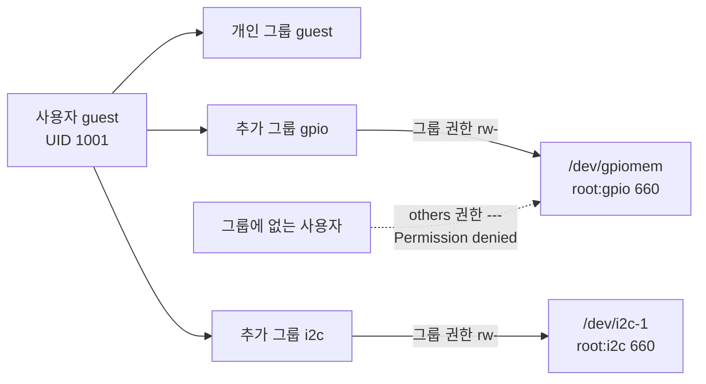
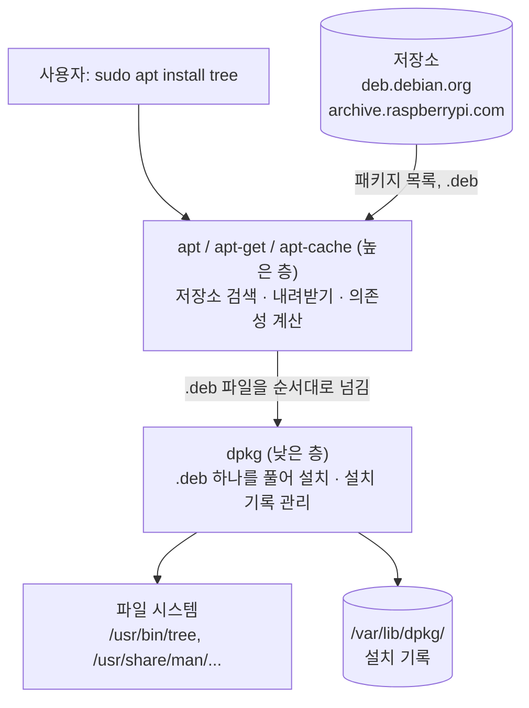
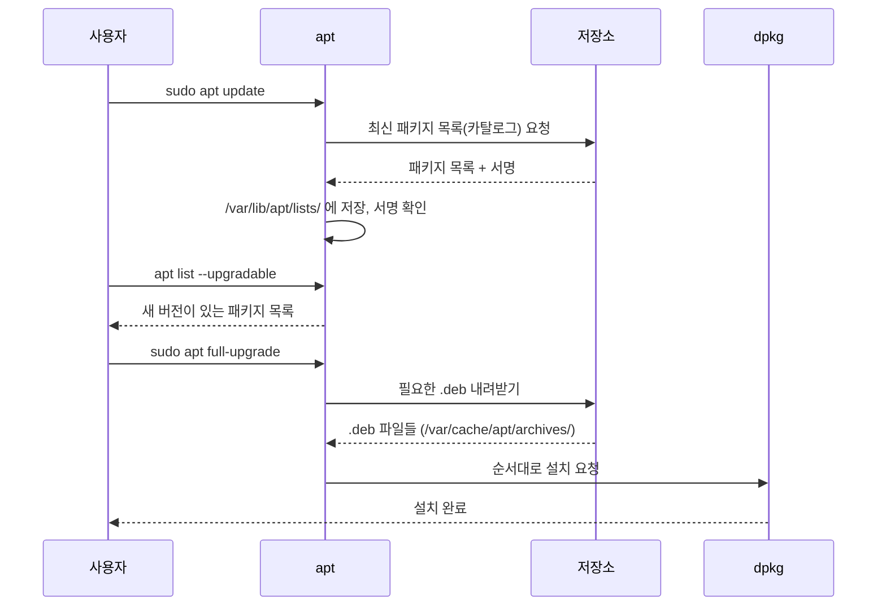
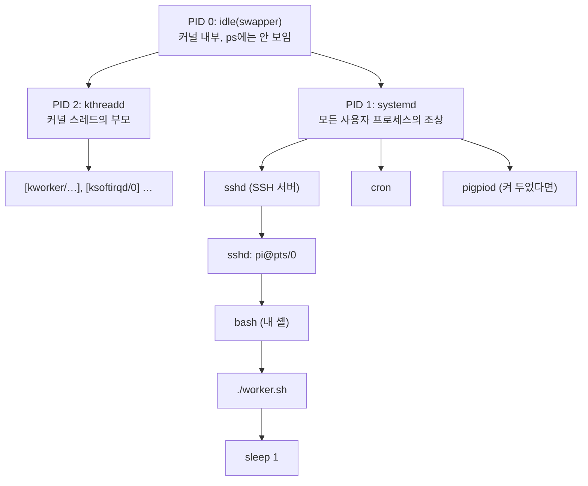
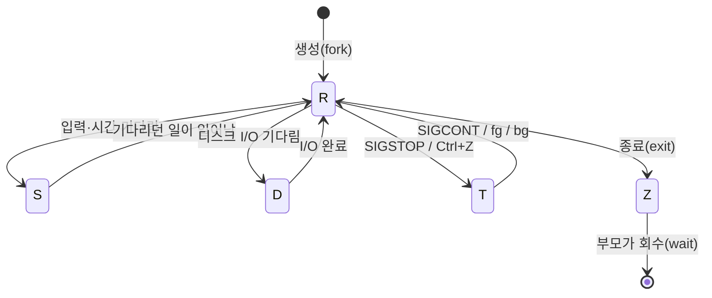
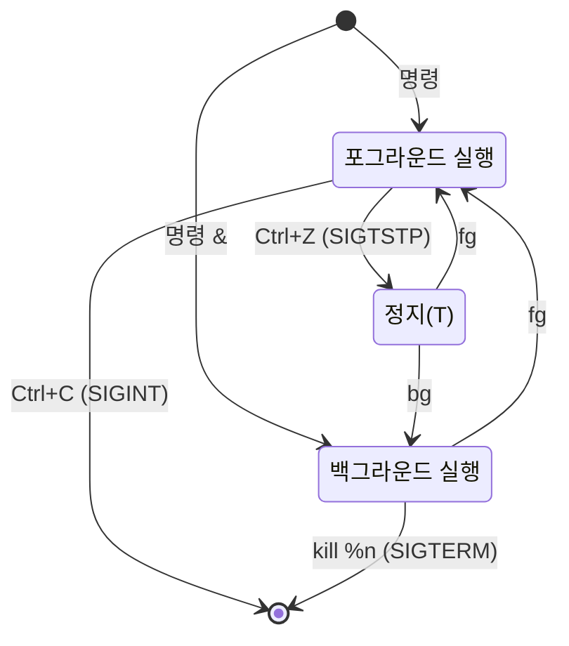
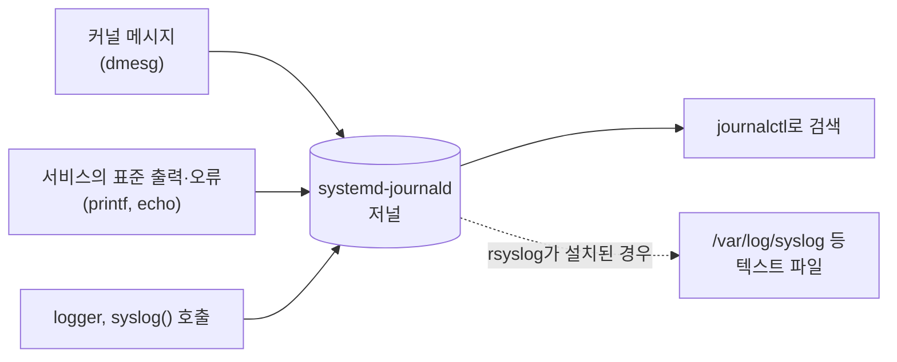
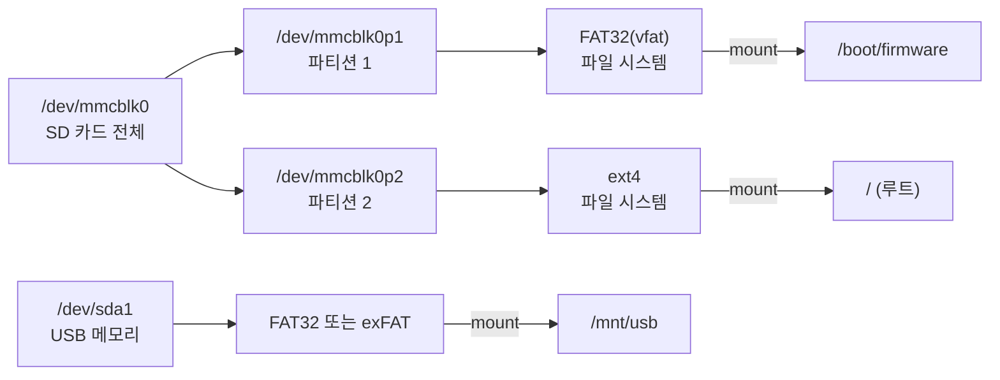

# 5장. 시스템 관리

> **학습 목표**
> - root와 `sudo`가 왜 따로 있는지 설명하고, `/etc/sudoers`와 `sudo` 그룹의 관계, `sudo -i`의 위험을 말할 수 있다.
> - 사용자와 그룹을 만들고 지울 수 있으며, `gpio`·`i2c`·`spi`·`dialout` 그룹이 임베디드 실습에서 왜 중요한지 장치 파일의 권한으로 설명할 수 있다.
> - `dpkg`와 `apt`의 계층 관계, 저장소와 `sources.list`, `update`·`upgrade`·`full-upgrade`의 차이를 이해하고, 패키지를 찾고·설치하고·조사하고·지울 수 있다.
> - Bookworm에서 `pip install`이 `externally-managed-environment`로 거부되는 이유를 알고 가상 환경(venv)이나 `apt`로 대신할 수 있다.
> - 프로그램과 프로세스를 구별하고, `ps`·`pstree`·`top`으로 PID·PPID·상태를 읽으며, 시그널과 `kill`·`jobs`·`fg`·`bg`·`nohup`·`nice`로 프로세스를 다룰 수 있다.
> - systemd의 유닛·타깃 개념을 이해하고, `systemctl`로 서비스를 켜고 끄며, 직접 만든 서비스 유닛을 부팅 때 자동 실행할 수 있다.
> - `journalctl`로 서비스와 커널의 로그를 걸러 볼 수 있다.
> - `cron`과 systemd 타이머로 작업을 예약할 수 있다.
> - 블록 장치·파티션·파일 시스템·마운트의 관계를 그림으로 설명하고, USB 메모리를 마운트하며, `/etc/fstab`을 안전하게 고치고, SD 카드를 이미지로 백업할 수 있다.
> - 메모리·스왑·온도·클록·부하를 확인해 임베디드 보드의 상태를 진단할 수 있다.
> - Raspberry Pi 4에 RTC(Real-Time Clock, 실시간 시계)가 없다는 사실과 시간 동기화(NTP)의 관계를 설명할 수 있다.

[3장](03_rpi_hw_os.md)에서 OS를 설치하고 접속했고, [4장](04_linux_shell.md)에서 셸 위에서 파일을 다루고 스크립트를 짜는 법을 익혔다. 이제 한 걸음 더 나아가 **이 컴퓨터를 관리하는 사람**의 자리에 서 보자. 프로그램을 설치하고, 누가 이 보드를 쓸 수 있는지 정하고, 백그라운드에서 도는 프로그램을 감시하고, 부팅할 때 내 프로그램이 저절로 실행되게 하고, 저장 장치가 꽉 차거나 SD 카드가 망가졌을 때 복구하는 일이다.

[1장](01_embedded_system.md)의 비유를 다시 꺼내 보자. 1인 분식집 주인은 혼자 주문받고 요리하고 계산한다(베어메탈). 큰 레스토랑에는 **총지배인**(OS)이 있어 요리사와 홀 직원에게 일을 나누어 준다. 이 장에서 배우는 것은 바로 그 레스토랑을 **운영**하는 법이다.

| 레스토랑 운영 | Linux 시스템 관리 | 절 |
|---|---|---|
| 마스터키는 사장만 갖고, 필요할 때만 빌려준다 | root와 `sudo` | 5.1 |
| 직원 명부와 출입증, "주방 출입 가능" 같은 권한 묶음 | 사용자와 그룹 | 5.2 |
| 식자재 납품 업체 목록과 주문서 | 저장소와 `apt` | 5.3 |
| 지금 주방에서 진행 중인 요리 하나하나 | 프로세스 | 5.4 |
| 출근하면 자기 자리를 지키는 상주 직원(경비, 계산원) | 데몬과 systemd 서비스 | 5.5 |
| 영업 일지, CCTV 녹화 | 로그(`journalctl`) | 5.6 |
| "매일 아침 9시 재고 확인" 같은 정기 업무 | `cron`, 타이머 | 5.7 |
| 창고와 선반, 창고 문 열쇠 | 저장 장치·파티션·마운트 | 5.8 |
| 조리대 위 공간과 보조 테이블 | 메모리와 스왑 | 5.9 |
| 주방 온도계, 가스 압력계 | 온도·클록·부하 감시 | 5.10 |
| 전화·배달 주소록 | 네트워크 | 5.11 |
| 벽시계 맞추기 | 시간과 NTP | 5.12 |

이 장의 범위는 다음과 같다. 3장에서 이미 한 것(`raspi-config` 메뉴 둘러보기, 첫 `apt full-upgrade`, `nmcli` 고정 IP, SSH·xrdp, `vcgencmd get_throttled` 비트 표, `free`·`df`·`lsblk` 출력 읽기, Bluetooth 재설치)과 4장에서 한 것(권한·`chmod`·`sudo tee`·setuid, 링크와 inode, 파이프, 스크립트, `tar`)은 다시 설명하지 않고 해당 절로 연결한다. 부팅 과정과 `config.txt`·`cmdline.txt`의 자세한 의미는 [7장](07_boot_kernel.md)에서, `fork()`·`exec()`로 프로세스를 직접 만드는 C 프로그래밍은 [11장](11_process_concurrency.md)에서 다룬다.

> 실습 환경: 모든 명령은 Raspberry Pi 4B + Raspberry Pi OS(64-bit, Bookworm)를 기준으로 한다. 출력 블록마다 바로 위에 `> 출력 출처:` 줄을 달아 어디서 얻은 출력인지 밝혔다([머리말](00_preface.md) 「이 책의 표기 규칙」). "WSL Debian 12 실행 결과"는 같은 Debian 12(Bookworm) 기반인 WSL(x86-64, systemd 252)에서 실제로 실행해 얻은 것이고, SD 카드·GPIO·`vcgencmd`처럼 Pi에서만 볼 수 있는 출력은 "예시(Pi 4 실기기에서 확인 필요)"로 표시했다. PID, 날짜, 크기, UUID는 실행할 때마다 다르다. WSL 출력에 나온 컴퓨터 이름과 IP 주소는 각각 `raspberrypi`와 `192.168.0.xx` 꼴의 예시 값으로 바꾸어 적었다.

---

## 5.1 관리자 권한: root와 sudo

### 5.1.1 왜 관리자 계정을 따로 두는가

건물에는 모든 문을 여는 **마스터키**가 하나 있다. 이 열쇠를 직원 모두에게 나누어 주면 편하기는 하지만, 누군가 실수로 전기실 차단기를 내리거나 열쇠를 잃어버리면 건물 전체가 위험해진다. 그래서 보통 마스터키는 관리실에 두고, 필요한 사람이 **이름을 적고 잠깐 빌려 가게** 한다.

Linux의 마스터키가 **root** 계정이다. 사용자 번호(UID, User IDentifier)가 0인 root는 [4장](04_linux_shell.md) 4.11절에서 본 권한 검사를 모두 통과한다. 시스템 파일을 고치고, 패키지를 설치하고, 다른 사용자의 프로세스를 끝내고, 디스크를 통째로 지울 수도 있다. 그래서 평소에는 일반 사용자로 일하고, 관리 작업이 필요한 **그 명령 하나만** root 권한을 빌린다. 이것이 `sudo`(**s**uper**u**ser **do**)이다.

| 방식 | 비유 | 장점 | 단점 |
|---|---|---|---|
| 항상 root로 로그인 | 마스터키를 늘 주머니에 넣고 다님 | 귀찮은 암호 입력이 없다 | 오타 하나가 시스템 전체를 망가뜨린다. 누가 무엇을 했는지 기록이 남지 않는다 |
| 일반 사용자 + `sudo` | 필요할 때만 관리실에서 빌림 | 실수의 범위가 좁다. 누가 언제 무엇을 했는지 로그에 남는다 | 명령마다 `sudo`를 붙여야 한다 |

### 5.1.2 Raspberry Pi OS의 root는 잠겨 있다

7주차 강의에서 "root 계정의 기본 암호가 따로 있는가?"라는 질문이 나왔다. 답은 <strong>"root에는 암호가 없고, 암호로는 로그인할 수 없게 잠겨 있다"</strong>이다. Debian 계열은 설치할 때 root 암호를 비워 두면 root를 잠그고, 처음 만든 사용자를 `sudo` 그룹에 넣어 관리자 역할을 맡긴다. Raspberry Pi OS도 같은 방식이다. 확인해 보자(세 번째 칸의 날짜는 OS 이미지를 만든 날이라 Pi마다 다르다).

> 출력 출처: Pi 4 실기기 실행 결과(2026-10)

```text
$ sudo passwd -S root
root L 2024-11-19 0 99999 7 -1
```

두 번째 칸의 `L`이 **Locked**(잠김)이다. `P`(usable **P**assword)이면 암호가 설정되어 있다는 뜻이다. `/etc/shadow`에서 root의 암호 칸이 `*`나 `!`로 시작하면 어떤 암호를 넣어도 맞지 않는다.

그래서 Linux 백서와 슬라이드의 다음 방법은 이 교재에서 쓰지 않는다.

| 원문의 방법 | 문제 | 대신 |
|---|---|---|
| `su root`, `su -` | root 암호를 묻는데 root에는 암호가 없으므로 `Authentication failure`가 난다 | `sudo -i` |
| `sudo passwd root`로 root 암호 만들기 | root가 암호로 로그인할 수 있게 된다. 공격자가 노릴 문이 하나 늘어난다 | 하지 않는다. 필요하면 `sudo -i` |
| `reboot -h now` | `shutdown -h now`(끄기)와 섞인 표기이다 | 재부팅은 `sudo reboot`, 끄기는 `sudo poweroff` 또는 `sudo shutdown -h now` |

> 📌 보강: 예전 Raspberry Pi OS에는 기본 사용자 `pi`와 기본 암호 `raspberry`가 있었다. 2022년 4월 배포판부터 이 기본 계정이 없어졌고, Imager의 사용자 지정에서 처음 사용자를 직접 만든다([3장](03_rpi_hw_os.md) 3.6.2절). 슬라이드에 적힌 "2023.8"은 정정한다.

### 5.1.3 sudo는 누구에게 허락하는가: `/etc/sudoers`와 `sudo` 그룹

`sudo`는 아무에게나 root 권한을 주지 않는다. 허락 목록이 `/etc/sudoers` 파일에 있다. 이 파일 자체도 root만 읽을 수 있다(`-r--r-----`). 다음은 Debian 12의 기본 내용에서 주석과 빈 줄을 뺀 것이다(Pi도 같은 Debian `sudo` 패키지이다).

> 출력 출처: WSL Debian 12 실행 결과

```text
$ sudo grep -v '^#' /etc/sudoers | grep -v '^$'
Defaults	env_reset
Defaults	mail_badpass
Defaults	secure_path="/usr/local/sbin:/usr/local/bin:/usr/sbin:/usr/bin:/sbin:/bin"
Defaults	use_pty
root	ALL=(ALL:ALL) ALL
%sudo	ALL=(ALL:ALL) ALL
@includedir /etc/sudoers.d
```

핵심은 `%sudo ALL=(ALL:ALL) ALL` 한 줄이다. 읽는 법은 다음과 같다.

```text
%sudo     ALL   =  (ALL : ALL)   ALL
 │         │        │     │       └─ 실행할 수 있는 명령: 모든 명령
 │         │        │     └───────── 어떤 그룹 자격으로: 모든 그룹
 │         │        └─────────────── 어떤 사용자 자격으로: 모든 사용자(root 포함)
 │         └──────────────────────── 어느 컴퓨터에서: 모든 호스트
 └────────────────────────────────── % = 그룹 이름. "sudo 그룹에 속한 사람은"
```

즉 <strong>"`sudo` 그룹에 들어 있는 사람은 무엇이든 root로 실행할 수 있다"</strong>는 뜻이다. 그래서 새 사용자에게 관리자 권한을 주는 방법은 sudoers 파일을 고치는 것이 아니라 그 사용자를 `sudo` 그룹에 넣는 것이다(5.2절). `secure_path`는 sudo로 실행할 때 쓰는 `PATH`([4장](04_linux_shell.md) 4.16.4절)이다. 내 `~/bin`에 둔 스크립트를 `sudo 이름`으로 부르면 `command not found`가 나는 이유가 이것이다.

| 알아 둘 것 | 설명 |
|---|---|
| `sudo -l` | 내가 sudo로 무엇을 할 수 있는지 보여 준다 |
| `sudo -k` | 기억해 둔 인증을 지운다. 다음 `sudo`는 다시 암호를 묻는다 |
| 암호 기억 시간 | 한 번 암호를 넣으면 같은 터미널에서 기본 **15분**간 다시 묻지 않는다(`timestamp_timeout`) |
| `/etc/sudoers.d/` | 추가 규칙을 파일로 나누어 넣는 곳. 설치 방식에 따라 처음 사용자를 위한 파일이 있어 **암호를 묻지 않고** sudo가 되는 경우가 있다. `sudo ls /etc/sudoers.d`로 확인한다 |
| `sudo visudo` | sudoers를 고칠 때는 반드시 이 명령을 쓴다. 저장할 때 문법을 검사해 준다 |
| 기록 | sudo 사용은 로그에 남는다: `journalctl _COMM=sudo -n 5`(5.6절) |

> ⚠ **sudoers를 `nano`로 직접 고치지 않는다.** 문법이 하나라도 틀리면 `sudo` 자체가 동작하지 않는다. 그런데 root는 잠겨 있으므로 고칠 길이 없어진다. 이때는 SD 카드를 다른 Linux에 꽂아 고치는 수밖에 없다(5.8.7절). `visudo`는 저장하기 전에 검사하고, 틀리면 `What now?`라고 물어 되돌릴 기회를 준다.

> 📌 보강: sudoers 문법, `timestamp_timeout`의 기본값(15분), `@includedir`의 의미는 [sudoers(5)](https://manpages.debian.org/bookworm/sudo/sudoers.5.en.html)를, sudo 암호 요구를 끄고 켜는 공식 방법(raspi-config `1 System Options > S10 Admin Password`)은 [Raspberry Pi Documentation – User access and management](https://www.raspberrypi.com/documentation/computers/configuration.html#users)를 따랐다. 단, 교재 확인에 쓴 Pi 4의 raspi-config(20250813)에는 이 메뉴가 없고 `S10`이 `Logging`이었다. 이 Pi에서는 `/etc/sudoers.d/010_pi-nopasswd` 파일이 처음 사용자의 sudo 암호를 묻지 않게 하고 있었다.

### 5.1.4 root 셸: `sudo -i`

명령 여러 개를 연달아 root로 실행해야 할 때는 root 셸을 연다.

> 출력 출처: Pi 4 실기기 실행 결과(2026-10)

```text
pi@raspberrypi:~ $ sudo -i
root@raspberrypi:~# whoami
root
root@raspberrypi:~# pwd
/root
root@raspberrypi:~# exit
logout
pi@raspberrypi:~ $
```

프롬프트 끝이 `$`에서 <strong>`#`</strong>으로 바뀐 것을 보자([4장](04_linux_shell.md) 4.6.3절). `#`이 보이는 동안은 **모든 명령이 마스터키로 실행**된다. 일이 끝나면 바로 `exit`한다.

| 명령 | 누구로 | 환경(홈, PATH) | 쓰는 때 |
|---|---|---|---|
| `sudo 명령` | root | 원래 셸의 환경을 대부분 유지(PATH는 `secure_path`) | **기본.** 명령 하나만 |
| `sudo -i` | root | root의 로그인 환경(`/root`) | 관리 명령 여러 개를 연달아 |
| `sudo -u guest 명령` | guest | | 다른 사용자 입장에서 시험해 볼 때(과제 5-1) |
| `sudo su - guest` | guest | guest의 로그인 환경 | 다른 사용자로 "로그인한 것처럼"(공식 문서의 방법) |
| `su 사용자` | 그 사용자 | | **그 사용자의 암호**를 알아야 한다 |

### 5.1.5 sudo를 쓸 때의 위험

| 위험 | 예 | 예방 |
|---|---|---|
| 되돌릴 수 없는 삭제 | `sudo rm -rf /home/pi/ build`(공백 하나 때문에 홈 전체가 지워진다) | `sudo` 앞에서 한 번 더 읽는다([4장](04_linux_shell.md) 트러블슈팅의 `rm -rf`) |
| 디스크 통째로 덮어쓰기 | `sudo dd of=/dev/mmcblk0 ...`(5.8.9절) | 장치 이름을 `lsblk`로 두 번 확인 |
| 내 파일이 root 소유가 됨 | 홈 디렉터리에서 `sudo nano test.c`, `sudo gcc ...`를 하면 결과 파일의 주인이 root가 된다. 나중에 일반 사용자로 고치려 하면 `Permission denied` | 내 홈의 파일에는 sudo를 쓰지 않는다. 이미 생겼으면 `sudo chown $USER: 파일` |
| 출처를 모르는 명령 | 인터넷 글의 `curl ... \| sudo bash` | 내용을 먼저 읽는다 |
| 리다이렉션 착각 | `sudo echo 1 > /sys/...` | [4장](04_linux_shell.md) 4.11.6절의 `sudo tee` |

강의에서도 강조했듯이 **root로 로그인해서 일하지 않는다.** `sudo`는 "이 명령은 시스템을 바꾼다"는 것을 내가 스스로 의식하게 해 주는 안전장치이기도 하다.

---

## 5.2 사용자와 그룹

### 5.2.1 왜 사용자를 나누는가

Linux는 처음부터 **멀티유저**(multi-user) OS로 태어났다. 7주차 강의의 말대로 여러 사람이 동시에 접속할 수 있다는 것이 Linux의 큰 장점이다. 한 대의 Pi를 조원 세 명이 SSH로 함께 쓴다면, 각자의 홈 디렉터리와 파일을 서로 함부로 지우지 못해야 한다. 웹 서버 프로그램이 해킹당하더라도 그 프로그램은 자기 몫의 파일만 건드릴 수 있어야 한다. 이 "누구인가"를 정하는 단위가 **사용자**(user)이고, 같은 권한을 받을 사람을 묶은 것이 **그룹**(group)이다.

사람이 아닌 사용자도 많다. `cat /etc/passwd`를 해 보면 `www-data`, `systemd-timesync`, `messagebus`, `nobody` 같은 이름이 보인다. 이들은 **서비스 프로그램이 쓰는 계정**으로, 로그인은 못 하도록 셸이 `/usr/sbin/nologin`으로 되어 있다.

| UID 범위 | 용도 | 예 |
|---|---|---|
| 0 | root | `root` |
| 1~999 | 시스템(서비스) 계정. 로그인하지 않는다 | `daemon`, `www-data`, `systemd-timesync` |
| 1000~ | 사람이 쓰는 일반 계정. 처음 만든 사용자가 1000번 | `pi`, `guest` |
| 65534 | 아무 권한도 없는 계정 | `nobody` |

### 5.2.2 사용자 정보가 저장된 곳

[4장](04_linux_shell.md)에서 `/etc/passwd`와 `/etc/shadow`의 권한을 보았다. 이번에는 내용을 읽어 보자.

> 출력 출처: Pi 4 실기기 실행 결과(2026-10)

```text
$ grep "^pi:" /etc/passwd
pi:x:1000:1000:,,,:/home/pi:/bin/bash
```

| 칸 | 값 | 뜻 |
|---|---|---|
| 1 | `pi` | 사용자 이름 |
| 2 | `x` | 암호는 여기 없고 `/etc/shadow`에 있다는 표시 |
| 3 | `1000` | UID |
| 4 | `1000` | 기본 그룹의 번호(GID, Group IDentifier) |
| 5 | `,,,` | 설명(이름, 방 번호 등. `adduser`가 묻는 항목) |
| 6 | `/home/pi` | 홈 디렉터리 |
| 7 | `/bin/bash` | 로그인 셸. `chsh`로 바꾼다(5.2.6절) |

그룹은 `/etc/group`에 있다. `getent group 그룹`으로 한 줄만 볼 수 있다.

> 출력 출처: WSL Debian 12 실행 결과

```text
$ getent group sudo
sudo:x:27:pi
```

"27번 `sudo` 그룹의 구성원은 `pi`"라는 뜻이다. 사용자마다 이름이 같은 **개인 그룹**(`pi` 그룹)이 하나씩 만들어지고, 그 밖의 그룹은 **추가 그룹**(supplementary group)으로 붙는다.

### 5.2.3 사용자 만들기: `adduser`와 `useradd`

Debian에는 이름이 비슷한 명령이 두 개 있어 헷갈린다.

| | `adduser` | `useradd` |
|---|---|---|
| 정체 | Debian이 만든 **친절한 대화형** 도구(내부에서 `useradd` 등을 부른다) | 모든 Linux에 있는 **저수준** 도구 |
| 홈 디렉터리 | 자동으로 만들고 `/etc/skel`의 기본 파일(`.bashrc` 등)을 복사 | `-m`을 주어야 만든다 |
| 암호 | 바로 물어본다 | 따로 `passwd`를 해야 한다 |
| 로그인 셸 | 설정 파일의 기본값(bash) | 지정하지 않으면 `/bin/sh` |
| 쓰는 곳 | **사람이 손으로 사용자를 만들 때** | 스크립트, 다른 배포판 |

이 교재는 공식 문서와 슬라이드를 따라 `adduser`를 쓴다. 다음은 진행 모습이다(Bookworm의 `adduser` 3.134. 버전에 따라 모양이 조금 다르다).

> 출력 출처: Pi 4 실기기 실행 결과(2026-10, 영어 메시지로 실행. 시험용 사용자는 확인 후 바로 지웠다)

```text
$ sudo adduser guest
Adding user `guest' ...
Adding new group `guest' (1001) ...
Adding new user `guest' (1001) with group `guest (1001)' ...
Creating home directory `/home/guest' ...
Copying files from `/etc/skel' ...
New password:                       ← 입력해도 화면에 아무것도 보이지 않는다
Retype new password:
passwd: password updated successfully
Changing the user information for guest
Enter the new value, or press ENTER for the default
	Full Name []:                    ← Enter로 건너뛰어도 된다
	Room Number []:
	Work Phone []:
	Home Phone []:
	Other []:
Is the information correct? [Y/n] y
Adding new user `guest' to supplemental / extra groups `users' ...
Adding user `guest' to group `users' ...
```

마지막 두 줄은 새 사용자를 `users` 그룹에 넣었다는 뜻이다(아래 보강 참고).

> 📌 보강: Bookworm의 `adduser`(3.134)는 새 홈 디렉터리를 <strong>`700`(drwx------)</strong>으로 만드는 것이 기본값이다(`/etc/adduser.conf`의 `DIR_MODE`). 즉 **다른 사용자는 남의 홈 디렉터리에 들어갈 수조차 없다.** 예전 Debian은 `755`가 기본이었으므로 오래된 자료와 다를 수 있다. 또 Bookworm의 `adduser`는 새 사용자를 `users` 그룹(GID 100)에도 넣는다. Pi 4 실기기에서 `ls -ld /home/*`로 확인하니 `/home/guest`와 `/home/pi` 모두 `drwx------`였다. 내 Pi에서도 직접 확인하라. 이 사실은 과제 5-1에서 중요하다. 출처: Debian `adduser` 패키지의 NEWS 3.123·3.124 항목(`/usr/share/doc/adduser/NEWS.Debian.gz`, WSL Debian 12에서 확인), [adduser.conf(5)](https://manpages.debian.org/bookworm/adduser/adduser.conf.5.en.html)

### 5.2.4 그룹이 임베디드에서 중요한 이유

새로 만든 `guest`로 로그인해서 [8장](08_gpio_pigpio.md)의 `pinctrl get 17`이나 [12장](12_communication.md)의 `i2cdetect -y 1`을 실행해 보면 `Permission denied`가 난다. 처음 사용자 `pi`는 되는데 왜 `guest`는 안 될까?

[4장](04_linux_shell.md) 4.4절에서 배웠듯이 Linux에서는 **장치도 파일**이다. 그리고 장치 파일에도 소유자·그룹·권한이 있다. Pi 4에서는 다음과 같이 보인다(날짜와 장치 번호는 다를 수 있다).

> 출력 출처: Pi 4 실기기 실행 결과(2026-10)

```text
$ ls -l /dev/gpiomem /dev/gpiochip0 /dev/i2c-1 /dev/spidev0.0 /dev/ttyS0 /dev/vchiq
crw-rw---- 1 root gpio  254,   0 Feb  7  2026 /dev/gpiochip0
crw-rw---- 1 root gpio  239,   0 Feb  7  2026 /dev/gpiomem
crw-rw---- 1 root i2c    89,   1 Feb  7  2026 /dev/i2c-1
crw-rw---- 1 root spi   153,   0 Feb  7  2026 /dev/spidev0.0
crw------- 1 pi   tty     4,  64 Oct  6 13:24 /dev/ttyS0
crw-rw---- 1 root video  10, 259 Feb  7  2026 /dev/vchiq
```

`/dev/ttyS0`을 뺀 나머지는 권한이 모두 `crw-rw----`(660)이다. **소유자 root와 해당 그룹만** 읽고 쓸 수 있고, 그 외(others)는 아무것도 못 한다. 즉 `/dev/gpiomem`을 쓰려면 root이거나 **`gpio` 그룹 구성원**이어야 한다. (`/dev/i2c-1`은 I2C를, `/dev/spidev0.0`은 SPI를 켜야 생긴다([12장](12_communication.md)).)

`/dev/ttyS0`(GPIO14·15의 UART, [3장](03_rpi_hw_os.md))만 모양이 다르다. 이 Pi는 `cmdline.txt`에 `console=serial0,115200`을 두어 이 포트를 **시리얼 콘솔**(로그인 창)로 쓰고 있고, 지금 `pi`가 그 포트로 로그인해 있다. 로그인한 포트는 `login`이 그 사용자 소유(`pi`, `tty` 그룹, 600)로 바꾸어 두므로 다른 사람은 열 수 없다. 시리얼 콘솔을 끄면 Debian 기본 udev 규칙에 따라 `root:dialout`, `crw-rw----`가 되어 `dialout` 그룹이 쓸 수 있다. 참고로 이 Pi 4에는 `/dev/ttyAMA0`이 없다. Pi 4의 다른 UART(PL011)는 Bluetooth 칩에 직접 연결되어 커널이 Bluetooth용으로만 쓰므로 `/dev`에 tty 장치로 나타나지 않는다.

| 그룹 | 열어 주는 장치·기능 | 이 교재에서 쓰는 곳 |
|---|---|---|
| `gpio` | `/dev/gpiomem`, `/dev/gpiochip*` | `pinctrl`, libgpiod 도구([8장](08_gpio_pigpio.md), [부록 B](appendix_b_gpio_libraries.md)) |
| `i2c` | `/dev/i2c-*` | `i2cdetect`, LCD·RTC([12장](12_communication.md)) |
| `spi` | `/dev/spidev*` | MCP3008([12장](12_communication.md)) |
| `dialout` | 시리얼 포트 `/dev/ttyAMA0`, `/dev/ttyS0`, `/dev/ttyUSB0` | UART 통신([12장](12_communication.md)) |
| `video` | `/dev/vchiq`(VideoCore GPU와의 통로), 카메라 | `vcgencmd`(5.10절) |
| `audio`, `plugdev`, `input`, `render` | 소리, USB 장치, 입력 장치, GPU | 데스크톱 사용 |
| `bluetooth` | Bluetooth | [13장](13_ble_iot.md) |
| `sudo` | sudo 사용 | 관리 작업 |
| `adm` | `/var/log`의 일부 로그 읽기 | 로그 확인 |

> 주의: [8장](08_gpio_pigpio.md)의 pigpio C 프로그램(방식 A)은 `/dev/mem`과 DMA를 직접 쓰므로 그룹과 상관없이 <strong>항상 `sudo`</strong>가 필요하다. 그룹으로 해결되는 것은 `/dev/gpiomem`, `/dev/gpiochip*`처럼 그룹 권한이 열려 있는 장치뿐이다.

Raspberry Pi 공식 문서는 새 사용자에게 처음 사용자와 같은 권한을 주는 명령을 다음과 같이 안내한다. 거꾸로 말하면 `adduser`로 만든 사용자는 이 그룹들에 **자동으로 들어가지 않는다**.

```bash
sudo usermod -a -G adm,dialout,cdrom,sudo,audio,video,plugdev,games,users,input,render,netdev,lpadmin,gpio,i2c,spi guest
```

관리자 권한까지 줄 필요가 없으면 목록에서 `sudo`를 빼고, GPIO만 필요하면 `gpio`만 넣는다(최소 권한 원칙, [4장](04_linux_shell.md) 4.11.9절).

> 📌 보강: 출처 [Raspberry Pi Documentation – Grant user access permissions](https://www.raspberrypi.com/documentation/computers/configuration.html#users). 장치 파일의 그룹은 부팅 때 udev 규칙이 정해 준다. `gpio`·`i2c`·`spi` 그룹은 Raspberry Pi OS의 `raspberrypi-sys-mods` 패키지가 설치한 `/etc/udev/rules.d/99-com.rules`(예: `SUBSYSTEM=="i2c-dev", GROUP="i2c", MODE="0660"`)가, 시리얼 포트의 `dialout` 그룹은 Debian 기본 규칙 `/usr/lib/udev/rules.d/50-udev-default.rules`가 정한다(Pi 4 실기기에서 확인).

### 5.2.5 그룹에 넣기: `usermod -aG`와 다시 로그인

```bash
sudo usermod -aG gpio guest       # guest를 gpio 그룹에 "추가"(-a)
groups guest                      # guest의 그룹 목록 확인
```

두 가지를 꼭 기억하자.

**① `-a`를 빼먹지 않는다.** `-G`는 "추가 그룹 목록을 **이것으로 바꾼다**"는 뜻이고, `-a`(**a**ppend)가 있어야 "기존 목록에 **덧붙인다**"가 된다. `sudo usermod -G gpio pi`라고 치면 `pi`는 `gpio` 하나만 남고 `sudo`·`dialout` 등에서 모두 빠진다. 그 순간 내가 내 Pi의 관리자 권한을 잃는다. [3장](03_rpi_hw_os.md) 3.12.4절의 Bluetooth 재설치에서 `-a -G`라고 쓴 이유이다.

**② 그룹 변경은 다시 로그인해야 적용된다.** 그룹 목록은 로그인할 때 셸 프로세스에 한 번 붙고, 그 셸에서 실행하는 프로그램은 모두 그 목록을 물려받는다(5.4절). 이미 떠 있는 셸은 바뀐 `/etc/group`을 다시 읽지 않는다. 출입증을 새로 발급받아도 이미 목에 건 옛 출입증으로는 새 방에 못 들어가는 것과 같다.

> 출력 출처: Pi 4 실기기 실행 결과(2026-10)

```text
$ sudo usermod -aG gpio guest
$ sudo su - guest          ← 여기서 새로 로그인한 셸은 새 목록을 받는다
guest@raspberrypi:~ $ id -nG
guest users gpio
```

그러면 **이미 떠 있던 셸**은 어떨까? 위의 guest 셸을 열어 둔 채로, 다른 터미널에서 guest를 `i2c` 그룹에 하나 더 넣어 보았다.

> 출력 출처: Pi 4 실기기 실행 결과(2026-10, 두 터미널의 화면을 순서대로 모음)

```text
$ sudo usermod -aG i2c guest          ← (다른 터미널, pi) i2c 그룹 추가
$ groups guest                        ← /etc/group 기준: 이미 들어가 있다
guest : guest users i2c gpio
guest@raspberrypi:~ $ id -nG          ← (열어 둔 guest 셸) 지금 셸의 그룹: 아직 i2c가 없다
guest users gpio
guest@raspberrypi:~ $ exit            ← 로그아웃하고 다시 로그인해야 i2c가 붙는다
```

내 계정(`pi`)을 새 그룹에 넣었을 때도 똑같다. 지금 셸의 `id -nG`에는 새 그룹이 없고 `groups pi`에는 있다. SSH라면 접속을 끊고 다시 접속한다.

| 확인 방법 | 무엇을 보여 주나 |
|---|---|
| `id`, `id -nG` | **지금 이 셸 프로세스**가 가진 그룹 |
| `groups 사용자` | 파일(`/etc/group`)에 적힌 그 사용자의 그룹 |
| `getent group gpio` | `gpio` 그룹의 구성원 목록 |

다시 로그인하기 귀찮으면 `su - $USER`(내 암호 입력)로 새 로그인 셸을 하나 열어도 된다. 데스크톱은 로그아웃 후 다시 로그인하거나 재부팅한다.

### 5.2.6 암호, 로그인 셸, 사용자 삭제

| 하고 싶은 일 | 명령 | 비고 |
|---|---|---|
| 내 암호 바꾸기 | `passwd` | 입력은 화면에 보이지 않는다 |
| 다른 사용자 암호 바꾸기 | `sudo passwd guest` | 관리자는 원래 암호를 몰라도 된다 |
| 암호 상태 보기 | `sudo passwd -S guest` | `P` 사용 가능, `L` 잠김 |
| 계정 잠그기 / 풀기 | `sudo usermod -L guest` / `sudo usermod -U guest` | 지우지 않고 로그인만 막는다 |
| 로그인 셸 바꾸기 | `chsh -s /usr/bin/zsh` | 셸은 `/etc/shells`에 있어야 한다([4장](04_linux_shell.md) 4.20.4절). 다음 로그인부터 적용 |
| 그룹 만들기 / 지우기 | `sudo addgroup lab` / `sudo delgroup lab` | |
| 그룹에서 빼기 | `sudo deluser guest gpio` | 사용자는 그대로 두고 `gpio` 그룹에서만 뺀다 |
| 사용자 지우기(홈 유지) | `sudo deluser guest` | `/home/guest`가 남는다 |
| 사용자와 홈까지 지우기 | `sudo deluser --remove-home guest` | 공식 문서의 방법 |
| 사용자 목록 | `ls -l /home`, `getent passwd \| awk -F: '$3>=1000'` | 앞은 공식 문서의 방법 |

> 주의: 지우려는 사용자가 로그인해 있거나 그 사용자의 프로세스가 돌고 있으면 `deluser`가 실패한다. `who`로 확인하고, 로그아웃시키거나 `sudo pkill -u guest`로 그 사용자의 프로세스를 끝낸 뒤 지운다(`pkill`은 5.4.6절). 지운 사용자가 `/tmp` 등에 남긴 파일은 `ls -l`에서 이름 대신 <strong>숫자(UID)</strong>로 보인다. 주인 없는 파일이 된 것이다.



---

## 5.3 패키지 관리: apt와 dpkg

### 5.3.1 왜 패키지 관리자가 필요한가

Windows에서 프로그램을 설치할 때를 떠올려 보자. 웹사이트를 찾아가 `setup.exe`를 내려받아 실행하고, "다음"을 몇 번 누른다. 이 방식에는 문제가 몇 가지 있다.

- 그 사이트가 진짜인지 확인하기 어렵다.
- 프로그램마다 따로 업데이트를 확인한다(또는 아예 안 한다).
- 프로그램 A와 B가 같은 라이브러리의 다른 버전을 각자 들고 와서 충돌한다.
- 지울 때 찌꺼기가 남는다.

Linux 배포판은 처음부터 다른 길을 택했다. 배포판 팀이 수만 개의 프로그램을 미리 **검증된 묶음**, 즉 **패키지**(package)로 만들어 **저장소**(repository)라는 서버에 올려 둔다. 사용자는 **패키지 관리자**에게 이름만 말하면 된다. 스마트폰의 앱 스토어와 비슷하지만, 앱끼리 함께 쓰는 라이브러리까지 관리해 준다는 점이 다르다. 강의의 표현대로 "윈도우는 사이트에서 설치 파일을 받아 실행하지만, 리눅스는 대부분의 프로그램을 `apt`로 설치한다."

| 개념 | 뜻 | 비유 |
|---|---|---|
| 패키지 | 프로그램 파일 + 설정 파일 + "무엇이 필요하다"는 정보를 묶은 파일. Debian 계열은 `.deb` | 밀키트 상자(재료 + 조리법 + "냄비 필요" 표시) |
| 의존성(dependency) | 이 패키지가 동작하려면 먼저 있어야 하는 다른 패키지 | 밀키트를 만들려면 냄비가 있어야 한다 |
| 저장소 | 패키지를 모아 둔 서버. 전자 서명으로 진짜임을 확인한다 | 검증된 납품 업체 |
| 패키지 목록(index) | 저장소에 어떤 패키지의 어떤 버전이 있는지 적은 목록 | 업체의 최신 카탈로그 |

### 5.3.2 두 층: dpkg와 apt

Debian의 패키지 관리는 두 층으로 되어 있다.



| | `dpkg` | `apt` |
|---|---|---|
| 이름 | **D**ebian **p**ac**k**a**g**e | **A**dvanced **P**ackage **T**ool |
| 다루는 것 | 내 컴퓨터에 있는 `.deb` 파일 하나 | 저장소 전체 |
| 의존성 | 확인만 하고 **해결하지 않는다**("이게 없어서 못 깐다"로 끝) | 필요한 패키지를 **찾아서 함께 설치**한다 |
| 네트워크 | 쓰지 않는다 | 저장소에서 내려받는다 |
| 주 용도 | "이 파일은 어느 패키지 것인가?", "이 패키지는 무엇을 설치했나?" 같은 **조사** | 설치·삭제·업그레이드 |

**`apt`와 `apt-get`.** 강의에서 "옛날에는 `apt-get`, 요즘은 `apt`"라고 했다. 정확히는 `apt-get`·`apt-cache`가 원래 도구이고, `apt`는 이 둘의 자주 쓰는 기능을 하나로 모으고 진행 막대와 색을 더한 **사람용 앞단**이다. 내부 엔진은 같다. 공식 매뉴얼 [apt(8)](https://manpages.debian.org/bookworm/apt/apt.8.en.html)은 `apt`의 출력 형식이 버전마다 바뀔 수 있으므로 **스크립트에서는 `apt-get`을 쓰라**고 권한다. 그래서 손으로 칠 때는 `apt`, 셸 스크립트 안에서는 `apt-get`을 쓰는 것이 관례이다. (Linux 슬라이드의 "Ubuntu 16.04부터 도입"이라는 표현은 공식 문서로 확인되지 않아 뺐다.)

| 하는 일 | `apt` | 예전 도구 |
|---|---|---|
| 목록 갱신 | `apt update` | `apt-get update` |
| 설치 / 삭제 | `apt install` / `apt remove` | `apt-get install` / `apt-get remove` |
| 업그레이드 | `apt upgrade`, `apt full-upgrade` | `apt-get upgrade`, `apt-get dist-upgrade` |
| 검색 | `apt search` | `apt-cache search` |
| 정보 | `apt show` | `apt-cache show` |
| 버전·출처 | `apt policy` | `apt-cache policy` |
| 설치된 목록 | `apt list --installed` | `dpkg -l` |

### 5.3.3 저장소 목록: `sources.list`

`apt`는 어느 서버에서 패키지를 받을지 다음 파일에서 읽는다. Bookworm의 Raspberry Pi OS에는 두 곳이 등록되어 있다. Pi 4에서는 다음과 같이 보인다.

> 출력 출처: Pi 4 실기기 실행 결과(2026-10, `#`으로 시작하는 주석 줄은 뺐다)

```text
$ cat /etc/apt/sources.list
deb http://deb.debian.org/debian bookworm main contrib non-free non-free-firmware
deb http://deb.debian.org/debian-security/ bookworm-security main contrib non-free non-free-firmware
deb http://deb.debian.org/debian bookworm-updates main contrib non-free non-free-firmware
$ cat /etc/apt/sources.list.d/raspi.list
deb http://archive.raspberrypi.com/debian/ bookworm main
```

실제 파일에는 이 밖에 `#deb-src ...`처럼 `#`으로 막아 둔 줄이 더 있다. 소스 코드 패키지용 줄로, 평소에는 쓰지 않는다.

한 줄을 읽어 보자.

```text
deb   http://deb.debian.org/debian   bookworm   main contrib non-free non-free-firmware
 │     │                              │          └─ 구역(component): 자유 SW(main), 비자유 SW·펌웨어 등
 │     │                              └──────────── 배포판 이름(코드명)
 │     └─────────────────────────────────────────── 저장소 주소
 └───────────────────────────────────────────────── 실행 파일 패키지(deb). 소스 코드는 deb-src
```

| 저장소 | 들어 있는 것 |
|---|---|
| `deb.debian.org/debian` | Debian 12의 일반 패키지(`tree`, `zsh`, `gcc` …) |
| `debian-security` | 보안 패치 |
| `bookworm-updates` | 다음 정식 갱신 전에 급히 나오는 수정 |
| `archive.raspberrypi.com` | Raspberry Pi 전용: 커널(`linux-image-rpi-*`), 펌웨어(`raspi-firmware`), `raspi-config`, Pi용 `pigpio` 등 |

Raspberry Pi OS가 "Debian + Raspberry Pi 전용 저장소"라는 사실이 이 두 파일에 그대로 드러난다. Pi의 커널이 Debian의 일반 arm64 커널이 아니라 `archive.raspberrypi.com`에서 오는 것이다.

> 📌 보강: 공식 문서는 "APT는 저장소 목록을 `/etc/apt/sources.list`와 `/etc/apt/sources.list.d/`에 둔다"고 설명한다([Raspberry Pi Documentation – Update software](https://www.raspberrypi.com/documentation/computers/os.html#update-software)). 다음 버전인 Trixie(Debian 13) 기반 Raspberry Pi OS는 같은 정보를 여러 줄 형식(deb822)의 `.sources` 파일로 적는다. 두 형식 모두 [sources.list(5)](https://manpages.debian.org/bookworm/apt/sources.list.5.en.html)에 설명되어 있다. 위 파일 내용과 Trixie의 파일 이름은 실기기에서 확인할 것.

**저장소 줄을 함부로 추가하지 않는다.** 인터넷 글에서 "이 줄을 sources.list에 넣으라"고 하는 경우가 있다. 다른 배포판(Ubuntu, Debian testing 등)의 저장소를 섞으면 의존성이 꼬여 업그레이드가 안 되거나 부팅되지 않는 시스템이 된다.

### 5.3.4 목록 갱신과 업그레이드

`update`·`upgrade`·`full-upgrade`의 차이는 [3장](03_rpi_hw_os.md) 3.12.2절의 표에서 정리했다. 여기서는 그 뒤에서 무슨 일이 일어나는지 보자.



- `apt update`는 **카탈로그만** 새로 받는다. 아무것도 설치하지 않는다(강의: "update는 목록만 확인하는 것").
- `apt list --upgradable`로 무엇이 바뀔지 먼저 본다(강의에서 쓴 명령).
- 공식 문서는 Raspberry Pi OS가 Debian보다 의존성을 자주 바꾸므로 `upgrade`보다 <strong>`full-upgrade`</strong>를 권한다. 슬라이드의 `dist-upgrade`는 `full-upgrade`의 예전 이름이다.
- `update`를 오래 안 하면 카탈로그에 적힌 옛 버전 파일이 서버에서 이미 지워져 `install`이 `404 Not Found`로 실패한다. **설치 전에는 `update`부터**가 습관이어야 한다.
- 공식 문서는 업그레이드 전에 `df -h`로 남은 공간을 확인하라고 한다(5.8.8절).

> ⚠ 업그레이드 중에는 **전원을 끄지 않는다.** dpkg가 파일을 반쯤 바꾼 상태로 멈추면 다음 부팅이 안 되거나 패키지가 "반쯤 설치됨" 상태로 남는다. 반쯤 남은 경우의 복구는 트러블슈팅 표를 보라(`sudo dpkg --configure -a`).

**OS의 큰 버전 올리기**(Bookworm → Trixie)는 `apt`로 하지 않는다. 공식 문서는 새 SD 카드에 새 이미지를 설치하고 파일을 옮기는 방법(clean install)을 강력히 권한다. 그래서 백업(5.8.9절)이 중요하다.

### 5.3.5 설치와 삭제

| 명령 | 하는 일 | 비고 |
|---|---|---|
| `sudo apt install 패키지` | 의존성까지 설치 | 내려받을 크기와 디스크 사용량을 보여 주고 `[Y/n]`을 묻는다 |
| `sudo apt install -y 패키지` | 묻지 않고 yes | 스크립트에서 |
| `sudo apt install --reinstall 패키지` | 다시 설치 | 실수로 지운 파일 되살리기(슬라이드의 `raspberrypi-ui-mods` 재설치) |
| `sudo apt install --no-install-recommends 패키지` | "추천" 패키지는 빼고 필수만 | SD 카드 용량 절약(백서) |
| `sudo apt install ./file.deb` | 내려받은 `.deb` 파일을 의존성까지 해결하며 설치 | 앞에 `./`를 붙여야 파일로 인식한다 |
| `sudo apt remove 패키지` | 프로그램 삭제, **설정 파일은 남김** | 다시 설치하면 예전 설정이 살아난다 |
| `sudo apt purge 패키지` | 프로그램과 **설정 파일까지** 삭제 | 설정이 꼬였을 때 "완전히 새로" |
| `sudo apt autoremove` | 자동으로 따라 들어왔다가 이제 아무도 안 쓰는 의존 패키지 정리 | 지울 목록을 꼭 읽어 본다 |
| `sudo apt clean` | 내려받아 둔 `.deb` 캐시(`/var/cache/apt/archives`) 삭제 | 디스크가 꽉 찼을 때 |
| `sudo apt autoclean` | 이제 받을 수 없는 옛 버전 캐시만 삭제 | |

**자동(automatic)과 수동(manual).** `apt install tree`처럼 내가 직접 설치한 패키지는 "수동"으로, 그 의존성 때문에 따라온 패키지는 "자동"으로 표시된다. `autoremove`는 수동 패키지 어느 것도 필요로 하지 않는 자동 패키지를 지운다. `apt-mark showmanual`로 직접 설치한 것만 볼 수 있다.

### 5.3.6 찾기와 조사하기

패키지 이름을 모를 때는 검색한다. 공식 문서의 예처럼 `raspi`가 들어간 패키지를 찾아보자.

```bash
apt search raspi                                  # 이름이나 설명에 raspi가 들어간 패키지
apt-cache search --names-only '^python3-pigpio'   # 이름만, 정규식(4.14.2절)으로
```

설치하기 전에 무엇인지 확인한다. Pi에서는 아래의 아키텍처(`Architecture`)가 `arm64`로 나온다.

> 출력 출처: WSL Debian 12 실행 결과

```text
$ apt show tree
Package: tree
Version: 2.1.0-1
Priority: optional
Section: utils
Maintainer: Florian Ernst <florian@debian.org>
Installed-Size: 116 kB
Depends: libc6 (>= 2.34)
Homepage: http://mama.indstate.edu/users/ice/tree/
...
Download-Size: 52.5 kB
APT-Sources: http://deb.debian.org/debian bookworm/main amd64 Packages
```

| 칸 | 읽는 법 |
|---|---|
| `Version` | `2.1.0`은 원래 프로그램(upstream)의 버전, `-1`은 Debian 패키지 판 번호 |
| `Depends` | 반드시 필요한 패키지. `tree`는 C 표준 라이브러리 `libc6`만 있으면 된다 |
| `Installed-Size` / `Download-Size` | 설치 후 크기 / 내려받을 크기 |
| `APT-Sources` | 어느 저장소에서 오는가 |

| 질문 | 명령 |
|---|---|
| 설치되어 있나? 어떤 버전이 설치되고, 어떤 버전을 받을 수 있나? | `apt policy 패키지` |
| 이 패키지는 무엇이 필요한가? | `apt-cache depends 패키지` |
| 누가 이 패키지를 필요로 하나? (지워도 되나?) | `apt-cache rdepends --installed 패키지` |
| 설치된 패키지 전체 목록 | `apt list --installed`(강의의 `apt list`) |
| 업그레이드할 수 있는 것 | `apt list --upgradable` |

`apt policy`는 "설치 여부 + 후보 버전 + 출처"를 한눈에 보여 주어 가장 유용하다.

> 출력 출처: WSL Debian 12 실행 결과

```text
$ apt policy tree
tree:
  Installed: (none)          ← 아직 설치되지 않았다
  Candidate: 2.1.0-1         ← install하면 이 버전이 설치된다
  Version table:
     2.1.0-1 500
        500 http://deb.debian.org/debian bookworm/main amd64 Packages
```

### 5.3.7 dpkg로 조사하기

`dpkg`는 내 컴퓨터에 **이미 설치된** 것을 조사할 때 가장 빠르다. 네트워크가 없어도 된다.

| 명령 | 질문 | 예 |
|---|---|---|
| `dpkg -l` | 설치된 패키지 전체 목록(상태 포함) | `dpkg -l \| grep pigpio` |
| `dpkg -l 패키지` | 이 패키지의 상태 | `dpkg -l tree` |
| `dpkg -L 패키지` | 이 패키지가 **어떤 파일을 설치했나** | `dpkg -L tree` |
| `dpkg -S 경로` | 이 파일은 **어느 패키지 것인가** | `dpkg -S /bin/ls` |
| `dpkg -s 패키지` | 상태와 정보 | `dpkg -s zsh` |
| `sudo dpkg -i 파일.deb` | `.deb` 파일 하나를 직접 설치(의존성 해결 안 함) | 보통은 `apt install ./파일.deb` |
| `sudo dpkg-reconfigure 패키지` | 설치 때 물었던 질문을 다시 묻는다 | `sudo dpkg-reconfigure locales`(슬라이드) |

`dpkg -l`의 첫 두 글자는 상태를 나타낸다(머리 부분).

> 출력 출처: WSL Debian 12 실행 결과(칸 너비는 줄임)

```text
$ dpkg -l | head -6
Desired=Unknown/Install/Remove/Purge/Hold
| Status=Not/Inst/Conf-files/Unpacked/halF-conf/Half-inst/trig-aWait/Trig-pend
|/ Err?=(none)/Reinst-required (Status,Err: uppercase=bad)
||/ Name           Version      Architecture Description
+++-==============-============-============-=================================
ii  acl            2.3.1-3      amd64        access control list - utilities
```

| 첫 두 글자 | 뜻 |
|---|---|
| `ii` | 설치하기를 원했고(**i**nstall) 실제로 설치됨(**i**nstalled). 정상 |
| `rc` | 지워졌으나(**r**emove) 설정 파일(**c**onf-files)이 남아 있다. `remove`만 한 상태. `purge`하면 목록에서 사라진다 |
| `iU`, `iF` | 풀었지만 설정이 안 끝남(**U**npacked, half-con**F**igured). 설치가 중간에 끊겼다 → `sudo dpkg --configure -a` |

**`dpkg -S`와 `/bin`의 함정.** Bookworm에서는 `/bin`이 `/usr/bin`을 가리키는 링크이다([4장](04_linux_shell.md) 4.5절). 그런데 dpkg의 기록에는 `ls`가 패키지에 적힌 원래 경로인 `/bin/ls`로 남아 있다. 그래서 `command -v ls`가 알려 주는 `/usr/bin/ls`로 물으면 못 찾는다.

> 출력 출처: WSL Debian 12 실행 결과

```text
$ dpkg -S /usr/bin/ls
dpkg-query: no path found matching pattern /usr/bin/ls
$ dpkg -S /bin/ls
coreutils: /bin/ls
$ dpkg -S '*/bin/ls'          ← 모르면 별표 패턴으로
coreutils: /bin/ls
klibc-utils: /usr/lib/klibc/bin/ls
$ dpkg -S /usr/bin/apt        ← apt는 원래 /usr/bin에 있으므로 바로 찾는다
apt: /usr/bin/apt
```

### 5.3.8 Python 패키지: pip와 "externally-managed-environment"

Python 라이브러리는 `apt`로도, Python 전용 관리자인 `pip`로도 설치할 수 있다. 예전 자료(슬라이드의 `pip3 install RPi.GPIO`)를 Bookworm에서 그대로 따라 하면 다음 오류가 난다(공식 문서와 같은 예).

> 출력 출처: Pi 4 실기기 실행 결과(2026-10)

```text
$ pip install buildhat
error: externally-managed-environment

× This environment is externally managed
╰─> To install Python packages system-wide, try apt install
    python3-xyz, where xyz is the package you are trying to
    install.

    If you wish to install a non-Debian-packaged Python package,
    create a virtual environment using python3 -m venv path/to/venv.
    Then use path/to/venv/bin/python and path/to/venv/bin/pip. Make
    sure you have python3-full installed.

    For more information visit http://rptl.io/venv

note: If you believe this is a mistake, please contact your Python installation or OS distribution provider. You can override this, at the risk of breaking your Python installation or OS, by passing --break-system-packages.
hint: See PEP 668 for the detailed specification.
```

**왜 막았을까?** 시스템에 깔린 Python(`/usr/bin/python3`)은 `apt`가 관리한다. 여러 시스템 도구도 이 Python 위에서 돈다. 여기에 `pip`가 같은 라이브러리의 다른 버전을 덮어쓰면, `apt`는 그 사실을 모른 채 다음 업그레이드 때 또 덮어쓴다. 두 관리자가 한 창고를 동시에 정리하다 부딪히는 것이다. 그래서 Python 공동체가 PEP 668(Python Enhancement Proposal 668)이라는 규칙을 만들어 "배포판이 관리하는 Python에는 배포판 관리자만 손대라"고 정했고, Debian 12(Bookworm)부터 이를 적용했다. Raspberry Pi가 만든 제한이 아니다.

해결 방법은 둘이다.

| 방법 | 명령 | 쓰는 때 |
|---|---|---|
| ① `apt`의 Python 패키지 | `sudo apt install python3-pigpio`, `python3-numpy` | 배포판에 있는 라이브러리. 모든 사용자가 쓴다 |
| ② 가상 환경(venv) | `python3 -m venv ~/.env` → `source ~/.env/bin/activate` → `pip install 패키지` | 배포판에 없거나 더 새 버전이 필요할 때. 내 프로젝트 전용 |

가상 환경(virtual environment)은 **나만의 작은 Python 방**이다. 그 방 안에서는 `pip`를 마음대로 써도 시스템 Python은 영향을 받지 않는다. 프롬프트 앞에 `(.env)`처럼 이름이 붙어 있으면 방 안에 있는 것이고, `deactivate`로 나온다. 시스템에 `apt`로 깔린 패키지(`python3-pigpio` 등)도 함께 쓰고 싶으면 만들 때 `python3 -m venv --system-site-packages ~/.env`처럼 옵션을 붙인다.

오류 메시지 끝에 나오는 `--break-system-packages` 옵션은 이름 그대로 "시스템을 망가뜨려도 좋다"는 뜻이다. 수업에서는 쓰지 않는다.

Linux 슬라이드의 설치 도구 비교표를 Bookworm 기준으로 고치면 다음과 같다.

| 특성 | APT | PIP | YUM/DNF |
|---|---|---|---|
| 대상 시스템 | Debian 계열(Raspberry Pi OS) | 모든 OS의 Python | Red Hat 계열 |
| 패키지 형식 | `.deb` | `.whl`, `.tar.gz` | `.rpm` |
| 저장소 | Debian·Raspberry Pi 저장소 | PyPI(Python Package Index) | RHEL·Fedora 저장소 |
| 설치 범위 | 시스템 전체 | **Bookworm에서는 가상 환경 안에서만**(시스템 전체 설치는 거부됨) | 시스템 전체 |
| 권한 | `sudo` 필요 | 가상 환경 안에서는 `sudo` 불필요(**`sudo pip`는 쓰지 않는다**) | `sudo` 필요 |

> 📌 보강: 출처 [Raspberry Pi Documentation – Use Python on a Raspberry Pi](https://www.raspberrypi.com/documentation/computers/os.html#python-on-raspberry-pi), [PEP 668](https://peps.python.org/pep-0668/), [Debian 12 릴리스 노트 5.2.2절](https://www.debian.org/releases/bookworm/arm64/release-notes/ch-information.en.html). WSL Debian 12에도 표식 파일 `/usr/lib/python3.11/EXTERNALLY-MANAGED`가 있음을 확인했다.

### 5.3.9 하지 말아야 할 것

| 하지 말 것 | 이유 | 대신 |
|---|---|---|
| `sudo rpi-update` | 시험판 커널·펌웨어. 공식 문서도 엔지니어가 요청할 때만 쓰라고 한다([3장](03_rpi_hw_os.md) 3.12.2절) | `sudo apt full-upgrade` |
| 다른 배포판 저장소 추가 | 의존성이 꼬인다 | Debian 12용 패키지만 |
| `sudo pip install` | 시스템 Python을 망가뜨린다 | `apt` 또는 venv |
| 업그레이드 중 전원 끄기, Ctrl+C | 반쯤 설치된 상태가 된다 | 끝까지 기다린다. 끊겼으면 `sudo dpkg --configure -a` |
| `/var/lib/dpkg/lock*` 파일 지우기 | 다른 apt가 실제로 돌고 있을 수 있다 | 트러블슈팅 표의 순서대로 |

---

## 5.4 프로세스

### 5.4.1 프로그램과 프로세스

**프로그램**(program)은 SD 카드에 저장된 실행 파일이다. `/usr/bin/ls`, [6장](06_c_build.md)에서 만들 `./hello`가 그렇다. 이것이 메모리에 올라와 CPU에서 **실행되고 있는 상태**를 **프로세스**(process)라고 한다. 강의의 표현으로는 "실행하는 그 프로그램 하나하나가 프로세스"이다.

요리에 비유하면 프로그램은 **조리법(레시피)**, 프로세스는 **지금 그 조리법대로 진행 중인 요리 한 접시**이다. 같은 김치찌개 레시피로 세 테이블의 주문을 동시에 끓일 수 있듯이, 같은 프로그램을 여러 번 실행하면 프로세스가 여러 개 생긴다. 강의에서 `./hello &`를 두 번 실행해 `ps`에 `hello`가 두 개 보인 것이 그 예이다. 각 접시에는 진행 상태(지금 몇 번째 단계인지, 냄비 위치, 남은 시간)가 따로 있다. 프로세스도 각자 메모리, 레지스터 값, 열어 둔 파일 목록을 따로 가진다.

| | 프로그램 | 프로세스 |
|---|---|---|
| 어디에 | 저장 장치(파일) | 메모리 + CPU |
| 상태 | 정적: 그대로 있다 | 동적: 생기고, 실행되고, 기다리고, 끝난다 |
| 개수 | 파일 하나 | 같은 프로그램으로 여러 개를 만들 수 있다 |
| 이름표 | 경로(`/usr/bin/ls`) | **PID**(프로세스 번호) |
| 비유 | 레시피 | 지금 끓고 있는 찌개 한 냄비 |

> 흔한 오해: "프로세스 = 프로그램"이 아니다. 하나의 프로세스가 실행 도중 다른 프로그램으로 **갈아탈** 수도 있다(셸이 명령을 실행할 때 쓰는 `exec`). 반대로 한 프로그램이 여러 프로세스를 만들 수도 있다. 이 과정은 [11장](11_process_concurrency.md)에서 `fork()`와 `exec()`로 직접 해 본다.

### 5.4.2 PID와 PPID: 프로세스의 가계도

모든 프로세스는 **PID**(Process IDentifier)라는 번호를 받는다. 강의에서 말했듯이 제어공학의 PID 제어기(비례·적분·미분)와는 전혀 다른 말이다. 그리고 모든 프로세스에는 자기를 만든 **부모 프로세스**가 있고, 그 번호가 **PPID**(Parent PID)이다. 셸에서 `ls`를 실행하면 셸(bash)이 부모, `ls`가 자식이 된다.



| PID | 이름 | 역할 |
|---|---|---|
| 0 | idle(옛 이름 swapper) | 커널이 처음 만든 흐름. 할 일이 없을 때 CPU를 쉬게 한다. `ps`에는 보이지 않는다 |
| 1 | `systemd`(= `/sbin/init`) | 커널이 부팅 마지막에 실행하는 **첫 사용자 프로세스**. 모든 서비스를 띄우고, 부모를 잃은 프로세스(고아)를 입양한다. 이것이 끝나면 시스템이 멈춘다 |
| 2 | `kthreadd` | 커널 스레드(`[kworker/…]`처럼 대괄호로 보이는 것)들의 부모 |

> 정정: ARM 리눅스 슬라이드의 "PID 2 = kflushd, PID 3 = kswapd"는 아주 오래된 커널(2.x 이전)의 이야기이다. 지금 커널에서 PID 2는 `kthreadd`이고 `kswapd0` 등은 그 자식으로 다른 번호를 받는다. 같은 슬라이드의 "Linux는 선점하지 않는다", "time-slice 200 ms"도 현재 커널과 맞지 않는다. Pi의 커널은 `PREEMPT`(선점형) 커널이다([4장](04_linux_shell.md) 4.4.3절의 `/proc/version`). 부팅에서 PID 1이 시작되는 과정은 [7장](07_boot_kernel.md)에서 다룬다.

PID는 1부터 차례로 붙고, 상한(`cat /proc/sys/kernel/pid_max`)에 이르면 비어 있는 작은 번호로 되돌아간다. 그래서 **PID는 재사용된다.** 어제 메모해 둔 PID로 오늘 `kill`하면 엉뚱한 프로세스를 죽일 수 있다. 끝내기 직전에 늘 다시 확인하자.

### 5.4.3 프로세스의 상태

프로세스는 늘 CPU를 쓰는 것이 아니다. 대부분의 시간은 무언가를 **기다린다**. 키 입력, 네트워크 패킷, `sleep(1)`의 1초, SD 카드 읽기가 끝나기를 기다린다. 4코어인 Pi 4에서 한순간에 실제로 실행될 수 있는 프로세스는 최대 4개이고, 나머지 수백 개는 차례를 기다리거나 잠들어 있다. 이 차례를 정하는 것이 커널의 **스케줄러**(scheduler)이다([1장](01_embedded_system.md)의 총지배인이 하는 일).



| `ps`의 STAT 글자 | 상태 | 뜻 |
|---|---|---|
| `R` | Running / Runnable | 실행 중이거나 실행 차례를 기다린다 |
| `S` | Sleeping | 무언가를 기다리며 잠듦(깨울 수 있다). 대부분의 프로세스 |
| `D` | Disk sleep | 깨울 수 없는 대기. 보통 디스크·장치 입출력(I/O, Input/Output). 이 상태에서는 `kill -9`도 바로 듣지 않는다 |
| `T` | sTopped | 일시 정지(Ctrl+Z, `SIGSTOP`) |
| `Z` | Zombie | 끝났지만 부모가 종료 상태를 아직 거두어 가지 않았다([11장](11_process_concurrency.md)) |
| `I` | Idle | 할 일 없는 커널 스레드 |

STAT 뒤에 붙는 글자도 있다: `s`(세션 리더, 보통 셸), `+`(터미널의 **포그라운드** 그룹), `l`(여러 스레드), `<`(높은 우선순위), `N`(낮은 우선순위).

### 5.4.4 ps: 프로세스 사진 찍기

`ps`(**p**rocess **s**tatus)는 실행한 **그 순간**의 프로세스 목록을 보여 준다. 사진처럼 한 장면이다.

| 명령 | 보여 주는 것 |
|---|---|
| `ps` | **지금 이 터미널**에서 내가 실행한 것만 |
| `ps -e` 또는 `ps -A` | **모든** 프로세스 |
| `ps aux` | 모든 프로세스 + 사용자·CPU·메모리(BSD 형식) |
| `ps -ef` | 모든 프로세스 + PPID(System V 형식) |
| `ps -o pid,ppid,stat,ni,cmd` | 원하는 칸만 골라서 |
| `ps -p 1234` | PID 하나만 |
| `ps -u guest` | 그 사용자의 프로세스 |

> 정정: 강의와 슬라이드에서 "`ps -a`는 전체 프로세스"라고 했는데, 정확히는 `-a`는 **터미널에 연결된 모든 사용자의 프로세스**(세션 리더 제외)이다. 다른 터미널의 `bash`가 보인 것은 그 때문이다. 터미널이 없는 서비스(`sshd`, `systemd` 등)까지 **모두** 보려면 `ps -e`나 `ps aux`를 쓴다.

`ps aux`의 칸을 읽어 보자(머리 부분. Pi에서는 PID 1이 `/sbin/init splash` 등으로 보인다).

> 출력 출처: WSL Debian 12 실행 결과

```text
$ ps aux | head -3
USER         PID %CPU %MEM    VSZ   RSS TTY      STAT START   TIME COMMAND
root           1  1.2  0.0 168840 13364 ?        Ss   17:50   0:00 /sbin/init
root           2  0.0  0.0   2616  1508 ?        Sl   17:50   0:00 /init
```

| 칸 | 뜻 |
|---|---|
| `USER` | 이 프로세스의 주인. 권한 검사는 이 사용자 기준으로 한다 |
| `PID` | 프로세스 번호 |
| `%CPU`, `%MEM` | CPU 사용률, 실제 메모리 비율 |
| `VSZ` | 가상 메모리 크기(KiB). 예약만 해 둔 것까지 포함해 크게 나온다 |
| `RSS` | **실제로 RAM을 차지하는** 크기(KiB, Resident Set Size) |
| `TTY` | 연결된 터미널. `?`는 터미널 없음(서비스) |
| `STAT` | 상태(5.4.3절) |
| `START`, `TIME` | 시작 시각, 지금까지 쓴 CPU 시간 |
| `COMMAND` | 실행 명령. `[대괄호]`는 커널 스레드 |

(WSL에서는 PID 2가 WSL 자신의 `/init`이라 위와 같이 나오지만, Pi에서는 `[kthreadd]`이다.)

원하는 칸만 고르면 부모·자식 관계가 잘 보인다(5.4.7절의 실험 중 한 장면).

> 출력 출처: WSL Debian 12 실행 결과(첫 줄의 셸 명령줄만 `-bash`로 줄임)

```text
$ ps -o pid,ppid,stat,cmd
    PID    PPID STAT CMD
    627     626 Ss+  -bash
    636     627 T    /bin/bash ./worker.sh A 2
    639     636 T    sleep 2
    640     627 S    sleep 300
    649     627 R    ps -o pid,ppid,stat,cmd
```

`worker.sh`(636)의 부모는 셸(627)이고, `worker.sh`가 실행한 `sleep 2`(639)의 부모는 636이다. `ps` 자신도 목록에 `R`로 보인다. 사진을 찍는 순간 실행 중인 것은 사진사 자신이기 때문이다.

이름으로 PID를 찾을 때는 `ps aux | grep 이름`보다 <strong>`pgrep`</strong>이 편하다. `grep` 자신이 목록에 섞여 나오지 않는다.

> 출력 출처: Pi 4 실기기 실행 결과(2026-10)

```text
$ pgrep -a -f worker.sh       ← -a: 명령줄까지, -f: 명령줄 전체에서 찾기
343845 /bin/bash ./worker.sh H 1
343846 /bin/bash ./worker.sh I 1
```

(이 Pi는 오래 켜져 있어서 PID가 큰 수까지 올라가 있다. 부팅한 지 얼마 안 되었으면 몇백~몇천 번대가 보인다.)

### 5.4.5 pstree와 top: 가계도와 실시간 화면

<strong>`pstree`</strong>는 프로세스를 나무 모양으로 그린다. `-p`를 주면 PID도 보인다. Raspberry Pi OS에는 기본으로 있다(`psmisc` 패키지. 없으면 `sudo apt install psmisc`). Pi 4의 출력을 줄여 보이면 다음과 같다.

> 출력 출처: Pi 4 실기기 실행 결과(2026-10, 발췌)

```text
$ pstree -p
systemd(1)─┬─ModemManager(589)─┬─{ModemManager}(609)
           │                   └─{ModemManager}(618)
           ├─NetworkManager(572)─┬─{NetworkManager}(619)
           │                     └─{NetworkManager}(620)
           ...
           ├─cron(468)
           ...
           ├─sshd(646)─┬─sshd(344456)───sshd(344462)───bash(344463)───sleep(344466)
           │           └─sshd(344467)───sshd(344473)───bash(344474)───pstree(344477)
           ...
           ├─systemd-journal(261)
           ├─systemd-timesyn(461)───{systemd-timesyn}(463)
           ...
```

내가 친 `pstree`가 `systemd → sshd → sshd → sshd → bash → pstree`로 이어지는 것을 보자. 맨 앞의 `sshd(646)`은 접속을 기다리는 본체이고, 접속이 하나 들어올 때마다 그 밑에 `sshd`가 새로 생겨 그 접속을 맡는다. 그래서 SSH로 접속한 셸은 `sshd`의 자손이다. 위 출력에는 SSH 접속이 두 개 있어서 `sshd(646)` 밑에 가지가 둘이다(다른 접속에서는 `sleep`이 돌고 있었다). `{중괄호}`는 프로세스 안의 스레드이다.

> 참고: `pstree -p | head`처럼 출력을 파이프로 넘기면 선이 `|-`, `` `- `` 같은 ASCII 문자로 바뀐다. 위처럼 매끈한 선을 유지하려면 `pstree -pU | head`처럼 `-U`(UTF-8 선)를 붙인다.

<strong>`top`</strong>은 프로세스 목록을 몇 초마다 다시 그리는 실시간 화면이다. 강의에서 무한 루프 `hello`를 백그라운드로 돌려 놓고 `top`을 보니 `hello`가 CPU를 거의 다 차지하고 있었다. 컴퓨터가 갑자기 느려졌을 때 가장 먼저 여는 도구이다. Pi 4에서 실습 5-3의 `./worker.sh B 0`(쉬지 않는 계산)을 돌려 놓고 보면 다음과 같다(숫자는 그때그때 다르다).

> 출력 출처: Pi 4 실기기 실행 결과(2026-10, `LC_ALL=C`로 영어 화면, 프로세스 목록은 발췌)

```text
top - 13:33:28 up 240 days, 23:19,  1 user,  load average: 0.54, 0.67, 0.43
Tasks: 169 total,   2 running, 167 sleeping,   0 stopped,   0 zombie
%Cpu(s): 26.6 us,  0.9 sy,  0.0 ni, 72.4 id,  0.0 wa,  0.0 hi,  0.2 si,  0.0 st
MiB Mem :   1795.9 total,     89.7 free,    223.8 used,   1551.6 buff/cache
MiB Swap:    512.0 total,    512.0 free,      0.0 used.   1572.1 avail Mem

    PID USER      PR  NI    VIRT    RES    SHR S  %CPU  %MEM     TIME+ COMMAND
 343954 pi        20   0    5220   3188   2904 R 100.0   0.2   0:04.18 worker.sh
 ...
```

`worker.sh`가 `%CPU` 100.0, 즉 코어 하나를 가득 쓰고 있다. 그런데 위쪽 `%Cpu(s)`의 `us`는 약 25%이다. `%Cpu(s)`는 **코어 4개 전체**에 대한 비율이므로 코어 하나를 다 써도 4분의 1인 25% 정도로 보인다. 이 Pi는 240일째 켜져 있어서 `up 240 days`로 나왔다. 한국어 로캘이면 `Tasks`가 `작  업`처럼 한국어로 나온다.

| 줄 | 읽는 법 |
|---|---|
| 첫 줄 | 현재 시각, 부팅 후 경과(`up 240 days, 23:19` = 240일 23시간 19분), 접속자 수, **부하 평균**(5.10.2절) |
| `Tasks` | 프로세스 수와 상태별 개수. 강의에서 본 "175개"가 여기이다 |
| `%Cpu(s)` | `us` 사용자 프로그램, `sy` 커널, `ni` nice 값을 바꾼 프로그램, `id` 쉬는 중(idle), `wa` I/O 기다림 |
| `MiB Mem`, `MiB Swap` | 메모리·스왑(5.9절). `avail Mem`이 실제로 더 쓸 수 있는 양 |
| `PR`, `NI` | 우선순위, nice 값(5.4.8절) |
| `VIRT`, `RES`, `SHR` | 가상 메모리, 실제 메모리, 공유 메모리 |
| `S` | 상태 |
| `%CPU` | 한 코어를 100%로 본다. 4코어를 다 쓰면 최대 400%까지 나올 수 있다 |

위 예에서 `worker.sh`가 CPU 99.7%를 쓰는데 전체 `us`는 25%이다. **4코어 중 1개를 꽉 채웠다**는 뜻이다.

| `top` 안에서 누르는 키 | 하는 일 |
|---|---|
| `q` | 끝내기(Ctrl+C도 된다) |
| `1` | 코어별 CPU 사용률 보기 |
| `P` / `M` | CPU 순 / 메모리 순 정렬 |
| `k` | PID를 입력해 시그널 보내기 |
| `r` | nice 값 바꾸기 |
| `u` | 특정 사용자만 보기 |

<strong>`htop`</strong>은 색과 막대그래프가 있고 화살표·마우스로 고를 수 있는 `top`이다(백서). Raspberry Pi OS 데스크톱 판에는 보통 들어 있고, 없으면 `sudo apt install htop`으로 설치한다(실습 5-2). 슬라이드의 <strong>`vmstat 1`</strong>은 1초마다 한 줄씩 CPU·메모리·스왑·I/O 요약을 찍어 주어 "변화의 흐름"을 볼 때 좋다. 멈출 때는 Ctrl+C.

### 5.4.6 시그널: 프로세스에게 보내는 쪽지

실행 중인 프로세스에게 "그만 끝내라", "잠깐 멈춰라", "설정을 다시 읽어라" 같은 말을 전하는 방법이 **시그널**(signal)이다. 주방에서 요리 중인 요리사에게 종을 울리거나 쪽지를 건네는 것과 같다. 쪽지를 받은 요리사는 하던 일을 정리하고 끝낼 수도 있고(처리기를 둔 경우), 쪽지를 무시할 수도 있다. 단, <strong>사장이 직접 끌어내는 것(SIGKILL)</strong>과 <strong>얼음 명령(SIGSTOP)</strong>은 요리사가 거부할 수 없다.

시그널에는 번호와 이름이 있다. `kill -l`이 전체 목록을 보여 준다(첫 네 줄).

> 출력 출처: WSL Debian 12 실행 결과

```text
$ kill -l | head -4
 1) SIGHUP	 2) SIGINT	 3) SIGQUIT	 4) SIGILL	 5) SIGTRAP
 6) SIGABRT	 7) SIGBUS	 8) SIGFPE	 9) SIGKILL	10) SIGUSR1
11) SIGSEGV	12) SIGUSR2	13) SIGPIPE	14) SIGALRM	15) SIGTERM
16) SIGSTKFLT	17) SIGCHLD	18) SIGCONT	19) SIGSTOP	20) SIGTSTP
```

꼭 알아야 할 것은 다음 여섯 개와 두 개이다.

| 번호 | 이름 | 보내는 방법 | 기본 동작 | 잡을 수 있나 | 뜻 |
|---|---|---|---|---|---|
| 2 | `SIGINT` | **Ctrl+C** | 종료 | 예 | interrupt. "그만해" |
| 15 | `SIGTERM` | `kill PID`(번호를 안 주면 이것) | 종료 | 예 | terminate. "정리하고 끝내라". **가장 먼저 보낼 시그널**. `systemctl stop`도 이것을 보낸다 |
| 9 | `SIGKILL` | `kill -9 PID` | 즉시 종료 | **아니요** | 커널이 바로 없앤다. 정리할 기회가 없다. **최후의 수단** |
| 1 | `SIGHUP` | 터미널이 끊김, `kill -HUP PID` | 종료 | 예 | hang up(전화를 끊다). 서비스 프로그램은 관례상 "설정 파일을 다시 읽어라"로 쓴다 |
| 19 | `SIGSTOP` | `kill -STOP PID` | 일시 정지 | **아니요** | 얼음 |
| 18 | `SIGCONT` | `kill -CONT PID`, `fg`, `bg` | 계속 | 예 | 땡 |
| 20 | `SIGTSTP` | **Ctrl+Z** | 일시 정지 | 예 | terminal stop. 터미널에서 보낸 "잠깐 멈춤" |
| 11 | `SIGSEGV` | (커널이 보냄) | 종료 + 코어 덤프 | 예 | 잘못된 메모리 접근. C에서 자주 보는 `Segmentation fault`([6장](06_c_build.md)) |

> 정정: 백서와 슬라이드의 "`kill`은 강제 종료"는 정확하지 않다. 그냥 `kill PID`는 **SIGTERM**, 즉 "정리하고 끝내 달라는 부탁"이다. 강제 종료는 `kill -9`(SIGKILL)이다. Ctrl+Z는 SIGSTOP이 아니라 **SIGTSTP**를 보낸다. 둘 다 프로세스를 멈추지만 SIGTSTP는 프로그램이 잡아서 다른 일을 할 수 있다는 점이 다르다.

**왜 `kill -9`를 먼저 쓰지 않는가?** 요리사를 끌어내면 가스 불이 켜진 채로 남는다. 프로그램도 같다. [8장](08_gpio_pigpio.md)의 `led_blink.c`는 SIGINT를 받으면 LED를 끄고 `gpioTerminate()`로 정리한 뒤 끝나도록 만들었다. SIGKILL로 죽이면 이 정리가 실행되지 않아 **LED가 켜진 채 남고**, pigpio의 잠금 파일(`/var/run/pigpio.pid`)도 남아 다음 실행이 `Can't lock /var/run/pigpio.pid`로 실패할 수 있다. 그래서 순서는 언제나 **SIGTERM(또는 SIGINT) → 몇 초 기다림 → 그래도 안 끝나면 SIGKILL**이다.

| 명령 | 대상 | 예 |
|---|---|---|
| `kill PID…` | PID로 | `kill 2528`, `kill 2062 2063`(강의: 여러 개를 한 번에) |
| `kill -9 PID` / `kill -KILL PID` | PID로, 강제 | |
| `kill %1` | 작업 번호로(5.4.7절) | |
| `killall 이름` | **정확한 이름**이 같은 것 모두 | `sudo killall pigpiod`(Codes §7.1, [8장](08_gpio_pigpio.md)) |
| `pkill 패턴` | 이름에 패턴이 들어간 것 모두 | `pkill -f "worker.sh H"`(명령줄 전체에서 찾기) |
| `pkill -u 사용자` | 그 사용자의 모든 프로세스 | `sudo pkill -u guest` |

> ⚠ **남의 프로세스와 시스템 프로세스**: 일반 사용자는 자기 프로세스에만 시그널을 보낼 수 있다. `sudo kill`은 무엇이든 끝낼 수 있으므로, 강의의 경고대로 "중요한 것을 죽이면 시스템이 다운된다." 특히 PID 1(systemd)이나 `sshd`를 끝내면 접속이 끊긴다. 서비스로 실행된 프로그램은 `kill`이 아니라 `systemctl stop`으로 끝낸다(5.5절). `kill`로 끝내면 systemd가 "비정상 종료"로 보고 다시 띄울 수도 있다.

### 5.4.7 작업 제어: 포그라운드와 백그라운드

셸에서 프로그램을 실행하면 그 프로그램이 끝날 때까지 프롬프트가 돌아오지 않는다. 이것이 **포그라운드**(foreground) 실행이다. 터미널의 키 입력은 포그라운드 프로그램에게 간다. 명령 뒤에 `&`를 붙이면 프롬프트가 바로 돌아오고 프로그램은 뒤에서 계속 돈다. 이것이 **백그라운드**(background) 실행이다. 강의의 말대로 "OS가 처리해 주므로 멀티태스킹이 수월하다."

셸은 자기가 띄운 백그라운드 프로그램에 **작업 번호**(job number, `%1`, `%2` …)를 붙여 관리한다. PID는 시스템 전체의 번호이고, 작업 번호는 **그 셸 안에서만** 통하는 번호이다.

| 조작 | 효과 |
|---|---|
| `명령 &` | 백그라운드로 실행. `[1] 636`처럼 작업 번호와 PID를 알려 준다 |
| `$!` | 마지막으로 `&`로 띄운 프로세스의 PID([4장](04_linux_shell.md) 4.16.5절) |
| **Ctrl+C** | 포그라운드 프로그램에 SIGINT → 보통 종료 |
| **Ctrl+Z** | 포그라운드 프로그램에 SIGTSTP → **일시 정지**. 종료가 아니다! |
| `jobs` (`jobs -l`은 PID도) | 이 셸의 작업 목록 |
| `bg [%번호]` | 멈춘 작업을 **백그라운드에서** 계속 |
| `fg [%번호]` | 작업을 **포그라운드로** 가져온다(이제 Ctrl+C가 먹는다) |
| `kill %번호` | 작업 번호로 시그널 |



다음은 실습 5-3의 `worker.sh`로 이 흐름을 따라간 것이다. WSL에서 작업 제어를 켠 셸(`set -m`)로 실제로 실행한 결과를 대화형 화면처럼 정리했다. Ctrl+Z 대신 같은 시그널인 `kill -TSTP %1`을 썼고, `&` 뒤의 `[1] 636` 같은 줄은 대화형 셸이 찍어 주는 형태로 넣었다. 대화형 셸에서 Ctrl+Z를 누르면 `[1]+ Stopped …`가 바로 찍힌다.

> 출력 출처: WSL Debian 12 실행 결과(작업 제어를 켠 셸로 실행한 결과를 대화형 화면처럼 정리)

```text
$ ./worker.sh A 2 > a.log &
[1] 636
$ sleep 300 &
[2] 640
$ jobs -l
[1]-   636 Running                 ./worker.sh A 2 > a.log &
[2]+   640 Running                 sleep 300 &
$ kill -TSTP %1                    ← Ctrl+Z와 같은 시그널
$ jobs -l
[1]+   636 Stopped                 ./worker.sh A 2 > a.log
[2]-   640 Running                 sleep 300 &
$ bg %1
[1]+ ./worker.sh A 2 > a.log &
$ jobs
[1]-  Running                 ./worker.sh A 2 > a.log &
[2]+  Running                 sleep 300 &
$ kill %1 %2
[2]+  Terminated              sleep 300
$ cat a.log
[A] 시작: PID=636, 부모 PPID=627, 간격=2s
[A] count=1  17:51:35
[A] PID 636 : SIGTERM 받음 -> 정리하고 종료 (count=1)
```

`+`는 "현재 작업"(번호 없이 `fg`, `bg`하면 이것), `-`는 그 직전 작업이다. 마지막 줄에서 `worker.sh`가 SIGTERM을 받고 **정리 메시지를 남긴 뒤** 끝난 것을 확인하자. `trap`으로 시그널 처리기를 달아 두었기 때문이다(실습 5-3).

<strong>[4장](04_linux_shell.md) 트러블슈팅의 "Ctrl+Z 뒤에 LED가 켜진 채 남았다"</strong>가 바로 이 상황이다. Ctrl+Z는 프로그램을 **얼려 둘** 뿐이다. 프로그램은 메모리에 그대로 있고 GPIO도 붙잡고 있다. `jobs`로 확인하고 `fg`로 되살린 뒤 Ctrl+C로 끝내야 정리 코드가 실행된다.

**터미널을 닫으면?** SSH 접속이 끊기거나 터미널 창(PuTTY)을 닫으면 셸이 **SIGHUP**을 받고, 셸은 그것을 자기 작업들에 다시 보낸다. 그래서 `&`로 띄운 프로그램도 같이 죽는다. (`exit`로 정상 로그아웃할 때는 bash의 기본 설정(`huponexit` 꺼짐)에서는 작업들에 SIGHUP을 보내지 않으므로 살아남기도 한다. 이 차이 때문에 "어떤 때는 죽고 어떤 때는 산다"는 혼란이 생긴다. `shopt huponexit`로 설정을 볼 수 있다. 출처: [bash(1)](https://manpages.debian.org/bookworm/bash/bash.1.en.html)의 SIGNALS 절) 접속이 끊긴 뒤에도 확실히 계속 돌게 하는 방법은 세 가지이다.

| 방법 | 명령 | 특징 |
|---|---|---|
| `nohup` | `nohup ./worker.sh A 5 > worker.log 2>&1 &` | **no** **h**ang**up**: SIGHUP을 무시하게 하고 실행. 출력을 지정하지 않으면 `nohup.out`에 쌓인다 |
| `disown` | 이미 `&`로 띄운 뒤 `disown %1` | 셸의 작업 목록에서 빼서 SIGHUP을 보내지 않게 한다 |
| systemd 서비스 | 5.5절 | **임베디드 제품에서는 이것이 정답.** 부팅 때 자동 실행, 죽으면 재시작, 로그 저장 |

`nohup`은 "실험 중에 잠깐" 쓰는 도구이다. 재부팅하면 사라지고, 죽어도 아무도 다시 띄워 주지 않는다. "전원을 넣으면 내 프로그램이 저절로 돌아야 하는" 임베디드 장치에서는 5.5절의 서비스로 만든다.

### 5.4.8 우선순위: nice와 renice

CPU를 두고 여러 프로세스가 경쟁할 때 누구에게 더 자주 차례를 줄지 정하는 값이 **nice 값**이다. 범위는 <strong>-20(가장 우선)부터 19(가장 양보)</strong>까지이고 기본값은 0이다. 이름 그대로 nice 값이 클수록 다른 프로세스에게 "착하게" 양보한다.

| 명령 | 뜻 |
|---|---|
| `nice -n 10 ./worker.sh F 1 &` | nice 10으로(덜 중요하게) 시작 |
| `renice -n 15 -p PID` | 이미 실행 중인 프로세스의 nice 값을 15로 |
| `sudo renice -n -5 -p PID` | <strong>음수(더 우선)</strong>는 root만 줄 수 있다 |

일반 사용자는 nice 값을 **올리기(양보하기)만** 할 수 있고, 한 번 올린 값을 다시 내릴 수도 없다.

> 출력 출처: WSL Debian 12 실행 결과

```text
$ nice -n 10 ./worker.sh F 1 > /dev/null &
$ ps -o pid,ni,comm -p 468
    PID  NI COMMAND
    468  10 worker.sh
$ renice -n 15 -p 468
468 (process ID) old priority 10, new priority 15
$ renice -n 5 -p 468
renice: failed to set priority for 468 (process ID): Permission denied
```

> 흔한 오해: nice 값을 -20으로 해도 **실시간**(real-time)이 되는 것은 아니다. nice는 "일반 프로세스끼리 CPU를 나누는 비율"만 바꾼다. 다른 프로세스가 많아도 마감 시간 안에 반드시 실행되어야 하는 하드 실시간 작업([1장](01_embedded_system.md))은 실시간 스케줄링 정책(`chrt`)이나 커널 기능, 또는 하드웨어(PWM·DMA, [9장](09_pigpio_advanced.md))로 해결한다.

### 5.4.9 /proc/PID: 프로세스 하나를 들여다보기

[4장](04_linux_shell.md) 4.4.3절에서 `/proc`은 커널이 보여 주는 가상 파일이라고 했다. 실행 중인 프로세스마다 `/proc/PID/` 디렉터리가 있다. `ps`와 `top`도 사실 여기를 읽어서 화면을 만든다.

> 출력 출처: WSL Debian 12 실행 결과

```text
$ ./worker.sh G 1 > /dev/null &
[1] 476
$ grep -E "^(Name|State|PPid|Threads)" /proc/476/status
Name:	worker.sh
State:	S (sleeping)
PPid:	351
Threads:	1
$ tr '\0' ' ' < /proc/476/cmdline; echo
/bin/bash ./worker.sh G 1
$ ls -l /proc/476/cwd /proc/476/exe
lrwxrwxrwx 1 pi pi 0 Oct  2 17:50 /proc/476/cwd -> /home/pi/ch05test
lrwxrwxrwx 1 pi pi 0 Oct  2 17:50 /proc/476/exe -> /usr/bin/bash
```

| 파일 | 내용 |
|---|---|
| `status` | 이름, 상태, PPID, 사용자, 메모리, 스레드 수 |
| `cmdline` | 실행할 때의 명령줄(인자 사이가 NUL 문자라 `tr`로 바꿨다) |
| `cwd` | 현재 작업 디렉터리(링크) |
| `exe` | 실행 파일(링크). 스크립트는 인터프리터인 `bash`가 보인다 |
| `fd/` | 열어 둔 파일 목록. `ls -l /proc/PID/fd`로 이 프로세스가 `/dev/gpiomem`이나 `/dev/ttyAMA0`를 잡고 있는지 확인할 수 있다 |
| `environ` | 환경 변수(본인 또는 root만 읽을 수 있다) |

`/proc/self`는 "그것을 읽는 프로세스 자신"을 가리킨다. `ls -l /proc/self/exe`를 해 보면 `ls` 자신이 나온다.

---

## 5.5 systemd와 서비스

### 5.5.1 데몬: 늘 대기하는 상주 직원

레스토랑에는 손님이 오든 안 오든 자리를 지키는 직원이 있다. 출입문의 안내원, 계산대 직원, 경비원이다. 컴퓨터에도 사용자가 실행하지 않았는데 **늘 백그라운드에서 대기하며 요청을 처리하는 프로그램**이 있다. 이것을 **데몬**(daemon)이라고 부른다. 이름 끝에 `d`가 붙은 프로그램이 대부분 데몬이다.

| 데몬 | 하는 일 | 이 교재에서 |
|---|---|---|
| `sshd` | SSH 접속을 기다린다 | [3장](03_rpi_hw_os.md) |
| `pigpiod` | GPIO 요청을 포트 8888에서 기다린다 | [8장](08_gpio_pigpio.md) |
| `cron` | 정해진 시각에 명령을 실행한다 | 5.7절 |
| `systemd-journald` | 로그를 모은다 | 5.6절 |
| `systemd-timesyncd` | 인터넷 시간 서버와 시계를 맞춘다 | 5.12절 |
| `NetworkManager` | 네트워크 연결을 관리한다 | [3장](03_rpi_hw_os.md)의 `nmcli` |
| `bluetoothd` | Bluetooth | [13장](13_ble_iot.md) |

데몬은 누가, 언제, 어떤 순서로 띄우고, 죽으면 어떻게 할까? 이 일을 하는 것이 PID 1인 **systemd**이다. 강의에서 `systemctl`을 "제어판 같은 기능"이라고 했다. 정확히 말하면 systemd는 **모든 상주 직원을 관리하는 인사 관리자**이고, `systemctl`은 그 관리자에게 지시하는 **명령어**이다.

### 5.5.2 유닛: systemd가 관리하는 일의 단위

systemd는 관리 대상을 **유닛**(unit)이라고 부르고, 유닛 하나를 설정 파일 하나로 적는다. 파일 확장자가 유닛의 종류를 나타낸다.

| 종류 | 확장자 | 무엇 | 예 |
|---|---|---|---|
| 서비스 | `.service` | 데몬이나 한 번 실행할 프로그램 | `ssh.service`, `pigpiod.service` |
| 타깃 | `.target` | 유닛 묶음, 부팅의 "목표 지점" | `multi-user.target`, `graphical.target` |
| 타이머 | `.timer` | 정해진 때에 서비스를 실행 | `apt-daily.timer`(5.7.4절) |
| 마운트 | `.mount` | 파일 시스템 마운트 | `boot-firmware.mount`(fstab에서 자동 생성) |
| 장치 | `.device` | 커널이 알려 준 장치 | `dev-mmcblk0p2.device` |
| 소켓 | `.socket` | 연결이 오면 서비스를 깨운다 | |
| 스왑 | `.swap` | 스왑 공간 | |

유닛 파일이 놓이는 곳은 두 군데이다. 같은 이름이 있으면 **`/etc` 쪽이 이긴다.**

| 위치 | 누가 | 고쳐도 되나 |
|---|---|---|
| `/usr/lib/systemd/system/`(= `/lib/systemd/system/`) | 패키지가 설치 | **고치지 않는다.** 업그레이드 때 덮어써진다 |
| `/etc/systemd/system/` | 관리자(나) | 내가 만든 유닛, 덮어쓰기 설정(`systemctl edit`)을 두는 곳 |

### 5.5.3 systemctl: 지금 켜기와 부팅 때 켜기

`systemctl`을 처음 배울 때 가장 많이 헷갈리는 것이 **`start`와 `enable`의 차이**이다.

| | **지금** 상태를 바꾼다 | **부팅 때** 자동 실행 여부를 바꾼다 |
|---|---|---|
| 켜기 | `sudo systemctl start 이름` | `sudo systemctl enable 이름` |
| 끄기 | `sudo systemctl stop 이름` | `sudo systemctl disable 이름` |
| 둘 다 한 번에 | `sudo systemctl enable --now 이름` | `sudo systemctl disable --now 이름` |

`start`는 "지금 출근시켜라", `enable`은 "내일부터 매일 아침 출근하도록 근무표에 올려라"이다. `enable`만 하고 `start`하지 않으면 **재부팅하기 전까지는 돌지 않는다.** 반대로 `start`만 하면 지금은 돌지만 재부팅하면 사라진다. [8장](08_gpio_pigpio.md)에서 pigpiod를 실습마다 `start`/`stop`하고, 부팅 자동 실행(`enable`)은 신중하게 하라고 한 것도 이 때문이다.

| 명령 | 하는 일 |
|---|---|
| `systemctl status 이름` | 상태·최근 로그(아래 5.5.4절). sudo 없이 된다 |
| `sudo systemctl restart 이름` | 껐다 켠다. 설정 파일을 바꾼 뒤 |
| `sudo systemctl reload 이름` | 끄지 않고 설정만 다시 읽게 한다(지원하는 서비스만) |
| `systemctl is-active 이름` | `active`/`inactive`/`failed` 한 단어. 스크립트에서 `if`로 쓰기 좋다 |
| `systemctl is-enabled 이름` | `enabled`/`disabled`/`static`/`masked` |
| `systemctl list-units --type=service --state=running` | 지금 돌고 있는 서비스(백서) |
| `systemctl list-unit-files --type=service` | 설치된 모든 서비스와 enable 여부(백서) |
| `systemctl --failed` | 실패한 유닛만 |
| `systemctl cat 이름` | 유닛 파일 내용(덮어쓰기 포함)을 보여 준다 |
| `sudo systemctl edit 이름` | 덮어쓰기 파일을 만들어 일부 설정만 바꾼다. 되돌리기는 `sudo systemctl revert 이름`([8장](08_gpio_pigpio.md)의 pigpiod `-l` 예) |
| `sudo systemctl daemon-reload` | **유닛 파일을 새로 만들거나 고친 뒤 반드시** 실행. systemd가 파일을 다시 읽는다 |
| `sudo systemctl mask 이름` / `unmask` | 아예 켤 수 없게 막는다 / 푼다(`disable`보다 강함) |
| `sudo systemctl reboot` / `poweroff` | 재부팅 / 끄기(백서) |

`is-enabled`의 `static`은 "`[Install]` 절이 없어 혼자서는 enable할 수 없고, 다른 유닛(타이머 등)이 불러 줄 때만 실행되는 유닛"이라는 뜻이다(5.7.4절의 `tempcheck.service`).

### 5.5.4 status 출력 읽기

실습 5-4에서 만들 `heartbeat` 서비스의 상태 화면을 읽어 보자(Pi에서도 같은 모양이다).

> 출력 출처: WSL Debian 12 실행 결과

```text
$ systemctl status heartbeat
● heartbeat.service - Heartbeat logger (textbook ch05)
     Loaded: loaded (/etc/systemd/system/heartbeat.service; enabled; preset: enabled)
     Active: active (running) since Fri 2026-10-02 17:50:53 KST; 12s ago
   Main PID: 427 (heartbeat.sh)
      Tasks: 2 (limit: 19031)
     Memory: 1.5M
     CGroup: /system.slice/heartbeat.service
             ├─427 /bin/bash /usr/local/bin/heartbeat.sh 10
             └─443 sleep 10

Oct 02 17:50:53 raspberrypi systemd[1]: Started heartbeat.service - Heartbeat logger (textbook ch05).
Oct 02 17:50:53 raspberrypi heartbeat.sh[427]: heartbeat 시작: PID=427, 간격=10s
Oct 02 17:50:53 raspberrypi heartbeat.sh[427]: heartbeat n=1 temp=N/A uptime=157.38s load1=0.10
Oct 02 17:51:03 raspberrypi heartbeat.sh[427]: heartbeat n=2 temp=N/A uptime=167.38s load1=0.08
```

| 부분 | 읽는 법 |
|---|---|
| `●` | 초록이면 정상, 빨강이면 실패, 흰색이면 꺼져 있음 |
| `Loaded: loaded (파일; enabled; …)` | 유닛 파일 위치, **부팅 자동 실행 여부**(`enabled`) |
| `Active: active (running) since …` | **지금 상태**와 언제부터인지. `inactive (dead)`는 꺼짐, `failed`는 실패 |
| `Main PID` | 서비스 본체의 PID |
| `CGroup` | 이 서비스에 속한 **모든** 프로세스. 스크립트가 띄운 `sleep 10`까지 한 묶음으로 관리된다. 그래서 `stop`하면 자식까지 깨끗이 정리된다 |
| 아래 몇 줄 | 이 서비스의 최근 로그(5.6절). 프로그램이 표준 출력으로 찍은 내용이 그대로 보인다 |

(WSL에는 온도 센서 파일이 없어 `temp=N/A`로 나온다. Pi에서는 `temp=48.6C`처럼 나온다.) 화면이 `less`로 열려 멈춰 있으면 `q`로 나온다. 파이프나 스크립트에서는 `--no-pager`를 붙인다.

### 5.5.5 타깃: 부팅의 목표 지점

**타깃**(target)은 "여기까지 켜라"는 **목표 지점**이자 유닛 묶음이다. 레스토랑으로 치면 "준비 완료 단계"이다. 불 켜기·가스 점검(기본 초기화) → 주방 준비(기본 서비스) → 홀 오픈(여러 사람 접속 가능) → 음악과 조명까지(그래픽 화면)처럼 단계가 쌓인다.


| 타깃 | 뜻 | 옛 SysV runlevel |
|---|---|---|
| `multi-user.target` | 텍스트 콘솔 + 네트워크 서비스까지. 모니터 없는 임베디드 장치의 보통 목표 | 3 |
| `graphical.target` | 위 + 데스크톱 | 5 |
| `rescue.target` | 최소한의 서비스만 띄운 복구 모드 | 1 |

```bash
systemctl get-default                              # 지금 기본 타깃
sudo systemctl set-default multi-user.target       # 텍스트 모드로 부팅(3장 xrdp에서 한 것)
sudo systemctl set-default graphical.target        # 데스크톱으로 부팅
```

[3장](03_rpi_hw_os.md) 3.11.1절에서 xrdp를 위해 `set-default multi-user.target`을 한 것이 바로 이것이다. 우리가 만드는 서비스는 대부분 `WantedBy=multi-user.target`으로 등록한다. "텍스트 모드까지만 올라와도 나는 실행되어야 한다"는 뜻이다. 부팅 과정에서 이 타깃들이 어떤 순서로 도달되는지, 각 단계에 얼마나 걸렸는지(`systemd-analyze blame`)는 [7장](07_boot_kernel.md)에서 본다.

### 5.5.6 유닛 파일의 구조

실제 서비스 유닛 하나를 보자. [8장](08_gpio_pigpio.md)에서 쓴 pigpiod의 유닛은 `systemctl cat pigpiod`로 볼 수 있다. 실습 5-4에서 만들 `heartbeat.service`는 다음과 같다.

파일: `code/ch05/heartbeat.service`

```ini
# heartbeat.service : 실습 5-4  heartbeat.sh를 부팅 때 자동으로 실행하는 systemd 서비스
# 설치 : sudo cp heartbeat.service /etc/systemd/system/
#        sudo systemctl daemon-reload
#        sudo systemctl enable --now heartbeat
# 로그 : journalctl -u heartbeat -f

[Unit]
Description=Heartbeat logger (textbook ch05)

[Service]
Type=simple
ExecStart=/usr/local/bin/heartbeat.sh 10
# root가 필요 없으므로 실행할 때만 쓰는 임시 사용자로 돌린다(최소 권한)
DynamicUser=yes
Restart=on-failure
RestartSec=5

[Install]
WantedBy=multi-user.target
```

유닛 파일은 `[절]`과 `키=값` 줄로 된 단순한 텍스트이다. `#`으로 시작하는 줄은 주석이다.

| 절 | 키 | 뜻 |
|---|---|---|
| `[Unit]` | `Description=` | 사람이 읽는 설명. `status`와 로그에 나온다 |
| | `After=` | 이 유닛들이 **시작된 뒤에** 시작하라(순서만 정한다) |
| | `Requires=` | 이 유닛이 **반드시** 함께 켜져야 한다. 그것이 실패하거나 멈추면 나도 멈춘다 |
| | `Wants=` | 함께 켜 주되, 그것이 실패해도 나는 계속 간다(약한 의존) |
| `[Service]` | `Type=simple` | `ExecStart`의 프로그램이 곧 서비스 본체이고 끝나지 않고 계속 돈다(기본값) |
| | `Type=oneshot` | 한 번 실행하고 끝나는 작업(타이머용, 5.7.4절) |
| | `ExecStart=` | 실행할 명령. **반드시 절대 경로**(`/usr/local/bin/...`). `~`, `$HOME`, 파이프(`\|`), 리다이렉션(`>`)은 셸이 아니므로 쓸 수 없다 |
| | `User=`, `Group=` | 이 사용자 권한으로 실행. 없으면 **root로** 실행된다 |
| | `DynamicUser=yes` | 실행할 때만 쓰는 임시 사용자를 systemd가 만들어 준다. root가 필요 없는 서비스에 가장 간단한 최소 권한 설정 |
| | `Restart=` | 끝났을 때 다시 띄울지: `no`(기본), `on-failure`(비정상 종료일 때만), `always` |
| | `RestartSec=` | 다시 띄우기 전에 기다릴 시간 |
| | `KillSignal=` | `stop`할 때 보낼 시그널(기본 `SIGTERM`) |
| | `WorkingDirectory=`, `Environment=` | 작업 디렉터리, 환경 변수 |
| `[Install]` | `WantedBy=multi-user.target` | `enable`하면 `multi-user.target`이 나를 원하도록 등록한다. 즉 텍스트 모드 부팅 때 자동 실행 |

`enable`이 실제로 하는 일은 단순하다. `/etc/systemd/system/multi-user.target.wants/` 디렉터리에 내 유닛 파일을 가리키는 **심볼릭 링크**([4장](04_linux_shell.md) 4.12절)를 하나 만드는 것이다.

> 출력 출처: WSL Debian 12 실행 결과

```text
$ sudo systemctl enable --now heartbeat
Created symlink /etc/systemd/system/multi-user.target.wants/heartbeat.service → /etc/systemd/system/heartbeat.service.
```

`disable`은 이 링크를 지운다. 근무표에 이름표를 꽂고 빼는 것과 같다.

> 📌 보강: 유닛 파일의 키와 의미는 [systemd.unit(5)](https://www.freedesktop.org/software/systemd/man/latest/systemd.unit.html), [systemd.service(5)](https://www.freedesktop.org/software/systemd/man/latest/systemd.service.html), [systemd.exec(5)](https://www.freedesktop.org/software/systemd/man/latest/systemd.exec.html)(`User=`, `DynamicUser=`), [systemd.kill(5)](https://www.freedesktop.org/software/systemd/man/latest/systemd.kill.html)(`KillSignal=`), [systemctl(1)](https://www.freedesktop.org/software/systemd/man/latest/systemctl.html)을 따랐다. Bookworm의 systemd는 252 버전이다. WSL Debian 12(systemd 252)에서 `systemd-analyze verify`로 문법을 검사하고, 실제로 설치·실행·재시작·제거해 보았다.

### 5.5.7 `&`, `nohup`, 서비스 비교

| | `./prog &` | `nohup ./prog &` | systemd 서비스 |
|---|---|---|---|
| 로그아웃 후 | 죽는다(SIGHUP) | 계속 돈다 | 계속 돈다 |
| 재부팅 후 | 없다 | 없다 | `enable`했으면 **자동 실행** |
| 죽었을 때 | 끝 | 끝 | `Restart=`로 **다시 띄운다** |
| 출력 | 터미널(닫히면 사라짐) | `nohup.out` 파일 | **journal**에 시각과 함께 저장 |
| 실행 권한 | 나 | 나 | 원하는 사용자로(`User=`, `DynamicUser=`) |
| 끝내기 | `kill %1` | `kill PID` | `systemctl stop` |
| 쓰는 때 | 잠깐 실험 | 접속을 끊고도 돌려야 하는 실험 | **제품. 전원 넣으면 도는 장치** |

### 5.5.8 (심화) 8장의 LED 점멸 프로그램을 서비스로 만들기

임베디드 장치는 모니터도 키보드도 없이 "전원을 꽂으면 바로 동작"해야 한다. [8장](08_gpio_pigpio.md)의 LED 점멸 프로그램을 부팅 때 자동으로 돌게 만들어 보자. 다음 순서로 판단한다.

**① 어느 프로그램을 쓸까?** 8장에는 두 방식이 있었다.

| | 방식 A: `led_blink`(`-lpigpio`) | 방식 B: `led_blink_if2`(`-lpigpiod_if2`) |
|---|---|---|
| 하드웨어 접근 | 프로그램이 `/dev/mem`을 직접 | pigpiod 데몬에게 부탁 |
| 권한 | root 필요 | 필요 없다 |
| pigpiod와 함께 | **충돌한다**(`Can't lock /var/run/pigpio.pid`, Codes §7.3) | pigpiod가 **반드시** 돌아야 한다 |

방식 A를 서비스로 만들면 root로 돌려야 하고, 누군가 pigpiod를 켜는 순간 충돌한다. 그래서 여기서는 **방식 B**를 쓰고, systemd에게 "pigpiod가 먼저 떠 있어야 한다"는 의존 관계를 적는다.

**② 시그널을 맞춘다.** `led_blink_if2.c`는 **SIGINT**(Ctrl+C)를 받아야 LED를 끄고 정리한다. 그런데 `systemctl stop`은 기본으로 **SIGTERM**을 보낸다. SIGTERM은 처리기가 없으므로 프로그램이 정리 없이 바로 죽고 LED가 켜진 채 남을 수 있다. 그래서 `KillSignal=SIGINT`로 바꾼다. 소스를 고쳐 SIGTERM도 처리하게 하는 것이 더 좋은 방법이다(과제 5-3의 선택 항목).

**③ 출력이 바로 보이게 한다.** C의 `printf`는 출력이 터미널이 아니면(서비스의 출력은 journal로 가는 파이프이다) 내용을 모아 두었다가 한꺼번에 내보낸다(블록 버퍼링). 그래서 프로그램이 끝날 때까지 journal에 아무것도 안 보일 수 있다. `stdbuf -oL`로 실행하면 줄 단위로 내보낸다.

**④ 순서 문제를 대비한다.** `After=pigpiod.service`는 pigpiod를 **시작한 뒤에** 내 서비스를 시작한다는 뜻이지, pigpiod가 포트 8888을 **다 열 때까지** 기다린다는 뜻은 아니다. 아주 드물게 접속에 실패할 수 있으므로 `Restart=on-failure`, `RestartSec=2`로 2초 뒤 다시 시도하게 한다.

파일: `code/ch05/blink.service`

```ini
# blink.service : 5.5.8절(심화)  8장의 led_blink_if2(pigpiod 클라이언트)를 서비스로 실행
# 전제 : 8장 실습 8-5에서 만든 led_blink_if2 실행 파일, LED는 GPIO17 (물리 핀 11)
# 설치 : sudo install -m 755 ~/ch08/led_blink_if2 /usr/local/bin/led_blink_if2
#        sudo cp blink.service /etc/systemd/system/
#        sudo systemctl daemon-reload
#        sudo systemctl start blink
# 정리 : sudo systemctl disable --now blink pigpiod   (방식 A 실습 전에 반드시 끈다)

[Unit]
Description=LED blink on GPIO17 through pigpiod (textbook ch05)
Requires=pigpiod.service
After=pigpiod.service

[Service]
Type=simple
# printf 출력이 바로 journal에 보이도록 줄 단위 버퍼(stdbuf -oL)로 실행한다
ExecStart=/usr/bin/stdbuf -oL /usr/local/bin/led_blink_if2
# led_blink_if2는 SIGINT(Ctrl+C)만 처리하므로 stop할 때 SIGTERM 대신 SIGINT를 보낸다
KillSignal=SIGINT
# root가 필요 없으므로 실행할 때만 쓰는 임시 사용자로 돌린다(최소 권한)
DynamicUser=yes
# 데몬의 포트(8888)가 아직 열리지 않아 접속에 실패하면 2초 뒤 다시 시도한다
Restart=on-failure
RestartSec=2

[Install]
WantedBy=multi-user.target
```

```bash
cd ~/ch08 && make led_blink_if2                          # 8장 프로그램이 없으면 빌드
sudo install -m 755 led_blink_if2 /usr/local/bin/led_blink_if2
sudo cp ~/ch05/blink.service /etc/systemd/system/
sudo systemctl daemon-reload
sudo systemctl start blink              # Requires= 때문에 pigpiod도 함께 켜진다
systemctl status blink pigpiod --no-pager
journalctl -u blink -n 5
sudo systemctl stop blink               # SIGINT → LED 끄고 정상 종료
```

부팅 자동 실행까지 시험하려면 `sudo systemctl enable blink` 후 재부팅한다. 시험이 끝나면 **반드시** 다음을 실행한다.

```bash
sudo systemctl disable --now blink pigpiod
```

`Requires=pigpiod.service` 때문에 blink가 enable되어 있으면 부팅할 때마다 pigpiod도 켜진다. 이 상태로 [8장](08_gpio_pigpio.md)의 방식 A 실습(`sudo ./led_blink`)을 하면 `Can't lock /var/run/pigpio.pid`가 난다.

> Pi 실기기 확인 필요: `stdbuf`와 `DynamicUser=yes`를 함께 쓴 blink 서비스가 Pi 4에서 LED를 점멸하고, `stop` 때 LED가 꺼지는지 확인할 것. <!-- PI-CHECK -->

---

## 5.6 로그: journalctl, dmesg, /var/log

### 5.6.1 왜 로그를 보는가

비행기에는 블랙박스가, 가게에는 CCTV와 영업 일지가 있다. 무슨 일이 생긴 뒤에 "언제, 무엇이, 왜" 일어났는지 되짚어 보려면 기록이 있어야 한다. 모니터도 없이 혼자 도는 임베디드 장치는 더욱 그렇다. 서비스가 왜 안 켜졌는지, 부팅 중 무엇이 실패했는지, 전원이 약했던 적이 있는지를 **로그**(log)로 알아낸다.

systemd 시스템에서는 **systemd-journald**가 거의 모든 로그를 한곳에 모은다.



서비스 프로그램이 화면에 `printf`나 `echo`로 찍은 내용이 **자동으로 시각·호스트·프로그램 이름·PID와 함께** 저장된다는 점이 중요하다. 실습 5-4의 `heartbeat.sh`는 로그 파일을 따로 열지 않고 `echo`만 하는데도 journal에 기록이 남는다.

### 5.6.2 journalctl 사용법

| 명령 | 보여 주는 것 |
|---|---|
| `journalctl -u heartbeat` | 그 유닛의 로그만(**u**nit) |
| `journalctl -u heartbeat -f` | 새로 생기는 줄을 계속 따라가며 보기(**f**ollow, `tail -f`처럼). Ctrl+C로 끝 |
| `journalctl -u heartbeat -n 20` | 마지막 20줄 |
| `journalctl -b` | 이번 부팅 이후의 로그(**b**oot) |
| `journalctl -b -1` | 직전 부팅의 로그(로그가 디스크에 저장될 때만, 5.6.4절) |
| `journalctl --list-boots` | 저장된 부팅 목록 |
| `journalctl -k` | 커널 메시지만(`dmesg`와 비슷) |
| `journalctl -p err -b` | 이번 부팅의 **오류 이상** 메시지만(**p**riority) |
| `journalctl --since "10 min ago"` | 최근 10분 |
| `journalctl --since "2025-10-23 14:00" --until "2025-10-23 15:00"` | 시간 범위 |
| `journalctl -e` | 맨 끝으로 바로 가서 보기 |
| `journalctl -u ssh -o short-iso` | 시각을 ISO 형식(2025-10-23T14:53:01+0900)으로 |
| `journalctl _COMM=sudo` | 특정 프로그램 이름으로 |
| `journalctl --disk-usage` | 로그가 차지하는 공간 |
| `sudo journalctl --vacuum-size=100M` | 오래된 로그를 지워 100 MB 이하로 |

여러 조건은 함께 쓸 수 있다. 예를 들어 "이번 부팅에서 heartbeat 서비스의 최근 5줄"은 `journalctl -u heartbeat -b -n 5`이다. 다른 사용자나 시스템의 로그는 `adm`·`systemd-journal` 그룹 구성원이거나 `sudo`를 써야 다 보인다.

실제로 서비스가 강제로 죽었다가 `Restart=on-failure`로 되살아나는 장면은 로그에 다음처럼 남는다(실습 5-4의 4단계).

> 출력 출처: WSL Debian 12 실행 결과

```text
$ sudo kill -9 $(systemctl show -p MainPID --value heartbeat)
$ journalctl -u heartbeat -n 6 --no-pager
Oct 02 17:51:05 raspberrypi systemd[1]: heartbeat.service: Failed with result 'signal'.
Oct 02 17:51:11 raspberrypi systemd[1]: heartbeat.service: Scheduled restart job, restart counter is at 1.
Oct 02 17:51:11 raspberrypi systemd[1]: Stopped heartbeat.service - Heartbeat logger (textbook ch05).
Oct 02 17:51:11 raspberrypi systemd[1]: Started heartbeat.service - Heartbeat logger (textbook ch05).
Oct 02 17:51:11 raspberrypi heartbeat.sh[466]: heartbeat 시작: PID=466, 간격=10s
Oct 02 17:51:11 raspberrypi heartbeat.sh[466]: heartbeat n=1 temp=N/A uptime=174.73s load1=0.07
```

SIGKILL로 죽은 지(`Failed with result 'signal'`) `RestartSec=5`대로 약 5초 뒤 새 PID(466)로 다시 시작되었다.

### 5.6.3 로그의 중요도

로그 메시지에는 중요도(priority)가 붙는다. `-p`에 이름이나 번호를 주면 **그 등급 이상**만 보인다.

| 번호 | 이름 | 뜻 |
|---|---|---|
| 0 | `emerg` | 시스템을 쓸 수 없음 |
| 1 | `alert` | 즉시 조치 필요 |
| 2 | `crit` | 치명적 |
| 3 | `err` | 오류 |
| 4 | `warning` | 경고 |
| 5 | `notice` | 정상이지만 주목할 일 |
| 6 | `info` | 정보 |
| 7 | `debug` | 디버그 |

부팅 후 무언가 이상하면 먼저 `journalctl -p err -b`로 빨간 줄들을 훑어본다. 셸 스크립트에서 직접 로그를 남기려면 `logger -p user.warning "온도가 높다"`처럼 `logger` 명령을 쓴다.

### 5.6.4 로그는 재부팅 뒤에도 남는가

journal은 메모리(`/run/log/journal`)에만 둘 수도, 디스크(`/var/log/journal`)에 저장할 수도 있다. **기본 동작은 `/var/log/journal` 디렉터리가 있으면 디스크에 저장, 없으면 메모리에만**이다. 메모리에만 있으면 재부팅과 함께 사라지므로 `journalctl -b -1`(직전 부팅)이 아무것도 보여 주지 않는다. 내 Pi에서 확인해 보자.

```bash
ls -d /var/log/journal && journalctl --list-boots | tail -3
```

SD 카드는 쓰기 횟수에 수명이 있으므로 로그를 디스크에 많이 쓰는 것이 늘 좋은 것은 아니다. 최신 `raspi-config`에는 `1 System Options > S10 Logging` 메뉴가 있어 메모리(Volatile)·디스크(Persistent)·자동(Auto) 중에서 고를 수 있다(Pi 4 실기기의 raspi-config 20250813에서 확인. 버전에 따라 메뉴 번호가 다를 수 있다).

> 📌 보강: 저장 방식(`Storage=auto`)은 [journald.conf(5)](https://www.freedesktop.org/software/systemd/man/latest/journald.conf.html), raspi-config의 Logging 메뉴는 [Raspberry Pi Documentation – Configure logging](https://www.raspberrypi.com/documentation/computers/configuration.html#logging)을 따랐다. Debian 12는 새로 설치하면 rsyslog를 기본 설치하지 않고 journal을 디스크에 저장한다([Debian 12 릴리스 노트 5.1.7절](https://www.debian.org/releases/bookworm/arm64/release-notes/ch-information.en.html)). Pi 4 실기기(Raspberry Pi OS Bookworm)에서 확인하니 `/var/log/journal` 디렉터리가 있어 journal이 디스크에 저장되고 있었고, rsyslog는 설치되어 있지 않았다. 그래서 `/var/log/syslog`도 없다.

### 5.6.5 dmesg: 커널의 일기장

<strong>`dmesg`</strong>는 커널이 남긴 메시지(커널 링 버퍼)를 보여 준다. 하드웨어와 드라이버 문제를 볼 때 가장 먼저 여는 도구이다. 권한 오류가 나면 `sudo dmesg`로 실행한다.

| 명령 | 쓰임 |
|---|---|
| `sudo dmesg -T` | 시각을 사람이 읽는 형태로 |
| `sudo dmesg -w` | 새 메시지를 계속 따라가기. **USB 메모리를 꽂는 순간** 어떤 장치 이름(`sda`)을 받는지 볼 때 |
| `sudo dmesg \| grep -i voltage` | 저전압 경고(`Undervoltage detected!`, [3장](03_rpi_hw_os.md) 3.5.3절) |
| `sudo dmesg \| grep -i -E "mmc\|error"` | SD 카드 오류 |
| `journalctl -k -b -1` | 직전 부팅의 커널 메시지(디스크 저장일 때) |

USB 메모리를 꽂고 `sudo dmesg -w`를 보고 있으면 Pi 4에서는 다음과 같은 줄이 나온다.

> 출력 출처: 예시(Pi 4 실기기에서 확인 필요) <!-- PI-CHECK -->

```text
[ 1234.567890] usb 2-1: new SuperSpeed USB device number 2 using xhci_hcd
[ 1234.601234] usb-storage 2-1:1.0: USB Mass Storage device detected
[ 1235.678901] sd 0:0:0:0: [sda] 60088320 512-byte logical blocks: (30.8 GB/28.7 GiB)
[ 1235.712345]  sda: sda1
```

### 5.6.6 /var/log의 텍스트 로그

journal 말고도 `/var/log`에는 텍스트 로그가 있다. `cat`, `less`, `tail`, `grep`([4장](04_linux_shell.md))으로 바로 읽을 수 있다.

| 파일 | 내용 |
|---|---|
| `/var/log/apt/history.log` | **언제 어떤 패키지를 설치·삭제했는지.** "어제 뭘 깔았더니 이상해졌다"를 추적할 때 |
| `/var/log/dpkg.log` | dpkg가 한 일의 자세한 기록 |
| `/var/log/syslog`, `/var/log/auth.log` | rsyslog가 설치되어 있을 때만 생기는 전체·인증 로그 |
| `/var/log/journal/` | journal의 저장소(이진 파일, `journalctl`로만 읽는다) |

```bash
grep " install " /var/log/dpkg.log | tail -5     # 최근 설치한 패키지 5개
```

---

## 5.7 예약 작업: cron과 systemd 타이머

### 5.7.1 cron: 알람 시계가 달린 비서

"5분마다 온도를 기록한다", "매일 새벽 3시에 설정 파일을 백업한다"처럼 **정해진 때에 자동으로 실행**해야 하는 일이 있다. 이것을 맡는 전통적인 데몬이 **cron**이다(그리스어 chronos, 시간). 각 사용자는 자기 예약표인 **crontab**(cron table)을 하나씩 가진다.

| 명령 | 하는 일 |
|---|---|
| `crontab -e` | 내 예약표 편집(처음이면 편집기를 고르라고 묻는다. 초보자는 nano) |
| `crontab -l` | 내 예약표 보기(백서). 없으면 `no crontab for pi` |
| `crontab -r` | 내 예약표 **전체 삭제**. 확인을 묻지 않는다! `-e`와 키보드에서 붙어 있어 사고가 잦다 |
| `sudo crontab -e` | root의 예약표 |

예약표 한 줄은 **다섯 개의 시간 칸 + 명령**이다.

```text
┌───────────── 분 (0-59)
│ ┌─────────── 시 (0-23)
│ │ ┌───────── 일 (1-31)
│ │ │ ┌─────── 월 (1-12)
│ │ │ │ ┌───── 요일 (0-7, 0과 7은 일요일)
│ │ │ │ │
* * * * *  실행할 명령
```

| 기호 | 뜻 | 예 |
|---|---|---|
| `*` | 매번 | 시 칸의 `*` = 매시 |
| `,` | 여러 값 | `0,30` = 0분과 30분 |
| `-` | 범위 | `1-5` = 월요일~금요일 |
| `/` | 간격 | `*/5` = 5마다 |

| 예약표 줄 | 뜻 |
|---|---|
| `*/5 * * * * 명령` | 5분마다 |
| `0 * * * * 명령` | 매시 정각 |
| `30 3 * * * 명령` | 매일 03:30 |
| `0 9 * * 1-5 명령` | 평일 09:00 |
| `0 0 1 * * 명령` | 매월 1일 00:00 |
| `@reboot 명령` | 부팅할 때마다 한 번 |
| `@daily 명령` | 하루 한 번(`0 0 * * *`과 같다) |

### 5.7.2 cron의 함정

cron 작업이 "터미널에서 직접 치면 되는데 cron에서는 안 된다"는 경우가 아주 많다. 원인은 거의 다음 넷 중 하나이다.

| 함정 | 설명 | 해결 |
|---|---|---|
| **PATH가 짧다** | cron은 로그인 셸이 아니어서 `.bashrc`를 읽지 않고, `PATH`도 `/usr/bin:/bin` 정도뿐이다. `/usr/local/bin`이나 `~/bin`의 명령을 못 찾는다 | 명령을 **절대 경로**로 쓴다(`/usr/local/bin/heartbeat.sh`) |
| **출력이 사라진다** | cron은 작업의 출력을 메일로 보내려 한다. Pi에는 메일 서버(MTA, Mail Transfer Agent)가 없으므로 출력이 버려지고 로그에 `(CRON) info (No MTA installed, discarding output)`만 남는다 | `>> 파일 2>&1`로 출력을 파일에 남긴다([4장](04_linux_shell.md) 4.15절) |
| **`%`가 줄바꿈** | crontab에서 `%`는 특별한 뜻(줄바꿈)이다. `date +%Y%m%d`가 잘린다 | `\%`로 쓴다(`date +\%Y\%m\%d`) |
| **홈과 현재 디렉터리** | `~`는 대부분 되지만, 상대 경로는 홈 기준이다 | 경로는 모두 절대 경로로 |

실습 5-4에서 쓸 예시 예약표는 다음과 같다.

파일: `code/ch05/crontab_example.txt`

```text
# crontab_example.txt : 실습 5-4(선택)  crontab -e 로 열어 아래 줄을 붙여 넣는다
# 형식 : 분 시 일 월 요일  명령
#        (요일 0과 7은 일요일, * 는 "매번", */5 는 "5마다")
# 주의 : cron은 PATH가 짧으므로 명령은 절대 경로로 쓴다.
#        출력을 리다이렉션하지 않으면 메일로 보내려다 버려진다(No MTA installed).
#        명령 안에서 % 는 줄바꿈으로 해석되므로 \% 로 쓴다.
#        /home/pi 의 pi 는 자기 사용자 이름으로 바꾼다.

# 5분마다 온도를 한 줄 기록
*/5 * * * * /usr/local/bin/heartbeat.sh --once >> /home/pi/heartbeat_cron.log 2>&1

# 매일 새벽 3시 30분에 날짜가 붙은 이름으로 config.txt 백업
30 3 * * * cp /boot/firmware/config.txt /home/pi/config_$(date +\%Y\%m\%d).txt

# 부팅할 때마다 한 번
@reboot /usr/local/bin/heartbeat.sh --once >> /home/pi/heartbeat_cron.log 2>&1
```

cron이 실제로 작업을 실행했는지는 로그로 확인한다.

```bash
journalctl -u cron --since "15 min ago"        # CRON[1234]: (pi) CMD (...) 같은 줄
tail ~/heartbeat_cron.log
```

**시스템 전체의 예약.** 사용자 crontab 말고도 `/etc/crontab`, `/etc/cron.d/`, `/etc/cron.daily/` 등에 패키지들이 넣어 둔 예약이 있다. `/etc/crontab`의 줄에는 시간 칸 다음에 **실행할 사용자** 칸이 하나 더 있다는 점이 다르다(앞부분 일부).

> 출력 출처: WSL Debian 12 실행 결과

```text
$ grep -v '^#' /etc/crontab | grep -v '^$' | head -3
SHELL=/bin/sh
PATH=/usr/local/sbin:/usr/local/bin:/sbin:/bin:/usr/sbin:/usr/bin
17 *	* * *	root	cd / && run-parts --report /etc/cron.hourly
```

### 5.7.3 Pi에는 시계 배터리가 없다

Raspberry Pi 4에는 전원이 꺼져도 시간을 기억하는 **RTC**(Real-Time Clock) 칩과 배터리가 없다(5.12절). 전원을 넣으면 Pi는 마지막으로 저장해 둔 시각에서 출발하고, 네트워크로 시간 서버(NTP)에 접속한 뒤에야 정확한 시각을 안다. 7주차 강의에서 "네트워크가 안 되면 시간이 디폴트로 나온다"고 한 것이 이것이다. 그래서 네트워크가 없는 환경에서 `30 3 * * *`처럼 **달력 시각**에 맞춘 예약은 엉뚱한 때 실행되거나 건너뛸 수 있다. "부팅 후 1분", "5분마다"처럼 **경과 시간**에 맞춘 예약이 더 믿을 만하다. 다음 절의 systemd 타이머가 이 점에서 편리하다.

### 5.7.4 systemd 타이머

systemd에도 예약 기능이 있다. **타이머 유닛**(`.timer`)이 정해진 때에 **같은 이름의 서비스 유닛**을 실행한다. 사실 Raspberry Pi OS에는 이미 여러 타이머가 돌고 있다. `systemctl list-timers`로 확인해 보자. `apt-daily.timer`(패키지 목록 자동 갱신), `logrotate.timer`(로그 정리), `fstrim.timer` 등이 보일 것이다.

실습 5-4(선택)에서 만들 타이머는 서비스와 타이머 두 파일로 이루어진다.

파일: `code/ch05/tempcheck.service`

```ini
# tempcheck.service : 실습 5-4(선택)  tempcheck.timer가 깨울 때마다 한 번 실행되고 끝나는 서비스
# 이 파일만 enable 하지 않는다. 타이머(tempcheck.timer)를 enable 한다.

[Unit]
Description=One-shot SoC temperature check (textbook ch05)

[Service]
Type=oneshot
ExecStart=/usr/local/bin/heartbeat.sh --once
# root가 필요 없으므로 실행할 때만 쓰는 임시 사용자로 돌린다(최소 권한)
DynamicUser=yes
```

파일: `code/ch05/tempcheck.timer`

```ini
# tempcheck.timer : 실습 5-4(선택)  부팅 1분 뒤에 처음, 그 뒤로 5분마다 tempcheck.service를 실행
# 설치 : sudo cp tempcheck.service tempcheck.timer /etc/systemd/system/
#        sudo systemctl daemon-reload
#        sudo systemctl enable --now tempcheck.timer
# 확인 : systemctl list-timers tempcheck.timer
#        journalctl -u tempcheck

[Unit]
Description=Run tempcheck.service every 5 minutes (textbook ch05)

[Timer]
OnBootSec=1min
OnUnitActiveSec=5min

[Install]
WantedBy=timers.target
```

| `[Timer]` 키 | 뜻 | 예 |
|---|---|---|
| `OnBootSec=` | 부팅 후 얼마 뒤 | `1min` |
| `OnUnitActiveSec=` | 서비스가 마지막으로 실행된 뒤 얼마마다 | `5min` |
| `OnCalendar=` | 달력 시각(cron의 시간 칸에 해당) | `*-*-* 03:30:00`(매일 03:30), `hourly`, `Mon..Fri 09:00` |
| `Persistent=true` | (`OnCalendar=`와 함께) 꺼져 있던 동안 놓친 실행을 켜지면 한 번 해 준다 | |
| `Unit=` | 실행할 서비스(생략하면 같은 이름의 `.service`) | |

`tempcheck.service`에는 `[Install]` 절이 없다. 이 서비스는 혼자 enable하는 것이 아니라 **타이머가 불러 주는** 것이기 때문이다. enable하는 것은 타이머이다.

> 출력 출처: WSL Debian 12 실행 결과

```text
$ sudo systemctl enable --now tempcheck.timer
Created symlink /etc/systemd/system/timers.target.wants/tempcheck.timer → /etc/systemd/system/tempcheck.timer.
$ systemctl list-timers tempcheck.timer
NEXT                        LEFT     LAST PASSED UNIT            ACTIVATES
Fri 2026-10-02 17:51:47 KST 34s left -    -      tempcheck.timer tempcheck.service
$ journalctl -u tempcheck -n 4 --no-pager
Oct 02 17:51:13 raspberrypi systemd[1]: Starting tempcheck.service - One-shot SoC temperature check (textbook ch05)...
Oct 02 17:51:13 raspberrypi heartbeat.sh[493]: heartbeat n=1 temp=N/A uptime=176.72s load1=0.07
Oct 02 17:51:13 raspberrypi systemd[1]: tempcheck.service: Deactivated successfully.
Oct 02 17:51:13 raspberrypi systemd[1]: Finished tempcheck.service - One-shot SoC temperature check (textbook ch05).
```

| | cron | systemd 타이머 |
|---|---|---|
| 설정 | crontab 한 줄 | `.timer` + `.service` 두 파일 |
| 배우기 | 쉽다 | 조금 더 길다 |
| 로그 | 직접 리다이렉션해야 한다 | journal에 자동 저장(`journalctl -u`) |
| 놓친 실행 | 꺼져 있던 동안의 작업은 그냥 건너뛴다 | `Persistent=true`로 보충 |
| "부팅 후 N분" | `@reboot` + `sleep` 정도 | `OnBootSec=`로 깔끔하게 |
| 실행 환경 | 짧은 PATH | 유닛 파일에 적은 그대로(`User=`, `DynamicUser=` 등) |
| 상태 확인 | 로그 확인 | `systemctl list-timers` |

간단한 개인 작업은 cron, 제품에 들어갈 정기 작업은 타이머가 무난하다.

> 📌 보강: 타이머 키의 의미는 [systemd.timer(5)](https://www.freedesktop.org/software/systemd/man/latest/systemd.timer.html), 시각 표현은 [systemd.time(7)](https://www.freedesktop.org/software/systemd/man/latest/systemd.time.html), crontab 형식과 `%` 규칙은 [crontab(5)](https://manpages.debian.org/bookworm/cron/crontab.5.en.html)을 따랐다.

---

## 5.8 저장 장치: 블록 장치, 파티션, 파일 시스템, 마운트

### 5.8.1 큰 그림: 땅, 필지, 건물, 도로

저장 장치를 다룰 때 나오는 말들(디스크, 파티션, 파일 시스템, 포맷, 마운트)은 서로 층이 다르다. 땅에 집을 짓는 과정으로 비유하면 정리가 쉽다.

| 층 | 저장 장치에서 | 땅에 비유하면 | 다루는 명령 |
|---|---|---|---|
| ① 물리 장치 | SD 카드, USB 메모리 전체 | 넓은 땅 한 덩어리 | `lsblk` |
| ② 파티션 | 장치를 나눈 구역 | **필지**(울타리로 나눈 땅) | `fdisk`, `parted`, GParted |
| ③ 파일 시스템 | 구역 안에 파일을 어떻게 적을지 정한 형식 | 필지 위에 지은 **건물의 설계**(방 번호, 복도) | `mkfs`(포맷) |
| ④ 마운트 | 파일 시스템을 디렉터리 나무의 한 가지에 연결 | 건물로 들어가는 **도로와 대문**을 연결 | `mount`, `/etc/fstab` |



강의의 표현을 빌리면 "파티션을 나누어 두면 데이터용, 프로그램용으로 따로 지우거나 포맷하기 편하다." 그리고 "윈도우는 드라이브 문자로 올리고, 리눅스는 드라이브 개념이 없고 모두 폴더 개념"이다([4장](04_linux_shell.md) 4.5.1절).

### 5.8.2 블록 장치의 이름

디스크처럼 일정 크기의 **블록** 단위로 읽고 쓰는 장치를 **블록 장치**(block device)라고 한다(`ls -l`의 첫 글자 `b`, [4장](04_linux_shell.md) 4.4.2절).

| 장치 이름 | 무엇 | 파티션 이름 |
|---|---|---|
| `/dev/mmcblk0` | SD 카드(**MMC** **bl**oc**k** device 0번) | `/dev/mmcblk0p1`, `p2` … (숫자로 끝나므로 `p`를 붙인다) |
| `/dev/sda`, `/dev/sdb` … | USB 메모리, USB SSD, USB 카드 리더(꽂은 순서대로 a, b, c) | `/dev/sda1`, `sda2` … |
| `/dev/nvme0n1` | NVMe SSD(Pi 5 등) | `/dev/nvme0n1p1` … |
| `/dev/zram0` | 메모리를 압축해 만든 블록 장치(5.9절) | |

> ⚠ `sda`, `sdb`의 순서는 **꽂는 순서와 상황에 따라 바뀔 수 있다.** 어제 `sda`였던 USB가 오늘은 `sdb`일 수 있다. 그래서 장치를 지정할 때는 이름보다 **UUID**를 쓰고(5.8.6절), `dd`나 `mkfs` 전에는 반드시 `lsblk`로 다시 확인한다.

`lsblk -f`는 장치·파티션 나무에 파일 시스템 종류(FSTYPE), 이름표(LABEL), UUID(Universally Unique IDentifier, 겹치지 않게 만든 고유 번호), 사용률까지 보여 준다. USB 메모리를 하나 꽂은 Pi 4에서는 다음과 같이 보인다(UUID는 예시).

> 출력 출처: 예시(Pi 4 실기기에서 확인 필요) <!-- PI-CHECK -->

```text
$ lsblk -f
NAME        FSTYPE FSVER LABEL  UUID                                 FSAVAIL FSUSE% MOUNTPOINTS
sda
└─sda1      vfat   FAT32 MYUSB  5C24-1453
mmcblk0
├─mmcblk0p1 vfat   FAT32 bootfs 4EF5-6F55                             437.1M    14% /boot/firmware
└─mmcblk0p2 ext4   1.0   rootfs ce208fd3-38a8-424a-87a2-cd44114eb820   15.6G    41% /
```

`bootfs`·`rootfs`는 Raspberry Pi OS 이미지가 두 파티션에 붙여 둔 이름표이다. SD 카드를 PC에 꽂으면 보이는 `bootfs` 드라이브가 이것이다([3장](03_rpi_hw_os.md)). `sda1`은 아직 `MOUNTPOINTS`가 비어 있다. **장치는 인식되었지만 아직 나무에 붙지 않았다**는 뜻이다(Lite판은 자동 마운트를 하지 않는다).

파티션을 가리키는 이름표에는 세 종류가 있다. `sudo blkid`로 볼 수 있다.

| 이름표 | 어디에 적혀 있나 | 특징 | 예 |
|---|---|---|---|
| **UUID** | 파일 시스템 안 | 포맷할 때 정해진다. 다시 포맷하면 바뀐다 | `ce208fd3-38a8-…`(ext4), `5C24-1453`(FAT) |
| **PARTUUID** | 파티션 테이블 | 파티션마다. MBR이면 `디스크ID-파티션번호` 꼴 | `d1876ee1-02` |
| **LABEL** | 파일 시스템 안 | 사람이 붙인 이름. 겹칠 수 있다 | `rootfs`, `MYUSB` |

Raspberry Pi OS는 `cmdline.txt`의 `root=PARTUUID=…-02`와 `/etc/fstab`에서 **PARTUUID**로 두 파티션을 찾는다([3장](03_rpi_hw_os.md) 3.7.4절, 슬라이드의 `root=PARTUUID=d1876ee1-02`).

### 5.8.3 파티션 테이블 들여다보기

장치의 맨 앞에는 "어디부터 어디까지가 몇 번 파티션인가"를 적은 **파티션 테이블**이 있다. 옛 방식인 **MBR**(Master Boot Record, DOS 방식, 주 파티션 최대 4개)과 새 방식인 **GPT**(GUID Partition Table)가 있다. 자세한 차이는 [7장](07_boot_kernel.md)의 PC 부팅에서 다룬다. Raspberry Pi OS 이미지는 MBR 방식을 쓴다. Pi 4에서는 다음과 같이 보인다(32 GB 카드).

> 출력 출처: Pi 4 실기기 실행 결과(2026-10, `LC_ALL=C`로 영어 화면)

```text
$ sudo fdisk -l /dev/mmcblk0
Disk /dev/mmcblk0: 29.72 GiB, 31914983424 bytes, 62333952 sectors
Units: sectors of 1 * 512 = 512 bytes
Sector size (logical/physical): 512 bytes / 512 bytes
I/O size (minimum/optimal): 512 bytes / 512 bytes
Disklabel type: dos
Disk identifier: 0x8405164e

Device         Boot    Start      End  Sectors  Size Id Type
/dev/mmcblk0p1          8192  1056767  1048576  512M  c W95 FAT32 (LBA)
/dev/mmcblk0p2       1056768 45948927 44892160 21.4G 83 Linux
/dev/mmcblk0p3      45948928 62332927 16384000  7.8G 83 Linux
```

이 카드에는 파티션이 **세 개** 있다. 5.8.10절의 방법으로 2번 파티션을 줄이고 뒤쪽에 3번 파티션(7.8 GiB)을 새로 만든 카드이기 때문이다. Imager로 새로 설치한 카드라면 `mmcblk0p1`과 `mmcblk0p2` 두 개만 있고, 2번 파티션이 카드 끝(32 GB 카드라면 약 29.2G)까지 차지한다.

| 읽을 곳 | 뜻 |
|---|---|
| `Disklabel type: dos` | MBR 방식 |
| `Disk identifier: 0x8405164e` | 디스크 ID. PARTUUID `8405164e-01`, `8405164e-02`의 앞부분이 이것이다(카드마다 다르다) |
| `Start`, `End`, `Sectors` | 섹터(512바이트) 단위 위치. 1번 파티션은 4 MiB(8192섹터) 지점부터 512 MiB |
| `Id`, `Type` | `c` = FAT32, `83` = Linux |

| 도구 | 특징 |
|---|---|
| `sudo fdisk -l` | 모든 디스크의 파티션 보기(백서). `sudo fdisk /dev/sda`로 들어가면 대화형으로 만들고 지운다(`p` 보기, `n` 새로, `d` 삭제, `w` 저장, `q` 저장 안 하고 나가기) |
| `sudo parted /dev/sda print` | 파티션 보기. GPT도 다룬다(백서) |
| GParted | 그래픽 도구. 크기 조정까지 마우스로(5.8.10절). `sudo apt install gparted` |

> ⚠ `fdisk`에서 `w`를 누르기 전까지는 아무것도 바뀌지 않는다. 잘못했다 싶으면 `q`로 나온다. 그리고 **지금 Pi가 돌고 있는 SD 카드(`mmcblk0`)는 건드리지 않는다.**

### 5.8.4 파일 시스템과 포맷

파일 시스템의 종류는 [4장](04_linux_shell.md) 4.5.3절 표에서 보았다. 시스템 관리 입장에서 덧붙일 차이는 다음과 같다.

| | ext4 | FAT32 (vfat) | exFAT |
|---|---|---|---|
| Linux 권한·소유자 | 저장한다 | **없다**. 마운트할 때 정한 값으로 모두 똑같이 보인다 | 없다 |
| 심볼릭 링크 | 된다 | 안 된다 | 안 된다 |
| 저널링(갑자기 꺼져도 복구 쉬움) | 있다 | 없다 | 없다 |
| 파일 하나의 최대 크기 | 매우 크다 | **4 GiB 미만** | 매우 크다 |
| Windows에서 | 기본적으로 못 읽는다 | 읽는다 | 읽는다 |
| 쓰는 곳 | Pi의 루트 `/` | Pi의 부트 파티션, 작은 USB | 큰 USB·SD 카드 |

FAT32 USB 메모리에 SD 카드 이미지(수 GB)를 복사하려다 `File too large`가 나는 것은 4 GiB 제한 때문이다.

**포맷**은 파티션 위에 새 파일 시스템을 만드는 일이다. **안에 있던 내용은 모두 사라진다.**

```bash
sudo mkfs.vfat -F 32 -n MYUSB /dev/sda1    # FAT32, 이름표 MYUSB
sudo mkfs.ext4 -L data /dev/sda1           # ext4, 이름표 data
```

> ⚠ `mkfs`의 대상은 **파티션**(`/dev/sda1`)이다. 장치 이름을 잘못 쓰면(`/dev/mmcblk0p2`) 지금 쓰고 있는 Pi의 루트를 지운다. 실행 전에 `lsblk -f`로 크기·이름표·마운트 위치를 보고 "내가 꽂은 그 USB"가 맞는지 확인한다. 마운트된 상태로는 포맷하지 않는다(먼저 `umount`).

갑자기 전원이 꺼진 뒤 파일 시스템을 검사하고 고치는 도구가 **`fsck`**(file system check)이다. 마운트되지 않은 파티션에만 쓴다(`sudo fsck -f /dev/sda1`). Pi의 루트는 `cmdline.txt`의 `fsck.repair=yes` 덕분에 부팅 때 필요하면 자동으로 검사한다. 백서의 <strong>`badblocks`</strong>는 저장 장치의 물리적 불량 블록을 찾는 도구이다. 기본(읽기 전용) 검사는 안전하지만 `-w` 옵션은 **전체를 덮어쓰는 파괴적 검사**이므로 쓰지 않는다.

### 5.8.5 mount와 umount

**마운트**는 파일 시스템을 디렉터리 나무의 빈 디렉터리 하나(**마운트 지점**)에 연결하는 것이다. 연결하면 그 디렉터리 안에 USB의 파일이 보인다. 강의의 말대로 "물리 디바이스를 하나의 폴더 입구에 연결해 주는 것"이다.

```bash
sudo mkdir -p /mnt/usb                 # 마운트 지점(빈 디렉터리) 만들기
sudo mount /dev/sda1 /mnt/usb          # 연결. 파일 시스템 종류는 보통 자동 인식
ls /mnt/usb                            # USB 안의 파일이 보인다
findmnt /mnt/usb                       # 무엇이 어떤 옵션으로 붙어 있나
sudo umount /mnt/usb                   # 해제(umount, n이 없다!)
```

| 명령 | 하는 일 |
|---|---|
| `mount`(인자 없이) 또는 `findmnt` | 지금 붙어 있는 모든 파일 시스템. 누구나 볼 수 있다(슬라이드: "root만 mount 가능, 보기는 누구나") |
| `findmnt -T 경로` | 그 경로가 어느 파일 시스템에 있나 |
| `sudo mount -o ro /dev/sda1 /mnt/usb` | 읽기 전용(**r**ead-**o**nly)으로. 백업 원본을 실수로 바꾸지 않게 |
| `sudo mount -o uid=$(id -u),gid=$(id -g) /dev/sda1 /mnt/usb` | FAT은 권한 정보가 없으므로 기본으로는 root 소유로 보인다. 내 소유로 보이게 마운트 |
| `sudo mount -o remount,rw /` | 이미 붙은 것을 옵션만 바꿔 다시 붙이기(복구 모드에서 루트를 쓰기 가능하게, 5.8.7절) |
| `sync` | 메모리에 모아 둔 쓰기를 지금 장치에 기록 |

**왜 그냥 뽑으면 안 되나?** Linux는 쓰기를 빠르게 하려고 내용을 메모리(버퍼/캐시, 5.9절)에 모아 두었다가 나중에 한꺼번에 장치에 쓴다. `cp`가 끝났다고 USB에 다 적힌 것이 아닐 수 있다. `umount`는 남은 내용을 다 기록한 뒤 연결을 끊는다. Windows의 "하드웨어 안전하게 제거"와 같다.

**`umount: /mnt/usb: target is busy`<strong>가 나면 누군가 그 안을 쓰고 있는 것이다. 가장 흔한 범인은 </strong>내 셸이 그 디렉터리 안에 있는 것**이다(`cd /mnt/usb` 해 놓고 해제 시도). `cd ~`로 나온 뒤 다시 한다. 그래도 안 되면 `sudo lsof /mnt/usb`(`sudo apt install lsof`)나 `sudo fuser -vm /mnt/usb`로 어떤 프로세스인지 찾는다.

**데스크톱 판의 자동 마운트.** 데스크톱이 있는 Raspberry Pi OS는 USB를 꽂으면 `/media/사용자/이름표`에 자동으로 붙인다. Lite판은 자동 마운트를 하지 않으므로 위처럼 직접 붙인다. exFAT USB는 공식 문서에 따라 `exfat-fuse`를 설치하면 읽을 수 있다(최근 커널은 exFAT을 직접 지원하기도 한다).

> 📌 보강: USB 저장 장치의 마운트·자동 마운트·`target is busy` 대처는 [Raspberry Pi Documentation – External storage](https://www.raspberrypi.com/documentation/computers/configuration.html#external-storage)를 따랐다.

### 5.8.6 /etc/fstab: 부팅 때 자동으로 마운트하기

부팅할 때 무엇을 어디에 붙일지는 **`/etc/fstab`**(file system table)에 적혀 있다. Pi 4의 기본 내용은 다음과 같다.

> 출력 출처: Pi 4 실기기 실행 결과(2026-10)

```text
$ cat /etc/fstab
proc            /proc           proc    defaults          0       0
PARTUUID=8405164e-01  /boot/firmware  vfat    defaults          0       2
PARTUUID=8405164e-02  /               ext4    defaults,noatime  0       1
# a swapfile is not a swap partition, no line here
#   use  dphys-swapfile swap[on|off]  for that
```

마지막 두 줄은 주석으로, "스왑 파일은 파티션이 아니므로 여기에 적지 않고 `dphys-swapfile`로 켜고 끈다"는 안내이다(5.9절). 5.8.3절에서 본 3번 파티션(`mmcblk0p3`)은 fstab에 없으므로 부팅 때 마운트되지 않는다.

| 칸 | 값(두 번째 줄) | 뜻 |
|---|---|---|
| 1 무엇을 | `PARTUUID=8405164e-01` | 장치. `/dev/sda1`보다 UUID·PARTUUID가 안전하다(이름이 바뀌어도 그대로) |
| 2 어디에 | `/boot/firmware` | 마운트 지점 |
| 3 형식 | `vfat` | 파일 시스템 종류 |
| 4 옵션 | `defaults` | 마운트 옵션. `noatime`은 "읽을 때마다 접근 시각을 기록하지 마라"(SD 카드 쓰기를 줄인다) |
| 5 dump | `0` | 옛 백업 도구용. 보통 0 |
| 6 fsck 순서 | `2` | 부팅 때 검사 순서. 루트는 1, 나머지는 2, 검사 안 함은 0 |

USB 메모리를 부팅 때 자동으로 붙이고 싶다면 공식 문서의 형식대로 한 줄을 더한다. **반드시 `nofail`을 넣는다.**

```text
UUID=5C24-1453  /mnt/usb  vfat  defaults,auto,users,rw,nofail,umask=000  0  0
```

`nofail`은 "이 장치가 없어도 부팅을 멈추지 마라"는 뜻이다. 이것이 없으면 USB를 뺀 채 부팅했을 때 Pi가 장치를 기다리다 **부팅이 멈추거나 응급 모드로 떨어진다.** 공식 문서는 기다리는 시간을 줄이려면 `x-systemd.device-timeout=30`을 더하라고 안내한다. `umask=000`은 FAT·NTFS일 때 모든 사용자가 읽고 쓰게 하는 설정이다.

**fstab을 고치는 안전한 순서:**

```bash
sudo cp /etc/fstab /etc/fstab.bak          # ① 고치기 전에 백업(7주차 강의의 습관)
sudo nano /etc/fstab                       # ② 한 줄 추가
sudo findmnt --verify                      # ③ 문법·장치 검사. 오류가 없어야 한다
sudo systemctl daemon-reload               # ④ systemd에게 fstab이 바뀌었음을 알림
sudo mount -a                              # ⑤ fstab의 모든 항목을 지금 붙여 본다. 오류가 나면 고친다
findmnt /mnt/usb                           # ⑥ 붙었는지 확인
```

③과 ⑤를 **재부팅 전에** 해 보는 것이 핵심이다. 오타가 있는 fstab으로 재부팅하면 Pi가 부팅되지 않을 수 있다. systemd는 fstab의 각 줄을 `.mount` 유닛으로 바꾸어 관리한다(`systemctl list-units --type=mount`).

### 5.8.7 fstab을 망가뜨려 부팅이 안 될 때

경고에도 불구하고 fstab을 잘못 고쳐 Pi가 부팅되지 않는다면? 문제는 `/etc/fstab`이 **ext4 루트 파티션** 안에 있고, **Windows는 ext4를 읽지 못한다**는 점이다([4장](04_linux_shell.md) 4.5.3절). SD 카드를 Windows PC에 꽂아도 `bootfs`만 보이고 `/etc`는 보이지 않는다. 방법은 셋이다.

| 방법 | 순서 |
|---|---|
| **① cmdline.txt로 응급 셸 띄우기** (Windows PC만 있을 때) | (1) SD 카드를 PC에 꽂고 `bootfs`의 `cmdline.txt`를 `cmdline_bak.txt`로 복사해 둔다. (2) `cmdline.txt`의 한 줄에서 ` console=tty1`을 지우고(아래 설명), **줄의 맨 끝에** ` init=/bin/sh`를 덧붙여 저장한다(줄바꿈 금지, [3장](03_rpi_hw_os.md) 3.7.4절). (3) Pi에 꽂고 UART 콘솔로 부팅하면 systemd 대신 셸이 바로 뜬다(`#` 프롬프트). (4) `mount -o remount,rw /`로 루트를 쓰기 가능하게 하고, `cp /etc/fstab.bak /etc/fstab`으로 되돌리거나 `nano /etc/fstab`으로 고친다(nano 화면이 깨지면 먼저 `export TERM=vt100`). (5) `sync; mount -o remount,ro /`로 기록을 마친 뒤 전원을 끈다. (6) PC에서 `cmdline_bak.txt`를 `cmdline.txt`로 되돌린다 |
| **② 다른 Linux에서 고치기** | USB 카드 리더로 SD 카드를 다른 Linux PC나 **다른 Pi**에 꽂으면 두 파티션이 모두 보인다(`/media/…/rootfs/etc/fstab`). 거기서 고친다 |
| **③ 예방** | 고치기 전 `fstab.bak` 백업, `nofail`, `findmnt --verify`와 `mount -a`로 재부팅 전에 검사 |

**왜 `console=tty1`을 지우나?** 기본 `cmdline.txt`에는 `console=serial0,115200 console=tty1`처럼 콘솔이 둘 적혀 있다. 커널은 메시지를 둘 모두에 보내지만, 프로그램이 쓰는 `/dev/console`은 **마지막에 적힌 것**(`tty1`, 즉 HDMI 화면)이 된다. 그대로 두면 `init=/bin/sh`의 `#` 프롬프트가 모니터에만 나타나고 UART 화면은 조용하다. `console=tty1`을 지우면 응급 셸이 UART로 온다(모니터와 키보드가 있다면 지우지 않아도 된다).

①은 [3장](03_rpi_hw_os.md)에서 UART 콘솔을 만들어 둔 덕분에 쓸 수 있는 방법이다. 강의에서 UART를 "디버그 모듈"이라고 부른 이유가 여기서도 드러난다. 부팅 순서에서 `init=`의 의미는 [7장](07_boot_kernel.md)에서 다시 본다.

> 📌 보강: 시스템이 fstab 오류로 멈추면 systemd가 응급 모드(emergency mode)로 들어가 root 암호를 묻는다. 그런데 Raspberry Pi OS의 root는 잠겨 있으므로(5.1.2절) 이 응급 셸에 들어갈 수 없을 가능성이 높다. 그래서 위의 ①을 안내했다. 실기기에서 응급 모드 화면의 실제 동작을 확인할 것. `init=` 커널 인자는 [kernel-parameters](https://docs.kernel.org/admin-guide/kernel-parameters.html), 여러 `console=` 중 마지막 것이 `/dev/console`이 된다는 규칙은 [Linux Serial Console](https://docs.kernel.org/admin-guide/serial-console.html) 문서에 있다.

### 5.8.8 용량 확인: df와 du

`df`(**d**isk **f**ree)는 **파일 시스템별** 전체·사용·남은 용량을, `du`(**d**isk **u**sage)는 **파일·디렉터리별** 사용량을 보여 준다. `df -h` 출력 읽는 법은 [3장](03_rpi_hw_os.md) 3.13절에서 했다. 백서의 비유로 정리하면 `df`는 "창고 전체에 빈자리가 얼마나 남았나", `du`는 "어느 선반이 자리를 많이 차지하나"이다.

| 명령 | 하는 일 |
|---|---|
| `df -h` | 사람이 읽기 쉬운 단위로 |
| `df -hT` | 파일 시스템 종류도(백서의 `-T`) |
| `df -h /` | 루트만 |
| `df -i` | **inode** 사용량. 작은 파일이 수십만 개면 용량이 남아도 inode가 바닥나 파일을 못 만든다([4장](04_linux_shell.md) 4.12.1절) |
| `du -sh ~/project` | 그 디렉터리의 합계(**s**ummary)만 |
| `du -h --max-depth=1 ~ \| sort -h` | 홈 아래 디렉터리별 크기를 작은 것부터(백서) |
| `sudo du -xh --max-depth=1 / \| sort -h \| tail` | 루트 파일 시스템에서 큰 디렉터리 찾기. `-x`는 다른 파일 시스템(`/proc`, USB)으로 넘어가지 않게 |

강의에서 "실행하면 너무 많이 나온다"고 했던 `du`도 `-s`나 `--max-depth=1`과 `sort -h`를 붙이면 쓸 만해진다.

**SD 카드가 꽉 찼을 때** 줄일 수 있는 곳:

| 무엇 | 확인 | 정리 |
|---|---|---|
| apt가 내려받아 둔 `.deb` | `du -sh /var/cache/apt/archives` | `sudo apt clean` |
| 안 쓰는 의존 패키지 | `sudo apt autoremove`의 목록 | `sudo apt autoremove` |
| journal | `journalctl --disk-usage` | `sudo journalctl --vacuum-size=100M` |
| 내 빌드 결과물·큰 로그 | `du -sh ~/* \| sort -h` | 직접 삭제(`make clean`, [6장](06_c_build.md)) |
| 휴지통(데스크톱) | `du -sh ~/.local/share/Trash` | 비우기 |

디스크가 100% 차면 `apt`가 실패하고, 로그를 못 써서 서비스가 이상하게 동작하고, 심하면 로그인도 안 된다. 루트 사용률이 90%를 넘으면 미리 정리하자.

### 5.8.9 SD 카드 백업과 dd

SD 카드는 언젠가 망가진다. 쓰기 횟수에 수명이 있고, 전원을 갑자기 뽑으면 파일 시스템이 깨질 수 있다. 실습 중 실수로 중요한 파일을 지우기도 한다. **백업**은 두 수준으로 생각한다.

| 수준 | 무엇을 | 방법 | 복구 |
|---|---|---|---|
| ① 설정·작업물만 | `config.txt`, `cmdline.txt`, `/etc/fstab`, 내 소스 코드 | `cp`로 날짜 붙여 복사(5.13절), [4장](04_linux_shell.md) 실습 4-4의 `backup.sh`(tar.gz), Git([6장](06_c_build.md)) | 새로 설치한 OS에 다시 복사 |
| ② SD 카드 전체(이미지) | 두 파티션 + 파티션 테이블 전부 | 다른 컴퓨터에서 카드를 통째로 읽어 `.img` 파일로 | 이미지를 새 카드에 쓰면 **그 순간의 Pi가 그대로** 돌아온다 |

**왜 "다른 컴퓨터에서" 읽나?** 지금 돌고 있는 Pi의 SD 카드를 그 Pi 위에서 통째로 복사하면, 복사하는 동안에도 파일 시스템이 계속 바뀌므로 깨진 이미지가 될 수 있다. 사진을 찍는 동안 피사체가 움직이는 것과 같다. 그래서 Pi를 끄고 카드를 빼서 USB 카드 리더로 **다른 컴퓨터**에서 읽는다.

**`dd`<strong>(백서: "장치나 파일의 내용을 블록 단위로 복사한다")는 파일 시스템을 보지 않고 </strong>바이트를 처음부터 끝까지 그대로** 복사한다. 그래서 장치 전체를 이미지 파일로 만들거나, 이미지를 장치에 쓸 때 쓴다.

| `dd` 인자 | 뜻 |
|---|---|
| `if=` | 입력(**i**nput **f**ile): 어디서 읽나 |
| `of=` | 출력(**o**utput **f**ile): **어디에 덮어쓰나** |
| `bs=4M` | 한 번에 4 MiB씩(작으면 느리다) |
| `status=progress` | 진행 상황 표시 |
| `conv=fsync` | 끝나기 전에 장치에 확실히 기록 |

> ⚠⚠ **`dd`는 확인을 묻지 않는다. `of=`에 적힌 장치를 즉시, 통째로 덮어쓴다.** `if`와 `of`를 바꿔 쓰거나 `of=/dev/sda` 대신 `of=/dev/sdb`라고 쓰면 백업 원본이나 PC의 하드디스크가 그대로 사라진다. 그래서 `dd`는 "disk destroyer"라는 별명이 있다. 실행 전에 **반드시** 다음을 지킨다.
> 1. 카드를 꽂기 **전**과 **후**에 `lsblk`를 실행해, **새로 생긴** 장치 이름을 확인한다.
> 2. 크기(SIZE)가 내 카드와 맞는지 본다.
> 3. 명령을 친 뒤 Enter를 누르기 전에 `if=`와 `of=`를 소리 내어 한 번 읽는다.
> 4. 이미지를 저장할 곳에 **카드 용량만큼** 빈 공간이 있는지 `df -h`로 확인한다. 32 GB 카드는 사용량과 상관없이 32 GB짜리 이미지가 된다.

**다른 Linux 컴퓨터(또는 다른 Pi)에서 이미지 만들기.** 카드 리더에 꽂은 SD 카드가 `/dev/sdb`라고 확인했다면:

```bash
lsblk                                                          # sdb가 맞는지 다시 확인
sudo umount /dev/sdb1 /dev/sdb2                                # 자동 마운트되었으면 해제
sudo dd if=/dev/sdb of=~/pi_backup_20251023.img bs=4M status=progress conv=fsync
sudo dd if=/dev/sdb bs=4M status=progress | gzip > ~/pi_backup_20251023.img.gz   # 압축하며
```

**복구**는 이미지를 새 카드에 쓰는 것이다. `if`와 `of`가 바뀐다. 가장 안전한 방법은 [3장](03_rpi_hw_os.md)의 **Raspberry Pi Imager**에서 운영체제 선택 메뉴의 "사용자 정의 이미지(Use custom)"로 `.img`나 `.img.gz` 파일을 고르는 것이다. 장치를 고르는 화면이 있어 `dd`보다 실수가 적다.

```bash
sudo dd if=~/pi_backup_20251023.img of=/dev/sdb bs=4M status=progress conv=fsync   # 위험: of 확인!
```

**Windows만 있을 때.** Raspberry Pi Imager는 카드에 **쓰기만** 하고 카드를 이미지로 **읽어 오는 기능은 없다.** Windows에서 카드를 읽어 `.img`로 저장하려면 Win32 Disk Imager 같은 도구의 "Read" 기능을 쓴다. 이때도 장치(드라이브 문자) 선택을 두 번 확인한다.

**`dd`로 안전하게 연습하기.** 장치 대신 일반 파일을 대상으로 하면 위험이 없다. 백서의 예처럼 100 MB짜리 빈 파일을 만들며 SD 카드의 쓰기 속도도 대략 볼 수 있다.

> 출력 출처: Pi 4 실기기 실행 결과(2026-10, `LC_ALL=C`로 영어 화면. 속도 값은 카드마다 다름)

```text
$ dd if=/dev/zero of=~/tempfile bs=1M count=100 conv=fsync
100+0 records in
100+0 records out
104857600 bytes (105 MB, 100 MiB) copied, 3.60949 s, 29.1 MB/s     ← 숫자는 카드마다 다르다
$ rm ~/tempfile
```

`/dev/zero`는 읽으면 0만 끝없이 나오는 가상 장치이다. `count=100`이므로 1 MiB씩 100번, 100 MiB를 썼다.

### 5.8.10 파티션 크기 바꾸기

Raspberry Pi OS 이미지는 몇 GB 크기로 만들어져 있는데, 32 GB 카드에 쓰고 처음 부팅하면 루트 파티션(`p2`)이 **카드 끝까지 자동으로 늘어난다**(공식 문서: "In most cases, Raspberry Pi OS performs the expansion automatically on first boot"). 그래서 보통은 할 일이 없다. 작은 카드의 이미지를 큰 카드로 옮긴 경우에는 `sudo raspi-config` → `6 Advanced Options > A1 Expand Filesystem`으로 늘린다(확인 없이 바로 실행되며 재부팅 후 적용).

반대로 **파티션을 줄이거나 새 파티션을 만드는 것**은 Linux 백서 "Booting" 탭 4절의 방법을 따른다. 7주차 강의에서 교수님의 SD 카드에 파티션이 세 개 보였던 것이 이렇게 만든 것이다.

1. 쓰고 있는 Pi(카드 A)에 `sudo apt install gparted`로 GParted를 설치한다. 그래픽 프로그램이므로 xrdp·VNC 데스크톱([3장](03_rpi_hw_os.md) 3.11절)에서 실행한다.
2. 크기를 바꿀 **다른 SD 카드 B**를 USB 카드 리더로 꽂는다. **지금 부팅해 쓰고 있는 카드의 파티션은 바꿀 수 없다**(마운트된 루트를 줄일 수 없다). 그래서 반드시 다른 카드를 USB로 꽂아서 한다.
3. GParted 오른쪽 위에서 장치 `/dev/sda`를 고른다.
4. `/dev/sda2`를 고르고 Partition → Resize/Move에서 뒤쪽 빈 공간(Free space following)을 원하는 만큼(예: 8 GiB) 만든다.
5. Partition → New로 빈 공간에 새 파티션(예: ext4, 이름표 `buildroot`)을 만든다.
6. Edit → Apply All Operations(초록 체크)를 눌러야 실제로 적용된다.

> ⚠ 파티션 크기 조정은 데이터가 든 파티션을 옮기는 작업이라 도중에 전원이 끊기면 데이터를 잃을 수 있다. 시작 전에 5.8.9절의 이미지 백업을 해 둔다. 이렇게 만든 세 번째 파티션에 직접 만든 OS를 넣어 부팅을 고르는 실험은 [7장](07_boot_kernel.md)의 심화 주제이다.

---

## 5.9 메모리와 스왑

### 5.9.1 free 다시 읽기

`free -h`의 기본 읽는 법(전체, 사용, 가용)은 [3장](03_rpi_hw_os.md) 3.13절에서 했다. 여기서는 각 칸이 왜 그렇게 나오는지 조금 더 들어가 보자(Pi 4 2 GB 모델은 전체가 약 1.8Gi이다).

> 출력 출처: WSL Debian 12 실행 결과

```text
$ LC_ALL=C free -h
               total        used        free      shared  buff/cache   available
Mem:            15Gi       703Mi        14Gi       4.8Mi       520Mi        14Gi
Swap:          4.0Gi          0B       4.0Gi
```

| 칸 | 뜻 |
|---|---|
| `total` | 커널이 쓸 수 있는 전체 RAM. GPU 몫 등은 빠져 있다 |
| `used` | 프로그램들이 실제로 쓰는 양 |
| `free` | **아무 데도 안 쓰는** 양 |
| `shared` | 여러 프로세스가 함께 쓰는 메모리(tmpfs 등) |
| `buff/cache` | 디스크에서 읽은 내용과 쓸 내용을 **잠시 보관**해 둔 양. 프로그램이 메모리를 더 원하면 즉시 내준다 |
| `available` | 새 프로그램이 **지금 실제로 더 쓸 수 있는** 양(free + 내줄 수 있는 cache) |

조리대에 비유하면, `used`는 지금 요리에 쓰고 있는 공간, `buff/cache`는 "곧 또 쓸 것 같아" 꺼내 둔 양념통들, `free`는 완전히 빈 공간이다. 양념통은 필요하면 바로 치울 수 있으므로 <strong>실제로 쓸 수 있는 공간은 `available`</strong>이다. "free가 작다"고 걱정할 필요가 없는 이유이다. Linux는 남는 메모리를 놀리지 않고 디스크 캐시로 쓴다. 같은 파일을 두 번째 읽을 때 훨씬 빠른 것이 그 덕분이다. 자세한 값은 `/proc/meminfo`에 있다(`grep -E "MemTotal|MemAvailable|SwapTotal" /proc/meminfo`).

### 5.9.2 스왑: 보조 테이블

**스왑**(swap)은 RAM이 모자랄 때 당장 안 쓰는 메모리 내용을 저장 장치로 잠시 옮겨 두는 공간이다. 조리대가 꽉 차면 옆 보조 테이블로 재료를 옮겨 두는 것과 같다. 덕분에 프로그램이 죽지 않고 버티지만, 보조 테이블까지 왔다 갔다 하므로 **매우 느려진다.** 그리고 SD 카드에 스왑을 많이 쓰면 카드 수명이 줄어든다.

```bash
swapon --show         # 어떤 스왑이 얼마나 있나
free -h               # Swap 줄
```

Raspberry Pi OS의 스왑 방식은 버전마다 다르다.

| 버전 | 스왑 관리 | 위치 | 크기 설정 |
|---|---|---|---|
| **Bookworm**(이 교재) | `dphys-swapfile` 서비스 | SD 카드의 파일 `/var/swap` | `/etc/dphys-swapfile`의 `CONF_SWAPSIZE`. [3장](03_rpi_hw_os.md) 3.13절의 실측 Pi에서는 약 512 MB(`511Mi`)였다 |
| Trixie | `rpi-swap` | **zram**(RAM 일부를 압축해 스왑으로 씀) + 필요하면 파일 | `/etc/rpi/swap.conf` |

zram은 보조 테이블을 따로 두는 대신 조리대 한쪽에 재료를 **압축해서** 쌓아 두는 방식이다. 압축·해제에 CPU를 조금 쓰지만 SD 카드에 쓰지 않으므로 카드 수명에 유리하다.

Bookworm에서 스왑 크기를 바꾸는 순서는 다음과 같다. 큰 프로그램을 빌드하다 메모리가 모자라 멈출 때 잠시 늘리는 정도로 쓰고, 끝나면 되돌린다.

```bash
sudo dphys-swapfile swapoff
sudo nano /etc/dphys-swapfile          # CONF_SWAPSIZE=1024 (MB 단위)
sudo dphys-swapfile setup
sudo dphys-swapfile swapon
```

> 📌 보강: Trixie의 `rpi-swap`과 zram 방식은 [raspberrypi/rpi-swap](https://github.com/raspberrypi/rpi-swap) 저장소의 README를 따랐다. Bookworm의 `dphys-swapfile` 기본 설정값(`CONF_SWAPSIZE`)과 `/var/swap` 위치는 실기기에서 `cat /etc/dphys-swapfile`, `swapon --show`로 확인할 것.

### 5.9.3 메모리가 바닥나면: OOM killer

스왑까지 다 차면 커널은 시스템 전체가 멈추는 것을 막으려고 메모리를 가장 많이 쓰는 프로세스 하나를 골라 강제로 끝낸다. 이것이 **OOM killer**(Out-Of-Memory killer)이다. 프로그램이 이유 없이 `Killed`라는 한 단어만 남기고 사라졌다면 의심해 보자.

```bash
sudo dmesg | grep -i -E "out of memory|oom"
journalctl -k -b | grep -i oom
```

2 GB Pi 4에서 큰 C++ 프로젝트를 `make -j4`로 빌드하다 자주 만난다. `make -j2`로 동시 작업 수를 줄이거나 잠시 스왑을 늘린다([6장](06_c_build.md)).

---

## 5.10 임베디드 보드의 상태 감시

### 5.10.1 온도와 스로틀링

PC와 달리 Pi는 팬 없이 작은 케이스에 들어가는 경우가 많다. 온도가 오르면 SoC가 스스로 클록을 낮춘다(**스로틀링**, throttling). 공식 문서에 따르면 SoC 온도가 **80 °C와 85 °C 사이**이면 Arm 코어의 클록을 점점 낮추고, **85 °C**에 이르면 Arm 코어와 GPU를 모두 낮춘다. 그러면 프로그램은 멀쩡한데 "갑자기 느려지는" 일이 생긴다. 측정 실험([10장](10_measurement.md))에서 같은 코드의 실행 시간이 들쭉날쭉하다면 온도부터 확인하자.

```bash
vcgencmd measure_temp                         # SoC 온도
cat /sys/class/thermal/thermal_zone0/temp     # 같은 값(밀리도). vcgencmd가 없어도 된다
vcgencmd get_throttled                        # 저전압·스로틀 이력(비트 표는 3장 3.5.3절)
vcgencmd measure_clock arm                    # 지금 Arm 코어 클록(Hz)
vcgencmd measure_volts core                   # 코어 전압
```

Pi 4에서는 다음과 같이 보인다(값은 그때그때 다르다).

> 출력 출처: Pi 4 실기기 실행 결과(2026-10)

```text
$ vcgencmd measure_temp
temp=57.9'C
$ cat /sys/class/thermal/thermal_zone0/temp
57939
$ vcgencmd measure_clock arm
frequency(48)=1800457088
$ vcgencmd get_throttled
throttled=0x0
```

`frequency(48)`의 48은 VideoCore 펌웨어가 Arm 클록에 붙인 번호이고, 뒤의 숫자가 Hz 단위 클록이다. 위 값은 약 1800 MHz이다. Pi 4는 부하에 따라 클록을 바꾸어 전력을 아낀다(DVFS, Dynamic Voltage and Frequency Scaling). 교재를 확인한 Pi 4(1.8 GHz 보드)에서 `cat /sys/devices/system/cpu/cpu0/cpufreq/scaling_available_frequencies`를 보면 **600 MHz부터 1800 MHz까지 100 MHz 간격**의 단계가 있고, 클록을 고르는 정책(governor)은 `ondemand`(부하가 오르면 바로 올리고, 쉬면 내린다)였다. 위 캡처는 다른 프로그램이 돌고 있던 때라 최고 클록인 1800 MHz가 나왔다. 1초 간격으로 여러 번 재 보면 700, 900, 1800 MHz처럼 계속 바뀌고, 오래 쉬는 동안은 주로 600~700 MHz에 머문다. 실습 5-3의 `./worker.sh B 0`(쉬지 않는 계산)을 돌리면서 재 보면 최대 클록(보드에 따라 1500 또는 1800 MHz)에 붙어 있는 것을 볼 수 있다.

`vcgencmd`는 VideoCore GPU 펌웨어와 `/dev/vchiq`로 이야기하므로 `video` 그룹 구성원이어야 한다(5.2.4절). 새로 만든 사용자에게서 `vcgencmd`가 권한 오류를 내면 이 때문이다.

계속 지켜보려면 `watch`를 쓴다. 2초마다 화면을 다시 그린다(Ctrl+C로 끝).

```bash
watch -n 2 'vcgencmd measure_temp; vcgencmd measure_clock arm; vcgencmd get_throttled'
```

> 📌 보강: 온도 한계(80~85 °C), Pi 4에는 소프트 온도 한계가 없다는 내용은 [Raspberry Pi Documentation – Frequency management and thermal control](https://www.raspberrypi.com/documentation/computers/raspberry-pi.html#frequency-management-and-thermal-control), `vcgencmd`의 명령 목록은 [Raspberry Pi Documentation – vcgencmd](https://www.raspberrypi.com/documentation/computers/os.html#vcgencmd)를 따랐다. `measure_clock arm` 출력의 괄호 안 번호(48)와 클록 단계(600~1800 MHz, 100 MHz 간격)는 Pi 4 실기기(커널 6.12.58)에서 확인했다. 공식 문서는 1.5 GHz Pi 4의 단계를 600·750·1000·1500 MHz로 소개하므로 보드와 커널에 따라 단계가 다를 수 있다.

### 5.10.2 uptime과 부하 평균

`uptime`은 부팅 후 얼마나 지났는지와 **부하 평균**(load average)을 보여 준다. 강의에서는 "잘 쓰지 않는 항목"이라고 지나갔지만, 보드가 버거워하는지 한 줄로 알 수 있는 유용한 숫자이다.

> 출력 출처: WSL Debian 12 실행 결과

```text
$ uptime
 17:51:37 up 3 min,  2 users,  load average: 0.04, 0.04, 0.00
```

세 숫자는 최근 **1분, 5분, 15분** 동안 "CPU를 쓰고 있거나 쓰려고 줄 서 있던(R 상태, 그리고 Linux에서는 D 상태까지) 프로세스 수"의 평균이다. 식당으로 치면 **조리 중이거나 조리를 기다리는 주문 수**이다.

| Pi 4(4코어)에서 부하 평균 | 해석 |
|---|---|
| 1.0 | 코어 하나가 꽉 찬 만큼. 나머지 셋은 논다 |
| 4.0 | 네 코어가 모두 바쁘다. 줄은 없다 |
| 8.0 | 코어 수의 두 배. 늘 4개 정도가 차례를 기다린다. 느려진다 |

즉 부하 평균은 **코어 수(`nproc`)와 비교**해서 읽는다. 1분 값이 15분 값보다 크면 부하가 늘고 있는 중이고, 작으면 줄고 있는 중이다. 같은 숫자는 `/proc/loadavg`에도 있다(실습 5-4의 `heartbeat.sh`가 여기서 읽는다).

### 5.10.3 감시 명령 한눈에

| 보고 싶은 것 | 명령 |
|---|---|
| CPU를 많이 쓰는 프로세스 | `top`, `htop` |
| 메모리 | `free -h`, `/proc/meminfo` |
| 디스크 공간 | `df -h`, `du -sh` |
| 온도·클록·전원 | `vcgencmd measure_temp`, `measure_clock arm`, `get_throttled` |
| 부하 | `uptime`, `/proc/loadavg` |
| 변화의 흐름 | `vmstat 1`, `watch -n 2 명령` |
| 최근 오류 | `journalctl -p err -b`, `sudo dmesg -T \| tail` |
| 서비스 상태 | `systemctl --failed` |

이 명령들을 묶어 한 화면에 보여 주는 스크립트는 [3장](03_rpi_hw_os.md) 실습 3-4의 `sysinfo.sh`에서 만들었다. 실습 5-4의 `heartbeat.sh`는 그중 일부를 **주기적으로 로그에 남기는** 방향으로 확장한 것이다.

---

## 5.11 네트워크 관리 기초

[3장](03_rpi_hw_os.md)에서 IP 주소 확인, SSH 접속, `nmcli` 고정 IP를 했다. 여기서는 관리자가 자주 쓰는 확인 명령을 정리한다.

### 5.11.1 이름: hostname과 /etc/hosts

| 명령·파일 | 하는 일 |
|---|---|
| `hostname` | 이 컴퓨터의 이름(프롬프트의 `@` 뒤) |
| `hostname -I` | 이 컴퓨터의 IP 주소들([3장](03_rpi_hw_os.md)) |
| `hostnamectl` | 이름과 OS·커널·하드웨어 정보 |
| `sudo hostnamectl set-hostname pi-team3` | 이름 바꾸기. **`/etc/hosts`의 `127.0.1.1` 줄도 같이 고쳐야** 한다. `raspi-config`의 `System Options > Hostname`은 둘 다 고쳐 준다 |
| `/etc/hosts` | 이름 → IP 주소를 직접 적는 작은 전화번호부. DNS(Domain Name System, 인터넷의 이름→주소 안내 서비스)보다 먼저 본다 |

> 출력 출처: Pi 4 실기기 실행 결과(2026-10)

```text
$ cat /etc/hosts
127.0.0.1	localhost
::1		localhost ip6-localhost ip6-loopback
ff02::1		ip6-allnodes
ff02::2		ip6-allrouters

127.0.1.1		raspberrypi
```

`127.0.1.1 raspberrypi`가 "내 이름은 나 자신"이라고 적어 둔 줄이다(`ff02::` 두 줄은 IPv6용 기본 항목). 여기에 다른 컴퓨터의 이름을 직접 한 줄 더하면 그 이름으로 접속할 수 있다. 예를 들어 다음 줄을 추가하면(`sudo nano /etc/hosts`) `ssh pi@pi-team3`로 접속할 수 있다.

```text
192.168.0.21    pi-team3            ← 직접 추가하는 예
```

`hostnamectl set-hostname`만 하고 `/etc/hosts`를 안 고치면 `sudo`를 칠 때마다 `unable to resolve host pi-team3`이라는 경고가 나온다(트러블슈팅).

### 5.11.2 주소와 경로: ip

백서·슬라이드의 `ifconfig`는 옛 도구로 Bookworm에는 기본 설치되어 있지 않다. <strong>`ip`</strong>를 쓴다(Pi에서는 `eth0`, `wlan0`이 보인다).

> 출력 출처: WSL Debian 12 실행 결과(주소는 예시 값으로 바꿈)

```text
$ ip -br addr                     ← -br: 간단히(brief)
lo               UNKNOWN        127.0.0.1/8 ::1/128
eth0             UP             192.168.0.21/24 fe80::xxxx:xxxx:xxxx:xxxx/64
$ ip route
default via 192.168.0.1 dev eth0 proto kernel
192.168.0.0/24 dev eth0 proto kernel scope link src 192.168.0.21
```

| 명령 | 하는 일 |
|---|---|
| `ip addr`(`ip a`) | 인터페이스별 주소 |
| `ip link` | 인터페이스가 켜져 있는가(`UP`) |
| `sudo ip link set eth0 up` | 인터페이스 켜기(슬라이드) |
| `ip route` | 경로표. `default via`가 **게이트웨이**(공유기). 이 줄이 없으면 인터넷에 못 나간다 |
| `ping -c 4 192.168.0.1` | 공유기까지 닿는가. `-c 4`가 없으면 Ctrl+C까지 계속 |
| `ping -c 4 deb.debian.org` | DNS(이름 → 주소)와 인터넷까지 되는가 |

`apt update`가 실패할 때 점검 순서: `ip -br addr`(주소가 있나) → `ip route`(게이트웨이가 있나) → `ping 게이트웨이` → `ping 8.8.8.8`(인터넷) → `ping deb.debian.org`(DNS). 어디서 끊기는지에 따라 원인이 다르다.

### 5.11.3 누가 문을 열고 기다리나: ss

서비스는 네트워크 **포트**(port)에서 접속을 기다린다. 건물(IP 주소)의 몇 번 창구(포트)에서 누가 기다리는지 보는 명령이 **`ss`**(socket statistics)이다. 옛 `netstat`을 대신한다.

```bash
sudo ss -tulpn
```

| 옵션 | 뜻 |
|---|---|
| `-t` / `-u` | TCP(Transmission Control Protocol, 연결형) / UDP(User Datagram Protocol, 비연결형) |
| `-l` | 기다리는(listening) 것만 |
| `-p` | 어느 프로세스인지(sudo 필요) |
| `-n` | 이름 대신 번호로 |

Pi 4에서는 다음과 같이 보인다(일부).

> 출력 출처: Pi 4 실기기 실행 결과(2026-10, 발췌: SSH와 pigpiod 줄만 남김)

```text
$ sudo ss -tulpn
Netid State  Recv-Q Send-Q Local Address:Port  Peer Address:PortProcess
tcp   LISTEN 0      128          0.0.0.0:22         0.0.0.0:*    users:(("sshd",pid=646,fd=3))
tcp   LISTEN 0      100            [::1]:8888          [::]:*    users:(("pigpiod",pid=492,fd=0))
tcp   LISTEN 0      128             [::]:22            [::]:*    users:(("sshd",pid=646,fd=4))
...
```

`0.0.0.0:22`는 "모든 IPv4 주소의 22번 포트에서 SSH를 받는다"는 뜻이고, `[::]:22`는 같은 일을 IPv6로 하는 줄이다. `[::1]:8888`의 `::1`은 IPv6의 localhost(IPv4의 `127.0.0.1`에 해당)이다. 즉 "**이 Pi 안에서만** 8888번 포트로 pigpiod를 받는다"는 뜻이다. [8장](08_gpio_pigpio.md)에서 pigpiod 서비스가 `-l` 옵션(`ExecStart=/usr/bin/pigpiod -l`)으로 원격 접속을 막는다고 한 것을 여기서 눈으로 확인할 수 있다. 실제 화면에는 이 밖에도 `avahi-daemon`(5353, 내 Pi를 `raspberrypi.local`이라는 이름으로 찾게 해 주는 서비스), 원격 데스크톱(VNC 5900, xrdp 3389) 등 설치한 서비스에 따라 여러 줄이 더 보인다.

---

## 5.12 시간: timedatectl과 NTP

### 5.12.1 Pi 4에는 시계 배터리가 없다

PC 메인보드에는 동전 모양 배터리와 **RTC** 칩이 있어, 전원 코드를 뽑아도 시계가 계속 간다. **Raspberry Pi 4에는 RTC가 없다.** (Pi 5에는 RTC가 들어갔고 배터리 단자가 따로 있다.) 그래서 Pi 4는 전원이 꺼진 동안 시간이 흐른 것을 모른다.

Raspberry Pi OS는 이를 두 가지로 보완한다.

| 방법 | 하는 일 |
|---|---|
| 마지막 시각 저장 | 끌 때(와 주기적으로) 현재 시각을 파일에 적어 두고, 켤 때 그 시각에서 출발한다. 그래서 완전히 엉뚱한 1970년이 아니라 "마지막으로 끈 때"쯤으로 시작한다 |
| **NTP**(Network Time Protocol) | 네트워크에 연결되면 `systemd-timesyncd`가 인터넷 시간 서버에서 정확한 시각을 받아 맞춘다 |

7주차 강의에서 "나는 네트워크가 되어 시간이 정확하지만, 여러분은 네트워크가 안 되어 디폴트 시간이 나올 것"이라고 한 것이 정확히 이 상황이다.

### 5.12.2 timedatectl

```bash
timedatectl                                  # 현재 상태
timedatectl list-timezones | grep Seoul      # 시간대 이름 찾기
sudo timedatectl set-timezone Asia/Seoul     # 시간대 설정(raspi-config 5 Localisation > L2와 같다)
timedatectl timesync-status                  # NTP 서버와 마지막 동기화 정보
```

네트워크에 연결된 Pi 4에서는 다음과 같이 보인다.

> 출력 출처: Pi 4 실기기 실행 결과(2026-10, `LC_ALL=C`로 영어 화면)

```text
$ timedatectl
               Local time: Tue 2026-10-06 13:34:09 JST
           Universal time: Tue 2026-10-06 04:34:09 UTC
                 RTC time: n/a
                Time zone: Asia/Tokyo (JST, +0900)
System clock synchronized: yes
              NTP service: active
          RTC in local TZ: no
```

교재를 확인한 Pi는 시간대가 `Asia/Tokyo`(JST)로 설정되어 있었다. 한국과 일본은 둘 다 UTC+9이라 시각은 같다. `sudo timedatectl set-timezone Asia/Seoul`로 바꾸면 `Time zone: Asia/Seoul (KST, +0900)`으로 나오고 시각 뒤의 `JST`도 `KST`가 된다. 한국어 로캘에서는 요일이 `화`처럼 한국어로 나온다.

| 줄 | 읽는 법 |
|---|---|
| `RTC time: n/a` | RTC가 없다 |
| `System clock synchronized: yes` | NTP로 맞춰졌다. `no`이면 아직 못 맞췄다(네트워크 확인) |
| `NTP service: active` | `systemd-timesyncd`가 돌고 있다 |

### 5.12.3 시간이 틀리면 생기는 일

시간은 "그냥 화면에 보이는 숫자"가 아니다. 틀리면 다음과 같은 엉뚱한 오류가 난다.

| 증상 | 이유 |
|---|---|
| `apt update`가 `Release file ... is not valid yet` | 저장소 목록의 서명 날짜가 내 시계보다 "미래"이다 |
| `git`, `curl`의 인증서 오류(`certificate is not yet valid`) | 보안 인증서의 유효 기간을 시계로 판단한다 |
| `make: warning: Clock skew detected` | 파일 수정 시각이 미래로 찍혀 무엇을 다시 빌드할지 판단이 꼬인다([6장](06_c_build.md)) |
| 로그 시각이 엉뚱하다 | 장애 분석이 어려워진다 |
| `cron`의 달력 예약이 엉뚱한 때 실행 | 5.7.3절 |

네트워크가 없는 현장에 설치하는 장치라면 시계 모듈(RTC)을 붙여야 한다. I2C로 붙이는 DS3231과 3선식 DS1302 RTC는 [12장](12_communication.md)에서 다룬다.

> 📌 보강: Pi 5의 내장 RTC는 [Raspberry Pi Documentation – Real Time Clock](https://www.raspberrypi.com/documentation/computers/raspberry-pi.html#real-time-clock-rtc), `timedatectl`과 `systemd-timesyncd`는 [timedatectl(1)](https://www.freedesktop.org/software/systemd/man/latest/timedatectl.html), [systemd-timesyncd.service(8)](https://www.freedesktop.org/software/systemd/man/latest/systemd-timesyncd.service.html)을 따랐다. 끌 때 시각을 저장하는 일은 `fake-hwclock` 패키지가 한다. Pi 4 실기기에서 `dpkg -l fake-hwclock`로 설치되어 있음을 확인했다.

---

## 5.13 설정을 바꾸기 전에: 백업 습관

7주차 강의는 `config.txt`와 `cmdline.txt`를 고치기 전에 **반드시 백업**하는 것으로 시작했다.

```bash
cd /boot/firmware
sudo cp cmdline.txt cmdline_bak.txt     # 원본 백업
sudo cp config.txt config_bak.txt
```

부트 파티션의 파일은 root 소유이고 root만 쓸 수 있으므로 `sudo`가 필요하다([4장](04_linux_shell.md) 4.11.6절). 한 걸음 더 나아가 **날짜를 붙이면** 여러 번 고쳐도 이전 판이 모두 남는다.

```bash
sudo cp /boot/firmware/config.txt /boot/firmware/config_$(date +%Y%m%d_%H%M).txt
diff /boot/firmware/config_20251023_1453.txt /boot/firmware/config.txt   # 무엇을 바꿨나
```

| 고치기 전에 백업할 파일 | 망가지면 | 복구 방법 |
|---|---|---|
| `/boot/firmware/config.txt` | 화면·UART·부팅 이상 | **Windows PC에서도** `bootfs`에서 백업본으로 되돌릴 수 있다(FAT32) |
| `/boot/firmware/cmdline.txt` | 부팅 불가(줄바꿈 하나로도) | 위와 같다 |
| `/etc/fstab` | 부팅 불가·응급 모드 | ext4 안에 있어 Windows에서 안 보인다 → 5.8.7절 |
| `/etc/sudoers` | sudo 불가 | `visudo`만 쓰면 예방된다 |
| `/etc/dphys-swapfile`, `/etc/hosts` 등 | 기능 이상 | 일반 `cp` 백업 |

`raspi-config`도 결국 이 파일들을 고친다. 메뉴로 무엇을 바꾼 뒤 `diff`로 백업본과 비교해 보면 `raspi-config`가 실제로 무슨 줄을 바꿨는지 알 수 있다. 이것이 메뉴 도구를 "블랙박스"가 아니라 "편집기를 대신 써 주는 도구"로 이해하는 방법이다.

---

## 실습 5-1. 사용자·그룹과 sudo

### 목표
- 내 계정의 그룹과 sudo 권한을 확인하고, root가 잠겨 있음을 본다.
- 새 사용자를 만들어 장치 파일 접근이 그룹으로 결정됨을 확인한 뒤, 깨끗이 지운다.

### 준비물
Raspberry Pi 4(Bookworm), SSH 또는 UART 접속. 회로는 필요 없다.

### 1단계: 나와 root 확인

```bash
whoami; id
sudo -l
sudo passwd -S root
sudo ls /etc/sudoers.d
journalctl _COMM=sudo -n 3 --no-pager
```

`id`의 `groups=` 목록에 `sudo`, `gpio`, `i2c`, `spi`, `dialout`, `video`가 있는지 보고, `passwd -S root`의 두 번째 칸이 `L`인지 확인한다. 마지막 명령에는 방금 실행한 `sudo` 명령들이 기록되어 있을 것이다.

### 2단계: 시험용 사용자 만들기

```bash
sudo adduser tester            # 암호를 정하고 나머지는 Enter
ls -ld /home/*                 # 새 홈 디렉터리의 권한(700인지)을 본다
groups tester
```

### 3단계: 그룹이 없을 때와 있을 때

```bash
cd /tmp                        # tester가 들어갈 수 없는 내 홈(700)에서 실행하면 경고가 섞인다
sudo -u tester bash -c 'test -r /dev/gpiochip0 && echo "gpiochip0 읽기 가능" || echo "gpiochip0 권한 없음"'
sudo usermod -aG gpio tester
groups tester
sudo -u tester bash -c 'test -r /dev/gpiochip0 && echo "gpiochip0 읽기 가능" || echo "gpiochip0 권한 없음"'
```

`sudo -u tester 명령`은 그 명령을 **새로** tester로 실행하므로, 그 순간의 `/etc/group`을 읽어 그룹 목록을 받는다(5.2.5절). Pi 4에서는 다음과 같이 나온다.

> 출력 출처: Pi 4 실기기 실행 결과(2026-10)

```text
gpiochip0 권한 없음
tester : tester users gpio
gpiochip0 읽기 가능
```

시간이 있으면 `sudo su - tester`로 로그인한 셸에서 `pinctrl get 17`과 `id -nG`를 실행해 보고, `exit`로 돌아온다.

### 4단계: 지우기

```bash
sudo pkill -u tester           # tester의 프로세스가 남아 있으면 끝낸다(없으면 아무 일도 없다)
sudo deluser --remove-home tester
ls /home; getent passwd tester || echo "tester 없음"
```

### 결과 확인
- [ ] `id`에서 내 그룹 목록을 읽고, 각 그룹이 여는 장치를 5.2.4절의 표로 설명할 수 있다.
- [ ] root가 `L`(잠김)임을 확인했다.
- [ ] tester가 `gpio` 그룹에 들어가기 전과 후의 결과가 달랐다.
- [ ] tester와 `/home/tester`가 모두 지워졌다.

---

## 실습 5-2. 패키지 설치·조사·삭제

### 목표
`tree`를 설치하고, 무엇이 어디에 설치되었는지 조사한 뒤, `remove`와 `purge`의 차이를 확인한다.

### 준비물
인터넷에 연결된 Pi(`ping -c 2 deb.debian.org`가 되어야 한다).

### 1단계: 설치 전 상태

```bash
apt policy tree               # Installed: (none) 인지 본다. 이미 설치돼 있어도 실습은 계속할 수 있다
sudo apt update
apt list --upgradable | head
apt show tree
```

### 2단계: 설치와 조사

```bash
sudo apt install tree
apt policy tree               # Installed: 에 버전이 나온다
dpkg -l tree                  # 첫 두 글자 ii
dpkg -L tree                  # 설치된 파일 목록
dpkg -S /usr/bin/tree         # 거꾸로: 이 파일의 주인
apt-mark showmanual | grep tree
tree -L 1 ~                   # 써 보기: 홈 디렉터리를 나무 모양으로
grep " install tree" /var/log/dpkg.log | tail -1
```

`dpkg -L tree`는 다음과 같은 목록을 보여 준다(아키텍처와 상관없이 같다).

> 출력 출처: WSL Debian 12 실행 결과(tree 2.1.0-1 패키지를 내려받아 `dpkg-deb -c`로 확인)

```text
/.
/usr
/usr/bin
/usr/bin/tree
/usr/share
/usr/share/doc
/usr/share/doc/tree
/usr/share/doc/tree/README.gz
/usr/share/doc/tree/TODO
/usr/share/doc/tree/changelog.Debian.gz
/usr/share/doc/tree/changelog.gz
/usr/share/doc/tree/copyright
/usr/share/man
/usr/share/man/man1
/usr/share/man/man1/tree.1.gz
```

실행 파일 하나, 설명서(`man tree`) 하나, 문서 몇 개가 전부이다. 패키지가 "흩어진 파일들을 한 묶음으로 기억해 주는 장부"라는 것을 볼 수 있다.

### 3단계: remove와 purge

```bash
sudo apt remove tree
dpkg -l tree                  # tree에는 설정 파일이 없어 rc가 남지 않는다
sudo apt install screen       # 설정 파일(/etc/screenrc)이 있는 패키지로 다시 해 보자
dpkg -L screen | grep ^/etc   # 설정 파일 확인
sudo apt remove screen
dpkg -l screen                # rc
ls -l /etc/screenrc           # 프로그램은 지워졌는데 설정 파일은 남아 있다
sudo apt purge screen
dpkg -l screen                # 목록에서 사라진다(또는 un)
ls -l /etc/screenrc           # No such file or directory
sudo apt autoremove
```

`screen`은 터미널 안에 가상 터미널을 만들어, SSH 접속을 끊어도 그 안의 프로그램이 계속 돌게 해 주는 도구이다(5.4.7절 `nohup`의 대안). `htop`, `tree`처럼 설정 파일이 없는 패키지는 `remove`만 해도 `rc` 없이 사라진다. 이 차이를 직접 보는 것이 이 단계의 목적이다(Debian 12의 `screen` 4.9.0 패키지에 `/etc/screenrc`가 설정 파일로 들어 있음을 패키지에서 확인했다).

### 4단계(선택): Python 가상 환경

```bash
pip install requests                      # externally-managed-environment 오류를 직접 본다
python3 -m venv ~/venv52
source ~/venv52/bin/activate
pip install requests                      # 이번에는 된다
python -c "import requests; print(requests.__version__)"
deactivate
rm -rf ~/venv52
```

### 결과 확인
- [ ] `apt policy`의 `Installed`와 `Candidate`가 설치 전후로 어떻게 바뀌는지 설명할 수 있다.
- [ ] `dpkg -L`과 `dpkg -S`가 서로 반대 방향의 질문이라는 것을 설명할 수 있다.
- [ ] `rc` 상태가 무엇이고 `purge` 뒤에 어떻게 되는지 `screen`으로 확인했다.

---

## 실습 5-3. 프로세스 제어: worker.sh

### 목표
백그라운드 실행, 작업 제어, 시그널, `nohup`, `nice`, `top`을 직접 다루어 보고, 시그널 처리기(`trap`)가 있을 때와 SIGKILL의 차이를 확인한다.

### 준비물
교재 저장소의 `code/ch05/`를 Pi의 `~/ch05`로 복사해 둔다(`scp`나 `git clone`. [4장](04_linux_shell.md)의 CRLF 주의).

### 코드

파일: `code/ch05/worker.sh`

```bash
#!/bin/bash
# worker.sh : 실습 5-3  프로세스 제어 실험용 "일꾼" 스크립트
# 사용법 : ./worker.sh [이름] [간격_초]
#   예   : ./worker.sh A 1      -> 1초마다 "A" 일꾼이 숫자를 센다
#          ./worker.sh B 0      -> 간격 0 = 쉬지 않고 계산만 한다 (CPU를 100% 쓴다, top 관찰용)
# 종료 : Ctrl+C(SIGINT), kill PID(SIGTERM), kill -HUP PID(SIGHUP)는 "정리 후 종료" 메시지를 남긴다.
#        kill -9 PID(SIGKILL)는 잡을 수 없으므로 아무 메시지 없이 즉시 사라진다.

name="${1:-worker}"
interval="${2:-1}"
count=0

# --- 1. 인자 확인: 간격은 0 이상의 정수 ------------------------------
if ! [[ "$interval" =~ ^[0-9]+$ ]]; then
    echo "사용법: $0 [이름] [간격_초(0 이상의 정수)]" >&2
    exit 2
fi

# --- 2. 시그널 처리기(trap): 받은 시그널 이름을 남기고 끝낸다 ----------
cleanup() {
    echo "[$name] PID $$ : $1 받음 -> 정리하고 종료 (count=$count)"
    exit 0
}
trap 'cleanup SIGINT'  INT
trap 'cleanup SIGTERM' TERM
trap 'cleanup SIGHUP'  HUP

echo "[$name] 시작: PID=$$, 부모 PPID=$PPID, 간격=${interval}s"

# --- 3. 본 작업 ---------------------------------------------------------
while true; do
    count=$((count + 1))
    if [ "$interval" -eq 0 ]; then
        # 쉬지 않는 계산: 100만 번마다 한 줄만 출력한다
        if [ $((count % 1000000)) -eq 0 ]; then
            echo "[$name] 계산 중... count=$count"
        fi
    else
        echo "[$name] count=$count  $(date +%H:%M:%S)"
        sleep "$interval" &      # sleep을 자식으로 돌리고
        wait $!                  # 기다린다: 이렇게 해야 시그널을 받는 즉시 trap이 실행된다
    fi
done
```

| 부분 | 설명 |
|---|---|
| `trap 'cleanup SIGTERM' TERM` | SIGTERM을 받으면 바로 죽지 말고 `cleanup` 함수를 실행하라. 프로그램이 시그널을 "잡는" 방법이다. C에서는 `signal()`([8장](08_gpio_pigpio.md)의 `on_signal`)이 같은 일을 한다 |
| `sleep "$interval" & wait $!` | `sleep`을 자식 프로세스로 돌리고 기다린다. 그냥 `sleep 5`라고 쓰면 bash는 `sleep`이 끝날 때까지 trap을 미루어 최대 5초 늦게 반응한다. `wait`는 시그널이 오면 바로 깨어난다 |
| 간격 `0` | 쉬지 않고 계산만 하는 모드. CPU를 한 코어 가득 쓰므로 `top`과 온도 관찰용 |

### 1단계: 포그라운드와 Ctrl+C

```bash
cd ~/ch05 && chmod +x worker.sh && bash -n worker.sh
./worker.sh A 1               # 몇 줄 본 뒤 Ctrl+C
```

> 출력 출처: Pi 4 실기기 실행 결과(2026-10)

```text
[A] 시작: PID=344524, 부모 PPID=344505, 간격=1s
[A] count=1  13:35:12
[A] count=2  13:35:13
[A] count=3  13:35:14
^C[A] PID 344524 : SIGINT 받음 -> 정리하고 종료 (count=3)
```

PPID가 지금 셸의 PID와 같은지 `echo $$`로 확인한다.

### 2단계: 백그라운드, jobs, Ctrl+Z, bg, fg

```bash
./worker.sh A 2 > a.log &     # [1] PID 가 찍힌다
echo $!
jobs -l
fg                            # 앞으로 가져온다(출력은 a.log로 가므로 화면은 조용하다)
# 여기서 Ctrl+Z  → [1]+ Stopped ...
jobs -l
ps -o pid,ppid,stat,cmd       # worker.sh와 그 자식 sleep의 STAT이 T 인지
bg
jobs
kill %1
cat a.log
```

5.4.7절에 이 과정의 실제 출력이 있다. `Stopped` 상태에서 `ps`의 STAT이 `T`인 것과, 마지막에 `a.log`에 SIGTERM 정리 메시지가 남은 것을 확인한다.

### 3단계: 시그널 하나씩

```bash
./worker.sh B 1 > b.log & P=$!
sleep 1; kill -HUP $P; sleep 0.5; tail -1 b.log      # SIGHUP 받음 메시지
./worker.sh C 1 > c.log & P=$!
sleep 1; kill -STOP $P; ps -o pid,stat,cmd -p $P     # T
sleep 2; kill -CONT $P; ps -o pid,stat,cmd -p $P     # S
kill $P; sleep 0.5; cat c.log
./worker.sh D 1 > d.log & P=$!
sleep 2; kill -9 $P; sleep 0.5; tail -2 d.log        # 정리 메시지가 없다!
```

핵심 부분은 다음과 같다. (스크립트로 실행해서 STAT 뒤에 포그라운드 표시 `+`가 붙었다. 대화형 셸의 백그라운드 작업에서는 `T`, `S`만 보인다.)

> 출력 출처: WSL Debian 12 실행 결과(스크립트로 실행)

```text
[B] PID 394 : SIGHUP 받음 -> 정리하고 종료 (count=2)
    PID STAT CMD
    400 T+   /bin/bash ./worker.sh C 1
    PID STAT CMD
    400 S+   /bin/bash ./worker.sh C 1
[C] 시작: PID=400, 부모 PPID=351, 간격=1s
[C] count=1  17:50:12
[C] count=2  17:50:13
[C] count=3  17:50:16          ← 13초 → 16초: 멈춰 있던 동안은 세지 않았다
[C] PID 400 : SIGTERM 받음 -> 정리하고 종료 (count=3)
[D] count=1  17:50:16
[D] count=2  17:50:17
                                ← kill -9: 아무 메시지 없이 사라짐(wait의 종료 상태 137 = 128 + 9)
```

### 4단계: top과 nice

```bash
./worker.sh E 0 > /dev/null &        # 쉬지 않는 계산
top                                  # P(CPU 순), 1(코어별) 눌러 보기, q로 나오기
vcgencmd measure_temp; vcgencmd measure_clock arm
renice -n 10 -p $(pgrep -f "worker.sh E")
ps -o pid,ni,stat,%cpu,cmd -p $(pgrep -f "worker.sh E")
pkill -f "worker.sh E"
```

WSL에서 이 계산 모드를 3초 돌렸을 때 `%CPU`는 `99.6`이었다. 4코어 Pi에서는 `top` 첫머리의 `us`가 약 25%로 보일 것이다(5.4.5절).

### 5단계: nohup과 로그아웃

```bash
nohup ./worker.sh N 5 > n.log 2>&1 &
./worker.sh M 5 > m.log 2>&1 &        # 비교용: nohup 없이
jobs -l
# 여기서 exit가 아니라 PuTTY 창의 X 버튼으로 창을 닫는다(접속이 "끊기는" 상황)
# 다시 접속한 뒤
pgrep -a -f "worker.sh"               # N은 살아 있고 M은?
tail -3 ~/ch05/n.log ~/ch05/m.log     # M이 SIGHUP 받음 메시지를 남겼는가?
pkill -f "worker.sh"
```

창을 닫는 대신 `exit`로 로그아웃하면 bash 기본 설정에서는 M도 살아남을 수 있다(5.4.7절의 `huponexit`). 두 방법을 모두 해 보고 본 그대로 기록한다.

### 결과 확인
- [ ] Ctrl+C, `kill`, `kill -HUP`은 정리 메시지를 남기고, `kill -9`는 남기지 않음을 확인했다.
- [ ] Ctrl+Z 뒤 STAT이 `T`가 되고 `bg`/`fg`로 되살아남을 확인했다.
- [ ] 계산 모드에서 `top`의 `%CPU`와 전체 `us`의 관계를 설명할 수 있다.
- [ ] 일반 사용자로 nice 값을 올릴 수는 있지만 내릴 수는 없음을 확인했다.

---

## 실습 5-4. 나만의 systemd 서비스: heartbeat

### 목표
일정 간격으로 온도와 부하를 기록하는 스크립트를 서비스로 등록해, 부팅 때 자동으로 실행되고 죽으면 다시 살아나며 로그가 journal에 남는 것을 확인한다. (선택) 같은 일을 cron과 systemd 타이머로도 해 본다.

### 준비물
실습 5-3과 같다(`~/ch05`).

### 코드

파일: `code/ch05/heartbeat.sh`

```bash
#!/bin/bash
# heartbeat.sh : 실습 5-4  일정 간격으로 "살아 있음"과 SoC 온도를 표준 출력에 기록
# 사용법 : heartbeat.sh [간격_초]     -> 끝없이 반복 (systemd 서비스용, 기본 10초)
#          heartbeat.sh --once        -> 한 줄만 출력하고 끝 (cron, systemd 타이머용)
# 설치 : sudo install -m 755 heartbeat.sh /usr/local/bin/heartbeat.sh
# 참고 : 서비스로 실행하면 표준 출력이 그대로 journal에 저장된다(journalctl -u heartbeat).
#        파일에 직접 쓰지 않으므로 root가 아닌 임시 사용자(DynamicUser)로도 동작한다.

TEMP_FILE=/sys/class/thermal/thermal_zone0/temp   # 단위: 밀리도(m°C), 예) 48686 -> 48.6

# --- 함수: SoC 온도를 "48.6C" 형태로 돌려준다 (파일이 없으면 N/A) -----
read_temp() {
    local milli
    if [ -r "$TEMP_FILE" ] && read -r milli < "$TEMP_FILE"; then
        echo "$((milli / 1000)).$(((milli % 1000) / 100))C"
    else
        echo "N/A"
    fi
}

# --- 함수: 한 줄 기록 -----------------------------------------------
beat() {
    local up load
    up=$(cut -d' ' -f1 /proc/uptime)          # 부팅 후 경과 초
    load=$(cut -d' ' -f1 /proc/loadavg)       # 1분 평균 부하
    echo "heartbeat n=$1 temp=$(read_temp) uptime=${up}s load1=$load"
}

# --- 1. 한 번만 실행하는 모드 -----------------------------------------
if [ "$1" = "--once" ]; then
    beat 1
    exit 0
fi

# --- 2. 간격 확인 -----------------------------------------------------
interval="${1:-10}"
if ! [[ "$interval" =~ ^[1-9][0-9]*$ ]]; then
    echo "사용법: $0 [간격_초(1 이상)] | --once" >&2
    exit 2
fi

# --- 3. 종료 요청(SIGTERM)을 받으면 마지막 줄을 남기고 끝낸다 ------------
n=0
trap 'echo "heartbeat 종료 요청(SIGTERM) 받음, n=$n"; exit 0' TERM
trap 'echo "heartbeat 종료 요청(SIGINT) 받음, n=$n"; exit 0' INT

echo "heartbeat 시작: PID=$$, 간격=${interval}s"
while true; do
    n=$((n + 1))
    beat "$n"
    sleep "$interval" &
    wait $!
done
```

| 부분 | 설명 |
|---|---|
| `/sys/class/thermal/thermal_zone0/temp` | 커널이 보여 주는 SoC 온도(밀리도). `vcgencmd`와 달리 `video` 그룹이 아니어도 읽을 수 있어, 권한 없는 임시 사용자(`DynamicUser`)로 돌려도 된다 |
| `/proc/uptime`, `/proc/loadavg` | 부팅 후 경과 초, 부하 평균(5.10.2절) |
| `echo`만 한다 | 파일을 열지 않는다. 서비스로 돌리면 표준 출력이 journal로 간다 |
| `trap … TERM` | `systemctl stop`이 보내는 SIGTERM을 받아 마지막 줄을 남긴다 |
| `--once` | 한 줄만 찍고 끝. cron과 타이머가 쓴다 |

서비스 유닛 `code/ch05/heartbeat.service`의 내용은 5.5.6절에 있다.

### 1단계: 스크립트만 먼저 시험

```bash
cd ~/ch05
bash -n heartbeat.sh && echo 문법 OK
bash heartbeat.sh --once
timeout 5 bash heartbeat.sh 2          # 5초 뒤 timeout이 SIGTERM을 보낸다
```

Pi 4에서는 다음과 같이 나온다.

> 출력 출처: Pi 4 실기기 실행 결과(2026-10, `문법 OK` 줄은 생략)

```text
heartbeat n=1 temp=58.4C uptime=20819964.54s load1=0.64
heartbeat 시작: PID=343879, 간격=2s
heartbeat n=1 temp=58.4C uptime=20819964.55s load1=0.64
heartbeat n=2 temp=58.4C uptime=20819966.56s load1=0.64
heartbeat n=3 temp=56.4C uptime=20819968.57s load1=0.58
heartbeat 종료 요청(SIGTERM) 받음, n=3
```

(`uptime`이 2천만 초가 넘는 것은 이 Pi가 240일 넘게 켜져 있었기 때문이다. 부팅한 지 얼마 안 된 Pi라면 몇천 초가 나온다.)

**서비스로 만들기 전에 손으로 먼저 돌려 보는 것이 중요하다.** 스크립트 자체의 오류를 서비스 로그에서 찾는 것은 훨씬 번거롭다.

### 2단계: 설치하고 시작

```bash
sudo install -m 755 heartbeat.sh /usr/local/bin/heartbeat.sh   # 복사 + 실행 권한
sudo cp heartbeat.service /etc/systemd/system/
sudo chmod 644 /etc/systemd/system/heartbeat.service
sudo systemctl daemon-reload
sudo systemctl start heartbeat
systemctl status heartbeat --no-pager
journalctl -u heartbeat -f                  # 10초마다 한 줄. Ctrl+C로 나온다
```

`install -m 755`는 `cp`와 `chmod 755`를 한 번에 한다. 유닛 파일에 실행 권한이 붙어 있으면 systemd가 `is marked executable` 경고를 내므로 `644`로 둔다. `status` 화면을 5.5.4절의 표와 비교해 읽는다. `ps -o user,pid,cmd -C heartbeat.sh`를 해 보면 USER 칸에 내 이름도 root도 아닌 **임시 사용자**(이름 또는 6만 번대의 번호)가 보인다. `DynamicUser=yes`의 효과이다.

### 3단계: 부팅 자동 실행

```bash
systemctl is-enabled heartbeat               # disabled
sudo systemctl enable heartbeat
ls -l /etc/systemd/system/multi-user.target.wants/ | grep heartbeat
sudo reboot
# 다시 접속한 뒤
systemctl is-active heartbeat                # active
journalctl -u heartbeat -b --no-pager | head -5
```

`-b`의 첫 `heartbeat n=1` 줄의 `uptime=` 값이 "부팅 후 몇 초 만에 내 서비스가 시작되었는가"이다.

### 4단계: 죽여도 살아난다

```bash
MP=$(systemctl show -p MainPID --value heartbeat); echo $MP
sudo kill -9 $MP
sleep 7
systemctl show -p MainPID -p NRestarts -p ActiveState heartbeat
journalctl -u heartbeat -n 6 --no-pager
```

5.6.2절의 실제 출력처럼 `Failed with result 'signal'` → `Scheduled restart job` → 새 PID로 `Started`가 보이고 `NRestarts=1`이 된다.

### 5단계(선택): cron으로 같은 일

```bash
crontab -e        # crontab_example.txt의 */5 줄을 붙여 넣는다(/home/pi의 pi는 내 이름으로)
crontab -l
# 5분 이상 지난 뒤
cat ~/heartbeat_cron.log
journalctl -u cron --since "10 min ago" --no-pager
```

### 6단계(선택): systemd 타이머로 같은 일

```bash
sudo cp tempcheck.service tempcheck.timer /etc/systemd/system/
sudo chmod 644 /etc/systemd/system/tempcheck.*
sudo systemctl daemon-reload
sudo systemctl enable --now tempcheck.timer
systemctl list-timers tempcheck.timer
systemctl is-enabled tempcheck.service       # static: 혼자서는 enable되지 않는 유닛
journalctl -u tempcheck --no-pager | tail
```

### 7단계: 정리

```bash
sudo systemctl disable --now heartbeat tempcheck.timer
sudo rm /etc/systemd/system/heartbeat.service /etc/systemd/system/tempcheck.service /etc/systemd/system/tempcheck.timer
sudo rm /usr/local/bin/heartbeat.sh
sudo systemctl daemon-reload
crontab -e        # 추가한 줄을 지운다(crontab -r은 전체 삭제이므로 주의)
```

### 결과 확인
- [ ] `start`와 `enable`의 차이를 재부팅 전후의 `is-active`, `is-enabled` 결과로 설명할 수 있다.
- [ ] `status` 화면에서 Loaded·Active·Main PID·CGroup·로그 줄을 각각 읽을 수 있다.
- [ ] `kill -9` 뒤 `Restart=on-failure`로 다시 살아나는 것을 로그로 확인했다.
- [ ] (선택) cron과 타이머의 로그가 각각 어디에 어떻게 남는지 비교했다.

---

## 실습 5-5. 저장 장치: USB 메모리 마운트와 용량 확인

### 목표
SD 카드와 USB 메모리의 블록 장치·파티션·파일 시스템을 확인하고, USB를 직접 마운트·해제한다. (선택) `dd`를 안전하게 연습한다.

### 준비물
USB 메모리 1개(**안의 자료는 미리 다른 곳에 백업**한다. 5단계를 하지 않으면 지워지지는 않는다).

### 1단계: 지금 상태

```bash
lsblk -f
df -hT
findmnt / /boot/firmware
sudo blkid
cat /etc/fstab
cat /boot/firmware/cmdline.txt | tr ' ' '\n' | grep root=
```

`cmdline.txt`의 `root=PARTUUID=…`와 `fstab`의 PARTUUID, `blkid`의 `mmcblk0p2` PARTUUID가 같은 값인지 확인한다.

### 2단계: 어느 디렉터리가 큰가

```bash
du -sh ~
du -h --max-depth=1 ~ | sort -h | tail -5
sudo du -xh --max-depth=1 / 2>/dev/null | sort -h | tail -6
du -sh /var/cache/apt/archives
journalctl --disk-usage
df -i /
```

### 3단계: USB를 꽂고 장치 이름 찾기

```bash
lsblk                         # 꽂기 전
sudo dmesg -w                 # 이 상태에서 USB를 꽂고, 메시지를 본 뒤 Ctrl+C
lsblk -f                      # 꽂은 뒤: 새로 생긴 sda(sda1)
```

데스크톱 판이라 이미 `/media/…`에 자동으로 붙었다면 `sudo umount /dev/sda1`로 먼저 떼고 진행한다.

### 4단계: 마운트, 쓰기, 해제

```bash
sudo mkdir -p /mnt/usb
sudo mount /dev/sda1 /mnt/usb
findmnt /mnt/usb
ls -l /mnt/usb                         # FAT이면 모두 root 소유로 보인다
sudo umount /mnt/usb
sudo mount -o uid=$(id -u),gid=$(id -g) /dev/sda1 /mnt/usb
ls -l /mnt/usb                         # 이번에는 내 소유로 보인다
cp /boot/firmware/config.txt /mnt/usb/config_backup.txt
sync
cd /mnt/usb && sudo umount /mnt/usb    # 일부러 target is busy를 만들어 본다
cd ~ && sudo umount /mnt/usb           # 이번에는 된다
```

### 5단계(선택): fstab에 등록

5.8.6절의 안전한 순서를 그대로 따른다. `UUID=`는 `sudo blkid /dev/sda1`의 값으로 바꾼다. `sudo findmnt --verify`와 `sudo mount -a`에서 오류가 없을 때만 재부팅해 보고, USB를 **뺀 채로도** 부팅되는지(`nofail`) 확인한다. 끝나면 추가한 줄을 지우거나 `sudo cp /etc/fstab.bak /etc/fstab`으로 되돌린다.

### 6단계(선택): dd 연습과 SD 카드 백업

```bash
dd if=/dev/zero of=~/tempfile bs=1M count=100 conv=fsync     # SD 카드 쓰기 속도
dd if=/dev/zero of=/mnt/usb/tempfile bs=1M count=100 conv=fsync   # USB 쓰기 속도(마운트한 상태에서)
rm ~/tempfile /mnt/usb/tempfile
```

SD 카드 전체 이미지 백업은 **Pi를 끄고 카드를 빼서** 다른 Linux 컴퓨터(또는 다른 Pi에 USB 카드 리더로)에서 5.8.9절의 순서대로 한다. 이미지를 Imager의 "사용자 정의 이미지"로 **다른 카드**에 써서 부팅까지 되면 백업이 제대로 된 것이다.

### 결과 확인
- [ ] `mmcblk0`, `mmcblk0p1`, `mmcblk0p2`, `sda`, `sda1`이 각각 무엇인지 설명할 수 있다.
- [ ] PARTUUID가 `cmdline.txt`·`fstab`·`blkid`에서 같은 값임을 확인했다.
- [ ] `target is busy`를 직접 만들고 해결했다.
- [ ] FAT USB를 `uid=`, `gid=` 옵션 없이·있이 마운트했을 때의 소유자 차이를 설명할 수 있다.

---

## 트러블슈팅

| 증상 | 원인 | 조치 |
|---|---|---|
| `E: Could not get lock /var/lib/dpkg/lock-frontend. It is held by process 1234 (apt)` | 다른 `apt`가 돌고 있다. 부팅 직후에는 자동 갱신(`apt-daily` 타이머, 데스크톱의 업데이트 알림)이 돌기도 한다 | 기다린다. `ps -p 1234 -o pid,etime,cmd`로 확인. **잠금 파일을 지우지 않는다.** 그 프로세스가 정말 멈춰 있을 때만 `sudo kill 1234` 후 `sudo dpkg --configure -a` |
| `apt update` 없이 `E: Unable to locate package xxx` | 카탈로그가 없거나 오래됐다, 또는 이름 오타 | `sudo apt update` 후 다시. `apt search xxx`로 정확한 이름 확인 |
| `apt install` 중 `404 Not Found` | 카탈로그가 오래되어 서버에서 지워진 옛 버전을 찾는다 | `sudo apt update` 후 다시 |
| `E: Unmet dependencies. Try 'apt --fix-broken install'` | 의존성이 깨진 채 설치가 멈췄다(`dpkg -i`로 설치했을 때 흔함) | `sudo apt --fix-broken install` |
| `dpkg was interrupted, you must manually run 'sudo dpkg --configure -a'` | 업그레이드 중 전원이 꺼지거나 Ctrl+C | 메시지대로 `sudo dpkg --configure -a`, 이어서 `sudo apt --fix-broken install` |
| `Release file ... is not valid yet` | Pi의 시계가 틀렸다(RTC 없음, NTP 미동기화) | 네트워크 연결 후 `timedatectl`의 `synchronized: yes`를 기다린다(5.12절) |
| `error: externally-managed-environment` | Bookworm에서 시스템 Python에 `pip install` | `sudo apt install python3-패키지` 또는 venv(5.3.8절). `--break-system-packages`는 쓰지 않는다 |
| `sudo: unable to resolve host 이름` | `hostname`을 바꾸고 `/etc/hosts`를 안 고쳤다 | `/etc/hosts`의 `127.0.1.1` 줄을 새 이름으로(5.11.1절) |
| `xxx is not in the sudoers file` | 그 사용자가 `sudo` 그룹에 없다 | 관리자 계정으로 `sudo usermod -aG sudo xxx` |
| `usermod -G`를 하고 나서 sudo가 안 된다 | `-a` 없이 `-G`를 써서 다른 그룹에서 모두 빠졌다 | 다른 관리자 계정이 있으면 그것으로 `-aG`로 되돌린다. 없으면 SD 카드를 다른 Linux에 꽂아 `/etc/group`을 고친다 |
| `/dev/gpiomem`, `/dev/i2c-1`, `/dev/ttyAMA0` `Permission denied` | 그 장치의 그룹(`gpio`, `i2c`, `dialout`)에 없다, 또는 그룹에 넣고 **다시 로그인하지 않았다** | `id -nG`로 확인 → `sudo usermod -aG gpio $USER` → 다시 로그인(5.2.5절). pigpio 방식 A는 그룹과 무관하게 `sudo` 필요 |
| 새 사용자에게서 `vcgencmd` 오류 | `video` 그룹이 아니다 | `sudo usermod -aG video 사용자` |
| `deluser`가 `user ... is currently used by process` | 그 사용자의 프로세스가 남아 있다 | `sudo pkill -u 사용자` 후 다시 |
| `kill: (1234) - Operation not permitted` | 남의(또는 root의) 프로세스 | 내 프로세스인지 확인. 서비스라면 `sudo systemctl stop` |
| `kill`해도 안 죽는다 | 프로그램이 SIGTERM을 무시하거나, STAT이 `D`(I/O 대기) | 몇 초 기다린 뒤 `kill -9`. `D`라면 장치·SD 카드 문제를 `dmesg`로 확인 |
| `kill`했는데 금방 다시 살아난다 | systemd 서비스의 `Restart=`가 다시 띄운다 | `sudo systemctl stop 이름`. 부팅 자동 실행도 막으려면 `disable` |
| 로그아웃하면 백그라운드 프로그램이 죽는다 | 셸이 SIGHUP을 보냈다 | `nohup`, 또는 서비스로(5.5절) |
| Ctrl+Z 뒤 LED가 켜진 채, 다시 실행하면 `Can't lock /var/run/pigpio.pid` | 프로그램이 멈춘 채 살아 있다 | `jobs` → `fg` → Ctrl+C. 이미 셸을 닫았으면 `pgrep -a 이름` → `kill` |
| 8장 방식 A가 `Can't lock /var/run/pigpio.pid` | pigpiod가 돌고 있다(직접 켰거나, `enable`했거나, `blink.service`의 `Requires=`로 켜졌다) | `sudo systemctl disable --now blink pigpiod`, 직접 띄운 것은 `sudo killall pigpiod`(5.5.8절) |
| 서비스가 `failed`, `Active: failed (Result: exit-code)` | 프로그램이 오류로 끝났다 | `journalctl -u 이름 -n 30 --no-pager`로 프로그램이 남긴 마지막 메시지 확인. 먼저 같은 명령을 셸에서 직접 실행해 본다 |
| `status=203/EXEC` | `ExecStart`의 파일이 없거나, 실행 권한이 없거나, **셔뱅이 없거나 CRLF**이다 | 절대 경로 확인, `sudo chmod 755`, `head -1`과 `file`로 셔뱅·CRLF 확인([4장](04_linux_shell.md) 트러블슈팅) |
| `status=217/USER` | `User=`에 적은 사용자가 없다 | 사용자 이름 확인 또는 `DynamicUser=yes` |
| 유닛 파일을 고쳤는데 그대로다, `Warning: The unit file … changed on disk` | `daemon-reload`를 안 했다 | `sudo systemctl daemon-reload` 후 `restart` |
| `is marked executable. Please remove executable permission bits` | 유닛 파일에 x 권한 | `sudo chmod 644 /etc/systemd/system/이름.service` |
| 재부팅 후 서비스가 안 떠 있다 | `start`만 하고 `enable`을 안 했다 | `sudo systemctl enable 이름` |
| 서비스의 `printf` 출력이 journal에 안 보인다 | 출력이 파이프라 블록 버퍼링된다 | `ExecStart=/usr/bin/stdbuf -oL …`, 또는 코드에서 `fflush(stdout)`·`setvbuf`(5.5.8절) |
| `journalctl -b -1`이 `Specifying boot ID … has no effect` 또는 빈 결과 | journal이 메모리에만 저장된다 | `ls /var/log/journal` 확인. raspi-config `S10 Logging`(5.6.4절) |
| cron 작업이 안 도는 것 같다 | PATH, `%`, 출력 버려짐 | 절대 경로, `\%`, `>> 로그 2>&1`, `journalctl -u cron` 확인(5.7.2절) |
| `No space left on device` | 디스크(또는 inode)가 꽉 찼다 | `df -h`, `df -i`, `du`로 범인 찾기, `apt clean`, `journalctl --vacuum-size`(5.8.8절) |
| `umount: target is busy` | 내 셸이 그 안에 있거나 열린 파일이 있다 | `cd ~` 후 다시. `sudo lsof /mnt/usb`, `sudo fuser -vm /mnt/usb` |
| USB가 `lsblk`에 보이는데 파일이 안 보인다 | 마운트하지 않았다(Lite판) | `sudo mount /dev/sda1 /mnt/usb` |
| FAT32 USB에 `File too large` | FAT32는 파일 하나 4 GiB 미만 | exFAT이나 ext4로 포맷한 장치에 저장, 또는 `gzip`·`split` |
| fstab을 고친 뒤 부팅이 멈추거나 응급 모드 | 오타, 없는 UUID, `nofail` 없음 | 5.8.7절: `cmdline.txt`에 `init=/bin/sh` → `mount -o remount,rw /` → fstab 복구. 또는 다른 Linux에서 고치기 |
| `dd`가 끝났는데 카드가 부팅되지 않는다 | `of=`가 파티션(`/dev/sdb1`)이었다, 또는 중간에 뺐다 | `of=`는 **장치 전체**(`/dev/sdb`). `conv=fsync` 후 `sync`, 끝까지 기다리기. Imager의 "사용자 정의 이미지"를 쓰면 실수가 적다 |
| 프로그램이 `Killed` 한 마디만 남기고 사라졌다 | OOM killer(메모리 부족) | `sudo dmesg \| grep -i oom`. 스왑 늘리기, `make -j2`(5.9.3절) |
| 같은 코드가 갑자기 느려졌다 | 온도·저전압 스로틀링 | `vcgencmd measure_temp`, `get_throttled`(5.10.1절, [3장](03_rpi_hw_os.md) 3.5.3절) |
| `ps -a`에 서비스가 안 보인다 | `-a`는 터미널이 있는 프로세스만 | `ps -e`, `ps aux` |
| `dpkg -S /usr/bin/ls`가 `no path found` | Bookworm의 `/bin` → `/usr/bin` 링크(merged /usr) | `dpkg -S /bin/ls` 또는 `dpkg -S '*/bin/ls'`(5.3.7절) |

---

## 정리

- 관리 작업은 **일반 사용자 + `sudo`<strong>로 한다. Raspberry Pi OS의 root는 </strong>잠겨** 있다(`passwd -S root` → `L`). `su root` 대신 `sudo -i`, 끝나면 바로 `exit`. sudo 허락은 `/etc/sudoers`의 `%sudo ALL=(ALL:ALL) ALL` 한 줄이 **`sudo` 그룹 구성원**에게 주는 것이고, 고칠 때는 `visudo`만 쓴다.
- 사용자 정보는 `/etc/passwd`(UID, 홈, 셸)·`/etc/shadow`(암호)·`/etc/group`(그룹)에 있다. 사람이 만들 때는 `adduser`, 지울 때는 `deluser --remove-home`. Bookworm의 새 홈 디렉터리는 **700**이다.
- 장치 파일도 `root:그룹 660`이다. `gpio`·`i2c`·`spi`·`dialout`·`video` 그룹에 들어야 sudo 없이 GPIO·I2C·SPI·UART·`vcgencmd`를 쓴다. `usermod -aG`(**`-a` 필수<strong>) 후 </strong>다시 로그인**해야 적용된다. `adduser`로 만든 사용자는 이 그룹에 자동으로 들어가지 않는다.
- 패키지 관리는 **dpkg(낮은 층, `.deb` 하나·조사)<strong>와 </strong>apt(높은 층, 저장소·의존성)** 두 층이다. 저장소는 `/etc/apt/sources.list`(Debian)와 `sources.list.d/raspi.list`(Raspberry Pi). `update`는 카탈로그만, `full-upgrade`가 공식 권장. `remove`는 설정을 남기고(`rc`) `purge`는 지운다. 조사는 `apt show`·`apt policy`·`dpkg -L`·`dpkg -S`(merged /usr 주의).
- Bookworm에서 시스템 Python에 `pip install`은 **PEP 668**로 거부된다. `apt install python3-…` 또는 **venv**를 쓴다. `sudo pip`, `--break-system-packages`, `rpi-update`, 남의 저장소 추가는 하지 않는다.
- **프로세스**는 실행 중인 프로그램이다. PID·PPID로 가계도를 이루며 PID 1은 systemd, PID 2는 kthreadd. 상태는 R·S·D·T·Z. 사진은 `ps aux`/`ps -ef`(`ps -a`는 전체가 아니다), 가계도는 `pstree -p`, 실시간은 `top`/`htop`. 속은 `/proc/PID/`.
- **시그널**: Ctrl+C=SIGINT, `kill`=SIGTERM(정리하고 끝내라), `kill -9`=SIGKILL(잡을 수 없음, 최후 수단), Ctrl+Z=SIGTSTP(정지, 종료 아님), SIGHUP=터미널 끊김. 순서는 **TERM → 기다림 → KILL**. 작업 제어는 `&`·`jobs`·`fg`·`bg`·`kill %n`, 로그아웃 후에도 돌리려면 `nohup`, 제품이라면 **서비스**. nice 값은 -20~19, 일반 사용자는 올리기만 가능.
- **systemd**는 유닛(`.service`, `.target`, `.timer`, `.mount` …)을 관리한다. **`start`/`stop`은 지금, `enable`/`disable`은 부팅 때**(`--now`로 둘 다). 유닛 파일은 `/etc/systemd/system/`에 두고 고친 뒤 `daemon-reload`. `ExecStart`는 절대 경로, root가 필요 없으면 `DynamicUser=yes`, `Restart=on-failure`, 부팅 등록은 `WantedBy=multi-user.target`(enable = `.wants/`에 심볼릭 링크).
- 로그는 `journalctl -u 이름 [-f] [-b] [-p err] [--since]`, 커널은 `dmesg`·`journalctl -k`. 서비스의 표준 출력은 자동으로 journal에 간다. 재부팅 뒤에도 남는지는 `/var/log/journal` 여부로 확인. 설치 이력은 `/var/log/apt/history.log`.
- 예약 작업: **cron**(`분 시 일 월 요일 명령`, 절대 경로·`\%`·출력 리다이렉션)과 **systemd 타이머**(`OnBootSec`, `OnUnitActiveSec`, `OnCalendar`, `list-timers`). RTC가 없는 Pi 4는 경과 시간 기준 예약이 더 믿을 만하다.
- 저장 장치는 <strong>장치(`mmcblk0`, `sda`) → 파티션(`p1`, `sda1`) → 파일 시스템(vfat, ext4) → 마운트(`/boot/firmware`, `/`)</strong>의 층으로 본다. 이름표는 UUID·PARTUUID·LABEL(`blkid`, `lsblk -f`). `mount`/`umount`, `target is busy`는 `cd ~`. `/etc/fstab`은 **백업 → nofail → `findmnt --verify` → `mount -a`** 후에만 재부팅. 망가지면 `cmdline.txt`의 `init=/bin/sh` 또는 다른 Linux에서 고친다.
- `df`는 파일 시스템별, `du`는 디렉터리별 용량이다. `dd`는 **`of=`를 두 번 확인<strong>하고, SD 카드 이미지는 Pi를 끄고 </strong>다른 컴퓨터에서** 만든다(Imager는 쓰기만 한다). 루트 파티션은 첫 부팅 때 자동 확장되며, 파티션 나누기는 다른 카드를 USB로 꽂아 GParted로 한다.
- 메모리는 <strong>`available`</strong>을 본다. 스왑은 Bookworm `dphys-swapfile`(`/var/swap`), Trixie는 zram 기반 `rpi-swap`. 바닥나면 OOM killer가 `Killed`.
- 보드 감시: `vcgencmd measure_temp`·`measure_clock arm`·`get_throttled`, 80~85 °C에서 스로틀링, 부하 평균은 코어 수(4)와 비교. 네트워크는 `ip`·`ping`·`ss -tulpn`·`/etc/hosts`. Pi 4에는 RTC가 없어 시간은 NTP(`timedatectl`)에 의존한다.
- 설정 파일을 고치기 전에는 **날짜를 붙여 백업**하고, 고친 뒤에는 `diff`로 비교한다(7주차 강의의 습관).

## 스스로 점검 질문

1. root로 늘 로그인하지 않고 `sudo`를 쓰는 이유를 "마스터키" 비유로 설명하라. Raspberry Pi OS에서 `su root`가 `Authentication failure`를 내는 이유는 무엇이며, 대신 무엇을 써야 하는가?
2. `/etc/sudoers`의 `%sudo ALL=(ALL:ALL) ALL`을 칸별로 읽어라. 새 사용자에게 관리자 권한을 주려면 이 파일을 고쳐야 하는가? sudoers를 `nano`가 아니라 `visudo`로 고쳐야 하는 이유는?
3. `/etc/passwd`의 한 줄 `guest:x:1001:1001:,,,:/home/guest:/bin/bash`의 일곱 칸을 설명하라. Bookworm에서 `adduser`로 만든 홈 디렉터리의 기본 권한은 무엇이며, 그 때문에 다른 사용자는 무엇을 할 수 없는가?
4. 새로 만든 사용자에게서 `/dev/gpiochip0` 접근이 `Permission denied`인 이유를 `ls -l` 결과(`crw-rw---- root gpio`)로 설명하고, 해결 명령을 써라. `usermod -G gpio pi`(‐a 없음)를 실행하면 무슨 일이 생기는가? 그룹에 넣은 직후 `id`에 그룹이 안 보이는 이유는?
5. `dpkg`와 `apt`의 역할 차이를 설명하라. `apt update`, `apt upgrade`, `apt full-upgrade`는 각각 무엇을 하며, Raspberry Pi 공식 문서가 `full-upgrade`를 권하는 이유는?
6. `apt remove`와 `apt purge`의 차이를 `dpkg -l`의 `rc` 상태로 설명하라. `dpkg -L`과 `dpkg -S`는 각각 어떤 질문에 답하는가? Bookworm에서 `dpkg -S /usr/bin/ls`가 실패하는 이유는?
7. Bookworm에서 `pip install`이 `externally-managed-environment`로 거부되는 이유를 설명하고, 대안 두 가지를 써라.
8. 프로그램과 프로세스의 차이를 레시피 비유로 설명하라. PID 1과 PID 2는 각각 무엇인가? `ps -a`와 `ps -e`는 어떻게 다른가? `free -h`의 `free`가 작아도 걱정하지 않아도 되는 이유와, 4코어 Pi 4에서 부하 평균 4.0의 뜻은?
9. Ctrl+C, Ctrl+Z, `kill PID`, `kill -9 PID`가 보내는 시그널과 그 결과를 표로 정리하라. 8장의 LED 프로그램을 `kill -9`로 끝내면 안 되는 이유는?
10. `./worker.sh A 1 &` 후 SSH 접속을 끊으면 어떻게 되는가? `nohup`과 systemd 서비스는 이 문제를 각각 어떻게 해결하며, 임베디드 제품에는 어느 것이 맞는가?
11. `systemctl start`와 `enable`의 차이를 설명하라. `enable`이 파일 시스템에서 실제로 하는 일은 무엇인가? 유닛 파일을 고친 뒤 반드시 실행해야 하는 명령은?
12. 5.5.8절의 `blink.service`에 `Requires=pigpiod.service`, `KillSignal=SIGINT`, `stdbuf -oL`, `Restart=on-failure`가 각각 왜 들어갔는지 설명하라. 실습 뒤 `disable --now blink pigpiod`를 하지 않으면 8장 방식 A 실습에서 무슨 문제가 생기는가?
13. 서비스가 `failed`일 때 원인을 찾는 순서를 써라. `status=203/EXEC`가 나오는 원인 세 가지는?
14. crontab의 `*/5 * * * *`와 `30 3 * * 1-5`의 뜻은? 터미널에서는 되는 명령이 cron에서 안 되는 흔한 원인 세 가지와, RTC 없는 Pi 4에서 systemd 타이머의 `OnBootSec=`가 유리한 이유는?
15. `/dev/mmcblk0`, `/dev/mmcblk0p2`, ext4, `/`의 관계를 "땅·필지·건물·도로" 비유로 설명하라. fstab에 USB를 등록할 때 `nofail`을 넣지 않으면 어떤 일이 생길 수 있으며, fstab을 망가뜨려 부팅이 안 될 때 Windows PC만으로 복구하는 방법은? `dd if=/dev/sdb of=backup.img`와 `dd if=backup.img of=/dev/sdb`는 무엇이 다르며, 돌고 있는 Pi의 SD 카드를 그 Pi 위에서 통째로 `dd`하지 않는 이유는?

## 과제

> 제출 형식: **PDF로만 제출**한다. 각 과제마다 실행한 명령과 결과 화면 캡처(또는 터미널 출력 복사), 작성·수정한 파일 전문, 고찰을 포함한다. 고찰에는 "내가 확실히 이해한 것"을 조목조목 구체적으로 쓴다. 출력에 들어간 사용자 이름·호스트 이름·IP 주소는 그대로 두어도 되지만, **비밀번호는 절대 캡처에 넣지 않는다.**

**과제 5-1. 다른 사용자의 눈으로 본 디렉터리 권한** ([4장](04_linux_shell.md) 과제에서 옮겨 온 과제)

[4장](04_linux_shell.md) 과제 4-1에서는 `nobody`로 `/tmp`의 디렉터리를 실험했다. 이번에는 **실제로 로그인할 수 있는 사용자**를 만들어 **홈 디렉터리 안의** 디렉터리로 실험한다.

1. `sudo adduser guest`로 사용자를 만들고, `ls -ld /home/*`로 `pi`(내 계정)와 `guest`의 홈 디렉터리 권한을 기록하라. Bookworm의 기본값(5.2.3절)과 같은가?
2. guest로 로그인(`sudo su - guest` 또는 SSH)해서 `~/lab` 디렉터리와 그 안에 `hello.txt`(내용 아무것이나)를 만들어라.
3. **pi**(내 계정)로 돌아와 **sudo 없이** `ls /home/guest/lab`, `cd /home/guest/lab`, `cat /home/guest/lab/hello.txt`를 시도해 결과를 기록하라. 결과가 어떻게 나왔으며, `lab`의 권한과 상관없이 그렇게 된 이유를 홈 디렉터리 권한으로 설명하라.
4. guest로서 홈 디렉터리 권한을 `chmod 711 ~`로 바꾼 뒤, `~/lab`의 권한을 `700`, `711`, `744`, `755`로 하나씩 바꾸어 가며 3번의 세 명령을 pi로 다시 시도하고 다음 표를 채워라(성공 ○, 실패 ×, 실패 메시지도 적는다). `hello.txt`는 `644`로 둔다.

   | `~guest/lab` 권한 | `ls` | `cd` | `cat lab/hello.txt` |
   |---|---|---|---|
   | 700 | | | |
   | 711 | | | |
   | 744 | | | |
   | 755 | | | |

5. 표의 각 칸을 디렉터리의 `r`(목록 읽기)과 `x`(통과)의 의미([4장](04_linux_shell.md) 4.11.3절)로 설명하라. 특히 `711`과 `744`에서 결과가 엇갈린 이유를 쓰라.
6. 같은 명령을 `sudo ls …`로 하면 어떻게 되는가? 이 실험에서 sudo를 쓰면 안 되는 이유를 쓰라.
7. guest로 `test -r /dev/gpiochip0 && echo OK || echo NO`를 실행하고, pi로도 실행해 결과를 비교하라. 차이를 그룹으로 설명하라.
8. 실험이 끝나면 guest의 홈 권한을 되돌릴 필요 없이 `sudo deluser --remove-home guest`로 지우고, `ls /home`, `getent passwd guest`로 삭제를 확인하라. 삭제가 실패했다면 그 메시지와 해결 과정을 쓰라.

**과제 5-2. zsh를 설치해 셸 비교하기** ([4장](04_linux_shell.md) 과제 4-3에서 이어지는 과제)

1. `apt policy zsh`로 설치 전 상태를 보고 `sudo apt install zsh`로 설치하라. `dpkg -L zsh | grep bin/`로 설치된 실행 파일 위치를, `cat /etc/shells`로 셸 목록에 zsh가 추가되었는지 확인하라.
2. [4장](04_linux_shell.md)의 `code/ch04/bashism.sh`를 `bash bashism.sh`, `sh bashism.sh`, `zsh bashism.sh`로 각각 실행해 결과를 표로 정리하라. 세 결과가 왜 다른지 설명하라. (힌트: zsh에서 `LED 개수`는 맞는데 `첫 번째`가 이상하다면, zsh 배열의 **첫 칸 번호**가 bash와 같은지 `man zshparam`이나 짧은 실험으로 확인해 보라.)
3. 세 셸 실행 파일의 실제 크기를 `ls -lL "$(readlink -f "$(command -v bash)")"`처럼 링크를 끝까지 따라가 측정하고(`sh`는 dash), [4장](04_linux_shell.md) 4.20.3절 표의 x86-64 값과 비교하는 표를 만들어라. Pi(aarch64)와 PC의 크기가 다른 이유를 한 줄로 쓰라.
4. `time bash -c 'for i in $(seq 1 100000); do :; done'`처럼 같은 반복문을 bash·dash·zsh로 실행해 걸린 시간을 비교하라(`seq` 대신 셸마다 동작하는 문법을 쓸 것). 4장의 "dash는 스크립트 실행이 빠르다"는 설명과 맞는가?
5. (선택) `chsh -s /usr/bin/zsh`로 로그인 셸을 바꾸고 다시 로그인해 `echo $SHELL`, `ps -p $$`를 확인한 뒤, `chsh -s /bin/bash`로 되돌려라. 실습이 끝나면 `sudo apt purge zsh`와 `sudo apt autoremove`로 지우고 `dpkg -l zsh`의 결과를 기록하라.

**과제 5-3. 서비스와 로그 보고서**

1. 실습 5-4의 `heartbeat.service`를 설치·enable한 뒤, 간격을 30초로 바꾸어라. 유닛 파일을 직접 고치지 말고 `sudo systemctl edit heartbeat`로 덮어쓰기 파일을 만들어 바꾸고(빈 `ExecStart=` 줄이 왜 필요한지 설명), `systemctl cat heartbeat`의 출력을 첨부하라.
2. 재부팅한 뒤 `journalctl -u heartbeat -b`의 첫 다섯 줄과, 첫 heartbeat 줄의 `uptime=` 값을 기록하라. `systemd-analyze`의 결과(커널·사용자 공간 시간)와 비교해 "부팅 후 내 서비스가 시작되기까지 몇 초 걸렸는지" 설명하라([7장](07_boot_kernel.md) 예습).
3. `kill -9`로 서비스를 세 번 연속 죽이고 `NRestarts`와 로그를 기록하라. 그다음 덮어쓰기 파일에 `Restart=no`를 넣고 같은 실험을 해 결과를 비교하라.
4. 실습 5-3의 계산 모드(`worker.sh X 0`)를 **네 개** 띄운 채 10분 동안 heartbeat 로그를 모아라. `journalctl -u heartbeat --since "15 min ago" -o cat`의 출력에서 `temp=`와 `load1=` 값을 뽑아(`grep`, `sed`, `awk`, [4장](04_linux_shell.md)) 시간에 따른 온도와 부하 평균의 표 또는 그래프를 만들어라. 실험 전후의 `vcgencmd get_throttled` 값도 기록하고 해석하라. 끝나면 `pkill -f worker.sh`.
5. (선택, 8장 회로 필요) 5.5.8절의 `blink.service`를 동작시키고, `led_blink_if2.c`를 고쳐 **SIGTERM도** 처리하게 한 뒤(`signal(SIGTERM, on_signal);`) 유닛 파일에서 `KillSignal=SIGINT` 줄을 지워도 `stop` 때 LED가 꺼지는지 확인하라. 끝나면 `sudo systemctl disable --now blink pigpiod`.

**과제 5-4 (선택). SD 카드 백업과 복구 시연**

1. 다른 Linux 컴퓨터(또는 다른 Pi + USB 카드 리더)에서 내 SD 카드를 `dd`로 이미지 파일로 만들어라. 카드를 꽂기 전후의 `lsblk` 출력과 실제로 실행한 `dd` 명령, 걸린 시간, 이미지 파일 크기를 기록하라. Windows만 있다면 같은 일을 하는 도구로 하고, 그 과정을 캡처하라.
2. 이미지를 Raspberry Pi Imager의 "사용자 정의 이미지"로 **다른 SD 카드**에 쓴 뒤 그 카드로 부팅해, 원래 카드에만 있던 파일(예: 실습 5-4에서 만든 crontab, 홈의 작업 파일)이 그대로 있는지 확인하라.
3. 원본 카드 용량, 실제 사용량(`df -h /`), 이미지 크기, `gzip`으로 압축한 크기를 비교하고, 이미지가 사용량보다 훨씬 큰 이유를 설명하라.
