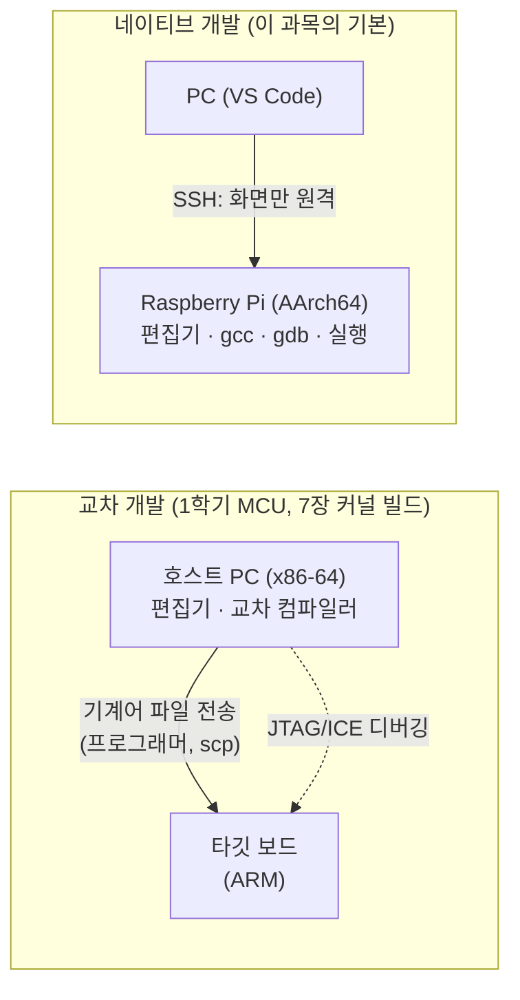
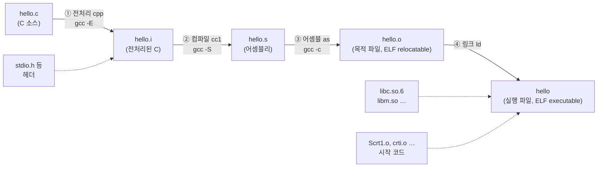
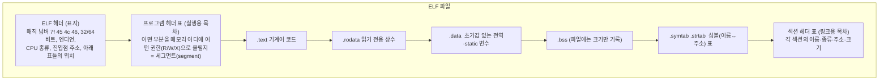
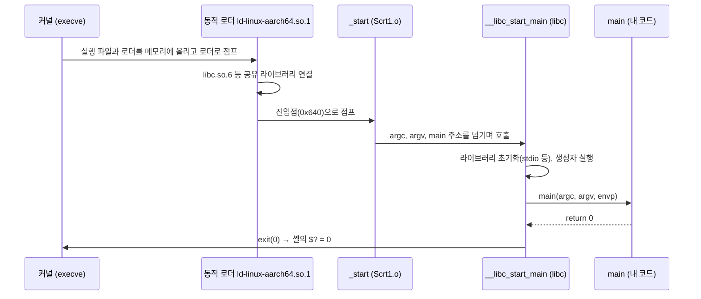
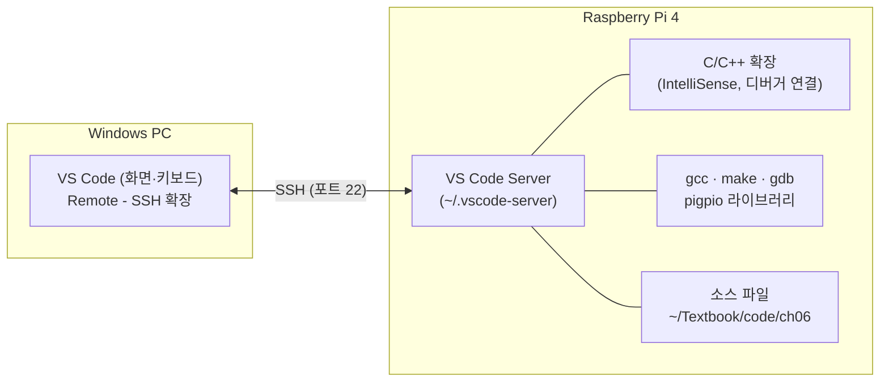

# 6장. C 개발 환경과 빌드

> **학습 목표**
> - 네이티브 개발과 교차 개발(호스트·타깃)을 구분하고, `aarch64-linux-gnu` 같은 툴체인 이름이 무엇을 뜻하는지 설명할 수 있다.
> - `gcc`가 내부에서 수행하는 전처리 → 컴파일 → 어셈블 → 링크 4단계를 `-E`, `-S`, `-c` 옵션으로 하나씩 실행하고, 각 단계의 산출물(`.i`, `.s`, `.o`, 실행 파일)을 직접 열어 볼 수 있다.
> - 헤더(선언)와 라이브러리(정의)의 차이를 이해하고, `fatal error: … No such file`, `implicit declaration`, `undefined reference`, `cannot find -l…`, `multiple definition` 오류를 보고 원인이 어느 단계에 있는지 바로 판단할 수 있다.
> - 정적 라이브러리(`.a`)와 공유 라이브러리(`.so`)를 직접 만들어 링크하고, `ldd`, `LD_LIBRARY_PATH`, rpath, `ldconfig`로 실행 시 라이브러리를 찾는 과정을 설명할 수 있다.
> - ELF 파일의 구조와 `.text`/`.rodata`/`.data`/`.bss` 섹션의 정확한 정의를 알고, `size`, `nm`, `objdump`, `readelf`, `strip`으로 실행 파일을 분석할 수 있다.
> - 링커와 시작 코드(`_start` → `main`), 링커 스크립트의 VMA/LMA 개념을 설명할 수 있다.
> - 최적화 옵션이 코드를 어떻게 바꾸는지 보고, 하드웨어 레지스터와 인터럽트 플래그에 `volatile`이 필요한 이유를 설명할 수 있다.
> - 규칙·변수·자동 변수·패턴 규칙·헤더 의존성 추적을 갖춘 Makefile을 작성할 수 있다.
> - `gdb`로 중단점·한 줄 실행·변수 감시를 하며 논리 오류를 찾을 수 있다.
> - PC의 VS Code에서 Remote-SSH로 Raspberry Pi에 접속해 편집·빌드·디버깅하고, Git으로 코드 이력을 관리할 수 있다.

[4장](04_linux_shell.md)에서 셸과 명령어를, [5장](05_sysadmin.md)에서 패키지와 서비스 관리를 익혔다. 이제 그 Linux 위에서 **C 프로그램을 만드는 과정 전체**를 본다. 지금까지는 `gcc hello.c -o hello`라는 명령 한 줄을 "마법 주문"처럼 썼다. 이 장에서는 그 한 줄 뒤에서 무슨 일이 일어나는지, 오류가 났을 때 어디를 보아야 하는지, 파일이 수십 개로 늘어나면 어떻게 관리하는지를 차례로 다룬다.

강의에서 교수는 이렇게 말했다. "개발 환경 전체를 그린 그림이 머릿속에 있으면, 그 중간중간은 찾아보면 된다. 그 그림이 없으면 무엇을 찾아봐야 할지조차 모른다." 이 장의 목표가 바로 그 **큰 그림**이다. [2장](02_computer_arch_arm.md)의 실습 2-3에서 이미 `gcc -S`와 `objdump -d`로 C 함수가 ARM 명령어로 바뀌는 모습을 보았다. 이 장에서는 그 앞뒤, 즉 C 파일이 어셈블리가 되기 전(전처리)과 기계어가 된 뒤(링크, 실행 파일 형식, 시작 코드)를 채운다. [8장](08_gpio_pigpio.md)의 GPIO 예제는 이미 Makefile로 빌드했다. 그 Makefile의 문법도 여기서 설명한다. 실행 중인 프로그램이 메모리 안에서 코드·데이터·힙·스택으로 어떻게 나뉘는지는 [11장](11_process_concurrency.md)에서 자세히 다룬다. 이 장은 그 직전 단계, 즉 **파일 안에서** 섹션이 어떻게 배치되는지까지 다룬다.

> **이 장의 실행 결과에 대하여.** 본문의 출력은 집필 환경에서 실제로 실행해 얻은 것이다. 출력 블록 바로 위의 `> 출력 출처:` 줄이 어디서 얻은 결과인지 알려 준다(표기 규칙은 [머리말](00_preface.md)의 「이 책의 표기 규칙」). 이 장에서 쓰는 출처는 다음과 같다.
> - **aarch64 교차 빌드 결과**: Raspberry Pi OS(Bookworm)의 기본 컴파일러와 같은 버전인 `aarch64-linux-gnu-gcc 12.2.0`(Debian 12.2.0-14) 교차 컴파일러와 binutils 2.40으로 만든 AArch64 파일을 교차 binutils(`readelf`, `objdump`, `nm`, `size`)로 분석한 결과이다. 프로그램을 실행해야 하는 몇 곳은 `qemu-aarch64-static`(사용자 모드 에뮬레이터)으로 실행했고, 그 블록에는 "aarch64 교차 빌드 + qemu 실행 결과"라고 적었다. Pi에서 `gcc`로 만든 결과와 명령어·섹션 구성이 같아야 한다. 다만 C 라이브러리 빌드가 조금 달라 **절대 크기는 수 바이트 정도 다를 수 있으므로**, 크기는 "변화량"에 주목한다.
> - **WSL Debian 12 실행 결과**: Windows의 WSL(Debian 12, x86-64, gcc 12.2.0, binutils 2.40, GNU make 4.3, gdb 13.1)에서 실행한 결과이다. 오류 메시지의 문구는 Pi와 같다. 주소·경로(`x86_64-linux-gnu`)·기계어는 다르다.
> - **Pi 4 실기기 실행 결과**: Raspberry Pi 4(Bookworm, gcc 12.2.0, gdb 13.1)에서 직접 실행한 결과이다. 사용자 이름은 `pi`로 바꾸어 적었다.
> - **예시(Pi 4 실기기에서 확인 필요)**: Pi에서만 확인할 수 있는 것(pigpio 실행, `sudo` 관련 동작, VS Code 원격 화면)이다. 본문의 "(Pi에서 확인)"도 같은 뜻이다.

---

## 6.1 개발 환경: 네이티브 개발과 교차 개발

### 6.1.1 두 컴퓨터: 호스트와 타깃

1학기 마이크로컨트롤러 실습을 떠올려 보자. 코드는 PC에서 작성하고 컴파일했지만, 그 기계어가 실제로 돌아간 곳은 보드 위의 작은 칩이었다. PC에서 만든 기계어를 보드에 옮기려면 **프로그래머**(다운로드 장치)가 필요했고, 보드 안에서 무슨 일이 일어나는지 보려면 **디버거**가 필요했다. 이렇게 **코드를 만드는 컴퓨터와 코드가 실행되는 컴퓨터가 다른** 개발 방식을 **교차 개발**(cross development)이라고 한다.

| 용어 | 뜻 | 1학기 실습 예 | 이 과목 예 |
|---|---|---|---|
| **호스트**(host) | 개발 도구(편집기, 컴파일러, 링커, 디버거)가 돌아가는 컴퓨터 | Windows PC | Raspberry Pi 자신 (또는 PC) |
| **타깃**(target) | 만든 프로그램이 실제로 실행될 컴퓨터 | 마이크로컨트롤러 보드 | Raspberry Pi |
| **교차 컴파일러**(cross compiler) | 호스트와 **다른** CPU용 기계어를 만드는 컴파일러 | PC에서 돌며 MCU용 기계어 생성 | PC(x86-64)에서 돌며 AArch64 기계어 생성 |
| **네이티브 컴파일러**(native compiler) | 자기 자신과 **같은** CPU용 기계어를 만드는 컴파일러 | — | Pi에서 돌며 Pi용 기계어 생성 |

비유로 정리하면, 교차 개발은 **본사 주방에서 만든 소스를 지점으로 배송**하는 것이고, 네이티브 개발은 **지점 주방에서 직접 요리**하는 것이다. 지점 주방이 충분히 크면(운영체제와 메모리가 넉넉하면) 직접 요리하는 편이 훨씬 간단하다. 배송 과정도, 지점 주방에 맞는 조리법으로 다시 맞추는 과정도 필요 없다.



강의 슬라이드는 교차 개발 환경의 구성 요소를 다음과 같이 정리한다.

| 구성 요소 | 하는 일 |
|---|---|
| 교차 컴파일러 | 개발한 소스를 다른 기계의 기계어로 번역한다. 예: x86 호스트에서 ARM용 기계어 생성 |
| IDE(Integrated Development Environment, 통합 개발 환경) | 편집기·컴파일러·디버거를 하나로 묶은 도구 |
| ICE(In-Circuit Emulator) | 호스트의 디버거와 함께 타깃의 레지스터·메모리를 읽고 바꾸며, 중단점(break point)·감시점(watch point)을 걸고 한 단계씩 실행하게 해 주는 장비. 호스트와는 USB·이더넷, 타깃과는 **JTAG**로 연결한다 |
| 연결 수단 | 시리얼 케이블(콘솔), 이더넷·USB(파일 전송), JTAG(디버깅) |

슬라이드에 소개된 ARM용 컴파일러는 GCC(오픈소스), Clang/LLVM(오픈소스), Keil의 Arm Compiler와 IAR Embedded Workbench(상용)이다. 이 과목은 Raspberry Pi OS에 기본으로 들어 있는 **GCC**를 쓴다.

> 📌 **보강: 슬라이드 표현 바로잡기.** 슬라이드에는 "Clang은 GCC보다 빠른 성능을 제공한다"고 되어 있다. 두 컴파일러의 컴파일 속도와 생성 코드 성능은 프로그램과 옵션에 따라 앞서거니 뒤서거니 하므로 한쪽이 항상 빠르다고 말할 수 없다. 또 GCC를 만든 사람은 리처드 스톨먼(Richard Stallman)과 GNU 프로젝트이고, Linux 커널을 만든 사람은 리누스 토르발스(Linus Torvalds)이다. 강의 녹취에서 "이 사람이 리눅스도 만들고 GCC도 만들었다"고 한 부분은 두 사람을 혼동한 것이다. 출처: [GCC 공식 사이트](https://gcc.gnu.org/), [GNU 프로젝트 소개](https://www.gnu.org/gnu/thegnuproject.html)

### 6.1.2 툴체인과 툴체인 이름

컴파일러 하나로는 실행 파일을 만들 수 없다. 전처리기, 컴파일러, 어셈블러, 링커, 그리고 C 표준 라이브러리가 모두 있어야 한다. 이 도구 묶음을 **툴체인**(toolchain)이라고 한다. 사슬(chain)처럼 앞 도구의 결과가 뒤 도구의 입력이 되기 때문이다.

교차 툴체인은 이름 앞에 **타깃을 나타내는 꼬리표**가 붙는다. 이것을 흔히 **트리플릿**(triplet, 세 부분으로 된 이름)이라고 부른다.

| 트리플릿 | 뜻 | 쓰는 곳 |
|---|---|---|
| `aarch64-linux-gnu` | 64비트 ARM(AArch64), Linux, GNU C 라이브러리(glibc) | **Raspberry Pi OS 64비트** (Pi 3/4/5) |
| `arm-linux-gnueabihf` | 32비트 ARM, Linux, glibc, 하드웨어 부동소수점(hard-float) ABI | Raspberry Pi OS 32비트 |
| `arm-none-eabi` | 32비트 ARM, **OS 없음**(none), 임베디드 ABI | Cortex-M 마이크로컨트롤러(STM32 등) 펌웨어 |
| `x86_64-linux-gnu` | 64비트 x86, Linux, glibc | 일반 PC Linux, WSL |

교차 툴체인의 명령은 `aarch64-linux-gnu-gcc`, `aarch64-linux-gnu-objdump`처럼 트리플릿이 앞에 붙는다. Pi 위의 `gcc`는 접두어가 없지만, 내부적으로는 `aarch64-linux-gnu`용 네이티브 컴파일러이다. `gcc -dumpmachine`으로 확인할 수 있다.

**따라 해 보기** — 지금 쓰는 컴파일러가 어떤 타깃용인지 확인한다.

```bash
gcc --version | head -1
gcc -dumpmachine
```

마지막 줄은 교차 컴파일러를 설치한 PC에서 실행한 것이다.

> 출력 출처: WSL Debian 12 실행 결과(PC의 gcc와 교차 컴파일러)

```text
$ gcc --version | head -1
gcc (Debian 12.2.0-14) 12.2.0
$ gcc -dumpmachine
x86_64-linux-gnu
$ aarch64-linux-gnu-gcc -dumpmachine
aarch64-linux-gnu
```

Pi에서 `gcc -dumpmachine`을 실행하면 `aarch64-linux-gnu`가 나온다(Pi 4 실기기의 `gcc (Debian 12.2.0-14+deb12u1) 12.2.0`에서 확인했다). PC의 `gcc`는 `x86_64-linux-gnu`용이므로, PC에서 컴파일한 프로그램을 Pi에 복사해도 실행되지 않는다. 강의에서 "Windows PC에서 GitHub의 소스를 받아 그냥 컴파일하면 PC의 CPU용으로 컴파일되어 Pi에서는 돌지 않는다"고 한 것이 이 뜻이다.

### 6.1.3 이 과목은 왜 Pi에서 직접 컴파일하는가

1학기에는 마이크로컨트롤러에 운영체제도, 컴파일러를 돌릴 메모리도 없었으므로 교차 개발이 유일한 방법이었다. Raspberry Pi는 사정이 다르다.

| 비교 | Pi에서 네이티브 컴파일 | PC에서 교차 컴파일 |
|---|---|---|
| 준비 | `gcc`가 이미 설치되어 있다 | 교차 툴체인 설치, Pi와 같은 버전의 라이브러리(sysroot) 준비 |
| 라이브러리(pigpio 등) | `apt install`만 하면 헤더와 `.so`가 생긴다 | Pi용(AArch64) 라이브러리를 PC에 따로 마련해야 한다 |
| 실행·디버깅 | 바로 `./a.out`, `gdb` | 파일을 Pi로 복사(`scp`)한 뒤 실행, 원격 디버깅 설정 |
| 컴파일 속도 | 작은 프로그램은 충분히 빠르다. 큰 프로젝트는 느리다 | 빠르다 |
| 잘 맞는 일 | 수업 예제, GPIO 프로그램 | **리눅스 커널**처럼 거대한 소스, OS가 없는 보드의 펌웨어 |

그래서 이 과목의 기본 흐름은 <strong>"편집은 PC에서, 빌드와 실행은 Pi에서"</strong>이다. 편집은 PC의 VS Code에서 하되 Remote-SSH로 Pi의 파일을 직접 열고, 컴파일과 실행은 Pi에서 한다(6.11절). 강의에서도 "크로스 환경에서는 컴파일만 하고 펌웨어를 다시 올리지 않아서 '왜 안 되지?' 하는 일이 많았는데, 네이티브에서는 저장하고 다시 컴파일해서 실행하면 그만"이라고 그 편리함을 강조했다.

교차 컴파일이 꼭 필요한 경우도 있다. 리눅스 커널은 소스가 수천만 줄이어서 Pi에서 빌드하면 몇 시간이 걸린다. 그래서 [7장](07_boot_kernel.md)에서는 PC(WSL)에 `aarch64-linux-gnu-` 교차 툴체인을 설치해 커널을 빌드하고, 결과물을 `scp`로 Pi에 옮긴다. 강의에서는 이것을 "OS가 아예 없는 보드를 처음 살린다고 생각해 보라"는 상황으로 설명했다.

### 6.1.4 디버깅 방법도 달라진다

| 환경 | 디버깅 방법 |
|---|---|
| OS 없는 MCU | JTAG/SWD로 ICE(디버그 프로브)를 연결해 CPU를 직접 멈추고 레지스터·메모리를 읽는다 |
| Linux가 도는 Pi | OS가 제공하는 디버깅 기능(`ptrace` 시스템 호출)을 쓰는 **gdb**로 프로세스를 멈추고 들여다본다. 별도 장비가 필요 없다 |

Pi의 SoC에도 JTAG 핀이 있어 커널이나 부트로더를 디버깅할 수 있지만, 사용자 프로그램은 gdb로 충분하다. gdb 사용법은 6.10절과 실습 6-6에서 다룬다.

---

## 6.2 C 프로그램의 일생: gcc의 4단계

### 6.2.1 요리에 비유한 빌드 과정

`gcc hello.c -o hello`는 한 번에 끝나는 것처럼 보이지만, 실제로는 네 단계를 차례로 거친다. 요리에 빗대어 보자.

| 요리 | 빌드 단계 | 도구 | 입력 → 출력 | 하는 일 |
|---|---|---|---|---|
| ① 레시피 정리 | **전처리**(preprocessing) | `cpp`(C PreProcessor) | `hello.c` → `hello.i` | `#include`로 다른 파일 내용을 끼워 넣고, `#define` 매크로를 치환하고, 주석을 지운다. 결과는 여전히 C 코드이다 |
| ② 재료 손질 | **컴파일**(compile) | `cc1` | `hello.i` → `hello.s` | C 문법을 검사하고 CPU의 **어셈블리어**로 번역한다. 최적화도 여기서 한다 |
| ③ 조리 | **어셈블**(assemble) | `as` | `hello.s` → `hello.o` | 어셈블리를 **기계어**로 바꾼다. 아직 다른 파일의 함수 주소는 비어 있다(재배치 가능 목적 파일) |
| ④ 플레이팅 | **링크**(link) | `ld`(`collect2`를 거쳐 호출) | `hello.o` + 라이브러리 + 시작 코드 → `hello` | 여러 목적 파일과 라이브러리를 합치고, 빈 주소를 채우고, 실행 파일 형식(ELF)으로 완성한다 |



강의에서는 "기계어 파일을 **최종적으로** 만드는 일은 컴파일러가 아니라 링크가 한다"는 점과 "`cpp`는 C++가 아니라 **C PreProcessor**"라는 점을 강조했다. 또 강의 자료(개발환경 구축 문서)에는 "컴파일만으로는 타깃에서 프로그램이 실행되지 않는다. 반드시 링크를 거쳐 실제 메모리 번지가 정해져야 한다"고 적혀 있다.

### 6.2.2 gcc는 지휘자이다

`gcc`라는 프로그램은 사실 **드라이버**(driver), 즉 지휘자이다. 직접 번역하지 않고, 단계마다 알맞은 도구를 순서대로 불러 준다. `-v` 옵션을 주면 `gcc`가 실제로 무엇을 불렀는지 볼 수 있다.

**따라 해 보기**

```bash
gcc -v -o hello_x hello.c        # 출력 파일 이름은 아무거나
```

출력이 매우 길다. 아래는 그중 도구를 부르는 세 줄만 골라낸 것이다(`-plugin` 관련 인자는 지웠다).

> 출력 출처: WSL Debian 12 실행 결과

```text
 /usr/lib/gcc/x86_64-linux-gnu/12/cc1 -quiet -v -imultiarch x86_64-linux-gnu hello.c -quiet -dumpdir hello_x- -dumpbase hello.c -dumpbase-ext .c -mtune=generic -march=x86-64 -version -fasynchronous-unwind-tables -o /tmp/ccnRV4Kw.s
 as -v --64 -o /tmp/ccHYE2E5.o /tmp/ccnRV4Kw.s
 /usr/lib/gcc/x86_64-linux-gnu/12/collect2 --build-id --eh-frame-hdr -m elf_x86_64 --hash-style=gnu --as-needed -dynamic-linker /lib64/ld-linux-x86-64.so.2 -pie -o hello_x /usr/lib/gcc/x86_64-linux-gnu/12/../../../x86_64-linux-gnu/Scrt1.o /usr/lib/gcc/x86_64-linux-gnu/12/../../../x86_64-linux-gnu/crti.o /usr/lib/gcc/x86_64-linux-gnu/12/crtbeginS.o -L/usr/lib/gcc/x86_64-linux-gnu/12 -L/usr/lib/gcc/x86_64-linux-gnu/12/../../../x86_64-linux-gnu -L/usr/lib/gcc/x86_64-linux-gnu/12/../../../../lib -L/lib/x86_64-linux-gnu -L/lib/../lib -L/usr/lib/x86_64-linux-gnu -L/usr/lib/../lib -L/usr/lib/gcc/x86_64-linux-gnu/12/../../.. /tmp/ccHYE2E5.o -lgcc --push-state --as-needed -lgcc_s --pop-state -lc -lgcc --push-state --as-needed -lgcc_s --pop-state /usr/lib/gcc/x86_64-linux-gnu/12/crtendS.o /usr/lib/gcc/x86_64-linux-gnu/12/../../../x86_64-linux-gnu/crtn.o
```

| 줄 | 불린 도구 | 의미 |
|---|---|---|
| `…/cc1 … hello.c … -o /tmp/ccXXXX.s` | `cc1` | 전처리와 컴파일을 한 번에 하여 임시 어셈블리 파일을 만든다(gcc는 기본적으로 ①②를 합쳐서 한다) |
| `as … -o /tmp/ccYYYY.o /tmp/ccXXXX.s` | `as` | 어셈블하여 임시 목적 파일을 만든다 |
| `…/collect2 … Scrt1.o crti.o crtbeginS.o … /tmp/ccYYYY.o … -lc … crtendS.o crtn.o` | `collect2` → `ld` | 시작 코드(`Scrt1.o` 등)와 내 목적 파일, C 라이브러리(`-lc`)를 링크한다 |

여기서 몇 가지를 알 수 있다.

- 중간 파일은 `/tmp`에 임시로 만들었다가 지운다. 그래서 평소에는 `hello.i`, `hello.s`, `hello.o`가 보이지 않는다. 중간 파일을 남기려면 `-save-temps` 옵션을 쓰거나, 실습 6-1처럼 단계별로 실행한다.
- 링크 줄에 **내가 쓰지 않은 파일**(`Scrt1.o`, `crti.o`, `crtbeginS.o`, `crtendS.o`, `crtn.o`)이 들어간다. 이것이 `main()`을 부르는 **시작 코드**이다(6.7절).
- 링크 줄에 `-lc`(C 표준 라이브러리)는 자동으로 들어가지만 `-lm`(수학 라이브러리)은 없다. `sin()`을 쓰는 프로그램에 `-lm`을 직접 붙여야 하는 이유이다(6.4절).
- 링크 줄에 `--as-needed`가 있다. Debian 계열(Raspberry Pi OS 포함)의 gcc는 이 옵션을 기본으로 넘긴다. 이 때문에 **라이브러리를 소스보다 뒤에** 적어야 한다(6.3.5절).
- Pi에서 같은 명령을 실행하면 경로가 `x86_64-linux-gnu` 대신 `aarch64-linux-gnu`로 나온다.

> 📌 **보강:** 단계별 옵션의 공식 정의는 다음과 같다. `-E`는 "전처리만 하고 멈춘다", `-S`는 "컴파일까지 하고 어셈블하지 않는다", `-c`는 "컴파일·어셈블까지 하고 링크하지 않는다", `-v`는 "컴파일 단계마다 실행하는 명령을 출력한다". 출처: [GCC 매뉴얼 – Options Controlling the Kind of Output](https://gcc.gnu.org/onlinedocs/gcc/Overall-Options.html), [Developer Options(-save-temps)](https://gcc.gnu.org/onlinedocs/gcc/Developer-Options.html)

### 6.2.3 실행하고 결과 확인하기: `./`와 `$?`

빌드한 프로그램은 `./hello`처럼 **경로를 붙여** 실행한다. 셸은 `PATH` 환경 변수에 적힌 디렉터리에서만 명령을 찾고, 현재 디렉터리(`.`)는 보안 때문에 `PATH`에 넣지 않기 때문이다([4장](04_linux_shell.md)). 강의 녹취 중에 "`./`를 붙이면 셸을 하나 더 열어서 실행한다"는 설명이 있는데, 이는 정확하지 않다. `./`는 단지 "**현재 디렉터리에 있는** 이 파일"이라고 경로를 밝혀 주는 것이다.

프로그램이 끝나면 `main()`의 `return` 값(**종료 상태**, exit status)이 셸에 전달된다. 셸 변수 `$?`로 직전 명령의 종료 상태를 볼 수 있다. 관례상 **0이면 성공, 0이 아니면 실패**이다. `make`는 이 값을 보고 다음 단계로 갈지 멈출지 정한다. 컴파일 오류가 나면 `gcc`가 1을 돌려주고, `make`가 그 자리에서 멈추는 이유이다.

```bash
./hello
echo $?                        # 0 : main이 return 0 했다
gcc -Wall -o nofile nothere.c
echo $?                        # 1 : gcc가 실패했다
```

> 출력 출처: WSL Debian 12 실행 결과

```text
Hello, world!
0
cc1: fatal error: nothere.c: No such file or directory
compilation terminated.
1
```

> **주의: 두 가지 `$?`.** 셸의 `$?`(직전 명령의 종료 상태)와 Makefile 안의 `$?`(대상보다 새로운 의존 파일 목록, 6.9.5절)는 이름만 같고 **전혀 다른 것**이다.

---

## 6.3 헤더와 라이브러리: 선언과 정의

빌드 오류의 절반은 헤더와 라이브러리를 헷갈려서 생긴다. 강의에서 가장 강조한 내용도 이것이다. "**선언이 없다**고 하면 헤더 파일이 빠진 것이고, <strong>정의가 없다(undefined)</strong>고 하면 라이브러리가 빠진 것이다."

### 6.3.1 선언과 정의

| 구분 | 선언(declaration) | 정의(definition) |
|---|---|---|
| 하는 일 | "이런 이름의 함수(변수)가 **어딘가에** 있다. 모양은 이렇다"고 알린다 | 함수의 실제 코드, 변수의 실제 메모리를 **만든다** |
| 예 (함수) | `double sin(double x);` | `double sin(double x) { … 실제 계산 … }` |
| 예 (변수) | `extern int counter;` | `int counter;` 또는 `int counter = 0;` |
| 몇 번 | 여러 번 해도 된다(모양만 같으면) | 프로그램 전체에서 **딱 한 번** |
| 주로 있는 곳 | **헤더 파일**(`.h`) | **소스 파일**(`.c`) → 컴파일되어 **목적 파일·라이브러리** |
| 필요한 단계 | **컴파일** 단계: 컴파일러가 호출 모양(인자·반환형)을 검사하고 맞는 기계어를 만들려면 필요 | **링크** 단계: 링커가 호출할 실제 주소를 채우려면 필요 |

식당에 비유하면 **헤더는 메뉴판**, **라이브러리는 주방**이다. 손님(내 코드)은 메뉴판을 보고 "이런 요리가 있구나, 이렇게 주문하면 되는구나"를 안다. 메뉴판이 없으면 주문서를 쓸 수 없다(컴파일 오류). 그런데 메뉴판은 있는데 주방에 그 요리를 만들 사람이 없으면, 주문은 들어갔지만 요리가 나오지 않는다(링크 오류). 메뉴판(`math.h`)과 주방(`libm`)은 **따로 챙겨야** 한다.

함수 선언 중에서 인자의 자료형까지 적은 것을 **원형**(prototype)이라고 한다. `double sin(double x);`가 원형이다. 원형이 있으면 컴파일러가 `sin(60)`처럼 정수를 넘겨도 `double`로 바꾸어 주고, 인자 개수가 틀리면 오류를 알려 준다. 원형 없이 함수를 부르면 컴파일러는 "아마 `int`를 돌려주는 함수겠지" 하고 추측하는데(**암시적 선언**, implicit declaration), 이 추측이 틀리면 엉뚱한 값이 나온다. 그래서 요즘 컴파일러는 이를 경고하거나 아예 오류로 처리한다(6.4절).

### 6.3.2 헤더 파일과 `#include`

`#include`는 전처리기에게 "**그 파일의 내용을 이 자리에 그대로 붙여 넣으라**"고 시키는 명령이다. 실습 6-1에서 보겠지만, 19줄짜리 `hello.c`가 `#include <stdio.h>` 한 줄 때문에 전처리 후 752줄이 된다. 늘어난 부분은 대부분 `printf` 같은 함수의 선언이다.

| 형식 | 찾는 순서 | 쓰는 곳 |
|---|---|---|
| `#include <stdio.h>` | 시스템 헤더 디렉터리(`/usr/include`, `/usr/include/aarch64-linux-gnu` 등)와 `-I`로 추가한 디렉터리 | 표준 라이브러리, 설치한 라이브러리(`<pigpio.h>`) |
| `#include "mathutil.h"` | **현재 소스 파일이 있는 디렉터리**를 먼저 찾고, 없으면 `<>`와 같은 곳을 찾는다 | 내가 만든 헤더 |
| `-I경로` (대문자 i) | 지정한 디렉터리를 헤더 검색 경로에 추가한다 | 헤더가 표준 위치가 아닌 곳에 있을 때. 예: `gcc -I../include …` |

헤더 파일은 보통 다음과 같이 **include guard**로 감싼다. 여러 헤더가 같은 헤더를 포함해서 한 소스에 두 번 들어오더라도 내용은 한 번만 처리되게 하는 장치이다. 강의에서는 "면접에서 이걸 물었는데 모르면 바로 탈락"이라는 일화와 함께 소개했다.

```c
#ifndef MATHUTIL_H      /* 아직 정의되지 않았다면 */
#define MATHUTIL_H      /* 이제 정의했다고 표시하고 */
/* … 선언들 … */
#endif                  /* 두 번째로 들어오면 여기까지 통째로 건너뛴다 */
```

> 📌 **보강:** `<>`와 `""`의 검색 순서는 GCC 매뉴얼에 정의되어 있다. `""`는 현재 파일의 디렉터리 → `-iquote` 디렉터리 → `-I` 디렉터리 → 시스템 디렉터리 순이고, `<>`는 `-I` 디렉터리 → 시스템 디렉터리 순이다. 출처: [GCC 매뉴얼 – Options for Directory Search](https://gcc.gnu.org/onlinedocs/gcc/Directory-Options.html)

### 6.3.3 라이브러리와 `-l`, `-L`

**라이브러리**(library)는 여러 목적 파일(`.o`)을 한 파일로 묶어 둔 것이다. 강의 슬라이드의 표현으로는 "자주 쓰이는 루틴(함수)들을 모아 놓은 하나의 큰 블랙박스"이다. 라이브러리 파일 이름에는 규칙이 있다.

```text
lib + 이름 + .so   (공유 라이브러리, shared object)      예: libm.so, libpigpio.so
lib + 이름 + .a    (정적 라이브러리, archive)            예: libm.a, libmylib.a
```

링크할 때는 **앞의 `lib`와 확장자를 뗀 이름**만 `-l` 뒤에 붙인다.

| 옵션 | 뜻 | 예 |
|---|---|---|
| `-l이름` (소문자 L) | `lib이름.so` 또는 `lib이름.a`를 링크한다 | `-lm` → `libm.so`, `-lpigpio` → `libpigpio.so` |
| `-L경로` | 라이브러리 검색 경로에 디렉터리를 추가한다 | `-L.` (현재 디렉터리), `-L/usr/local/lib` |
| `-l:파일이름` | 이름 규칙을 쓰지 않고 그 파일을 그대로 찾는다 | `-l:libmylib.a` |

| 우리가 쓰는 라이브러리 | 헤더 | 링크 옵션 | 비고 |
|---|---|---|---|
| C 표준 라이브러리(glibc) | `stdio.h`, `stdlib.h`, `string.h`, `unistd.h` … | (자동: `-lc`) | `printf`, `malloc`, `sleep` … |
| 수학 라이브러리 | `math.h` | **`-lm`** | `sin`, `cos`, `sqrt`, `pow` … 자동으로 링크되지 않는다 |
| POSIX 스레드 | `pthread.h` | `-pthread` | [11장](11_process_concurrency.md) |
| 실시간 확장 | `time.h` | `-lrt` | `clock_gettime` 등. glibc 2.34부터는 libc에 합쳐져 사실상 빈 라이브러리지만, 이식성을 위해 pigpio 문서대로 붙인다 |
| pigpio (직접 접근) | `pigpio.h` | **`-lpigpio -lrt -pthread`** | [8장](08_gpio_pigpio.md), 실행은 `sudo` |
| pigpio (데몬 클라이언트) | `pigpiod_if2.h` | **`-lpigpiod_if2 -lrt -pthread`** | `pigpiod` 실행 필요, `sudo` 불필요 |

강의에서 한 학생이 "라이브러리를 전부 자동으로 넣어 주면 편하지 않으냐"고 물었다. 답은 "라이브러리는 너무 많다"였다. 쓰지도 않는 라이브러리를 모두 링크하면 빌드가 느려지고 이름 충돌이 생길 수 있다. 그래서 기본으로는 C 표준 라이브러리만 넣고, 나머지는 개발자가 필요한 것을 골라 넣는다.

### 6.3.4 헤더와 라이브러리는 어디서 오는가: `-dev` 패키지

`apt`로 라이브러리를 설치할 때 패키지가 둘로 나뉘는 경우가 많다.

| 패키지 | 들어 있는 것 | 필요한 때 |
|---|---|---|
| `libpigpio1` | 실행에 필요한 `libpigpio.so.1` | 이미 만든 프로그램을 **실행**할 때 |
| `libpigpio-dev` | 헤더(`/usr/include/pigpio.h`)와 링크용 `libpigpio.so` | 프로그램을 **빌드**할 때 |

`fatal error: pigpio.h: No such file or directory`나 `cannot find -lpigpio`가 나오면 `-dev` 패키지가 없는 것이다. Bookworm에서는 `sudo apt install pigpio`가 `libpigpio-dev`까지 함께 설치한다([8장](08_gpio_pigpio.md) 8.6절). 어떤 헤더가 어느 패키지에 들어 있는지는 `dpkg -S /usr/include/pigpio.h`로 확인할 수 있다. Pi 4 실기기에서는 `libpigpio-dev: /usr/include/pigpio.h`가 나왔다. 즉 `pigpio.h`는 `libpigpio-dev` 패키지가 설치한 파일이다(`apt-cache depends pigpio`로 보면 `pigpio`가 `libpigpio-dev`에 의존한다는 것도 확인할 수 있다).

### 6.3.5 링크 순서: 라이브러리는 뒤에

강의 녹취에는 "`gcc` 뒤의 인자는 순서가 어떻게 오든 gcc가 알아서 해석한다"는 말이 여러 번 나온다. **`-o`, `-Wall` 같은 옵션은 순서가 상관없지만, 라이브러리(`-l`)는 그렇지 않다.<strong> 링커는 명령줄을 </strong>왼쪽에서 오른쪽으로 한 번<strong> 훑으면서, 라이브러리를 만났을 때 </strong>그때까지 찾지 못한 이름**만 그 라이브러리에서 가져온다. 라이브러리를 소스보다 앞에 쓰면, 라이브러리를 지나갈 때는 아직 아무것도 필요하지 않으므로 그냥 지나치고, 나중에 소스에서 `sin`이 필요해졌을 때는 이미 늦다.

**따라 해 보기** (`triangle.c`는 실습 6-2의 파일)

```bash
gcc -Wall -O0 -lm -o tri_order triangle.c      # -lm을 앞에 썼다
```

> 출력 출처: WSL Debian 12 실행 결과

```text
/usr/bin/ld: /tmp/ccbGDGsy.o: in function `main':
triangle.c:(.text+0x52): undefined reference to `sin'
/usr/bin/ld: triangle.c:(.text+0x7e): undefined reference to `cos'
/usr/bin/ld: triangle.c:(.text+0xaa): undefined reference to `tan'
collect2: error: ld returned 1 exit status
```

`gcc -Wall -O0 -o triangle triangle.c -lm`처럼 `-lm`을 **뒤에** 쓰면 성공한다. 정적 라이브러리(`.a`)는 어느 리눅스에서나 이 규칙을 따르고, 공유 라이브러리(`.so`)도 6.2.2절에서 본 `--as-needed` 때문에 Debian·Raspberry Pi OS에서는 같은 규칙을 따른다. <strong>"소스 파일 먼저, 라이브러리는 맨 뒤"</strong>로 외워 두자. [8장](08_gpio_pigpio.md)의 빌드 명령 `gcc -Wall -pthread -o led_blink led_blink.c -lpigpio -lrt`도 이 순서이다.

> 📌 **보강:** GCC 매뉴얼은 "`-l` 옵션을 명령줄의 어디에 쓰는지가 중요하다. 링커는 라이브러리와 목적 파일을 지정된 순서대로 처리하므로, `foo.o -lz bar.o`는 `foo.o` 다음에 `z`를 검색하지만 `bar.o` 다음에는 검색하지 않는다"고 설명한다. 출처: [GCC 매뉴얼 – Options for Linking](https://gcc.gnu.org/onlinedocs/gcc/Link-Options.html). `--as-needed`의 동작은 [GNU ld 매뉴얼 – Command-line Options](https://sourceware.org/binutils/docs/ld/Options.html)를 참고한다. Debian gcc가 이 옵션을 기본으로 넘긴다는 것은 위 `gcc -v` 출력의 `collect2` 줄로 확인했다.

---

## 6.4 자주 만나는 빌드 오류

오류 메시지를 읽는 요령은 단 하나이다. <strong>"이 메시지를 누가 냈는가?"</strong>를 먼저 본다.

| 메시지 앞부분 | 낸 도구 | 단계 | 뜻 |
|---|---|---|---|
| `파일.c:줄:칸: error:` / `warning:` | 컴파일러(`cc1`) | 전처리·컴파일 | 소스 코드의 문법·선언 문제. **줄 번호**가 나온다 |
| `/usr/bin/ld:` … `collect2: error: ld returned 1 exit status` | 링커(`ld`) | 링크 | 정의가 없거나(라이브러리 누락) 두 번 있다. 소스 줄 번호 대신 **섹션 오프셋**(`.text+0x52`)이 나온다 |
| `error while loading shared libraries` | 동적 로더(`ld.so`) | **실행** | 빌드는 성공했지만 실행할 때 `.so`를 못 찾는다(6.5절) |

이 장의 `code/ch06/errors/` 폴더에 오류를 일부러 일으키는 예제와 Makefile을 준비했다. `make`만 치면 사용법이 나온다. 아래 결과는 모두 WSL에서 실행한 것이며, Pi에서도 문구가 같다(주소와 임시 파일 이름은 다르다).

`code/ch06/errors/Makefile`

```make
# 6.4절  자주 만나는 빌드 오류를 일부러 일으켜 본다
# 사용법: make <타깃>   예) make err-lm
# 오류를 보는 것이 목적이므로 일부 타깃은 실패(Error 1)로 끝나는 것이 정상이다.
CC     = gcc
CFLAGS = -Wall -O0
CH08   = ../../ch08
NUM    = ../numeric

.PHONY: help err-implicit err-header err-undef err-cannot-find err-lm fix-lm \
        err-multi fix-multi clean

help:
	@echo "make err-implicit     헤더 누락 → implicit declaration 경고"
	@echo "make err-header       헤더 파일 자체가 없음 → fatal error"
	@echo "make err-undef        라이브러리 누락 → undefined reference"
	@echo "make err-cannot-find  라이브러리 파일이 없음 → cannot find -lpigpio"
	@echo "make err-lm / fix-lm  -lm 누락과 수정"
	@echo "make err-multi / fix-multi  multiple definition과 수정"

err-implicit:
	$(CC) $(CFLAGS) -o no_unistd no_unistd.c

# pigpio가 설치되지 않은 PC(WSL)에서 실행하면 오류가 난다. Pi에서는 성공한다.
err-header:
	$(CC) $(CFLAGS) -c -o led_blink.o $(CH08)/led_blink.c

# 헤더는 찾았지만(-I는 Pi에서는 필요 없음) -lpigpio를 빼고 링크한다
err-undef:
	$(CC) $(CFLAGS) -o led_blink $(CH08)/led_blink.c

err-cannot-find:
	$(CC) $(CFLAGS) -o led_blink $(CH08)/led_blink.c -lpigpio -lrt -pthread

err-lm:
	$(CC) $(CFLAGS) -o triangle $(NUM)/triangle.c

fix-lm:
	$(CC) $(CFLAGS) -o triangle $(NUM)/triangle.c -lm

err-multi:
	$(CC) $(CFLAGS) -o counter counter_a.c counter_b.c

fix-multi:
	$(CC) $(CFLAGS) -DFIX -o counter counter_a.c counter_b.c

clean:
	rm -f no_unistd led_blink led_blink.o triangle counter
```

### 6.4.1 헤더 누락 ① 선언이 없다: `implicit declaration`

`code/ch06/errors/no_unistd.c`

```c
/*
 * no_unistd.c : 6.4절  헤더를 빠뜨렸을 때(선언 없음)의 경고 관찰
 *
 * sleep()을 쓰면서 #include <unistd.h>를 일부러 뺐다.
 * 빌드 : gcc -Wall -o no_unistd no_unistd.c
 *        → warning: implicit declaration of function 'sleep'
 *        gcc 12는 경고만 내고 실행 파일을 만들지만, gcc 14부터는 오류로 바뀌었다.
 * 고치기 : 아래 주석 처리된 #include 줄의 주석을 푼다.
 */
#include <stdio.h>
/* #include <unistd.h> */

int main(void)
{
    printf("1초 쉽니다...\n");
    sleep(1);
    printf("끝\n");
    return 0;
}
```

> 출력 출처: WSL Debian 12 실행 결과

```text
$ make err-implicit
gcc -Wall -O0 -o no_unistd no_unistd.c
no_unistd.c: In function ‘main’:
no_unistd.c:16:5: warning: implicit declaration of function ‘sleep’ [-Wimplicit-function-declaration]
   16 |     sleep(1);
      |     ^~~~~
```

`sleep()`의 선언이 들어 있는 `unistd.h`를 빠뜨렸다. gcc 12는 **경고**(warning)만 내고 실행 파일을 만든다. 실행하면 우연히 제대로 동작한다. 실제 `sleep`은 `unsigned int`를 받고 `unsigned int`를 돌려주는데, 컴파일러의 추측("`int`를 받아 `int`를 돌려주는 함수")과 크기·전달 방식이 같은 32비트 정수라서 결과적으로 맞아떨어졌을 뿐이다. 그러나 이 "우연"을 믿으면 안 된다. 반환형이 `double`이거나 인자가 포인터인 함수를 이렇게 부르면 값이 깨진다. 예를 들어 `math.h` 없이 `sqrt()`를 부르면 gcc는 `incompatible implicit declaration of built-in function 'sqrt'`라고 경고한다.

이 경고를 오류로 바꾸는 옵션이 `-Werror`이다. 수업 과제에서는 `-Wall`로 컴파일했을 때 경고가 **하나도 없도록** 하자.

> 출력 출처: WSL Debian 12 실행 결과

```text
$ gcc -Wall -Werror -o x no_unistd.c
no_unistd.c: In function ‘main’:
no_unistd.c:16:5: error: implicit declaration of function ‘sleep’ [-Werror=implicit-function-declaration]
   16 |     sleep(1);
      |     ^~~~~
cc1: all warnings being treated as errors
```

> 📌 **보강:** GCC 14부터는 암시적 함수 선언이 **기본적으로 오류**이다. GCC 14 이전 문서와 수업 자료에서 "경고"라고 했던 것이 앞으로의 Raspberry Pi OS(Trixie 이후, GCC 14)에서는 빌드 실패로 바뀐다. 해결책은 언제나 같다. 알맞은 헤더를 포함한다. 출처: [GCC 14 Porting Guide – Implicit function declarations](https://gcc.gnu.org/gcc-14/porting_to.html)

### 6.4.2 헤더 누락 ② 헤더 파일 자체가 없다: `fatal error: … No such file or directory`

pigpio가 설치되지 않은 PC에서 [8장](08_gpio_pigpio.md)의 `led_blink.c`를 컴파일하면 다음과 같다.

> 출력 출처: WSL Debian 12 실행 결과

```text
$ make err-header
gcc -Wall -O0 -c -o led_blink.o ../../ch08/led_blink.c
../../ch08/led_blink.c:13:10: fatal error: pigpio.h: No such file or directory
   13 | #include <pigpio.h>
      |          ^~~~~~~~~~
compilation terminated.
make: *** [Makefile:25: err-header] Error 1
```

`fatal`은 "더 진행할 수 없다"는 뜻이다. 전처리기가 `#include <pigpio.h>`를 처리하려 했는데 파일이 없으므로 그 자리에서 멈춘다. 원인은 셋 중 하나이다.

1. 라이브러리의 `-dev` 패키지가 설치되지 않았다 → `sudo apt install libpigpio-dev`(또는 `pigpio`)
2. 헤더가 표준 위치가 아닌 곳에 있다 → `-I경로` 추가
3. 파일 이름 오타 → `pigpio.h`와 `pigpiod_if2.h`, 대소문자 확인

### 6.4.3 라이브러리 누락: `undefined reference to …`

헤더는 찾았지만(여기서는 PC에 pigpio 소스의 헤더를 `-I`로 알려 주었다) `-lpigpio`를 빠뜨리면 **링커**가 다음 오류를 낸다. Pi에서 `gcc -Wall -o led_blink led_blink.c`만 실행해도 같은 오류가 난다.

> 출력 출처: WSL Debian 12 실행 결과

```text
$ gcc -Wall -O0 -I<pigpio 헤더 경로> -o led_blink ../../ch08/led_blink.c
/usr/bin/ld: /tmp/ccPYF7az.o: in function `main':
led_blink.c:(.text+0x19): undefined reference to `gpioInitialise'
/usr/bin/ld: led_blink.c:(.text+0x5e): undefined reference to `gpioSetSignalFunc'
/usr/bin/ld: led_blink.c:(.text+0x6d): undefined reference to `gpioSetMode'
/usr/bin/ld: led_blink.c:(.text+0x97): undefined reference to `gpioWrite'
/usr/bin/ld: led_blink.c:(.text+0xb0): undefined reference to `gpioDelay'
/usr/bin/ld: led_blink.c:(.text+0xbf): undefined reference to `gpioWrite'
/usr/bin/ld: led_blink.c:(.text+0xd8): undefined reference to `gpioDelay'
/usr/bin/ld: led_blink.c:(.text+0xf1): undefined reference to `gpioWrite'
/usr/bin/ld: led_blink.c:(.text+0x100): undefined reference to `gpioSetMode'
/usr/bin/ld: led_blink.c:(.text+0x105): undefined reference to `gpioTerminate'
collect2: error: ld returned 1 exit status
```

컴파일은 끝났다. 컴파일러는 `pigpio.h`의 선언을 보고 "`gpioInitialise`라는 함수가 어딘가에 있겠지" 하며 호출 코드를 만들었다. 그런데 링커가 아무리 찾아도 그 함수의 **정의**(실제 기계어)가 없다. 메시지의 `led_blink.c:(.text+0x19)`는 "목적 파일의 `.text` 섹션 0x19번째 바이트에서 이 함수를 부른다"는 뜻이다.

`-lm`을 빠뜨린 경우도 똑같은 모양이다(실습 6-2의 `triangle.c`).

> 출력 출처: WSL Debian 12 실행 결과

```text
$ make err-lm
gcc -Wall -O0 -o triangle ../numeric/triangle.c
/usr/bin/ld: /tmp/ccNHn0Jy.o: in function `main':
triangle.c:(.text+0x52): undefined reference to `sin'
/usr/bin/ld: triangle.c:(.text+0x7e): undefined reference to `cos'
/usr/bin/ld: triangle.c:(.text+0xaa): undefined reference to `tan'
collect2: error: ld returned 1 exit status
make: *** [Makefile:35: err-lm] Error 1
```

> **함정: 최적화하면 `-lm` 없이도 빌드되는 경우.** 같은 `triangle.c`를 `-O2`로 컴파일하면 `-lm` 없이도 성공한다.
>
> 출력 출처: WSL Debian 12 실행 결과
>
> ```text
> $ gcc -Wall -O2 -o tri_O2 triangle.c && ./tri_O2
> sin60 : 0.8660
> cos60 : 0.5000
> tan60 : 1.7321
> ```
>
> 이 프로그램은 `sin(60°)`처럼 **상수**만 계산한다. 그래서 최적화된 컴파일러가 컴파일 시간에 값을 미리 계산해 넣어 버리고(상수 접기, constant folding), `sin`을 부르는 코드가 아예 사라진다. 부를 일이 없으니 링크할 필요도 없다. 사용자가 입력한 각도처럼 실행 중에 정해지는 값을 넣으면 다시 `-lm`이 필요해진다. "어제는 됐는데 오늘은 안 된다"는 일이 생기는 대표적인 원인이므로, 수학 함수를 쓰면 **항상 `-lm`을 붙이는** 습관을 들인다.

### 6.4.4 라이브러리 파일이 없다: `cannot find -l…`

> 출력 출처: WSL Debian 12 실행 결과

```text
$ gcc -Wall -O0 -I<pigpio 헤더 경로> -o led_blink ../../ch08/led_blink.c -lpigpio -lrt -pthread
/usr/bin/ld: cannot find -lpigpio: No such file or directory
collect2: error: ld returned 1 exit status
```

`undefined reference`는 "라이브러리를 **안 알려 줬다**"이고, `cannot find -lpigpio`는 "알려 준 라이브러리 **파일이 없다**"이다. 링커는 `-L` 경로와 기본 경로(`/usr/lib/aarch64-linux-gnu`, `/usr/local/lib` 등)에서 `libpigpio.so`나 `libpigpio.a`를 찾는다. 조치는 다음 중 하나이다.

- `-dev` 패키지 설치: `sudo apt install libpigpio-dev`
- 직접 빌드한 라이브러리라면 `-L경로` 추가
- 이름 오타 확인: `-lpigpio`(O), `-lpigpiod`(X, 실제 이름은 `pigpiod_if2`), `-lwiringpi`(X, 대소문자를 구분하므로 `-lwiringPi`)

### 6.4.5 정의가 두 번: `multiple definition of …`

`code/ch06/errors/counter_a.c`

```c
/*
 * counter_a.c : 6.4절  multiple definition 오류 관찰 (counter_b.c와 함께 빌드)
 *
 * 두 파일이 모두 전역 변수 counter를 "정의"한다.
 * 빌드 : gcc -Wall -o counter counter_a.c counter_b.c
 *        → multiple definition of `counter'
 * 고치기 : 정의는 한 파일(counter_a.c)에만 두고, 다른 파일은 extern으로 "선언"만 한다.
 *          gcc -Wall -DFIX -o counter counter_a.c counter_b.c
 */
#include <stdio.h>

int counter;                    /* 정의(definition): 메모리를 실제로 잡는다 */

void count_up(void);            /* counter_b.c에 있는 함수의 선언 */

int main(void)
{
    count_up();
    count_up();
    printf("counter = %d\n", counter);
    return 0;
}
```

`code/ch06/errors/counter_b.c`

```c
/*
 * counter_b.c : 6.4절  multiple definition 오류 관찰 (counter_a.c와 함께 빌드)
 */
#ifdef FIX
extern int counter;             /* 선언(declaration): "다른 파일에 있다"고 알리기만 한다 */
#else
int counter;                    /* 잘못: counter_a.c와 같은 이름을 또 정의했다 */
#endif

void count_up(void)
{
    counter++;
}
```

> 출력 출처: WSL Debian 12 실행 결과

```text
$ make err-multi
gcc -Wall -O0 -o counter counter_a.c counter_b.c
/usr/bin/ld: /tmp/cchD7kxy.o:(.bss+0x0): multiple definition of `counter'; /tmp/cceASLnm.o:(.bss+0x0): first defined here
collect2: error: ld returned 1 exit status
make: *** [Makefile:41: err-multi] Error 1
```

두 파일이 모두 `int counter;`로 같은 전역 변수를 **정의**했다. 링커 입장에서는 "`counter`가 두 군데에 있는데 어느 것을 쓰라는 말인가?"가 된다. 정의는 한 파일에만 두고, 다른 파일에서는 `extern int counter;`로 **선언**만 해야 한다. 실무에서는 `extern` 선언을 헤더에 넣고 양쪽에서 그 헤더를 포함한다.

> 출력 출처: WSL Debian 12 실행 결과

```text
$ make fix-multi
gcc -Wall -O0 -DFIX -o counter counter_a.c counter_b.c
$ ./counter
counter = 2
```

> 📌 **보강: 예전에는 됐던 코드가 왜 안 되는가.** 초기값이 없는 전역 변수(`int counter;`)를 C 표준은 "잠정적 정의(tentative definition)"라고 부른다. GCC 9까지는 이런 변수를 여러 파일에 써도 링커가 조용히 하나로 합쳐 주었다(이른바 COMMON 심볼, 강의 슬라이드의 링커 스크립트에 나오는 `*(COMMON)`이 이것이다). **GCC 10부터 기본값이 `-fno-common`으로 바뀌어** 이제는 위처럼 링크 오류가 난다. 오래된 예제가 최신 컴파일러에서 이 오류를 내면, `-fcommon`으로 덮기보다 `extern`으로 고치는 것이 옳다. 출처: [GCC 10 Release Series – Changes](https://gcc.gnu.org/gcc-10/changes.html)

강의에서 다룬 `static`도 같은 맥락이다. 함수나 전역 변수 앞에 `static`을 붙이면 그 이름은 **그 파일 안에서만** 보인다(내부 링크, internal linkage). 다른 파일에서 그 함수를 부르면 `undefined reference`가 난다. 강의에서는 WiringPi의 `gpio.c`와 `readall.c`로 이것을 시연했다. 반대로 여러 파일에서 우연히 같은 이름의 도우미 함수를 만들었다면, 각각 `static`을 붙여 충돌을 피할 수 있다.

| 키워드 | 전역 변수·함수 앞 | 지역 변수 앞 |
|---|---|---|
| (없음) | 프로그램 전체에서 보인다(외부 링크) | 함수가 끝나면 사라진다(스택) |
| `static` | **이 파일 안에서만** 보인다 | 함수가 끝나도 값이 **유지**된다(`.data`/`.bss`에 놓인다) |
| `extern` | "다른 파일에 정의되어 있다"는 **선언** | (거의 쓰지 않는다) |

### 6.4.6 오류 정리표

| 메시지 | 단계 | 원인 | 조치 |
|---|---|---|---|
| `fatal error: xxx.h: No such file or directory` | 전처리 | 헤더 파일이 없다 | `-dev` 패키지 설치, `-I`, 오타 확인 |
| `warning: implicit declaration of function 'xxx'` (gcc 14부터 error) | 컴파일 | 선언(헤더)을 포함하지 않았다 | 맞는 `#include` 추가 (`man 3 함수명`의 SYNOPSIS 참고) |
| `error: 'xxx' undeclared` | 컴파일 | 매크로·상수·변수의 선언이 없다(예: `PI_OUTPUT`, `M_PI`) | 헤더 포함, `-std` 옵션 확인 |
| `undefined reference to 'xxx'` | 링크 | 정의(라이브러리·목적 파일)를 링크하지 않았다, 라이브러리 순서가 틀렸다, `static` 함수를 밖에서 불렀다 | `-l` 추가(소스 **뒤에**), 빠진 `.c` 파일 추가 |
| `cannot find -lxxx: No such file or directory` | 링크 | 라이브러리 파일이 없다 | `-dev` 패키지 설치, `-L`, 이름 확인 |
| `multiple definition of 'xxx'` | 링크 | 같은 이름을 두 파일에서 정의했다 | 정의는 한 곳, 나머지는 `extern` 선언. 헤더에 변수 **정의**를 넣지 않는다 |
| `error while loading shared libraries: libxxx.so…` | 실행 | 실행 시 `.so`를 못 찾는다 | 6.5절: `ldconfig`, `LD_LIBRARY_PATH`, rpath |

`man` 페이지는 함수에 필요한 헤더와 링크 옵션을 알려 준다. 예를 들어 `man 3 sqrt`를 열면 LIBRARY 항목에 `Math library (libm, -lm)`, SYNOPSIS 항목에 `#include <math.h>`가 적혀 있다. 또 gcc 12는 헤더를 빠뜨리면 `note: include '<math.h>' or provide a declaration of 'sqrt'`처럼 넣어야 할 헤더를 직접 알려 주기도 한다. 3은 "라이브러리 함수" 절이라는 뜻이다(`man 1 sleep`은 셸 명령, `man 3 sleep`은 C 함수). 출처: [man7.org – sqrt(3)](https://man7.org/linux/man-pages/man3/sqrt.3.html)

---
## 6.5 정적 라이브러리와 공유 라이브러리

### 6.5.1 두 가지 라이브러리

강의 녹취에서는 "리눅스의 라이브러리 확장자는 `.a`, 윈도우는 `.lib`"라고만 소개했다. 그러나 `.a`는 **정적** 라이브러리이고, 실제로 `-lm`, `-lpigpio`로 링크되는 것은 대부분 **공유** 라이브러리 `.so`이다. 둘의 차이를 책에 비유하면 이렇다.

- **정적 라이브러리**(static library, `.a`): 필요한 장(章)을 **복사해서 내 책에 제본**해 넣는다. 내 책만 들고 다니면 어디서든 읽을 수 있지만 책이 두꺼워지고, 원본에 오탈자가 고쳐져도 내 책은 그대로이다.
- **공유 라이브러리**(shared library, `.so`, shared object): 내 책에는 "**도서관 ○○번 서가의 책 몇 쪽 참조**"라고만 적는다. 책은 얇고, 도서관 책이 개정되면 나도 개정판을 보게 되지만, **도서관(시스템)에 그 책이 없으면 읽을 수 없다.**

| 비교 | 정적 라이브러리 `.a` | 공유 라이브러리 `.so` |
|---|---|---|
| 정체 | 목적 파일(`.o`)들을 `ar`로 묶은 보관함(archive) | 링커가 만든 ELF 공유 객체(실행 파일과 비슷한 형식) |
| 만드는 법 | `ar rcs libX.a a.o b.o` | `gcc -fPIC -c a.c`, `gcc -shared -o libX.so a.o` |
| 링크할 때 | 필요한 `.o`를 **실행 파일 안에 복사**한다 | 실행 파일에는 "`libX.so`가 필요하다"는 **이름만 적는다**(`NEEDED`) |
| 실행할 때 | 라이브러리 파일이 없어도 된다 | **동적 로더**(`ld.so`)가 `.so`를 찾아 메모리에 올려 연결한다 |
| 실행 파일 크기 | 크다 | 작다 |
| 메모리 | 프로그램마다 따로 들어간다 | 여러 프로그램이 한 복사본을 **공유**한다 |
| 라이브러리 버그 수정 | 다시 링크해야 반영된다 | `.so`만 바꾸면 모든 프로그램에 반영된다 |
| 예 | `libmylib.a`, `libc.a`(정적 링크용) | `libc.so.6`, `libm.so.6`, `libpigpio.so.1` |

`-fPIC`(Position Independent Code)는 **위치 독립 코드**를 만들라는 옵션이다. 공유 라이브러리는 프로그램마다 메모리의 다른 주소에 올라갈 수 있으므로, 절대 주소 대신 "지금 위치에서 몇 바이트 떨어진 곳"처럼 상대 주소로 동작하는 코드여야 한다.

### 6.5.2 실행할 때 `.so`를 찾는 순서

공유 라이브러리를 쓰는 프로그램을 실행하면, 커널은 프로그램보다 먼저 **동적 로더**(dynamic loader, `/lib/ld-linux-aarch64.so.1`)를 실행한다. 동적 로더가 필요한 `.so`를 찾아 연결한 다음 프로그램의 시작 코드로 넘어간다. 찾는 순서는 대략 다음과 같다.

| 순서 | 위치 | 설정 방법 |
|---|---|---|
| 1 | 환경 변수 **`LD_LIBRARY_PATH`** | `LD_LIBRARY_PATH=. ./프로그램` (그 명령에만 적용) |
| 2 | 실행 파일에 기록된 **RUNPATH**(rpath) | 링크할 때 `-Wl,-rpath,경로` |
| 3 | **캐시** `/etc/ld.so.cache` | `/etc/ld.so.conf.d/`에 경로를 적고 `sudo ldconfig`로 캐시를 다시 만든다 |
| 4 | 기본 디렉터리 | `/lib`, `/usr/lib` (Pi에서는 `/lib/aarch64-linux-gnu` 등이 캐시에 등록되어 있다) |

`LD_LIBRARY_PATH`가 실행 파일에 기록된 RUNPATH보다 **먼저** 검사된다는 점에 주의한다. 실습 6-3에서 RUNPATH가 있는 프로그램도 `LD_LIBRARY_PATH`로 다른 버전의 라이브러리를 쓰게 만들 수 있음을 직접 확인한다.

> 📌 **보강:** 정확한 순서는 ld.so(8) 매뉴얼에 정의되어 있다. 옛 방식인 `DT_RPATH`는 RUNPATH가 없을 때만 쓰이며 `LD_LIBRARY_PATH`보다 먼저 검사되지만, 지금의 GNU ld는 `-rpath`를 RUNPATH(`DT_RUNPATH`)로 기록한다(실습 6-3의 `readelf -d` 결과). `-Wl,옵션`은 gcc가 그 옵션을 링커에 그대로 넘기라는 뜻이다. 출처: [man7.org – ld.so(8)](https://man7.org/linux/man-pages/man8/ld.so.8.html), [ldconfig(8)](https://man7.org/linux/man-pages/man8/ldconfig.8.html), [ldd(1)](https://man7.org/linux/man-pages/man1/ldd.1.html)

`ldd 프로그램`은 그 프로그램이 실행될 때 어떤 `.so`가 어디에서 연결되는지 보여 준다. 자세한 실행 결과는 실습 6-3에서 본다.

`apt`로 설치한 라이브러리(`libpigpio.so`)는 이미 표준 위치에 있고 캐시에도 등록되어 있다. 소스에서 직접 빌드해 `/usr/local/lib`에 설치한 라이브러리는, 설치 직후 실행하면 `error while loading shared libraries`가 날 수 있다. 이때 `sudo ldconfig`를 한 번 실행해 캐시를 갱신한다. pigpio를 소스로 설치할 때 `sudo make install` 안에서 `ldconfig`를 부르는 것도 이 때문이다.

```bash
# (Pi에서, 직접 만든 라이브러리를 시스템에 설치하는 예)
sudo cp libmylib.so /usr/local/lib/
sudo cp mathutil.h /usr/local/include/
sudo ldconfig                       # 캐시 갱신
ldconfig -p | grep mylib            # 캐시에 등록되었는지 확인
gcc -Wall -o main main.c -lmylib    # 이제 -L, -I 없이 링크된다
```

> 📌 **보강:** `/usr/local/lib`는 Debian의 `/etc/ld.so.conf.d/libc.conf`에 기본 등록되어 있다(WSL Debian 12에서 확인). 위 설치 과정 자체는 Pi에서 실행해 확인하지 않았다.

---

## 6.6 ELF와 binutils: 실행 파일 들여다보기

### 6.6.1 목적 파일의 세 종류

강의 슬라이드는 목적 파일(object file)을 세 종류로 나눈다.

| 종류 | 예 | 특징 |
|---|---|---|
| **재배치 가능 목적 파일**(relocatable file) | `hello.o`, `mathutil.o` | 주소가 아직 0부터 시작하는 상대 주소이다. 다른 파일의 함수 주소는 비어 있다 |
| **실행 가능 목적 파일**(executable file) | `hello` | 링크가 끝나 바로 실행할 수 있다 |
| **공유 목적 파일**(shared object file) | `libmylib.so`, `libc.so.6` | 실행할 때 다른 프로그램에 연결된다 |

이 셋을 담는 파일 형식(object file format)으로 슬라이드는 **COFF**(Common Object File Format, 옛 유닉스와 Windows PE의 조상)와 **ELF**(Executable and Linkable Format)를 소개한다. Linux는 세 종류 모두 **ELF** 한 형식으로 쓴다. 1학기 마이크로컨트롤러 실습의 빌드에서 HEX 파일과 함께 생겼던 `.elf` 파일도 같은 형식이다. Linux에서는 확장자를 붙이지 않을 뿐이다.

### 6.6.2 ELF의 구조

ELF 파일은 **책**과 같은 구조이다.



| 부분 | 비유 | 누가 쓰나 |
|---|---|---|
| ELF 헤더 | 책 표지: 제목, 언어, 판형 | 모든 도구, 커널 |
| 섹션 헤더 표 | 장(章) 단위의 자세한 목차 | **링커**, `objdump`, `readelf -S` |
| 프로그램 헤더 표 | "몇 쪽부터 몇 쪽까지를 한 묶음으로 복사하라"는 인쇄 지시 | **커널과 동적 로더**(실행할 때), `readelf -l` |
| 심볼 표 | 색인: 이름 → 위치 | 링커, 디버거, `nm` |

강의 슬라이드의 "실행 가능한 오브젝트 파일의 구성: Header / Section / Symbol Table"이 이 구조를 요약한 것이다. 링커는 **섹션** 단위로 일하고, 실행할 때 커널은 섹션 여러 개를 권한이 같은 것끼리 묶은 **세그먼트** 단위로 메모리에 올린다.

[2장](02_computer_arch_arm.md) 실습 2-2에서 `od`로 본 실행 파일의 첫 바이트 `7f 45 4c 46 02 01`이 바로 ELF 헤더의 시작이다. `readelf -h`로 헤더 전체를 풀어서 볼 수 있다(실습 6-1의 `hello`).

> 출력 출처: aarch64 교차 빌드 결과(WSL에서 교차 binutils로 분석)

```text
$ readelf -h hello
ELF Header:
  Magic:   7f 45 4c 46 02 01 01 00 00 00 00 00 00 00 00 00 
  Class:                             ELF64
  Data:                              2's complement, little endian
  Version:                           1 (current)
  OS/ABI:                            UNIX - System V
  ABI Version:                       0
  Type:                              DYN (Position-Independent Executable file)
  Machine:                           AArch64
  Version:                           0x1
  Entry point address:               0x640
  Start of program headers:          64 (bytes into file)
  Start of section headers:          68576 (bytes into file)
  Flags:                             0x0
  Size of this header:               64 (bytes)
  Size of program headers:           56 (bytes)
  Number of program headers:         9
  Size of section headers:           64 (bytes)
  Number of section headers:         29
  Section header string table index: 28
```

| 항목 | 값 | 의미 |
|---|---|---|
| Magic | `7f 45 4c 46` | `\x7f` + `"ELF"`. 이 네 바이트로 ELF 파일임을 안다 |
| | `02` | 64비트(ELFCLASS64). 32비트면 `01` |
| | `01` | 리틀 엔디언([2장](02_computer_arch_arm.md) 2.18절) |
| Type | `DYN (Position-Independent Executable file)` | 위치 독립 실행 파일(PIE). Debian의 gcc는 보안(주소 무작위화, ASLR)을 위해 기본으로 PIE를 만든다. 그래서 공유 라이브러리와 같은 `DYN` 형식으로 표시된다. `.o` 파일은 `REL`이다 |
| Machine | `AArch64` | 64비트 ARM용 기계어. PC에서 만든 파일이면 `Advanced Micro Devices X86-64` |
| Entry point address | `0x640` | 프로그램이 시작할 주소. `main`이 아니라 <strong>`_start`</strong>의 주소이다(6.7절) |
| Number of section headers | `29` | 섹션이 29개 있다 |

> 📌 **보강:** ELF 형식은 System V ABI의 일부로 정의되어 있고, Linux의 구조체 정의는 elf(5) 매뉴얼에 있다. 출처: [System V ABI – ELF (refspecs.linuxfoundation.org)](https://refspecs.linuxfoundation.org/elf/gabi4+/contents.html), [man7.org – elf(5)](https://man7.org/linux/man-pages/man5/elf.5.html)

### 6.6.3 섹션: `.text`, `.rodata`, `.data`, `.bss`

| 섹션 | 무엇이 들어가나 | 예 (실습 6-4의 `sections.c`) | 파일에 내용이 있나 | 실행 중 권한 |
|---|---|---|---|---|
| `.text` | 함수의 **기계어 코드** | `main()`의 명령어 | 있다 | 읽기·실행 |
| `.rodata` | **읽기 전용 데이터**: 문자열 리터럴, `const` 전역 상수, `switch` 점프 표 | `const char msg[] = "…"`, `printf`의 형식 문자열 | 있다 | 읽기 |
| `.data` | **0이 아닌 초기값**을 가진 전역 변수와 `static` 변수 | `int g_init = 7;`, `static int s_count = 3;` | **있다**(초기값을 저장해야 하므로) | 읽기·쓰기 |
| `.bss` | **초기값이 없거나 0으로 초기화한** 전역 변수와 `static` 변수 | `int g_uninit;`, `int g_zero = 0;`, `static int s_calls;` | **없다**. 크기만 기록한다(`NOBITS`) | 읽기·쓰기 |

`.bss`는 "Block Started by Symbol"이라는 옛 어셈블러 지시어 이름에서 왔다. 핵심은 <strong>"어차피 모두 0이니 파일에 0을 잔뜩 저장하지 말고, 크기만 적어 두었다가 실행할 때 0으로 채운 메모리를 준비하자"</strong>는 아이디어이다. 그래서 초기값 없는 큰 배열을 선언해도 실행 파일은 커지지 않는다. 실습 6-4에서 4000바이트 배열을 `.data`에 넣으면 파일이 약 4 KB 커지고, `.bss`에 넣으면 파일 크기가 거의 그대로인 것을 직접 확인한다.

**지역 변수**(함수 안의 `int local = 5;`)는 어느 섹션에도 없다. 함수가 호출될 때 **스택**에 자리가 생기고 함수가 끝나면 사라진다. `malloc()`으로 받는 메모리는 **힙**에서 온다. 스택과 힙은 실행 중에만 존재하는 영역이므로 [11장](11_process_concurrency.md)에서 다룬다.

> **원본 자료 정정: `.data`와 `.bss`의 정의.**
> - 「개발환경 구축」 문서 §6.3에는 "Data는 **초기화하지 않는** global 혹은 static 변수가 할당된다"고 적혀 있다. 반대이다. `.data`는 **0이 아닌 초기값이 있는** 전역·static 변수의 영역이다.
> - 같은 문서는 BSS를 "초기화하지 않는 global 혹은 **Stack data**나 0으로 초기화되는 변수가 저장되는 메모리 블록"이라고 설명한다. 스택 데이터(지역 변수)는 `.bss`에 들어가지 않는다. `.bss`는 초기값이 없거나 0인 **전역·static** 변수만 담는다.
> - ARM 소프트웨어 설계 슬라이드는 BSS를 "런타임에 초기화되기 때문에, 프로그램 시작 시 메모리 사용량이 적다"고 설명한다. 실행 중 메모리 사용량은 줄지 않는다. `.bss` 변수도 실행할 때는 그 크기만큼 RAM을 차지한다. 줄어드는 것은 **실행 파일(또는 플래시에 굽는 이미지)의 크기**이다.
> - 같은 슬라이드의 "ARM 컴파일러의 데이터 타입" 표(`long` 32비트, 포인터 32비트)는 **32비트 ARM(AArch32)** 기준이다. Raspberry Pi OS 64비트에서는 `long`과 포인터가 64비트이다([2장](02_computer_arch_arm.md) 2.18.3절).

> 📌 **보강:** 위 정의는 C 표준의 정적 저장 기간 객체 초기화 규칙(명시적 초기값이 없으면 0으로 초기화)과 ELF의 `SHT_NOBITS` 섹션 정의에 따른 것이다. 출처: [System V ABI – Sections (Special Sections 표)](https://refspecs.linuxfoundation.org/elf/gabi4+/ch4.sheader.html)

### 6.6.4 binutils: 실행 파일을 다루는 도구들

강의 슬라이드의 도구 표를 실제 쓰임새와 함께 정리하면 다음과 같다. `gcc`, `gdb`, `make`를 뺀 나머지는 **GNU binutils**(binary utilities) 패키지에 들어 있다. Pi에는 기본으로 설치되어 있다.

| 도구 | 하는 일 | 자주 쓰는 형태 |
|---|---|---|
| `gcc` | 컴파일러 드라이버 | `gcc -Wall -o prog prog.c` |
| `as` | GNU 어셈블러: `.s` → `.o` | (보통 gcc가 대신 부른다) |
| `ld` | GNU 링커: `.o` + 라이브러리 → 실행 파일 | (보통 gcc가 대신 부른다), `ld -T script.ld` |
| `ar` | 아카이브(정적 라이브러리) 만들기·수정 | `ar rcs libX.a a.o b.o`, `ar t libX.a`(목록) |
| `ranlib` | 아카이브에 심볼 색인을 만든다 | `ar rcs`의 `s`가 같은 일을 하므로 따로 부를 일은 드물다 |
| `nm` | 심볼(함수·변수 이름) 목록 | `nm prog`, `nm -n prog`(주소순) |
| `objdump` | 목적 파일 정보·역어셈블 | `objdump -h`(섹션), `-d`(역어셈블), `-r`(재배치), `-s -j .rodata`(내용) |
| `readelf` | ELF 구조를 자세히 | `readelf -h`(헤더), `-S`(섹션), `-l`(세그먼트), `-d`(동적 정보) |
| `size` | 섹션 크기 요약(text/data/bss) | `size prog` |
| `strings` | 파일 안의 출력 가능한 문자열 | `strings prog \| grep Hello` |
| `strip` | 심볼·디버깅 정보를 지워 크기를 줄인다 | `strip prog` |
| `objcopy` | 목적 파일 형식 변환·섹션 추출 | `objcopy -O binary prog.elf prog.bin` (펌웨어 이미지) |
| `gdb` | 디버거 | 6.10절 |
| `make` | 빌드 자동화 | 6.9절 |
| `file` | (binutils는 아니지만) 파일 종류 판별 | `file prog` |

> 📌 **보강:** 출처: [GNU Binutils 문서](https://sourceware.org/binutils/docs/binutils/). `size`의 `text` 열은 `.text`만이 아니라 `.rodata` 등 읽기 전용으로 올라가는 섹션을 모두 더한 값이고, `data` 열도 `.data`에 `.got`, `.dynamic` 등 쓰기 가능한 섹션을 더한 값이다. 그래서 `size`의 숫자는 `readelf -S`로 본 `.text`, `.data` 섹션 크기보다 크다.

**따라 해 보기: 섹션 목록 보기** — 목적 파일과 실행 파일의 섹션을 비교한다(실습 6-1에서 만든 파일).

> 출력 출처: aarch64 교차 빌드 결과(WSL에서 교차 binutils로 분석)

```text
$ objdump -h hello.o

hello.o:     file format elf64-littleaarch64

Sections:
Idx Name          Size      VMA               LMA               File off  Algn
  0 .text         00000020  0000000000000000  0000000000000000  00000040  2**2
                  CONTENTS, ALLOC, LOAD, RELOC, READONLY, CODE
  1 .data         00000000  0000000000000000  0000000000000000  00000060  2**0
                  CONTENTS, ALLOC, LOAD, DATA
  2 .bss          00000000  0000000000000000  0000000000000000  00000060  2**0
                  ALLOC
  3 .rodata       0000000e  0000000000000000  0000000000000000  00000060  2**3
                  CONTENTS, ALLOC, LOAD, READONLY, DATA
  4 .comment      00000020  0000000000000000  0000000000000000  0000006e  2**0
                  CONTENTS, READONLY
  5 .note.GNU-stack 00000000  0000000000000000  0000000000000000  0000008e  2**0
                  CONTENTS, READONLY
  6 .eh_frame     00000038  0000000000000000  0000000000000000  00000090  2**3
                  CONTENTS, ALLOC, LOAD, RELOC, READONLY, DATA
```

목적 파일에는 섹션이 일곱 개뿐이고, 모든 주소(VMA)가 0이다. 아직 어디에 놓일지 정해지지 않았기 때문이다. `.text`와 `.eh_frame`의 플래그에 `RELOC`이 있다는 것은 "링커가 채울 빈칸(재배치 정보)이 있다"는 뜻이다(6.6.5절). `.data`와 `.bss`의 크기가 0인 것은 `hello.c`에 전역 변수가 없기 때문이다.

> 출력 출처: aarch64 교차 빌드 결과(WSL에서 교차 binutils로 분석)

```text
$ readelf -S -W hello
There are 29 section headers, starting at offset 0x10be0:

Section Headers:
  [Nr] Name              Type            Address          Off    Size   ES Flg Lk Inf Al
  [ 0]                   NULL            0000000000000000 000000 000000 00      0   0  0
  [ 1] .interp           PROGBITS        0000000000000238 000238 00001b 00   A  0   0  1
  [ 2] .note.gnu.build-id NOTE            0000000000000254 000254 000024 00   A  0   0  4
  [ 3] .note.ABI-tag     NOTE            0000000000000278 000278 000020 00   A  0   0  4
  [ 4] .gnu.hash         GNU_HASH        0000000000000298 000298 00001c 00   A  5   0  8
  [ 5] .dynsym           DYNSYM          00000000000002b8 0002b8 0000f0 18   A  6   3  8
  [ 6] .dynstr           STRTAB          00000000000003a8 0003a8 000092 00   A  0   0  1
  [ 7] .gnu.version      VERSYM          000000000000043a 00043a 000014 02   A  5   0  2
  [ 8] .gnu.version_r    VERNEED         0000000000000450 000450 000030 00   A  6   1  8
  [ 9] .rela.dyn         RELA            0000000000000480 000480 0000c0 18   A  5   0  8
  [10] .rela.plt         RELA            0000000000000540 000540 000078 18  AI  5  22  8
  [11] .init             PROGBITS        00000000000005b8 0005b8 000018 00  AX  0   0  4
  [12] .plt              PROGBITS        00000000000005d0 0005d0 000070 00  AX  0   0 16
  [13] .text             PROGBITS        0000000000000640 000640 000134 00  AX  0   0 64
  [14] .fini             PROGBITS        0000000000000774 000774 000014 00  AX  0   0  4
  [15] .rodata           PROGBITS        0000000000000788 000788 000016 00   A  0   0  8
  [16] .eh_frame_hdr     PROGBITS        00000000000007a0 0007a0 00003c 00   A  0   0  4
  [17] .eh_frame         PROGBITS        00000000000007e0 0007e0 0000ac 00   A  0   0  8
  [18] .init_array       INIT_ARRAY      000000000001fdc8 00fdc8 000008 08  WA  0   0  8
  [19] .fini_array       FINI_ARRAY      000000000001fdd0 00fdd0 000008 08  WA  0   0  8
  [20] .dynamic          DYNAMIC         000000000001fdd8 00fdd8 0001e0 10  WA  6   0  8
  [21] .got              PROGBITS        000000000001ffb8 00ffb8 000030 08  WA  0   0  8
  [22] .got.plt          PROGBITS        000000000001ffe8 00ffe8 000040 08  WA  0   0  8
  [23] .data             PROGBITS        0000000000020028 010028 000010 00  WA  0   0  8
  [24] .bss              NOBITS          0000000000020038 010038 000008 00  WA  0   0  1
  [25] .comment          PROGBITS        0000000000000000 010038 00001f 01  MS  0   0  1
  [26] .symtab           SYMTAB          0000000000000000 010058 000858 18     27  66  8
  [27] .strtab           STRTAB          0000000000000000 0108b0 00022d 00      0   0  1
  [28] .shstrtab         STRTAB          0000000000000000 010add 000103 00      0   0  1
Key to Flags:
  W (write), A (alloc), X (execute), M (merge), S (strings), I (info),
  L (link order), O (extra OS processing required), G (group), T (TLS),
  C (compressed), x (unknown), o (OS specific), E (exclude),
  D (mbind), p (processor specific)
```

링크가 끝난 실행 파일에는 섹션이 29개로 늘었고, 각 섹션에 실제 주소(Address)가 정해졌다. 새로 생긴 섹션 중 알아 둘 것은 다음과 같다.

| 섹션 | 뜻 |
|---|---|
| `.interp` | 이 프로그램을 실행할 **동적 로더**의 경로(`/lib/ld-linux-aarch64.so.1`). 커널은 이 섹션을 보고 로더를 먼저 실행한다 |
| `.dynsym`, `.dynstr`, `.rela.dyn`, `.rela.plt` | 실행할 때 동적 로더가 쓰는 심볼 표와 재배치 정보(`puts`처럼 공유 라이브러리에서 가져올 이름) |
| `.init`, `.fini`, `.init_array`, `.fini_array` | `main` 전후에 실행되는 초기화·정리 코드(시작 코드의 일부) |
| `.plt`, `.got`, `.got.plt` | 공유 라이브러리 함수를 부르기 위한 중계 코드(PLT)와 실제 주소를 적어 둘 표(GOT). 6.6.5절의 `puts@plt` |
| `.dynamic` | 필요한 공유 라이브러리 목록(`NEEDED: libc.so.6`) 등 동적 링크 정보. `readelf -d`로 본다 |
| `.text`, `.rodata`, `.data`, `.bss` | 6.6.3절의 네 섹션. `.bss`만 종류가 `NOBITS`이다 |
| `.comment` | 컴파일러 버전 문자열(`GCC: (Debian 12.2.0-14) 12.2.0`) |
| `.symtab`, `.strtab` | 심볼 표와 이름 문자열. `nm`과 gdb가 쓴다. **실행에는 필요 없으므로** `strip`이 지우는 대상이다. Flg 열에 `A`(alloc)가 없어 메모리에 올라가지 않는다 |
| `.shstrtab` | 섹션 이름들을 담은 문자열 표 |

**`nm`이 보여 주는 심볼 종류**

| 글자 | 뜻 | 예 |
|---|---|---|
| `T` / `t` | `.text`에 있는 함수 (대문자 = 외부에 보임, 소문자 = `static`) | `T main` |
| `R` / `r` | `.rodata`의 읽기 전용 데이터 | `R msg` |
| `D` / `d` | `.data`의 초기값 있는 변수 | `D g_init`, `d s_count` |
| `B` / `b` | `.bss`의 변수 | `B g_uninit`, `b s_calls.0` |
| `U` | 정의되지 않음(Undefined): 다른 곳(라이브러리)에서 가져와야 한다 | `U puts` |

### 6.6.5 재배치: 비어 있던 주소를 링커가 채운다

[2장](02_computer_arch_arm.md) 실습 2-3에서 `objdump -d asm_demo.o`의 `bl 0 <add>`를 보고 "링크 전이라 주소가 비어 있다"고 했다. 그 빈칸이 어떻게 채워지는지 보자. `-r` 옵션을 주면 빈칸마다 링커에게 남긴 **재배치 정보**(relocation)가 함께 나온다.

> 출력 출처: aarch64 교차 빌드 결과(WSL에서 교차 binutils로 분석)

```text
$ objdump -d -r hello.o

hello.o:     file format elf64-littleaarch64


Disassembly of section .text:

0000000000000000 <main>:
   0:	a9bf7bfd 	stp	x29, x30, [sp, #-16]!
   4:	910003fd 	mov	x29, sp
   8:	90000000 	adrp	x0, 0 <main>
			8: R_AARCH64_ADR_PREL_PG_HI21	.rodata
   c:	91000000 	add	x0, x0, #0x0
			c: R_AARCH64_ADD_ABS_LO12_NC	.rodata
  10:	94000000 	bl	0 <puts>
			10: R_AARCH64_CALL26	puts
  14:	52800000 	mov	w0, #0x0                   	// #0
  18:	a8c17bfd 	ldp	x29, x30, [sp], #16
  1c:	d65f03c0 	ret
```

| 위치 | 명령 | 재배치 정보 | 의미 |
|---|---|---|---|
| `8`, `c` | `adrp x0, 0` / `add x0, x0, #0x0` | `R_AARCH64_ADR_PREL_PG_HI21 .rodata`, `R_AARCH64_ADD_ABS_LO12_NC .rodata` | "여기에 `.rodata`(문자열 `"Hello, world!"`)의 주소를 넣어라." 주소를 상위 비트(페이지)와 하위 12비트로 나누어 두 명령에 채운다 |
| `10` | `bl 0 <puts>` (기계어 `94000000`) | `R_AARCH64_CALL26 puts` | "여기에 `puts` 함수까지의 거리(26비트)를 넣어라" |

`printf("%s\n", …)`를 썼는데 `puts`가 나온 것은, 형식 문자열이 `"%s\n"`뿐이면 gcc가 더 가벼운 `puts()`로 바꾸어 주기 때문이다(최적화하지 않아도 일어난다). `nm hello.o`를 보면 `U puts`로 "정의 없음"이 표시된다.

링크가 끝난 실행 파일에서 같은 부분을 보면 빈칸이 채워져 있다.

> 출력 출처: aarch64 교차 빌드 결과(WSL에서 교차 binutils로 분석)

```text
$ objdump -d --disassemble=main hello
0000000000000754 <main>:
 754:	a9bf7bfd 	stp	x29, x30, [sp, #-16]!
 758:	910003fd 	mov	x29, sp
 75c:	90000000 	adrp	x0, 0 <__abi_tag-0x278>
 760:	911e4000 	add	x0, x0, #0x790
 764:	97ffffb3 	bl	630 <puts@plt>
 768:	52800000 	mov	w0, #0x0                   	// #0
 76c:	a8c17bfd 	ldp	x29, x30, [sp], #16
 770:	d65f03c0 	ret

Disassembly of section .fini:
```

`bl 0`(기계어 `94000000`)이 `bl 630 <puts@plt>`(기계어 `97ffffb3`)로 바뀌었다. `puts`의 실제 코드는 `libc.so.6` 안에 있고, 그 주소는 **실행할 때** 정해진다. 그래서 링커는 실행 파일 안에 **PLT**(Procedure Linkage Table)라는 작은 중계 코드(`puts@plt`)를 만들고 그쪽으로 점프하게 한다. 실행 중에 동적 로더가 PLT가 참조하는 표(GOT)에 진짜 `puts`의 주소를 써 넣는다. 정적 라이브러리였다면 `puts`의 코드가 실행 파일 안에 복사되고 `bl`이 그 주소를 직접 가리켰을 것이다.

### 6.6.6 문자열은 어디에: `.rodata`와 `strings`, `strip`

강의에서는 `objdump -s hello`로 실행 파일을 16진수로 덤프해 `"Hello World"` 문자열이 `.rodata` 섹션에 있는 것을 보여 주었다. 섹션 하나만 볼 수도 있다.

> 출력 출처: aarch64 교차 빌드 결과(WSL에서 교차 binutils로 분석)

```text
$ objdump -s -j .rodata hello

hello:     file format elf64-littleaarch64

Contents of section .rodata:
 0788 01000200 00000000 48656c6c 6f2c2077  ........Hello, w
 0798 6f726c64 2100                        orld!.          
```

교수는 여기서 한 걸음 더 나아가 "이 16진수를 고치면 다른 문자열이 출력된다. 비밀번호를 비교한 뒤 '같으면 점프'하는 명령을 '다르면 점프'로 바꾸면 비밀번호가 틀려야 로그인되는 프로그램이 된다. 이것이 아주 기초적인 해킹 원리"라고 설명했다. 실행 파일에 들어 있는 문자열은 누구나 `strings`로 볼 수 있다는 점도 기억하자. **비밀번호나 키를 소스에 문자열로 넣으면 안 되는 이유**이다.

> 출력 출처: aarch64 교차 빌드 결과(WSL에서 교차 binutils로 분석)

```text
$ strings hello | grep -E "Hello|GCC:"
Hello, world!
GCC: (Debian 12.2.0-14) 12.2.0
```

`strip`은 실행에 필요 없는 심볼 표와 디버깅 정보를 지운다. 배포용 펌웨어 이미지를 줄일 때 쓴다. 단, 심볼이 사라지므로 gdb로 함수 이름을 볼 수 없게 된다.

> 출력 출처: aarch64 교차 빌드 결과(WSL에서 교차 binutils로 분석)

```text
$ cp hello hello_stripped && strip hello_stripped
$ ls -l hello hello_stripped && nm hello_stripped
-rwxr-xr-x 1 pi pi 70432 Oct  2 17:57 hello
-rwxr-xr-x 1 pi pi 67600 Oct  2 17:58 hello_stripped
aarch64-linux-gnu-nm: hello_stripped: no symbols
```

> **Hello World가 왜 70 KB나 되나?** 강의에서도 "간단한 Hello World인데 실행 파일이 약 70 KB"라는 질문이 나왔다. `readelf -l`로 세그먼트를 보면 답이 있다.
>
> 출력 출처: aarch64 교차 빌드 결과(WSL에서 교차 binutils로 분석)
>
> ```text
> $ readelf -l -W hello | grep -E "Type|LOAD"
>   Type           Offset   VirtAddr           PhysAddr           FileSiz  MemSiz   Flg Align
>   LOAD           0x000000 0x0000000000000000 0x0000000000000000 0x00088c 0x00088c R E 0x10000
>   LOAD           0x00fdc8 0x000000000001fdc8 0x000000000001fdc8 0x000270 0x000278 RW  0x10000
> ```
>
> 두 번째 LOAD 세그먼트(쓰기 가능한 데이터)가 파일 오프셋 `0xfdc8`(약 64 KB 지점)에서 시작한다. AArch64 Linux는 메모리 페이지를 최대 64 KB까지 쓸 수 있으므로, 링커가 코드 세그먼트와 데이터 세그먼트를 <strong>64 KB 경계(`Align 0x10000`)</strong>에 맞추어 배치하고 그 사이를 빈 공간으로 채운 것이다. 실제 내용은 `size`로 본 대로 2 KB 남짓이다. 같은 프로그램을 x86-64 PC(WSL)에서 빌드하면 정렬 단위가 4 KB라 15,952바이트(약 16 KB)가 된다.

---

## 6.7 링커와 시작 코드

### 6.7.1 링커가 하는 세 가지 일

강의 슬라이드는 링커를 "불완전한 목적 파일들을 합쳐 모든 코드와 데이터를 포함하는 새로운 목적 파일을 만드는 도구. 필요에 따라 라이브러리와 초기화(startup) 파일을 같이 링크한다"고 정의한다. 하는 일을 나누면 셋이다.

| 일 | 설명 | 비유 |
|---|---|---|
| ① **심볼 해석**(symbol resolution) | 각 목적 파일의 "정의 없음(`U`)" 이름을 다른 파일·라이브러리의 정의와 짝짓는다. 못 찾으면 `undefined reference`, 둘 이상이면 `multiple definition` | 여러 사람이 쓴 원고의 "○○ 참조"가 실제로 어느 쪽인지 찾아 연결 |
| ② **배치**(layout, 슬라이드의 "로케이트") | 모든 파일의 `.text`끼리, `.data`끼리 모아 최종 주소를 정한다 | 원고를 장별로 모아 쪽 번호를 매김 |
| ③ **재배치**(relocation) | 주소가 정해졌으니 6.6.5절의 빈칸을 채운다 | "○○쪽 참조"의 쪽 번호를 실제 번호로 기입 |

### 6.7.2 `main`보다 먼저 실행되는 코드: 시작 코드

C 프로그램이 `main()`에서 시작한다고 배우지만, CPU가 처음 실행하는 곳은 `main`이 아니다. 실행 파일의 **진입점**(entry point)은 시작 코드의 `_start`이다. `readelf -h`의 진입점 `0x640`과 `nm`이 보여 주는 `_start`의 주소가 같다.

> 출력 출처: aarch64 교차 빌드 결과(WSL에서 교차 binutils로 분석)

```text
$ nm hello | grep -E " (main|_start|puts@GLIBC_2.17)$"
0000000000000754 T main
                 U puts@GLIBC_2.17
0000000000000640 T _start
$ objdump -d --disassemble=_start hello
0000000000000640 <_start>:
 640:	d503201f 	nop
 644:	d280001d 	mov	x29, #0x0                   	// #0
 648:	d280001e 	mov	x30, #0x0                   	// #0
 64c:	aa0003e5 	mov	x5, x0
 650:	f94003e1 	ldr	x1, [sp]
 654:	910023e2 	add	x2, sp, #0x8
 658:	910003e6 	mov	x6, sp
 65c:	f00000e0 	adrp	x0, 1f000 <__FRAME_END__+0x1e778>
 660:	f947ec00 	ldr	x0, [x0, #4056]
 664:	d2800003 	mov	x3, #0x0                   	// #0
 668:	d2800004 	mov	x4, #0x0                   	// #0
 66c:	97ffffe1 	bl	5f0 <__libc_start_main@plt>
 670:	97ffffec 	bl	620 <abort@plt>
```

`_start`는 스택에서 명령줄 인자 개수(`argc`)와 인자 배열(`argv`)의 위치를 꺼내 레지스터에 담고, C 라이브러리의 `__libc_start_main`을 부른다(`bl 5f0 <__libc_start_main@plt>`). `x0`에 넣는 값이 `main`의 주소이다. `__libc_start_main`이 라이브러리 초기화를 마치고 `main(argc, argv, envp)`를 부르며, `main`이 돌려준 값으로 `exit()`를 불러 프로세스를 끝낸다. `main`의 `return 0`이 셸의 `$?`가 되는 경로가 바로 이것이다.



이 시작 코드는 `gcc -v`의 링크 줄에서 본 `Scrt1.o`(PIE용 `crt1.o`), `crti.o`, `crtbeginS.o`, `crtendS.o`, `crtn.o`에 들어 있다. **crt**는 C RunTime의 약자이다. 강의 슬라이드는 이것을 "startup 코드. 어셈블러로 구성되며 모든 프로그램에 반드시 필요. 일반적으로 `crt0.S`, `init.S`, `startup.S` 등의 이름을 많이 쓴다"고 소개하고, 하는 일을 다음과 같이 적었다.

| 슬라이드의 시작 코드 동작 | OS 없는 MCU(bare-metal) | Linux 응용 프로그램 |
|---|---|---|
| 시스템 설정(클록, 메모리 컨트롤러 등) | 시작 코드가 직접 한다 | 부트로더와 커널이 이미 했다([7장](07_boot_kernel.md)) |
| Data 초기화 (`.data` 복사, `.bss` 0 채우기) | 시작 코드가 **직접** 플래시의 초기값을 RAM에 복사하고 `.bss`를 0으로 채운다 | 커널이 실행 파일을 메모리에 **매핑**하면서 처리한다. `.bss`는 0으로 채운 새 페이지를 준다 |
| 스택 영역 할당 (SP 설정) | 시작 코드가 SP를 설정한다 | 커널이 스택을 만들고 SP를 설정한 뒤 `_start`로 넘긴다 |
| 힙 영역 할당 | 시작 코드나 라이브러리가 정한다 | `malloc`이 필요할 때 커널에 요청한다([11장](11_process_concurrency.md)) |
| `main` 호출 | 시작 코드가 부른다 | `_start` → `__libc_start_main` → `main` |

[2장](02_computer_arch_arm.md) 2.19.4절의 "리셋 핸들러가 하는 일" 표(스택 설정 → `.data` 복사·`.bss` 초기화 → `main()` 호출)가 바로 bare-metal 시작 코드의 일이다. Linux에서는 그 일을 커널과 C 라이브러리가 나누어 맡아 주므로, 우리는 `main`만 쓰면 된다.

### 6.7.3 링커 스크립트: 섹션을 메모리 어디에 둘까

링커가 섹션을 **어느 주소에** 배치할지는 **링커 스크립트**(linker script)가 정한다. 슬라이드의 표현으로는 "코드와 데이터의 메모리 배치를 정의한 파일"이다. Linux 응용 프로그램은 gcc에 내장된 기본 스크립트를 쓰므로 직접 볼 일이 없다(`ld --verbose`로 볼 수 있다). 그러나 **OS 없는 펌웨어, 부트로더, 커널**은 각자 링커 스크립트를 갖고 있다. 메모리 지도(어디가 플래시이고 어디가 RAM인지)를 링커에게 알려 줄 수 있는 것은 개발자뿐이기 때문이다.

강의 슬라이드의 예는 다음과 같다(원문 그대로).

```text
# ROM located at address 0x0
# RAM located at address 0x800000
# alignment directives have been removed for clarity

MEMORY {
     TEXT (RX) : ORIGIN = 0x0, LENGTH = 0
     DATA (RW) : ORIGIN = 0x800000, LENGTH = 0
}

SECTIONS{
.main :
{
    *(.text)
    *(.rodata)
} > TEXT
# Locate the initialized data to the ROM area at the end of .main.

.main_data : AT( ADDR(.main) + SIZEOF(.main) )
{
    *(.data)
    *(.sdata)
    *(.sbss)
} > DATA

.uninitialized_data:
{
    *(SCOMMON)
    *(.bss)
    *(COMMON)
} >> DATA
```

이 스크립트가 말하는 내용은 다음과 같다.

- 메모리는 두 영역이다. **ROM**(플래시, 전원이 꺼져도 유지, 0번지부터)과 **RAM**(0x800000번지부터).
- 코드(`.text`)와 상수(`.rodata`)는 ROM에 두고 ROM에서 바로 실행한다.
- 초기값 있는 변수(`.data`)는 **실행 중에는 RAM에 있어야** 값을 바꿀 수 있다. 그런데 RAM은 전원이 꺼지면 지워지므로 **초기값은 ROM에 보관**해야 한다. 그래서 `.main_data`는 "RAM(`> DATA`)에서 쓰되, 파일 이미지에서는 ROM의 코드 바로 뒤(`AT(ADDR(.main) + SIZEOF(.main))`)에 놓으라"고 지정한다.
- 초기값 없는 변수(`.bss`, `COMMON`)는 RAM에 자리만 잡는다.

여기서 두 가지 주소가 등장한다.

| 주소 | 뜻 | 비유 |
|---|---|---|
| **VMA**(Virtual Memory Address) | 프로그램이 **실행될 때** 그 섹션이 있어야 하는 주소 | 이삿짐을 풀어 **실제로 쓸 방**의 주소 |
| **LMA**(Load Memory Address) | 그 섹션이 이미지 안에서 **실려 있는(저장된)** 주소 | 이삿짐이 **보관된 창고**의 주소 |

대부분의 섹션은 VMA와 LMA가 같다. `.data`만은 "창고(ROM)에 보관했다가 전원을 켜면 방(RAM)으로 옮겨 놓고 쓰는" 섹션이라 둘이 다르다. 그 "옮겨 놓는" 일을 하는 것이 앞 절의 **시작 코드**이다. 슬라이드 제목의 "로케이트(Locate)"는 이렇게 코드와 데이터를 실제 메모리 위치에 배치해 최종 이미지를 만드는 일을 말한다.

> **원본 자료 정정: 슬라이드 스크립트는 그대로는 링크되지 않는다.** 이 예는 개념을 보여 주기 위한 것이라 GNU ld 문법과 다른 곳이 있다. ① GNU ld 스크립트의 주석은 `/* */`이며 `#`은 쓸 수 없다. ② `LENGTH = 0`이면 영역의 크기가 0이라 아무것도 넣을 수 없다. ③ `.uninitialized_data:`는 섹션 이름과 콜론 사이에 공백이 필요하다(`.uninitialized_data :`). ④ `>> DATA`는 GNU ld 문법이 아니다(`> DATA`). ⑤ `SCOMMON`, `.sdata`, `.sbss`는 MIPS처럼 "작은 데이터 영역"이 있는 CPU용이며 ARM GCC는 만들지 않는다. 이 장의 `code/ch06/ldscript/bare.ld`는 같은 의도를 GNU ld 문법으로 고쳐 쓴 것이다.

`code/ch06/ldscript/bare.ld`

```ld
/*
 * bare.ld : 6.7절  강의 슬라이드의 링커 스크립트 예를 GNU ld 문법에 맞게 고친 것
 *
 *   ROM(플래시) 0x00000000 부터 64 KiB : 코드와 상수, .data의 초기값
 *   RAM         0x00800000 부터 32 KiB : 실행 중에 쓰는 변수(.data, .bss)
 */
ENTRY(_start)

MEMORY
{
    ROM (rx)  : ORIGIN = 0x00000000, LENGTH = 64K
    RAM (rwx) : ORIGIN = 0x00800000, LENGTH = 32K
}

SECTIONS
{
    /* 코드와 읽기 전용 상수는 ROM에 놓고 ROM에서 실행한다 */
    .text :
    {
        *(.text*)
        *(.rodata*)
    } > ROM

    /* .data: 실행 주소(VMA)는 RAM, 저장 주소(LMA)는 ROM (> RAM AT> ROM)
     * 시작 코드가 전원을 켤 때 ROM의 초기값을 RAM으로 복사해야 한다 */
    .data :
    {
        _data_start = .;
        *(.data*)
        _data_end = .;
    } > RAM AT> ROM
    _data_load = LOADADDR(.data);

    /* .bss: RAM에 자리만 잡는다. 파일에는 내용이 없고 시작 코드가 0으로 채운다 */
    .bss (NOLOAD) :
    {
        _bss_start = .;
        *(.bss*)
        *(COMMON)
        _bss_end = .;
    } > RAM

    /* 이 데모에서 필요 없는 섹션은 버린다 */
    /DISCARD/ : { *(.comment) *(.note*) *(.eh_frame*) }
}
```

`code/ch06/ldscript/bare.c`

```c
/*
 * bare.c : 6.7절  링커 스크립트로 섹션을 원하는 주소에 배치해 보기 (실행하지 않는다)
 *
 * OS 없이(bare-metal) 돌아가는 펌웨어를 흉내 낸 코드이다. 표준 라이브러리를 쓰지 않으므로
 * -ffreestanding으로 컴파일하고, gcc 대신 ld를 직접 불러 bare.ld로 링크한다.
 *
 * 빌드 : make        → bare.elf 생성, objdump -h로 VMA/LMA 확인
 * 주의 : Linux에서 실행하는 프로그램이 아니다. 섹션 배치만 관찰한다.
 */
const char banner[] = "bare-metal demo";   /* .rodata → ROM */
int boot_count = 1;                          /* .data   → RAM에서 실행, 초기값은 ROM에 보관 */
int scratch[16];                             /* .bss    → RAM, 0으로 채워야 함 */

void _start(void)                            /* 리셋 후 처음 실행된다고 가정한 함수 */
{
    boot_count++;
    scratch[0] = banner[0];
    for (;;)
        ;                                    /* 펌웨어는 끝나지 않는다 */
}
```

`code/ch06/ldscript/Makefile`

```make
# 6.7절  링커 스크립트 실험 (OS 없는 펌웨어를 흉내 낸 배치만 관찰한다)
CC      = gcc
LD      = ld
OBJDUMP = objdump
NM      = nm
# -ffreestanding: 표준 라이브러리가 없다고 가정  -fno-pic: 절대 주소로 배치
CFLAGS  = -O1 -ffreestanding -fno-pic -fno-asynchronous-unwind-tables

.PHONY: all show clean

all: show

bare.o: bare.c
	$(CC) $(CFLAGS) -c $< -o $@

bare.elf: bare.o bare.ld
	$(LD) -T bare.ld -o $@ bare.o

show: bare.elf
	$(OBJDUMP) -h bare.elf
	$(NM) -n bare.elf

clean:
	rm -f bare.o bare.elf
```

**따라 해 보기** — `make`를 실행하면 링크한 뒤 섹션 배치를 보여 준다. Pi에서는 기본 `gcc`, `ld`, `objdump`, `nm`이 AArch64용이므로 그대로 실행하면 된다. 아래 출력에서는 교차 도구의 접두어 `aarch64-linux-gnu-`를 지웠다.

> 출력 출처: aarch64 교차 빌드 결과(WSL에서 교차 binutils로 분석)

```text
$ make
gcc -O1 -ffreestanding -fno-pic -fno-asynchronous-unwind-tables -c bare.c -o bare.o
ld -T bare.ld -o bare.elf bare.o
objdump -h bare.elf

bare.elf:     file format elf64-littleaarch64

Sections:
Idx Name          Size      VMA               LMA               File off  Algn
  0 .text         00000030  0000000000000000  0000000000000000  00010000  2**3
                  CONTENTS, ALLOC, LOAD, READONLY, CODE
  1 .data         00000004  0000000000800000  0000000000000030  00020000  2**2
                  CONTENTS, ALLOC, LOAD, DATA
  2 .bss          00000040  0000000000800008  0000000000000034  00020008  2**3
                  ALLOC
nm -n bare.elf
0000000000000000 T _start
0000000000000020 T banner
0000000000000030 A _data_load
0000000000800000 D boot_count
0000000000800000 D _data_start
0000000000800004 D _data_end
0000000000800008 B _bss_start
0000000000800008 B scratch
0000000000800048 B _bss_end
```

| 섹션 | VMA (실행 주소) | LMA (저장 주소) | 해석 |
|---|---|---|---|
| `.text` | `0x0` | `0x0` | ROM에서 실행. 크기 0x30 = 코드 + `banner` 문자열 |
| `.data` | **`0x800000`** | **`0x30`** | 실행은 RAM에서, 초기값(`boot_count = 1`)은 ROM의 `.text` 바로 뒤(0x30)에 보관 |
| `.bss` | `0x800008` | (`0x34`로 표시) | RAM에 0x40(= `int scratch[16]`, 64바이트) 자리만 잡는다. LMA가 `0x34`로 표시되지만 `NOLOAD`라 그곳에 실제로 저장되는 것은 없다. 플래그에 `CONTENTS`가 없다 = 파일에 내용 없음 |

`nm`의 `_data_load = 0x30`, `_data_start = 0x800000`, `_bss_start`/`_bss_end`는 스크립트에서 만든 심볼이다. bare-metal 시작 코드는 이 심볼을 써서 "ROM의 `_data_load`부터 `_data_end - _data_start` 바이트를 RAM의 `_data_start`로 복사하고, `_bss_start`부터 `_bss_end`까지 0으로 채운 다음 `main`을 부른다". 이 파일은 섹션 배치를 보기 위한 것이며 Linux에서 실행하는 프로그램이 아니다.

> 📌 **보강:** `MEMORY` 명령, `> 영역`(VMA 지정), `AT> 영역`(LMA 지정), `LOADADDR()`, `NOLOAD`의 정의는 GNU ld 매뉴얼을 따랐다. 매뉴얼은 VMA/LMA를 "출력 섹션이 실행될 때의 주소"와 "섹션이 적재되는 주소"로 정의하고, ROM에 둔 초기화 데이터를 RAM으로 옮기는 예를 직접 보여 준다. 출처: [GNU ld – Basic Script Concepts](https://sourceware.org/binutils/docs/ld/Basic-Script-Concepts.html), [MEMORY Command](https://sourceware.org/binutils/docs/ld/MEMORY.html), [Output Section LMA](https://sourceware.org/binutils/docs/ld/Output-Section-LMA.html)

> **Linux에서는 누가 이 일을 하나?** Linux 응용 프로그램에는 "ROM"이 없다. 커널이 ELF의 프로그램 헤더(LOAD 세그먼트)를 읽어 파일을 가상 메모리에 그대로 **매핑**하고, `.bss`처럼 파일보다 메모리가 큰 부분(`MemSiz > FileSiz`, 6.6.6절의 두 번째 LOAD 줄 `0x270` → `0x278`)은 0으로 채운 페이지를 준다. 그래서 Linux 프로그램의 시작 코드는 `.data`를 복사하지 않는다. 링커 스크립트를 직접 쓰는 경험은 [7장](07_boot_kernel.md)의 커널(`vmlinux.lds`)이나 Cortex-M 펌웨어를 만들 때 하게 된다. 슬라이드의 "메모리 리매핑"(리셋 직후 0번지의 ROM을 RAM으로 바꾸어 벡터 테이블을 고칠 수 있게 하는 기법)도 이런 bare-metal 시스템의 이야기이다.

---

## 6.8 컴파일러 옵션, 최적화, `volatile`

### 6.8.1 자주 쓰는 gcc 옵션

강의 슬라이드의 옵션 목록(`-o`, `-I`, `-c`, `-l`, `-g`, `-L`, `-O`, `-D`)에 실무에서 자주 쓰는 것을 더해 정리한다.

| 분류 | 옵션 | 뜻 |
|---|---|---|
| 출력 | `-o 파일` | 출력 파일 이름. 없으면 실행 파일은 `a.out` |
| 단계 | `-E` / `-S` / `-c` | 전처리만 / 어셈블리까지 / 목적 파일까지 |
| | `-v`, `-save-temps` | 내부 명령 보기 / 중간 파일 남기기 |
| 경로 | `-I디렉터리` | 헤더 검색 경로 추가 |
| | `-L디렉터리`, `-l이름` | 라이브러리 검색 경로 추가, 라이브러리 링크 |
| 경고 | `-Wall` | 흔한 실수에 대한 경고를 대부분 켠다(이름과 달리 "전부"는 아니다) |
| | `-Wextra` | 추가 경고(사용하지 않은 인자 등) |
| | `-Werror` | 모든 경고를 오류로 취급한다 |
| 디버깅 | `-g` | 소스 줄 번호·변수 이름 같은 디버깅 정보를 넣는다(gdb에 필요) |
| 최적화 | `-O0` | 최적화 안 함(기본값). 디버깅하기 좋다 |
| | `-O1`, `-O2`, `-O3` | 점점 강한 속도 최적화. 보통 `-O2` |
| | `-Os` | 크기 우선 최적화. 플래시가 작은 MCU에서 쓴다 |
| | `-Og` | 디버깅을 방해하지 않는 선에서만 최적화 |
| 언어 | `-std=c11`, `-std=gnu17` | C 표준 버전. gcc 12의 기본은 `gnu17`(C17 + GNU 확장) |
| 매크로 | `-D이름`, `-D이름=값` | 소스 맨 앞에 `#define 이름 값`을 넣은 효과. 실습 6-4의 `-DADD_DATA` |
| | `-U이름` | 매크로 정의 취소 |
| 의존성 | `-MMD -MP` | 헤더 의존성 파일(`.d`)을 함께 만든다(6.9.8절) |
| 코드 생성 | `-fPIC`, `-shared` | 공유 라이브러리용(6.5절) |
| 링크 | `-static` | 모든 라이브러리를 정적으로 링크 |
| | `-Wl,옵션` | 링커에 옵션 전달(`-Wl,-rpath,…`) |

> 📌 **보강:** 출처: [GCC 매뉴얼 – Option Summary](https://gcc.gnu.org/onlinedocs/gcc/Option-Summary.html), [Warning Options](https://gcc.gnu.org/onlinedocs/gcc/Warning-Options.html), [Optimize Options](https://gcc.gnu.org/onlinedocs/gcc/Optimize-Options.html), [C Dialect Options](https://gcc.gnu.org/onlinedocs/gcc/C-Dialect-Options.html). gcc 12의 기본 C 표준은 `gcc -dM -E -x c /dev/null | grep __STDC_VERSION__`이 `201710L`을 출력하는 것으로 확인했다(WSL).

**`-std=c11`과 `M_PI`.** `M_PI`(원주율)는 C 표준이 아니라 POSIX가 정한 상수이다. 기본값 `gnu17`에서는 `math.h`가 정의해 주지만, 엄격한 `-std=c11`에서는 정의하지 않는다. Codes 문서의 `triangle.c`가 `M_PI`를 직접 `#define`한 것도 이 때문일 것이다(실습 6-2에서는 `#ifndef`로 감쌌다).

> 출력 출처: WSL Debian 12 실행 결과

```text
$ cat pi_test.c
#include <stdio.h>
#include <math.h>
int main(void) { printf("%f\n", M_PI); return 0; }
$ gcc -std=c11 -Wall -o pi_test pi_test.c -lm
pi_test.c: In function ‘main’:
pi_test.c:3:33: error: ‘M_PI’ undeclared (first use in this function)
    3 | int main(void) { printf("%f\n", M_PI); return 0; }
      |                                 ^~~~
pi_test.c:3:33: note: each undeclared identifier is reported only once for each function it appears in
$ gcc -Wall -o pi_test pi_test.c -lm && ./pi_test
3.141593
```

그래서 POSIX 함수(`sleep`, `clock_gettime`)나 pigpio를 쓰는 코드는 `-std=c11` 대신 기본값(`gnu17`)으로 컴파일한다.

### 6.8.2 최적화는 코드를 어떻게 바꾸나

최적화(optimization)는 **결과가 같은 범위 안에서** 더 빠르거나 더 작은 코드로 바꾸는 것이다. 여기서 "결과가 같다"는 것은 **C 언어 규칙으로 관찰할 수 있는 결과**(출력, `volatile` 접근 등)가 같다는 뜻이다. 그 규칙 밖의 일, 예를 들어 "이 루프가 시간을 끌어 줄 것"이라는 기대는 지켜 주지 않는다.

`code/ch06/optimize/opt_demo.c`

```c
/*
 * opt_demo.c : 6.8절  최적화가 코드를 어떻게 바꾸는지, volatile이 왜 필요한지 확인
 *
 * 빌드·비교 : make run      (-O0과 -O2로 각각 빌드해 실행 시간 비교)
 *             make asm      (opt_O0.s, opt_O2.s 생성 → 어셈블리 비교)
 */
#include <stdio.h>
#include <time.h>

#define LOOPS 100000000L     /* 1억 번 */

/* (1) 아무 일도 하지 않는 "시간 끌기" 루프: -O2에서는 통째로 사라진다 */
void delay_plain(void)
{
    for (long i = 0; i < LOOPS; i++)
        ;
}

/* (2) 같은 루프지만 i가 volatile: 매번 메모리에서 읽고 쓰므로 사라지지 않는다 */
void delay_volatile(void)
{
    for (volatile long i = 0; i < LOOPS; i++)
        ;
}

/* (3) 다른 쪽(인터럽트·시그널 처리 함수, 다른 스레드)이 바꿔 줄 플래그를 기다리는 루프 */
int ready_plain;
volatile int ready_volatile;

void wait_plain(void)
{
    while (!ready_plain)        /* -O2: 한 번만 읽고 무한 루프가 될 수 있다 */
        ;
}

void wait_volatile(void)
{
    while (!ready_volatile)     /* 매번 메모리에서 다시 읽는다 */
        ;
}

static double elapsed_ms(void (*fn)(void))
{
    struct timespec t0, t1;

    clock_gettime(CLOCK_MONOTONIC, &t0);
    fn();
    clock_gettime(CLOCK_MONOTONIC, &t1);
    return (t1.tv_sec - t0.tv_sec) * 1e3 + (t1.tv_nsec - t0.tv_nsec) / 1e6;
}

int main(void)
{
    printf("delay_plain    : %8.1f ms\n", elapsed_ms(delay_plain));
    printf("delay_volatile : %8.1f ms\n", elapsed_ms(delay_volatile));

    /* 플래그를 미리 1로 해 두었으므로 두 함수 모두 바로 끝난다.
     * (wait_*의 차이는 실행이 아니라 make asm으로 어셈블리를 보고 확인한다) */
    ready_plain = 1;
    ready_volatile = 1;
    wait_plain();
    wait_volatile();
    return 0;
}
```

`code/ch06/optimize/Makefile`

```make
# 6.8절  최적화 수준(-O0, -O2)에 따른 차이 관찰
CC     = gcc
CFLAGS = -Wall
# 어셈블리를 읽기 쉽게: .cfi 지시어를 만들지 않는다(2장 실습 2-3과 같은 옵션)
ASMFLAGS = -S -fno-asynchronous-unwind-tables -fno-unwind-tables

.PHONY: all run asm clean

all: opt_O0 opt_O2

opt_O0: opt_demo.c
	$(CC) $(CFLAGS) -O0 -o $@ $<

opt_O2: opt_demo.c
	$(CC) $(CFLAGS) -O2 -o $@ $<

run: opt_O0 opt_O2
	@echo "== -O0 =="; ./opt_O0
	@echo "== -O2 =="; ./opt_O2

asm: opt_demo.c
	$(CC) $(CFLAGS) -O0 $(ASMFLAGS) -o opt_O0.s $<
	$(CC) $(CFLAGS) -O2 $(ASMFLAGS) -o opt_O2.s $<

clean:
	rm -f opt_O0 opt_O2 opt_O0.s opt_O2.s
```

**따라 해 보기**

```bash
cd ~/Textbook/code/ch06/optimize
make run
make asm && less opt_O2.s
```

시간은 컴퓨터 성능에 따라 다르다. 아래 첫 번째 출력은 Pi 4, 두 번째 출력은 PC(WSL)에서 얻은 것이다. Pi 4에서 세 번 실행하면 `-O0`의 `delay_plain`이 460~530 ms, `delay_volatile`이 455~470 ms 정도로 PC(30~40 ms)보다 10배 넘게 길게 나왔다(다른 작업이 함께 돌고 있어 실행할 때마다 수십 ms씩 달라진다). Pi에서도 결론은 같다. `-O2`에서 `delay_plain`은 0.0 ms가 되고, `delay_volatile`은 460 ms 정도로 그대로 남는다.

> 출력 출처: Pi 4 실기기 실행 결과(2026-10, 세 번 중 한 번)

```text
== -O0 ==
delay_plain    :    462.4 ms
delay_volatile :    459.8 ms
== -O2 ==
delay_plain    :      0.0 ms
delay_volatile :    458.2 ms
```

> 출력 출처: WSL Debian 12 실행 결과(시간은 PC 기준)

```text
$ make run
gcc -Wall -O0 -o opt_O0 opt_demo.c
gcc -Wall -O2 -o opt_O2 opt_demo.c
== -O0 ==
delay_plain    :     29.4 ms
delay_volatile :     39.5 ms
== -O2 ==
delay_plain    :      0.0 ms
delay_volatile :     37.3 ms
```

`-O2`에서 `delay_plain`이 0 ms가 되었다. 어셈블리를 보면 이유가 분명하다(`.cfi` 지시어는 뺐다).

`-O0`의 `delay_plain`:

> 출력 출처: aarch64 교차 빌드 결과(WSL에서 교차 gcc -S로 생성)

```asm
delay_plain:
	sub	sp, sp, #16
	str	xzr, [sp, 8]
	b	.L2
.L3:
	ldr	x0, [sp, 8]
	add	x0, x0, 1
	str	x0, [sp, 8]
.L2:
	ldr	x1, [sp, 8]
	mov	x0, 57599
	movk	x0, 0x5f5, lsl 16
	cmp	x1, x0
	ble	.L3
	nop
	nop
	add	sp, sp, 16
	ret
```

`-O2`의 `delay_plain`:

> 출력 출처: aarch64 교차 빌드 결과(WSL에서 교차 gcc -S로 생성)

```asm
delay_plain:
	ret
```

`-O0`에서는 `i`를 스택(`[sp, 8]`)에 두고 1억 번 읽고, 더하고, 쓰고, 비교한다. `-O2`에서는 함수 몸체가 **`ret` 한 줄**이다. 컴파일러가 "이 루프는 아무 결과도 남기지 않는다"고 판단해 통째로 지운 것이다. 1학기 MCU 실습에서 `for` 루프로 지연을 만들었다가 최적화를 켜니 LED가 깜빡이지 않던 경험이 있다면 바로 이 현상이다. 지연은 `sleep()`, `usleep()`, pigpio의 `gpioDelay()`처럼 **시간을 보장하는 함수**로 만든다.

`i`를 `volatile`로 선언한 `delay_volatile`은 `-O2`에서도 루프가 남는다. `volatile`이 "이 변수의 읽기·쓰기는 하나도 빼먹지 말라"고 지시했기 때문이다.

### 6.8.3 `volatile`: 하드웨어와 인터럽트가 바꾸는 값

[2장](02_computer_arch_arm.md) 2.4.5절에서 하드웨어 레지스터에 `volatile`이 필요한 이유를 보았고, [8장](08_gpio_pigpio.md)의 `led_blink.c`에서는 시그널 처리 함수와 공유하는 플래그를 `volatile sig_atomic_t running`으로 선언했다. 그 이유를 어셈블리로 확인한다. `opt_demo.c`의 `wait_plain`과 `wait_volatile`은 "다른 누군가(인터럽트 처리 함수, 시그널 처리 함수, 하드웨어)가 플래그를 1로 바꿔 줄 때까지 기다리는" 루프이다.

`-O2`의 `wait_plain` (`int ready_plain`):

> 출력 출처: aarch64 교차 빌드 결과(WSL에서 교차 gcc -S로 생성)

```asm
wait_plain:
	adrp	x0, .LANCHOR0
	ldr	w0, [x0, #:lo12:.LANCHOR0]
	cbnz	w0, .L14
.L13:
	b	.L13
	.p2align 2,,3
.L14:
	ret
```

`-O2`의 `wait_volatile` (`volatile int ready_volatile`):

> 출력 출처: aarch64 교차 빌드 결과(WSL에서 교차 gcc -S로 생성)

```asm
wait_volatile:
	adrp	x1, .LANCHOR0
	add	x1, x1, :lo12:.LANCHOR0
	.p2align 3,,7
.L16:
	ldr	w0, [x1, 4]
	cbz	w0, .L16
	ret
```

- `wait_plain`: 플래그를 **한 번만** 읽는다(`ldr w0, …`). 0이 아니면 바로 `ret`, 0이면 `.L13: b .L13`, 즉 **자기 자신으로 점프하는 영원한 루프**에 들어간다. 컴파일러 입장에서는 "이 루프 안에서 `ready_plain`을 바꾸는 코드가 없으니 값이 변할 리 없다"고 판단한 것이다. 나중에 인터럽트가 플래그를 1로 바꿔도 이 루프는 다시 읽지 않으므로 영원히 빠져나오지 못한다.
- `wait_volatile`: 루프(`.L16`) 안에서 **매번** 메모리를 다시 읽는다(`ldr w0, [x1, 4]` → `cbz`). 플래그가 바뀌면 빠져나온다.

`-O0`에서는 두 함수가 똑같이 매번 읽으므로 차이가 드러나지 않는다(`make asm` 후 `opt_O0.s`에서 확인). "디버그 빌드에서는 되는데 최적화하면 멈춘다"는 버그가 이렇게 생긴다.

**`volatile`이 필요한 곳**

| 상황 | 예 |
|---|---|
| 메모리 맵 하드웨어 레지스터 | `#define GPLEV0 (*(volatile uint32_t *)(GPIO_BASE + 0x34))` ([2장](02_computer_arch_arm.md)) |
| 인터럽트·시그널 처리 함수와 메인 루프가 함께 쓰는 플래그 | `static volatile sig_atomic_t running = 1;` ([8장](08_gpio_pigpio.md)) |
| 콜백(다른 스레드)이 바꾸는 단순 플래그 | pigpio 알림 콜백([9장](09_pigpio_advanced.md)) |
| 최적화로 사라지면 안 되는 지연 루프 | 가능하면 쓰지 말고 지연 함수를 쓴다 |

> **흔한 오해: `volatile`이면 스레드 동기화가 된다?** 아니다. `volatile`은 "읽기·쓰기를 생략하거나 합치지 말라"는 **컴파일러에 대한 지시**일 뿐이다. 두 스레드가 `count++`(읽기 → 더하기 → 쓰기)를 동시에 하면 `volatile`이어도 값이 틀린다. 여러 스레드가 공유하는 데이터는 mutex나 원자적 연산으로 보호해야 하며, 이는 [11장](11_process_concurrency.md)에서 다룬다.

> 📌 **보강:** GCC는 `volatile` 객체 접근을 "프로그램이 지정한 그대로 수행한다"고 설명한다. 출처: [GCC 매뉴얼 – When is a Volatile Object Accessed?](https://gcc.gnu.org/onlinedocs/gcc/Volatiles.html)

### 6.8.4 강의 슬라이드의 최적화 요령, 오늘의 관점으로

ARM 소프트웨어 설계 슬라이드에는 성능을 위한 코딩 요령이 있다. 배경을 알면 언제 맞고 언제 덜 중요한지 판단할 수 있다.

| 슬라이드 요령 | 이유 | 오늘의 관점 |
|---|---|---|
| 함수 인자는 가능하면 **4개 이하** | AArch32의 AAPCS는 인자를 R0~R3 네 레지스터로 넘기고, 다섯 번째부터는 스택(메모리)으로 넘긴다([2장](02_computer_arch_arm.md) 2.20절) | AArch64는 **X0~X7, 8개**까지 레지스터로 넘긴다. Pi 64비트에서는 8개 이하가 기준 |
| 함수 개수를 줄이고 작게, 인라인 함수 사용 | 함수 호출마다 레지스터 저장·복원과 분기 비용이 든다 | `-O2`가 작은 함수를 자동으로 인라인한다([2장](02_computer_arch_arm.md) 실습 2-3의 `noinline` 참고). 읽기 쉬운 코드를 먼저 쓰고, 측정한 뒤에 손댄다 |
| 루프는 **감소**(decrement) 방식으로 | `SUBS`로 빼면서 0과 비교가 함께 되어 명령이 하나 준다 | 최적화 컴파일러가 루프 방향을 스스로 바꾸는 경우가 많다. 효과는 `-S`로 확인한다 |
| 간단한 if~else는 분기 명령 비교 | 분기는 파이프라인을 비운다([2장](02_computer_arch_arm.md) 2.17절) | 컴파일러가 `CSEL` 같은 조건 선택 명령으로 분기를 없애 준다(2장 실습 2-3의 `max_of`) |

결론은 같다. **추측하지 말고 `-S`로 확인하고, 시간을 재라.**

---
## 6.9 make와 Makefile

### 6.9.1 왜 make인가

파일이 하나일 때는 `gcc` 한 줄로 충분하다. 파일이 셋만 되어도 사정이 달라진다. 매번 긴 명령을 치는 것도 귀찮지만, 더 큰 문제는 **무엇을 다시 컴파일해야 하는지** 기억하는 일이다. `util.c` 하나만 고쳤는데 전부 다시 컴파일하면 시간이 아깝고, 헤더를 고쳤는데 그 헤더를 쓰는 파일을 다시 컴파일하지 않으면 이상한 버그가 생긴다.

`make`는 이 일을 자동으로 해 주는 **빌드 자동화 도구**이다. `Makefile`이라는 파일에 "무엇을 만들려면 무엇이 필요하고, 어떻게 만드는가"를 적어 두면, `make`가 **파일의 수정 시각**을 비교해 바뀐 부분과 그 영향을 받는 부분만 다시 만든다.

강의에서는 make가 필요한 이유를 이렇게 설명했다. "Windows는 실행 파일이나 설치 파일로 배포한다. 리눅스는 돌아가는 플랫폼(CPU, 배포판)이 너무 많아서 실행 파일을 다 만들어 줄 수 없다. 그래서 개발자는 소스와 Makefile을 주고, 사용자가 자기 컴퓨터에서 `make`로 빌드한다." WiringPi의 `./build` 스크립트도 안에서 `make`를 부르고, 리눅스 커널도 `make`로 빌드한다([7장](07_boot_kernel.md)). 또 강의 자료(Codes §1.3)는 VS Code의 `tasks.json`을 "Makefile의 역할을 하는 파일"이라고 소개한다. 둘 다 "빌드 절차를 적어 둔 레시피"이기 때문이다(6.11절).

### 6.9.2 규칙: 대상, 의존 파일, 레시피

Makefile은 **규칙**(rule)의 모음이다. 규칙 하나는 다음 모양이다.

```make
대상(target): 의존 파일(prerequisites) …
<TAB>레시피(recipe) 명령 1
<TAB>레시피 명령 2
```

| 부분 | 슬라이드 용어 | 뜻 | 예 |
|---|---|---|---|
| 대상 | 목표(target) | 만들 파일(또는 작업 이름) | `hello.o` |
| 의존 파일 | 의존관계(dependency) | 대상을 만드는 데 필요한 파일 | `hello.c hello.h` |
| 레시피 | 명령(command) | 대상을 만드는 셸 명령. **반드시 탭(TAB) 문자로 시작**한다 | `gcc -c hello.c -o hello.o` |

요리 레시피 카드에 빗대면, 대상은 "완성할 요리", 의존 파일은 "재료", 레시피는 "조리 순서"이다. `make`는 다음과 같이 판단한다.

1. 대상 파일이 **없으면** 레시피를 실행한다.
2. 대상 파일이 있어도, 의존 파일 중 하나라도 대상보다 **더 최근에 수정**되었으면 레시피를 실행한다.
3. 그렇지 않으면 "이미 최신"이므로 아무것도 하지 않는다(`Nothing to be done`).
4. 의존 파일이 다른 규칙의 대상이면, 그것부터 같은 방식으로 확인한다(재귀).

`make`만 치면 **Makefile의 첫 번째 규칙**이 목표가 된다. 다른 대상을 만들려면 `make 대상`으로 지정한다.

> **TAB 주의.** 레시피 줄의 맨 앞은 반드시 **탭 문자**여야 한다. 편집기가 탭을 공백 4칸으로 바꾸어 저장하면 다음 오류가 난다. 실제 Makefile에서는 줄 번호가 나오므로 그 줄의 들여쓰기를 탭으로 바꾸면 된다(VS Code에서는 오른쪽 아래 상태 표시줄의 `Spaces: 4`를 눌러 `Indent Using Tabs`로 바꾼다. VS Code는 이름이 `Makefile`인 파일에서는 보통 자동으로 탭을 쓴다).
>
> 출력 출처: WSL Debian 12 실행 결과(GNU make 4.3)
>
> ```text
> $ make -f Makefile.spaces
> Makefile.spaces:2: *** missing separator.  Stop.
> ```
>
> 원인 확인: `cat -A Makefile`로 보면 탭은 `^I`로, 줄 끝은 `$`로 보인다. 레시피 줄이 `^I`로 시작해야 정상이다.

> 📌 **보강:** 레시피 줄의 탭 규칙은 GNU make 매뉴얼의 "Rule Syntax"와 "Recipe Syntax"에 정의되어 있다. 탭 대신 다른 문자를 쓰고 싶으면 `.RECIPEPREFIX` 변수를 바꿀 수 있지만, 수업에서는 표준대로 탭을 쓴다. 출처: [GNU make – Rule Syntax](https://www.gnu.org/software/make/manual/html_node/Rule-Syntax.html), [Recipe Syntax](https://www.gnu.org/software/make/manual/html_node/Recipe-Syntax.html)

### 6.9.3 가장 단순한 Makefile에서 출발하기

실습 6-1의 `code/ch06/hello/Makefile`은 gcc의 네 단계를 규칙 네 개로 그대로 옮긴 것이다. `hello`를 만들려면 `hello.o`가, 그것을 만들려면 `hello.s`가 … 필요하다는 **의존 관계의 사슬**이 Makefile에 그대로 드러난다.


`hello.c`를 수정하고 `make hello`를 실행하면, `make`는 화살표를 거꾸로 따라가며 `hello.c`가 `hello.i`보다 새로우니 `hello.i`부터 다시 만들고, 그 결과 `hello.s`, `hello.o`, `hello`도 차례로 다시 만든다.

### 6.9.4 변수(매크로)

같은 컴파일러 이름과 옵션을 여러 규칙에 반복해 쓰지 않도록 **변수**(variable)를 쓴다. 강의 슬라이드는 이것을 "매크로"라고 부른다.

```make
CC     = gcc
CFLAGS = -Wall -O2

hello: hello.c
	$(CC) $(CFLAGS) -o hello hello.c
```

| 문법 | 뜻 |
|---|---|
| `이름 = 값` | 변수 정의. 쓰일 때마다 다시 펼친다(재귀적 펼침) |
| `이름 := 값` | 정의하는 순간 한 번만 펼친다(단순 펼침) |
| `이름 ?= 값` | 아직 정의되지 않았을 때만 정의한다 |
| `이름 += 값` | 뒤에 덧붙인다 |
| `$(이름)` 또는 `${이름}` | 변수 값을 꺼낸다. 슬라이드에는 `$이름`도 있지만 한 글자 이름에만 통하므로 `$(이름)`을 쓴다 |
| `$(SRCS:.c=.o)` | **치환 참조**: `SRCS`의 각 단어 끝 `.c`를 `.o`로 바꾼다. 슬라이드의 "매크로 치환 `$(매크로이름:이전내용=새로운내용)`" |
| `make CFLAGS="-O0 -g"` | 명령줄에서 변수를 덮어쓴다. 실습 6-7에서 8장 예제를 디버깅용으로 다시 빌드할 때 쓴다 |

관례적으로 쓰는 변수 이름이 있다. `make`의 내장 규칙도 이 이름을 쓰므로 맞추어 두면 편하다.

| 변수 | 관례적 의미 |
|---|---|
| `CC` | C 컴파일러 (`gcc`, 교차 컴파일이면 `aarch64-linux-gnu-gcc`) |
| `CFLAGS` | C 컴파일 옵션 (`-Wall -O2 -g`) |
| `CPPFLAGS` | 전처리 옵션 (`-I…`, `-D…`, `-MMD -MP`) |
| `LDFLAGS` | 링크 옵션 (`-L…`, `-Wl,…`) |
| `LDLIBS` | 링크할 라이브러리 (`-lm -lpigpio`) — **맨 뒤**에 놓는다 |

`CC`를 변수로 빼 두면 이점이 크다. 이 장의 aarch64 교차 빌드 결과도 같은 Makefile을 `make CC=aarch64-linux-gnu-gcc`로 실행해서 얻었다. **Makefile을 한 글자도 고치지 않고 교차 컴파일**할 수 있는 것이다.

### 6.9.5 자동 변수

규칙 안에서 대상과 의존 파일 이름을 다시 쓰지 않도록 make가 자동으로 채워 주는 변수이다.

| 자동 변수 | 정확한 뜻 | `templog: main.o sensor.o util.o`에서 |
|---|---|---|
| `$@` | 규칙의 **대상** 이름 | `templog` |
| `$<` | **첫 번째** 의존 파일 이름 | `main.o` |
| `$^` | **모든** 의존 파일 이름(중복 제거, 공백으로 구분) | `main.o sensor.o util.o` |
| `$?` | 대상보다 **더 최근에 수정된** 의존 파일 **모두**(대상이 없으면 의존 파일 전부) | `util.h`만 고쳤다면 `main.o util.o` |
| `$*` | 패턴 규칙에서 `%`에 해당한 부분(줄기, stem) | `%.o: %.c`로 `util.o`를 만들 때 `util` |

> **원본 자료 정정: `$<`와 `$?`.** 「Raspberry Pi 실습」 슬라이드에는 "`$<` 현재 목표 파일보다 더 최근에 갱신된 파일명으로, 첫 번째 종속물의 이름", "`$?` `$<`과 같다"고 되어 있다. 두 설명이 섞여 있다. **`$<`는 단순히 첫 번째 의존 파일<strong>이고(수정 시각과 무관), </strong>`$?`는 대상보다 새로운 의존 파일 전부의 목록**이다. 둘은 같지 않다. 실습 6-5에서 `util.h`만 `touch`하고 `make`하면 링크 규칙의 `$?`가 `main.o util.o`(다시 만들어진 두 파일)로 출력되는 것을 확인한다. 또 슬라이드의 "`$*` 확장자가 없는 현재 목표 파일의 이름"은 접미사 규칙에서의 설명이며, 정확히는 "패턴과 일치한 줄기(stem)"이다.

> 📌 **보강:** 출처: [GNU make – Automatic Variables](https://www.gnu.org/software/make/manual/html_node/Automatic-Variables.html). 매뉴얼은 `$?`를 "The names of all the prerequisites that are newer than the target, with spaces between them. If the target does not exist, all prerequisites will be included."라고 정의한다.

### 6.9.6 패턴 규칙

`.c` 파일마다 똑같은 규칙을 쓰는 대신, **패턴 규칙**(pattern rule) 하나로 "어떤 `.o`든 같은 이름의 `.c`에서 이렇게 만든다"고 적는다. `%`는 "아무 문자열"을 뜻한다.

```make
%.o: %.c
	$(CC) $(CPPFLAGS) $(CFLAGS) -c $< -o $@
```

`util.o`가 필요하면 `%` = `util`로 맞추어 `util.c`에서 `gcc … -c util.c -o util.o`를 실행한다. 강의 슬라이드의 **확장자 규칙**(suffix rule, `.c.o:`)은 같은 일을 하는 옛 방식이다. GNU make 매뉴얼은 새 Makefile에서는 패턴 규칙을 쓰라고 권한다.

[8장](08_gpio_pigpio.md)의 Makefile에 나온 `$(DIRECT): %: %.c`는 **정적 패턴 규칙**(static pattern rule)이다. "`DIRECT` 목록에 있는 대상들(`led_blink button_led led_sweep`)만, 각자 같은 이름의 `.c`에서 만든다"는 뜻이다. 실습 6-2의 `numeric/Makefile`에도 같은 형태가 있다.

> 📌 **보강:** 출처: [GNU make – Pattern Rules](https://www.gnu.org/software/make/manual/html_node/Pattern-Rules.html), [Static Pattern Rules](https://www.gnu.org/software/make/manual/html_node/Static-Pattern.html), [Old-Fashioned Suffix Rules](https://www.gnu.org/software/make/manual/html_node/Suffix-Rules.html)

### 6.9.7 `.PHONY`와 `clean`

`clean`, `all`처럼 **파일을 만들지 않는 작업 이름**도 대상으로 쓸 수 있다. 문제는 우연히 `clean`이라는 파일이 폴더에 생기면, make가 "`clean` 파일이 이미 있고 의존 파일도 없으니 최신"이라고 판단해 레시피를 실행하지 않는다는 것이다. `.PHONY`에 적어 두면 make는 그 이름을 파일로 보지 않고 **항상** 레시피를 실행한다.

```make
.PHONY: all clean
clean:
	rm -f $(TARGET) $(OBJS) $(DEPS)
```

관례적인 대상 이름은 `all`(전부 빌드, 보통 첫 규칙), `clean`(산출물 삭제), `install`(시스템에 설치), `uninstall`이다. 강의에서는 WiringPi의 `gpio` 폴더에서 `make clean` → `make` → `make install` 순서로 실습했다.

### 6.9.8 헤더 의존성 자동 추적: `-MMD -MP`

`main.c`가 `util.h`를 포함한다고 하자. `util.h`의 함수 원형을 바꾸었는데 Makefile에 `main.o: main.c`만 적혀 있으면, make는 `main.o`를 다시 만들지 않는다. 바뀐 원형과 옛 호출 코드가 뒤섞인 실행 파일이 나오고, 원인을 찾기 어려운 버그가 된다. 그렇다고 모든 헤더 의존 관계를 손으로 적는 것은 불가능에 가깝다.

해결책은 **컴파일러가 의존 관계를 대신 적게** 하는 것이다.

| 옵션 | 하는 일 |
|---|---|
| `-MMD` | 컴파일하면서 "이 `.o`는 이 `.c`와 이 헤더들에 의존한다"는 규칙을 `.d` 파일로 함께 만든다(시스템 헤더는 뺀다) |
| `-MP` | 헤더마다 빈 규칙(`util.h:`)을 덧붙인다. 헤더를 지우거나 이름을 바꿔도 "규칙 없음" 오류가 나지 않게 한다 |
| `-include $(DEPS)` | Makefile 끝에서 `.d` 파일들을 읽어 들인다. 처음 빌드할 때는 `.d`가 없으므로 앞의 `-`로 "없어도 오류 아님"을 표시한다 |

실습 6-5에서 만들어지는 `util.d`의 내용은 다음과 같다.

```make
util.o: util.c util.h
util.h:
```

> 📌 **보강:** 출처: [GCC 매뉴얼 – Preprocessor Options (-MMD, -MP)](https://gcc.gnu.org/onlinedocs/gcc/Preprocessor-Options.html), [GNU make – Including Other Makefiles](https://www.gnu.org/software/make/manual/html_node/Include.html)

### 6.9.9 명령줄 숨기기와 `V=1`

강의에서 WiringPi의 Makefile을 볼 때 "`make V=1`로 하면 실제로 실행되는 명령이 다 보인다"고 소개했다. 레시피 줄 앞에 `@`를 붙이면 make는 명령을 화면에 출력하지 않고 실행만 한다. 큰 프로젝트는 출력을 간결하게 하려고 `Q = @` 같은 변수를 레시피 앞에 붙여 두고, `V=1`이면 `Q`를 비워 명령이 보이게 한다. 실습 6-5의 Makefile도 같은 방식이다. 빌드가 이상할 때는 **실제 명령줄을 보는 것이 첫걸음**이다.

### 6.9.10 (사이드바) MATLAB이 만든 `.mk` 파일

[부록 A](appendix_a_matlab_simulink.md)에서 MATLAB Coder나 Simulink로 C 코드를 생성하면 `moving_average_rtw.mk`, `gpio.mk` 같은 파일이 함께 생긴다. 이름이 `Makefile`이 아닐 뿐, 이것이 바로 그 프로젝트의 Makefile이다(`make -f gpio.mk`로 실행할 수 있다). MATLAB은 생성한 소스와 `.mk`를 Pi로 보낸 다음 **Pi 안의 gcc와 make**로 빌드한다. 이 장에서 배운 변수(`CC`, `CFLAGS`, `LDFLAGS`)와 규칙을 알면 자동 생성된 `.mk` 파일도 읽을 수 있다. 직접 빌드할 때는 생성된 `.c` 파일과 `main.c`를 함께 `gcc … -lm`으로 링크하고, pigpio를 썼다면 `-lpigpio`를 더한다.

---

## 6.10 gdb로 디버깅하기

### 6.10.1 컴파일 오류와 논리 오류

컴파일러는 문법 오류(세미콜론 누락, 선언 누락)를 정확한 줄 번호와 함께 알려 준다. 그러나 **문법은 맞는데 결과가 틀린 오류**(논리 오류, logical error)는 아무도 알려 주지 않는다. 강의에서 교수는 "대부분의 개발 시간은 컴파일은 되는데 의도대로 돌지 않는 문제를 찾는 데 쓴다"고 했다.

논리 오류를 찾는 가장 단순한 방법은 `printf`를 곳곳에 넣는 것이다. 작은 프로그램에서는 이것도 좋은 방법이다. 그러나 무엇을 출력할지 미리 정해야 하고, 고칠 때마다 다시 빌드해야 한다. **디버거**(debugger)를 쓰면 프로그램을 원하는 곳에서 멈추고, 그 순간의 변수 값을 마음대로 들여다보고, 한 줄씩 진행할 수 있다. Linux의 표준 디버거가 **gdb**(GNU Debugger)이다. VS Code의 디버깅 화면도 내부에서는 gdb를 쓴다(6.11절).

### 6.10.2 준비: `-g`와 `-O0`

| 옵션 | 이유 |
|---|---|
| `-g` | 실행 파일에 "몇 번째 기계어가 소스 몇 번째 줄인가", "변수 `sum`은 스택 어디에 있는가" 같은 **디버깅 정보**(DWARF 형식)를 넣는다. 없으면 gdb는 소스 줄도 변수 이름도 모른다 |
| `-O0` | 최적화를 끈다. 최적화하면 변수가 레지스터에만 있거나 사라지고(`<optimized out>`), 줄 순서가 뒤섞여 한 줄씩 따라가기 어렵다 |

### 6.10.3 gdb 명령 요약

강의 슬라이드의 명령 목록(`break`, `clear`, `delete`, `info`, `continue`, `step`, `next`, `kill`)에 자주 쓰는 명령을 더했다. 괄호 안은 줄임말이다.

| 분류 | 명령 | 뜻 |
|---|---|---|
| 시작·끝 | `gdb ./prog` | 프로그램을 gdb로 연다 |
| | `run` (`r`) [인자] | 실행을 시작한다 |
| | `kill`, `quit` (`q`) | 실행 중인 프로그램 종료 / gdb 종료 |
| 멈추기 | `break 함수` / `break 파일:줄` (`b`) | 중단점(breakpoint) 설정 |
| | `break 줄 if 조건` | 조건부 중단점. 예: `break 27 if i == 4` |
| | `watch 변수` | 감시점(watchpoint): 그 변수의 **값이 바뀌는 순간** 멈춘다 |
| | `info breakpoints` (`i b`) | 중단점·감시점 목록 |
| | `delete 번호` / `clear 위치` | 번호로 삭제 / 그 위치의 중단점 삭제 |
| 진행 | `next` (`n`) | 한 줄 실행. 함수 호출은 **건너뛴다**(step over) |
| | `step` (`s`) | 한 줄 실행. 함수 호출이면 **안으로 들어간다**(step into) |
| | `finish` | 지금 함수가 끝날 때까지 실행하고 반환값을 보여 준다(step out) |
| | `continue` (`c`) | 다음 중단점까지 계속 실행 |
| | `until 줄` | 그 줄까지 실행(루프 빠져나오기에 편하다) |
| 보기 | `print 식` (`p`) | 변수·식의 값. `p *r`, `p arr[3]`, `p/x n`(16진수) |
| | `display 식` | 멈출 때마다 자동으로 값을 보여 준다 |
| | `info locals` / `info args` | 지역 변수 / 인자 전체 |
| | `backtrace` (`bt`) | 함수 호출 스택: 지금 어떤 함수들을 거쳐 여기에 왔는가 |
| | `list` (`l`) | 지금 위치 근처 소스 |
| | `info registers` | CPU 레지스터 값([2장](02_computer_arch_arm.md)의 X0~X30, SP, PC) |
| 바꾸기 | `set var 변수 = 값` | 실행 중에 변수 값을 바꿔 "이 값이면 어떻게 되나"를 시험한다 |

> 📌 **보강:** 출처: [Debugging with GDB (sourceware.org)](https://sourceware.org/gdb/current/onlinedocs/gdb.html/), 특히 [Breakpoints](https://sourceware.org/gdb/current/onlinedocs/gdb.html/Set-Breaks.html), [Watchpoints](https://sourceware.org/gdb/current/onlinedocs/gdb.html/Set-Watchpoints.html), [Continuing and Stepping](https://sourceware.org/gdb/current/onlinedocs/gdb.html/Continuing-and-Stepping.html)

`backtrace`가 보여 주는 호출 스택은 강의에서 VS Code 디버거의 Call Stack 창으로 설명한 그것이다. "함수에 들어가면 `main` 위에 그 함수가 쌓이고, 나오면 빠진다. 나중에 들어간 것이 먼저 나오는 LIFO 구조"이다. 사용법은 실습 6-6에서 버그 두 개를 직접 잡으며 익힌다.

> **실행 중인 프로그램이 둘?** 강의에서 디버거로 프로그램을 멈췄는데도 LED가 계속 깜빡여서 당황한 일이 있었다. `ps`로 보니 전에 `&`로 백그라운드에 띄워 둔 같은 프로그램이 돌고 있었다. 하드웨어를 다루는 프로그램은 **반드시 하나만** 돌린다. 디버깅을 시작하기 전에 `ps aux | grep 프로그램이름`으로 확인한다.

---

## 6.11 VS Code Remote-SSH 개발 환경

### 6.11.1 구조: 화면은 PC, 일은 Pi

`vi`나 `nano`로도 모든 개발을 할 수 있다. 강의에서도 "먼저 명령줄에서 컴파일하고 실행하는 과정을 충분히 익힌 다음, VS Code의 편리함을 누리라"고 강조했다. 처음부터 좋은 도구만 쓰면 내부 과정을 모르게 되기 때문이다. 교수의 비유로는 "운동도 처음에는 기본 도구로 하다가 좋은 장비로 바꿔야 실력이 는다". 반대로 몇백 줄이 넘는 코드를 다룰 때 VS Code 같은 도구를 쓰지 않는 것은 "기관총이 있는데 권총으로 싸우는" 셈이라고도 했다.

과거에는 Pi의 데스크톱에서 VS Code를 직접 실행하기도 했지만, Pi는 PC보다 느리다. 그래서 이 과목은 **PC에서 VS Code를 실행하고 Remote-SSH 확장으로 Pi에 접속**한다.



- 처음 접속하면 VS Code가 Pi의 홈 디렉터리 `~/.vscode-server`에 작은 서버 프로그램을 자동으로 설치한다.
- 파일은 **Pi에** 있다. PC에는 복사본이 없다. 편집기 화면만 PC에 보일 뿐이다.
- VS Code의 터미널(`Ctrl+\``)은 **Pi의 bash**이다. 여기서 `make`, `gcc`, `./prog`를 실행하면 Pi에서 실행된다.
- 확장은 "PC에서 도는 것(테마 등)"과 "원격에서 도는 것(C/C++ 등)"으로 나뉜다. **C/C++ 확장은 Pi 쪽에 설치**해야 IntelliSense와 디버깅이 동작한다.

### 6.11.2 준비: SSH 접속 확인과 SSH 키

강의에서는 VS Code를 열기 전에 **PuTTY나 PowerShell의 `ssh`로 먼저 접속이 되는지 확인**하라고 했다. VS Code에서 연결이 안 될 때 원인이 네트워크인지 VS Code인지 가를 수 있기 때문이다.

```powershell
# PC의 PowerShell (Windows 10/11에는 OpenSSH 클라이언트가 기본으로 들어 있다)
ssh 사용자이름@192.168.0.xx
```

매번 비밀번호를 치지 않으려면 **SSH 키**를 만든다. SSH 키는 **개인 키**(private key, PC에만 보관하는 열쇠)와 **공개 키**(public key, Pi에 등록하는 자물쇠)의 쌍이다. 공개 키를 Pi의 `~/.ssh/authorized_keys`에 넣어 두면, PC가 개인 키로 서명해 신원을 증명하므로 비밀번호가 필요 없다.

```powershell
# 1) PC(PowerShell)에서 키 만들기. 묻는 말에는 Enter (암호문을 넣어도 된다)
ssh-keygen -t ed25519 -f "$HOME\.ssh\id_ed25519"

# 2) 공개 키를 Pi에 등록하기
#    Linux/macOS에는 ssh-copy-id가 있지만 Windows OpenSSH에는 없으므로 아래처럼 한다.
$USER_AT_HOST="사용자이름@192.168.0.xx"
$PUBKEYPATH="$HOME\.ssh\id_ed25519.pub"
$pubKey=(Get-Content "$PUBKEYPATH" | Out-String); ssh "$USER_AT_HOST" "mkdir -p ~/.ssh && chmod 700 ~/.ssh && echo '${pubKey}' >> ~/.ssh/authorized_keys && chmod 600 ~/.ssh/authorized_keys"

# 3) 다시 접속해 비밀번호를 묻지 않는지 확인
ssh 사용자이름@192.168.0.xx
```

`chmod 700 ~/.ssh`, `chmod 600 ~/.ssh/authorized_keys`는 꼭 필요하다. SSH 서버는 다른 사용자가 쓸 수 있는 키 파일을 보안상 무시하기 때문이다([4장](04_linux_shell.md)의 권한).

자주 접속하는 Pi는 PC의 `C:\Users\<이름>\.ssh\config`에 별명을 등록해 두면 편하다.

```text
Host mypi
    HostName 192.168.0.xx
    User 사용자이름
    IdentityFile ~/.ssh/id_ed25519
```

이제 `ssh mypi`로 접속되고, VS Code의 원격 호스트 목록에도 `mypi`가 나타난다.

> 📌 **보강:** 키 생성과 Windows에서 공개 키를 복사하는 명령은 VS Code 공식 문서의 방법을 그대로 따랐다. 출처: [VS Code – Remote Development Tips and Tricks: Quick start: Using SSH keys](https://code.visualstudio.com/docs/remote/troubleshooting#_quick-start-using-ssh-keys), [Remote Development using SSH](https://code.visualstudio.com/docs/remote/ssh)

### 6.11.3 Remote-SSH로 Pi의 폴더 열기

1. PC에 VS Code를 설치하고, 확장(Extensions, `Ctrl+Shift+X`)에서 **Remote - SSH**(Microsoft)를 설치한다.
2. 왼쪽 아래 초록색(또는 파란색) `><` 아이콘을 누르거나, 명령 팔레트(`F1`)에서 <strong>Remote-SSH: Connect to Host…</strong>를 고른다.
3. `사용자이름@192.168.0.xx`(또는 `mypi`)를 입력한다. 처음이면 운영체제를 묻는데 **Linux**를 고른다. 키를 등록하지 않았다면 비밀번호를 묻는다.
4. 연결되면 왼쪽 아래에 `SSH: 192.168.0.xx`가 표시된다. <strong>File → Open Folder…</strong>로 Pi의 폴더(예: `/home/사용자이름/Textbook/code/ch06`)를 연다. 강의에서 말했듯이 "폴더를 열지 않으면 아무것도 안 보인다".
5. 확장 탭에서 **C/C++**(Microsoft)를 찾아 <strong>Install in SSH: …</strong>를 눌러 **Pi 쪽에** 설치한다. 강의 슬라이드의 권장 확장은 C/C++, C/C++ Themes, C/C++ Extension Pack이다.
6. 터미널(`` Ctrl+` ``)을 열고 `gcc --version`, `uname -m`(→ `aarch64`)으로 Pi에서 실행 중인지 확인한다.

> **Pi에서 VS Code를 직접 실행할 때.** Pi의 데스크톱에서 VS Code를 쓸 수도 있다(`sudo apt install code`). 강의 슬라이드에는 "실행 시 화면이 깨지면 `code --disable-gpu`"라는 요령이 있다. GPU 가속을 끄고 실행하는 옵션이다. 출처: [VS Code on Raspberry Pi](https://code.visualstudio.com/docs/setup/raspberry-pi)

강의에서 소개한 편의 기능도 함께 익혀 두자.

| 기능 | 방법 | 쓰임 |
|---|---|---|
| 자동 저장 | File → Auto Save, 또는 설정(`Ctrl+,`)에서 `auto save` → `afterDelay` | "고쳤는데 결과가 안 바뀐다"의 단골 원인인 **저장 안 함**을 막는다 |
| 정의로 이동 | 함수 이름에서 `F12` (Go to Definition) | 라이브러리 함수는 헤더의 선언까지, 내 함수는 소스의 정의까지 간다 |
| 모든 참조 찾기 | `Shift+F12` | 그 함수를 어디서 부르는지 |
| 이름 바꾸기 | `F2` | 변수·함수 이름을 모든 파일에서 함께 바꾼다 |
| 주석 토글 | `Ctrl+/` | 여러 줄을 한 번에 주석 처리 |
| 문서 서식 | `Shift+Alt+F` | 들여쓰기 정리 |

### 6.11.4 `tasks.json`: 빌드 레시피

VS Code는 작업 폴더의 `.vscode/` 아래 JSON(JavaScript Object Notation) 파일로 빌드와 디버깅을 설정한다.

| 파일 | 역할 | Makefile과의 관계 |
|---|---|---|
| `.vscode/tasks.json` | **빌드 작업**(어떤 명령을 어떤 인자로 실행할지) 정의. `Ctrl+Shift+B`로 실행 | Makefile의 규칙에 해당한다. Makefile이 있으면 `make`를 부르는 작업 하나로 충분하다 |
| `.vscode/launch.json` | **디버깅 설정**(어떤 프로그램을 어떤 디버거로 실행할지). `F5`로 실행 | (해당 없음) |
| `.vscode/c_cpp_properties.json` | IntelliSense용 헤더 경로 등(선택) | `-I`에 해당 |

강의 자료(Codes §1.3)의 `tasks.json`은 WiringPi용 `-lwiringPi`를 인자에 넣었다. 이 교재는 pigpio를 쓰므로 그 자리를 `-lpigpio -lrt -pthread`로 바꾸었다. `code/ch06/.vscode/tasks.json`은 다섯 가지 작업을 정의한다.

`code/ch06/.vscode/tasks.json`

```json
{
    "version": "2.0.0",
    "tasks": [
        {
            "label": "gcc: build active file (pigpio)",
            "type": "cppbuild",
            "command": "/usr/bin/gcc",
            "args": [
                "-fdiagnostics-color=always",
                "-Wall",
                "-g",
                "-O0",
                "${file}",
                "-o",
                "${fileDirname}/${fileBasenameNoExtension}",
                "-lpigpio",
                "-lrt",
                "-pthread"
            ],
            "options": {
                "cwd": "${fileDirname}"
            },
            "problemMatcher": ["$gcc"],
            "group": {
                "kind": "build",
                "isDefault": true
            },
            "detail": "열린 C 파일 하나를 -lpigpio로 빌드 (실행은 sudo)"
        },
        {
            "label": "gcc: build active file (pigpiod_if2)",
            "type": "cppbuild",
            "command": "/usr/bin/gcc",
            "args": [
                "-fdiagnostics-color=always",
                "-Wall",
                "-g",
                "-O0",
                "${file}",
                "-o",
                "${fileDirname}/${fileBasenameNoExtension}",
                "-lpigpiod_if2",
                "-lrt",
                "-pthread"
            ],
            "options": {
                "cwd": "${fileDirname}"
            },
            "problemMatcher": ["$gcc"],
            "group": "build",
            "detail": "데몬 클라이언트로 빌드 (pigpiod 실행 필요, sudo 불필요)"
        },
        {
            "label": "make: active file folder",
            "type": "shell",
            "command": "make",
            "args": ["-C", "${fileDirname}"],
            "problemMatcher": ["$gcc"],
            "group": "build",
            "detail": "열린 파일이 있는 폴더의 Makefile로 빌드"
        },
        {
            "label": "make clean: active file folder",
            "type": "shell",
            "command": "make",
            "args": ["-C", "${fileDirname}", "clean"],
            "problemMatcher": []
        },
        {
            "label": "ch08: build LED examples for debugging",
            "type": "shell",
            "command": "make",
            "args": [
                "-B",
                "-C", "${workspaceFolder}/../ch08",
                "CFLAGS=-Wall -O0 -g",
                "led_blink",
                "led_blink_if2"
            ],
            "problemMatcher": ["$gcc"],
            "group": "build",
            "detail": "8장 Makefile을 -g -O0으로 다시 빌드 (실습 6-7)"
        }
    ]
}
```

| 작업(label) | 하는 일 | 언제 |
|---|---|---|
| `gcc: build active file (pigpio)` | 지금 열려 있는 C 파일 하나를 `-g -O0`과 `-lpigpio -lrt -pthread`로 빌드한다. **기본 빌드 작업**(`isDefault`)이라 `Ctrl+Shift+B`로 바로 실행된다 | pigpio 단일 파일 예제 |
| `gcc: build active file (pigpiod_if2)` | 데몬 클라이언트 라이브러리로 빌드 | [8장](08_gpio_pigpio.md) 실습 8-5 같은 예제 |
| `make: active file folder` | 열린 파일이 있는 폴더에서 `make` | 이 장의 각 실습 폴더(모두 Makefile이 있다) |
| `make clean: active file folder` | 그 폴더에서 `make clean` | |
| `ch08: build LED examples for debugging` | `make -B -C ../ch08 "CFLAGS=-Wall -O0 -g" led_blink led_blink_if2` | 실습 6-7 |

주요 항목의 뜻은 다음과 같다.

| 항목 | 뜻 |
|---|---|
| `"type": "cppbuild"` | C/C++ 확장이 제공하는 빌드 작업. 컴파일러를 직접 실행한다 |
| `"type": "shell"` | 셸에서 명령을 실행한다(`make` 등) |
| `"command"`, `"args"` | 실행할 프로그램과 인자 목록. 인자는 따옴표로 감싼 문자열을 **쉼표로 구분**한다. 강의에서 "라이브러리를 추가할 때 앞 줄 끝에 쉼표를 넣는 것을 잊지 말라"고 했던 부분이다 |
| `"problemMatcher": ["$gcc"]` | gcc의 오류 메시지를 읽어 **Problems 창**에 띄우고, 클릭하면 그 줄로 이동한다 |
| `"group"` | `build` 그룹에 넣으면 `Ctrl+Shift+B` 목록에 나온다. `isDefault: true`면 묻지 않고 바로 실행 |

`${file}` 같은 **변수**는 VS Code가 실행 직전에 실제 값으로 바꾼다. Codes 문서에 정리된 변수 중 자주 쓰는 것은 다음과 같다(Pi에서 `/home/pi/Textbook/code/ch06/gdblab/scores.c`를 열고, 작업 폴더로 `ch06`을 연 경우).

| 변수 | 뜻 | 예 |
|---|---|---|
| `${file}` | 현재 열린 파일의 전체 경로 | `/home/pi/Textbook/code/ch06/gdblab/scores.c` |
| `${fileDirname}` | 현재 파일이 있는 디렉터리 | `/home/pi/Textbook/code/ch06/gdblab` |
| `${fileBasename}` | 파일 이름(확장자 포함) | `scores.c` |
| `${fileBasenameNoExtension}` | 파일 이름(확장자 제외) | `scores` |
| `${fileExtname}` | 확장자 | `.c` |
| `${workspaceFolder}` | VS Code로 연 폴더(작업 폴더)의 경로 | `/home/pi/Textbook/code/ch06` |
| `${relativeFile}` | 작업 폴더 기준 상대 경로 | `gdblab/scores.c` |
| `${env:HOME}` | 환경 변수 | `/home/pi` |

> 📌 **보강:** Codes 문서의 변수 목록 중 `${fileWorkspaceFolder}`, `${cwd}`, `${selectedText}`, `${lineNumber}`, `${env:…}`는 공식 문서에 있다. 반면 `${CURRENT_YEAR}`, `${CURRENT_MONTH}` 같은 날짜 변수는 `tasks.json`·`launch.json`의 변수가 아니라 **스니펫**(snippet, 코드 조각) 전용 변수이므로 빌드 설정에서는 쓸 수 없다. 출처: [VS Code – Variables reference](https://code.visualstudio.com/docs/reference/variables-reference), [Tasks](https://code.visualstudio.com/docs/editor/tasks), [Snippets – Variables](https://code.visualstudio.com/docs/editor/userdefinedsnippets#_variables)

### 6.11.5 `launch.json`: 디버깅 설정

`code/ch06/.vscode/launch.json`

```json
{
    "version": "0.2.0",
    "configurations": [
        {
            "name": "gdb: debug active file",
            "type": "cppdbg",
            "request": "launch",
            "program": "${fileDirname}/${fileBasenameNoExtension}",
            "args": [],
            "stopAtEntry": false,
            "cwd": "${fileDirname}",
            "environment": [],
            "externalConsole": false,
            "MIMode": "gdb",
            "miDebuggerPath": "/usr/bin/gdb",
            "setupCommands": [
                {
                    "description": "Enable pretty-printing for gdb",
                    "text": "-enable-pretty-printing",
                    "ignoreFailures": true
                }
            ],
            "preLaunchTask": "make: active file folder"
        },
        {
            "name": "gdb: ch08 led_blink_if2 (no sudo, pigpiod)",
            "type": "cppdbg",
            "request": "launch",
            "program": "${workspaceFolder}/../ch08/led_blink_if2",
            "args": [],
            "stopAtEntry": true,
            "cwd": "${workspaceFolder}/../ch08",
            "environment": [],
            "externalConsole": false,
            "MIMode": "gdb",
            "miDebuggerPath": "/usr/bin/gdb",
            "setupCommands": [
                {
                    "description": "Enable pretty-printing for gdb",
                    "text": "-enable-pretty-printing",
                    "ignoreFailures": true
                }
            ],
            "preLaunchTask": "ch08: build LED examples for debugging"
        },
        {
            "name": "gdb (sudo): ch08 led_blink",
            "type": "cppdbg",
            "request": "launch",
            "program": "${workspaceFolder}/../ch08/led_blink",
            "args": [],
            "stopAtEntry": true,
            "cwd": "${workspaceFolder}/../ch08",
            "environment": [],
            "externalConsole": false,
            "MIMode": "gdb",
            "miDebuggerPath": "${workspaceFolder}/.vscode/sudo-gdb.sh",
            "setupCommands": [
                {
                    "description": "Enable pretty-printing for gdb",
                    "text": "-enable-pretty-printing",
                    "ignoreFailures": true
                }
            ],
            "preLaunchTask": "ch08: build LED examples for debugging"
        }
    ]
}
```

| 항목 | 뜻 |
|---|---|
| `"type": "cppdbg"` | C/C++ 확장의 디버거 어댑터(gdb와 MI 프로토콜로 대화) |
| `"request": "launch"` | 프로그램을 새로 실행해서 디버깅한다(`attach`는 이미 실행 중인 프로세스에 붙는다) |
| `"program"` | 디버깅할 **실행 파일** 경로. 소스가 아니라 빌드된 파일이다 |
| `"stopAtEntry"` | `true`면 `main` 첫 줄에서 멈춘다 |
| `"cwd"` | 프로그램을 실행할 작업 디렉터리 |
| `"MIMode"`, `"miDebuggerPath"` | 쓸 디버거(`gdb`)와 그 경로 |
| `"preLaunchTask"` | 디버깅 전에 실행할 `tasks.json`의 작업 이름(label과 **글자 하나까지 같아야** 한다). 빌드를 잊고 옛 실행 파일을 디버깅하는 실수를 막는다 |

첫 번째 설정 `gdb: debug active file`은 열린 파일이 있는 폴더에서 `make`로 빌드한 뒤 **소스와 이름이 같은 실행 파일**(`scores.c` → `scores`)을 디버깅한다. 이 장의 `gdblab`처럼 소스 이름과 실행 파일 이름이 같고, Makefile에 `-g -O0`이 있는 폴더에 맞춘 설정이다. 실습 6-5처럼 실행 파일 이름이 다르면(`templog`) `program`을 고쳐 쓴다. 나머지 두 설정은 실습 6-7에서 쓴다.

Run and Debug 창(`Ctrl+Shift+D`) 위쪽 목록에서 설정을 고른 뒤 `F5`를 누른다. 디버깅 화면의 구성은 gdb 명령과 일대일로 대응한다.

| VS Code 디버거 | gdb 명령 |
|---|---|
| 줄 번호 왼쪽 클릭(빨간 점) | `break 파일:줄` |
| 빨간 점 우클릭 → Edit Breakpoint → 조건 | `break 줄 if 조건` |
| Continue (`F5`) | `continue` |
| Step Over (`F10`) | `next` |
| Step Into (`F11`) | `step` |
| Step Out (`Shift+F11`) | `finish` |
| VARIABLES 창 (Locals, Registers) | `info locals`, `info registers` |
| WATCH 창 | `display 식` |
| CALL STACK 창 | `backtrace` |
| DEBUG CONSOLE에 `-exec 명령` | gdb 명령을 직접 실행 (예: `-exec watch min`) |

강의 녹취에는 학생 폴더에 `launch.json`이 없어서 디버깅이 안 되거나, 교수의 설정이 꼬여 결국 터미널에서 `gcc`로 빌드한 장면이 여러 번 나온다. 이 장의 파일처럼 **설정 파일을 저장소에 넣어 두고 함께 쓰면** 그런 일이 줄어든다. 그리고 VS Code가 안 될 때도 터미널의 `make`와 `gdb`는 항상 쓸 수 있다. 명령줄을 먼저 익혀야 하는 또 하나의 이유이다.

### 6.11.6 pigpio 프로그램 디버깅과 sudo 문제

[8장](08_gpio_pigpio.md)에서 보았듯이 `-lpigpio`로 빌드한 프로그램은 `/dev/mem`에 직접 접근하므로 **root 권한**(`sudo`)으로 실행해야 한다. 그런데 VS Code의 디버거는 **접속한 사용자 권한**으로 gdb를 실행한다. 그래서 `led_blink`를 그냥 디버깅하면 `gpioInitialise()`에서 권한 오류가 난다. 해결 방법은 세 가지이다.

| 방법 | 설정 | 장점 | 주의 |
|---|---|---|---|
| ① **데몬 클라이언트로 디버깅** (권장) | `sudo systemctl start pigpiod` 후, `-lpigpiod_if2`로 빌드한 프로그램(`led_blink_if2`)을 디버깅. `launch.json`의 `gdb: ch08 led_blink_if2 (no sudo, pigpiod)` | sudo가 전혀 필요 없다. 프로그램을 멈춰도 데몬이 하드웨어를 안전하게 붙잡고 있다 | 함수 이름이 다르다(`pigpio_start`, `gpio_write(pi, …)`). 데몬을 거치므로 약간 느리다 |
| ② **gdb를 sudo로 실행** | `.vscode/sudo-gdb.sh`를 만들고 `miDebuggerPath`로 지정. `launch.json`의 `gdb (sudo): ch08 led_blink` | `-lpigpio` 프로그램을 그대로 디버깅 | **비밀번호 없는 sudo**가 되어야 한다(`sudo -n true && echo OK`로 확인). 디버깅하는 프로그램 전체가 root로 돈다. 수업용 Pi에서만 쓴다 |
| ③ **터미널에서 `sudo gdb`** | VS Code 터미널에서 `sudo gdb ./led_blink` | 설정이 필요 없다 | 화면 디버거 대신 gdb 명령을 쓴다 |

`code/ch06/.vscode/sudo-gdb.sh`

```sh
#!/bin/sh
# sudo-gdb.sh : 실습 6-7  VS Code 디버거가 gdb를 root 권한으로 실행하게 하는 래퍼
#
# launch.json의 "miDebuggerPath"가 /usr/bin/gdb 대신 이 파일을 가리키면,
# VS Code가 넘겨 주는 인자("$@")를 그대로 붙여 sudo로 gdb를 실행한다.
#
# 준비 : chmod +x .vscode/sudo-gdb.sh
# 조건 : 비밀번호 없이 sudo가 되어야 한다. 확인: sudo -n true && echo OK
#        (VS Code는 비밀번호 입력 창을 띄울 수 없으므로 -n 으로 실행해
#         비밀번호가 필요하면 기다리지 않고 바로 실패하게 했다)
# 주의 : 디버깅하는 프로그램 전체가 root로 실행된다. 수업용 Pi에서만 쓴다.
exec sudo -n /usr/bin/gdb "$@"
```

이 스크립트는 Pi에서 처음 한 번 `chmod +x .vscode/sudo-gdb.sh`로 실행 권한을 주어야 한다. 또 Windows에서 편집해 줄 끝이 CRLF가 되면 `cannot execute: required file not found` 오류로 실행되지 않는다(6.12.4절).

> **pigpio 프로그램을 디버거로 멈출 때의 주의.** 방식 A(`-lpigpio`) 프로그램은 내부에서 여러 스레드와 DMA를 돌린다. 중단점에서 오래 멈춰 있어도 대개 괜찮지만, 디버거의 Stop 버튼으로 강제 종료하면 `gpioTerminate()`가 불리지 않아 LED가 켜진 채 남거나, 다음 실행에서 `Can't lock /var/run/pigpio.pid`가 날 수 있다. 그럴 때는 `sudo killall led_blink` 후 `sudo rm -f /var/run/pigpio.pid`로 정리한다(Pi에서 확인). 방식 B(①)는 이런 문제가 없으므로 **디버깅은 ①로, 최종 실행은 원래 방식대로** 하는 것을 권한다.

> 📌 **보강:** `miDebuggerPath`에 래퍼 스크립트를 지정해 gdb를 다른 방식으로 실행하는 것은 C/C++ 확장의 `launch.json` 설정 문서에 정의된 항목을 이용한 것이다. 이 방법(②)과 비밀번호 없는 sudo의 기본 상태는 Pi에서 확인하지 못했다(TODO). 출처: [VS Code – Configure C/C++ debugging (launch.json reference)](https://code.visualstudio.com/docs/cpp/launch-json-reference)

---

## 6.12 Git 기초

### 6.12.1 왜 버전 관리인가

강의에서는 Git이 필요한 순간을 이렇게 설명했다. "혼자 일해도 '오늘 작업 다 망쳤다, 어제 것으로 돌아가고 싶다'는 날이 온다. 여럿이 같은 `gpio.c`를 고치면 코드가 엉킨다." `main_final.c`, `main_final2.c`, `main_진짜최종.c`처럼 파일을 복사해 두는 방식은 곧 한계에 부딪힌다.

**Git**은 리누스 토르발스가 리눅스 커널 개발을 위해 만든 **분산 버전 관리 시스템**이다. 폴더의 변경 이력을 **커밋**(commit)이라는 스냅숏으로 저장해 두고, 언제든 이전 상태와 비교하거나 되돌릴 수 있다. **GitHub**는 Git 저장소를 인터넷에 올려 공유·협업하는 서비스이다. 이 교재와 예제도 GitHub 저장소로 배포된다.

### 6.12.2 Git의 세 구역


사진에 빗대면, 작업 디렉터리는 **무대**, 스테이징은 **사진에 찍힐 사람을 세우는 일**(`git add`), 커밋은 **셔터를 누르는 일**(`git commit`)이다. 사진(커밋)마다 설명(커밋 메시지)이 붙고, 앨범(저장소)에 순서대로 쌓인다.

### 6.12.3 기본 명령

**처음 한 번: 사용자 정보 설정.** 커밋에 기록될 이름과 이메일이다(강의 슬라이드).

```bash
git config --global user.name "홍길동"
git config --global user.email "student@example.com"
git config --list            # 설정 확인
```

**저장소 받기.** 강의에서는 `git clone https://github.com/WiringPi/WiringPi`로 WiringPi 소스를 받았다. `clone`은 웹에서 ZIP으로 내려받는 것과 달리 **이력 전체**를 함께 받으므로, 나중에 `git pull`로 바뀐 부분만 갱신할 수 있다. 이 교재의 저장소도 같은 방법으로 받는다.

```bash
cd ~
git clone https://github.com/sckim/Lectures.git
cd Lectures
git pull                     # 나중에 최신 내용으로 갱신
```

**내 작업을 기록하기.** 아래는 실습 6-1의 `hello` 폴더를 새 저장소로 만들어 본 결과이다(사용자 이름은 예시). `-q`(quiet)는 요약 메시지를 생략하는 옵션이라, 빼고 실행하면 한두 줄의 안내가 더 출력된다.

> 출력 출처: WSL Debian 12 실행 결과(git 2.39)

```text
$ git init -q -b main
$ git status
On branch main

No commits yet

Untracked files:
  (use "git add <file>..." to include in what will be committed)
	.gitignore
	Makefile
	hello.c

nothing added to commit but untracked files present (use "git add" to track)
$ git add .gitignore Makefile hello.c
$ git commit -q -m "hello: 첫 커밋"
$ git log --oneline
78e2c7d hello: 첫 커밋
```

(`make`로 빌드한 `hello` 실행 파일은 `.gitignore`에 적혀 있어 목록에 나타나지 않는다.) `hello.c`의 인사말을 고친 뒤 무엇이 바뀌었는지 본다.

> 출력 출처: WSL Debian 12 실행 결과(git 2.39)

```text
$ git diff
diff --git a/hello.c b/hello.c
index 064b727..8e12909 100644
--- a/hello.c
+++ b/hello.c
@@ -10,7 +10,7 @@
  */
 #include <stdio.h>
 
-#define GREETING "Hello, world!"    /* 전처리 단계에서 문자열로 치환된다 */
+#define GREETING "Hello, Raspberry Pi!"    /* 전처리 단계에서 문자열로 치환된다 */
 
 int main(void)
 {
$ git status --short
 M hello.c
$ git add hello.c
$ git commit -q -m "인사말 변경"
$ git log --oneline
404c3f1 인사말 변경
78e2c7d hello: 첫 커밋
```

| 명령 | 뜻 |
|---|---|
| `git status` | 무엇이 바뀌었고, 무엇이 스테이징되었는지 |
| `git add 파일` | 다음 커밋에 넣을 변경을 스테이징 |
| `git commit -m "메시지"` | 스테이징한 내용을 커밋(스냅숏)으로 저장 |
| `git log --oneline` | 커밋 이력을 한 줄씩 |
| `git diff` | 아직 스테이징하지 않은 변경 내용(`-`는 지운 줄, `+`는 추가한 줄) |
| `git restore 파일` | 마지막 커밋 상태로 파일을 되돌린다(아직 커밋하지 않은 변경을 버린다) |
| `git push` / `git pull` | 원격 저장소로 올리기 / 원격의 새 커밋을 받아 합치기 |

`git push`는 원격 저장소에 쓰기 권한이 있어야 한다. 수업 저장소를 직접 고칠 수는 없으므로, 자기 과제를 GitHub에 올리려면 자신의 저장소를 만들거나 **fork**(내 계정으로 복제)한 뒤 그곳에 push한다. GitHub는 비밀번호 대신 **개인 액세스 토큰**이나 SSH 키로 인증한다. 강의에서는 VS Code의 Source Control 창(`Ctrl+Shift+G`)에서 변경 확인 → 커밋 메시지 입력 → Commit → Sync(push)하는 과정을 시연했다. 화면의 버튼이 위 명령과 일대일로 대응한다.

> 📌 **보강:** 출처: [Pro Git (한국어판, git-scm.com)](https://git-scm.com/book/ko/v2), [git-scm.com – git-config](https://git-scm.com/docs/git-config)

### 6.12.4 `.gitignore`와 `.gitattributes`

**`.gitignore`: 빌드 산출물은 저장소에 넣지 않는다.** `.o`, `.a`, `.so`, 실행 파일은 소스와 Makefile만 있으면 언제든 다시 만들 수 있다. 또 Pi(AArch64)에서 만든 실행 파일은 PC에서 쓸모가 없다. 그래서 저장소에는 **소스와 빌드 방법만** 넣고, 산출물은 `.gitignore`에 적어 Git이 무시하게 한다.

이 교재 저장소의 루트 `.gitignore`는 `*.o`, `*.a`, `*.so`, `*.d` 같은 확장자를 이미 제외한다. Linux 실행 파일은 확장자가 없으므로, 이 장은 `code/ch06/.gitignore`에 실행 파일 이름을 직접 적었다. 또 루트 `.gitignore`가 `.vscode` 폴더를 통째로 제외하므로, 이 장의 설정 파일은 교재 자료로 함께 배포되도록 `!.vscode/`로 다시 포함시켰다(`!`는 "제외하지 말라"는 뜻).

`code/ch06/.gitignore`

```text
# 6장 실습 빌드 산출물 (소스·Makefile만 저장소에 둔다)
# 목적 파일·라이브러리(*.o, *.a, *.so, *.d)는 저장소 루트의 .gitignore가 이미 제외한다.
*.i
*.s
*.elf
hello/hello
hello/hello_sleep
numeric/calculate_pi
numeric/calculate_pi2
numeric/triangle
numeric/logic
errors/no_unistd
errors/led_blink
errors/triangle
errors/counter
mylib/main_static
mylib/main_shared
mylib/main_rpath
sections/sections_base
sections/sections_data
sections/sections_bss
project/templog
gdblab/scores
optimize/opt_O0
optimize/opt_O2
# 본문의 "따라 해 보기"에서 추가로 만드는 파일
hello/hello_x
hello/hello_stripped
numeric/calculate_pi_O2
tri_O2
errors/x
mylib/bad
mylib/main
mylib/v2/
pi_test

# 저장소 루트의 .gitignore는 .vscode를 제외하지만, 이 장의 설정 파일은 교재 자료이므로 포함한다
!.vscode/
```

**`.gitattributes`: 줄 끝 문자를 LF로 고정한다.** Windows는 줄 끝을 CR+LF(`\r\n`) 두 문자로, Linux는 LF(`\n`) 한 문자로 표시한다. Windows에서 받은 셸 스크립트가 CRLF가 되면 Pi에서 다음처럼 실행되지 않는다. 셸이 첫 줄의 `#!/bin/bash\r`을 "`bash\r`이라는 프로그램"으로 읽기 때문이다([4장](04_linux_shell.md) 트러블슈팅).

> 출력 출처: Pi 4 실기기 실행 결과(2026-10, bash 5.2.15, `LC_ALL=C`)

```text
$ ./s.sh
-bash: ./s.sh: cannot execute: required file not found
```

한국어 로케일(`ko_KR.UTF-8`)인 Pi에서는 같은 오류가 `-bash: ./s.sh: 실행할 수 없음: 필요한 파일이 없습니다`로 나온다. 파일은 분명히 있는데 "필요한 파일이 없다"고 하는 것은 `bash\r`이라는 프로그램을 찾지 못했다는 뜻이다. `file s.sh`로 보면 `with CRLF line terminators`라고 알려 준다.

이 저장소의 루트에는 다음 `.gitattributes`가 있다. Windows에서 clone해도 셸 스크립트와 Makefile은 LF를 유지하라는 지시이다.

```text
# Raspberry Pi(Linux)에서 실행할 파일은 Windows에서 받아도 LF를 유지한다.
*.sh       text eol=lf
Makefile   text eol=lf
*.mk       text eol=lf
*.service  text eol=lf
```

> 📌 **보강: CRLF Makefile은 어떻게 될까?** 집필 중 WSL의 GNU make 4.3으로 시험해 보니, 레시피 줄과 줄 이음(`\`)이 있는 Makefile도 CRLF 상태에서 정상적으로 빌드되었다. make가 줄 끝의 CR을 스스로 처리하기 때문이다. 그러나 레시피가 부르는 **셸 스크립트**(이 장의 `sudo-gdb.sh` 등)는 위처럼 실패하고, 다른 make 구현이나 도구는 CRLF를 처리하지 못할 수 있다. 줄 끝 문제는 `.gitattributes`로 원천 차단하는 것이 가장 확실하다. 이미 CRLF가 된 파일은 `sed -i 's/\r$//' 파일` 또는 `dos2unix 파일`로 고치고, `file 파일`이 `with CRLF line terminators`를 표시하는지로 확인한다. 출처: [git-scm.com – gitattributes (eol)](https://git-scm.com/docs/gitattributes#_eol), [gitignore](https://git-scm.com/docs/gitignore)

---
## 실습 준비: 예제 코드 구성

이 장의 예제는 `code/ch06/`에 있다. 폴더마다 Makefile이 있으므로 그 폴더에서 `make`만 치면 빌드된다. 하드웨어를 쓰지 않는 예제는 PC의 WSL에서도 그대로 빌드·실행된다.

| 폴더 | 내용 | 관련 |
|---|---|---|
| `hello/` | `hello.c`, `hello_sleep.c` — gcc 4단계 | 실습 6-1 |
| `numeric/` | `calculate_pi.c`, `calculate_pi2.c`, `triangle.c`, `logic.c` — 일반 C 예제 | 실습 6-2 |
| `errors/` | 빌드 오류를 일부러 일으키는 예제 | 6.4절 |
| `mylib/` | 정적·공유 라이브러리 만들기 | 실습 6-3 |
| `sections/` | ELF 섹션 크기 비교 | 실습 6-4 |
| `project/` | 여러 파일 프로젝트와 Makefile | 실습 6-5 |
| `gdblab/` | 버그 두 개가 숨은 프로그램 | 실습 6-6 |
| `optimize/` | 최적화와 `volatile` | 6.8절 |
| `ldscript/` | 링커 스크립트 실험 | 6.7절 |
| `.vscode/` | `tasks.json`, `launch.json`, `sudo-gdb.sh` | 실습 6-7 |

```bash
# Pi에서 교재 저장소를 받은 위치를 ~/Textbook 이라고 가정한다(8장과 같다)
cd ~/Textbook/code/ch06
ls
```

---

## 실습 6-1. hello.c로 gcc 빌드 4단계 들여다보기

### 목표

- `gcc -E`, `-S`, `-c`로 빌드 단계를 하나씩 실행하고, 각 단계의 산출물 `hello.i`, `hello.s`, `hello.o`, `hello`를 직접 열어 본다.
- 전처리가 `#include`와 `#define`을 어떻게 처리하는지, 목적 파일과 실행 파일이 어떻게 다른지 확인한다.

### 준비물

| 구분 | 준비물 |
|---|---|
| 필수 | Raspberry Pi 4 + Raspberry Pi OS 64비트(`gcc`, `make`, binutils 기본 설치) |
| 선택 | PC의 WSL(같은 명령으로 x86-64 결과를 비교해 볼 수 있다) |

### 회로·핀 표

해당 없음.

### 코드

`code/ch06/hello/hello.c`

```c
/*
 * hello.c : 실습 6-1  gcc 빌드 4단계(전처리 → 컴파일 → 어셈블 → 링크) 관찰
 *
 * 한 번에 빌드 : gcc -Wall -o hello hello.c
 * 단계별 빌드  : make stages   (hello.i → hello.s → hello.o → hello)
 *
 * 원본 : Codes/hello.c (Raspberry Pi Codes §2.1).
 *        void main(void)를 표준 형태인 int main(void)로 고치고,
 *        전처리 결과를 보기 위해 매크로 GREETING을 추가하였다.
 */
#include <stdio.h>

#define GREETING "Hello, world!"    /* 전처리 단계에서 문자열로 치환된다 */

int main(void)
{
    printf("%s\n", GREETING);
    return 0;                       /* 0 = 정상 종료. 셸에서 echo $? 로 확인 */
}
```

`code/ch06/hello/hello_sleep.c`

```c
/*
 * hello_sleep.c : 실습 6-1  1초마다 경과 시간을 출력하는 무한 루프
 *
 * 빌드 : gcc -Wall -o hello_sleep hello_sleep.c
 * 실행 : ./hello_sleep        (Ctrl+C로 종료, ./hello_sleep & 로 백그라운드 실행)
 *
 * 원본 : Codes/hello_sleep.c (Raspberry Pi Codes §2.1). h2.c, h3.c는 같은 코드에
 *        시작값만 다르므로 합쳤다. void main을 int main으로 고쳤다.
 *        #include <unistd.h>를 지우고 빌드하면 6.4절의 "암시적 선언" 경고를 볼 수 있다.
 */
#include <stdio.h>
#include <unistd.h>     /* sleep() 선언 */

int main(void)
{
    int sec = 0;

    printf("Hello, world!\n");
    while (1) {
        printf("Elapsed time: %3d seconds\n", sec);
        fflush(stdout);  /* 파이프·파일로 출력을 보낼 때도 바로 보이게 */
        sleep(1);
        sec++;
    }
    return 0;            /* 도달하지 않는다 */
}
```

`code/ch06/hello/Makefile`

```make
# 실습 6-1  hello.c를 단계별로 빌드해 중간 산출물을 확인한다
CC     = gcc
CFLAGS = -Wall

.PHONY: all stages clean

all: hello hello_sleep

# 1) 전처리: #include, #define 처리 → hello.i (아직 C 코드)
hello.i: hello.c
	$(CC) -E hello.c -o hello.i

# 2) 컴파일: C → 어셈블리 → hello.s
hello.s: hello.i
	$(CC) $(CFLAGS) -S hello.i -o hello.s

# 3) 어셈블: 어셈블리 → 기계어 목적 파일 → hello.o
hello.o: hello.s
	$(CC) -c hello.s -o hello.o

# 4) 링크: 목적 파일 + C 라이브러리 + 시작 코드 → 실행 파일 hello
hello: hello.o
	$(CC) hello.o -o hello

stages: hello
	@ls -l hello.c hello.i hello.s hello.o hello

hello_sleep: hello_sleep.c
	$(CC) $(CFLAGS) -o $@ $<

clean:
	rm -f hello hello.i hello.s hello.o hello_sleep
```

원본(Codes/hello.c)은 `void main(void)`였다. C 표준에서 `main`의 반환형은 `int`이며, 반환값이 셸의 `$?`로 전달되므로 `int main(void)`와 `return 0;`으로 고쳤다. 강의에서 쓴 `h2.c`, `h3.c`는 `hello_sleep.c`와 시작값만 달라 하나로 합쳤다.

### 빌드·실행

```bash
cd ~/Textbook/code/ch06/hello
make stages               # 4단계를 차례로 실행하고 파일 크기를 보여 준다
./hello
```

### 결과 확인

**1) 단계별 명령과 산출물**

> 출력 출처: aarch64 교차 빌드 결과(WSL에서 교차 binutils로 분석)

```text
$ make stages
gcc -E hello.c -o hello.i
gcc -Wall -S hello.i -o hello.s
gcc -c hello.s -o hello.o
gcc hello.o -o hello
-rwxr-xr-x 1 pi pi 70432 Oct  2 17:57 hello
-rw-r--r-- 1 pi pi   708 Oct  2 17:57 hello.c
-rw-r--r-- 1 pi pi 21292 Oct  2 17:57 hello.i
-rw-r--r-- 1 pi pi  1600 Oct  2 17:57 hello.o
-rw-r--r-- 1 pi pi   551 Oct  2 17:57 hello.s
```

(교차 컴파일러로 `make CC="aarch64-linux-gnu-gcc --sysroot=…" stages`를 실행한 결과이며, 명령줄의 컴파일러 이름을 Pi에서 보이는 대로 `gcc`로 바꾸어 적었다.)

| 파일 | 크기 | 정체 |
|---|---|---|
| `hello.c` | 708 B | 원본 소스 |
| `hello.i` | 21 KB | 전처리 결과. `stdio.h`와 그 헤더가 다시 포함한 헤더의 내용이 모두 들어왔다 |
| `hello.s` | 551 B | AArch64 어셈블리(텍스트) |
| `hello.o` | 1.6 KB | 기계어 목적 파일(ELF relocatable) |
| `hello` | 69 KB | 실행 파일(ELF executable). 6.6.6절의 64 KB 정렬 때문에 크다 |

**2) 전처리 결과 `hello.i`** — `wc -l hello.c hello.i`로 보면 19줄이 752줄로 늘었다. 파일 끝부분을 본다.

> 출력 출처: aarch64 교차 빌드 결과(WSL에서 교차 binutils로 분석)

```text
$ tail -6 hello.i
# 15 "hello.c"
int main(void)
{
    printf("%s\n", "Hello, world!");
    return 0;
}
```

- 주석이 모두 사라졌다.
- `GREETING`이 `"Hello, world!"`로 **치환**되었다. 매크로는 컴파일러가 아니라 전처리기가 글자 그대로 바꿔 넣는 것이다.
- `# 15 "hello.c"`는 "여기부터는 원래 `hello.c`의 15번째 줄"이라는 표시이다. 컴파일러가 오류 메시지에 원래 줄 번호를 보여 줄 수 있는 이유이다.
- `grep -n "printf" hello.i`로 찾으면 `extern int printf (const char *__restrict __format, ...);` 같은 **선언**이 보인다. `printf`의 **정의**(실제 코드)는 어디에도 없다. 그것은 링크 단계에서 `libc.so.6`가 채운다.

**3) 어셈블리 `hello.s`**

> 출력 출처: aarch64 교차 빌드 결과(WSL에서 교차 gcc -S로 생성)

```asm
	.arch armv8-a
	.file	"hello.c"
	.text
	.section	.rodata
	.align	3
.LC0:
	.string	"Hello, world!"
	.text
	.align	2
	.global	main
	.type	main, %function
main:
.LFB0:
	.cfi_startproc
	stp	x29, x30, [sp, -16]!
	.cfi_def_cfa_offset 16
	.cfi_offset 29, -16
	.cfi_offset 30, -8
	mov	x29, sp
	adrp	x0, .LC0
	add	x0, x0, :lo12:.LC0
	bl	puts
	mov	w0, 0
	ldp	x29, x30, [sp], 16
	.cfi_restore 30
	.cfi_restore 29
	.cfi_def_cfa_offset 0
	ret
	.cfi_endproc
.LFE0:
	.size	main, .-main
	.ident	"GCC: (Debian 12.2.0-14) 12.2.0"
	.section	.note.GNU-stack,"",@progbits
```

[2장](02_computer_arch_arm.md) 실습 2-3에서 읽은 것과 같은 AArch64 명령어이다. `stp x29, x30, [sp, -16]!`은 프레임 포인터(X29)와 링크 레지스터(X30)를 스택에 저장하고, `adrp`/`add`로 문자열 주소를 X0(첫 번째 인자)에 넣은 뒤 `bl puts`로 호출한다. 반환값 0은 `mov w0, 0`으로 W0에 넣는다(AAPCS64). 문자열 `"Hello, world!"`는 `.section .rodata`에 놓였다. `.cfi_…` 줄은 예외 처리와 디버거를 위한 정보이다(2장의 `make asm`처럼 옵션으로 없앨 수 있다).

**4) 목적 파일 `hello.o`와 실행 파일 `hello`**

> 출력 출처: aarch64 교차 빌드 결과(WSL에서 교차 binutils로 분석)

```text
$ file hello.o hello
hello.o: ELF 64-bit LSB relocatable, ARM aarch64, version 1 (SYSV), not stripped
hello:   ELF 64-bit LSB pie executable, ARM aarch64, version 1 (SYSV), dynamically linked, interpreter /lib/ld-linux-aarch64.so.1, BuildID[sha1]=f385d701c3c940f3aece41b375d4ff9eae3212be, for GNU/Linux 3.7.0, not stripped
$ nm hello.o
0000000000000000 T main
                 U puts
$ size hello.o hello
   text	   data	    bss	    dec	    hex	filename
   1607	    624	      8	   2239	    8bf	hello
    102	      0	      0	    102	     66	hello.o
```

| 비교 | `hello.o` | `hello` |
|---|---|---|
| `file` | `relocatable` (재배치 가능) | `pie executable`, `dynamically linked`, 인터프리터(동적 로더) `/lib/ld-linux-aarch64.so.1` |
| `puts` | `U`(정의 없음) | `puts@plt`로 연결, 실제 코드는 실행 시 `libc.so.6`에서 |
| 시작 코드 | 없음 | `_start`(진입점) 등이 추가됨 |
| `size`의 text | 102 B | 1607 B(시작 코드, PLT, 동적 링크 정보가 더해졌다) |

`objdump -d -r hello.o`와 `objdump -d hello`로 재배치 전후를 비교하는 것은 6.6.5절, `_start`는 6.7.2절에서 보았다.

**5) 종료 상태와 백그라운드 실행**

```bash
./hello; echo "exit status = $?"
make hello_sleep
./hello_sleep &            # 백그라운드 실행. 셸 프롬프트가 바로 돌아온다
ps                         # hello_sleep의 PID 확인
kill %1                    # 또는 kill <PID>
```

`hello_sleep`을 3.5초 동안 실행한 결과(`timeout 3.5 ./hello_sleep`)는 다음과 같다. `timeout`이 시간을 넘긴 프로그램을 끝내면 종료 상태로 124를 돌려준다.

> 출력 출처: WSL Debian 12 실행 결과

```text
Hello, world!
Elapsed time:   0 seconds
Elapsed time:   1 seconds
Elapsed time:   2 seconds
Elapsed time:   3 seconds
exit=124
```

**6) (도전) 같은 일을 한 번에:** `gcc -save-temps -Wall -o hello hello.c`를 실행하고 `ls`로 어떤 중간 파일이 남는지 확인한다. `make clean`으로 정리한다.

---

## 실습 6-2. 일반 C 예제와 수학 라이브러리 링크

### 목표

- 하드웨어를 쓰지 않는 C 코드는 PC와 Pi 어디서나 그대로 빌드·실행된다는 것(이식성)을 확인한다.
- `triangle.c`를 `-lm` 없이 빌드해 링크 오류를 보고, 고친다.
- 비트 연산(`|=`, `&= ~`, `^=`, `&`)으로 플래그를 다루는 방법을 익힌다. GPIO 레지스터를 다룰 때 똑같이 쓴다.

### 준비물

Raspberry Pi 4 (또는 WSL). 하드웨어 없음.

### 회로·핀 표

해당 없음.

### 코드

네 파일 모두 강의 자료 「Raspberry Pi Codes」 §2와 저장소 `Codes/`의 예제를 옮긴 것이다. 각 파일 머리 주석에 원본과 바꾼 점을 적었다.

`code/ch06/numeric/calculate_pi.c`

```c
/*
 * calculate_pi.c : 실습 6-2  라이프니츠 급수로 원주율 계산
 *
 *   pi/4 = 1 - 1/3 + 1/5 - 1/7 + ...      (항을 많이 더할수록 pi에 가까워진다)
 *
 * 빌드 : gcc -Wall -O0 -o calculate_pi calculate_pi.c
 * 실행 : time ./calculate_pi       (-O0과 -O2로 빌드해 실행 시간을 비교해 본다)
 *
 * 원본 : Codes/calculate_pi.c (Raspberry Pi Codes §2.2).
 *        출력 끝에 줄바꿈이 없어 프롬프트가 같은 줄에 붙던 것을 고치고,
 *        반복 횟수를 정수 상수로 바꾸었다(원본은 double 변수 num으로 셌다).
 */
#include <stdio.h>

#define TERMS 10000000L     /* 더할 항의 개수: 1천만 개 */

int main(void)
{
    double sum = 0.0;
    double sign = 1.0;      /* +1, -1, +1, ... */
    double denom = 1.0;     /* 1, 3, 5, 7, ... */

    for (long n = 0; n < TERMS; n++) {
        sum += sign / denom;
        sign = -sign;
        denom += 2.0;
    }
    printf("terms = %ld, pi = %.10f\n", TERMS, 4.0 * sum);
    return 0;
}
```

`code/ch06/numeric/calculate_pi2.c`

```c
/*
 * calculate_pi2.c : 실습 6-2  스피곳(spigot) 알고리즘으로 원주율 800자리 계산
 *
 * 부동소수점 없이 정수 나눗셈과 나머지만으로 원주율을 4자리씩 차례로 뽑아낸다.
 * (수도꼭지(spigot)에서 물이 한 방울씩 떨어지듯 자릿수가 나온다는 뜻)
 *
 * 빌드 : gcc -Wall -o calculate_pi2 calculate_pi2.c
 * 실행 : ./calculate_pi2
 *
 * 원본 : Codes/calculate_pi2.c (Raspberry Pi Codes §2.3).
 *        알고리즘은 그대로 두고, 40자리마다 줄을 바꾸어 출력하도록 하였다.
 *        MAX_ARRAY 2800 / 14 = 200회 × 4자리 = 800자리를 출력한다.
 */
#include <stdio.h>

#define SCALE      10000    /* 한 번에 4자리(10^4)씩 뽑는다 */
#define MAX_ARRAY  2800
#define ARRAY_INIT 2000     /* SCALE / 5 */

int main(void)
{
    int i, j, sum, carry = 0, printed = 0;
    int array[MAX_ARRAY + 1];

    for (i = 0; i <= MAX_ARRAY; ++i)
        array[i] = ARRAY_INIT;

    for (i = MAX_ARRAY; i; i -= 14) {
        sum = 0;
        for (j = i; j > 0; --j) {
            sum = sum * j + SCALE * array[j];
            array[j] = sum % (j * 2 - 1);
            sum /= (j * 2 - 1);
        }
        printf("%04d", carry + sum / SCALE);
        carry = sum % SCALE;
        printed += 4;
        if (printed % 40 == 0)      /* 40자리마다 줄바꿈 */
            printf("\n");
    }
    if (printed % 40 != 0)
        printf("\n");
    return 0;
}
```

`code/ch06/numeric/triangle.c`

```c
/*
 * triangle.c : 실습 6-2  삼각함수 계산 (수학 라이브러리 libm 링크 연습)
 *
 * 빌드 : gcc -Wall -O0 -o triangle triangle.c -lm
 *        -lm을 빼면 링크 단계에서 undefined reference to `sin' 오류가 난다.
 *
 * 원본 : Codes/triangle.c (Raspberry Pi Codes §2.4).
 *        math.h가 이미 M_PI를 정의하는 환경에서도 경고가 나지 않도록
 *        #ifndef로 감쌌다(-std=c11처럼 M_PI를 정의하지 않는 모드 대비).
 */
#include <stdio.h>
#include <math.h>       /* sin, cos, tan 의 "선언" (정의는 libm에 있다) */

#ifndef M_PI
#define M_PI 3.14159265358979323846
#endif

static double getRadian(double degree)
{
    return degree * (M_PI / 180.0);
}

int main(void)
{
    double num = getRadian(60);

    printf("sin60 : %5.4f\n", sin(num));
    printf("cos60 : %5.4f\n", cos(num));
    printf("tan60 : %5.4f\n", tan(num));
    return 0;
}
```

`code/ch06/numeric/logic.c`

```c
/*
 * logic.c : 실습 6-2  비트 연산으로 플래그 다루기
 *
 * 한 바이트의 각 비트를 스위치처럼 쓴다. 하드웨어 레지스터(GPIO 설정 등)를
 * 다룰 때 똑같은 방법을 쓴다: 켜기 |=, 끄기 &= ~, 뒤집기 ^=, 확인 &.
 *
 * 빌드 : gcc -Wall -o logic logic.c
 *
 * 원본 : Codes/logic.c (Raspberry Pi Codes §2.5). 앞부분(비트 켜고 확인하기)은
 *        원본과 같고, 비트 끄기·뒤집기와 2진수 출력 함수를 추가하였다.
 */
#include <stdio.h>

#define BIT0 (1u << 0)      /* 0000 0001 */
#define BIT1 (1u << 1)      /* 0000 0010 */
#define BIT2 (1u << 2)      /* 0000 0100 */

/* 8비트 값을 "0000 0111" 꼴로 출력한다 */
static void print_bin(const char *label, unsigned char v)
{
    printf("%-14s %3u : ", label, v);
    for (int b = 7; b >= 0; b--) {
        putchar((v >> b) & 1 ? '1' : '0');
        if (b == 4)
            putchar(' ');
    }
    putchar('\n');
}

int main(void)
{
    unsigned char flag = 0;         /* 0000 0000 */

    flag |= BIT0;                   /* 0000 0001 */
    flag |= BIT1;                   /* 0000 0010 */
    flag |= BIT2;                   /* 0000 0100 */
    print_bin("set 0,1,2", flag);   /* 7: 0000 0111 */

    if (flag & BIT0)                /* & 로 특정 비트만 확인 */
        printf("The first LSB ON 0000 0001\n");
    else
        printf("The first LSB OFF\n");
    if (flag & BIT1)
        printf("The 2nd LSB ON 0000 0010\n");
    else
        printf("The 2nd LSB OFF\n");
    if (flag & BIT2)
        printf("The 3rd LSB ON 0000 0100\n");
    else
        printf("The 3rd LSB OFF\n");

    flag &= (unsigned char)~BIT1;   /* 비트 1만 끈다 */
    print_bin("clear 1", flag);
    flag ^= BIT0;                   /* 비트 0을 뒤집는다(1 -> 0) */
    print_bin("toggle 0", flag);
    flag ^= BIT0;                   /* 다시 뒤집는다(0 -> 1) */
    print_bin("toggle 0 again", flag);
    return 0;
}
```

`code/ch06/numeric/Makefile`

```make
# 실습 6-2  일반 C 예제 (하드웨어를 쓰지 않으므로 PC의 Linux/WSL에서도 빌드된다)
CC     = gcc
CFLAGS = -Wall -O0

PROGS = calculate_pi calculate_pi2 triangle logic

.PHONY: all clean

all: $(PROGS)

# 수학 함수를 쓰는 triangle만 libm(-lm)을 추가로 링크한다
triangle: triangle.c
	$(CC) $(CFLAGS) -o $@ $< -lm

# 나머지는 표준 C 라이브러리만 쓴다(자동 링크)
calculate_pi calculate_pi2 logic: %: %.c
	$(CC) $(CFLAGS) -o $@ $<

clean:
	rm -f $(PROGS)
```

### 빌드·실행

```bash
cd ~/Textbook/code/ch06/numeric
make
./calculate_pi
./calculate_pi2
./triangle
./logic

# -lm을 빼고 빌드해 본다 (오류 확인 후 다시 make)
gcc -Wall -O0 -o triangle triangle.c
```

### 결과 확인

아래 출력은 PC(WSL)에서 얻은 것이다. Pi 4에서 같은 `make`와 네 프로그램을 실행해도 컴파일 명령과 계산 결과(원주율 3.1415925536, 800자리 숫자, 삼각함수 값, 비트 연산 결과)가 한 글자도 다르지 않게 똑같이 나왔다.

> 출력 출처: WSL Debian 12 실행 결과

```text
$ make
gcc -Wall -O0 -o calculate_pi calculate_pi.c
gcc -Wall -O0 -o calculate_pi2 calculate_pi2.c
gcc -Wall -O0 -o triangle triangle.c -lm
gcc -Wall -O0 -o logic logic.c
$ ./calculate_pi
terms = 10000000, pi = 3.1415925536
```

라이프니츠 급수는 아주 천천히 수렴한다. 1천만 항을 더해도 소수점 아래 일곱째 자리(3.141592**5**…)부터 틀린다. 원래 값 3.141592**6**535…와 비교해 보자. `time ./calculate_pi`로 걸린 시간을 재고, `gcc -Wall -O2 -o calculate_pi_O2 calculate_pi.c`로 최적화해 다시 재 보자(과제 6-1).

> 출력 출처: WSL Debian 12 실행 결과

```text
$ ./calculate_pi2
3141592653589793238462643383279502884197
1693993751058209749445923078164062862089
9862803482534211706798214808651328230664
7093844609550582231725359408128481117450
2841027019385211055596446229489549303819
6442881097566593344612847564823378678316
5271201909145648566923460348610454326648
2133936072602491412737245870066063155881
7488152092096282925409171536436789259036
0011330530548820466521384146951941511609
4330572703657595919530921861173819326117
9310511854807446237996274956735188575272
4891227938183011949129833673362440656643
0860213949463952247371907021798609437027
7053921717629317675238467481846766940513
2000568127145263560827785771342757789609
1736371787214684409012249534301465495853
7105079227968925892354201995611212902196
0864034418159813629774771309960518707211
3499999983729780499510597317328160963185
```

스피곳 알고리즘은 정수 연산만으로 원주율 800자리를 정확히 뽑아낸다(20줄 × 40자리). 762번째 자리부터 `999999`가 이어지는 것도 보인다.

> 출력 출처: WSL Debian 12 실행 결과

```text
$ ./triangle
sin60 : 0.8660
cos60 : 0.5000
tan60 : 1.7321
$ ./logic
set 0,1,2        7 : 0000 0111
The first LSB ON 0000 0001
The 2nd LSB ON 0000 0010
The 3rd LSB ON 0000 0100
clear 1          5 : 0000 0101
toggle 0         4 : 0000 0100
toggle 0 again   5 : 0000 0101
```

`-lm`을 뺐을 때의 오류는 6.4.3절에서 보았다(`undefined reference to 'sin'`). 같은 절의 "함정"처럼 `-O2`로 빌드하면 `-lm` 없이도 성공한다는 것도 직접 확인해 보자.

`logic.c`의 연산은 하드웨어 레지스터를 다룰 때 그대로 쓰인다. 예를 들어 [2장](02_computer_arch_arm.md)의 GPIO 기능 선택 레지스터에서 GPIO17의 3비트만 출력(001)으로 바꾸려면 "해당 비트를 `&= ~`로 지우고 `|=`로 켠다".

```c
reg &= ~(7u << 21);   /* GPIO17의 기능 선택 비트(21~23)를 000으로 지우고 */
reg |=  (1u << 21);   /* 001(출력)로 설정한다 */
```

---

## 실습 6-3. 나만의 라이브러리 만들기: libmylib.a와 libmylib.so

### 목표

- 같은 소스로 정적 라이브러리(`ar rcs`)와 공유 라이브러리(`-fPIC -shared`)를 만든다.
- 두 방식으로 링크한 프로그램의 실행 차이를 보고, `ldd`, `LD_LIBRARY_PATH`, rpath를 이해한다.
- 라이브러리를 소스보다 앞에 적으면 링크가 실패하는 것을 확인한다.

### 준비물

Raspberry Pi 4 (또는 WSL). 하드웨어 없음.

### 회로·핀 표

해당 없음.

### 코드

`code/ch06/mylib/mathutil.h`

```c
/*
 * mathutil.h : 실습 6-3  나만의 라이브러리 libmylib의 헤더 (함수 "선언"만 있다)
 *
 * 이 헤더를 #include 하는 쪽은 함수의 이름·인자·반환형(원형, prototype)만 알게 된다.
 * 함수의 "정의"(실제 코드)는 mathutil.c → libmylib.a / libmylib.so 안에 있다.
 */
#ifndef MATHUTIL_H          /* include guard: 같은 헤더가 두 번 들어와도 한 번만 처리 */
#define MATHUTIL_H

int    mu_clamp(int value, int lo, int hi);        /* value를 [lo, hi] 범위로 자른다 */
double mu_average(const int *data, int n);         /* 정수 배열의 평균 */
double mu_c_to_f(double celsius);                  /* 섭씨 → 화씨 */
const char *mu_version(void);                      /* 라이브러리 버전 문자열 */

#endif /* MATHUTIL_H */
```

`code/ch06/mylib/mathutil.c`

```c
/*
 * mathutil.c : 실습 6-3  libmylib에 들어갈 함수들의 "정의"
 *
 * 정적 라이브러리 : gcc -Wall -c mathutil.c -o mathutil.o
 *                   ar rcs libmylib.a mathutil.o
 * 공유 라이브러리 : gcc -Wall -fPIC -c mathutil.c -o mathutil.pic.o
 *                   gcc -shared -o libmylib.so mathutil.pic.o
 */
#include "mathutil.h"

int mu_clamp(int value, int lo, int hi)
{
    if (value < lo)
        return lo;
    if (value > hi)
        return hi;
    return value;
}

double mu_average(const int *data, int n)
{
    long sum = 0;

    if (n <= 0)
        return 0.0;
    for (int i = 0; i < n; i++)
        sum += data[i];
    return (double)sum / n;
}

double mu_c_to_f(double celsius)
{
    return celsius * 9.0 / 5.0 + 32.0;
}

const char *mu_version(void)
{
    return "mylib 1.0";
}
```

`code/ch06/mylib/main.c`

```c
/*
 * main.c : 실습 6-3  libmylib을 사용하는 프로그램
 *
 * 정적 링크 : gcc -Wall -o main_static main.c -L. -l:libmylib.a
 * 공유 링크 : gcc -Wall -o main_shared main.c -L. -lmylib
 *             실행 전 라이브러리 위치를 알려 준다: LD_LIBRARY_PATH=. ./main_shared
 */
#include <stdio.h>
#include "mathutil.h"       /* 내가 만든 헤더는 " " 로 포함한다 */

int main(void)
{
    int temps[] = { 21, 23, 22, 25, 24 };
    int n = sizeof(temps) / sizeof(temps[0]);
    double avg = mu_average(temps, n);

    printf("%s\n", mu_version());
    printf("average = %.1f C = %.1f F\n", avg, mu_c_to_f(avg));
    printf("clamp(150, 0, 100) = %d\n", mu_clamp(150, 0, 100));
    return 0;
}
```

`code/ch06/mylib/Makefile`

```make
# 실습 6-3  정적 라이브러리(libmylib.a)와 공유 라이브러리(libmylib.so) 만들기
CC     = gcc
CFLAGS = -Wall -O2

.PHONY: all clean

all: main_static main_shared main_rpath

# ---- 정적 라이브러리: 목적 파일을 ar로 묶은 "보관함(archive)" ----
mathutil.o: mathutil.c mathutil.h
	$(CC) $(CFLAGS) -c mathutil.c -o $@

libmylib.a: mathutil.o
	ar rcs $@ $^

# ---- 공유 라이브러리: 위치 독립 코드(-fPIC)로 컴파일한 뒤 -shared로 링크 ----
mathutil.pic.o: mathutil.c mathutil.h
	$(CC) $(CFLAGS) -fPIC -c mathutil.c -o $@

libmylib.so: mathutil.pic.o
	$(CC) -shared -o $@ $^

# ---- 사용하는 프로그램 ----
# 같은 폴더에 .a와 .so가 함께 있으면 -lmylib은 .so를 고른다.
# 정적 라이브러리를 확실히 쓰려고 -l:libmylib.a 로 파일 이름을 직접 지정했다.
main_static: main.c mathutil.h libmylib.a
	$(CC) $(CFLAGS) -o $@ main.c -L. -l:libmylib.a

# 실행할 때 LD_LIBRARY_PATH=. 가 필요하다
main_shared: main.c mathutil.h libmylib.so
	$(CC) $(CFLAGS) -o $@ main.c -L. -lmylib

# rpath: 실행 파일 안에 "라이브러리는 실행 파일과 같은 폴더($ORIGIN)에 있다"고 적어 둔다
main_rpath: main.c mathutil.h libmylib.so
	$(CC) $(CFLAGS) -o $@ main.c -L. -lmylib -Wl,-rpath,'$$ORIGIN'

clean:
	rm -f *.o libmylib.a libmylib.so main_static main_shared main_rpath
```

Makefile의 `'$$ORIGIN'`에서 `$$`는 make에게 "`$` 문자 그대로"를 뜻한다. 셸에는 작은따옴표 안의 `$ORIGIN`이 그대로 전달되고, 링커는 이것을 "실행 파일이 있는 디렉터리"라는 특수 토큰으로 기록한다.

### 빌드·실행

```bash
cd ~/Textbook/code/ch06/mylib
make
ar t libmylib.a && nm libmylib.a        # 보관함 안의 목적 파일과 심볼
./main_static
./main_shared                           # 실패한다. 왜?
LD_LIBRARY_PATH=. ./main_shared
./main_rpath
ldd main_static; ldd main_shared; ldd main_rpath
readelf -d main_rpath | grep -E "NEEDED|RUNPATH"
```

### 결과 확인

> 출력 출처: WSL Debian 12 실행 결과

```text
$ make
gcc -Wall -O2 -c mathutil.c -o mathutil.o
ar rcs libmylib.a mathutil.o
gcc -Wall -O2 -o main_static main.c -L. -l:libmylib.a
gcc -Wall -O2 -fPIC -c mathutil.c -o mathutil.pic.o
gcc -shared -o libmylib.so mathutil.pic.o
gcc -Wall -O2 -o main_shared main.c -L. -lmylib
gcc -Wall -O2 -o main_rpath main.c -L. -lmylib -Wl,-rpath,'$ORIGIN'
$ ar t libmylib.a && nm libmylib.a
mathutil.o

mathutil.o:
0000000000000000 r .LC1
0000000000000008 r .LC2
0000000000000010 r .LC3
0000000000000000 r .LC4
0000000000000010 T mu_average
0000000000000000 T mu_clamp
0000000000000050 T mu_c_to_f
0000000000000070 T mu_version
```

`libmylib.a`는 `mathutil.o` 하나를 담은 보관함이고, 네 함수가 `T`(텍스트, 외부에 보임)로 들어 있다.

> 출력 출처: WSL Debian 12 실행 결과

```text
$ ./main_static
mylib 1.0
average = 23.0 C = 73.4 F
clamp(150, 0, 100) = 100
$ ./main_shared
./main_shared: error while loading shared libraries: libmylib.so: cannot open shared object file: No such file or directory
$ LD_LIBRARY_PATH=. ./main_shared
mylib 1.0
average = 23.0 C = 73.4 F
clamp(150, 0, 100) = 100
$ ./main_rpath
mylib 1.0
average = 23.0 C = 73.4 F
clamp(150, 0, 100) = 100
```

| 프로그램 | 결과 | 이유 |
|---|---|---|
| `main_static` | 성공 | 라이브러리 코드가 실행 파일 안에 복사되었다 |
| `main_shared` | **`error while loading shared libraries`** | 빌드는 성공했지만, 실행할 때 동적 로더가 `libmylib.so`를 표준 위치(캐시)에서 찾지 못했다 |
| `LD_LIBRARY_PATH=. ./main_shared` | 성공 | 현재 디렉터리(`.`)도 찾아보라고 알려 주었다 |
| `main_rpath` | 성공 | 실행 파일에 "같은 폴더(`$ORIGIN`)에서 찾으라"는 RUNPATH가 기록되어 있다 |

빌드할 때의 `-L.`은 **링커**에게 주는 정보일 뿐, 실행할 때의 **동적 로더**는 모른다는 점이 핵심이다.

> 출력 출처: WSL Debian 12 실행 결과(x86-64 경로·주소)

```text
$ ldd main_static
	linux-vdso.so.1 (0x00007ffc6bbf2000)
	libc.so.6 => /lib/x86_64-linux-gnu/libc.so.6 (0x00007f2435233000)
	/lib64/ld-linux-x86-64.so.2 (0x00007f2435428000)
$ ldd main_shared
	linux-vdso.so.1 (0x00007ffe188ee000)
	libmylib.so => not found
	libc.so.6 => /lib/x86_64-linux-gnu/libc.so.6 (0x00007f788e06d000)
	/lib64/ld-linux-x86-64.so.2 (0x00007f788e262000)
$ ldd main_rpath
	linux-vdso.so.1 (0x00007ffd2bff2000)
	libmylib.so => /home/pi/ch06_work/run/mylib/./libmylib.so (0x00007f0233f48000)
	libc.so.6 => /lib/x86_64-linux-gnu/libc.so.6 (0x00007f0233d5a000)
	/lib64/ld-linux-x86-64.so.2 (0x00007f0233f54000)
$ readelf -d main_rpath | grep -E "NEEDED|RUNPATH"
 0x0000000000000001 (NEEDED)             Shared library: [libmylib.so]
 0x0000000000000001 (NEEDED)             Shared library: [libc.so.6]
 0x000000000000001d (RUNPATH)            Library runpath: [$ORIGIN]
```

`ldd main_static`에 `libmylib.so`가 없고 `libc.so.6`만 있는 것에 주목하자. `mylib` 코드는 실행 파일 안에 들어갔고, C 라이브러리는 여전히 공유 라이브러리로 연결된다. Pi에서는 `libc.so.6 => /lib/aarch64-linux-gnu/libc.so.6`, 동적 로더는 `/lib/ld-linux-aarch64.so.1`로 나온다. 참고로 aarch64용으로 빌드한 `main_rpath`를 에뮬레이터에서 `LD_TRACE_LOADED_OBJECTS=1`(ldd가 내부에서 쓰는 방법)로 확인한 결과는 다음과 같다(경로 앞부분은 에뮬레이터 설정 때문에 Pi와 다르다).

> 출력 출처: aarch64 교차 빌드 + qemu 실행 결과(LD_TRACE_LOADED_OBJECTS=1, 경로 앞부분은 에뮬레이터 설정 때문에 Pi와 다름)

```text
	libmylib.so => /home/pi/ch06_work/run/mylib/libmylib.so (0x0000005502870000)
	libc.so.6 => /lib/libc.so.6 (0x00000055028b0000)
	/lib/ld-linux-aarch64.so.1 (0x0000005502822000)
```

**검색 순서 실험: `LD_LIBRARY_PATH`와 RUNPATH 중 누가 먼저인가** — 버전 문자열만 `"mylib 2.0"`으로 바꾼 라이브러리를 `v2/` 폴더에 만들고, RUNPATH가 기록된 `main_rpath`를 `LD_LIBRARY_PATH=v2`로 실행해 본다.

```bash
mkdir -p v2
sed 's/mylib 1.0/mylib 2.0/' mathutil.c > v2/mathutil.c && cp mathutil.h v2/
gcc -Wall -O2 -fPIC -c v2/mathutil.c -o v2/mathutil.o
gcc -shared -o v2/libmylib.so v2/mathutil.o
./main_rpath | head -1
LD_LIBRARY_PATH=v2 ./main_rpath | head -1
LD_LIBRARY_PATH=v2 ./main_shared | head -1
```

> 출력 출처: WSL Debian 12 실행 결과

```text
$ ./main_rpath
mylib 1.0
$ LD_LIBRARY_PATH=v2 ./main_rpath
mylib 2.0
$ LD_LIBRARY_PATH=v2 ./main_shared
mylib 2.0
```

(각 명령의 첫 줄만 보였다.) RUNPATH(`$ORIGIN` = 현재 폴더의 1.0)가 기록되어 있어도 `LD_LIBRARY_PATH`로 지정한 2.0이 먼저 쓰였다. 6.5.2절의 순서표대로이다. 실행 파일을 **다시 빌드하지 않고** 라이브러리만 바꿔 끼웠다는 점도 공유 라이브러리의 특징이다. 실험이 끝나면 `rm -rf v2`로 지운다.

**링크 순서 실험**

```bash
gcc -Wall -O2 -o bad main.c -L. -l:libmylib.a      # 라이브러리를 뒤에: 성공
gcc -Wall -O2 -L. -l:libmylib.a -o bad main.c      # 라이브러리를 앞에: 실패
```

> 출력 출처: WSL Debian 12 실행 결과

```text
(정상 순서: 성공)
/usr/bin/ld: /tmp/ccAftaH7.o: in function `main':
main.c:(.text.startup+0x22): undefined reference to `mu_average'
/usr/bin/ld: main.c:(.text.startup+0x2c): undefined reference to `mu_version'
/usr/bin/ld: main.c:(.text.startup+0x3e): undefined reference to `mu_c_to_f'
/usr/bin/ld: main.c:(.text.startup+0x69): undefined reference to `mu_clamp'
collect2: error: ld returned 1 exit status
```

(첫 줄은 앞 명령이 성공했다는 표시로 덧붙인 것이다.)

**(Pi에서) 시스템에 설치해 보기** — 6.5.2절의 `sudo cp … /usr/local/lib` → `sudo ldconfig` 과정을 따라 하고, `-L.` 없이 `gcc -Wall -o main main.c -lmylib`로 빌드되는지, `ldd main`의 결과가 어떻게 바뀌는지 확인한다. 실습이 끝나면 `sudo rm /usr/local/lib/libmylib.so /usr/local/include/mathutil.h && sudo ldconfig`로 원래대로 돌려놓는다.

---

## 실습 6-4. ELF 섹션 관찰: 변수는 어디에 들어가는가

### 목표

- 전역·static·const·지역 변수가 각각 어느 섹션에 들어가는지 `nm`으로 확인한다.
- 초기값 있는 큰 배열(`.data`)과 초기값 없는 큰 배열(`.bss`)이 섹션 크기와 **파일 크기**에 주는 영향을 비교해, `.data`와 `.bss`의 정확한 차이를 이해한다.

### 준비물

Raspberry Pi 4 (또는 WSL). 하드웨어 없음.

### 회로·핀 표

해당 없음.

### 코드

`code/ch06/sections/sections.c`

```c
/*
 * sections.c : 실습 6-4  변수와 코드가 ELF의 어느 섹션에 들어가는지 확인
 *
 * 빌드 : make            (sections_base, sections_data, sections_bss 세 가지를 만든다)
 * 확인 : make compare    (size로 섹션 크기 비교, ls -l로 파일 크기 비교)
 *        nm -n sections_base | grep -E 'g_|s_|msg|main'
 *
 * -DADD_DATA : 초기값이 있는 큰 배열을 추가 → .data가 4000바이트 늘어난다
 * -DADD_BSS  : 초기값이 없는 큰 배열을 추가 → .bss가 4000바이트 늘어난다
 */
#include <stdio.h>

const char msg[] = "read-only message";    /* 상수 → .rodata */
int g_init = 7;                            /* 0이 아닌 초기값이 있는 전역 → .data */
int g_zero = 0;                            /* 0으로 초기화한 전역 → .bss */
int g_uninit;                              /* 초기값 없는 전역 → .bss */
static int s_count = 3;                    /* static 전역(파일 안에서만 보임) → .data */

#ifdef ADD_DATA
int g_table[1000] = { 1 };                 /* 4000바이트, 첫 원소만 1 → .data */
#endif
#ifdef ADD_BSS
int g_buffer[1000];                        /* 4000바이트, 초기값 없음 → .bss */
#endif

int main(void)                             /* 함수의 기계어 → .text */
{
    int local = 5;                         /* 지역 변수 → 실행 중 스택(파일에는 없다) */
    static int s_calls;                    /* static 지역 변수 → .bss (값이 유지된다) */

    s_calls++;
    s_count++;
    printf("%s: g_init=%d g_zero=%d g_uninit=%d s_count=%d local=%d s_calls=%d\n",
           msg, g_init, g_zero, g_uninit, s_count, local, s_calls);
#ifdef ADD_DATA
    printf("g_table[0]=%d\n", g_table[0]);
#endif
#ifdef ADD_BSS
    printf("g_buffer[0]=%d\n", g_buffer[0]);
#endif
    return 0;
}
```

`code/ch06/sections/Makefile`

```make
# 실습 6-4  ELF 섹션 크기 비교
CC     = gcc
CFLAGS = -Wall -O0

PROGS = sections_base sections_data sections_bss

.PHONY: all compare clean

all: $(PROGS)

sections_base: sections.c
	$(CC) $(CFLAGS) -o $@ $<

sections_data: sections.c
	$(CC) $(CFLAGS) -DADD_DATA -o $@ $<

sections_bss: sections.c
	$(CC) $(CFLAGS) -DADD_BSS -o $@ $<

compare: $(PROGS)
	size $(PROGS)
	@echo
	ls -l $(PROGS)

clean:
	rm -f $(PROGS)
```

같은 소스를 `-D` 매크로만 바꾸어 세 번 빌드한다. `-DADD_DATA`는 소스 맨 앞에 `#define ADD_DATA`를 쓴 것과 같아서, `#ifdef ADD_DATA` 블록이 컴파일에 포함된다.

### 빌드·실행

```bash
cd ~/Textbook/code/ch06/sections
make
./sections_base
make compare
nm -n sections_base | grep -E " (g_|s_|msg|main|_start|__bss_start|_edata|_end)"
readelf -S -W sections_bss | grep -E " \.(data|bss) "
```

### 결과 확인

> 출력 출처: aarch64 교차 빌드 + qemu 실행 결과

```text
$ ./sections_base
read-only message: g_init=7 g_zero=0 g_uninit=0 s_count=4 local=5 s_calls=1
$ nm -n sections_base | grep -E " (g_|s_|msg|main|_start|__bss_start|_edata|_end)"
0000000000000640 T _start
0000000000000754 T main
0000000000000830 R msg
0000000000020038 D g_init
000000000002003c d s_count
0000000000020040 B __bss_start
0000000000020040 B __bss_start__
0000000000020040 D _edata
0000000000020044 B g_zero
0000000000020048 B g_uninit
000000000002004c b s_calls.0
0000000000020050 B _end
```

| 심볼 | 종류 | 섹션 | 소스 |
|---|---|---|---|
| `_start`, `main` | `T` | `.text` | 시작 코드, `main` 함수 |
| `msg` | `R` | `.rodata` | `const char msg[] = "…"` |
| `g_init` | `D` | `.data` | `int g_init = 7;` |
| `s_count` | `d` (소문자 = static) | `.data` | `static int s_count = 3;` |
| `g_zero` | `B` | `.bss` | `int g_zero = 0;` — **0으로 초기화해도 `.bss`** |
| `g_uninit` | `B` | `.bss` | `int g_uninit;` |
| `s_calls.0` | `b` | `.bss` | 함수 안의 `static int s_calls;` (이름 뒤에 번호가 붙는다) |
| `local` | — | 없음 | 지역 변수는 실행 중 스택에만 있다 |

주소를 보면 `.text`(0x640~)와 `.rodata`(0x830)는 낮은 주소에, `.data`(0x20038~)와 `.bss`(0x20040~)는 64 KB 넘어선 곳에 있다. `_edata`(= `.data`의 끝)와 `__bss_start`가 같은 주소이고, `.bss`의 끝이 `_end`이다. 링커가 만들어 주는 이 경계 심볼들은 bare-metal 시작 코드가 `.bss`를 0으로 채울 때 쓰는 것과 같은 종류이다(6.7.3절).

> 출력 출처: aarch64 교차 빌드 결과(WSL에서 교차 binutils로 분석)

```text
$ make compare
   text	   data	    bss	    dec	    hex	filename
   1843	    632	     16	   2491	    9bb	sections_base
   1890	   4632	     16	   6538	   198a	sections_data
   1891	    632	   4024	   6547	   1993	sections_bss

-rwxr-xr-x 1 pi pi 70680 Oct  2 17:58 sections_base
-rwxr-xr-x 1 pi pi 70712 Oct  2 17:58 sections_bss
-rwxr-xr-x 1 pi pi 74712 Oct  2 17:58 sections_data
```

| 비교 | 섹션 크기 변화 (`size`) | 파일 크기 변화 (`ls -l`) |
|---|---|---|
| `sections_data` (`int g_table[1000] = {1};`) | `data` +4000 | **+4032 바이트** (배열 내용이 파일에 저장되었다) |
| `sections_bss` (`int g_buffer[1000];`) | `bss` +4008 (정렬 포함) | **+32 바이트** (늘어난 것은 `printf` 한 줄의 코드와 문자열뿐) |

`.data` 배열은 999개가 0인데도 첫 원소가 1이라 4000바이트 전체가 파일에 저장되었다. `.bss` 배열은 4 KB 메모리를 쓰지만 파일에는 "4008바이트 필요"라는 숫자만 기록되었다. `readelf -S`로 보면 그 차이가 섹션 종류로 드러난다.

> 출력 출처: aarch64 교차 빌드 결과(WSL에서 교차 binutils로 분석)

```text
== sections_base
  [23] .data             PROGBITS        0000000000020028 010028 000018 00  WA  0   0  8
  [24] .bss              NOBITS          0000000000020040 010040 000010 00  WA  0   0  4
== sections_data
  [23] .data             PROGBITS        0000000000020028 010028 000fb8 00  WA  0   0  8
  [24] .bss              NOBITS          0000000000020fe0 010fe0 000010 00  WA  0   0  4
== sections_bss
  [23] .data             PROGBITS        0000000000020028 010028 000018 00  WA  0   0  8
  [24] .bss              NOBITS          0000000000020040 010040 000fb8 00  WA  0   0  8
```

`.data`는 `PROGBITS`(파일에 내용이 있음)이고 `.bss`는 `NOBITS`(파일에 내용 없음)이다. `sections_bss`에서 `.bss`의 Size가 0xfb8(4024)로 커졌는데도 파일 오프셋(Off) 열이 그대로인 것을 확인하자. 6.6.3절의 정정 상자에서 말한 "`.bss`가 줄이는 것은 실행 중 메모리가 아니라 **파일 크기**"가 바로 이것이다. 이 변수들이 실행 중에 프로세스의 메모리 어디에 놓이는지, 스택·힙과 어떻게 배치되는지는 [11장](11_process_concurrency.md)에서 `memory_layout.c`로 이어서 본다.

> Pi 4에서 직접 빌드해 확인한 결과, `size`의 숫자(1843, 632, 4632, 4024 등)와 `readelf -S`의 `.data`·`.bss` 줄, `nm` 주소는 위와 똑같았다. 파일 크기만 세 파일 모두 8바이트씩 더 컸다(70688, 74720, 70720). 그래도 증가량은 같다. `sections_data`는 +4032바이트, `sections_bss`는 +32바이트이다.

---

## 실습 6-5. 여러 파일 프로젝트와 Makefile

### 목표

- 기능별로 나눈 소스(`main.c`, `sensor.c`, `util.c`)를 변수·패턴 규칙·자동 변수를 쓴 Makefile로 빌드한다.
- 파일 하나를 고쳤을 때 **그 파일만** 다시 컴파일되는 것, 헤더를 고쳤을 때 **그 헤더를 쓰는 파일만** 다시 컴파일되는 것을 확인한다.
- 자동 변수 `$?`의 의미를 실제 출력으로 확인한다.

### 준비물

Raspberry Pi 4 (또는 WSL). 하드웨어 없음(가상 센서).

### 회로·핀 표

해당 없음. `sensor.c`는 실제 센서 대신 미리 정한 값을 돌려준다. [12장](12_communication.md)에서 I2C 센서를 배우면 `sensor.c`만 바꾸어 실제 센서로 바꿀 수 있다. 이처럼 **하드웨어에 의존하는 부분을 한 파일에 모아 두는 것**이 파일을 나누는 큰 이유이다.

### 코드

`code/ch06/project/sensor.h`

```c
/*
 * sensor.h : 실습 6-5  (가상) 온도 센서 모듈의 인터페이스
 *
 * 실제 센서 대신 미리 정해 둔 값을 차례로 돌려준다.
 * 12장에서 I2C 센서를 읽는 코드로 sensor.c만 바꾸면 main.c는 그대로 쓸 수 있다.
 */
#ifndef SENSOR_H
#define SENSOR_H

#define SENSOR_SAMPLES 8                /* 한 번에 읽을 샘플 수 */

int  sensor_init(void);                 /* 성공하면 0 */
int  sensor_read_mC(void);              /* 온도를 밀리도(m°C) 정수로 돌려준다 */

#endif /* SENSOR_H */
```

`code/ch06/project/sensor.c`

```c
/*
 * sensor.c : 실습 6-5  가상 온도 센서 (하드웨어 없이 동작)
 */
#include "sensor.h"

/* static: 이 파일 안에서만 쓰는 변수·함수(다른 파일에서는 보이지 않는다) */
static const int fake_mC[] = { 23100, 23250, 23400, 23300, 23550, 23700, 23600, 23800 };
static int next_index;

int sensor_init(void)
{
    next_index = 0;
    return 0;
}

int sensor_read_mC(void)
{
    int n = sizeof(fake_mC) / sizeof(fake_mC[0]);
    int v = fake_mC[next_index];

    next_index = (next_index + 1) % n;
    return v;
}
```

`code/ch06/project/util.h`

```c
/*
 * util.h : 실습 6-5  공용 도우미 함수
 */
#ifndef UTIL_H
#define UTIL_H

double util_mean(const int *data, int n);           /* 평균 */
double util_stddev(const int *data, int n);         /* 표준편차 (sqrt 사용 → -lm) */
void   util_print_bar(const char *label, double value, double base, double step);

#endif /* UTIL_H */
```

`code/ch06/project/util.c`

```c
/*
 * util.c : 실습 6-5  평균·표준편차·막대 출력
 */
#include <stdio.h>
#include <math.h>
#include "util.h"

double util_mean(const int *data, int n)
{
    double sum = 0.0;

    for (int i = 0; i < n; i++)
        sum += data[i];
    return n > 0 ? sum / n : 0.0;
}

double util_stddev(const int *data, int n)
{
    double m = util_mean(data, n), acc = 0.0;

    for (int i = 0; i < n; i++)
        acc += (data[i] - m) * (data[i] - m);
    return n > 0 ? sqrt(acc / n) : 0.0;
}

/* value가 base보다 step의 몇 배 큰지를 # 개수로 그린다 */
void util_print_bar(const char *label, double value, double base, double step)
{
    int len = (int)((value - base) / step + 0.5);

    printf("%-6s %8.2f |", label, value);
    for (int i = 0; i < len && i < 60; i++)
        putchar('#');
    putchar('\n');
}
```

`code/ch06/project/main.c`

```c
/*
 * main.c : 실습 6-5  여러 파일로 나눈 프로젝트의 진입점
 *
 * 빌드 : make          (Makefile이 sensor.c, util.c, main.c를 각각 컴파일한 뒤 링크)
 * 실행 : ./templog
 */
#include <stdio.h>
#include "sensor.h"
#include "util.h"

int main(void)
{
    int samples[SENSOR_SAMPLES];

    if (sensor_init() != 0) {
        fprintf(stderr, "센서 초기화 실패\n");
        return 1;
    }
    for (int i = 0; i < SENSOR_SAMPLES; i++) {
        samples[i] = sensor_read_mC();
        util_print_bar("raw", samples[i] / 1000.0, 23.0, 0.05);
    }
    printf("mean   = %.3f C\n", util_mean(samples, SENSOR_SAMPLES) / 1000.0);
    printf("stddev = %.3f C\n", util_stddev(samples, SENSOR_SAMPLES) / 1000.0);
    return 0;
}
```

`code/ch06/project/Makefile`

```make
# 실습 6-5  여러 파일 프로젝트의 Makefile (헤더 의존성 자동 추적)
#
#   make          빌드 (바뀐 파일만 다시 컴파일)
#   make clean    산출물 삭제
#   make V=1      실제 실행되는 명령줄을 모두 보기

# ---- 변수 ----
CC       = gcc
CFLAGS   = -Wall -Wextra -O2 -g
# 컴파일하면서 헤더 의존성 파일(.d)을 함께 만든다
CPPFLAGS = -MMD -MP
# util.c의 sqrt 때문에 수학 라이브러리가 필요하다
LDLIBS   = -lm

TARGET   = templog
SRCS     = main.c sensor.c util.c
# 치환 참조: main.c sensor.c util.c → main.o sensor.o util.o
OBJS     = $(SRCS:.c=.o)
# main.d sensor.d util.d
DEPS     = $(OBJS:.o=.d)

# V=1 이면 명령줄을 보여 주고, 아니면 @로 숨긴 뒤 짧은 안내만 출력한다
ifeq ($(V),1)
Q =
else
Q = @
endif

.PHONY: all clean

# ---- 규칙: 첫 번째 타깃이 기본 목표 ----
all: $(TARGET)

# 링크: 목적 파일 전부($^)를 묶어 실행 파일($@)을 만든다
$(TARGET): $(OBJS)
	@echo "  LINK  $@   (새로 바뀐 의존 파일 \$$? = $?)"
	$(Q)$(CC) $(LDFLAGS) -o $@ $^ $(LDLIBS)

# 패턴 규칙: 어떤 .c든 같은 이름의 .o로 컴파일한다
%.o: %.c
	@echo "  CC    $<  ->  $@"
	$(Q)$(CC) $(CPPFLAGS) $(CFLAGS) -c $< -o $@

clean:
	rm -f $(TARGET) $(OBJS) $(DEPS)

# 컴파일러가 만든 의존성 파일을 읽어 들인다(처음에는 없으므로 - 로 오류 무시)
-include $(DEPS)
```

| Makefile 부분 | 설명 | 절 |
|---|---|---|
| `CC`, `CFLAGS`, `CPPFLAGS`, `LDLIBS` | 관례적 변수. `-lm`은 `LDLIBS`에 두고 링크 명령 **맨 뒤**에 놓았다 | 6.9.4 |
| `OBJS = $(SRCS:.c=.o)` | 치환 참조로 목적 파일 목록을 만든다 | 6.9.4 |
| `ifeq ($(V),1)` … `Q` | `make V=1`이면 명령줄을 보이고, 아니면 숨긴다 | 6.9.9 |
| `all: $(TARGET)` | 첫 번째 규칙 = 기본 목표 | 6.9.2 |
| `$(TARGET): $(OBJS)` / `$@`, `$^`, `$?` | 링크 규칙. 대상, 모든 의존 파일, 새로 바뀐 의존 파일 | 6.9.5 |
| `%.o: %.c` / `$<` | 패턴 규칙. 첫 번째 의존 파일(`.c`)을 컴파일 | 6.9.6 |
| `-MMD -MP`, `-include $(DEPS)` | 헤더 의존성 자동 추적 | 6.9.8 |
| `.PHONY: all clean` | 파일이 아닌 대상 | 6.9.7 |

### 빌드·실행

```bash
cd ~/Textbook/code/ch06/project
make                 # 처음: 세 파일 모두 컴파일 후 링크
./templog
make                 # 바뀐 것이 없으면?
touch util.h         # util.h를 "수정한 것처럼" 시각만 갱신
make                 # 무엇이 다시 컴파일되나?
cat util.d
touch sensor.c
make V=1             # 실제 명령줄 보기
make clean
```

### 결과 확인

Pi에서도 같은 순서와 같은 메시지가 나와야 한다.

> 출력 출처: WSL Debian 12 실행 결과

```text
$ make
  CC    main.c  ->  main.o
  CC    sensor.c  ->  sensor.o
  CC    util.c  ->  util.o
  LINK  templog   (새로 바뀐 의존 파일 $? = main.o sensor.o util.o)
$ ./templog
raw       23.10 |##
raw       23.25 |#####
raw       23.40 |########
raw       23.30 |######
raw       23.55 |###########
raw       23.70 |##############
raw       23.60 |############
raw       23.80 |################
mean   = 23.462 C
stddev = 0.225 C
$ make
make: Nothing to be done for 'all'.
$ touch util.h
$ make
  CC    main.c  ->  main.o
  CC    util.c  ->  util.o
  LINK  templog   (새로 바뀐 의존 파일 $? = main.o util.o)
$ cat util.d
util.o: util.c util.h
util.h:
$ touch sensor.c
$ make V=1
  CC    sensor.c  ->  sensor.o
gcc -MMD -MP -Wall -Wextra -O2 -g -c sensor.c -o sensor.o
  LINK  templog   (새로 바뀐 의존 파일 $? = sensor.o)
gcc  -o templog main.o sensor.o util.o -lm
$ make clean
rm -f templog main.o sensor.o util.o main.d sensor.d util.d
```

| 단계 | 관찰 | 해석 |
|---|---|---|
| 첫 `make` | 세 파일 컴파일 후 링크, `$? = main.o sensor.o util.o` | 대상 `templog`가 없으므로 모든 의존 파일이 "새로운 것"이다 |
| 두 번째 `make` | `Nothing to be done for 'all'.` | 모든 대상이 의존 파일보다 새롭다 |
| `touch util.h` 후 `make` | `main.c`와 `util.c`만 다시 컴파일, `$? = main.o util.o` | `util.h`를 포함하는 두 파일만 영향을 받는다. `sensor.c`는 `util.h`를 쓰지 않으므로 그대로이다. `.d` 파일 덕분에 make가 이를 안다 |
| `cat util.d` | `util.o: util.c util.h` | 컴파일러가 적어 준 의존 관계(`stdio.h`, `math.h` 같은 시스템 헤더는 `-MMD`가 뺀다) |
| `touch sensor.c` 후 `make V=1` | 실제 `gcc` 명령줄이 보인다 | `Q`가 비어 레시피의 `@`가 사라졌다 |

`-MMD -MP`를 지우고 같은 실험을 해 보자(과제 6-2). `util.h`를 바꿔도 아무것도 다시 컴파일되지 않을 것이다.

---

## 실습 6-6. gdb로 버그 잡기

### 목표

- `-g -O0`으로 빌드한 프로그램을 gdb로 실행하며 `break`, `run`, `next`, `step`, `print`, `display`, `backtrace`, `watch`, `finish`를 써 본다.
- 컴파일 오류도 경고도 없는 **논리 오류** 두 개를 찾아 고친다.

### 준비물

Raspberry Pi 4 (또는 WSL). `gdb`가 없으면 `sudo apt install gdb`.

### 회로·핀 표

해당 없음.

### 코드

`code/ch06/gdblab/scores.c`

```c
/*
 * scores.c : 실습 6-6  gdb로 찾아야 하는 버그가 두 개 들어 있는 프로그램
 *
 * 다섯 학생 점수의 평균, 최저점, 최고점을 구한다.
 * 기대 결과 : average = 78.0, min = 65, max = 90
 *
 * 빌드 : gcc -Wall -g -O0 -o scores scores.c     (-g: 디버깅 정보, -O0: 최적화 끔)
 * 디버깅 : gdb ./scores
 *
 * 컴파일 오류도 경고도 없지만 결과가 틀린다(논리 오류). 버그를 찾아 고친 뒤
 * 다시 빌드해 기대 결과가 나오는지 확인한다.
 */
#include <stdio.h>

#define N 5

struct record {
    int score[N];       /* 점수 다섯 개 */
    int count;          /* 학생 수(= N). 배열 바로 뒤에 놓인다 */
};

static double average(const struct record *r)
{
    int sum = 0;

    for (int i = 0; i <= r->count; i++)     /* 버그 1: 어디가 이상한가? */
        sum += r->score[i];
    return (double)sum / r->count;
}

static int min_score(const struct record *r)
{
    int min = 0;                             /* 버그 2: 어디가 이상한가? */

    for (int i = 0; i < r->count; i++)
        if (r->score[i] < min)
            min = r->score[i];
    return min;
}

static int max_score(const struct record *r)
{
    int max = r->score[0];

    for (int i = 1; i < r->count; i++)
        if (r->score[i] > max)
            max = r->score[i];
    return max;
}

int main(void)
{
    struct record r = { { 70, 85, 90, 65, 80 }, N };

    printf("average = %.1f\n", average(&r));
    printf("min     = %d\n", min_score(&r));
    printf("max     = %d\n", max_score(&r));
    return 0;
}
```

`code/ch06/gdblab/Makefile`

```make
# 실습 6-6  gdb 디버깅 실습
CC     = gcc
# -g  : 소스 줄 번호·변수 이름 같은 디버깅 정보를 실행 파일에 넣는다
# -O0 : 최적화를 끈다(변수가 사라지거나 줄 순서가 뒤바뀌지 않게)
CFLAGS = -Wall -g -O0

.PHONY: all debug clean

all: scores

scores: scores.c
	$(CC) $(CFLAGS) -o $@ $<

debug: scores
	gdb ./scores

clean:
	rm -f scores
```

### 빌드·실행

```bash
cd ~/Textbook/code/ch06/gdblab
make
./scores
gdb -q ./scores          # -q: 시작 안내문 생략
```

### 결과 확인

**1) 증상**

> 출력 출처: WSL Debian 12 실행 결과

```text
$ ./scores
average = 79.0
min     = 0
max     = 90
```

기대 결과는 average 78.0, min 65, max 90이다. 평균과 최저점이 틀렸다. `max`는 맞으므로 `max_score`와 나머지를 비교하는 것도 단서가 된다.

**2) 버그 1 추적: 평균이 왜 79인가**

> 출력 출처: Pi 4 실기기 실행 결과(2026-10, gdb 13.1)

```text
$ gdb -q ./scores
Reading symbols from ./scores...
(gdb) break main
Breakpoint 1 at 0x8a4: file scores.c, line 53.
(gdb) run
Starting program: /home/pi/Textbook/code/ch06/gdblab/scores
[Thread debugging using libthread_db enabled]
Using host libthread_db library "/lib/aarch64-linux-gnu/libthread_db.so.1".

Breakpoint 1, main () at scores.c:53
53	    struct record r = { { 70, 85, 90, 65, 80 }, N };
(gdb) next
55	    printf("average = %.1f\n", average(&r));
(gdb) step
average (r=0x7ffffff9b8) at scores.c:24
24	    int sum = 0;
(gdb) backtrace
#0  average (r=0x7ffffff9b8) at scores.c:24
#1  0x00000055555508cc in main () at scores.c:55
(gdb) print *r
$1 = {score = {70, 85, 90, 65, 80}, count = 5}
(gdb) break 27 if i == 4
Breakpoint 2 at 0x5555550768: file scores.c, line 27.
(gdb) continue
Continuing.

Breakpoint 2, average (r=0x7ffffff9b8) at scores.c:27
27	        sum += r->score[i];
(gdb) display i
1: i = 4
(gdb) display sum
2: sum = 310
(gdb) next
26	    for (int i = 0; i <= r->count; i++)     /* 버그 1: 어디가 이상한가? */
1: i = 4
2: sum = 390
(gdb) next
27	        sum += r->score[i];
1: i = 5
2: sum = 390
(gdb) next
26	    for (int i = 0; i <= r->count; i++)     /* 버그 1: 어디가 이상한가? */
1: i = 5
2: sum = 395
(gdb) print r->score[i]
$2 = 5
(gdb) print &r->score[5]
$3 = (int *) 0x7ffffff9cc
(gdb) print &r->count
$4 = (int *) 0x7ffffff9cc
(gdb) finish
Run till exit from #0  average (r=0x7ffffff9b8) at scores.c:26
0x00000055555508cc in main () at scores.c:55
55	    printf("average = %.1f\n", average(&r));
Value returned is $5 = 79
(gdb) quit
A debugging session is active.

	Inferior 1 [process 343787] will be killed.

Quit anyway? (y or n) [answered Y; input not from terminal]
```

| 명령 | 관찰 |
|---|---|
| `break main` → `run` | `main` 첫 줄에서 멈춘다 |
| `next` | 53번째 줄을 실행하고 55번째 줄로 |
| `step` | `average(&r)` **안으로** 들어간다(`next`였다면 함수를 통째로 실행했을 것이다) |
| `backtrace` | `#0 average` ← `#1 main`: `main`의 55번째 줄에서 `average`를 불렀다 |
| `print *r` | 구조체 전체: 점수 다섯 개와 `count = 5` |
| `break 27 if i == 4` → `continue` | 루프를 일일이 넘기지 않고 `i`가 4일 때 바로 멈춘다(조건부 중단점) |
| `display i`, `display sum` | 이후 멈출 때마다 두 값을 자동으로 보여 준다 |
| `next` ×3 | `i = 5`가 되었는데도 루프를 **한 번 더** 돌아 `sum`이 390 → 395가 되었다 |
| `print r->score[i]` | `score[5]`의 값은 5이다. 점수가 다섯 개(0~4)인 배열에서 6번째 원소를 읽었다 |
| `print &r->score[5]`, `print &r->count` | **같은 주소**이다. 배열 끝을 넘어 바로 뒤의 `count`(5)를 읽은 것이다 |
| `finish` | 함수가 끝까지 실행되고 반환값 79(= 395 / 5)를 보여 준다 |

원인은 `i <= r->count`이다. 원소가 5개인 배열의 첨자는 0~4이므로 `i < r->count`여야 한다. 이런 실수를 **하나 차이 오류**(off-by-one error)라고 한다. C는 배열 범위를 검사하지 않으므로, 이번처럼 이웃 변수를 읽어 **그럴듯한 틀린 값**을 내거나, 쓰기였다면 이웃 변수를 망가뜨린다. 이 예제에서 결과가 79로 "거의 맞게" 나온 것은 바로 뒤에 `count`가 있었기 때문이며, 다른 상황에서는 쓰레기 값이 들어갈 수도 있다. 강의에서 교수가 "지역 변수를 초기화하지 않았는데 운 좋게 0으로 보인 것"이라고 했던 것과 같은 종류의 "운"이다.

**3) 버그 2 추적: 최저점이 왜 0인가**

> 출력 출처: Pi 4 실기기 실행 결과(2026-10, gdb 13.1)

```text
$ gdb -q ./scores
Reading symbols from ./scores...
(gdb) break min_score
Breakpoint 1 at 0x7c8: file scores.c, line 33.
(gdb) run
Starting program: /home/pi/Textbook/code/ch06/gdblab/scores
[Thread debugging using libthread_db enabled]
Using host libthread_db library "/lib/aarch64-linux-gnu/libthread_db.so.1".

Breakpoint 1, min_score (r=0x7ffffff9b8) at scores.c:33
33	    int min = 0;                             /* 버그 2: 어디가 이상한가? */
(gdb) next
35	    for (int i = 0; i < r->count; i++)
(gdb) print min
$1 = 0
(gdb) watch min
Hardware watchpoint 2: min
(gdb) info breakpoints
Num     Type           Disp Enb Address            What
1       breakpoint     keep y   0x00000055555507c8 in min_score at scores.c:33
	breakpoint already hit 1 time
2       hw watchpoint  keep y                      min
(gdb) continue
Continuing.

Watchpoint 2 deleted because the program has left the block in
which its expression is valid.
0x00000055555508e0 in main () at scores.c:56
56	    printf("min     = %d\n", min_score(&r));
(gdb) quit
A debugging session is active.

	Inferior 1 [process 343795] will be killed.

Quit anyway? (y or n) [answered Y; input not from terminal]
```

`watch min`으로 `min`의 값이 바뀌는 순간마다 멈추게 했는데, 한 번도 멈추지 않고 함수가 끝나 버렸다(`Watchpoint 2 deleted because the program has left the block…`). 즉 루프를 다 도는 동안 `min`이 **한 번도 바뀌지 않았다.** 처음 값 0보다 작은 점수가 없으니 당연하다. 원인은 `int min = 0;`이다. 최솟값을 찾을 때는 첫 원소로 시작해야 한다(`int min = r->score[0];`, `max_score`처럼).

**4) 고친 뒤 확인** — 두 줄을 고치고 `make && ./scores`로 `average = 78.0`, `min = 65`가 나오는지 확인한다.

> 위 gdb 출력의 `Quit anyway? (y or n) [answered Y; input not from terminal]`는 명령을 파일로 넣어 실행해서 생긴 줄이다. 직접 입력할 때는 `y`를 쳐서 답한다. 또 주소(`r=0x7ffffff9b8`, `0x00000055555508cc` 등)와 `process` 번호는 실행할 때마다, 또 Pi마다 조금씩 다를 수 있다. PC(x86-64)에서 같은 실습을 하면 주소가 `0x7fffffffdef0`처럼 더 길고 `libthread_db` 경로도 `/lib/x86_64-linux-gnu/…`로 바뀌지만, 명령과 흐름(`sum`이 390 → 395, `&r->score[5]`와 `&r->count`가 같은 주소, `watch`가 한 번도 멈추지 않음)은 똑같다.

**5) (선택) 같은 디버깅을 VS Code에서** — 실습 6-7의 설정으로 `scores.c`를 열고, 27번째 줄에 조건부 중단점(`i == 4`)을 건 뒤 `gdb: debug active file`로 `F5`를 누른다. VARIABLES 창과 WATCH 창에서 같은 값을 확인한다.

---

## 실습 6-7. VS Code Remote-SSH로 8장 LED 예제 빌드·디버깅

### 목표

- PC의 VS Code에서 Remote-SSH로 Pi의 `code/ch06` 폴더를 열고, `tasks.json`으로 빌드, `launch.json`으로 디버깅한다.
- [8장](08_gpio_pigpio.md)의 LED 예제를 `-g -O0`으로 다시 빌드해 중단점에서 LED 상태를 바꾸어 본다.
- sudo가 필요한 pigpio 프로그램을 디버깅하는 방법을 비교한다.

### 준비물

| 구분 | 준비물 |
|---|---|
| PC | Windows 10/11, VS Code, Remote - SSH 확장, OpenSSH 클라이언트(기본 설치) |
| Pi | Raspberry Pi 4, 네트워크 연결, SSH 활성화([3장](03_rpi_hw_os.md)), `pigpio`, `gdb` |
| 회로 | [8장](08_gpio_pigpio.md) 실습 8-2와 같은 LED 회로 |

### 회로·핀 표

| Pi 핀 | 연결 |
|---|---|
| GPIO17 (물리 핀 11) | 330 Ω 저항 → LED 애노드(긴 다리) |
| GND (물리 핀 9) | LED 캐소드(짧은 다리) |

### 코드

`code/ch06/.vscode/`의 `tasks.json`, `launch.json`, `sudo-gdb.sh`(6.11절에 전문)와 [8장](08_gpio_pigpio.md)의 `code/ch08/led_blink.c`, `led_blink_if2.c`를 그대로 쓴다. `.vscode` 폴더는 VS Code로 연 **작업 폴더 바로 아래**에 있어야 인식되므로, 반드시 `code/ch06` 폴더를 연다.

### 빌드·실행

1. 6.11.2~6.11.3절대로 PC의 VS Code에서 Pi에 접속하고 <strong>File → Open Folder…</strong>로 `~/Textbook/code/ch06`을 연다. C/C++ 확장이 Pi 쪽에 설치되어 있는지 확인한다.
2. Pi 쪽 준비(VS Code 터미널에서):

    ```bash
    sudo apt install gdb                 # 없으면
    chmod +x .vscode/sudo-gdb.sh          # 방법 ②를 쓸 때
    sudo -n true && echo "비밀번호 없는 sudo 가능"
    ```

3. **빌드:** `Ctrl+Shift+P` → `Tasks: Run Task` → `ch08: build LED examples for debugging`. 터미널에 다음과 같은 명령이 실행되어야 한다.

    > 출력 출처: Pi 4 실기기 실행 결과(2026-10, 작업과 같은 `make` 명령을 SSH 터미널에서 `LC_ALL=C`로 실행)

    ```text
    make: Entering directory '/home/pi/Textbook/code/ch08'
    gcc -Wall -O0 -g -o led_blink led_blink.c -lpigpio -lrt -pthread
    gcc -Wall -O0 -g -o led_blink_if2 led_blink_if2.c -lpigpiod_if2 -lrt -pthread
    make: Leaving directory '/home/pi/Textbook/code/ch08'
    ```

    (위 출력은 이 작업이 실행하는 명령 `make -B -C ~/Textbook/code/ch06/../ch08 "CFLAGS=-Wall -O0 -g" led_blink led_blink_if2`를 Pi의 터미널에서 그대로 실행해 얻은 것이다. `/home/pi` 부분은 자기 사용자 이름으로 바뀐다. 한국어 로케일에서는 첫 줄과 마지막 줄이 `make: 디렉터리 '…/ch08' 들어감`, `make: 디렉터리 '…/ch08' 나감`처럼 한국어로 나온다. 8장 Makefile의 `CFLAGS`가 `-Wall -O0 -g`로 바뀐 것을 확인한다.)

4. **방법 ① 데몬 클라이언트로 디버깅(sudo 불필요):**
    - `sudo systemctl start pigpiod`
    - `../ch08/led_blink_if2.c`를 열고 `gpio_write(pi, LED_GPIO, 1);` 줄 왼쪽을 눌러 중단점을 건다.
    - Run and Debug 창에서 `gdb: ch08 led_blink_if2 (no sudo, pigpiod)`를 고르고 `F5`. `stopAtEntry`가 `true`이므로 `main`에서 한 번 멈춘다. `F5`로 계속한다.
    - 중단점에서 멈추면 `F10`(Step Over)을 한 번 누른다. **LED가 켜진 채 멈춰 있다.** 다시 `F10`을 몇 번 눌러 꺼지는 줄을 지나며 LED를 관찰한다.
    - DEBUG CONSOLE에 `-exec print pi`를 입력해 데몬 연결 번호를 본다.
    - Stop(`Shift+F5`)으로 끝낸다. 데몬은 계속 돌고 있으므로 LED 상태는 마지막 명령대로 남는다. `pigs w 17 0`으로 끈다.
5. **방법 ② sudo gdb로 직접 접근 프로그램 디버깅:**
    - `sudo systemctl stop pigpiod` (방식 A는 데몬과 함께 돌 수 없다)
    - `../ch08/led_blink.c`의 `gpioWrite(LED_GPIO, 1);` 줄에 중단점을 걸고 `gdb (sudo): ch08 led_blink`로 `F5`.
    - 같은 방법으로 한 줄씩 진행하며 LED를 관찰한다. 끝낼 때는 Stop 대신 **Continue 후 터미널에서 Ctrl+C**로 정상 종료(`gpioTerminate()`)되게 하는 것이 좋다.
6. **Makefile 연동:** `gdblab/scores.c`를 열고 `Ctrl+Shift+B` 대신 `Tasks: Run Task` → `make: active file folder`를 실행해 Makefile로 빌드되는 것을 확인한다. 이어서 `gdb: debug active file`로 실습 6-6을 VS Code에서 다시 해 본다.

### 결과 확인

| 확인 항목 | 기대 결과 |
|---|---|
| 왼쪽 아래 상태 표시 | `SSH: 192.168.0.xx` |
| VS Code 터미널에서 `uname -m` | `aarch64` |
| 빌드 작업 | `PROBLEMS` 창에 오류 없음, `../ch08/led_blink`, `led_blink_if2` 생성 |
| 방법 ① | 중단점에서 멈춘 동안 LED 상태가 유지되고, `F10`마다 바뀐다. sudo를 묻지 않는다 |
| 방법 ② | `sudo -n`이 가능하면 같은 동작. 불가능하면 디버그 콘솔에 `sudo: a password is required` 같은 메시지가 나오고 시작하지 못한다 |
| 일부러 틀려 보기 | `tasks.json`에서 `-lpigpio`를 지우고 `gcc: build active file (pigpio)`로 `led_blink.c`를 빌드하면 PROBLEMS 창에 `undefined reference to 'gpioInitialise'`가 나타난다. 원래대로 되돌린다 |

이 실습의 실제 화면과 방법 ②의 동작은 Pi에서 확인해 캡처로 보완해야 한다. <!-- PI-CHECK: 실습 6-7 Remote-SSH 화면, sudo-gdb.sh -->

<!-- 그림 필요: VS Code Remote-SSH 연결 화면, Run and Debug에서 led_blink_if2 중단점에 멈춘 화면(VARIABLES/CALL STACK 창) -->

---

## 트러블슈팅

| 증상 | 원인 | 조치 |
|---|---|---|
| `Makefile:N: *** missing separator.  Stop.` | 레시피 줄이 **탭이 아니라 공백**으로 시작한다 | 그 줄의 들여쓰기를 탭으로. `cat -A Makefile`에서 `^I`인지 확인. VS Code는 상태 표시줄에서 `Indent Using Tabs` |
| `make: Nothing to be done for 'all'.` | 모든 대상이 최신이다(오류 아님) | 정말 다시 빌드하려면 `make clean && make` 또는 `make -B` |
| 소스를 고쳤는데 결과가 그대로 | ① 저장하지 않았다 ② 다시 빌드하지 않았다 ③ 다른 위치의 옛 실행 파일을 실행했다(`./prog`가 아니라 `prog`로 `/usr/local/bin`의 것을 실행) ④ 헤더 의존성이 Makefile에 없다 | ① Auto Save ② `make` 출력 확인 ③ `which prog`, 항상 `./prog` ④ `-MMD -MP` |
| `fatal error: xxx.h: No such file or directory` | 헤더 파일이 없거나 검색 경로 밖에 있다 | `-dev` 패키지 설치(`sudo apt install libpigpio-dev`), `-I`, 이름·대소문자 확인 |
| `warning: implicit declaration of function` | 선언(헤더) 누락. gcc 14부터는 오류 | 맞는 헤더 포함. `man 3 함수명`으로 확인 |
| `undefined reference to 'xxx'` | 라이브러리·목적 파일을 링크하지 않았다 / 라이브러리가 소스보다 앞에 있다 / `static` 함수를 다른 파일에서 불렀다 / 이름 오타 | `-lm`, `-lpigpio`, `-lpigpiod_if2` 등을 **소스 뒤에** 추가. 빠진 `.c`를 Makefile에 추가 |
| `cannot find -lxxx: No such file or directory` | 라이브러리 파일(`libxxx.so`/`.a`)이 없다 | `-dev` 패키지 설치, `-L경로`, 이름 확인(`-lpigpiod_if2`, `-lwiringPi` 대소문자) |
| `multiple definition of 'xxx'` | 같은 전역 변수·함수를 두 파일에서 정의. 헤더에 변수 정의를 넣었다. gcc 10부터 `-fno-common` 기본 | 정의는 한 `.c`에만, 헤더에는 `extern` 선언 |
| `error while loading shared libraries: libxxx.so…: cannot open shared object file` | 실행 시 동적 로더가 `.so`를 못 찾는다 | 표준 위치에 설치 후 `sudo ldconfig`, 또는 `LD_LIBRARY_PATH=경로`, 또는 `-Wl,-rpath` |
| `-O2`에서는 빌드되는데 `-O0`에서 `undefined reference to 'sin'` | 상수 접기로 `-O2`에서 함수 호출이 사라졌다 | 수학 함수를 쓰면 항상 `-lm` |
| `./prog: Permission denied` | ① 실행 권한(x)이 없다 ② 파일이 `noexec`로 마운트된 곳(예: FAT 형식 USB 메모리, 일부 `/tmp`)에 있다 | ① `chmod +x prog`(gcc가 만든 파일은 보통 이미 있다) ② `mount \| grep 경로`로 `noexec` 확인, 홈 디렉터리로 복사해 실행 |
| `bash: ./prog: cannot execute binary file: Exec format error` | 다른 CPU용 실행 파일(PC에서 만든 x86-64 파일을 Pi에서 실행) | `file prog`로 `ARM aarch64`인지 확인. Pi에서 다시 빌드 |
| `prog: command not found` | 현재 디렉터리는 `PATH`에 없다 | `./prog` |
| `cannot execute: required file not found` (셸 스크립트, `sudo-gdb.sh`) | 줄 끝이 CRLF이거나 첫 줄(`#!`)의 인터프리터 경로가 틀렸다 | `file 파일`로 CRLF 확인 → `sed -i 's/\r$//' 파일`. 저장소의 `.gitattributes`(`*.sh eol=lf`)를 지킨다 |
| CRLF Makefile에서 이상한 오류 | Windows에서 편집해 줄 끝이 CRLF가 되었다. GNU make 4.3은 대부분 처리하지만 레시피가 부르는 스크립트·다른 도구는 실패할 수 있다 | `file Makefile`로 확인 후 LF로 변환. VS Code 상태 표시줄의 `CRLF`를 눌러 `LF`로 |
| gdb에서 `No symbol "i" in current context.` | 그 변수가 지금 위치의 범위(scope) 밖이다(예: `for` 안에서 선언한 `i`를 루프 밖에서) | 변수가 보이는 줄까지 진행한 뒤 확인 |
| gdb에서 소스 줄이 안 보이고 `<optimized out>` | `-g` 없이 빌드했거나 최적화(`-O2`)를 켰다 | `-g -O0`으로 다시 빌드 |
| gdb로 실행한 pigpio 프로그램이 `initCheckPermitted` 권한 오류 | `-lpigpio` 프로그램을 일반 사용자 gdb로 실행 | 6.11.6절: ① `pigpiod_if2`로 디버깅 ② `sudo-gdb.sh` ③ `sudo gdb ./prog` |
| 디버깅 중 Stop 후 다음 실행에서 `Can't lock /var/run/pigpio.pid` | `gpioTerminate()` 없이 강제 종료되었다 | `ps aux \| grep led_blink`로 남은 프로세스 확인 후 `sudo kill`, 필요하면 `sudo rm -f /var/run/pigpio.pid` |
| VS Code `Could not establish connection to …` | ① Pi IP가 바뀌었다 ② SSH가 꺼져 있다 ③ 네트워크가 다르다 | PowerShell에서 `ssh 사용자@IP`로 먼저 확인, Pi에서 `sudo systemctl status ssh`, `ip addr` |
| VS Code가 매번 비밀번호를 묻는다 / 키 인증이 안 된다 | 공개 키 미등록, `~/.ssh` 권한이 너무 넓다 | 6.11.2절대로 키 등록, Pi에서 `chmod 700 ~/.ssh; chmod 600 ~/.ssh/authorized_keys` |
| `WARNING: REMOTE HOST IDENTIFICATION HAS CHANGED!` | SD 카드를 새로 구워 Pi의 호스트 키가 바뀌었다 | PC에서 `ssh-keygen -R 192.168.0.xx`로 옛 키 삭제 후 다시 접속 |
| 원격 서버 설치가 멈추거나 반복 재연결 | Pi 저장 공간 부족, 불안정한 네트워크, 깨진 `~/.vscode-server` | `df -h`, 유선 연결, Pi에서 `rm -rf ~/.vscode-server` 후 재접속 |
| IntelliSense에 빨간 밑줄(`#include errors detected`)이 있는데 빌드는 된다 | C/C++ 확장이 PC 쪽에만 설치되었거나 헤더 경로를 모른다 | 확장을 **SSH 쪽**에 설치. `C/C++: Edit Configurations`에서 컴파일러 경로 `/usr/bin/gcc` |
| `preLaunchTask 'xxx' 을(를) 찾을 수 없습니다` | `launch.json`의 `preLaunchTask`와 `tasks.json`의 `label`이 다르다 | 글자 하나까지 같게 |
| `.vscode` 설정이 적용되지 않는다 | `code/ch06`이 아니라 상위 폴더를 열었다 | `code/ch06`을 작업 폴더로 연다 |
| `git push` 거부(`Permission denied`, 인증 실패) | 쓰기 권한이 없는 저장소이거나 GitHub 비밀번호 인증을 시도했다 | 자기 저장소·fork에 push, 개인 액세스 토큰 또는 SSH 키 사용 |

---

## 정리

- **교차 개발**은 호스트(개발 도구가 도는 컴퓨터)와 타깃(프로그램이 도는 컴퓨터)이 다른 개발이다. 툴체인 이름의 트리플릿(`aarch64-linux-gnu`, `arm-none-eabi`)이 타깃을 나타낸다. 이 과목은 Pi에서 직접 컴파일하는 **네이티브 개발**을 기본으로 하고, 편집만 PC의 VS Code에서 Remote-SSH로 한다. 커널처럼 큰 소스는 PC에서 교차 컴파일한다([7장](07_boot_kernel.md)).
- `gcc`는 지휘자이다. **전처리**(`-E`, `.i`) → **컴파일**(`-S`, `.s`) → **어셈블**(`-c`, `.o`) → **링크**(실행 파일) 순으로 `cc1`, `as`, `ld`를 부른다. 링크할 때 시작 코드(`Scrt1.o` 등)와 C 라이브러리가 자동으로 더해진다.
- **헤더는 선언**(메뉴판), **라이브러리는 정의**(주방)이다. 선언이 없으면 컴파일 단계(`implicit declaration`, `fatal error: … No such file`), 정의가 없으면 링크 단계(`undefined reference`, `cannot find -l…`), 정의가 둘이면 `multiple definition`이다. 라이브러리(`-lm`, `-lpigpio`)는 **소스보다 뒤에** 쓴다.
- **정적 라이브러리**(`.a`, `ar rcs`)는 코드를 실행 파일에 복사하고, **공유 라이브러리**(`.so`, `-fPIC -shared`)는 이름만 기록했다가 실행할 때 동적 로더가 연결한다. 실행 시 못 찾으면 `ldconfig`, `LD_LIBRARY_PATH`, rpath로 해결하고, `ldd`로 확인한다.
- Linux 실행 파일은 **ELF** 형식이다(매직 `7f 45 4c 46`). `.text`는 코드, `.rodata`는 상수, **`.data`는 0이 아닌 초기값이 있는 전역·static 변수<strong>, </strong>`.bss`는 초기값이 없거나 0인 전역·static 변수**이며 `.bss`는 파일에 크기만 기록된다. 지역 변수는 실행 중 스택에 있다([11장](11_process_concurrency.md)).
- 링커는 심볼을 짝짓고, 섹션을 배치하고, 빈 주소를 채운다(재배치). 진입점은 `main`이 아니라 `_start`이며, `_start` → `__libc_start_main` → `main` → `exit`로 이어진다. **링커 스크립트**는 섹션의 실행 주소(VMA)와 저장 주소(LMA)를 정하며, bare-metal에서는 시작 코드가 `.data`를 복사하고 `.bss`를 0으로 채운다. Linux에서는 커널과 로더가 이 일을 한다.
- 최적화는 C 규칙상 결과가 같다면 코드를 마음대로 바꾼다. 빈 지연 루프는 사라지고, 다른 쪽에서 바뀌는 플래그를 한 번만 읽는 무한 루프가 생길 수 있다. <strong>하드웨어 레지스터와 인터럽트·시그널 플래그에는 `volatile`</strong>을 붙인다. `volatile`은 스레드 동기화 수단이 아니다.
- **make**는 대상·의존 파일·레시피(**탭**으로 시작)의 규칙과 파일 수정 시각으로 필요한 것만 다시 빌드한다. 자동 변수 `$@`(대상), `$<`(첫 의존 파일), `$^`(모든 의존 파일), **`$?`(대상보다 새로운 의존 파일 전부)**, 패턴 규칙 `%.o: %.c`, `.PHONY`, `-MMD -MP`로 헤더 의존성까지 추적한다.
- **gdb**는 `-g -O0`으로 빌드한 프로그램을 `break`/`run`/`next`/`step`/`print`/`display`/`watch`/`backtrace`/`finish`로 들여다본다. VS Code 디버거는 gdb의 화면판이다. `-lpigpio` 프로그램은 root가 필요하므로 `pigpiod_if2` 버전으로 디버깅하거나 sudo gdb를 쓴다.
- **Git**은 작업 디렉터리 → `add` → `commit` → `push`의 흐름으로 이력을 관리한다. 빌드 산출물은 `.gitignore`로 빼고, Pi에서 실행할 스크립트와 Makefile은 `.gitattributes`로 LF를 유지한다.

---

## 스스로 점검 질문

1. 교차 개발과 네이티브 개발의 차이를 호스트와 타깃으로 설명하라. 이 과목에서 GPIO 예제는 Pi에서 직접 컴파일하면서 리눅스 커널은 PC에서 교차 컴파일하는 이유는 무엇인가? `aarch64-linux-gnu`와 `arm-none-eabi`는 각각 어떤 타깃을 뜻하는가?
2. `gcc hello.c -o hello`를 실행할 때 내부에서 일어나는 네 단계와 각 단계의 도구·산출물 확장자를 쓰라. 각 단계에서 멈추려면 어떤 옵션을 쓰는가?
3. `hello.c`는 19줄인데 `hello.i`는 750줄이 넘는다. 늘어난 내용은 무엇이며, `printf`의 실제 코드는 그 안에 있는가?
4. 헤더 파일과 라이브러리의 차이를 "선언"과 "정의"로 설명하라. `#include <math.h>`만 하고 `-lm`을 빼면 어느 단계에서 어떤 메시지가 나오는가? 반대로 `-lm`만 주고 `math.h`를 빼면?
5. `gcc -lm -o tri triangle.c`가 Raspberry Pi OS에서 실패하는 이유를 링커의 동작 방식으로 설명하라.
6. `fatal error: pigpio.h: No such file or directory`, `undefined reference to 'gpioInitialise'`, `cannot find -lpigpio`는 각각 무엇이 빠진 것이며 어떻게 고치는가?
7. 두 소스 파일에 `int counter;`를 각각 썼더니 `multiple definition` 오류가 났다. 예전 gcc에서는 왜 괜찮았으며, 올바르게 고치는 방법은 무엇인가?
8. 정적 라이브러리와 공유 라이브러리의 차이를 실행 파일 크기, 라이브러리 업데이트, 실행 시 필요 조건 측면에서 비교하라. 빌드는 됐는데 실행할 때 `error while loading shared libraries`가 나는 이유와 해결 방법 세 가지를 쓰라.
9. `.text`, `.rodata`, `.data`, `.bss`에는 각각 무엇이 들어가는가? `int a = 0;`, `int b = 5;`, `static int c;`, `const char s[] = "hi";`, 함수 안의 `int d;`는 어디에 놓이는가? 4000바이트 배열을 `.data`에 넣을 때와 `.bss`에 넣을 때 실행 파일 크기는 어떻게 다른가?
10. `objdump -d -r hello.o`에서 `bl 0 <puts>`와 `R_AARCH64_CALL26 puts`가 뜻하는 것은 무엇이며, 링크 후 이 명령은 어떻게 바뀌는가?
11. 실행 파일의 진입점(entry point)은 어디이며, 그곳에서 `main`까지 어떤 과정을 거치는가? `main`의 `return 0`은 어떻게 셸의 `$?`가 되는가?
12. 링커 스크립트에서 VMA와 LMA는 무엇인가? `.data` 섹션만 둘이 다른 이유와, 그 차이를 메우는 것이 누구의 일인지 bare-metal과 Linux로 나누어 설명하라.
13. `while (!flag);`로 플래그를 기다리는 코드가 `-O0`에서는 동작하고 `-O2`에서는 영원히 멈출 수 있는 이유를 어셈블리 수준에서 설명하라. `volatile`을 붙이면 무엇이 달라지며, `volatile`로 해결되지 않는 문제는 무엇인가?
14. Makefile의 `$@`, `$<`, `$^`, `$?`를 구분해 설명하라. 실습 6-5에서 `util.h`만 `touch`하고 `make`했을 때 다시 컴파일된 파일과 `$?`의 값은 무엇이었으며, 그것이 가능했던 이유는 무엇인가?
15. VS Code에서 `-lpigpio` 프로그램을 디버깅하면 권한 오류가 나는 이유는 무엇이며, 해결 방법 두 가지를 장단점과 함께 설명하라.

---

## 과제

> 제출 형식: **PDF로만 제출**한다. 실행한 명령, 출력 화면(캡처 또는 복사), 소스 코드를 포함하고, 고찰에는 "내가 확실히 이해한 것"을 조목조목 구체적으로 쓴다. 모든 출력은 **자신의 Raspberry Pi에서** 얻은 것이어야 한다.

**과제 6-1. 빌드 단계와 최적화 보고서**
1. 실습 6-1을 Pi에서 수행하고 `hello.i`의 줄 수, `hello.s`, `objdump -d -r hello.o`, `objdump -d --disassemble=main hello`, `readelf -h hello`를 캡처하라. 교재의 교차 빌드 결과와 다른 점이 있으면 표시하고 이유를 추측하라.
2. `calculate_pi.c`를 `-O0`, `-O1`, `-O2`, `-O3`, `-Os`로 각각 빌드해 `time`으로 실행 시간(real)을 세 번씩 재고 평균을 표로 정리하라. 실행 파일 크기(`size`)도 함께 비교하라.
3. `-O0`과 `-O2`의 `main` 루프 어셈블리(`gcc -S -fno-asynchronous-unwind-tables`)에서 반복문 부분을 찾아 비교하고, 무엇이 달라져 빨라졌는지 다섯 줄 이내로 설명하라.

**과제 6-2. 나만의 Makefile 프로젝트**
실습 6-5의 프로젝트를 다음과 같이 확장하라.
1. `util.c`에 최솟값·최댓값 함수를 추가하고, 새 모듈 `report.c`/`report.h`를 만들어 결과를 표 형태로 출력하라. `sensor.c`는 데이터 개수를 16개로 늘려라.
2. Makefile을 수정해 `report.c`가 자동으로 빌드되게 하라(`SRCS`만 고치면 되는지 확인). 목적 파일과 `.d` 파일을 `build/` 하위 폴더에 모으도록 바꾸는 것은 가산점이다(힌트: `$(BUILD)/%.o: %.c`, `mkdir -p`).
3. 다음 세 상황에서 `make` 출력(특히 `$?`)을 캡처하고 왜 그 파일들만 다시 컴파일되었는지 설명하라: ① `report.h`만 `touch` ② `sensor.c`만 `touch` ③ `CPPFLAGS`에서 `-MMD -MP`를 지우고 `make clean; make` 후 `util.h`만 `touch`.
4. Makefile의 레시피 줄 하나를 일부러 공백으로 들여써서 나오는 오류를 캡처하고 고쳐라.

**과제 6-3 (선택). 라이브러리와 디버깅 종합**
1. 실습 6-3의 `libmylib`에 `mu_median()`(정렬 후 가운데 값)을 추가해 버전 문자열을 `"mylib 1.1"`로 바꾸어라. `main_static`과 `main_rpath`를 **다시 빌드하지 않고** 라이브러리만 다시 만든 뒤 두 프로그램을 실행해 버전 출력이 어떻게 다른지 비교하고, 그 이유를 6.5절의 비유로 설명하라.
2. `mu_median()`에 일부러 하나 차이 오류(`<=`)를 넣고, gdb에서 조건부 중단점과 `display`로 오류가 나는 순간을 찾아내는 과정을 캡처하라(VS Code 디버거를 써도 된다).
