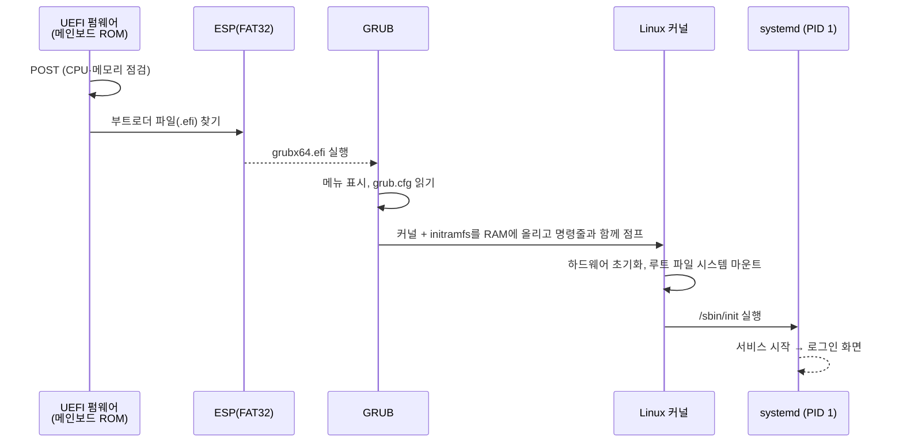
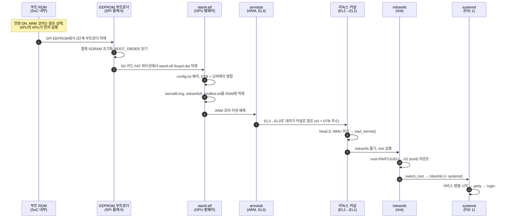
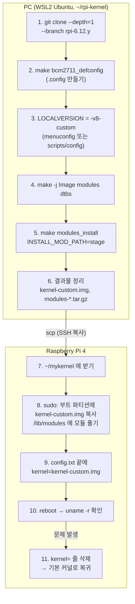
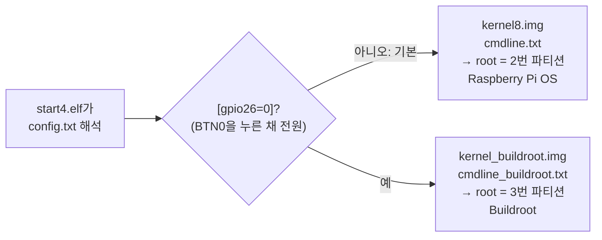

# 7장. 부팅 과정과 커널

> **학습 목표**
> - 리셋과 부팅의 차이를 설명하고, 부팅이 왜 "펌웨어 → 부트로더 → 커널 → init"처럼 여러 단계의 릴레이로 이루어지는지 말할 수 있다.
> - PC의 BIOS/UEFI 부팅(POST, MBR, GPT, ESP, GRUB)과 임베디드 시스템의 부팅(리셋 핸들러, 부트로더, U-Boot)을 비교할 수 있다.
> - Raspberry Pi 4의 부팅 체인(부트 ROM → SPI EEPROM 부트로더 → `start4.elf` → armstub → 커널 → initramfs → systemd)을 순서대로 그리고, 각 단계가 무엇을 읽고 무엇을 넘겨주는지 설명할 수 있다.
> - `config.txt`의 조건부 섹션과 부팅 관련 항목(`kernel=`, `arm_64bit`, `auto_initramfs`, `dtoverlay` 등), `cmdline.txt`의 핵심 매개변수(`console=`, `root=PARTUUID=`, `rootwait`, `loglevel`, `earlycon`)를 읽고 고칠 수 있다.
> - device tree가 무엇이고 왜 필요한지 설명하고, `/proc/device-tree`와 `dtc`로 살아 있는 device tree를 읽으며, `dtparam`·`dtoverlay`로 주변장치를 켤 수 있다.
> - 커널의 구조(모놀리식 커널과 모듈), 커널 버전 이름, 커널 설정(`.config`, defconfig, menuconfig)을 이해하고 `lsmod`, `modinfo`, `modprobe`로 모듈을 다룰 수 있다.
> - WSL2에서 Raspberry Pi 4용 64비트 커널을 교차 빌드하고, 기본 커널을 남겨 둔 채 **새 이름**으로 설치해 부팅·확인·되돌리기를 할 수 있다.
> - `dmesg`, `systemd-analyze`, UART 부팅 로그로 부팅 과정을 관찰하고, 부팅이 실패했을 때 어느 단계에서 멈췄는지 추리할 수 있다.

[2장](02_computer_arch_arm.md)에서 ARM 코어가 리셋되면 리셋 벡터로 가서 리셋 핸들러를 실행한다는 것, 그리고 AArch64에는 EL0~EL3라는 예외 레벨이 있다는 것을 보았다. [3장](03_rpi_hw_os.md)에서는 SD 카드의 부트 파티션을 열어 `config.txt`와 `cmdline.txt`를 처음 고쳐 보았다. 이 장은 그 두 장 사이의 빈칸을 메운다. **전원을 넣은 순간부터 로그인 프롬프트가 뜰 때까지 보드 안에서 무슨 일이 어떤 순서로 일어나는가**, 그리고 그 한가운데 있는 **커널**은 무엇이며 어떻게 직접 만들어 바꿔 끼울 수 있는가를 다룬다.

1학기 MCU 실습에서는 부팅을 신경 쓸 일이 거의 없었다. 전원을 넣으면 0번지의 리셋 벡터에서 곧바로 내 `main()`이 돌았기 때문이다. Raspberry Pi는 다르다. 전원을 넣고 로그인 화면이 뜨기까지 10초 이상 걸리고, 그동안 여러 프로그램이 차례로 실행되며 바통을 넘긴다. 이 과정을 알면 다음과 같은 일을 스스로 할 수 있게 된다.

- 화면에 아무것도 안 나오는 Pi를 보고 "부트로더 단계에서 멈췄다"인지 "커널은 떴는데 루트 파일 시스템을 못 찾았다"인지 구분한다.
- `config.txt` 한 줄로 I2C·SPI 같은 주변장치를 켜고 끄는 원리를 이해한다([12장](12_communication.md)의 준비).
- 커널을 직접 빌드해 교체하고, 실패해도 원래대로 되돌린다.
- 나중에 디바이스 드라이버를 만들 때 필요한 "커널 모듈"의 첫걸음을 뗀다.

이 장에서 다루지 않는 것도 정리해 둔다.

| 주제 | 다루는 곳 |
|---|---|
| `config.txt`·`cmdline.txt`를 처음 여는 법, UART 콘솔용 네 줄, 편집 기본 규칙 | [3장](03_rpi_hw_os.md) 3.7절 |
| 리셋 순서, 벡터 테이블, 예외 레벨 EL0~EL3의 정의 | [2장](02_computer_arch_arm.md) 2.12절, 2.19절 |
| `systemctl`·`journalctl`로 서비스 관리, 디스크·파티션 명령(`lsblk`, `fdisk`, `mount`, `dd`) | [5장](05_sysadmin.md) |
| 교차 개발의 개념, gcc 4단계, Makefile 문법 | [6장](06_c_build.md) |
| I2C·SPI·UART 통신 자체 | [12장](12_communication.md) |
| 프로세스·스레드·스케줄링 | [11장](11_process_concurrency.md) |

---

## 7.1 부팅이란 무엇인가

### 7.1.1 리셋과 부팅

강의에서 교수는 두 낱말을 먼저 구분하였다.

- **리셋(reset)**: CPU를 처음 상태로 되돌리는 것. 전원을 처음 넣을 때(**하드웨어 리셋**, power-on reset)와 `sudo reboot`처럼 소프트웨어가 시스템을 다시 시작시킬 때(**소프트웨어 리셋**)가 있다. 아두이노처럼 리셋 직후 0번지부터 내 프로그램이 바로 도는 것은 "부팅"이라기보다 그냥 리셋이다.
- **부팅(booting)**: 리셋 이후, 저장장치에 있는 **운영체제(OS)를 메인 메모리(RAM)에 올리고 제어권을 넘기는 과정 전체**.

즉 부팅은 리셋으로 시작하지만, 리셋보다 훨씬 긴 과정이다. MCU는 프로그램이 플래시에 있고 CPU가 플래시에서 명령을 직접 가져와 실행하므로 "올리는" 단계가 없다. 반면 Raspberry Pi 같은 OS 시스템의 CPU는 **RAM에 올라온 프로그램만 실행**한다([2장](02_computer_arch_arm.md) 2.2.5절). 그런데 전원을 막 넣은 순간에는 RAM이 비어 있고, 심지어 RAM을 쓸 준비(메모리 컨트롤러 초기화)조차 안 되어 있다. 이 모순을 푸는 것이 부팅이다.

> 강의에서 교수는 "**커널이 돌아갈 때 비로소 OS가 돌아가는 것**이다. 그 전까지(하드웨어 점검, 커널을 찾아 올리는 일)는 하드웨어 쪽 일로 보면 된다"고 정리하였다. 전자공학 전공자는 하드웨어와 펌웨어를 함께 다루므로, 이 경계를 의식하는 것이 중요하다.

### 7.1.2 왜 한 번에 못 하고 릴레이를 하는가

전원이 들어오면 CPU가 곧바로 SD 카드에서 리눅스를 읽어 RAM에 올리면 간단할 텐데, 실제로는 여러 단계를 거친다. 이유는 **각 단계가 할 수 있는 일이 제한되어 있기 때문**이다.

| 문제 | 설명 |
|---|---|
| 처음 실행되는 코드는 바꿀 수 없고 작아야 한다 | 리셋 직후 실행되는 코드는 칩 안의 **마스크 ROM**에 공장에서 새겨진다. 고칠 수 없으므로 꼭 필요한 일만 하게 아주 작게 만든다 |
| RAM은 아직 쓸 수 없다 | DRAM(LPDDR4)은 클록·타이밍을 설정해야 동작한다. 그 설정을 하는 코드는 DRAM 밖(ROM, 칩 내부 SRAM)에서 돌아야 한다 |
| 저장장치를 읽으려면 드라이버와 파일 시스템 지식이 필요하다 | SD 카드 프로토콜, FAT32 해석 같은 기능은 단계가 올라갈수록 조금씩 갖춰진다 |
| 유연성이 필요하다 | 앞 단계는 고정되어 있어도, 뒤 단계(부트로더 파일, 설정 파일, 커널)는 사용자가 바꿀 수 있어야 한다 |

그래서 부팅은 **릴레이 경주**와 같다.

- 첫 주자(ROM 코드)는 짧은 구간만 달린다. 할 줄 아는 것이 적지만, 다음 주자를 찾아 **바통**을 넘길 줄은 안다.
- 다음 주자는 앞 주자보다 능력이 많다. 메모리를 깨우고, 파일을 읽고, 더 큰 다음 주자를 불러온다.
- 마지막 주자인 커널은 모든 하드웨어를 관리할 능력이 있다. 커널이 바통을 받으면 앞 주자들은 메모리에서 사라져도 된다.
- **바통 안에는 정보가 들어 있다.** "다음 주자는 이 주소에 있다", "하드웨어 구성은 이렇다(device tree)", "루트 파일 시스템은 저 파티션이다(cmdline)" 같은 것이다.

이 비유를 기억해 두면, 부팅 문제를 만났을 때 "**몇 번째 주자가 바통을 떨어뜨렸는가**"로 생각할 수 있다.

### 7.1.3 일반적인 부팅 5단계

강의와 Linux 백서는 PC든 임베디드든 공통인 흐름을 다섯 단계로 정리하였다. 숫자 5 자체보다 <strong>"누가 누구에게 제어권을 넘기는가"</strong>가 핵심이다.

| 단계 | 하는 일 | 주체 → 다음 주체 | 성격 |
|---|---|---|---|
| 1. 펌웨어 실행과 점검 | ROM의 펌웨어가 하드웨어를 점검(POST)하고 부팅 장치를 찾는다 | 펌웨어 | 하드웨어(수정 불가) |
| 2. 부트로더 | 부팅 장치의 정해진 곳에서 부트로더를 읽어 실행한다 | 펌웨어 → 부트로더 | OS 쪽이 정함 |
| 3. 커널 로딩 | 커널을 RAM에 올리고 **모든 제어권을 넘긴다** | 부트로더 → 커널 | OS 시작 |
| 4. 시스템 초기화와 서비스 | 커널이 메모리·스케줄러·드라이버를 준비하고 첫 프로세스(init)를 띄운다. init이 서비스를 시작한다 | 커널 → init | OS |
| 5. 사용자 세션 | 로그인 프롬프트나 데스크톱이 뜬다 | init → 사용자 | OS |


이 흐름은 DOS, Windows, macOS, Linux, Android, Raspberry Pi 모두 같다. 구현만 다를 뿐이다. 이제 PC, 일반 임베디드 시스템, Raspberry Pi 순서로 각 주자를 자세히 보자.

---

## 7.2 PC는 어떻게 부팅하나: BIOS, UEFI, MBR, GPT

Raspberry Pi의 부팅이 얼마나 독특한지 알려면 먼저 "보통의" 부팅을 알아야 한다.

### 7.2.1 BIOS와 POST

PC의 메인보드에는 **펌웨어**가 들어 있는 플래시 ROM 칩이 있다. 전원 버튼을 누르면 CPU가 리셋되고, 미리 정해진 주소에 있는 이 펌웨어 코드를 실행한다. 예전 PC에서는 이 펌웨어를 **BIOS**라고 불렀다.

> **BIOS = Basic Input/Output System.** 강의에서 교수는 "S는 Service가 아니라 **System**이다. 기사 시험에 자주 나온다"고 강조하였다. 또 BIOS는 **메인보드(하드웨어)에 붙은 프로그램**이므로 OS와 상관없이 실행되고, **커널은 OS의 일부**라는 점에서 둘은 전혀 다르다.

펌웨어가 가장 먼저 하는 일은 **POST(Power-On Self-Test)**, 즉 전원 투입 자가 진단이다. CPU, 메모리, 그래픽 카드 같은 필수 하드웨어가 정상인지 점검하고, 문제가 있으면 삐 소리나 화면 메시지로 알린다. PC를 켰을 때 로고 화면 전에 메모리를 세는 글자가 지나가던 것이 이 단계이다. 백서는 이를 "**기상 점호**"에 비유한다.

> 강의 팁: "여러분이 자신의 시스템을 설계할 때도 주변장치를 점검하는 **셀프 테스트 기능**을 넣어 두면 좋다." 졸업 작품의 센서 보드도 전원을 켜면 센서가 응답하는지 먼저 확인하고 LED로 알려 주게 만들면, 고장 원인을 찾기가 훨씬 쉽다.

POST가 끝나면 펌웨어는 설정된 **부팅 순서**(boot priority, 예: USB → SSD → HDD)에 따라 부팅 가능한 장치를 찾는다. 강의에서 교수는 PC를 바꾼 뒤 USB 메모리 쪽으로 부팅된 것을 모르고 작업하다 사진을 잃은 일화를 들려주며, **시스템을 바꿀 때는 지금 어느 장치로 부팅되었는지 꼭 확인하라**고 하였다.

### 7.2.2 MBR: 디스크 맨 앞의 512바이트

BIOS 시절의 부팅 장치는 디스크 맨 앞, 즉 <strong>첫 번째 섹터(LBA 0)</strong>에 <strong>MBR(Master Boot Record)</strong>을 둔다. 한 섹터는 512바이트이다. MCU에 시작 번지 0번지가 있듯이, 디스크에도 맨 처음 공간이 있는 것이다.

| 위치(바이트) | 크기 | 내용 |
|---|---|---|
| 0 ~ 445 | 446 | **부트 코드**: BIOS가 RAM에 올려 실행하는 아주 작은 프로그램 |
| 446 ~ 509 | 64 | **파티션 테이블**: 16바이트 항목 4개 → 주 파티션은 최대 4개 |
| 510 ~ 511 | 2 | 부트 시그니처 `0x55 0xAA`: "이 섹터는 유효한 MBR이다" |

> 📌 **보강:** MBR의 구조(부트 코드 영역, 16바이트 파티션 항목 4개, 시그니처 0xAA55)와 GPT의 구조는 UEFI 규격서의 "Legacy Master Boot Record"와 "GUID Partition Table" 장에 정의되어 있다. MBR의 파티션 항목은 시작 위치와 크기를 32비트 섹터 수로 적기 때문에 512바이트 섹터에서 2³² × 512 B ≈ 2.2 TB를 넘는 디스크를 다룰 수 없다. 출처: [UEFI Specification](https://uefi.org/specifications)

부트 코드 446바이트로는 OS를 통째로 올릴 수 없다. 그래서 이 작은 코드는 "더 큰 부트로더가 디스크 어디에 있는지"만 알고 그것을 불러온다. 여기서도 릴레이가 일어난다. 백서는 MBR을 "**책의 첫 페이지에 있는 차례**"에 비유한다. BIOS는 차례만 보고 본문(OS)을 찾아간다.

MBR의 한계는 두 가지이다.

1. 주 파티션은 **최대 4개**이다(64바이트에 16바이트 항목 4개).
2. **약 2.2 TB**보다 큰 디스크를 다룰 수 없다.

> 정리자 주(강의 녹취): 녹음에서 "112바이트"로 들리는 부분은 512바이트(섹터)를 말한 것이다. 또 강의 중 "FAT32는 2.2 TB까지"처럼 들리는 부분이 있는데, 2.2 TB는 **MBR 파티션 테이블**의 한계이다(FAT32와는 별개).

### 7.2.3 UEFI, GPT, ESP

지금의 PC는 대부분 <strong>UEFI(Unified Extensible Firmware Interface)</strong>를 쓴다. 기능은 BIOS와 같은 "첫 주자"이지만 방식이 다르다.

- 디스크의 파티션 정보는 <strong>GPT(GUID Partition Table)</strong>로 적는다. 64비트 주소를 쓰므로 2.2 TB 제한이 없고, 파티션도 보통 128개까지 만들 수 있다.
- 부트로더를 디스크 맨 앞 섹터에 숨겨 두는 대신, <strong>ESP(EFI System Partition)</strong>라는 **FAT32 파티션 하나**를 만들고 그 안에 부트로더를 **보통의 파일**(`.efi`)로 넣어 둔다. UEFI 펌웨어는 FAT32를 읽을 줄 알므로, 차례(MBR)를 거치지 않고 파일을 직접 찾아 실행한다.
- 텍스트만 되던 BIOS와 달리 그래픽 설정 화면, 마우스, 네트워크 부팅 같은 기능이 있다.

호환성을 위해 GPT 디스크도 0번 섹터에 "보호용 MBR(protective MBR)"을 남겨 둔다. 강의에서 교수는 "새것을 만들 때는 늘 **호환성**이 문제라서, 한동안은 이전 방식을 따라가다가 충분한 시간이 지나야 완전히 버린다"고 설명하였다.

**내 PC가 UEFI인지 확인하기**: Windows의 **디스크 관리**를 열면 C 드라이브가 있는 디스크에 약 100 MB 크기의 **EFI 시스템 파티션**이 보인다. 파티션을 직접 나눈 적이 없어도 Windows 설치 프로그램이 자동으로 만든 것이다.

| 구분 | BIOS + MBR | UEFI + GPT |
|---|---|---|
| 부트 정보 위치 | 디스크 첫 섹터(512바이트) | 별도 파티션(ESP, FAT32)의 `.efi` 파일 |
| 파티션 수 | 주 파티션 최대 4개 | 보통 128개 |
| 최대 디스크 크기 | 약 2.2 TB | 사실상 제한 없음 |
| 부트로더를 찾는 방법 | 첫 섹터의 코드를 무조건 실행 | 파일 시스템을 읽어 파일을 찾아 실행 |
| 화면 | 텍스트 | 그래픽 가능 |

> **연결해 보기:** Raspberry Pi의 SD 카드는 어느 쪽일까? Linux 백서의 `fdisk -l` 출력에는 `Disklabel type: dos`가 찍혀 있다. **dos = MBR 파티션 테이블**이다. 그런데 Pi의 첫 주자(GPU 펌웨어)는 UEFI처럼 **FAT32 파티션의 파일**(`start4.elf`, `kernel8.img`)을 찾아 읽는다. 즉 Pi는 **MBR 형식의 파티션 표 + FAT32 부트 파티션의 파일**이라는, 두 방식을 섞은 모습이다. `cmdline.txt`의 `PARTUUID=xxxxxxxx-02`에서 앞 8자리가 바로 MBR에 적힌 디스크 식별자(Disk identifier)이다(7.6.3절).

### 7.2.4 GRUB: PC 리눅스의 부트로더

UEFI(또는 BIOS)가 불러오는 부트로더는 OS마다 다르다. Windows는 Windows Boot Manager, macOS는 `boot.efi`, PC용 리눅스는 대개 **GRUB**을 쓴다. GRUB은 부팅 메뉴를 보여 주고, 사용자가 고른 커널 파일(`vmlinuz-…`)과 initramfs(`initrd.img-…`)를 RAM에 올린 뒤 커널 명령줄을 넘겨주고 커널로 점프한다.

> 📌 **보강:** GRUB은 GNU 프로젝트의 부트로더로, 여러 OS를 고르는 메뉴(멀티부트)와 설정 파일(`grub.cfg`)을 제공한다. 출처: [GNU GRUB Manual](https://www.gnu.org/software/grub/manual/grub/)

PC 리눅스의 부팅 릴레이를 정리하면 다음과 같다.



---

## 7.3 임베디드 시스템의 부팅과 부트로더

이제 PC가 아닌 임베디드 보드를 보자. 「ARM 프로세서」·「ARM 프로세서와 임베디드 하드웨어 설계」 강의 슬라이드는 ARM 기반 보드를 직접 설계할 때의 부팅을 다룬다.

### 7.3.1 리셋 핸들러 다시 보기

[2장](02_computer_arch_arm.md) 2.19.4절에서 본 것처럼, ARM 코어는 리셋되면 정해진 상태(인터럽트 금지, 특권 모드)로 바뀌고 **리셋 벡터**로 간다. 거기서 분기한 **리셋 핸들러**(부트 코드, startup 코드)가 하드웨어를 하나씩 깨운다.

| 순서 | 리셋 핸들러가 하는 일 | 이 장에서 다시 만나는 곳 |
|---|---|---|
| 1 | 예외 벡터 테이블 설정 | 커널의 `head.S`가 `VBAR_EL1`을 설정한다(7.7.3절) |
| 2 | 불필요한 하드웨어 정지(워치독 등) | EEPROM 부트로더의 워치독 설정(`BOOT_WATCHDOG_TIMEOUT`) |
| 3 | 시스템 클록 설정 | Pi에서는 부트 ROM·EEPROM 부트로더가 한다 |
| 4 | 메모리 컨트롤러 설정(DRAM 사용 준비) | Pi에서는 EEPROM 부트로더가 SDRAM을 초기화한다 |
| 5 | MMU/MPU 설정 | 커널의 `head.S`가 MMU를 켠다 |
| 6 | 스택 설정 | `head.S`가 초기 스택을 잡는다 |
| 7 | C 변수 영역 초기화(.data 복사, .bss 지우기) | 커널도 `.bss`를 0으로 지운다 |
| 8 | 인터럽트 설정 후 허용 | 커널의 `start_kernel()` 안에서 |
| 9 | C 함수(`main()`) 호출 | 커널은 `start_kernel()`을 호출한다 |

MCU에서는 이 표 전체를 컴파일러가 만들어 준 startup 파일 하나(`crt0.S`, `startup.S` 등)가 몇 마이크로초 만에 끝낸다. OS가 있는 시스템에서는 **이 일을 여러 주자가 나누어 맡는다.** 이것이 7.1.2절의 릴레이이다. 슬라이드의 말처럼 부트 코드를 쓰려면 프로그래머 모델(특히 명령어)과 시스템 하드웨어 구조를 모두 알아야 하므로, 대부분 칩 회사나 OS 배포처가 만들어 준 것을 쓰고 필요한 부분만 고친다.

### 7.3.2 메모리 리매핑: 벡터 테이블을 RAM으로 옮기는 이유

「ARM 프로세서와 임베디드 하드웨어 설계」 슬라이드는 <strong>메모리 리매핑(re-mapping)</strong>이 필요한 이유를 다음과 같이 정리한다.

1. 전원이 꺼져도 내용이 남는 것은 ROM이나 플래시뿐이므로, 리셋 직후 실행할 코드는 **0번지의 ROM/플래시**에 있어야 한다.
2. 그런데 ROM·플래시는 DRAM보다 데이터 버스 폭이 좁고 느리다. 계속 거기서 실행하면 성능이 떨어진다.
3. 고전 ARM의 예외 벡터 테이블은 0번지에 있는데, ROM이면 실행 중에 벡터를 바꾸기 어렵다.
4. 그래서 초기화 도중에 **RAM이 0번지에 보이도록 주소 배치를 바꾸거나**(리매핑), 벡터 테이블을 RAM에 새로 만들고 그쪽을 가리키게 한다. 대부분의 OS는 초기화 중에 벡터 테이블을 다시 설정한다.

[2장](02_computer_arch_arm.md) 2.19.5절에서 본 것처럼 AArch64에서는 `VBAR_ELx` 레지스터에 원하는 주소를 넣으면 되므로, 리매핑 회로 없이도 벡터 테이블을 RAM 어디에나 둘 수 있다. 리눅스 커널도 부팅 중에 자기 벡터 테이블(`arch/arm64/kernel/entry.S`의 `vectors`)의 주소를 `VBAR_EL1`에 넣는다.

<!-- 그림 필요: 「ARM 프로세서와 임베디드 하드웨어 설계」 slides "메모리 리매핑 과정" -->

### 7.3.3 부트로더의 역할

「ARM 프로세서」 슬라이드는 부트로더가 하는 일을 크게 네 가지로 나눈다.

| 역할 | 내용 |
|---|---|
| ① 타깃 시스템 초기화 | 리셋 핸들러가 하던 일(클록, 메모리 컨트롤러, 필요하면 MMU, 스택, C 변수 영역)을 하고 C 함수를 부른다. 재배치(relocation)와 예외 벡터·핸들러도 준비한다 |
| ② 동작 환경 설정 | 부팅 방법, 부팅 장치, 네트워크 부팅을 위한 IP 주소 같은 **환경 변수**를 설정하고 플래시나 EEPROM에 저장해 둔다 |
| ③ 운영체제 부팅 | 플래시에 있는 OS 이미지를 **DRAM에 복사하고 OS의 시작 주소로 제어권을 넘긴다** |
| ④ 다운로드·플래시 관리·모니터 | 시리얼·USB·네트워크로 새 이미지를 받아 RAM에서 실행하거나 플래시에 굽는다. 하드웨어 상태를 점검하는 모니터(POST) 기능도 둔다 |

③의 이미지 전송 방법을 비교하면 다음과 같다.

| 방법 | 특징 |
|---|---|
| 시리얼(UART) | 설정이 단순하지만 느려서 큰 OS 이미지에는 부적합 |
| USB | 별도 설정 없이 누구나 쉽게 쓸 수 있다 |
| 네트워크(TFTP) | 빠르다. 개발 중 커널을 수십 번 바꿀 때 편하다 |

> **원본 자료 정정:** 슬라이드는 TFTP를 "Trial File Transfer Protocol"이라고 적었다. 정확한 이름은 **Trivial File Transfer Protocol**이다. 인증 없이 UDP로 파일을 주고받는 아주 단순한("trivial") 프로토콜이라 부트로더처럼 작은 프로그램에 넣기 좋다. 출처: [RFC 1350 – The TFTP Protocol (Revision 2)](https://www.rfc-editor.org/rfc/rfc1350)

### 7.3.4 부트로더의 특징

슬라이드가 꼽는 부트로더의 특징은 다음과 같다.

- **프로세서에 의존적이다.** 초기화 코드는 어셈블리로 쓰이므로 프로세서의 아키텍처와 프로그래머 모델을 알아야 한다.
- **보드 하드웨어에 의존적이다.** 메모리 인터페이스, 주변장치 배치를 알아야 한다.
- **가능한 한 작아야 한다.**
- **대부분 직접 만들거나, 공개된 부트로더를 고쳐 쓴다.** 다운로드 방법, OS 시작 방법 등을 내 시스템에 맞게 바꾼다.

### 7.3.5 개발할 때의 연결: 호스트, 타깃, JTAG

「ARM 프로세서와 임베디드 하드웨어 설계」 슬라이드는 임베디드 개발 환경을 <strong>호스트(host)</strong>와 <strong>타깃(target)</strong>으로 나눈다. 호스트는 컴파일러·링커·디버거가 있는 PC이고, 타깃은 개발하려는 보드이다. 둘은 시리얼 케이블, 이더넷·USB, 그리고 **JTAG**으로 연결된다.

| 실행 방법(슬라이드) | 설명 |
|---|---|
| ROM/플래시에 구워 실행 | 완성된 이미지를 비휘발성 메모리에 쓴다 |
| 전용 ICE 없이 DRAM에 올려 실행 | 이미 돌고 있는 부트로더가 시리얼·네트워크로 받아 RAM에 올린다 |
| 전용 ICE로 DRAM에 올려 실행 | JTAG으로 CPU를 멈춘 채 메모리에 직접 쓰고 실행한다 |

<strong>ICE(In-Circuit Emulator)</strong>는 JTAG 단자로 타깃 CPU에 붙어, 레지스터·메모리를 읽고 쓰고, 중단점(breakpoint)을 걸고, 한 명령씩 실행시키는 장비이다. 부트로더조차 없는 새 보드에 첫 코드를 넣거나, 부트 코드 자체를 디버깅할 때 쓴다. 1학기에 STM32를 ST-LINK로 디버깅했다면 그것이 바로 JTAG/SWD 기반 디버거이다.

> 📌 **보강:** Raspberry Pi에도 ARM 코어용 JTAG 인터페이스가 있다. `config.txt`에 `enable_jtag_gpio=1`을 넣으면 GPIO22~27이 Alt4 기능으로 바뀌어 ARM CPU의 JTAG 신호가 헤더로 나온다(외부 JTAG 어댑터와 OpenOCD 같은 소프트웨어가 필요하다). 출처: [Raspberry Pi Documentation – config.txt: enable_jtag_gpio](https://www.raspberrypi.com/documentation/computers/config_txt.html#enable_jtag_gpio)

> **⚠ 핀 예외: JTAG 디버깅 (심화)**
>
> `enable_jtag_gpio=1`은 GPIO22~27을 JTAG 신호로 바꾼다. 이 교재의 표준 배선([8장](08_gpio_pigpio.md) 8.2.4절)에서 이 핀들은 **LED1~LED5(GPIO27, 22, 23, 24, 25)와 BTN0(GPIO26)** 자리이다. JTAG 어댑터를 연결하기 전에 다음을 지킨다.
>
> 1. 전원을 끄고 GPIO22~27에 꽂힌 **LED·저항과 BTN0 버튼 배선을 모두 뺀다.** LED0(GPIO17), LED6·LED7(GPIO5·6) 등 나머지 배선은 그대로 두어도 된다.
> 2. JTAG을 켜 둔 동안에는 7.12절의 **GPIO26 듀얼 부팅 선택**을 쓸 수 없다(같은 핀이다).
> 3. 실험이 끝나면 `config.txt`에서 `enable_jtag_gpio=1` 줄을 지우거나 주석 처리하고 재부팅한 뒤, 빼 둔 배선을 다시 꽂는다.

<!-- 그림 필요: 「ARM 프로세서와 임베디드 하드웨어 설계」 slides "다운로드 방법", "JTAG 기반의 디버깅 시스템 구성" -->

### 7.3.6 공개 부트로더와 펌웨어

슬라이드는 쓸 수 있는 공개 부트로더로 U-Boot, OpenSBI, SeaBIOS, Coreboot를 든다. 그런데 이 넷은 **하는 일과 위치가 서로 다르다.** 슬라이드의 설명에는 틀린 부분이 있으므로 바로잡아 정리한다.

| 이름 | 정확한 정체 | 주로 쓰이는 곳 |
|---|---|---|
| **U-Boot** | 가장 널리 쓰이는 임베디드용 공개 부트로더. 플래시·SD·USB·네트워크(TFTP)에서 커널을 불러오고, 명령줄 셸과 환경 변수를 제공한다 | ARM·RISC-V 등 대부분의 임베디드 리눅스 보드 |
| **OpenSBI** | RISC-V의 **SBI(Supervisor Binary Interface)** 규격을 구현한 펌웨어. 가장 높은 권한 모드(M-mode)에 상주하며 OS에 서비스를 제공한다. 부트로더라기보다 ARM의 EL3 펌웨어(Trusted Firmware)에 해당한다 | RISC-V 보드. 흔히 OpenSBI 다음에 U-Boot가 실행된다 |
| **SeaBIOS** | x86용 **16비트 레거시 BIOS**의 공개 구현. UEFI가 아니다 | QEMU 가상 머신의 기본 BIOS, coreboot의 payload |
| **coreboot** | 하드웨어 초기화만 빠르게 하고, 나머지는 **payload**(SeaBIOS, UEFI 구현, 리눅스 커널 등)에게 넘기는 공개 펌웨어 | 일부 노트북·서버·크롬북 |
| (참고) **EDK II** | UEFI 규격의 공개 구현(TianoCore) | PC·서버 UEFI 펌웨어의 바탕 |

> **원본 자료 정정:** 「ARM 프로세서」 슬라이드는 "OpenSBI는 U-Boot의 후속으로 U-Boot보다 성능이 우수하다", "SeaBIOS는 UEFI를 기반으로 하는 공개 부트로더로 UEFI의 모든 기능을 제공한다"고 적었다. 둘 다 사실과 다르다. OpenSBI는 U-Boot를 대체하는 것이 아니라 RISC-V에서 U-Boot **앞에** 실행되는 런타임 펌웨어이고, SeaBIOS는 UEFI가 아닌 **레거시 x86 BIOS** 구현이다(SeaBIOS 공식 사이트: "an open source implementation of a 16bit X86 BIOS"). 출처: [OpenSBI (RISC-V Software Source)](https://github.com/riscv-software-src/opensbi), [SeaBIOS](https://www.seabios.org/), [coreboot documentation](https://doc.coreboot.org/), [U-Boot documentation](https://docs.u-boot.org/en/latest/), [TianoCore EDK II](https://github.com/tianocore/edk2)

### 7.3.7 Raspberry Pi에는 U-Boot가 없나?

Raspberry Pi OS는 U-Boot를 쓰지 않는다. **Pi의 GPU 펌웨어가 부트로더 역할을 직접 하기 때문**이다(다음 절). 펌웨어가 `config.txt`를 읽고, 커널·device tree·initramfs를 RAM에 올리고, 명령줄을 넘겨주고, ARM 코어를 깨운다. U-Boot가 하는 일과 거의 같다.

> 📌 **보강:** 그래도 U-Boot를 Pi에서 쓸 수는 있다. U-Boot는 Raspberry Pi용 설정(`rpi_arm64_defconfig` 등)을 제공하며, 이때는 GPU 펌웨어가 커널 대신 U-Boot 이미지를 올리고, U-Boot가 다시 리눅스 커널을 불러온다. 네트워크 부팅이나 여러 OS 선택 메뉴가 필요할 때 이런 구성을 쓴다. 출처: [U-Boot documentation – Raspberry Pi](https://docs.u-boot.org/en/latest/board/broadcom/raspberrypi.html)

---

## 7.4 Raspberry Pi 4의 부팅 체인

### 7.4.1 GPU가 먼저 깨어난다

강의에서 교수가 "문서를 볼 때마다 강조한다"고 한 Raspberry Pi 부팅의 가장 큰 특징은 이것이다.

> **PC는 CPU가 리셋되어 부팅을 진행하지만, Raspberry Pi는 SoC 안의 GPU가 먼저 깨어나 부팅을 담당한다.**

BCM2711 SoC 안에는 ARM Cortex-A72 코어 4개와 함께 **VideoCore VI**라는 GPU 블록이 있다. VideoCore 안에는 그래픽 연산 장치 말고도 **VPU**라는 별도의 프로세서가 있는데, 전원이 들어오면 **ARM 코어는 리셋 상태로 잠들어 있고 VPU가 먼저 코드를 실행**한다. ARM 코어는 부팅이 거의 끝날 무렵에야 깨어난다.

비유하면 이렇다. 회사 건물(SoC)에 아침이 오면, <strong>건물 관리인(GPU)</strong>이 먼저 출근해서 전기를 올리고, 회의실(메모리)을 정리하고, 오늘 일정표(`config.txt`)를 읽고, 사장님 책상에 서류(커널, device tree, 명령줄)를 올려 둔 다음, 마지막으로 **사장님(ARM 코어)을 깨운다.** 사장님은 책상에 앉자마자 서류를 보고 일을 시작한다. 관리인은 그 뒤에도 건물에 남아 전원·클록·온도를 관리한다(그래서 `vcgencmd`로 GPU 펌웨어에게 온도나 클록을 물어볼 수 있다).

### 7.4.2 단계별로 따라가기

Raspberry Pi 4의 부팅 체인을 공식 문서 기준으로 단계별로 정리하면 다음과 같다.

| 단계 | 주자(어디에 있나) | 실행하는 프로세서 | 하는 일 | 다음 주자에게 넘기는 것 |
|---|---|---|---|---|
| ① | **부트 ROM**(SoC 내부 마스크 ROM, 수정 불가) | VPU | OTP(일회성 프로그래밍 메모리) 설정 확인, (설정된 경우) SD의 `recovery.bin` 확인, **SPI EEPROM에서 2단계 부트로더를 읽어 실행** | 2단계 부트로더 |
| ② | **EEPROM 부트로더**(보드의 SPI 플래시 EEPROM, 업데이트 가능) | VPU | **클록과 SDRAM 초기화**, EEPROM 설정(`BOOT_ORDER` 등) 읽기, 부팅 장치를 순서대로 시도(SD → USB → …), FAT 부트 파티션에서 펌웨어 읽기 | `start4.elf`, `fixup4.dat` |
| ③ | **`start4.elf`**(부트 파티션의 GPU 펌웨어) + **`fixup4.dat`** | VPU | **`config.txt` 해석**, GPU/ARM 메모리 분할, 보드에 맞는 `.dtb` 선택 + `dtparam`·`dtoverlay` 적용, **커널(`kernel8.img`)·initramfs(`initramfs8`) 적재**, `cmdline.txt` 읽기 | RAM에 올린 커널, 완성된 DTB, 명령줄 |
| ④ | **armstub**(펌웨어에 내장된 작은 ARM 코드) | ARM 코어(EL3) | 인터럽트 컨트롤러(GIC) 같은 저수준 하드웨어 설정, **EL3 → EL2로 내려가기**, 보조 코어 3개는 대기시킴 | 커널 진입점으로 점프 (`x0` = DTB 주소) |
| ⑤ | **리눅스 커널** (`head.S` → `start_kernel()`) | ARM 코어(EL2 → EL1) | MMU 켜기, 메모리·스케줄러·인터럽트·드라이버 초기화, device tree 해석, 보조 코어 깨우기 | initramfs의 `/init` 실행 |
| ⑥ | **initramfs**(RAM 위의 임시 루트) | ARM, 사용자 공간 | 필요한 모듈 적재, `root=PARTUUID=…`인 진짜 루트 파티션(ext4) 마운트, 루트 전환 | `/sbin/init` |
| ⑦ | **systemd**(PID 1) | ARM, 사용자 공간 | `default.target`까지 서비스를 병렬로 시작 | `getty` → 로그인 프롬프트 |

같은 내용을 시간 순서로 그리면 다음과 같다.



각 단계에서 기억할 점을 짚어 보자.

**① 부트 ROM: 바꿀 수 없는 첫 주자.** 칩을 만들 때 새겨진 코드라 어떤 경우에도 고칠 수 없다. Pi 4의 ROM은 거의 일을 하지 않고, 곧바로 보드의 **SPI EEPROM**에서 다음 주자를 불러온다. 부팅이 안 될 때 고칠 수 있는 곳은 ② 이후이다.

**② EEPROM 부트로더: Pi 4부터 생긴 주자.** 보드 위의 작은 SPI 플래시 칩(흔히 EEPROM이라 부른다)에 들어 있다. 이 부트로더가 **SDRAM을 초기화**하고, `BOOT_ORDER` 설정에 따라 SD 카드 → USB → (설정하면) 네트워크 순서로 부팅 장치를 찾는다. 강의에서 교수가 "빈 USB 메모리에 Imager로 이미지를 쓰고 꽂아 두면 SD 카드가 없어도 부팅된다"고 한 것이 이 부트로더 덕분이다. 이 부트로더는 `apt` 업데이트로 고쳐질 수 있다(7.4.5절).

**③ `start4.elf`: 실질적인 펌웨어.<strong> 강의의 표현대로 "</strong>앞까지는 모두 준비 과정이고, 이것이 실질적인 펌웨어**"이다. GPU용 실행 파일(ELF 형식)이며 `fixup4.dat`는 이것과 짝을 이루는 메모리 배치 보정 파일이다. 3장에서 본 `config.txt`를 읽는 것이 바로 이 단계이다. 커널을 위한 명령줄(`cmdline.txt`)은 **해석하지 않고 그대로 커널에 전달**한다. 정확히는 펌웨어가 명령줄에 몇 가지 항목을 덧붙인 뒤 device tree의 `/chosen` 노드에 넣어 커널에 건넨다(7.6.1절).

**④ armstub: 2장에서 본 EL3 → EL2.** [2장](02_computer_arch_arm.md) 2.12.4절에서 "펌웨어가 ARM 코어를 EL3에서 시작시켜 armstub을 실행하고, armstub은 커널을 EL2에서 시작시킨다"고 하였다. armstub은 몇백 바이트짜리 ARM 코드로, 가장 높은 권한(EL3)에서만 할 수 있는 설정(보안 상태, 인터럽트 컨트롤러)을 마치고 **스스로 권한을 내려놓은 뒤** 커널에 바통을 넘긴다. 나머지 코어 3개는 armstub 안에서 "커널이 깨워 줄 때까지" 기다린다.

> 📌 **보강:** `config.txt` 문서는 armstub을 "커널보다 먼저 실행되는 작은 ARM 코드로, 인터럽트 컨트롤러 같은 저수준 하드웨어를 설정한 뒤 커널에 제어권을 넘긴다. 기본 armstub은 펌웨어 안에 들어 있고 모델에 따라 자동으로 선택된다"고 설명한다. 리눅스 arm64 부팅 규약은 커널 진입 시 `x0` = device tree의 물리 주소, MMU 꺼짐, CPU는 EL2(권장) 또는 EL1이어야 한다고 정한다. Pi 4의 device tree는 보조 코어의 깨우는 방법을 `enable-method = "spin-table"`로 기술한다. 출처: [config.txt – armstub](https://www.raspberrypi.com/documentation/computers/config_txt.html#armstub), [Linux kernel – Booting AArch64 Linux](https://docs.kernel.org/arch/arm64/booting.html), [raspberrypi/tools – armstubs](https://github.com/raspberrypi/tools/tree/master/armstubs), [raspberrypi/linux `bcm2711.dtsi`](https://github.com/raspberrypi/linux/blob/rpi-6.12.y/arch/arm/boot/dts/broadcom/bcm2711.dtsi)

**⑤~⑦ 커널, initramfs, systemd**는 7.7절에서 자세히 본다.

### 7.4.3 Pi 3 이하와 다른 점: `bootcode.bin`은 Pi 4에서 쓰지 않는다

Linux 백서와 2025년 강의는 부팅 체인을 "ROM → **`bootcode.bin`** → `start.elf` → `kernel.img`"로 설명하였다. 이것은 **Pi 3 이하** 모델의 흐름이다.

| 모델 | ① ROM 다음의 2단계 부트로더 | GPU 펌웨어 | 64비트 커널 파일 |
|---|---|---|---|
| Pi 1, 2, 3, Zero | 부트 파티션의 **`bootcode.bin`** (SDRAM 초기화) | `start.elf`, `fixup.dat` | `kernel8.img`(Pi 3, Zero 2 W) |
| **Pi 4, 400, CM4** | **SPI EEPROM의 부트로더** (SDRAM 초기화) | **`start4.elf`, `fixup4.dat`** | **`kernel8.img`** |
| Pi 5, 500, CM5 | SPI EEPROM의 부트로더 | 없음 (펌웨어가 EEPROM 안에 통째로 들어 있다) | `kernel_2712.img`(없으면 `kernel8.img`) |

> **원본 자료 정정:** Linux 백서 Booting 탭과 2025년 10주차 강의는 Pi 4를 설명하면서 `bootcode.bin`이 SDRAM을 초기화하고 `start.elf`를 불러온다고 하였다. 공식 문서에 따르면 **Raspberry Pi 4와 5는 `bootcode.bin`을 쓰지 않으며, 그 역할은 보드의 EEPROM에 있는 부트 코드가 맡는다.** Pi 4가 읽는 GPU 펌웨어 이름도 `start.elf`가 아니라 `start4.elf`이다. 부트 파티션에 `bootcode.bin`이 보이더라도 Pi 4는 그 파일을 읽지 않는다(부트 파티션에 여러 모델용 `.dtb`와 펌웨어가 함께 들어 있는 것처럼, 이미지 하나로 여러 모델을 지원하기 위한 파일이다). 또 백서의 LED 설명 중 "무반응: bootcode.bin 문제"도 Pi 4에는 해당하지 않는다(7.4.6절). 출처: [Raspberry Pi Documentation – boot folder contents](https://www.raspberrypi.com/documentation/computers/configuration.html#boot-folder-contents), [EEPROM boot flow](https://www.raspberrypi.com/documentation/computers/raspberry-pi.html#eeprom-boot-flow)

그래도 강의 내용의 뼈대, 즉 "**GPU가 먼저 → 2단계 부트로더가 SDRAM 초기화 → GPU 펌웨어가 설정을 읽고 커널을 올림 → 커널**"은 Pi 4에서도 그대로이다. 바뀐 것은 2단계 주자가 SD 카드의 파일에서 보드의 EEPROM으로 옮겨 간 것뿐이다.

### 7.4.4 백서의 단계별 시간은 대략적인 값이다

Linux 백서는 단계마다 시간을 붙여 두었다(전원 인가 0~100 ms, 부트로더 100~500 ms, 커널 로딩 0.5~2 s, 커널 초기화 2~10 s, systemd 5~15 s). 강의에서도 "1초도 안 되는 아주 짧은 시간"이라고 설명하였다. 이 값들은 **감을 잡기 위한 대략적인 범위**이며, 실제로는 SD 카드 속도, `config.txt` 설정(카메라·디스플레이 자동 감지, HAT EEPROM 읽기), 데스크톱/Lite 여부, 네트워크 대기 등에 따라 크게 달라진다. 실습 7-1에서 **내 Pi의 실제 시간**을 재 보자. 측정할 때는 시계가 셋이라는 점에 주의한다.

| 구간 | 무엇으로 재나 | 시간의 기준점 |
|---|---|---|
| 부트 ROM ~ 펌웨어(①~④) | UART 로그(`uart_2ndstage=1`), `sudo vclog --msg` | 펌웨어 자체의 시각 표시 |
| 커널(⑤~⑥) | `dmesg`의 `[ 1.234567]` | **커널이 시작된 순간 = 0초** |
| 사용자 공간(⑦) | `systemd-analyze` | 커널 시간 + 사용자 공간 시간. **펌웨어 구간은 포함하지 않는다** |

### 7.4.5 부트 EEPROM 다루기: `rpi-eeprom-update`, `rpi-eeprom-config`

② 단계의 EEPROM 부트로더는 프로그램이자 설정 저장소이다. Raspberry Pi OS에는 이것을 확인하고 갱신하는 도구가 들어 있다.

```bash
sudo rpi-eeprom-update        # 현재 부트로더 버전과 새 버전이 있는지 확인
rpi-eeprom-config             # 현재 부트로더 설정 보기
sudo rpi-eeprom-config --edit # 설정을 편집기로 열기 → 저장하면 다음 재부팅 때 반영
```

`rpi-eeprom-config`를 실행하면 대략 다음과 같은 설정이 보인다(예시, 보드마다 다름).

```ini
[all]
BOOT_UART=0
POWER_OFF_ON_HALT=0
BOOT_ORDER=0xf41
```

가장 중요한 것은 **`BOOT_ORDER`<strong>이다. 16진수의 각 자리(니블)가 부팅 방법 하나를 뜻하고, </strong>오른쪽 자리부터** 차례로 시도한다.

| 값 | 부팅 방법 |
|---|---|
| `0x1` | SD 카드 |
| `0x2` | 네트워크(TFTP) |
| `0x4` | USB 대용량 저장장치(USB-MSD) |
| `0xe` | 멈춤(오류 패턴 표시) |
| `0xf` | 처음부터 다시(RESTART) |

예를 들어 기본값 `0xf41`은 **1(SD) → 4(USB) → f(처음부터 반복)**, `0xf14`는 USB를 먼저 시도한다. `BOOT_UART=1`로 바꾸면 ② 단계 부트로더의 진단 메시지도 UART로 나온다(3장의 `uart_2ndstage=1`은 ③ 단계 펌웨어의 로그를 켜는 설정이다).

> ⚠ **EEPROM은 함부로 건드리지 않는다.** 수업에서는 **읽기만** 한다. 설정을 잘못 바꾸면 SD 카드가 있어도 부팅하지 않을 수 있다. 그때는 Raspberry Pi Imager의 *Misc utility images > Bootloader > SD Card Boot* 이미지를 빈 SD 카드에 써서 부트로더를 다시 쓰는 방법이 공식 문서에 안내되어 있다.

> 📌 **보강 출처:** [Raspberry Pi Documentation – Raspberry Pi boot EEPROM](https://www.raspberrypi.com/documentation/computers/raspberry-pi.html#raspberry-pi-boot-eeprom), [Bootloader configuration – BOOT_ORDER, BOOT_UART](https://www.raspberrypi.com/documentation/computers/raspberry-pi.html#raspberry-pi-bootloader-configuration), [raspberrypi/rpi-eeprom](https://github.com/raspberrypi/rpi-eeprom)

### 7.4.6 LED로 읽는 부팅 상태

모니터도 UART도 없을 때 마지막 단서는 보드의 LED 두 개이다. Pi 4는 <strong>빨간 LED(PWR, 전원)</strong>와 <strong>초록 LED(ACT, 활동)</strong>를 가진다.

- **빨간 LED**: 5 V 전원이 안정적이면 켜져 있다. **꺼져 있거나 깜빡이면 저전압**이다([3장](03_rpi_hw_os.md) 3.5.3절).
- **초록 LED**: SD 카드에 접근할 때 깜빡인다. 부팅이 실패하면 **정해진 패턴으로 깜빡여 원인을 알려 준다.** 긴 깜빡임 다음에 짧은 깜빡임이 오고, 보통 2초 쉬었다가 반복한다.

| 긴 깜빡임 | 짧은 깜빡임 | 의미 |
|---|---|---|
| 0 | 3 | 일반적인 부팅 실패 |
| 0 | 4 | `start*.elf`를 찾지 못함 |
| 0 | 7 | **커널 이미지를 찾지 못함** (예: `kernel=` 이름 오타) |
| 0 | 8 | SDRAM 오류 |
| 0 | 9 | SDRAM 부족 |
| 0 | 10 | HALT 상태 |
| 2 | 1 | 파티션이 FAT가 아님 |
| 2 | 2 | 파티션 읽기 실패 |
| 3 | 1 | SPI EEPROM 오류 (Pi 4, 5) |
| 4 | 4 | 지원하지 않는 보드 |
| 4 | 5 | 치명적인 펌웨어 오류 |
| 4 | 6 / 7 | 전원 이상(유형 A / B) |

> 📌 **보강 출처:** [Raspberry Pi Documentation – LED warning flash codes](https://www.raspberrypi.com/documentation/computers/configuration.html#led-warning-flash-codes) (표의 일부만 옮겼다)

> **원본 자료 정정:** Linux 백서는 "빨간 LED만: 전원 문제, 초록 LED 깜빡임: SD 카드 읽기 시도, 무반응: bootcode.bin 문제"라고 적었다. 앞의 두 줄은 대체로 맞지만, "빨간 LED만 켜져 있다"는 것은 전원은 정상인데 **초록 LED가 한 번도 깜빡이지 않았다**, 즉 부트로더가 SD 카드를 읽지 못했다는 뜻이기도 하다(SD 카드가 없거나, 잘못 기록되었거나, EEPROM 문제). Pi 4에는 `bootcode.bin` 단계가 없으므로 마지막 줄은 해당하지 않는다. 초록 LED가 규칙적으로 깜빡이면 위 표에서 패턴을 찾는다.

---

## 7.5 `config.txt` 깊이 보기

[3장](03_rpi_hw_os.md) 3.7.2절에서 `config.txt`의 기본 문법(`이름=값`, `#` 주석, `[pi4]`·`[all]` 필터, `dtparam`·`dtoverlay`)과 기본 파일 내용을 보았다. 여기서는 **부팅 체인과의 관계**와 **부팅을 바꾸는 항목**에 집중한다.

### 7.5.1 누가, 언제 읽나

`config.txt`는 **ARM 코어와 리눅스가 깨어나기 전에 GPU 쪽 펌웨어가 읽는 파일**이다. 공식 문서는 이것을 "PC의 BIOS 설정 화면 대신 쓰는 설정 파일"이라고 설명한다. 정확히는 두 주자가 나누어 읽는다.

- ② **EEPROM 부트로더**: `gpu_mem`, `uart_2ndstage`, `start_file` 같은 몇 가지 항목만 읽는다.
- ③ **`start4.elf`**: 나머지 거의 전부를 읽는다.

그래서 다음 성질이 생긴다.

1. **고친 뒤에는 재부팅해야 반영된다.** 부팅이 끝난 뒤에는 아무도 이 파일을 다시 읽지 않는다.
2. **문법이 아주 단순하다.** 초기 펌웨어가 읽는 파일이라 한 줄에 `이름=값` 하나, 한 줄 최대 98자까지이다. 오류 메시지를 띄울 화면도 없으므로, **철자가 틀리면 조용히 무시된다.**
3. **지금 적용된 값은 펌웨어에게 물어본다.**

```bash
vcgencmd get_config arm_64bit      # 특정 값 하나
vcgencmd get_config int            # 0이 아닌 정수 설정 전부
vcgencmd get_config str            # 비어 있지 않은 문자열 설정 전부 (kernel 이름 등)
```

> 📌 **보강 출처:** [Raspberry Pi Documentation – What is config.txt?](https://www.raspberrypi.com/documentation/computers/config_txt.html#what-is-config-txt) (EEPROM 부트로더가 처리하는 항목 목록은 같은 문서의 `include` 절 참고)

### 7.5.2 조건부 섹션: 한 파일로 여러 상황에 대응하기

대괄호 줄 `[…]`은 **필터**이다. 필터 아래의 줄은 그 조건이 참일 때만 적용되고, 다음 필터가 나오면 조건이 바뀐다. 3장에서 본 모델 필터 외에도 여러 종류가 있다.

| 필터 | 조건 | 예 |
|---|---|---|
| `[all]` | 모든 경우 (앞의 필터를 모두 해제) | 파일 끝에 사용자 설정을 추가할 때 |
| `[pi4]`, `[pi5]`, `[cm4]` … | 보드 모델 | `[pi4]` 아래 `arm_boost=1` |
| `[gpioN=0]`, `[gpioN=1]` | 부팅할 때 GPIO N의 전압 | 점퍼 하나로 다른 커널 고르기(7.12절) |
| `[none]` | 아무 경우에도 적용하지 않음 | 여러 줄을 한 번에 꺼 둘 때 |
| `[tryboot]` | 한 번만 시험 부팅하는 중 | 7.5.4절 |

규칙 세 가지만 기억하자.

1. **같은 항목이 여러 번 나오면 나중 값이 이긴다.** 그래서 우리가 추가하는 설정은 파일 **맨 끝**에 둔다.
2. **필터 블록이 끝나면 `[all]`로 되돌린다.** 그러지 않으면 뒤에 쓴 줄이 엉뚱하게 그 조건에만 적용된다. 3장에서 UART 설정 앞에 `[all]`을 붙인 이유이다.
3. **종류가 다른 필터는 연달아 쓰면 AND가 된다.** 예를 들어 `[pi4]` 다음 줄에 `[gpio26=0]`을 쓰면 "Pi 4이고 GPIO26이 Low일 때"이다.

```ini
# 예: 같은 SD 카드를 Pi 4와 Pi 5에 번갈아 꽂을 때
[pi4]
arm_boost=1
[pi5]
dtoverlay=disable-bt-pi5
[all]
enable_uart=1
```

> 📌 **보강 출처:** [config.txt – Conditional filters](https://www.raspberrypi.com/documentation/computers/config_txt.html#conditional-filters)

### 7.5.3 부팅을 바꾸는 항목들

`config.txt`에는 수백 개의 항목이 있지만, 부팅 체인과 직접 관련된 것은 많지 않다.

| 항목 | 뜻 | Pi 4 기본값 | 이 장에서 쓰는 곳 |
|---|---|---|---|
| `arm_64bit` | 1이면 ARM 코어를 64비트(AArch64)로 시작 | 1 | — |
| `kernel=` | 불러올 커널 파일 이름 | `kernel8.img` (`arm_64bit=0`이면 `kernel7l.img`) | **실습 7-3: 내 커널을 새 이름으로** |
| `auto_initramfs` | 1이면 커널 이름에 맞는 initramfs를 자동으로 찾음 (`kernel8.img` → `initramfs8`) | Bookworm 기본 파일에 1 | 7.7.5절 |
| `initramfs 파일 followkernel` | initramfs를 직접 지정 (`=` 없이 씀) | — | — |
| `cmdline=` | 커널 명령줄을 읽을 파일 이름 | `cmdline.txt` | 7.12절 듀얼 부팅 |
| `device_tree=` | 쓸 DTB 파일 이름 (보통은 펌웨어가 자동 선택) | 자동 | 7.12절 |
| `dtparam=`, `dtoverlay=` | device tree 매개변수·오버레이 적용 | — | 7.8절, 실습 7-2 |
| `os_prefix=` | 커널·DTB·오버레이·cmdline을 읽을 폴더(접두어) | 없음 | 7.10.4절 (심화) |
| `armstub=` | armstub 파일을 따로 지정 | 펌웨어 내장 | — |
| `gpu_mem=` | GPU 전용 메모리(MB) | 1 GB 이상 보드에서 76 | 7.5.5절 |
| `enable_uart`, `uart_2ndstage` | UART 콘솔, 펌웨어 디버그 로그 | 3장 참고 | 실습 7-1 |
| `include 파일` | 다른 파일의 내용을 끼워 넣음 | — | — |

`kernel=`에 대해 공식 문서는 중요한 사실 두 가지를 알려 준다.

- 64비트 커널은 **압축하지 않은 이미지**(`Image`)든 **gzip으로 압축한 이미지**(`Image.gz`)든 모두 `.img`라는 이름으로 둘 수 있다. 펌웨어가 파일 앞부분의 서명 바이트를 보고 압축 여부를 알아서 판단해 풀어 준다.
- `kernel=`에 적은 이름이 알려진 기본 이름(`kernel8.img` 등)이 아니어도 된다. 그래서 **`kernel=kernel-custom.img`처럼 새 이름을 붙여 기본 커널을 그대로 남겨 둘 수 있다.** 이것이 실습 7-3의 핵심 아이디어이다.

> 📌 **보강 출처:** [config.txt – Boot options (`kernel`, `arm_64bit`, `auto_initramfs`, `initramfs`, `os_prefix`, `armstub`)](https://www.raspberrypi.com/documentation/computers/config_txt.html#boot-options)

### 7.5.4 한 번만 시험해 보기: `tryboot` (📌 보강)

`config.txt`를 고쳤는데 부팅이 안 되면, SD 카드를 PC에 꽂아 되돌려야 한다. 이 번거로움을 없애는 공식 기능이 **tryboot**이다.

1. `config.txt`를 복사해 `tryboot.txt`를 만들고, 시험하고 싶은 설정을 `tryboot.txt`에만 넣는다.
2. `sudo reboot '0 tryboot'`으로 재부팅한다. 이번 한 번만 펌웨어가 `config.txt` 대신 `tryboot.txt`를 읽는다.
3. 시험 부팅이 실패해 멈추면 **전원을 뺐다 꽂기만 하면** 원래 `config.txt`로 부팅한다. 이 "한 번만" 표시는 부팅을 시작할 때 지워지기 때문이다.

자동차의 "시운전"과 같다. 새 부품을 끼우고 한 바퀴 돌아 보되, 문제가 생기면 시동을 껐다 켜는 것만으로 원래 상태로 돌아온다. 실습 7-3의 설치 스크립트는 `--tryboot` 옵션으로 이 방법을 지원한다.

> 📌 **보강:** 공식 문서는 tryboot를 "fail-safe OS updates"를 위한 일회성 플래그로 설명한다. 재부팅 명령은 인자를 하나만 받으므로 `'0 tryboot'`처럼 따옴표로 묶어야 한다. Pi 4 Model B 리비전 1.0, 1.1은 tryboot 상태를 EEPROM에 저장하므로 EEPROM이 쓰기 보호되어 있으면 안 된다. 출처: [Raspberry Pi Documentation – Fail-safe OS updates (tryboot)](https://www.raspberrypi.com/documentation/computers/raspberry-pi.html#fail-safe-os-updates-tryboot)

### 7.5.5 백서의 "프로필" 다시 보기

Linux 백서는 목적에 따라 `config.txt`를 바꾸는 예를 들었다. 그대로 따라 하기 전에 주의할 점을 덧붙인다.

**저전력 우선 예**

```ini
dtparam=audio=off        # 오디오를 쓰지 않으면
gpu_mem=16               # 헤드리스(모니터 없음)
camera_auto_detect=0     # 카메라를 쓰지 않으면
display_auto_detect=0    # DSI 디스플레이를 쓰지 않으면
```

- `camera_auto_detect=0`, `display_auto_detect=0`은 해당 장치가 없다면 무해하고, 부팅 중 감지 시간을 조금 줄인다.
- **`gpu_mem=16`은 주의한다.** 공식 문서에 따르면 `gpu_mem=16`으로 설정하면 기능을 줄인 펌웨어(`start4cd.elf`)가 선택되는데, 이 펌웨어는 코덱·3D와 함께 **디버그 로깅 지원도 뺀다.** 이 장의 실습처럼 펌웨어 로그(`uart_2ndstage`)를 보려는 상황과는 맞지 않는다. 또 Pi 4는 3D용 메모리를 리눅스에서 동적으로 가져오므로 `gpu_mem`을 줄여서 얻는 이득도 크지 않다.

**성능 우선 예**

```ini
over_voltage=2
arm_freq=1800
force_turbo=1
```

- **오버클록은 수업에서 하지 않는다.** 공식 문서는 `force_turbo=1`과 함께 `over_voltage_*`를 0보다 크게 설정하면 **SoC 안에 "오버클록했음" 비트가 영구히 기록될 수 있다**고 경고한다. 발열과 전원 부족으로 오히려 불안정해질 수도 있다.

> **원본 자료 정정:** 백서의 기본 `config.txt` 예시 끝부분에는 `gpu_mem = 128`처럼 `=` 앞뒤에 공백이 들어간 줄이 있다. 공식 형식은 <strong>`이름=값`</strong>이므로 `gpu_mem=128`로 쓴다(3장의 권고대로 공백 없이 쓰는 것이 안전하다). 또 백서는 `config.txt`의 위치를 `/boot/config.txt`로 적었는데 Bookworm에서는 `/boot/firmware/config.txt`이다.

> 📌 **보강 출처:** [config.txt – Boot options (`start_file`, 축소 펌웨어와 `gpu_mem=16`)](https://www.raspberrypi.com/documentation/computers/config_txt.html#boot-options), [Legacy config.txt – gpu_mem](https://www.raspberrypi.com/documentation/computers/legacy_config_txt.html), [config.txt – Overclocking](https://www.raspberrypi.com/documentation/computers/config_txt.html#overclocking-options)

---

## 7.6 `cmdline.txt` 깊이 보기

`config.txt`가 펌웨어를 위한 설정이라면 `cmdline.txt`는 **커널을 위한 설정**이다. 3장 3.7.4절에서 기본 항목과 편집 규칙(반드시 한 줄, 공백으로 구분, `root=`는 건드리지 않기)을 보았다. 여기서는 그 줄이 커널에 어떻게 전달되고, 각 항목이 부팅의 어느 단계에 영향을 주는지 본다.

### 7.6.1 파일과 실제 명령줄은 다르다

`cmdline.txt`의 내용은 커널에 **그대로** 가지 않는다. ③ 단계의 펌웨어가 앞뒤에 몇 가지 항목을 덧붙인 뒤 device tree의 `/chosen/bootargs` 속성에 넣어 커널에 건넨다. 그래서 커널이 실제로 받은 명령줄은 `/proc/cmdline`으로 확인해야 한다.

```bash
cat /boot/firmware/cmdline.txt                    # 내가 쓴 파일
cat /proc/cmdline                                 # 커널이 실제로 받은 명령줄
tr '\0' '\n' < /proc/device-tree/chosen/bootargs  # 펌웨어가 device tree에 넣은 값
```

Pi 4에서 앞의 두 명령을 실행한 결과는 다음과 같다.

> 출력 출처: Pi 4 실기기 실행 결과(2026-10)

```text
$ cat /boot/firmware/cmdline.txt
console=tty1 console=serial0,115200 root=/dev/mmcblk0p2 rootfstype=ext4 cfg80211.ieee80211_regdom=KR
$ cat /proc/cmdline
coherent_pool=1M 8250.nr_uarts=1 snd_bcm2835.enable_headphones=0 cgroup_disable=memory numa_policy=interleave nvme.max_host_mem_size_mb=0 snd_bcm2835.enable_headphones=1 snd_bcm2835.enable_hdmi=1 bcm2708_fb.fbwidth=0 bcm2708_fb.fbheight=0 bcm2708_fb.fbswap=1 numa=fake=1 system_heap.max_order=0 smsc95xx.macaddr=dc:a6:32:12:34:56 vc_mem.mem_base=0x3ec00000 vc_mem.mem_size=0x40000000  console=tty1 console=ttyS0,115200 root=/dev/mmcblk0p2 rootfstype=ext4 cfg80211.ieee80211_regdom=KR
```

(`root=/dev/mmcblk0p2`는 이 Pi에서 SD 카드의 두 번째 파티션을 장치 이름으로 직접 적은 것이다. Raspberry Pi Imager로 만든 카드에는 보통 `root=PARTUUID=…`와 `rootwait`, `quiet`, `splash` 같은 항목이 들어 있다. 어느 쪽이든 펌웨어가 앞에 항목을 덧붙이는 방식은 같다.)

두 출력을 한 단계씩 비교해 보자.

1. `/proc/cmdline`의 앞쪽에 `coherent_pool=1M`, `8250.nr_uarts=1`, `snd_bcm2835.…`, `bcm2708_fb.…`, `smsc95xx.macaddr=…`, `vc_mem.…` 같은 항목이 잔뜩 붙어 있다. 모두 내가 `cmdline.txt`에 쓰지 않은 것이다. 펌웨어가 `config.txt` 설정(UART, 오디오, 화면, 메모리 배치)과 보드 정보(이더넷 MAC 주소 등)에 맞춰 덧붙였다.
2. `snd_bcm2835.enable_headphones`는 `=0`과 `=1`로 두 번 나온다. 같은 항목이 여러 번 있으면 커널은 **뒤에 나온 값**을 쓴다.
3. 내가 쓴 `console=serial0,115200`이 `console=ttyS0,115200`으로 바뀌었다. `serial0`은 별명이고, 이 Pi는 3장의 `disable-bt`를 쓰지 않아 GPIO14/15에 mini UART(`ttyS0`)가 연결되어 있기 때문이다. `disable-bt`를 쓴 Pi라면 `ttyAMA0`으로 바뀐다.
4. 그 뒤로는 내가 쓴 내용이 그대로 이어진다. `tr '\0' '\n' < /proc/device-tree/chosen/bootargs`의 출력도 `/proc/cmdline`과 똑같았다. 펌웨어가 device tree에 넣은 값을 커널이 그대로 받았다는 뜻이다.

> 📌 **보강:** 공식 문서는 "`/proc/cmdline`은 원래 `cmdline.txt`와 정확히 같지 않을 수 있다. Raspberry Pi 펌웨어가 커널을 시작하기 전에 명령줄을 고치기 때문이다"라고 설명한다. 출처: [Raspberry Pi Documentation – Configure the kernel command line](https://www.raspberrypi.com/documentation/computers/configuration.html#cmdline)

### 7.6.2 항목별로 어느 단계에 영향을 주나

| 항목 | 의미 | 영향을 받는 단계 |
|---|---|---|
| `console=serial0,115200` | 커널 메시지와 로그인 콘솔을 UART로 (속도 115200) | ⑤ 커널, ⑦ getty |
| `console=tty1` | 화면(HDMI)의 첫 가상 콘솔로. 여러 개면 **마지막 것이 `/dev/console`** | ⑤, ⑦ |
| `root=PARTUUID=xxxxxxxx-02` | 진짜 루트 파일 시스템의 위치 | ⑥ initramfs(또는 커널) |
| `rootfstype=ext4` | 루트 파티션의 파일 시스템 종류 | ⑥ |
| `rootwait` | 루트 장치가 나타날 때까지 **무한히** 기다린다. SD·USB처럼 늦게 감지되는 장치에 필요 | ⑥ |
| `fsck.repair=yes` | 부팅 때 파일 시스템 검사에서 발견한 오류를 자동으로 고친다 | ⑥, ⑦ |
| `quiet` | 커널 로그 수준을 경고(`KERN_WARNING`) 이상만 출력하게 | ⑤ |
| `loglevel=7` | 디버그 메시지까지 콘솔에 출력 (`quiet`의 반대) | ⑤ |
| `ignore_loglevel` | 로그 수준을 무시하고 **모든** 커널 메시지를 출력 | ⑤ |
| `earlycon` | 콘솔 드라이버가 준비되기 전의 아주 초기 메시지도 UART로 | ⑤ (가장 앞부분) |
| `initcall_debug` | 커널 초기화 함수가 실행될 때마다 이름과 걸린 시간을 출력 | ⑤ (어디서 멈추는지 찾기) |
| `init=/bin/sh` | systemd 대신 다른 프로그램을 PID 1로 실행 | ⑦ (비상용) |
| `systemd.unit=multi-user.target` | 이번 부팅만 다른 목표(target)로 | ⑦ |
| `splash`, `plymouth.ignore-serial-consoles` | 부팅 그래픽(Plymouth) 켜기, 시리얼 콘솔 메시지는 그대로 보이게 | ⑦ |

> 📌 **보강 출처:** [The Linux kernel – The kernel's command-line parameters](https://docs.kernel.org/admin-guide/kernel-parameters.html) (`rootwait`, `loglevel`, `ignore_loglevel`, `earlycon`, `initcall_debug`, `init`), [systemd – kernel-command-line(7)](https://www.freedesktop.org/software/systemd/man/latest/kernel-command-line.html), [Raspberry Pi Documentation – kernel command line](https://www.raspberrypi.com/documentation/computers/configuration.html#cmdline)

**`earlycon`과 `earlyprintk`.** 3장에서 짚었듯이 `earlyprintk`는 32비트 ARM·x86 등에서 쓰던 옵션으로 커널 매개변수 문서에서 arm64는 대상이 아니다. 64비트 Pi에서는 `earlycon`을 쓴다. `earlycon`은 값 없이 쓰면 device tree의 `/chosen/stdout-path`가 가리키는 UART를 쓴다.

### 7.6.3 `PARTUUID` 이해하기

`root=PARTUUID=8405164e-02`는 "**디스크 식별자가 `8405164e`인 디스크의 2번 파티션**"이라는 뜻이다. MBR 디스크에서 PARTUUID는 `디스크식별자-파티션번호` 형식이다. 앞의 8자리는 MBR에 적힌 32비트 디스크 식별자이고, Imager가 이미지를 쓸 때 정해진다.

```bash
lsblk -o NAME,SIZE,FSTYPE,PARTUUID,MOUNTPOINT
sudo blkid /dev/mmcblk0p2
sudo fdisk -l /dev/mmcblk0 | grep -i identifier
```

왜 `root=/dev/mmcblk0p2`처럼 장치 이름을 쓰지 않을까? 장치 이름은 **감지 순서에 따라 바뀔 수 있기** 때문이다. 예를 들어 USB 저장장치로 부팅하면 루트는 `/dev/sda2`가 되고, SD 카드를 같이 꽂으면 이름이 엇갈릴 수 있다. PARTUUID는 디스크에 적힌 값이라 어디에 꽂아도 같다. 그래서 **남의 SD 카드의 `cmdline.txt`를 복사해 오면 PARTUUID가 달라 부팅이 멈춘다**(커널 패닉, 트러블슈팅 참고).

### 7.6.4 백서의 "프로필" 다시 보기

Linux 백서는 두 가지 `cmdline.txt` 예를 들었다.

```text
console=serial0,115200 console=tty1 root=/dev/mmcblk0p2 rootfstype=ext4 rootwait isolcpus=2,3 rcu_nocbs=2,3 nohz_full=2,3 quiet
console=serial0,115200 console=tty1 root=/dev/mmcblk0p2 rootfstype=ext4 rootwait loglevel=8 debug earlycon
```

- **개발/디버깅용**(두 번째 줄): `loglevel=8`(모든 수준 출력), `debug`, `earlycon`으로 부팅 메시지를 최대한 많이 본다. 학습할 때 좋은 설정이다. 단, 자기 카드에서는 `root=` 부분을 원래의 `PARTUUID=…`로 그대로 두고 단어만 더한다.
- **실시간 제어용**(첫 번째 줄): `isolcpus=2,3`은 코어 2, 3에 일반 작업을 배치하지 않게 하여 내가 지정한 프로그램만 돌게 하려는 설정이다. 그런데 다음 사실을 알아 두자.
  - 커널 문서는 `isolcpus`를 "**더 이상 권장하지 않음(cpusets를 쓸 것)**"으로 표시한다. 동작은 한다.
  - `nohz_full`은 커널이 `CONFIG_NO_HZ_FULL=y`로 빌드되었을 때만 효과가 있다. Raspberry Pi 4의 기본 설정(`bcm2711_defconfig`)에는 이 옵션이 켜져 있지 않다(7.9절에서 설정 확인법을 본다).
  - 이런 설정만으로 "실시간 OS"가 되는 것은 아니다. 실시간성을 본격적으로 다루려면 PREEMPT_RT 커널을 고려한다(7.9.8절).

> **원본 자료 정정:** 백서의 Buildroot용 명령줄에는 `elevator=deadline`이 들어 있다. 이 옵션은 예전 단일 큐 블록 계층에서 I/O 스케줄러를 고르던 것으로, 현재 커널의 매개변수 문서에서는 사라졌다. 넣어도 효과가 없으므로 이 교재의 예에서는 뺀다. 또 백서는 `cmdline.txt`의 위치를 `boot/cmdlist.txt`로 적었는데, 정확한 이름과 위치는 <strong>`/boot/firmware/cmdline.txt`</strong>이다.

---

## 7.7 커널이 깨어나서 로그인 화면까지

이제 바통이 리눅스 커널에 넘어간 뒤를 보자. Linux 백서 「커널」 탭과 「ARM 리눅스」 슬라이드의 내용을 현재 커널 소스(`rpi-6.12.y`)와 대조해 정리한다.

### 7.7.1 커널 이미지 파일의 이름들

같은 커널이라도 파일 이름이 여러 가지라 헷갈린다.

| 이름 | 무엇인가 | 어디서 보나 |
|---|---|---|
| `vmlinux` | 빌드 결과물인 ELF 실행 파일. 심볼(함수 이름) 정보가 들어 있어 크다 | 빌드 폴더 최상위 |
| `Image` | `vmlinux`에서 ELF 머리말을 떼어 낸 **압축하지 않은 64비트 커널** | `arch/arm64/boot/Image` |
| `Image.gz` | `Image`를 gzip으로 압축한 것 | `arch/arm64/boot/Image.gz` |
| `zImage` | **32비트 ARM**용 자기 압축 해제 커널 | `arch/arm/boot/zImage` |
| `kernel8.img` | Pi의 부트 파티션에 둔 64비트 커널. 내용은 `Image` 또는 `Image.gz` | `/boot/firmware/kernel8.img` |

> 📌 **보강:** arm64 커널에는 자기 압축 해제 코드가 없다. 그래서 `Image.gz`처럼 압축된 이미지를 쓰면 **부트로더가 풀어 주어야 한다.** Pi에서는 펌웨어가 이 일을 한다(7.5.3절). 32비트 `zImage`는 앞부분에 압축 해제 코드가 붙어 있어 스스로 풀린다. 출처: [Linux kernel – Booting AArch64 Linux, "Decompress the kernel image"](https://docs.kernel.org/arch/arm64/booting.html)

> **원본 자료 정정:** Linux 백서의 Buildroot 절은 64비트 Pi 4용 이미지를 만들면서 결과물을 `zImage`로 적고 `cp …/zImage /mnt/boot/kernel_buildroot.img`로 복사하였다. 64비트(`raspberrypi4_64_defconfig`) 빌드의 결과물은 <strong>`Image`</strong>이며, 백서 자신의 `ls -l` 출력에도 `Image`만 있다. `zImage`는 32비트 ARM용이다.

### 7.7.2 바통 안에 든 것

armstub이 커널로 점프하는 순간, 커널이 받는 것은 다음과 같다(리눅스 arm64 부팅 규약).

| 항목 | 상태 |
|---|---|
| 레지스터 `x0` | **device tree(DTB)의 물리 주소**. 명령줄도 이 안(`/chosen/bootargs`)에 있다 |
| 레지스터 `x1`~`x3` | 0 (예약) |
| MMU | **꺼짐**. 커널은 물리 주소로 시작한다 |
| 데이터 캐시 | 꺼짐(또는 해당 영역이 정리된 상태) |
| 예외 레벨 | **EL2**(권장) 또는 EL1, 보안 상태가 아닌 쪽(non-secure) |
| 인터럽트 | 모두 금지 |

[2장](02_computer_arch_arm.md)의 리셋 직후 상태(인터럽트 금지, 특권 모드, MMU 꺼짐)와 거의 같다. 커널 입장에서는 <strong>"방금 리셋된 CPU + 하드웨어 설명서(DTB) 한 부"</strong>를 받는 셈이다.

### 7.7.3 `head.S`: 커널의 리셋 핸들러

커널이 가장 먼저 실행하는 코드는 `arch/arm64/kernel/head.S`의 `primary_entry`이다. 어셈블리로 쓰여 있으며, C 코드가 돌 수 있는 환경을 만드는 것이 목적이다. 2장의 리셋 핸들러 표와 거의 같은 일을 한다. 백서의 의사코드를 현재 소스(`rpi-6.12.y`)에 맞춰 줄이면 다음과 같다.

```c
/* arch/arm64/kernel/head.S 의 흐름 (의사코드) */
primary_entry(x0 = dtb_phys_addr) {
    record_mmu_state();          /* 부트로더가 MMU를 켜 두었는지 확인 */
    preserve_boot_args();        /* x0(DTB 주소) 등을 안전한 곳에 저장 */
    set_stack(early_init_stack); /* C 함수를 부르기 위한 임시 스택 */
    create_init_idmap();         /* 물리주소=가상주소인 임시 페이지 테이블 */
    mode = init_kernel_el();     /* EL2에서 들어왔으면 하이퍼바이저용 설정 후 EL1로 */
    __cpu_setup();               /* MMU를 켜기 위한 CPU 레지스터 준비 */
    __primary_switch();          /* MMU 켜기 → 커널 가상 주소로 이동 */
}

__primary_switched() {           /* 여기부터는 가상 주소에서 실행 */
    init_cpu_task(&init_task);   /* 첫 태스크(PID 0)의 스택·레지스터 */
    VBAR_EL1 = vectors;          /* 예외 벡터 테이블 등록 (2.19.6절) */
    save_fdt_pointer();          /* DTB 주소를 전역 변수에 기록 */
    set_cpu_boot_mode_flag(mode);/* EL2로 부팅했는지 기억 (KVM이 사용) */
    start_kernel();              /* C 세계로! 돌아오지 않는다 */
}
```

- `init_kernel_el()`에서 커널이 EL2로 들어왔음을 기록해 두기 때문에, 부팅 로그에 `CPU: All CPU(s) started at EL2`가 찍힌다(실습 7-1). 이 정보는 가상화(KVM)를 쓸 수 있는지 판단하는 데 쓰인다.
- 백서의 표현처럼, `head.S`가 "**아침에 할 일을 모두 준비**"하면 `start_kernel()`은 "**책상에 앉아 본격적으로 서류 작업을 시작**"하는 단계이다.

> 📌 **보강 출처:** [raspberrypi/linux `arch/arm64/kernel/head.S` (rpi-6.12.y)](https://github.com/raspberrypi/linux/blob/rpi-6.12.y/arch/arm64/kernel/head.S)

> **원본 자료 정정:** 백서 「커널」 탭의 `head.S` 설명에는 다른 문서에서 옮겨 온 대화체 문장("안녕하세요! … 설명해 드릴게요")이 섞여 있어 교재에서는 뺐다. 의사코드는 실제 함수 이름(`primary_entry`, `preserve_boot_args`, `init_kernel_el`, `__primary_switch`, `__primary_switched`, `start_kernel`)을 확인해 다듬었다.

### 7.7.4 `start_kernel()`에서 PID 1까지

`init/main.c`의 `start_kernel()`은 수백 줄짜리 함수로, 커널의 모든 부분을 차례로 초기화한다. 큰 줄기만 보자.

| 순서 | 하는 일 | 대표 함수 |
|---|---|---|
| 1 | 아키텍처 초기화, **device tree 해석**, 메모리 지도 파악 | `setup_arch()` |
| 2 | 명령줄 출력과 해석 (`Kernel command line: …` 로그) | `parse_args()` |
| 3 | 메모리 관리자(페이지 할당자, slab) 시작 | `mm_core_init()` |
| 4 | 스케줄러 준비 | `sched_init()` |
| 5 | 인터럽트 컨트롤러(GIC)·타이머 초기화 | `init_IRQ()`, `time_init()` |
| 6 | 콘솔 준비 (여기부터 `console=`의 UART에 메시지가 정식으로 나온다) | `console_init()` |
| 7 | 첫 프로세스들을 만든다 | `rest_init()` |

`rest_init()`이 프로세스 번호(PID)를 나누어 주는 방식이 재미있다.

| PID | 이름 | 하는 일 |
|---|---|---|
| 0 | `swapper` (idle 태스크) | 부팅을 진행해 온 바로 그 실행 흐름. 초기화가 끝나면 **할 일이 없을 때 CPU를 쉬게 하는 idle 루프**가 된다 |
| 1 | `kernel_init` → **`init`** | 남은 초기화(드라이버, initramfs 풀기)를 마친 뒤 사용자 공간의 init 프로그램으로 **변신**한다 |
| 2 | `kthreadd` | 다른 커널 스레드(`kworker`, `ksoftirqd` 등)를 만들어 주는 커널 스레드 |

「ARM 리눅스」 슬라이드의 설명("부트로더가 부팅 이미지를 메모리에 적재한 뒤 swapper(PID 0) 호출 → swapper가 PID 1인 `/sbin/init`을 실행")은 이 흐름과 같다. PID 1인 `kernel_init`은 마지막에 `/init`(initramfs가 있을 때) 또는 `/sbin/init`을 **exec**하여 커널 코드에서 사용자 프로그램으로 바뀐다. 이때 커널 로그에 `Run /init as init process` 같은 줄이 남는다.

> **원본 자료 정정:** 「ARM 리눅스」 슬라이드는 PID 2를 `kflushd`, PID 3을 `kswapd`라고 소개한다. 이것은 아주 오래된(2.x 시대) 커널의 이야기이다. 현재 커널에서 PID 2는 `kthreadd`이며, 메모리를 회수하는 `kswapd0`은 그 아래에서 만들어지는 여러 커널 스레드 중 하나이다. 직접 확인하려면 `ps -o pid,comm -p 1,2`와 `ps -ef | head`를 실행해 본다. 출처: [raspberrypi/linux `init/main.c` – `rest_init()`](https://github.com/raspberrypi/linux/blob/rpi-6.12.y/init/main.c)

### 7.7.5 initramfs와 진짜 루트 파일 시스템

커널은 마지막으로 <strong>루트 파일 시스템(`/`)</strong>을 마운트해야 한다. 그런데 루트가 USB 디스크에 있거나, 암호화되어 있거나, 드라이버가 모듈로 빌드되어 있으면 커널 혼자서는 그 장치를 읽을 수 없다. 모듈 파일은 루트 파일 시스템 안(`/lib/modules`)에 있으니 "닭이 먼저냐 달걀이 먼저냐" 문제가 생긴다. 이것을 푸는 것이 <strong>initramfs(initial RAM file system)</strong>이다.

- 펌웨어가 커널과 함께 `initramfs8` 파일(압축된 cpio 묶음)을 RAM에 올려 둔다.
- 커널은 이것을 RAM 위의 임시 루트(`/`)로 풀고, 그 안의 `/init`을 실행한다.
- `/init`(Debian의 initramfs-tools 스크립트)은 필요한 모듈을 올리고, 명령줄의 `root=PARTUUID=…`를 찾아 **진짜 루트(ext4)를 마운트**한 뒤, 루트를 그쪽으로 바꾸고(`switch_root`) `/sbin/init`(= systemd)을 실행한다.

강의에서 교수가 "SD 카드의 전체 파일 시스템을 쓰기 전에, 임시로 파일을 다룰 수 있도록 **메모리 기반의 임시 파일 시스템**이 먼저 올라간다. 절차상 반드시 있어야 하는 것이다"라고 설명한 것이 이것이다. 이사할 때 새집 열쇠를 받기 전에 **임시 숙소**에서 하룻밤 묵으며 짐을 정리하는 것과 비슷하다.

다만 "반드시"는 조금 고쳐 둘 필요가 있다. **initramfs는 선택 사항이다.** 루트 장치를 읽는 드라이버(SD 카드 컨트롤러, ext4)가 커널에 <strong>내장(`=y`)</strong>되어 있으면, 커널이 직접 `root=PARTUUID=…`를 찾아 마운트할 수 있다(이때 로그에는 `VFS: Mounted root (ext4 filesystem)`와 `Run /sbin/init as init process`가 찍힌다). 실제로 Pi 4의 기본 커널 설정 `bcm2711_defconfig`에는 `CONFIG_MMC_BCM2835=y`, `CONFIG_MMC_SDHCI_IPROC=y`, `CONFIG_EXT4_FS=y`가 들어 있어 initramfs 없이도 SD 카드에서 부팅할 수 있다. 실습 7-3에서 우리가 만든 커널이 바로 이렇게 부팅한다.

> 📌 **보강:** Bookworm 이후의 Raspberry Pi OS는 기본으로 initramfs를 포함하고 `config.txt`의 `auto_initramfs=1`로 켠다. `auto_initramfs`는 커널 파일 이름의 `kernel`을 `initramfs`로 바꾸고 확장자를 뗀 이름을 찾는다(`kernel8.img` → `initramfs8`, `kernel-custom.img` → `initramfs-custom`). 파일이 없으면 initramfs 없이 부팅한다. 출처: [config.txt – auto_initramfs](https://www.raspberrypi.com/documentation/computers/config_txt.html#auto_initramfs), [Linux kernel – Ramfs, rootfs and initramfs](https://docs.kernel.org/filesystems/ramfs-rootfs-initramfs.html), [raspberrypi/linux `bcm2711_defconfig` (rpi-6.12.y)](https://github.com/raspberrypi/linux/blob/rpi-6.12.y/arch/arm64/configs/bcm2711_defconfig)

**루트 파일 시스템에는 무엇이 있어야 하나?** 「ARM 리눅스」 슬라이드는 리눅스가 반드시 루트 파일 시스템을 필요로 하며, 다음이 들어 있어야 한다고 정리한다.

| 필수 항목 | 예 |
|---|---|
| 루트 폴더와 하위 폴더 | `/bin`, `/sbin`, `/etc`, `/dev`, `/lib`, `/proc`, `/sys`, `/tmp`, `/usr`, `/var`, `/home` |
| 디바이스 파일 | `/dev/console`, `/dev/null` (요즘은 커널의 devtmpfs가 자동으로 만든다) |
| 라이브러리 | glibc(또는 musl, uClibc-ng) 등 공유 라이브러리 |
| 시스템 초기화 프로그램 | init (systemd, BusyBox init, SysV init) |
| 셸과 셸 유틸리티 | bash 또는 BusyBox의 `sh`, `ls`, `cp`, `mount` … |

**임베디드에서 쓰는 파일 시스템.** 슬라이드는 저장 매체(RAM, ROM, 플래시)에 따라 EXT2, JFFS2, ROMFS, CRAMFS, NFS를 들고, 이런 이미지를 만들려면 `genromfs`, `mkfs.jffs2` 같은 호스트 도구가 필요하다고 설명한다. 오늘날의 선택을 함께 정리하면 다음과 같다.

| 파일 시스템 | 특징 | 주로 쓰는 곳 |
|---|---|---|
| ext4 (ext2/3의 후속) | 일반 리눅스 파일 시스템, 저널링 | SD 카드·eMMC·SSD처럼 내부 컨트롤러가 있는 저장장치 (Pi의 루트) |
| SquashFS | 읽기 전용, 압축 | 펌웨어 이미지, 라우터, 복구용 루트 |
| CRAMFS, ROMFS | 읽기 전용, 아주 단순 | 작은 ROM/플래시, 오래된 시스템 |
| JFFS2, UBIFS | 원시 플래시(NOR/NAND)에 직접 쓰는 파일 시스템(마모 평준화 포함) | 컨트롤러 없는 NAND 플래시를 단 보드 |
| NFS root | 루트를 네트워크의 PC에 두고 마운트 | 개발 중 파일을 자주 바꿀 때 |
| FAT32 | 단순, 어느 OS나 읽음 | Pi의 부트 파티션 |

> 📌 **보강 출처:** [Linux kernel – Filesystems: SquashFS](https://docs.kernel.org/filesystems/squashfs.html), [UBIFS](https://docs.kernel.org/filesystems/ubifs.html), [cramfs](https://docs.kernel.org/filesystems/cramfs.html), [ROMFS](https://docs.kernel.org/filesystems/romfs.html), [ext4](https://docs.kernel.org/filesystems/ext4/index.html), [Mounting the root filesystem via NFS](https://docs.kernel.org/admin-guide/nfs/nfsroot.html)

### 7.7.6 systemd와 target: 서비스의 지휘자

PID 1이 된 **systemd**는 시스템이 꺼질 때까지 살아 있으면서 모든 서비스를 시작하고 감시한다. 강의의 말대로 "init이 실행되면 **시스템이 종료될 때까지 절대 꺼지지 않는다.**" [1장](01_embedded_system.md)의 비유로 말하면, 커널이 대형 레스토랑의 **총지배인**이라면 systemd는 개점 준비를 지휘하는 **매장 관리자**이다. 주방(네트워크), 홀(로그인), 계산대(로그 수집)를 담당하는 직원들(서비스)에게 순서와 의존 관계를 따져 **동시에** 일을 시킨다.

systemd는 "어디까지 준비할지"를 **target**이라는 단위로 표현한다.

| target | 의미 | 예전 runlevel(SysV init) |
|---|---|---|
| `sysinit.target` | 파일 시스템 마운트, 스왑, 장치 준비 등 기본 초기화 | (S) |
| `basic.target` | 기본 서비스(로그, 타이머, 소켓) 준비 완료 | — |
| `multi-user.target` | 네트워크와 텍스트 로그인이 되는 다중 사용자 상태 (**Lite 기본값**) | 3 |
| `graphical.target` | 그래픽 로그인·데스크톱까지 (**데스크톱 이미지 기본값**) | 5 |
| `rescue.target` | 관리자 한 명만 쓰는 복구 모드 | 1 |

```bash
systemctl get-default                # 기본 목표 확인
sudo systemctl set-default multi-user.target   # 다음 부팅부터 데스크톱 없이 (되돌리려면 graphical.target)
systemctl list-units --type=target   # 지금 활성화된 target들
```

「ARM 리눅스」 슬라이드는 "init 프로세스가 **runlevel**과 관련된 설정 파일을 읽어 수행한다"고 설명한다. 이것은 예전 SysV init 방식이다. 지금의 Raspberry Pi OS는 systemd를 쓰므로 runlevel 대신 target을 쓴다. 다만 호환을 위해 `runlevel3.target`(= `multi-user.target`) 같은 별명이 남아 있다.

**로그인 프롬프트는 누가 띄우나?** `multi-user.target`에 도달할 무렵 systemd는 **getty**를 실행한다. getty는 터미널을 열고 `login:`을 출력한 뒤 사용자가 입력하기를 기다린다.

- 화면(HDMI)의 첫 콘솔: `getty@tty1.service`
- UART 콘솔: `serial-getty@ttyAMA0.service` (3장의 `disable-bt`를 쓴 경우. 기본 mini UART라면 `ttyS0`)

UART에 로그인 프롬프트가 뜨는 것은 systemd가 **명령줄의 `console=` 항목을 보고 해당 시리얼 포트용 getty를 자동으로 만들어 주기** 때문이다. 그래서 3장의 UART 실습에서는 `cmdline.txt`의 `console=serial0,115200`이 꼭 필요했다.

> 📌 **보강 출처:** [systemd – bootup(7)](https://www.freedesktop.org/software/systemd/man/latest/bootup.html), [systemd.special(7)](https://www.freedesktop.org/software/systemd/man/latest/systemd.special.html), [systemd-getty-generator(8)](https://www.freedesktop.org/software/systemd/man/latest/systemd-getty-generator.html)

### 7.7.7 부팅 시간 분석: `systemd-analyze`

systemd는 각 서비스가 언제 시작해서 언제 준비되었는지 기록해 둔다. `systemd-analyze`로 이 기록을 볼 수 있다. Linux 백서가 "**반드시 해 봐라!**"라고 강조한 명령이다.

```bash
systemd-analyze                     # 전체: 커널 + 사용자 공간 시간
systemd-analyze blame               # 서비스별 초기화 시간 (오래 걸린 순)
systemd-analyze critical-chain      # 기본 target까지 가는 "가장 느린 경로"
systemd-analyze plot > boot.svg     # 전체 타임라인을 그림으로
```

첫 명령의 출력은 대략 다음과 같다(수치는 SD 카드와 설정에 따라 다르다).

> 출력 출처: Pi 4 실기기 실행 결과(2026-10)

```text
$ systemd-analyze
Startup finished in 3.836s (kernel) + 10.007s (userspace) = 13.843s 
multi-user.target reached after 9.965s in userspace.
```

숫자를 하나씩 읽어 보자.

1. **커널 약 3.8초:** 커널이 하드웨어를 초기화하고 루트 파일 시스템을 찾아 PID 1(systemd)을 실행하기까지 걸린 시간이다.
2. **사용자 공간 약 10초:** systemd가 서비스들을 띄워 기본 target에 도달하기까지 걸린 시간이다.
3. **합계 약 13.8초:** 두 구간을 더한 값이다. SD 카드의 속도와 켜 둔 서비스 수에 따라 달라진다.
4. **`multi-user.target`:** 이 Pi는 데스크톱 없이(Lite처럼) 쓰도록 설정되어 기본 target이 `multi-user.target`이다. 데스크톱을 쓰는 Pi라면 `graphical.target reached after …`로 나온다.

어느 서비스가 시간을 많이 썼는지는 `blame`으로 본다.

> 출력 출처: Pi 4 실기기 실행 결과(2026-10, 발췌: 앞 10줄)

```text
$ systemd-analyze blame | head
4.958s NetworkManager-wait-online.service
3.627s blueman-mechanism.service
2.966s e2scrub_reap.service
1.515s cups.service
1.496s dev-mmcblk0p2.device
1.458s xrdp.service
1.400s ModemManager.service
1.162s rpi-eeprom-update.service
 974ms polkit.service
 902ms avahi-daemon.service
```

1위인 `NetworkManager-wait-online.service`는 일을 하는 서비스가 아니라, 네트워크가 연결될 때까지 **기다리기만** 하는 서비스다. 이 Pi에서는 약 5초 만에 연결이 끝나 정상으로 넘어갔다. 그 아래는 블루투스 관리(`blueman-mechanism`), 파일 시스템 점검 정리(`e2scrub_reap`), 프린터(`cups`), 원격 데스크톱(`xrdp`) 같은 서비스들이다. 쓰지 않는 서비스를 끄면 부팅이 조금 빨라진다.

- `(kernel)`: 커널이 시작해서 PID 1(initramfs의 `/init` 포함)을 실행하기까지. initramfs를 쓰면 진짜 루트로 넘어가는 시간까지 여기에 포함된다.
- `(userspace)`: systemd가 시작해서 기본 target에 도달하기까지.
- **펌웨어 구간(7.4절의 ①~④)은 들어 있지 않다.** PC의 UEFI는 펌웨어 시간도 systemd에 알려 주지만, Pi의 펌웨어는 그렇지 않다. 전원을 넣은 순간부터 로그인까지의 진짜 시간은 이보다 몇 초 더 길다.

결과를 읽을 때 주의할 점이 있다.

- **`blame`의 시간을 모두 더하면 전체 시간보다 훨씬 크다.<strong> systemd는 서비스를 </strong>병렬로** 시작하기 때문이다. `blame` 1위 서비스를 없앤다고 그만큼 빨라지는 것이 아니다.
- 부팅 시간을 줄이려면 **`critical-chain`에 나오는 경로**를 봐야 한다. 이 경로 위의 서비스가 늦어지면 전체가 늦어진다. 흔한 예가 "네트워크가 완전히 연결될 때까지 기다리는" `NetworkManager-wait-online.service`이다.
- `plot`이 만든 `boot.svg`는 PC로 복사해 웹 브라우저로 열면 서비스마다 막대가 그려진 타임라인이 보인다.

> 📌 **보강 출처:** [systemd – systemd-analyze(1)](https://www.freedesktop.org/software/systemd/man/latest/systemd-analyze.html)

---

## 7.8 Device Tree: 하드웨어 설명서

### 7.8.1 왜 필요한가

PC에 그래픽 카드를 새로 꽂으면 OS가 알아서 찾아낸다. PCI·USB 같은 버스는 "여기 무슨 장치가 있나요?"라고 물으면 장치가 자기 정보를 대답하는 **자동 탐색(enumeration)** 기능이 있기 때문이다. 메인보드의 고정 장치 목록도 펌웨어(ACPI 표)가 OS에 알려 준다.

ARM SoC의 주변장치는 사정이 다르다. GPIO, UART, I2C 컨트롤러는 [2장](02_computer_arch_arm.md)에서 본 **메모리 맵 I/O 주소에 그냥 붙어 있을 뿐**, 물어볼 방법이 없다. 커널은 "UART 레지스터가 어느 주소에 있고, 몇 번 인터럽트를 쓰고, 어떤 클록을 받는지"를 **누군가 알려 주어야** 안다. 예전에는 이 정보를 보드마다 C 코드(board file)로 커널 안에 직접 적었다. 보드가 수천 종류로 늘자 커널 소스가 보드별 코드로 넘쳐났고, 보드를 하나 바꿀 때마다 커널을 다시 빌드해야 했다.

해결책은 **하드웨어 설명을 코드에서 떼어 내 별도의 데이터 파일로 만드는 것**이었다. 이것이 <strong>device tree(DT)</strong>이다.

- 커널(드라이버)은 <strong>"이런 종류의 장치를 다루는 방법"</strong>만 안다.
- device tree는 <strong>"이 보드에는 어떤 장치가 어느 주소에 몇 개 있는가"</strong>만 적는다.
- 부팅할 때 펌웨어가 보드에 맞는 device tree를 커널에 건네면(7.7.2절의 `x0`), 같은 커널 이미지 하나로 여러 보드를 지원할 수 있다. 실제로 `kernel8.img` 하나가 Pi 3, Pi 4, Pi 400, CM4를 모두 돌린다.

비유하면, device tree는 건물의 **배치도**이다. 새로 온 경비원(커널)은 경비 업무(드라이버)를 할 줄 알지만 이 건물의 어디에 무슨 방이 있는지는 모른다. 배치도를 받으면 "3층 302호에 서버실(UART)이 있고, 비상벨은 17번 선(인터럽트)"임을 알게 된다. 건물이 바뀌어도 경비원을 다시 교육할 필요 없이 배치도만 바꾸면 된다.

> **원본 자료 정정(보충):** 2025년 강의에서 "device tree는 그냥 디바이스 드라이버라고 보면 된다"는 설명이 있었다. 둘은 짝을 이루지만 다른 것이다. **device tree는 하드웨어를 설명하는 데이터**이고, **디바이스 드라이버는 그 하드웨어를 움직이는 코드**이다. 둘은 `compatible`이라는 문자열로 연결된다(7.8.4절). 공식 문서도 "device tree는 소프트웨어를 설명하는 것이 아니다. 다만 하드웨어 모듈을 나열함으로써 드라이버 모듈이 적재되게 할 수는 있다"고 설명한다.

> 📌 **보강 출처:** [Raspberry Pi Documentation – Device Trees, overlays, and parameters](https://www.raspberrypi.com/documentation/computers/configuration.html#part1), [Linux kernel – Linux and the Devicetree (usage model)](https://docs.kernel.org/devicetree/usage-model.html), [Devicetree Specification](https://www.devicetree.org/specifications/)

### 7.8.2 파일의 종류

| 확장자 | 이름 | 내용 | 비유 |
|---|---|---|---|
| `.dts` | Device Tree Source | 사람이 읽는 텍스트 원본 (보드 하나) | `.c` 파일 |
| `.dtsi` | Device Tree Source Include | 여러 보드가 공유하는 부분 (SoC 공통) | `.h` 파일 |
| `.dtb` | Device Tree Blob | `.dts`를 **dtc**(Device Tree Compiler)로 컴파일한 바이너리. 펌웨어가 커널에 건네는 것 | 실행 파일 |
| `.dtbo` | Device Tree Blob Overlay | 기본 DTB 위에 덧씌우는 부분 수정본 | 패치 파일 |

Pi 4의 DTB는 커널 소스 안에서 다음처럼 여러 층으로 만들어진다.

```text
bcm2711-rpi-4-b.dts          ← Pi 4 Model B 보드 고유 (LED, 전원, Wi-Fi/BT 배선)
 ├─ #include "bcm2711.dtsi"   ← BCM2711 SoC 공통 (GIC, PCIe, Pi 4 전용 주변장치)
 │    └─ #include "bcm283x.dtsi" ← Pi 1~4 계열 공통 (GPIO, UART, I2C, SPI)
 └─ #include "bcm2711-rpi.dtsi", "bcm270x.dtsi" … ← Raspberry Pi 보드 공통
          ↓ make dtbs (dtc로 컴파일)
bcm2711-rpi-4-b.dtb          ← /boot/firmware/ 에 들어가는 파일
```

### 7.8.3 노드와 속성 읽기

device tree는 <strong>노드(node)</strong>의 나무이다. 공식 문서의 비유대로 **노드는 폴더, 속성(property)은 파일**이다. 실제 `bcm283x.dtsi`에서 GPIO와 I2C1 노드를 옮기면 다음과 같다(일부 생략).

```dts
soc {
    compatible = "simple-bus";
    ranges = <0x7e000000  0x0 0xfe000000  0x01800000>;   /* bcm2711.dtsi */

    gpio: gpio@7e200000 {
        compatible = "brcm,bcm2711-gpio";   /* bcm2711.dtsi에서 덮어씀 */
        reg = <0x7e200000 0xb4>;
        gpio-controller;
        #gpio-cells = <2>;
    };

    i2c1: i2c@7e804000 {
        compatible = "brcm,bcm2835-i2c";
        reg = <0x7e804000 0x1000>;
        interrupts = <2 21>;
        clocks = <&clocks BCM2835_CLOCK_VPU>;
        #address-cells = <1>;
        #size-cells = <0>;
        status = "disabled";
    };
};
```

한 줄씩 읽어 보자.

- `gpio: gpio@7e200000` — `gpio`는 다른 곳에서 `&gpio`로 가리키기 위한 **라벨**, `gpio@7e200000`은 **노드 이름@주소**이다.
- `compatible = "brcm,bcm2711-gpio"` — "**나는 이런 종류의 장치이다**". `제조사,모델` 형식이다. 커널은 이 문자열로 드라이버를 찾는다.
- `reg = <0x7e200000 0xb4>` — 레지스터가 시작하는 주소와 크기(0xB4 바이트).
- `status = "disabled"` — 이 장치는 **꺼져 있다.** I2C1은 기본 DTB에서 꺼져 있다가 `dtparam=i2c_arm=on`을 주면 `"okay"`로 바뀐다(실습 7-2).

> **2장과 연결하기:** 여기 적힌 GPIO 주소는 `0x7e200000`인데, 2장 2.4.4절에서 C 코드로 GPIO를 건드릴 때는 `0xFE200000`을 썼다. 2장 2.4.3절의 "BCM2711의 주소는 세 가지 얼굴을 가진다"가 바로 이것이다. device tree의 주변장치 주소는 <strong>VideoCore 버스 주소(0x7E…)</strong>로 적혀 있고, `soc` 노드의 `ranges = <0x7e000000 0x0 0xfe000000 0x01800000>`가 "버스 주소 0x7E00_0000부터 0x180_0000 바이트는 ARM 물리 주소 0xFE00_0000에 대응한다"는 **주소 변환표**이다. 커널은 이 표를 보고 실제로 접근할 주소를 계산한다.

> 📌 **보강 출처:** [raspberrypi/linux `bcm283x.dtsi`](https://github.com/raspberrypi/linux/blob/rpi-6.12.y/arch/arm/boot/dts/broadcom/bcm283x.dtsi), [`bcm2711.dtsi`](https://github.com/raspberrypi/linux/blob/rpi-6.12.y/arch/arm/boot/dts/broadcom/bcm2711.dtsi) (rpi-6.12.y 기준. 64비트용 `arch/arm64/boot/dts/broadcom/bcm2711-rpi-4-b.dts`는 32비트 쪽 파일을 그대로 `#include`한다)

### 7.8.4 `compatible`로 드라이버를 찾는다

드라이버 쪽 C 코드에는 "나는 이런 `compatible`을 다룬다"는 표가 있다. 예를 들어 I2C 드라이버 `drivers/i2c/busses/i2c-bcm2835.c`에는 다음과 같은 표가 있다.

```c
static const struct of_device_id bcm2835_i2c_of_match[] = {
    { .compatible = "brcm,bcm2711-i2c" },
    { .compatible = "brcm,bcm2835-i2c" },
    {},
};
```

커널은 부팅할 때 device tree에서 `status = "okay"`인 노드를 하나씩 보며, 같은 `compatible` 문자열을 가진 드라이버를 찾아 연결한다. 드라이버가 모듈(`.ko`)로 빌드되어 있으면 udev가 그 모듈을 자동으로 올린다. 이 과정을 <strong>매칭(matching)</strong>이라 한다. 공식 문서도 "device tree를 쓰면 커널이 켜진 장치를 지원하는 모듈을 자동으로 찾아 올리므로 `/etc/modules`를 고칠 필요가 없다. 단, `i2c-dev`처럼 **층을 이루는 모듈은 여전히 따로 올려야 한다**"고 설명한다. 실습 7-2에서 이 차이를 직접 본다.

### 7.8.5 오버레이와 `dtparam`

기본 DTB를 보드마다 다시 컴파일하지 않고 조금만 바꾸는 방법이 두 가지 있다.

- **`dtparam=`**: 기본 DTB가 미리 열어 둔 "스위치"를 켜고 끈다. 예: `dtparam=i2c_arm=on`, `dtparam=spi=on`, `dtparam=audio=on`, `dtparam=i2c_arm_baudrate=400000`.
- **`dtoverlay=`**: `overlays/` 폴더의 `.dtbo` 파일로 노드를 추가하거나 바꾼다. 예: `dtoverlay=disable-bt`(3장), `dtoverlay=vc4-kms-v3d`(그래픽), `dtoverlay=i2c-rtc,ds3231`(RTC 모듈, [12장](12_communication.md)).

펌웨어(③ 단계)는 부팅할 때 **기본 DTB + 오버레이 + 매개변수**를 합쳐 완성된 DTB를 만들어 커널에 넘긴다. 각 오버레이가 받는 매개변수는 `/boot/firmware/overlays/README`에 모두 적혀 있다.

```bash
less /boot/firmware/overlays/README      # 모든 오버레이와 매개변수 설명
dtoverlay -h i2c-rtc                     # 특정 오버레이의 도움말
dtoverlay -l                             # 부팅 후 실행 중에 적용한 오버레이 목록
sudo vclog --msg | grep -i dtoverlay     # 펌웨어가 부팅 때 적용한 오버레이 기록
```

> ⚠ **철자를 틀리면 조용히 무시된다.** 펌웨어는 없는 오버레이나 틀린 매개변수를 건너뛰고 부팅을 계속한다. 설정이 안 먹으면 `sudo vclog --msg`로 펌웨어 로그를 확인하고, 더 자세히 보려면 `config.txt`에 `dtdebug=1`을 넣는다.

> 📌 **보강 출처:** [Raspberry Pi Documentation – DT parameters, overlays, Troubleshooting (`vclog`, `dtdebug`, `dtc -I fs`)](https://www.raspberrypi.com/documentation/computers/configuration.html#part3)

### 7.8.6 살아 있는 device tree 보기

커널은 받은 device tree를 **`/proc/device-tree`**(실제 위치는 `/sys/firmware/devicetree/base`)에 폴더와 파일로 그대로 보여 준다. 노드는 폴더, 속성은 파일이다.

```bash
cat /proc/device-tree/model; echo          # Raspberry Pi 4 Model B Rev 1.x
tr '\0' '\n' < /proc/device-tree/compatible  # raspberrypi,4-model-b / brcm,bcm2711
ls /proc/device-tree/soc/ | head            # SoC 아래 주변장치 노드들
dtc -I fs -O dts /proc/device-tree 2>/dev/null | less   # 전체를 .dts 텍스트로 되돌리기
```

[3장](03_rpi_hw_os.md)의 `sysinfo.sh`가 보드 이름을 `/proc/device-tree/model`에서 읽었던 이유가 이것이다. 마지막 줄의 `dtc -I fs`는 "입력(Input)이 파일 시스템(fs) 형태인 device tree를 dts 텍스트로 출력(Output)하라"는 뜻이다. 오버레이까지 모두 합쳐진 **최종 결과**를 볼 수 있어, 설정이 실제로 반영되었는지 확인할 때 가장 확실한 방법이다(실습 7-2). `dtc`가 없으면 `sudo apt install device-tree-compiler`로 설치한다.

---

## 7.9 커널 들여다보기: 구조, 모듈, 버전, 설정

### 7.9.1 커널이란

「ARM 리눅스」 슬라이드는 커널을 "**운영체제의 핵심 부분으로, 하드웨어와 운영체제의 다른 부분 사이의 중재자**"라고 정의한다. 리눅스 커널의 주요 부분은 다음과 같다.

| 부분 | 하는 일 | 소스 위치 |
|---|---|---|
| 프로세스 스케줄러 | 여러 프로세스가 CPU를 공평하게 나누어 쓰게 한다 | `kernel/sched/` |
| 메모리 관리자 | 여러 프로세스가 메인 메모리를 안전하게 공유하게 한다(가상 메모리) | `mm/` |
| 가상 파일 시스템(VFS) | ext4, FAT, `/proc` 등 서로 다른 파일 시스템과 **하드웨어 장치까지 모두 파일처럼** 다루게 한다 | `fs/` |
| 네트워크 | 표준 네트워크 프로토콜(TCP/IP)과 드라이버 | `net/` |
| 프로세스 간 통신(IPC) | 프로세스끼리 정보를 주고받는 방법(파이프, 공유 메모리, 시그널…) | `ipc/` |
| 디바이스 드라이버 | 실제 하드웨어 제어 | `drivers/` |

[2장](02_computer_arch_arm.md)의 예외 레벨로 말하면 **커널은 EL1**, 우리 프로그램은 **EL0**에서 돈다. 프로그램이 파일을 읽으려면 `SVC` 명령으로 **시스템 콜**을 불러 커널에 부탁해야 한다([4장](04_linux_shell.md)의 리눅스 구조 참고).

### 7.9.2 모놀리식 커널과 마이크로커널

슬라이드는 커널을 구조에 따라 나눈다.

| 구분 | 모놀리식 커널(monolithic) | 마이크로커널(microkernel) |
|---|---|---|
| 커널 안에 있는 것 | 스케줄러, 메모리, 파일 시스템, 네트워크, **드라이버까지 전부** | 최소한의 기능(스케줄링, 프로세스 간 통신, 기본 메모리 관리)만 |
| 나머지 기능 | — | 파일 시스템, 드라이버 등을 **사용자 공간의 서버 프로세스**로 실행 |
| 장점 | 커널 안에서 함수 호출로 바로 처리 → 빠르다 | 드라이버 하나가 죽어도 커널은 산다 → 안정성·보안, 인증에 유리 |
| 단점 | 드라이버 버그 하나가 시스템 전체를 멈출 수 있다 | 서버끼리 메시지를 주고받는 비용 |
| 예 | **Linux**, 전통적인 UNIX | **QNX**, Mach 3.0 |

[1장](01_embedded_system.md)에서 본 자동차·의료기기용 RTOS **QNX**가 마이크로커널을 택한 이유가 이것이다. 부품 하나의 고장이 전체로 번지지 않아야 하기 때문이다. 둘을 섞은 **하이브리드 커널**도 있다.

리눅스는 모놀리식이지만, **커널 모듈** 덕분에 기능을 실행 중에 붙였다 뗄 수 있다. 그래서 "모듈식 모놀리식 커널"이라고도 부른다.

### 7.9.3 커널 모듈: 필요할 때 끼우는 확장 카드

커널 기능은 빌드할 때 두 가지 방식 중 하나로 넣을 수 있다.

| 설정 값 | 이름 | 의미 | 비유 |
|---|---|---|---|
| `=y` | 내장(built-in) | 커널 이미지(`kernel8.img`) 안에 들어간다. 항상 메모리에 있다 | 메인보드에 납땜된 칩 |
| `=m` | 모듈(module) | 별도 파일(`.ko`, kernel object)로 만들어 **필요할 때만** 커널에 올린다 | 필요할 때 꽂는 확장 카드 |
| (설정 안 함) | 제외 | 아예 빌드하지 않는다 | — |

부팅에 꼭 필요한 것(SD 카드, ext4, 기본 UART)은 `=y`로 넣고, 쓸 수도 안 쓸 수도 있는 것(I2C, 사운드, 수많은 USB 장치 드라이버)은 `=m`으로 둔다. 그래야 커널 이미지가 작아지고 부팅이 빨라진다. 모듈 파일은 **커널 버전별 폴더**에 있다.

```bash
uname -r                              # 예: 6.12.47+rpt-rpi-v8
ls /lib/modules/$(uname -r)/          # 이 커널의 모듈 폴더
ls /lib/modules/$(uname -r)/kernel/drivers/i2c/busses/   # I2C 드라이버 모듈들
```

모듈을 다루는 명령은 다음과 같다.

| 명령 | 하는 일 |
|---|---|
| `lsmod` | 지금 올라와 있는 모듈 목록 (`/proc/modules`를 보기 좋게) |
| `modinfo i2c_bcm2835` | 모듈 정보: 파일 위치, 설명, 라이선스, **`alias: of:…brcm,bcm2711-i2c…`**, 의존 모듈, 매개변수 |
| `sudo modprobe i2c-dev` | 모듈과 그것이 의존하는 모듈을 함께 올린다 (`/lib/modules/…/modules.dep` 참고) |
| `sudo modprobe -r i2c-dev` | 모듈 내리기 |
| `sudo insmod ./hello.ko` | 파일 하나를 그대로 올린다 (의존성 처리 없음, 실습 7-4) |
| `sudo rmmod hello` | 모듈 내리기 |
| `sudo depmod -a` | 모듈 의존성 목록(`modules.dep`)과 별명 목록(`modules.alias`) 다시 만들기 |

`modinfo`의 `alias` 줄에 device tree의 `compatible` 문자열이 들어 있는 것을 확인해 보자. 7.8.4절의 "**`compatible`로 드라이버를 찾는다**"가 실제로는 이 별명 목록으로 이루어진다.

> **왜 커널 버전마다 폴더가 따로 있나?** 모듈은 특정 커널과 **똑같은 버전·설정**으로 빌드되어야 한다. 커널 내부 함수와 자료구조는 버전마다 바뀌기 때문이다. 모듈 파일 안에는 `vermagic`이라는 표가 있어서(예: `6.12.47+rpt-rpi-v8 SMP preempt mod_unload modversions aarch64`), 커널은 이것이 자기와 맞지 않으면 적재를 거부한다(`Invalid module format`). 커널을 바꾸면 그 커널용 모듈 폴더도 함께 있어야 하는 이유이다.

### 7.9.4 커널 버전 읽기

```bash
uname -r              # 커널 릴리스 이름
uname -a              # 커널 이름, 호스트, 버전, 빌드 시각, 아키텍처
cat /proc/version     # 누가, 어디서, 어떤 컴파일러로 빌드했는지까지
```

Linux 백서에 기록된 두 커널의 `/proc/version`을 비교해 보자.

> 출력 출처: Pi 4 실기기 캡처(강의 자료 Linux 백서 「Booting」 탭 5.4.3. 빌드한 사람·PC 이름은 user@build-pc로 가림)

```text
# 기본 커널 (Raspberry Pi가 배포)
Linux version 6.12.47+rpt-rpi-v8 (serge@raspberrypi.com) (aarch64-linux-gnu-gcc-12 (Debian 12.2.0-14+deb12u1) 12.2.0, GNU ld (GNU Binutils for Debian) 2.40) #1 SMP PREEMPT Debian 1:6.12.47-1+rpt1~bookworm (2025-09-16)

# 강의에서 WSL로 빌드한 커널
Linux version 6.1.93-v8+ (user@build-pc) (aarch64-linux-gnu-gcc (Ubuntu 13.3.0-6ubuntu2~24.04) 13.3.0, GNU ld (GNU Binutils for Ubuntu) 2.42) #1 SMP PREEMPT Thu Nov 13 18:06:28 KST 2025
```

릴리스 이름 `6.12.47+rpt-rpi-v8`을 쪼개 보면 다음과 같다.

| 조각 | 뜻 |
|---|---|
| `6` | 주 버전 |
| `12` | 부 버전. 리눅스는 대략 2~3달마다 새 부 버전을 낸다 |
| `47` | 안정판(stable) 수정 번호. 버그·보안 수정이 쌓일 때마다 올라간다 |
| `+rpt-rpi-v8` | 배포처가 붙인 꼬리표. Raspberry Pi OS 패키지 커널이며 64비트(ARMv8)용 |

우리가 빌드하는 커널은 `6.12.111-v8-custom+` 같은 이름이 된다. `-v8`은 `bcm2711_defconfig`의 기본 `LOCALVERSION`, `-custom`은 우리가 붙인 꼬리표, 맨 끝의 `+`는 "정식 릴리스 태그가 아닌 git 소스에서 빌드했다"는 표시이다. 괄호 안에서는 빌드한 사람과 컴퓨터(`user@build-pc`), 컴파일러(`Ubuntu 13.3.0`)까지 보인다. 강의에서 교수가 "재미있는 것은 **이 커널을 어디서 빌드했는지**까지 알 수 있다는 점"이라고 한 부분이다. `SMP`는 멀티코어 지원, `PREEMPT`는 선점형 커널이라는 뜻이다(7.9.8절).

**LTS(Long-Term Support) 커널.** kernel.org는 일부 릴리스를 골라 몇 년 동안 버그·보안 수정을 계속 내놓는 <strong>장기 지원판(longterm)</strong>으로 지정한다. 공식 문서에 따르면 Raspberry Pi는 이 장기 지원판을 골라 자기 커널에 통합한다.

> **원본 자료 정정:** Linux 백서의 커널 비교표는 6.12를 "단기 지원(약 6개월)", 6.1을 "2029년 12월까지 LTS"로 적었다. kernel.org의 장기 지원 표(2026년 10월 확인)에 따르면 **6.12도 LTS**이며 예상 지원 종료는 2028년 12월, 6.1은 2027년 12월이다. 지원 종료 예정일은 바뀔 수 있으므로 필요할 때 공식 표를 확인한다. 출처: [kernel.org – Releases](https://www.kernel.org/category/releases.html), [Linux kernel – How the development process works](https://docs.kernel.org/process/2.Process.html), [Raspberry Pi Documentation – The Linux kernel (Introduction)](https://www.raspberrypi.com/documentation/computers/linux_kernel.html)

### 7.9.5 커널 설정: Kconfig, `.config`, defconfig, menuconfig

리눅스 커널 소스에는 켜고 끌 수 있는 선택지가 **1만 개가 넘는다.** 어떤 드라이버를 넣을지(`=y`/`=m`/제외), 어떤 기능을 쓸지를 모두 적은 파일이 <strong>`.config`</strong>이다. 강의에서 교수가 강조한 구분을 다시 정리하자.

> "**환경 설정(configuration)과 실제 컴파일을 구분해야 한다.** 소스 코드는 하나이지만 리눅스를 설치할 하드웨어 플랫폼은 매우 다양하다. 하드웨어에 맞게 컴파일 환경을 만들어 주는 것이 설정 단계이고, 이것은 컴파일이 아니다."

| 용어 | 뜻 |
|---|---|
| **Kconfig** | 각 소스 폴더에 있는 "선택지 정의" 파일. 이름, 설명, 의존 관계, 기본값 |
| **`.config`** | 실제로 고른 값들의 목록. 빌드는 이 파일을 보고 무엇을 컴파일할지 정한다 |
| **defconfig** | 보드별로 미리 골라 둔 기본값 묶음. Pi 4 64비트는 `arch/arm64/configs/bcm2711_defconfig` |
| `make bcm2711_defconfig` | defconfig를 바탕으로 `.config`를 만든다 |
| `make menuconfig` | `.config`를 메뉴 화면에서 고친다(`libncurses-dev` 필요) |
| `make olddefconfig` | 손으로 고친 `.config`의 나머지 값을 기본값으로 정리한다 |

모델마다 쓰는 defconfig와 커널 파일 이름이 다르다.

| 모델 | 64비트 defconfig | 커널 파일(`KERNEL=`) |
|---|---|---|
| Pi 3, 3+, Zero 2 W, **4, 400, CM4** | `bcm2711_defconfig` | **`kernel8`** |
| Pi 5, 500, CM5 | `bcm2712_defconfig` | `kernel_2712` |

> **원본 자료 정정:** Linux 백서에는 64비트 Pi 4 커널을 `kernel7`로 적은 곳이 있다. 공식 문서 기준으로 `kernel7.img`는 **32비트** Pi 2·3용, `kernel7l.img`는 32비트 Pi 4용(LPAE)이며, 64비트 Pi 4는 <strong>`kernel8.img`</strong>이다. 백서 듀얼 부팅 예의 `kernel=kernel7.img`도 64비트 Raspberry Pi OS에서는 `kernel8.img`여야 한다. 출처: [Raspberry Pi Documentation – Build the kernel](https://www.raspberrypi.com/documentation/computers/linux_kernel.html#building), [Kernel files](https://www.raspberrypi.com/documentation/computers/configuration.html#boot-folder-contents)

**지금 돌고 있는 커널의 설정 보기.** Raspberry Pi의 기본 커널은 자기 설정을 품고 있다.

```bash
sudo modprobe configs                       # /proc/config.gz 를 만들어 주는 모듈
zcat /proc/config.gz | grep -E "CONFIG_PREEMPT=|CONFIG_NO_HZ_FULL|CONFIG_I2C_BCM2835"
```

`bcm2711_defconfig`에는 `CONFIG_IKCONFIG=m`, `CONFIG_IKCONFIG_PROC=y`가 들어 있어 이렇게 볼 수 있다. 7.6.4절의 `nohz_full`이 기본 커널에서 효과가 없다는 것도 여기서 확인할 수 있다(`CONFIG_NO_HZ_FULL`이 설정되어 있지 않다).

> 📌 **보강 출처:** [Raspberry Pi Documentation – Configure the kernel (menuconfig)](https://www.raspberrypi.com/documentation/computers/linux_kernel.html#configure-the-kernel), [Linux kernel – Kconfig make config](https://docs.kernel.org/kbuild/kconfig.html)

### 7.9.6 커널 소스 트리 지도

커널 소스를 처음 열면 폴더가 너무 많아 막막하다. Linux 백서 「커널」 탭의 지도를 현재 소스(`rpi-6.12.y`)에 맞춰 정리한다.

```text
linux/
├── arch/           아키텍처별 코드
│   └── arm64/
│       ├── kernel/head.S        ← 커널의 첫 코드 (7.7.3절)
│       ├── kernel/setup.c       ← setup_arch(): device tree 해석 등
│       ├── kernel/entry.S       ← 예외 벡터 테이블 (2장 2.19.6절)
│       ├── configs/bcm2711_defconfig
│       └── boot/                ← 빌드 결과 Image, dts/broadcom/*.dtb
├── init/main.c     start_kernel(), rest_init(), kernel_init()
├── kernel/         핵심: fork.c(프로세스 생성), exit.c, sched/(스케줄러), irq/(인터럽트)
├── mm/             메모리 관리: memory.c(가상 메모리), page_alloc.c(페이지 할당), slub.c(slab 할당자)
├── fs/             파일 시스템: ext4/, fat/, proc/ …
├── drivers/        디바이스 드라이버
│   ├── gpio/, pinctrl/bcm/      ← GPIO, 핀 기능 선택 (8장)
│   ├── i2c/busses/i2c-bcm2835.c ← I2C 컨트롤러 (12장)
│   ├── spi/spi-bcm2835.c        ← SPI 컨트롤러 (12장)
│   └── tty/serial/amba-pl011.c  ← PL011 UART (3장)
├── net/            네트워크
├── ipc/            프로세스 간 통신
├── include/        헤더 파일
├── scripts/        빌드 도구 (config, setlocalversion, dtc …)
└── Documentation/  문서 (docs.kernel.org의 원본)
```

> **원본 자료 정정:** 백서의 지도는 slab 할당자 파일을 `mm/slab.c`로 적었다. 예전 SLAB 할당자는 6.8 커널에서 제거되었고 현재는 **`mm/slub.c`**(SLUB)가 쓰인다(`rpi-6.12.y`에 `mm/slab.c`는 없다). 또 백서의 폴더 이름 `linux-rpi-6.1/`은 강의 당시의 클론 폴더 이름이다.

**권장 학습 순서**(백서): ① `README`와 `Documentation/` → ② `arch/arm64/kernel/head.S`(부팅) → ③ `init/main.c`(초기화) → ④ `kernel/sched/core.c`(스케줄러) → ⑤ 관심 있는 드라이버(예: `drivers/i2c/busses/i2c-bcm2835.c`). 처음부터 모든 줄을 이해하려 하지 말고, **함수 이름과 흐름**만 따라가며 "이 일은 이 파일이 하는구나" 정도로 지도를 머리에 그리는 것이 목표이다.

### 7.9.7 VS Code로 커널 소스 탐색하기

커널 소스는 3천만 줄이 넘는다. 파일을 하나씩 열어 읽기보다 **편집기의 탐색 기능**을 쓴다. VS Code에서 WSL의 소스 폴더를 열려면 WSL 터미널에서 `cd ~/rpi-kernel/linux && code .`을 실행한다(VS Code의 WSL 확장이 필요하다).

| 단축키 | 기능 | 예 |
|---|---|---|
| `Ctrl+T` | 함수·구조체 이름으로 찾기 | `start_kernel`, `schedule`, `kmalloc` |
| `Ctrl+Shift+F` | 전체 텍스트 검색 | `"brcm,bcm2711-i2c"` |
| `F12` | 정의로 이동 | `rest_init`에 커서를 두고 |
| `Shift+F12` | 이 함수를 부르는 곳 모두 찾기 | `start_kernel`을 누가 부르나? → `head.S` |
| `Alt+←` | 이전 위치로 돌아가기 | |

> 📌 **보강:** C/C++ 확장이 커널 코드를 정확히 따라가게 하려면, 빌드를 한 번 마친 뒤 소스 폴더에서 `python3 scripts/clang-tools/gen_compile_commands.py`를 실행해 `compile_commands.json`을 만들어 두면 좋다. 출처: [Visual Studio Code – Developing in WSL](https://code.visualstudio.com/docs/remote/wsl), [raspberrypi/linux `scripts/clang-tools/`](https://github.com/raspberrypi/linux/tree/rpi-6.12.y/scripts/clang-tools)

### 7.9.8 선점형 커널과 PREEMPT_RT

「ARM 리눅스」 슬라이드의 스케줄링 설명에는 "리눅스는 실행 중인 프로세스를 선점하지 않는다(task preemption이 지원되지 않는다)"는 문장이 있다. 이것은 오래된(2.4 이전) 커널의 이야기이다.

- **선점(preemption)**: 더 급한 작업이 생기면 지금 실행 중인 작업을 **도중에 멈추고** CPU를 빼앗아 주는 것. [2장](02_computer_arch_arm.md) 2.19.1절의 비유로 말하면, 수업 중 전화를 받던 교수도 **화재 경보가 울리면 그쪽에 먼저 대응**하는 것이다.
- 리눅스는 사용자 프로세스를 처음부터 선점해 왔고, 2.6 커널 무렵부터는 **커널 코드를 실행하는 도중에도** 선점할 수 있는 옵션(`CONFIG_PREEMPT`)이 생겼다. Raspberry Pi 기본 커널도 `CONFIG_PREEMPT=y`이다. `uname -v`나 `/proc/version`에 보이는 <strong>`PREEMPT`</strong>가 그 표시이다.
- **PREEMPT_RT**는 한 걸음 더 나아가, 커널 안의 거의 모든 잠금(spinlock)을 잠들 수 있는 잠금으로 바꾸고 인터럽트 처리를 스레드로 만들어 **최악의 응답 지연을 줄이는** 실시간 설정이다. 오랫동안 별도 패치로 관리되었으나, 현재 커널 소스에서는 설정 메뉴에서 바로 고를 수 있다. 실제로 `rpi-6.12.y` 소스의 `kernel/Kconfig.preempt`에는 `PREEMPT_RT`("Fully Preemptible Kernel (Real-Time)") 선택지가 있고, arm64가 이를 지원한다고 표시되어 있다(`EXPERT` 옵션을 먼저 켜야 보인다).

> **원본 자료 정정:** 「ARM 리눅스」 슬라이드의 "리눅스는 비선점 커널"이라는 설명은 현재 리눅스에 맞지 않는다. 같은 슬라이드 앞쪽에도 "Linux는 preemptive scheduling을 사용"이라고 되어 있어 서로 모순된다. 현재 리눅스는 **선점형**이며, Raspberry Pi 커널은 `PREEMPT`로 빌드된다. 슬라이드의 "time-slice 200 ms", "jiffies 1/200초" 같은 수치도 커널 설정(`CONFIG_HZ`)과 스케줄러에 따라 다르므로 고정된 값으로 외우지 않는다(스케줄링은 [11장](11_process_concurrency.md)). 출처: [Linux kernel – Real-time preemption](https://docs.kernel.org/core-api/real-time/index.html), [raspberrypi/linux `kernel/Kconfig.preempt` (rpi-6.12.y)](https://github.com/raspberrypi/linux/blob/rpi-6.12.y/kernel/Kconfig.preempt)

**임베디드 리눅스를 만드는 도구들.** 「임베디드 OS 시장 현황」 자료는 엣지 기기용 OS가 "필요한 구성 요소만 담은 최소한의 리눅스"로 가고 있으며, 이를 위해 **Yocto**나 **Buildroot** 같은 빌드 시스템을 쓴다고 정리한다. 또 리눅스 자체는 RTOS가 아니지만 <strong>실시간 패치(PREEMPT_RT)</strong>로 결정론적인 동작에 가까워질 수 있다고 설명한다. Buildroot는 7.11절에서 직접 써 본다.

| 도구 | 특징 |
|---|---|
| **Buildroot** | 메뉴에서 고르고 `make` 한 번이면 툴체인·커널·루트 파일 시스템·SD 이미지까지 만든다. 단순하고 배우기 쉽다 |
| **Yocto Project** | "레이어"와 "레시피"로 배포판 자체를 설계하는 대규모 도구. 제품 단위의 장기 유지보수에 강하지만 배우는 데 시간이 걸린다 |

> 📌 **보강 출처:** [Buildroot – The Buildroot user manual](https://buildroot.org/downloads/manual/manual.html), [Yocto Project](https://www.yoctoproject.org/)

---

## 7.10 커널 교차 빌드와 안전한 교체

### 7.10.1 왜 PC에서 빌드하나: 2013년의 8시간

> **역사 한 토막: 8시간 걸린 커널 빌드** (「Raspberry Pi(old)」 자료, 2013년 무렵)
>
> 이 강의의 옛 자료에는 7인치 TFT 터치스크린을 쓰려고 **Raspberry Pi(1세대) 위에서 직접** 커널을 빌드한 기록이 있다. 커널 소스(`rpi-3.6.y`)를 받아 `make mrproper`로 정리하고, `bcmrpi_defconfig`를 `.config`로 복사한 뒤 `make xconfig`에서 **USB Touchscreen Driver**를 켜고 `make`를 실행했는데, "**이 작업이 8시간 정도 걸렸다**"고 적혀 있다. 그다음 `sudo make modules_install`로 모듈을 설치하고, 새 커널을 `/boot/new_kernel.img`로 복사한 뒤 `config.txt`에 `kernel=new_kernel.img`를 추가해 재부팅하였다.
>
> 두 가지가 눈에 띈다. 첫째, 싱글 코어 700 MHz 보드에서는 커널 빌드가 하룻밤 일이었다. 그래서 지금은 빠른 PC에서 **교차 컴파일**한다. 이 교재를 쓰며 20스레드 PC의 WSL2에서 같은 일(Pi 4용 커널, 모듈, device tree)을 해 보니 소스를 받은 뒤 **약 7분**이 걸렸다. 둘째, 그때도 기본 커널을 덮어쓰지 않고 **`kernel=`로 새 이름의 커널을 지정**했다. 이 장의 실습도 같은 방법을 쓴다. 좋은 습관은 10년이 지나도 그대로이다.

[6장](06_c_build.md)에서 본 <strong>교차 개발(cross development)</strong>을 커널에 적용하는 것이다. 아두이노 코드를 PC에서 컴파일해 보드에 올렸듯이, PC(x86-64)에서 **ARM64용 커널**을 만든다. 이때 쓰는 컴파일러가 `aarch64-linux-gnu-gcc`이고, 커널 빌드에 다음 두 변수로 알려 준다.

| 변수 | 값 | 뜻 |
|---|---|---|
| `ARCH` | `arm64` | 어느 아키텍처용 커널인가 (`arch/arm64/` 폴더를 쓴다) |
| `CROSS_COMPILE` | `aarch64-linux-gnu-` | 컴파일러 이름 앞에 붙일 접두어 (`gcc` → `aarch64-linux-gnu-gcc`) |

강의에서 교수는 PC에서 빌드하는 또 다른 이유로 "**OS가 아예 없는 상태라면 어떻게 하느냐**", 즉 새 보드를 처음 살릴 때는 다른 컴퓨터에서 만들어 올릴 수밖에 없다는 점을 들었다.

### 7.10.2 WSL2 준비

Windows 11에서는 <strong>WSL2(Windows Subsystem for Linux 2)</strong>로 PC 안에 진짜 리눅스(Ubuntu)를 띄울 수 있다. 예전에는 Cygwin처럼 리눅스를 흉내 내는 프로그램을 썼지만, WSL2는 가벼운 가상 머신 안에서 실제 리눅스 커널을 돌린다. 커널 빌드를 하지 않더라도 리눅스 명령을 연습하는 데 아주 좋다.

**관리자 권한 PowerShell**(시작 메뉴에서 PowerShell을 오른쪽 클릭 → 관리자 권한으로 실행)에서 실행한다.

| 명령 | 기능 |
|---|---|
| `wsl --install` | WSL 설치 (끝나면 **재부팅**) |
| `wsl --list --online` | 설치할 수 있는 배포판 목록 |
| `wsl --install -d Ubuntu` | Ubuntu 설치 (사용자 이름과 암호를 만든다) |
| `wsl --list --verbose` (`wsl -l -v`) | 설치된 배포판, 실행 상태, WSL 버전(2여야 함) |
| `wsl -d Ubuntu` | Ubuntu 실행 |
| `wsl --shutdown` | 모든 배포판 종료 |

> 강의 일화: 교수의 PC에서 홈 폴더가 `pi`로 나와 이상했는데, Debian이 함께 실행되고 있었기 때문이었다. 배포판이 여러 개면 `wsl -l -v`로 확인하고 `wsl -d Ubuntu`로 정확히 골라 들어간다.

**가장 중요한 주의: `/mnt/c`가 아니라 리눅스 홈에서 작업한다.** WSL의 Ubuntu를 Windows 명령 창에서 열면 처음 위치가 `/mnt/c/Users/<아이디>`, 즉 **Windows의 C 드라이브**인 경우가 많다. 여기서 커널을 빌드하면 안 된다.

1. **느리다.** Windows 드라이브의 파일은 리눅스 쪽에서 네트워크 파일 시스템처럼 접근하므로, 수만 개의 작은 파일을 읽고 쓰는 커널 빌드는 몇 배 느려진다.
2. **대소문자 문제.** Windows 폴더는 기본적으로 대소문자를 구분하지 않는다. 그런데 커널 소스에는 **대소문자만 다른 파일 이름**이 있다(예: `net/netfilter/` 아래의 `xt_TCPMSS.c`와 `xt_tcpmss.c`). 한쪽이 다른 쪽을 덮어써 빌드가 깨진다.
3. **권한 문제.** 리눅스 파일 권한(실행 권한, 심볼릭 링크)이 제대로 표현되지 않을 수 있다.

```bash
pwd          # /mnt/c/... 이면
cd ~         # 리눅스 홈(/home/<아이디>)으로 옮긴다
pwd          # /home/<아이디>
```

> 📌 **보강:** Microsoft 문서는 "가장 빠른 성능을 위해 리눅스 도구로 작업할 파일은 WSL의 리눅스 파일 시스템에 두라"고 권한다. 리눅스 홈의 파일은 Windows 탐색기 주소창에 `\\wsl$\Ubuntu\home\<아이디>`를 입력해 볼 수 있다. 출처: [Microsoft Learn – Working across Windows and Linux file systems](https://learn.microsoft.com/en-us/windows/wsl/filesystems), [Install WSL](https://learn.microsoft.com/en-us/windows/wsl/install)

**빌드 도구 설치** (Ubuntu에서):

```bash
sudo apt update
sudo apt install git bc bison flex libssl-dev make libc6-dev libncurses-dev kmod crossbuild-essential-arm64
aarch64-linux-gnu-gcc --version     # 교차 컴파일러 확인
```

| 패키지 | 왜 필요한가 |
|---|---|
| `git` | 커널 소스 받기 |
| `bc`, `bison`, `flex` | 빌드 중 계산, 설정 파일·dtc 파서 생성 |
| `libssl-dev` | 모듈 서명 도구 등 빌드용 호스트 프로그램 |
| `libncurses-dev` | `menuconfig` 화면 |
| `kmod` | `modules_install` 때 쓰는 `depmod` |
| `crossbuild-essential-arm64` | **ARM64 교차 컴파일러**(`aarch64-linux-gnu-gcc`)와 C 라이브러리 |

> 📌 **보강(공식 문서와의 차이):** 공식 문서의 설치 명령에는 `libncurses5-dev`가 들어 있다. 그런데 **Ubuntu 24.04에서는 `libncurses5-dev` 패키지가 없어 설치가 실패한다**(이 교재를 쓰며 `apt-cache policy`로 확인). 같은 역할의 <strong>`libncurses-dev`</strong>를 설치하면 된다. Debian Bookworm에서는 둘 다 쓸 수 있다.

### 7.10.3 전체 흐름

커널 교체의 전체 흐름은 다음과 같다. **PC에서 만들고, 네트워크로 보내고, Pi에서 설치한다.**



명령으로 하나씩 쓰면 다음과 같다(실습 7-3에서는 이것을 스크립트 하나로 묶는다).

```bash
# ----- PC (WSL Ubuntu) -----
cd ~
git clone --depth=1 --branch rpi-6.12.y https://github.com/raspberrypi/linux
cd linux
make ARCH=arm64 CROSS_COMPILE=aarch64-linux-gnu- bcm2711_defconfig
make ARCH=arm64 CROSS_COMPILE=aarch64-linux-gnu- menuconfig        # General setup → Local version 을 -v8-custom 으로
make -j$(nproc) ARCH=arm64 CROSS_COMPILE=aarch64-linux-gnu- Image modules dtbs
make ARCH=arm64 CROSS_COMPILE=aarch64-linux-gnu- INSTALL_MOD_PATH=~/rpi-stage modules_install
```

각 단계에서 알아 둘 점이다.

**① 브랜치 고르기.** `git clone`의 `--branch`는 받을 **버전**을 고른다(강의: "브랜치를 여러 버전이라고 이해해도 된다"). 원칙은 **Pi에서 `uname -r`로 본 버전과 같은 계열**을 고르는 것이다. 예를 들어 `6.12.47+rpt-rpi-v8`이면 `rpi-6.12.y`이다. 같은 계열이면 Pi에 이미 있는 device tree(`.dtb`)와 오버레이를 그대로 써도 맞는다. 저장소의 기본 브랜치는 시간이 지나면 바뀐다(2026년 10월 `git ls-remote`로 확인했을 때 기본 브랜치는 `rpi-6.18.y`였다). `--depth=1`은 과거 기록 없이 최신 상태만 받는 옵션으로, 받는 양이 수 GB에서 수백 MB로 줄어든다.

**② defconfig.** 컴파일이 아니라 **`.config`를 만드는 단계**이다. 몇 초면 끝난다.

**③ LOCALVERSION: 내 커널에 이름표 달기.** 이것이 **가장 중요한 안전 장치**이다. 공식 문서는 "LOCALVERSION을 바꾸면 커널이 `/lib/modules`의 기존 모듈을 덮어쓰지 않고, `uname` 출력에서 내 커널임을 분명히 알 수 있다"고 설명한다. 이름표를 바꾸면 모듈 폴더가 `/lib/modules/6.12.111-v8-custom+/`처럼 따로 생기므로, 기본 커널의 모듈(`/lib/modules/6.12.47+rpt-rpi-v8/`)과 섞이지 않는다. `menuconfig`에서는 *General setup → Local version - append to kernel release*에 있다.

**④ 빌드.** `Image`(커널), `modules`(`.ko` 파일들), `dtbs`(device tree와 오버레이)를 만든다. `-j$(nproc)`는 CPU 코어 수만큼 동시에 컴파일한다. 화면에 흐르는 `CC`는 C 컴파일, `AS`는 어셈블, `LD`는 링크, `[M]`은 모듈이다.

> **원본 자료 정정:** Linux 백서는 "아래와 같이 한 번에 kernel, modules, device tree를 빌드할 수 있다"며 `make … modules dtbs -j1`을 제시하였다. 이 명령에는 **`Image`가 빠져 있어** 커널 이미지가 만들어지지 않는다. 공식 문서대로 `Image modules dtbs` 세 가지를 모두 적는다. 또 `-j1`은 한 번에 하나씩만 컴파일하므로 매우 느리다. 메모리 부족으로 실패할 때만 `-j2`~`-j4`처럼 줄이거나 셋을 나누어 빌드한다.

**⑤ modules_install을 임시 폴더로.** `INSTALL_MOD_PATH`를 주지 않으면 <strong>PC 자신의 `/lib/modules`</strong>에 설치하려 한다. 반드시 임시 폴더를 지정한다. 결과는 `~/rpi-stage/lib/modules/<릴리스>/`에 생긴다.

> 📌 **보강 출처:** [Raspberry Pi Documentation – Build the kernel: Cross-compile the kernel](https://www.raspberrypi.com/documentation/computers/linux_kernel.html#cross-compile-the-kernel)

### 7.10.4 커널을 바꾸는 네 가지 방법

빌드한 커널을 Pi에 넣는 방법은 여러 가지이다. 안전한 순서로 정리하면 다음과 같다.

| 방법 | 어떻게 | 실패하면 | 평가 |
|---|---|---|---|
| A. **tryboot로 한 번만** | `tryboot.txt`에만 `kernel=kernel-custom.img`를 넣고 `sudo reboot '0 tryboot'` | **전원만 껐다 켜면** 기본 커널 | 가장 안전. 시험용 |
| B. **새 이름 + `kernel=`** (이 교재의 기본) | `kernel-custom.img`로 복사하고 `config.txt` 끝에 `kernel=kernel-custom.img` | PC에서 `config.txt`의 그 줄을 지우면 기본 커널 | 안전하고 단순. 계속 쓸 때 |
| C. `os_prefix=` 폴더 분리 (심화) | 커널·DTB·오버레이·cmdline을 `custom/` 폴더에 통째로 두고 `os_prefix=custom/` | 그 줄을 지우면 기본. 펌웨어가 폴더에 커널과 DTB가 없으면 접두어를 스스로 무시한다 | 버전이 크게 다른 커널(DTB도 바꿔야 할 때) |
| D. **`kernel8.img` 덮어쓰기** (백서·강의 방식) | `sudo cp Image /boot/firmware/kernel8.img`, `*.dtb` 덮어쓰기, `/lib/modules`에 복사 | 백업이 없으면 SD 카드를 다시 써야 할 수도 | **권하지 않는다** |

D를 권하지 않는 이유는 다음과 같다.

1. **되돌리기 어렵다.** 원래 `kernel8.img`를 백업하지 않았다면 돌아갈 커널이 없다.
2. **다음 `apt full-upgrade`가 내 커널을 다시 덮어쓴다.** `kernel8.img`, 기본 DTB, 오버레이는 패키지가 관리하는 파일이기 때문이다. 반대로 B 방법의 `kernel-custom.img`는 패키지가 모르는 이름이라 건드리지 않는다.
3. **DTB와 오버레이까지 덮어쓰면** 기본 커널로 돌아가도 하드웨어 설명이 맞지 않을 수 있다.

> **원본 자료 정정:** Linux 백서 5.4절의 커널 교체 절차를 바로잡아 둔다.
> - 절 번호가 "3. 빌드하기" 다음에 "5.4", 그 안에서 "5.4.3"이 세 번 반복된다. 교재에서는 흐름에 맞게 다시 구성하였다.
> - 커널 소스를 `git clone … linux-local`로 받으라고 한 뒤, 다음 줄에서는 `cd linux-rpi-6.1`로 들어간다. **클론한 폴더 이름과 들어가는 폴더 이름이 다르다.** 폴더 이름을 지정하지 않으면 저장소 이름(`linux`)으로 만들어진다.
> - `sudo cp *.dtb /boot/firmware/`는 **기본 DTB를 덮어쓴다.** 같은 계열의 커널이면 DTB를 바꿀 필요가 없다.
> - `~/mKernel/tmp/6.1.93-v8+ $ sudo rsync -av * /lib/modules/`처럼 **버전 폴더 안에서** `*`를 복사하면, 모듈이 `/lib/modules/<버전>/`이 아니라 `/lib/modules/` 바로 아래에 흩어진다. 버전 폴더 자체를 `/lib/modules/` 아래에 두어야 한다.
> - 실습 IP와 사용자 이름은 예시(`<ID>@192.168.0.xx`)로 바꾸었다.

> 📌 **보강 출처:** 공식 문서는 "`$KERNEL.img`를 덮어쓰는 대신 다른 이름(예: `kernel-myconfig.img`)으로 복사하고 `config.txt`에서 `kernel=`로 고르라. 사용자 지정 `LOCALVERSION`과 함께 쓰면 시스템이 관리하는 기본 커널과 분리되어, 내 커널이 부팅하지 못할 때 빠르게 되돌릴 수 있다"고 권한다. [Raspberry Pi Documentation – Install the kernel (TIP)](https://www.raspberrypi.com/documentation/computers/linux_kernel.html#cross-compiled-install), [config.txt – os_prefix](https://www.raspberrypi.com/documentation/computers/config_txt.html#os_prefix)

**파일 복사와 `sudo`가 두 단계인 이유.** 강의에서 교수는 PC에서 `scp`로 Pi의 **홈 폴더**(`~/mykernel`)에 먼저 복사하고, Pi 안에서 `sudo`로 부트 파티션과 `/lib/modules`에 옮겼다. "왜 `scp`로 바로 넣지 않는가? **루트 영역에 쓰려면 슈퍼유저 권한이 필요**한데, 네트워크 복사는 일반 사용자 권한이라 막히기 때문이다." 이 교재의 설치 스크립트도 같은 구조이다.

```bash
# PC (WSL): Pi의 홈에 폴더를 만들고 결과물 보내기
ssh <ID>@192.168.0.xx mkdir -p mykernel
scp ~/rpi-kernel/out/kernel-custom.img ~/rpi-kernel/out/modules-*.tar.gz \
    ~/rpi-kernel/out/kernelrelease.txt ~/rpi-kernel/out/imagename.txt \
    <ID>@192.168.0.xx:~/mykernel/
```

`scp`는 **secure copy**, 즉 SSH 위에서 동작하는 복사 명령이다. 형식은 `scp <보낼 파일> <ID>@<IP>:<받을 경로>`이고, 폴더를 통째로 보낼 때는 `-r`(recursive)을 붙인다.

### 7.10.5 되돌리기(롤백)

| 상황 | 되돌리는 방법 |
|---|---|
| 내 커널로 부팅은 되었는데 기본으로 돌아가고 싶다 | Pi에서 `sudo bash install_kernel_on_pi.sh --rollback` → `sudo reboot` |
| 내 커널이 부팅하지 않는다 (tryboot로 시험한 경우) | **전원을 뺐다 꽂는다.** 원래 `config.txt`로 부팅한다 |
| 내 커널이 부팅하지 않는다 (B 방법) | SD 카드를 PC에 꽂고 `bootfs`의 `config.txt`를 메모장으로 열어 **`kernel=kernel-custom.img` 줄(또는 `# >>> ch07` ~ `# <<< ch07` 구역)을 지운다** → 다시 Pi에 꽂는다 |
| 기본 커널 파일 자체를 망가뜨렸다 (D 방법) | 백업(공식 문서의 `kernel8-backup.img` 등)이 있으면 PC에서 파일 이름을 되돌린다. 백업이 없으면 SD 카드를 다시 쓰는 것이 가장 확실하다 |

B 방법의 복구가 쉬운 이유는 **부트 파티션이 PC에서도 보이는 FAT32이기 때문**이다(3장 3.7.1절). 고친 파일은 `config.txt` 한 줄뿐이고, 기본 커널과 모듈은 그대로 남아 있다.

> **원본 자료 정정:** Linux 백서와 2025년 11주차 강의는 "다시 최신 커널로 복원"하는 방법으로 `sudo rpi-update`를 제시하였다. 공식 문서에 따르면 `rpi-update`는 **시험 단계(pre-release)의 커널·모듈·device tree·펌웨어**를 설치하는 도구로, Pi 4와 5에서는 EEPROM 부트로더까지 갱신한다. 문서는 "시스템이 불안정해지거나 부팅하지 않을 수 있으며, Raspberry Pi 엔지니어가 권할 때만 쓰고 일상적인 업데이트는 APT를 쓰라"고 강하게 권고한다. 그리고 직접 교체한 커널을 되돌리는 도구도 아니다. 일반적인 업데이트는 `sudo apt update && sudo apt full-upgrade`로 하고, 이 장의 방법(B)을 썼다면 `kernel=` 줄만 지우면 된다. 출처: [Raspberry Pi Documentation – rpi-update](https://www.raspberrypi.com/documentation/computers/os.html#rpi-update)

---

## 7.11 (심화) Buildroot로 나만의 최소 리눅스 만들기

> 이 절과 다음 두 절은 **선택** 내용이다. 시간이 많이 들고(Buildroot 첫 빌드는 수십 분~한 시간 이상), SD 카드 파티션을 다루므로 실수하면 데이터를 잃을 수 있다. 백서의 절차를 바로잡아 핵심만 정리한다.

### 7.11.1 Buildroot란

Raspberry Pi OS는 데스크톱·컴파일러·수천 개의 패키지를 담은 **범용** 배포판이다. 그러나 실제 임베디드 제품에는 필요한 것만 담은 작은 리눅스가 들어간다. **Buildroot**는 메뉴에서 필요한 것만 고르면 **툴체인, 커널, 부트 파일, 루트 파일 시스템, SD 카드 이미지**를 한 번에 만들어 주는 도구이다. 결과 이미지는 백서 기준 약 **159 MB**로, 수 GB인 Raspberry Pi OS와 비교가 안 될 만큼 작다. 이 작은 시스템은 systemd 대신 **BusyBox init**을 쓰고, 셸과 기본 명령도 BusyBox 하나가 모두 제공한다.

### 7.11.2 빌드 (WSL에서)

```bash
cd ~
git clone https://gitlab.com/buildroot.org/buildroot.git
cd buildroot
make raspberrypi4_64_defconfig     # Pi 4, 64비트 기본 설정
make menuconfig                    # (선택) 루트 암호, 추가 패키지
make                               # 첫 빌드는 오래 걸린다
ls output/images/
```

- `make raspberrypi4_64_defconfig`가 정하는 내용(백서에 옮겨 둔 설정 파일): Cortex-A72용 64비트, Bootlin 외부 툴체인, Raspberry Pi 커널 소스의 특정 커밋, `bcm2711` 커널 설정, Pi 4용 DTB, Pi 4 펌웨어(`start4.elf`), 120 MB ext4 루트 파일 시스템.
- `menuconfig`에서 확인할 것(백서): *System configuration → Root password*, *Target packages → Hardware handling → Firmware → rpi-firmware*. 커널을 직접 고르고 싶으면 *Kernel → Custom Git repository*에 `https://github.com/raspberrypi/linux.git`과 브랜치를 넣는다.
- 빌드 중 PATH 관련 오류가 나면(WSL은 Windows 경로를 PATH에 덧붙이는데, 그 안의 공백 때문에 Buildroot가 멈출 수 있다) 백서처럼 PATH를 리눅스 경로로만 다시 지정하고 다시 `make`한다.

```bash
export PATH="/usr/local/sbin:/usr/local/bin:/usr/sbin:/usr/bin:/sbin:/bin"
make
```

빌드가 끝나면 `output/images/`에 다음이 생긴다.

| 파일 | 내용 |
|---|---|
| `sdcard.img` | **완성된 SD 카드 이미지** (부트 + 루트 파티션) |
| `Image` | 64비트 커널 (32비트 설정이면 `zImage`) |
| `bcm2711-rpi-4-b.dtb` 등 | device tree |
| `rootfs.ext4` (→ `rootfs.ext2`) | 루트 파일 시스템 이미지 |
| `boot.vfat` | 부트 파티션 이미지 |
| `rpi-firmware/` | `start4.elf`, `fixup4.dat`, `config.txt`, `cmdline.txt`, `overlays/` |

### 7.11.3 SD 카드에 쓰고 부팅하기

가장 간단한 방법은 `sdcard.img`를 **여분의 SD 카드**에 통째로 쓰는 것이다.

1. WSL에서 이미지를 Windows 쪽으로 복사한다: `cp output/images/sdcard.img /mnt/c/temp/buildroot_rpi.img`
2. Raspberry Pi Imager에서 *Choose OS → Use custom*으로 그 파일을 고르고, 저장소로 SD 카드를 골라 쓴다(사용자 지정 설정은 적용되지 않는다).
3. UART로 부팅 과정을 보려면 SD 카드의 부트 파티션 `config.txt`에 `enable_uart=1`, `uart_2ndstage=1`을 추가한다. `cmdline.txt`에 `loglevel=7 printk.time=1 earlycon` 등을 더하면 더 자세히 보인다(한 줄 유지).
4. Pi에 꽂고 UART 터미널(115200)로 본다. `root`로 로그인한다(암호는 `menuconfig`에서 정한 값, 정하지 않았으면 없음).

> **원본 자료 정정:** 백서의 Buildroot용 명령줄 예에는 `earlyprintk`가 들어 있다. 64비트(arm64)에서는 효과가 없으므로 `earlycon`을 쓴다. 또 Buildroot 공식 안내에 따르면 Pi 4 설정은 블루투스를 mini UART로 보내는 `miniuart-bt` 오버레이를 써서 PL011(UART0)을 시리얼 콘솔로 쓴다. 3장에서 쓴 `disable-bt`와는 다른 방법이지만, 결과적으로 헤더의 GPIO14/15로 콘솔이 나온다는 점은 같다. 출처: [Buildroot `board/raspberrypi/readme.txt`](https://gitlab.com/buildroot.org/buildroot/-/blob/master/board/raspberrypi/readme.txt)

부팅되면 Raspberry Pi OS와 비교해 보자.

```bash
cat /etc/os-release      # Buildroot
uname -a                 # 커널 버전
ps                       # 프로세스가 몇 개뿐! PID 1은 BusyBox init
df -h                    # 루트 파일 시스템 크기
ls -l /bin | head        # 대부분 busybox로 가는 링크
```

부팅 시간이 몇 초 안에 끝나는 것을 확인할 수 있을 것이다. "**무엇을 빼느냐**"가 임베디드 리눅스 설계의 핵심이다.

---

## 7.12 (심화) 듀얼 부팅: 조건부 섹션으로 커널 고르기

### 7.12.1 아이디어

SD 카드 하나에 Raspberry Pi OS와 Buildroot 리눅스를 함께 넣고, 부팅할 때 골라 쓸 수 있을까? 7.5절에서 본 도구만으로 가능하다.

- <strong>부트 파티션(FAT32)</strong>은 하나만 있으면 된다. 거기에 커널 파일 두 개(`kernel8.img`, `kernel_buildroot.img`)와 명령줄 파일 두 개(`cmdline.txt`, `cmdline_buildroot.txt`)를 **이름을 달리해** 둔다.
- <strong>루트 파티션(ext4)</strong>은 OS마다 하나씩: 2번은 Raspberry Pi OS, 새로 만든 3번은 Buildroot.
- `config.txt`에서 **GPIO 필터** 또는 **tryboot**로 어느 커널·명령줄을 쓸지 고른다.



### 7.12.2 파티션 준비

백서는 GUI 도구 **GParted**로 파티션을 나누었다.

- **지금 부팅에 쓰고 있는 SD 카드의 파티션은 바꿀 수 없다.** 작업할 SD 카드를 USB 카드 리더로 다른 Pi(또는 리눅스 PC)에 연결해 `/dev/sda`로 보이게 한 뒤 작업한다.
- GParted는 그래픽 프로그램이므로 RDP 등으로 데스크톱에 접속해 실행한다(`sudo apt install gparted`).
- 순서: `/dev/sda2`(루트) 선택 → *Partition → Resize/Move*에서 뒤쪽에 약 8 GiB 빈 공간 → *Partition → New*로 Primary, ext4, Label `buildroot` → *Edit → Apply All Operations*. 그러면 `/dev/sda3`이 생긴다.

> ⚠ **파티션 작업 전에는 반드시 백업한다.** 장치 이름(`/dev/sda`)을 잘못 고르면 다른 디스크를 지운다. `lsblk`로 크기와 이름을 두 번 확인한다.

### 7.12.3 Buildroot 루트와 커널 넣기

백서는 Buildroot의 `output/target/` 폴더를 `cp -a`로 복사하는 방법과 `rootfs.ext2`를 `dd`로 쓰는 방법을 함께 적었다. **`output/target/`은 진짜 루트 파일 시스템이 아니다.** Buildroot가 그 폴더에 `THIS_IS_NOT_YOUR_ROOT_FILESYSTEM`이라는 파일을 두어 경고하듯이, 그 폴더에는 장치 파일과 올바른 소유자 정보가 빠져 있다(백서가 그 뒤에 `chown`, `chmod`, `mknod`를 여럿 실행한 이유이다). **완성된 이미지 `rootfs.ext4`를 `dd`로 쓰는 쪽이 정확하고 간단하다.**

```bash
# (SD 카드가 /dev/sda 로 보이는 리눅스에서. sda3 = 새 파티션인지 lsblk로 꼭 확인)
sudo dd if=rootfs.ext4 of=/dev/sda3 bs=4M conv=fsync status=progress
sudo e2fsck -f /dev/sda3          # 파일 시스템 검사
sudo resize2fs /dev/sda3          # 120 MB 이미지를 파티션 크기(8 GiB)로 넓히기
sudo blkid /dev/sda3              # PARTUUID 확인 (예: 8405164e-03)

sudo mkdir -p /mnt/boot && sudo mount /dev/sda1 /mnt/boot
sudo cp Image /mnt/boot/kernel_buildroot.img          # zImage 가 아니라 Image
sudo cp bcm2711-rpi-4-b.dtb /mnt/boot/bcm2711-rpi-4-b_buildroot.dtb   # Buildroot 커널과 짝인 DTB
echo "console=serial0,115200 console=tty1 root=PARTUUID=8405164e-03 rootfstype=ext4 rootwait" | sudo tee /mnt/boot/cmdline_buildroot.txt
```

위 명령은 SD 카드가 `/dev/sda`로 보이는 리눅스(카드 리더를 꽂은 다른 Pi 등)에서 실행한다. WSL의 `output/images/`에서 `rootfs.ext4`, `Image`, `bcm2711-rpi-4-b.dtb`를 먼저 그 컴퓨터로 복사해 둔다. `rootfs.ext4`는 `rootfs.ext2`를 가리키는 심볼릭 링크이므로 `cp -L`로 실제 파일을 복사하거나 `rootfs.ext2`를 복사한다.

`root=`에는 **3번 파티션**을 가리키는 값을 쓴다. 백서처럼 `root=/dev/mmcblk0p3`도 SD 카드 슬롯에서 부팅할 때는 동작하지만, 7.6.3절의 이유로 PARTUUID가 더 안전하다(PARTUUID의 앞부분은 디스크 식별자이므로 2번 파티션과 앞 8자리가 같고 끝만 `-03`이다).

### 7.12.4 GPIO로 고르기

선택 핀은 이 교재 표준 배선([8장](08_gpio_pigpio.md) 8.2.4절)의 <strong>BTN0 버튼, GPIO26 (물리 핀 37)</strong>이다. 버튼 한쪽은 GPIO26, 다른 쪽은 GND (물리 핀 39)에 연결되어 있으므로, **버튼을 누른 채 전원을 넣으면** GPIO26이 0이 된다. 8장에서 꽂아 둔 버튼을 그대로 쓰므로 따로 점퍼선을 꽂았다 뺄 필요가 없다.

`config.txt` **맨 끝**에 다음을 추가한다.

```ini
# === 듀얼 부팅 (BTN0 = GPIO26, 물리 핀 37 버튼을 누른 채 켜면 Buildroot) ===
[all]
gpio=26=ip,pu
[gpio26=0]
kernel=kernel_buildroot.img
cmdline=cmdline_buildroot.txt
device_tree=bcm2711-rpi-4-b_buildroot.dtb
[all]
```

- `gpio=26=ip,pu`는 펌웨어에게 "GPIO26을 입력(`ip`)으로, 내부 풀업(`pu`)을 켜라"고 시키는 줄이다. **반드시 `[gpio26=0]` 필터보다 위에** 둔다. `config.txt`는 위에서 아래로 읽히므로 풀업 줄을 필터 앞에 두는 것이 안전한 배치이다. 다만 펌웨어가 `gpio=` 줄을 실제 핀에 반영하는 시점이 필터를 평가하는 시점보다 앞선다는 보장은 공식 문서에 없다(아래 "왜 풀업 설정이 중요한가").
- 버튼을 누르지 않고 켜면 필터가 거짓이므로 기본값(`kernel8.img`, `cmdline.txt`)으로 Raspberry Pi OS가 부팅한다.
- **BTN0을 누른 채** 전원을 넣고, 무지개 화면이나 UART 로그가 보일 때까지 누르고 있으면 Buildroot가 부팅한다.
- **왜 풀업 설정이 중요한가.** BCM2711은 리셋 직후 GPIO0~8에는 풀업, **GPIO9~27에는 풀다운**을 걸어 둔다(📌 보강. 출처: [BCM2711 ARM Peripherals](https://datasheets.raspberrypi.com/bcm2711/bcm2711-peripherals.pdf) 5.3절 표 94의 Pull 열. 공식 문서도 "전원을 켜면 모든 GPIO가 입력으로 돌아가고 데이터시트 표의 기본 풀이 적용된다"고 적는다). 풀업이 적용되지 않으면 GPIO26은 버튼을 누르지 않아도 0으로 읽혀 **항상 Buildroot로 부팅**한다. 펌웨어가 `gpio=` 줄을 필터 평가 전에 실제 핀에 적용하는지는 공식 문서에 나와 있지 않다(📌 출처 보완 필요). 오히려 `gpio` 설정 문서는 "전원을 넣은 뒤 이 변경이 적용되기까지 몇 초가 걸린다"고 적고 있으므로, 실기기에서 직접 확인해야 한다(Pi 4 실기기에서 확인 필요). <!-- PI-CHECK: gpio=26=ip,pu 가 [gpio26=0] 평가 전에 적용되는지(외부 풀업 없이 disable_splash 시험) --> 확실하게 하려면 **GPIO26과 3.3 V (물리 핀 1 또는 17) 사이에 10 kΩ 외부 풀업 저항**을 하나 더 꽂는다. 외부 풀업이 있어도 버튼을 누르면 0, 떼면 1이라는 BTN0의 동작은 같다. 다만 [8장](08_gpio_pigpio.md) 실습 8-3의 플로팅 실험과 내부 풀업·풀다운을 번갈아 켜는 8장 과제는 외부 저항이 없어야 결과가 보이므로, **듀얼 부팅 실험이 끝나면 이 저항을 뺀다.**
- **Buildroot를 넣기 전에 필터부터 시험한다**(📌 보강: 필터 문법과 `vcgencmd get_config`는 공식 문서 기준, 시험 절차 자체는 이 교재의 제안). 위 블록 대신 아래처럼 무해한 설정 하나만 넣고, 버튼을 누른 채 부팅했을 때와 누르지 않고 부팅했을 때 `vcgencmd get_config disable_splash` 결과를 비교한다. 누르고 부팅했을 때만 `disable_splash=1`이 나오면 풀업과 필터가 제대로 동작하는 것이다. 누르지 않아도 1이 나오면 위의 10 kΩ 외부 풀업을 단다.

  ```ini
  [all]
  gpio=26=ip,pu
  [gpio26=0]
  disable_splash=1
  [all]
  ```

- JTAG(7.3.5절의 ⚠ 핀 예외)을 켜 두면 GPIO26이 JTAG 신호로 바뀌므로 이 방법을 함께 쓸 수 없다.
- `device_tree=`로 **Buildroot 커널과 짝이 맞는 DTB**를 따로 고른다. Buildroot 설정이 고정해 둔 커널 버전은 Raspberry Pi OS의 커널과 다르므로, 기본 DTB를 그대로 쓰면 트러블슈팅 표의 "DTB가 커널과 맞지 않음" 문제가 생길 수 있다. 다만 오버레이(`overlays/`)는 두 OS가 함께 쓴다. 오버레이까지 완전히 나누려면 7.10.4절의 `os_prefix`를 쓴다(이 절의 듀얼 부팅 구성은 Pi 4 실기기에서 확인 필요) <!-- PI-CHECK: GPIO26 듀얼 부팅·Buildroot DTB 구성 -->.
- `auto_initramfs=1`이 있어도 괜찮다. 펌웨어는 `kernel_buildroot.img`에 맞는 `initramfs_buildroot`를 찾고, 없으면 initramfs 없이 부팅한다.

> **원본 자료 정정:** 백서의 예는 `[gpio18=0]`이면 Buildroot, `[gpio18=1]`이면 `kernel=kernel7.img`로 Raspberry Pi OS를 부팅하고, `[all]`에서 `gpio=18=ip,pu`로 풀업을 켜서 "아무것도 연결하지 않으면 1"이 되게 하려 하였다. 고칠 점이 세 가지이다. ① 64비트 Pi 4의 기본 커널은 `kernel7.img`가 아니라 **`kernel8.img`<strong>이다. ② </strong>순서 문제**: `config.txt`는 위에서 아래로 읽히므로, 풀업을 켜는 `gpio=18=ip,pu`를 필터 **뒤의** `[all]`에 두면 `[gpio18=…]` 필터를 평가하는 시점에는 아직 풀업이 켜져 있지 않고, 리셋 직후 GPIO18의 기본 풀다운 때문에 0으로 읽힐 수 있다. 풀업 줄은 필터보다 **앞에** 두어야 하며, 이 교재는 여기에 더해 외부 10 kΩ 풀업으로 확실하게 하는 방법과 필터 시험 방법을 함께 적었다. 선택 핀도 표준 핀 계획에 따라 GPIO18(이 교재에서는 하드웨어 PWM 출력)이 아니라 BTN0 버튼이 있는 **GPIO26**으로 바꾸었다. ③ 기본 OS 쪽은 따로 필터를 만들 필요 없이 **기본값**으로 두고, 바꿀 쪽만 필터 안에 쓰는 것이 단순하다. 출처: [config.txt – The GPIO filter](https://www.raspberrypi.com/documentation/computers/config_txt.html#the-gpio-filter), [config.txt 문서의 `gpio` 설정](https://www.raspberrypi.com/documentation/computers/config_txt.html), [GPIO and the 40-pin header](https://www.raspberrypi.com/documentation/computers/raspberry-pi.html#gpio), [config.txt `gpio` 절 adoc 원문](https://github.com/raspberrypi/documentation/blob/master/documentation/asciidoc/computers/config_txt/gpio.adoc), [BCM2711 ARM Peripherals](https://datasheets.raspberrypi.com/bcm2711/bcm2711-peripherals.pdf) 5.3절

### 7.12.5 터미널에서 고르기: `boot-selector` 대신 tryboot

백서는 `boot-selector`라는 스크립트로 `cmdline.txt`와 `kernel.img`를 바꿔 치는 방법도 제시하였다. 그런데 이 스크립트는 `/boot/` 경로(Bookworm에서는 `/boot/firmware/`), Pi 1용 이름인 `kernel.img`, 32비트용 `kernel7.img`를 써서 64비트 Pi 4에서는 그대로 동작하지 않는다. 같은 일을 7.5.4절의 **tryboot**로 더 안전하게 할 수 있다.

```bash
# Raspberry Pi OS에서 (한 번만 만들어 두면 된다)
sudo cp /boot/firmware/config.txt /boot/firmware/tryboot.txt
printf '[all]\nkernel=kernel_buildroot.img\ncmdline=cmdline_buildroot.txt\ndevice_tree=bcm2711-rpi-4-b_buildroot.dtb\n' | sudo tee -a /boot/firmware/tryboot.txt

sudo reboot '0 tryboot'      # 이번 한 번만 Buildroot로 부팅
```

Buildroot에서 `reboot`하거나 전원을 껐다 켜면 다시 Raspberry Pi OS로 부팅한다. 스크립트로 파일을 바꿔 치다가 중간에 전원이 나가 부팅이 안 되는 사고도 없다.

---

## 7.13 (심화) 커널 모듈 프로그래밍의 첫걸음

7.9.3절에서 모듈을 "필요할 때 끼우는 확장 카드"라고 하였다. 이번에는 그 카드를 직접 만들어 본다. 디바이스 드라이버는 대부분 모듈로 만들어지므로, 이것이 [8장](08_gpio_pigpio.md) 이후 하드웨어를 커널 쪽에서 다루는 첫걸음이 된다.

### 7.13.1 응용 프로그램과 무엇이 다른가

| | 응용 프로그램 (`hello.c` → `./hello`) | 커널 모듈 (`hello.c` → `hello.ko`) |
|---|---|---|
| 실행 위치 | 사용자 공간 (EL0) | **커널 공간 (EL1)** |
| 시작점 | `main()` | `module_init()`으로 지정한 함수 (적재할 때 한 번) |
| 끝 | `main()`이 반환하면 프로세스 종료 | `module_exit()`으로 지정한 함수 (제거할 때 한 번) |
| 출력 | `printf()` → 터미널 | `pr_info()`(= `printk`) → **커널 로그** (`dmesg`로 본다) |
| 쓸 수 있는 라이브러리 | C 표준 라이브러리 (`stdio.h` …) | **커널 함수만** (`linux/…` 헤더). `printf`, `malloc`이 없다 |
| 실수하면 | 그 프로그램만 죽는다 (Segmentation fault) | **커널 전체가 멈출 수 있다** (Oops, panic) |
| 빌드에 필요한 것 | gcc | gcc + **지금 실행 중인 커널과 정확히 같은 버전의 커널 헤더** |

모듈은 커널의 일부가 되어 최고 권한으로 실행되므로, 포인터 실수 하나가 시스템 전체를 멈추게 할 수 있다. 실습은 반드시 **중요한 작업이 없는 Pi**에서 한다.

### 7.13.2 커널 헤더와 kbuild

모듈은 커널 내부 구조를 그대로 쓰므로, **실행 중인 커널과 같은 버전·설정**의 헤더로 빌드해야 한다(7.9.3절의 `vermagic`). 64비트 Raspberry Pi OS에서는 다음 패키지가 그 헤더를 제공한다.

```bash
sudo apt install linux-headers-rpi-v8
ls -l /lib/modules/$(uname -r)/build     # 헤더 폴더를 가리키는 링크가 생긴다
```

모듈의 Makefile은 직접 컴파일 명령을 쓰지 않고, **커널의 빌드 시스템(kbuild)에 일을 맡긴다.** `make -C <커널 헤더 폴더> M=<내 폴더> modules`라고 부르면, 커널 빌드 시스템이 내 폴더의 `obj-m := hello.o`를 보고 커널과 똑같은 옵션으로 `hello.ko`를 만들어 준다. 같은 Makefile에 `KDIR=`만 바꾸어 주면 PC에서 직접 빌드한 커널 소스(7.10절)를 대상으로 교차 빌드할 수도 있다.

> 📌 **보강:** 인터넷의 옛 글에서 다른 헤더 패키지 이름을 보더라도, Bookworm의 64비트 Raspberry Pi OS에서는 공식 문서가 안내하는 <strong>`linux-headers-rpi-v8`</strong>을 쓴다. 공식 문서는 커널이 새로 나온 직후에는 헤더 패키지가 몇 주 늦게 올라올 수 있다고 알려 준다. 출처: [Raspberry Pi Documentation – Kernel headers](https://www.raspberrypi.com/documentation/computers/linux_kernel.html#kernel-headers), [Linux kernel – Building External Modules](https://docs.kernel.org/kbuild/modules.html)

전체 코드와 실행은 실습 7-4에서 한다.

---

## 실습 7-1. 부팅 과정 관찰하기: UART 로그, `dmesg`, `systemd-analyze`

### 목표

- UART 콘솔로 펌웨어 → 커널 → systemd → 로그인으로 이어지는 부팅 릴레이를 눈으로 확인한다.
- `dmesg`에서 7.4절의 각 단계에 해당하는 "이정표" 메시지를 찾는다.
- `systemd-analyze`로 부팅 시간을 재고, 어떤 서비스가 부팅을 늦추는지 찾는다.

### 준비물

- [3장](03_rpi_hw_os.md) 실습 3-2를 마친 Raspberry Pi 4 (UART 콘솔 설정: `enable_uart=1`, `uart_2ndstage=1`, `dtoverlay=disable-bt`)
- USB-TTL 어댑터, PC의 PuTTY(115200 8N1)
- SSH 접속(두 번째 창으로 쓰면 편하다)

### 회로·핀 표

3장과 같다. 어댑터의 전원선(5 V/3.3 V)은 연결하지 않는다.

| Pi 4 핀 | 기능 | USB-TTL 어댑터 |
|---|---|---|
| GND (물리 핀 6) | 접지 | GND |
| GPIO14 (물리 핀 8) | TXD (Pi가 보냄) | RXD |
| GPIO15 (물리 핀 10) | RXD (Pi가 받음) | TXD |

### 코드

부팅의 증거를 한 번에 모아 주는 스크립트이다(`code/ch07/boot_report.sh`).

```bash
#!/bin/bash
# boot_report.sh : 실습 7-1  부팅 과정의 "증거"를 한 번에 모아 보여 준다
# 실행 : bash boot_report.sh            (중간에 sudo 암호를 물을 수 있다)
#        bash boot_report.sh > report.txt  (과제용으로 파일에 저장)
# 결과 : 화면 출력 + 현재 폴더에 boot.svg (systemd-analyze plot 그림)

section() { printf '\n===== %s =====\n' "$1"; }

section "1. 보드와 커널"
echo "Model   : $(tr -d '\0' < /proc/device-tree/model)"
echo "Kernel  : $(uname -r)"
echo "Version : $(cat /proc/version)"

section "2. 커널이 실제로 받은 명령줄 (/proc/cmdline)"
cat /proc/cmdline

section "3. 펌웨어(start4.elf) 로그 앞부분 (vclog)"
if command -v vclog > /dev/null 2>&1; then
    sudo vclog --msg | head -n 25
else
    echo "vclog 명령이 없습니다 (UART의 uart_2ndstage 로그로 대신 확인)"
fi

section "4. 커널 로그에서 이정표 찾기 (dmesg, [초] = 커널 시작 후 경과 시간)"
sudo dmesg | grep -E "Booting Linux|Machine model|Kernel command line|started at EL|Run .* as init process|Mounted root|EXT4-fs \(mmcblk0p2\)|systemd\[1\]: systemd [0-9]" | head -n 20

section "5. 부팅에 걸린 시간 (systemd-analyze)"
systemd-analyze || echo "아직 부팅이 끝나지 않았습니다. 잠시 후 다시 실행하세요."

section "6. 오래 걸린 서비스 상위 10개 (systemd-analyze blame)"
systemd-analyze blame | head -n 10

section "7. 기본 목표(target)까지의 핵심 경로 (systemd-analyze critical-chain)"
systemctl get-default
systemd-analyze critical-chain | head -n 20

section "8. 그림 저장"
if systemd-analyze plot > boot.svg; then
    echo "boot.svg 저장 완료 → PC로 복사해 웹 브라우저로 연다"
fi
```

### 빌드·실행

**1단계: UART로 부팅 전체를 기록한다 (PC).**

1. PuTTY에서 *Session → Logging*을 열고 *All session output*을 고른 뒤 로그 파일 이름(예: `boot_uart.log`)을 정한다. 그다음 *Serial*로 연결한다.
2. Pi에서 `sudo reboot`을 실행하거나 전원을 다시 넣는다.
3. 화면에 지나가는 내용을 세 구간으로 나누어 본다.

| 구간 | 화면에 보이는 것 (형식은 펌웨어·커널 버전마다 다르다) | 7.4절의 단계 |
|---|---|---|
| 펌웨어 | `uart_2ndstage=1` 덕분에 나오는 펌웨어 진단 줄들. SD 카드 초기화, `config.txt`를 읽은 바이트 수, `kernel8.img`·`initramfs8`·`.dtb`·오버레이 파일을 읽은 기록 | ②~③ |
| 커널 | `[    0.000000] Booting Linux on physical CPU 0x0000000000 …`처럼 앞에 `[초]`가 붙은 줄들 | ⑤~⑥ |
| systemd | `[  OK  ] Started …`, `[  OK  ] Reached target …` | ⑦ |
| 로그인 | `raspberrypi login:` | ⑦ getty |

> `cmdline.txt`에 `quiet`가 있으면 커널 구간이 거의 보이지 않는다. 커널 메시지를 모두 보고 싶으면 3장 3.7.4절의 규칙대로 **백업한 뒤** `quiet`를 지우고 재부팅한다(이 실습이 끝나면 되돌려도 되고 그대로 두어도 된다).

**2단계: 스크립트 실행 (Pi).** SSH나 UART로 로그인한 뒤 실행한다. 스크립트를 PC에서 Pi로 복사했다면 그대로, 아니면 `nano boot_report.sh`로 입력한다.

```bash
bash -n boot_report.sh              # 문법 검사 (출력이 없으면 정상)
bash boot_report.sh | tee report.txt
```

**3단계: `dmesg`를 직접 훑어본다.**

```bash
sudo dmesg | less          # 위아래 화살표, / 로 검색(예: /EL2), q 로 끝내기
journalctl -k -b           # 같은 커널 로그를 systemd 저널에서 (이번 부팅만)
```

**4단계: `boot.svg`를 PC로 가져와 연다 (PC의 PowerShell).**

```powershell
scp <ID>@192.168.0.xx:~/boot.svg .
start boot.svg
```

### 결과 확인

`boot_report.sh`의 4번 구역에서 다음과 비슷한 줄을 찾는다.

> 출력 출처: Pi 4 실기기 실행 결과(2026-10, 발췌: `boot_report.sh`의 4번 구역. 긴 줄은 `…`로 줄였다)

```text
[    0.000000] Booting Linux on physical CPU 0x0000000000 [0x410fd083]
[    0.000000] Machine model: Raspberry Pi 4 Model B Rev 1.5
[    0.000000] Kernel command line: coherent_pool=1M 8250.nr_uarts=1 … console=tty1 console=ttyS0,115200 root=/dev/mmcblk0p2 rootfstype=ext4 cfg80211.ieee80211_regdom=KR
[    0.004046] CPU: All CPU(s) started at EL2
[    2.850945] Run /init as init process
[    3.393590] EXT4-fs (mmcblk0p2): mounted filesystem a36be96c-66be-4487-a7a6-0481bca99d89 ro with ordered data mode. Quota mode: none.
[    4.047400] systemd[1]: systemd 252.39-1~deb12u1 running in system mode (+PAM +AUDIT …)
[    5.220380] EXT4-fs (mmcblk0p2): re-mounted a36be96c-66be-4487-a7a6-0481bca99d89 r/w.
```

위에서부터 차례로 읽어 보자. 맨 앞의 `[ … ]`는 커널이 시작한 뒤 지난 시간(초)이다.

1. **0초:** 커널이 CPU 0에서 시작했다(`Booting Linux`). 곧바로 device tree에서 보드 이름을 읽고(`Machine model`, `cat /proc/device-tree/model`과 같은 문자열), 펌웨어가 넘긴 명령줄을 기록했다(`Kernel command line`, 앞에서 본 `/proc/cmdline`과 같은 내용).
2. **약 0.004초:** 네 코어가 모두 EL2에서 시작했다.
3. **약 2.9초:** 커널 초기화가 끝나고 첫 사용자 프로그램 `/init`을 실행했다.
4. **약 3.4초:** 루트 파일 시스템을 먼저 **읽기 전용**(`ro`)으로 마운트했다.
5. **약 4.0초:** systemd가 시작했다. 여기서부터가 `systemd-analyze`의 `(userspace)` 구간이다.
6. **약 5.2초:** systemd가 루트 파일 시스템을 **읽기·쓰기**(`r/w`) 모드로 다시 마운트했다.

> 💡 **오래 켜 둔 Pi에서는 앞줄이 안 보일 수 있다.** `dmesg`는 정해진 크기의 버퍼에 로그를 담고, 가득 차면 가장 오래된 줄부터 지운다. 이때는 `journalctl -k -b`로 이번 부팅의 커널 로그 전체를 볼 수 있다.

| 확인할 것 | 무엇을 뜻하나 |
|---|---|
| `Machine model:` | 커널이 **device tree**의 `model` 속성을 읽었다 (7.8절) |
| `Kernel command line:` | 펌웨어가 `cmdline.txt`에 항목을 덧붙여 넘겼다. 파일 내용과 비교한다 (7.6.1절) |
| `started at EL2` | armstub이 커널을 EL2로 시작시켰다 (7.4.2절 ④, 2장 2.12.4절) |
| `Run /init as init process` | **initramfs**의 `/init`이 PID 1로 실행되었다 (7.7.5절) |
| `EXT4-fs (mmcblk0p2): mounted` | 진짜 루트 파일 시스템(2번 파티션)이 마운트되었다 |
| `systemd-analyze`의 `(kernel)` + `(userspace)` | 커널 구간과 사용자 공간 구간의 시간. 펌웨어 구간은 빠져 있다 (7.7.7절) |
| `critical-chain`의 맨 위 줄 | 기본 target(데스크톱이면 `graphical.target`)에 도달한 시각 |

**생각해 볼 것**

1. UART 로그에서 펌웨어가 `kernel8.img`를 읽은 줄과 커널의 `[    0.000000]` 줄 사이에 무엇이 있었나? 그 사이에 어느 주자가 일했나?
2. `blame` 1위 서비스의 시간과 `systemd-analyze`의 전체 시간을 비교하라. 1위를 없애면 그만큼 빨라질까? `critical-chain`에 그 서비스가 있는가?

---

## 실습 7-2. Device Tree 탐험과 I2C 켜기

### 목표

- 살아 있는 device tree를 `.dts` 텍스트로 꺼내 GPIO와 I2C 노드를 찾는다.
- `dtparam=i2c_arm=on` 한 줄이 device tree를 어떻게 바꾸고, 그 결과 어떤 드라이버가 자동으로 올라오는지 확인한다.
- "device tree가 하는 일"과 "모듈을 따로 올려야 하는 일"을 구분한다.

### 준비물

- Raspberry Pi 4 (SSH 접속)
- 배선은 필요 없다. I2C 장치는 [12장](12_communication.md)에서 연결한다.

### 회로·핀 표

연결하지 않는다. 참고로 켜지는 I2C1 핀은 다음과 같다.

| 기능 | BCM 번호 (물리 핀) |
|---|---|
| I2C1 SDA | GPIO2 (물리 핀 3) |
| I2C1 SCL | GPIO3 (물리 핀 5) |

### 코드

별도 파일 없이 명령을 하나씩 실행한다.

### 빌드·실행

**1단계: 보드 정보와 device tree 꺼내기**

```bash
cat /proc/device-tree/model; echo
tr '\0' '\n' < /proc/device-tree/compatible
command -v dtc || sudo apt install -y device-tree-compiler
dtc -I fs -O dts /proc/device-tree > live.dts 2>/dev/null
wc -l live.dts
```

`2>/dev/null`은 `dtc`가 쏟아내는 경고(형식 검사 메시지)를 숨긴다. `live.dts`는 수천 줄이다.

**2단계: GPIO와 I2C1 노드 찾기**

```bash
grep -n "gpio@7e200000 {" live.dts
grep -n -A12 "i2c@7e804000 {" live.dts
cat /proc/device-tree/aliases/i2c1; echo          # i2c1 이라는 별명이 가리키는 노드 경로
tr -d '\0' < /proc/device-tree/soc/i2c@7e804000/status; echo
```

- GPIO 노드의 `compatible`이 `"brcm,bcm2711-gpio"`인지, `reg`의 주소가 `0x7e200000`인지 확인한다. 7.8.3절에서 이것이 ARM 물리 주소 `0xFE200000`과 같은 곳이라는 것을 보았다.
- I2C1 노드의 `status`를 기록한다. 아직 켜지 않았다면 `disabled`일 것이다.

**3단계: 지금 상태 기록 (켜기 전)**

```bash
lsmod | grep -i i2c
ls /sys/bus/i2c/devices/ 2>/dev/null
ls /dev/i2c* 2>/dev/null || echo "/dev/i2c* 없음"
```

**4단계: `dtparam=i2c_arm=on` 켜기**

```bash
sudo cp /boot/firmware/config.txt /boot/firmware/config.txt.bak-ch07
sudo nano /boot/firmware/config.txt
```

기본 파일에 있는 `#dtparam=i2c_arm=on` 줄의 `#`을 지운다(또는 파일 맨 끝 `[all]` 아래에 `dtparam=i2c_arm=on`을 추가한다). 저장 후 `sudo reboot`.

**5단계: 켠 뒤 다시 확인**

```bash
tr -d '\0' < /proc/device-tree/soc/i2c@7e804000/status; echo     # okay ?
lsmod | grep -i i2c                                              # i2c_bcm2835 가 올라왔나?
modinfo i2c_bcm2835 | grep -E "^(filename|alias|description)"
ls /sys/bus/i2c/devices/                                         # i2c-1 이 생겼나?
ls /dev/i2c* 2>/dev/null || echo "/dev/i2c* 없음"
```

**6단계: `/dev/i2c-1`이 없다면 `i2c-dev` 올리기**

```bash
sudo modprobe i2c-dev
ls -l /dev/i2c*
echo i2c-dev | sudo tee -a /etc/modules      # (선택) 부팅할 때마다 자동으로
```

> `sudo raspi-config`의 *Interface Options → I2C*로 켜면 4단계와 6단계(`/etc/modules`에 `i2c-dev` 추가)를 한 번에 해 준다. 오늘은 원리를 보기 위해 손으로 했다. I2C는 [12장](12_communication.md)에서 쓰므로 켜 둔 채로 두어도 된다.

### 결과 확인

| 확인할 것 | 켜기 전 (예상) | 켠 뒤 (예상) | 누가 한 일인가 |
|---|---|---|---|
| `i2c@7e804000/status` | `disabled` | `okay` | **펌웨어**가 `dtparam`으로 DTB를 고쳤다 |
| `lsmod`의 `i2c_bcm2835` | 없음 | 있음 | 커널이 `compatible = "brcm,…-i2c"`와 맞는 **드라이버 모듈을 자동으로** 올렸다 |
| `/sys/bus/i2c/devices/i2c-1` | 없음 | 있음 | 드라이버가 I2C 어댑터(버스)를 등록했다 |
| `/dev/i2c-1` | 없음 | `i2c-dev`를 올린 뒤 생김 | `i2c-dev`는 버스를 사용자 프로그램에 **파일로 보여 주는 층** 모듈이라 따로 올려야 한다 |

(표의 "예상"은 Bookworm 기본 상태 기준이며 Pi 4 실기기에서 확인이 필요하다 <!-- PI-CHECK: 실습 7-2 I2C 켜기 전후 표 -->. 이미 `raspi-config`로 I2C를 켠 적이 있다면 처음부터 "켠 뒤" 상태일 수 있다.)

`modinfo i2c_bcm2835`의 `alias:` 줄에서 `of:N*T*Cbrcm,bcm2711-i2c` 같은 문자열을 찾아보자. device tree의 `compatible`과 드라이버가 이 별명으로 연결된다. 7.8.4절에서 말한 **매칭**의 실제 모습이다.

---

## 실습 7-3. WSL2에서 커널을 교차 빌드하고 안전하게 부팅하기

### 목표

- WSL2 Ubuntu에서 Raspberry Pi 4용 64비트 커널·모듈·device tree를 교차 빌드한다.
- `LOCALVERSION`으로 내 커널에 이름표를 달아 기본 커널과 구분한다.
- 기본 커널을 덮어쓰지 않고 <strong>새 이름(`kernel-custom.img`) + `kernel=`</strong>으로 설치해 부팅하고, `uname -r`과 `/proc/version`으로 확인한 뒤 되돌린다.

### 준비물

- Windows 11 PC, WSL2 Ubuntu (7.10.2절), 인터넷, 여유 공간 약 10 GB
- 실습 7-1의 Raspberry Pi 4 (SSH 접속, UART 콘솔 권장: 내 커널이 부팅하는 모습을 볼 수 있다)
- SD 카드를 PC에 꽂을 수 있는 카드 리더 (만일의 복구용)

### 회로·핀 표

실습 7-1의 UART 배선을 그대로 둔다(권장).

### 코드

**PC(WSL)에서 실행하는 빌드 스크립트** (`code/ch07/build_kernel.sh`)

```bash
#!/bin/bash
# build_kernel.sh : 실습 7-3  WSL2(Ubuntu)에서 Raspberry Pi 4용 64비트 커널을 교차 빌드한다
# 실행 : bash build_kernel.sh            (WSL의 리눅스 홈 아래에서. /mnt/c 아래 금지)
#        MENUCONFIG=1 bash build_kernel.sh   (menuconfig 화면을 직접 보고 싶을 때)
# 결과 : $WORK/out/ 에 kernel-<태그>.img, modules-<릴리스>.tar.gz, kernelrelease.txt
# 참고 : https://www.raspberrypi.com/documentation/computers/linux_kernel.html

set -euo pipefail          # 오류가 나면 즉시 멈춘다 (빌드가 반쯤 된 상태로 넘어가지 않게)

# ===== 1. 사용자 설정 (필요하면 여기만 고친다) =====
BRANCH="${BRANCH:-rpi-6.12.y}"     # Pi에서 uname -r 의 앞부분(예: 6.12)과 같은 계열을 고른다
MYTAG="${MYTAG:-custom}"           # 내 커널 꼬리표. 영문 소문자·숫자·하이픈만 (예: s2025123)
WORK="${WORK:-$HOME/rpi-kernel}"   # 작업 폴더. 반드시 리눅스 파일 시스템(/home/...) 안
JOBS="${JOBS:-$(nproc)}"           # 동시에 돌릴 컴파일 작업 수. 메모리 오류가 나면 2~4로 줄인다

SRC="$WORK/linux"                  # 커널 소스가 들어갈 곳
STAGE="$WORK/stage"                # modules_install 결과를 임시로 모으는 곳
OUT="$WORK/out"                    # Pi로 보낼 결과물을 모으는 곳
IMG_NAME="kernel-$MYTAG.img"       # Pi의 부트 파티션에 들어갈 새 커널 파일 이름

# make를 부를 때마다 아키텍처와 교차 컴파일러 접두어를 붙인다
kmake() {
    make -C "$SRC" ARCH=arm64 CROSS_COMPILE=aarch64-linux-gnu- "$@"
}

# ===== 2. 작업 위치 점검: /mnt/c 아래면 멈춘다 =====
case "$WORK" in
    /mnt/*)
        echo "오류: WORK=$WORK 는 Windows 드라이브입니다. 'cd ~' 후 리눅스 홈에서 실행하세요." >&2
        exit 1 ;;
esac
case "$MYTAG" in
    *[!a-z0-9-]*|"")
        echo "오류: MYTAG 는 영문 소문자, 숫자, 하이픈(-)만 쓸 수 있습니다: '$MYTAG'" >&2
        exit 1 ;;
esac

# ===== 3. 필요한 도구가 있는지 확인 =====
missing=0
for tool in git make bc bison flex depmod aarch64-linux-gnu-gcc; do
    if ! command -v "$tool" > /dev/null 2>&1; then
        echo "없음: $tool"
        missing=1
    fi
done
if [ "$missing" -eq 1 ]; then
    echo "다음 명령으로 설치한 뒤 다시 실행하세요:" >&2
    echo "  sudo apt update" >&2
    echo "  sudo apt install git bc bison flex libssl-dev make libc6-dev libncurses-dev kmod crossbuild-essential-arm64" >&2
    exit 1
fi

# ===== 4. 커널 소스 받기 (이미 있으면 건너뛴다) =====
mkdir -p "$WORK"
if [ ! -d "$SRC/.git" ]; then
    echo "[1/6] 커널 소스 받기: $BRANCH (기록 없이 최신 상태만)"
    git clone --depth=1 --branch "$BRANCH" https://github.com/raspberrypi/linux "$SRC"
else
    CUR=$(git -C "$SRC" rev-parse --abbrev-ref HEAD)
    if [ "$CUR" != "$BRANCH" ]; then
        echo "오류: $SRC 는 $CUR 브랜치입니다. BRANCH=$CUR 로 실행하거나 폴더를 지우세요." >&2
        exit 1
    fi
    echo "[1/6] 커널 소스가 이미 있습니다: $SRC ($CUR)"
fi

# ===== 5. 설정: Pi 4 기본 설정 + 내 꼬리표(LOCALVERSION) =====
echo "[2/6] bcm2711_defconfig 적용 (Pi 4의 기본 .config 만들기)"
kmake bcm2711_defconfig
"$SRC/scripts/config" --file "$SRC/.config" --set-str LOCALVERSION "-v8-$MYTAG"
kmake olddefconfig > /dev/null           # 바뀐 값에 맞춰 나머지 설정을 정리
if [ "${MENUCONFIG:-0}" = "1" ]; then
    kmake menuconfig                     # General setup > Local version 에서 확인할 수 있다
fi
grep '^CONFIG_LOCALVERSION=' "$SRC/.config"

# ===== 6. 빌드: 커널 이미지(Image) + 모듈(modules) + device tree(dtbs) =====
echo "[3/6] 빌드 시작 (작업 $JOBS 개). 처음에는 수십 분 걸릴 수 있다"
time kmake -j"$JOBS" Image modules dtbs
KREL=$(cat "$SRC/include/config/kernel.release")   # 빌드가 만든 릴리스 이름. 예: 6.12.47-v8-custom+
echo "커널 릴리스 이름: $KREL"

# ===== 7. 모듈을 임시 폴더에 설치 (내 PC의 /lib/modules 는 건드리지 않는다) =====
echo "[4/6] 모듈을 $STAGE 에 설치"
rm -rf "$STAGE"
kmake INSTALL_MOD_PATH="$STAGE" INSTALL_MOD_STRIP=1 modules_install > /dev/null
# build, source 는 PC의 소스 폴더를 가리키는 링크라 Pi에서는 쓸모가 없으므로 지운다
rm -f "$STAGE/lib/modules/$KREL/build" "$STAGE/lib/modules/$KREL/source"

# ===== 8. Pi로 보낼 결과물 정리 =====
echo "[5/6] 결과물을 $OUT 에 모으기"
rm -rf "$OUT"
mkdir -p "$OUT/dtb" "$OUT/overlays"
cp "$SRC/arch/arm64/boot/Image" "$OUT/$IMG_NAME"
# 모듈 묶음 안에는 "<릴리스>/..." 만 넣는다. Pi에서 /lib/modules 아래에 그대로 풀린다
tar -C "$STAGE/lib/modules" -czf "$OUT/modules-$KREL.tar.gz" "$KREL"
echo "$KREL" > "$OUT/kernelrelease.txt"
echo "$IMG_NAME" > "$OUT/imagename.txt"
# 참고용: 이번 실습은 Pi에 이미 있는 dtb·overlays를 그대로 쓰므로 복사만 해 둔다
cp "$SRC"/arch/arm64/boot/dts/broadcom/bcm2711-rpi-4-b.dtb "$OUT/dtb/"
cp "$SRC"/arch/arm64/boot/dts/overlays/*.dtbo "$OUT/overlays/"

echo "[6/6] 완료"
ls -lh "$OUT"
echo
echo "다음 단계 (PC에서, ID와 IP는 자기 것으로):"
echo "  ssh <ID>@192.168.0.xx mkdir -p mykernel"
echo "  scp $OUT/$IMG_NAME $OUT/modules-$KREL.tar.gz $OUT/kernelrelease.txt $OUT/imagename.txt <ID>@192.168.0.xx:~/mykernel/"
```

스크립트의 핵심은 7.10.3절의 명령과 같다. 몇 가지만 덧붙인다.

- `set -euo pipefail`: 명령 하나라도 실패하면 즉시 멈춘다. 빌드가 반쯤 실패한 결과물을 Pi로 보내는 사고를 막는다.
- `kmake()`: 매번 `ARCH=arm64 CROSS_COMPILE=aarch64-linux-gnu-`를 쓰는 대신 함수로 묶었다.
- `scripts/config --set-str LOCALVERSION …`: `menuconfig` 화면을 쓰지 않고 `.config`의 한 값만 바꾸는 커널 소스의 도구이다. 화면으로 직접 보고 싶으면 `MENUCONFIG=1 bash build_kernel.sh`로 실행한다.
- `INSTALL_MOD_STRIP=1`: 모듈에서 디버그 정보를 빼 크기를 줄인다.
- 모듈 묶음(`tar`)에는 `<릴리스>/…`만 넣는다. Pi에서 `/lib/modules` 아래에 그대로 풀기 위해서이다. (Bookworm에서 `/lib`은 `/usr/lib`을 가리키는 링크이므로, `lib/modules/…` 전체 경로를 `/`에 푸는 방식은 피한다.)

**Pi에서 실행하는 설치 스크립트** (`code/ch07/install_kernel_on_pi.sh`)

```bash
#!/bin/bash
# install_kernel_on_pi.sh : 실습 7-3  Pi에서 실행. ~/mykernel 의 커널을 "새 이름"으로 설치한다
# 사용 : sudo bash install_kernel_on_pi.sh             설치 (config.txt 에 kernel= 줄 추가)
#        sudo bash install_kernel_on_pi.sh --tryboot   한 번만 시험 부팅 (tryboot.txt 사용)
#        sudo bash install_kernel_on_pi.sh --rollback  기본 커널로 되돌리기
# 원칙 : 기본 커널(kernel8.img)과 기본 모듈은 절대 덮어쓰지 않는다. 문제가 생기면 한 줄만 지우면 된다.

set -euo pipefail

BOOT=/boot/firmware
CONFIG="$BOOT/config.txt"
TRYBOOT="$BOOT/tryboot.txt"
SRC_DIR="${SRC_DIR:-/home/${SUDO_USER:-$USER}/mykernel}"   # scp로 복사해 둔 폴더
MARK_BEGIN="# >>> ch07 custom kernel >>>"
MARK_END="# <<< ch07 custom kernel <<<"
MODE="${1:---install}"

# root 권한 확인 (부트 파티션과 /lib/modules 는 root만 쓸 수 있다)
if [ "$(id -u)" -ne 0 ]; then
    echo "오류: sudo 로 실행하세요. 예) sudo bash $0" >&2
    exit 1
fi

# config.txt 에서 이 스크립트가 넣은 구역(MARK_BEGIN ~ MARK_END)을 지운다
remove_block() {
    sed -i "/^$MARK_BEGIN\$/,/^$MARK_END\$/d" "$1"
}

backup_config() {
    local stamp
    stamp=$(date +%Y%m%d-%H%M%S)
    cp "$CONFIG" "$CONFIG.bak-$stamp"
    echo "백업: $CONFIG.bak-$stamp"
}

# ----- 되돌리기 -----
if [ "$MODE" = "--rollback" ]; then
    backup_config
    remove_block "$CONFIG"
    rm -f "$TRYBOOT"
    sync
    echo "config.txt 에서 kernel= 구역을 지웠습니다. sudo reboot 후 기본 커널로 부팅합니다."
    exit 0
fi

# ----- 설치 준비: 파일 확인 -----
for f in kernelrelease.txt imagename.txt; do
    if [ ! -f "$SRC_DIR/$f" ]; then
        echo "오류: $SRC_DIR/$f 가 없습니다. PC에서 scp 로 먼저 복사하세요." >&2
        exit 1
    fi
done
KREL=$(cat "$SRC_DIR/kernelrelease.txt")       # 예: 6.12.47-v8-custom+
IMG=$(cat "$SRC_DIR/imagename.txt")            # 예: kernel-custom.img
case "$KREL" in
    ""|*/*|.*) echo "오류: kernelrelease.txt 내용이 이상합니다: '$KREL'" >&2; exit 1 ;;
esac
MODTAR="$SRC_DIR/modules-$KREL.tar.gz"
for f in "$SRC_DIR/$IMG" "$MODTAR"; do
    if [ ! -f "$f" ]; then
        echo "오류: $f 가 없습니다." >&2
        exit 1
    fi
done

# 안전 장치 1: 기본 커널 파일 이름이면 거절한다
case "$IMG" in
    kernel8.img|kernel_2712.img|kernel7l.img|kernel7.img|kernel.img)
        echo "오류: $IMG 는 기본 커널 이름입니다. build_kernel.sh 의 MYTAG 를 바꾸세요." >&2
        exit 1 ;;
esac
# 안전 장치 2: 지금 돌고 있는 커널과 릴리스 이름이 같으면 모듈을 덮어쓰게 되므로 거절한다
if [ "$KREL" = "$(uname -r)" ]; then
    echo "오류: $KREL 은 지금 실행 중인 커널과 이름이 같습니다. LOCALVERSION 을 바꾸세요." >&2
    exit 1
fi
MODEL=$(tr -d '\0' < /proc/device-tree/model)
case "$MODEL" in
    *"Raspberry Pi 4"*) ;;
    *) echo "경고: 이 실습은 Raspberry Pi 4 기준입니다. 현재 보드: $MODEL" ;;
esac

# ----- 1) 커널 이미지를 새 이름으로 복사 -----
cp "$SRC_DIR/$IMG" "$BOOT/$IMG"
echo "커널 이미지: $BOOT/$IMG"

# ----- 2) 모듈 설치: /lib/modules/<릴리스>/ 에 풀고 의존성 목록을 만든다 -----
rm -rf "/lib/modules/$KREL"                     # 예전에 설치한 같은 이름(내 커널)만 지운다
tar -C /lib/modules -xzf "$MODTAR"
depmod -a "$KREL"
echo "모듈: /lib/modules/$KREL"

# ----- 3) 부팅 설정 -----
backup_config
remove_block "$CONFIG"
if [ "$MODE" = "--tryboot" ]; then
    # tryboot.txt = 지금 config.txt + 내 커널 한 줄. 'reboot 0 tryboot' 때 한 번만 쓰인다
    cp "$CONFIG" "$TRYBOOT"
    printf '%s\n[all]\nkernel=%s\n%s\n' "$MARK_BEGIN" "$IMG" "$MARK_END" >> "$TRYBOOT"
    sync
    echo "준비 완료. 다음 명령으로 한 번만 시험 부팅합니다:  sudo reboot '0 tryboot'"
    echo "부팅에 실패하면 전원을 뺐다 꽂기만 해도 기본 커널로 돌아옵니다."
else
    printf '%s\n[all]\nkernel=%s\n%s\n' "$MARK_BEGIN" "$IMG" "$MARK_END" >> "$CONFIG"
    sync
    echo "config.txt 끝에 'kernel=$IMG' 를 추가했습니다."
    echo "sudo reboot 후 'uname -r' 결과가 $KREL 이면 성공입니다."
    echo "되돌리기: sudo bash $0 --rollback  (부팅이 안 되면 PC에서 config.txt 의 해당 줄을 지운다)"
fi
```

이 스크립트의 안전 장치를 정리하면 다음과 같다.

| 안전 장치 | 막는 사고 |
|---|---|
| 커널 파일 이름이 `kernel8.img` 등 기본 이름이면 거절 | 기본 커널 덮어쓰기 |
| 릴리스 이름이 지금 커널(`uname -r`)과 같으면 거절 | 기본 모듈 폴더 덮어쓰기 (`LOCALVERSION`을 안 바꾼 경우) |
| `config.txt`를 바꾸기 전에 날짜가 붙은 백업 | 설정 파일 손상 |
| `# >>> ch07 …`과 `# <<< ch07 …` 사이에만 쓰고, 다시 실행하면 그 구역만 교체 | 같은 줄이 여러 번 쌓이는 것 |
| `--tryboot` 모드 | 부팅 실패 시 전원만 껐다 켜면 복구 |

### 빌드·실행

**1단계: Pi의 현재 상태 기록 (Pi)**

```bash
uname -r
cat /proc/version
ls /boot/firmware/*.img /boot/firmware/initramfs*
grep -v '^#' /boot/firmware/config.txt | grep -v '^$'
```

`uname -r`의 앞부분(예: `6.12`)을 보고 빌드할 브랜치를 정한다(예: `rpi-6.12.y`). 다르다면 스크립트를 실행할 때 `BRANCH=rpi-6.18.y`처럼 바꾼다.

**2단계: WSL 준비와 스크립트 복사 (PC)**

```bash
cd ~
pwd                                          # /home/<아이디> 인지 확인
sudo apt update
sudo apt install git bc bison flex libssl-dev make libc6-dev libncurses-dev kmod crossbuild-essential-arm64
cp /mnt/d/<교재 폴더>/code/ch07/build_kernel.sh ~/     # 또는 nano 로 입력
bash -n build_kernel.sh                      # 문법 검사
```

**3단계: 빌드 (PC)**

```bash
MYTAG=custom bash build_kernel.sh            # MYTAG 에 학번을 넣어도 좋다 (예: MYTAG=s2025123)
```

끝나면 `~/rpi-kernel/out/`에 결과물이 모인다. 이 교재를 쓰며 시험했을 때의 결과는 다음과 같았다(2026년 10월, `rpi-6.12.y`. 버전 번호와 크기는 그때그때 다르다).

> 출력 출처: WSL2 Ubuntu 실행 결과(build_kernel.sh, rpi-6.12.y)

```text
커널 릴리스 이름: 6.12.111-v8-custom+
-rw-r--r-- 1 user user  27M  kernel-custom.img
-rw-r--r-- 1 user user  22M  modules-6.12.111-v8-custom+.tar.gz
-rw-r--r-- 1 user user   20  kernelrelease.txt
-rw-r--r-- 1 user user   18  imagename.txt
```

**4단계: Pi로 보내기 (PC)**

```bash
ssh <ID>@192.168.0.xx mkdir -p mykernel
cd ~/rpi-kernel/out
scp kernel-custom.img modules-*.tar.gz kernelrelease.txt imagename.txt <ID>@192.168.0.xx:~/mykernel/
scp /mnt/d/<교재 폴더>/code/ch07/install_kernel_on_pi.sh <ID>@192.168.0.xx:~/mykernel/
```

**5단계: 먼저 한 번만 시험 부팅 (Pi)**

```bash
cd ~/mykernel
bash -n install_kernel_on_pi.sh
sudo bash install_kernel_on_pi.sh --tryboot
sudo reboot '0 tryboot'
```

UART 화면에서 내 커널이 부팅하는 것을 지켜본다. 로그인한 뒤 `uname -r`을 확인한다. 부팅이 멈추면 **전원을 뺐다 꽂는다.** 기본 커널로 돌아온다.

**6단계: 계속 쓰도록 설치 (Pi)**

시험 부팅이 성공했으면, `config.txt`에 등록한다.

```bash
sudo bash ~/mykernel/install_kernel_on_pi.sh
sudo reboot
```

**7단계: 확인 (Pi)**

```bash
uname -r                                  # 6.12.xxx-v8-custom+ ?
cat /proc/version                         # 빌드한 PC 이름, Ubuntu 컴파일러 버전
sudo dmesg | grep -E "Run .* as init process|Mounted root"
lsmod | head
ls /lib/modules/
tail -n 4 /boot/firmware/config.txt
```

**8단계: 되돌리기 연습 (Pi)**

```bash
sudo bash ~/mykernel/install_kernel_on_pi.sh --rollback
sudo reboot
uname -r                                  # 다시 기본 커널 (예: 6.12.47+rpt-rpi-v8)
```

내 커널을 다시 쓰고 싶으면 6단계를 다시 실행하면 된다. 커널 파일과 모듈은 지우지 않았으므로 바로 돌아온다.

### 결과 확인

| 확인할 것 | 기본 커널 | 내 커널 (예상) |
|---|---|---|
| `uname -r` | `6.12.47+rpt-rpi-v8` 같은 형태 | `6.12.111-v8-custom+` 같은 형태 |
| `/proc/version`의 빌드한 곳 | `serge@raspberrypi.com`, Debian gcc | `<내 아이디>@<내 PC>`, Ubuntu gcc |
| 첫 프로세스 실행 로그 | `Run /init as init process` (initramfs 사용) | `VFS: Mounted root (ext4 filesystem) readonly …` 다음 `Run /sbin/init as init process` (initramfs 없이) |
| 모듈 폴더 | `/lib/modules/6.12.47+rpt-rpi-v8/` | `/lib/modules/6.12.111-v8-custom+/` (둘 다 존재) |

(내 커널 쪽 값은 이 교재를 쓰며 PC에서 빌드까지 확인한 것이고, Pi에서의 부팅 결과는 하드웨어 확인이 필요하다.)

세 번째 줄이 흥미롭다. 내 커널 이름은 `kernel-custom.img`이므로 `auto_initramfs`는 `initramfs-custom`을 찾고, 그런 파일이 없으니 initramfs 없이 부팅한다. 그래도 부팅되는 이유는 7.7.5절에서 본 것처럼 SD 카드와 ext4 드라이버가 커널에 내장(`=y`)되어 있어 커널이 직접 `root=PARTUUID=…`를 마운트할 수 있기 때문이다.

**생각해 볼 것**

1. `kernel8.img`를 덮어쓰는 방법(7.10.4절의 D)과 비교해, 이번 방법은 어떤 사고를 막아 주는가? `LOCALVERSION`을 바꾸지 않았다면 어떤 일이 생겼을까?
2. 다음에 `sudo apt full-upgrade`로 기본 커널이 갱신되면, 이 Pi는 어느 커널로 부팅할까? (`config.txt`의 `kernel=` 줄을 생각해 보라.)

---

## 실습 7-4 (선택). 첫 커널 모듈 `hello`

### 목표

- 커널 모듈의 기본 구조(`module_init`, `module_exit`, `MODULE_LICENSE`, 모듈 매개변수)를 익힌다.
- 커널 헤더와 kbuild로 모듈을 빌드하고, `insmod`·`rmmod`·`dmesg`·`modinfo`로 적재와 제거를 확인한다.

### 준비물

- Raspberry Pi 4 (인터넷 연결, **기본 커널**로 부팅한 상태. 실습 7-3 뒤라면 `--rollback` 후 재부팅)
- 중요한 작업이 없는 상태 (모듈 실수는 시스템을 멈출 수 있다)

### 회로·핀 표

연결하지 않는다.

### 코드

`code/ch07/hello_module/hello.c`

```c
// SPDX-License-Identifier: GPL-2.0
/*
 * hello.c : 실습 7-4  가장 작은 커널 모듈
 * 빌드 : make                      (Pi에서. linux-headers-rpi-v8 패키지 필요)
 * 실행 : sudo insmod hello.ko who=Pi4  →  sudo dmesg | tail  →  sudo rmmod hello
 */
#include <linux/init.h>      /* __init, __exit 표시 */
#include <linux/module.h>    /* module_init, MODULE_LICENSE 등 */
#include <linux/moduleparam.h>
#include <linux/kernel.h>    /* pr_info */
#include <linux/utsname.h>   /* utsname(): 지금 실행 중인 커널의 이름 정보 */

/* 모듈 매개변수: insmod 할 때 who=이름 으로 바꿀 수 있다 */
static char *who = "student";
module_param(who, charp, 0444);   /* 0444: /sys/module/hello/parameters/who 를 읽기 전용으로 공개 */
MODULE_PARM_DESC(who, "인사할 대상 이름");

/* insmod 때 한 번 실행된다. 0을 돌려주면 "적재 성공" */
static int __init hello_init(void)
{
	pr_info("hello: Hello, %s! (kernel %s)\n", who, utsname()->release);
	return 0;
}

/* rmmod 때 한 번 실행된다 */
static void __exit hello_exit(void)
{
	pr_info("hello: Goodbye, %s!\n", who);
}

module_init(hello_init);
module_exit(hello_exit);

MODULE_LICENSE("GPL");                 /* GPL이 아니면 커널이 "tainted" 경고를 남긴다 */
MODULE_AUTHOR("Embedded Systems Class");
MODULE_DESCRIPTION("Chapter 7 hello world kernel module");
```

`code/ch07/hello_module/Makefile` (명령 줄 앞은 **Tab** 문자여야 한다. [6장](06_c_build.md) 참고)

```makefile
# Makefile : 실습 7-4  커널 모듈(hello.ko) 빌드
# Pi에서      : make            (지금 실행 중인 커널의 헤더 /lib/modules/$(uname -r)/build 사용)
# 다른 커널용 : make KDIR=~/rpi-kernel/linux ARCH=arm64 CROSS_COMPILE=aarch64-linux-gnu-
# 정리        : make clean

obj-m := hello.o

KDIR ?= /lib/modules/$(shell uname -r)/build

all:
	$(MAKE) -C $(KDIR) M=$(CURDIR) modules

clean:
	$(MAKE) -C $(KDIR) M=$(CURDIR) clean
```

코드에서 짚을 점이다.

- `__init`, `__exit`: 적재 때 한 번만 쓰는 함수임을 표시한다. 커널은 초기화가 끝나면 `__init` 함수의 메모리를 돌려받기도 한다.
- `pr_info()`: 커널의 `printk(KERN_INFO …)`이다. 출력은 터미널이 아니라 **커널 로그**로 간다.
- `module_param(who, charp, 0444)`: `insmod hello.ko who=Pi4`처럼 적재할 때 값을 넘길 수 있고, `/sys/module/hello/parameters/who`로 읽을 수 있다.
- `MODULE_LICENSE("GPL")`: 라이선스를 밝히지 않거나 GPL 호환이 아니면 커널이 "tainted(오염됨)" 표시를 남기고, GPL 전용으로 공개된 커널 함수를 쓸 수 없다.

### 빌드·실행

```bash
sudo apt update
sudo apt install linux-headers-rpi-v8 build-essential
ls /lib/modules/$(uname -r)/build                # 헤더가 있는지 확인
cd ~/hello_module                                # hello.c, Makefile 이 있는 폴더
make
modinfo hello.ko
sudo insmod hello.ko who=Pi4
sudo dmesg | tail -n 3
lsmod | grep hello
cat /sys/module/hello/parameters/who
sudo rmmod hello
sudo dmesg | tail -n 3
make clean
```

### 결과 확인

> **`ls …/build`에서 "그런 파일이나 디렉터리가 없습니다"가 나오면:** `linux-headers-rpi-v8` 패키지는 **apt로 설치한 기본 커널**(예: `uname -r`이 `6.12.47+rpt-rpi-v8`)에 맞는 헤더를 `/lib/modules/6.12.47+rpt-rpi-v8/build`에 넣는다. `rpi-update`로 커널을 바꾼 Pi는 `uname -r`이 `6.12.58-v8+`처럼 `+rpt`가 없는 이름이 되는데, 이 커널에 맞는 헤더는 apt 패키지로 제공되지 않으므로 `build` 폴더가 없다(실제로 이런 Pi에서는 `6.12.47+rpt-rpi-v8/build`만 있고 `6.12.58-v8+/build`는 없었다). 이 실습은 apt 기본 커널을 쓰는 Pi에서 한다.

`make`가 성공하면 `hello.ko`가 생긴다. `modinfo hello.ko`로 모듈 정보를 확인한다.

> 출력 출처: Pi 4 실기기 실행 결과(2026-10, 발췌: 첫 줄 `filename:` 생략. `6.12.47+rpt-rpi-v8` 헤더로 Pi에서 직접 빌드)

```text
description:    Chapter 7 hello world kernel module
author:         Embedded Systems Class
license:        GPL
srcversion:     2BCDDC2F0FD5266A3A45899
depends:        
name:           hello
vermagic:       6.12.47+rpt-rpi-v8 SMP preempt mod_unload modversions aarch64
parm:           who:인사할 대상 이름 (charp)
```

가장 중요한 줄은 `vermagic`이다. 이 모듈을 **어떤 커널에 맞춰 빌드했는지** 적은 "꼬리표"다. 앞부분 `6.12.47+rpt-rpi-v8`이 지금 실행 중인 커널의 `uname -r`과 같아야 `insmod`가 모듈을 받아들인다. 다르면 커널이 적재를 거부한다. apt로 업데이트한 보통의 Pi는 `uname -r`도 `6.12.47+rpt-rpi-v8`이므로 그대로 `insmod`할 수 있다. 이 교재의 캡처용 Pi는 `rpi-update` 커널(`6.12.58-v8+`)을 쓰고 있어서, `rpi-update` 커널에는 짝이 맞는 헤더 패키지가 apt에 없다. 그래서 이 Pi에서 모듈을 실제로 적재하려면 apt 커널로 되돌려 부팅하거나, 그 커널의 소스를 직접 받아 빌드해야 한다. **실습용 Pi에서는 `rpi-update`를 쓰지 말고 apt 커널을 그대로 쓰자.** 그래야 `linux-headers-rpi-v8`로 받은 헤더와 실행 중인 커널이 항상 짝이 맞는다.

`insmod` 뒤 `dmesg`에는 다음과 같은 줄이 보여야 한다.

> 출력 출처: 예시(Pi 4 실기기에서 확인 필요) <!-- PI-CHECK -->

```text
[ 1234.567890] hello: Hello, Pi4! (kernel 6.12.47+rpt-rpi-v8)
[ 1240.123456] hello: Goodbye, Pi4!
```

| 확인할 것 | 의미 |
|---|---|
| `vermagic`이 `uname -r`과 같은가 | 이 모듈은 지금 커널에 맞게 빌드되었다 |
| `insmod` 뒤 `Hello` 메시지 | `module_init` 함수가 커널 안(EL1)에서 실행되었다 |
| `lsmod`에 `hello` | 커널의 모듈 목록에 등록되었다 |
| `rmmod` 뒤 `Goodbye` 메시지 | `module_exit` 함수가 실행되었다 |

**(선택) 내 커널용으로 교차 빌드하기.** 실습 7-3에서 빌드한 커널 소스를 `KDIR`로 주면 PC에서 그 커널용 모듈을 만들 수 있다.

```bash
# PC (WSL)
cd ~/hello_module
make KDIR=~/rpi-kernel/linux ARCH=arm64 CROSS_COMPILE=aarch64-linux-gnu-
modinfo hello.ko | grep vermagic          # 6.12.111-v8-custom+ …
```

이 `hello.ko`를 **기본 커널**로 부팅한 Pi에서 `insmod` 해 보자. `Invalid module format` 오류가 나고 `dmesg`에 버전이 맞지 않는다는 메시지가 남을 것이다. 반대로 내 커널로 부팅한 Pi에서는 적재된다. 7.9.3절의 "**모듈은 자기 커널과 짝이 맞아야 한다**"를 직접 확인하는 실험이다.

---

## 트러블슈팅

부팅 문제는 7.1.2절의 질문, "**몇 번째 주자가 바통을 떨어뜨렸는가**"로 접근한다. 단서는 LED(①~③), UART의 펌웨어 로그(②~③), 커널 메시지(⑤~⑥), systemd 메시지(⑦) 순서로 본다.

| 증상 | 원인 | 조치 |
|---|---|---|
| 빨간 LED만 켜지고 초록 LED가 전혀 깜빡이지 않는다 | 부트로더가 SD 카드를 읽지 못함(카드 없음, 잘못 기록, 접촉 불량) 또는 EEPROM 문제 | SD 카드 다시 꽂기, Imager로 다시 쓰기. 그래도 안 되면 Imager의 *Bootloader → SD Card Boot* 복구 이미지(7.4.5절) |
| 초록 LED가 규칙적으로 짧게 7번 깜빡인다 | **커널 이미지를 찾지 못함.** `kernel=` 이름 오타, 파일을 복사하지 않음 | PC에서 `config.txt`의 `kernel=` 줄과 `bootfs`의 파일 이름 비교. 7.4.6절의 표에서 다른 패턴도 찾는다 |
| HDMI에 무지개 화면만 나오고 멈춘다 | 펌웨어(③)는 동작했지만 커널로 넘어가지 못함: 커널 파일 손상, 32/64비트 불일치(`arm_64bit`와 커널 종류), 전원 부족 | UART의 펌웨어 로그(`uart_2ndstage=1`)에서 어디서 멈췄는지 확인. 방금 바꾼 `kernel=`·`arm_64bit` 줄을 PC에서 되돌린다. 3 A 전원 확인 |
| HDMI는 까만데 UART에는 부팅 메시지가 나온다 | 정상일 수 있다. 화면 설정 문제(`console=tty1` 삭제, 디스플레이 오버레이)이거나 커널이 화면 드라이버를 못 올림 | UART로 로그인해 `sudo dmesg \| grep -i -E "vc4\|drm\|hdmi"` 확인. `cmdline.txt`의 `console=tty1`, `config.txt`의 `dtoverlay=vc4-kms-v3d` 확인 |
| UART에 아무것도 안 나온다 | `enable_uart=1` 누락, `console=serial0,115200` 누락, 배선(TX↔RX), 속도 불일치 | 강의의 원칙: **`config.txt`의 UART와 `cmdline.txt`의 console 둘 다** 확인. 3장 트러블슈팅 참고 |
| `Kernel panic - not syncing: VFS: Unable to mount root fs on unknown-block(0,0)` | **루트 파티션을 못 찾음.** `root=` 값이 틀림(다른 카드의 PARTUUID를 복사), `rootfstype` 틀림, 루트 장치 드라이버가 모듈인데 initramfs가 없음 | PC에서 `cmdline.txt`의 `root=PARTUUID=…`를 원래 값으로(백업에서) 되돌린다. Pi에서 `lsblk -o NAME,PARTUUID`로 올바른 값 확인 |
| `Waiting for root device PARTUUID=…`에서 멈춤 | `rootwait` 때문에 패닉 대신 **무한히 기다리는 중**. 원인은 위와 같다(없는 PARTUUID) | 위와 같음. USB로 부팅하는데 SD 카드의 PARTUUID를 적은 경우도 많다 |
| 부팅은 되는데 Wi-Fi·I2C 등 일부 장치가 없다 / 이상하다 | **DTB가 커널과 맞지 않음**(다른 버전의 `.dtb`로 덮어씀), 오버레이 철자 오류 | 기본 DTB를 덮어쓰지 않는다(7.10.4절). `sudo vclog --msg`로 오버레이 적용 기록, `dtc -I fs`로 실제 결과 확인. 버전이 크게 다른 커널은 `os_prefix`로 DTB까지 분리 |
| 커널 교체 후 `modprobe: FATAL: Module … not found in directory /lib/modules/<버전>` | **모듈 불일치.** 새 커널의 모듈 폴더(`/lib/modules/$(uname -r)`)가 없거나 이름이 다름 | `uname -r`과 `ls /lib/modules/` 비교. 설치 스크립트를 다시 실행하거나 모듈 묶음을 `/lib/modules`에 풀고 `sudo depmod -a <릴리스>` |
| WSL에서 커널 빌드가 매우 느리거나 이상한 오류(파일 없음, 권한) | **`/mnt/c` 아래에서 작업** (느린 접근, 대소문자 구분 없음, 권한 표현 문제) | `cd ~`로 리눅스 홈에서 다시 클론·빌드. `pwd`로 확인 |
| `/bin/sh: 1: bc: not found`, `flex: not found`, `bison: not found`, `openssl/opensslv.h: No such file` | 빌드 의존 패키지 누락 | `sudo apt install git bc bison flex libssl-dev make libc6-dev libncurses-dev kmod crossbuild-essential-arm64` |
| `E: Unable to locate package libncurses5-dev` | Ubuntu 24.04에는 그 패키지가 없다 | `libncurses-dev`로 바꿔 설치 (7.10.2절) |
| `aarch64-linux-gnu-gcc: not found` | 교차 컴파일러 미설치, 또는 `CROSS_COMPILE` 철자 오류(끝의 `-` 누락) | `sudo apt install crossbuild-essential-arm64`, `CROSS_COMPILE=aarch64-linux-gnu-` 확인 |
| 빌드 중 `Killed`, `gcc: fatal error: Killed signal terminated program cc1` | WSL 메모리 부족 | `JOBS=4 bash build_kernel.sh`처럼 동시 작업 수를 줄이거나, `Image`, `modules`, `dtbs`를 나누어 빌드 |
| 모듈 빌드 중 `ERROR: modpost: … undefined!` 또는 `Module.symvers is missing` | `KDIR`의 커널 소스가 아직 빌드되지 않음, 커널 쪽에 없는 함수를 사용 | `KDIR` 커널을 먼저 빌드하거나 Pi에서 `linux-headers-rpi-v8`로 빌드. 쓴 함수가 `EXPORT_SYMBOL`된 함수인지 확인 |
| `make: *** /lib/modules/<버전>/build: No such file or directory` | 커널 헤더 미설치, 또는 `apt full-upgrade` 뒤 아직 재부팅하지 않아 실행 중인 커널과 헤더 버전이 다름 | `sudo apt install linux-headers-rpi-v8` 후 재부팅. `uname -r`과 `ls /lib/modules/` 비교 |
| `insmod: ERROR: could not insert module hello.ko: Invalid module format` | **모듈과 커널의 버전(`vermagic`)이 다름.** 다른 커널의 헤더로 빌드 | `modinfo hello.ko \| grep vermagic`과 `uname -r` 비교. 지금 커널의 헤더로 다시 빌드 |
| `Makefile:… *** missing separator. Stop.` | Makefile 명령 줄 앞이 Tab이 아니라 공백 | 명령 줄 앞을 Tab으로 바꾼다 |
| `scp: /boot/firmware/…: Permission denied` | 일반 사용자는 부트 파티션에 쓸 수 없다 | 홈(`~/mykernel`)에 먼저 복사하고 Pi에서 `sudo`로 옮긴다(7.10.4절) |
| `cmdline.txt`를 고친 뒤 SD 카드가 부팅되지 않는다 | **줄바꿈이 들어가 두 줄이 됨**(두 번째 줄부터 무시되어 `root=` 등이 사라짐), 필요한 항목을 지움 | SD 카드를 PC에 꽂아 `bootfs`의 `cmdline.txt`를 백업본으로 되돌리거나 한 줄로 합친다. 고치기 전에 늘 `cmdline.txt.bak`을 만든다 |
| `config.txt`에 넣은 설정이 적용되지 않는다 | 철자 오류(오류 없이 무시됨), 앞쪽 필터(`[cm4]` 등) 아래에 넣음, 재부팅 안 함 | `[all]` 아래 파일 끝에 다시 쓴다. `vcgencmd get_config <이름>`으로 적용 값 확인 |
| 듀얼 부팅 설정 뒤 BTN0을 누르지 않아도 늘 Buildroot로 부팅한다 | `[gpio26=0]` 필터가 GPIO26을 0으로 읽음: `gpio=26=ip,pu` 줄이 필터보다 **아래**에 있음, 펌웨어가 필터 평가 전에 풀업을 적용하지 않음(리셋 기본값이 풀다운), 버튼 배선이 GND에 붙어 있음 | `gpio=26=ip,pu`를 `[gpio26=0]` 위로 옮긴다. GPIO26과 3.3 V 사이에 10 kΩ 외부 풀업을 단다. 7.12.4절의 `disable_splash` 시험으로 먼저 확인한다 |
| 듀얼 부팅에서 BTN0을 눌러도 Raspberry Pi OS로 부팅한다 | 버튼을 너무 일찍 뗌, 버튼이 GPIO26이 아닌 핀에 꽂힘, `enable_jtag_gpio=1`이 켜져 있음 | 무지개 화면이 나올 때까지 누르고 있는다. 버튼이 물리 핀 37과 39에 꽂혔는지 확인. JTAG 설정을 지운다 |
| `sudo reboot 0 tryboot`이 시험 부팅을 하지 않는다 | 인자를 따옴표로 묶지 않음 | `sudo reboot '0 tryboot'` (인자는 하나여야 한다) |
| `systemd-analyze`가 `Bootup is not yet finished` | 아직 기본 target에 도달하지 않았다(대기 중인 서비스) | 잠시 후 다시 실행. `systemctl list-jobs`로 무엇을 기다리는지 확인 |
| `dtc: command not found` | 패키지 미설치 | `sudo apt install device-tree-compiler` |
| `/dev/i2c-1`이 없다 (`dtparam=i2c_arm=on`을 넣었는데도) | `i2c-dev` 모듈이 올라오지 않음 | `sudo modprobe i2c-dev`, 영구 적용은 `/etc/modules`에 `i2c-dev` 추가 또는 `raspi-config`로 켜기 |

---

## 정리

- **리셋**은 CPU를 처음 상태로 되돌리는 것이고, **부팅**은 리셋 뒤 OS를 RAM에 올려 커널에 제어권을 넘기는 과정 전체이다. 각 단계의 능력이 제한되어 있으므로 부팅은 **펌웨어 → 부트로더 → 커널 → init → 사용자 세션**의 **릴레이**로 이루어지고, 바통에는 다음 주자의 위치·하드웨어 설명·명령줄이 담긴다.
- PC는 **BIOS/UEFI**가 POST 후 **MBR**(첫 섹터 512바이트) 또는 **GPT + ESP**(FAT32 파티션의 `.efi` 파일)에서 GRUB 같은 부트로더를 찾는다. 임베디드 보드는 리셋 핸들러와 <strong>부트로더(U-Boot 등)</strong>가 메모리 초기화, 이미지 적재(시리얼·USB·TFTP), 플래시 관리를 맡는다. OpenSBI는 RISC-V의 M-mode 펌웨어, SeaBIOS는 레거시 x86 BIOS 구현이다.
- **Raspberry Pi는 GPU(VideoCore의 VPU)가 먼저 깨어난다.** Pi 4의 체인은 **부트 ROM → SPI EEPROM 부트로더(SDRAM 초기화, `BOOT_ORDER`) → `start4.elf`·`fixup4.dat`(config.txt, DTB+오버레이, 커널·initramfs·cmdline 적재) → armstub(EL3→EL2) → 커널(`head.S` → `start_kernel()`) → initramfs → systemd(PID 1) → getty**이다. `bootcode.bin`은 Pi 3 이하에서만 쓴다.
- <strong>`config.txt`</strong>는 펌웨어가 부팅 전에 읽는 단순한 파일이다. 조건부 섹션(`[pi4]`, `[gpioN=x]`, `[all]`), `kernel=`, `arm_64bit`, `auto_initramfs`, `dtparam`/`dtoverlay`, `os_prefix`가 부팅을 바꾼다. 틀린 철자는 조용히 무시되므로 `vcgencmd get_config`와 `vclog`로 확인한다. **tryboot**로 한 번만 시험 부팅할 수 있다.
- <strong>`cmdline.txt`</strong>는 반드시 한 줄이며, 펌웨어가 항목을 덧붙여 커널에 넘긴다(`/proc/cmdline`). `console=`은 콘솔, `root=PARTUUID=`는 루트 파티션, `rootwait`는 대기, `quiet`/`loglevel`/`earlycon`/`initcall_debug`는 메시지 양을 정한다. arm64에서는 `earlyprintk` 대신 `earlycon`, `elevator=`는 더 이상 쓰지 않는다.
- 커널은 `x0`에 DTB 주소를 받고 MMU가 꺼진 채 EL2에서 시작한다. `head.S`가 MMU와 벡터 테이블을 준비하고, `start_kernel()`이 모든 하위 시스템을 초기화한 뒤 PID 0(idle), PID 1(init), PID 2(kthreadd)를 만든다. **initramfs**는 루트를 마운트하기 위한 임시 루트이며, 필요한 드라이버가 내장이면 없어도 된다. **systemd**는 target 단위로 서비스를 병렬 시작하고, `systemd-analyze`로 시간을 분석한다.
- **device tree**는 자동 탐색이 없는 SoC 주변장치를 설명하는 **데이터**이고, 드라이버는 그것을 움직이는 **코드**이다. 둘은 `compatible`로 연결된다. `.dts`/`.dtsi` → `dtc` → `.dtb`, 부분 수정은 `.dtbo` 오버레이와 `dtparam`. `/proc/device-tree`와 `dtc -I fs`로 실제 결과를 본다.
- 리눅스는 **모놀리식이지만 모듈로 확장**되는 커널이다. `=y`는 내장, `=m`은 모듈(`/lib/modules/$(uname -r)`). 모듈은 자기 커널과 `vermagic`이 맞아야 한다. 설정은 `.config`(defconfig, menuconfig)로 정하고, Pi 4 64비트는 `bcm2711_defconfig`, `kernel8.img`이다. 리눅스는 **선점형**이며 PREEMPT_RT를 설정에서 고를 수 있다.
- 커널은 WSL2의 **리눅스 홈**에서 `ARCH=arm64 CROSS_COMPILE=aarch64-linux-gnu-`로 교차 빌드한다(`Image modules dtbs`). **`LOCALVERSION`으로 이름표를 달고, 새 파일 이름 + `kernel=`으로 설치**하면 기본 커널이 그대로 남아 한 줄로 되돌릴 수 있다. `rpi-update`는 일반 사용자에게 권하지 않는다.

---

## 스스로 점검 질문

1. 리셋과 부팅은 어떻게 다른가? MCU에서는 왜 "커널을 RAM에 올리는" 단계가 없는가?
2. 부팅이 한 번에 끝나지 않고 여러 단계의 릴레이로 이루어지는 이유를 세 가지 들어라.
3. MBR 방식의 두 가지 한계를 쓰고, UEFI는 부트로더를 어디에 어떤 형태로 두는지 설명하라. Raspberry Pi의 SD 카드는 어떤 파티션 표를 쓰는가?
4. 「ARM 프로세서」 슬라이드가 든 부트로더의 역할 네 가지를 쓰고, TFTP의 정확한 이름과 부트로더가 그것을 쓰는 이유를 설명하라.
5. OpenSBI, SeaBIOS, U-Boot, coreboot는 각각 무엇인가? 슬라이드의 설명에서 틀린 점은?
6. Raspberry Pi 4의 부팅 체인을 부트 ROM부터 로그인 프롬프트까지 순서대로 쓰고, 각 단계가 실행되는 프로세서(VPU 또는 ARM)와 예외 레벨을 표시하라.
7. Pi 3과 Pi 4의 부팅에서 `bootcode.bin`의 역할은 어떻게 다른가? Pi 4에서 그 역할은 누가 하는가?
8. `config.txt`에서 `[pi4]`, `[gpio26=0]`, `[all]` 필터가 각각 무엇을 뜻하는지 설명하고, 사용자 설정을 파일 맨 끝 `[all]` 아래에 두는 이유를 말하라. 7.12.4절에서 `gpio=26=ip,pu` 줄을 `[gpio26=0]`보다 위에 두는 이유는 무엇인가?
9. `cat /boot/firmware/cmdline.txt`와 `cat /proc/cmdline`의 결과가 다른 이유는 무엇인가? `root=PARTUUID=xxxxxxxx-02`의 앞 8자리와 `-02`는 각각 무엇인가?
10. 커널이 시작될 때 레지스터 `x0`에는 무엇이 들어 있는가? 커널은 처음에 어느 예외 레벨에서 시작하며, 그것을 부팅 로그의 어떤 메시지로 확인하는가?
11. initramfs는 왜 필요한가? 실습 7-3에서 만든 커널은 initramfs 없이 어떻게 부팅할 수 있었는가?
12. device tree가 필요한 이유를 PC의 PCI 장치와 비교해 설명하라. device tree와 디바이스 드라이버는 어떻게 연결되는가?
13. `dtparam=i2c_arm=on`을 넣었을 때 device tree, 커널 드라이버, `/dev` 파일에서 각각 무엇이 바뀌는가? `/dev/i2c-1`을 만들려면 왜 `i2c-dev`를 따로 올려야 하는가?
14. 커널 설정에서 `=y`와 `=m`의 차이는? 커널을 바꾼 뒤 `Invalid module format` 오류가 나는 이유를 `vermagic`으로 설명하라.
15. 커널을 교체할 때 `kernel8.img`를 덮어쓰지 않고 `LOCALVERSION` + 새 파일 이름 + `kernel=`을 쓰면 어떤 위험을 피할 수 있는가? 내 커널이 부팅하지 않을 때의 복구 방법 두 가지를 쓰라.

---

## 과제

> 제출 형식: **PDF로만 제출**한다. 각 과제마다 실행 화면 캡처(또는 로그 일부), 사용한 명령, 고찰을 포함한다. 고찰에는 "내가 확실히 이해한 것"을 조목조목 구체적으로 쓴다. 캡처에 보이는 IP 주소는 `192.168.0.xx`처럼 가린다.

**과제 7-1. 내 Pi의 부팅 릴레이 타임라인**

실습 7-1을 수행하고, 자기 Pi의 부팅 과정을 **시간이 표시된 그림 한 장**으로 그려라(손그림 스캔, Mermaid, 드로잉 도구 모두 가능).

1. 7.4.2절의 ①~⑦ 단계를 모두 표시하고, 각 단계의 경계에 **실제 로그 한 줄**을 근거로 붙여라. 예: 펌웨어가 `kernel8.img`를 읽은 UART 로그 줄, `Booting Linux …`, `Run /init as init process`, `EXT4-fs (mmcblk0p2): mounted`, `Reached target … Graphical Interface`(또는 Multi-User System), `login:`.
2. 시간 값에는 **어느 시계로 잰 것인지**를 반드시 적어라. UART의 펌웨어 시각, `dmesg`의 `[초]`(커널 시작 = 0), `systemd-analyze`의 kernel/userspace 시간은 기준점이 서로 다르다(7.4.4절). 서로 다른 시계의 값을 그대로 더하지 말고, 어떻게 이어 붙였는지 설명하라.
3. `systemd-analyze critical-chain`에서 가장 늦게 끝난 경로를 찾아, 부팅 시간을 줄이려면 무엇을 바꿔 볼 수 있는지 하나 제안하라. (선택: 실제로 하나를 바꿔 보고 전후 시간을 비교한 뒤 원래대로 되돌린다.)

**과제 7-2. 내 이름표를 단 커널**

실습 7-3을 수행하되, `MYTAG`에 **자기 학번**을 넣어라(예: `MYTAG=s2025123`).

1. 교체 전·후의 `uname -r`, `cat /proc/version`, `tail -n 4 /boot/firmware/config.txt` 화면을 캡처하라. `/proc/version`에서 빌드한 PC 이름과 컴파일러 버전이 어떻게 달라졌는지 표로 비교하라(7.9.4절의 표 형식).
2. 기본 커널과 내 커널에서 `sudo dmesg | grep -E "Run .* as init process|Mounted root"`의 결과를 비교하고, 차이가 생기는 이유를 initramfs와 `auto_initramfs`로 설명하라.
3. `--rollback`으로 기본 커널로 되돌린 화면을 캡처하라.
4. 고찰: 강의·백서의 방식(`kernel8.img` 덮어쓰기)과 이번 방식을 비교하고, 각 안전 장치(`LOCALVERSION`, 새 파일 이름, `kernel=`, tryboot)가 어떤 사고를 막는지 설명하라.

**과제 7-3 (선택). device tree와 모듈 연결 고리 추적**

1. 실습 7-2의 "켜기 전/켠 뒤" 표를 자기 Pi의 실제 출력으로 채워라(`status`, `lsmod`, `/sys/bus/i2c/devices`, `/dev/i2c*`).
2. `modinfo i2c_bcm2835`의 `alias` 줄과 `live.dts`의 I2C1 노드 `compatible`을 나란히 캡처해, 커널이 이 드라이버를 어떻게 골랐는지 설명하라.
3. 실습 7-4의 `hello.c`에 정수 매개변수 `count`를 추가하여, 적재할 때 `Hello`를 `count`번 출력하도록 고쳐라. `modinfo`의 `parm` 줄과 `sudo insmod hello.ko count=3`의 `dmesg` 결과를 캡처하라.
