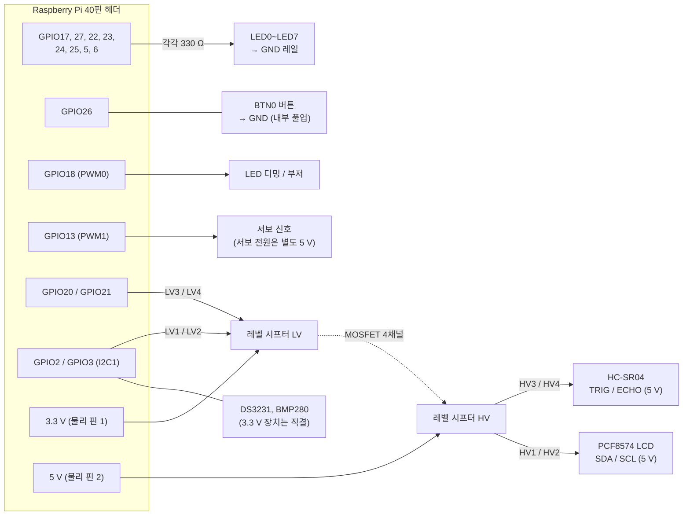
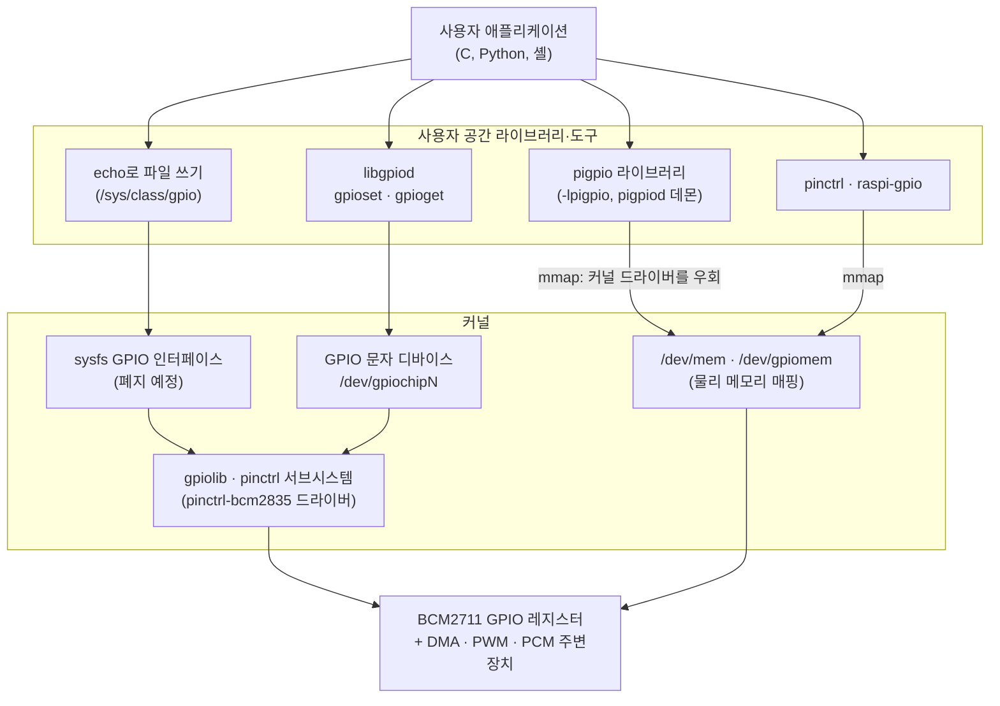
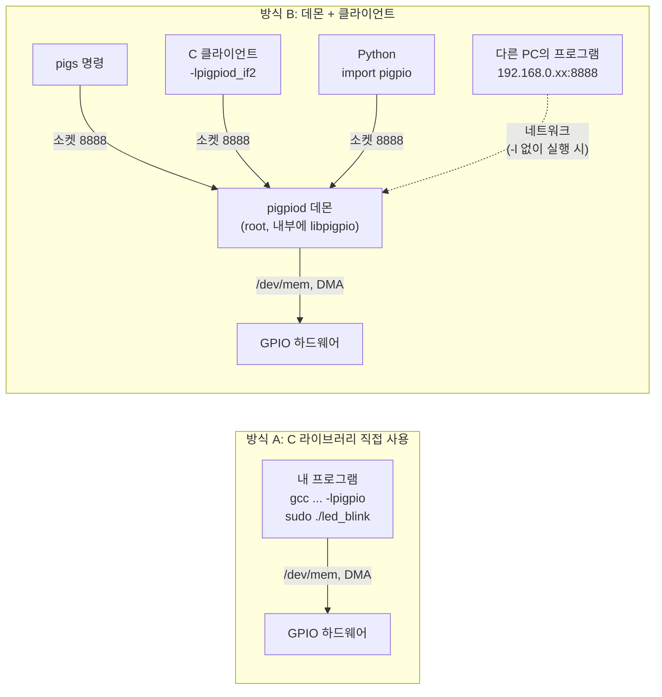

# 8장. GPIO 기초와 pigpio

> **학습 목표**
> - GPIO의 입력·출력 동작과 Raspberry Pi 4의 전기적 한계(3.3 V 논리, 5 V 비허용, 핀당 수 mA)를 설명할 수 있다.
> - 40핀 헤더에서 전원·GND·GPIO·I2C·SPI·UART·PWM 핀을 찾고, BCM 번호와 물리 핀 번호를 서로 바꿀 수 있다.
> - push-pull/open-drain 출력 구조, 플로팅 입력과 풀업·풀다운 저항의 필요성을 이해하고, LED 전류 제한 저항을 계산할 수 있다.
> - Linux GPIO 소프트웨어 스택(sysfs → libgpiod → pigpio)에서 각 방법이 하드웨어에 닿는 경로를 그림으로 설명할 수 있다.
> - pigpio의 두 가지 사용 방식(C 라이브러리 직접 접근과 pigpiod 데몬 + 클라이언트)을 구분하고, 상황에 맞게 빌드·실행할 수 있다.
> - `pigs`, `pinctrl`, pigpio C API로 LED와 버튼을 제어하고, Ctrl+C로 깔끔하게 종료하는 프로그램을 작성할 수 있다.

[7장](07_boot_kernel.md)까지 리눅스가 어떻게 부팅되고 커널이 하드웨어를 관리하는지 보았다. 이 장부터는 그 위에서 실제로 **핀 하나를 High/Low로 움직이는 일**을 한다. 아두이노에서 `pinMode()`, `digitalWrite()`로 하던 일을 이제는 운영체제가 있는 컴퓨터에서 한다. 차이는 "누가 하드웨어 레지스터를 만지는가"이다. 마이크로컨트롤러에서는 내 프로그램이 직접 만졌지만, 리눅스에서는 커널이 하드웨어를 관리하므로 **어떤 경로로 레지스터에 닿는지**를 먼저 알아야 한다. 이 장은 그 경로를 정리하고, 강의에서 사용하는 **pigpio** 라이브러리로 기본 입출력을 익힌다. 인터럽트·PWM·서보는 [9장](09_pigpio_advanced.md)에서, 오실로스코프와 로직 분석기로 파형을 확인하는 방법은 [10장](10_measurement.md)에서 다룬다.

## 8.1 GPIO란 무엇인가

**GPIO**(General Purpose Input/Output, 범용 입출력)는 용도가 정해져 있지 않은 디지털 핀이다. 소프트웨어로 **입력**(input)으로 설정하면 외부 전압이 High인지 Low인지 읽고, **출력**(output)으로 설정하면 핀 전압을 High 또는 Low로 만든다. 대부분의 GPIO는 여기에 더해 UART·I2C·SPI·PWM 같은 **대체 기능**(alternate function, ALT0~ALT5)으로 바꿔 쓸 수 있다. BCM2711에서는 핀마다 3비트 기능 선택 필드(GPFSELn 레지스터)가 있어 입력(000), 출력(001), ALT0~ALT5 중 하나를 고른다.

| 방향 | 하는 일 | 예 |
|---|---|---|
| 출력 | 핀을 3.3 V(High) 또는 0 V(Low)로 만든다 | LED, 릴레이 모듈 입력, 부저 |
| 입력 | 핀 전압이 기준보다 높은지 낮은지 읽는다 | 버튼, 리밋 스위치, 센서의 디지털 출력 |
| 대체 기능 | SoC 내부 주변장치(UART, I2C, SPI, PWM)에 핀을 연결한다 | [12장](12_communication.md)의 통신 |

### 8.1.1 논리 레벨: 3.3 V, 5 V 금지

Raspberry Pi의 GPIO는 **3.3 V 논리**이다. 출력 High는 3.3 V, Low는 0 V이고, 입력도 3.3 V까지만 견딘다(3.3 V-tolerant). 아두이노 우노처럼 5 V로 동작하는 장치의 출력을 GPIO에 바로 연결하면 SoC가 손상될 수 있다. 5 V 장치와 신호를 주고받아야 할 때는 **레벨 시프터**(level shifter)를 거친다. 이 교재는 4채널 양방향 BSS138 모듈을 표준으로 쓰며(8.2.4절), 초음파 센서 HC-SR04의 TRIG/ECHO([9장](09_pigpio_advanced.md))와 5 V I2C LCD 모듈([12장](12_communication.md))이 대표적인 사용처이다. 저항 분압기는 시프터가 없을 때 5 V 출력을 받기만 하는 선에 쓰는 대안이다. 헤더에 5 V 핀이 있다고 해서 GPIO가 5 V를 견디는 것은 아니다. 5 V 핀은 전원 공급용이다.

> 📌 **보강: Pi 4(BCM2711) GPIO 전기적 사양** — 출처: [Raspberry Pi Documentation, GPIO and the 40-pin header](https://www.raspberrypi.com/documentation/computers/raspberry-pi.html#gpio)
>
> | 기호 | 항목 | 조건 | 값 |
> |---|---|---|---|
> | V<sub>IL</sub> | 입력 Low로 인정되는 최대 전압 | | 0.8 V 이하 |
> | V<sub>IH</sub> | 입력 High로 인정되는 최소 전압 | 히스테리시스 켬 | 2.0 V 이상 |
> | V<sub>OL</sub> | 출력 Low 전압 | I<sub>OL</sub> = 4 mA, 기본 구동 세기 | 0.4 V 이하 |
> | V<sub>OH</sub> | 출력 High 전압 | I<sub>OH</sub> = 4 mA, 기본 구동 세기 | 2.6 V 이상 |
> | I<sub>OL</sub>, I<sub>OH</sub> | 출력 전류 | 최대 구동 세기(8 mA) | 최소 7 mA |
> | R<sub>PU</sub>, R<sub>PD</sub> | 내부 풀업·풀다운 저항 | | 33~73 kΩ |
>
> 같은 문서는 "구동 세기(drive strength)는 전류 제한값이 아니라, 그 전류까지는 V<sub>OH</sub>/V<sub>OL</sub> 사양을 지킨다는 뜻"이라고 설명한다. 또 3.3 V 전원은 GPIO 핀당 약 3 mA를 기준으로 설계되었으므로, 여러 핀에 큰 전류를 동시에 흘리면 3.3 V 레일이 흔들려 SD 카드나 메모리 동작까지 방해할 수 있다고 경고한다.
>
> **"기본 4 mA"와 "8 mA"가 함께 보이는 이유(📌 보강).** 패드 레지스터(`PADS`, GPIO0~27)의 구동 세기 필드(`DRIVE`, 3비트)는 리셋 값이 **3**이다. 공식 문서의 「GPIO pads control」 표는 이 값을 0 = 2 mA … 3 = 8 mA … 7 = 16 mA로 적지만, 같은 절에 "4-series(Pi 4) 장치에서는 전류 값이 그림의 절반"이라는 경고가 있다. 그래서 Pi 4에서 리셋 값 3은 **4 mA**, 가장 큰 값 7은 **8 mA**이고, 이것이 위 표의 "기본 4 mA·최대 8 mA"와 맞는다. pigpio의 `gpioGetPad`/`pigs padg`는 Pi 4에서도 이전 세대 눈금(값 × 2 + 2)으로 환산하므로, 레지스터가 리셋 값 그대로라면 **8**을 돌려준다. 그런데 이 교재의 실습용 Pi 4(Bookworm, 2025년 8월 펌웨어)에서 `pigs padg 0`을 실행해 보니 **16**이 나왔다. 레지스터를 직접 읽어도 `DRIVE` 필드가 7(최대)이었다. `config.txt`에는 패드 설정이 없었으므로 펌웨어가 부팅 중에 최대값으로 바꿔 두는 것으로 보인다(이 Pi는 오래 켜 둔 상태였으므로 단정할 수는 없다). 즉 **표의 "기본 4 mA"는 칩의 리셋 값 기준이고, 실제 부팅된 Pi에서는 이미 최대(Pi 4 기준 8 mA)로 설정되어 있을 수 있다.** 내 Pi의 값은 `pigs padg 0`으로 직접 확인한다([10장](10_measurement.md) 실습 10-2). 한편 「Raspberry Pi 4 Model B Datasheet」(Release 1.1, 2024) 표 3은 이전 세대와 같은 "기본 8 mA·최대 16 mA"를 적고 있어 공식 자료끼리 표기가 다르다. 이 교재는 BCM2711용으로 따로 정리된 공식 문서 표(기본 4 mA·최대 8 mA)를 따른다. 출처: [GPIO pads control (raspberrypi/documentation)](https://github.com/raspberrypi/documentation/blob/master/documentation/asciidoc/computers/raspberry-pi/gpio-pad-controls.adoc), [GPIO 전기적 사양 (raspberrypi/documentation)](https://github.com/raspberrypi/documentation/blob/master/documentation/asciidoc/computers/raspberry-pi/gpio-on-raspberry-pi.adoc), [pigpio `gpioGetPad` 소스](https://github.com/joan2937/pigpio/blob/master/pigpio.c), [Raspberry Pi 4 Model B Datasheet](https://datasheets.raspberrypi.com/rpi4/raspberry-pi-4-datasheet.pdf)

**전류는 얼마까지 흘려도 되는가?** 강의 자료(Raspberry Pi Codes §4.6)에는 "핀당 18 mA, 전체 50 mA"라고 적혀 있다. 이 수치는 이전 세대(BCM2835 계열)의 최대 구동 세기 표와 커뮤니티에서 오래 쓰인 경험값에서 온 것으로, Pi 4의 공식 사양은 아니다. Pi 4에서 공식적으로 보장하는 값은 위 표처럼 **기본 4 mA, 최대 설정 8 mA**에서의 전압 레벨이다. 이 교재에서는 다음을 기준으로 삼는다.

- LED 하나에는 **2~5 mA**만 흘린다. 요즘 LED는 이 정도로도 충분히 밝다.
- 여러 핀을 동시에 켤 때는 합계 전류를 계산해 본다.
- 모터, 릴레이 코일, 전구처럼 수십 mA 이상 필요한 부하는 GPIO로 직접 구동하지 않고 트랜지스터·MOSFET·모터 드라이버를 거친다.

## 8.2 40핀 헤더와 핀 번호 체계

### 8.2.1 핀 맵

Raspberry Pi 4의 40핀 헤더는 2.54 mm 간격의 2열 핀이다. SD 카드 쪽이 위가 되도록 놓았을 때 왼쪽 열이 홀수(1, 3, …, 39), 오른쪽 열이 짝수(2, 4, …, 40)이다. 1번 핀은 기판에서 사각형 패드로 표시되어 있다.

| 기능 | BCM | **물리 핀** | **물리 핀** | BCM | 기능 |
|---|---|:-:|:-:|---|---|
| 3.3 V 전원 | — | **1** | **2** | — | 5 V 전원 |
| I2C1 SDA | GPIO2 | **3** | **4** | — | 5 V 전원 |
| I2C1 SCL | GPIO3 | **5** | **6** | — | GND |
| GPCLK0 | GPIO4 | **7** | **8** | GPIO14 | UART TXD |
| GND | — | **9** | **10** | GPIO15 | UART RXD |
| (범용) | GPIO17 | **11** | **12** | GPIO18 | PWM0, PCM_CLK |
| (범용) | GPIO27 | **13** | **14** | — | GND |
| (범용) | GPIO22 | **15** | **16** | GPIO23 | (범용) |
| 3.3 V 전원 | — | **17** | **18** | GPIO24 | (범용) |
| SPI0 MOSI | GPIO10 | **19** | **20** | — | GND |
| SPI0 MISO | GPIO9 | **21** | **22** | GPIO25 | (범용) |
| SPI0 SCLK | GPIO11 | **23** | **24** | GPIO8 | SPI0 CE0 |
| GND | — | **25** | **26** | GPIO7 | SPI0 CE1 |
| ID EEPROM SDA (예약) | GPIO0 | **27** | **28** | GPIO1 | ID EEPROM SCL (예약) |
| (범용) | GPIO5 | **29** | **30** | — | GND |
| (범용) | GPIO6 | **31** | **32** | GPIO12 | PWM0 |
| PWM1 | GPIO13 | **33** | **34** | — | GND |
| PWM1, PCM_FS | GPIO19 | **35** | **36** | GPIO16 | (범용) |
| (범용) | GPIO26 | **37** | **38** | GPIO20 | PCM_DIN |
| GND | — | **39** | **40** | GPIO21 | PCM_DOUT |

강의 슬라이드의 분류로 다시 정리하면 다음과 같다.

| 분류 | 핀 |
|---|---|
| 3.3 V 전원 | 물리 1, 17 |
| 5 V 전원 | 물리 2, 4 |
| GND | 물리 6, 9, 14, 20, 25, 30, 34, 39 |
| 범용 GPIO | GPIO2~GPIO27 (GPIO0/1은 HAT용 EEPROM 예약) |
| I2C1 | SDA = GPIO2 (물리 핀 3), SCL = GPIO3 (물리 핀 5) |
| SPI0 | MOSI = GPIO10 (물리 핀 19), MISO = GPIO9 (물리 핀 21), SCLK = GPIO11 (물리 핀 23), CE0 = GPIO8 (물리 핀 24), CE1 = GPIO7 (물리 핀 26) |
| UART | TXD = GPIO14 (물리 핀 8), RXD = GPIO15 (물리 핀 10) |
| 하드웨어 PWM | GPIO12, GPIO13, GPIO18, GPIO19 (PWM0/PWM1 두 채널을 나눠 씀) |

이 장의 실습에서는 다음 핀을 쓴다. 모두 8.2.4절 **이 교재의 표준 배선**에서 가져온 것이며, UART 콘솔([3장](03_rpi_hw_os.md))에 쓰는 GPIO14/15와 I2C·SPI 핀은 피했다.

| 용도 | 핀 |
|---|---|
| LED0 (실습 8-1, 8-2, 8-3, 8-5, 8-6) | GPIO17 (물리 핀 11) |
| BTN0 버튼 (실습 8-3) | GPIO26 (물리 핀 37), 반대쪽은 GND (물리 핀 39) |
| LED0~LED7 8개 (실습 8-4) | GPIO17, 27, 22, 23, 24, 25, 5, 6 (물리 핀 11, 13, 15, 16, 18, 22, 29, 31) |
| 공통 GND | 물리 핀 9, 14, 39 등 아무 GND 핀 |

### 8.2.2 핀 번호 체계: BCM과 물리 핀

같은 핀을 부르는 번호가 여러 가지라서 처음에 가장 많이 헷갈린다. 강의에서 예로 든 물리 3번 핀은 BCM으로는 2번이고, WiringPi 번호로는 8번이다.

| 번호 체계 | 무엇을 기준으로 하나 | 물리 핀 11의 이름 | 쓰는 곳 |
|---|---|---|---|
| **BCM**(Broadcom) | SoC 내부 GPIO 번호 | **GPIO17** | pigpio, libgpiod, pinctrl, gpiozero, 커널 |
| **물리 핀**(physical, BOARD) | 헤더 위치 1~40 | **11** | 배선할 때, `pinctrl -p` |
| wPi(WiringPi) | WiringPi 고유 번호 | 0 | WiringPi(원작자 지원 종료, [부록 B](appendix_b_gpio_libraries.md)) |

**pigpio는 BCM 번호만 쓴다.** `gpioWrite(17, 1)`은 물리 17번 핀이 아니라 GPIO17, 즉 물리 11번 핀을 High로 만든다. 이 교재는 혼동을 막기 위해 항상 `GPIO17 (물리 핀 11)`처럼 두 번호를 같이 적는다. WiringPi의 `gpio readall` 표와 wPi 번호는 기존 강의 예제를 읽을 때만 필요하므로 [부록 B](appendix_b_gpio_libraries.md)에 대응표를 두었다.

**핀 맵을 Pi에서 바로 보기.** Raspberry Pi OS에는 핀 맵을 터미널에 그려 주는 `pinout` 명령이 있다.

```bash
pinout            # 보드 그림 + 40핀 헤더 표(BCM 번호와 물리 핀 번호)
pinout -m         # 단색 출력 (터미널 색이 깨질 때)
```

> 📌 **보강:** `pinout` 명령은 GPIO Zero 파이썬 라이브러리가 제공하며 Raspberry Pi OS에 기본 설치되어 있다. 출처: [Raspberry Pi Documentation – View a GPIO pinout](https://www.raspberrypi.com/documentation/computers/raspberry-pi.html#gpio)

### 8.2.3 그라운드는 반드시 공통으로

전압은 언제나 **어떤 기준점에 대해 얼마나 높은가**이다. 한쪽 기기의 기준이 1 V이고 다른 쪽이 0 V라면, 둘 다 "3 V"라고 말해도 실제 전위차는 다르다. 그 기준점이 **그라운드**(GND)이다. 전기에서 말하는 그라운드는 보통 대지 접지(earth)이지만, 배터리로 동작하는 휴대 기기의 그라운드는 배터리 (−) 단자이므로 서로 다를 수 있다.

그래서 Raspberry Pi와 다른 장치(버튼 회로, 센서 모듈, Analog Discovery 2, 아두이노 등)를 신호선으로 연결할 때는 **반드시 GND끼리도 연결**한다. "UART는 2가닥, I2C는 2가닥, SPI는 4가닥"이라는 말은 GND를 당연히 연결한다는 전제에서 GND를 빼고 센 것이다. 12주차 수업에서 `pigs r 23`(당시 수업 배선의 GPIO23. 이 교재의 표준 배선에서는 LED3 자리)이 Analog Discovery 2의 출력을 바꿔도 계속 0으로 읽힌 사례가 있었는데, 이럴 때 점검할 항목(배선 번호, 출력 장치 상태, 풀업·풀다운 설정) 가운데 GND 공통 연결이 빠지지 않는다.

### 8.2.4 이 교재의 표준 배선

**왜 필요한가.** 실습마다 LED와 버튼을 다른 핀에 꽂으면 매번 브레드보드를 뜯어 다시 배선해야 한다. 더 큰 문제는 앞 실습의 선이 남은 채 다음 실습을 시작할 때이다. 한 핀을 두 부품이 나눠 쓰면, 한쪽은 출력으로 High를 내고 다른 쪽은 Low를 내는 **출력 충돌**이 생겨 핀이 손상될 수 있다. 그래서 이 교재는 **책 전체에서 하나의 핀 계획**만 쓴다. 집 안의 전등 스위치가 늘 같은 자리에 있어야 어두운 데서도 손이 가듯이, 핀 역할을 한 번 정해 두면 코드의 `#define`만 보고도 어디에 꽂혀 있는지 안다.

**규칙은 세 가지이다.**

1. **한 핀 = 한 역할.** 아래 표에 적힌 역할 외의 용도로 핀을 쓰지 않는다.
2. **한 번 꽂은 부품은 그대로 둔다.** LED 8개, 버튼, 레벨 시프터는 학기 내내 브레드보드에 그대로 두어도 다른 실습과 핀이 겹치지 않는다. 다만 핀에 **아무것도 달리지 않은 상태**를 재야 하는 실습(예: [10장](10_measurement.md) 실습 10-2의 무부하 전압, 실습 10-8의 AD2 구동 입력)이나 이 장의 플로팅 실험처럼, 본문이 "빼라"고 하는 경우에만 해당 부품을 잠시 뺀다.
3. **예외는 본문에 "⚠ 핀 예외" 상자로만 나온다.** 그 상자가 보이면 상자가 시키는 배선을 빼고 실습한 뒤 원래대로 되돌린다.

**표준 배선표** (브레드보드에 꽂는 순서대로 묶었다)

| 묶음 | 역할 | BCM (물리 핀) | 연결 방법 | 처음 쓰는 곳 | AD2 DIO([10장](10_measurement.md)) |
|---|---|---|---|---|---|
| 전원 레일 | 3.3 V / 5 V / GND | 물리 1·17 / 2·4 / 6·9·14·20·25·30·34·39 | 브레드보드 위쪽 레일에 3.3 V와 GND, 아래쪽 레일에 5 V와 GND. **3.3 V와 5 V 레일을 섞지 않는다** | 8장 | GND 공통 |
| LED 바 | LED0 (빨강) | GPIO17 (물리 핀 11) | GPIO → 330 Ω → LED 애노드, 캐소드 → GND 레일 | 실습 8-1 (기본 LED) | DIO0 |
| | LED1 (노랑) | GPIO27 (물리 핀 13) | 위와 같다 | 실습 8-4, 9장 웨이브폼 마커 | DIO3 |
| | LED2 (초록) | GPIO22 (물리 핀 15) | 위와 같다 | 실습 8-4 | |
| | LED3 ~ LED7 | GPIO23 / 24 / 25 / 5 / 6 (물리 핀 16 / 18 / 22 / 29 / 31) | 위와 같다 | 실습 8-4 | |
| 버튼 | BTN0 | GPIO26 (물리 핀 37) | 버튼 한쪽 → GPIO26, 다른 쪽 → GND (물리 핀 39). **내부 풀업**, 누르면 0 (active-low) | 실습 8-3 | DIO2 |
| PWM | 하드웨어 PWM0 | GPIO18 (물리 핀 12) | 330 Ω + LED(디밍) 또는 수동 부저(톤) | [9장](09_pigpio_advanced.md) 실습 9-4 | DIO1 |
| 서보 | 서보 신호 (PWM1) | GPIO13 (물리 핀 33) | 신호선만 Pi에. 서보 전원은 **별도 5 V**, GND 공통 | 9장 실습 9-5 | DIO7 |
| 레벨 시프터 | HC-SR04 TRIG / ECHO | GPIO20 / GPIO21 (물리 핀 38 / 40) | **레벨 시프터 경유**(아래 상자). 직결 금지 | 9장 실습 9-6 | |
| 센서 | DHT11 / RHT03 데이터 | GPIO4 (물리 핀 7) | 센서 전원 3.3 V, 데이터선 풀업 | [부록 B](appendix_b_gpio_libraries.md) | |
| RTC | DS1302 CE / SCLK / IO | GPIO12 / 19 / 16 (물리 핀 32 / 35 / 36) | 모듈 전원 3.3 V | [12장](12_communication.md) | DIO4 / 5 / 6 |
| I2C1 | SDA / SCL | GPIO2 / GPIO3 (물리 핀 3 / 5) | 3.3 V 장치(DS3231, BMP280)는 직결. **5 V 장치(PCF8574 LCD)는 레벨 시프터 경유** | [7장](07_boot_kernel.md)(켜기), 12장 | DIO15 / DIO14 |
| SPI0 | CE0 / MISO / MOSI / SCLK (CE1) | GPIO8 / 9 / 10 / 11 (GPIO7) (물리 핀 24 / 21 / 19 / 23 (26)) | MCP3008은 CE0, 전원 3.3 V | 12장 | DIO10(CS) / 13(MISO) / 12(MOSI) / 11(CLK) |
| UART | TXD / RXD | GPIO14 / GPIO15 (물리 핀 8 / 10) | USB-TTL(3.3 V) 엇갈림 연결 또는 루프백 | [3장](03_rpi_hw_os.md), 12장 | DIO8 / DIO9 |
| 예약 | 사용 금지 | GPIO0 / GPIO1 (물리 핀 27 / 28) | HAT ID EEPROM 전용. 아무것도 꽂지 않는다 | — | |

헤더 위에서 보면 다음과 같다(SD 카드 쪽이 위, 왼쪽 열이 홀수 핀). 영문 약어는 위 표의 역할 이름이다.

```text
              역할  BCM    물리  물리  BCM     역할
             3V3     -     [ 1] [ 2]   -      5V    -> 시프터 HV, HC-SR04 VCC
         I2C SDA   GPIO2   [ 3] [ 4]   -      5V
         I2C SCL   GPIO3   [ 5] [ 6]   -      GND
      DHT11 DATA   GPIO4   [ 7] [ 8] GPIO14   UART TXD
             GND     -     [ 9] [10] GPIO15   UART RXD
       LED0 (R)   GPIO17   [11] [12] GPIO18   PWM (LED dim / buzzer)
       LED1 (Y)   GPIO27   [13] [14]   -      GND
       LED2 (G)   GPIO22   [15] [16] GPIO23   LED3
             3V3     -     [17] [18] GPIO24   LED4
        SPI MOSI  GPIO10   [19] [20]   -      GND
        SPI MISO   GPIO9   [21] [22] GPIO25   LED5
        SPI SCLK  GPIO11   [23] [24] GPIO8    SPI CE0 (MCP3008)
             GND     -     [25] [26] GPIO7    SPI CE1
     (reserved)    GPIO0   [27] [28] GPIO1    (reserved)
           LED6    GPIO5   [29] [30]   -      GND
           LED7    GPIO6   [31] [32] GPIO12   DS1302 CE
     SERVO (PWM1) GPIO13   [33] [34]   -      GND
     DS1302 SCLK  GPIO19   [35] [36] GPIO16   DS1302 IO
           BTN0   GPIO26   [37] [38] GPIO20   HC-SR04 TRIG (via shifter)
             GND     -     [39] [40] GPIO21   HC-SR04 ECHO (via shifter)
```

브레드보드에서 부품이 어떻게 묶이는지는 다음 그림처럼 생각하면 된다.



> **레벨 시프터란? (5 V 장치는 모두 이것을 거친다)**
>
> **왜 필요한가.** Pi의 GPIO는 3.3 V까지만 견딘다(8.1.1절). 그런데 HC-SR04 초음파 센서나 I2C LCD 백팩처럼 **5 V로 동작하는 모듈**은 출력 High가 약 5 V이고, 입력 High로 인정받으려면 3.3 V보다 높은 전압이 필요한 경우도 있다. 두 세계 사이에서 전압을 "통역"해 주는 부품이 **레벨 시프터**(level shifter)이다. 한국어와 영어를 오가는 통역사가 양쪽 말을 다 알아야 하듯이, 레벨 시프터도 **3.3 V와 5 V 전원을 둘 다** 받아야 동작한다.
>
> **이 교재의 표준 부품**은 4채널 양방향 **BSS138** 모듈이다. 채널마다 N채널 MOSFET 하나와 양쪽 10 kΩ 풀업 저항이 들어 있어서, 어느 쪽이 Low로 끌어내려도 반대쪽이 따라 Low가 되고, 아무도 끌어내리지 않으면 양쪽이 각자의 전원 전압(3.3 V / 5 V)으로 올라간다. 그래서 방향이 정해진 신호(TRIG, ECHO)와 양방향 신호(I2C SDA)를 모두 처리한다. 동작 원리는 [12장](12_communication.md) 12.4.3절에서 자세히 다룬다.
>
> | 모듈 단자 | 연결 | 비고 |
> |---|---|---|
> | **LV** | Pi 3.3 V (물리 핀 1 또는 17) | 저전압(Low Voltage) 쪽 전원 |
> | **HV** | Pi 5 V (물리 핀 2 또는 4) | 고전압(High Voltage) 쪽 전원 |
> | **GND** (양쪽) | Pi GND | 반드시 공통 |
> | LV1 ↔ HV1, LV2 ↔ HV2 | GPIO2 SDA, GPIO3 SCL ↔ PCF8574 LCD SDA, SCL | [12장](12_communication.md) 실습 12-3 |
> | LV3 ↔ HV3 | GPIO20 ↔ HC-SR04 TRIG | [9장](09_pigpio_advanced.md) 실습 9-6 |
> | LV4 ↔ HV4 | GPIO21 ↔ HC-SR04 ECHO | 9장 실습 9-6 |
>
> **흔한 실수.** ① LV와 HV를 바꿔 꽂으면 Pi 쪽에 5 V가 걸린다. 모듈 기판의 LV/HV 글자를 확인한다. ② LV 전원을 빼먹으면 Pi 쪽 신호가 제대로 올라가지 않는다. ③ 3.3 V 장치(DS3231, BMP280, 3.3 V로 켠 MCP3008)는 시프터가 **필요 없다**. 직결한다. ④ 시프터가 없을 때 **5 V 출력을 받기만 하는 선**(ECHO 등)은 저항 분압기(1 kΩ/2 kΩ)로 대신할 수 있지만, 양방향인 I2C에는 쓸 수 없다([9장](09_pigpio_advanced.md) 9.6.2절, 12장).

**⚠ 핀 예외는 세 가지뿐이다.** 해당 실습에서 상자가 다시 안내한다.

| 예외 | 빼는 배선 | 대신 쓰는 핀 | 나오는 곳 |
|---|---|---|---|
| DS3231 SQW 인터럽트 | BTN0 버튼 | SQW → GPIO26 | [12장](12_communication.md) |
| 로터리 엔코더 (선택) | LED6, LED7 | 엔코더 A/B → GPIO5/GPIO6 | [9장](09_pigpio_advanced.md) 9.7절 |
| JTAG 디버깅 (심화) | LED1~LED5, BTN0 (GPIO22~27) | JTAG 신호 | [7장](07_boot_kernel.md) 7.3절 |

## 8.3 출력 구동 방식과 입력 회로

### 8.3.1 출력 드라이버: push-pull과 open-drain

디지털 출력 핀 안에는 핀을 전원 쪽으로 끌어올리는 스위치(위쪽 트랜지스터)와 GND 쪽으로 끌어내리는 스위치(아래쪽 트랜지스터)가 있다. 두 스위치를 어떻게 쓰느냐에 따라 출력 방식이 나뉜다. Analog Discovery 2의 Static I/O에서 Switch 모드로 고를 수 있는 네 가지가 바로 이것이다.

| 방식 | 낼 수 있는 상태 | 동작 | 주로 쓰는 곳 |
|---|---|---|---|
| **Push-Pull** (PP) | 1 또는 0 | 위·아래 스위치 중 하나가 항상 켜져 High와 Low를 모두 세게 만든다 | 일반 GPIO 출력, LED |
| **Open-Drain** (OD) | Z 또는 0 | 아래 스위치만 있다. High 대신 끊김(Z)이 되므로 외부 풀업 저항이 High를 만든다 | I2C 버스, 여러 출력의 wired-AND |
| **Open-Source** (OS) | 1 또는 Z | 위 스위치만 있다. Low는 외부 풀다운이 만든다 | 드묾 |
| **Three-State** (TS) | 1, 0, Z | push-pull에 "끊김(고임피던스)"을 추가 | 여러 장치가 공유하는 버스 |

Z는 고임피던스(high-impedance)로, 핀이 전선에서 떨어진 것처럼 아무것도 구동하지 않는 상태이다. 입력으로 설정된 핀도 외부에서 보면 Z 상태이다.

> 📌 **보강:** Raspberry Pi 공식 문서는 GPIO 패드를 "설정 가능한 **CMOS push-pull** 출력 드라이버/입력 버퍼"라고 설명한다. 따라서 GPIO를 출력으로 설정하면 push-pull로 동작하고, 입력으로 설정하면 Z가 된다(위 표의 Three-State를 출력/입력 전환으로 구현하는 셈). open-drain이 필요하면 소프트웨어로 흉내 낸다. 즉 "0을 낼 때는 출력 Low, 1을 낼 때는 입력으로 전환(Z)"하고 외부 풀업이 High를 만들게 한다. I2C 핀(GPIO2/3)은 I2C 주변장치가 이 동작을 하드웨어로 처리한다. 출처: [Raspberry Pi Documentation – GPIO pads](https://www.raspberrypi.com/documentation/computers/raspberry-pi.html#gpio-pads)

### 8.3.2 LED 연결과 전류 제한 저항

LED는 한 방향(애노드 → 캐소드)으로만 전류가 흐르는 다이오드이다. 다리가 긴 쪽이 애노드(+), 짧은 쪽이 캐소드(−)이다. LED는 켜지면 양단 전압이 거의 일정(순방향 전압 V<sub>F</sub>)하므로, 저항 없이 연결하면 전류가 GPIO 드라이버가 낼 수 있는 만큼 흘러 버린다. 그래서 **반드시 직렬 저항**을 둔다.


저항값은 옴의 법칙으로 구한다.

$$ R = \frac{V_{OH} - V_F}{I_{LED}} $$

| LED 색 | V<sub>F</sub> (대략) | 330 Ω일 때 전류 | 1 kΩ일 때 전류 |
|---|---|---|---|
| 빨강 | 1.8~2.0 V | (3.3 − 2.0) / 330 ≈ **3.9 mA** | ≈ 1.3 mA |
| 초록(일반) | 2.0~2.2 V | ≈ 3.3 mA | ≈ 1.1 mA |
| 파랑·흰색 | 2.8~3.2 V | ≈ 0.3~1.5 mA (어둡다) | 거의 안 켜짐 |

빨간 LED를 4 mA로 켜려면 R = (3.3 − 2.0) / 0.004 ≈ 325 Ω이므로 표준값 **330 Ω**을 쓴다. 220 Ω이면 약 6 mA로 조금 더 밝다. 파랑·흰색 LED는 V<sub>F</sub>가 3.3 V에 가까워 GPIO로는 어둡게 켜지거나 안 켜질 수 있으니 실습에는 빨강·초록을 권한다. 실제 전류는 출력 전압이 부하에 따라 조금 내려가므로(V<sub>OH</sub> ≥ 2.6 V @ 4 mA) 계산값보다 약간 작다.

LED를 GPIO와 3.3 V 사이에 거꾸로 달 수도 있다(**싱크**(sink) 방식: 3.3 V → 저항 → LED → GPIO). 이때는 GPIO가 **Low일 때 켜진다**. 이 교재의 실습은 모두 GPIO가 전류를 내보내는 **소스**(source) 방식(GPIO → 저항 → LED → GND)이므로 High일 때 켜진다.

### 8.3.3 플로팅 입력과 풀업·풀다운

버튼을 GPIO와 3.3 V 사이에만 연결했다고 하자. 누르면 3.3 V가 들어와 1로 읽힌다. 문제는 **뗐을 때**이다. 그때 입력 핀은 아무 데도 연결되지 않은 상태, 즉 **플로팅**(floating)이 된다. 입력 회로는 임피던스가 매우 높아서 주변 잡음, 손가락이 가까이 가는 것만으로도 0과 1 사이를 오락가락한다. 그래서 입력에는 "아무것도 연결되지 않았을 때의 기본값"을 정해 주는 저항을 단다.

| 방식 | 저항 위치 | 버튼 반대편 | 뗐을 때 | 눌렀을 때 | 논리 |
|---|---|---|---|---|---|
| **풀업**(pull-up) | GPIO ↔ 3.3 V | GND | 1 | 0 | active-low |
| **풀다운**(pull-down) | GPIO ↔ GND | 3.3 V | 0 | 1 | active-high |

BCM2711은 GPIO마다 **내부 풀업과 풀다운을 모두** 가지고 있어(33~73 kΩ) 소프트웨어로 켤 수 있다. 외부 저항 없이 버튼 하나만 GPIO와 GND 사이에 달고 내부 풀업을 켜면 된다. 실습 8-3이 이 방식이다. 강의 예제 `gpio_read.c`는 풀다운을 썼지만, 버튼을 GND에 연결하는 풀업 방식이 3.3 V 핀을 브레드보드로 끌고 다니지 않아도 되어 실수로 3.3 V와 GND를 단락시킬 위험이 적다.

- GPIO2, GPIO3(I2C)에는 보드에 **고정 풀업**이 달려 있어 소프트웨어로 끌 수 없다. 버튼 입력에는 쓰지 않는다.
- 내부 풀 저항은 수십 kΩ으로 약하다. 선이 길거나 잡음이 많은 환경에서는 4.7~10 kΩ 외부 풀업을 추가한다.
- 모든 GPIO는 전원이 켜지면 입력으로 초기화되고, 핀마다 정해진 기본 풀 상태(풀업 또는 풀다운)가 적용된다. 핀마다 기본값이 다르므로, 프로그램에서 원하는 풀 상태를 항상 명시적으로 설정하는 습관을 들인다.

> 기계식 버튼은 누르거나 뗄 때 수 ms 동안 접점이 튀며 0과 1을 여러 번 오간다(**채터링**, bounce). 이 장의 폴링 예제는 5 ms 간격으로 읽어 대부분 가려지지만, 정확한 처리(디바운스)는 [9장](09_pigpio_advanced.md)에서 다룬다.

## 8.4 Linux에서 GPIO에 닿는 길: 소프트웨어 스택

마이크로컨트롤러에서는 프로그램이 GPIO 레지스터에 바로 값을 쓴다. 리눅스에서는 사용자 프로그램이 물리 주소에 마음대로 접근할 수 없으므로, 커널이 마련한 통로를 거치거나 특별한 권한으로 레지스터를 메모리에 매핑해야 한다. 이 차이가 라이브러리마다 성능, 권한(sudo), 이식성이 다른 이유이다.



| 구분 | sysfs (구 방식) | libgpiod (현재 표준) | pigpio |
|---|---|---|---|
| 경로 | `/sys/class/gpio/export`, `/sys/class/gpio/gpioN/value` | `/dev/gpiochipN` 문자 디바이스 | `/dev/mem`을 mmap하여 레지스터 직접 접근 + DMA |
| 커널 경유 | 예 | 예 | **아니요**(커널 GPIO 드라이버 우회) |
| 단위 | 전역 GPIO 번호 | 칩(gpiochip) + 오프셋(line) | BCM 번호 |
| 도구 | `echo`, `cat` | `gpiodetect`, `gpioinfo`, `gpioset`, `gpioget` | `pigs`, C/Python API |
| 상태 | 폐지 예정(deprecated) | Linux 표준 | Pi 0~4 전용, 2021년 v79 이후 새 릴리스 없음 |
| 장점 | 셸만으로 가능 | 이식성, 커널이 핀 소유권 관리 | 빠름, μs 단위 타이밍, 모든 핀 PWM, 원격 제어 |

**sysfs**는 "리눅스는 모든 것을 파일로 다룬다"는 철학을 그대로 보여 주는 방식이다. `export`에 번호를 쓰면 `gpioN` 디렉터리가 생기고, `direction`에 `out`, `value`에 `1`을 쓰면 핀이 High가 된다.

```bash
# (참고용) sysfs 방식. 최신 커널에서는 번호가 다르므로 그대로는 실패할 수 있다.
echo 17 | sudo tee /sys/class/gpio/export
echo out | sudo tee /sys/class/gpio/gpio17/direction
echo 1   | sudo tee /sys/class/gpio/gpio17/value
echo 17 | sudo tee /sys/class/gpio/unexport
```

`sudo echo 1 > 파일`은 권한 오류가 난다. 리다이렉션(`>`)은 sudo가 아닌 현재 셸이 처리하기 때문이다. 그래서 `echo … | sudo tee 파일` 형태를 쓴다([4장](04_linux_shell.md)).

> 📌 **보강: sysfs 번호 오프셋.** 최근 Raspberry Pi OS 커널에서는 sysfs의 전역 GPIO 번호에 칩 기준 번호(base)가 더해져(예: base가 512이면 GPIO17 → 529) `echo 17 > export`가 `Invalid argument`로 실패할 수 있다. `cat /sys/class/gpio/gpiochip*/base`로 기준 번호를 확인한다. 이처럼 전역 번호가 고정되지 않는 문제가 sysfs가 폐지(obsolete)된 이유 중 하나이며, 커널 문서는 새 코드에 문자 디바이스(libgpiod)를 쓰라고 권한다. 출처: [Linux kernel – GPIO Sysfs Interface for Userspace (obsolete)](https://docs.kernel.org/userspace-api/gpio/sysfs.html)

**libgpiod**는 커널이 제공하는 문자 디바이스 `/dev/gpiochipN`을 쓰는 표준 방식이다. 커널이 "이 핀은 누가 쓰고 있다"를 관리하므로 두 프로그램이 같은 핀을 동시에 잡으면 오류(`Device or resource busy`)로 알려 준다(📌 보강, 출처: [Linux kernel – GPIO Character Device Userspace API](https://docs.kernel.org/userspace-api/gpio/chardev.html)). Pi 5처럼 하드웨어가 바뀌어도 그대로 동작한다. 자세한 C API는 [부록 B](appendix_b_gpio_libraries.md)에서 다루고, 이 장에서는 실습 8-6에서 명령줄 도구만 써 본다.

**pigpio**는 커널의 GPIO 드라이버를 거치지 않고 `/dev/mem`으로 BCM2711의 주변장치 레지스터를 사용자 공간에 직접 매핑한다. 거기에 DMA 컨트롤러로 PWM·PCM 주변장치를 구동해, 운영체제의 스케줄링과 무관하게 마이크로초 단위의 정확한 펄스와 샘플링을 만든다. 강의에서 pigpio를 고른 이유가 이것이다. 대가는 두 가지이다.

1. **root 권한**이 필요하다(`/dev/mem` 접근).
2. 커널은 pigpio가 핀을 쓰고 있다는 사실을 **모른다**. libgpiod나 pinctrl로 같은 핀을 건드려도 아무 경고가 없고, 나중에 쓴 쪽이 이긴다. 한 핀은 한 가지 방법으로만 제어한다.

## 8.5 pigpio의 구조: 라이브러리와 데몬

pigpio는 [abyz.me.uk](https://abyz.me.uk/rpi/pigpio/)의 joan2937이 만든 라이브러리로, **하나의 엔진을 두 가지 방식으로** 쓸 수 있다.



- **방식 A**: 내 프로그램이 `libpigpio`를 링크하고 `gpioInitialise()`를 부르면, 내 프로세스 자신이 하드웨어를 직접 잡는다. 가장 빠르고 데몬이 필요 없지만 `sudo`로 실행해야 한다.
- **방식 B**: `pigpiod` 데몬이 방식 A의 프로그램처럼 하드웨어를 잡고 있고, 다른 프로그램들은 소켓(기본 포트 8888)이나 파이프(`/dev/pigpio`)로 데몬에게 **명령을 보내는 클라이언트**가 된다. 클라이언트는 하드웨어를 직접 만지지 않으므로 sudo가 필요 없고, 데몬이 원격 접속을 허용하면(8.6절 `-l` 옵션 참고) 네트워크 너머 다른 컴퓨터에서도 제어할 수 있다. `pigs`, `pigpiod_if2` C 라이브러리, Python `pigpio` 모듈이 모두 이 방식이다.

[1장](01_embedded_system.md)의 식당 비유로 보면, 방식 A는 내가 직접 주방에 들어가 요리하는 것이고, 방식 B는 주방(하드웨어)은 요리사(데몬) 한 명만 들어가고 손님들(클라이언트)은 주문서(명령)를 넣는 것이다. 주방에 요리사가 둘 들어가면 충돌하듯, **pigpio 엔진은 한 시스템에 하나만** 돌 수 있다. pigpio는 시작할 때 `/var/run/pigpio.pid` 파일을 잠그는데, 이미 다른 인스턴스(대개 pigpiod)가 잠가 두었으면 다음과 같이 실패한다.

> 출력 출처: Pi 4 실기기 실행 결과(2026-10). pigpiod가 실행 중인 상태에서 실행했다.

```text
$ sudo ./led_blink
2026-10-06 13:28:16 initInitialise: Can't lock /var/run/pigpio.pid
pigpio 초기화 실패: sudo로 실행했는지, pigpiod가 떠 있지 않은지 확인하라.
```

> **원본 자료 정정**
> - 강의 자료(Raspberry Pi Codes §7.1)에는 "C에서 `gpioSetMode()`, `gpioWrite()`를 호출하면 이미 실행 중인 pigpiod 데몬에 명령을 전송한다"고 되어 있으나 **틀렸다**. `-lpigpio`로 링크한 C 프로그램은 데몬과 통신하지 않고 **하드웨어에 직접 접근**한다. 바로 그 때문에 데몬이 떠 있으면 위의 lock 충돌이 난다. 데몬에 명령을 보내는 C 라이브러리는 `pigpiod_if2`(`-lpigpiod_if2`)이고 함수 이름도 다르다(`gpioWrite` ↔ `gpio_write`).
> - 같은 자료와 `Pigpio/pigpio_demo1.c`는 `gpioCfgSetInternals(0)`을 "데몬을 거치지 않는 로컬 모드 설정(필수)"이라고 설명하지만, 이 함수는 디버그 레벨·시그널 처리 여부 같은 **내부 설정 비트를 지정**할 뿐이다. 0을 넣으면 그 비트들을 모두 끈다. 로컬/데몬 모드를 고르는 기능은 없으며 필요하지도 않다. 이 장의 예제에서는 뺐다.
> - Linux 백서의 버튼 예제는 `gpioSetPullUpDown()`을, Codes 문서는 `gpioSetPullUpDn()`을 쓴다. `pigpio.h`에 선언된 이름은 <strong>`gpioSetPullUpDown`</strong>이다. 틀린 이름을 쓰면 `implicit declaration` 경고 후 링크 단계에서 `undefined reference` 오류가 난다.
> - Python 클라이언트(`import pigpio`)도 데몬 클라이언트이므로 **sudo가 필요 없다**. 데몬만 켜져 있으면 된다.

### 8.5.1 네 가지 인터페이스 비교

| 항목 | C 라이브러리 | C 데몬 클라이언트 | `pigs` | Python |
|---|---|---|---|---|
| 방식 | A (직접) | B (클라이언트) | B (클라이언트) | B (클라이언트) |
| 헤더/모듈 | `pigpio.h` | `pigpiod_if2.h` | — | `import pigpio` |
| 링크 | `-lpigpio -lrt -pthread` | `-lpigpiod_if2 -lrt -pthread` | — | — |
| 초기화 / 종료 | `gpioInitialise()` / `gpioTerminate()` | `pi = pigpio_start(host, port)` / `pigpio_stop(pi)` | — | `pi = pigpio.pi()` / `pi.stop()` |
| 모드 설정 | `gpioSetMode(17, PI_OUTPUT)` | `set_mode(pi, 17, PI_OUTPUT)` | `pigs m 17 w` | `pi.set_mode(17, pigpio.OUTPUT)` |
| 쓰기 | `gpioWrite(17, 1)` | `gpio_write(pi, 17, 1)` | `pigs w 17 1` | `pi.write(17, 1)` |
| 읽기 | `gpioRead(26)` | `gpio_read(pi, 26)` | `pigs r 26` | `pi.read(26)` |
| 풀업/풀다운 | `gpioSetPullUpDown(26, PI_PUD_UP)` | `set_pull_up_down(pi, 26, PI_PUD_UP)` | `pigs pud 26 u` | `pi.set_pull_up_down(26, pigpio.PUD_UP)` |
| sudo | **필요** | 불필요 | 불필요 | 불필요 |
| pigpiod | **꺼져 있어야 함** | **켜져 있어야 함** | 켜져 있어야 함 | 켜져 있어야 함 |
| 속도 | 가장 빠름(함수 호출) | 명령마다 소켓 왕복 | 명령마다 프로세스 실행 + 소켓 | 소켓 왕복 |
| 원격 제어 | 불가 | 가능 | 가능(`PIGPIO_ADDR=192.168.0.xx pigs …`) | 가능(`pigpio.pi('192.168.0.xx')`) |

### 8.5.2 실습별 데몬 상태

이 장의 실습은 방식 A와 B를 오간다. 실습을 시작하기 전에 아래 표대로 데몬 상태를 맞춘다.

| 실습 | 사용 방식 | pigpiod | 실행 |
|---|---|---|---|
| 8-1 pigs로 LED | B | `sudo systemctl start pigpiod` | `bash led_pigs.sh` |
| 8-2 C로 LED 점멸 | A | `sudo systemctl stop pigpiod` | `sudo ./led_blink` |
| 8-3 버튼 → LED | A | 꺼 둠 | `sudo ./button_led` |
| 8-4 LED 스윕 | A | 꺼 둠 | `sudo ./led_sweep 100` |
| 8-5 데몬 클라이언트 | B | `sudo systemctl start pigpiod` | `./led_blink_if2` |
| 8-6 libgpiod (선택) | 커널 경유 | 상관없음(단 GPIO17을 쓰는 다른 프로그램은 종료) | `bash led_gpiod.sh` |

## 8.6 pigpio 설치와 확인

Raspberry Pi OS(Bookworm)에서는 apt로 설치한다.

```bash
sudo apt update
sudo apt install pigpio            # C 라이브러리, 헤더, pigpiod, pigs 일괄 설치
sudo apt install python3-pigpio    # Python 클라이언트 (Python을 쓸 때만)
```

> 📌 **보강:** Bookworm 저장소의 `pigpio`(1.79)는 여러 패키지를 묶어 설치하는 전환용(transitional) 패키지이다. 실제로는 `libpigpio1`·`libpigpio-dev`(방식 A용 라이브러리와 `pigpio.h`), `libpigpiod-if2-1`·`libpigpiod-if-dev`(데몬 클라이언트 라이브러리와 `pigpiod_if2.h`), `pigpiod`(데몬), `pigpio-tools`(`pigs` 등)가 함께 설치된다. 출처: [archive.raspberrypi.com – bookworm Packages](https://archive.raspberrypi.com/debian/dists/bookworm/main/binary-arm64/), [pigpio Download](https://abyz.me.uk/rpi/pigpio/download.html)

설치를 확인한다.

```bash
ls /usr/include/pigpio*.h         # pigpio.h, pigpiod_if.h, pigpiod_if2.h
ls /usr/lib/*/libpigpio*          # libpigpio.so, libpigpiod_if2.so ...
pigpiod -v                         # 버전 (79)
```

데몬은 systemd 서비스로 관리한다([5장](05_sysadmin.md)).

| 하려는 일 | 명령 |
|---|---|
| 지금 켜기 / 끄기 | `sudo systemctl start pigpiod` / `sudo systemctl stop pigpiod` |
| 부팅 때 자동 실행 켜기 / 끄기 | `sudo systemctl enable pigpiod` / `sudo systemctl disable pigpiod` |
| 상태 확인 | `systemctl status pigpiod` |
| 프로세스로 확인 | `ps aux \| grep pigpiod` |
| 서비스가 아닌 방식으로 직접 띄운 데몬 종료 | `sudo killall pigpiod` |
| 데몬 응답 확인 | `pigs pigpv` (버전 79가 나오면 정상), `pigs hwver` (보드 리비전) |

Bookworm 패키지의 서비스 파일(`/lib/systemd/system/pigpiod.service`)은 설치할 때 자동으로 켜지거나 부팅 자동 실행으로 등록되지 않는다. 필요할 때 `start`하고, `enable`로 부팅 자동 실행을 켜 두었다면 방식 A 실습 전에 `stop`을 잊지 않는다. 이전에 누가 설정을 바꿨을 수 있으므로 실습 전에 `systemctl status pigpiod`로 상태를 직접 확인한다.

> 📌 **보강: 원격 접속과 `-l` 옵션.** `pigpiod` 프로그램 자체는 옵션 없이 실행하면 모든 네트워크 인터페이스의 포트 8888을 열어 같은 네트워크의 누구나 GPIO를 제어할 수 있다. `-l` 옵션을 주면 원격 소켓을 막고 같은 Pi 안(localhost)의 접속만 받는다. Bookworm 패키지의 서비스 파일은 `ExecStart=/usr/bin/pigpiod -l`로 되어 있으므로, **`systemctl`로 켠 데몬은 기본적으로 원격 접속을 받지 않는다.** 원격 제어(실습 8-5의 4번)를 하려면 다음과 같이 서비스를 덮어쓴다. 빈 `ExecStart=` 줄로 기존 값을 먼저 지워야 한다. 출처: [pigpiod 문서](https://abyz.me.uk/rpi/pigpio/pigpiod.html), Bookworm `pigpiod_1.79-1+rpt1` 패키지의 서비스 파일
>
> ```bash
> sudo systemctl edit pigpiod
> # 편집기에 아래 세 줄을 넣고 저장
> # [Service]
> # ExecStart=
> # ExecStart=/usr/bin/pigpiod
> sudo systemctl restart pigpiod
> ```
>
> 수업이 끝나면 `sudo systemctl revert pigpiod`로 되돌린다. 필요한 주소만 허용하려면 `-n localhost -n 192.168.0.xx`처럼 쓴다(`-n`으로 주소를 지정하면 목록에 없는 주소는 모두 거부되므로, `localhost`를 빼면 Pi 자신의 `pigs`·Python도 막힌다).

> 📌 **보강: Raspberry Pi 5는 pigpio를 쓸 수 없다.** Pi 5는 GPIO가 SoC가 아닌 별도 칩(RP1)에 있어 레지스터 구조가 완전히 다르다. pigpio는 Pi 5에서 `Sorry, this system does not appear to be a raspberry pi. aborting.`을 출력하고 종료하며, 2021년 v79 이후 지원 계획이 발표되지 않았다. Pi 5 사용자는 [부록 B](appendix_b_gpio_libraries.md)의 libgpiod를 쓴다. 출처: [pigpio GitHub issue #589](https://github.com/joan2937/pigpio/issues/589)

소스에서 직접 빌드하는 방법도 있다(저장소의 `Pigpio-master`가 이 소스이다). `make` 후 `sudo make install`을 하면 `/usr/local`에 설치되며, 같은 버전(79)이므로 수업에서는 apt를 권한다. 설치 후 소스 폴더의 `sudo ./x_pigpio`를 실행하면 방식 A의 라이브러리를 시험해 볼 수 있다(데몬을 끄고 실행한다).

## 8.7 pigs: 셸에서 GPIO 다루기

`pigs`는 명령줄에서 pigpiod에 명령 하나를 보내는 클라이언트이다. 코드를 짜기 전에 배선이 맞는지 확인할 때 가장 빠르다. 핀 번호는 BCM이다.

| 명령 | 뜻 | 대응 C 함수 |
|---|---|---|
| `pigs m 17 w` | GPIO17을 출력(write) 모드로 | `gpioSetMode(17, PI_OUTPUT)` |
| `pigs m 26 r` | GPIO26을 입력(read) 모드로 | `gpioSetMode(26, PI_INPUT)` |
| `pigs mg 17` | 현재 모드 읽기(0 = 입력, 1 = 출력, 그 외 ALT) | `gpioGetMode(17)` |
| `pigs pud 26 u` | 풀업 켜기 (`d` = 풀다운, `o` = 끄기) | `gpioSetPullUpDown(26, PI_PUD_UP)` |
| `pigs w 17 1` | High 출력 (`0`이면 Low) | `gpioWrite(17, 1)` |
| `pigs r 26` | 레벨 읽기 → `1` 또는 `0` 출력 | `gpioRead(26)` |
| `pigs p 18 128` | PWM **듀티**를 128/255(≈50%)로 (`pwm`도 같은 명령) | `gpioPWM(18, 128)` |
| `pigs pfs 18 1000` | PWM **주파수**를 1000 Hz로 | `gpioSetPWMfrequency(18, 1000)` |
| `pigs pigpv` | pigpio 버전 | `gpioVersion()` |

`m` 명령의 모드 문자는 `r`(입력), `w`(출력), `0`~`5`(ALT0~ALT5)이다. 반대로 `mg`가 돌려주는 값은 0(입력), 1(출력), 2~7(ALT5, ALT4, ALT0~ALT3 순)로 체계가 다르니 혼동하지 않는다. 명령은 대소문자를 가리지 않으며, 한 줄에 여러 명령을 이어 쓸 수도 있다(`pigs m 17 w w 17 1`). 다른 Pi의 데몬에 보내려면 환경변수 `PIGPIO_ADDR`를 쓴다.

> 📌 **보강:** 표의 `mg`, `pigpv`, `hwver`, `PIGPIO_ADDR`와 `mg`의 반환값 체계는 강의 자료에 없어 pigs 매뉴얼로 확인했다. 출처: [pigs 문서](https://abyz.me.uk/rpi/pigpio/pigs.html)

> **원본 자료 정정:** Codes 문서 §7.2.4의 표에는 "`pigs p 18 20000`: PWM 주파수를 20,000 Hz로 설정"이라고 되어 있으나, `p`는 `pwm`과 같은 **듀티 설정** 명령이다(범위 기본 0~255). 주파수는 <strong>`pfs`</strong>로 설정한다. 또 같은 문서의 `pigs m 4 r` 설명에 있는 "i는 input의 약자"는 `r`의 오기이다. PWM은 [9장](09_pigpio_advanced.md)에서 자세히 다룬다.

## 8.8 raspi-gpio와 pinctrl: 레지스터를 직접 보는 도구

pigs가 데몬이 필요한 반면, OS에 들어 있는 GPIO 디버그 도구는 단독으로 동작한다. 강의 자료에는 `raspi-gpio`가 소개되어 있다.

```bash
raspi-gpio get 17          # GPIO17: level=0 fsel=1 func=OUTPUT ...
raspi-gpio set 17 op dh    # 출력(op)으로, High(dh) 출력
raspi-gpio set 17 dl       # Low 출력
raspi-gpio set 26 ip pu    # 입력(ip) + 풀업(pu)  (pd = 풀다운, pn = 풀 없음)
raspi-gpio funcs 18        # GPIO18이 가질 수 있는 ALT 기능 목록
```

`get`의 출력에서 `level`은 현재 전압 상태(0/1), `fsel`은 기능 선택 레지스터 값(0 = 입력, 1 = 출력, 그 외 ALT), `func`는 그 기능의 이름이다.

> 📌 **보강:** `raspi-gpio`는 더 이상 유지보수되지 않으며 <strong>`pinctrl`</strong>로 대체되었다. Bookworm에서 `pinctrl`은 `vcgencmd`와 같은 `raspi-utils-core` 패키지에 들어 있어 보통 처음부터 설치되어 있다(없으면 `sudo apt install raspi-utils`). `pinctrl`은 GPIO 컨트롤러를 Device Tree에서 찾으므로 Pi 5에서도 동작하고, 물리 핀 번호 모드(`-p`)와 레벨 변화 감시(`poll`)를 지원한다. 두 도구 모두 커널 드라이버를 우회해 레지스터를 직접 바꾼다. 출처: [raspi-gpio README](https://github.com/RPi-Distro/raspi-gpio), [pinctrl README](https://github.com/raspberrypi/utils/tree/master/pinctrl), [archive.raspberrypi.com – raspi-utils](https://archive.raspberrypi.com/debian/pool/main/r/raspi-utils/)

| 하려는 일 | raspi-gpio (구) | pinctrl (Bookworm) |
|---|---|---|
| 전체 핀 상태 | `raspi-gpio get` | `pinctrl` 또는 `pinctrl get` |
| 40핀 헤더 기준으로 보기 | — | `pinctrl -p` |
| 한 핀 상태 | `raspi-gpio get 17` | `pinctrl get 17` |
| 출력 High / Low | `raspi-gpio set 17 op dh` / `dl` | `pinctrl set 17 op dh` / `pinctrl set 17 dl` |
| 입력 + 풀업 | `raspi-gpio set 26 ip pu` | `pinctrl set 26 ip pu` |
| ALT 기능 목록 | `raspi-gpio funcs 18` | `pinctrl funcs 18` |
| 레벨 변화 감시 | — | `pinctrl poll 26` (Ctrl+C로 종료) |
| 도움말 | `raspi-gpio help` | `pinctrl help` |

`pinctrl`은 `/dev/gpiomem`을 쓰므로 `gpio` 그룹 사용자는 sudo 없이도 실행된다. 권한 오류가 나면 `sudo`를 붙인다. pigpio 프로그램이 돌고 있을 때 `pinctrl get`으로 핀 상태를 엿보는 것은 안전하지만, `set`으로 같은 핀을 바꾸면 두 프로그램이 서로 덮어쓰게 된다.

## 8.9 예제 코드와 Makefile

이 장의 예제는 `code/ch08/`에 있다. 방식 A(직접)와 방식 B(클라이언트)는 링크할 라이브러리가 다르므로 Makefile에서 두 묶음으로 나누었다. `make`(GNU make)의 규칙과 자동 변수(`$@`, `$<`)는 [6장](06_c_build.md)을 참고한다. 레시피 줄은 반드시 탭으로 시작한다.

| 파일 | 실습 | 방식 |
|---|---|---|
| `led_pigs.sh` | 8-1 | B (`pigs`) |
| `led_blink.c` | 8-2 | A (`-lpigpio`) |
| `button_led.c` | 8-3 | A |
| `led_sweep.c` | 8-4 | A |
| `led_blink_if2.c` | 8-5 | B (`-lpigpiod_if2`) |
| `led_gpiod.sh` | 8-6 | libgpiod 명령 |

```make
CC      = gcc
CFLAGS  = -Wall -O2
# pigpio C 라이브러리(직접 하드웨어 접근, sudo 실행)
LIBS_PIGPIO = -lpigpio -lrt -pthread
# pigpiod 데몬 클라이언트(sudo 불필요, 데몬 필요)
LIBS_IF2    = -lpigpiod_if2 -lrt -pthread

DIRECT = led_blink button_led led_sweep
CLIENT = led_blink_if2

.PHONY: all clean

all: $(DIRECT) $(CLIENT)

$(DIRECT): %: %.c
	$(CC) $(CFLAGS) -o $@ $< $(LIBS_PIGPIO)

$(CLIENT): %: %.c
	$(CC) $(CFLAGS) -o $@ $< $(LIBS_IF2)

clean:
	rm -f $(DIRECT) $(CLIENT)
```

```bash
cd ~/Textbook/code/ch08
make            # 네 개의 C 예제를 모두 빌드
make clean      # 실행 파일 삭제
```

---

## 실습 8-1. pigs로 셸에서 LED 켜고 끄기

**목표**: 코드를 짜기 전에 배선을 확인하고, `pigs`가 데몬을 거쳐 동작한다는 것을 체험한다.

**준비물**: Raspberry Pi 4, 브레드보드, 빨간 LED 1개, 330 Ω 저항 1개, 점퍼선(F-M) 2개

**회로**

| Raspberry Pi | 연결 |
|---|---|
| GPIO17 (물리 핀 11) | 330 Ω → LED 애노드(긴 다리) |
| GND (물리 핀 9) | LED 캐소드(짧은 다리) |

**단계 1: 데몬 없이 pigs를 실행해 본다**

```bash
sudo systemctl stop pigpiod
pigs w 17 1
```

`socket connect failed`가 출력된다. pigs는 혼자서는 아무것도 못 하고 데몬에게 부탁만 하는 클라이언트라는 증거이다.

**단계 2: 데몬을 켜고 한 줄씩 입력한다**

```bash
sudo systemctl start pigpiod
pigs m 17 w      # 출력 모드
pigs w 17 1      # LED 켜짐
pigs r 17        # 1 (출력 핀도 현재 레벨을 읽을 수 있다)
pigs w 17 0      # LED 꺼짐
pigs mg 17       # 1 (출력 모드)
pinctrl get 17   # 레지스터에서 직접 본 상태 (op = 출력, hi/lo = 현재 레벨)
```

**단계 3: 스크립트로 반복한다** (`code/ch08/led_pigs.sh`)

```bash
#!/bin/bash
# led_pigs.sh : 실습 8-1  pigs 명령으로 셸에서 LED 제어
# 준비 : sudo systemctl start pigpiod   (pigs는 데몬에게 명령을 보내는 클라이언트다)
# 실행 : bash led_pigs.sh   또는  chmod +x led_pigs.sh && ./led_pigs.sh
# 회로 : GPIO17 (물리 핀 11) -> 330 Ω -> LED -> GND

LED=17

pigs m $LED w            # 모드: 출력(w)
for i in 1 2 3 4 5; do
    pigs w $LED 1        # High
    echo "[$i] LED on  (read back: $(pigs r $LED))"
    sleep 0.5
    pigs w $LED 0        # Low
    echo "[$i] LED off (read back: $(pigs r $LED))"
    sleep 0.5
done
pigs m $LED r            # 끝나면 입력으로 되돌린다
```

```bash
bash led_pigs.sh
```

**결과 확인**

- LED가 0.5초 간격으로 5번 깜빡이고, 화면에 `read back: 1`/`0`이 번갈아 찍힌다.
- 끝난 뒤 `pigs mg 17`이 `0`(입력)이면 정리까지 정상이다.
- 핀을 `pigs w 11 1`처럼 물리 번호로 잘못 쓰면 GPIO11(SPI SCLK, 물리 핀 23)이 움직이고 LED는 반응하지 않는다. 일부러 해 보고 `pinctrl get 11`로 확인해 보자.

## 실습 8-2. C로 LED 점멸 (pigpio 라이브러리 직접 사용)

**목표**: `-lpigpio`로 빌드한 프로그램이 데몬 없이 하드웨어를 직접 제어하는 것을 확인하고, Ctrl+C로 깔끔하게 끝나는 프로그램 골격을 익힌다.

**준비물·회로**: 실습 8-1과 같다(GPIO17 (물리 핀 11) – 330 Ω – LED – GND).

**코드** (`code/ch08/led_blink.c`)

```c
/*
 * led_blink.c : 실습 8-2  pigpio C 라이브러리로 LED 점멸
 *
 * 회로 : GPIO17 (물리 핀 11) -> 330 Ω -> LED(애노드→캐소드) -> GND (물리 핀 9)
 * 빌드 : gcc -Wall -pthread -o led_blink led_blink.c -lpigpio -lrt
 * 실행 : sudo ./led_blink      (pigpiod 데몬이 실행 중이면 먼저 멈춘다)
 *
 * 원본 : WiringPi/led_onoff.c, Pigpio/pigpio_demo1.c 를 pigpio로 옮기고
 *        Ctrl+C 종료 처리를 추가하였다.
 */
#include <stdio.h>
#include <signal.h>
#include <pigpio.h>

#define LED_GPIO   17          /* BCM 번호. 물리 핀 11 */
#define HALF_US    500000      /* 반주기 500 ms (마이크로초 단위) */

static volatile sig_atomic_t running = 1;

/* pigpio가 SIGINT(Ctrl+C)를 받으면 이 함수를 불러 준다. */
static void on_signal(int signum)
{
    (void)signum;
    running = 0;               /* 플래그만 바꾸고 정리는 main에서 한다 */
}

int main(void)
{
    if (gpioInitialise() < 0) {            /* /dev/mem 직접 접근 시작 */
        fprintf(stderr, "pigpio 초기화 실패: sudo로 실행했는지, "
                        "pigpiod가 떠 있지 않은지 확인하라.\n");
        return 1;
    }
    gpioSetSignalFunc(SIGINT, on_signal);  /* gpioInitialise() 뒤에 등록 */

    gpioSetMode(LED_GPIO, PI_OUTPUT);
    printf("GPIO%d LED 점멸 시작 (Ctrl+C로 종료)\n", LED_GPIO);

    while (running) {
        gpioWrite(LED_GPIO, 1);
        printf("LED on\n");
        gpioDelay(HALF_US);
        gpioWrite(LED_GPIO, 0);
        printf("LED off\n");
        gpioDelay(HALF_US);
    }

    gpioWrite(LED_GPIO, 0);    /* 끄고 나간다 */
    gpioSetMode(LED_GPIO, PI_INPUT);
    gpioTerminate();           /* DMA 채널·메모리·스레드 정리 */
    printf("\n정상 종료\n");
    return 0;
}
```

코드에서 볼 점은 다음과 같다. 📌 표시 항목은 `pigpio.h`/`pigpio.c` 소스와 [pigpio C 문서](https://abyz.me.uk/rpi/pigpio/cif.html#gpioSetSignalFunc)로 확인해 보강한 내용이다.

| 부분 | 설명 |
|---|---|
| `gpioInitialise()` | `/dev/mem`을 열어 레지스터를 매핑하고 DMA·내부 스레드를 시작한다. 성공하면 버전 번호(79), 실패하면 음수(`PI_INIT_FAILED`)를 돌려준다 |
| `gpioSetSignalFunc(SIGINT, on_signal)` (📌 보강) | pigpio는 기본적으로 모든 시그널을 치명적으로 보고 `gpioTerminate()` 후 곧바로 종료한다. 그러면 LED가 **마지막 상태 그대로** 남는다. 직접 처리 함수를 등록해 플래그만 내리고, 루프를 빠져나와 LED를 끈 뒤 종료한다. 이 함수는 `gpioInitialise()` **뒤에** 불러야 한다(초기화 전에 부르면 `PI_NOT_INITIALISED` 오류) |
| `volatile sig_atomic_t` | 시그널 처리 함수와 메인 루프가 함께 보는 변수는 이렇게 선언한다. 컴파일러가 루프 안에서 값을 레지스터에 캐시하지 못하게 한다 |
| `gpioDelay(500000)` (📌 보강) | 마이크로초 단위 지연. 100 μs 이하는 시스템 타이머를 보며 바쁜 대기(busy wait)로 정밀하게 기다리고, 그보다 길면 sleep 계열 함수로 CPU를 양보한다 |
| `gpioTerminate()` | 사용한 DMA 채널을 되돌리고 메모리와 스레드를 정리한다. 핀의 레벨이나 모드는 되돌리지 **않으므로** 그 전에 직접 정리한다 |

**빌드·실행**

```bash
cd ~/Textbook/code/ch08
gcc -Wall -pthread -o led_blink led_blink.c -lpigpio -lrt
sudo systemctl stop pigpiod      # 데몬이 떠 있으면 lock 충돌
sudo ./led_blink
```

`-lpigpio`는 pigpio 라이브러리, `-lrt`는 실시간 확장(clock 함수), `-pthread`는 pigpio가 내부에서 쓰는 POSIX 스레드를 링크한다. pigpio 공식 문서의 빌드 명령도 이와 같다. 링크 옵션을 빠뜨렸을 때의 오류는 [6장](06_c_build.md)과 이 장의 트러블슈팅을 참고한다.

**결과 확인**

- LED가 1초 주기(0.5초 켜짐, 0.5초 꺼짐)로 깜빡이고 `LED on`/`LED off`가 출력된다.
- Ctrl+C를 누르면 `정상 종료`가 출력되고 **LED가 꺼진 상태**로 끝난다. `gpioSetSignalFunc` 줄을 주석 처리하고 다시 빌드해 Ctrl+C를 눌러 보자. 켜진 순간에 끊으면 LED가 켜진 채로 남는다.
- `sudo` 없이 `./led_blink`를 실행하면 권한 안내 상자가 출력되고 실패한다.
- 데몬을 켠 상태(`sudo systemctl start pigpiod`)에서 실행하면 `Can't lock /var/run/pigpio.pid`가 나온다. 확인한 뒤 다시 `stop`한다.
- Analog Discovery 2가 있으면 Logic으로 GPIO17의 주기를 재 본다([10장](10_measurement.md)).

## 실습 8-3. 버튼 읽어서 LED에 반영하기 (풀업, 폴링)

**목표**: 내부 풀업으로 플로팅 입력을 막고, 일정 간격으로 입력을 읽는 **폴링**(polling) 방식으로 버튼 상태를 LED에 반영한다.

**준비물**: 실습 8-2 회로 + 택트 스위치 1개, 점퍼선 2개

**회로**

| Raspberry Pi | 연결 |
|---|---|
| GPIO17 (물리 핀 11) | 330 Ω → LED → GND (실습 8-2 그대로) |
| GPIO26 (물리 핀 37) | 버튼의 한쪽 다리 |
| GND (물리 핀 39) | 버튼의 다른 쪽 다리 |

택트 스위치는 다리 4개 중 마주 보는 두 쌍이 내부에서 이미 연결되어 있다. 버튼을 눌렀을 때만 연결되는 대각선 방향의 두 다리를 쓴다. 테스터가 없으면 `pinctrl poll 26`을 띄워 놓고 눌러 보며 확인할 수 있다(내부 풀업을 먼저 켠다: `pinctrl set 26 ip pu`).

**코드** (`code/ch08/button_led.c`)

```c
/*
 * button_led.c : 실습 8-3  버튼 입력(내부 풀업)을 읽어 LED에 그대로 반영
 *
 * 회로 : 버튼 한쪽 -> GPIO26 (물리 핀 37), 다른 쪽 -> GND (물리 핀 39)
 *        LED는 실습 8-2와 같다 (GPIO17, 물리 핀 11)
 * 동작 : 내부 풀업 사용 -> 버튼을 떼면 1, 누르면 0 (active-low)
 *        누르면 LED가 켜진다.
 * 빌드 : gcc -Wall -pthread -o button_led button_led.c -lpigpio -lrt
 * 실행 : sudo ./button_led
 *
 * 원본 : WiringPi-master/examples/gpio_read.c (풀다운 + 매 루프 출력)를
 *        pigpio로 옮기고, 풀업 방식과 "바뀔 때만 출력"으로 고쳤다.
 */
#include <stdio.h>
#include <signal.h>
#include <pigpio.h>

#define LED_GPIO     17        /* 물리 핀 11 */
#define BUTTON_GPIO  26        /* 물리 핀 37 */
#define POLL_US      5000      /* 5 ms마다 한 번 읽는다(폴링 주기) */

static volatile sig_atomic_t running = 1;

static void on_signal(int signum)
{
    (void)signum;
    running = 0;
}

int main(void)
{
    int level, last = -1;

    if (gpioInitialise() < 0) {
        fprintf(stderr, "pigpio 초기화 실패\n");
        return 1;
    }
    gpioSetSignalFunc(SIGINT, on_signal);

    gpioSetMode(LED_GPIO, PI_OUTPUT);
    gpioWrite(LED_GPIO, 0);

    gpioSetMode(BUTTON_GPIO, PI_INPUT);
    gpioSetPullUpDown(BUTTON_GPIO, PI_PUD_UP);   /* 내부 풀업 켜기 */

    printf("버튼(GPIO%d)을 눌러 보라. Ctrl+C로 종료\n", BUTTON_GPIO);

    while (running) {
        level = gpioRead(BUTTON_GPIO);
        if (level != last) {                     /* 바뀔 때만 처리 */
            printf("GPIO%d = %d (%s)\n", BUTTON_GPIO, level,
                   level == 0 ? "눌림" : "뗌");
            gpioWrite(LED_GPIO, !level);         /* active-low 이므로 반전 */
            last = level;
        }
        gpioDelay(POLL_US);                      /* CPU 100% 점유 방지 */
    }

    gpioWrite(LED_GPIO, 0);
    gpioSetMode(LED_GPIO, PI_INPUT);
    gpioTerminate();
    printf("\n정상 종료\n");
    return 0;
}
```

원본 `gpio_read.c`와 비교해 고친 점은 다음과 같다.

| 원본 예제 (`gpio_read.c`) | 이 교재 (`button_led.c`) | 이유 |
|---|---|---|
| 내부 **풀다운**, 버튼은 3.3 V 쪽 | 내부 **풀업**, 버튼은 GND 쪽 | 3.3 V 배선이 필요 없어 단락 위험이 적다. 대신 눌림 = 0 |
| 입력을 쉬지 않고 반복해서 읽음 | `gpioDelay(5000)`으로 5 ms마다 읽기 | 쉬지 않는 루프는 CPU 코어 하나를 100% 점유한다(`top`으로 확인) |
| 매 루프마다 `printf` | 값이 **바뀔 때만** 출력 | 초당 수십만 줄이 출력되어 터미널과 SSH가 느려지는 문제 해결 |
| 한 루프에서 입력을 두 번 읽음 | 한 번 읽어 변수에 저장 | 두 번 읽는 사이에 값이 바뀌면 판단이 엇갈린다 |

**빌드·실행**

```bash
gcc -Wall -pthread -o button_led button_led.c -lpigpio -lrt
sudo ./button_led
```

**결과 확인**

- 버튼을 누르면 `GPIO26 = 0 (눌림)`이 출력되고 LED가 켜진다. 떼면 `= 1 (뗌)`과 함께 꺼진다.
- **플로팅 실험**: 코드에서 `PI_PUD_UP`을 `PI_PUD_OFF`로 바꾸고, 버튼 선을 GPIO26에서 뽑은 채 손가락을 핀 근처에 가져가 보자. 값이 제멋대로 바뀌는 것을 볼 수 있다(전혀 바뀌지 않을 수도 있다. 플로팅은 "알 수 없음"이라는 뜻이다). 확인 후 원래대로 돌린다.
- 한 번 눌렀는데 `눌림/뗌`이 여러 번 찍히면 채터링이다. 9장의 디바운스로 해결한다.

> **폴링과 인터럽트.** 이 예제는 5 ms마다 "버튼 눌렸니?"를 묻는 폴링 방식이다. 구조가 단순하지만, 확인 간격보다 짧은 펄스는 놓치고, 아무 일이 없어도 계속 깨어나 확인한다. 핀이 바뀔 때만 함수를 불러 주는 방식(pigpio의 `gpioSetAlertFunc`, `gpioSetISRFunc`)은 [9장](09_pigpio_advanced.md)에서 다룬다.

## 실습 8-4. 여러 LED 차례로 켜기 (LED 스윕)

**목표**: 여러 GPIO를 배열로 다루고, 아두이노식 `setup()`/`loop()` 구조를 pigpio로 옮긴다.

**준비물**: LED 8개(빨강 1, 노랑 1, 초록 1, 나머지 아무 색 5), 330 Ω 저항 8개, 점퍼선. LED가 부족하면 앞의 4개(LED0~LED3)만 꽂아도 된다(배선하지 않은 핀은 출력만 바뀔 뿐 문제없다).

**회로**: 각 GPIO → 330 Ω → LED → GND (브레드보드의 GND 레일을 물리 핀 14 또는 39에 연결). 8.2.4절 표준 배선의 **LED 바**를 그대로 꽂는다. 이 LED 바는 학기 내내 꽂아 두어도 된다.

| 순서 | 표준 이름 | GPIO (BCM) | 물리 핀 |
|---|---|---|---|
| 0 | LED0 (빨강) | GPIO17 | 11 |
| 1 | LED1 (노랑) | GPIO27 | 13 |
| 2 | LED2 (초록) | GPIO22 | 15 |
| 3 | LED3 | GPIO23 | 16 |
| 4 | LED4 | GPIO24 | 18 |
| 5 | LED5 | GPIO25 | 22 |
| 6 | LED6 | GPIO5 | 29 |
| 7 | LED7 | GPIO6 | 31 |

원본 `blink_sweep.c`는 연속된 핀 번호 0~7을 `for` 문으로 돌렸다(이전 라이브러리의 고유 번호 체계, [부록 B](appendix_b_gpio_libraries.md)). 원본의 0~7번은 BCM 번호로 GPIO17, 18, 27, 22, 23, 24, 25, 4인데, 이 가운데 GPIO18은 이 교재에서 하드웨어 PWM 출력, GPIO4는 온습도 센서 자리이므로 표준 배선의 LED0~LED7로 바꾸었다. BCM 번호는 어차피 연속이 아니므로 pigpio에서는 **핀 번호 배열**로 다룬다. 이렇게 하면 배선을 바꿀 때 배열만 고치면 된다.

**코드** (`code/ch08/led_sweep.c`)

```c
/*
 * led_sweep.c : 실습 8-4  여러 개의 LED를 차례로 켜고 끄기
 *
 * 회로 : 아래 배열의 8개 GPIO에 각각 330 Ω + LED -> GND
 *        (교재 표준 배선의 LED0~LED7 = GPIO17, 27, 22, 23, 24, 25, 5, 6. 8장 8.2.4절)
 * 빌드 : gcc -Wall -pthread -o led_sweep led_sweep.c -lpigpio -lrt
 * 실행 : sudo ./led_sweep [지연_ms]        예) sudo ./led_sweep 100
 *
 * 원본 : WiringPi-master/examples/blink_sweep.c (setup()/loop() 구조 유지)
 */
#include <stdio.h>
#include <stdlib.h>
#include <signal.h>
#include <pigpio.h>

/*                       LED 번호:  0   1   2   3   4   5   6   7 */
/*                       물리 핀:  11  13  15  16  18  22  29  31 */
static const unsigned leds[] = {   17, 27, 22, 23, 24, 25,  5,  6 };
#define N_LEDS  (sizeof(leds) / sizeof(leds[0]))

static unsigned delay_us = 100000;           /* 기본 100 ms */
static volatile sig_atomic_t running = 1;

static void on_signal(int signum)
{
    (void)signum;
    running = 0;
}

static void setup(void)
{
    for (unsigned i = 0; i < N_LEDS; i++) {
        gpioSetMode(leds[i], PI_OUTPUT);
        gpioWrite(leds[i], 0);
    }
}

static void loop(void)
{
    for (unsigned i = 0; i < N_LEDS && running; i++) {
        printf("GPIO%-2u = High\n", leds[i]);
        gpioWrite(leds[i], 1);
        gpioDelay(delay_us);
        printf("GPIO%-2u = Low\n", leds[i]);
        gpioWrite(leds[i], 0);
    }
}

int main(int argc, char *argv[])
{
    if (argc > 1)
        delay_us = (unsigned)atoi(argv[1]) * 1000u;   /* ms -> us */

    if (gpioInitialise() < 0) {
        fprintf(stderr, "pigpio 초기화 실패\n");
        return 1;
    }
    gpioSetSignalFunc(SIGINT, on_signal);

    printf("Raspberry Pi GPIO Sweep (%u ms, Ctrl+C로 종료)\n", delay_us / 1000);
    setup();
    while (running)
        loop();

    for (unsigned i = 0; i < N_LEDS; i++) {     /* 모두 끄고 입력으로 되돌림 */
        gpioWrite(leds[i], 0);
        gpioSetMode(leds[i], PI_INPUT);
    }
    gpioTerminate();
    printf("\n정상 종료\n");
    return 0;
}
```

**빌드·실행**

```bash
gcc -Wall -pthread -o led_sweep led_sweep.c -lpigpio -lrt
sudo ./led_sweep          # 기본 100 ms
sudo ./led_sweep 20       # 20 ms: 빠르게 흐른다
```

**결과 확인**

- LED가 LED0(GPIO17) → LED1(GPIO27) → … → LED7(GPIO6) 순서로 하나씩 켜졌다 꺼지며 흐른다. 순서가 뒤섞여 보이면 배선이 표와 다른 것이다. `pigs`나 `pinctrl`로 한 핀씩 켜서 대조한다.
- 원본의 `cDeday 10`(10 ms)으로 돌리면 사람 눈에는 거의 동시에 켜진 것처럼 보인다. 시간 해상도와 잔상을 생각해 보자.
- Ctrl+C를 누르면 모든 LED가 꺼지고 끝난다.
- 한 번에 하나만 켜지므로 전류는 LED 하나분(약 4 mA)이다. 8개를 모두 켜는 코드로 바꾸면 32 mA가 3.3 V 레일에서 나간다. 8.1.1의 전류 지침과 비교해 보자.

## 실습 8-5. 같은 LED를 데몬 클라이언트로 제어하기 (pigpiod_if2)

**목표**: 실습 8-2와 같은 동작을 `pigpiod_if2` 클라이언트로 만들어, 두 방식의 빌드·실행·권한 차이를 직접 비교한다.

**준비물·회로**: 실습 8-2와 같다.

**코드** (`code/ch08/led_blink_if2.c`)

```c
/*
 * led_blink_if2.c : 실습 8-5  pigpiod 데몬에 접속하는 클라이언트로 LED 점멸
 *
 * 회로 : 실습 8-2와 같다 (GPIO17, 물리 핀 11)
 * 준비 : sudo systemctl start pigpiod     (데몬이 반드시 실행 중이어야 한다)
 * 빌드 : gcc -Wall -pthread -o led_blink_if2 led_blink_if2.c -lpigpiod_if2 -lrt
 * 실행 : ./led_blink_if2                 (sudo가 필요 없다)
 *        ./led_blink_if2 192.168.0.xx    (다른 Pi의 데몬에 원격 접속)
 *
 * 함수 이름이 다르다:  gpioInitialise -> pigpio_start,  gpioSetMode -> set_mode,
 *                     gpioWrite -> gpio_write,         gpioTerminate -> pigpio_stop
 * 모든 함수의 첫 인자 pi는 "어느 데몬에 보낼 것인가"를 뜻한다.
 */
#include <stdio.h>
#include <signal.h>
#include <pigpiod_if2.h>

#define LED_GPIO  17

static volatile sig_atomic_t running = 1;

static void on_signal(int signum)
{
    (void)signum;
    running = 0;
}

int main(int argc, char *argv[])
{
    const char *host = (argc > 1) ? argv[1] : NULL;   /* NULL이면 localhost */
    int pi;

    pi = pigpio_start(host, NULL);                    /* NULL 포트 = 8888 */
    if (pi < 0) {
        fprintf(stderr, "pigpiod에 접속할 수 없다: %s\n", pigpio_error(pi));
        fprintf(stderr, "sudo systemctl start pigpiod 로 데몬을 먼저 켜라.\n");
        return 1;
    }
    /* 데몬 클라이언트는 pigpio의 시그널 처리기가 없으므로 직접 등록한다. */
    signal(SIGINT, on_signal);

    set_mode(pi, LED_GPIO, PI_OUTPUT);
    printf("데몬(%s)을 통해 GPIO%d 점멸 (Ctrl+C로 종료)\n",
           host ? host : "localhost", LED_GPIO);

    while (running) {
        gpio_write(pi, LED_GPIO, 1);
        time_sleep(0.5);
        gpio_write(pi, LED_GPIO, 0);
        time_sleep(0.5);
    }

    gpio_write(pi, LED_GPIO, 0);
    set_mode(pi, LED_GPIO, PI_INPUT);
    pigpio_stop(pi);                                  /* 연결만 끊는다. 데몬은 계속 돈다 */
    printf("\n정상 종료\n");
    return 0;
}
```

**빌드·실행**

```bash
gcc -Wall -pthread -o led_blink_if2 led_blink_if2.c -lpigpiod_if2 -lrt
sudo systemctl start pigpiod
./led_blink_if2                  # sudo 없이 실행
```

**결과 확인과 비교 실험**

1. LED가 실습 8-2와 똑같이 깜빡인다. 그런데 `sudo`를 쓰지 않았다.
2. 프로그램이 도는 동안 **다른 터미널**에서 `pigs r 17`을 반복 입력해 보자. 두 클라이언트가 같은 데몬을 공유하므로 동시에 동작한다. 실습 8-2의 프로그램은 이렇게 할 수 없다(pigs를 쓰려면 데몬이 필요하고, 데몬이 있으면 8-2가 실행되지 않는다).
3. 데몬을 끄고(`sudo systemctl stop pigpiod`) 실행하면 `pigpiod에 접속할 수 없다: failed to connect to pigpiod`가 출력된다.
4. 같은 네트워크의 다른 Pi에서 pigpiod가 **원격 접속을 허용하도록**(8.6절의 서비스 덮어쓰기) 켜져 있으면 `./led_blink_if2 192.168.0.xx`로 그 Pi의 LED를 깜빡일 수 있다. 기본 서비스(`-l`)로 켠 데몬에 접속하면 `failed to connect to pigpiod`가 난다. 원격 제어가 데몬 구조의 장점이지만, 열어 둔 동안은 같은 네트워크의 누구나 그 Pi의 GPIO를 움직일 수 있다는 점을 기억한다.
5. 링크 옵션을 `-lpigpio`로 잘못 쓰면 `undefined reference to 'pigpio_start'`가 난다. 함수 이름과 라이브러리가 짝을 이룬다는 점을 확인한다.

| 비교 항목 | 실습 8-2 (`-lpigpio`) | 실습 8-5 (`-lpigpiod_if2`) |
|---|---|---|
| 하드웨어를 잡는 주체 | 내 프로세스 | pigpiod 데몬 |
| 실행 권한 | sudo | 일반 사용자 |
| 데몬 | 꺼져 있어야 함 | 켜져 있어야 함 |
| 동시에 다른 pigpio 도구 사용 | 불가 | 가능 |
| 함수 호출 비용 | 레지스터 쓰기 수준 | 소켓 왕복(수십 μs 이상) |
| Ctrl+C 처리 | `gpioSetSignalFunc()` | 표준 `signal()` |

명령 하나하나가 소켓을 오가므로 실습 8-5 방식으로 핀을 아주 빠르게 토글하면 실습 8-2보다 훨씬 느리다. 토글 속도를 직접 재는 실험은 [10장](10_measurement.md)에서 한다.

## 실습 8-6 (선택). libgpiod 명령으로 같은 LED 제어하기

**목표**: 커널 표준 경로(`/dev/gpiochip0`)로도 같은 핀을 제어할 수 있음을 확인하고, "칩 + 오프셋"이라는 libgpiod의 주소 방식을 익힌다.

**준비**: Bookworm 기본 저장소의 libgpiod 도구는 **1.6.x**이다. 2.x와 명령 문법이 다르므로 버전을 먼저 확인한다.

```bash
sudo apt install gpiod
gpioset --version          # gpioset (libgpiod) v1.6.3 이면 아래 문법 사용
sudo systemctl stop pigpiod   # 필수는 아니지만 GPIO17을 쓰는 다른 프로그램은 모두 끈다
```

**코드** (`code/ch08/led_gpiod.sh`)

```bash
#!/bin/bash
# led_gpiod.sh : 실습 8-6 (선택)  libgpiod 명령(gpioset)으로 같은 LED 제어
# 준비 : sudo apt install gpiod      (Bookworm 기본 저장소는 libgpiod 1.6.x, v1 문법)
# 실행 : bash led_gpiod.sh           (gpio 그룹 사용자는 sudo 불필요)
# 주의 : 다른 프로그램(pigpio 등)이 GPIO17을 쓰고 있지 않은 상태에서 실행한다.

CHIP=gpiochip0           # Pi 4의 40핀 GPIO 컨트롤러 (gpiodetect로 확인)
LED=17                   # 칩 안에서의 오프셋 = BCM 번호

gpiodetect
gpioinfo $CHIP | grep -E "line +$LED:"

for i in 1 2 3; do
    echo "[$i] on"
    gpioset --mode=time --sec=1 $CHIP $LED=1    # 1초 동안 High 유지 후 해제
    echo "[$i] off"
    gpioset --mode=time --sec=1 $CHIP $LED=0
done
```

**실행·결과 확인**

```bash
bash led_gpiod.sh
```

- `gpiodetect`가 `gpiochip0 [pinctrl-bcm2711] (58 lines)`처럼 Pi 4의 GPIO 컨트롤러를 보여 준다.
- `gpioinfo`에서 `line 17: "GPIO17" unused input …`처럼 핀 이름과 현재 소유자를 볼 수 있다. sysfs에는 없던 정보이다.
- LED가 1초씩 3번 켜진다. (📌 보강, 출처: libgpiod v1 `gpioset --help`, [libgpiod v1.6 README](https://github.com/brgl/libgpiod/blob/v1.6.x/README)) libgpiod v1의 `gpioset`은 기본적으로 값을 쓰고 바로 핀을 놓아 주므로(`--mode=exit`), 그 뒤의 핀 상태는 보장되지 않는다. 그래서 `--mode=time --sec=1`로 유지 시간을 정했다. 계속 켜 두려면 `--mode=wait`(Enter를 누를 때까지)를 쓴다.
- `gpioset` 실행 중에 다른 터미널에서 같은 줄을 `gpioset`으로 잡으려 하면 `Device or resource busy`가 난다. 커널이 소유권을 관리하기 때문이다. 반면 pigpio나 pinctrl은 이 관리를 우회하므로 이런 보호를 받지 못한다.

---

## 트러블슈팅

| 증상 | 원인 | 조치 |
|---|---|---|
| `initInitialise: Can't lock /var/run/pigpio.pid` | pigpiod(또는 다른 pigpio 프로그램)가 이미 하드웨어를 잡고 있다 | `sudo systemctl stop pigpiod`. 서비스가 아니면 `ps aux \| grep pigpio`로 찾아 `sudo kill <PID>` 또는 `sudo killall pigpiod`. 부팅 자동 실행이면 `disable` |
| `Sorry, you don't have permission to run this program. Try running as root` | `-lpigpio` 프로그램을 sudo 없이 실행 | `sudo ./프로그램` |
| `pigs …` 결과가 `socket connect failed` | pigpiod가 꺼져 있다 | `sudo systemctl start pigpiod` |
| `pigpio_start` 실패: `failed to connect to pigpiod` | 데몬이 꺼져 있음. 원격이면 상대 데몬이 `-l`(기본 서비스)로 실행 중이거나 주소가 틀림 | 데몬 실행, 8.6절대로 원격 허용, IP 확인 |
| `undefined reference to 'gpioInitialise'` | `-lpigpio` 누락 | 링크 옵션 추가 (라이브러리는 소스 파일 **뒤에**) |
| `undefined reference to 'pigpio_start'` | `-lpigpiod_if2` 누락 또는 `-lpigpio`와 혼동 | 클라이언트 프로그램은 `-lpigpiod_if2` |
| `fatal error: pigpio.h: No such file or directory` | 개발 패키지 미설치 | `sudo apt install pigpio` (또는 `libpigpio-dev`) |
| `implicit declaration of function 'gpioSetPullUpDn'` | 함수 이름 오타(원본 자료의 오류) | `gpioSetPullUpDown` |
| LED가 전혀 안 켜진다 | ① LED 방향 반대 ② 다른 핀에 꽂음(물리 번호와 BCM 혼동) ③ GND 미연결 ④ 저항값이 너무 큼, 파랑·흰색 LED | ① 긴 다리를 저항 쪽으로 ② `pinout`, `pinctrl -p`로 대조, `pigs w 17 1` 후 `pinctrl get 17` ③ GND 확인 ④ 330 Ω, 빨간 LED로 시험 |
| 코드는 GPIO17인데 다른 LED가 움직인다 | 물리 핀 17(3.3 V)이나 GPIO11(물리 23)과 혼동 | 이 교재 표기 `GPIO17 (물리 핀 11)` 확인 |
| 버튼 값이 제멋대로 바뀐다 | 플로팅 입력 | 풀업/풀다운 설정(`gpioSetPullUpDown`, `pigs pud 26 u`) |
| 버튼을 눌러도 계속 1(또는 0) | 버튼 다리 선택 오류(항상 연결된 쌍), 풀 방향과 배선 불일치, GND 미연결 | 대각선 다리 사용, 풀업이면 버튼 반대편은 GND |
| 눌림이 반대로 동작 | active-low를 고려하지 않음 | 풀업이면 눌림 = 0. LED는 `!level`로 |
| 한 번 눌렀는데 여러 번 인식 | 채터링 | 폴링 간격 조정, 9장의 디바운스 |
| Ctrl+C 후 LED가 켜진 채 남는다 | 시그널 처리 없이 종료 | `gpioSetSignalFunc(SIGINT, …)`로 플래그 처리 후 정리 |
| 버튼 예제 실행 중 CPU 사용률 100% | 지연 없는 바쁜 루프(busy loop) | `gpioDelay()`로 폴링 간격 확보 |
| `echo 17 > /sys/class/gpio/export`가 `Invalid argument` | 최신 커널의 sysfs 번호 오프셋 | `cat /sys/class/gpio/gpiochip*/base` 확인. sysfs 대신 libgpiod·pinctrl 사용 |
| `sudo echo 1 > /sys/...`가 `Permission denied` | 리다이렉션은 sudo 밖에서 처리됨 | `echo 1 \| sudo tee /sys/...` |
| `gpioset … Device or resource busy` | 다른 프로세스·커널 드라이버가 그 줄을 사용 중 | `gpioinfo`로 소유자(consumer) 확인 |
| Pi 5에서 `this system does not appear to be a raspberry pi` | pigpio는 Pi 5 미지원 | 부록 B의 libgpiod 사용 |
| 5 V 센서를 연결한 뒤 핀이 동작하지 않는다 | 3.3 V 핀에 5 V 입력(손상 가능) | 레벨 시프터·분압기 사용. 해당 핀은 다른 핀과 비교 시험 |

## 정리

- GPIO는 소프트웨어로 입력·출력·대체 기능을 고르는 디지털 핀이다. Raspberry Pi 4는 **3.3 V 논리이며 5 V를 견디지 못한다.** 공식 사양은 기본 4 mA·최대 8 mA 구동 세기에서의 전압 레벨을 보장하므로, LED 하나에는 2~5 mA만 흘린다.
- 40핀 헤더에는 3.3 V(1, 17), 5 V(2, 4), GND 8개, I2C(GPIO2/3), SPI0(GPIO7~11), UART(GPIO14/15), 하드웨어 PWM(GPIO12/13/18/19)이 있다. pigpio·libgpiod·pinctrl은 모두 **BCM 번호**를 쓰고, 배선은 물리 핀 번호로 한다. 다른 기기와 연결할 때는 **GND를 공통으로** 연결한다.
- GPIO 출력은 **CMOS push-pull**이다. open-drain은 출력 Low와 입력(Z)을 오가며 흉내 낸다. 입력에는 **풀업 또는 풀다운**으로 기본값을 정해 플로팅을 막는다. LED에는 R = (V<sub>OH</sub> − V<sub>F</sub>) / I로 구한 직렬 저항(빨간 LED 330 Ω)을 단다.
- Linux에서 GPIO에 닿는 길은 sysfs(폐지 예정) → libgpiod(`/dev/gpiochipN`, 커널 표준) → pigpio·pinctrl(`/dev/mem`으로 커널 우회)이다. pigpio는 빠르고 정밀하지만 root가 필요하고 커널의 핀 소유권 관리 밖에 있다.
- pigpio는 **C 라이브러리 직접 사용**(`-lpigpio`, sudo, 데몬 꺼야 함)과 **pigpiod 데몬 + 클라이언트**(`pigs`, `-lpigpiod_if2`, Python, sudo 불필요, 원격 가능) 두 방식으로 쓴다. 엔진은 시스템에 하나만 돌 수 있어 둘을 섞으면 `Can't lock /var/run/pigpio.pid`가 난다.
- `pigs`의 `p`(=`pwm`)는 듀티, `pfs`는 주파수이다. `raspi-gpio`는 `pinctrl`로 대체되었다. pigpio는 Pi 5를 지원하지 않는다.
- pigpio 프로그램은 `gpioInitialise()` → `gpioSetSignalFunc()` → 설정·루프 → 핀 정리 → `gpioTerminate()` 골격으로 작성해 Ctrl+C에도 핀을 안전한 상태로 남긴다.

## 스스로 점검 질문

1. Raspberry Pi 4의 GPIO에 아두이노 우노의 디지털 출력(5 V)을 바로 연결하면 안 되는 이유는 무엇이며, 어떻게 연결해야 하는가?
2. 물리 핀 11, 12, 37은 각각 BCM 번호로 무엇인가? `gpioWrite(11, 1)`을 실행하면 물리 몇 번 핀이 High가 되는가?
3. 빨간 LED(V<sub>F</sub> = 2.0 V)를 GPIO에서 약 3 mA로 켜려면 저항이 얼마나 필요한가? 220 Ω을 쓰면 전류는 대략 얼마인가?
4. push-pull과 open-drain 출력의 차이를 설명하라. open-drain 출력에 풀업 저항이 반드시 필요한 이유는?
5. 플로팅 입력이란 무엇이며, 버튼을 GPIO와 GND 사이에 연결했을 때 어떤 풀 저항을 켜야 하는가? 그때 버튼을 누르면 몇으로 읽히는가?
6. sysfs, libgpiod, pigpio가 GPIO 레지스터에 닿는 경로를 각각 설명하라. 이 중 커널이 핀의 소유권을 관리하지 못하는 것은 무엇이며, 그 결과 어떤 문제가 생길 수 있는가?
7. `-lpigpio`로 빌드한 프로그램과 `-lpigpiod_if2`로 빌드한 프로그램은 실행 권한과 데몬 필요 여부에서 어떻게 다른가? 그 차이는 구조상 어디에서 오는가?
8. `sudo ./led_blink` 실행 시 `Can't lock /var/run/pigpio.pid`가 나오는 원인과 해결 방법은? "C 함수 `gpioWrite()`는 데몬에게 명령을 보낸다"는 설명이 틀린 이유를 이 오류와 연결해 설명하라.
9. `pigs p 18 128`과 `pigs pfs 18 1000`은 각각 무엇을 설정하는가?
10. pigpio 프로그램에서 Ctrl+C를 눌렀을 때 LED가 켜진 채 남을 수 있는 이유는 무엇이며, `gpioSetSignalFunc()`를 어디에서 어떻게 사용해 해결하는가?
11. 버튼 예제에서 `gpioDelay()` 없이 `gpioRead()`만 반복하면 어떤 문제가 생기는가? 폴링 방식의 한계는 무엇인가?
12. `raspi-gpio`와 `pinctrl`의 관계는 무엇이며, Raspberry Pi 5에서 GPIO를 제어하려면 어떤 방법을 써야 하는가?

## 과제

> 제출 형식: **PDF로만 제출**한다. 각 과제마다 회로 사진(또는 배선 표), 소스 코드, 실행 화면 캡처, 고찰을 포함한다. 고찰에는 "내가 확실히 이해한 것"을 조목조목 구체적으로 쓴다.

**과제 8-1. 두 방식 비교 보고서**
실습 8-2(`-lpigpio`)와 실습 8-5(`-lpigpiod_if2`)를 모두 실행하고 다음을 정리하라.
1. 각 방식의 빌드 명령, 실행 명령, 데몬 상태를 표로 정리하고, 데몬 상태를 일부러 반대로 했을 때 나온 오류 메시지를 캡처하라.
2. 두 프로그램에서 `gpioDelay`/`time_sleep`을 빼고 최대한 빠르게 토글하도록 고친 뒤 1초 동안 몇 번 토글되는지 `gpioTick()`(8-2)과 `get_current_tick(pi)`(8-5)로 세어 비교하라. 결과 차이를 8.5절의 구조도로 설명하라.

**과제 8-2. 버튼으로 LED 스윕 제어**
실습 8-3과 8-4를 합쳐, GPIO26 버튼을 **누를 때마다** LED 스윕 방향이 바뀌는(정방향 ↔ 역방향) 프로그램을 작성하라. 버튼은 폴링으로 읽고, 눌린 "순간"(1 → 0 변화)만 인식해야 한다. 버튼을 누르고 있는 동안 방향이 계속 바뀌면 안 된다. Ctrl+C를 누르면 모든 LED가 꺼진 채 종료해야 한다. 채터링 때문에 방향이 두 번 바뀌는 일이 있었는지 기록하고, 이를 줄이기 위해 시도한 방법을 적어라.

**과제 8-3 (선택). 풀업·풀다운 확인과 핀 상태 관찰**
입력 핀 하나(GPIO26)에 **내부 풀업과 풀다운을 1초마다 번갈아 켜며** 그때마다 읽은 값을 출력하는 pigpio 프로그램을 작성하라(`gpioSetPullUpDown` 사용). 핀에 아무것도 연결하지 않은 상태에서 실행하며 다른 터미널에서 `pinctrl get 26`을 반복 실행해, 풀 설정(`pu`/`pd`)과 읽힌 레벨이 함께 바뀌는 화면을 캡처하라. 이어서 `PI_PUD_OFF`로 두었을 때의 결과를 기록하고 플로팅의 의미를 설명하라.
