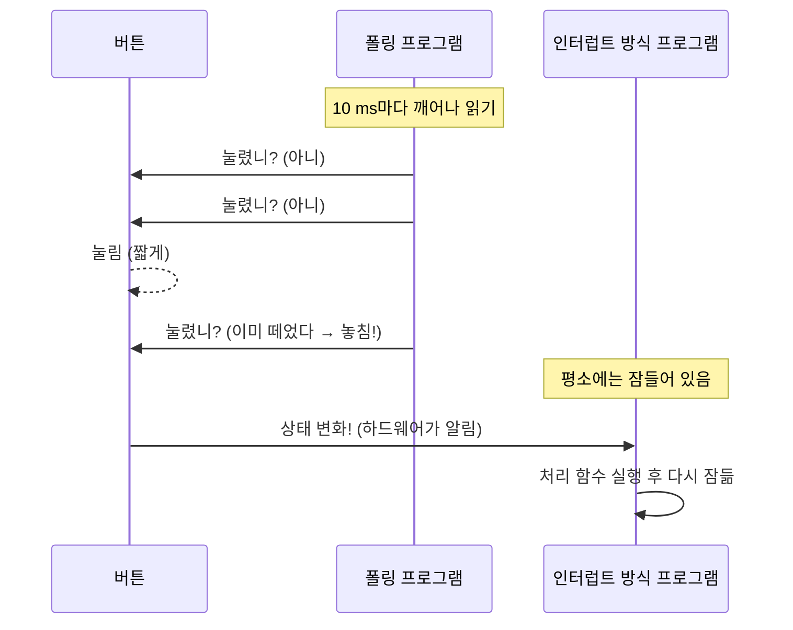
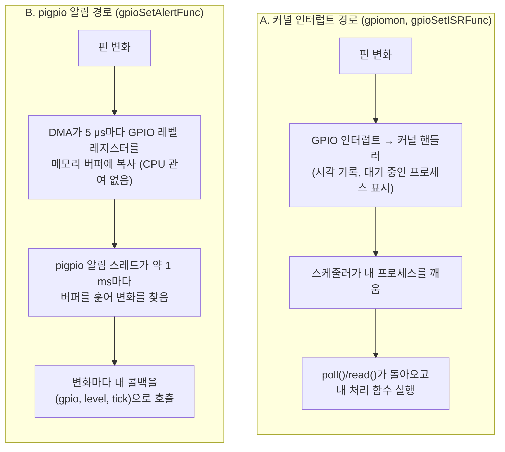
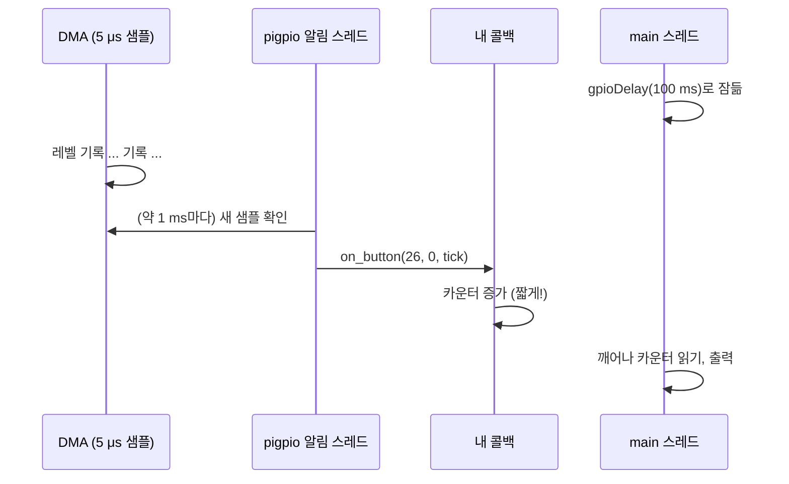
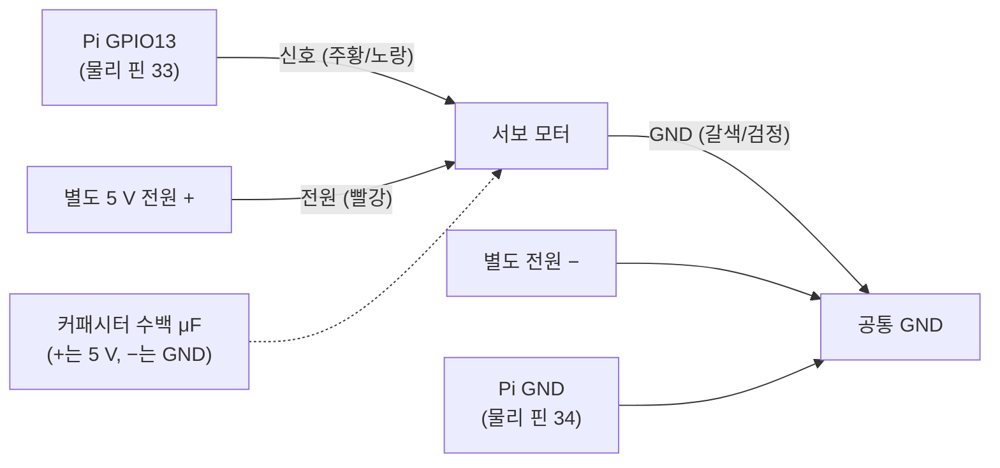
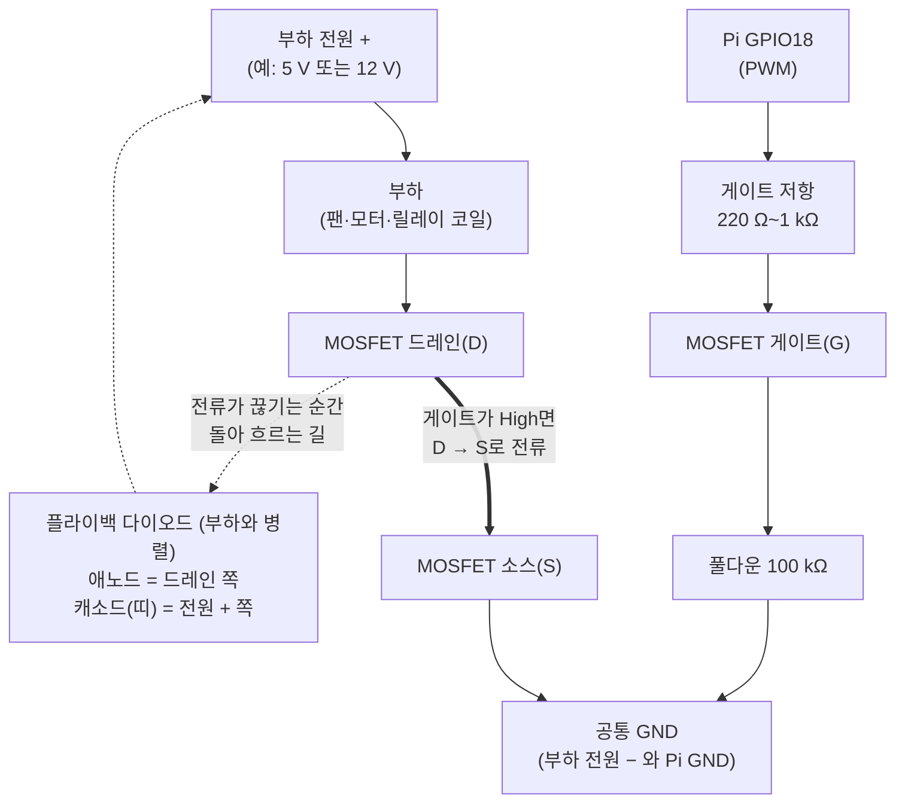
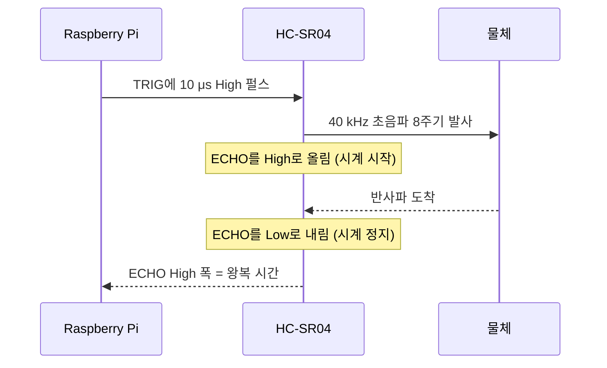
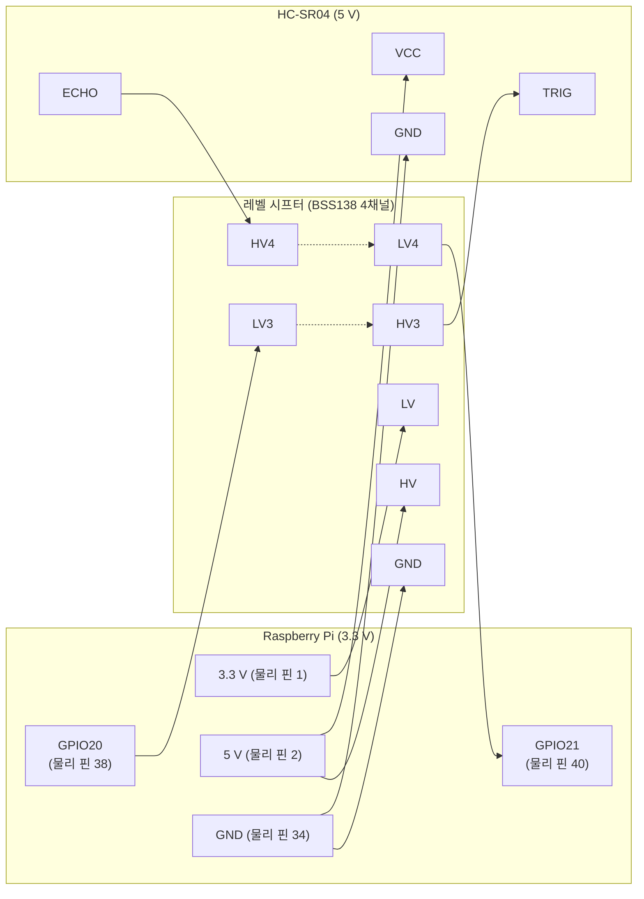

# 9장. pigpio 심화: 인터럽트·PWM·서보

> **학습 목표**
> - 폴링(polling)과 인터럽트(interrupt)의 차이를 CPU 사용 시간, 반응 지연, 놓치는 이벤트의 관점에서 설명하고, 같은 버튼 카운터를 두 방식으로 만들어 비교할 수 있다.
> - 하드웨어 인터럽트가 커널을 거쳐 사용자 프로그램에 전달되는 경로와, pigpio의 알림 콜백(DMA 샘플링)이 이와 어떻게 다른지 그림으로 설명할 수 있다.
> - `gpioSetAlertFunc`/`gpioSetAlertFuncEx`/`gpioSetISRFunc` 콜백의 인자(gpio, level, tick)를 해석하고, 콜백과 main 사이에서 변수를 안전하게 주고받을 수 있다.
> - 스위치 채터링을 관찰하고, tick 비교와 `gpioGlitchFilter`로 디바운스할 수 있다.
> - PWM의 주기·주파수·듀티·분해능을 계산하고, pigpio의 DMA PWM(`gpioPWM`), 하드웨어 PWM(`gpioHardwarePWM`), 서보 펄스(`gpioServo`)를 목적에 맞게 고를 수 있다.
> - 서보 모터, 부저, HC-SR04 초음파 센서를 안전하게 배선(별도 전원, 공통 GND, 5 V 모듈은 레벨 시프터 경유)하고 pigpio로 제어·측정할 수 있다.
> - 웨이브폼(`gpioWave*`)으로 μs 단위의 펄스열을 만들고, Python 클라이언트로 원격에서 콜백을 받을 수 있다.

[8장](08_gpio_pigpio.md)에서는 핀을 High/Low로 만들고, 버튼을 5 ms마다 읽어서 LED에 반영했다. 그런데 실습 8-3의 끝에서 두 가지 아쉬움이 남았다. 하나는 "버튼이 눌렸는지 계속 물어보는" 방식이 비효율적이라는 것이고, 다른 하나는 버튼 한 번에 `눌림/뗌`이 여러 번 찍히는 채터링이었다. 출력 쪽에도 질문이 남는다. 디지털 핀은 0 V와 3.3 V만 낼 수 있는데, LED를 "반쯤" 밝게 하거나 모터를 "천천히" 돌리려면 어떻게 해야 할까?

이 장은 이 질문들에 답한다. 입력 쪽에서는 **인터럽트와 콜백**, **디바운스**를, 출력 쪽에서는 **PWM**과 그 응용인 **서보·부저**를, 시간을 재는 응용으로 **초음파 거리 센서**를 다룬다. 마지막으로 μs 단위 펄스열을 만드는 **웨이브폼**과 네트워크 너머에서 GPIO를 다루는 **원격 GPIO**를 짧게 살펴본다. 만든 파형이 정말 의도대로 나오는지는 [10장](10_measurement.md)의 Analog Discovery 2로 확인한다. 2025년 11주차 수업에서 강조했듯이 **"된다고 알고 있는 것"과 "계측기로 관찰한 것"은 다르다.**

이 장의 모든 실습은 [8장](08_gpio_pigpio.md) 8.2.4절 **이 교재의 표준 배선**을 그대로 쓴다. 8장에서 꽂은 LED 바와 버튼은 빼지 않아도 된다. 이 장에서 새로 꽂는 것은 PWM 출력(부저), 서보, 레벨 시프터와 HC-SR04이다.

| 용도 (표준 이름) | 핀 | 실습 |
|---|---|---|
| LED0 | GPIO17 (물리 핀 11) → 330 Ω → LED → GND | 9-1, 9-3, 9-7, 9-8 |
| BTN0 버튼 | GPIO26 (물리 핀 37) ↔ 버튼 ↔ GND (물리 핀 39), 내부 풀업 | 9-1, 9-2, 9-8 |
| 하드웨어 PWM 출력 (LED 디밍·부저 톤) | GPIO18 (물리 핀 12, PWM 채널 0) | 9-4 |
| 서보 신호 | GPIO13 (물리 핀 33, PWM 채널 1) | 9-5 |
| HC-SR04 TRIG / ECHO | GPIO20 (물리 핀 38) / GPIO21 (물리 핀 40), **둘 다 레벨 시프터 경유** | 9-6 |
| 웨이브폼 마커 = LED1 | GPIO27 (물리 핀 13), AD2 DIO3 | 9-7 |
| 공통 GND | 물리 핀 9, 14, 20, 34, 39 등 | 전체 |

**이 장에서 새로 필요한 부품**: 수동 피에조 부저 1개(선택), 소형 서보(SG90 등)와 별도 5 V 전원, HC-SR04 모듈 1개, **4채널 양방향 BSS138 레벨 시프터 모듈 1개**(12장 I2C LCD와 함께 쓴다), (선택) Analog Discovery 2.

## 9.1 폴링과 인터럽트

### 9.1.1 왜 필요한가: 문을 계속 열어 보기 vs 초인종

택배를 기다린다고 하자. 방법은 두 가지이다.

- **계속 문을 열어 본다.** 1분마다 현관문을 열어 택배가 왔는지 확인한다. 택배가 오지 않아도 계속 일어나야 하니 다른 일을 제대로 못 한다. 그렇다고 1시간마다 확인하면 택배 기사가 문 앞에 잠깐 서 있다가 돌아가 버린 것을 모를 수 있다. 이것이 **폴링**(polling)이다.
- **초인종을 단다.** 평소에는 하던 일을 계속하다가, 초인종이 울리면 그때 하던 일을 잠시 멈추고 문으로 간다. 이것이 **인터럽트**(interrupt)이다.

강의에서도 같은 이야기를 했다. 입력을 읽을 때 "폴링으로 신호를 계속 읽는 것은 불편하니까 인터럽트 서비스 루틴을 이용해서, 외부 핀의 상태가 바뀔 때, 즉 **이벤트가 발생할 때** 값을 읽어 오는 것"이다(2023-11-30 강의 녹취). 8장의 `button_led.c`는 5 ms마다 문을 열어 보는 프로그램이었다.

정확히 정의하면 다음과 같다.

- **폴링**: 프로그램이 정해진 간격(또는 쉬지 않고)으로 입력 상태를 **직접 읽어서** 변화를 찾는 방식.
- **인터럽트**: 입력의 변화(에지)나 특정 레벨을 **하드웨어가 감지해서 CPU에 알리고**, CPU가 하던 일을 잠시 멈춘 뒤 미리 등록된 처리 함수(**인터럽트 서비스 루틴**, ISR: Interrupt Service Routine)를 실행하는 방식.



두 방식을 숫자로 비교하면 다음과 같다. 폴링 간격을 T라고 하자.

| 비교 항목 | 폴링 (간격 T) | 인터럽트 |
|---|---|---|
| CPU 사용 | 아무 일이 없어도 초당 1/T번 깨어난다. T = 0(쉬지 않고 읽기)이면 코어 하나를 100 % 쓴다 | 변화가 있을 때만 일한다 |
| 반응 지연(latency) | 평균 T/2, 최악 T | 하드웨어·OS 구조가 정한다(MCU는 수 μs 미만, Linux 사용자 공간은 수십 μs~수 ms) |
| 놓치는 이벤트 | T보다 짧은 펄스는 놓칠 수 있다 | 감지 회로가 잡을 수 있는 한 놓치지 않는다 |
| 구조 | 단순하다. 순서대로 읽힌다 | 처리 함수가 "아무 때나" 끼어들므로 공유 변수 관리가 필요하다 |
| 어울리는 곳 | 천천히 변하는 값(온도), 짧은 실험 코드 | 버튼, 엔코더, 센서의 펄스, 통신 신호 |

> **흔한 오해**: "인터럽트가 항상 빠르다." 마이크로컨트롤러에서는 대개 맞지만, Linux 사용자 프로그램에서는 인터럽트가 커널을 거쳐 프로세스를 깨우는 데 수십 μs가 걸리고, 그 시간도 시스템 부하에 따라 들쭉날쭉하다. 반대로 바쁜 폴링(T = 0)은 CPU를 다 쓰는 대신 반응이 매우 빠를 수 있다. 인터럽트의 진짜 장점은 "**CPU를 낭비하지 않으면서 이벤트를 놓치지 않는다**"는 데 있다.

### 9.1.2 하드웨어에서 인터럽트가 일어나는 과정

인터럽트는 [2장](02_computer_arch_arm.md)에서 본 **예외**(exception)의 한 종류이다. 2.19절의 "수업 중 전화가 울리는" 비유처럼, CPU는 하던 곳을 기억해 두고 처리 루틴으로 갔다가 돌아온다. 이 장에서는 그 앞단, 즉 **GPIO 핀의 변화가 어떻게 CPU의 IRQ가 되는가**를 본다.

2025년 11주차 수업에서 BCM2711의 GPIO 블록도를 살펴보았다. 1학기에 쓴 마이크로컨트롤러는 외부 인터럽트 전용 핀이 몇 개뿐이었지만, BCM2711은 **대부분의 GPIO 핀**에서 인터럽트를 만들 수 있고, **레벨 검출**(High/Low)과 **에지 검출**(상승/하강)을 모두 지원한다.

| 용어 | 뜻 | 버튼(풀업)에서 |
|---|---|---|
| 상승 에지(rising edge) | 0 → 1로 바뀌는 순간 | 버튼을 **뗄 때** |
| 하강 에지(falling edge) | 1 → 0으로 바뀌는 순간 | 버튼을 **누를 때** |
| 양 에지(either edge) | 둘 다 | 누를 때와 뗄 때 모두 |
| High/Low 레벨 | 그 레벨인 동안 계속 | 누르고 있는 동안(Low) |


> 📌 **보강: BCM2711의 GPIO 이벤트 검출.** BCM2711에는 핀마다 상승 에지(GPREN), 하강 에지(GPFEN), High 레벨(GPHEN), Low 레벨(GPLEN), 비동기 에지(GPAREN/GPAFEN) 검출을 켜는 레지스터가 있고, 조건이 맞으면 이벤트 상태 레지스터(GPEDS)의 해당 비트가 1이 되면서 인터럽트 요청이 나간다. 처리 루틴은 그 비트에 1을 써서 지운다. 출처: [BCM2711 ARM Peripherals, 5장 General Purpose I/O](https://datasheets.raspberrypi.com/bcm2711/bcm2711-peripherals.pdf)

### 9.1.3 Linux 사용자 프로그램은 인터럽트를 직접 받을 수 없다

마이크로컨트롤러에서는 내가 쓴 ISR이 벡터 테이블에 등록되어 인터럽트가 오면 **곧바로** 실행된다. Linux에서는 이야기가 다르다. 인터럽트 벡터와 컨트롤러는 **커널의 것**이다. 사용자 프로그램(EL0)이 하드웨어 예외를 직접 처리하게 두면, 잘못된 프로그램 하나가 시스템 전체를 멈출 수 있기 때문이다. 그래서 사용자 프로그램이 "핀이 바뀌면 알려 줘"를 얻는 길은 크게 둘이다.



**A. 커널 인터럽트 경로.** 커널 GPIO 드라이버가 인터럽트를 받고, 기다리던 프로세스를 깨운다. 하드웨어 인터럽트를 쓰므로 CPU 낭비가 없지만, 프로세스가 깨어나 실행되기까지 스케줄링 지연이 끼어든다. 커널 표준 문자 디바이스(`/dev/gpiochipN`)를 쓰는 libgpiod의 `gpiomon`과, 옛 sysfs 방식을 쓰는 pigpio의 `gpioSetISRFunc`가 이 경로이다.

**B. pigpio 알림(alert) 경로.** pigpio는 하드웨어 인터럽트를 쓰지 않는다. 대신 8장에서 본 것처럼 **DMA**(Direct Memory Access, CPU 대신 메모리 복사를 해 주는 하드웨어)가 PCM 주변장치의 박자에 맞춰 **5 μs마다 GPIO 0~31의 레벨을 통째로 읽어 버퍼에 적는다**. pigpio의 알림 스레드가 이 버퍼를 약 1 ms마다 훑어서 바뀐 비트를 찾고, 바뀐 핀마다 등록된 콜백을 부른다. 비유하자면, 문 앞에 **CCTV**(DMA)를 달아 5 μs마다 사진을 찍어 두고, 1 ms마다 사진첩을 넘겨 보며 "몇 시 몇 분 몇 초에 누가 왔었다"를 알려 주는 셈이다. 그래서 다음 특징이 생긴다.

- 모든 변화에 **5 μs 해상도의 정확한 시각(tick)** 이 붙는다. 사진에 시각이 찍혀 있기 때문이다.
- 5 μs보다 짧은 펄스는 놓칠 수 있다(사진과 사진 사이에 왔다 간 사람).
- 콜백은 실제 변화보다 **최대 1 ms 남짓 늦게** 불린다. 대신 그 사이의 변화를 **순서대로 모두** 받는다.
- 샘플링 자체에 CPU가 조금 든다. pigpio 문서는 기본 5 μs 설정에서 약 10 %로 적고 있다.

> **흔한 오해**: pigpio의 `gpioSetAlertFunc`를 "인터럽트 함수"라고 부르는 경우가 많다(강의 자료의 `isr.c` 대응판도 그렇다). 쓰임새는 인터럽트와 같지만 **동작 원리는 DMA 샘플링**이다. 커널 인터럽트를 쓰는 함수는 `gpioSetISRFunc`이다.

pigpio의 이벤트 함수를 정리하면 다음과 같다.

| 함수 | 원리 | 핀 | 에지 선택 | 시각(tick)의 의미 | 필터 적용 | 비고 |
|---|---|---|---|---|---|---|
| `gpioSetAlertFunc(g, f)` | DMA 샘플링 | 0~31 | 모든 변화가 옴. `level`로 거른다 | 샘플이 찍힌 시각(정확) | glitch/noise 필터 적용됨 | **이 교재의 기본** |
| `gpioSetAlertFuncEx(g, f, userdata)` | 〃 | 〃 | 〃 | 〃 | 〃 | 콜백에 포인터 하나를 더 넘겨 준다 |
| `gpioSetISRFunc(g, edge, timeout, f)` | 커널 인터럽트(sysfs) | 0~53 | `RISING_EDGE`, `FALLING_EDGE`, `EITHER_EDGE` | 프로세스가 통지받은 시각(약 50 μs 늦고 들쭉날쭉) | 적용 안 됨 | 최신 커널에서 등록 실패 가능 |
| `gpioSetISRFuncEx(…, userdata)` | 〃 | 〃 | 〃 | 〃 | 〃 | userdata 판 |

> 📌 **보강: 샘플링 주기와 CPU 사용량.** 샘플링 주기는 `gpioInitialise()` **전에** `gpioCfgClock(μs, 주변장치, 0)`으로 1, 2, 4, 5, 8, 10 μs 중에서 고를 수 있다(데몬은 `pigpiod -s`). 문서에 적힌 대략의 CPU 사용률은 1 μs 25 %, 2 μs 16 %, 4 μs 11 %, **5 μs 10 %(기본)**, 8 μs 15 %, 10 μs 14 %이고, "5 μs가 최적점"이라고 한다. 같은 문서는 `gpioSetISRFunc`에 대해 "지연은 보통 50 μs 정도이지만 보장되지 않고 시스템 부하에 따라 변하며, 수 μs 간격의 연속 인터럽트는 커널이 놓칠 수 있다"고 설명한다. 출처: [pigpio C 인터페이스 – gpioCfgClock, gpioSetAlertFunc, gpioSetISRFunc](https://abyz.me.uk/rpi/pigpio/cif.html)

> 📌 **보강 (확인 필요): `gpioSetISRFunc`와 최신 커널.** `gpioSetISRFunc`는 내부에서 `/sys/class/gpio/export`에 BCM 번호를 그대로 써서 핀을 내보낸다. 8장 8.4절에서 본 것처럼 최근 Raspberry Pi OS 커널은 sysfs 번호에 기준 번호(예: 512)를 더하므로, pigpio v79의 `gpioSetISRFunc`는 `PI_BAD_ISR_INIT`(−123)을 돌려주며 실패할 수 있다. [부록 B](appendix_b_gpio_libraries.md)의 `isr_pigpio.c`도 같은 이유로 기본 빌드에서 알림 콜백을 쓴다. 이 교재의 실습은 모두 `gpioSetAlertFunc` 계열을 쓴다. 커널 인터럽트 경로를 직접 체험하고 싶으면 다음과 같이 libgpiod 도구를 쓴다(pigpio 프로그램은 모두 끈다).
>
> ```bash
> gpiomon --falling-edge gpiochip0 26    # libgpiod v1 문법. 버튼을 누를 때마다 커널이 찍은 시각과 함께 한 줄씩
> ```
>
> 출처: [Linux kernel – GPIO Character Device Userspace API](https://docs.kernel.org/userspace-api/gpio/chardev.html)

### 9.1.4 콜백 함수의 인자와 규칙

알림 콜백은 다음 모양이어야 한다. `pigpio.h`의 `gpioAlertFunc_t` 형식이다.

```c
void my_callback(int gpio, int level, uint32_t tick);
```

| 인자 | 값 | 뜻 |
|---|---|---|
| `gpio` | 0~31 | 상태가 바뀐 GPIO 번호. 함수 하나를 여러 핀에 등록해 놓고 이 값으로 구분한다 |
| `level` | 0 | High → Low (하강 에지) |
| | 1 | Low → High (상승 에지) |
| | 2 (`PI_TIMEOUT`) | 레벨 변화 없음. **워치독 타임아웃**(9.1.5) |
| `tick` | 32비트 | 부팅 후 경과 시간(μs). 그 변화가 **샘플링된 시각** |

**tick과 72분 랩어라운드.** `tick`은 `uint32_t`라서 2³² μs ≈ 4295초 ≈ **71.6분**마다 4294967295에서 0으로 돌아간다. 그래도 걱정할 필요는 없다. **두 tick의 차이를 `uint32_t` 뺄셈으로 구하면** 넘어가는 순간에도 올바른 값이 나온다(부호 없는 정수의 나머지 연산 덕분이다). 예를 들어 `start = 4294967000`, `end = 300`이면 `end - start`는 `uint32_t`로 596이 된다. 반대로 `if (end > start)` 같은 대소 비교는 넘어가는 순간 틀린다. 이 규칙은 [부록 B](appendix_b_gpio_libraries.md)의 B.3.3에도 정리되어 있다.

**콜백은 누가 부르나.** 콜백은 main이 부르는 것이 아니라 **pigpio 내부 스레드**가 부른다. main이 `gpioDelay()`로 자고 있든, `printf()`를 하고 있든 상관없이 끼어든다. 이것이 쓰레드와 인터럽트가 비슷하게 느껴지는 이유이다(2025년 12주차 수업).



여기서 지켜야 할 **콜백 4원칙**이 나온다.

1. **짧게 끝낸다.** 모든 GPIO의 콜백은 **같은 스레드 하나**에서 차례로 불린다. 콜백 하나가 `sleep(1)`을 하면 그동안 다른 핀의 콜백도 모두 밀린다. 콜백에서는 세고, 시각을 기록하고, 깃발을 올리는 정도만 하고, 출력·파일 저장·긴 계산은 main에 맡긴다.
2. **레벨은 인자로 받는다.** 콜백 안에서 `gpioRead()`로 다시 읽지 않는다. 콜백이 불릴 때는 이미 1 ms 가까이 지났을 수 있고, 그 사이 레벨이 또 바뀌었을 수 있다. 인자 `level`이 "그 시각의 레벨"이다.
3. **공유 변수는 `atomic`(최소한 `volatile`)으로 선언한다.<strong> 콜백과 main은 </strong>다른 스레드**이다. `volatile`은 "이 변수를 레지스터에 캐시하지 말고 매번 메모리에서 읽어라"라는 뜻이라 8장의 시그널 깃발처럼 단순한 경우에는 충분하다. 그러나 여러 스레드 사이에서 "값을 다 쓴 다음에 깃발을 올린다"는 **순서**까지 보장하지는 않는다. 그래서 이 장의 예제는 C11의 `<stdatomic.h>`(`atomic_uint`, `atomic_store`, `atomic_load`, `atomic_fetch_add`)를 쓴다. 왜 이런 문제가 생기는지(경쟁 상태, race condition)와 뮤텍스는 [11장](11_process_concurrency.md)에서 자세히 다룬다.
4. **핀 하나에 콜백 하나.** `gpioSetAlertFunc`를 같은 핀에 다시 부르면 이전 콜백이 **교체**된다. `NULL`을 넘기면 해제된다. `gpioSetAlertFunc`와 `gpioSetAlertFuncEx`도 한 핀에 하나만 쓸 수 있다.

**`Ex` 판과 userdata.** 같은 일을 하는 센서가 여러 개라면, 센서마다 상태(마지막 시각, 측정값 등)를 담은 구조체를 만들고 그 주소를 `userdata`로 넘긴다. 그러면 콜백 하나로 여러 센서를 처리할 수 있고 전역 변수도 줄어든다. 실습 9-6의 `hcsr04.c`가 이 방식이다.

```c
struct sonar { atomic_uint rise_tick; /* ... */ };
static void on_echo(int gpio, int level, uint32_t tick, void *userdata)
{
    struct sonar *s = userdata;          /* 등록할 때 넘긴 주소가 그대로 온다 */
    /* ... */
}
gpioSetAlertFuncEx(21, on_echo, &my_sonar);   /* ECHO = GPIO21 (표준 배선) */
```

### 9.1.5 워치독과 타이머 콜백

**워치독**(watchdog)은 "일정 시간 동안 아무 변화가 없으면 알려 주는" 기능이다. 원래 워치독은 시스템이 멈추면 리셋하는 감시 타이머를 가리키는데, pigpio의 `gpioSetWatchdog(gpio, ms)`는 그 핀에 **ms 동안 변화가 없을 때마다** 알림 콜백을 `level = 2`(`PI_TIMEOUT`)로 불러 준다(0~60000 ms, 0이면 해제). 쓰임새는 다음과 같다.

- 센서가 주기적으로 펄스를 내야 하는데 끊겼다 → 고장 감지
- 버튼 입력이 한동안 없었다 → 절전 모드로 전환
- 채터링 묶음이 끝났다(입력이 0.3초 조용해졌다) → 결과 정리(실습 9-2)

**타이머 콜백** `gpioSetTimerFunc(timer, ms, f)`는 핀과 관계없이 **ms마다** 함수를 불러 준다(타이머 번호 0~9, 10~60000 ms). 마이크로컨트롤러에서 타이머 인터럽트로 하던 "일정 시간마다 할 일"에 해당한다. 2025년 12주차 수업에서 "OS가 없으면 타이머 인터럽트로 일정 시간마다 함수가 불리게 해야 하는데, 쓰레드를 쓰면 그럴 필요가 없다"고 한 것과 같은 맥락이다.

| 방법 | 언제 불리나 | 시간 정확도 | 어울리는 일 |
|---|---|---|---|
| main 루프 + `gpioDelay()` | 내가 정한 순서대로 | 지연 함수의 오차 + 루프 안 작업 시간이 누적 | 단순한 순차 작업 |
| `gpioSetTimerFunc` | ms마다(pigpio 스레드) | ms 단위, 약간의 흔들림 | 주기적 상태 출력, 센서 주기 읽기 |
| `pthread_create` 쓰레드 | 쓰레드가 스스로 정함 | 스케줄러에 좌우 | 독립된 긴 작업([11장](11_process_concurrency.md)) |
| 알림 콜백 + 워치독 | 핀 변화 / 무변화 시 | 시각(tick)은 5 μs 정확, 호출은 ~1 ms 지연 | 버튼, 펄스 측정, 타임아웃 |
| 하드웨어 PWM, 웨이브폼 | CPU와 무관(하드웨어·DMA) | μs 이하 | 정확한 파형 출력 |

강의에서 강조한 대로, 쓰레드나 타이머 콜백은 "**1 μs마다 무언가를 처리**"하는 것처럼 시간적으로 엄격한 일에는 쓰지 않는다(2023-11-30 강의 녹취). 그런 일은 하드웨어(PWM, DMA)에게 맡긴다. 이것이 이 장 후반부의 주제이다.

## 9.2 채터링과 디바운스

### 9.2.1 채터링: 스위치는 한 번에 붙지 않는다

택트 스위치 안에는 얇은 금속판이 있다. 누르면 금속판이 접점에 부딪히는데, 공이 바닥에서 튀듯 **몇 번 튀었다가** 붙는다. 그동안 회로는 붙었다 떨어졌다를 반복하므로 GPIO에는 0과 1이 여러 번 번갈아 들어온다. 이를 **채터링**(chattering) 또는 **바운스**(bounce)라고 한다. 뗄 때도 마찬가지이다.

```text
           누름                                  뗌
             ↓                                    ↓
GPIO26  ‾‾‾‾‾|_|‾|__|‾|________________________|‾|_|‾‾|_|‾‾‾‾‾‾‾‾‾‾‾
             ←─────→                            ←───────→
             채터링 (수십 μs ~ 수 ms)            채터링
```

사람에게는 "한 번 누름"이지만 프로그램에는 하강 에지가 여러 개 들어온다. 8장의 폴링 예제는 5 ms 간격으로 읽어서 대부분 가려졌지만, 5 μs마다 샘플링하는 알림 콜백은 **튀는 것 하나하나를 다 본다.** 그래서 실습 9-1의 `button_alert`에서 한 번 눌렀는데 카운트가 2~3씩 올라가는 일이 생긴다. 채터링 시간은 스위치 종류, 누르는 힘과 속도, 낡은 정도에 따라 달라지므로 **직접 재 보는 것**이 가장 정확하다(실습 9-2).

### 9.2.2 디바운스 방법

채터링을 걸러 "한 번 누름 = 한 번"으로 만드는 것을 **디바운스**(debounce)라고 한다.

| 방법 | 원리 | 장점 | 단점 |
|---|---|---|---|
| 하드웨어 RC 필터 (+ 슈미트 트리거) | 저항·커패시터로 빠른 변화를 둥글게 만들고, 히스테리시스로 깨끗한 에지를 만든다 | 소프트웨어 부담 없음 | 부품 추가 |
| 폴링 간격 늘리기 | 채터링보다 긴 간격(5~20 ms)으로 읽는다 | 아주 간단(8장 방식) | 반응이 느리고, 짧은 입력은 놓친다 |
| **시간 잠금**(tick 비교) | "직전 에지 후 20 ms 이상 조용했던 하강 에지"만 눌림으로 인정 | 첫 에지에 바로 반응. 정확한 tick이 있어 쉽다 | 코드로 직접 작성 |
| **`gpioGlitchFilter(g, steady)`** | 레벨이 **steady μs 이상 유지된 변화만** 콜백에 보고 | 한 줄로 끝. DMA 샘플 단계에서 걸러 콜백 호출도 줄어든다 | 보고 시각이 steady만큼 늦다 |
| `gpioNoiseFilter(g, steady, active)` | steady μs 동안 안정된 레벨이 나오면 그 뒤 active μs 동안의 변화를 보고하고, 다시 처음부터 | 잡음이 섞인 펄스열에서 "활성 구간"만 보기 | 버튼에는 과하다 |

pigpio FAQ도 "기계식 스위치는 튀면서 여러 번 인터럽트를 만들 수 있다. 소프트웨어로는 glitch 필터가 지정한 μs보다 짧은 이벤트를 무시한다"고 안내한다.

> 📌 **보강: 필터의 적용 범위와 시각.** glitch 필터와 noise 필터는 **알림 콜백**(`gpioSetAlertFunc`/`Ex`)과 샘플 콜백에만 적용된다. `gpioSetISRFunc`나 `gpioRead()`로 읽은 값에는 적용되지 **않는다.** 또 glitch 필터를 거친 에지의 tick은 처음 감지된 시각보다 **steady μs 늦게** 찍힌다. 범위는 steady 0~300000 μs(0이면 끔). 출처: [pigpio C 인터페이스 – gpioGlitchFilter, gpioNoiseFilter](https://abyz.me.uk/rpi/pigpio/cif.html), [pigpio FAQ – How do I debounce inputs?](https://abyz.me.uk/rpi/pigpio/faq.html)

**steady 값은 어떻게 고르나?** 채터링 시간보다 길고, 사람이 가장 짧게 누르는 시간(수십 ms)보다 짧아야 한다. 실습 9-2에서 잰 채터링 시간의 몇 배(보통 5~20 ms)로 정한다. 너무 길게(예: 100 ms) 잡으면 빠르게 두 번 누른 것을 한 번으로 보거나 아예 놓친다.

> **흔한 오해**: "`gpioGlitchFilter`를 켜면 `gpioRead()`도 깨끗해진다." 아니다. 필터는 알림 콜백의 보고만 거른다. 폴링 코드에서 디바운스가 필요하면 직접 구현한다(8장 과제 8-2).

## 9.3 PWM의 원리

### 9.3.1 왜 필요한가: 빠르게 여닫는 수도꼭지

디지털 핀은 0 V 아니면 3.3 V이다. 그런데 실제로는 그 **중간값**이 필요할 때가 많다. 강의에서 예로 든 LED 밝기, 모터 속도가 그렇다. 방법은 의외로 단순하다. **아주 빠르게 켰다 껐다** 하면서 켜져 있는 시간의 비율을 바꾸는 것이다.

수도꼭지로 생각해 보자. 꼭지를 반만 여는 대신, 1초에 수백 번 "완전히 열기/완전히 닫기"를 반복한다고 하자. 매 순간은 열림 아니면 닫힘이지만, 열려 있는 시간이 절반이면 양동이에 차는 물의 양은 반만 연 것과 같다. 양동이(LED를 보는 눈, 모터의 관성, 커패시터)가 빠른 변화를 **평균** 내 주기 때문이다. 이것이 **PWM**(Pulse Width Modulation, 펄스 폭 변조)이다. "디지털로 아날로그 출력을 흉내 내는 것"이라는 강의 설명 그대로이다.

### 9.3.2 주기, 주파수, 듀티

```text
        ←────────── 주기 T ──────────→
         ←── t_on ──→
3.3 V   ‾‾‾‾‾‾‾‾‾‾‾‾|______________|‾‾‾‾‾‾‾‾‾‾‾‾|______________|‾‾‾
0 V
        듀티 D = t_on / T          평균 전압 = D × 3.3 V
```

| 용어 | 기호·식 | 뜻 | 예 (1 kHz, 25 %) |
|---|---|---|---|
| 주기(period) | T | 한 번 켜졌다 꺼지는 데 걸리는 시간 | 1 ms |
| 주파수(frequency) | f = 1/T | 1초에 반복되는 횟수 | 1000 Hz |
| 펄스 폭(pulse width) | t<sub>on</sub> | High인 시간 | 0.25 ms |
| 듀티 사이클(duty cycle) | D = t<sub>on</sub>/T | High 시간의 비율(0~100 %) | 25 % |
| 평균 전압 | V<sub>avg</sub> = D × V<sub>H</sub> | 부하가 느끼는 평균 | 0.825 V |
| 분해능(resolution) | 단계 수 | 듀티를 몇 단계로 나눌 수 있나 | 255단계면 약 0.4 %씩 |

```text
듀티 25 %   ‾‾|______‾‾|______‾‾|______     (어둡다)
듀티 50 %   ‾‾‾‾|____‾‾‾‾|____‾‾‾‾|____     (중간)
듀티 75 %   ‾‾‾‾‾‾|__‾‾‾‾‾‾|__‾‾‾‾‾‾|__     (밝다)
            주기는 그대로, High 폭만 바뀐다
```

2025년 12주차 수업에서 `pigs p 18 128`과 `pigs p 18 10`을 번갈아 주며 Logic 화면으로 확인한 것이 바로 이것이다. **주기는 고정되어 있고 듀티만 바뀐다.**

**주파수는 어떻게 고르나.** 부하가 그 주파수를 "평균"으로 느낄 만큼 빨라야 하고, 스위칭 손실이나 장치의 한계를 넘지 않을 만큼 느려야 한다.

| 부하 | 흔히 쓰는 주파수 | 이유 |
|---|---|---|
| LED | 수백 Hz~수 kHz | 너무 느리면(수십 Hz) 깜빡임이 보이고, 카메라에 줄무늬가 찍힌다 |
| DC 모터 | 수 kHz~20 kHz | 가청 주파수면 "삐-" 소리가 난다. 20 kHz 이상은 들리지 않는다 |
| RC 서보 | **50 Hz**(주기 20 ms) | 서보의 약속(9.4절). 듀티가 아니라 **펄스 폭**이 의미를 가진다 |
| 피에조 부저 | 소리 주파수 그 자체(예: 440 Hz) | 주파수 = 음 높이, 듀티 50 % |

> **흔한 오해**: "PWM 핀에서 1.65 V가 나온다." 핀에서는 여전히 0 V와 3.3 V가 번갈아 나온다. 멀티미터는 평균을 보여 주므로 1.65 V처럼 보일 뿐이다. 진짜 아날로그 전압이 필요하면 저항·커패시터 저역 통과 필터(low-pass filter)로 평균을 만들거나 DAC를 쓴다. 오실로스코프로 보면 차이가 분명하다([10장](10_measurement.md)).

### 9.3.3 LED 밝기와 사람의 눈: 감마 보정

듀티를 0 %에서 100 %까지 **일정하게** 올리면 LED가 일정하게 밝아질 것 같지만, 실제로 해 보면 처음 20~30 %에서 확 밝아지고 나머지 구간은 거의 그대로처럼 보인다. 사람 눈은 빛의 세기를 **비선형**으로 느끼기 때문이다. 어두운 곳의 작은 변화는 크게, 밝은 곳의 큰 변화는 작게 느낀다.

그래서 "눈에 보이는 밝기 단계"를 듀티로 바꿀 때 거듭제곱 곡선을 쓴다. 흔히 쓰는 근사가 **감마(γ) 보정**이다(📌 보강, 출처 보완 필요).

$$ \text{듀티} = \left(\frac{\text{단계}}{\text{최대 단계}}\right)^{\gamma} \times \text{범위}, \qquad \gamma \approx 2.2 $$

| 밝기 단계 (0~100) | 10 | 20 | 30 | 40 | 50 | 60 | 70 | 80 | 90 | 100 |
|---|---|---|---|---|---|---|---|---|---|---|
| 선형 듀티 (/1000) | 100 | 200 | 300 | 400 | 500 | 600 | 700 | 800 | 900 | 1000 |
| γ = 2.2 듀티 (/1000) | 6 | 29 | 71 | 133 | 218 | 325 | 456 | 612 | 793 | 1000 |

어두운 쪽에서 듀티가 6, 29처럼 아주 작은 값이 필요하다는 점에 주목하자. 범위가 255 정도로 거칠면 단계 10과 20의 차이를 표현하기 어렵다. 그래서 실습 9-3에서는 **분해능 1000단계**가 나오도록 주파수를 고른다. γ = 2.2는 디스플레이에서 흔히 쓰는 근사값이고, LED와 눈의 실제 특성은 조금씩 다르므로 2.0~2.8 사이에서 눈으로 보며 조정해도 된다.

### 9.3.4 pigpio가 펄스를 만드는 세 가지 방법

pigpio에는 펄스를 만드는 방법이 셋(웨이브폼까지 넷) 있다. 이름이 비슷해서 헷갈리기 쉬우니 표로 먼저 정리한다.

| 항목 | DMA PWM `gpioPWM` | 하드웨어 PWM `gpioHardwarePWM` | 서보 펄스 `gpioServo` | 웨이브폼 `gpioWave*` (9.8절) |
|---|---|---|---|---|
| 누가 만드나 | DMA가 샘플 박자(5 μs)마다 GPIO set/clear 레지스터에 씀 | SoC의 PWM 주변장치 | DMA (DMA PWM과 같은 원리) | DMA |
| 쓸 수 있는 핀 | **GPIO0~31 아무 핀** | **GPIO12, 13, 18, 19만** (두 채널) | GPIO0~31 아무 핀 | GPIO0~31 |
| 주파수 | 18개 값 중 선택(기본 **800 Hz**) | 1 Hz~187.5 MHz(BCM2711), 거의 연속 | 50 Hz 고정 | 펄스마다 μs 단위로 자유 |
| 듀티 지정 | 0~range (기본 range 255, 25~40000으로 변경) | 0~1,000,000 (백만 분율) | 펄스 폭 500~2500 μs (0 = 끔) | 펄스 목록 |
| 분해능 | 샘플 박자 단위(5 μs) → "실제 범위" | 375 MHz / f 단계 | 5 μs 단위 | 1 μs |
| 핀 모드 | 출력(OUTPUT) 그대로 | ALT 기능(PWM)으로 바뀜 | 출력 | 출력 |
| pigs 명령 | `p`(=`pwm`), `pfs`, `prs`, `pfg`, `prg`, `prrg` | `hp` | `s`(=`servo`) | `wvclr`, `wvag`, `wvcre`, `wvtx`… |
| 주의 | 주파수 반올림, 높은 주파수일수록 분해능 감소 | 채널 공유, 오디오와 충돌, 웨이브폼과 배타 | 서보 한계 각도 | 하드웨어 PWM을 끈다 |

**DMA PWM의 주파수와 분해능.** DMA PWM은 5 μs 박자에 맞춰 켜고 끄므로, 한 주기를 이루는 박자 수가 곧 **실제 범위**(real range, 실제 분해능)이다. 예를 들어 800 Hz의 주기는 1250 μs이고 1250 / 5 = **250단계**이다. 그래서 고를 수 있는 주파수가 정해져 있다. 기본 샘플링 5 μs에서 허용 주파수와 실제 범위는 다음과 같다.

| 주파수 (Hz) | 8000 | 4000 | 2000 | 1600 | 1000 | **800** | 500 | 400 | 320 |
|---|---|---|---|---|---|---|---|---|---|
| 실제 범위 | 25 | 50 | 100 | 125 | 200 | **250** | 400 | 500 | 625 |

| 주파수 (Hz) | 250 | **200** | 160 | 100 | 80 | 50 | 40 | 20 | 10 |
|---|---|---|---|---|---|---|---|---|---|
| 실제 범위 | 800 | **1000** | 1250 | 2000 | 2500 | 4000 | 5000 | 10000 | 20000 |

- `gpioSetPWMfrequency(g, f)`는 요청한 f와 **가장 가까운 허용값**을 고르고 그 값을 돌려준다. 1200 Hz를 요청하면 1000 Hz가 된다. 실제 값은 `gpioGetPWMfrequency(g)`(`pigs pfg g`)로 확인한다.
- `gpioSetPWMrange(g, r)`의 r은 "**내가 쓰고 싶은 눈금**"일 뿐이다. 실제로 핀에 적용되는 단계는 `듀티 × 실제 범위 / r`로 환산된다. 800 Hz에서 r = 1000으로 두어도 실제 분해능은 250단계이다. 실제 범위는 `gpioGetPWMrealRange(g)`(`pigs prrg g`)로 본다.
- 그래서 **높은 주파수일수록 분해능이 떨어진다.** 8000 Hz에서는 듀티가 25단계(4 %씩)밖에 안 된다.
- 다른 샘플링 주기(1, 2, 4, 8, 10 μs)를 쓰면 허용 주파수 표가 통째로 바뀐다(`pigpio.h`의 `gpioSetPWMfrequency` 설명 참고).

**하드웨어 PWM.** BCM2711 안의 PWM 주변장치는 기준 클록(375 MHz)을 세어 펄스를 만든다. 한 주기의 단계 수는 `375,000,000 / f`의 정수 부분이고, 실제 주파수는 `375,000,000 / 단계 수`이다. 1 kHz면 375,000단계라 매우 곱고, 100 kHz에서도 3,750단계가 남는다. 대신 다음 제약이 있다.

| 제약 | 내용 |
|---|---|
| 핀 4개, 채널 2개 | **GPIO12와 GPIO18은 채널 0, GPIO13과 GPIO19는 채널 1**을 공유한다. 같은 채널의 두 핀은 마지막에 설정한 주파수·듀티를 **함께** 쓴다(부록 B의 `pwm1.c` 오류가 이것이었다) |
| ALT 기능 | 호출하면 핀이 PWM 기능(GPIO12/13은 ALT0, GPIO18/19는 ALT5)으로 바뀐다. 끝나면 `gpioHardwarePWM(g, 0, 0)` 후 입력으로 되돌린다 |
| 오디오와 충돌 | 아래 📌 참고 |
| 웨이브폼과 배타 | `gpioWaveTxSend`를 하면 하드웨어 PWM이 꺼지고, 반대로 `gpioHardwarePWM`은 웨이브폼을 끈다 |
| pigpio 클록 | pigpio의 박자 주변장치가 PCM(기본값)일 때만 쓸 수 있다. `gpioCfgClock`이나 `pigpiod -t 0`으로 PWM 주변장치를 박자로 쓰게 바꾸면 하드웨어 PWM을 쓸 수 없다 |

> 📌 **보강: PWM 주변장치와 오디오.** pigpio FAQ "Sound isn't working"은 다음과 같이 설명한다. "Pi에는 소리를 만드는 PWM 주변장치와 PCM 주변장치가 있다. 보통 PWM 주변장치가 헤드폰 잭으로 중간 품질의 오디오를 낸다. pigpio는 정상 동작 중에 (DMA 전송의 박자를 맞추기 위해) 이 중 적어도 하나를 쓰고, 웨이브폼이나 하드웨어 PWM 함수를 쓰면 둘 다 쓴다. 기본적으로 pigpio는 PCM 주변장치를 써서 PWM 주변장치를 오디오용으로 남겨 둔다." 즉 **실습 9-4(하드웨어 PWM)나 9-7(웨이브폼)을 하는 동안에는 3.5 mm 잭의 소리가 깨지거나 PWM 출력이 흔들릴 수 있다.** 실습 중에는 아날로그 오디오를 재생하지 않는다. 출처: [pigpio FAQ – Sound isn't working](https://abyz.me.uk/rpi/pigpio/faq.html), [pigpio C 인터페이스 – gpioHardwarePWM](https://abyz.me.uk/rpi/pigpio/cif.html#gpioHardwarePWM)

> **원본 자료 정정**
> - Raspberry Pi Codes §7.2.4는 "`pigs p 18 20000`: PWM 주파수를 20,000 Hz로 설정(p는 pwm_frequency의 약자)"이라고 했으나, `p`는 `pwm`과 같은 **듀티** 명령이다. 주파수는 `pfs`이다. 게다가 기본 범위가 255이므로 `p 18 20000`은 `PI_BAD_DUTYCYCLE` 오류가 난다(8장 정정과 같은 내용).
> - 같은 문서 §7.3.4·§7.4.4의 주석 "PWM 주파수와 범위의 기본값은 100 Hz, 범위 255"에서 **기본 주파수는 800 Hz**이다(`pigpio.c`의 `DEFAULT_PWM_IDX`가 5 μs 표의 800 Hz를 가리킨다). "핀 모드를 ALT5(하드웨어 PWM)로 설정하거나 pigpio가 자동으로 처리" / "pigpio가 하드웨어 PWM을 자동으로 처리"라는 주석도 틀렸다. `gpioPWM`은 하드웨어 PWM이 아니라 **DMA PWM**이며 핀은 출력 모드 그대로이다. 하드웨어 PWM은 `gpioHardwarePWM`을 따로 불러야 한다. 2025년 12주차 수업에서 `pigs p 17 128`처럼 하드웨어 PWM 핀이 아닌 GPIO17에서도 PWM이 나온 이유가 이것이다.
> - 같은 문서 §7.3.4·§7.3.5의 `gpioCfgSetInternals(0)`은 필요 없으므로 이 장의 예제에서도 뺐다(8장 정정 참고).

### 9.3.5 부저와 톤: 주파수가 음 높이

**수동 피에조 부저**(passive buzzer)는 넣어 준 전압 변화에 맞춰 얇은 판이 떨리며 소리를 낸다. 그래서 PWM의 **주파수가 음 높이**가 되고, 듀티는 50 % 근처일 때 소리가 가장 크다. 도(262 Hz), 레(294 Hz), 미(330 Hz) … 같은 음계를 내려면 주파수를 Hz 단위로 정확히 맞출 수 있어야 하므로 **하드웨어 PWM**이 어울린다. DMA PWM은 18개 주파수만 고를 수 있어서 262 Hz가 250 Hz, 440 Hz가 400 Hz로 반올림되어 음계가 무너진다. 전원만 넣으면 스스로 정해진 음을 내는 **능동 부저**(active buzzer)는 주파수를 바꿔도 음이 거의 같으므로 음계 연주에는 맞지 않는다. 음계 연주 예제는 [부록 B](appendix_b_gpio_libraries.md)의 [`softTone_pigpio.c`](code/appendix_b/softTone_pigpio.c)(B.4.15)에 있고, 실습 9-4의 `hwpwm_sweep`에 부저를 연결해 `sudo ./hwpwm_sweep 440 50`처럼 주파수를 직접 줘 볼 수도 있다.

## 9.4 서보 모터

### 9.4.1 서보는 어떻게 각도를 아는가

(📌 보강, 출처 보완 필요) RC 서보 모터(SG90 같은 취미용 서보) 안에는 DC 모터, 감속 기어, 출력축의 각도를 재는 **가변 저항**(포텐셔미터), 그리고 작은 제어 회로가 들어 있다. 제어 회로는 신호선으로 들어온 **펄스의 폭**을 "목표 각도"로 해석하고, 가변 저항으로 잰 현재 각도와 비교해 차이가 없어질 때까지 모터를 돌린다. 이렇게 출력을 다시 재서 입력과 비교하는 구조를 **피드백 제어**(feedback control)라고 한다. 1학기 마이크로컨트롤러 수업에서 PWM으로 서보를 돌렸던 것과 같은 원리이다.

```text
        ←──────────────── 20 ms (50 Hz) ────────────────→
1.0 ms  ‾|_______________________________________________|‾|____   한쪽 끝
1.5 ms  ‾‾|______________________________________________|‾‾|___   가운데
2.0 ms  ‾‾‾|_____________________________________________|‾‾‾|__   다른 쪽 끝
        펄스 폭이 각도를 정한다. 듀티(%)는 중요하지 않다.
```

| 펄스 폭 | 흔한 대응 (서보마다 다름) |
|---|---|
| 1000 μs | 한쪽 끝(표준 범위) |
| 1500 μs | **가운데 (항상 안전)** |
| 2000 μs | 다른 쪽 끝(표준 범위) |
| 500~2500 μs | 많은 취미용 서보가 받아들이는 넓은 범위(0~180도 전체) |

pigpio의 `gpioServo(g, 펄스폭)`은 아무 GPIO에서 **50 Hz로** 지정한 폭의 펄스를 계속 내보낸다. 범위는 500~2500 μs이고 0이면 펄스를 끈다(서보가 힘을 뺀다). 각도를 펄스 폭으로 바꾸는 식은 직선 보간이다.

$$ \text{펄스 폭} = \text{MIN} + \text{각도} \times \frac{\text{MAX} - \text{MIN}}{180} $$

Linux 백서의 예제는 MIN = 500, MAX = 2500으로 `500 + angle * 2000 / 180`을 썼다. 그런데 `pigpio.h`는 이렇게 경고한다. "서보가 받아들이는 범위는 제품마다 다르므로 실험으로 정해야 한다. **1500은 항상 안전**하며 회전 범위의 가운데이다. 한계를 넘어 움직이라고 명령하면 서보가 **손상될 수 있다.**" 기계적 끝을 넘어가라고 명령하면 서보는 그 자리에서 모터를 계속 밀며(stall) "지-" 소리를 내고 큰 전류를 먹는다. 그래서 실습 9-5는 **1000~2000 μs로 시작**해서, 끝에서 소리가 나지 않는 범위까지만 조금씩 넓히도록 했다.

> 📌 **보강: 50 Hz가 아닌 서보.** `gpioServo`는 50 Hz 고정이다. 더 빠른 갱신(예: 디지털 서보의 100~400 Hz)이 필요하면 DMA PWM으로 만든다. `gpioSetPWMfrequency(g, 400)` 후 `gpioSetPWMrange(g, 2500)`(= 1,000,000 / 400)으로 두면 `gpioPWM(g, 1500)`이 1500 μs 펄스가 된다. 하드웨어 PWM 핀(GPIO12/13/18/19)이라면 `gpioHardwarePWM(g, 50, 75000)`도 1500 μs 펄스이다(1500 / 20000 × 1,000,000). 출처: [pigpio C 인터페이스 – gpioServo](https://abyz.me.uk/rpi/pigpio/cif.html#gpioServo)

### 9.4.2 서보의 전원: 따로 주고 GND는 묶는다

서보는 움직이기 시작하는 순간과 무언가에 막혀 힘을 줄 때 **순간적으로 큰 전류**(작은 서보도 수백 mA)를 먹는다(📌 보강, 출처 보완 필요: 전류값과 커패시터 용량은 일반적인 경험값이다). Pi의 5 V 핀은 USB-C 전원에서 바로 나오므로 여기서 서보 전류를 끌어 쓰면 전원 전압이 출렁여 다음 일이 생길 수 있다.

- Pi가 **저전압**(under-voltage)을 감지해 CPU 속도를 낮추거나, 심하면 재부팅된다(**브라운아웃**, brownout).
- 서보가 떨리거나(지터, jitter) 엉뚱하게 움직인다.

그래서 원칙은 다음과 같다.

1. 서보 전원(빨강)은 **별도의 5 V 전원**(배터리 팩, 외부 어댑터)에서 준다. 소형 서보 1개를 가볍게 시험할 때만 Pi의 5 V(물리 핀 2)를 쓴다.
2. 별도 전원의 −와 Pi의 GND를 **반드시 연결**한다(8장 8.2.3). 신호선의 High/Low는 GND를 기준으로 재기 때문이다.
3. 서보 전원 단자 가까이에 수백 μF 전해 커패시터를 달면 순간 전류를 받쳐 주어 지터가 줄어든다.
4. 신호선은 3.3 V로도 대부분의 서보가 인식한다. 인식하지 못하는 서보라면 레벨 시프터를 쓴다.



> **저전압 확인.** Pi는 전원 전압이 떨어지면 이를 기록해 둔다. 서보·모터 실험 뒤에 `vcgencmd get_throttled`를 실행해 `throttled=0x0`이 아니면 저전압이나 속도 제한이 있었다는 뜻이다. 비트의 뜻은 [3장](03_rpi_hw_os.md) 3.5.3절의 표로 해석한다.

## 9.5 큰 부하 구동: 트랜지스터와 MOSFET (📌 보강)

Linux 백서의 "온도 제어 팬" 예제는 `gpioPWM(FAN_PIN, 255)`로 팬을 **GPIO에 바로** 연결해 돌린다. 8장 8.1.1에서 보았듯이 GPIO는 기본 4 mA, 최대 설정 8 mA 정도에서 전압 레벨을 보장하는 **신호용** 핀이다. 수십~수백 mA를 먹는 팬, DC 모터, 릴레이 코일, 전구를 GPIO로 직접 구동하면 안 된다. GPIO는 **스위치를 누르는 손가락** 역할만 하고, 큰 전류는 **트랜지스터나 MOSFET 스위치**가 따로 맡게 한다.



| 부품 | 역할 | 고르는 기준 |
|---|---|---|
| N채널 MOSFET (로직 레벨) | GPIO 3.3 V로 켜지는 전자 스위치. 드레인–소스로 큰 전류를 흘린다 | **V<sub>GS</sub> = 2.5~3.3 V에서 R<sub>DS(on)</sub>이 명시된** 소자. R<sub>DS(on)</sub>이 V<sub>GS</sub> = 10 V 기준으로만 적힌 소자는 3.3 V로 완전히 켜지지 않아 뜨거워진다 |
| 게이트 저항 | 게이트 충전 순간의 큰 전류로부터 GPIO 보호 | 수백 Ω~1 kΩ |
| 게이트 풀다운 | Pi가 부팅 중이거나 핀이 입력(Z)일 때 MOSFET을 확실히 끈다 | 10~100 kΩ |
| 플라이백 다이오드 | 모터·코일은 전류가 끊기는 순간 높은 역전압을 만든다. 그 전류가 돌아 흐를 길을 만들어 MOSFET을 보호한다 | 부하 전류 이상의 정류·쇼트키 다이오드. **방향 주의**(띠 = 캐소드가 + 쪽) |
| 별도 전원 + 공통 GND | 부하 전류가 Pi 전원을 흔들지 않게 | 서보와 같은 원칙 |

소형 부하(수십 mA)는 NPN 트랜지스터(베이스 저항 1 kΩ 정도)로도 충분하다. 모터 두 방향 제어나 큰 모터는 H-브리지 모터 드라이버 모듈을 쓴다. 팬·모터용 PWM 주파수는 DMA PWM의 기본 800 Hz로도 동작하지만, 모터에서 소리가 거슬리면 하드웨어 PWM으로 20 kHz 이상을 준다. 구체적인 소자 선택은 각 제조사 데이터시트의 V<sub>GS</sub>–R<sub>DS(on)</sub> 표를 확인한다.

> 📌 **보강 출처:** MOSFET 제조사 Nexperia의 응용 노트는 모터·릴레이·솔레노이드 같은 유도성 부하를 끊으면 높은 전압 스파이크가 생기며, 부하와 병렬로 단 **환류(freewheeling, 플라이백) 다이오드**가 "MOSFET이 꺼질 때 인덕터의 전류가 흐를 다른 길을 주어 MOSFET을 망가뜨릴 수 있는 전압 스파이크를 막는다"고 설명한다(TVS 클램프를 쓰는 방법도 함께 소개한다). 출처: [Nexperia AN50020 「MOSFETs in Power Switch applications」 6.1절 Safely driving an inductive load](https://assets.nexperia.com/documents/application-note/AN50020.pdf)

## 9.6 HC-SR04 초음파 거리 센서

### 9.6.1 동작 원리: 소리의 왕복 시간 재기

박쥐나 어군 탐지기처럼, 소리를 보내고 메아리가 돌아오는 시간을 재면 거리를 알 수 있다. HC-SR04는 사람이 듣지 못하는 **40 kHz 초음파**로 이 일을 하는 모듈이다. 강의 자료(Linux 백서)에는 TRIG 10 μs 펄스와 `거리 = 시간 × 0.017`만 있으므로, 이 절의 모듈 내부 동작은 모듈 제조사(Elecfreaks)의 HC-SR04 사양서로 보강했다(📌 보강). 사양서는 동작 전압 DC 5 V, 측정 범위 2 cm~4 m, "10 μs 이상의 High 트리거 → 40 kHz 초음파 8주기 발사 → 왕복 시간만큼 ECHO High", 거리 공식 "μs / 58 = cm", 측정 주기 60 ms 이상을 적고 있다. 출처: [Elecfreaks HC-SR04 사양서 (SparkFun 제공 사본)](https://cdn.sparkfun.com/datasheets/Sensors/Proximity/HCSR04.pdf). 장애물이 없을 때 ECHO가 길게 유지되는 동작과 기온에 따른 음속 근사식은 사양서에 없는 내용이다(📌 출처 보완 필요).



```text
TRIG   __|‾‾|_________________________________________________
          10 μs
ECHO   ______________|‾‾‾‾‾‾‾‾‾‾‾‾‾‾‾‾‾‾‾‾‾‾‾‾‾‾|____________
                     ←──── 왕복 시간 t ────→
                     (거리 1 cm당 약 58 μs)
```

소리는 왕복했으므로 거리는 절반이다.

$$ d = \frac{t \times v}{2}, \qquad v \approx 331.3 + 0.606\,T\ [\text{m/s}] \quad (T: \text{기온 } ^\circ\text{C}) $$

20 ℃에서 v ≈ 343.4 m/s이므로 1 cm를 왕복하는 데 2 × 0.01 / 343.4 ≈ **58.2 μs**가 걸린다. 즉 `거리(cm) ≈ t(μs) / 58`이다. Linux 백서 예제의 `* 0.017`(= 340 m/s ÷ 2)도 같은 식이다. 기온이 10 ℃ 바뀌면 음속이 약 6 m/s(1.8 %) 바뀌므로, 정밀하게 재려면 기온을 넣어 준다(`hcsr04.c`는 인자로 기온을 받는다).

**해상도.** pigpio 알림 콜백의 tick은 5 μs 샘플 단위이므로 시간 해상도 5 μs = 거리 약 **0.86 mm**이다. 센서 자체의 오차(수 mm~1 cm)보다 훨씬 작다. 반대로 Linux 백서의 바쁜 대기 방식은 `gpioRead()` 루프가 스케줄링에 끊기면 수십 μs~ms가 어긋날 수 있다.

### 9.6.2 ECHO는 5 V이다: 레벨 시프터

HC-SR04는 보통 **5 V로 동작**하는 모듈이라 ECHO 출력의 High도 약 5 V이다. 8장에서 강조했듯이 Pi의 GPIO는 3.3 V까지만 견디므로 **ECHO를 GPIO에 직접 연결하면 안 된다.** 이 교재는 8장 8.2.4절의 **4채널 양방향 BSS138 레벨 시프터 모듈**로 TRIG와 ECHO를 **둘 다** 연결한다. 시프터는 통역사처럼 양쪽 전원(LV = 3.3 V, HV = 5 V)을 모두 받아 3.3 V 쪽 신호와 5 V 쪽 신호를 서로 옮겨 준다.

- **ECHO (모듈 → Pi)**: 모듈이 HV4를 5 V로 올리면 LV4는 3.3 V가 되고, 모듈이 0 V로 내리면 LV4도 0 V가 된다. Pi 핀에는 3.3 V를 넘는 전압이 걸리지 않는다.
- **TRIG (Pi → 모듈)**: Pi가 LV3에 3.3 V를 내면 HV3은 5 V로 올라간다. 사양서는 트리거 입력을 "10 μs TTL 펄스"라고만 적으므로, 3.3 V 트리거를 받아들이는지는 모듈마다 확인해야 한다(📌 출처 보완 필요). 시프터를 거치면 모듈 입력 문턱을 따질 필요가 없다.



| 연결 | Pi 쪽 | 레벨 시프터 | HC-SR04 쪽 |
|---|---|---|---|
| 저전압 전원 | 3.3 V (물리 핀 1) | **LV** | — |
| 고전압 전원 | 5 V (물리 핀 2) | **HV** | VCC |
| 접지 | GND (물리 핀 34) | GND (LV·HV 쪽 공통) | GND |
| 트리거 | GPIO20 (물리 핀 38) | LV3 → HV3 | TRIG |
| 에코 | GPIO21 (물리 핀 40) | LV4 ← HV4 | ECHO |

시프터의 1·2번 채널은 [12장](12_communication.md)의 5 V I2C LCD(SDA·SCL) 몫으로 비워 둔다. 그러면 시프터 하나로 HC-SR04와 LCD를 동시에 꽂아 둘 수 있다.

> **시프터가 없을 때의 대안: 저항 분압기.** ECHO처럼 **5 V 출력을 받기만 하는 선**은 저항 두 개로 만든 **분압기**(voltage divider)로 낮출 수 있다. TRIG는 이때 GPIO20에 직결한다. 분압기는 한 방향으로만 전압을 낮추므로 I2C 같은 양방향 선에는 쓸 수 없다.

```text
ECHO (5 V) ──[ R1 = 1 kΩ ]──┬── GPIO21 (물리 핀 40)
                            │
                        [ R2 = 2 kΩ ]
                            │
                           GND
```

$$ V_{\text{GPIO}} = 5\,\text{V} \times \frac{R_2}{R_1 + R_2} $$

조건은 두 가지이다. High로 인식되려면 8장의 V<sub>IH</sub> = **2.0 V 이상**, 안전하려면 **3.3 V 이하**. R1 = 1 kΩ, R2 = 2 kΩ(또는 1 kΩ 두 개 직렬)이면 3.33 V로 두 조건을 모두 만족한다. 2.2 kΩ/3.3 kΩ(3.00 V)도 좋다. 반대로 4.7 kΩ/10 kΩ(3.40 V)은 3.3 V를 넘고, 1 kΩ/1 kΩ(2.50 V)은 여유가 작다. 두 저항의 위치가 바뀌면 1.67 V밖에 안 되어 High로 인식되지 않는다.

모듈 전원은 어느 방법이든 5 V(물리 핀 2)이고 GND는 공통이다. 제품에 따라 3.3 V에서 동작하는 변형 모듈도 있으므로, 실습 키트의 모듈 표기를 먼저 확인한다.

### 9.6.3 시간 초과가 반드시 필요한 이유

Linux 백서의 예제는 다음과 같이 기다린다.

```c
    while(gpioRead(ECHO_PIN) == 0);          // ECHO가 올라오기를 무한정 기다림
    uint32_t start_time = gpioTick();
    while(gpioRead(ECHO_PIN) == 1);          // ECHO가 내려오기를 무한정 기다림
```

배선이 빠졌거나, 레벨 시프터 전원(LV·HV)이 빠졌거나, 센서가 트리거를 놓치면 ECHO가 영영 올라오지 않아 프로그램이 **멈춘 채 CPU 코어 하나를 100 % 쓴다.** 실제 시스템에서 센서는 언제든 응답하지 않을 수 있으므로, 기다리는 모든 곳에는 **시간 제한**을 둔다. 실습 9-6의 `hcsr04.c`는 다음과 같이 바꿨다.

| 원본(Linux 백서) | 이 교재(`hcsr04.c`) | 이유 |
|---|---|---|
| `gpioWrite` + `gpioDelay(10)` + `gpioWrite` | `gpioTrigger(TRIG, 10, 1)` | pigpio가 정확한 10 μs 펄스를 만든다(1~100 μs) |
| `gpioRead` 바쁜 대기 | 알림 콜백의 tick으로 상승·하강 시각 기록 | CPU 낭비 없음, 5 μs 정확도 |
| 시간 제한 없음 | 60 ms 안에 끝나지 않으면 "시간 초과" | 응답이 없어도 멈추지 않는다 |
| 너무 긴 ECHO도 거리로 출력 | 25 ms(약 4.3 m)보다 길면 "범위 밖" | 장애물이 없을 때의 긴 ECHO를 걸러 낸다 |
| ECHO 직결 | 레벨 시프터 경유(TRIG도 함께). 시프터가 없으면 1 kΩ/2 kΩ 분압 | GPIO 보호 |
| 측정 간격 500 ms | 100 ms | 이전 초음파의 잔향이 사라질 시간(수십 ms)은 지킨다 |

## 9.7 (선택) 로터리 엔코더: 두 신호로 방향 알기

볼륨 손잡이처럼 끝없이 돌아가는 **로터리 엔코더**(rotary encoder)는 A, B 두 출력이 90도 어긋난 사각파를 낸다. 이를 **구적 신호**(quadrature signal)라고 한다. 시계 방향으로 돌리면 A가 B보다 먼저 바뀌고, 반시계 방향이면 B가 먼저 바뀐다.

```text
시계 방향 →
A   ‾‾‾‾|____|‾‾‾‾|____|‾‾‾‾
B   ‾‾|____|‾‾‾‾|____|‾‾‾‾|__     (B가 먼저 떨어진 뒤 A가 떨어진다)
반시계 방향 →
A   ‾‾|____|‾‾‾‾|____|‾‾‾‾|__
B   ‾‾‾‾|____|‾‾‾‾|____|‾‾‾‾     (A가 먼저 떨어진 뒤 B가 떨어진다)
```

"A가 상승할 때 B가 High이면 +1, B가 상승할 때 A가 High이면 −1"처럼 **에지가 일어난 순간의 다른 쪽 레벨**로 방향을 판단한다. 에지를 하나도 놓치면 안 되므로 폴링보다 **알림 콜백**이 잘 맞는다. 기계식 엔코더도 채터링이 있으므로, "직전과 같은 핀에서 연속으로 온 에지는 무시"하는 방법을 쓴다. pigpio 소스의 [`EXAMPLES/C/ROTARY_ENCODER/rotary_encoder.c`](https://github.com/joan2937/pigpio/tree/master/EXAMPLES/C/ROTARY_ENCODER)가 바로 이 방식이며, `gpioSetAlertFuncEx`로 엔코더 구조체를 userdata로 넘기는 좋은 예이다. 단, 이 예제의 `Pi_Renc()` 함수는 `Pi_Renc_t *`를 돌려준다고 선언해 놓고 `return renc;`가 빠져 있으므로 가져다 쓸 때 추가한다.

> **⚠ 핀 예외: 로터리 엔코더 (선택 실습)**
>
> 표준 배선([8장](08_gpio_pigpio.md) 8.2.4절)에는 엔코더 자리가 따로 없다. 엔코더를 연결할 때는 **LED6(GPIO5)과 LED7(GPIO6)의 LED·저항을 뺀 뒤** 그 핀을 쓴다.
>
> | 엔코더 단자 | 연결 |
> |---|---|
> | A (CLK) | GPIO5 (물리 핀 29) |
> | B (DT) | GPIO6 (물리 핀 31) |
> | `+` (모듈형일 때) | **3.3 V (물리 핀 1 또는 17). 5 V 금지** |
> | GND | GND (물리 핀 30) |
>
> KY-040 같은 모듈형 엔코더는 기판에 A·B용 풀업 저항이 달려 있고 그 풀업이 `+` 단자에 연결되어 있다. `+`를 5 V에 꽂으면 GPIO5/6에 5 V가 걸리므로 반드시 3.3 V에 꽂는다. 풀업이 없는 엔코더 단품이라면 `gpioSetPullUpDown(5, PI_PUD_UP)`처럼 내부 풀업을 켠다. 실험이 끝나면 엔코더를 빼고 LED6·LED7을 다시 꽂는다.

## 9.8 웨이브폼: DMA로 만드는 정확한 펄스열

`gpioWrite()`와 `gpioDelay()`로 펄스를 만들면, 사이사이에 OS가 다른 프로세스를 실행하는 순간 펄스 폭이 수십 μs~ms씩 늘어난다. **웨이브폼**(waveform)은 "언제 어느 핀을 켜고 끌지"를 **목록으로 미리 만들어 DMA에게 넘기는** 방법이다. 한번 넘기면 CPU가 무엇을 하든 DMA가 μs 단위로 정확하게 내보낸다. 오케스트라에 비유하면, 지휘자(CPU)가 박자를 하나하나 지시하는 대신 **악보**(펄스 목록)를 연주자(DMA)에게 주고 물러나는 것이다.

펄스 하나는 `gpioPulse_t` 구조체이다.

```c
typedef struct {
    uint32_t gpioOn;     /* 이 펄스가 시작될 때 High로 만들 GPIO들의 비트마스크 */
    uint32_t gpioOff;    /* 이 펄스가 시작될 때 Low로 만들 GPIO들의 비트마스크 */
    uint32_t usDelay;    /* 다음 펄스까지 기다릴 시간 (μs) */
} gpioPulse_t;
```

비트마스크이므로 `(1 << 17) | (1 << 27)`처럼 **여러 핀을 같은 순간에** 바꿀 수 있다. 사용 순서는 다음과 같다.

| 단계 | 함수 | pigs | 하는 일 |
|---|---|---|---|
| 1 | `gpioWaveClear()` | `wvclr` | 이전 웨이브폼과 추가 중이던 데이터를 모두 지운다 |
| 2 | `gpioWaveAddGeneric(n, pulses)` | `wvag` | 펄스 목록을 추가한다(시간 순서대로 합쳐짐). `gpioWaveAddSerial`로 소프트웨어 UART 비트열도 추가할 수 있다([12장](12_communication.md)) |
| 3 | `wid = gpioWaveCreate()` | `wvcre` | 추가한 데이터로 DMA 제어 블록을 만들고 ID(0 이상)를 돌려준다. 음수면 실패 |
| 4 | `gpioWaveTxSend(wid, 모드)` | `wvtx`, `wvtxr` | 송신. `PI_WAVE_MODE_ONE_SHOT`(한 번), `PI_WAVE_MODE_REPEAT`(반복), `_SYNC` 변형(현재 파형이 끝난 뒤 이어서) |
| 5 | `gpioWaveTxBusy()` / `gpioWaveTxStop()` | `wvbsy` / `wvhlt` | 송신 중인지 확인 / 중단 |
| 6 | `gpioWaveDelete(wid)` | `wvdel` | 다 쓴 웨이브폼 자원 반납 |

- 시간 단위는 **1 μs**이다. 1 μs보다 짧은 펄스는 만들 수 없다.
- 한 번에 담을 수 있는 펄스 수와 DMA 제어 블록 수에 한계가 있다(`PI_WAVE_MAX_PULSES` = 12000 등). 긴 신호는 `gpioWaveChain` 등으로 나누어 보낸다.
- 웨이브폼 송신은 하드웨어 PWM을 끈다(9.3.4).

> **(사이드바) WS2812B(NeoPixel) LED 스트립은 왜 pigpio 웨이브폼으로 안 되나.** Linux 백서의 LED_Strip 절은 pigpio 웨이브폼으로 WS2812B를 제어하는 코드를 싣고 있지만 **동작하지 않는다.** WS2812B는 한 비트를 0.4 μs/0.85 μs 같은 **수백 ns 단위**의 High/Low 길이로 구분한다. 원본 코드는 이 시간을 ns로 정의해 두고(`#define T0H 400`) `T0H/1000`처럼 μs로 바꾸는데, 정수 나눗셈이라 400/1000 = **0 μs**가 되어 버린다. 설령 고쳐도 웨이브폼의 최소 단위가 1 μs이므로 WS2812B의 타이밍을 맞출 수 없다. WS2812B는 PWM/PCM 주변장치나 SPI를 DMA로 구동하는 전용 라이브러리(예: [rpi_ws281x](https://github.com/jgarff/rpi_ws281x))나 SPI 출력으로 비트 패턴을 흉내 내는 방법을 쓴다. 이 교재에서는 다루지 않는다.

## 9.9 Python 클라이언트와 원격 GPIO

8장에서 본 것처럼 Python `pigpio` 모듈은 **pigpiod 데몬의 클라이언트**이다. 소켓으로 데몬에 명령을 보내므로 **sudo가 필요 없고**, 주소만 바꾸면 **다른 컴퓨터에서** Pi의 GPIO를 다룰 수 있다.

```python
import pigpio
pi = pigpio.pi()                        # 같은 Pi의 데몬 (localhost:8888)
pi = pigpio.pi('192.168.0.xx')          # 다른 Pi의 데몬 (원격)
cb = pi.callback(26, pigpio.FALLING_EDGE, func)   # func(gpio, level, tick)
cb.cancel()
pi.stop()
```

| C (`-lpigpio`) | C 클라이언트 (`-lpigpiod_if2`) | Python | pigs |
|---|---|---|---|
| `gpioSetAlertFunc(g, f)` | `callback(pi, g, edge, f)` | `pi.callback(g, edge, f)` | (`nb`/`no` 알림 파이프) |
| `gpioGlitchFilter(g, us)` | `set_glitch_filter(pi, g, us)` | `pi.set_glitch_filter(g, us)` | `fg g us` |
| `gpioSetWatchdog(g, ms)` | `set_watchdog(pi, g, ms)` | `pi.set_watchdog(g, ms)` | `wdog g ms` |
| `gpioPWM(g, d)` | `set_PWM_dutycycle(pi, g, d)` | `pi.set_PWM_dutycycle(g, d)` | `p g d` |
| `gpioHardwarePWM(g, f, d)` | `hardware_PWM(pi, g, f, d)` | `pi.hardware_PWM(g, f, d)` | `hp g f d` |
| `gpioServo(g, us)` | `set_servo_pulsewidth(pi, g, us)` | `pi.set_servo_pulsewidth(g, us)` | `s g us` |
| `gpioTrigger(g, us, 1)` | `gpio_trigger(pi, g, us, 1)` | `pi.gpio_trigger(g, us, 1)` | `trig g us 1` |

**클라이언트의 콜백은 어떻게 오나.** 데몬이 Pi에서 DMA 샘플링으로 에지를 잡고, **에지가 일어난 시각(tick)을 Pi에서 찍어** 별도의 알림 소켓으로 클라이언트에 보낸다. Python 모듈 안의 수신 스레드가 이것을 받아 콜백을 부른다. 따라서 다음이 성립한다.

- 콜백이 **도착하는 시각**은 네트워크 지연만큼 늦다(같은 Pi에서는 ms 이하, 무선랜 너머에서는 수~수십 ms).
- 그러나 콜백 인자의 **tick은 Pi에서 찍은 값**이므로, 두 에지 사이의 간격(`pigpio.tickDiff(t1, t2)`)은 네트워크와 무관하게 **5 μs 정확도**를 유지한다. 원격 측정에서도 펄스 폭이나 간격을 정확히 잴 수 있다는 뜻이다.

> **원본 자료 정정**
> - Raspberry Pi Codes §7.4.5의 Python 서보 예제는 "이 코드는 반드시 sudo 권한으로 실행해야 합니다", "pigpio connection failed. Must be run with sudo"라고 적고 있으나, Python `pigpio` 모듈은 데몬 클라이언트이므로 **sudo가 필요 없다.** 연결 실패의 원인은 권한이 아니라 데몬이 꺼져 있거나 원격 접속이 막힌 것이다. §7.4.6의 "직접 메모리 접근 시작"이라는 주석도 같은 이유로 틀렸다.
> - §7.4.3 `button_counter.py`는 GPIO21, 풀다운, 상승 에지를 쓰고 디바운스가 없다. 실습 9-8은 이 교재의 배선(GPIO26, 풀업, 하강 에지)으로 바꾸고 glitch 필터를 더했다.
> - §7.4.7 `gpio_onoff.py`의 IP 주소는 실습실 주소이므로 `192.168.0.xx`로 바꿔 쓴다.

> ⚠️ **원격 허용은 필요할 때만.** Bookworm 패키지의 `pigpiod` 서비스는 `-l`(localhost만) 옵션으로 실행되므로, 원격 접속을 하려면 8장 8.6절의 방법으로 서비스를 덮어써야 한다. 원격을 연 동안에는 같은 네트워크의 **누구나** 그 Pi의 GPIO를 움직이고, 웨이브폼이나 셸 명령까지 보낼 수 있다. 가능하면 `-n localhost -n 192.168.0.yy`처럼 허용할 주소(같은 Pi와 접속할 PC)를 지정하고, 실습이 끝나면 `sudo systemctl revert pigpiod`로 되돌린다.

## 9.10 예제 코드와 Makefile

이 장의 예제는 `code/ch09/`에 있다. C 예제는 모두 `-lpigpio`(방식 A, 하드웨어 직접 접근)이므로 **sudo로 실행하고 pigpiod는 꺼 둔다.** `led_fade`는 `pow()`를 쓰므로 수학 라이브러리 `-lm`을 추가로 링크한다([6장](06_c_build.md)의 링크 순서 규칙대로 라이브러리는 소스 뒤에 둔다).

| 파일 | 실습 | 방식 | pigpiod |
|---|---|---|---|
| `button_poll.c`, `button_alert.c` | 9-1 | A (`-lpigpio`) | 끔 |
| `debounce_test.c` | 9-2 | A | 끔 |
| `led_fade.c` | 9-3 | A (`-lm` 추가) | 끔 |
| `pwm_fade.sh` | 9-3 | B (`pigs`) | **켬** |
| `hwpwm_sweep.c` | 9-4 | A | 끔 |
| `servo_sweep.c` | 9-5 | A | 끔 |
| `hcsr04.c` | 9-6 | A | 끔 |
| `wave_pulse.c` | 9-7 (선택) | A | 끔 |
| `remote_button.py` | 9-8 (선택) | B (Python) | **켬** (원격이면 원격 허용) |

```make
# 9장  pigpio 심화 예제 빌드
#   make        : C 예제 전부 (모두 -lpigpio 직접 접근 -> sudo로 실행, pigpiod는 꺼 둔다)
#   make check  : 셸·파이썬 스크립트 문법 검사 (bash -n, python3 -m py_compile)
#   make clean  : 실행 파일 삭제
#   pwm_fade.sh, remote_button.py 는 pigpiod 데몬 클라이언트라 빌드하지 않는다.

CC          = gcc
CFLAGS      = -Wall -O2
LIBS_PIGPIO = -lpigpio -lrt -pthread

PROGS = button_poll button_alert debounce_test hwpwm_sweep servo_sweep \
        hcsr04 wave_pulse
MATH  = led_fade

.PHONY: all check clean

all: $(PROGS) $(MATH)

$(PROGS): %: %.c
	$(CC) $(CFLAGS) -o $@ $< $(LIBS_PIGPIO)

# pow(), lround()를 쓰므로 수학 라이브러리(-lm)를 추가로 링크한다
$(MATH): %: %.c
	$(CC) $(CFLAGS) -o $@ $< $(LIBS_PIGPIO) -lm

check:
	bash -n pwm_fade.sh
	python3 -m py_compile remote_button.py

clean:
	rm -f $(PROGS) $(MATH)
	rm -rf __pycache__
```

```bash
cd ~/Textbook/code/ch09
sudo systemctl stop pigpiod   # C 예제 전에 데몬을 끈다
make                          # C 예제 8개 빌드
make check                    # 셸·파이썬 스크립트 문법 검사
make clean
```

---

## 실습 9-1. 폴링과 알림 콜백으로 버튼 세기

**목표**: 같은 "버튼 누른 횟수 세기"를 폴링과 알림 콜백으로 만들고, CPU 사용률·반응·놓치는 입력을 직접 비교한다.

**준비물**: Raspberry Pi 4, 브레드보드, 택트 스위치 1개, 빨간 LED 1개, 330 Ω 저항 1개, 점퍼선. (선택) Analog Discovery 2

**회로** (8장 실습 8-3과 같다)

| Raspberry Pi | 연결 |
|---|---|
| GPIO17 (물리 핀 11) | 330 Ω → LED 애노드, LED 캐소드 → GND (물리 핀 9) |
| GPIO26 (물리 핀 37) | 버튼 한쪽 다리 |
| GND (물리 핀 39) | 버튼 다른 쪽 다리 |

**코드 (가) 폴링** (`code/ch09/button_poll.c`)

```c
/*
 * button_poll.c : 실습 9-1(가)  폴링(polling) 방식으로 버튼 누른 횟수 세기
 *
 * 회로 : 버튼 한쪽 -> GPIO26 (물리 핀 37), 다른 쪽 -> GND (물리 핀 39), 내부 풀업
 *        LED : GPIO17 (물리 핀 11) -> 330 Ω -> LED -> GND (물리 핀 9)
 * 동작 : 정해진 간격마다 버튼을 읽고, 1 -> 0으로 바뀐 순간(눌림)을 센다.
 *        누를 때마다 LED를 반전한다.
 * 빌드 : gcc -Wall -pthread -o button_poll button_poll.c -lpigpio -lrt
 * 실행 : sudo ./button_poll [폴링간격_ms]
 *          sudo ./button_poll 10    10 ms마다 읽기(기본값)
 *          sudo ./button_poll 0     쉬지 않고 읽기(바쁜 대기) -> top으로 CPU 사용률 확인
 *          sudo ./button_poll 300   300 ms마다 읽기 -> 짧게 누르면 놓친다
 */
#include <stdio.h>
#include <stdlib.h>
#include <signal.h>
#include <pigpio.h>

#define LED_GPIO     17        /* 물리 핀 11 */
#define BUTTON_GPIO  26        /* 물리 핀 37 */

static volatile sig_atomic_t running = 1;

static void on_signal(int signum)
{
    (void)signum;
    running = 0;
}

int main(int argc, char *argv[])
{
    unsigned interval_ms = 10;
    unsigned long reads = 0;            /* gpioRead()를 부른 횟수 */
    unsigned presses = 0;               /* 눌림(1 -> 0) 횟수 */
    int level, last;
    uint32_t start_tick, elapsed_us;

    if (argc > 1)
        interval_ms = (unsigned)atoi(argv[1]);

    if (gpioInitialise() < 0) {
        fprintf(stderr, "pigpio 초기화 실패: sudo로 실행했는지, "
                        "pigpiod가 떠 있지 않은지 확인하라.\n");
        return 1;
    }
    gpioSetSignalFunc(SIGINT, on_signal);

    gpioSetMode(LED_GPIO, PI_OUTPUT);
    gpioWrite(LED_GPIO, 0);
    gpioSetMode(BUTTON_GPIO, PI_INPUT);
    gpioSetPullUpDown(BUTTON_GPIO, PI_PUD_UP);   /* 뗌 = 1, 눌림 = 0 */

    printf("폴링 간격 %u ms (0이면 바쁜 대기). 버튼을 눌러 보라. Ctrl+C로 종료\n",
           interval_ms);

    last = gpioRead(BUTTON_GPIO);
    start_tick = gpioTick();

    while (running) {
        level = gpioRead(BUTTON_GPIO);
        reads++;
        if (last == 1 && level == 0) {           /* 하강 에지 = 눌린 순간 */
            presses++;
            gpioWrite(LED_GPIO, presses & 1);    /* 누를 때마다 LED 반전 */
            printf("눌림 %u회 (지금까지 읽은 횟수 %lu)\n", presses, reads);
        }
        last = level;
        if (interval_ms > 0)
            gpioDelay(interval_ms * 1000);       /* 쉬는 동안 CPU를 양보한다 */
    }

    elapsed_us = gpioTick() - start_tick;        /* uint32_t 뺄셈: 랩어라운드 안전 */
    printf("\n%.1f초 동안 %lu번 읽음 (초당 약 %.0f번), 눌림 %u회\n",
           elapsed_us / 1e6, reads, reads / (elapsed_us / 1e6), presses);

    gpioWrite(LED_GPIO, 0);
    gpioSetMode(LED_GPIO, PI_INPUT);
    gpioTerminate();
    return 0;
}
```

**코드 (나) 알림 콜백** (`code/ch09/button_alert.c`)

```c
/*
 * button_alert.c : 실습 9-1(나)  알림 콜백(gpioSetAlertFunc)으로 버튼 누른 횟수 세기
 *
 * 회로 : 실습 9-1(가)와 같다 (버튼 GPIO26 - GND, LED GPIO17)
 * 동작 : 핀 레벨이 바뀔 때마다 pigpio가 on_button()을 불러 준다.
 *        main은 0.1초마다 깨어나 카운터가 바뀌었는지 보기만 한다.
 *        5초 동안 아무 변화가 없으면 워치독이 level = 2(PI_TIMEOUT)로 콜백을 부른다.
 * 빌드 : gcc -Wall -pthread -o button_alert button_alert.c -lpigpio -lrt
 * 실행 : sudo ./button_alert
 *
 * 원본 : Linux 백서 PIGIO 탭의 버튼 예제(gpioSetAlertFunc + LED 반전)에
 *        카운터, 눌림 간격(tick), 워치독, 종료 처리를 더했다.
 */
#include <stdio.h>
#include <signal.h>
#include <stdatomic.h>
#include <pigpio.h>

#define LED_GPIO     17        /* 물리 핀 11 */
#define BUTTON_GPIO  26        /* 물리 핀 37 */
#define WATCHDOG_MS  5000      /* 이 시간 동안 변화가 없으면 level 2 콜백 */

static volatile sig_atomic_t running = 1;

/* 콜백(pigpio 스레드)이 쓰고 main 스레드가 읽는 변수 -> atomic으로 선언 */
static atomic_uint presses;          /* 눌림 횟수 */
static atomic_uint last_gap_us;      /* 직전 눌림과의 간격(us) */
static atomic_uint timeouts;         /* 워치독 타임아웃 횟수 */

static void on_signal(int signum)
{
    (void)signum;
    running = 0;
}

/* 콜백: 짧게! 세고, 기록하고, 바로 돌아간다. printf나 긴 지연은 넣지 않는다. */
static void on_button(int gpio, int level, uint32_t tick)
{
    static uint32_t prev_tick;       /* 콜백 안에서만 쓰므로 atomic이 필요 없다 */
    static int have_prev;
    unsigned n;

    (void)gpio;
    if (level == 0) {                            /* 1 -> 0 : 눌림 */
        n = atomic_fetch_add(&presses, 1) + 1;
        gpioWrite(LED_GPIO, n & 1);              /* LED 반전 */
        if (have_prev)
            atomic_store(&last_gap_us, tick - prev_tick);  /* 랩어라운드 안전 */
        prev_tick = tick;
        have_prev = 1;
    } else if (level == PI_TIMEOUT) {            /* 2 : 워치독 */
        atomic_fetch_add(&timeouts, 1);
    }
    /* level == 1 (뗌)은 여기서는 쓰지 않는다 */
}

int main(void)
{
    unsigned shown = 0, shown_to = 0, n, t;

    if (gpioInitialise() < 0) {
        fprintf(stderr, "pigpio 초기화 실패: sudo로 실행했는지, "
                        "pigpiod가 떠 있지 않은지 확인하라.\n");
        return 1;
    }
    gpioSetSignalFunc(SIGINT, on_signal);

    gpioSetMode(LED_GPIO, PI_OUTPUT);
    gpioWrite(LED_GPIO, 0);
    gpioSetMode(BUTTON_GPIO, PI_INPUT);
    gpioSetPullUpDown(BUTTON_GPIO, PI_PUD_UP);

    gpioSetAlertFunc(BUTTON_GPIO, on_button);    /* 콜백 등록 */
    gpioSetWatchdog(BUTTON_GPIO, WATCHDOG_MS);   /* 워치독 등록 */

    printf("버튼(GPIO%d)을 눌러 보라. Ctrl+C로 종료\n", BUTTON_GPIO);

    while (running) {
        n = atomic_load(&presses);
        if (n != shown) {
            printf("눌림 %u회 (직전 눌림과 %.3f초 간격)\n",
                   n, atomic_load(&last_gap_us) / 1e6);
            shown = n;
        }
        t = atomic_load(&timeouts);
        if (t != shown_to) {
            printf("  (%d초 동안 입력 없음: 워치독 %u회)\n", WATCHDOG_MS / 1000, t);
            shown_to = t;
        }
        gpioDelay(100000);                       /* main은 0.1초마다만 깨어난다 */
    }

    gpioSetWatchdog(BUTTON_GPIO, 0);             /* 워치독 해제 */
    gpioSetAlertFunc(BUTTON_GPIO, NULL);         /* 콜백 해제 */
    gpioWrite(LED_GPIO, 0);
    gpioSetMode(LED_GPIO, PI_INPUT);
    gpioTerminate();
    printf("\n총 눌림 %u회, 정상 종료\n", atomic_load(&presses));
    return 0;
}
```

두 코드에서 볼 점은 다음과 같다.

| 부분 | 설명 |
|---|---|
| `if (last == 1 && level == 0)` | 폴링에서는 "직전 값"을 기억했다가 비교해야 에지를 찾을 수 있다. 콜백은 pigpio가 이미 에지를 찾아 `level`로 알려 준다 |
| `gpioDelay(interval_ms * 1000)` | 폴링 간격. 0이면 지연 없이 계속 읽는다(바쁜 대기) |
| `gpioSetAlertFunc(BUTTON_GPIO, on_button)` | 핀 26의 모든 레벨 변화마다 `on_button`을 부르도록 등록 |
| `atomic_uint presses` | 콜백 스레드가 쓰고 main이 읽는 변수. `atomic_fetch_add`는 "읽고-더하고-쓰기"를 한 번에 한다 |
| `static uint32_t prev_tick` | 콜백 안에서만 쓰는 변수는 다른 스레드와 공유하지 않으므로 보통 변수로 충분하다 |
| `tick - prev_tick` | 두 눌림 사이의 간격(μs). `uint32_t` 뺄셈이라 72분 랩어라운드에도 안전 |
| `gpioSetWatchdog(BUTTON_GPIO, 5000)` | 5초 동안 변화가 없으면 `level = 2`로 콜백이 불린다 |
| `gpioDelay(100000)` | main은 0.1초마다 깨어나 출력만 한다. 버튼을 세는 일은 콜백이 한다 |
| 종료 처리 | 워치독(0)과 콜백(`NULL`)을 해제한 뒤 핀을 정리하고 `gpioTerminate()` |

**빌드·실행**

```bash
cd ~/Textbook/code/ch09
sudo systemctl stop pigpiod
make button_poll button_alert
sudo ./button_poll 10        # (가) 10 ms 폴링
sudo ./button_alert          # (나) 알림 콜백
```

**결과 확인 1: CPU 사용률.** 프로그램을 하나씩 실행해 두고 **다른 터미널**에서 `top`을 본다. `top`에서 `P`를 누르면 CPU 사용률 순으로 정렬된다. 각 경우의 `%CPU`를 표에 기록한다.

```bash
top -p "$(pgrep -d, -f 'button_')"     # 이 장의 버튼 프로그램만 보기
```

| 실행 | 예상 | 측정한 %CPU |
|---|---|---|
| `sudo ./button_poll 0` (바쁜 대기) | 코어 하나를 거의 다 씀(100 % 근처) | |
| `sudo ./button_poll 10` | pigpio 자체 사용량 + 약간 | |
| `sudo ./button_poll 300` | pigpio 자체 사용량 | |
| `sudo ./button_alert` | pigpio 자체 사용량 | |

여기서 "pigpio 자체 사용량"이란 DMA 샘플링을 관리하는 pigpio 스레드의 몫이다(문서상 5 μs에서 약 10 %). 그래서 알림 콜백 프로그램도 0 %가 되지는 않는다. 비교의 핵심은 **바쁜 대기는 코어 하나를 통째로 쓰고, 알림 방식은 버튼을 아무리 눌러도 사용률이 거의 변하지 않는다**는 점이다. Ctrl+C로 끝내면 `button_poll`은 초당 몇 번 읽었는지 출력한다. 0 ms일 때와 10 ms일 때의 숫자를 비교해 보자.

**결과 확인 2: 놓치는 입력.** `sudo ./button_poll 300`을 실행하고 버튼을 **아주 짧게 톡** 쳐 본다. 300 ms 안에 눌렀다 떼면 프로그램이 눌림을 보지 못한다. 같은 동작을 `button_alert`로 하면 모두 세어진다. 앞의 비교표에 있던 "T보다 짧은 펄스는 놓친다"를 눈으로 확인한 것이다.

**결과 확인 3: 채터링.** `button_alert`로 20번 눌러 보고 카운트가 20보다 크게 나오는지 본다. 크게 나왔다면 9.2절의 채터링이다. "직전 눌림과 0.000초 간격"처럼 아주 짧은 간격이 찍히는 줄이 채터링으로 생긴 가짜 눌림이다. 이것은 실습 9-2에서 해결한다. 5초 동안 손을 떼고 있으면 워치독 메시지가 나오는 것도 확인한다.

> **(선택) 계측기로 "놓침"을 정량화하기.** Analog Discovery 2의 Pattern Generator로 DIO2(10장 표준 배선에서 GPIO26에 연결된 선)에서 폭 1 ms, 주기 50 ms의 펄스를 만들어 GPIO26에 넣는다(GND 공통, 이때 버튼은 누르지 않는다). 10초 동안 `button_poll 10`과 `button_alert`가 센 횟수를 비교하면, 폴링은 펄스 폭(1 ms)이 폴링 간격(10 ms)보다 짧아 대부분을 놓치고 알림 방식은 200개를 모두 센다. Pattern Generator 사용법은 [10장](10_measurement.md)에서 다룬다. 계측기 대신 다른 GPIO 출력을 점퍼로 GPIO26에 연결해 펄스를 넣는다면, 실수로 버튼을 눌러 출력 High를 GND에 단락시키지 않도록 **1 kΩ 저항을 직렬로** 넣는다.

## 실습 9-2. 채터링 관찰과 디바운스

**목표**: 버튼을 한 번 누를 때 들어오는 에지의 수와 채터링 지속 시간을 재고, tick 비교(소프트웨어 디바운스)와 `gpioGlitchFilter`의 효과를 비교한다.

**준비물·회로**: 실습 9-1과 같다(LED는 쓰지 않는다).

**코드** (`code/ch09/debounce_test.c`)

```c
/*
 * debounce_test.c : 실습 9-2  채터링(bounce) 관찰과 디바운스 비교
 *
 * 회로 : 버튼 GPIO26 (물리 핀 37) - GND (물리 핀 39), 내부 풀업 (실습 9-1과 같다)
 * 동작 : 버튼을 한 번 누르고 뗄 때마다(입력이 0.3초 조용해지면) 다음을 출력한다.
 *          - 들어온 에지 수(하강/상승)와 첫 에지~마지막 에지 시간(채터링 지속 시간)
 *          - 같은 에지 흐름에 소프트웨어 디바운스(tick 비교)를 적용해 센 눌림 수
 *        인자로 glitch 필터 시간을 주면 gpioGlitchFilter()를 켠 상태로 같은 측정을 한다.
 * 빌드 : gcc -Wall -pthread -o debounce_test debounce_test.c -lpigpio -lrt
 * 실행 : sudo ./debounce_test          필터 없음 (원래 신호)
 *        sudo ./debounce_test 5000     glitch 필터 5 ms
 */
#include <stdio.h>
#include <stdlib.h>
#include <signal.h>
#include <stdatomic.h>
#include <pigpio.h>

#define BUTTON_GPIO     26
#define QUIET_MS        300       /* 이만큼 조용하면 "한 번의 누름/뗌이 끝났다"고 본다 */
#define SW_DEBOUNCE_US  20000     /* 소프트웨어 디바운스: 직전 에지 후 20 ms 조용해야 인정 */

static volatile sig_atomic_t running = 1;

/* ---- 콜백 스레드 안에서만 쓰는 변수 (한 스레드만 쓰므로 atomic 불필요) ---- */
static unsigned b_fall, b_rise, b_press;   /* 이번 묶음(burst)의 하강·상승 에지, 인정된 눌림 */
static uint32_t b_first, b_last;           /* 이번 묶음의 첫 에지, 마지막 에지 tick */
static uint32_t last_edge_tick;            /* 소프트웨어 디바운스용: 직전 에지 tick */
static int have_edge;

/* ---- 콜백 -> main 으로 넘기는 보고서 ---- */
static unsigned r_fall, r_rise, r_press, r_span_us;
static atomic_int report_ready;            /* 1이면 main이 r_* 를 읽어 출력한다 */
static unsigned total_press;               /* main만 쓴다 */

static void on_signal(int signum)
{
    (void)signum;
    running = 0;
}

static void on_edge(int gpio, int level, uint32_t tick)
{
    (void)gpio;

    if (level == PI_TIMEOUT) {                     /* 워치독: QUIET_MS 동안 변화 없음 */
        if (b_fall + b_rise > 0 && !atomic_load(&report_ready)) {
            r_fall = b_fall;
            r_rise = b_rise;
            r_press = b_press;
            r_span_us = b_last - b_first;
            atomic_store(&report_ready, 1);      /* r_* 를 다 쓴 뒤에 깃발을 올린다 */
            b_fall = b_rise = b_press = 0;
        }
        return;
    }

    if (b_fall + b_rise == 0)
        b_first = tick;                          /* 묶음의 첫 에지 */
    b_last = tick;

    if (level == 0) {
        b_fall++;
        /* 소프트웨어 디바운스: 직전 에지로부터 충분히 조용했던 하강 에지만 "눌림" */
        if (!have_edge || (uint32_t)(tick - last_edge_tick) >= SW_DEBOUNCE_US)
            b_press++;
    } else {
        b_rise++;
    }
    last_edge_tick = tick;
    have_edge = 1;
}

int main(int argc, char *argv[])
{
    unsigned glitch_us = 0;

    if (argc > 1)
        glitch_us = (unsigned)atoi(argv[1]);

    if (gpioInitialise() < 0) {
        fprintf(stderr, "pigpio 초기화 실패: sudo로 실행했는지, "
                        "pigpiod가 떠 있지 않은지 확인하라.\n");
        return 1;
    }
    gpioSetSignalFunc(SIGINT, on_signal);

    gpioSetMode(BUTTON_GPIO, PI_INPUT);
    gpioSetPullUpDown(BUTTON_GPIO, PI_PUD_UP);

    if (gpioGlitchFilter(BUTTON_GPIO, glitch_us) != 0) {   /* 0이면 필터 끔 */
        fprintf(stderr, "glitch 필터 값은 0~300000 us 이어야 한다.\n");
        gpioTerminate();
        return 1;
    }
    gpioSetAlertFunc(BUTTON_GPIO, on_edge);
    gpioSetWatchdog(BUTTON_GPIO, QUIET_MS);

    printf("glitch 필터 %u us. 버튼을 한 번씩 천천히 눌렀다 떼 보라. Ctrl+C로 종료\n",
           glitch_us);
    printf("%4s %6s %6s %10s %12s\n", "누적", "하강", "상승", "SW눌림", "지속(us)");

    while (running) {
        if (atomic_load(&report_ready)) {
            total_press += r_press;
            printf("%4u %6u %6u %10u %12u\n",
                   total_press, r_fall, r_rise, r_press, r_span_us);
            atomic_store(&report_ready, 0);
        }
        gpioDelay(20000);
    }

    gpioSetWatchdog(BUTTON_GPIO, 0);
    gpioSetAlertFunc(BUTTON_GPIO, NULL);
    gpioGlitchFilter(BUTTON_GPIO, 0);
    gpioTerminate();
    printf("\n정상 종료\n");
    return 0;
}
```

이 프로그램의 구조는 9.1.4절의 콜백 원칙을 그대로 따른다.

| 부분 | 설명 |
|---|---|
| `b_fall`, `b_rise`, `b_first`, `b_last` | 한 "묶음"(누를 때 또는 뗄 때 연달아 들어온 에지들)의 통계. **콜백만** 쓰므로 atomic이 필요 없다 |
| `SW_DEBOUNCE_US` 비교 | 소프트웨어 디바운스: 직전 에지로부터 20 ms 이상 조용했던 하강 에지만 눌림으로 인정한다. 첫 에지에 바로 반응하고, 그 뒤의 튐은 무시된다 |
| `gpioSetWatchdog(BUTTON_GPIO, QUIET_MS)` | 0.3초 동안 변화가 없으면 `level = 2` 콜백이 와서 "묶음이 끝났다"고 판단한다 |
| `r_*` + `report_ready` | 콜백이 결과를 `r_*`에 다 쓴 **다음에** 깃발(`atomic_store`)을 올리고, main은 깃발을 본 **다음에** `r_*`를 읽는다. atomic 연산이 이 순서를 보장한다 |
| `gpioGlitchFilter(BUTTON_GPIO, glitch_us)` | 0이면 필터 끔. 0~300000 μs 밖이면 오류 |

**빌드·실행**

```bash
make debounce_test
sudo ./debounce_test           # (1) 필터 없음
sudo ./debounce_test 5000      # (2) glitch 필터 5 ms
sudo ./debounce_test 100000    # (3) glitch 필터 100 ms (너무 긴 경우)
```

버튼을 **한 번 누르고 잠시(0.5초 이상) 기다렸다가 떼고, 다시 잠시 기다리는** 식으로 천천히 20번 누른다. 누를 때 한 줄, 뗄 때 한 줄이 출력된다. 필터 없음일 때의 출력은 다음과 같은 모양이다(값은 스위치마다 다르다).

> 출력 출처: 예시(Pi 4 실기기에서 확인 필요: 9-2 debounce_test 실측값) <!-- PI-CHECK -->

```text
glitch 필터 0 us. 버튼을 한 번씩 천천히 눌렀다 떼 보라. Ctrl+C로 종료
누적   하강   상승     SW눌림     지속(us)
   1      3      2          1          415
   1      2      3          0          120
   2      1      0          1            0
   2      0      1          0            0
```

첫 줄은 "누를 때 하강 3번·상승 2번이 415 μs 동안 튀었지만 소프트웨어 디바운스는 1번으로 셌다"는 뜻이고, 둘째 줄은 뗄 때의 채터링이다(SW눌림 0이 정상). 셋째·넷째 줄처럼 깨끗한 경우도 있다.

**결과 확인**: 세 조건에서 20번씩 누른 결과를 표로 정리한다.

| 조건 | 하강 에지 합계 | SW 디바운스 눌림 합계 | 가장 긴 지속(μs) | 실제 누른 횟수 |
|---|---|---|---|---|
| 필터 없음 | | | | 20 |
| glitch 5 ms | | | | 20 |
| glitch 100 ms (빠르게 두 번씩 눌러 보기) | | | | |

- 필터 없음에서는 하강 에지 합계가 20보다 크고(채터링), SW 디바운스 합계는 20이어야 한다.
- glitch 5 ms에서는 누를 때·뗄 때 각각 에지 1개씩만 보고되어야 한다. 대신 보고 시각이 5 ms 늦다(9.2.2).
- glitch 100 ms에서 빠르게 두 번 누르면(누름 간격이 100 ms보다 짧으면) 한 번으로 보이거나 아예 사라진다. **필터 시간은 짧은 정상 입력보다 짧아야 한다**는 것을 확인한다.
- 측정된 에지 수는 **최소값**이다. 5 μs보다 짧게 튄 것은 DMA 샘플 사이에 있어 보이지 않는다. 더 자세한 모양은 Analog Discovery 2의 Scope로 본다([10장](10_measurement.md)).

## 실습 9-3. DMA PWM으로 LED 밝기 조절 (gpioPWM, pigs)

**목표**: `gpioPWM`의 주파수·범위·실제 범위를 확인하고, 선형 듀티와 감마 보정 듀티로 LED가 밝아지는 모습을 비교한다. 같은 일을 셸에서 `pigs`로도 해 본다.

**준비물·회로**: LED 회로(GPIO17 (물리 핀 11) → 330 Ω → LED → GND). (선택) Analog Discovery 2

**코드 1** (`code/ch09/led_fade.c`)

```c
/*
 * led_fade.c : 실습 9-3  DMA PWM(gpioPWM)으로 LED 밝기 서서히 바꾸기
 *
 * 회로 : GPIO17 (물리 핀 11) -> 330 Ω -> LED -> GND (물리 핀 9)  (8장과 같다)
 * 동작 : 밝기 단계 0~100을 1초 동안 올리고 1초 동안 내리기를 반복한다.
 *          linear : 듀티를 단계에 정비례로 (사람 눈에는 금방 밝아지고 한참 그대로)
 *          gamma  : 듀티 = (단계/100)^2.2 (눈에 고르게 밝아지는 것처럼 보인다)
 * 빌드 : gcc -Wall -pthread -o led_fade led_fade.c -lpigpio -lrt -lm
 * 실행 : sudo ./led_fade gamma      (기본값)
 *        sudo ./led_fade linear
 *
 * 원본 : Linux 백서 PIGIO 탭의 PWM 예제(0~255를 5씩 증가)에
 *        주파수·범위 설정과 감마 보정을 더했다.
 */
#include <stdio.h>
#include <string.h>
#include <math.h>
#include <signal.h>
#include <pigpio.h>

#define LED_GPIO   17
#define PWM_FREQ   200         /* 요청 주파수(Hz). 기본 샘플링 5 us에서 실제 범위 1000 */
#define PWM_RANGE  1000        /* gpioPWM()에 줄 듀티의 최댓값 */
#define STEPS      100         /* 밝기 단계 수 */
#define STEP_US    10000       /* 단계마다 10 ms -> 100단계 = 1초 */
#define GAMMA      2.2

static volatile sig_atomic_t running = 1;
static unsigned table[STEPS + 1];          /* 단계 -> 듀티 변환표 */

static void on_signal(int signum)
{
    (void)signum;
    running = 0;
}

static void make_table(int use_gamma)
{
    for (int i = 0; i <= STEPS; i++) {
        double x = (double)i / STEPS;              /* 0.0 ~ 1.0 */
        if (use_gamma)
            x = pow(x, GAMMA);
        table[i] = (unsigned)lround(x * PWM_RANGE);
    }
}

int main(int argc, char *argv[])
{
    int use_gamma = !(argc > 1 && strcmp(argv[1], "linear") == 0);

    if (gpioInitialise() < 0) {
        fprintf(stderr, "pigpio 초기화 실패: sudo로 실행했는지, "
                        "pigpiod가 떠 있지 않은지 확인하라.\n");
        return 1;
    }
    gpioSetSignalFunc(SIGINT, on_signal);

    gpioSetMode(LED_GPIO, PI_OUTPUT);
    gpioSetPWMfrequency(LED_GPIO, PWM_FREQ);       /* 18개 허용값 중 가장 가까운 값 */
    gpioSetPWMrange(LED_GPIO, PWM_RANGE);
    make_table(use_gamma);

    printf("모드 %s | 실제 주파수 %d Hz | 범위 %d | 실제 범위(해상도) %d\n",
           use_gamma ? "gamma" : "linear",
           gpioGetPWMfrequency(LED_GPIO),          /* 요청값이 아니라 실제 값 */
           gpioGetPWMrange(LED_GPIO),
           gpioGetPWMrealRange(LED_GPIO));
    printf("단계 10, 50, 90의 듀티: %u, %u, %u (/%d). Ctrl+C로 종료\n",
           table[10], table[50], table[90], PWM_RANGE);

    while (running) {
        for (int i = 0; i <= STEPS && running; i++) {         /* 밝아짐 */
            gpioPWM(LED_GPIO, table[i]);
            gpioDelay(STEP_US);
        }
        for (int i = STEPS; i >= 0 && running; i--) {         /* 어두워짐 */
            gpioPWM(LED_GPIO, table[i]);
            gpioDelay(STEP_US);
        }
    }

    gpioPWM(LED_GPIO, 0);                          /* PWM 정지 */
    gpioSetMode(LED_GPIO, PI_INPUT);
    gpioTerminate();
    printf("\n정상 종료\n");
    return 0;
}
```

| 부분 | 설명 |
|---|---|
| `gpioSetPWMfrequency(LED_GPIO, 200)` | 200 Hz는 5 μs 표에 있는 값이며, 실제 범위가 **1000**이라 감마 표의 작은 값(6, 29 …)까지 표현할 수 있다 |
| `gpioSetPWMrange(LED_GPIO, 1000)` | `gpioPWM`에 0~1000을 쓰겠다는 약속. 실제 범위와 같게 두면 환산 오차가 없다 |
| `gpioGetPWMfrequency`, `gpioGetPWMrealRange` | 요청값이 아닌 **실제로 적용된 값**을 출력한다 |
| `pow(x, 2.2)`, `lround()` | `<math.h>` 함수. 링크할 때 `-lm`이 필요하다 |
| `gpioPWM(LED_GPIO, 0)` | 듀티 0 = PWM 정지. 그 뒤 입력으로 되돌린다 |

**빌드·실행**

```bash
make led_fade                       # 또는 gcc -Wall -pthread -o led_fade led_fade.c -lpigpio -lrt -lm
sudo ./led_fade linear
sudo ./led_fade gamma
```

`-lm`을 빼고 직접 빌드해 보면 `undefined reference to 'pow'`가 난다. 6장에서 본 링크 오류의 한 예이다.

**코드 2: 셸에서 pigs로** (`code/ch09/pwm_fade.sh`)

```bash
#!/bin/bash
# pwm_fade.sh : 실습 9-3  pigs 명령으로 셸에서 PWM 밝기 조절
# 준비 : sudo systemctl start pigpiod   (pigs는 데몬 클라이언트다)
# 실행 : bash pwm_fade.sh               (중괄호 증감 {0..255..5}는 bash 문법이다)
# 회로 : GPIO17 (물리 핀 11) -> 330 Ω -> LED -> GND
# 원본 : 「Raspberry Pi 실습」 슬라이드 pwm_demo.sh (GPIO18 -> GPIO17, 주파수 확인 추가)

LED=17

pigs pfs $LED 800                         # 주파수(pfs) 800 Hz 요청
echo "실제 주파수 $(pigs pfg $LED) Hz, 범위 $(pigs prg $LED), 실제 범위 $(pigs prrg $LED)"

echo "Fade In"
for i in {0..255..5}; do
    pigs p $LED $i                        # 듀티(p) 0~255
    sleep 0.05
done

echo "Fade Out"
for i in {255..0..-5}; do
    pigs p $LED $i
    sleep 0.05
done

pigs p $LED 0                             # PWM 끄기
pigs m $LED r                             # 입력으로 되돌린다
```

```bash
sudo systemctl start pigpiod        # pigs는 데몬이 필요하다
bash pwm_fade.sh
pigs pfs 17 5000                    # 5000 Hz 요청 -> 출력 4000 (가장 가까운 허용값)
pigs prrg 17                        # 50  (4000 Hz의 실제 범위)
pigs pfs 17 10                      # 10 Hz -> 깜빡임이 눈에 보인다
pigs p 17 128                       # 듀티 50 %
pigs p 17 0
sudo systemctl stop pigpiod         # 다음 실습(C)을 위해 끈다
```

원본 슬라이드의 `pwm_demo.sh`는 따옴표가 워드프로세서의 둥근 따옴표(“ ”)로 되어 있어 그대로 복사하면 따옴표까지 출력된다. 셸 스크립트에는 반드시 곧은 따옴표(`"`)를 쓴다. 또 `{0..255..5}` 같은 증감 지정 중괄호 확장은 **bash** 기능이라 `sh pwm_fade.sh`로 실행하면 동작하지 않는다.

**결과 확인**

- `led_fade`의 첫 줄에 `실제 주파수 200 Hz | 범위 1000 | 실제 범위(해상도) 1000`이 나온다.
- `linear`는 처음에 금방 밝아진 뒤 한참 그대로인 것처럼 보이고, `gamma`는 고르게 밝아지는 것처럼 보인다. 어느 쪽이 "자연스러운지" 고찰에 쓴다.
- `pigs pfs 17 10`에서는 LED가 깜빡이는 것이 보인다. 주파수를 다시 800으로 올리면 깜빡임이 사라진다. 스마트폰 카메라로 LED를 찍으면 800 Hz에서도 줄무늬가 보일 수 있다.
- (선택) Analog Discovery 2의 Scope로 GPIO17을 보며 주기는 그대로이고 High 폭만 변하는 것을 확인한다([10장](10_measurement.md)). 2025년 12주차 수업에서 Logic으로 확인한 것과 같다.

## 실습 9-4. 하드웨어 PWM으로 주파수·듀티 바꾸기 (GPIO18)

**목표**: `gpioHardwarePWM`으로 넓은 범위의 주파수와 고운 듀티를 만들고, 실제 단계 수와 실제 주파수를 계산해 본다. 출력 파형은 10장에서 계측기로 확인한다.

**준비물**: LED 1개와 330 Ω, 또는 수동 피에조 부저. (권장) Analog Discovery 2

**회로**

| Raspberry Pi | 연결 |
|---|---|
| GPIO18 (물리 핀 12, PWM0) | 330 Ω → LED → GND (물리 핀 14). 또는 부저 + 단자 |
| GND (물리 핀 14) | LED 캐소드 / 부저 − 단자 / AD2 GND |

**코드** (`code/ch09/hwpwm_sweep.c`)

```c
/*
 * hwpwm_sweep.c : 실습 9-4  하드웨어 PWM(gpioHardwarePWM)으로 주파수·듀티 바꾸기
 *
 * 회로 : GPIO18 (물리 핀 12, PWM 채널 0) -> 330 Ω -> LED -> GND (물리 핀 14)
 *        (수동 피에조 부저를 LED 대신 연결하면 주파수를 소리로 들을 수 있다)
 *        Analog Discovery 2를 쓰면 GPIO18과 GND를 Scope/Logic에 연결한다 (10장).
 * 빌드 : gcc -Wall -pthread -o hwpwm_sweep hwpwm_sweep.c -lpigpio -lrt
 * 실행 : sudo ./hwpwm_sweep                 자동 스윕 (듀티 스윕 -> 주파수 스윕)
 *        sudo ./hwpwm_sweep 1000 25         1000 Hz, 듀티 25 %로 고정 출력
 *
 * 원본 : 「Raspberry Pi 실습」 슬라이드의 gpioHardwarePWM 예제(1 kHz, 50 % -> 25 %)
 */
#include <stdio.h>
#include <stdlib.h>
#include <signal.h>
#include <pigpio.h>

#define PWM_GPIO    18             /* 하드웨어 PWM 가능 핀: 12, 13, 18, 19 */
#define PWM_CLK_HZ  375000000u     /* BCM2711(Pi 4)의 PWM 기준 클록. Pi 3 이하는 250 MHz */

static volatile sig_atomic_t running = 1;

static void on_signal(int signum)
{
    (void)signum;
    running = 0;
}

/* 주파수(Hz)와 듀티(%)로 하드웨어 PWM을 설정하고 실제 값을 보여 준다. */
static int set_pwm(unsigned freq, double duty_pct)
{
    unsigned duty = (unsigned)(duty_pct * 10000.0);      /* % -> 백만 분율 */
    int rc = gpioHardwarePWM(PWM_GPIO, freq, duty);
    unsigned steps;

    if (rc != 0) {
        fprintf(stderr, "gpioHardwarePWM 실패 (%d)\n", rc);
        return rc;
    }
    if (freq == 0) {                                      /* 주파수 0 = 끔 (0으로 나누기 방지) */
        printf("하드웨어 PWM 꺼짐\n");
        return 0;
    }
    steps = PWM_CLK_HZ / freq;                            /* 한 주기의 실제 단계 수 */
    printf("요청 %7u Hz, 듀티 %5.1f %% -> 단계 %9u개, 실제 주파수 %.2f Hz\n",
           freq, duty_pct, steps, (double)PWM_CLK_HZ / steps);
    return 0;
}

int main(int argc, char *argv[])
{
    static const unsigned freqs[] = { 50, 100, 1000, 10000, 100000 };

    if (gpioInitialise() < 0) {
        fprintf(stderr, "pigpio 초기화 실패: sudo로 실행했는지, "
                        "pigpiod가 떠 있지 않은지 확인하라.\n");
        return 1;
    }
    gpioSetSignalFunc(SIGINT, on_signal);

    if (argc > 2) {                                       /* 고정 출력 모드 */
        if (set_pwm((unsigned)atoi(argv[1]), atof(argv[2])) == 0) {
            printf("출력 중. Ctrl+C로 종료\n");
            while (running)
                gpioDelay(100000);
        }
    } else {                                              /* 자동 스윕 모드 */
        printf("[1] 1 kHz에서 듀티 0 -> 100 %% (LED가 점점 밝아진다)\n");
        for (int d = 0; d <= 100 && running; d += 10) {
            set_pwm(1000, d);
            gpioDelay(500000);
        }
        printf("[2] 듀티 50 %%에서 주파수 바꾸기 (50 Hz에서는 깜빡임이 보인다)\n");
        for (unsigned i = 0; i < sizeof(freqs) / sizeof(freqs[0]) && running; i++) {
            set_pwm(freqs[i], 50.0);
            gpioDelay(2000000);
        }
    }

    gpioHardwarePWM(PWM_GPIO, 0, 0);                      /* 주파수 0 = 끔 */
    gpioSetMode(PWM_GPIO, PI_INPUT);                      /* ALT5에서 입력으로 되돌림 */
    gpioTerminate();
    printf("\n정상 종료\n");
    return 0;
}
```

| 부분 | 설명 |
|---|---|
| `duty_pct * 10000.0` | 하드웨어 PWM의 듀티는 **백만 분율**(0~1,000,000). 25 %는 250000 |
| `PWM_CLK_HZ / freq` | 한 주기의 실제 단계 수. 1 kHz면 375000단계, 100 kHz면 3750단계 |
| `gpioHardwarePWM(PWM_GPIO, 0, 0)` | 주파수 0 = 끔 |
| `gpioSetMode(PWM_GPIO, PI_INPUT)` | PWM 기능(ALT5)으로 바뀐 핀을 입력으로 되돌린다 |
| 반환값 검사 | 하드웨어 PWM이 안 되는 핀(예: 17)을 쓰면 `PI_NOT_HPWM_GPIO`(음수)가 돌아온다 |

**빌드·실행**

```bash
make hwpwm_sweep
sudo ./hwpwm_sweep              # 자동 스윕
sudo ./hwpwm_sweep 1000 25      # 1 kHz, 25 % 고정 (다른 터미널에서 pinctrl get 18 로 기능 확인)
sudo ./hwpwm_sweep 440 50       # 부저를 연결했다면 '라' 음
```

**결과 확인**

- 자동 스윕 [1]에서 LED가 10 %씩 밝아지고, [2]의 50 Hz에서는 깜빡임이 보이다가 100 Hz 이상에서는 일정한 밝기로 보인다.
- 출력에서 단계 수가 주파수에 반비례하는 것을 확인한다. 실제 주파수가 요청값과 같은 경우(375,000,000을 나누어떨어지게 하는 주파수)와 약간 다른 경우를 찾아 본다.
- `sudo ./hwpwm_sweep 1000 25` 실행 중에 다른 터미널에서 `pinctrl get 18`을 실행하면 GPIO18이 출력(op)이 아니라 <strong>ALT5 기능(PWM0)</strong>으로 바뀌어 있다. 이것이 DMA PWM(출력 모드 그대로)과의 차이이다.
- (권장) [10장](10_measurement.md)에서 Analog Discovery 2의 Scope로 주파수와 듀티를 측정해, 프로그램이 출력한 값과 비교한다. 100 kHz에서 에지 모양도 관찰한다.
- 하드웨어 PWM 출력 중에 3.5 mm 잭으로 소리를 재생하면 둘 다 영향을 받을 수 있다(9.3.4의 📌). 실습 중에는 재생하지 않는다.

## 실습 9-5. 서보 모터 각도 제어 (gpioServo)

**목표**: 각도를 펄스 폭으로 바꿔 서보를 움직이고, 내 서보의 안전한 범위를 실험으로 찾는다. 서보 전원과 GND 배선 원칙을 익힌다.

**준비물**: 소형 서보 모터(SG90 등) 1개, 별도 5 V 전원(4×AA 배터리 팩은 6 V이므로 서보 정격 확인, 또는 5 V 어댑터), 100~470 μF 전해 커패시터(선택), 점퍼선

**회로**

| 서보 선 | 연결 |
|---|---|
| 신호(주황 또는 노랑) | GPIO13 (물리 핀 33) |
| 전원(빨강) | 별도 5 V 전원 + (소형 서보 1개를 가볍게 시험할 때만 Pi 5 V, 물리 핀 2) |
| GND(갈색 또는 검정) | 별도 전원 − **그리고** Pi GND (물리 핀 34) |

**코드** (`code/ch09/servo_sweep.c`)

```c
/*
 * servo_sweep.c : 실습 9-5  서보 펄스(gpioServo)로 각도 제어
 *
 * 회로 : 서보 신호선(주황/노랑) -> GPIO13 (물리 핀 33)
 *        서보 전원(빨강)        -> 별도 5 V 전원의 + (소형 서보 1개 시험이면 물리 핀 2도 가능)
 *        서보 GND(갈색/검정)    -> 별도 전원의 -, 그리고 Pi GND (물리 핀 34)  ※ GND 공통 필수
 * 동작 : 인자 없음 : 0도 -> 180도 -> 0도를 10도씩 왕복
 *        -i        : 키보드로 각도(0~180)를 입력받아 이동, q 또는 Ctrl+C로 종료
 * 빌드 : gcc -Wall -pthread -o servo_sweep servo_sweep.c -lpigpio -lrt
 * 실행 : sudo ./servo_sweep
 *        sudo ./servo_sweep -i
 *
 * 원본 : Raspberry Pi Codes §7.3.5 (GPIO13, 1500/500/2500 us),
 *        Linux 백서 PIGIO 탭 (각도 -> 500 + angle*2000/180)
 *        양 끝(500/2500 us)은 서보를 무리하게 밀 수 있어 안전 범위로 줄였다.
 */
#include <stdio.h>
#include <stdlib.h>
#include <signal.h>
#include <pigpio.h>

#define SERVO_GPIO    13
#define SERVO_MIN_US  1000     /* 0도에 대응. 내 서보에서 확인 후 넓힌다(최소 500) */
#define SERVO_MAX_US  2000     /* 180도에 대응. 확인 후 넓힌다(최대 2500) */
#define STEP_DEG      10
#define STEP_DELAY_US 200000   /* 서보가 움직일 시간 */

static volatile sig_atomic_t running = 1;

static void on_signal(int signum)
{
    (void)signum;
    running = 0;
}

/* 각도(0~180) -> 펄스 폭(us). 범위를 벗어나면 잘라 낸다. */
static unsigned angle_to_us(int angle)
{
    if (angle < 0)
        angle = 0;
    if (angle > 180)
        angle = 180;
    return SERVO_MIN_US + (unsigned)angle * (SERVO_MAX_US - SERVO_MIN_US) / 180;
}

static void move_to(int angle)
{
    unsigned us = angle_to_us(angle);

    gpioServo(SERVO_GPIO, us);                   /* 50 Hz로 us 폭의 펄스를 계속 낸다 */
    printf("각도 %3d도 -> 펄스 %4u us (확인: %d us)\n",
           angle, us, gpioGetServoPulsewidth(SERVO_GPIO));
}

static void sweep(void)
{
    while (running) {
        for (int a = 0; a <= 180 && running; a += STEP_DEG) {
            move_to(a);
            gpioDelay(STEP_DELAY_US);
        }
        for (int a = 180; a >= 0 && running; a -= STEP_DEG) {
            move_to(a);
            gpioDelay(STEP_DELAY_US);
        }
    }
}

static void interactive(void)
{
    char line[32];

    while (running) {
        printf("각도(0~180, q=종료)> ");
        fflush(stdout);
        if (fgets(line, sizeof(line), stdin) == NULL)   /* Ctrl+C면 NULL이 온다 */
            break;
        if (line[0] == 'q')
            break;
        move_to(atoi(line));
    }
}

int main(int argc, char *argv[])
{
    if (gpioInitialise() < 0) {
        fprintf(stderr, "pigpio 초기화 실패: sudo로 실행했는지, "
                        "pigpiod가 떠 있지 않은지 확인하라.\n");
        return 1;
    }
    gpioSetSignalFunc(SIGINT, on_signal);

    move_to(90);                                 /* 먼저 가운데(안전한 위치)로 */
    gpioDelay(500000);

    if (argc > 1 && argv[1][0] == '-' && argv[1][1] == 'i')
        interactive();
    else
        sweep();

    move_to(90);                                 /* 가운데로 돌려놓고 */
    gpioDelay(500000);
    gpioServo(SERVO_GPIO, 0);                    /* 0 = 펄스 끔 (서보 힘 풀림) */
    gpioTerminate();
    printf("\n정상 종료\n");
    return 0;
}
```

| 부분 | 설명 |
|---|---|
| `SERVO_MIN_US 1000`, `SERVO_MAX_US 2000` | 처음에는 안전한 표준 범위로 시작한다. 확인 후 500~2500 안에서 넓힌다 |
| `angle_to_us()` | 9.4.1의 직선 보간 식. 범위 밖 각도는 0~180으로 잘라 서보를 보호한다 |
| `gpioServo(SERVO_GPIO, us)` | 한 번 부르면 pigpio(DMA)가 50 Hz 펄스를 **계속** 낸다. 루프에서 반복 호출할 필요가 없다 |
| `gpioGetServoPulsewidth()` | 현재 설정된 펄스 폭을 되읽는다 |
| `fgets() == NULL` | pigpio의 시그널 처리기는 중단된 시스템 호출을 다시 시작하지 않으므로, 입력 대기 중 Ctrl+C를 누르면 `fgets`가 NULL을 돌려준다(부록 B.4.14) |
| 끝에서 `move_to(90)` → `gpioServo(…, 0)` | 가운데로 돌려놓고 펄스를 끈다. 0을 주면 서보가 힘을 빼서 손으로 돌릴 수 있게 된다 |

**빌드·실행**

```bash
make servo_sweep
sudo ./servo_sweep              # 10도씩 왕복
sudo ./servo_sweep -i           # 각도를 직접 입력
```

**결과 확인과 보정(calibration)**

1. `-i` 모드에서 90을 넣어 가운데로 간 뒤, 서보 혼(horn)을 가운데에 맞춰 끼운다.
2. 0과 180을 넣어 움직이는 각도를 각도기나 눈금으로 잰다. 1000~2000 μs에서는 180도가 아니라 그보다 좁게(서보에 따라 90~120도 정도) 움직이는 경우가 많다(📌 보강, 키트 서보로 확인 필요).
3. 코드의 `SERVO_MIN_US`를 50 μs씩 줄이고 `SERVO_MAX_US`를 50 μs씩 늘리며 다시 빌드한다. 끝에서 **"지-" 소리가 나거나 떨리기 시작하면** 그 직전 값이 한계이다. 그 이상은 쓰지 않는다.
4. 결과를 표로 기록한다.

| 펄스 폭 (μs) | 실제 각도 (도) | 소리·떨림 |
|---|---|---|
| 1000 | | |
| 1500 | | |
| 2000 | | |
| (찾은 최소값) | | |
| (찾은 최대값) | | |

- Pi의 5 V로 구동했을 때와 별도 전원으로 구동했을 때 떨림(지터)이 다른지 비교하고, 실험 뒤 `vcgencmd get_throttled`를 확인한다.
- 원본 자료처럼 `pigs s 13 1500`으로 셸에서도 같은 일을 할 수 있다(데몬을 켜야 한다).

## 실습 9-6. HC-SR04 초음파 거리 측정

**목표**: 트리거 펄스를 보내고 ECHO 펄스 폭을 콜백의 tick으로 재서 거리를 계산한다. 5 V 모듈을 레벨 시프터로 안전하게 연결하고, 응답이 없을 때 멈추지 않는 시간 초과 구조를 익힌다.

**준비물**: HC-SR04 모듈 1개, **4채널 양방향 BSS138 레벨 시프터 모듈 1개**, 자, 점퍼선. (시프터가 없을 때) 저항 1 kΩ 1개와 2 kΩ 1개(또는 1 kΩ 3개)

**회로 (표준 배선: 레벨 시프터 경유, 9.6.2절)**

| 레벨 시프터 단자 | Pi 쪽 연결 | HC-SR04 쪽 연결 |
|---|---|---|
| LV | 3.3 V (물리 핀 1) | — |
| HV | 5 V (물리 핀 2) | VCC (같은 5 V) |
| GND | GND (물리 핀 34) | GND |
| LV3 ↔ HV3 | GPIO20 (물리 핀 38) → LV3 | HV3 → TRIG |
| LV4 ↔ HV4 | GPIO21 (물리 핀 40) ← LV4 | HV4 ← ECHO |

전원을 넣기 전에 세 가지를 확인한다. ① 시프터의 **LV는 3.3 V, HV는 5 V**이다(바꿔 꽂으면 Pi 쪽에 5 V가 걸린다). ② GPIO20/21은 **LV 쪽**, TRIG/ECHO는 **HV 쪽**에 있다. ③ 시프터 GND, 모듈 GND, Pi GND가 모두 이어져 있다. 확인이 끝나면 멀티미터나 AD2로 GPIO21 쪽(LV4) 전압을 재 본다. 쉬고 있을 때 0 V 근처, 어떤 경우에도 3.3 V를 넘지 않아야 한다.

> **시프터가 없을 때의 대안.** TRIG는 GPIO20에 직결하고, ECHO는 **1 kΩ** → GPIO21 (물리 핀 40), GPIO21과 GND 사이에 **2 kΩ**을 단다(9.6.2절). 1 kΩ 세 개로 만들 때는 R1 = 1 kΩ 하나, R2 = 1 kΩ 두 개 직렬(2 kΩ)이다. 두 저항의 위치가 바뀌면 GPIO에 1.67 V밖에 걸리지 않아 High로 인식되지 않는다(시간 초과가 계속 난다). 코드는 그대로 쓴다.

**코드** (`code/ch09/hcsr04.c`)

```c
/*
 * hcsr04.c : 실습 9-6  HC-SR04 초음파 거리 측정 (알림 콜백의 tick으로 펄스 폭 재기)
 *
 * 회로 : 레벨 시프터(BSS138 4채널 양방향) LV -> 3.3 V (물리 핀 1), HV -> 5 V (물리 핀 2),
 *        GND -> GND (물리 핀 34)
 *        HC-SR04 VCC  -> 5 V (물리 핀 2),  HC-SR04 GND -> GND (물리 핀 34)
 *        GPIO20 (물리 핀 38) -> 시프터 LV3,  시프터 HV3 -> HC-SR04 TRIG
 *        HC-SR04 ECHO -> 시프터 HV4,  시프터 LV4 -> GPIO21 (물리 핀 40)
 *        (시프터 1·2번 채널은 12장 I2C LCD의 SDA·SCL 몫이다)
 *                        ※ ECHO는 5 V 출력이다. 시프터 없이 직결하면 GPIO가 손상될 수 있다.
 *                          (시프터가 없을 때의 대안: ECHO -> 1 kΩ -> GPIO21, GPIO21 -> 2 kΩ -> GND)
 * 동작 : TRIG에 10 us 펄스를 주고, ECHO가 High인 시간(왕복 시간)을 콜백의 tick으로 잰다.
 *        거리 = 왕복 시간 x 음속 / 2.  60 ms 안에 답이 없으면 시간 초과로 처리한다.
 * 빌드 : gcc -Wall -pthread -o hcsr04 hcsr04.c -lpigpio -lrt
 * 실행 : sudo ./hcsr04 [기온_섭씨]      예) sudo ./hcsr04 25
 *
 * 원본 : Linux 백서 PIGIO 탭의 초음파 예제(gpioRead 바쁜 대기, 시간 초과 없음, ECHO 직결)를
 *        콜백 방식으로 다시 썼다. pigpio EXAMPLES/Python/SONAR_RANGER 의 방식을 참고하였다.
 */
#include <stdio.h>
#include <stdlib.h>
#include <signal.h>
#include <stdatomic.h>
#include <pigpio.h>

#define TRIG_GPIO     20        /* 물리 핀 38, 레벨 시프터 경유 */
#define ECHO_GPIO     21        /* 물리 핀 40, 레벨 시프터 경유 */
#define TRIG_US       10        /* 트리거 펄스 폭 (gpioTrigger는 1~100 us) */
#define TIMEOUT_US    60000     /* 이 시간 안에 ECHO가 끝나지 않으면 실패 */
#define MAX_ECHO_US   25000     /* 약 4.3 m. 이보다 길면 "범위 밖"으로 본다 */
#define PERIOD_US     100000    /* 측정 간격 100 ms (잔향이 사라질 시간) */

static volatile sig_atomic_t running = 1;

/* 콜백과 main이 함께 쓰는 측정 상태. userdata로 콜백에 넘긴다. */
struct sonar {
    atomic_uint rise_tick;      /* ECHO 상승 시각 */
    atomic_int  have_rise;      /* 상승 에지를 보았는가 */
    atomic_uint width_us;       /* ECHO High 폭 */
    atomic_int  done;           /* 1이면 width_us가 새 값 */
};

static void on_signal(int signum)
{
    (void)signum;
    running = 0;
}

/* gpioSetAlertFuncEx 콜백: 네 번째 인자로 struct sonar의 주소가 온다. */
static void on_echo(int gpio, int level, uint32_t tick, void *userdata)
{
    struct sonar *s = userdata;

    (void)gpio;
    if (level == 1) {                            /* ECHO 상승: 초음파 발사 */
        atomic_store(&s->rise_tick, tick);
        atomic_store(&s->have_rise, 1);
    } else if (level == 0 && atomic_load(&s->have_rise)) {   /* ECHO 하강: 반사파 수신 */
        atomic_store(&s->width_us, tick - atomic_load(&s->rise_tick));
        atomic_store(&s->have_rise, 0);
        atomic_store(&s->done, 1);               /* 값을 먼저 쓰고 마지막에 깃발 */
    }
}

int main(int argc, char *argv[])
{
    static struct sonar s;                       /* 0으로 초기화된다 */
    double temp_c = (argc > 1) ? atof(argv[1]) : 20.0;
    double sound_mps = 331.3 + 0.606 * temp_c;   /* 기온에 따른 음속(근사식) */
    uint32_t t0;
    unsigned w;

    if (gpioInitialise() < 0) {
        fprintf(stderr, "pigpio 초기화 실패: sudo로 실행했는지, "
                        "pigpiod가 떠 있지 않은지 확인하라.\n");
        return 1;
    }
    gpioSetSignalFunc(SIGINT, on_signal);

    gpioSetMode(TRIG_GPIO, PI_OUTPUT);
    gpioWrite(TRIG_GPIO, 0);
    gpioSetMode(ECHO_GPIO, PI_INPUT);
    gpioSetPullUpDown(ECHO_GPIO, PI_PUD_OFF);    /* 레벨은 시프터(또는 분압기)가 정해 준다 */
    gpioSetAlertFuncEx(ECHO_GPIO, on_echo, &s);

    printf("기온 %.1f도, 음속 %.1f m/s. Ctrl+C로 종료\n", temp_c, sound_mps);
    gpioDelay(100000);                           /* 센서 안정화 */

    while (running) {
        atomic_store(&s.done, 0);
        atomic_store(&s.have_rise, 0);
        gpioTrigger(TRIG_GPIO, TRIG_US, 1);      /* 10 us High 펄스 */

        t0 = gpioTick();                         /* 시간 초과가 있는 기다림 */
        while (!atomic_load(&s.done) && (uint32_t)(gpioTick() - t0) < TIMEOUT_US)
            gpioDelay(1000);

        if (!atomic_load(&s.done)) {
            printf("시간 초과: ECHO 응답 없음 (배선·레벨 시프터·전원 확인)\n");
        } else {
            w = atomic_load(&s.width_us);
            if (w > MAX_ECHO_US)
                printf("범위 밖 (ECHO %u us)\n", w);
            else
                printf("ECHO %5u us -> 거리 %6.1f cm\n",
                       w, w * 1e-6 * sound_mps / 2.0 * 100.0);
        }
        gpioDelay(PERIOD_US);
    }

    gpioSetAlertFuncEx(ECHO_GPIO, NULL, NULL);
    gpioSetMode(TRIG_GPIO, PI_INPUT);
    gpioTerminate();
    printf("\n정상 종료\n");
    return 0;
}
```

| 부분 | 설명 |
|---|---|
| `struct sonar` + `gpioSetAlertFuncEx(…, &s)` | 측정 상태를 구조체 하나에 모아 userdata로 넘긴다. 센서가 둘이면 구조체만 하나 더 만들면 된다 |
| `on_echo()`의 `level == 1` / `level == 0` | 상승 에지에서 시각을 기억하고, 하강 에지에서 폭 = 지금 − 시작(`uint32_t` 뺄셈)을 계산한다 |
| `atomic_store(&s->done, 1)`을 맨 마지막에 | "값을 먼저 쓰고 깃발은 나중에". main이 깃발을 보고 읽으면 항상 완성된 값을 읽는다 |
| `gpioTrigger(TRIG_GPIO, 10, 1)` | 10 μs High 펄스를 정확히 만든다 |
| `while (!done && (uint32_t)(gpioTick() - t0) < TIMEOUT_US)` | 시간 제한이 있는 기다림. 1 ms마다 확인하므로 CPU를 거의 쓰지 않는다 |
| `MAX_ECHO_US` | 장애물이 없을 때 모듈이 내는 긴 ECHO를 "범위 밖"으로 처리 |
| `331.3 + 0.606 * temp_c` | 기온 보정 음속 |
| `PI_PUD_OFF` | ECHO 핀의 레벨은 모듈의 ECHO 출력과 시프터의 10 kΩ 풀업이 정하므로 내부 풀은 끈다(분압기 대안에서는 2 kΩ이 GND 쪽으로 잡아 준다) |

**빌드·실행**

```bash
make hcsr04
sudo ./hcsr04 22               # 지금 기온이 22 ℃라면
```

**결과 확인**

- 손이나 책을 센서 앞 10, 20, 30, 50, 100 cm에 두고 측정값을 기록해 자로 잰 값과 비교한다. 오차가 거리에 비례해 커지면 음속(기온) 문제, 일정하면 오프셋 문제이다.

| 실제 거리 (cm) | 측정값 평균 (cm) | 오차 (cm) | 비고 |
|---|---|---|---|
| 10 | | | |
| 20 | | | |
| 50 | | | |
| 100 | | | |

- 2 cm보다 가까우면 측정이 불안정하다(송신 직후의 잔향과 겹친다). 천이나 스펀지처럼 소리를 흡수하는 표면, 비스듬한 면은 반사파가 약해 "시간 초과"나 "범위 밖"이 난다.
- 모듈의 TRIG 선(HV3 ↔ TRIG)을 일부러 뽑아 보면 ECHO가 오지 않아도 프로그램이 멈추지 않고 `시간 초과`를 출력한다. Linux 백서의 원본 코드였다면 어떻게 되었을지 생각해 본다.
- (선택) Analog Discovery 2로 Pi 쪽 TRIG(GPIO20)와 ECHO(GPIO21, 시프터 LV 쪽)를 동시에 보고, 프로그램이 출력한 ECHO 폭과 비교한다. AD2 DIO 입력은 5 V를 견디므로 Scope로 HV 쪽(5 V) 파형을 함께 보며 시프터가 레벨만 바꾸고 폭은 그대로 전달하는지도 확인할 수 있다.

## 실습 9-7 (선택). 웨이브폼으로 정확한 펄스열 만들기

**목표**: `gpioWave*`로 두 핀에 μs 단위의 펄스열을 만들고, CPU가 아닌 DMA가 파형을 낸다는 것을 계측기로 확인한다.

**준비물**: Analog Discovery 2(또는 오실로스코프·로직 분석기). 계측기가 없으면 결과 관찰은 10장으로 미룬다.

**회로**

| Raspberry Pi | 연결 |
|---|---|
| GPIO17 (물리 핀 11) = LED0 | AD2 DIO0 (데이터 펄스). LED를 그대로 두어도 된다 |
| GPIO27 (물리 핀 13) = LED1 | AD2 DIO3 (프레임 마커). LED를 그대로 두어도 된다 |
| GND (물리 핀 14) | AD2 GND |

두 연결 모두 [10장](10_measurement.md)의 AD2 표준 배선(DIO0 ↔ GPIO17, DIO3 ↔ GPIO27)과 같으므로, 10장 배선을 꽂아 둔 상태라면 따로 옮길 필요가 없다. WaveForms Logic에서 DIO0을 `DATA(GPIO17)`, DIO3을 `MARK(GPIO27)`로 이름 붙인다.

**코드** (`code/ch09/wave_pulse.c`)

```c
/*
 * wave_pulse.c : 실습 9-7 (선택)  웨이브폼(gpioWave*)으로 정확한 펄스열 만들기
 *
 * 회로 : GPIO17 (물리 핀 11) = 데이터 펄스, GPIO27 (물리 핀 13) = 프레임 표시(마커)
 *        Analog Discovery 2: DIO0 <- GPIO17, DIO3 <- GPIO27, GND 공통 (10장 표준 배선)
 * 동작 : 1 ms 길이의 프레임 하나를 DMA가 끝없이 반복해서 내보낸다.
 *
 *   시간(us)  0    10   20        40   50             90  100                 1000
 *   GPIO17    ‾‾‾‾‾|____|‾‾‾‾‾‾‾‾‾|____|‾‾‾‾‾‾‾‾‾‾‾‾‾‾|_________________________
 *   GPIO27    ‾‾‾‾‾‾‾‾‾‾‾‾‾‾‾‾‾‾‾‾‾‾‾‾‾‾‾‾‾‾‾‾‾‾‾‾‾‾‾‾‾‾‾‾‾|____________________
 *             (GPIO17: 10, 20, 40 us 펄스 / GPIO27: 100 us 마커)
 *
 * 빌드 : gcc -Wall -pthread -o wave_pulse wave_pulse.c -lpigpio -lrt
 * 실행 : sudo ./wave_pulse          반복 송신 (Ctrl+C로 종료)
 *        sudo ./wave_pulse once     한 번만 송신
 * 주의 : 웨이브폼을 보내면 하드웨어 PWM(실습 9-4)은 꺼진다. 동시에 실행하지 않는다.
 */
#include <stdio.h>
#include <string.h>
#include <signal.h>
#include <pigpio.h>

#define DATA_GPIO    17
#define MARK_GPIO    27

static volatile sig_atomic_t running = 1;

static void on_signal(int signum)
{
    (void)signum;
    running = 0;
}

int main(int argc, char *argv[])
{
    /* {켤 GPIO 비트마스크, 끌 GPIO 비트마스크, 다음 펄스까지 지연(us)} */
    gpioPulse_t frame[] = {
        { (1u << DATA_GPIO) | (1u << MARK_GPIO), 0,  10 },   /*  0 us: 둘 다 High */
        { 0, (1u << DATA_GPIO),                      10 },   /* 10 us: 데이터 Low */
        { (1u << DATA_GPIO), 0,                      20 },   /* 20 us: 20 us 펄스 */
        { 0, (1u << DATA_GPIO),                      10 },   /* 40 us */
        { (1u << DATA_GPIO), 0,                      40 },   /* 50 us: 40 us 펄스 */
        { 0, (1u << DATA_GPIO),                      10 },   /* 90 us */
        { 0, (1u << MARK_GPIO),                     900 },   /* 100 us: 마커 Low, 프레임 끝까지 */
    };
    int once = (argc > 1 && strcmp(argv[1], "once") == 0);
    int wave_id, cbs;

    if (gpioInitialise() < 0) {
        fprintf(stderr, "pigpio 초기화 실패: sudo로 실행했는지, "
                        "pigpiod가 떠 있지 않은지 확인하라.\n");
        return 1;
    }
    gpioSetSignalFunc(SIGINT, on_signal);

    gpioSetMode(DATA_GPIO, PI_OUTPUT);
    gpioSetMode(MARK_GPIO, PI_OUTPUT);
    gpioWrite(DATA_GPIO, 0);
    gpioWrite(MARK_GPIO, 0);

    gpioWaveClear();                                         /* 1. 이전 웨이브폼 삭제 */
    gpioWaveAddGeneric(sizeof(frame) / sizeof(frame[0]), frame);  /* 2. 펄스 추가 */
    printf("프레임 길이 %d us\n", gpioWaveGetMicros());
    wave_id = gpioWaveCreate();                              /* 3. 웨이브폼 만들기 */
    if (wave_id < 0) {
        fprintf(stderr, "gpioWaveCreate 실패 (%d)\n", wave_id);
        gpioTerminate();
        return 1;
    }

    cbs = gpioWaveTxSend(wave_id, once ? PI_WAVE_MODE_ONE_SHOT  /* 4. 송신 */
                                       : PI_WAVE_MODE_REPEAT);
    printf("웨이브폼 %d 송신 시작 (DMA 제어 블록 %d개, %s)\n",
           wave_id, cbs, once ? "한 번" : "반복, Ctrl+C로 종료");

    while (running && gpioWaveTxBusy())                      /* CPU는 기다리기만 한다 */
        gpioDelay(100000);

    gpioWaveTxStop();                                        /* 반복 송신 중단 */
    gpioWaveDelete(wave_id);
    gpioWrite(DATA_GPIO, 0);
    gpioWrite(MARK_GPIO, 0);
    gpioSetMode(DATA_GPIO, PI_INPUT);
    gpioSetMode(MARK_GPIO, PI_INPUT);
    gpioTerminate();
    printf("정상 종료\n");
    return 0;
}
```

| 부분 | 설명 |
|---|---|
| `frame[]` | 7개의 펄스로 1 ms 프레임을 정의. 각 줄은 "이 순간 켤 핀, 끌 핀, 다음 줄까지의 시간" |
| `(1u << DATA_GPIO) \| (1u << MARK_GPIO)` | 두 핀을 **같은 순간**에 High로 만든다 |
| `gpioWaveGetMicros()` | 추가한 펄스의 총 길이(1000 μs) |
| `gpioWaveCreate()` 반환값 검사 | 음수면 자원 부족 등으로 실패한 것이다 |
| `PI_WAVE_MODE_REPEAT` | 프레임을 끝없이 반복. `once`를 주면 `ONE_SHOT` |
| `gpioWaveTxBusy()` 루프 | CPU는 송신이 끝났는지 0.1초마다 확인만 한다 |
| `gpioWaveTxStop()`, `gpioWaveDelete()` | 반복 송신을 멈추고 자원을 반납한다 |

**빌드·실행**

```bash
make wave_pulse
sudo ./wave_pulse              # 반복 송신
sudo ./wave_pulse once         # 한 번만 (Logic을 Single 트리거로 두고 실행)
```

**결과 확인**

- Logic 화면에서 GPIO27(마커)이 1 ms마다 100 μs High이고, 그 안에서 GPIO17이 10 μs, 20 μs, 40 μs 폭의 펄스를 내는지 커서로 잰다.
- 프로그램이 도는 동안 다른 터미널에서 `stress`나 큰 컴파일(`make -j4` 등)로 CPU를 바쁘게 해도 펄스 폭이 변하지 않는 것을 확인한다. 같은 펄스를 `gpioWrite` + `gpioDelay`로 만들면 어떻게 될지 비교해 본다(과제 9-3).
- 웨이브폼 송신 중에는 하드웨어 PWM(실습 9-4)을 쓸 수 없다.

## 실습 9-8 (선택). Python 클라이언트로 원격 버튼 콜백 받기

**목표**: pigpiod 데몬의 Python 클라이언트로 sudo 없이 콜백을 받고, 같은 프로그램을 다른 PC에서 실행해 원격 GPIO를 체험한다.

**준비물·회로**: 실습 9-1과 같다(버튼 GPIO26, LED GPIO17). 원격 실습에는 같은 네트워크의 PC 또는 다른 Pi.

**코드** (`code/ch09/remote_button.py`)

```python
#!/usr/bin/env python3
"""remote_button.py : 실습 9-8 (선택)  Python pigpio 클라이언트로 버튼 콜백 받기

회로 : 버튼 GPIO26 (물리 핀 37) - GND, LED GPIO17 (물리 핀 11) - 330 Ω - LED - GND
준비 : Pi에서  sudo systemctl start pigpiod
       원격 접속이면 Pi의 데몬이 원격을 허용해야 한다 (8장 8.6절, 기본 서비스는 -l)
설치 : Pi:  sudo apt install python3-pigpio
       PC:  pip install pigpio   (가상환경 권장)
실행 : python3 remote_button.py                 같은 Pi에서 (sudo 불필요)
       python3 remote_button.py 192.168.0.xx    다른 PC에서 원격으로

원본 : Raspberry Pi Codes §7.4.3 button_counter.py (GPIO21, 풀다운, 상승 에지)를
       교재 배선(GPIO26, 풀업, 하강 에지)으로 바꾸고 glitch 필터와 tick 간격을 더했다.
"""
import sys
import time

import pigpio

LED = 17
BUTTON = 26

host = sys.argv[1] if len(sys.argv) > 1 else "localhost"
pi = pigpio.pi(host)                     # 데몬에 소켓(8888)으로 접속
if not pi.connected:
    print(f"{host}의 pigpiod에 접속할 수 없다. 데몬 실행·원격 허용 여부를 확인하라.")
    sys.exit(1)

count = 0
last_tick = None


def on_press(gpio, level, tick):
    """pigpio 모듈의 콜백 스레드에서 불린다. tick은 Pi에서 찍힌 us 시각이다."""
    global count, last_tick
    count += 1
    pi.write(LED, count & 1)             # 누를 때마다 LED 반전
    if last_tick is None:
        print(f"눌림 {count}회")
    else:
        gap = pigpio.tickDiff(last_tick, tick)   # 랩어라운드를 고려한 차이
        print(f"눌림 {count}회 (직전과 {gap / 1e6:.3f}초 간격)")
    last_tick = tick


pi.set_mode(LED, pigpio.OUTPUT)
pi.set_mode(BUTTON, pigpio.INPUT)
pi.set_pull_up_down(BUTTON, pigpio.PUD_UP)
pi.set_glitch_filter(BUTTON, 5000)       # 5 ms보다 짧은 변화 무시 (채터링 제거)
cb = pi.callback(BUTTON, pigpio.FALLING_EDGE, on_press)

print(f"{host}의 GPIO{BUTTON} 버튼을 눌러 보라. Ctrl+C로 종료")
try:
    while True:
        time.sleep(1)                    # 메인은 할 일이 없다. 콜백이 알아서 불린다.
except KeyboardInterrupt:
    pass
finally:
    cb.cancel()                          # 콜백 해제
    pi.set_glitch_filter(BUTTON, 0)
    pi.write(LED, 0)
    pi.set_mode(LED, pigpio.INPUT)
    pi.stop()                            # 연결만 끊는다. 데몬은 계속 돈다.
    print("\n정상 종료")
```

| 부분 | 설명 |
|---|---|
| `pigpio.pi(host)` | 데몬에 접속. `pi.connected`가 거짓이면 데몬이 꺼졌거나 원격이 막힌 것이다 |
| `pi.set_glitch_filter(BUTTON, 5000)` | C의 `gpioGlitchFilter`와 같다. 필터는 <strong>데몬 쪽(Pi)</strong>에서 동작한다 |
| `pi.callback(BUTTON, pigpio.FALLING_EDGE, on_press)` | Python은 에지를 골라서 받을 수 있다(`RISING_EDGE`, `EITHER_EDGE`). 함수를 주지 않으면 횟수만 세는 `tally()`를 쓸 수 있다 |
| `pigpio.tickDiff(last_tick, tick)` | 두 tick의 차이를 랩어라운드까지 고려해 계산 |
| `finally:` 블록 | 콜백 해제, 필터 해제, 핀 정리, `pi.stop()`. 데몬은 계속 돈다 |

**실행 1: 같은 Pi에서**

```bash
sudo apt install python3-pigpio
sudo systemctl start pigpiod
python3 remote_button.py           # sudo 없이 실행
```

**실행 2: 다른 PC에서** (Pi의 데몬이 원격을 허용해야 한다. 8장 8.6절)

```bash
# Pi에서 (실습이 끝나면 sudo systemctl revert pigpiod 로 되돌린다)
sudo systemctl edit pigpiod        # [Service] / ExecStart= / ExecStart=/usr/bin/pigpiod -n localhost -n 192.168.0.yy
sudo systemctl restart pigpiod
# PC에서 (192.168.0.yy는 PC 주소, 192.168.0.xx는 Pi 주소)
python3 -m venv venv && . venv/bin/activate      # Windows는 venv\Scripts\activate
pip install pigpio
python3 remote_button.py 192.168.0.xx
```

**결과 확인**

- 버튼을 누를 때마다 LED가 반전되고 눌림 간격이 출력된다. 채터링으로 인한 중복 카운트가 없다(glitch 필터).
- 원격 실행에서는 버튼을 누른 뒤 화면에 찍히기까지 약간 늦을 수 있지만, 출력되는 **간격 값은 같은 Pi에서 실행할 때만큼 정확하다.** tick이 Pi에서 찍히기 때문이다(9.9절).
- 데몬을 끄면(`sudo systemctl stop pigpiod`) 접속 실패 메시지가 나온다. 원격 PC에서 기본 서비스(`-l`)의 Pi에 접속해도 실패한다.
- Codes 문서 §7.4.7의 `gpio_onoff.py`(원격 LED 점멸)도 같은 방법으로 실행해 본다.

---

## 트러블슈팅

| 증상 | 원인 | 조치 |
|---|---|---|
| 콜백이 전혀 불리지 않는다 | ① 등록 전에 `gpioInitialise()` 실패 ② 다른 핀 번호(물리 번호와 혼동) ③ 풀업이 없어 레벨이 변하지 않음 ④ main이 바로 끝나 프로그램이 종료됨 ⑤ glitch 필터 값이 너무 큼 | ① 반환값 확인 ② `pinctrl get 26`과 버튼을 함께 보며 레벨이 바뀌는지 확인 ③ `gpioSetPullUpDown(26, PI_PUD_UP)` ④ main에 대기 루프 ⑤ 필터 0으로 시험 |
| `gpioSetISRFunc`가 −123(`PI_BAD_ISR_INIT`)을 돌려준다 | pigpio v79가 sysfs에 BCM 번호를 그대로 써서 최신 커널(번호 오프셋)에서 export 실패 | `gpioSetAlertFunc` 계열을 쓴다. 커널 경로가 필요하면 libgpiod(`gpiomon`) |
| 한 번 눌렀는데 여러 번 센다 | 채터링 | `gpioGlitchFilter(g, 5000)` 또는 tick 비교 디바운스(실습 9-2) |
| 디바운스 후 빠르게 누른 입력이 사라진다 | 필터·잠금 시간이 너무 길다 | 실습 9-2에서 잰 채터링 시간의 몇 배(5~20 ms)로 줄인다 |
| 콜백에서 카운트는 맞는데 main 출력이 가끔 이상하다 | 공유 변수가 일반 변수, 또는 "깃발 먼저, 값 나중" 순서 | `atomic_*` 사용, 값을 다 쓴 뒤 깃발. [11장](11_process_concurrency.md) |
| 다른 핀의 콜백까지 느려진다 | 콜백 안에서 `printf` 반복, `sleep`, 긴 계산 | 콜백은 기록만 하고 처리는 main으로 |
| `pigs pfs 17 1200` 후 주파수가 1000 | DMA PWM은 18개 허용 주파수 중 가장 가까운 값만 쓴다 | `gpioGetPWMfrequency()`/`pigs pfg`로 실제 값 확인. 정확한 주파수는 하드웨어 PWM |
| PWM 밝기 단계가 거칠다(높은 주파수에서) | 실제 범위 = 주기 / 5 μs. 8000 Hz면 25단계 | 주파수를 낮추거나(200 Hz → 1000단계) 하드웨어 PWM |
| `pigs p 18 20000`이 `ERROR: dutycycle not 0-range (default 255)` | `p`는 듀티(기본 0~255). 원본 자료의 오류 | 주파수는 `pfs`. 듀티 범위는 `prs`로 바꾼다 |
| `gpioHardwarePWM`이 −95(`PI_NOT_HPWM_GPIO`) | GPIO12/13/18/19가 아닌 핀 | 핀을 바꾸거나 `gpioPWM` 사용 |
| GPIO12와 GPIO18이 같이 변한다 | 같은 PWM 채널(0)을 공유 | 서로 다른 채널(18과 13 등)을 쓴다 |
| 하드웨어 PWM이 갑자기 꺼진다 / 소리가 깨진다 | 웨이브폼 송신이 하드웨어 PWM을 끔 / PWM 주변장치를 오디오와 공유 | 웨이브폼과 동시에 쓰지 않는다. 실습 중 아날로그 오디오 재생 금지 |
| `gpioHardwarePWM`이 −100(`PI_HPWM_ILLEGAL`) | pigpio 박자 주변장치를 PWM으로 바꿈(`gpioCfgClock`, `pigpiod -t 0`) | 기본값(PCM)으로 둔다 |
| 서보가 떨린다(지터) | 전원 부족·전압 출렁임, GND 미연결, 긴 신호선 | 별도 5 V 전원, GND 공통, 전원 커패시터, `gpioServo`(DMA) 사용 |
| 서보가 움직일 때 Pi가 재부팅·화면에 번개 아이콘 | Pi 5 V에서 서보 전류를 끌어 씀(브라운아웃) | 별도 전원. `vcgencmd get_throttled` 확인 |
| 서보가 끝에서 "지-" 소리를 내며 뜨거워진다 | 기계적 한계를 넘는 펄스 폭 | MIN/MAX를 줄인다. 1500 μs는 항상 안전 |
| HC-SR04가 항상 "시간 초과" | ① 레벨 시프터의 LV(3.3 V)나 HV(5 V) 전원이 빠짐 ② ECHO/TRIG 핀 또는 채널(LV3/LV4)을 바꿔 꽂음 ③ VCC가 3.3 V(5 V 모듈) ④ GND 미연결 ⑤ (분압기 대안) 저항 위치가 바뀌어 High가 2 V 미만 | ① LV = 3.3 V, HV = 5 V 확인 ② GPIO20 = TRIG(LV3→HV3), GPIO21 = ECHO(HV4→LV4) ③ 5 V 연결 ④ GND 공통 ⑤ 1 kΩ이 ECHO 쪽, 2 kΩ이 GND 쪽 |
| 시프터를 단 뒤 Pi 쪽 핀에서 5 V 가까이 측정된다 | LV와 HV 전원을 바꿔 꽂음 | 즉시 전원을 끄고 모듈 글자(LV/HV)를 확인해 다시 꽂는다. 해당 GPIO는 다른 핀과 비교 시험 |
| HC-SR04 값이 가끔 크게 튄다 | 비스듬한 면, 흡수성 표면, 측정 간격이 짧아 이전 잔향 수신 | 측정 간격 ≥ 60 ms, 여러 번 재서 중앙값 사용 |
| `initInitialise: Can't lock /var/run/pigpio.pid` | pigpiod(또는 다른 pigpio 프로그램)가 실행 중 | `sudo systemctl stop pigpiod`. `pwm_fade.sh`·Python 실습 뒤에 끄는 것을 잊기 쉽다 |
| `pigs …` 또는 Python이 `socket connect failed` / `pi.connected` 거짓 | 데몬 꺼짐, 원격이면 `-l` 기본 서비스 | `sudo systemctl start pigpiod`, 원격은 8.6절 |
| `undefined reference to 'pow'` | `-lm` 누락 | `make led_fade` 또는 링크 끝에 `-lm` |
| `gpioWaveCreate`가 음수 | 펄스나 DMA 제어 블록이 너무 많음, 이전 웨이브폼을 지우지 않음 | `gpioWaveClear()` 후 다시 만들기, 펄스 수 줄이기 |

## 정리

- **폴링**은 정해진 간격으로 직접 읽는 방식이라 단순하지만, 간격이 짧으면 CPU를 낭비하고 길면 짧은 입력을 놓친다. **인터럽트**는 변화가 있을 때만 처리 함수를 불러 CPU 낭비 없이 이벤트를 잡는다.
- Linux 사용자 프로그램은 하드웨어 인터럽트를 직접 받지 못한다. 커널이 받아 프로세스를 깨우는 경로(libgpiod `gpiomon`, pigpio `gpioSetISRFunc`)와, pigpio의 **DMA 샘플링 알림**(`gpioSetAlertFunc`) 경로가 있다. 알림 방식은 5 μs 정확도의 tick을 주고, 콜백은 ~1 ms 늦게 순서대로 불린다. `gpioSetISRFunc`는 최신 커널에서 실패할 수 있다.
- 콜백 인자는 `gpio`, `level`(0 하강, 1 상승, 2 워치독), `tick`(μs, 72분 랩어라운드 → `uint32_t` 뺄셈)이다. 콜백은 **pigpio 스레드**에서 돌므로 짧게 쓰고, 공유 변수는 atomic으로, 레벨은 인자로 받는다. `Ex` 판은 userdata 포인터를 넘긴다.
- **워치독**(`gpioSetWatchdog`)은 무변화를, **타이머 콜백**(`gpioSetTimerFunc`)은 주기 작업을 맡는다. μs 단위로 엄격한 일은 소프트웨어가 아니라 하드웨어·DMA에 맡긴다.
- 기계식 스위치는 **채터링**이 있다. tick 비교 또는 `gpioGlitchFilter`(알림 콜백에만 적용, 보고 시각이 steady만큼 늦음)로 디바운스한다.
- **PWM**은 주기를 고정하고 듀티를 바꿔 평균값을 만드는 기법이다. LED는 감마 보정을 하면 고르게 밝아진다. pigpio는 **DMA PWM**(아무 핀, 18개 주파수, 실제 범위 = 주기/5 μs, 기본 800 Hz·255), **하드웨어 PWM**(GPIO12/13/18/19, 두 채널 공유, 375 MHz/f 단계, 백만 분율 듀티, 오디오·웨이브폼과 충돌), **서보 펄스**(50 Hz, 500~2500 μs)를 제공한다. `p`는 듀티, `pfs`는 주파수이다.
- **서보**는 펄스 폭이 각도이며 1500 μs가 가운데이다. 한계를 넘기면 손상될 수 있으니 안전 범위에서 보정하고, 전원은 따로·GND는 공통으로 한다. 팬·모터 같은 큰 부하는 로직 레벨 MOSFET과 플라이백 다이오드로 구동한다.
- **HC-SR04**는 ECHO 폭으로 거리를 잰다(d = t·v/2, 약 58 μs/cm). 5 V 모듈이므로 TRIG/ECHO(GPIO20/21)를 **레벨 시프터**(BSS138, LV = 3.3 V, HV = 5 V)로 연결하고(시프터가 없으면 ECHO만 1 kΩ/2 kΩ 분압), 기다리는 곳에는 반드시 **시간 초과**를 둔다.
- **웨이브폼**은 펄스 목록을 DMA에 맡겨 1 μs 단위의 정확한 파형을 만든다(WS2812B처럼 ns 단위 타이밍은 불가). **Python 클라이언트**는 sudo 없이, 원격에서도 콜백을 받으며 tick은 Pi에서 찍힌다.

## 스스로 점검 질문

1. 폴링 간격이 20 ms일 때 버튼 입력의 평균·최악 반응 지연은 얼마이며, 폭 5 ms의 펄스는 어떻게 되는가? 같은 입력을 pigpio 알림 콜백으로 받으면 무엇이 달라지는가?
2. "pigpio의 `gpioSetAlertFunc`는 하드웨어 인터럽트를 쓴다"는 말이 틀린 이유를 DMA 샘플링으로 설명하라. 이 방식이 5 μs보다 짧은 펄스를 놓칠 수 있는 이유는?
3. GPIO 핀의 하강 에지가 Cortex-A72의 IRQ 예외가 되기까지 거치는 단계를 순서대로 쓰고, Linux 사용자 프로그램이 그 IRQ를 직접 처리할 수 없는 이유를 설명하라.
4. `gpioSetAlertFunc`와 `gpioSetISRFunc`의 차이를 원리, 에지 선택, tick의 의미, 필터 적용 여부로 비교하라.
5. 알림 콜백의 `level` 값 0, 1, 2는 각각 무엇을 뜻하는가? `level`이 2가 되려면 무엇을 설정해야 하는가?
6. `start = 4294967000`, `end = 500`인 두 tick의 간격을 `uint32_t` 뺄셈으로 구하면 얼마인가? `if (end > start)` 비교가 위험한 이유는?
7. 콜백 안에서 `sleep(1)`이나 `gpioRead()`를 쓰면 안 되는 이유를 각각 설명하라. 콜백과 main이 함께 쓰는 변수를 `volatile`만으로 선언하면 부족할 수 있는 이유는?
8. 채터링이란 무엇이며, `gpioGlitchFilter(26, 5000)`을 켜면 콜백에 보고되는 에지와 그 tick은 어떻게 달라지는가? 이 필터가 `gpioRead()`에도 적용되는가?
9. 3.3 V 핀에서 1 kHz, 듀티 30 %의 PWM을 낼 때 주기, High 시간, 평균 전압을 구하라. 멀티미터와 오실로스코프로 재면 각각 무엇이 보이는가?
10. DMA PWM에서 `gpioSetPWMfrequency(17, 1200)` 후의 실제 주파수와 실제 범위는? `gpioSetPWMrange(17, 1000)` 후 `gpioPWM(17, 500)`을 쓰면 실제 듀티는 몇 단계 중 몇 단계인가?
11. 하드웨어 PWM을 GPIO12와 GPIO18에 각각 다른 듀티로 내고 싶다. 왜 안 되며, 어떻게 바꿔야 하는가? 하드웨어 PWM 실습 중 아날로그 오디오를 재생하면 안 되는 이유는?
12. LED 밝기를 0~100 단계로 바꿀 때 감마 보정이 필요한 이유는 무엇이며, 단계 50에 해당하는 듀티(범위 1000, γ = 2.2)는 얼마인가?
13. 서보 펄스 폭 1000~2000 μs를 0~180도에 대응시킬 때 45도의 펄스 폭은? 서보 전원을 Pi의 5 V 핀에서 끌어 쓰면 어떤 문제가 생길 수 있는가?
14. HC-SR04의 ECHO 폭이 1746 μs였다. 20 ℃에서 거리는 약 몇 cm인가? ECHO를 GPIO에 직결하면 안 되는 이유를 쓰고, 레벨 시프터의 LV·HV 단자에 각각 어떤 전원을 연결하는지 설명하라. 시프터가 없을 때의 대안인 1 kΩ/2 kΩ 분압기의 출력 전압도 계산하라.
15. 웨이브폼으로 만든 펄스와 `gpioWrite()` + `gpioDelay()`로 만든 펄스는 CPU가 바쁠 때 어떻게 다른가? WS2812B를 pigpio 웨이브폼으로 제어할 수 없는 이유는?

## 과제

> 제출 형식: **PDF로만 제출**한다. 각 과제마다 회로 사진(또는 배선 표), 소스 코드, 실행 화면 캡처, 측정 결과 표, 고찰을 포함한다. 고찰에는 "내가 확실히 이해한 것"을 조목조목 구체적으로 쓴다. AI 도구는 참고용으로만 쓰고, 고찰은 자신의 언어로 쓴다.

**과제 9-1. 폴링 vs 콜백 비교 보고서**
실습 9-1과 9-2를 수행하고 다음을 정리하라.
1. `button_poll`(간격 0, 10, 300 ms)과 `button_alert`의 `top` 화면을 캡처하고 %CPU를 표로 정리하라. `button_poll`이 출력한 초당 읽기 횟수도 함께 적는다.
2. `debounce_test`를 필터 없음 / 5 ms / 100 ms로 각각 20번 눌러 실습 9-2의 표를 채워라. 내 버튼의 최대 채터링 시간을 근거로 적절한 glitch 필터 값을 정하고 그 이유를 설명하라.
3. `button_alert.c`를 고쳐 **glitch 필터를 켠 상태에서** 버튼을 1초 이상 길게 누르면 "길게 누름", 짧게 누르면 "짧게 누름"을 출력하게 하라. 누름 시간은 하강·상승 에지의 tick 차이로 구하고, 출력은 main에서 한다. 콜백에서 main으로 값을 넘기는 방법(atomic, 깃발 순서)을 설명하라.

**과제 9-2. PWM 세 가지 비교와 응용**
1. 표준 배선의 세 핀에서 `pigs p`(DMA PWM, GPIO17 = LED0), `hwpwm_sweep`(하드웨어 PWM, GPIO18 = PWM LED), `pigs s`(서보 펄스, GPIO13 = 서보 신호)를 각각 출력하고, Analog Discovery 2로 주파수·듀티·펄스 폭을 측정해 표로 비교하라([10장](10_measurement.md)). 계측기가 없으면 각 방식의 주파수·분해능을 계산으로 정리한다.
2. `led_fade.c`의 감마 값을 1.0, 1.8, 2.2, 2.8로 바꿔 보며 가장 고르게 보이는 값을 고르고 이유를 쓰라.
3. 실습 9-6의 HC-SR04와 실습 9-5의 서보를 합쳐, 거리가 10 cm일 때 0도, 50 cm 이상일 때 180도가 되도록 거리에 비례해 서보 각도를 바꾸는 프로그램을 작성하라. 측정 실패(시간 초과·범위 밖) 때는 마지막 각도를 유지해야 하며, Ctrl+C를 누르면 서보를 가운데로 돌려놓고 펄스를 끈 뒤 종료해야 한다. 서보와 센서의 전원 배선도를 함께 제출한다.

**과제 9-3 (선택). 웨이브폼과 소프트웨어 펄스의 지터 비교**
`wave_pulse.c`와 같은 프레임(10/20/40 μs 펄스, 1 ms 주기)을 `gpioWrite()`와 `gpioDelay()`만으로 만드는 프로그램을 작성하라. 두 프로그램을 각각 실행하면서 다른 터미널에서 CPU 부하(`yes > /dev/null &`를 4개 실행 후 `kill`)를 주고, Analog Discovery 2의 Logic으로 펄스 폭의 최솟값·최댓값을 측정해 비교하라. 결과 차이를 9.8절의 DMA 구조로 설명하라.
