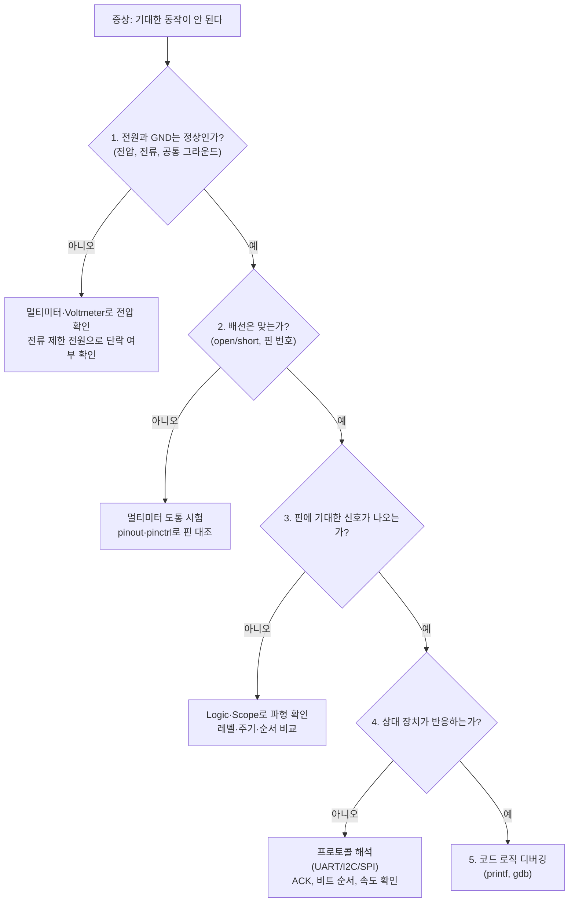
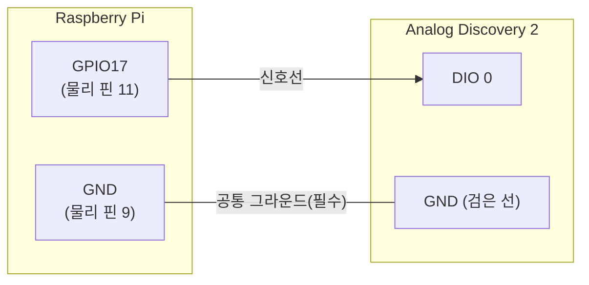
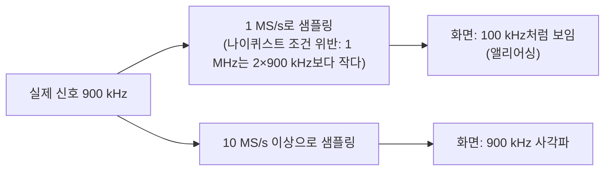
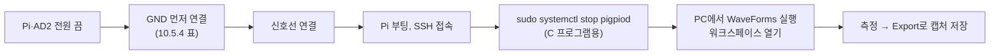

# 10장. 측정 장비로 신호 확인하기

> **학습 목표**
> - printf 디버깅과 계측기 관찰의 차이를 설명하고, 하드웨어 문제를 "전원 → 배선 → 신호 → 코드" 순서로 좁혀 가는 절차를 말할 수 있다.
> - 전압의 기준점(그라운드), 프로브 부하, 샘플링 속도와 나이퀴스트 조건, 대역폭과 상승 시간, 트리거, time/div·volt/div의 의미를 설명하고 측정 조건을 스스로 정할 수 있다.
> - Analog Discovery 2(AD2)와 Raspberry Pi를 안전하게 연결하는 규칙(공통 그라운드, 3.3 V 논리, 출력끼리 맞물리지 않기, 전원 역공급 금지)을 지킨다.
> - WaveForms의 Scope, Wavegen, Supplies, Voltmeter, Static I/O, Patterns, Logic, Protocol을 목적에 맞게 골라 쓰고, 워크스페이스(`.dwf3work`)로 설정을 저장·공유할 수 있다.
> - Raspberry Pi GPIO의 토글 속도, 논리 레벨과 구동 세기, 버튼 채터링, PWM, UART·I2C·SPI 파형을 직접 측정하고 이론값과 비교해 차이의 원인을 설명할 수 있다.

[8장](08_gpio_pigpio.md)과 [9장](09_pigpio_advanced.md)에서 우리는 코드로 핀을 움직였다. LED가 깜빡였으니 "잘 된다"고 생각했을 것이다. 그런데 LED가 정말 1초 주기로 깜빡였는가? PWM 듀티가 정말 25 %였는가? I2C 장치는 정말 우리가 보낸 주소에 대답했는가? 눈으로 본 LED, 화면에 찍힌 `printf`는 **프로그램이 그렇게 하려고 했다**는 증거일 뿐이고, **핀에서 실제로 그런 전압이 나왔다**는 증거는 아니다.

강의에서 여러 번 강조한 말이 있다. "**된다고 알고 있는 것과 관찰한 것은 다르다.**" 이 장의 한 줄 요약은 이것이다.

> **코드는 거짓말을 할 수 있어도, 파형은 거짓말을 하지 않는다.**

이 장에서는 수업에서 쓰는 USB 계측기 **Analog Discovery 2**(이하 AD2)와 소프트웨어 **WaveForms**로 Raspberry Pi의 신호를 직접 본다. 앞부분(10.1~10.3)은 어떤 계측기를 쓰든 통하는 측정의 기초이고, 가운데(10.4~10.6)는 AD2와 WaveForms 사용법이며, 뒷부분(실습 10-0~10-8)은 8·9·[12장](12_communication.md)에서 만든 신호를 실제로 재는 실습이다. 통신 프로토콜 자체의 원리는 12장에서 자세히 다루고, 이 장에서는 "그 신호를 어떻게 잡아서 무엇을 확인하는가"에 집중한다.

## 10.1 왜 측정하는가

### 10.1.1 printf 디버깅의 한계

소프트웨어만 다룰 때는 `printf`로 변수 값을 찍어 보는 것이 가장 흔한 디버깅 방법이다. 임베디드 시스템에서도 쓸모가 있지만, 다음 세 가지는 `printf`로 알 수 없다.

| `printf`가 알려 주는 것 | `printf`가 알려 주지 못하는 것 |
|---|---|
| 프로그램이 그 줄을 **실행했다** | 핀이 정말 그 전압이 되었는가(배선, 핀 번호, 다른 프로그램이 덮어씀) |
| 변수에 어떤 값이 **들어 있다** | 신호가 **언제**, **얼마나 오래** 그 값이었는가(μs 단위 타이밍) |
| 함수가 성공 코드를 **돌려줬다** | 상대 장치가 **실제로 받았는가**(ACK, 비트 순서, 보레이트) |

게다가 `printf` 자체가 시간을 잡아먹는다. 8장 버튼 예제에서 "매 루프마다 출력하면 터미널이 느려진다"고 했듯이, 빠른 신호를 재려고 `printf`를 넣는 순간 **측정하려던 동작이 바뀐다.** 물리학에서 말하는 "관찰이 대상을 바꾸는" 문제와 같다. 계측기는 핀에 바늘을 대고 옆에서 보기만 하므로, 프로그램을 거의 건드리지 않고 관찰할 수 있다.

비유하자면 `printf`는 **환자의 자기 진술**이고, 계측기는 **청진기나 X선 사진**이다. 환자가 "괜찮다"고 말해도 사진에는 금이 간 뼈가 보일 수 있다. 의사는 둘 다 보지만, 최종 판단은 사진으로 한다.

### 10.1.2 하드웨어 디버깅의 순서

강의 자료 「개발환경 구축」의 하드웨어 디버깅 절은 처음 만든 보드가 한 번에 동작할 가능성은 매우 낮고, 대부분은 **결선 문제**라고 말한다. 그래서 코드를 고치기 전에 다음 순서로 범위를 좁힌다.



- **개방(open)**: 끊어져야 할 곳이 아닌데 끊어진 것. 점퍼선 접촉 불량, 브레드보드 열을 잘못 꽂음. 멀티미터의 도통 시험으로 찾는다.
- **단락(short)**: 연결되면 안 되는 곳이 연결된 것. 개방보다 훨씬 위험하다. 특히 전원과 GND가 붙으면 과전류가 흘러 전원 장치와 보드가 함께 손상될 수 있다. 그래서 개발용으로는 **전류 제한을 설정할 수 있는 전원 공급 장치**를 쓰는 것이 좋다. 제한값에 걸리면 전압이 떨어지고 전류 표시가 제한값에 붙으므로 단락을 바로 알 수 있다.
- 전원·배선이 정상인데도 동작하지 않으면 그때 **오실로스코프**나 **로직 분석기**로 각 핀의 상태와 신호 변화를 본다.

## 10.2 측정의 기초

이 절의 내용은 AD2뿐 아니라 실험실의 어떤 오실로스코프에도 똑같이 적용된다. 처음 계측기를 쓸 때 나오는 문제의 대부분이 이 절의 개념 가운데 하나를 놓쳐서 생긴다.

### 10.2.1 전압은 언제나 "두 점 사이"의 값이다: 공통 그라운드

**왜 필요한가.** 전압계에 바늘이 두 개 있는 이유를 생각해 보자. 전압은 한 점의 성질이 아니라 **두 점 사이의 전위차**이다. "GPIO17이 3.3 V이다"라는 말은 "GPIO17이 **Pi의 GND에 대해** 3.3 V 높다"는 뜻을 줄인 것이다.

**비유.** 건물 3층 바닥의 높이를 잴 때, 1층 바닥을 기준으로 재면 6 m이지만 지하 주차장 바닥을 기준으로 재면 9 m이다. 두 사람이 기준점을 맞추지 않으면 같은 층을 두고 다른 숫자를 말하게 된다. 계측기와 Pi가 그라운드를 공유하지 않는 것은 서로 다른 바닥에서 키를 재는 것과 같다.

**정의.** 계측기의 입력은 "입력 핀과 계측기 GND 사이의 전압"을 잰다. 따라서 **계측기 GND를 측정 대상의 GND에 반드시 연결**해야 한다. Digilent의 AD2 레퍼런스 매뉴얼도 오실로스코프 절과 파형 발생기 절에서 "측정 대상 회로가 AD2와 **그라운드를 공유해야 한다**"고 명시한다. 디지털 입출력(DIO)도 논리 레벨이 AD2 GND를 기준으로 판정되므로 같은 규칙이 적용된다.



**흔한 오해.** "AD2도 Pi도 같은 PC의 USB에 꽂혀 있으니 GND가 이미 연결되어 있다"는 생각이다. 강의에서도 PC USB를 통해 그라운드가 공통일 가능성이 높지만, **확실히 하려면 AD2의 검은 선을 가까운 Pi GND 핀에 연결하라**고 했다. Pi를 별도 어댑터로 전원을 넣거나 노트북이 배터리로 동작하면 USB 경로의 그라운드는 보장되지 않는다. 그라운드 선이 없으면 신호가 아예 안 보이거나, 잡음 섞인 엉뚱한 레벨이 보이거나, 트리거가 불규칙하게 걸린다. 이 장의 모든 실습 표에서 **GND 연결이 첫 줄**인 이유이다.

### 10.2.2 프로브를 대는 순간 회로가 바뀐다: 부하 효과

**왜 필요한가.** 계측기 입력도 회로의 일부이다. 프로브를 대면 그만큼의 저항과 커패시턴스가 측정점에 매달린다. 이것을 **부하 효과**(loading effect)라고 한다.

**비유.** 타이어 공기압을 재려고 게이지를 꽂으면 공기가 조금 빠진다. 좋은 게이지는 그 양이 무시할 만큼 작다.

**정의.** AD2 오실로스코프 입력은 **1 MΩ ∥ 24 pF**이다(Digilent 사양). 1 MΩ은 GPIO 출력(수십 Ω 수준의 구동 저항)에 비하면 매우 커서 DC 전압에는 거의 영향이 없다. 하지만 24 pF와 플라이와이어·점퍼선의 커패시턴스는 **빠른 에지를 둔하게** 만든다. 출력 임피던스가 큰 신호(풀업 저항만으로 High가 되는 I2C 선, 내부 풀업만 켜진 버튼 입력)는 특히 영향을 받는다.

BNC(Bayonet Neill–Concelman)는 오실로스코프에서 쓰는, 돌려서 잠그는 동축 커넥터이다.

| 연결 방법 | 특징 | 쓰는 곳 |
|---|---|---|
| 플라이와이어(점퍼) 직접 연결 | 간편, 대역폭 낮음(아래 10.2.4), 선이 안테나처럼 잡음을 받음 | 디지털 신호, 저속 아날로그 |
| BNC 어댑터 + ×1 프로브 | 대역폭이 높지만 프로브 케이블 커패시턴스가 그대로 부하 | 저전압·저주파 정밀 측정 |
| BNC 어댑터 + ×10 프로브 | 입력 임피던스가 커지고 커패시턴스 부하가 줄어 빠른 에지에 유리. 신호가 1/10로 줄어 들어오므로 **소프트웨어 배율을 10×로 맞춰야** 함 | 상승 시간, 고속 신호 |

×10 프로브를 쓰면서 WaveForms의 채널 배율(Attenuation)을 1×로 두면 화면에 실제의 **1/10** 크기가 표시된다. 3.3 V 신호가 0.33 V로 보이면 거의 틀림없이 이 문제이다.

### 10.2.3 샘플링: 점을 찍어 선을 그린다

**왜 필요한가.** 디지털 계측기는 신호를 연속으로 보지 않는다. 일정한 간격으로 전압을 **샘플**(sample)로 찍고, 그 점들을 이어 화면에 그린다. 간격이 너무 넓으면 신호를 잘못 그린다.

**비유.** 선풍기 날개를 휴대폰 동영상으로 찍으면 날개가 천천히 돌거나 거꾸로 도는 것처럼 보일 때가 있다. 카메라는 초당 30장 정도만 찍는데 날개는 그보다 훨씬 빨리 돌기 때문에, 사진과 사진 사이에 날개가 거의 한 바퀴를 돌아 버린다. 사진만 보면 "조금 움직였다"고 착각한다.

**정의.**
- **샘플링 속도**(sample rate, f<sub>s</sub>): 1초에 찍는 점의 수. AD2의 Scope와 Logic은 최대 **100 MS/s**(초당 1억 점, 점 간격 10 ns)이다.
- **나이퀴스트 조건**: 주파수 f인 사인파를 재구성하려면 **f<sub>s</sub> > 2f**여야 한다. 2f를 넘지 못하면 실제보다 낮은 주파수의 가짜 신호가 보이는데, 이것을 **앨리어싱**(aliasing)이라 한다.
- 실무에서는 2배로는 모양을 알아볼 수 없다. 사각파의 에지 위치까지 보려면 **신호 주파수(또는 비트 속도)의 10배 이상**으로 샘플링하는 것을 습관으로 삼는다.

**예시: 앨리어싱 계산.** 900 kHz 사각파를 1 MS/s로 샘플링한다고 하자. 샘플 간격 1 μs 동안 신호는 0.9주기 진행하므로, 매 샘플마다 위상이 −0.1주기씩 뒤로 밀리는 것처럼 보인다. 결과적으로 화면에는 |900 kHz − 1 MHz| = **100 kHz**짜리 신호가 그려진다. 계측기는 아무 경고 없이 "100 kHz"라고 측정값까지 띄워 준다. 실습 10-4의 선택 단계에서 이 현상을 직접 만들어 본다.



**흔한 오해.** "계측기가 100 MS/s니까 언제나 100 MS/s로 찍는다"는 생각이다. 실제 샘플링 속도는 **화면의 시간축 설정과 버퍼 크기**로 정해진다(10.2.6). 1초짜리 화면을 보려고 time/div를 키우면 샘플링 속도는 자동으로 크게 내려간다. 13주차에 Simulink에서 샘플 시간을 0.1 s로 했을 때 1 Hz 사인파가 계단 모양으로 보였던 것도 같은 원리이다.

### 10.2.4 대역폭과 상승 시간 (📌 보강)

**왜 필요한가.** 샘플을 아무리 촘촘히 찍어도, 계측기 입력 회로(증폭기, 케이블)가 빠른 변화를 따라가지 못하면 에지가 둥글게 보인다.

**정의.**
- **대역폭**(bandwidth, BW): 사인파를 넣었을 때 진폭이 −3 dB(약 70.7 %)로 줄어드는 주파수.
- 계측기 자체의 **상승 시간**(rise time, 10 %→90 %)은 대략 **t<sub>r</sub> ≈ 0.35 / BW**이다.
- 측정된 상승 시간은 신호 자체의 상승 시간과 계측기 상승 시간이 합쳐진 값으로, 대략 √(t<sub>신호</sub>² + t<sub>계측기</sub>²)이다.

| AD2 연결 방식 | 아날로그 대역폭(−3 dB) | 계측기 상승 시간 ≈ 0.35/BW |
|---|---|---|
| 기본 플라이와이어 | 9 MHz | 약 39 ns |
| BNC 어댑터 | 30 MHz 이상 | 약 12 ns 이하 |

(대역폭 값은 Digilent AD2 사양. 0.35/BW와 제곱합 근사는 강의 자료에 없는 내용으로, 1차 저역 통과 응답을 가정한 계측 분야의 표준 근사식이다. 상승 시간 열은 이 근사식으로 계산한 값이다.)

**흔한 오해.** "화면에 보이는 상승 시간이 GPIO의 상승 시간이다." GPIO 출력의 에지가 계측기보다 빠르면, 화면에 보이는 상승 시간은 **계측기의 한계값**에 가깝다. 실습 10-2에서 구동 세기를 바꿔도 상승 시간이 거의 그대로라면, GPIO가 그대로인 것이 아니라 **계측기가 그 차이를 볼 수 없는 것**일 수 있다. 측정값을 해석할 때는 항상 "내 계측기가 이 값을 볼 능력이 있는가"를 먼저 묻는다.

### 10.2.5 트리거: 움직이는 신호를 멈춰 세우기

**왜 필요한가.** 반복 신호를 계속 그리면 그릴 때마다 시작점이 달라져 파형이 화면에서 흘러가 버린다. I2C 전송처럼 한 번만 지나가는 신호는 너무 빨라서 Run을 눌러 놓아도 눈에 들어오지 않는다. 13주차 수업에서도 LCD에는 글자가 찍혔는데 로직 분석기 화면에는 아무것도 안 지나가는 것처럼 보였다. 이때 쓰는 것이 **트리거**(trigger)이다.

**비유.** 경주로의 결승선 카메라는 계속 찍지 않는다. 말의 코가 선을 넘는 **그 순간**에 셔터를 누른다. 그래서 매 경주의 사진이 같은 구도로 나온다.

**정의.** 트리거는 "이 조건이 일어난 순간을 화면의 기준 시각(t = 0)으로 삼아라"라는 약속이다.

| 설정 | 뜻 | 예 |
|---|---|---|
| 소스(Source) | 어느 신호를 보고 판단하는가 | Scope CH1, Logic DIO 14(SCL) |
| 조건(Condition, Edge) | 상승(Rise)·하강(Fall)·양쪽(Edge), 또는 레벨·펄스 폭 | UART는 Fall, 버튼(풀업)은 Fall |
| 레벨(Level) | 아날로그 트리거에서 기준 전압 | 3.3 V 논리는 1.5~1.7 V 근처 |
| 위치(Position) | 트리거 시점을 화면 어디에 둘 것인가. 음수 시간 쪽을 보면 트리거 **이전**의 신호도 볼 수 있다 | 채터링의 시작 전 구간 |
| 모드 | **Auto**: 트리거가 없어도 일정 시간 후 그냥 그린다 / **Normal**: 조건이 올 때만 그린다 / **Single**: 한 번 잡고 멈춘다 | 반복 신호는 Auto, 한 번뿐인 사건은 Single |

**어느 에지에 걸까.** 2024년 수업에서 "I2C·UART는 평상시 High로 쉬다가 Low로 떨어지며 시작하므로 **하강 에지**로 거는 것이 자연스럽다"고 설명했다. 13주차에는 "데이터 선보다 <strong>클록(SCL)</strong>에 거는 것이 좋다"고 했다. 둘 다 같은 생각이다. **신호가 쉬고 있을 때 절대 일어나지 않고, 전송이 시작될 때 반드시 일어나는 사건**을 고른다.

### 10.2.6 화면 읽기: time/div, volt/div, 버퍼와 기록 시간

오실로스코프 화면은 가로 10칸, 세로 10칸 정도의 격자로 되어 있다.

- **time/div**(WaveForms의 Base): 가로 한 칸의 시간. 10칸 × time/div = 화면에 보이는 전체 시간.
- **volt/div**(Range): 세로 한 칸의 전압. 3.3 V 신호를 보려면 0.5 V/div 또는 1 V/div 정도가 적당하다.
- **Offset**(오프셋): 파형을 위아래로 옮기는 값. 0~3.3 V 신호를 화면 가운데 놓으려면 −1.65 V 정도를 준다.

샘플링 속도와 기록 시간은 **버퍼 크기**로 묶여 있다.

$$ \text{기록 시간} = \frac{\text{샘플 수}}{\text{샘플링 속도}} $$

AD2는 채널당 **최대 16k(16,384) 샘플**의 버퍼를 가진다(장치 설정에 따라 더 작게 쓸 수도 있다). 100 MS/s로 가득 채워도 약 **164 μs**밖에 담지 못한다. 그래서 신호마다 샘플링 속도를 골라야 한다.

| 측정 대상 | 한 비트(주기) | 권장 샘플링 속도(≥10배) | 16k 샘플 기록 시간 | 확인 |
|---|---|---|---|---|
| LED 500 ms 점멸 | 1 s | 1 kS/s | 약 16 s | 몇 주기 들어감 |
| 버튼 채터링 | 수 ms 안의 μs 펄스 | 1 MS/s | 약 16 ms | 채터링 전체 |
| UART 9600 bps | 104.17 μs | 1 MS/s | 약 16 ms | 1프레임(1.04 ms) 여러 개 |
| UART 115200 bps | 8.68 μs | 10 MS/s | 약 1.6 ms | 1프레임(86.8 μs) 여러 개 |
| I2C 100 kHz | 10 μs | 1~2 MS/s | 8~16 ms | 주소+데이터 몇 번 |
| SPI 1 MHz | 1 μs | 10~20 MS/s | 0.8~1.6 ms | 2바이트(16 μs) 충분 |

13주차에 I2C 클록을 커서로 재서 ΔX = 10 μs, 즉 100 kHz를 확인한 것처럼, 이 표의 "한 비트" 값은 실습에서 직접 재서 확인할 숫자이다.

### 10.2.7 어떤 계측기를 쓸 것인가

| 계측기 | 무엇을 보나 | 강점 | 약점 | 이 장의 실습 |
|---|---|---|---|---|
| 멀티미터 / Voltmeter | 한 순간의 DC 전압(또는 RMS) | 간단, 정확한 DC 값 | 시간 변화를 못 봄 | 10-0, 10-2 |
| 오실로스코프(Scope) | 전압의 **아날로그 모양** | 레벨, 상승 시간, 오버슈트, 잡음 | 채널 2개 | 10-0, 10-2, 10-4 |
| 로직 분석기(Logic) | 여러 선의 **0/1과 타이밍** | 16채널 동시, 프로토콜 해석 | 전압 모양은 모름(문턱값 기준 0/1만) | 10-1, 10-3~10-8 |
| 프로토콜 분석기(Protocol) | UART/I2C/SPI **송수신 데이터** | 터미널처럼 주고받기 | 파형은 안 보임 | 10.6.8 |

로직 분석기는 "전압이 문턱값보다 높으면 1"로만 기록한다. 그래서 2.0 V짜리 애매한 High도, 3.3 V짜리 깨끗한 High도 똑같이 1로 보인다. **레벨이 의심되면 Scope**, **타이밍과 순서가 궁금하면 Logic**이라고 기억한다.

## 10.3 안전과 한계

계측기는 측정 대상을 망가뜨리지 않아야 하고, 측정 대상도 계측기를 망가뜨리지 않아야 한다. 아래 표의 값은 Digilent AD2 사양과 Raspberry Pi 공식 문서에서 확인한 것이다.

| 항목 | 한계 | 의미 |
|---|---|---|
| AD2 Scope 입력 범위 | ±25 V (보호 ±50 V) | Pi 신호(0~5 V)는 넉넉히 안전 |
| AD2 DIO 입력 | LVCMOS(Low-Voltage CMOS, 저전압 CMOS 논리 규격) **1.8 V/3.3 V, 5 V 허용**(5 V tolerant) | Pi의 3.3 V 신호를 바로 받아도 된다 |
| AD2 DIO 출력(Static I/O) | LVCMOS **3.3 V, 4 mA** | Pi 입력을 구동해도 안전 |
| AD2 Patterns 출력 | LVCMOS **3.3 V, 12 mA** | Pi 입력을 구동해도 안전 |
| AD2 Wavegen(W1, W2) | **±5 V** 출력, 오프셋 ±5 V | 설정에 따라 **음전압이나 5 V가 나온다. Pi GPIO에 직접 연결 금지** |
| AD2 Supplies(V+, V−) | +0.5~+5 V, −0.5~−5 V | **Pi의 3.3 V·5 V 핀에 연결 금지** |
| Pi GPIO | **3.3 V 논리, 5 V 비허용** | 5 V 신호를 넣으면 SoC 손상 가능([8장](08_gpio_pigpio.md) 8.1.1) |

이 표에서 다음 다섯 가지 규칙이 나온다.

1. **GND 먼저, 신호는 나중에.** 선을 꽂을 때는 GND를 먼저 연결하고, 뺄 때는 신호선을 먼저 뺀다. 기준점이 없는 상태에서 신호선만 닿는 순간을 줄인다.
2. **출력과 출력을 맞물리지 않는다.** Pi가 출력으로 쓰는 핀(예: GPIO17)에 AD2도 출력(Static I/O의 Button/Switch, Patterns)을 걸면 두 출력이 서로 반대 레벨을 내려고 싸운다. AD2가 Pi를 **볼 때**는 Logic·Static I/O의 LED(표시) 모드처럼 **입력**으로만 쓰고, AD2가 Pi를 **구동할 때**는 Pi 쪽 핀이 **입력으로 설정되었는지** 먼저 확인한다(`pinctrl get 26`).
3. **Wavegen 출력은 GPIO에 바로 넣지 않는다.** Wavegen은 아날로그 함수 발생기라 기본 설정에서 음전압까지 내려간다. 디지털 펄스가 필요하면 3.3 V로 고정된 **Patterns** 또는 **Static I/O**를 쓴다.
4. **AD2 전원으로 Pi를 먹이지 않는다(역공급 금지).** AD2 Supplies는 USB 전원일 때 두 채널 합계 500 mW로 Pi 4를 돌리기에 턱없이 부족하고, Pi의 5 V·3.3 V 레일에 다른 전원을 연결하면 두 전원이 서로를 거꾸로 밀어 손상될 수 있다. Pi는 Pi 전원 어댑터로, AD2는 USB로 각각 전원을 넣고 **GND만 공유**한다.
5. **5 V 장치의 신호는 측정 전에 전압부터 본다.** 5 V 모듈(예: 5 V로 전원을 넣은 I2C LCD 모듈)이 Pi 핀에 연결되어 있다면, 먼저 Voltmeter로 그 선의 쉬는 전압이 3.3 V를 넘지 않는지 확인한다(실습 10-6).

> 📌 **보강: 동시에 쓸 수 없는 계측기 조합.** AD2는 내부 하드웨어를 여러 계측기가 나눠 쓴다. Scope는 Voltmeter, Data Logger, Spectrum, Network, Impedance와 동시에 쓸 수 없고(아날로그 입력 공유), Protocol은 Logic, Patterns와 동시에 쓸 수 없다(디지털 하드웨어 공유). 반대로 Logic은 Patterns·Static I/O가 쓰는 핀을 **입력으로 함께** 볼 수 있다. 한 핀을 두 계측기가 동시에 **출력**으로 쓰는 것은 막혀 있다. 출처: [Digilent – Analog Discovery 2 Reference Manual](https://digilent.com/reference/test-and-measurement/analog-discovery-2/reference-manual), [Using the Logic Analyzer](https://digilent.com/reference/test-and-measurement/guides/waveforms-logic-analyzer)

## 10.4 Analog Discovery 2 살펴보기

### 10.4.1 USB 하나에 실험실 한 대

학부 회로 실험실에 가면 오실로스코프, 함수 발생기, 전원 공급 장치, 멀티미터, 로직 분석기가 책상마다 쌓여 있다. AD2는 이 장비들의 핵심 기능을 손바닥만 한 상자 하나에 넣고, 화면과 조작은 PC의 **WaveForms** 프로그램이 맡는 **PC 기반 계측기**이다. 강의에서 AD2를 쓰는 이유도 여기에 있다. 공간을 적게 차지하고, 앞으로 PC 기반 계측기로 일할 일이 많아지며, 학부 실험에 필요한 계측 대부분을 이 장치 하나로 할 수 있다.


> 📌 **보강: AD2는 단종(legacy) 제품이다.** Digilent는 AD2를 더 이상 판매하지 않으며 후속 제품으로 **Analog Discovery 3**(AD3)를 권한다. WaveForms는 AD2를 계속 지원하므로 수업에서 쓰는 데 문제는 없다. 출처: [Digilent – Analog Discovery 2 Reference Manual](https://digilent.com/reference/test-and-measurement/analog-discovery-2/reference-manual)

### 10.4.2 주요 사양 (📌 보강)

다음 표는 Digilent 공식 사양 페이지의 값이다. 이 장에서 실제로 쓰는 값은 굵게 표시했다.

| 계측 기능 | 항목 | AD2 | AD3 (참고) |
|---|---|---|---|
| 오실로스코프 | 채널 | 2 (차동) | 2 |
| | 분해능 | 14비트 | 14비트 |
| | 샘플링 속도 | **100 MS/s** | 125 MS/s |
| | 대역폭(BNC 어댑터 / 플라이와이어) | **30 MHz 이상 / 9 MHz** | 30 MHz 이상 / 9 MHz |
| | 입력 임피던스 | **1 MΩ ∥ 24 pF** | 1 MΩ ∥ 24 pF |
| | 입력 범위 | **±25 V** | ±25 V(±2.5 V 저범위 포함) |
| | 버퍼(채널당) | **최대 16k 샘플** | 최대 32k 샘플 |
| 파형 발생기(Wavegen) | 채널 / 분해능 / 속도 | 2 / 14비트 / 100 MS/s | 2 / 14비트 / 125 MS/s |
| | 출력 범위 | **±5 V** | ±5 V |
| | 대역폭(BNC / 플라이와이어) | 12 MHz / 9 MHz | 12 MHz / 9 MHz |
| 로직 분석기·패턴 발생기·Static I/O | 채널 | **16 (공유)** | 16 |
| | 샘플링 속도 | **100 MS/s** | 125 MS/s |
| | 입력 | **LVCMOS 1.8/3.3 V, 5 V 허용** | 3.3 V, 5 V 허용 |
| | 출력 | **LVCMOS 3.3 V** (Static I/O 4 mA, Patterns 12 mA) | 3.3 V, 4~16 mA 설정 |
| 전원 공급(Supplies) | 전압 | **+0.5~+5 V, −0.5~−5 V** | 같음 |
| | 최대 전력 | **USB 전원: 합계 500 mW** / 외부 전원: 채널당 2.1 W, 700 mA | 외부 전원: 채널당 800 mA 또는 2.4 W |
| Voltmeter | 채널 / 측정 | 2 (Scope와 공유) / DC, AC RMS, True RMS | — |
| 기타 | 연결 | USB 2.0 (Micro-B) | USB-C |
| | 추가 기능 | Network·Spectrum·Impedance 분석, Protocol 분석, 외부 트리거 2개, 스크립트 | 같음(해석기 종류 추가) |

출처: [Digilent – Analog Discovery 2 Specifications](https://digilent.com/reference/test-and-measurement/analog-discovery-2/specifications), [Analog Discovery 3 Specifications](https://digilent.com/reference/test-and-measurement/analog-discovery-3/specifications)

> **원본 자료 정정** (강의 자료 「Analog Discovery 2」)
> - **AD2/AD3 비교표**: AD3의 대역폭 "50 MHz", 파형 발생기 "25 MHz", 디지털 "32채널", 전원 "1 A"는 Digilent 공식 사양과 다르다. 위 표처럼 AD3는 125 MS/s, 30 MHz 이상(BNC), 12 MHz, 16채널, 채널당 800 mA/2.4 W(외부 전원)이다. AD2 쪽의 "최대 700 mA"도 **외부(AUX) 전원을 쓸 때 채널당** 값이며, USB 전원만 쓰면 두 채널 합계 500 mW로 제한된다. 같은 문서 안의 "250 mW per channel", "500 mW", "2.1 W", "700 mA"가 서로 모순처럼 보인 것은 전원 방식을 구분하지 않았기 때문이다.
> - **전원 전압 범위**: "0 to 5 V or 0 to −5 V"가 아니라 **0.5~5 V, −0.5~−5 V**이다. 0 V 근처는 설정할 수 없다.
> - **파형 발생기 "Input Impedance 1 MΩ"**: 출력 장치에 입력 임피던스 항목은 없다. 오실로스코프 항목을 복사하다 생긴 오류이다.
> - **버퍼 크기**: Scope 8192, Wavegen 4096은 기본 장치 설정의 값이다. 사양상 최대는 채널당 16k 샘플이다(WaveForms Device Manager에서 설정을 고른다).
> - **구성품**: Digilent 시작 안내서 기준 기본 구성품은 본체, 6핀 수(male) 헤더 5개, USB Micro-B 케이블, 페라이트 코어, 2×15 플라이와이어이다. BNC 어댑터와 프로브는 별도 품목이다(실습실 키트에는 함께 들어 있다).
> - 제품 이름은 "Waveform"이 아니라 **WaveForms**이고, `reference.digilentinc.com`·`store.digilentinc.com` 주소는 모두 `digilent.com/reference/…`로 바뀌었다. "NBC 프루브"는 **BNC** 프로브의 오타이다.

### 10.4.3 커넥터와 핀 배치

AD2 본체 옆의 2×15 핀 커넥터에 **플라이와이어**(flywire, 끝이 핀 소켓인 30가닥 케이블 묶음)를 꽂아 쓴다. 각 선의 소켓에는 이름표가 붙어 있고, 상자 안쪽 종이 받침 뒤에 핀 배치도 카드가 들어 있다. 기능별로 정리하면 다음과 같다.

| 묶음 | 핀 이름 | 기능 | 이 장에서 |
|---|---|---|---|
| 오실로스코프 | 1+, 1− / 2+, 2− | 채널 1·2의 차동 입력. 단일 종단으로 쓸 때는 **−를 GND에** 연결 | 10-0, 10-2, 10-4 |
| 파형 발생기 | W1, W2 | 아날로그 출력(±5 V) | 10-0 자체 시험만 |
| 전원 | V+, V− | 가변 전원 출력 | 사용 안 함(역공급 금지) |
| 그라운드 | ⏚ (여러 가닥) | 공통 그라운드 | **항상** |
| 트리거 | T1, T2 | 외부 트리거 입출력 | 사용 안 함 |
| 디지털 | DIO 0~15 | Logic, Patterns, Static I/O, Protocol이 공유 | 10-1~10-8 |

강의 자료 기준 색은 1+ 주황, 1− 주황 줄무늬, W1 노랑, GND 검정, V+ 빨강, V− 흰색이다. 디지털 선의 색은 키트(케이블 판)에 따라 다를 수 있다. 2025년 수업의 키트에서는 커넥터 끝쪽의 DIO 7이 갈색이었다. **선 색으로 외우지 말고 소켓의 이름표와 핀 배치도 카드로 확인한다.**

<!-- 그림 필요: AD2 2×15 커넥터 핀 배치도 (Digilent AD2 Reference Manual의 pinout 그림 또는 키트 카드 사진, 실습실 키트로 색 확인 후 표기) -->

### 10.4.4 BNC 어댑터와 프로브

BNC 어댑터는 AD2 커넥터에 꽂아 오실로스코프 입력 2개(CH1, CH2)와 파형 발생기 출력 2개(W1, W2)를 BNC 단자로 바꿔 준다. 나머지 핀(전원, DIO 등)은 어댑터 위의 2×15 헤더로 그대로 통과한다. BNC로 연결하면 Scope 대역폭이 9 MHz(플라이와이어)에서 30 MHz 이상으로 올라간다.

- **단일 종단**(single-ended): BNC 연결에서는 프로브 바깥 도체가 GND이다. 따라서 프로브의 집게(그라운드 리드)를 **반드시 Pi GND에** 물린다.
- **AC/DC 커플링**: 어댑터 기판의 점퍼로 고른다. **디지털 신호는 DC 커플링**으로 본다. AC 커플링은 신호의 평균(DC) 성분을 잘라 내므로 0~3.3 V 사각파가 −1.65~+1.65 V처럼 보인다. 아날로그 신호의 작은 흔들림(리플)만 크게 보고 싶을 때 AC를 쓴다. 강의 자료의 권고처럼 평소에는 DC로 두면 DC와 AC 성분을 함께 볼 수 있다.
- **프로브 배율**: 프로브 몸통의 ×1/×10 스위치와 WaveForms 채널 설정(톱니바퀴 → Attenuation)을 **같은 값으로** 맞춘다.

<!-- 그림 필요: BNC 어댑터의 커플링 점퍼 위치와 WaveForms Scope 채널 설정(Attenuation 10X) 화면 -->

## 10.5 WaveForms 설치와 워크스페이스

### 10.5.1 설치

WaveForms는 Digilent 웹사이트에서 무료로 내려받는다. 설치 파일에는 장치 드라이버(Adept Runtime)가 함께 들어 있다.

**Windows**
1. [WaveForms 페이지](https://digilent.com/reference/software/waveforms/waveforms-3/start)에서 "Latest Installers"를 눌러 Windows용 설치 파일을 받는다(Digilent 계정 로그인을 요구할 수 있다).
2. 설치 프로그램을 실행하고 기본값으로 설치한다. 드라이버 설치 창이 나오면 허용한다.
3. AD2를 USB로 연결한 뒤 WaveForms를 실행한다. 장치가 하나뿐이면 자동으로 연결되고, 오른쪽 아래에 `Discovery2 SN:…`처럼 연결된 장치가 표시된다.
4. 장치가 없으면 **Device Manager** 창이 뜬다. 목록에서 AD2를 골라 **Select**를 누른다. 목록의 **DEMO** 장치는 실물 없이 화면만 연습할 때 쓴다.

**macOS·Linux**: 같은 페이지에서 macOS용과 Linux용(.deb, .rpm) 설치 파일을 제공한다. Linux에서는 Adept Runtime을 먼저 설치하고 WaveForms를 설치한다.

> 📌 **보강: Raspberry Pi에서 WaveForms 실행.** Digilent는 Raspberry Pi 4·5에 64비트 ARM용 Adept Runtime과 WaveForms(.deb)를 설치해 AD2를 쓰는 안내서를 제공한다(`sudo apt install ./digilent.adept.runtime_…_arm64.deb`, `sudo apt install ./digilent.waveforms_…_arm64.deb`). 다만 최신 WaveForms의 ARM 빌드는 glibc 2.41 이상을 요구하고 Bookworm은 glibc 2.36이므로, Bookworm에서는 최신판이 설치되지 않을 수 있다. 무엇보다 **측정 대상인 Pi에서 WaveForms를 돌리면 CPU 부하가 측정 결과(토글 속도, 지터, 지연)를 바꾼다.** 이 장의 실습은 WaveForms를 **PC에서** 실행한다. 출처: [Digilent – WaveForms](https://digilent.com/reference/software/waveforms/waveforms-3/start), [Getting Started with Raspberry Pi and a Test and Measurement Device](https://digilent.com/reference/test-and-measurement/guides/getting-started-with-raspberry-pi)

### 10.5.2 첫 화면

WaveForms를 실행하면 **Welcome** 탭 왼쪽에 계측기 버튼이 세로로 늘어서 있다. 버튼을 누르면 그 계측기가 새 탭으로 열린다. 여러 계측기를 탭으로 동시에 열어 둘 수 있고(10.3의 공유 제한 안에서), 탭을 끌어 창을 나눌 수도 있다.

| 버튼 | 계측기 | 이 장의 절 |
|---|---|---|
| Scope | 오실로스코프 | 10.6.1 |
| Wavegen | 파형 발생기 | 10.6.2 |
| Supplies | 전원 공급 장치 | 10.6.3 |
| Voltmeter | 전압계 | 10.6.4 |
| Logic | 로직 분석기 | 10.6.7 |
| Patterns | 패턴 발생기 | 10.6.6 |
| StaticIO | 정적 디지털 입출력 | 10.6.5 |
| Protocol | 프로토콜 분석기 | 10.6.8 |
| Spectrum, Network, Impedance, Logger, Script | 스펙트럼·네트워크 분석, 데이터 기록, 스크립트 | 10.6.9 |

<!-- 그림 필요: WaveForms Welcome 화면(왼쪽 계측기 버튼 목록, 오른쪽 아래 연결 장치 표시) -->

### 10.5.3 워크스페이스(.dwf3work)와 프로젝트 파일 (📌 보강)

실습할 때마다 Logic에 채널을 추가하고 이름을 붙이고 UART·I2C·SPI 해석기를 설정하는 일은 번거롭다. 2024년 수업에서도 "매번 이러면 불편하니 환경을 저장해 두자"며 미리 만든 설정을 불러왔다. WaveForms에는 이를 위한 두 가지 저장 단위가 있다.

| 단위 | 확장자 | 담는 내용 | 메뉴 |
|---|---|---|---|
| **워크스페이스**(workspace) | `.dwf3work` | 열려 있는 **모든 계측기**의 설정 + (선택) 획득한 데이터 | Welcome 탭 또는 상단 **Workspace** 메뉴: New / Open / Save / Save As |
| **프로젝트**(project) | `.dwf3scope`, `.dwf3logic` 등 | **계측기 하나**의 설정 + (선택) 데이터 | 각 계측기의 **File** 메뉴: Save Project / Open Project |

Save As에서 "File Type"으로 획득 데이터를 포함할지 고른다. 데이터를 포함하면 측정 결과를 다른 사람에게 그대로 보여 줄 수 있어, 과제 제출이나 조원 사이 공유에 편하다. 데이터만 따로 저장할 때는 계측기의 **File → Save Acquisition**(WaveForms로 다시 열기용) 또는 **File → Export**(CSV, 그림)를 쓴다.

> 📌 출처: [Digilent – Saving and Sharing WaveForms Workspaces](https://digilent.com/reference/test-and-measurement/guides/waveforms-sharing)

**강의 저장소의 워크스페이스.** 저장소 루트에는 강의용 워크스페이스 [`RaspberryPi.dwf3work`](../RaspberryPi.dwf3work)가 있다. 이 파일은 WaveForms가 만든 압축 묶음이라 텍스트 편집기로는 읽을 수 없고, WaveForms의 **Workspace → Open**으로 연다. 내용을 확인해 보면 WaveForms 3.18.1에서 저장한 것으로, **Logic 계측기 하나**에 다음 채널이 미리 설정되어 있다.

| 채널 이름 | AD2 핀 | 설정 |
|---|---|---|
| DIO 0 ~ DIO 7 | DIO 0~7 | 일반 신호(Signal) 8개 |
| UART TxD | DIO 8 | UART 해석기, 8비트, 패리티 없음, 정지 비트 1, ASCII 표시, 보레이트 자동(Auto Arbitrary) |
| UART RxD | DIO 9 | 위와 같음 |
| SPI MOSI (Select / Clock / MOSI) | DIO 10 / DIO 11 / DIO 12 | SPI 해석기, Select active Low, 상승 에지 샘플링, MSB 먼저, 8비트, 16진 표시 |
| SPI MISO | DIO 13 | 위 SPI의 MISO |
| I2C (Clock / Data) | DIO 14 / DIO 15 | I2C 해석기, 7비트 주소 |

- 트리거는 Normal 모드, UART TxD(DIO 8)의 **하강 에지**로 저장되어 있다.
- UART 보레이트가 "자동"으로 되어 있는데, 자동 추정은 신호가 적거나 잡음이 있으면 틀린다. 실습 10-5에서는 **9600 또는 115200을 직접 입력**한다.
- 저장된 획득 데이터는 거의 쉬는 상태(변화 없음)이므로 예제 파형으로 기대하지 말고, 설정 틀로 쓴다.
- Scope 등 다른 계측기는 들어 있지 않다. 필요한 계측기를 추가한 뒤 **Save As**로 자기 이름의 워크스페이스를 만들어 쓴다.

### 10.5.4 이 장의 표준 배선

이 장의 모든 실습은 위 워크스페이스의 채널 배치를 따른다. AD2 쪽 배선도 [8장](08_gpio_pigpio.md) 8.2.4절 **이 교재의 표준 배선**에 맞춰 정해 두었다. DIO 번호마다 Pi 핀이 하나씩 고정되어 있으므로, 한 번 꽂아 두면 이 장의 실습은 물론 [9장](09_pigpio_advanced.md)(웨이브폼 마커), [11장](11_process_concurrency.md)(LED), [12장](12_communication.md)(통신·DS1302)의 측정도 배선을 옮기지 않고 할 수 있다(단, 10.3의 규칙 2에 따라 지금 쓰지 않는 Pi 핀이 출력으로 남아 있지 않은지 확인한다).

| AD2 | 방향 | Raspberry Pi (표준 역할) | 실습 |
|---|---|---|---|
| **GND (검은 선)** | — | **GND (물리 핀 6, 9, 14, 20, 25, 30, 34, 39 중 하나)** | **모든 실습** |
| DIO 0 | Pi → AD2 | GPIO17 (물리 핀 11), LED0 | 10-1, 10-8 |
| DIO 1 | Pi → AD2 | GPIO18 (물리 핀 12), PWM 출력 | 10-4 |
| DIO 2 | 관찰 또는 AD2 → Pi | GPIO26 (물리 핀 37), BTN0 | 10-3(관찰), 10-8(구동) |
| DIO 3 | Pi → AD2 | GPIO27 (물리 핀 13), LED1 | 9장 실습 9-7 웨이브폼 마커 |
| DIO 4 / 5 / 6 | 관찰 | GPIO12 / 19 / 16 (물리 핀 32 / 35 / 36), DS1302 CE / SCLK / IO | 12장 DS1302 |
| DIO 7 | Pi → AD2 | GPIO13 (물리 핀 33), 서보 신호 | 9장 실습 9-5 |
| DIO 8 (UART TxD) | Pi → AD2 | GPIO14 / TXD (물리 핀 8) | 10-5 |
| DIO 9 (UART RxD) | 상대 → Pi | GPIO15 / RXD (물리 핀 10) | 10-5 |
| DIO 10 (SPI Select) | Pi → AD2 | GPIO8 / CE0 (물리 핀 24) | 10-7 |
| DIO 11 (SPI Clock) | Pi → AD2 | GPIO11 / SCLK (물리 핀 23) | 10-7 |
| DIO 12 (SPI MOSI) | Pi → AD2 | GPIO10 / MOSI (물리 핀 19) | 10-7 |
| DIO 13 (SPI MISO) | 상대 → Pi | GPIO9 / MISO (물리 핀 21) | 10-7 |
| DIO 14 (I2C Clock) | 양방향 관찰 | GPIO3 / SCL1 (물리 핀 5) | 10-6 |
| DIO 15 (I2C Data) | 양방향 관찰 | GPIO2 / SDA1 (물리 핀 3) | 10-6 |
| Scope 1+ / 1− | Pi → AD2 | 측정점 / GND | 10-0, 10-2, 10-4 |
| Scope 2+ / 2− | Pi → AD2 | 측정점 / GND | 10-2 |

- 수업마다 쓴 DIO 번호가 조금씩 달랐다. 2025년 11주차에는 GPIO17 ↔ DIO 7, GPIO18 ↔ DIO 6을, 13주차에는 SCL ↔ DIO 0, SDA ↔ DIO 1을 썼다. 어느 번호를 쓰든 상관없지만, **WaveForms 채널 설정과 실제 배선이 일치**해야 한다. 이 교재는 저장소 워크스페이스의 배치와 위 표(DIO0~DIO15)로 통일한다. 워크스페이스에서는 DIO 0~7이 이름 없는 Signal로 들어 있으므로, 쓰는 DIO의 이름을 위 표의 역할(`LED0(GPIO17)`, `MARK(GPIO27)` 등)로 바꿔 두면 편하다.
- HC-SR04(GPIO20/21)처럼 **레벨 시프터를 거치는 신호**는 Pi 쪽(LV 쪽)을 잰다. AD2 DIO는 5 V를 견디므로 HV 쪽을 재도 손상되지는 않지만, Pi가 실제로 보는 전압은 LV 쪽이다.
- Pi와 AD2 모두 **전원을 끈 상태에서** 배선한 뒤 전원을 넣는 것이 가장 안전하다.

## 10.6 WaveForms 계측기 사용법

각 계측기를 "언제 쓰나 → 화면 구성 → 기본 순서 → 자주 하는 실수" 순으로 정리한다. 세부 메뉴는 WaveForms 버전마다 조금씩 다르므로, 막히면 각 계측기 창의 도움말(물음표 아이콘)이나 Digilent의 계측기별 안내서를 본다.

### 10.6.1 오실로스코프(Scope)

**언제 쓰나**: 신호의 **아날로그 모양**을 볼 때. 전압 레벨(V<sub>OH</sub>, V<sub>OL</sub>), 상승·하강 시간, 오버슈트·링잉, 잡음, 아날로그 센서 출력.

**화면 구성**: 가운데 그래프, 위쪽 도구 막대(Run/Stop, Single, Mode, Trigger 설정), 오른쪽 패널(Time: Position·Base / 채널별 Offset·Range), 그래프 오른쪽의 트리거 레벨 화살표.

**기본 순서**
1. **Scope** 버튼으로 연다. 쓰지 않는 채널은 체크를 꺼서 화면을 단순하게 한다.
2. 채널의 **Range**(volt/div)와 **Offset**을 신호 크기에 맞춘다. 3.3 V 디지털 신호는 Range 500 mV/div, Offset −1.65 V 정도면 화면에 꽉 찬다.
3. **Base**(time/div)를 신호 주기에 맞춘다. 화면 10칸에 2~3주기가 들어가게 한다.
4. **Trigger**: Source를 측정 채널로, Condition은 Rise 또는 Fall, Level은 신호의 중간(3.3 V 신호면 약 1.6 V). 모드는 반복 신호면 **Auto**, 한 번뿐인 신호면 **Normal**이나 **Single**.
5. **Run**(연속) 또는 **Single**(한 번)을 누른다.
6. **측정값**: 상단 **View → Measurements**를 열고 **Add → Defined Measurement**에서 필요한 항목을 추가한다. 이 장에서 자주 쓰는 항목은 다음과 같다.

| 분류 | 항목 | 뜻 |
|---|---|---|
| 수직(Vertical) | Maximum, Minimum, Peak2Peak, Average | 최댓값, 최솟값, 최대−최소, 평균 |
| 수평(Horizontal) | Frequency, Period | 주파수, 주기 |
| | PosDuty, PosWidth | 양(High) 듀티 비, High 폭 |
| | RiseTime, FallTime | 10 %→90 % 상승 시간, 하강 시간 |

7. **커서**: **View → Cursors**에서 커서를 추가하거나 그래프를 클릭해 수직 커서 두 개를 놓으면 두 점 사이의 시간 차 ΔX와 1/ΔX(주파수)가 표시된다. 13주차에 I2C 클록 한 주기를 재서 ΔX = 10 μs를 확인한 방법이다.
8. **저장**: **File → Export**로 그림(PNG) 또는 데이터(CSV)를 저장한다. 과제 보고서의 캡처는 이 기능으로 만든다.

강의 자료의 측정 메뉴 설명처럼, 도구 막대에는 Measurements가 두 군데 보일 수 있다. 왼쪽은 아날로그 채널, 오른쪽은 Scope에 디지털 채널을 함께 띄웠을 때(혼합 신호 보기)의 디지털 측정이다.

<!-- 그림 필요: WaveForms Scope 화면 - Range/Offset/Base 패널, 트리거 레벨 화살표, Measurements 창(Maximum, Minimum, Peak2Peak, Frequency) -->

### 10.6.2 파형 발생기(Wavegen)

**언제 쓰나**: 사인파·삼각파·사각파 등 아날로그 시험 신호가 필요할 때. 이 장에서는 AD2 자체 시험(실습 10-0)에만 쓴다.

**기본 순서**: **Wavegen** 열기 → Channel 1 선택 → Type(Sine, Square, Triangle, DC 등) → Frequency, Amplitude, Offset, Symmetry(듀티), Phase 설정 → **Run**. 같은 화면에서 Sweep(주파수 쓸기)과 AM·FM 변조도 설정할 수 있다.

**자주 하는 실수**: Amplitude는 **진폭**(중심에서 꼭대기까지)이다. Amplitude 1 V, Offset 0이면 −1~+1 V가 나온다. 0~2 V를 원하면 Amplitude 1 V, Offset 1 V로 한다. 앞에서 말했듯 Wavegen 출력을 GPIO에 넣지 않는다.

### 10.6.3 전원 공급 장치(Supplies)

**언제 쓰나**: 브레드보드의 작은 회로(센서, 연산증폭기)에 ±5 V 이하의 전원이 필요할 때.

**기본 순서**: **Supplies** 열기 → Positive Supply(V+, 0.5~5 V)와 Negative Supply(V−, −0.5~−5 V) 전압 설정 → 각 채널 On → **Master Enable** On. Master Enable이 꺼져 있으면 각 채널은 "Ready"로만 표시되고 전압이 나오지 않는다. 창 아래쪽에 USB 전원인지 외부 전원인지와 사용 전력이 표시되며, 한도를 넘으면 과전류 경고가 뜬다.

**주의**: USB 전원으로는 두 채널 합계 500 mW이다. Pi나 모터처럼 전류가 큰 부하는 돌릴 수 없고, Pi 전원 핀에 연결해서도 안 된다(10.3 규칙 4).

### 10.6.4 전압계(Voltmeter)

**언제 쓰나**: 시간 변화 없이 **전압 숫자 하나**가 필요할 때. 전원 레일 확인, GPIO가 High로 고정되었을 때의 V<sub>OH</sub>, I2C 선의 쉬는 전압.

**기본 순서**: **Voltmeter** 열기 → Run. 채널 1·2(Scope 입력과 같은 1+/1−, 2+/2− 선)의 **DC**, **AC RMS**, **True RMS** 값이 표시된다. RMS(root mean square, 제곱 평균 제곱근)는 흔들리는 전압을 같은 열을 내는 DC 전압으로 환산한 실효값이다. DC는 평균 전압, AC RMS는 DC를 뺀 흔들림의 실효값, True RMS는 둘을 합친 실효값이다. Voltmeter와 Scope는 같은 입력을 쓰므로 동시에 쓸 수 없다.

### 10.6.5 정적 입출력(Static I/O)

**언제 쓰나**: 디지털 핀의 **지금 상태**를 LED처럼 보거나, 마우스로 버튼·스위치를 만들어 Pi에 0/1을 넣을 때. 11주차 수업에서 `gpio write` 결과를 확인하고, 버튼 없이 입력 신호를 만드는 데 썼다.

**기본 순서**: **StaticIO** 열기 → DIO마다 표시 방식을 고른다.
- **LED**(표시, 입력): 핀 레벨을 초록/회색 LED로 보여 준다. AD2는 입력이므로 Pi 출력 핀에 연결해도 안전하다.
- **Button**: 누르는 동안만 값이 바뀌는 출력. 눌렀을 때/뗐을 때의 값(0, 1, Z)을 고른다.
- **Switch**: 클릭할 때마다 상태가 유지되는 출력. Push-Pull, Open-Drain, Open-Source, Three-State 중 고른다. 네 가지 출력 방식의 의미는 [8장 8.3.1절](08_gpio_pigpio.md)의 표에서 이미 다루었다.

**주의**: Static I/O는 시간 정보를 주지 않는다. 500 ms 점멸이 정말 500 ms인지는 알 수 없다. 11주차 수업에서 말했듯, 시간을 보려면 **Logic**으로 가서 time/div를 맞춘다. 그리고 Button/Switch로 바꾼 DIO는 **출력**이 되므로, 그 DIO가 Pi의 **출력** 핀에 연결되어 있으면 안 된다.

<!-- 그림 필요: WaveForms StaticIO 화면 - DIO별 LED/Button/Switch 선택 메뉴 -->

### 10.6.6 패턴 발생기(Patterns)

**언제 쓰나**: 정해진 디지털 파형(클록, 펄스, 임의 비트열, 카운터)을 시간에 맞춰 내보낼 때. 이 장에서는 실습 10-8에서 Pi 입력(GPIO26)에 일정한 펄스를 넣는 데 쓴다.

**기본 순서**
1. **Patterns** 열기 → **+** (Click to Add channels) → **Signal**에서 출력할 DIO를 고른다. 여러 DIO를 묶을 때는 **Bus**(2진·16진 표시, MSB/LSB 순서 지정)를 고른다. **ROM Logic**은 입력 DIO 조합에 대한 진리표로 출력을 만든다.
2. 채널 줄의 **Type**: Clock(주파수·듀티), Pulse(한 번 또는 반복 펄스), Custom(샘플을 직접 그림), Random, Binary Counter 등.
3. **Output**: PP(Push-Pull, 0/1), OD(Open-Drain, 0/Z), OS(Open-Source, 1/Z), TS(Three-State, 0/1/Z). Pi 입력을 구동할 때는 **PP**.
4. **Idle**: 패턴이 쉬는 동안(Wait 시간, 정지 후)의 출력 값. 0, 1, Z 또는 초깃값 유지.
5. 위쪽의 **Trigger**(None, Manual 등), **Wait**(시작 전 대기), **Run**(실행 시간), **Repeat**(반복 횟수)를 정하고 **Run**.

> **원본 자료 정정**: 강의 자료의 Logic 실습 설명은 "DIO 0을 입력, DIO 7을 출력"으로 정해 놓고, 마지막 단계에서 "패턴 생성기의 실행 버튼을 눌러 DIO 0번 핀에서 신호 출력을 시작한다"고 적었다. 출력(패턴 발생기)은 **DIO 7**, 관찰(로직 분석기)은 **DIO 0**이다. 두 핀을 점퍼로 잇는 루프백 실험이다.

### 10.6.7 로직 분석기(Logic) (📌 보강: 획득 모드·트리거 종류는 Digilent [Using the Logic Analyzer](https://digilent.com/reference/test-and-measurement/guides/waveforms-logic-analyzer) 기준)

**언제 쓰나**: 여러 디지털 선의 **0/1 변화와 타이밍**을 동시에 볼 때. 그리고 그 신호를 UART, I2C, SPI 같은 프로토콜로 **해석**할 때. 이 장 실습의 주력 계측기이다.

**채널 추가**: 왼쪽 패널의 **Click to Add channels** 또는 **+** 버튼을 누르면 메뉴가 나온다.

| 메뉴 | 용도 | 예 |
|---|---|---|
| **Signal** | DIO 하나를 한 줄로. Ctrl/Shift로 여러 개를 한 번에 | GPIO17 토글, 버튼 |
| **Bus** | 여러 DIO를 묶어 숫자로 표시 | 8비트 병렬 데이터 |
| **UART / SPI / I2C / CAN …** | 프로토콜 해석기. 해당 선을 지정하면 데이터 값이 파형 위에 표시됨 | 10-5~10-7 |
| **Custom** | 스크립트로 직접 해석 규칙 작성 | DS1302 같은 비표준 3선 직렬 |

13주차 수업에서 보았듯이 같은 DIO를 Signal과 I2C로 **둘 다** 추가할 수 있다. 위에는 High/Low 파형, 아래에는 해석된 주소·데이터가 나란히 보인다. 개별 신호가 필요 없으면 지우는 편이 깔끔하다.

**샘플링 속도와 기록 길이**: 오른쪽 Time 패널의 **Base**(time/div)를 바꾸면 샘플링 속도가 함께 바뀐다. 톱니바퀴 아래의 화살표를 펼치면 **Samples**와 **Rate**를 직접 지정할 수 있고, 이때는 이 두 값이 Base를 정한다. 10.2.6의 표처럼 신호 속도의 10배 이상으로 Rate를 정하고, 보고 싶은 사건이 Samples ÷ Rate 안에 들어가는지 확인한다.

**획득 모드**(Mode): **Repeated**(트리거마다 버퍼를 채워 화면 갱신), **Screen/Shift**(스트리밍처럼 흘러가며 표시), **Record**(낮은 샘플링 속도로 긴 시간 기록, 몇 분~몇 시간), **Sync**(외부 클록에 맞춰 샘플).

**트리거**
- **Simple**: 각 채널 줄의 **T** 열에서 Ignore, Low, High, Rise, Fall, Edge를 고른다.
- **Pulse**: 정해진 시간보다 짧은 펄스(Glitch), 긴 펄스(Timeout), 정확한 길이(Length), n번째 에지(Counter)에서 트리거. 실습 10-1에서 "토글이 비정상적으로 오래 멈춘 순간"을 잡는 데 쓴다.
- **Protocol**: UART 문자, I2C 주소, SPI 값 등 프로토콜 사건에서 트리거.
- 모드: **None**(즉시), **Auto**(트리거가 없으면 약 2초 뒤 그냥 획득), **Normal**(트리거가 올 때만). **Single** 버튼은 한 번만 잡고 멈춘다.

**보기**(View 메뉴): **Data**(샘플 표), **Events**(값이 바뀐 시점만 목록으로), **Measurements**(cycles, frequency, period, 양·음 듀티, 양·음 펄스 폭), **Cursors**, **Notes**, **Logging**(스크립트로 반복 획득·저장).

**저장**: **File → Save Acquisition** 또는 **Export**(CSV, 그림).

<!-- 그림 필요: WaveForms Logic 화면 - 왼쪽 채널 목록(Signal + UART/SPI/I2C), T열 트리거, 오른쪽 Time 패널(Base, Samples, Rate) -->

### 10.6.8 프로토콜 분석기(Protocol, 간단히) (📌 보강)

**Protocol**은 파형 대신 **주고받는 데이터**를 다루는 계측기이다. UART, SPI, I2C, CAN을 지원하며, 각 탭에서 다음 일을 한다.
- **UART**: AD2를 USB-UART 변환기처럼 쓴다. DIO 하나를 TX, 하나를 RX로 정하고 보레이트를 맞추면 Pi의 UART와 문자를 주고받을 수 있다. 3.3 V 논리이므로 [3장](03_rpi_hw_os.md)의 USB-TTL 케이블 대신 시리얼 콘솔로도 쓸 수 있다.
- **SPI / I2C**: AD2가 **마스터**가 되어 센서에 직접 명령을 보내거나(스크립트로 순서 자동화 가능), **Spy** 모드로 남의 통신을 엿듣는다.

Protocol은 Logic·Patterns와 하드웨어를 공유하므로 동시에 쓸 수 없다. 파형까지 봐야 하면 Logic의 해석기를 쓴다. 출처: [Digilent – Using the Protocol Analyzer](https://digilent.com/reference/test-and-measurement/guides/waveforms-protocol-analyzer), [AD2 Reference Manual](https://digilent.com/reference/test-and-measurement/analog-discovery-2/reference-manual)

### 10.6.9 그 밖의 계측기(이 교재의 범위 밖)

| 계측기 | 하는 일 | 쓸 만한 예 |
|---|---|---|
| Spectrum | 신호를 주파수 성분(FFT, fast Fourier transform, 고속 푸리에 변환)으로 보여 줌 | PWM의 고조파, 전원 잡음 주파수 |
| Network | 주파수를 쓸면서 회로의 이득·위상(Bode 선도) 측정 | PWM을 아날로그로 바꾸는 RC 필터 특성 |
| Impedance | 주파수별 임피던스, L·C 값 | 부품 측정 |
| Logger | Scope 입력을 긴 시간 기록 | 배터리 전압 몇 시간 기록 |
| Script | JavaScript로 여러 계측기를 자동 제어 | 반복 측정 자동화 |

PC 프로그램에서 AD2를 직접 제어하는 **WaveForms SDK**(C/C++, Python 등)도 함께 설치된다. 이 장에서는 다루지 않는다.

## 10.7 실습 공통 준비

모든 실습 전에 다음을 확인한다.



- 실습 코드는 `code/ch10/`에 있다. 모두 pigpio C 라이브러리를 직접 쓰므로(방식 A, [8장](08_gpio_pigpio.md) 8.5절) **sudo로 실행**하고 **pigpiod는 꺼 둔다**.
- 각 프로그램은 8장과 같은 골격(`gpioInitialise()` → `gpioSetSignalFunc()` → 루프 → 핀 정리 → `gpioTerminate()`)을 따르므로 Ctrl+C로 끝내도 핀이 입력으로 돌아간다.
- 한 실습이 끝나면 다음 실습 전에 프로그램을 끝낸다. 두 프로그램이 같은 핀을 건드리면 결과가 섞인다.

| 파일 | 실습 | 하는 일 |
|---|---|---|
| (WaveForms만) | 10-0 | AD2 자체 시험 |
| `toggle_max.c`, `toggle_shell.sh` | 10-1 | 최대 속도 토글 |
| `pad_strength.c` | 10-2 | 구동 세기 변경, 고정 High + 100 kHz PWM |
| (pinctrl만) | 10-3 | 버튼 채터링 |
| `pwm_measure.c` | 10-4 | 소프트웨어 PWM, 하드웨어 PWM, 서보 펄스 |
| `uart_send.c` | 10-5 | UART 한 바이트 반복 전송 |
| `i2c_probe.c` | 10-6 | PCF8574에 0x00, 0x01, 0x02 전송 |
| `spi_send.c` | 10-7 | SPI 0x11, 0x20 전송(모드 선택) |
| `latency_echo.c` | 10-8 | 입력 에지를 콜백으로 출력에 복사 |

**Makefile** (`code/ch10/Makefile`)

```make
CC      = gcc
CFLAGS  = -Wall -O2
# pigpio C 라이브러리(직접 하드웨어 접근, sudo 실행, pigpiod는 꺼 둔다)
LIBS    = -lpigpio -lrt -pthread

PROGS = toggle_max pad_strength pwm_measure uart_send i2c_probe spi_send latency_echo

.PHONY: all clean

all: $(PROGS)

$(PROGS): %: %.c
	$(CC) $(CFLAGS) -o $@ $< $(LIBS)

clean:
	rm -f $(PROGS)
```

```bash
cd ~/Textbook/code/ch10
make                             # C 예제 7개 빌드
sudo systemctl stop pigpiod      # 데몬이 떠 있으면 lock 충돌
```

---

## 실습 10-0. AD2 자체 시험: Wavegen → Scope 루프백

**목표**: Pi를 연결하기 전에 AD2와 WaveForms가 정상인지 확인하고, Scope의 기본 조작(Range, Offset, Base, 트리거, Measurements)을 익힌다. 측정 대상이 의심스러울 때 "계측기 자체는 정상인가"를 먼저 확인하는 습관을 들이는 실습이다.

**준비물**: AD2, 플라이와이어, 점퍼선 2개(브레드보드 불필요)

**배선**

| AD2 | 연결 |
|---|---|
| W1 (노랑) | 1+ (주황) |
| 1− (주황 줄무늬) | GND (검정) |

**단계**
1. AD2를 PC에 연결하고 WaveForms를 실행한다. 오른쪽 아래에 장치가 표시되는지 확인한다.
2. **Wavegen**: Channel 1, Type **Sine**, Frequency **1 kHz**, Amplitude **1 V**, Offset **1 V** → **Run**. 출력은 0~2 V 사이를 오가는 사인파이다.
3. **Scope**: Channel 2 체크 해제. Channel 1 Range **500 mV/div**, Offset **−1 V**. Base **200 μs/div**(화면 10칸 = 2 ms = 2주기).
4. Trigger: Source Channel 1, Condition Rise, Level **1 V**, 모드 Auto → **Run**. 파형이 멈춰 보이면 트리거가 걸린 것이다. 트리거 레벨 화살표를 2.5 V 위로 끌어 올려 보자. 파형이 흘러가거나(Normal이면 멈춤) Auto에 의해 제멋대로 그려진다. 레벨이 신호 범위 밖이면 트리거 조건이 영원히 오지 않기 때문이다.
5. **View → Measurements → Add → Defined Measurement**에서 Channel 1의 Maximum, Minimum, Peak2Peak, Frequency를 추가한다.
6. (Voltmeter 확인) Scope를 멈추고 Wavegen Type을 **DC**, Offset **1.5 V**로 바꾼 뒤 **Voltmeter**를 Run한다. Channel 1 DC가 1.5 V 근처면 정상이다.
7. **File → Export**로 Scope 화면을 PNG로 저장한다.

<!-- 그림 필요: WaveForms Wavegen(Sine 1 kHz, Amplitude 1 V, Offset 1 V) + Scope(Measurements 창) 나란히 배치한 화면 -->

**결과 확인**

| 항목 | 설정값(이론) | 측정값 | 차이 |
|---|---|---|---|
| Maximum | 2.000 V | | |
| Minimum | 0.000 V | | |
| Peak2Peak | 2.000 V | | |
| Frequency | 1.000 kHz | | |
| Voltmeter DC (Wavegen DC 1.5 V) | 1.500 V | | |

- 측정값이 사양의 정확도(Scope ±10 mV ± 0.5 %, Wavegen ±10 mV ± 0.5 %, 1 V 이하 범위) 근처라면 정상이다. 수십 mV 이상 벗어나면 **교정**(calibration)이 필요할 수 있다. WaveForms의 Settings → Device Manager에서 교정 메뉴를 쓴다.
- 1−를 GND에 연결하지 않으면 어떻게 되는지 해 보자. 1+와 1−는 **차동 입력**이므로 1−가 떠 있으면 측정값이 불안정하다. 플라이와이어로 단일 종단 신호를 볼 때 1−를 GND에 묶는 이유이다.

## 실습 10-1. GPIO 토글 속도 측정

**목표**: "가장 빠르게 핀을 껐다 켜면 몇 Hz가 나오는가?"를 계측기로 직접 재고, 소프트웨어 경로(함수 호출, 레지스터 직접 쓰기, 셸 명령, 데몬)에 따라 속도가 어떻게 달라지는지 비교한다. [부록 B](appendix_b_gpio_libraries.md) B.4.8의 `speed_pigpio.c` 표에서 비워 둔 "계측기로 본 토글 주파수" 열을 이 실습에서 채운다.

**준비물**: Pi, AD2, 점퍼선 2개. (BNC 어댑터와 프로브가 있으면 Scope 교차 확인에 쓴다.)

**배선**

| AD2 | Raspberry Pi |
|---|---|
| GND | GND (물리 핀 9) |
| DIO 0 | GPIO17 (물리 핀 11) |
| (선택) Scope 1+ / 1− | GPIO17 (물리 핀 11) / GND |

**코드 1** (`code/ch10/toggle_max.c`)

```c
/*
 * toggle_max.c : 실습 10-1  GPIO17을 최대 속도로 토글하고 계측기로 주파수를 잰다
 *
 * 회로 : GPIO17 (물리 핀 11) -> AD2 DIO 0 (Logic)  또는 Scope CH1(1+)
 *        GND (물리 핀 9)      -> AD2 GND(검은 선)   (공통 그라운드 필수)
 * 빌드 : gcc -Wall -O2 -pthread -o toggle_max toggle_max.c -lpigpio -lrt
 * 실행 : sudo ./toggle_max w     gpioWrite(17,1)/gpioWrite(17,0) 반복
 *        sudo ./toggle_max b     gpioWrite_Bits_0_31_Set/Clear 반복(레지스터 직접 쓰기)
 *        Ctrl+C로 멈추면 프로그램이 "스스로 센" 토글 주파수를 출력한다.
 *        이 값과 계측기로 잰 주파수를 비교한다.
 *
 * 주의 : 루프 안에 printf가 없다. 화면 출력은 토글보다 수천 배 느려서
 *        넣는 순간 "printf 속도"를 재게 된다. CPU 코어 하나를 100% 쓴다.
 */
#include <stdio.h>
#include <stdint.h>
#include <string.h>
#include <time.h>
#include <signal.h>
#include <pigpio.h>

#define PIN  17                              /* 물리 핀 11 */

static volatile sig_atomic_t running = 1;

static void on_signal(int signum)
{
    (void)signum;
    running = 0;
}

static double now_s(void)
{
    struct timespec ts;
    clock_gettime(CLOCK_MONOTONIC, &ts);
    return ts.tv_sec + ts.tv_nsec / 1.0e9;
}

int main(int argc, char *argv[])
{
    const uint32_t mask = 1u << PIN;
    int use_bits = (argc > 1 && strcmp(argv[1], "b") == 0);
    unsigned long long cycles = 0;
    double t0, dt;

    if (gpioInitialise() < 0) {
        fprintf(stderr, "pigpio 초기화 실패: sudo, pigpiod 중지 여부를 확인하라.\n");
        return 1;
    }
    gpioSetSignalFunc(SIGINT, on_signal);
    gpioSetMode(PIN, PI_OUTPUT);

    printf("GPIO%d 토글 시작 [%s]. 계측기로 주파수를 재고 Ctrl+C로 끝낸다.\n",
           PIN, use_bits ? "Bits_Set/Clear" : "gpioWrite");
    fflush(stdout);

    t0 = now_s();
    if (use_bits) {
        while (running) {
            gpioWrite_Bits_0_31_Set(mask);    /* GPSET0 레지스터에 바로 쓰기 */
            gpioWrite_Bits_0_31_Clear(mask);  /* GPCLR0 레지스터에 바로 쓰기 */
            cycles++;
        }
    } else {
        while (running) {
            gpioWrite(PIN, 1);
            gpioWrite(PIN, 0);
            cycles++;
        }
    }
    dt = now_s() - t0;

    gpioWrite(PIN, 0);
    gpioSetMode(PIN, PI_INPUT);
    gpioTerminate();

    printf("\n%.2f 초 동안 %llu 주기 -> 평균 토글 주파수 %.3f MHz\n",
           dt, cycles, cycles / dt / 1.0e6);
    return 0;
}
```

| 부분 | 설명 |
|---|---|
| `gpioWrite(PIN, 1); gpioWrite(PIN, 0);` | pigpio 함수 호출. 부록 B에서 보았듯 매번 인자 검사와 모드 설정(GPFSEL 읽고-고쳐-쓰기)을 거친 뒤 GPSET0/GPCLR0에 쓴다 |
| `gpioWrite_Bits_0_31_Set(mask)` | 검사 없이 비트마스크를 GPSET0 레지스터에 바로 쓴다. 가장 짧은 경로 |
| 루프 안에 `printf` 없음 | 출력은 토글보다 훨씬 느려서 넣으면 printf 속도를 재게 된다(10.1.1) |
| `cycles / dt` | 프로그램이 스스로 센 평균 주파수. 계측기 값과 비교한다 |

**코드 2** (`code/ch10/toggle_shell.sh`)

```bash
#!/bin/bash
# toggle_shell.sh : 실습 10-1  셸 명령으로 GPIO17을 "최대한 빨리" 토글해 C 프로그램과 비교
# 회로 : GPIO17 (물리 핀 11) -> AD2 DIO 0,  GND -> AD2 GND
# 실행 : bash toggle_shell.sh pinctrl    pinctrl set 17 dh / dl 반복
#        bash toggle_shell.sh pigs       pigs w 17 1 / 0 반복 (sudo systemctl start pigpiod 필요)
#        bash toggle_shell.sh sysfs      /sys/class/gpio 파일 쓰기 반복 (sudo 필요)
#        Ctrl+C로 끝낸다. 주파수는 계측기로 잰다.
# 주의 : C 실습(toggle_max)과 동시에 돌리지 않는다. 한 핀은 한 가지 방법으로만 제어한다.

PIN=17
METHOD=${1:-pinctrl}

cleanup() {
    echo
    echo "정리 후 종료"
    case $METHOD in
        pinctrl) pinctrl set $PIN ip ;;
        pigs)    pigs m $PIN r ;;
        sysfs)   echo $GPIO > /sys/class/gpio/unexport ;;
    esac
    exit 0
}
trap cleanup INT

case $METHOD in
pinctrl)
    pinctrl set $PIN op dl
    echo "pinctrl 토글 중 (Ctrl+C로 종료)"
    while true; do
        pinctrl set $PIN dh
        pinctrl set $PIN dl
    done
    ;;
pigs)
    pigs m $PIN w
    echo "pigs 토글 중 (Ctrl+C로 종료)"
    while true; do
        pigs w $PIN 1
        pigs w $PIN 0
    done
    ;;
sysfs)
    # 최신 커널은 sysfs 번호에 칩 기준 번호(base)가 더해진다(8장 8.4절).
    BASE=$(cat /sys/class/gpio/gpiochip*/base | sort -n | head -1)
    GPIO=$((BASE + PIN))
    echo $GPIO > /sys/class/gpio/export
    echo out > /sys/class/gpio/gpio$GPIO/direction
    echo "sysfs(gpio$GPIO) 토글 중 (Ctrl+C로 종료)"
    while true; do
        echo 1 > /sys/class/gpio/gpio$GPIO/value
        echo 0 > /sys/class/gpio/gpio$GPIO/value
    done
    ;;
*)
    echo "사용법: bash toggle_shell.sh [pinctrl|pigs|sysfs]"
    exit 1
    ;;
esac
```

셸 방식은 명령마다 **새 프로세스**를 만들고(pinctrl, pigs), pigs는 거기에 더해 **소켓으로 데몬에 부탁**하며, sysfs는 **파일 쓰기 → 커널 드라이버**를 거친다([8장](08_gpio_pigpio.md) 8.4절의 그림). 이 경로 차이가 속도에 그대로 나타난다.

**빌드·실행**

```bash
cd ~/Textbook/code/ch10
make toggle_max
sudo systemctl stop pigpiod
sudo ./toggle_max w          # (1) gpioWrite 방식. 측정 후 Ctrl+C
sudo ./toggle_max b          # (2) 레지스터 직접 방식. 측정 후 Ctrl+C
bash toggle_shell.sh pinctrl # (3) pinctrl
sudo systemctl start pigpiod
bash toggle_shell.sh pigs    # (4) pigs (데몬 필요)
sudo systemctl stop pigpiod
sudo bash toggle_shell.sh sysfs   # (5) sysfs (root 필요)
```

**WaveForms 설정과 측정 순서**
1. **Logic**에서 DIO 0을 Signal로 추가하고 이름을 `GPIO17`로 바꾼다. T 열을 **Rise**, 모드 **Auto**.
2. 처음에는 무엇이 나올지 모르므로 Base를 크게(예: 1 ms/div) 두고 Run한 다음, 파형이 보이면 Base를 줄여 화면에 몇 주기가 들어오게 한다.
3. **View → Measurements**에 DIO 0의 **Frequency**, **Period**, **PosWidth**, **PosDuty**를 추가한다.
4. **지터 보기**: Run 상태로 화면을 여러 번 갱신하며 Frequency·Period 값이 얼마나 흔들리는지 최소·최대를 기록한다. 그다음 **Trigger → Pulse**에서 **Timeout**(예: "Low가 평소 주기의 10배보다 길게 유지")으로 바꾸고 Single을 누르면, 토글이 **비정상적으로 오래 멈춘 순간**을 잡을 수 있다. 그 멈춤 길이를 커서로 잰다.
5. **교차 확인**: 가장 빠른 (2)에서 Logic 화면을 확대했을 때 한 주기에 샘플(10 ns 간격)이 몇 개밖에 없다면, 측정값을 그대로 믿기 어렵다(10.2.3). BNC 어댑터 + ×10 프로브로 **Scope**에서도 Frequency를 재고 두 값을 비교한다. 두 계측기의 값이 크게 다르면 어느 쪽이 나이퀴스트 조건을 어겼는지 생각해 본다.

<!-- 그림 필요: WaveForms Logic - GPIO17 최대 속도 토글 파형과 Measurements(Frequency, Period, PosDuty), Pulse Timeout 트리거로 잡은 긴 멈춤 구간 -->

**결과 기록표** (값은 직접 측정해 채운다)

| 방식 | 프로그램이 계산한 주파수 | Logic 주파수 | Scope 주파수 | 주기 최소 / 최대 | High 폭 / Low 폭 | 관찰한 가장 긴 멈춤 |
|---|---|---|---|---|---|---|
| (1) C `gpioWrite` (`toggle_max w`) | | | | | | |
| (2) C 레지스터 (`toggle_max b`) | | | | | | |
| (3) `pinctrl set` 셸 반복 | — | | | | | |
| (4) `pigs w` 셸 반복 | — | | | | | |
| (5) sysfs `echo` 반복 | — | | | | | |
| (선택) 부록 B `speed_pigpio` C, D | | | | | | |
| (선택) 8장 과제 8-1의 `pigpiod_if2` 토글 | | | | | | |

**결과 확인과 생각해 볼 점**
- (1)과 (2)는 C 함수 호출 수준이고, (3)~(5)는 명령 하나마다 프로세스 생성·소켓·파일 시스템을 거치므로 훨씬 느릴 것으로 예상된다. 실제 배수는 측정으로 확인한다.
- (1), (2)에서 High 폭과 Low 폭이 같은가? 루프의 마지막 Clear 다음에는 반복문 분기와 `cycles++`가 들어가므로 Low가 약간 길 수 있다. 측정한 듀티로 확인해 보자.
- 대부분의 주기는 일정하다가 가끔 매우 긴 멈춤이 끼어든다면, 리눅스 스케줄러가 이 프로세스를 잠시 내리고 다른 일을 한 흔적이다. 일반 리눅스는 실시간(hard real-time) OS가 아니라는 것([1장](01_embedded_system.md))을 파형으로 확인하는 장면이다. 이 프로그램이 도는 동안 다른 터미널에서 `top`을 보면 CPU 하나가 100 %인 것도 확인할 수 있다.
- 프로그램이 계산한 주파수(평균)와 계측기의 순간 주파수가 다르면, 그 차이가 멈춤 구간의 영향인지 생각해 본다.

## 실습 10-2. 논리 레벨과 구동 세기, 상승 시간

**목표**: GPIO 출력의 실제 High·Low 전압을 재고, 부하 전류에 따라 V<sub>OH</sub>가 어떻게 내려가는지, **구동 세기**(drive strength) 설정이 그 내려감과 에지 속도에 어떤 영향을 주는지 관찰한다. 아울러 "계측기가 볼 수 있는 한계"를 숫자로 확인한다.

**배경**: [8장](08_gpio_pigpio.md) 8.1.1의 표처럼 Pi 4는 기본 구동 세기에서 4 mA를 흘릴 때 V<sub>OH</sub> ≥ 2.6 V, V<sub>OL</sub> ≤ 0.4 V를 보장한다. 구동 세기는 전류 제한값이 아니라 "이 전류까지는 전압 사양을 지킨다"는 뜻이다.

> 📌 **보강: 구동 세기 설정 API.** pigpio는 `gpioGetPad(pad)`와 `gpioSetPad(pad, mA)`로 GPIO 패드 묶음의 구동 세기를 읽고 바꾼다. pad 0은 GPIO0~27, pad 1은 GPIO28~45, pad 2는 GPIO46~53이며, 값은 2~16 mA(2 mA 단위 8단계)이다. 데몬 명령으로는 `pigs padg 0`, `pigs pads 0 16`이 같은 일을 한다. pigpio 소스를 보면 `gpioSetPad`는 구동 세기 비트와 함께 슬루율·히스테리시스 비트도 함께 쓴다. 설정은 **pad 0에 속한 모든 GPIO**에 함께 적용되고, 프로그램이 끝나도 남는다. **단, pigpio의 mA 값은 이전 세대(BCM2835) 눈금이다.** pigpio는 레지스터 값 0~7을 "값 × 2 + 2 mA"로 환산하는데, 공식 문서는 4-series(Pi 4)에서 실제 전류 값이 그 절반이라고 적는다. 그래서 패드 레지스터가 리셋 값(3) 그대로라면 `pigs padg 0`은 **8**을 돌려주지만 Pi 4 기준으로는 **4 mA**이고(단, 실습용 Pi 4에서 실제로 읽어 보니 펌웨어가 이미 최대값으로 바꿔 두어 **16**이 나왔다. 아래 생각해 볼 점 참고), `pads 0 16`(레지스터 값 7)은 Pi 4의 최대인 **8 mA**에 해당한다([8장](08_gpio_pigpio.md) 8.1.1의 상자). 아래 실습의 2·4·8·16은 pigpio에 넘기는 숫자이며, Pi 4 기준 실제 구동 세기는 그 절반으로 읽는다. 출처: [pigpio C 문서 – gpioSetPad](https://abyz.me.uk/rpi/pigpio/cif.html#gpioSetPad), [Raspberry Pi Documentation – GPIO pads](https://www.raspberrypi.com/documentation/computers/raspberry-pi.html#gpio-pads) ([adoc 원문](https://github.com/raspberrypi/documentation/blob/master/documentation/asciidoc/computers/raspberry-pi/gpio-pad-controls.adoc)), [pigpio `gpioGetPad`/`gpioSetPad` 소스](https://github.com/joan2937/pigpio/blob/master/pigpio.c)

**준비물**: Pi, AD2(가능하면 BNC 어댑터와 ×10 프로브), 1 kΩ·470 Ω 저항 각 1개, (선택) 470 pF~1 nF 세라믹 커패시터 1개, 브레드보드

**배선**

| AD2 | Raspberry Pi / 브레드보드 |
|---|---|
| GND, 1−, 2− | GND (물리 핀 14) |
| 1+ (또는 CH1 프로브) | GPIO17 (물리 핀 11) — 여기에 부하 저항을 달아 GND로 |
| 2+ (또는 CH2 프로브) | GPIO18 (물리 핀 12) — 100 kHz PWM, (선택) 커패시터를 GND로 |

**측정 전에 표준 배선에서 뺄 것**: 이 실습은 핀에 정해진 부하만 달고 재야 한다. 표준 배선([8장](08_gpio_pigpio.md) 8.2.4절)대로 GPIO17에 꽂혀 있는 **LED0과 330 Ω 저항**, GPIO18에 꽂혀 있는 **PWM용 LED나 부저**를 잠시 빼고, 측정이 끝나면 다시 꽂는다. LED가 남아 있으면 "무부하" 전압이 LED 전류만큼 내려가고 상승 시간도 달라진다.

**코드** (`code/ch10/pad_strength.c`)

```c
/*
 * pad_strength.c : 실습 10-2  GPIO 구동 세기(drive strength)를 바꾸며 V_OH와 에지를 측정
 *
 * 동작 : 1) GPIO0~27 묶음(pad 0)의 구동 세기를 인자로 준 값(2~16 mA)으로 바꾼다.
 *        2) GPIO17은 계속 High로 둔다     -> 부하 저항을 달고 Voltmeter/Scope로 V_OH 측정
 *        3) GPIO18에 하드웨어 PWM 100 kHz, 50 % -> Scope로 상승 시간(rise time) 관찰
 *        4) Ctrl+C로 끝내면 원래 구동 세기로 되돌린다.
 * 회로 : GPIO17 (물리 핀 11) -> 부하 저항(예: 1 kΩ, 330 Ω) -> GND,  Scope CH1(1+) = GPIO17
 *        GPIO18 (물리 핀 12) -> Scope CH2(2+)
 *        Scope 1-, 2- 와 AD2 GND -> Pi GND (물리 핀 14)
 * 빌드 : gcc -Wall -O2 -pthread -o pad_strength pad_strength.c -lpigpio -lrt
 * 실행 : sudo ./pad_strength 2      (2 mA)
 *        sudo ./pad_strength 16     (16 mA)
 *
 * 주의 : 구동 세기는 핀 하나가 아니라 GPIO0~27 전체에 함께 적용되고,
 *        프로그램이 끝나도 레지스터에 남는다. 그래서 끝날 때 원래 값으로 되돌린다.
 */
#include <stdio.h>
#include <stdlib.h>
#include <signal.h>
#include <pigpio.h>

#define PAD        0           /* pad 0 = GPIO0~27 */
#define LEVEL_GPIO 17          /* 물리 핀 11: 계속 High */
#define PWM_GPIO   18          /* 물리 핀 12: 하드웨어 PWM0 */
#define PWM_FREQ   100000      /* 100 kHz */
#define PWM_DUTY   500000      /* 50 % (0~1000000) */

static volatile sig_atomic_t running = 1;

static void on_signal(int signum)
{
    (void)signum;
    running = 0;
}

int main(int argc, char *argv[])
{
    int want = (argc > 1) ? atoi(argv[1]) : 8;
    int orig, now;

    if (want < 2 || want > 16 || (want % 2) != 0) {
        fprintf(stderr, "사용법: sudo ./pad_strength <2|4|6|8|10|12|14|16>\n");
        return 1;
    }
    if (gpioInitialise() < 0) {
        fprintf(stderr, "pigpio 초기화 실패\n");
        return 1;
    }
    gpioSetSignalFunc(SIGINT, on_signal);

    orig = gpioGetPad(PAD);
    gpioSetPad(PAD, (unsigned)want);
    now = gpioGetPad(PAD);
    printf("pad %d 구동 세기: 원래 %d mA -> 지금 %d mA\n", PAD, orig, now);

    gpioSetMode(LEVEL_GPIO, PI_OUTPUT);
    gpioWrite(LEVEL_GPIO, 1);
    gpioHardwarePWM(PWM_GPIO, PWM_FREQ, PWM_DUTY);
    printf("GPIO%d = High, GPIO%d = %d Hz PWM. 측정 후 Ctrl+C\n",
           LEVEL_GPIO, PWM_GPIO, PWM_FREQ);

    while (running)
        gpioDelay(100000);

    gpioHardwarePWM(PWM_GPIO, 0, 0);          /* PWM 끄기 */
    gpioSetMode(PWM_GPIO, PI_INPUT);
    gpioWrite(LEVEL_GPIO, 0);
    gpioSetMode(LEVEL_GPIO, PI_INPUT);
    gpioSetPad(PAD, (unsigned)orig);           /* 원래 구동 세기로 복구 */
    printf("\n구동 세기를 %d mA로 되돌리고 종료\n", gpioGetPad(PAD));
    gpioTerminate();
    return 0;
}
```

**빌드·실행**

```bash
make pad_strength
sudo ./pad_strength 2       # pigpio 값 2 (Pi 4 기준 약 1 mA)로 바꾸고 측정, Ctrl+C
sudo ./pad_strength 4       # pigpio 값 4 (Pi 4 기준 약 2 mA)
sudo ./pad_strength 8       # pigpio 값 8 (Pi 4 기준 약 4 mA, 칩의 리셋 값)
pigs padg 0                 # (pigpiod를 켰을 때) 원래 값으로 돌아왔는지 확인
```

**측정 순서**
1. **무부하 V<sub>OH</sub>**: GPIO17에 아무것도 달지 않고 **Voltmeter** CH1의 DC를 기록한다.
2. **부하 V<sub>OH</sub>**: GPIO17과 GND 사이에 1 kΩ(약 3 mA), 이어서 470 Ω(약 7 mA)을 달고 pigpio 값 2, 4, 8(선택: 16), 즉 Pi 4 기준 약 1, 2, 4(선택: 8) mA에서 각각 DC 전압을 기록한다. 부하 전류는 I = V<sub>OH</sub> / R로 계산한다. **470 Ω보다 작은 저항은 쓰지 않는다**(핀당 전류를 키우지 않는다).
3. **상승 시간**: Voltmeter를 끄고 **Scope**에서 CH2(GPIO18)를 Range 1 V/div, Base 100 ns/div, 트리거 CH2 Rise 1.6 V로 둔다. Measurements에 **RiseTime**, **FallTime**, **Maximum**(오버슈트)을 추가하고 구동 세기별로 기록한다.
4. 같은 측정을 **플라이와이어**와 **BNC + ×10 프로브**로 각각 해 본다(×10이면 Attenuation을 10X로).
5. (선택) GPIO18과 GND 사이에 470 pF~1 nF 커패시터를 달고 3을 반복한다. 부하 커패시턴스를 일부러 키우면 에지가 계측기 한계보다 느려져, 구동 세기의 차이가 보이기 시작한다.

**결과 기록표**

| 구동 세기 | V<sub>OH</sub> 무부하 | V<sub>OH</sub> @1 kΩ | V<sub>OH</sub> @470 Ω | 상승 시간(플라이와이어) | 상승 시간(BNC ×10) | 상승 시간(+커패시터) |
|---|---|---|---|---|---|---|
| 원래 값(프로그램 출력: pigpio 값 ___) | | | | | | |
| pigpio 2 (Pi 4 ≈ 1 mA) | | | | | | |
| pigpio 4 (Pi 4 ≈ 2 mA) | | | | | | |
| pigpio 8 (Pi 4 ≈ 4 mA) | | | | | | |
| (선택) pigpio 16 (Pi 4 ≈ 8 mA) | | | | | | |

**결과 확인과 생각해 볼 점**
- 부하가 클수록(저항이 작을수록) V<sub>OH</sub>가 내려간다. 구동 세기가 클수록 같은 부하에서 덜 내려가는가?
- 플라이와이어로 잰 상승 시간이 구동 세기와 상관없이 **약 40 ns 근처**로 비슷하다면, 그것은 GPIO가 아니라 계측기(9 MHz 대역폭 → 약 39 ns)의 값이다(10.2.4). BNC로 바꾸면 값이 줄어드는가? 측정값과 계측기 상승 시간으로 √(t<sub>측정</sub>² − t<sub>계측기</sub>²)를 계산해 GPIO 자체의 상승 시간을 추정해 보라. 추정값이 계측기 값보다 훨씬 작으면 "이 계측기로는 정확히 알 수 없다"가 올바른 결론이다.
- 커패시터를 달았을 때 구동 세기에 따라 상승 시간이 달라지는가? 구동 세기는 "커패시터를 얼마나 빨리 충전할 수 있는가"이기도 하다.
- 구동 세기를 키우면 에지가 빨라지는 대신 오버슈트·링잉과 주변 선으로의 잡음(크로스토크)이 커질 수 있다. 무조건 최대로 두지 않는 이유를 생각해 본다.
- pigpio는 2~16을 받아들이지만, 이 숫자는 이전 세대 눈금이므로 Pi 4에서는 1~8 mA에 해당한다. [8장](08_gpio_pigpio.md) 8.1.1 표의 전압 보장 조건은 기본 구동 세기(4 mA, pigpio 숫자 8)와 최대 구동 세기(8 mA, pigpio 숫자 16) 기준이다. 결과 표의 행 이름(2/4/8/16)은 pigpio에 넘긴 숫자로 적고, 실제 구동 세기는 그 절반으로 해석한다.
- 결과 표 첫 줄의 "원래 값"은 리셋 값(8)이 아닐 수 있다. 이 교재의 실습용 Pi 4(Bookworm, 2025년 8월 펌웨어)에서 `pigs padg 0`은 **16**을 돌려주었고, 레지스터를 직접 읽어도 구동 세기 필드가 최대값 7이었다(`config.txt`에 패드 설정은 없었다). 즉 부팅된 Pi는 이미 Pi 4 기준 최대 구동 세기(8 mA)로 동작하고 있을 수 있다. 그렇다면 실습에서 2·4·8로 바꾸는 것은 모두 "원래보다 약하게" 만드는 쪽이다. 프로그램이 출력한 원래 값을 꼭 기록해 두고, 끝난 뒤 `pigs padg 0`으로 그 값으로 돌아왔는지 확인한다.

## 실습 10-3. 버튼 채터링 포착

**목표**: 버튼을 한 번 누를 때 접점이 몇 번, 얼마 동안 튀는지(채터링, bounce) **Single 트리거**로 잡아서 잰다. 이 값이 [9장](09_pigpio_advanced.md)의 디바운스 시간을 정하는 근거가 된다.

**준비물**: Pi, AD2, 택트 스위치 1개(8장 실습 8-3의 회로 그대로)

**배선**

| 연결 | |
|---|---|
| 버튼 한쪽 | GPIO26 (물리 핀 37) |
| 버튼 다른 쪽 | GND (물리 핀 39) |
| AD2 DIO 2 | GPIO26 (물리 핀 37) |
| AD2 GND | GND (물리 핀 39 근처 아무 GND) |

**Pi 설정**: 프로그램 없이 내부 풀업만 켠다. AD2 DIO 2는 입력(Logic 관찰)으로만 쓴다. Static I/O나 Patterns에서 DIO 2를 출력으로 바꾸지 않는다.

```bash
pinctrl set 26 ip pu       # 입력 + 내부 풀업: 뗐을 때 1, 눌렀을 때 0
pinctrl get 26             # 확인
```

**WaveForms 설정**
1. **Logic**에서 DIO 2를 Signal로 추가하고 이름을 `BTN(GPIO26)`으로 한다.
2. 오른쪽 Time 패널: Rate **1 MHz**(1 μs 간격), Samples 16k → 기록 약 16 ms. **Position**을 음수 쪽(예: 화면의 앞 20 %가 트리거 이전)으로 옮겨 누르기 **직전**도 보이게 한다.
3. DIO 2의 T 열을 **Fall**로, 트리거 모드 **Normal** → **Single**을 누르고 버튼을 한 번 누른다.
4. 같은 방법으로 T 열을 **Rise**로 바꿔 **뗄 때**도 잡는다.
5. 커서 두 개로 **첫 에지부터 마지막 에지까지**의 시간(채터링 지속 시간)을 재고, 그 사이의 에지 개수를 센다. 10번 반복한다.

<!-- 그림 필요: WaveForms Logic - Single 트리거로 잡은 GPIO26 하강 에지 채터링(커서로 지속 시간 측정) -->

**결과 기록표**

| 시도 | 누를 때: 지속 시간 | 누를 때: 에지 수 | 뗄 때: 지속 시간 | 뗄 때: 에지 수 |
|---|---|---|---|---|
| 1 | | | | |
| … | | | | |
| 10 | | | | |
| 최댓값 | | | | |

**결과 확인과 생각해 볼 점**
- 채터링은 버튼마다, 누르는 세기마다 다르다. 한 번도 안 튀는 경우도 있다. 그래서 **최댓값**이 중요하다. 디바운스 시간은 측정한 최댓값보다 넉넉하게 잡는다.
- 8장 `button_led.c`의 폴링 간격 5 ms와 비교해 보자. 채터링이 5 ms보다 짧다면 폴링이 대부분 가려 준 이유가 설명된다.
- 1 MHz보다 느리게(예: 10 kHz) 샘플링하면 짧은 튐이 사라져 보인다. 실제로 없는 것이 아니라 **샘플 사이에 숨은 것**이다. 같은 현상이 pigpio 알림 콜백(기본 5 μs 샘플링)에도 있다(실습 10-8).
- 측정한 값으로 9장의 `gpioGlitchFilter()`나 소프트웨어 디바운스 시간을 정하고, 다시 측정해 효과를 확인한다.

## 실습 10-4. PWM 측정: 소프트웨어 PWM, 하드웨어 PWM, 서보 펄스

**목표**: [9장](09_pigpio_advanced.md)에서 쓴 세 가지 PWM을 같은 핀에서 차례로 내고, **주파수 정확도, 듀티, 지터**를 비교한다. 요청한 값과 실제 값이 다를 수 있다는 것을 숫자로 확인한다.

**배선**

| AD2 | Raspberry Pi |
|---|---|
| GND | GND (물리 핀 14) |
| DIO 1 | GPIO18 (물리 핀 12) |
| (선택) Scope 1+ / 1− | GPIO18 / GND |

이 실습은 비교를 위해 서보 펄스도 GPIO18에서 낸다. **GPIO18에는 서보를 연결하지 않는다**(LED가 꽂혀 있으면 그대로 두어도 된다). 실제 서보는 표준 배선대로 GPIO13 (물리 핀 33)에 연결하며, 그 파형은 AD2 DIO7로 본다([9장](09_pigpio_advanced.md) 실습 9-5).

**코드** (`code/ch10/pwm_measure.c`)

```c
/*
 * pwm_measure.c : 실습 10-4  같은 핀(GPIO18)에 세 가지 PWM을 내고 계측기로 비교
 *
 * 회로 : GPIO18 (물리 핀 12) -> AD2 DIO 1 (Logic) 또는 Scope CH1(1+)
 *        GND (물리 핀 14)      -> AD2 GND
 * 빌드 : gcc -Wall -O2 -pthread -o pwm_measure pwm_measure.c -lpigpio -lrt
 * 실행 : sudo ./pwm_measure soft  1000 25     gpioPWM: 1 kHz 요청, 듀티 25 %
 *        sudo ./pwm_measure hard  1000 25     gpioHardwarePWM: 1 kHz, 25 %
 *        sudo ./pwm_measure servo 1500        gpioServo: 50 Hz, 펄스 1500 us
 *        Ctrl+C로 끝낸다.
 *
 * 프로그램이 출력하는 "실제 설정값"과 계측기로 잰 값을 표에 함께 기록한다.
 */
#include <stdio.h>
#include <stdlib.h>
#include <string.h>
#include <signal.h>
#include <pigpio.h>

#define PWM_GPIO 18            /* 물리 핀 12, 하드웨어 PWM0 */

static volatile sig_atomic_t running = 1;

static void on_signal(int signum)
{
    (void)signum;
    running = 0;
}

static void usage(void)
{
    fprintf(stderr, "사용법: sudo ./pwm_measure soft|hard <주파수Hz> <듀티%%>\n"
                    "        sudo ./pwm_measure servo <펄스폭us 500~2500>\n");
}

int main(int argc, char *argv[])
{
    const char *mode = (argc > 1) ? argv[1] : "";
    int a = (argc > 2) ? atoi(argv[2]) : 0;
    int b = (argc > 3) ? atoi(argv[3]) : 50;

    if (strcmp(mode, "soft") && strcmp(mode, "hard") && strcmp(mode, "servo")) {
        usage();
        return 1;
    }
    if (gpioInitialise() < 0) {
        fprintf(stderr, "pigpio 초기화 실패\n");
        return 1;
    }
    gpioSetSignalFunc(SIGINT, on_signal);

    if (strcmp(mode, "soft") == 0) {
        /* DMA로 만드는 소프트웨어 PWM. 주파수는 정해진 표에서 가장 가까운 값으로 바뀐다. */
        int real_f, range;
        gpioSetMode(PWM_GPIO, PI_OUTPUT);
        real_f = gpioSetPWMfrequency(PWM_GPIO, (unsigned)a);
        range  = gpioGetPWMrange(PWM_GPIO);
        gpioPWM(PWM_GPIO, (unsigned)(range * b / 100));
        printf("gpioPWM: 요청 %d Hz -> 실제 %d Hz, range %d, real range %d, 듀티 %d %%\n",
               a, real_f, range, gpioGetPWMrealRange(PWM_GPIO), b);
    } else if (strcmp(mode, "hard") == 0) {
        /* PWM 주변장치가 직접 만드는 하드웨어 PWM. 듀티는 0~1000000. */
        if (gpioHardwarePWM(PWM_GPIO, (unsigned)a, (unsigned)(b * 10000)) != 0) {
            fprintf(stderr, "gpioHardwarePWM 실패(주파수 범위 확인)\n");
            gpioTerminate();
            return 1;
        }
        printf("gpioHardwarePWM: 요청 %d Hz -> 실제 %d Hz, 듀티 %d %%\n",
               a, gpioGetPWMfrequency(PWM_GPIO), b);
    } else {
        /* 서보 펄스: 50 Hz(20 ms 주기)에 폭 500~2500 us */
        if (gpioServo(PWM_GPIO, (unsigned)a) != 0) {
            fprintf(stderr, "gpioServo 실패(펄스폭 500~2500 us)\n");
            gpioTerminate();
            return 1;
        }
        printf("gpioServo: 50 Hz, 펄스폭 %d us\n", a);
    }
    printf("측정 후 Ctrl+C\n");

    while (running)
        gpioDelay(100000);

    if (strcmp(mode, "hard") == 0)
        gpioHardwarePWM(PWM_GPIO, 0, 0);
    else if (strcmp(mode, "servo") == 0)
        gpioServo(PWM_GPIO, 0);
    else
        gpioPWM(PWM_GPIO, 0);
    gpioSetMode(PWM_GPIO, PI_INPUT);
    gpioTerminate();
    printf("\n정상 종료\n");
    return 0;
}
```

| 방식 | 함수 | 파형을 만드는 주체 | 주파수 결정 |
|---|---|---|---|
| 소프트웨어(DMA) PWM | `gpioSetPWMfrequency`, `gpioPWM` | pigpio가 DMA로 샘플 주기(기본 5 μs)마다 핀 값을 씀 | 샘플 주기로 만들 수 있는 정해진 주파수 목록 중 가장 가까운 값 |
| 하드웨어 PWM | `gpioHardwarePWM` | SoC의 PWM 주변장치 | BCM2711에서 375 MHz ÷ 정수(steps) (📌 보강, 출처: [pigpio – gpioHardwarePWM](https://abyz.me.uk/rpi/pigpio/cif.html#gpioHardwarePWM)) |
| 서보 펄스 | `gpioServo` | pigpio DMA | 50 Hz 고정, 펄스 폭 500~2500 μs |

**빌드·실행·측정**

```bash
make pwm_measure
sudo ./pwm_measure soft 1000 25    # (1)
sudo ./pwm_measure hard 1000 25    # (2)
sudo ./pwm_measure soft 1234 25    # (3) 목록에 없는 주파수를 요청하면?
sudo ./pwm_measure hard 1234 25    # (4)
sudo ./pwm_measure servo 1000      # (5) 1 ms
sudo ./pwm_measure servo 1500      # (6) 1.5 ms (중앙)
sudo ./pwm_measure servo 2000      # (7) 2 ms
```

1. **Logic**에서 DIO 1을 Signal로 추가(`PWM(GPIO18)`), T 열 Rise, Auto, Rate 10 MHz.
2. Measurements에 **Frequency**, **Period**, **PosWidth**, **PosDuty**를 추가한다.
3. 각 경우마다 프로그램이 출력한 "실제" 값과 계측기 값을 기록한다. Run 상태로 여러 번 갱신하며 Period의 최소·최대를 보면 **지터**를 비교할 수 있다.
4. 서보 (5)~(7)은 Base를 5 ms/div로 두고 주기 20 ms와 펄스 폭을 잰다.

**결과 기록표**

| 경우 | 요청 | 프로그램이 출력한 실제 주파수 | 측정 주파수 | 측정 듀티 / 펄스 폭 | 주기 최소~최대 (지터) |
|---|---|---|---|---|---|
| (1) soft | 1000 Hz, 25 % | | | | |
| (2) hard | 1000 Hz, 25 % | | | | |
| (3) soft | 1234 Hz, 25 % | | | | |
| (4) hard | 1234 Hz, 25 % | | | | |
| (5) servo | 1000 μs | 50 Hz | | | |
| (6) servo | 1500 μs | 50 Hz | | | |
| (7) servo | 2000 μs | 50 Hz | | | |

**결과 확인과 생각해 볼 점**
- (3)에서 소프트웨어 PWM은 1234 Hz를 만들 수 없어 목록의 다른 값으로 바뀐다. 프로그램 출력과 측정값이 일치하는가?
- 하드웨어 PWM은 375 MHz를 정수로 나누므로 대부분의 주파수를 거의 정확히 만든다. (4)의 실제 주파수를 375 MHz ÷ steps로 계산해 확인한다.
- 소프트웨어 PWM의 에지는 5 μs 샘플 격자 위에서만 움직인다. 듀티 25 %의 High 폭이 5 μs의 배수인지 확인해 보자. 지터는 어느 쪽이 더 작은가?
- 서보 펄스 1~2 ms는 대부분의 RC 서보가 받아들이는 범위이다. 실제 서보를 달기 전에 계측기로 펄스 폭을 확인하면 서보를 끝단에 부딪히게 하는 실수를 줄일 수 있다.

**(선택) 앨리어싱 만들어 보기**: `sudo ./pwm_measure hard 900000 50`으로 900 kHz를 낸 뒤, Logic의 Rate를 **1 MHz**로 낮춰 보라. 10.2.3에서 계산한 대로 약 100 kHz처럼 보이고 Frequency 측정값도 그렇게 나온다. Rate를 20 MHz로 올리면 원래 주파수가 보인다. "측정값이 이상하면 샘플링 속도부터 의심한다"는 습관을 이 실험으로 몸에 익힌다.

## 실습 10-5. UART 프레임 포착: 비트 시간과 LSB 먼저

**목표**: Pi의 UART TX에서 나가는 한 바이트를 잡아 **시작 비트, 데이터 8비트(LSB 먼저), 정지 비트**를 눈으로 읽고, 9600 bps와 115200 bps에서 비트 시간 104.17 μs, 8.68 μs를 측정으로 확인한다. UART 프레임 구조와 보레이트의 의미는 [12장](12_communication.md)에서 자세히 다룬다.

**계산 먼저**

| 보레이트 | 비트 시간 = 1 / 보레이트 | 8N1 한 프레임(10비트) | 0x55 연속 파형의 주파수 |
|---|---|---|---|
| 9600 bps | **104.17 μs** | 1.0417 ms | 4.8 kHz |
| 115200 bps | **8.68 μs** | 86.8 μs | 57.6 kHz |

> **원본 자료 정정**: 강의 자료 「Analog Discovery 2」에는 "9600 bps일 때 펄스 하나의 폭은 104.6 μs(=1/9600)"라고 적혀 있다. 1/9600 = 104.17 μs이다. 화면에서 커서로 잰 값이 104.6 μs 근처로 나왔다면 그것은 측정값(커서 위치·샘플 간격의 오차)이고 이론값은 104.17 μs이다. 「통신 신호 분석」 슬라이드의 표(9600 → 104.17 μs, 19200 → 52.08 μs, 115200 → 8.68 μs)가 맞다.

**선 위에서 읽는 법**: UART는 쉴 때 High이다. 시작 비트(0) 한 칸 → 데이터 비트 **LSB(비트 0)부터** 8칸 → 정지 비트(1) 한 칸.

| 보낼 바이트 | 2진수(MSB→LSB) | 선 위 순서: 시작, b0…b7, 정지 |
|---|---|---|
| `'a'` = 0x61 | 0110 0001 | **0**, 1 0 0 0 0 1 1 0, **1** |
| 0x55 | 0101 0101 | **0**, 1 0 1 0 1 0 1 0, **1** |
| 0xAA | 1010 1010 | **0**, 0 1 0 1 0 1 0 1, **1** |

0x55는 시작 비트부터 정지 비트까지 **0과 1이 정확히 번갈아** 나와, 한 바이트가 주기 2비트짜리 사각파 다섯 주기로 보인다. 그래서 Frequency 측정만으로 보레이트를 확인할 수 있다(위 표의 마지막 열). 「통신 신호 분석」 슬라이드가 0xAA와 0x55를 예로 든 이유이다.

**준비**: [3장](03_rpi_hw_os.md)에서 `/dev/serial0`에 로그인 콘솔을 붙였다. 콘솔이 같은 UART를 쓰는 동안에는 9600 bps 시험을 할 수 없으므로 두 가지 방법 중 하나를 고른다.

- **방법 A(콘솔을 그대로 두고 115200만 본다)**: USB-TTL 터미널(PuTTY)에서 `a`를 누르면 Pi가 에코한 `a`가 TX(GPIO14)로 나온다. 프로그램 없이 115200 bps 파형을 볼 수 있다.
- **방법 B(콘솔을 끄고 9600·115200 모두 본다)**: SSH로 접속한 뒤 `sudo raspi-config` → Interface Options → Serial Port → "login shell over serial?" **No**, "serial port hardware enabled?" **Yes** → 재부팅. 실습이 끝나면 같은 메뉴에서 되돌린다.

**배선**

| AD2 | Raspberry Pi |
|---|---|
| GND | GND (물리 핀 6) |
| DIO 8 (UART TxD) | GPIO14 / TXD (물리 핀 8) |
| (선택) DIO 9 (UART RxD) | GPIO15 / RXD (물리 핀 10) — USB-TTL이 Pi로 보내는 신호 관찰 |

USB-TTL 케이블을 그대로 꽂아 둔 채 같은 핀에서 AD2 선을 분기해도 된다(AD2는 입력으로 엿보기만 한다).

**코드** (`code/ch10/uart_send.c`)

```c
/*
 * uart_send.c : 실습 10-5  UART TX(GPIO14)로 한 바이트를 주기적으로 보내 파형을 잰다
 *
 * 회로 : GPIO14/TXD (물리 핀 8) -> AD2 DIO 8 (워크스페이스의 "UART TxD")
 *        GND (물리 핀 6)        -> AD2 GND
 * 준비 : 시리얼 콘솔을 끈다(raspi-config > Interface Options > Serial Port:
 *        login shell = No, serial hardware = Yes, 재부팅). 작업은 SSH로 한다.
 * 빌드 : gcc -Wall -O2 -pthread -o uart_send uart_send.c -lpigpio -lrt
 * 실행 : sudo ./uart_send 9600 a         'a'(0x61)를 100 ms마다 보낸다
 *        sudo ./uart_send 115200 0x55    0x55를 보낸다(0과 1이 번갈아 나오는 바이트)
 *        Ctrl+C로 끝낸다. 형식은 8N1(데이터 8비트, 패리티 없음, 정지 비트 1).
 */
#include <stdio.h>
#include <stdlib.h>
#include <signal.h>
#include <pigpio.h>

static volatile sig_atomic_t running = 1;

static void on_signal(int signum)
{
    (void)signum;
    running = 0;
}

int main(int argc, char *argv[])
{
    char dev[] = "/dev/serial0";
    unsigned baud = (argc > 1) ? (unsigned)atoi(argv[1]) : 9600;
    unsigned char byte = 'a';
    int h, i;

    if (argc > 2)                       /* "a" 같은 글자 또는 "0x55" 같은 숫자 */
        byte = (argv[2][0] == '0' && argv[2][1] == 'x')
                   ? (unsigned char)strtol(argv[2], NULL, 16)
                   : (unsigned char)argv[2][0];

    if (gpioInitialise() < 0) {
        fprintf(stderr, "pigpio 초기화 실패\n");
        return 1;
    }
    gpioSetSignalFunc(SIGINT, on_signal);

    h = serOpen(dev, baud, 0);
    if (h < 0) {
        fprintf(stderr, "serOpen(%s, %u) 실패: 콘솔이 쓰고 있지 않은지, "
                        "UART가 켜져 있는지 확인하라.\n", dev, baud);
        gpioTerminate();
        return 1;
    }

    printf("%s %u bps로 0x%02X('%c')를 100 ms마다 전송 (Ctrl+C로 종료)\n",
           dev, baud, byte, (byte >= 0x20 && byte < 0x7f) ? byte : '.');
    printf("비트 시간 = 1/%u = %.2f us, 한 프레임(10비트) = %.2f us\n",
           baud, 1.0e6 / baud, 10.0e6 / baud);
    printf("LSB부터 보내므로 선 위의 데이터 비트 순서: ");
    for (i = 0; i < 8; i++)
        printf("%d", (byte >> i) & 1);
    printf("\n");

    while (running) {
        serWriteByte((unsigned)h, byte);
        gpioDelay(100000);
    }

    serClose((unsigned)h);
    gpioTerminate();
    printf("\n정상 종료\n");
    return 0;
}
```

`serOpen()`은 pigpio가 리눅스 tty 장치(`/dev/serial0`)를 열고 보레이트와 8N1을 설정해 주는 함수이다. C 프로그램 대신 셸에서 직접 보내도 된다.

```bash
stty -F /dev/serial0 9600 cs8 -cstopb -parenb raw   # 9600 8N1로 설정
printf 'a' > /dev/serial0                           # 'a' 한 바이트 전송
printf '\x55' > /dev/serial0                        # 0x55 전송
```

**빌드·실행**

```bash
make uart_send
sudo ./uart_send 9600 a
sudo ./uart_send 9600 0x55
sudo ./uart_send 115200 a
sudo ./uart_send 115200 0x55
```

**WaveForms 설정**
1. 저장소 워크스페이스를 열면 **UART TxD**(DIO 8)가 이미 있다. 없다면 **+ → UART**로 추가하고 Data = DIO 8.
2. 해석기 설정(채널 줄의 톱니바퀴): **Baud 9600**(자동 말고 직접), Bits 8, Parity None, Stop 1, Polarity **Standard**, 표시 형식 ASCII 또는 Hex.
3. 트리거: DIO 8 **Fall**, Normal. Rate 1 MHz(9600) 또는 10 MHz(115200).
4. 프레임 하나가 화면에 들어오도록 Base를 맞춘다(9600은 200 μs/div, 115200은 20 μs/div 정도).
5. 커서 두 개를 시작 비트의 하강 에지와 다음 에지에 놓아 **비트 시간**을 잰다. 0x55에서는 커서로 <strong>한 주기(0과 1 한 쌍 = 2비트)</strong>를 재서 주파수를 구한다. 화면에 프레임 사이의 긴 쉬는 구간(100 ms)이 함께 들어 있으면 Measurements의 Frequency가 그 구간까지 섞어 계산할 수 있으므로, Base를 줄여 프레임만 보이게 한 뒤 비교한다.
6. 해석 결과(`a`, `0x61` 또는 `U`, `0x55`)가 파형 위에 표시되는지 확인한다.

<!-- 그림 필요: WaveForms Logic - UART TxD 'a'(0x61) 9600 bps 한 프레임, 시작/데이터(LSB 먼저)/정지 비트에 주석, 커서 ΔX ≈ 104 us -->

**결과 기록표**

| 경우 | 이론 비트 시간 | 측정 비트 시간 | 0x55 Frequency (이론 / 측정) | 해석 결과 | 손으로 읽은 비트열 |
|---|---|---|---|---|---|
| 9600, 'a' | 104.17 μs | | — | | |
| 9600, 0x55 | 104.17 μs | | 4.8 kHz / | | |
| 115200, 'a' | 8.68 μs | | — | | |
| 115200, 0x55 | 8.68 μs | | 57.6 kHz / | | |

**결과 확인과 생각해 볼 점**
- 해석기가 꺼진 상태에서 파형만 보고 비트를 손으로 읽어 보라. LSB부터라는 것을 모르고 MSB부터 읽으면 0x61이 0x86으로 읽힌다.
- 해석기의 Baud를 일부러 19200으로 바꾸면 어떤 글자가 보이는가? 보레이트가 다르면 "쓰레기 문자"가 되는 이유를 파형 위의 샘플 위치로 설명할 수 있다.
- Polarity를 Inverted로 바꾸면? RS-232 커넥터의 실제 전압(음전압이 1)과 TTL UART(High가 1, 쉴 때 High)를 혼동하면 생기는 문제이다(12장).
- 정지 비트 다음 시작 비트까지 쉬는 시간이 프로그램의 100 ms와 맞는가?

## 실습 10-6. I2C 파형: START, 주소, R/W̄, ACK, STOP

**목표**: I2C 전송 한 번을 잡아 **START → 7비트 주소 → R/W̄ → ACK → 데이터 → ACK → STOP**을 파형과 해석기 결과로 대조한다. `i2cdetect`가 버스를 훑는 모습도 직접 본다. I2C 프로토콜과 PCF8574 LCD 프로그래밍은 [12장](12_communication.md)에서 다룬다.

**준비물**: Pi, AD2, PCF8574 모듈(LCD 뒤판 모듈 또는 13주차에 나눠 준 8비트 확장 모듈), 점퍼선. (모듈을 5 V로 켤 때만) 4채널 양방향 BSS138 레벨 시프터 모듈

**배선**: 13주차 수업처럼 PCF8574 모듈의 한쪽 핀 헤더에 Pi를, 반대편의 같은 핀에 AD2를 연결해 분기한다.

| 신호 | Raspberry Pi | PCF8574 모듈 | AD2 |
|---|---|---|---|
| GND | GND (물리 핀 6) | GND | GND |
| SDA | GPIO2 / SDA1 (물리 핀 3) | SDA | **DIO 15** (I2C Data) |
| SCL | GPIO3 / SCL1 (물리 핀 5) | SCL | **DIO 14** (I2C Clock) |
| VCC | **3.3 V (물리 핀 1)** — 이 실습의 기본 | VCC | 연결하지 않음 |

**안전 확인(SDA·SCL을 Pi에 꽂기 전에 할 일)**: 이 실습은 파형만 보면 되므로 LCD 글자가 보일 필요가 없다. 그래서 모듈 VCC를 **3.3 V**에 연결하는 것을 기본으로 한다. 많은 PCF8574 모듈(특히 LCD 뒤판)은 SDA·SCL을 모듈 VCC로 끌어올리는 풀업 저항을 달고 있어, 모듈을 5 V로 켜면 SDA·SCL에 5 V가 걸린 채로 Pi의 GPIO2/3에 들어갈 수 있기 때문이다. 꼭 5 V로 켜야 한다면 다음 순서를 지킨다.
1. 모듈에 **5 V와 GND만** 연결하고 SDA·SCL은 Pi에 연결하지 않는다.
2. **Voltmeter**로 모듈의 SDA 핀과 GND 사이 DC 전압을 잰다.
3. 약 5 V가 나오면 모듈이 VCC로 풀업되어 있다는 뜻이므로 **5 V로는 Pi에 연결하지 않는다**(3.3 V로 바꾸거나, [12장](12_communication.md)의 레벨 시프터 방법을 쓴다). 0 V 근처로 떠 있어도(모듈에 풀업 없음) 5 V로 동작하는 칩은 입력 High 기준이 0.7·VDD = 3.5 V라서 Pi의 3.3 V 신호를 확실히 High로 읽지 못할 수 있다. 따라서 이 경우에도 모듈을 3.3 V로 동작시키거나 레벨 시프터를 쓴다([12장 12.4.4](12_communication.md)).
4. 그다음에 SDA·SCL을 연결하고, 프로그램을 돌리기 전 쉬는 상태의 SDA 전압이 3.3 V 이하인지 한 번 더 확인한다.

> **표준 배선과의 관계.** 3.3 V로 켠 PCF8574는 3.3 V 장치이므로 표준 핀 계획([8장](08_gpio_pigpio.md) 8.2.4절)에서도 GPIO2/3에 직결해도 된다. 5 V로 켠 LCD 백팩은 표준 배선대로 **레벨 시프터의 1·2번 채널**(LV1 = SDA, LV2 = SCL)을 거친다([12장](12_communication.md) 12.4.4절). 이때 AD2 DIO15/DIO14는 **Pi 쪽(LV 쪽)** SDA·SCL에 연결한다. Pi가 실제로 보는 파형과 전압이 그쪽이기 때문이다.

**단계 1: I2C 켜기와 주소 확인**

```bash
sudo raspi-config        # Interface Options → I2C → Enable, 재부팅
sudo apt install i2c-tools
sudo i2cdetect -y 1      # 표에 27(LCD 모듈) 또는 20 등이 보이면 연결 성공
```

> 📌 **보강: Pi의 I2C 기본 속도와 i2cdetect의 탐색 방식.** Raspberry Pi의 ARM I2C(`i2c_arm`) 기본 클록은 100 kHz이며 `config.txt`의 `dtparam=i2c_arm_baudrate=`로 바꿀 수 있다. `i2cdetect`는 주소마다 "가장 안전하다고 알려진" 명령으로 응답을 확인하는데, 대부분의 주소에는 SMBus **quick write**(주소 + W 한 바이트만 보내고 ACK를 확인)를, 0x30~0x37과 0x50~0x5F에는 **receive byte**(주소 + R)를 쓴다. 그래서 캡처에서 대부분의 주소는 R/W̄ = 0, 일부 구간은 R/W̄ = 1로 보인다. 출처: [raspberrypi/firmware – overlays README (i2c_arm_baudrate)](https://github.com/raspberrypi/firmware/blob/master/boot/overlays/README), [i2c-tools – i2cdetect 매뉴얼과 소스](https://git.kernel.org/pub/scm/utils/i2c-tools/i2c-tools.git/tree/tools/i2cdetect.c)

**단계 2: 관찰용 프로그램** (`code/ch10/i2c_probe.c`)

13주차 수업에서는 LCD 명령이 4비트로 나뉘고 비트 연산을 거쳐 원래 값이 버스에 그대로 보이지 않으므로, 코드 끝에 **1초 쉬고 0, 1, 2를 보내는 관찰용 코드**를 넣었다. 그 아이디어를 독립 프로그램으로 만든 것이다.

```c
/*
 * i2c_probe.c : 실습 10-6  PCF8574에 0x00, 0x01, 0x02를 보내 I2C 파형을 관찰한다
 *
 * 13주차 수업의 "관찰용 코드"를 독립 프로그램으로 만든 것이다. 같은 세 바이트를
 * 2초마다 반복해 보내므로, 로직 분석기 트리거(SCL 하강 에지)가 매번 같은 장면을 잡는다.
 *
 * 회로 : Pi GPIO2/SDA1 (물리 핀 3) -> PCF8574 SDA, 같은 선에서 분기 -> AD2 DIO 15
 *        Pi GPIO3/SCL1 (물리 핀 5) -> PCF8574 SCL, 같은 선에서 분기 -> AD2 DIO 14
 *        Pi GND (물리 핀 6)         -> PCF8574 GND, AD2 GND
 *        PCF8574 VCC: 모듈 풀업이 Pi 쪽으로 몇 V를 거는지 먼저 확인한다(본문 참고).
 * 준비 : sudo raspi-config 에서 I2C 켜기, sudo i2cdetect -y 1 로 주소 확인
 * 빌드 : gcc -Wall -O2 -pthread -o i2c_probe i2c_probe.c -lpigpio -lrt
 * 실행 : sudo ./i2c_probe          (주소 0x27)
 *        sudo ./i2c_probe 0x20     (i2cdetect에서 본 주소)
 */
#include <stdio.h>
#include <stdlib.h>
#include <signal.h>
#include <pigpio.h>

#define I2C_BUS 1              /* /dev/i2c-1 = GPIO2/3 */

static volatile sig_atomic_t running = 1;

static void on_signal(int signum)
{
    (void)signum;
    running = 0;
}

int main(int argc, char *argv[])
{
    unsigned addr = (argc > 1) ? (unsigned)strtol(argv[1], NULL, 0) : 0x27;
    int h, v, r;

    if (gpioInitialise() < 0) {
        fprintf(stderr, "pigpio 초기화 실패\n");
        return 1;
    }
    gpioSetSignalFunc(SIGINT, on_signal);

    h = i2cOpen(I2C_BUS, addr, 0);           /* 핸들: 이후 통신에 쓰는 번호 */
    if (h < 0) {
        fprintf(stderr, "i2cOpen(bus %d, 0x%02X) 실패: %d\n", I2C_BUS, addr, h);
        gpioTerminate();
        return 1;
    }

    printf("I2C bus %d, 주소 0x%02X 에 0x00, 0x01, 0x02를 2초마다 보낸다.\n",
           I2C_BUS, addr);
    printf("기대 주소 바이트(쓰기) = 0x%02X (7비트 주소 << 1 | R/W=0)\n", addr << 1);

    while (running) {
        for (v = 0; v < 3 && running; v++) {
            r = i2cWriteByte((unsigned)h, (unsigned)v);   /* START, 주소+W, 데이터, STOP */
            printf("  write 0x%02X -> %s\n", v, r == 0 ? "ACK" : "실패(NACK?)");
        }
        gpioDelay(2000000);
    }

    i2cClose((unsigned)h);
    gpioTerminate();
    printf("\n정상 종료\n");
    return 0;
}
```

```bash
make i2c_probe
sudo ./i2c_probe            # 주소 0x27
sudo ./i2c_probe 0x20       # i2cdetect에서 0x20이 보였다면
```

**WaveForms 설정**
1. 워크스페이스의 **I2C** 채널(Clock = DIO 14, Data = DIO 15)을 쓴다. 직접 추가하면 **+ → I2C**에서 SCL·SDA의 DIO를 정확히 지정한다. **둘을 바꿔 지정하면 해석이 전혀 되지 않는다.**
2. (선택) 같은 DIO 14, 15를 Signal로도 추가해 원 파형을 함께 본다.
3. Rate **2 MHz** 이상(100 kHz의 20배), Base 50 μs/div.
4. 트리거: **SCL(DIO 14) Fall**, Normal. 버스가 쉴 때 SCL은 계속 High이고, 전송이 시작되면 반드시 떨어진다.
5. Single로 전송 한 번을 잡는다. 해석 줄에 `Start`, `h4E`(또는 주소 0x27 + W 표시), `ACK`, `h00`, `ACK`, `Stop`처럼 나타난다(표시 형식은 WaveForms 버전에 따라 조금 다르다).
6. 커서로 SCL 한 주기를 재 <strong>100 kHz(10 μs)</strong>를 확인한다.
7. `i2cdetect -y 1`을 실행하면서 Record 모드(또는 Rate를 낮추고 Samples를 늘려)로 잡아, 없는 주소에는 NACK, 있는 주소에는 ACK가 오는 모습을 찾는다.

<!-- 그림 필요: WaveForms Logic - I2C Start / 주소 0x27+W(0x4E) / ACK / 데이터 0x00 / ACK / Stop, SCL 한 주기 커서 ΔX = 10 us (13주차 캡처) -->

**파형을 손으로 읽기**: 13주차 수업에서 해석기 없이 직접 읽던 학생을 칭찬했던 것처럼, 한 번은 손으로 읽어 본다.

1. **START**: SCL이 High인 동안 SDA가 High → Low.
2. SCL의 **상승 에지**마다 SDA 값을 읽는다. I2C는 **MSB 먼저**이다.
3. 처음 7비트가 주소, 8번째가 R/W̄(0 = 쓰기), 9번째 클록에서 수신 측이 SDA를 Low로 당기면 **ACK**.
4. 주소를 앞 4비트와 뒤 3비트로 나눠 읽으면 편하다. PCF8574는 앞 4비트가 `0100`으로 고정이고 뒤 3비트가 A2~A0 점퍼이다. `0100 111` = 0x27(점퍼 모두 High), `0100 000` = 0x20.
5. **STOP**: SCL이 High인 동안 SDA가 Low → High.

| 필드 | 0x27에 0x01 쓰기 | 비트열 |
|---|---|---|
| 주소 + R/W̄ | 0x27 << 1 \| 0 = **0x4E** | 0100 111 \| 0 |
| ACK | 슬레이브 | 0 |
| 데이터 | 0x01 | 0000 0001 |
| ACK | 슬레이브 | 0 |

> **원본 자료 정정**
> - 2024년 수업 녹화에서는 I2C 캡처를 읽으며 "하위 비트가 먼저 오는 것 같다"고 설명한 부분이 있다. I2C는 **MSB가 먼저** 전송된다(NXP UM10204, 3.1.5절 Byte format). LSB 먼저인 것은 UART와 DS1302 같은 일부 비표준 직렬 장치이다. 주소를 MSB 먼저로 읽었는지, 8번째 R/W̄ 비트를 빼고 7비트로 묶었는지 다시 확인하자.
> - 「통신 신호 분석」 슬라이드의 MAG3110 설명은 "0x0E에서 Read ⇒ 0x1C, Write ⇒ 0x1D"로 적혀 있으나 반대이다. 7비트 주소 0x0E를 한 칸 왼쪽으로 밀면 0x1C이고, 마지막 비트가 0이면 **쓰기(0x1C)**, 1이면 <strong>읽기(0x1D)</strong>이다.
>
> 📌 출처: [NXP UM10204 I2C-bus specification and user manual](https://www.nxp.com/docs/en/user-guide/UM10204.pdf)

**결과 기록표**

| 항목 | 이론 | 측정 / 해석 결과 |
|---|---|---|
| SCL 주파수 | 100 kHz | |
| 주소 바이트(쓰기) | 0x4E (0x27일 때) | |
| 바이트당 클록 수 | 9 (데이터 8 + ACK 1) | |
| `i2c_probe` 전송 한 번(Start~Stop) 길이 | 약 (1 + 18 + 1) 클록 정도 | |
| `i2cdetect`에서 ACK가 온 주소 | 모듈 주소 | |

**결과 확인과 생각해 볼 점**
- SDA와 SCL의 상승 에지가 하강 에지보다 느리게 둥글게 올라가는가? I2C는 오픈 드레인이라 Low는 트랜지스터가 세게 끌어내리지만 High는 **풀업 저항**이 천천히 끌어올린다([8장](08_gpio_pigpio.md) 8.3.1). Scope로 SDA를 보면 더 분명하다.
- 주소를 잘못 주면(`sudo ./i2c_probe 0x26`) 9번째 클록에서 SDA가 High로 남는 **NACK**과 프로그램의 "실패"가 같이 보인다.
- 해석이 안 될 때는 ① SCL/SDA 지정이 바뀌었는지 ② Rate가 너무 낮은지(100 kHz면 최소 1 MHz) ③ GND가 연결되었는지 확인한다.

## 실습 10-7. SPI 파형과 모드(CPOL/CPHA)

**목표**: SPI로 0x11, 0x20 두 바이트를 보내며 **CS, SCLK, MOSI, MISO**의 관계를 보고, 모드 0~3에서 클록의 쉬는 레벨과 데이터를 읽는 에지가 어떻게 바뀌는지 확인한다. 강의 자료 「Analog Discovery 2」의 SPI 예(1 MHz, 0x11 0x20, 모드 1)를 Pi에서 재현한다. SPI 장치 프로그래밍은 [12장](12_communication.md)에서 다룬다.

**모드 표**

| 모드 | CPOL(쉴 때 클록) | CPHA | 데이터를 읽는(샘플) 에지 | WaveForms SPI 설정 |
|---|---|---|---|---|
| 0 | 0 (Low) | 0 | 상승 | Polarity: Rising |
| 1 | 0 (Low) | 1 | 하강 | Polarity: Falling |
| 2 | 1 (High) | 0 | 하강 | Polarity: Falling |
| 3 | 1 (High) | 1 | 상승 | Polarity: Rising |

「통신 신호 분석」 슬라이드의 표에 있는 "Clock Edge(CKE/NCPHA)" 열은 일부 제조사(마이크로칩 등)가 CPHA를 반대로 정의한 이름이다. 같은 모드라도 데이터시트마다 표기가 다르므로, **쉴 때 클록 레벨**과 **읽는 에지**로 확인하는 것이 가장 확실하다.

> 📌 출처: [Linux kernel – Overview of Linux kernel SPI support (SPI modes)](https://docs.kernel.org/spi/spi-summary.html), [pigpio C 문서 – spiOpen](https://abyz.me.uk/rpi/pigpio/cif.html#spiOpen)

**배선**

| AD2 | Raspberry Pi |
|---|---|
| GND | GND (물리 핀 20) |
| DIO 10 (Select) | GPIO8 / CE0 (물리 핀 24) |
| DIO 11 (Clock) | GPIO11 / SCLK (물리 핀 23) |
| DIO 12 (MOSI) | GPIO10 / MOSI (물리 핀 19) |
| DIO 13 (MISO) | GPIO9 / MISO (물리 핀 21) |
| (선택) 점퍼 | GPIO10(물리 핀 19) ↔ GPIO9(물리 핀 21): 루프백 |

**코드** (`code/ch10/spi_send.c`)

```c
/*
 * spi_send.c : 실습 10-7  SPI0로 0x11, 0x20 두 바이트를 보내며 모드(CPOL/CPHA)를 비교
 *
 * 회로 : GPIO8/CE0   (물리 핀 24) -> AD2 DIO 10 (Select)
 *        GPIO11/SCLK (물리 핀 23) -> AD2 DIO 11 (Clock)
 *        GPIO10/MOSI (물리 핀 19) -> AD2 DIO 12 (MOSI)
 *        GPIO9/MISO  (물리 핀 21) -> AD2 DIO 13 (MISO)
 *        GND (물리 핀 20)          -> AD2 GND
 *        (선택) MOSI와 MISO를 점퍼로 이으면 루프백: 보낸 값이 그대로 돌아온다.
 * 빌드 : gcc -Wall -O2 -pthread -o spi_send spi_send.c -lpigpio -lrt
 * 실행 : sudo ./spi_send 0          모드 0 (CPOL=0, CPHA=0), 1 MHz
 *        sudo ./spi_send 1          모드 1 (CPOL=0, CPHA=1)
 *        sudo ./spi_send 3 100000   모드 3, 100 kHz
 */
#include <stdio.h>
#include <stdlib.h>
#include <signal.h>
#include <pigpio.h>

#define SPI_CHAN 0             /* CE0 */

static volatile sig_atomic_t running = 1;

static void on_signal(int signum)
{
    (void)signum;
    running = 0;
}

int main(int argc, char *argv[])
{
    unsigned mode = (argc > 1) ? (unsigned)atoi(argv[1]) & 3u : 0;
    unsigned baud = (argc > 2) ? (unsigned)atoi(argv[2]) : 1000000;
    char tx[2] = { 0x11, 0x20 };
    char rx[2] = { 0, 0 };
    int h;

    if (gpioInitialise() < 0) {
        fprintf(stderr, "pigpio 초기화 실패\n");
        return 1;
    }
    gpioSetSignalFunc(SIGINT, on_signal);

    /* spiFlags 하위 2비트(mm)가 SPI 모드이다. 나머지는 기본값(CE active low, MSB first). */
    h = spiOpen(SPI_CHAN, baud, mode);
    if (h < 0) {
        fprintf(stderr, "spiOpen 실패: %d\n", h);
        gpioTerminate();
        return 1;
    }
    printf("SPI0 CE0, 모드 %u (CPOL=%u, CPHA=%u), %u Hz. 0x11 0x20 을 100 ms마다 전송\n",
           mode, mode >> 1, mode & 1, baud);

    while (running) {
        spiXfer((unsigned)h, tx, rx, 2);     /* 보내면서 동시에 받는다(전이중) */
        printf("\r  TX %02X %02X  RX %02X %02X", tx[0], tx[1],
               (unsigned char)rx[0], (unsigned char)rx[1]);
        fflush(stdout);
        gpioDelay(100000);
    }

    spiClose((unsigned)h);
    gpioTerminate();
    printf("\n정상 종료\n");
    return 0;
}
```

**빌드·실행**

```bash
make spi_send
sudo ./spi_send 0      # 모드 0
sudo ./spi_send 1      # 모드 1 (강의 자료 예)
sudo ./spi_send 2
sudo ./spi_send 3
```

**WaveForms 설정**
1. 워크스페이스의 **SPI** 채널(Select DIO 10, Clock DIO 11, MOSI DIO 12, MISO DIO 13)을 쓴다. 해석기 설정: Select active **Low**, 샘플 에지(Polarity) 위 표대로, **MSB first**, 8비트, Hex.
2. Rate **20 MHz**, Base 2 μs/div. 트리거: SPI 프로토콜 트리거 또는 **Select(DIO 10) Fall**.
3. 모드를 바꿀 때마다 WaveForms의 샘플 에지 설정도 같이 바꾼다. 일부러 맞지 않게 두면 해석 값이 어떻게 틀어지는지도 본다.

<!-- 그림 필요: WaveForms Logic - SPI 모드 0과 모드 3 비교(CS Low 구간, SCLK 쉬는 레벨, MOSI 0x11 0x20), 강의 자료의 모드 1 캡처 -->

**결과 기록표**

| 모드 | SCLK 쉬는 레벨 | 데이터가 바뀌는 에지 | 해석 결과(MOSI) | 루프백 RX | 클록 주파수 |
|---|---|---|---|---|---|
| 0 | | | | | |
| 1 | | | | | |
| 2 | | | | | |
| 3 | | | | | |

**결과 확인과 생각해 볼 점**
- CS가 Low인 동안에만 클록이 나오는가? 두 바이트 사이에 CS가 올라가는가?
- 0x11 = 0001 0001, 0x20 = 0010 0000을 MSB부터 MOSI에서 손으로 읽어 보자.
- 루프백 점퍼가 없을 때 RX는 무엇으로 읽히는가? MISO가 떠 있으면(플로팅) 값이 무엇이든 될 수 있다.
- SPI 클록 주파수를 `sudo ./spi_send 0 100000`처럼 바꾸면 측정 주파수가 요청값과 정확히 같은가? 같지 않다면 SPI 주변장치가 클록을 정수로 나누어 만들기 때문인지 생각해 본다.

## 실습 10-8 (선택). 콜백 지연 측정

**목표**: 외부 신호가 들어온 순간부터 프로그램이 반응해 출력을 바꾸기까지 걸리는 시간(**지연**, latency)을 계측기로 재서, [9장](09_pigpio_advanced.md)의 알림 콜백(`gpioSetAlertFunc`)과 ISR 콜백(`gpioSetISRFunc`)의 차이를 숫자로 확인한다. "인터럽트로 처리하면 즉시 반응한다"는 생각이 리눅스에서 얼마나 맞는지 보는 실습이며, [11장](11_process_concurrency.md)의 스레드·동시성으로 이어진다.

**배경(📌 pigpio 문서)**
- **알림 콜백**: pigpio는 GPIO를 기본 **5 μs**마다 샘플링해 변화를 기록하고, 콜백을 부르는 스레드는 **대략 1초에 1000번** 깨어나 그사이에 쌓인 변화를 차례로 전달한다. 따라서 변화는 놓치지 않지만(5 μs보다 짧은 펄스 제외) **최대 수 ms의 지연**이 있을 수 있다. 콜백의 `tick`은 콜백이 불린 시각이 아니라 **변화가 샘플된 시각**이다.
- **ISR 콜백**: 리눅스 sysfs GPIO 인터럽트를 쓰며, pigpio 문서는 지연이 **보통 50 μs 정도**이고 시스템 부하에 따라 달라지며 보장되지 않는다고 설명한다.

출처: [pigpio C 문서 – gpioSetAlertFunc, gpioSetISRFunc](https://abyz.me.uk/rpi/pigpio/cif.html#gpioSetAlertFunc)

**배선**

| AD2 | 방향 | Raspberry Pi |
|---|---|---|
| GND | — | GND (물리 핀 39) |
| DIO 2 (Patterns 출력, Logic 관찰) | AD2 → Pi | GPIO26 (물리 핀 37) |
| DIO 0 (Logic 관찰) | Pi → AD2 | GPIO17 (물리 핀 11) |

GPIO26에 버튼이 연결되어 있다면 뺀다. **프로그램을 먼저 실행해 GPIO26을 입력으로 만든 다음** Patterns를 Run한다.

**코드** (`code/ch10/latency_echo.c`)

```c
/*
 * latency_echo.c : 실습 10-8 (선택)  입력 에지 -> 콜백 -> 출력까지 걸리는 시간 측정
 *
 * AD2 Pattern Generator가 GPIO26에 펄스를 넣으면, 콜백이 GPIO17에 같은 레벨을 쓴다.
 * 로직 분석기로 DIO 2(입력)와 DIO 0(출력)의 에지 사이 시간을 재면 그것이 지연이다.
 *
 * 회로 : AD2 DIO 2 (Patterns, Clock 100 Hz) -> GPIO26 (물리 핀 37)  [Pi 입력]
 *        GPIO17 (물리 핀 11)                 -> AD2 DIO 0             [Pi 출력]
 *        GND (물리 핀 39)                    -> AD2 GND
 * 빌드 : gcc -Wall -O2 -pthread -o latency_echo latency_echo.c -lpigpio -lrt
 * 실행 : sudo ./latency_echo          gpioSetAlertFunc (기본, 5 us 샘플링 + 약 1 ms 주기 전달)
 *        sudo ./latency_echo isr      gpioSetISRFunc  (커널 인터럽트 경유)
 *        Ctrl+C로 끝내면 pigpio가 스스로 본 지연(콜백 시각 - 이벤트 시각) 통계를 출력한다.
 */
#include <stdio.h>
#include <stdint.h>
#include <string.h>
#include <signal.h>
#include <pigpio.h>

#define IN_GPIO   26           /* 물리 핀 37 */
#define OUT_GPIO  17           /* 물리 핀 11 */

static volatile sig_atomic_t running = 1;
static uint32_t n_events, lat_min = UINT32_MAX, lat_max;
static uint64_t lat_sum;

static void on_signal(int signum)
{
    (void)signum;
    running = 0;
}

/* 알림/ISR 콜백 공통: 받은 레벨을 그대로 출력 핀에 복사하고, 지연을 기록한다. */
static void on_edge(int gpio, int level, uint32_t tick)
{
    uint32_t lat;

    (void)gpio;
    if (level > 1)                       /* 2 = 타임아웃(레벨 변화 아님) */
        return;
    gpioWrite(OUT_GPIO, (unsigned)level);

    lat = gpioTick() - tick;             /* 이벤트 시각(tick)부터 지금까지 [us] */
    n_events++;
    lat_sum += lat;
    if (lat < lat_min) lat_min = lat;
    if (lat > lat_max) lat_max = lat;
}

int main(int argc, char *argv[])
{
    int use_isr = (argc > 1 && strcmp(argv[1], "isr") == 0);

    if (gpioInitialise() < 0) {
        fprintf(stderr, "pigpio 초기화 실패\n");
        return 1;
    }
    gpioSetSignalFunc(SIGINT, on_signal);

    gpioSetMode(OUT_GPIO, PI_OUTPUT);
    gpioWrite(OUT_GPIO, 0);
    gpioSetMode(IN_GPIO, PI_INPUT);
    gpioSetPullUpDown(IN_GPIO, PI_PUD_DOWN);   /* AD2를 꽂기 전에도 0으로 고정 */

    if (use_isr) {
        if (gpioSetISRFunc(IN_GPIO, EITHER_EDGE, 0, on_edge) != 0) {
            fprintf(stderr, "gpioSetISRFunc 실패: 커널 sysfs GPIO 번호 문제일 수 있다"
                            " (본문 10-8 참고).\n");
            gpioTerminate();
            return 1;
        }
    } else {
        gpioSetAlertFunc(IN_GPIO, on_edge);
    }
    printf("[%s] GPIO%d 에지를 GPIO%d로 복사 중. AD2로 지연을 재고 Ctrl+C\n",
           use_isr ? "gpioSetISRFunc" : "gpioSetAlertFunc", IN_GPIO, OUT_GPIO);

    while (running)
        gpioDelay(100000);

    if (use_isr)
        gpioSetISRFunc(IN_GPIO, EITHER_EDGE, 0, NULL);
    else
        gpioSetAlertFunc(IN_GPIO, NULL);

    if (n_events > 0)
        printf("\n에지 %u개, pigpio가 본 지연: 최소 %u us, 평균 %.1f us, 최대 %u us\n",
               n_events, lat_min, (double)lat_sum / n_events, lat_max);
    else
        printf("\n에지를 하나도 받지 못했다. 배선과 Patterns 실행 상태를 확인하라.\n");

    gpioWrite(OUT_GPIO, 0);
    gpioSetMode(OUT_GPIO, PI_INPUT);
    gpioTerminate();
    return 0;
}
```

**빌드·실행**

```bash
make latency_echo
sudo ./latency_echo          # 알림 콜백
sudo ./latency_echo isr      # ISR 콜백
```

**WaveForms 설정**
1. **Patterns**: DIO 2를 Signal로 추가, Type **Clock**, Frequency **100 Hz**(10 ms 주기, 50 %), Output **PP**, Idle 0 → **Run**.
2. **Logic**: DIO 2(`IN GPIO26`)와 DIO 0(`OUT GPIO17`)를 Signal로 추가. 트리거 DIO 2 **Rise**, Normal. Rate 10 MHz, Base 500 μs/div, Position을 왼쪽으로 옮겨 트리거 뒤 수 ms가 보이게 한다.
3. 커서 두 개를 DIO 2 상승 에지와 DIO 0 상승 에지에 놓아 지연 ΔX를 잰다. Run 상태에서 20번 이상 기록한다(Repeated 모드에서 Buffer 목록으로 앞의 획득을 다시 볼 수 있다).
4. Ctrl+C로 프로그램을 끝내면 pigpio가 스스로 본 지연(최소·평균·최대)이 출력된다. 계측기 값과 비교한다.

<!-- 그림 필요: WaveForms Logic - DIO 2(입력 펄스)와 DIO 0(콜백 출력)의 에지 사이 지연, 알림 콜백과 ISR 콜백 각각 -->

**결과 기록표**

| 방식 | 계측 지연 최소 | 평균 | 최대 | pigpio가 출력한 최소 / 평균 / 최대 | 비고 |
|---|---|---|---|---|---|
| `gpioSetAlertFunc` | | | | | |
| `gpioSetISRFunc` | | | | | |
| 알림 콜백 + CPU 부하(다른 터미널에서 `yes > /dev/null &`를 4번 실행, 끝나면 `killall yes`) | | | | | |

**결과 확인과 생각해 볼 점**
- 알림 콜백의 지연이 0~1 ms 근처에 넓게 흩어지는가? 1초에 1000번 깨어나는 전달 스레드를 생각하면 왜 그런지 설명할 수 있다.
- pigpio가 출력한 지연과 계측기 지연이 다른 이유는 무엇인가? 프로그램의 `tick`은 5 μs 샘플 시각부터 재고, 계측기는 실제 전압 에지부터 `gpioWrite`가 핀을 바꿀 때까지를 잰다.
- 이 지연 분포가 9장의 버튼 처리, HC-SR04 거리 측정의 정확도와 어떤 관계가 있는가? 마이크로초 단위의 펄스 폭을 잴 때는 콜백이 **언제 불렸는가**가 아니라 `tick` 값(이벤트 시각)을 써야 하는 이유가 여기에 있다.
- ISR 모드에서 `gpioSetISRFunc 실패`가 나오면, 최근 커널에서 sysfs GPIO 번호에 기준 번호가 더해지는 변화([8장](08_gpio_pigpio.md) 8.4절) 때문일 수 있다. 그 경우 알림 콜백 결과만 기록하고 실패 메시지를 보고서에 남긴다.

---

## 트러블슈팅

| 증상 | 원인 | 조치 |
|---|---|---|
| WaveForms에 장치가 없다, DEMO만 보인다 | USB 케이블(충전 전용 케이블), 드라이버 미설치, 다른 WaveForms 창이나 프로그램이 장치를 잡고 있음 | 데이터 케이블로 바꾸고 다른 USB 포트에 꽂는다. WaveForms 재설치(Adept Runtime 포함). 다른 창 종료 후 Settings → Device Manager에서 선택 |
| 실행 중 "장치 연결이 끊겼다", 전원 경고 | USB 허브·포트의 전력 부족, Supplies 과부하 | PC 본체 포트에 직접 연결. Supplies 부하 제거. 필요하면 외부 5 V 어댑터 |
| 신호가 전혀 안 보인다(평평한 선) | ① **GND 미연결** ② WaveForms의 DIO 번호와 실제 배선 불일치 ③ Pi 핀 번호 혼동(BCM과 물리 번호) ④ Run을 누르지 않음 ⑤ 프로그램이 실행 중이 아님 | ① AD2 검은 선을 Pi GND에 ② 채널 설정의 DIO 번호를 소켓 이름표와 대조 ③ `pinctrl get 17`로 핀 상태 확인, 10.5.4 표 대조 ④ Logic·Scope는 Run을 눌러야 갱신된다(Static I/O와 다름) ⑤ 프로그램 출력 확인 |
| 파형이 화면에서 흘러간다, 멈추지 않는다 | 트리거 소스·조건·레벨이 맞지 않음, 모드가 None | 소스를 측정 채널로, 레벨을 신호 중간(약 1.6 V)으로, 모드 Auto 또는 Normal |
| Single을 눌렀는데 아무것도 안 잡힌다 | 트리거 조건이 오지 않음(에지 방향 반대, 레벨이 신호 범위 밖), 신호가 그 전에 이미 지나감 | Fall/Rise 바꿔 보기. Single을 먼저 누르고 **그다음** 버튼을 누르거나 프로그램 실행 |
| 주파수 측정값이 이상하게 낮다, 엉뚱한 파형 | **앨리어싱**: 샘플링 속도가 신호 주파수의 2배보다 낮음 | Rate를 올린다(신호의 10배 이상). Base를 줄이면 Rate가 올라간다 |
| 3.3 V 신호가 0.33 V로 보인다 | ×10 프로브인데 WaveForms 배율이 1× | 채널 설정의 Attenuation을 10X로 |
| 사각파가 위아래로 대칭(±1.65 V)으로 보인다 | BNC 어댑터가 AC 커플링 | 커플링 점퍼를 DC로 |
| 상승 시간이 설정과 무관하게 늘 비슷하다 | 계측기 대역폭 한계(플라이와이어 약 39 ns) | BNC + ×10 프로브 사용, 10.2.4의 식으로 해석 |
| 같은 신호가 Logic과 Scope에서 다르게 보인다 | Logic은 문턱값 기준 0/1만, Scope는 실제 전압. 애매한 레벨이나 느린 에지에서 차이 | 레벨이 의심되면 Scope로 전압 확인 |
| UART 해석 결과가 쓰레기 문자 | 보레이트 불일치(Auto 추정 실패), Polarity가 Inverted, 데이터 비트·패리티 설정 불일치, 시작 비트 앞의 쉬는 High 구간이 잘림 | Baud를 직접 입력(9600/115200), Polarity Standard, 8N1. Position을 옮겨 프레임 앞부분이 보이게 |
| UART 9600 시험 중 Pi 콘솔 글자가 섞인다, `serOpen` 실패 | 시리얼 콘솔(getty)이 같은 UART를 사용 중 | raspi-config에서 serial login shell 끄기(실습 10-5 방법 B), SSH로 작업 |
| I2C 해석이 안 된다(Start만 보이거나 아무것도 없음) | SCL과 SDA DIO를 바꿔 지정, 샘플링 속도 부족, GND 미연결 | Clock = DIO 14, Data = DIO 15 확인. Rate ≥ 1 MHz(100 kHz 기준) |
| `i2cdetect`에 아무 주소도 안 뜬다 | I2C 비활성, 배선(SDA/SCL 바뀜), 모듈 전원 없음 | `raspi-config`로 I2C Enable 후 재부팅, 배선 확인, 모듈 VCC 확인 |
| I2C 선의 쉬는 전압이 3.3 V보다 높다 | 5 V로 전원을 넣은 모듈의 풀업이 SDA·SCL을 5 V 쪽으로 끌어올림 | 즉시 SDA·SCL을 Pi에서 분리. 모듈 VCC를 3.3 V로 바꾸거나 12장의 레벨 시프터 사용. 다음부터는 실습 10-6의 순서대로 SDA·SCL을 연결하기 **전에** 측정 |
| SPI 해석 값이 비트가 밀리거나 틀린다 | WaveForms의 샘플 에지(Polarity)가 SPI 모드와 다름, MSB/LSB 설정 | 실습 10-7의 모드 표대로 설정 |
| 토글 프로그램 실행 중 주기가 가끔 크게 늘어난다 | 리눅스 스케줄링(다른 프로세스, 인터럽트) | 정상 현상. Pulse Timeout 트리거로 잡아 기록. 이것이 비실시간 OS의 특성 |
| AD2를 연결하는 순간 Pi가 재부팅되거나 멈춘다 | AD2 V+를 Pi 전원 핀에 연결(역공급), 신호선이 5 V·3.3 V 핀에 닿아 단락, 접지 전위차가 큰 상태에서 연결(그라운드 루프) | V+·V−·W1·W2는 Pi에 연결하지 않는다. 전원을 끄고 GND부터 연결. Pi와 AD2를 같은 PC(같은 접지 경로)에서 쓰기 |
| Patterns를 켜자 Pi 핀 값이 이상하다, 핀이 뜨거워진다 | AD2 출력과 Pi 출력이 같은 선에서 충돌 | 즉시 Patterns 정지. Pi 쪽 핀이 입력인지 `pinctrl get`으로 확인 후 다시 실행 |
| Static I/O에서 Button을 눌러도 Pi가 반응하지 않는다 | DIO가 LED(표시) 모드로 남아 있음, GND 미연결, Pi 핀 풀업·풀다운이 반대 | Button/Switch로 바꾸고 출력 값 설정, GND 확인 |
| `sudo ./프로그램`이 `Can't lock /var/run/pigpio.pid` | pigpiod가 실행 중 | `sudo systemctl stop pigpiod` ([8장](08_gpio_pigpio.md) 트러블슈팅) |
| `gpioSetISRFunc 실패` | 커널 sysfs GPIO 번호 체계 변경 등 | 알림 콜백(`gpioSetAlertFunc`)으로 측정하고 실패 사실을 기록 |
| WaveForms 화면이 느리고 측정값이 들쭉날쭉 | Pi에서 WaveForms를 실행해 측정 대상에 부하 | WaveForms는 PC에서 실행 |

## 정리

- `printf`는 프로그램이 **하려고 한 일**을, 계측기는 핀에서 **실제로 일어난 일**을 보여 준다. 하드웨어 문제는 전원 → 배선(open/short) → 신호 → 프로토콜 → 코드 순서로 좁힌다. 코드는 거짓말을 할 수 있어도 파형은 거짓말을 하지 않는다.
- 전압은 두 점 사이의 값이므로 계측기와 Pi는 **반드시 GND를 공유**한다. 프로브는 1 MΩ ∥ 24 pF의 부하를 더하며, ×10 프로브를 쓰면 소프트웨어 배율도 10×로 맞춘다.
- 샘플링 속도는 신호의 2배(나이퀴스트)보다 높아야 하고, 실무에서는 10배 이상으로 잡는다. 지키지 않으면 앨리어싱으로 **가짜 주파수**를 정상 측정값처럼 보게 된다. 기록 시간 = 샘플 수 ÷ 샘플링 속도이며 AD2 버퍼는 채널당 최대 16k 샘플이다.
- 계측기의 상승 시간은 약 0.35 / 대역폭이다(AD2 플라이와이어 약 39 ns, BNC 약 12 ns). 그보다 빠른 에지는 정확히 잴 수 없다. 트리거는 "쉬는 동안 일어나지 않고 시작할 때 반드시 일어나는 사건"(UART 하강 에지, I2C SCL 하강 에지)에 건다.
- AD2 DIO는 3.3 V 출력, 1.8/3.3 V 입력(5 V 허용)이라 Pi GPIO와 직접 연결할 수 있다. Wavegen(±5 V)과 Supplies는 Pi 핀에 연결하지 않으며, 출력끼리 같은 선에서 맞물리지 않게 한다.
- WaveForms 계측기: 레벨·모양은 **Scope**, 전압 숫자는 **Voltmeter**, 현재 상태 표시·수동 입력은 **Static I/O**, 시간에 맞춘 디지털 자극은 **Patterns**, 여러 선의 타이밍과 프로토콜 해석은 **Logic**, 데이터 송수신은 **Protocol**. 설정은 `.dwf3work` 워크스페이스로 저장·공유하며, 저장소의 `RaspberryPi.dwf3work`는 DIO 0~7 신호, DIO 8/9 UART, DIO 10~13 SPI, DIO 14/15 I2C로 설정된 Logic 틀이다.
- 측정 실습에서 확인할 대표 숫자: UART 비트 시간 9600 bps 104.17 μs, 115200 bps 8.68 μs(LSB 먼저), I2C 표준 모드 100 kHz(10 μs, MSB 먼저, 주소 0x27 쓰기 = 0x4E), SPI 모드는 CPOL(쉴 때 클록)과 CPHA(읽는 에지)로 확인. 토글 속도·채터링·PWM 정확도·콜백 지연은 직접 재서 표를 채운다.

## 스스로 점검 질문

1. LED가 깜빡이는 것을 눈으로 확인했는데도 계측기로 다시 확인해야 하는 이유를 `printf` 디버깅의 한계 세 가지와 연결해 설명하라.
2. AD2의 검은 선(GND)을 Pi에 연결하지 않으면 어떤 증상이 나타날 수 있는가? "같은 PC의 USB에 꽂혀 있으니 괜찮다"는 생각이 항상 맞지 않는 이유는?
3. ×10 프로브를 쓰면서 WaveForms의 배율을 1×로 두면 3.3 V 신호가 몇 V로 보이는가?
4. 900 kHz 신호를 1 MS/s로 샘플링하면 몇 Hz처럼 보이는가? 이것을 무엇이라 부르며, 어떻게 피하는가?
5. AD2 버퍼가 16k 샘플일 때 100 MS/s와 1 MS/s의 기록 시간은 각각 얼마인가? 9600 bps UART 한 프레임을 보려면 어느 쪽이 적당한가?
6. 대역폭 9 MHz인 계측기의 상승 시간은 대략 얼마인가? 구동 세기를 바꿔도 측정된 상승 시간이 변하지 않을 때 내릴 수 있는 올바른 결론은?
7. UART와 I2C 신호를 잡을 때 각각 어느 선, 어느 에지에 트리거를 거는 것이 좋은가? 그 이유는?
8. AD2 Wavegen 출력을 Pi GPIO 입력에 바로 연결하면 안 되는 이유는 무엇이며, 디지털 자극이 필요할 때는 어떤 계측기를 쓰는가?
9. Logic과 Scope는 같은 디지털 신호를 어떻게 다르게 보여 주는가? 각각 어떤 상황에서 쓰는가?
10. 9600 bps에서 'a'(0x61)를 보낼 때 선 위의 비트열(시작 비트부터 정지 비트까지)을 쓰고, 비트 시간과 프레임 길이를 구하라.
11. 0x55를 연속으로 보내면 파형이 일정한 사각파가 되는 이유는? 115200 bps에서 그 주파수는?
12. PCF8574(주소 0x27)에 1바이트를 쓸 때 SDA로 나가는 첫 바이트의 16진 값은? MAG3110(0x0E)의 쓰기·읽기 주소 바이트는 각각 무엇인가?
13. SPI 모드 0과 모드 3의 공통점과 차이점을 쉴 때 클록 레벨과 데이터를 읽는 에지로 설명하라.
14. pigpio 알림 콜백의 지연이 최대 수 ms까지 흩어질 수 있는 이유를 pigpio의 샘플링 주기와 전달 스레드로 설명하라. 정확한 펄스 폭을 재려면 콜백의 무엇을 써야 하는가?
15. `.dwf3work`와 `.dwf3logic` 파일은 각각 무엇을 저장하는가? 조원에게 측정 결과까지 함께 보내려면 저장할 때 무엇을 선택해야 하는가?

## 과제

> 제출 형식: **PDF로만 제출**한다. 각 과제마다 배선 표(또는 사진), 사용한 명령과 코드, **WaveForms에서 Export한 캡처**(측정값·커서가 보이게), 결과 표, 고찰을 포함한다. 캡처마다 "무엇을 보여 주는 그림인지"를 한 문장으로 설명한다. 고찰에는 "내가 확실히 이해한 것"과 "이론과 측정이 달랐던 점과 그 원인"을 조목조목 구체적으로 쓴다.

**과제 10-1. GPIO 토글 속도 비교 보고서**
실습 10-1의 다섯 가지 방식(C `gpioWrite`, C 레지스터 직접, `pinctrl`, `pigs`, sysfs)으로 GPIO17을 토글하고 결과 기록표를 모두 채워라.
1. 방식마다 Logic 캡처 1장(Frequency·Period·PosDuty 측정값 포함)을 첨부한다. 가장 빠른 방식은 Scope(가능하면 BNC) 캡처도 함께 첨부하고 두 계측기 값을 비교한다.
2. Pulse Timeout 트리거로 잡은 "긴 멈춤" 캡처를 1장 이상 첨부하고 그 길이를 적는다.
3. 방식 사이의 속도 차이를 [8장](08_gpio_pigpio.md) 8.4절의 소프트웨어 스택 그림의 경로(함수 호출, 프로세스 생성, 소켓, 파일 시스템, 커널 드라이버)로 설명하라.
4. 측정값으로 [부록 B](appendix_b_gpio_libraries.md) B.4.8 표의 "계측기로 본 토글 주파수" 열을 채운 표를 함께 제출한다.

**과제 10-2. 통신 파형 해부**
실습 10-5(UART), 10-6(I2C), 10-7(SPI)에서 각각 한 번의 전송을 캡처하라.
1. UART: 9600 bps 'a'와 115200 bps 0x55 캡처. 'a' 캡처 위에 시작 비트, b0~b7, 정지 비트를 직접 표시하고 커서로 잰 비트 시간을 이론값(104.17 μs, 8.68 μs)과 비교한다.
2. I2C: `i2c_probe`의 전송 한 번 캡처. 해석기 결과와 별도로 **손으로 읽은** START, 주소 7비트, R/W̄, ACK, 데이터, STOP을 표시하고, 측정한 SCL 주파수를 적는다. 쉬는 선의 전압(Voltmeter) 측정 결과도 적는다.
3. SPI: 모드 0과 모드 3 캡처를 나란히 두고 차이(쉴 때 클록 레벨, 읽는 에지)를 설명한다.
4. 세 프로토콜의 비트 순서(LSB/MSB 먼저)를 표로 정리하고, 비트 순서를 잘못 알면 어떤 값으로 잘못 읽히는지 각각 예를 든다.

**과제 10-3 (선택). 채터링과 콜백 지연으로 정한 디바운스 설계**
실습 10-3과 10-8을 수행하라.
1. 채터링 10회 측정 결과(누를 때·뗄 때의 지속 시간과 에지 수)와 대표 캡처 2장.
2. 알림 콜백과 ISR 콜백(실패하면 실패 메시지)의 지연 측정 결과 20회 이상과 분포(최소·평균·최대, 가능하면 간단한 막대그래프).
3. 두 결과를 근거로 [9장](09_pigpio_advanced.md)의 디바운스 방법 중 하나를 골라 시간 값을 정하고, 그 설정을 적용한 프로그램이 버튼을 한 번 누를 때 정확히 한 번만 반응하는지 Logic 캡처로 증명하라.

---

### 참고 자료 (공식 문서)

- Digilent, [Analog Discovery 2 Reference Manual](https://digilent.com/reference/test-and-measurement/analog-discovery-2/reference-manual), [Specifications](https://digilent.com/reference/test-and-measurement/analog-discovery-2/specifications), [Getting Started Guide](https://digilent.com/reference/test-and-measurement/analog-discovery-2/getting-started-guide)
- Digilent, [Analog Discovery 3 Specifications](https://digilent.com/reference/test-and-measurement/analog-discovery-3/specifications)
- Digilent, [WaveForms](https://digilent.com/reference/software/waveforms/waveforms-3/start)과 계측기별 안내서: [Oscilloscope](https://digilent.com/reference/test-and-measurement/guides/waveforms-oscilloscope), [Power Supplies](https://digilent.com/reference/test-and-measurement/guides/waveforms-supplies), [Voltmeter](https://digilent.com/reference/test-and-measurement/guides/waveforms-voltmeter), [Static I/O](https://digilent.com/reference/test-and-measurement/guides/waveforms-static-io), [Logic Analyzer](https://digilent.com/reference/test-and-measurement/guides/waveforms-logic-analyzer), [Protocol Analyzer](https://digilent.com/reference/test-and-measurement/guides/waveforms-protocol-analyzer), [Saving and Sharing WaveForms Workspaces](https://digilent.com/reference/test-and-measurement/guides/waveforms-sharing), [Getting Started with Raspberry Pi and a Test and Measurement Device](https://digilent.com/reference/test-and-measurement/guides/getting-started-with-raspberry-pi)
- pigpio, [C Interface](https://abyz.me.uk/rpi/pigpio/cif.html) (gpioSetPad, gpioHardwarePWM, gpioSetAlertFunc, gpioSetISRFunc, serOpen, i2cOpen, spiOpen), [pigs](https://abyz.me.uk/rpi/pigpio/pigs.html)
- Raspberry Pi Documentation, [GPIO and the 40-pin header / GPIO pads](https://www.raspberrypi.com/documentation/computers/raspberry-pi.html#gpio), [Configure UARTs](https://www.raspberrypi.com/documentation/computers/configuration.html#configure-uarts); [raspberrypi/firmware overlays README](https://github.com/raspberrypi/firmware/blob/master/boot/overlays/README)
- NXP, [UM10204 I2C-bus specification and user manual](https://www.nxp.com/docs/en/user-guide/UM10204.pdf)
- Linux kernel, [Overview of Linux kernel SPI support](https://docs.kernel.org/spi/spi-summary.html); i2c-tools, [i2cdetect](https://git.kernel.org/pub/scm/utils/i2c-tools/i2c-tools.git/tree/tools/i2cdetect.c)
