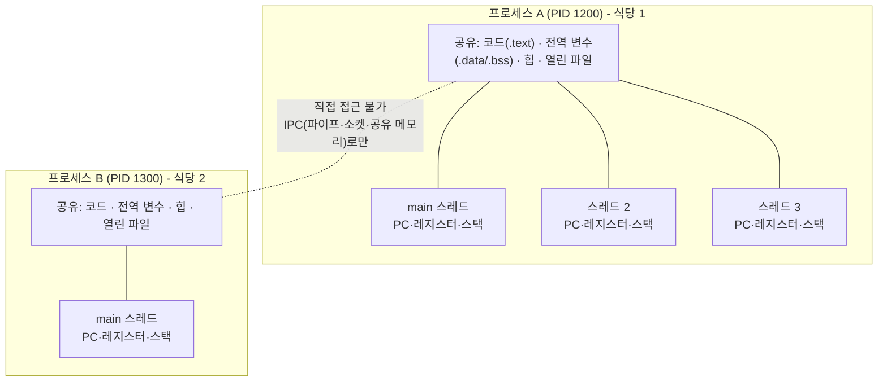
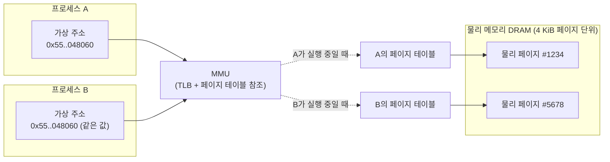
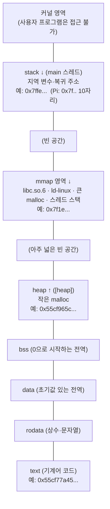
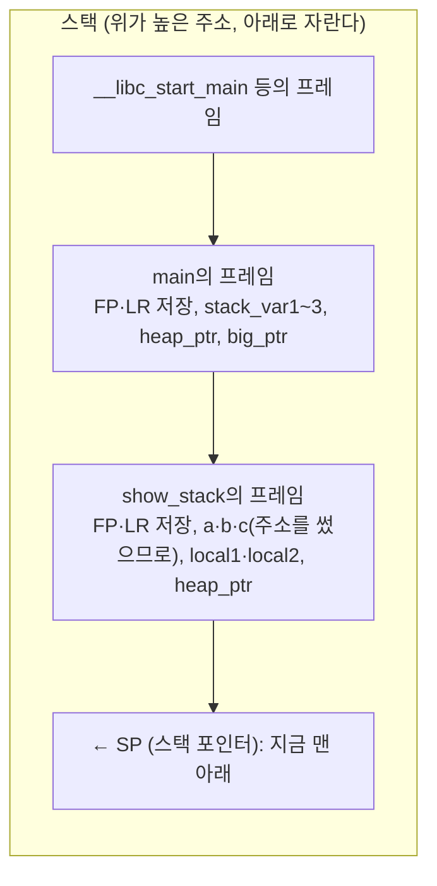
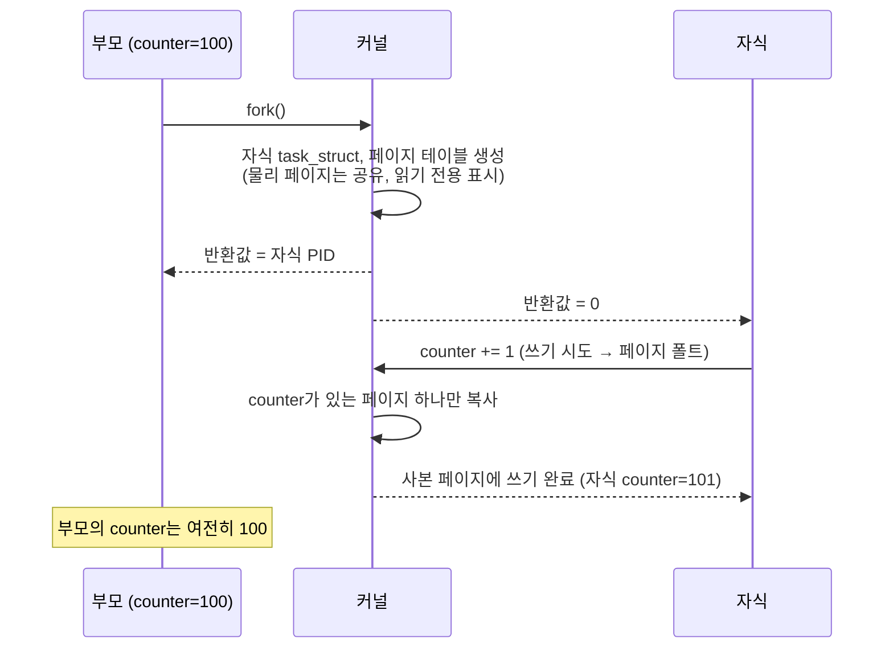
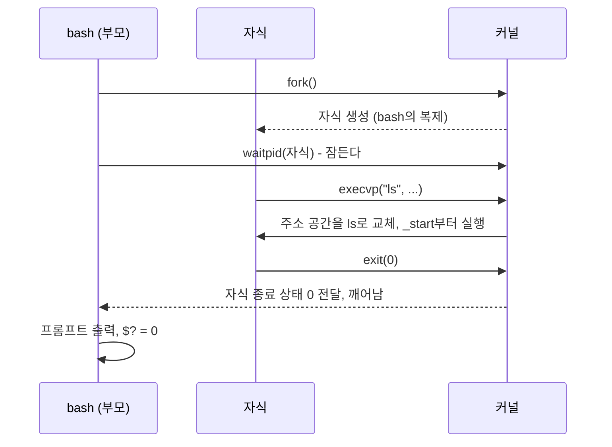
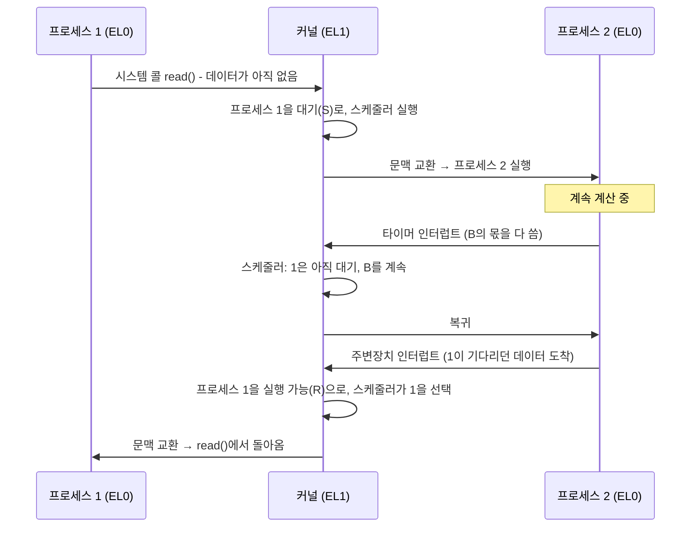
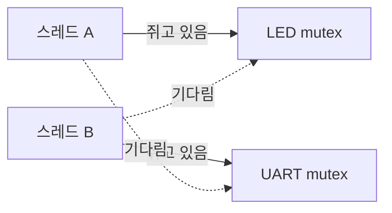
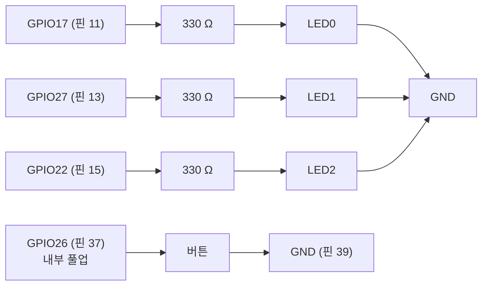

# 11장. 프로세스와 동시성

> **학습 목표**
> - 프로그램·프로세스·스레드를 구분하고, 같은 프로세스의 스레드끼리 무엇을 공유하고 무엇을 따로 갖는지 설명할 수 있다.
> - 가상 메모리와 MMU가 프로세스마다 독립된 주소 공간을 만드는 원리를 설명하고, `/proc/PID/maps`로 실제 배치를 읽을 수 있다.
> - 실행 중인 프로세스의 메모리 영역(text, rodata, data, bss, heap, mmap, stack)에 어떤 변수가 놓이는지 맞히고, 스택 프레임·스택 오버플로·메모리 누수를 설명할 수 있다.
> - `fork()`, `exec()`, `waitpid()`로 프로세스를 만들고 거두며, 좀비와 고아 프로세스가 생기는 이유를 설명할 수 있다.
> - 스케줄러, 문맥 교환, nice 값과 실시간 정책(SCHED_FIFO/SCHED_RR)의 차이를 설명할 수 있다.
> - POSIX 스레드를 만들고 인자를 안전하게 넘기며, race condition을 명령어 수준에서 설명하고 mutex·원자적 연산·조건 변수·세마포어로 해결할 수 있다.
> - 교착 상태를 재현하고 잠금 순서를 통일해 없앨 수 있다.
> - pigpio 콜백이 어느 스레드에서 실행되는지 알고, 콜백(생산자)과 main 스레드(소비자)를 큐로 안전하게 연결할 수 있다.

[1장](01_embedded_system.md)에서 OS를 **대형 레스토랑의 총지배인**에 비유했다. 총지배인은 여러 요리사에게 일을 나누어 주고(멀티태스킹), 급한 일을 먼저 시키고(우선순위 스케줄링), 화구 하나를 두 요리사가 동시에 쓰지 않도록 교통정리를 한다(자원 관리). 그때 "이 문제는 11장에서 mutex와 semaphore로 직접 다룬다"고 약속했다. 이 장이 그 약속을 지키는 장이다.

[5장](05_sysadmin.md)에서는 `ps`, `kill`, `top`, `nice`로 프로세스를 **밖에서** 관리했다. [6장](06_c_build.md)에서는 실행 파일이 `.text`, `.data`, `.bss` 섹션으로 이루어지고 `_start`가 `main`을 부르기까지를 **빌드 관점**에서 보았다. 이 장은 그다음 이야기이다. 실행 파일이 **메모리에 올라가 실행되는 동안** 무슨 일이 일어나는지, 그리고 내 프로그램 **안에서** 여러 흐름을 동시에 돌릴 때 무엇을 조심해야 하는지를 C 코드로 직접 확인한다. 마지막에는 [8장](08_gpio_pigpio.md)의 LED와 버튼으로 세마포어와 생산자-소비자 구조를 눈으로 본다. pigpio 콜백 함수 자체의 사용법은 [9장](09_pigpio_advanced.md)에서 다루고, 여기서는 콜백이 **다른 스레드에서 실행된다는 사실**과 그 때문에 생기는 문제에 집중한다.

예제 코드는 [`code/ch11/`](code/ch11/)에 있다. GPIO를 쓰지 않는 예제(실습 11-1~11-5, 11.9~11.12절의 예제)는 PC의 WSL(Windows Subsystem for Linux)에서도 그대로 빌드·실행된다. 출력 블록 위의 `> 출력 출처:` 줄이 그 출력을 어디서 얻었는지 알려 준다([머리말](00_preface.md) 「이 책의 표기 규칙」). 이 장에서 "WSL Debian 12 실행 결과"는 WSL Debian 12(x86-64, gcc 12.2.0, 20코어)에서 실제로 실행한 출력이다. Raspberry Pi 4(AArch64, 4코어)에서는 주소 값과 시간이 달라지므로, 다른 부분을 그때그때 설명한다.

## 11.1 프로그램, 프로세스, 스레드

### 11.1.1 왜 "동시에"가 필요한가

지금까지 짠 프로그램은 LED 깜빡이기 하나, 버튼 읽기 하나처럼 **한 가지 일**만 했다. 실제 제품은 그렇지 않다. 자동차를 생각해 보자. 운전자가 핸들을 돌리면 그것을 감지해 바퀴 방향을 바꾸고, 동시에 가속 페달을 밟으면 엔진 출력을 조절하고, 그 사이에도 계기판 표시를 갱신해야 한다. 스마트 TV는 영상을 끊김 없이 재생하면서 리모컨 입력에 즉시 반응해야 한다([1장](01_embedded_system.md) 1.11.4절). 여러 일이 **동시에** 일어나고, 프로그램도 그것을 동시에 처리해야 한다.

12주차 강의에서는 OS를 쓰면 개발자가 편해지는 점을 세 가지로 정리했다.

| OS가 해 주는 일 | OS가 없으면 |
|---|---|
| **파일 입출력**: SD 카드에 PC에서도 읽을 수 있는 파일로 저장 | 파티션, 파일 시스템 형식(FAT32, ext4)을 개발자가 직접 구현해야 한다 |
| **병렬 처리**: 프로세스와 스레드로 여러 일을 동시에 | 타이머 인터럽트로 일정 시간마다 함수를 부르게 직접 짜야 한다 |
| **동기화 도구**: mutex, semaphore, 조건 변수를 함수로 제공 | 인터럽트를 끄고 켜며 직접 만들어야 하고, 틀리기 쉽다 |

이 장은 두 번째와 세 번째를 다룬다.

### 11.1.2 식당 주방으로 이해하기

1장의 레스토랑 비유를 주방 안으로 확장해 이 장 전체의 지도로 삼자.

| 식당 | 컴퓨터 | 이 장에서 |
|---|---|---|
| 레시피 책 | **프로그램**(SD 카드의 실행 파일) | 11.1.3 |
| 문을 연 식당 하나(건물, 주방, 창고, 직원) | **프로세스**(주소 공간, 열린 파일, 스레드들) | 11.1~11.4 |
| 서로 다른 식당 두 곳 | 서로 다른 프로세스: 창고를 함께 쓰지 않는다 | 11.2 |
| 한 주방에서 일하는 요리사들 | 같은 프로세스의 **스레드**들 | 11.7 |
| 주방 공용 냉장고·식재료 창고 | 전역 변수(.data, .bss)와 힙: 스레드가 **공유** | 11.3 |
| 요리사마다 자기 도마와 메모지 | 스레드마다 따로 있는 **스택**과 레지스터 | 11.7.4 |
| 총지배인이 "다음은 너 차례"라고 정하는 것 | **스케줄러** | 11.5 |
| 두 요리사가 같은 냄비에 소금을 넣다가 두 번 넣음 | **경쟁 조건**(race condition) | 11.8 |
| 열쇠가 하나뿐인 화장실 | **mutex**: 한 번에 한 명만 | 11.9 |
| 주차장 입구의 "빈자리 2" 표시판, 회의실 N개 | **semaphore**: 정해진 수만큼만 | 11.10 |
| 홀 직원이 주문표를 꽂아 두면 주방이 하나씩 빼 감 | **생산자-소비자 큐**와 조건 변수 | 11.9.6, 실습 11-7 |
| 손님 호출 벨(언제 울릴지 모름) | 인터럽트·콜백 | 11.11 |

### 11.1.3 정확한 정의

- **프로그램**(program): 저장 장치에 있는 실행 파일이다. 움직이지 않는 레시피이다([5장](05_sysadmin.md) 5.4.1절).
- **프로세스**(process): 실행 중인 프로그램이다. 커널이 프로그램을 메모리에 올리고, 그 프로그램만의 **주소 공간**(메모리 지도), 열린 파일 목록, 시그널 처리 설정, 사용자 ID 등을 묶어 하나의 단위로 관리한다. 「ARM 리눅스」 슬라이드의 표현으로는 "프로그램, 데이터, 스택 + 프로세서 내부의 PC를 비롯한 레지스터와 상태 정보"이다. 같은 프로그램으로 여러 프로세스를 만들 수 있고, 한 프로세스가 실행 도중 다른 프로그램으로 갈아탈 수도 있다(11.4.2절의 `exec`).
- **스레드**(thread, 실행 흐름): 프로세스 **안에서** 독립적으로 실행되는 흐름이다. 각 스레드는 자기만의 PC(프로그램 카운터), 레지스터, **스택**을 갖지만, 코드·전역 데이터·힙·열린 파일은 같은 프로세스의 다른 스레드와 **공유**한다. 프로세스를 처음 시작하면 스레드가 하나(main 스레드) 있고, `pthread_create()`로 더 만든다.



| 비교 | 프로세스 | 스레드 |
|---|---|---|
| 메모리 | 프로세스마다 **독립된 주소 공간** | 같은 프로세스의 스레드끼리 **주소 공간 공유** (스택만 따로) |
| 만드는 비용 | 크다(페이지 테이블, 파일 목록 등을 새로 만든다) | 작다(스택과 레지스터 문맥 정도) |
| 데이터 주고받기 | 어렵다: 파이프·소켓·공유 메모리 등 IPC가 필요(11.6절) | 쉽다: 전역 변수나 힙을 그냥 읽고 쓴다 |
| 위험 | 하나가 죽어도 다른 프로세스는 무사하다 | 하나가 잘못된 메모리를 쓰면 프로세스 전체가 죽는다. 공유 데이터가 **꼬일 수 있다** |
| 식별 번호 | PID | TID(스레드 ID). main 스레드의 TID = PID |
| 리눅스 커널 안에서 | 둘 다 `task_struct` 하나로 표현되는 "태스크"이다. 무엇을 공유하느냐만 다르다(11.4.5절) | |

강의의 핵심 문장을 다시 적는다. **"스레드는 코드·데이터·힙을 공유하므로 편하지만, 바로 그 때문에 꼬인다."** 이 장의 후반부는 모두 이 "꼬임"을 다스리는 이야기이다.

> **흔한 오해: 스레드를 만들면 무조건 빨라진다?** 아니다. 코어가 하나뿐이면 스레드 여러 개는 번갈아 실행될 뿐이다(시분할, [1장](01_embedded_system.md) 1.11.3절). Pi 4는 코어가 4개라 최대 4개 스레드가 **진짜로 동시에**(병렬, parallel) 실행되지만, 공유 데이터를 보호하느라 서로 기다리면 오히려 느려질 수 있다(11.9.3절의 측정). 스레드의 첫째 목적은 "빨리"보다 "**여러 일을 서로 막지 않고**" 처리하는 것이다. 버튼을 기다리는 동안에도 LED는 계속 깜빡여야 하는 것처럼.

### 11.1.4 동시성과 병렬성

두 낱말을 구분해 두면 뒤의 설명이 쉬워진다.

| 용어 | 뜻 | 식당 |
|---|---|---|
| **동시성**(concurrency) | 여러 일이 **진행 중인 상태**에 함께 있다. 번갈아 조금씩 해도 된다 | 요리사 한 명이 찌개 불을 보다가 잠깐 반찬을 담고 다시 찌개로 |
| **병렬성**(parallelism) | 여러 일이 **같은 순간에** 실제로 실행된다. 코어가 여러 개 필요하다 | 요리사 네 명이 각자 다른 요리를 동시에 |

Raspberry Pi 4(Cortex-A72 4코어)는 둘 다 한다. 그리고 race condition은 **동시성만 있어도**(코어 하나에서 번갈아 실행해도) 생긴다. 스레드가 `count++`의 중간에서 쫓겨날 수 있기 때문이다(11.8절).

## 11.2 가상 메모리와 MMU: 프로세스마다 자기만의 지도

### 11.2.1 프로그램은 DRAM에서 실행된다

12주차 강의는 이렇게 시작했다. "1학기의 마이크로컨트롤러(MCU)에서는 프로그램은 플래시, 데이터는 SRAM, 남겨야 할 값은 EEPROM에 두었다. 라즈베리파이처럼 OS가 올라가면 프로그램은 어디에서 실행되는가? **그냥 메모리(DRAM)에 올라간다.**" SD 카드는 FAT32 부트 파티션(커널, 펌웨어)과 ext4 루트 파티션(프로그램과 데이터)으로 나뉘고([5장](05_sysadmin.md) 5.8절), `./memory_layout`을 실행하면 커널이 ext4 파티션의 실행 파일을 읽어 **DRAM(LPDDR4)** 에 올린다. 그리고 그 위에서 수백 개의 프로세스가 동시에 돈다([2장](02_computer_arch_arm.md) 2.2.5절의 MCU와 OS 시스템의 차이).

그렇다면 질문이 생긴다. 프로세스 수백 개가 DRAM 하나를 나눠 쓰는데, 내 프로그램의 `global_init` 변수 주소 `0x55cf77a48060`이 다른 프로세스의 변수와 겹치지 않는다는 보장은 어디서 오는가? 어떤 프로그램이 실수로 남의 메모리에 쓰면 어떻게 막는가? 답은 **가상 메모리**이다.

### 11.2.2 가상 주소, 물리 주소, MMU

**비유: 아파트 동·호수와 실제 위치.** 모든 프로세스는 "나는 0번지부터 아주 큰 번지까지 전부 내 것인 넓은 아파트 단지에 산다"고 믿는다. 프로그램이 쓰는 주소 `0x55cf77a48060`은 그 단지 안의 "동·호수"이다. 실제 DRAM의 어느 칸에 있는지는 관리사무소(커널)가 가진 **대응표**(페이지 테이블)만 안다. 두 프로세스가 똑같이 "101동 1004호"라고 말해도, 대응표가 서로 다르므로 실제로는 다른 집이다.

- **가상 주소**(virtual address): 프로그램(CPU의 명령어)이 사용하는 주소. 포인터 값, `printf("%p")`로 찍는 값은 모두 가상 주소이다.
- **물리 주소**(physical address): DRAM 칩과 주변장치가 실제로 응답하는 주소([2장](02_computer_arch_arm.md) 2.4.3절의 BCM2711 주소 체계).
- **MMU**(Memory Management Unit, 메모리 관리 장치): CPU 안의 하드웨어로, **모든 메모리 접근마다** 가상 주소를 물리 주소로 바꾼다. 바꿀 때 커널이 만들어 둔 **페이지 테이블**을 참조한다. 자주 쓰는 변환 결과는 **TLB**(Translation Lookaside Buffer)라는 작은 캐시에 둔다.
- **페이지**(page): 변환의 단위. 메모리를 일정한 크기(x86-64 리눅스와 Pi 4의 기본 64비트 커널에서 4 KiB. Pi에서 `getconf PAGESIZE`를 실행하면 `4096`이 나온다)로 잘라 페이지 단위로 대응시킨다. 강의13 「메모리」 슬라이드의 계층별 전송 단위(워드 → 블록 → **페이지**)에서 가장 큰 단위가 이것이다.



> 📌 **보강:** 커널 문서는 "가상 메모리에서는 모든 메모리 접근이 가상 주소를 쓰며, CPU가 명령어를 해독할 때 그 가상 주소를 메모리 컨트롤러가 이해하는 물리 주소로 바꾼다", "페이지 테이블은 계층으로 구성되어 가상 주소의 상위 비트로 각 단계의 표를 찾고 가장 낮은 비트는 페이지 안의 오프셋이 된다"고 설명한다. 페이지 크기는 아키텍처마다 다르고 커널 빌드 설정으로 고를 수 있다. 출처: [Linux kernel documentation – Concepts overview (Virtual Memory Primer)](https://docs.kernel.org/admin-guide/mm/concepts.html). Pi에서 `getconf PAGESIZE`로 확인할 수 있다(WSL Debian 12에서는 4096).

가상 메모리가 주는 이점은 다음과 같다.

| 이점 | 설명 |
|---|---|
| **격리**(보호) | 프로세스 A의 페이지 테이블에는 B의 메모리가 아예 없다. A가 아무 주소에나 써도 B를 망가뜨릴 수 없다. 대응표에 없는 주소를 건드리면 MMU가 예외를 일으키고 커널이 그 프로세스에 `SIGSEGV`(Segmentation fault)를 보낸다 |
| **권한** | 페이지마다 읽기·쓰기·실행 권한이 있다. 코드 페이지에 쓰거나, 데이터 페이지를 실행하려 하면 막힌다 |
| **같은 주소 체계** | 모든 프로그램을 "나는 혼자 산다"는 가정으로 링크할 수 있다 |
| **필요할 때만 할당**(demand paging) | `malloc(1 GiB)`를 해도 실제로 **쓰는 페이지만** 물리 메모리를 받는다. `ps`의 VSZ(가상 크기)가 RSS(실제 사용량)보다 훨씬 큰 이유이다([5장](05_sysadmin.md) 5.4.4절) |
| **공유** | 여러 프로세스가 쓰는 `libc.so.6`의 코드 페이지는 물리 메모리에 하나만 두고 모두의 대응표에 연결한다. `fork()`의 copy-on-write(11.4.1절)도 이 기능이다 |

[2장](02_computer_arch_arm.md) 2.12.4절의 예외 레벨로 말하면, 사용자 프로그램은 **EL0**에서 실행되고 페이지 테이블을 바꿀 수 없다. 페이지 테이블은 **EL1**의 커널만 만든다. 그래서 [8장](08_gpio_pigpio.md)에서 GPIO 레지스터의 물리 주소에 접근하려면 `/dev/gpiomem`이나 `/dev/mem`을 `mmap()`해서 커널에게 "이 물리 주소를 내 주소 공간에 연결해 달라"고 부탁해야 했다. pigpio가 `sudo`를 요구하는 이유도 여기에 있다.

> **MCU와 비교.** 1학기에 쓴 것과 같은 마이크로컨트롤러(Cortex-M 등)에는 MMU가 없다(일부 Cortex-M에는 영역 단위 보호만 하는 MPU가 있다). 모든 코드가 하나의 물리 주소 공간을 함께 쓰므로, RTOS의 태스크들은 리눅스로 치면 "한 프로세스 안의 스레드"에 가깝다. 한 태스크의 잘못된 포인터가 다른 태스크나 RTOS 커널까지 망가뜨릴 수 있다. 임베디드 리눅스가 MMU가 있는 MPU를 요구하는 이유이다([1장](01_embedded_system.md) 1.12.2절).

### 11.2.3 /proc/PID/maps: 주소 공간의 지도 읽기

프로세스의 주소 공간이 어떻게 생겼는지는 `/proc/PID/maps`(자기 자신은 `/proc/self/maps`)에서 볼 수 있다. 실습 11-1의 `memory_layout`이 마지막에 출력하는 내용이다(공유 라이브러리 줄 일부 포함).

> 출력 출처: WSL Debian 12 실행 결과

```text
=== /proc/self/maps ===
55cf77a44000-55cf77a45000 r--p 00000000 08:20 92563                      /tmp/ch11/memory_layout
55cf77a45000-55cf77a46000 r-xp 00001000 08:20 92563                      /tmp/ch11/memory_layout
55cf77a46000-55cf77a47000 r--p 00002000 08:20 92563                      /tmp/ch11/memory_layout
55cf77a47000-55cf77a48000 r--p 00002000 08:20 92563                      /tmp/ch11/memory_layout
55cf77a48000-55cf77a49000 rw-p 00003000 08:20 92563                      /tmp/ch11/memory_layout
55cf965c0000-55cf965e1000 rw-p 00000000 00:00 0                          [heap]
7f1ee805b000-7f1ee809f000 rw-p 00000000 00:00 0 
7f1ee809f000-7f1ee80c5000 r--p 00000000 08:20 1414                       /usr/lib/x86_64-linux-gnu/libc.so.6
7f1ee80c5000-7f1ee821a000 r-xp 00026000 08:20 1414                       /usr/lib/x86_64-linux-gnu/libc.so.6
7f1ee821a000-7f1ee826d000 r--p 0017b000 08:20 1414                       /usr/lib/x86_64-linux-gnu/libc.so.6
7f1ee826d000-7f1ee8271000 r--p 001ce000 08:20 1414                       /usr/lib/x86_64-linux-gnu/libc.so.6
7f1ee8271000-7f1ee8273000 rw-p 001d2000 08:20 1414                       /usr/lib/x86_64-linux-gnu/libc.so.6
7f1ee8273000-7f1ee8280000 rw-p 00000000 00:00 0 
7f1ee828d000-7f1ee828f000 rw-p 00000000 00:00 0 
7f1ee828f000-7f1ee8290000 r--p 00000000 08:20 1746                       /usr/lib/x86_64-linux-gnu/ld-linux-x86-64.so.2
7f1ee8290000-7f1ee82b5000 r-xp 00001000 08:20 1746                       /usr/lib/x86_64-linux-gnu/ld-linux-x86-64.so.2
7f1ee82b5000-7f1ee82bf000 r--p 00026000 08:20 1746                       /usr/lib/x86_64-linux-gnu/ld-linux-x86-64.so.2
7f1ee82bf000-7f1ee82c1000 r--p 00030000 08:20 1746                       /usr/lib/x86_64-linux-gnu/ld-linux-x86-64.so.2
7f1ee82c1000-7f1ee82c3000 rw-p 00032000 08:20 1746                       /usr/lib/x86_64-linux-gnu/ld-linux-x86-64.so.2
7ffedddfa000-7ffedde1b000 rw-p 00000000 00:00 0                          [stack]
7ffeddef1000-7ffeddef5000 r--p 00000000 00:00 0                          [vvar]
7ffeddef5000-7ffeddef7000 r-xp 00000000 00:00 0                          [vdso]
```

| 칸 | 예 | 뜻 |
|---|---|---|
| 주소 범위 | `55cf965c0000-55cf965e1000` | 이 영역의 시작-끝 가상 주소(끝은 포함하지 않음) |
| 권한 | `r-xp` | r 읽기, w 쓰기, x 실행, p 비공유(private, copy-on-write) / s 공유 |
| 오프셋 | `00001000` | 파일에서 몇 바이트째부터 매핑했는가 |
| 장치, inode | `08:20 92563` | 파일이 있는 장치와 파일 번호. 파일과 무관한 영역은 `00:00 0` |
| 경로 | `/tmp/ch11/memory_layout`, `[heap]` | 매핑된 파일. 대괄호는 특별한 영역 |

> 📌 **보강:** `proc_pid_maps(5)`는 `[stack]`을 "처음 시작한 프로세스(= main 스레드)의 스택", `[heap]`을 "프로세스의 힙", `[vdso]`를 "가상 동적 공유 객체"(일부 시스템 콜을 커널에 들어가지 않고 처리하게 해 주는 작은 코드)로 설명한다. 출처: [proc_pid_maps(5)](https://man7.org/linux/man-pages/man5/proc_pid_maps.5.html)

같은 실행 파일이 권한이 다른 여러 줄(`r--p`, `r-xp`, `r--p`, `rw-p`)로 나뉘어 있다. 이것이 [6장](06_c_build.md)에서 본 섹션들이 실행 중에 놓인 모습이다(11.3.1절).

### 11.2.4 실행할 때마다 주소가 바뀌는 이유: ASLR

강의 자료의 출력 예에는 "실제 메모리 주소 값은 각기 다를 수가 있다"고 적혀 있고, 강의에서는 "OS가 메모리를 할당해 주므로 사람마다 다르다"고 설명했다. 사실은 **같은 사람이 같은 프로그램을 연달아 실행해도** 주소가 바뀐다. 리눅스가 일부러 주소를 무작위로 정하기 때문이다. 이것을 **ASLR**(Address Space Layout Randomization, 주소 공간 배치 무작위화)이라고 한다. 공격자가 "스택은 늘 이 주소에 있다"는 것을 이용하지 못하게 하려는 보안 기능이다.

> 출력 출처: WSL Debian 12 실행 결과

```text
$ ./memory_layout nomaps | grep -E 'main\(\)|global_init|main heap_ptr|stack_var1'
  main()          : 0x55f75b795345
  global_init     : 0x55f75b798060
  main heap_ptr   : 0x55f782f902a0  (100 B)
[Stack in main()]
  stack_var1      : 0x7ffe3328156c
$ ./memory_layout nomaps | grep -E 'main\(\)|global_init|main heap_ptr|stack_var1'
  main()          : 0x55662f010345
  global_init     : 0x55662f013060
  main heap_ptr   : 0x556647bde2a0  (100 B)
[Stack in main()]
  stack_var1      : 0x7ffc0583f18c
$ setarch $(uname -m) -R ./memory_layout nomaps | grep -E 'main\(\)|global_init|main heap_ptr|stack_var1'
  main()          : 0x555555555345
  global_init     : 0x555555558060
  main heap_ptr   : 0x5555555592a0  (100 B)
[Stack in main()]
  stack_var1      : 0x7fffffffdfbc
$ setarch $(uname -m) -R ./memory_layout nomaps | grep -E 'main\(\)|global_init|main heap_ptr|stack_var1'
  main()          : 0x555555555345
  global_init     : 0x555555558060
  main heap_ptr   : 0x5555555592a0  (100 B)
[Stack in main()]
  stack_var1      : 0x7fffffffdfbc
$ cat /proc/sys/kernel/randomize_va_space
2
$ getconf PAGESIZE
4096
```

- 처음 두 번은 코드(`main()`), 데이터(`global_init`), 힙, 스택 주소가 모두 바뀌었다. 그러나 **같은 실행에서** `main()`과 `global_init`의 거리(`0x2d1b`)는 언제나 같다. 실행 파일 전체가 통째로 옮겨질 뿐 내부 배치는 그대로이기 때문이다(PIE: Position Independent Executable, 위치 독립 실행 파일. [6장](06_c_build.md)의 `Scrt1.o`).
- `setarch $(uname -m) -R`은 이 프로세스에 한해 무작위화를 끄고 실행한다. 그러면 두 번 실행해도 주소가 똑같다. gdb도 디버깅할 때 기본으로 이렇게 한다.
- `randomize_va_space`가 `2`이면 스택·mmap·vDSO·PIE 코드에 더해 힙(brk)까지 무작위화한다.

> 📌 **보강:** 커널 문서에 따르면 `randomize_va_space`가 `1`이면 mmap 기준 주소·스택·vDSO와 PIE 실행 파일의 코드 시작 주소를 무작위로 하고, `2`이면 **힙 무작위화도 추가**한다. `0`이면 끈다. 출처: [Linux kernel documentation – /proc/sys/kernel/randomize_va_space](https://docs.kernel.org/admin-guide/sysctl/kernel.html#randomize-va-space). 시스템 전체 설정을 0으로 바꾸는 것은 보안을 약하게 하므로 실습에서는 `setarch -R`처럼 한 프로세스에만 적용한다.

## 11.3 실행 중인 프로세스의 메모리 구조

### 11.3.1 섹션에서 영역으로

[6장](06_c_build.md) 6.6.3절에서 실행 파일이 섹션으로 나뉜다는 것을 보았다. 실행할 때 커널은 섹션을 하나씩 따로 올리지 않고, **권한이 같은 섹션들을 묶어**(ELF의 세그먼트) 페이지 단위로 주소 공간에 연결한다. 그리고 파일에는 없는 영역(힙, 스택, 공유 라이브러리, mmap)을 덧붙인다.

| 실행 중 영역 | 들어 있는 것 | 출처 | `/proc/PID/maps`에서 | 권한 |
|---|---|---|---|---|
| **text** | 기계어 코드(`main`, `show_stack`) | 실행 파일 `.text` | 실행 파일의 `r-xp` 줄 | 읽기·실행 |
| **rodata** | 문자열 리터럴, `const` 전역 상수 | 실행 파일 `.rodata` | 실행 파일의 `r--p` 줄 | 읽기 |
| **data** | **0이 아닌 초기값**이 있는 전역·`static` 변수 | 실행 파일 `.data` (초기값이 파일에 있다) | 실행 파일의 `rw-p` 줄 | 읽기·쓰기 |
| **bss** | 초기값이 **없거나 0인** 전역·`static` 변수 | 파일에는 크기만. 커널이 0으로 채운 페이지를 준다 | `rw-p` 줄의 뒷부분(넘치면 이름 없는 `rw-p`) | 읽기·쓰기 |
| **heap** | `malloc()`으로 받은 **작은** 메모리 | 실행 중 커널에 요청(brk) | `[heap]` | 읽기·쓰기 |
| **mmap 영역** | 공유 라이브러리(`libc.so.6`), **큰** `malloc()`, 스레드 스택, `mmap()`한 파일·장치 | 실행 중 커널에 요청(mmap) | 라이브러리 경로, 이름 없는 `rw-p` | 영역마다 다름 |
| **stack** | 지역 변수, 함수 인자(넘칠 때), 돌아갈 주소, 저장한 레지스터 | 커널이 실행 시작 때 만든다 | `[stack]` | 읽기·쓰기 |

> **원본 자료 정정: `.data`와 `.bss`의 정의.<strong> 12주차 요약과 녹취에는 "BSS = 초기화되지 않은 변수"라고만 되어 있다. 정확히는 "</strong>초기값이 없거나 0으로 초기화한** 전역·`static` 변수"이다. `int g_zero = 0;`도 `.bss`에 들어간다(실습 11-1의 `global_zero`). 「개발환경 구축」 문서와 ARM 소프트웨어 설계 슬라이드의 BSS 설명 오류는 [6장](06_c_build.md) 6.6.3절에서 이미 바로잡았다. 지역 변수(스택)는 `.bss`에 들어가지 않는다.

주소가 큰 쪽을 위로 그리면 다음과 같다(64비트 Linux의 일반적인 배치. 실제 주소는 ASLR로 매번 바뀐다). 강의에서 "슬라이드 그림에서 스택 위치가 마음에 들지 않는다. 스택은 높은 번지 쪽에 그리는 것이 낫다"고 한 그림을 이 방향으로 다시 그렸다.



> **원본 자료 정정: "힙과 스택은 한 공간을 양쪽에서 쓰다가 만나면 뻗는다."** 강의에서는 코드 → 데이터 → 힙 → 스택 순서로 놓고 "힙은 위로, 스택은 아래로 자라며 그 사이 공간을 함께 쓴다"고 설명했다. 고전적인 단일 주소 공간(MCU, 옛 유닉스) 그림으로는 맞고, 개념을 잡는 데 좋은 그림이다. 다만 64비트 리눅스에서는 다음이 다르다.
> - 힙과 스택 사이에는 수십 TB에 이르는 빈 공간과 **mmap 영역**(공유 라이브러리, 큰 할당, 스레드 스택)이 있어 둘이 "만나는" 일은 사실상 없다.
> - 스택은 정해진 **한도**(`ulimit -s`, 보통 8 MiB)까지만 자라고, 넘으면 힙과 만나기 전에 `SIGSEGV`로 끝난다(11.3.3절).
> - 큰 `malloc()`은 `[heap]`이 아니라 mmap 영역에서 온다. 실습 11-1에서 100바이트 할당은 `[heap]`(0x55cf965c02a0)에, 256 KiB 할당은 libc 바로 아래의 이름 없는 영역(0x7f1ee805b010)에 놓인 것을 직접 확인한다.
> - 힙 메모리가 정말 바닥나면 `malloc()`이 `NULL`을 돌려주거나, 시스템 전체 메모리가 모자라면 OOM killer가 프로세스를 끝낸다([5장](05_sysadmin.md) 5.9.3절).

> 📌 **보강:** glibc의 `malloc`은 요청 크기가 `M_MMAP_THRESHOLD`(초기값 128 KiB) 이상이면 힙을 늘리는(`sbrk`) 대신 `mmap()`으로 따로 받는다. 이 기준은 큰 블록을 해제할 때 자동으로 올라가기도 한다. 출처: [mallopt(3)](https://man7.org/linux/man-pages/man3/mallopt.3.html)

**강의 자료의 Pi 출력과 비교.** 「Raspberry Pi Codes」 §4.1.6에는 Pi(AArch64)에서 실행한 원본 `memory_layout.c`의 출력이 실려 있다(보기 좋게 줄을 나누었다).

> 출력 출처: Pi 4 실기기 캡처(강의 자료 「Raspberry Pi Codes」 §4.1.6)

```text
=== Memory Layout ===
[Code Section]
  main()          : 0x557c4b0918
  show_stack()    : 0x557c4b0854
[Data Section]
  global_init     : 0x557c4d0050
  static_var      : 0x557c4d0054
[BSS Section]
  global_uninit   : 0x557c4d005c
[Heap]
  main heap_ptr        : 0x55a68532a0
[Stack in main()]
  stack_var1      : 0x7fec51c304
  stack_var2      : 0x7fec51c300
  stack_var3      : 0x7fec51c2fc
[Inside show_stack()]
  parameter a     : 0x7fec51c2cc
  parameter b     : 0x7fec51c2c8
  parameter c     : 0x7fec51c2c4
  local1          : 0x7fec51c2d7
  local2          : 0x7fec51c2d6
  local heap_ptr       : 0x55a6853720
```

- 순서(코드 < 데이터 < BSS < 힙 < 스택)는 WSL(x86-64)과 같다. 강의에서 말한 "주소가 군집을 이룬다"를 확인할 수 있다.
- Pi의 주소는 16진수 10자리(`0x7fec51c304`)로 x86-64의 12자리(`0x7ffedde19c7c`)보다 짧다. Raspberry Pi OS의 64비트 커널은 가상 주소를 **39비트**만 쓰도록 빌드되어 있기 때문이다. 사용자 주소 공간은 2<sup>39</sup> 바이트 = 512 GiB이고, 주소는 `0x80_0000_0000`(16진수 10자리)을 넘지 않는다. x86-64 리눅스는 47비트(128 TiB)를 쓴다. Pi에서 직접 확인한 결과는 다음과 같다.
  - `grep VA_BITS /boot/config-$(uname -r)`(apt로 설치된 커널) → `CONFIG_ARM64_VA_BITS=39`
  - `/proc/self/maps`의 `[stack]` 줄은 실행할 때마다 `7fd1ce5000-7fd1d06000`, `7ffcc99000-7ffccba000`처럼 달라지지만 모두 `0x80_0000_0000`보다 작다.
  - 무작위화를 끄고 실행하면(`setarch $(uname -m) -R ./memory_layout nomaps`, 실습 11-1) `stack_var1`이 `0x7ffffffa0c`로, 39비트 주소 공간의 맨 꼭대기 바로 아래에 놓인다.
- 힙(`0x55a6...`)이 데이터(`0x557c...`)에서 약 0.7 GB 떨어져 있다. 힙 시작 위치도 무작위화되기 때문이다(`randomize_va_space = 2`).

### 11.3.2 변수 선언과 메모리 위치 한눈에

면접에 자주 나오는 질문이다(강의: "키워드 한두 개만 던져도 아는지 모르는지 확인할 수 있다").

| 선언 | 영역 | 생기는 때 → 사라지는 때 | 초기값을 안 주면 |
|---|---|---|---|
| `int g = 100;` (전역) | data | 프로그램 시작 → 끝 | — |
| `int g;` / `int g = 0;` (전역) | bss | 프로그램 시작 → 끝 | 0 |
| `static int s = 20;` (함수 안) | data | 프로그램 시작 → 끝(함수가 끝나도 값 유지) | — |
| `static int s;` (함수 안) | bss | 프로그램 시작 → 끝 | 0 |
| `const int c = 7;` (전역) | rodata | 프로그램 시작 → 끝, 쓰면 `SIGSEGV` | — |
| `"hello"` (문자열 리터럴) | rodata | 프로그램 시작 → 끝 | — |
| `int x = 5;` (함수 안 지역 변수) | stack | 함수 호출 → 함수 반환 | **쓰레기 값** |
| 함수 인자 `int a` | 레지스터(X0~X7) → 주소를 쓰면 stack | 호출 → 반환 | — |
| `malloc(100)` | heap | `malloc` → `free` | 쓰레기 값(`calloc`은 0) |
| `malloc(256*1024)` | mmap 영역 | `malloc` → `free` | 0(새 페이지) — 그러나 기대하지 말 것 |
| 스레드 함수의 지역 변수 | **그 스레드의** stack(mmap 영역) | 스레드 함수 호출 → 반환 | 쓰레기 값 |

### 11.3.3 스택과 함수 호출: 스택 프레임

**왜 스택인가.** [2장](02_computer_arch_arm.md) 2.11.4절에서 "나중에 불린 함수가 먼저 끝나므로, 돌아갈 주소는 쌓인 반대 순서로 꺼내야 한다 → 스택(LIFO)"이라고 했다. 함수가 불릴 때마다 스택에는 그 함수 한 번의 실행에 필요한 공간이 한 덩어리 생긴다. 이것을 **스택 프레임**(stack frame)이라고 한다. 접시를 쌓듯 함수를 부를 때 하나 올리고, 돌아올 때 하나 내린다.

AArch64에서 함수 하나의 프레임에는 보통 다음이 들어간다([2장](02_computer_arch_arm.md) 2.20.3절 AAPCS64).

| 프레임 안의 것 | 왜 필요한가 |
|---|---|
| 저장한 X29(프레임 포인터, FP) | 호출한 함수의 프레임 위치를 기억(gdb의 `bt`가 이것을 따라 올라간다) |
| 저장한 X30(LR, 돌아갈 주소) | 이 함수가 다른 함수를 `bl`로 부르면 LR이 덮어써지므로 |
| 저장한 X19~X28 | 피호출자 보존 레지스터를 쓰려면 원래 값을 보관해야 하므로 |
| 지역 변수 | 레지스터에 다 못 두거나, **주소를 구하는**(`&local`) 변수 |
| 9번째 이후 인자 | 인자 1~8은 X0~X7로 전달되지만 그 이상은 스택으로 |

`memory_layout.c`의 `show_stack(1, 2, 3)`에서 인자 `a`, `b`, `c`는 원래 레지스터(W0, W1, W2)로 전달된다. 그런데 `&a`처럼 **주소를 출력**하라고 했으므로 컴파일러가 이 값들을 스택 프레임에 내려 저장했고, 그 주소가 `main`의 지역 변수보다 **낮은** 곳(`0x...c3c` < `0x...c7c`)에 찍혔다. 스택이 아래로 자라기 때문이다.



**스택 오버플로.** 스택은 무한하지 않다. 주 스레드의 스택 한도는 셸의 `ulimit -s`(KiB 단위)로 정해지고 보통 8192(8 MiB)이다. 재귀 호출이 끝나지 않거나, 지역 변수로 큰 배열(`char buf[10000000];`)을 잡으면 한도를 넘어 `SIGSEGV`로 끝난다. 실습 11-1의 `stack_overflow.c`는 호출마다 1 KiB 배열을 쌓는다.

> 출력 출처: WSL Debian 12 실행 결과

```text
$ ulimit -s
8192
$ ./stack_overflow
depth      0  buf=0x7ffc3e08dbb0  사용한 스택 약 0 KiB
depth   1000  buf=0x7ffc3df8beb0  사용한 스택 약 1031 KiB
depth   2000  buf=0x7ffc3de8a1b0  사용한 스택 약 2062 KiB
depth   3000  buf=0x7ffc3dd884b0  사용한 스택 약 3093 KiB
depth   4000  buf=0x7ffc3dc867b0  사용한 스택 약 4125 KiB
depth   5000  buf=0x7ffc3db84ab0  사용한 스택 약 5156 KiB
depth   6000  buf=0x7ffc3da82db0  사용한 스택 약 6187 KiB
depth   7000  buf=0x7ffc3d9810b0  사용한 스택 약 7218 KiB
Segmentation fault (core dumped)
$ echo $?
139
$ (ulimit -s 1024; ./stack_overflow)
depth      0  buf=0x7ffc1d610820  사용한 스택 약 0 KiB
Segmentation fault (core dumped)
$ echo $?
139
```

- 기본 한도 8 MiB에서는 약 7200 KiB를 쓴 깊이 7000~8000 사이에서 죽었다. 호출 하나가 1 KiB 배열보다 조금 더 쓰므로(1031 KiB/1000회) 8192 KiB에 이르기 전에 끝났다.
- 한도를 1 MiB로 줄이면 깊이 1000에도 이르지 못한다. `139`는 셸의 관례로 128 + 시그널 번호 11(`SIGSEGV`)이다.
- 임베디드 코드에서는 **깊은 재귀와 큰 지역 배열을 피한다.** 큰 버퍼는 전역(`static`)이나 힙에 둔다. 스레드의 스택은 main 스레드의 스택과 성질이 조금 다르다. main 스레드의 스택은 한도(`ulimit -s`)까지 필요한 만큼 자라지만, 새 스레드의 스택은 만들 때 **크기가 정해진** mmap 영역(기본값은 `ulimit -s`와 같은 8 MiB)이고 그 끝에 보호 페이지가 있다(11.7.4절). 스레드 수가 많거나 메모리가 작은 장치에서는 이 크기를 줄여 잡기 때문에, 스레드 함수 안의 큰 지역 배열은 더 위험하다. RTOS의 태스크 스택은 수백 바이트~수 KB에 불과하다.

### 11.3.4 힙: malloc과 free

**왜 힙인가.** 스택의 변수는 함수가 끝나면 사라지고, 전역 변수는 크기를 컴파일할 때 정해야 한다. 그런데 "실행해 봐야 크기를 아는" 데이터가 많다. 강의의 예처럼 MP3·동영상 파일을 재생할 때는 파일 크기를 미리 모르고, 버튼을 누를 때마다 새 작업을 만드는 프로그램(실습 11-6)은 작업이 몇 개 생길지 모른다. 이럴 때 실행 중에 필요한 만큼 빌리고 다 쓰면 돌려주는 곳이 **힙**(heap)이다. 식당으로 치면 "필요할 때 창고에서 꺼내 쓰고 다 쓰면 반납하는 추가 그릇"이다.

| 함수 | 하는 일 |
|---|---|
| `void *malloc(size_t size)` | `size` 바이트를 빌린다. 내용은 쓰레기 값. 실패하면 `NULL` |
| `void *calloc(size_t n, size_t size)` | `n × size` 바이트를 빌리고 0으로 채운다 |
| `void *realloc(void *p, size_t size)` | 빌린 크기를 바꾼다(다른 곳으로 옮겨질 수 있다) |
| `void free(void *p)` | 돌려준다. `p`는 반드시 위 함수가 돌려준 값이어야 한다 |

힙에서 흔한 실수 네 가지:

| 실수 | 증상 | 예방 |
|---|---|---|
| **메모리 누수**(leak): `free`를 잊음 | 오래 돌수록 메모리 사용량(RSS)이 늘어 결국 OOM. 24시간 도는 임베디드 장치에서 치명적 | `malloc`과 `free`를 **반드시 짝**으로(강의: "init/destroy, malloc/free는 쌍"). 누가 해제할지 정해 둔다 |
| **해제 후 사용**(use-after-free) | 가끔 엉뚱한 값, 가끔 죽음. 재현이 어렵다 | `free(p); p = NULL;` |
| **두 번 해제**(double free) | glibc가 `free(): double free detected`로 프로그램을 끝냄 | 위와 같음 |
| 크기를 넘어 쓰기(overflow) | 옆 블록의 관리 정보가 깨져 나중에 엉뚱한 곳에서 죽음 | 크기 계산 확인, `snprintf` 사용 |

> 강의에서는 "OS가 프로세스가 끝날 때 대신 정리해 줄 수도 있지만 그것을 믿고 생략하면 안 된다"고 강조했다. 맞다. 프로세스가 **끝나면** 커널이 그 주소 공간을 통째로 회수하므로 누수가 사라진다. 문제는 **끝나지 않는** 프로그램이다. 서비스로 몇 달씩 도는 임베디드 프로그램([5장](05_sysadmin.md) 5.5절)에서 버튼을 누를 때마다 100바이트씩 새면, 언젠가 메모리가 바닥난다.

> 📌 **보강: 메모리 오류를 찾는 도구.** gcc의 **AddressSanitizer**(`-fsanitize=address -g`)는 누수, 해제 후 사용, 범위 밖 쓰기를 실행 중에 잡아 어느 줄인지 알려 준다. **Valgrind**(`valgrind --leak-check=full ./prog`)는 다시 컴파일하지 않고 검사한다. Raspberry Pi OS(arm64)에서는 `sudo apt install valgrind`로 설치한다(Bookworm 저장소의 판은 3.19.0, 설치하면 약 40 MB를 차지한다). 두 가지 실수를 일부러 만든 예제 `code/ch11/uaf.c`(해제한 메모리 읽기)와 `leak.c`(`free` 빠뜨리기)로 직접 해 볼 수 있다. 먼저 Pi 4의 gcc 12.2에서 `make asan`(`-fsanitize=address -g`)으로 빌드해 보니, 해제한 블록을 읽는 코드는 `ERROR: AddressSanitizer: heap-use-after-free`와 함께 `in main …/uaf.c:16`처럼 파일과 줄 번호까지 알려 주었고, `free`를 빠뜨린 코드는 끝날 때 `ERROR: LeakSanitizer: detected memory leaks`와 `Direct leak of 100 byte(s) in 1 object(s)`를 출력했다. 같은 두 가지 실수를 이번에는 **보통 빌드**(`make membug`, 곧 `gcc -Wall -g -O0`. 소스 줄 번호를 얻으려고 `-g`를 붙임)로 만들어 `valgrind --leak-check=full`로 돌려 보았다(Pi 4, Valgrind 3.19.0). 해제 후 읽기는 `Invalid read of size 4`와 함께 읽은 줄(`uaf.c:16`)뿐 아니라 그 블록을 해제한 줄(`uaf.c:15`)과 할당한 줄(`uaf.c:14`)까지 알려 주었고, 누수는 `definitely lost: 100 bytes in 1 blocks`와 `malloc`을 부른 줄(`leak.c:15`)을 보고했다. ASan과 달리 Valgrind는 오류를 보고만 하고 프로그램을 멈추지 않으며, 종료 코드도 기본으로는 0이다(스크립트에서 실패로 처리하려면 `--error-exitcode=1`을 붙인다). 대신 프로그램을 가상 CPU 위에서 돌리므로 느리다. 그냥 실행하면 1 ms도 안 걸리는 프로그램이 Valgrind 아래에서는 약 1.3초 걸렸다. 참고로 `uaf.c`는 빌드할 때 이미 gcc 12가 `warning: pointer 'p' used after 'free' [-Wuse-after-free]` 경고를 낸다. 컴파일러 경고를 무시하지 말아야 하는 이유다. 다만 컴파일러가 모든 실수를 미리 찾지는 못하므로(`leak.c`에는 경고가 없다) 실행 중에 검사하는 도구가 필요하다.
>
> 출력 출처: Pi 4 실기기 실행 결과(2026-10, 발췌)
>
> ```text
> $ valgrind --leak-check=full ./uaf
> ==2073== Invalid read of size 4
> ==2073==    at 0x1087F4: main (uaf.c:16)
> ==2073==  Address 0x4a7f040 is 0 bytes inside a block of size 100 free'd
> ==2073==    at 0x4887B40: free (vg_replace_malloc.c:872)
> ==2073==    by 0x1087EF: main (uaf.c:15)
> (… 중략 …)
> ==2073== ERROR SUMMARY: 1 errors from 1 contexts (suppressed: 0 from 0)
>
> $ valgrind --leak-check=full ./leak
> ==2075== 100 bytes in 1 blocks are definitely lost in loss record 1 of 1
> ==2075==    at 0x48850C8: malloc (vg_replace_malloc.c:381)
> ==2075==    by 0x1087E3: main (leak.c:15)
> ==2075==
> ==2075== LEAK SUMMARY:
> ==2075==    definitely lost: 100 bytes in 1 blocks
> (… 중략 …)
> ```
>
> 맨 앞의 `==2073==`는 Valgrind가 붙이는 프로세스 번호(PID)라 실행할 때마다 달라진다. 출처: [GCC – Instrumentation Options](https://gcc.gnu.org/onlinedocs/gcc/Instrumentation-Options.html), [Valgrind Quick Start](https://valgrind.org/docs/manual/quick-start.html)

## 11.4 프로세스 만들기와 끝내기: fork, exec, wait

[5장](05_sysadmin.md)에서 셸이 `ls`를 실행하면 셸이 부모, `ls`가 자식이 된다고 했다. 그 일을 하는 시스템 콜이 `fork()`와 `exec()`이고, 자식의 끝을 확인하는 것이 `wait()`이다. 「ARM 리눅스」 슬라이드의 `system()` 함수 설명("fork, exec, waitpid 함수로 구성")이 바로 이 세 가지의 조합이다.

### 11.4.1 fork(): 나를 복제한다

`fork()`를 부르면 커널이 호출한 프로세스를 거의 그대로 복제해 **자식 프로세스**를 만든다. 신기한 점은 `fork()`가 **한 번 불리고 두 번 반환된다**는 것이다. 부모 쪽에서 한 번, 자식 쪽에서 한 번.

| `fork()`의 반환값 | 뜻 |
|---|---|
| `-1` | 실패(자식이 만들어지지 않음) |
| `0` | 지금 이 코드를 실행하는 것은 **자식**이다 |
| 양수 | 지금 이 코드를 실행하는 것은 **부모**이며, 값은 자식의 PID |

그래서 `fork()` 뒤에는 거의 언제나 `if (pid == 0) { 자식이 할 일 } else { 부모가 할 일 }` 모양이 온다.

**정말로 전부 복사하는가: copy-on-write.** 슬라이드에는 "fork()는 부모 프로세스의 정보를 자식 프로세스의 메모리 공간에 복사"한다고 되어 있다. 개념은 맞지만, 수백 MB짜리 프로세스를 `fork()`할 때마다 메모리를 통째로 복사한다면 너무 느리다. 리눅스는 **copy-on-write**(COW, 쓸 때 복사)를 쓴다.

1. `fork()` 순간에는 자식의 페이지 테이블만 만들고, 부모와 **같은 물리 페이지**를 가리키게 한다. 두 쪽 모두 그 페이지들을 "읽기 전용"으로 표시한다.
2. 둘 중 누군가 어떤 페이지에 **쓰려고 하면** MMU가 예외를 일으키고, 커널은 그 페이지 **하나만** 복사해 쓴 쪽에 새 사본을 준다.
3. 끝까지 쓰지 않은 페이지(코드, 읽기만 한 데이터)는 영원히 공유된다.

비유하면 쌍둥이가 교과서 한 권을 함께 보다가, 누군가 **필기를 하려는 순간** 그 페이지만 복사해서 자기 것으로 가져가는 것이다.



> 📌 **보강:** `fork(2)`는 "리눅스에서 fork()는 copy-on-write 페이지로 구현되어, 드는 비용은 부모의 페이지 테이블을 복제하고 자식의 태스크 구조체를 만드는 시간과 메모리뿐"이라고 설명한다. 또 자식은 **fork()를 부른 스레드 하나만** 가진 채로 만들어진다. 출처: [fork(2)](https://man7.org/linux/man-pages/man2/fork.2.html)

실습 11-2의 `process_demo.c`로 확인한다.

> 출력 출처: WSL Debian 12 실행 결과

```text
$ ./process_demo
Process ID         = 403
Parent process ID  = 401
Real User ID       = 1000
Effective User ID  = 1000
Real group ID      = 1000
Effective group ID = 1000

[자식] PID=404 PPID=403  counter=101 (0x556ddf442078)  local=8 (0x7ffde0c14518)
[부모] PID=403 자식=404  counter=100 (0x556ddf442078)  local=7 (0x7ffde0c14518)
[부모] 자식의 종료 상태 = 3
```

자식과 부모가 출력한 `counter`의 **주소는 똑같은데**(`0x556ddf442078`) **값은 다르다**(101과 100). 11.2절의 가상 메모리가 아니면 설명할 수 없는 결과이다. 같은 가상 주소가 두 프로세스에서 서로 다른 물리 페이지로 연결되어 있다.

> **`fflush(stdout)`를 `fork()` 앞에 둔 이유.** `printf`는 출력을 바로 내보내지 않고 버퍼(사용자 메모리)에 모았다가 한꺼번에 내보낸다. 버퍼에 글자가 남은 채로 `fork()`하면 그 버퍼도 복제되어 **같은 내용이 두 번** 출력된다. 출력을 파일이나 파이프로 돌릴 때(버퍼가 큼) 특히 잘 생긴다. 반대로 자식이 `_exit()`로 끝나면 버퍼를 비우지 않고 끝나므로 출력이 **사라진다**. 실습 코드의 자식들이 `_exit()` 앞에서 `fflush(stdout)`를 부르는 이유이다.

### 11.4.2 exec(): 다른 프로그램으로 갈아탄다

`fork()`만으로는 "나와 같은 프로그램"이 하나 더 생길 뿐이다. 셸이 `ls`를 실행하려면 자식이 **`ls` 프로그램으로 변신**해야 한다. 그것이 `exec` 계열 함수이다. `exec`가 성공하면 그 프로세스의 코드·데이터·힙·스택이 새 프로그램의 것으로 **교체**되고, 새 프로그램의 `_start`부터 실행된다([6장](06_c_build.md) 6.7.2절). PID는 그대로이다. 슬라이드의 표현으로 "호출 후의 프로세스 ID는 변하지 않는다". 그리고 성공한 `exec`는 **돌아오지 않는다**. 돌아왔다면 실패한 것이다.

| 함수 | 인자 주는 방식 | 프로그램 찾는 방식 | 예 |
|---|---|---|---|
| `execl(path, arg0, arg1, …, NULL)` | 목록(**l**ist) | 경로를 정확히 | `execl("/bin/ls", "ls", "-1", (char *)NULL)` |
| `execlp(file, arg0, …, NULL)` | 목록 | `PATH`에서 찾음(**p**) | `execlp("ls", "ls", "-1", (char *)NULL)` |
| `execv(path, argv)` | 배열(**v**ector) | 경로를 정확히 | `execv("/bin/ls", argv)` |
| `execvp(file, argv)` | 배열 | `PATH`에서 찾음 | 실습 11-2의 `fork_exec.c` |
| `execve(path, argv, envp)` | 배열 + 환경 변수(**e**) | 경로를 정확히 | 위 함수들이 결국 부르는 시스템 콜 |

- 인자 목록의 첫째(`arg0`, `argv[0]`)는 관례상 **프로그램 이름**이다. 실제 옵션은 둘째부터이다. 목록의 끝은 반드시 `NULL`로 표시한다.
- 셸에서 명령을 치면 일어나는 일이 이것이다.



> **원본 자료 정정: 「ARM 리눅스」 슬라이드의 fork/exec 예제.** 슬라이드 코드는 그대로는 컴파일되지 않는다. ① `execl("/bin/ls","ls","-1",(char *)0));`에 닫는 괄호가 하나 더 있다. ② `fatal()`이 선언만 있고 정의가 없다. ③ `main()`에 반환형이 없다. ④ `<stdio.h>`, `<stdlib.h>`, `<sys/wait.h>`가 빠졌다. ⑤ `wait((int *)0)`은 종료 상태를 버린다. 실습 11-2의 `fork_exec.c`에서 고쳤다. `ls -1`의 `-1`(숫자 일)은 오타가 아니라 "한 줄에 하나씩" 옵션이다. 같은 슬라이드의 프로세스 식별 예제도 `main()`의 반환형이 없어 `process_demo.c`에서 고쳤다.

### 11.4.3 wait()와 waitpid(): 자식을 거둔다

부모는 `waitpid(pid, &status, 0)`로 자식이 끝나기를 기다리고, 자식이 **어떻게** 끝났는지를 `status`로 받는다. `status`는 여러 정보가 비트로 섞인 값이므로 매크로로 풀어 읽는다.

| 매크로 | 뜻 |
|---|---|
| `WIFEXITED(status)` | 정상 종료(`exit()`나 `main`의 `return`)였나? |
| `WEXITSTATUS(status)` | 그렇다면 종료 상태(0~255). 셸의 `$?`가 이것 |
| `WIFSIGNALED(status)` | 시그널로 죽었나? |
| `WTERMSIG(status)` | 그렇다면 어떤 시그널로 |

> 출력 출처: WSL Debian 12 실행 결과

```text
$ ../fork_exec
[부모 407] 자식 408 를 기다린다
[자식 408] exec 직전
a.txt
b.txt
[부모] 자식이 끝났다: 종료 상태 0
$ ./fork_exec date
[부모 411] 자식 412 를 기다린다
[자식 412] exec 직전
Fri Oct  2 06:37:04 PM KST 2026
[부모] 자식이 끝났다: 종료 상태 0
$ ./fork_exec false
[부모 415] 자식 416 를 기다린다
[자식 416] exec 직전
[부모] 자식이 끝났다: 종료 상태 1
$ ./fork_exec nosuchcmd
[부모 419] 자식 420 를 기다린다
[자식 420] exec 직전
exec failed: No such file or directory
[부모] 자식이 끝났다: 종료 상태 127
```

> 출력 출처: WSL Debian 12 실행 결과

```text
$ ./fork_exec sleep 30 &          ← 다른 터미널에서 kill 자식PID
$ kill 425
[부모 424] 자식 425 를 기다린다
[자식 425] exec 직전
[부모] 자식이 시그널 15 로 끝났다
```

- `nosuchcmd`처럼 프로그램을 찾지 못하면 `exec`가 실패해 다음 줄이 실행된다. 셸과 같은 관례로 종료 상태 **127**을 돌려준다(셸에서 없는 명령을 치고 `echo $?` 하면 127이다).
- 자식이 `SIGTERM`(15)으로 끝나면 `WIFSIGNALED`가 참이다. 셸은 이 경우 `$?`를 128 + 15 = 143으로 보여 준다.
- 부모의 "기다린다"와 자식의 "exec 직전" 중 어느 것이 먼저 찍힐지는 **정해져 있지 않다.** 두 프로세스는 동시에 실행되고, 순서는 스케줄러가 정한다. 이 "순서를 장담할 수 없음"이 이 장 후반의 핵심 문제이다.

### 11.4.4 좀비와 고아

**좀비**(zombie). 자식이 끝나면 커널은 메모리 등 대부분의 자원을 회수하지만, 부모가 나중에 `wait`로 물어볼 **종료 상태와 PID**는 남겨 둔다. 부모가 아직 거두지 않은 이 "이름표만 남은 프로세스"가 좀비이다. `ps`의 STAT에 `Z`, 명령에 `<defunct>`로 보인다([5장](05_sysadmin.md) 5.4.3절). 좀비 자체는 메모리를 거의 쓰지 않지만 **PID를 하나씩 차지**하므로, 자식을 계속 만들면서 거두지 않는 프로그램은 결국 PID가 바닥나 새 프로세스를 만들지 못한다. 슬라이드의 "wait() 함수: 좀비가 발생하지 않도록 한다"가 이것이다.

> 출력 출처: WSL Debian 12 실행 결과

```text
$ ./zombie &
[부모 374] 자식 376 은 끝났지만 15초 동안 wait하지 않는다 -> 좀비
[자식 376] 바로 종료한다
$ ps -o pid,ppid,stat,cmd --ppid 374
    PID    PPID STAT CMD
    376     374 Z+   [zombie] <defunct>
[부모] waitpid로 자식을 거뒀다. 5초 더 기다린 뒤 끝난다
$ ps -o pid,ppid,stat,cmd --ppid 374
    PID    PPID STAT CMD
```

15초 동안 자식 376이 `Z+` 상태로 남아 있다가, 부모가 `waitpid`를 부른 뒤에는 목록에서 사라졌다. 좀비는 `kill -9`로도 없어지지 않는다. 이미 죽은 프로세스이기 때문이다. 없애려면 **부모가 거두게** 하거나, 부모를 끝내야 한다(그러면 아래의 입양 규칙에 따라 새 부모가 거둔다).

**고아**(orphan). 반대로 부모가 먼저 끝나면, 남은 자식은 다른 프로세스에게 **입양**된다. 전통적으로는 PID 1(`systemd`)이 새 부모가 되어 자식이 끝날 때 거둬 준다. 요즘 리눅스는 "자손 고아를 대신 거두겠다"고 등록한 프로세스(subreaper)가 있으면 그쪽이 입양한다.

> 출력 출처: WSL Debian 12 실행 결과

```text
$ ./zombie orphan
[부모 467] 자식을 두고 먼저 끝난다
[자식 468] 지금 부모 = 467
[자식 468] 2초 뒤 부모 = 459  (입양됨)
$ ps -o pid,ppid,cmd -p 459
    PID    PPID CMD
    459     458 /init
```

WSL에서는 세션마다 있는 `/init` 프로세스(PID 459)가 입양했다. Raspberry Pi OS에서 SSH로 접속해 실행하면 PID 1인 `systemd`가 새 부모가 된다.

> 출력 출처: Pi 4 실기기 실행 결과(2026-10, SSH 접속)

```text
$ ./zombie orphan
[부모 344453] 자식을 두고 먼저 끝난다
[자식 344454] 지금 부모 = 344453
[자식 344454] 2초 뒤 부모 = 1  (입양됨)
$ ps -o pid,ppid,comm -p 1
    PID    PPID COMMAND
      1       0 systemd
```

데스크톱의 터미널 창에서 실행하면 그 세션에 subreaper로 등록된 프로세스가 있을 경우 그쪽이 입양할 수도 있다. 새 부모의 PID가 1이 아니면 `ps -o pid,ppid,comm -p <새 부모 PID>`로 누구인지 확인해 보라.

> **임베디드에서의 의미.** 데몬이 센서마다 자식 프로세스를 띄우는 구조라면 `SIGCHLD` 시그널을 받아 `waitpid(-1, &st, WNOHANG)`를 반복해 끝난 자식을 모두 거두는 코드가 필요하다. systemd 서비스로 실행하면([5장](05_sysadmin.md) 5.5절) 서비스가 끝날 때 남은 자식까지 정리해 준다.

### 11.4.5 vfork, clone, 그리고 task_struct

슬라이드는 프로세스를 만드는 시스템 콜로 `fork()`, `vfork()`, `clone()` 세 가지를 들고, 셋 모두 커널 안에서 같은 함수(옛 커널의 `do_fork()`, 지금의 `kernel_clone()`)를 다른 인자로 부른다고 설명한다.

| 시스템 콜 | 무엇을 공유하나 | 오늘날의 쓰임 |
|---|---|---|
| `fork()` | 아무것도(COW로 복사) | 일반적인 프로세스 생성 |
| `vfork()` | 부모의 메모리를 **그대로** 함께 쓰고, 자식이 `exec`나 `_exit` 할 때까지 부모는 멈춘다 | COW가 생기기 전의 최적화. 지금은 거의 쓰지 않는다 |
| `clone(flags)` | 플래그로 고른다: 메모리(`CLONE_VM`), 파일 목록, 시그널 처리기 … | **스레드**를 만드는 바탕. `pthread_create()`가 내부에서 `clone()`을 부른다 |

슬라이드의 "**task structure**"가 리눅스 커널의 `struct task_struct`이다. 프로세스든 스레드든 커널은 모두 `task_struct` 하나로 표현하고 "태스크"라고 부른다. 그 안에 상태, 스케줄링 정보, PID, 부모·자식 연결, 열린 파일, 시그널, 메모리 정보(`mm`), 그리고 문맥 교환 때 저장할 CPU 레지스터가 들어 있다. 스레드는 `mm`(주소 공간)을 다른 태스크와 **공유하는** 태스크일 뿐이다. 그래서 `ps -L`이나 `top -H`로 보면 스레드도 하나하나 번호(TID)를 가진 실행 단위로 보인다.

## 11.5 스케줄링: 누가 지금 CPU를 쓰는가

### 11.5.1 사용자 모드, 커널 모드, 그리고 세 가지 입구

「ARM 리눅스」 슬라이드의 "커널/프로세스 모델" 그림을 글로 옮기면 이렇다. 프로세스는 평소 **사용자 모드**(AArch64의 EL0)에서 자기 코드를 실행한다. 커널 모드(EL1)로 들어가는 길은 세 가지뿐이다.

1. **시스템 콜**: 프로세스가 스스로 커널에게 일을 부탁한다(`read`, `write`, `nanosleep`, `futex` …). AArch64에서는 `svc #0` 명령이다([2장](02_computer_arch_arm.md) 2.19절의 예외).
2. **타이머 인터럽트**: 일정 시간마다 하드웨어 타이머가 CPU를 깨워 커널의 스케줄러가 "지금 프로세스를 계속 돌릴까, 바꿀까"를 판단하게 한다.
3. **주변장치 인터럽트**: 네트워크 패킷 도착, GPIO 에지 등.

커널은 일을 마치고 사용자 모드로 돌아가기 직전에 "다른 태스크로 바꿀 필요가 있나?"를 확인한다. 바꿔야 하면 **문맥 교환**을 한다.



### 11.5.2 문맥 교환(context switch)

CPU를 다른 태스크에게 넘기려면, 지금 태스크가 "어디까지 했는지"를 저장하고 다음 태스크가 "어디까지 했었는지"를 되살려야 한다. 이 저장·복원이 **문맥 교환**이다. 요리사를 바꿀 때 "냄비 불 세기, 다음 단계, 쓰던 도구"를 메모해 두고, 새 요리사의 메모를 펼쳐 이어서 하는 것과 같다.

| 저장·복원하는 것 | 예(AArch64) |
|---|---|
| 프로그램 카운터, 스택 포인터 | PC, SP_EL0 |
| 범용 레지스터 | X0~X30(일부는 예외 진입 때 저장) |
| 상태 레지스터 | PSTATE(조건 플래그 등) |
| 부동소수점·SIMD 레지스터 | V0~V31 (필요할 때만) |
| **주소 공간** | 페이지 테이블 기준 레지스터(TTBR0_EL1). **같은 프로세스의 스레드끼리 바꿀 때는 바꿀 필요가 없다** |

슬라이드는 이 정보가 `task_struct`에 담기고, 32비트 ARM 커널에서는 `arch/arm/kernel/entry-armv.S`의 `__switch_to`가 교환을 한다고 소개한다(64비트 커널은 `arch/arm64/kernel/entry.S`의 `cpu_switch_to`). 문맥 교환에는 레지스터 저장뿐 아니라 캐시와 TLB가 식는 비용도 든다. 스레드 사이 교환이 프로세스 사이 교환보다 가볍다는 말은 주소 공간을 바꾸지 않아도 되기 때문이다.

### 11.5.3 리눅스의 기본 스케줄러

**선점형.** 리눅스는 **선점형**(preemptive) 스케줄링을 쓴다. 실행 중인 태스크가 스스로 CPU를 내놓지 않아도, 몫을 다 쓰거나 더 급한 태스크가 깨어나면 커널이 CPU를 빼앗는다. 비선점형(non-preemptive)은 태스크가 스스로 반납할 때만 바꾼다. 무한 루프를 도는 프로그램 하나가 있어도 셸이 계속 반응하는 것은 선점 덕분이다.

> **원본 자료 정정.** 「ARM 리눅스」 슬라이드의 "리눅스는 실행 중인 프로세스를 선점하지 않는다(task preemption이 지원되지 않는다)", "time-slice 200 ms", "jiffies는 1/200초 단위"는 오래된 커널의 이야기이며 현재 리눅스와 맞지 않는다. 같은 슬라이드 앞쪽의 "Linux는 preemptive scheduling을 사용"이 맞다. Raspberry Pi 커널은 `PREEMPT`로 빌드된다([7장](07_boot_kernel.md) 7.9.8절, [5장](05_sysadmin.md) 5.4.2절). 타임 슬라이스는 고정값이 아니라 실행 가능한 태스크 수와 우선순위에 따라 스케줄러가 정하고, 타이머 틱 주기(`CONFIG_HZ`)도 커널 설정마다 다르다. 슬라이드의 "타임 간격 10 ms(centi-second)"도 하나의 예일 뿐이다.

**공정하게 나누기: CFS에서 EEVDF로.** 일반 프로세스(정책 `SCHED_OTHER`, 리눅스 이름 `SCHED_NORMAL`)는 "실행 가능한 태스크들이 CPU 시간을 공평하게 나눠 갖도록" 스케줄된다. 각 태스크가 지금까지 받은 CPU 시간을 nice 값으로 가중한 "가상 실행 시간"으로 기록하고, 덜 받은 태스크에게 먼저 기회를 준다. 오랫동안 이 일을 한 것이 **CFS**(Completely Fair Scheduler)이고, 최근 커널은 이를 **EEVDF**(Earliest Eligible Virtual Deadline First)로 바꾸는 중이다.

> 📌 **보강:** 커널 문서는 "리눅스 커널은 버전 6.6부터 EEVDF로의 전환을 시작해 이전의 CFS에서 벗어나고 있다", "EEVDF도 CFS처럼 같은 우선순위의 실행 가능한 태스크들에게 CPU 시간을 고르게 나누는 것을 목표로 하며, 각 태스크의 가상 실행 시간으로 '받아야 할 몫과의 차이(lag)'를 계산해 가상 마감 시각이 가장 이른 태스크를 고른다"고 설명한다. 출처: [Linux kernel documentation – EEVDF Scheduler](https://docs.kernel.org/scheduler/sched-eevdf.html), [CFS Scheduler](https://docs.kernel.org/scheduler/sched-design-CFS.html). 내 Pi의 커널 버전은 `uname -r`로 확인한다. 2026년 현재 Bookworm의 커널은 6.12 계열(예: `6.12.47+rpt-rpi-v8`, 이 교재의 실습용 Pi는 `6.12.58-v8+`)이므로 6.6보다 새롭고, 따라서 **EEVDF**를 쓴다. 이 교재에서는 어느 쪽이든 "**기본 스케줄러**"라고 부르고, 둘의 공통 원리(공정한 분배 + nice 가중치)만 기억하면 충분하다.

### 11.5.4 우선순위: nice와 실시간 정책

[5장](05_sysadmin.md) 5.4.8절에서 `nice`/`renice`로 nice 값(-20~19)을 바꿔 보았다. nice는 **일반 프로세스끼리** CPU를 나누는 **비율**만 바꾼다. nice -20이어도 다른 프로세스가 CPU를 조금씩은 받는다. "반드시 제시간에"가 필요한 작업에는 **실시간 스케줄링 정책**을 쓴다.

| 정책 | 우선순위 | 동작 | 쓰는 곳 |
|---|---|---|---|
| `SCHED_OTHER` (기본) | nice -20~19 | 공정 분배(기본 스케줄러) | 거의 모든 프로그램 |
| `SCHED_BATCH`, `SCHED_IDLE` | nice / 최저 | 반응성보다 처리량, 남는 시간에만 | 백그라운드 계산 |
| **`SCHED_FIFO`** | 실시간 1~99 | 더 높은 실시간 태스크가 오거나 **스스로 잠들 때까지** 계속 실행. 같은 우선순위끼리는 먼저 온 순서 | 짧은 주기 제어 루프 |
| **`SCHED_RR`** | 실시간 1~99 | FIFO와 같되 같은 우선순위끼리는 정해진 시간 조각씩 돌아가며(round robin) | 같은 등급의 실시간 작업 여러 개 |

실시간 태스크는 **모든** 일반 태스크보다 먼저 실행된다. 셸에서는 `chrt`로 정책을 바꾼다.

```bash
chrt -p $$                          # 지금 셸의 정책과 우선순위 보기
sudo chrt -f 50 ./periodic_jitter abs     # SCHED_FIFO, 우선순위 50으로 실행 (실습 11-8)
sudo chrt -r -p 30 1234             # 실행 중인 PID 1234를 SCHED_RR 30으로
```

> ⚠ **실시간 우선순위는 양날의 칼이다.** `SCHED_FIFO`로 무한 루프를 돌면 같은 코어의 일반 프로세스(셸, sshd 포함)가 거의 실행되지 못한다. 그래서 커널은 기본으로 실시간 태스크가 1초 중 0.95초까지만 쓰게 제한한다(나머지 5%는 일반 태스크 몫). 실시간 루프 안에서는 반드시 `clock_nanosleep()` 등으로 **잠드는 시간**을 두어야 한다.

> 📌 **보강:** `sched(7)`에 따르면 실시간 정책의 우선순위는 1(낮음)~99(높음)이고, nice 값의 범위는 -20(가장 높음)~+19(가장 낮음)이다. 실시간 제한의 기본값은 `/proc/sys/kernel/sched_rt_period_us` = 1,000,000, `sched_rt_runtime_us` = 950,000으로 "CPU 시간의 5%를 실시간이 아닌 프로세스 몫으로 남겨 둔다". 출처: [sched(7)](https://man7.org/linux/man-pages/man7/sched.7.html), [chrt(1)](https://man7.org/linux/man-pages/man1/chrt.1.html)

실시간 정책을 써도 기본 커널은 커널 내부의 긴 작업 때문에 최악의 지연이 수백 μs~ms까지 튈 수 있다. 이것을 줄이는 것이 **PREEMPT_RT** 커널이다([7장](07_boot_kernel.md) 7.9.8절). 그래도 μs 단위의 정확한 파형은 소프트웨어가 아니라 하드웨어(PWM, DMA)로 만든다([9장](09_pigpio_advanced.md)).

### 11.5.5 "스레드는 타이머 인터럽트로 돈다"를 다듬기

강의에서는 "OS 없이 스레드 같은 동작을 하려면 타이머 인터럽트로 일정 시간마다 함수가 불리게 짜야 한다. 스레드도 내부적으로는 타이머 인터럽트를 이용하지만 개발자는 신경 쓸 필요가 없다"고 설명했다. 큰 그림으로 맞는 설명이다. 조금 더 정확히 하면 다음과 같다.

- 스레드 함수가 "주기적으로 불리는" 것은 아니다. 스레드는 한 번 시작되면 **자기 코드를 처음부터 끝까지** 실행하는 독립된 흐름이다. `blinky()`가 주기적으로 깜빡이는 것은 그 안에 `while` 루프와 `gpioDelay()`가 있기 때문이다.
- **타이머 틱**은 실행 중인 태스크가 몫을 다 썼는지 확인해 **선점**하는 데 쓰인다(11.5.1절의 둘째 입구).
- 스레드가 `nanosleep(500 ms)`로 잠들었다가 깨어나는 시각은 틱이 아니라 **고해상도 타이머**(hrtimer)가 정확한 시각에 인터럽트를 걸어 정한다.
- 정리하면, 베어메탈에서 타이머 ISR 하나에 몰아넣던 일을 OS에서는 "타이머 하드웨어 + 커널 스케줄러"가 대신 해 주고, 개발자는 **각 일을 평범한 순차 코드(스레드)로** 쓸 수 있게 된다. 그 대가로 "정확히 언제 실행되는가"는 스케줄러에 맡기게 된다. 이 차이는 11.12절에서 측정한다.

## 11.6 프로세스 사이의 통신(IPC) 개요

프로세스는 주소 공간이 따로이므로(11.2절) 전역 변수로 데이터를 주고받을 수 없다. 커널이 마련한 통로를 써야 한다. 이것을 **IPC**(Inter-Process Communication, 프로세스 간 통신)라고 한다. 슬라이드의 리눅스 커널 구조에도 "IPC: 프로세스 간에 서로 정보를 교환"이 다섯 구성 요소 중 하나로 나온다.

| 방법 | 비유 | 특징 | 예 |
|---|---|---|---|
| **파이프**(pipe) | 두 방 사이의 통 하나짜리 컨베이어 | 한 방향 바이트 흐름. 부모-자식처럼 관계 있는 프로세스끼리 | 셸의 `ls \| grep`([4장](04_linux_shell.md)) |
| 이름 있는 파이프(FIFO) | 복도에 설치한 컨베이어 | 파일 이름(`mkfifo`)으로 아무 프로세스나 연결 | pigpio의 `/dev/pigpio` 명령 FIFO |
| **시그널** | 종·쪽지 | 번호 하나만 전달. 데이터는 못 보낸다 | `kill`, Ctrl+C([5장](05_sysadmin.md) 5.4.6절) |
| 소켓(socket) | 전화 | 같은 컴퓨터 또는 네트워크 너머와 양방향 | pigpiod 데몬과 `pigs`(포트 8888, [8장](08_gpio_pigpio.md)) |
| 공유 메모리 | 두 식당이 함께 쓰는 창고 | 가장 빠르다(복사 없음). 대신 **동기화를 직접**(세마포어 등) | `shm_open` + `mmap` |
| 메시지 큐 | 우편함 | 메시지 단위로 넣고 꺼냄 | POSIX `mq_open` |
| 파일 | 게시판 | 간단하지만 느리고 동시 접근 관리 필요 | 로그, PID 파일 |

가장 단순한 파이프의 예이다. 부모가 "센서 값"을 보내고 자식이 받는다.

```c
/*
 * pipe_demo.c : 11.6절  파이프로 부모 -> 자식에게 데이터 보내기 (가장 간단한 IPC)
 *
 * 회로 : 없음
 * 빌드 : gcc -Wall -O2 -o pipe_demo pipe_demo.c   (또는 make pipe_demo)
 * 실행 : ./pipe_demo
 *
 * 부모는 "센서 값"을 한 줄씩 파이프에 쓰고, 자식은 읽어서 출력한다.
 * 두 프로세스는 메모리를 공유하지 않으므로, 커널이 관리하는 파이프 버퍼를 통해서만 데이터가 오간다.
 * 셸의 "명령1 | 명령2"도 이렇게 만든 파이프로 두 프로세스를 잇는 것이다(4장).
 */
#include <stdio.h>
#include <string.h>
#include <unistd.h>
#include <sys/types.h>
#include <sys/wait.h>

int main(void)
{
    int fd[2];                       /* fd[0] = 읽는 쪽, fd[1] = 쓰는 쪽 */
    pid_t pid;

    if (pipe(fd) < 0) {
        perror("pipe");
        return 1;
    }

    pid = fork();
    if (pid < 0) {
        perror("fork");
        return 1;
    }

    if (pid == 0) {                  /* ---- 자식: 읽기만 한다 ---- */
        char buf[64];
        ssize_t n;

        close(fd[1]);                /* 쓰는 쪽은 닫는다(안 닫으면 EOF가 오지 않는다) */
        while ((n = read(fd[0], buf, sizeof(buf) - 1)) > 0) {
            buf[n] = '\0';
            printf("[자식 %ld] 받음: %s", (long)getpid(), buf);
        }
        printf("[자식] EOF - 부모가 쓰는 쪽을 닫았다\n");
        close(fd[0]);
        fflush(stdout);              /* _exit()는 stdio 버퍼를 비우지 않는다 */
        _exit(0);
    }

    /* ---- 부모: 쓰기만 한다 ---- */
    close(fd[0]);
    for (int i = 1; i <= 3; i++) {
        char msg[32];
        int len = snprintf(msg, sizeof(msg), "temp=%d.%d C\n", 24 + i, i);

        if (write(fd[1], msg, (size_t)len) != len) {
            perror("write");
            break;
        }
        printf("[부모 %ld] 보냄: %s", (long)getpid(), msg);
        fflush(stdout);
        sleep(1);
    }
    close(fd[1]);                    /* 닫으면 자식의 read()가 0(EOF)을 돌려준다 */
    waitpid(pid, NULL, 0);
    return 0;
}
```

> 출력 출처: WSL Debian 12 실행 결과

```text
$ ./pipe_demo
[부모 443] 보냄: temp=25.1 C
[자식 444] 받음: temp=25.1 C
[부모 443] 보냄: temp=26.2 C
[자식 444] 받음: temp=26.2 C
[부모 443] 보냄: temp=27.3 C
[자식 444] 받음: temp=27.3 C
[자식] EOF - 부모가 쓰는 쪽을 닫았다
```

- `pipe(fd)`는 커널 안에 작은 버퍼를 만들고 읽는 쪽(`fd[0]`)과 쓰는 쪽(`fd[1]`) 두 파일 디스크립터를 돌려준다. `fork()`하면 둘 다 자식에게 복제되므로, 각자 안 쓰는 쪽을 닫는다.
- 자식의 `read()`는 데이터가 올 때까지 **잠든다**(CPU를 쓰지 않는다). 부모가 쓰는 쪽을 닫으면 `read()`가 0을 돌려주어 "끝"을 알 수 있다.
- 이 장의 나머지는 IPC가 필요 없는 **스레드**를 다룬다. 같은 주소 공간이라 통신은 쉬운 대신, 동기화가 어렵다.

## 11.7 POSIX 스레드(pthread)

### 11.7.1 기본 API

리눅스의 표준 스레드 API는 **POSIX 스레드**(pthread)이다. WiringPi의 `PI_THREAD()`/`piThreadCreate()`도, pigpio의 `gpioStartThread()`도 내부에서 `pthread_create()`를 부른다([부록 B](appendix_b_gpio_libraries.md) B.4.4절).

| 함수 | 하는 일 |
|---|---|
| `pthread_create(&th, attr, func, arg)` | 새 스레드를 만들어 `func(arg)`를 실행시킨다. `attr`가 `NULL`이면 기본 속성 |
| `pthread_join(th, &ret)` | 스레드 `th`가 끝날 때까지 기다리고 반환값을 받는다 |
| `pthread_detach(th)` | "기다리지 않겠다". 끝나면 자원이 저절로 회수된다 |
| `pthread_exit(ret)` | 지금 스레드를 끝낸다(스레드 함수에서 `return`하는 것과 같다) |
| `pthread_self()` | 지금 스레드의 `pthread_t` |
| `pthread_cancel(th)` | 다른 스레드를 강제 취소. 정리 없이 끝날 수 있어 **권장하지 않는다**(플래그로 끝내게 한다) |

- 스레드 함수의 모양은 정해져 있다: **`void *함수(void *arg)`**. 인자도 반환값도 "아무 타입이나 가리킬 수 있는 포인터"(`void *`)이다. 강의의 말대로 "왜 그런지보다, 이 라이브러리를 쓰는 약속이므로 따른다."
- pthread 함수는 실패하면 `errno`가 아니라 **반환값**으로 오류 번호를 돌려준다(성공 0). `perror()` 대신 `strerror(rc)`로 출력한다.
- 빌드할 때 **`-pthread`** 를 붙인다. 컴파일 단계(스레드 관련 매크로 정의)와 링크 단계(스레드 라이브러리) 모두에 영향을 주는 옵션이다. Bookworm의 glibc 2.36에서는 pthread 함수가 `libc.so.6`에 들어 있어 빠뜨려도 링크되는 경우가 많지만, 다른 시스템으로 옮길 때를 생각해 항상 붙인다(트러블슈팅 참고).

### 11.7.2 join과 detach

`pthread_create()`로 만든 스레드는 기본이 **joinable**이다. 끝나도 누군가 `pthread_join()`으로 거둘 때까지 반환값과 일부 자원이 남는다. 프로세스의 좀비와 같은 원리이다. 따라서 모든 스레드는 둘 중 하나를 해야 한다.

| | `pthread_join()` | `pthread_detach()` |
|---|---|---|
| 뜻 | "네가 끝날 때까지 기다리겠다" | "끝나면 알아서 사라져라" |
| 결과값 | 받을 수 있다 | 받을 수 없다 |
| 쓰는 곳 | 정해진 수의 작업자를 만들고 모두 끝나기를 기다릴 때(실습 11-3, 11-4) | 이벤트마다 스레드를 만들고 잊어버릴 때(실습 11-6의 버튼마다 스레드) |
| 주의 | 둘 다 안 하면 끝난 스레드의 자원이 쌓인다 | main이 먼저 끝나면 detach된 스레드도 **함께 죽는다**(프로세스가 끝나므로). 종료 전에 끝났는지 따로 확인해야 한다 |

> 📌 **보강:** `pthread_create(3)`는 "끝난 joinable 스레드는 join되어야 마지막 자원이 시스템에 반환되고, detach된 스레드는 끝나면 자원이 자동으로 반환된다"고 설명한다. 출처: [pthread_create(3)](https://man7.org/linux/man-pages/man3/pthread_create.3.html), [pthreads(7)](https://man7.org/linux/man-pages/man7/pthreads.7.html)

### 11.7.3 인자 넘기기: 가장 흔한 버그

강의의 세마포어 예제는 스레드 번호를 `malloc`으로 넘기고 스레드 안에서 `free`했다. 강의에서 "굳이 이렇게 짜지 않아도 될 것 같지만"이라고 했는데, 사실은 **이렇게 해야 할 이유**가 있다. 지역 변수의 **주소**를 넘기면 스레드가 그 값을 읽기 전에 값이 바뀌거나 변수가 사라질 수 있기 때문이다.

```c
for (i = 0; i < 4; i++)
    pthread_create(&th[i], NULL, worker, &i);   /* 틀림: 모든 스레드가 같은 i를 가리킨다 */
```

`&i`는 네 스레드 모두에게 **같은 주소**이다. 스레드가 `*(int *)arg`를 읽는 시점에 main의 반복문은 이미 `i`를 바꿔 놓았을 가능성이 크다. 실습 11-3에서 이 버그를 일부러 재현하면 네 스레드가 모두 `id=4`(반복문이 끝난 뒤의 값)를 읽는다.

안전한 방법은 세 가지이다.

| 방법 | 코드 | 장점 | 주의 |
|---|---|---|---|
| ① 스레드마다 따로 있는 저장소 | `struct job jobs[4];` … `&jobs[i]` | 구조체로 여러 값을 넘길 수 있다 | 배열이 스레드보다 오래 살아야 한다(main의 지역 배열이면 join 전에 main이 끝나면 안 된다. 전역이나 `static`이면 안전) |
| ② `malloc`으로 새로 만들어 넘기기 | `j = malloc(…); pthread_create(…, j);` 스레드가 `free(j)` | 스레드 수가 정해지지 않았을 때(이벤트마다 생성) | **받은 쪽이 `free`**, 생성 실패 시 보낸 쪽이 `free` |
| ③ 값 자체를 포인터 크기 정수로 | `(void *)(intptr_t)i` → `(int)(intptr_t)arg` | 가장 간단하다. 메모리 관리가 필요 없다 | 정수 하나만 보낼 수 있다 |

### 11.7.4 스레드의 스택과 공유 영역 확인

실습 11-3의 `thread_args`는 각 스레드에서 지역 변수 주소와 전역 변수 주소를 출력한다(발췌).

> 출력 출처: WSL Debian 12 실행 결과

```text
$ ./thread_args array
main: PID=679 TID=679  &jobs[0]=0x7fff89777db0
[array ] 스레드 id=0 gpio=17  PID=679 TID=680  &local=0x7fcddab2eebc  &shared_global=0x5568031f908c
[array ] 스레드 id=1 gpio=18  PID=679 TID=681  &local=0x7fcdda32debc  &shared_global=0x5568031f908c
[array ] 스레드 id=2 gpio=19  PID=679 TID=682  &local=0x7fcdd9b2cebc  &shared_global=0x5568031f908c
[array ] 스레드 id=3 gpio=20  PID=679 TID=683  &local=0x7fcdd932bebc  &shared_global=0x5568031f908c
main: 모든 스레드 종료
```

- **PID는 모두 679**(같은 프로세스), **TID는 680~683**으로 모두 다르다. main 스레드의 TID는 PID와 같다.
- `&shared_global`은 모든 스레드에서 같은 주소이다. 공유된다.
- `&local`은 스레드마다 `0x801000`(8 MiB + 4 KiB)씩 떨어져 있다. 스레드마다 **8 MiB짜리 스택**을 mmap 영역에 따로 받았고, 그 사이에 4 KiB짜리 보호 페이지(guard page, 넘치면 바로 `SIGSEGV`가 나도록 비워 둔 페이지)가 있다. 이 스택들은 main 스레드의 `[stack]`(0x7fff...)보다 낮은 mmap 영역(0x7fcd...)에 있다.
- glibc는 새 스레드의 기본 스택 크기를 `ulimit -s` 값으로 정한다. 스레드를 수백 개 만드는 프로그램이나 메모리가 작은 장치에서는 `pthread_attr_setstacksize()`로 줄인다.

> 📌 **보강:** `pthread_create(3)`에 따르면 리눅스에서 새 스레드의 기본 스택 크기는 스레드를 시작할 때의 `RLIMIT_STACK`(`ulimit -s`) 값이고, 그 값이 unlimited이면 아키텍처별 기본값(대부분 2 MiB)을 쓴다. 출처: [pthread_create(3)](https://man7.org/linux/man-pages/man3/pthread_create.3.html)

스레드는 셸에서도 볼 수 있다. 실행 중인 프로세스의 `/proc/PID/task/` 아래에 스레드마다 디렉터리가 있고, `ps -L -p PID`(LWP 칸 = TID)나 `top -H -p PID`로 스레드별 CPU 사용률을 본다. [5장](05_sysadmin.md)의 `pstree`에서 `{중괄호}`로 보이던 것이 스레드이다.

### 11.7.5 스레드와 fork를 섞지 않는다

여러 스레드가 도는 프로그램에서 `fork()`를 부르면, 자식에는 **fork를 부른 스레드 하나만** 복제된다(11.4.1절 보강). 다른 스레드가 mutex를 잡고 있던 순간에 fork했다면, 자식 쪽 그 mutex는 영원히 잠긴 채로 남는다(풀어 줄 스레드가 자식에 없다). 그래서 멀티스레드 프로그램의 자식은 `exec`하기 전까지 아주 제한된 함수만 써야 한다. 실무 규칙은 간단하다. **fork는 스레드를 만들기 전에 하거나, fork 직후 바로 exec한다.** pigpio도 `gpioInitialise()`에서 내부 스레드를 여러 개 만들므로, pigpio 프로그램 안에서 다른 프로그램을 실행해야 하면 `fork()` 직후 곧바로 `exec`한다.

## 11.8 경쟁 조건(race condition)과 임계 구역

### 11.8.1 두 요리사가 같은 냄비에 소금을 넣을 때

냄비 옆 메모지에 "소금 넣은 횟수: 5"라고 적혀 있다. 요리사 A가 메모지를 보고(5) 소금을 넣은 뒤 "6"이라고 고쳐 쓰려는 순간, 요리사 B도 메모지를 보고(아직 5) 소금을 넣고 "6"이라고 쓴다. 소금은 두 번 들어갔는데 메모지는 6이다. 한 번이 **사라졌다.**

강의의 공유 카운터 예제가 정확히 이 상황이다. 두 스레드가 전역 변수 `sharedCounter`를 10만 번씩 1 증가시키면 200,000이 되어야 하는데, 보호하지 않으면 그보다 작은 값이 나온다. 이처럼 **결과가 스레드들의 실행 순서(타이밍)에 따라 달라지는 상황**을 **경쟁 조건**(race condition)이라고 한다.

### 11.8.2 명령어 수준에서 보기: `count++`는 한 동작이 아니다

C의 한 줄 `sharedCounter = sharedCounter + 1;`은 CPU에서는 세 명령어이다([2장](02_computer_arch_arm.md) 2.15.2절의 Load/Store 구조). 실습 11-4의 `shared_counter.c`(보호 없음 판)를 AArch64용으로 `-O2` 컴파일한 결과의 반복문 부분이다(`aarch64-linux-gnu-gcc` 13.3 교차 컴파일러로 생성. Pi 4의 gcc 12.2에서 `make asm`으로 만든 `shared_counter.s`의 반복문도 이와 한 줄도 다르지 않았다).

```asm
.L3:
	ldr	w0, [x19, 32]      // ① 메모리의 sharedCounter를 레지스터 w0로 읽고
	add	x1, x1, 1          //    (반복 변수 i++)
	add	w0, w0, 1          // ② 레지스터에서 1을 더하고
	str	w0, [x19, 32]      // ③ 결과를 메모리에 쓴다
	cmp	x1, x2
	bne	.L3
```

①과 ③ 사이에 다른 스레드가 같은 일을 하면 갱신 하나가 사라진다. 두 코어에서 동시에 실행되거나, 한 코어에서라도 ①과 ③ 사이에 문맥 교환이 일어나면 다음처럼 된다.

| 시점 | 스레드 1 (코어 0) | 스레드 2 (코어 1) | 메모리의 값 |
|---|---|---|---|
| t1 | `ldr w0` ← 5 | | 5 |
| t2 | | `ldr w0` ← 5 | 5 |
| t3 | `add w0` = 6 | | 5 |
| t4 | | `add w0` = 6 | 5 |
| t5 | `str w0` → 6 | | 6 |
| t6 | | `str w0` → 6 | **6** (7이어야 한다) |

각 스레드의 레지스터 `w0`는 **스레드마다 따로**이다(문맥에 포함). 그러나 메모리의 `sharedCounter`는 **하나**이다. 공유 자원은 하나인데 읽기-고치기-쓰기가 여러 단계로 나뉘어 있다는 것이 문제의 뿌리이다.

### 11.8.3 실제로 얼마나 잃는가

실습 11-4를 WSL Debian 12에서 실행한 측정 결과이다(발췌. 전체는 실습 11-4).

| 판 | 5번 실행한 최종 값 (목표 200,000) | 걸린 시간 |
|---|---|---|
| 보호 없음(`volatile int`) | 104,337 / 105,077 / 103,023 / 114,964 / 103,107 | 0.2~0.3 ms |
| mutex | 200,000 (5번 모두) | 7.5~9.9 ms |
| atomic | 200,000 (5번 모두) | 1.3~1.6 ms |

- 보호하지 않으면 **거의 절반**을 잃는다. 두 스레드가 장벽(barrier)에서 동시에 출발해 서로 다른 코어에서 같은 변수를 계속 두드리므로, 거의 모든 증가가 충돌한다.
- 반복 횟수를 1000으로 줄이면 "성공"이 나오기도 한다(`./shared_counter 1000` → 2000). 한 스레드가 수 μs 만에 끝나 버려 겹칠 틈이 없었기 때문이다. **한 번 성공했다고 안전한 것이 아니다.** 경쟁 조건은 타이밍에 따라 가끔만 드러나므로, 실험실에서는 멀쩡하다가 현장에서 하루에 한 번 이상해지는 버그가 된다.
- Pi 4에서도 코어가 4개이므로 같은 현상이 나타난다. 같은 프로그램을 Pi 4에서 5번씩 실행한 결과는 다음과 같다(다른 작업이 함께 도는 상태였으므로 시간은 조금씩 달라질 수 있다).

> 출력 출처: Pi 4 실기기 실행 결과(2026-10)

| 판 | 5번 실행한 최종 값 (목표 200,000) | 걸린 시간 |
|---|---|---|
| 보호 없음(`volatile int`) | 109,723 / 103,066 / 126,565 / 109,217 / 105,110 | 0.7~0.8 ms |
| mutex | 200,000 (5번 모두) | 14.8~15.7 ms |
| atomic | 200,000 (5번 모두) | 5.4~6.0 ms |

- Pi에서도 보호하지 않으면 37~48%를 잃는다. 모든 판이 WSL(PC)보다 2~4배 느린 것은 Cortex-A72(1.8 GHz)가 PC의 CPU보다 느리기 때문이다. 그래도 **세 판의 순서(보호 없음 < atomic < mutex)는 같다.** `./shared_counter 1000`은 Pi에서도 2000으로 "성공"했다(0.3 ms).

> **ThreadSanitizer로 잡아내기(📌 보강).** gcc의 `-fsanitize=thread` 옵션으로 빌드하면 실행 중에 "두 스레드가 보호 없이 같은 메모리를 읽고 썼다"는 것을 찾아 알려 준다. 값이 우연히 맞게 나와도 잡는다(반복 1000회에서 최종 값은 2000으로 맞았지만 경고가 나왔다).
>
> 출력 출처: WSL Debian 12 실행 결과(ThreadSanitizer 빌드)
>
> ```text
> $ ./shared_counter_tsan 1000
> ==================
> WARNING: ThreadSanitizer: data race (pid=445)
>   Read of size 4 at 0x55e055de70e0 by thread T1:
>     #0 threadFunction /home/pi/ch11/shared_counter.c:54 (shared_counter_tsan+0x1274)
>
>   Previous write of size 4 at 0x55e055de70e0 by thread T2:
>     #0 threadFunction /home/pi/ch11/shared_counter.c:54 (shared_counter_tsan+0x1285)
> (… 중략 …)
> SUMMARY: ThreadSanitizer: data race /home/pi/ch11/shared_counter.c:54 in threadFunction
> ==================
> ThreadSanitizer: reported 1 warnings
> === 보호 없음 (volatile int) : 스레드 2개 x 1000회 (목표값 2000) ===
> 최종 카운트 값: 2000  (21.3 ms)
> 결과: 성공 (데이터 손실 없음)
> ```
>
> 출처: [GCC – Instrumentation Options (-fsanitize=thread)](https://gcc.gnu.org/onlinedocs/gcc/Instrumentation-Options.html). TSan을 붙이면 프로그램이 크게 느려지므로(이 예에서 0.1 ms → 21.3 ms) 시험할 때만 쓴다. Pi 4(39비트 가상 주소)의 gcc 12.2에서도 `make tsan`으로 만든 `shared_counter_tsan 1000`이 같은 `WARNING: ThreadSanitizer: data race`와 `shared_counter.c:54`를 정확히 보고했다. 다만 Pi에서는 더 느려서, 보호 없는 판이 0.3 ms에 끝나는 일을 TSan 판은 약 250~370 ms 걸려 마쳤다.

### 11.8.4 임계 구역

여러 스레드가 공유하는 자원에 접근하는 코드 구간을 **임계 구역**(critical section)이라고 한다. `sharedCounter`를 읽고-더하고-쓰는 세 줄, 큐에 넣고 개수를 늘리는 두 줄, LED 세 개 중 빈 것을 골라 "사용 중"으로 표시하는 반복문이 모두 임계 구역이다. 임계 구역이 지켜야 할 규칙은 하나이다. **한 스레드가 임계 구역 안에 있는 동안 다른 스레드는 그 구역에 들어오면 안 된다.** 이것을 **상호 배제**(mutual exclusion)라고 하고, 그 줄임말이 **mutex**이다.

### 11.8.5 volatile은 해결책이 아니다

[6장](06_c_build.md) 6.8.3절에서 `volatile`은 "읽기·쓰기를 생략하거나 합치지 말라"는 **컴파일러에 대한 지시**일 뿐이라고 했다. 실습 11-4의 보호 없음 판은 일부러 `volatile int`로 선언했다. 그래서 매 반복마다 `ldr`/`str`이 정말로 실행되지만(위 어셈블리), 그 사이에 다른 코어가 끼어드는 것은 막지 못해 절반을 잃었다. `volatile`이 하지 못하는 일은 세 가지이다.

| `volatile`이 못 하는 일 | 필요한 것 |
|---|---|
| 읽기-고치기-쓰기를 **한 덩어리**(원자적)로 만들기 | mutex 또는 원자적 연산 |
| 다른 코어가 쓴 값이 **언제** 보이는지, 쓰기들의 **순서** 보장(메모리 순서) | mutex 또는 `_Atomic`의 메모리 순서 |
| 기다리는 스레드를 **재우고 깨우기** | 조건 변수, 세마포어 |

`volatile`이 여전히 맞는 곳은 두 군데이다. **메모리 맵 하드웨어 레지스터**([2장](02_computer_arch_arm.md) 2.4.5절)와, 시그널 처리기와 main이 함께 쓰는 **`volatile sig_atomic_t` 플래그**([8장](08_gpio_pigpio.md)의 `running`)이다. 후자도 "시그널 처리기 ↔ 같은 스레드"의 경우에 한한다. **다른 스레드**가 읽는 플래그는 `atomic_int`로 둔다(이 장의 pigpio 예제들이 그렇게 했다).

## 11.9 뮤텍스: 열쇠가 하나뿐인 화장실

### 11.9.1 개념과 API

식당 화장실 열쇠가 카운터에 하나 걸려 있다. 쓰려는 사람은 열쇠를 가져가고(**lock**), 나와서 걸어 둔다(**unlock**). 열쇠가 없으면 돌아올 때까지 기다린다. 한 번에 한 명만 들어갈 수 있다. **mutex**(mutual exclusion)가 이 열쇠이다.

| 함수 | 하는 일 |
|---|---|
| `pthread_mutex_t lock = PTHREAD_MUTEX_INITIALIZER;` | 정적 초기화(전역·`static` 변수일 때 가장 간단) |
| `pthread_mutex_init(&lock, NULL)` | 실행 중 초기화(강의 예제의 방식) |
| `pthread_mutex_lock(&lock)` | 열쇠를 얻는다. 다른 스레드가 가지고 있으면 **잠들어** 기다린다 |
| `pthread_mutex_trylock(&lock)` | 얻을 수 있으면 얻고, 아니면 기다리지 않고 바로 `EBUSY` |
| `pthread_mutex_unlock(&lock)` | 열쇠를 돌려준다. **얻은 스레드가** 돌려줘야 한다 |
| `pthread_mutex_destroy(&lock)` | 다 쓴 뮤텍스를 정리(`init`과 짝) |

```c
pthread_mutex_lock(&lock);          /* === 임계 구역 진입 === */
sharedCounter = sharedCounter + 1;
pthread_mutex_unlock(&lock);        /* === 임계 구역 탈출 === */
```

리눅스의 mutex는 다툼이 없을 때는 커널에 들어가지 않고 원자적 명령 하나로 끝나고, 다툼이 있을 때만 `futex` 시스템 콜로 잠든다. 실습 11-5에서 교착 상태에 빠진 스레드들의 `wchan`(잠든 위치)이 `futex_wait_queue_me`로 보이는 이유이다.

### 11.9.2 mutex가 막는 것은 "변수"가 아니라 "접근"이다

「Raspberry Pi Codes」의 sharedCounter 설명에는 "mutex는 동시에 접근(실행)하는 권한을 막는 역할을 한다. 직접적인 변수값을 보호하는 것과는 차이가 있다"는 중요한 문장이 있다. mutex와 `sharedCounter` 사이에는 **아무 연결도 없다.** 컴파일러도 커널도 "이 mutex가 이 변수를 지킨다"는 것을 모른다. 그것은 **프로그래머의 약속**이다.

- 약속: "`sharedCounter`를 읽거나 쓰는 **모든** 코드는 `lock`을 잡은 상태에서만 한다."
- 한 곳이라도 lock 없이 `sharedCounter`를 건드리면(예: main에서 진행 상황을 출력하려고 그냥 읽기) 보호가 깨진다. 화장실 열쇠가 있어도 창문으로 들어오는 사람은 막을 수 없다.
- 그래서 공유 변수 옆에 **어느 mutex가 지키는지** 주석으로 적어 두는 습관을 들인다(`semaphore_led.c`: `/* 0 = 빈 자리 (slot_lock으로 보호) */`).

### 11.9.3 임계 구역은 짧게: 보호의 비용

앞의 측정에서 mutex 판은 보호 없음 판보다 수십 배 느렸다(1천만 회 x 2 스레드: 보호 없음 14.8 ms, mutex 878.5 ms, atomic 151.8 ms, WSL Debian 12에서 측정). 열쇠를 주고받는 데 시간이 들고, 열쇠가 없으면 잠들었다 깨어나야 하기 때문이다. 이 실험은 일부러 "임계 구역만 있는" 극단적인 경우이다. 실제 프로그램에서는 다음을 지킨다.

- 임계 구역 안에서는 **공유 데이터를 읽고 쓰는 일만** 한다. `printf`, `sleep`, 파일 쓰기, GPIO 지연을 임계 구역 안에 두지 않는다. 열쇠를 들고 화장실에서 낮잠 자는 것과 같다.
- 공유 데이터를 **복사해 나온 뒤** 잠금을 풀고, 복사본으로 오래 걸리는 일을 한다(실습 11-7의 main 루프).
- 그러나 너무 잘게 쪼개 "읽기만 잠그고 쓰기는 따로 잠그면" 다시 경쟁 조건이 생긴다. **하나의 논리적 동작**(읽기-판단-쓰기)은 한 번의 잠금 안에서 한다.

### 11.9.4 교착 상태(deadlock)

mutex가 둘 이상이면 새로운 문제가 생긴다. 스레드 A는 "LED 자원"의 열쇠를 쥐고 "UART 자원"의 열쇠를 기다리고, 스레드 B는 "UART"의 열쇠를 쥐고 "LED"의 열쇠를 기다린다. 둘 다 상대가 열쇠를 놓기를 기다리므로 **영원히** 멈춘다. 좁은 골목에서 마주 선 두 차가 서로 비켜 주기를 기다리는 것과 같다. 이것이 **교착 상태**(deadlock)이다.



교착 상태는 다음 네 조건이 **모두** 성립할 때 생긴다. 하나만 깨면 막을 수 있다.

| 조건 | 뜻 | 깨는 방법 |
|---|---|---|
| 상호 배제 | 자원을 한 번에 하나만 쓴다 | (mutex의 본성이라 보통 못 깬다) |
| 점유하며 대기 | 하나를 쥔 채 다른 것을 기다린다 | 필요한 것을 **한 번에** 얻거나, 하나를 놓고 다시 시도 |
| 빼앗을 수 없음 | 남이 쥔 열쇠를 강제로 뺏을 수 없다 | `pthread_mutex_trylock()`이나 시간 제한 잠금이 실패하면 **내 것을 놓고** 처음부터 |
| 순환 대기 | A→B→A처럼 기다림이 고리를 이룬다 | **잠금 순서를 모두 같게** 정한다(가장 쉽고 확실) |

실습 11-5의 `deadlock.c`는 A가 LED → UART, B가 UART → LED 순서로 잡아 교착을 일으키고, `fix` 옵션에서는 B도 LED → UART 순서로 잡아 해결한다. 실무 규칙은 다음과 같다.

1. **잠금 순서를 문서로 정한다**(예: "항상 LED → UART → 로그 순서"). 모든 코드가 그 순서를 지키면 고리가 생길 수 없다.
2. 잠금을 쥔 채 **다른 모듈의 함수**(콜백, 라이브러리)를 부르지 않는다. 그 함수가 무슨 잠금을 잡을지 모른다.
3. 가능하면 mutex 하나로 충분하게 설계한다.
4. 프로그램이 멈추면 각 스레드가 **어디서** 기다리는지 본다(트러블슈팅: `ps -L`, gdb의 `thread apply all bt`).

### 11.9.5 원자적 연산: 열쇠 없이 한 번에 (📌 보강)

카운터 하나를 1 증가시키는 정도라면 mutex 대신 **원자적 연산**(atomic operation)을 쓸 수 있다. "읽기-고치기-쓰기"를 다른 코어가 끼어들 수 없는 **한 덩어리**로 실행하는 연산이다. C11 표준의 `<stdatomic.h>`가 이것을 제공한다.

```c
#include <stdatomic.h>
static atomic_int sharedCounter = 0;
atomic_fetch_add(&sharedCounter, 1);     /* 읽기-더하기-쓰기를 한 덩어리로 */
int v = atomic_load(&sharedCounter);     /* 다른 스레드가 쓴 최신 값을 읽기 */
atomic_store(&running, 0);               /* 다른 스레드가 읽을 플래그 쓰기 */
int old = atomic_exchange(&count, 0);    /* 읽으면서 동시에 0으로 (11.11.3절) */
```

AArch64에서 이것이 어떤 명령어가 되는지 보자. ARMv8.0의 원자적 연산은 **배타적 읽기·쓰기**(load-exclusive/store-exclusive) 쌍으로 만든다. `ldaxr`로 읽으면서 "이 주소를 지켜보겠다"고 표시하고, `stlxr`로 쓸 때 그 사이 다른 코어가 그 주소에 썼으면 쓰기가 **실패**(w4 ≠ 0)하여 처음부터 다시 한다(`-mno-outline-atomics`로 컴파일한 결과).

```asm
.L7:
	ldaxr	w2, [x0]          // 배타적 읽기 (+ 획득 순서)
	add	w2, w2, 1
	stlxr	w4, w2, [x0]      // 배타적 쓰기 (+ 해제 순서). 누가 끼어들었으면 w4 = 1
	cbnz	w4, .L7           // 실패했으면 다시
```

ARMv8.1에는 이것을 명령어 하나로 하는 **LSE**(Large System Extensions)의 `ldadd`가 추가되었다. Pi 4의 Cortex-A72는 ARMv8.0이라 LSE가 없다. Pi 4에서 `grep -m1 Features /proc/cpuinfo`를 실행하면 `Features	: fp asimd evtstrm crc32 cpuid`가 나오는데, LSE가 있는 CPU라면 여기에 `atomics`가 들어 있어야 한다. 그래서 gcc는 기본으로 두 방식 중 하나를 **실행 중에 고르는** 도우미 함수를 부르게 컴파일한다(기본 옵션 `-moutline-atomics`).

```asm
.L3:
	mov	x1, x20
	mov	w0, 1
	bl	__aarch64_ldadd4_acq_rel    // CPU가 LSE를 지원하면 ldaddal, 아니면 ldaxr/stlxr 반복
```

> 📌 **보강:** GCC 문서는 `-moutline-atomics`를 "원자적 연산을 별도 도우미 함수 호출로 구현하며, 도우미는 실행 중에 ARMv8.1-A LSE 명령어가 있는지 확인해 없으면 ARMv8.0의 load/store-exclusive 명령어를 쓴다. 기본으로 켜져 있다"고 설명한다. `__atomic_fetch_add` 같은 GCC 내장 함수는 `<stdatomic.h>`와 같은 기능을 함수 이름으로 제공한다. 출처: [GCC – AArch64 Options](https://gcc.gnu.org/onlinedocs/gcc/AArch64-Options.html), [GCC – Built-in Functions for Memory Model Aware Atomic Operations](https://gcc.gnu.org/onlinedocs/gcc/_005f_005fatomic-Builtins.html), C11 표준 초안 [ISO/IEC 9899:201x N1570 §7.17 Atomics](https://www.open-std.org/jtc1/sc22/wg14/www/docs/n1570.pdf). 위 어셈블리는 Ubuntu의 `aarch64-linux-gnu-gcc` 13.3으로 만든 것이다. Pi 4의 gcc 12.2에서 `make asm`으로 만든 `shared_counter_atomic.s`에도 똑같이 `bl __aarch64_ldadd4_acq_rel`이 있다. 실행 파일을 `objdump -d shared_counter_atomic`으로 풀어 보면 이 도우미 함수 안에 두 길이 모두 들어 있다. 시작할 때 정해 둔 "LSE 있음" 표시를 먼저 보고, 있으면 `ldaddal` 한 명령어로, 없으면 `ldaxr`/`add`/`stlxr`/`cbnz` 반복으로 간다. Pi 4는 LSE가 없으므로 뒤쪽 길로 간다.

| | mutex | 원자적 연산 |
|---|---|---|
| 보호할 수 있는 것 | 여러 변수, 여러 줄의 코드, 하드웨어 접근 | 변수 **하나**에 대한 단순 연산(더하기, 교환, 비교 후 교환) |
| 기다리는 스레드 | 잠든다(CPU를 안 씀) | 기다리지 않는다(실패하면 다시 시도) |
| 속도(이 장의 측정) | 가장 느림 | mutex보다 빠름 |
| 쓰는 곳 | 큐, 구조체, LED 자리 배열, UART 송신 | 카운터, 종료 플래그, 통계 값 |

"원자적이면 다 된다"는 오해도 조심한다. 원자적 변수 두 개를 각각 원자적으로 바꿔도, **두 변수를 함께 일관되게** 바꾸는 것은 보장되지 않는다. 그럴 때는 mutex를 쓴다.

### 11.9.6 조건 변수: "일이 생기면 깨워 줘"

mutex는 "들어가도 되나?"만 해결한다. 그런데 "큐에 데이터가 **생길 때까지** 기다리기"는 어떻게 할까? 반복문으로 계속 확인하면(바쁜 대기, busy waiting) CPU를 낭비한다. 이럴 때 쓰는 것이 **조건 변수**(condition variable)이다. 주방 요리사가 주문표 꽂이 앞에서 계속 서성이는 대신, 홀 직원이 주문표를 꽂으면서 **벨을 울려 깨워 주는** 것이다.

| 함수 | 하는 일 |
|---|---|
| `pthread_cond_wait(&cond, &lock)` | (lock을 쥔 상태에서 부른다) **lock을 놓고 잠든다.** 깨어나면 lock을 다시 쥔 채로 돌아온다 |
| `pthread_cond_timedwait(&cond, &lock, &abstime)` | 위와 같되 정해진 시각까지만 기다린다 |
| `pthread_cond_signal(&cond)` | 기다리는 스레드 **하나**를 깨운다 |
| `pthread_cond_broadcast(&cond)` | 기다리는 스레드를 **모두** 깨운다 |

조건 변수는 반드시 **mutex + 조건(공유 변수) + `while` 반복문**의 세트로 쓴다.

```c
pthread_mutex_lock(&qlock);
while (count == 0)                       /* if가 아니라 while! */
    pthread_cond_wait(&not_empty, &qlock);
/* 여기서는 count > 0 이 보장되고, lock도 쥐고 있다 */
```

`if`가 아니라 `while`인 이유는 두 가지이다. 첫째, 깨어났을 때 다른 소비자가 먼저 데이터를 가져갔을 수 있다. 둘째, POSIX는 signal이 없었는데도 깨어나는 **가짜 깨어남**(spurious wakeup)을 허용한다.

> 📌 **보강:** POSIX 표준은 "`pthread_cond_wait()`에서 가짜 깨어남이 일어날 수 있으며, 돌아왔다는 사실이 조건에 대해 아무것도 뜻하지 않으므로 조건을 다시 확인해야 한다", "조건 대기를 while 반복문으로 감싸기를 권장한다"고 적고 있다. 출처: [POSIX.1-2024 – pthread_cond_wait](https://pubs.opengroup.org/onlinepubs/9799919799/functions/pthread_cond_wait.html)

조건 변수로 만든 **생산자-소비자**(producer-consumer) 구조의 예이다. 생산자(센서 읽기)는 50 ms마다 값을 만들고, 소비자(기록)는 하나에 120 ms가 걸린다. 큐는 4칸짜리 고리 버퍼(ring buffer)이다.

```c
/*
 * prodcons.c : 11.9절  생산자-소비자 - 뮤텍스와 조건 변수로 만든 유한 큐(ring buffer)
 *
 * 회로 : 없음 (PC(WSL)에서도 실행된다. 버튼 콜백 판은 실습 11-7의 button_queue.c)
 * 빌드 : gcc -Wall -O2 -pthread -o prodcons prodcons.c   (또는 make prodcons)
 * 실행 : ./prodcons
 *
 * 생산자(센서 읽기 스레드)는 50 ms마다 값을 만들고, 소비자(기록 스레드)는 하나 처리에 120 ms가 걸린다.
 * 큐는 4칸이다. 큐가 차면 생산자가 기다리고(not_full), 비면 소비자가 기다린다(not_empty).
 * 바쁜 대기(while 문으로 계속 확인) 없이 잠들었다가 신호를 받으면 깨어난다.
 */
#include <stdio.h>
#include <stdbool.h>
#include <time.h>
#include <unistd.h>
#include <pthread.h>

#define QSIZE    4
#define N_ITEMS  10

static int queue[QSIZE];
static int head = 0, tail = 0, count = 0;      /* 꺼낼 위치, 넣을 위치, 들어 있는 개수 */
static bool done = false;                      /* 생산 끝 표시 (lock 안에서만 읽고 쓴다) */

static pthread_mutex_t qlock    = PTHREAD_MUTEX_INITIALIZER;
static pthread_cond_t not_empty = PTHREAD_COND_INITIALIZER;
static pthread_cond_t not_full  = PTHREAD_COND_INITIALIZER;
static struct timespec t_start;

static long ms_now(void)
{
    struct timespec t;
    clock_gettime(CLOCK_MONOTONIC, &t);
    return (t.tv_sec - t_start.tv_sec) * 1000 + (t.tv_nsec - t_start.tv_nsec) / 1000000;
}

static void *producer(void *arg)
{
    (void)arg;
    for (int i = 1; i <= N_ITEMS; i++) {
        int value = 200 + i;                   /* "센서 값" */
        usleep(50000);                         /* 50 ms마다 하나 */

        pthread_mutex_lock(&qlock);
        while (count == QSIZE) {               /* 꽉 찼으면 빈자리가 날 때까지 잠든다 */
            printf("%5ld ms  [생산자] 큐가 가득 참 -> 대기\n", ms_now());
            pthread_cond_wait(&not_full, &qlock);
        }
        queue[tail] = value;
        tail = (tail + 1) % QSIZE;
        count++;
        printf("%5ld ms  [생산자] %d 넣음 (큐 %d개)\n", ms_now(), value, count);
        pthread_cond_signal(&not_empty);       /* 기다리는 소비자를 깨운다 */
        pthread_mutex_unlock(&qlock);
    }

    pthread_mutex_lock(&qlock);
    done = true;
    pthread_cond_signal(&not_empty);
    pthread_mutex_unlock(&qlock);
    return NULL;
}

static void *consumer(void *arg)
{
    (void)arg;
    for (;;) {
        int value;

        pthread_mutex_lock(&qlock);
        while (count == 0 && !done)            /* if가 아니라 while: 깨어나면 조건을 다시 확인 */
            pthread_cond_wait(&not_empty, &qlock);
        if (count == 0 && done) {              /* 더 올 것도 없고 남은 것도 없다 */
            pthread_mutex_unlock(&qlock);
            break;
        }
        value = queue[head];
        head = (head + 1) % QSIZE;
        count--;
        pthread_cond_signal(&not_full);        /* 기다리는 생산자를 깨운다 */
        pthread_mutex_unlock(&qlock);

        /* 오래 걸리는 처리는 잠금을 풀고 한다 (잠근 채로 하면 생산자가 그동안 못 넣는다) */
        printf("%5ld ms  [소비자]     %d 처리 시작\n", ms_now(), value);
        usleep(120000);
    }
    printf("%5ld ms  [소비자] 끝\n", ms_now());
    return NULL;
}

int main(void)
{
    pthread_t p, c;

    clock_gettime(CLOCK_MONOTONIC, &t_start);
    pthread_create(&c, NULL, consumer, NULL);
    pthread_create(&p, NULL, producer, NULL);
    pthread_join(p, NULL);
    pthread_join(c, NULL);
    return 0;
}
```

> 출력 출처: WSL Debian 12 실행 결과

```text
$ ./prodcons
   50 ms  [생산자] 201 넣음 (큐 1개)
   50 ms  [소비자]     201 처리 시작
  100 ms  [생산자] 202 넣음 (큐 1개)
  150 ms  [생산자] 203 넣음 (큐 2개)
  170 ms  [소비자]     202 처리 시작
  200 ms  [생산자] 204 넣음 (큐 2개)
  251 ms  [생산자] 205 넣음 (큐 3개)
  292 ms  [소비자]     203 처리 시작
  302 ms  [생산자] 206 넣음 (큐 3개)
  352 ms  [생산자] 207 넣음 (큐 4개)
  402 ms  [생산자] 큐가 가득 참 -> 대기
  412 ms  [소비자]     204 처리 시작
  412 ms  [생산자] 208 넣음 (큐 4개)
  462 ms  [생산자] 큐가 가득 참 -> 대기
  532 ms  [소비자]     205 처리 시작
  532 ms  [생산자] 209 넣음 (큐 4개)
  582 ms  [생산자] 큐가 가득 참 -> 대기
  652 ms  [소비자]     206 처리 시작
  652 ms  [생산자] 210 넣음 (큐 4개)
  772 ms  [소비자]     207 처리 시작
  892 ms  [소비자]     208 처리 시작
 1011 ms  [소비자]     209 처리 시작
 1132 ms  [소비자]     210 처리 시작
 1252 ms  [소비자] 끝
```

- 처음에는 소비자가 바로바로 가져가지만, 생산이 더 빠르므로 큐가 점점 찬다. 352 ms에 4칸이 다 차자 생산자가 "가득 참 → 대기"로 **잠들고**, 소비자가 하나를 꺼내는 순간(412 ms) `not_full` 신호로 깨어나 바로 넣는다.
- 바쁜 대기가 없으므로 기다리는 동안 CPU를 쓰지 않는다.
- 소비자는 값을 꺼낸 뒤 **잠금을 풀고** 120 ms짜리 처리를 한다. 처리까지 잠금 안에서 했다면 생산자는 그동안 큐에 넣지 못했을 것이다.
- 이 구조가 실습 11-7(버튼 콜백 → 큐 → main)의 바탕이다. 다만 콜백은 **기다리면 안 되므로**, 큐가 차면 생산자가 잠드는 대신 이벤트를 버리고 그 수를 센다.

## 11.10 세마포어: 주차장 빈자리 표시판

### 11.10.1 개념

주차장 입구에 "빈자리 2"라는 표시판이 있다. 차가 들어갈 때마다 숫자가 1 줄고, 나갈 때마다 1 는다. 0이면 들어가려는 차는 입구에서 기다린다. 이 표시판이 **세마포어**(semaphore)이다. 「Raspberry Pi Codes」의 표현으로는 "빈 방의 개수를 관리하는 개념이다. 허용된 개수만큼 스레드가 진입할 수 있다(N:M 관리)". 회의실 N개를 여러 팀이 나눠 쓰는 것도 같다.

| 연산 | 이름 | 동작 |
|---|---|---|
| `sem_wait()` | P 연산(획득, wait/down) | 값이 0보다 크면 1 줄이고 바로 통과. 0이면 0보다 커질 때까지 **잠든다** |
| `sem_post()` | V 연산(반납, signal/up) | 값을 1 늘린다. 잠든 스레드가 있으면 하나를 깨운다 |

세마포어의 값은 절대 0보다 작아지지 않는다. 초기값이 1이면 한 번에 하나만 통과하므로 **이진 세마포어**(binary semaphore), 2 이상이면 **카운팅 세마포어**(counting semaphore)라고 한다.

### 11.10.2 mutex와 무엇이 다른가

| | mutex | 세마포어 |
|---|---|---|
| 비유 | 화장실 열쇠 하나 | 주차장 빈자리 표시판 |
| 동시에 들어갈 수 있는 수 | 1 | 초기값 N |
| **주인** | 있다: **잠근 스레드가 풀어야** 한다 | 없다: 아무 스레드나 `sem_post()` 할 수 있다 |
| 주된 쓰임 | 공유 데이터 보호(상호 배제) | 개수가 정해진 자원 관리, 스레드 사이 **신호**(한 스레드가 post, 다른 스레드가 wait) |
| 시그널 처리기에서 | 부르면 안 된다 | `sem_post()`는 시그널 처리기에서 불러도 안전한 함수이다 |

이진 세마포어로 mutex를 흉내 낼 수는 있지만, 주인 개념이 없어서 "다른 스레드가 실수로 풀어 버리는" 버그를 막지 못한다. **데이터 보호는 mutex, 개수 관리와 신호는 세마포어**로 나누어 쓰자.

### 11.10.3 POSIX 세마포어 API

| 함수 | 하는 일 |
|---|---|
| `sem_init(&sem, pshared, value)` | 이름 없는 세마포어를 초기값 `value`로. `pshared`가 0이면 같은 프로세스의 스레드끼리, 0이 아니면 공유 메모리에 두고 프로세스끼리 |
| `sem_wait(&sem)` | P 연산 |
| `sem_trywait(&sem)` | 기다리지 않는 P. 0이면 바로 `EAGAIN` |
| `sem_timedwait(&sem, &abstime)` | 정해진 시각까지만 기다리는 P |
| `sem_post(&sem)` | V 연산 |
| `sem_getvalue(&sem, &v)` | 지금 값 읽기(읽는 순간 바뀔 수 있으니 참고용) |
| `sem_destroy(&sem)` | 정리(`sem_init`과 짝) |
| `sem_open("/이름", …)` | **이름 있는** 세마포어. 관계없는 프로세스끼리 같은 이름으로 공유 |

> 📌 **보강:** `sem_overview(7)`는 세마포어를 "값이 0 아래로 내려가지 않는 정수"로 정의하고, `sem_wait()`는 값이 0이면 0보다 커질 때까지 막힌다고 설명한다. 이름 있는 세마포어(`/somename`)와 이름 없는(메모리 기반) 세마포어 두 가지가 있다. 출처: [sem_overview(7)](https://man7.org/linux/man-pages/man7/sem_overview.7.html)

주차 공간 2칸, 차 5대를 스레드로 흉내 낸 예이다.

```c
/*
 * semaphore_basic.c : 11.10절  카운팅 세마포어 - 주차 공간 2칸에 차 5대
 *
 * 회로 : 없음 (PC(WSL)에서도 실행된다. GPIO 판은 실습 11-6의 semaphore_led.c)
 * 빌드 : gcc -Wall -O2 -pthread -o semaphore_basic semaphore_basic.c   (또는 make semaphore_basic)
 * 실행 : ./semaphore_basic
 *
 * 세마포어 초기값 = 빈 칸 수(2). 차(스레드)는 sem_wait()로 빈 칸을 하나 얻고, 1초 주차한 뒤
 * sem_post()로 돌려준다. 동시에 주차한 차가 2대를 넘지 않는 것을 시각(ms)과 함께 확인한다.
 */
#include <stdio.h>
#include <stdint.h>
#include <time.h>
#include <unistd.h>
#include <pthread.h>
#include <semaphore.h>
#include <stdatomic.h>

#define N_CARS    5
#define N_SPACES  2

static sem_t parking;                    /* 빈 칸 수를 세는 세마포어 */
static atomic_int inside = 0;            /* 지금 주차 중인 차 수 (확인용) */
static struct timespec t_start;

static long ms_now(void)                 /* 프로그램 시작 후 경과 시간 [ms] */
{
    struct timespec t;
    clock_gettime(CLOCK_MONOTONIC, &t);
    return (t.tv_sec - t_start.tv_sec) * 1000 + (t.tv_nsec - t_start.tv_nsec) / 1000000;
}

static void *car(void *arg)
{
    int id = (int)(intptr_t)arg;
    int n;

    printf("%5ld ms  차%d 도착, 빈 칸 기다림\n", ms_now(), id);
    sem_wait(&parking);                  /* P: 빈 칸이 0이면 여기서 잠든다 */
    n = atomic_fetch_add(&inside, 1) + 1;
    printf("%5ld ms  차%d 주차   (주차 중 %d대)\n", ms_now(), id, n);

    sleep(1);                            /* 1초 동안 자원(칸)을 쓴다 */

    n = atomic_fetch_sub(&inside, 1) - 1;
    printf("%5ld ms  차%d 출차   (주차 중 %d대)\n", ms_now(), id, n);
    sem_post(&parking);                  /* V: 빈 칸 반납, 기다리던 차 하나가 깨어난다 */
    return NULL;
}

int main(void)
{
    pthread_t th[N_CARS];

    clock_gettime(CLOCK_MONOTONIC, &t_start);
    sem_init(&parking, 0, N_SPACES);     /* 0 = 같은 프로세스의 스레드끼리 공유 */

    for (int i = 0; i < N_CARS; i++) {
        pthread_create(&th[i], NULL, car, (void *)(intptr_t)(i + 1));
        usleep(10000);                   /* 10 ms 간격으로 도착 (출력 순서를 보기 좋게) */
    }
    for (int i = 0; i < N_CARS; i++)
        pthread_join(th[i], NULL);

    sem_destroy(&parking);               /* init과 destroy는 짝 */
    printf("%5ld ms  모든 차 출차 완료\n", ms_now());
    return 0;
}
```

> 출력 출처: WSL Debian 12 실행 결과

```text
$ ./semaphore_basic
    0 ms  차1 도착, 빈 칸 기다림
    0 ms  차1 주차   (주차 중 1대)
   10 ms  차2 도착, 빈 칸 기다림
   10 ms  차2 주차   (주차 중 2대)
   20 ms  차3 도착, 빈 칸 기다림
   30 ms  차4 도착, 빈 칸 기다림
   40 ms  차5 도착, 빈 칸 기다림
 1000 ms  차1 출차   (주차 중 1대)
 1000 ms  차3 주차   (주차 중 2대)
 1010 ms  차2 출차   (주차 중 1대)
 1010 ms  차4 주차   (주차 중 2대)
 2000 ms  차3 출차   (주차 중 1대)
 2000 ms  차5 주차   (주차 중 2대)
 2010 ms  차4 출차   (주차 중 1대)
 3001 ms  차5 출차   (주차 중 0대)
 3001 ms  모든 차 출차 완료
```

- 차1, 차2는 바로 주차했고, 차3~5는 "빈 칸 기다림"에서 멈췄다. **주차 중인 차는 어느 순간에도 2대를 넘지 않는다.**
- 차1이 나간 바로 그 시각(1000 ms)에 기다리던 차3이 들어갔다. 강의에서 강조했듯이 세마포어는 넘친 요청을 **버리지 않고 가지고 있다가 차례로 모두 처리한다.**
- 이 실행에서는 도착 순서대로 들어갔지만, POSIX는 기다리는 스레드 중 **누가 먼저 깨어날지 보장하지 않는다.** 순서가 중요하면 큐를 따로 둔다.
- `inside` 카운터는 확인용이다. 여러 스레드가 바꾸므로 `atomic_int`로 두었다.

### 11.10.4 원본 semaphore_led.c의 문제

강의의 `semaphore_led.c`는 "버튼을 누를 때마다 스레드를 만들고, 세마포어(초기값 2)로 동시에 켜지는 LED를 최대 2개로 제한"하려는 예제이다. 그런데 코드에는 세마포어의 효과가 **눈에 보이지 않는** 논리 오류가 있다.

| 원본의 문제 | 결과 | 실습 11-6에서 고친 방법 |
|---|---|---|
| 모든 스레드가 `LED_1`과 `LED_2`를 **함께** 켜고 끈다. `LED_3`은 한 번도 켜지 않는다 | 스레드가 1개 들어오든 2개 들어오든 LED 모양이 같다. 먼저 끝난 스레드가 LED를 끄면 아직 3초가 남은 다른 스레드의 LED도 꺼진다 | LED 3개를 **자리**(slot)로 보고, 통과한 스레드가 **빈 자리 하나**를 골라 **그 LED만** 켠다. 동시에 켜진 LED 수 = 통과한 스레드 수 ≤ 2 |
| 빈 자리 고르기 같은 공유 상태가 없다 | — | 자리 배열(`slot_busy[]`)을 **mutex**로 보호. 세마포어(몇 개까지)와 mutex(하나씩)가 한 예제에 함께 나온다 |
| `while(1)`이라 종료 처리가 없다 | Ctrl+C 때 detach된 스레드가 GPIO를 쓰는 중에 프로그램이 끝날 수 있다 | `running` 플래그(`atomic_int`) + 남은 스레드 수가 0이 된 뒤 `gpioTerminate()` |
| 스레드 번호를 `malloc`으로 넘긴다 | 올바르다(지역 변수 주소 문제를 피함). 다만 생성 실패 때 `free`하지 않아 누수가 생길 수 있다 | 정수 하나이므로 값 자체를 `intptr_t`로 넘긴다(11.7.3절 ③) |

## 11.11 스레드와 인터럽트·콜백

### 11.11.1 세 가지 방법 비교

2023년 강의는 GPIO 입력을 받는 방법을 폴링과 인터럽트로 나누고, 그와 다른 것으로 스레드를 소개했다. "스레드는 타임 셰어링, 인터럽트는 이벤트가 함수를 부른다."

| | 폴링(polling) | 인터럽트·콜백 | 스레드 |
|---|---|---|---|
| 누가 함수를 부르나 | 내 반복문이 주기적으로 확인 | **이벤트**(핀 변화, 타이머)가 함수를 부른다 | 스케줄러가 시간을 나눠 실행 |
| 비유 | 문 앞을 5분마다 내다보기 | 초인종이 울리면 나가기 | 다른 직원에게 문 지키기를 맡기기 |
| 장점 | 단순하다 | 이벤트가 없으면 일을 안 한다. 반응이 빠르다 | 긴 일을 순차 코드로 쓸 수 있다 |
| 단점 | 확인 간격만큼 늦고, 짧은 펄스를 놓친다 | 처리 함수는 **짧아야** 한다. 공유 데이터 경쟁 | 정확한 타이밍은 보장되지 않는다. 공유 데이터 경쟁 |
| 이 교재 | [8장](08_gpio_pigpio.md) 실습 8-3, 실습 11-6의 버튼 | [9장](09_pigpio_advanced.md), 실습 11-7 | 이 장 |

2023년 강의는 스레드의 쓰임을 이렇게 정리했다. "**시간적으로 아주 엄격하지 않으면서 백그라운드로 처리할 일**에 쓴다. LED 하나는 1 ms로, 하나는 2 ms로 깜빡이는 것처럼. 1 μs마다 무엇을 처리하는 데 스레드를 쓰는 것은 아니다." 그리고 디스플레이 예를 들었다. "main은 표시할 정보만 갱신해 두고, 표시는 스레드가 백그라운드에서 맡는다." 이것도 공유 데이터(표시할 정보)를 두 스레드가 함께 쓰는 구조이므로, 이 장의 도구로 보호해야 한다.

### 11.11.2 pigpio 콜백은 어디서 실행되는가

MCU의 인터럽트 서비스 루틴(ISR)은 CPU가 하던 일을 **멈추고** 그 자리에서 실행된다. 리눅스의 사용자 프로그램은 진짜 하드웨어 인터럽트를 직접 받을 수 없다(인터럽트는 EL1의 커널이 받는다). pigpio의 "콜백"은 그것을 흉내 낸 것이며, **pigpio가 만든 별도 스레드**에서 실행된다.

| pigpio 함수 | 콜백이 실행되는 곳 | 특징 |
|---|---|---|
| `gpioSetAlertFunc(gpio, f)` | pigpio의 **알림 스레드**(alert thread) | DMA가 기본 5 μs마다 GPIO 레벨을 샘플링해 두고, 알림 스레드가 약 1 ms마다 깨어나 그사이의 변화를 **순서대로 모두** 콜백으로 전달한다. 따라서 콜백이 실행되는 시각은 실제 변화보다 늦을 수 있고, `tick` 인자가 실제 변화 시각이다 |
| `gpioSetISRFunc(gpio, edge, timeout, f)` | pigpio가 만든 **ISR 스레드**(커널의 GPIO 인터럽트를 기다림) | 지정한 에지만. 지연 수십 μs, 보장 없음 |
| `gpioSetTimerFunc(timer, ms, f)` | pigpio의 **타이머 스레드** | 11.12절 |
| `gpioSetSignalFunc(sig, f)` | **시그널 처리기 안**(어느 스레드에서든 시그널을 받은 곳) | 시그널 처리기의 제약을 그대로 받는다. 플래그만 바꾼다 |

> 📌 **보강:** pigpio 문서(`pigpio.h`의 `gpioSetAlertFunc` 설명)는 "알림 함수를 부르는 스레드는 명목상 초당 1000번 깨어나며, 지난번 이후의 레벨 변화마다 한 번씩 알림 함수를 부른다. 알림 함수는 모든 변화를 받지만 지연이 있다", "여러 GPIO의 레벨을 추적하려면 콜백 안에서 상태를 유지하고 `gpioRead()`를 쓰지 말라. 콜백을 일으킨 사건은 몇 ms 전에 일어났을 수 있고 그 뒤 GPIO가 여러 번 바뀌었을 수 있다"고 설명한다. 출처: [pigpio C Interface – gpioSetAlertFunc](https://abyz.me.uk/rpi/pigpio/cif.html#gpioSetAlertFunc). `gpioSetSignalFunc`에 등록한 함수가 pigpio의 시그널 처리기 안에서 직접 불린다는 것은 pigpio 소스(`pigpio.c`의 `sigHandler`)에서 확인했다.

정리하면, **pigpio 콜백을 쓰는 프로그램은 이미 멀티스레드 프로그램이다.** main 스레드와 콜백 스레드가 같은 전역 변수를 건드리면 11.8절의 경쟁 조건이 그대로 생긴다. [9장](09_pigpio_advanced.md)에서 콜백을 다룰 때 이 사실을 기억하자.

### 11.11.3 콜백과 main 사이의 경쟁

버튼을 누른 횟수를 콜백이 세고, main이 1초마다 그 값을 출력하고 0으로 되돌리는 코드를 생각해 보자.

```c
/* 틀린 예 (파일로 제공하지 않는 조각 코드) */
static volatile int press_count = 0;

static void on_button(int gpio, int level, uint32_t tick)   /* 알림 스레드 */
{
    if (level == 0)
        press_count++;                  /* 읽기-더하기-쓰기 */
}

/* main 스레드, 1초마다 */
printf("지난 1초 동안 %d번\n", press_count);   /* ① 읽기 */
press_count = 0;                               /* ② 0으로 */
```

①과 ② 사이에 콜백이 `press_count++`를 하면 그 누름은 출력되지도 않고 0으로 지워져 **사라진다.** `volatile`은 이것을 막지 못한다(11.8.5절). 고치는 방법은 두 가지이다.

```c
/* 고친 예 1: 원자적 교환 - 읽기와 0으로 만들기를 한 덩어리로 */
static atomic_int press_count = 0;
/* 콜백 */  atomic_fetch_add(&press_count, 1);
/* main  */ int n = atomic_exchange(&press_count, 0);

/* 고친 예 2: mutex - 여러 값을 함께 다룰 때 */
pthread_mutex_lock(&lock);  n = press_count;  press_count = 0;  pthread_mutex_unlock(&lock);
```

### 11.11.4 콜백 작성 규칙과 생산자-소비자 구조

콜백은 pigpio의 알림 스레드 **하나**에서 차례로 불린다. 콜백 하나가 오래 걸리면 그동안 다른 GPIO의 콜백도 모두 밀린다. 그래서 다음 규칙을 지킨다.

1. **짧게.** "언제(tick), 무엇이(gpio, level)"만 기록하고 돌아온다.
2. **기다리지 않는다.** `sleep`, `gpioDelay`(긴 것), 파일 쓰기, 네트워크, 잡혀 있을지 모르는 mutex를 오래 기다리는 일을 하지 않는다. mutex를 쓰더라도 아주 짧은 임계 구역만.
3. **`gpioRead()`로 다시 읽지 않는다.** 콜백 인자의 `level`이 그 사건의 값이다.
4. 공유 데이터는 **atomic 또는 mutex**로 보호한다.
5. 무거운 일(출력, LED 제어, 기록, 계산)은 **main이나 작업 스레드**에 넘긴다.

5번이 **생산자-소비자** 구조이다. 콜백이 생산자, main이 소비자, 그 사이에 큐가 있다. [부록 B](appendix_b_gpio_libraries.md) B.4.11절의 `wiringPiISR_pigpio.c`도 같은 생각으로 만들었다.


실습 11-7이 이 구조를 구현한다. Ctrl+C 처리에도 주의할 점이 있다. pigpio의 시그널 함수는 **시그널 처리기 안**에서 불리므로 mutex나 조건 변수 함수를 부를 수 없다(교착 위험). 그래서 처리기는 `atomic_store(&running, 0)`만 하고, main은 `pthread_cond_timedwait()`로 200 ms마다 깨어나 플래그를 확인한다.

### 11.11.5 정리 순서: gpioTerminate는 마지막에

`gpioTerminate()`는 pigpio가 만든 스레드를 끝내고 DMA와 매핑한 메모리를 해제한다. 내 스레드가 아직 `gpioWrite()`나 `gpioDelay()`를 부르는 중에 `gpioTerminate()`가 실행되면, 그 스레드는 이미 해제된 메모리에 접근해 `Segmentation fault`가 나거나 LED가 켜진 채로 남는다. 순서는 언제나 다음과 같다.

1. 종료 플래그를 내린다(`atomic_store(&running, 0)`).
2. 콜백을 해제한다(`gpioSetAlertFunc(gpio, NULL)`, `gpioSetTimerFunc(t, ms, NULL)`).
3. 내 스레드가 **모두 끝났는지** 확인한다(`pthread_join()`, 또는 detach한 스레드라면 남은 개수 카운터).
4. 출력을 안전한 상태로(LED 끄기, 입력으로 되돌리기).
5. 마지막에 `gpioTerminate()`.

## 11.12 주기 작업: 타이머 콜백과 스레드

센서를 10 ms마다 읽거나 제어 루프를 일정 주기로 돌려야 할 때가 많다. 리눅스에서 방법은 여러 가지인데, **주기를 어떻게 재느냐**에 따라 결과가 크게 다르다.

**pigpio 타이머는 어떻게 동작하나.** `gpioSetTimerFunc(0, 10, f)`는 "10 ms마다 `f`를 부른다"고 설명되어 있다. pigpio 소스(`pigpio.c`의 `pthTimerTick`)를 보면 타이머 스레드가 하는 일은 다음 반복이다.

```text
/* 의사 코드: pigpio.c pthTimerTick()의 요지 (발췌·단순화, 컴파일용 아님) */
while (1) {
    nanosleep(10 ms);          /* "지금부터" 10 ms 잔다 (상대 시간) */
    f();                       /* 콜백 실행 */
}
```

즉 실제 주기는 **10 ms + 콜백 실행 시간 + 깨어나는 지연**이다. 콜백이 2 ms 걸리면 주기는 12 ms가 되고, 차이가 매 주기 **쌓인다**(누적 드리프트). 3분 뒤면 몇 초가 밀린다.

**절대 시간으로 자기.** 해결책은 "지금부터 10 ms"가 아니라 "**시작 시각 + k × 10 ms라는 시각까지**" 자는 것이다. `clock_nanosleep(CLOCK_MONOTONIC, TIMER_ABSTIME, &next, NULL)`이 이것을 한다. 한 번 늦게 깨어나도 다음 마감 시각은 그대로이므로 다음 주기에서 따라잡는다. 알람을 "지금부터 7시간 뒤"가 아니라 "아침 7시"로 맞추는 것과 같다.

```text
/* 의사 코드 (컴파일용 아님). 실제 코드는 periodic_jitter.c */
next = 지금;
while (running) {
    할_일();
    next += 10 ms;                                             /* 다음 마감 시각 */
    clock_nanosleep(CLOCK_MONOTONIC, TIMER_ABSTIME, &next, NULL);   /* 그 시각까지 */
}
```

`periodic_jitter.c`(실습 11-8 준비)로 두 방식을 비교했다(주기 10 ms, 200회).

> 출력 출처: WSL Debian 12 실행 결과

```text
$ ./periodic_jitter rel
rel (일 + nanosleep): 주기 10 ms, 일 2000 us, 200회
  실제 주기  평균 12.134 ms  최소 12.060 ms  최대 12.277 ms
  200회 뒤 이상적인 시각보다 426.7 ms 늦음 (누적 드리프트)
$ ./periodic_jitter abs
abs (clock_nanosleep TIMER_ABSTIME): 주기 10 ms, 일 2000 us, 200회
  실제 주기  평균 10.001 ms  최소 9.882 ms  최대 10.218 ms
  200회 뒤 이상적인 시각보다 0.2 ms 늦음 (누적 드리프트)
$ ./periodic_jitter rel 10 0
rel (일 + nanosleep): 주기 10 ms, 일 0 us, 200회
  실제 주기  평균 10.125 ms  최소 10.060 ms  최대 10.295 ms
  200회 뒤 이상적인 시각보다 25.0 ms 늦음 (누적 드리프트)
$ ./periodic_jitter abs 10 0
abs (clock_nanosleep TIMER_ABSTIME): 주기 10 ms, 일 0 us, 200회
  실제 주기  평균 10.000 ms  최소 9.886 ms  최대 10.117 ms
  200회 뒤 이상적인 시각보다 0.1 ms 늦음 (누적 드리프트)
```

| 방식 | 할 일 2 ms일 때 평균 주기 | 200회(2초) 뒤 밀린 시간 |
|---|---|---|
| 상대 시간(pigpio 타이머 방식) | 12.134 ms | 426.7 ms |
| 절대 시간(`TIMER_ABSTIME`) | 10.001 ms | 0.2 ms |

- 상대 방식은 할 일이 0이어도 매번 깨어나는 지연(약 0.1 ms)만큼 밀려 2초에 25 ms가 늦었다.
- 절대 방식의 한 주기 최소·최대(9.88~10.22 ms)가 **지터**(jitter, 주기의 흔들림)이다. 평균은 정확히 10 ms이다.
- WSL은 Windows 위의 가상 머신이라 이 숫자는 Pi와 다르다. Pi에서는 `periodic_gpio.c`로 GPIO를 토글해 [10장](10_measurement.md)의 AD2로 직접 재 본다(실습 11-8).

| 방법 | 주기 정확도 | 언제 쓰나 |
|---|---|---|
| `gpioSetTimerFunc` (10 ms 이상) | 콜백 시간만큼 밀린다 | 정확도가 중요하지 않은 상태 표시, 감시(watchdog) |
| 스레드 + `usleep`/`gpioDelay` 반복 | 위와 같은 누적 드리프트 | 간단한 깜빡이기([부록 B](appendix_b_gpio_libraries.md)의 `blink_thread_pigpio.c`) |
| 스레드 + `clock_nanosleep(TIMER_ABSTIME)` | 평균 주기 정확, 지터는 남음 | 센서 샘플링, 제어 루프 |
| 위 + `SCHED_FIFO`(`chrt -f`) | 지터 감소(다른 프로세스에 덜 방해받음) | 1~10 ms 주기 제어 |
| 위 + PREEMPT_RT 커널([7장](07_boot_kernel.md)) | 최악 지연 감소 | 더 엄격한 소프트 실시간 |
| 하드웨어 PWM, DMA 웨이브폼([9장](09_pigpio_advanced.md)) | μs 이하, CPU와 무관 | 서보·모터 PWM, 정밀 펄스 |
| 별도 MCU(RTOS) | 하드 실시간 | 안전과 직결된 제어 |

## 11.13 임베디드 OS 관점: RTOS 태스크와 리눅스 스레드

[1장](01_embedded_system.md) 1.12절에서 RTOS와 임베디드 리눅스를 비교했다. 이 장에서 배운 개념으로 다시 보면 다음과 같다.

| | RTOS(예: FreeRTOS) | 임베디드 리눅스(Raspberry Pi OS) |
|---|---|---|
| 실행 단위 | **태스크**: 모두 하나의 주소 공간(MMU 없음) | 프로세스(각자 주소 공간) 안의 스레드 |
| 리눅스로 치면 | 한 프로세스 안의 스레드들 | — |
| 스케줄링 | 고정 우선순위 선점형이 기본. 가장 높은 준비 태스크가 즉시 실행 | 기본 스케줄러(공정 분배) + 실시간 정책(SCHED_FIFO/RR) |
| 동기화 도구 | mutex, 세마포어, 큐, 이벤트 그룹: 이름만 다르고 개념은 같다 | pthread mutex, 조건 변수, POSIX 세마포어 |
| ISR | 진짜 하드웨어 ISR을 내가 쓴다. ISR 안에서는 "FromISR" 전용 함수만 | 사용자 프로그램은 ISR을 쓰지 못한다. pigpio 콜백은 스레드 |
| 보호 | 한 태스크의 잘못된 포인터가 전체를 망가뜨릴 수 있다 | 다른 프로세스는 보호된다. 같은 프로세스 안의 스레드끼리는 RTOS와 같은 위험 |
| 최악 응답 | 설계로 보장(결정론적) | 보장하지 않음(PREEMPT_RT로 개선) |

이 장에서 익힌 mutex·세마포어·생산자-소비자 큐·"ISR은 짧게, 일은 태스크로"의 원칙은 RTOS에서도 똑같이 쓰인다. 플랫폼이 바뀌어도 동시성의 문제와 해법은 같다.

## 실습 준비: 예제 코드 구성

`code/ch11/`의 파일과 실습의 대응은 다음과 같다. `make host`는 GPIO를 쓰지 않는 예제만 빌드하므로 PC의 WSL에서도 된다. Pi에서는 `make`로 전부 빌드한다.

| 파일 | 실습·절 | GPIO | 빌드 이름 |
|---|---|---|---|
| `memory_layout.c`, `stack_overflow.c` | 실습 11-1 | 없음 | 같은 이름 (`-O0`) |
| `process_demo.c`, `fork_exec.c`, `zombie.c` | 실습 11-2 | 없음 | 같은 이름 |
| `pipe_demo.c` | 11.6절 | 없음 | `pipe_demo` |
| `thread_args.c` | 실습 11-3 | 없음 | `thread_args` |
| `shared_counter.c` | 실습 11-4 | 없음 | `shared_counter`, `shared_counter_mutex`, `shared_counter_atomic`, (`make tsan`) `shared_counter_tsan` |
| `deadlock.c` | 실습 11-5 | 없음 | `deadlock` |
| `semaphore_basic.c` | 11.10절 | 없음 | `semaphore_basic` |
| `semaphore_led.c` | 실습 11-6 | LED 3, 버튼 1 | `semaphore_led` (sudo) |
| `prodcons.c` | 11.9.6절 | 없음 | `prodcons` |
| `button_queue.c` | 실습 11-7 | LED 1, 버튼 1 | `button_queue` (sudo) |
| `periodic_jitter.c`, `periodic_gpio.c` | 실습 11-8 | (`periodic_gpio`만) LED/AD2 | 같은 이름 |

```makefile
# 11장  프로세스와 동시성 실습 빌드
#   make          : 전부 (Raspberry Pi에서. pigpio 판은 sudo로 실행)
#   make host     : GPIO를 쓰지 않는 예제만 (PC의 WSL/Linux에서도 빌드·실행 가능)
#   make gpio     : pigpio 예제만 (semaphore_led, button_queue, periodic_gpio)
#   make tsan     : ThreadSanitizer로 race condition을 찾아내는 판 (shared_counter_tsan)
#   make asm      : shared_counter의 세 판을 어셈블리(.s)로 (count++가 몇 개의 명령어인지 보기)
#   make clean    : 만든 파일 지우기

CC          = gcc
CFLAGS      = -Wall -O2
THREADS     = -pthread
LIBS_PIGPIO = -lpigpio -lrt -pthread

# 주소·스택 관찰용: 최적화하면 함수가 합쳐지거나 재귀가 반복문이 되어 관찰이 어렵다
O0_PROGS = memory_layout stack_overflow
PROC     = process_demo fork_exec zombie pipe_demo
THR      = thread_args deadlock semaphore_basic prodcons periodic_jitter
COUNTER  = shared_counter shared_counter_mutex shared_counter_atomic
GPIO     = semaphore_led button_queue periodic_gpio

HOST = $(O0_PROGS) $(PROC) $(THR) $(COUNTER)

.PHONY: all host gpio tsan asm clean

all: host gpio

host: $(HOST)

gpio: $(GPIO)

$(O0_PROGS): %: %.c
	$(CC) -Wall -O0 -o $@ $<

$(PROC): %: %.c
	$(CC) $(CFLAGS) -o $@ $<

$(THR): %: %.c
	$(CC) $(CFLAGS) $(THREADS) -o $@ $<

shared_counter: shared_counter.c
	$(CC) $(CFLAGS) $(THREADS) -o $@ $<

shared_counter_mutex: shared_counter.c
	$(CC) $(CFLAGS) $(THREADS) -DUSE_MUTEX -o $@ $<

shared_counter_atomic: shared_counter.c
	$(CC) $(CFLAGS) $(THREADS) -DUSE_ATOMIC -o $@ $<

tsan: shared_counter_tsan

shared_counter_tsan: shared_counter.c
	$(CC) -Wall -O1 -g -fsanitize=thread $(THREADS) -o $@ $<

asm: shared_counter.c
	$(CC) $(CFLAGS) -S -fno-asynchronous-unwind-tables -fno-unwind-tables -o shared_counter.s $<
	$(CC) $(CFLAGS) -S -fno-asynchronous-unwind-tables -fno-unwind-tables -DUSE_MUTEX -o shared_counter_mutex.s $<
	$(CC) $(CFLAGS) -S -fno-asynchronous-unwind-tables -fno-unwind-tables -DUSE_ATOMIC -o shared_counter_atomic.s $<

$(GPIO): %: %.c
	$(CC) $(CFLAGS) -o $@ $< $(LIBS_PIGPIO)

clean:
	rm -f $(HOST) $(GPIO) shared_counter_tsan *.s
```

> **부록 B와의 관계.** [부록 B](appendix_b_gpio_libraries.md)의 `sharedCounter_pigpio.c`, `semaphore_led_pigpio.c`, `blink_thread*_pigpio.c`는 강의의 WiringPi 원본을 pigpio로 옮긴 판이다. 이 판들도 핀은 원본 배선이 아니라 이 장과 같은 **교재 표준 배선**([8장](08_gpio_pigpio.md) 8.2.4절)을 쓴다. 세마포어 예제는 LED0~LED2 = GPIO17/27/22와 BTN0 = GPIO26(내부 풀업, 누르면 0)이고, `blink_thread2`는 LED0·LED1 = GPIO17/27이다. 그래서 두 판을 번갈아 실행해도 배선을 바꿀 필요가 없다. 이 장의 `shared_counter.c`, `semaphore_led.c`는 같은 실험을 11장의 설명에 맞게 다시 만든 **교재용 사본**이다. 카운터는 pigpio 없이 돌고(장벽·atomic 판 추가), 세마포어 LED는 같은 논리(돌아가며 자리 고르기)를 11장의 구성으로 다듬고 종료 플래그를 `atomic_int`로 바꿨다.

### 이 장의 핀 배치

| 용도 | 핀 | 실습 |
|---|---|---|
| LED0 | GPIO17 (물리 핀 11) → 330 Ω → LED → GND | 11-6, 11-7, 11-8 |
| LED1 | GPIO27 (물리 핀 13) → 330 Ω → LED → GND | 11-6 |
| LED2 | GPIO22 (물리 핀 15) → 330 Ω → LED → GND | 11-6 |
| 버튼 | GPIO26 (물리 핀 37) ── 버튼 ── GND (물리 핀 39), 내부 풀업, 누르면 0 | 11-6, 11-7 |
| AD2 | DIO0 또는 Scope 1+ → GPIO17, AD2 GND → Pi GND (물리 핀 9) | 11-8 |

GPIO17·27·22는 표준 배선의 LED0·LED1·LED2로, 헤더에서 물리 핀 11·13·15에 나란히 있어 배선이 쉽고 UART(GPIO14/15)·I2C(GPIO2/3)·하드웨어 PWM(GPIO18)과 겹치지 않는다. 8장에서 꽂아 둔 LED 바와 BTN0을 그대로 쓰면 된다. 부록 B의 `semaphore_led_pigpio.c`도 같은 배선이다. 다만 강의 원본(WiringPi 판)은 LED를 GPIO17/18/27에, 버튼을 GPIO22의 3.3 V 쪽(풀다운, 누르면 1)에 달았으므로, 옛 자료의 회로도를 보고 배선했다면 [부록 C](appendix_c_reference.md) C.4.2의 표대로 바꿔 꽂는다.

## 실습 11-1. 프로세스 메모리 구조 들여다보기

### 목표

- 전역·static·지역 변수, `malloc` 메모리, 함수의 주소를 출력해 각 영역에 놓이는 것을 확인한다.
- `/proc/self/maps`와 주소를 맞춰 보고, 큰 `malloc`이 `[heap]`이 아니라 mmap 영역에 놓이는 것을 본다.
- ASLR을 켜고 끈 결과를 비교하고, 재귀 호출로 스택 한도를 넘겨 본다.

### 준비물

- Raspberry Pi 4 (또는 WSL/리눅스 PC)
- `code/ch11/memory_layout.c`, `stack_overflow.c`

### 회로·핀 표

회로 없음.

### 코드

```c
/*
 * memory_layout.c : 실습 11-1  프로세스 메모리 구조(text, rodata, data, bss, heap, mmap, stack) 확인
 *
 * 회로 : 없음 (GPIO를 쓰지 않는다. PC(WSL)에서도 실행된다)
 * 빌드 : gcc -Wall -O0 -o memory_layout memory_layout.c     (또는 make memory_layout)
 * 실행 : ./memory_layout                 주소 출력 + /proc/self/maps
 *        ./memory_layout nomaps          주소만 출력 (여러 번 실행해 주소 비교용)
 *        setarch $(uname -m) -R ./memory_layout nomaps   주소 무작위화(ASLR)를 끄고 실행
 *
 * 원본 : Raspberry Pi Codes §4.1.6 memory_layout.c
 * 고친 점
 *   1) char local2 = 222 는 char가 signed인 x86에서 -34가 되고 경고가 난다.
 *      (ARM의 char는 unsigned라서 경고가 없다. 2장 2.18.3절) -> unsigned char로 바꿨다.
 *   2) .rodata(문자열 상수, const 전역)와 큰 malloc(256 KiB)을 추가했다.
 *      큰 할당은 [heap]이 아니라 mmap 영역에 놓이는 것을 확인하기 위해서이다.
 *   3) 마지막에 /proc/self/maps를 출력해 주소가 어느 영역에 속하는지 직접 맞춰 본다.
 *   4) -O0으로 빌드한다. 최적화하면 show_stack()이 main에 합쳐져(inline) 스택 프레임이 사라질 수 있다.
 */
#include <stdio.h>
#include <stdlib.h>
#include <string.h>

int global_init = 100;              /* .data : 0이 아닌 초기값이 있는 전역 변수 */
int global_uninit;                  /* .bss  : 초기값이 없는 전역 변수 (0으로 시작) */
int global_zero = 0;                /* .bss  : 0으로 초기화한 전역 변수도 .bss */
const int global_const = 7;         /* .rodata : 읽기 전용 상수 */
const char *message = "hello";      /* "hello"는 .rodata, 포인터 변수 message는 .data */

static void print_maps(void)
{
    char line[512];
    FILE *fp = fopen("/proc/self/maps", "r");

    if (fp == NULL) {
        perror("/proc/self/maps");
        return;
    }
    printf("=== /proc/self/maps ===\n");
    while (fgets(line, sizeof(line), fp) != NULL)
        fputs(line, stdout);
    fclose(fp);
}

void show_stack(int a, int b, int c)
{
    unsigned char local1 = 111;
    unsigned char local2 = 222;
    char *heap_ptr = malloc(100);

    printf("[Inside show_stack()]\n");
    printf("  parameter a     : %p\n", (void *)&a);
    printf("  parameter b     : %p\n", (void *)&b);
    printf("  parameter c     : %p\n", (void *)&c);
    printf("  local1          : %p\n", (void *)&local1);
    printf("  local2          : %p\n", (void *)&local2);
    printf("  local heap_ptr  : %p\n\n", (void *)heap_ptr);

    free(heap_ptr);
}

int main(int argc, char *argv[])
{
    int stack_var1 = 10;
    int stack_var2 = 20;
    int stack_var3 = 30;
    static int static_var = 20;              /* 함수 안에 있어도 static이면 .data */
    char *heap_ptr = malloc(100);            /* 작은 할당: [heap] */
    char *big_ptr = malloc(256 * 1024);      /* 큰 할당(256 KiB): 별도의 mmap 영역 */

    printf("=== Memory Layout ===\n\n");

    printf("[Code Section (.text)]\n");
    printf("  main()          : %p\n", (void *)main);
    printf("  show_stack()    : %p\n\n", (void *)show_stack);

    printf("[Read-only Data (.rodata)]\n");
    printf("  global_const    : %p\n", (void *)&global_const);
    printf("  \"hello\"         : %p\n\n", (void *)message);

    printf("[Data Section (.data)]\n");
    printf("  global_init     : %p\n", (void *)&global_init);
    printf("  static_var      : %p\n", (void *)&static_var);
    printf("  message (ptr)   : %p\n\n", (void *)&message);

    printf("[BSS Section (.bss)]\n");
    printf("  global_uninit   : %p\n", (void *)&global_uninit);
    printf("  global_zero     : %p\n\n", (void *)&global_zero);

    printf("[Heap]\n");
    printf("  main heap_ptr   : %p  (100 B)\n", (void *)heap_ptr);
    printf("  main big_ptr    : %p  (256 KiB, mmap)\n\n", (void *)big_ptr);

    printf("[Stack in main()]\n");
    printf("  stack_var1      : %p\n", (void *)&stack_var1);
    printf("  stack_var2      : %p\n", (void *)&stack_var2);
    printf("  stack_var3      : %p\n\n", (void *)&stack_var3);

    show_stack(1, 2, 3);

    if (!(argc > 1 && strcmp(argv[1], "nomaps") == 0))
        print_maps();

    free(big_ptr);
    free(heap_ptr);
    return 0;
}
```

```c
/*
 * stack_overflow.c : 실습 11-1(이어서)  재귀 호출로 스택을 다 쓰면 어떻게 되는가
 *
 * 회로 : 없음
 * 빌드 : gcc -Wall -O0 -o stack_overflow stack_overflow.c   (또는 make stack_overflow)
 *        -O0 : 최적화하면 컴파일러가 재귀를 반복문으로 바꿔(꼬리 호출 최적화) 스택이 자라지 않을 수 있다.
 * 실행 : ulimit -s                  현재 스택 한도(KiB) 확인
 *        ./stack_overflow           1000단계마다 깊이와 SP 근처 주소를 출력하다 Segmentation fault
 *        (ulimit -s 1024; ./stack_overflow)   괄호 = 하위 셸에서만 한도를 1 MiB로 줄여 실행
 *
 * 한 번 호출될 때마다 1 KiB 배열(지역 변수)이 스택에 쌓인다. 한도를 넘으면 커널이 SIGSEGV를 보낸다.
 */
#include <stdio.h>
#include <string.h>

static char *first_frame;           /* 첫 호출의 지역 변수 주소 (깊이 계산용) */

static void dive(int depth)
{
    char buf[1024];                 /* 호출마다 스택을 1 KiB씩 쓴다 */

    memset(buf, depth & 0xFF, sizeof(buf));   /* 실제로 써야 페이지가 할당된다 */
    if (first_frame == NULL)
        first_frame = buf;
    if (depth % 1000 == 0) {
        printf("depth %6d  buf=%p  사용한 스택 약 %ld KiB\n",
               depth, (void *)buf, (long)(first_frame - buf) / 1024);
        fflush(stdout);             /* 죽기 직전 출력이 버퍼에 남지 않도록 */
    }
    if (depth < 10000000)           /* 끝 조건(사실상 도달하지 않는다). 없으면 gcc가 무한 재귀 경고를 낸다 */
        dive(depth + 1);
    buf[0]++;                       /* 재귀 뒤에도 buf를 써서 꼬리 호출이 되지 않게 한다 */
}

int main(void)
{
    dive(0);
    return 0;                       /* 여기까지 오지 않는다 */
}
```

### 빌드·실행

```bash
cd ~/code/ch11                       # 교재 저장소의 code/ch11
make memory_layout stack_overflow
size memory_layout                   # text / data / bss 크기
./memory_layout                      # 주소 + /proc/self/maps
./memory_layout nomaps               # 두세 번 실행해 주소 비교
setarch $(uname -m) -R ./memory_layout nomaps   # ASLR 끄고 두 번
ulimit -s
./stack_overflow
(ulimit -s 1024; ./stack_overflow)
```

### 결과 확인

`size`와 첫 실행:

> 출력 출처: WSL Debian 12 실행 결과

```text
$ size memory_layout
   text	   data	    bss	    dec	    hex	filename
   3889	    672	     24	   4585	   11e9	memory_layout
```

> 출력 출처: WSL Debian 12 실행 결과

```text
$ ./memory_layout
=== Memory Layout ===

[Code Section (.text)]
  main()          : 0x55cf77a45345
  show_stack()    : 0x55cf77a4525e

[Read-only Data (.rodata)]
  global_const    : 0x55cf77a46008
  "hello"         : 0x55cf77a4600c

[Data Section (.data)]
  global_init     : 0x55cf77a48060
  static_var      : 0x55cf77a48064
  message (ptr)   : 0x55cf77a48068

[BSS Section (.bss)]
  global_uninit   : 0x55cf77a4807c
  global_zero     : 0x55cf77a48080

[Heap]
  main heap_ptr   : 0x55cf965c02a0  (100 B)
  main big_ptr    : 0x7f1ee805b010  (256 KiB, mmap)

[Stack in main()]
  stack_var1      : 0x7ffedde19c7c
  stack_var2      : 0x7ffedde19c78
  stack_var3      : 0x7ffedde19c74

[Inside show_stack()]
  parameter a     : 0x7ffedde19c3c
  parameter b     : 0x7ffedde19c38
  parameter c     : 0x7ffedde19c34
  local1          : 0x7ffedde19c47
  local2          : 0x7ffedde19c46
  local heap_ptr  : 0x55cf965c1320
```

`/proc/self/maps` 출력은 11.2.3절에 실었다. 주소를 지도에 맞춰 보면 다음과 같다.

| 출력 | 주소 | maps의 어느 줄 | 영역 |
|---|---|---|---|
| `main()`, `show_stack()` | 0x55cf77a45345, …525e | `55cf77a45000-55cf77a46000 r-xp` | text |
| `global_const`, `"hello"` | 0x55cf77a46008, …600c | `55cf77a46000-55cf77a47000 r--p` | rodata |
| `global_init`, `static_var`, `message` | 0x55cf77a48060~68 | `55cf77a48000-55cf77a49000 rw-p` | data |
| `global_uninit`, `global_zero` | 0x55cf77a4807c, …80 | 같은 `rw-p` 페이지의 뒷부분 | bss |
| `main heap_ptr`(100 B), `local heap_ptr` | 0x55cf965c02a0, …1320 | `55cf965c0000-55cf965e1000 [heap]` | heap |
| `main big_ptr`(256 KiB) | 0x7f1ee805b010 | `7f1ee805b000-7f1ee809f000 rw-p` (이름 없음) | mmap 영역 |
| 지역 변수, 인자 | 0x7ffedde19c34~7c | `7ffedddfa000-7ffedde1b000 [stack]` | stack |

- **data와 bss가 같은 페이지에 있다.** `.bss`가 수십 바이트뿐이라 `.data` 바로 뒤에 붙었다. `size`의 bss 24바이트 안에 `global_uninit`, `global_zero`와 C 라이브러리의 몇 가지 변수가 들어 있다. `.bss`가 커지면 그 뒤에 이름 없는 `rw-p` 영역이 따로 생긴다.
- 실행 파일이 `r--p`(ELF 헤더 등) → `r-xp`(text) → `r--p`(rodata) → `r--p`(재배치 후 읽기 전용으로 바뀐 부분) → `rw-p`(data, bss) 다섯 줄로 나뉘었다. 권한이 다른 섹션은 같은 페이지에 둘 수 없으므로 페이지 경계(0x1000)로 나뉜다.
- `show_stack()` 안의 `malloc(100)`은 `main`의 100바이트 블록에서 0x1080만큼 떨어진 곳에 잡혔다. 강의에서는 "약 100바이트 떨어진 곳"이라고 했는데, 그 사이에 `printf`가 출력 버퍼용으로 힙을 1 KiB 남짓 썼기 때문이다. 정확한 위치는 `malloc`의 내부 사정이므로 **"같은 힙 영역 안"** 이라는 것만 확인하면 된다.
- 지역 변수 `local1`, `local2`가 인자 `a`, `b`, `c`보다 **높은** 주소에 있다. 프레임 안에서 무엇을 어디에 둘지는 컴파일러가 정한다(강의 자료의 Pi 출력도 같았다). 확실한 것은 `show_stack`의 프레임 전체가 `main`의 프레임보다 낮은 주소(스택이 아래로 자람)에 있다는 것이다.
- 강의 자료의 과제처럼 `local1`, `local2`를 `int`로 바꾸어 다시 실행해 보라. 두 변수의 주소 차이가 1에서 4로 바뀌고, 4의 배수 주소에 놓인다([2장](02_computer_arch_arm.md) 2.18.2절의 정렬).

**Pi에서 확인할 것.** 원본 코드의 `char local2 = 222;`는 x86에서 `char`가 부호 있는(signed) 형이라 값이 -34가 되며 gcc가 경고할 수 있다. ARM(AArch64) 리눅스의 `char`는 부호 없는(unsigned) 형이다. Pi 4에서 `char local2 = 222;`를 `gcc -Wall`로 빌드하면 경고가 없고, 값을 찍으면 `222`, `<limits.h>`의 `CHAR_MIN`은 `0`, `CHAR_MAX`는 `255`가 나온다. 같은 코드가 CPU에 따라 다른 값이 되므로 교재 판은 `unsigned char`로 바꿨다.

Pi 4에서 같은 순서로 실행한 결과이다.

> 출력 출처: Pi 4 실기기 실행 결과(2026-10)

```text
$ size memory_layout
   text	   data	    bss	    dec	    hex	filename
   4056	    720	     16	   4792	   12b8	memory_layout
$ ./memory_layout
=== Memory Layout ===

[Code Section (.text)]
  main()          : 0x5580460ba8
  show_stack()    : 0x5580460ae4

[Read-only Data (.rodata)]
  global_const    : 0x5580460dd0
  "hello"         : 0x5580460dd8

[Data Section (.data)]
  global_init     : 0x5580480080
  static_var      : 0x5580480084
  message (ptr)   : 0x5580480088

[BSS Section (.bss)]
  global_uninit   : 0x5580480094
  global_zero     : 0x5580480098

[Heap]
  main heap_ptr   : 0x558db6c2a0  (100 B)
  main big_ptr    : 0x7f82e7f010  (256 KiB, mmap)

[Stack in main()]
  stack_var1      : 0x7fc8a1c52c
  stack_var2      : 0x7fc8a1c528
  stack_var3      : 0x7fc8a1c524

[Inside show_stack()]
  parameter a     : 0x7fc8a1c4ec
  parameter b     : 0x7fc8a1c4e8
  parameter c     : 0x7fc8a1c4e4
  local1          : 0x7fc8a1c4f7
  local2          : 0x7fc8a1c4f6
  local heap_ptr  : 0x558db6d320

=== /proc/self/maps ===
5580460000-5580462000 r-xp 00000000 b3:02 295310                         /home/pi/code/ch11/memory_layout
558047f000-5580480000 r--p 0000f000 b3:02 295310                         /home/pi/code/ch11/memory_layout
5580480000-5580481000 rw-p 00010000 b3:02 295310                         /home/pi/code/ch11/memory_layout
558db6c000-558db8d000 rw-p 00000000 00:00 0                              [heap]
7f82e7f000-7f82ec0000 rw-p 00000000 00:00 0
7f82ec0000-7f8304b000 r-xp 00000000 b3:02 1646                           /usr/lib/aarch64-linux-gnu/libc.so.6
7f8304b000-7f8305c000 ---p 0018b000 b3:02 1646                           /usr/lib/aarch64-linux-gnu/libc.so.6
7f8305c000-7f83060000 r--p 0018c000 b3:02 1646                           /usr/lib/aarch64-linux-gnu/libc.so.6
7f83060000-7f83062000 rw-p 00190000 b3:02 1646                           /usr/lib/aarch64-linux-gnu/libc.so.6
7f83062000-7f8306f000 rw-p 00000000 00:00 0
7f8308d000-7f830b4000 r-xp 00000000 b3:02 1643                           /usr/lib/aarch64-linux-gnu/ld-linux-aarch64.so.1
7f830c5000-7f830c7000 rw-p 00000000 00:00 0
7f830c7000-7f830c9000 r--p 00000000 00:00 0                              [vvar]
7f830c9000-7f830cb000 r-xp 00000000 00:00 0                              [vdso]
7f830cb000-7f830cd000 r--p 0002e000 b3:02 1643                           /usr/lib/aarch64-linux-gnu/ld-linux-aarch64.so.1
7f830cd000-7f830cf000 rw-p 00030000 b3:02 1643                           /usr/lib/aarch64-linux-gnu/ld-linux-aarch64.so.1
7fc89fc000-7fc8a1d000 rw-p 00000000 00:00 0                              [stack]
```

WSL 결과와 비교하며 보자.

- **순서는 같다.** text < rodata < data < bss < heap < (mmap 영역) < stack이고, `show_stack` 안의 변수가 `main`의 변수보다 낮은 주소에 있다. 힙의 두 블록 간격(0x1080)도 WSL과 똑같다.
- **주소가 10자리로 짧다.** 39비트 가상 주소를 쓰기 때문이다(11.3.1절).
- **실행 파일이 maps에서 세 줄뿐이다.** WSL에서는 다섯 줄(`r--p` → `r-xp` → `r--p` → `r--p` → `rw-p`)이었다. Pi(AArch64)의 링커는 ELF 헤더, text, rodata를 **한 개의 `r-xp` 영역**에 함께 넣는다. 그래서 `global_const`(0x5580460dd0)가 `main()`과 같은 `5580460000-5580462000 r-xp` 줄 안에 있다. 권한에 `w`가 없으므로 rodata는 여전히 쓰기 금지이다.
- data가 있는 `rw-p` 영역은 text에서 0x20000(128 KiB)만큼 떨어진 곳에 있다. AArch64용 링커는 64 KiB 페이지를 쓰는 커널에서도 실행되도록 영역 경계를 64 KiB 단위로 맞추기 때문이다. 경계 사이는 비어 있다.
- `size`의 숫자도 조금 다르다. 명령어와 C 라이브러리 시작 코드가 x86-64와 다르기 때문이며, 읽는 법은 같다.
- 무작위화를 끄고(`setarch $(uname -m) -R`) 두 번 실행하면 Pi에서도 두 번 모두 `main()`은 `0x5555550ba8`, `main heap_ptr`은 `0x55555712a0`, `stack_var1`은 `0x7ffffffa0c`로 같았다. 켠 상태(`./memory_layout nomaps`)에서는 실행할 때마다 셋 다 달라졌다.

**ASLR과 스택 오버플로**의 WSL Debian 12 실행 결과는 11.2.4절과 11.3.3절에 실었다.

## 실습 11-2. fork, exec, wait와 좀비 관찰

### 목표

- `fork()` 뒤 부모와 자식이 같은 가상 주소에서 다른 값을 갖는 것(copy-on-write)을 확인한다.
- `fork()` + `exec()` + `waitpid()`로 다른 프로그램을 실행하고 종료 상태를 해석한다.
- 좀비와 고아 프로세스를 `ps`로 관찰한다.

### 준비물

- Raspberry Pi 4 (또는 WSL), 터미널 두 개(SSH 창 두 개 또는 `tmux`)
- `code/ch11/process_demo.c`, `fork_exec.c`, `zombie.c`

### 회로·핀 표

회로 없음.

### 코드

```c
/*
 * process_demo.c : 실습 11-2  프로세스 식별 번호와 fork()의 복사(copy-on-write) 확인
 *
 * 회로 : 없음
 * 빌드 : gcc -Wall -O2 -o process_demo process_demo.c   (또는 make process_demo)
 * 실행 : ./process_demo
 *
 * 원본 : 「ARM 리눅스」 슬라이드 '프로세스의 식별' 예제
 * 고친 점
 *   1) main()의 반환형이 없고 return도 없었다 -> int main(void), return 0.
 *   2) pid_t, uid_t는 printf의 %d와 크기가 같다는 보장이 없으므로 (long)으로 바꿔 출력한다.
 *   3) 처음의 sleep(5)는 다른 터미널에서 ps로 확인할 시간을 주려는 것으로 보여 인자로 바꿨다.
 *   4) fork() 뒤에 부모와 자식이 "같은 주소, 다른 값"을 갖는 것을 보이는 부분을 추가했다.
 */
#include <stdio.h>
#include <stdlib.h>
#include <unistd.h>
#include <sys/types.h>
#include <sys/wait.h>

int counter = 100;                       /* 전역 변수(.data) */

int main(int argc, char *argv[])
{
    int local = 7;                       /* 지역 변수(스택) */
    pid_t pid;

    if (argc > 1)
        sleep((unsigned)atoi(argv[1]));  /* ./process_demo 30 : 30초 동안 ps로 관찰 가능 */

    printf("Process ID         = %ld\n", (long)getpid());
    printf("Parent process ID  = %ld\n", (long)getppid());
    printf("Real User ID       = %ld\n", (long)getuid());
    printf("Effective User ID  = %ld\n", (long)geteuid());
    printf("Real group ID      = %ld\n", (long)getgid());
    printf("Effective group ID = %ld\n\n", (long)getegid());

    fflush(stdout);                      /* fork 전에 버퍼를 비운다(비우지 않으면 자식도 같은 내용을 또 출력) */
    pid = fork();
    if (pid < 0) {
        perror("fork");
        return 1;
    }

    if (pid == 0) {                      /* ---- 자식 프로세스 ---- */
        counter += 1;                    /* 자식이 쓰는 순간 그 페이지만 복사된다 */
        local += 1;
        printf("[자식] PID=%ld PPID=%ld  counter=%d (%p)  local=%d (%p)\n",
               (long)getpid(), (long)getppid(),
               counter, (void *)&counter, local, (void *)&local);
        return 3;                        /* 종료 상태 3을 부모에게 돌려준다 */
    }

    /* ---- 부모 프로세스 ---- */
    int status;
    waitpid(pid, &status, 0);            /* 자식이 끝날 때까지 기다리고 종료 상태를 거둔다 */
    printf("[부모] PID=%ld 자식=%ld  counter=%d (%p)  local=%d (%p)\n",
           (long)getpid(), (long)pid,
           counter, (void *)&counter, local, (void *)&local);
    if (WIFEXITED(status))
        printf("[부모] 자식의 종료 상태 = %d\n", WEXITSTATUS(status));
    return 0;
}
```

```c
/*
 * fork_exec.c : 실습 11-2  fork() + exec() + waitpid()로 다른 프로그램 실행하기 (셸이 하는 일)
 *
 * 회로 : 없음
 * 빌드 : gcc -Wall -O2 -o fork_exec fork_exec.c   (또는 make fork_exec)
 * 실행 : ./fork_exec                    자식이 "ls -1"을 실행 (슬라이드 원본과 같은 동작)
 *        ./fork_exec date               자식이 date를 실행
 *        ./fork_exec false              종료 상태 1
 *        ./fork_exec nosuchcmd          exec 실패 -> 종료 상태 127
 *        ./fork_exec sleep 30           다른 터미널에서 kill <자식 PID> -> 시그널로 끝남
 *
 * 원본 : 「ARM 리눅스」 슬라이드 'fork()와 exec()를 이용한 프로세스 생성'
 * 고친 점
 *   1) execl(... ,(char *)0)); 의 괄호가 하나 많아 컴파일되지 않았다.
 *   2) fatal() 함수가 선언만 있고 정의가 없었다 -> perror()와 _exit()로 바꿨다.
 *   3) main()에 반환형이 없었다 -> int main(int argc, char *argv[]).
 *   4) <stdio.h>, <stdlib.h>, <sys/wait.h>가 빠져 있었다.
 *   5) wait((int *)0)은 종료 상태를 버린다 -> waitpid()로 받아 WIFEXITED/WIFSIGNALED로 해석한다.
 *   "ls -1"의 -1(숫자 1)은 오타가 아니라 "한 줄에 하나씩 출력" 옵션이다. 그대로 두었다.
 */
#include <stdio.h>
#include <stdlib.h>
#include <unistd.h>
#include <sys/types.h>
#include <sys/wait.h>

int main(int argc, char *argv[])
{
    pid_t pid;
    int status;

    pid = fork();
    switch (pid) {
    case -1:                                    /* 실패 */
        perror("fork failed");
        exit(1);

    case 0:                                     /* 자식 프로세스 */
        printf("[자식 %ld] exec 직전\n", (long)getpid());
        fflush(stdout);
        if (argc > 1)
            execvp(argv[1], &argv[1]);          /* PATH에서 argv[1]을 찾아 실행 */
        else
            execl("/bin/ls", "ls", "-1", (char *)NULL);
        /* exec가 성공하면 이 아래는 절대 실행되지 않는다. 여기 왔다면 실패한 것이다 */
        perror("exec failed");
        _exit(127);                             /* 셸과 같은 관례: 명령을 못 찾으면 127 */

    default:                                    /* 부모 프로세스 */
        printf("[부모 %ld] 자식 %ld 를 기다린다\n", (long)getpid(), (long)pid);
        if (waitpid(pid, &status, 0) < 0) {
            perror("waitpid");
            exit(1);
        }
        if (WIFEXITED(status))
            printf("[부모] 자식이 끝났다: 종료 상태 %d\n", WEXITSTATUS(status));
        else if (WIFSIGNALED(status))
            printf("[부모] 자식이 시그널 %d 로 끝났다\n", WTERMSIG(status));
    }
    return 0;
}
```

```c
/*
 * zombie.c : 실습 11-2  좀비 프로세스와 고아 프로세스 관찰
 *
 * 회로 : 없음
 * 빌드 : gcc -Wall -O2 -o zombie zombie.c   (또는 make zombie)
 * 실행 : ./zombie &            좀비: 자식은 바로 끝나지만 부모가 15초 동안 wait를 하지 않는다
 *        ps -o pid,ppid,stat,cmd --ppid $!     STAT 칸의 Z와 <defunct>를 확인
 *        ./zombie orphan       고아: 부모가 먼저 끝나면 자식의 PPID가 바뀐다
 */
#include <stdio.h>
#include <string.h>
#include <unistd.h>
#include <sys/types.h>
#include <sys/wait.h>

static void zombie_demo(void)
{
    pid_t pid = fork();

    if (pid < 0) {
        perror("fork");
        return;
    }
    if (pid == 0) {                         /* 자식: 바로 끝난다 */
        printf("[자식 %ld] 바로 종료한다\n", (long)getpid());
        fflush(stdout);                     /* _exit()는 stdio 버퍼를 비우지 않는다 */
        _exit(0);
    }

    printf("[부모 %ld] 자식 %ld 은 끝났지만 15초 동안 wait하지 않는다 -> 좀비\n",
           (long)getpid(), (long)pid);
    fflush(stdout);
    sleep(15);                              /* 이 동안 ps로 보면 자식이 Z 상태 */

    waitpid(pid, NULL, 0);                  /* 이제 거둔다(reap) -> 좀비가 사라진다 */
    printf("[부모] waitpid로 자식을 거뒀다. 5초 더 기다린 뒤 끝난다\n");
    fflush(stdout);
    sleep(5);
}

static void orphan_demo(void)
{
    pid_t pid = fork();

    if (pid < 0) {
        perror("fork");
        return;
    }
    if (pid == 0) {                         /* 자식: 부모보다 오래 산다 */
        printf("[자식 %ld] 지금 부모 = %ld\n", (long)getpid(), (long)getppid());
        fflush(stdout);
        sleep(2);                           /* 그 사이 부모가 끝난다 */
        printf("[자식 %ld] 2초 뒤 부모 = %ld  (입양됨)\n", (long)getpid(), (long)getppid());
        fflush(stdout);
        _exit(0);
    }
    printf("[부모 %ld] 자식을 두고 먼저 끝난다\n", (long)getpid());
}

int main(int argc, char *argv[])
{
    if (argc > 1 && strcmp(argv[1], "orphan") == 0)
        orphan_demo();
    else
        zombie_demo();
    return 0;
}
```

### 빌드·실행

```bash
make process_demo fork_exec zombie
./process_demo
./fork_exec                  # ls -1
./fork_exec date
./fork_exec false; ./fork_exec nosuchcmd
./fork_exec sleep 30         # 다른 터미널: pgrep -n sleep 으로 PID 확인 후 kill PID
./zombie &                   # 바로 이어서
ps -o pid,ppid,stat,cmd --ppid $!
./zombie orphan
```

### 결과 확인

WSL Debian 12 실행 결과는 11.4절에 실었다(`process_demo`, `fork_exec`, `zombie`, `zombie orphan`). 다음을 확인한다.

| 확인 항목 | 기대 결과 |
|---|---|
| `process_demo`의 `counter` 주소 | 부모와 자식이 **같다** |
| `counter` 값 | 자식 101, 부모 100 |
| 자식의 종료 상태 | 3 (`return 3`) |
| `fork_exec nosuchcmd` | 종료 상태 127 |
| `fork_exec sleep 30` 후 kill | "시그널 15로 끝났다" |
| `zombie` 실행 중 `ps` | `Z+ … <defunct>`가 15초 동안 보이고 그 뒤 사라짐 |
| `zombie orphan` | 2초 뒤 부모 PID가 바뀜(Pi: systemd 계열) |

`./process_demo 30`처럼 실행하면 처음 30초 동안 잠들어 있으므로, 다른 터미널에서 `ps -o pid,ppid,cmd -p $(pgrep -n process_demo)`나 `cat /proc/$(pgrep -n process_demo)/status`로 그 프로세스를 들여다볼 수 있다([5장](05_sysadmin.md) 5.4.9절).

## 실습 11-3. pthread 기초: 인자를 안전하게 넘기기

### 목표

- `pthread_create()`와 `pthread_join()`으로 스레드 4개를 만들고 기다린다.
- 반복문 변수의 주소를 넘기는 버그를 재현하고, 안전한 세 가지 방법과 비교한다.
- 스레드마다 TID와 스택이 따로이고 전역 변수는 공유되는 것을 확인한다.

### 준비물

- Raspberry Pi 4 (또는 WSL)
- `code/ch11/thread_args.c`

### 회로·핀 표

회로 없음. 각 스레드에 "맡을 핀 번호"(17~20)를 넘기지만 출력만 한다. 17~20은 화면에 찍을 예시 번호일 뿐 배선하지 않는다(표준 핀 계획의 LED0~LED3은 GPIO17/27/22/23이다).

### 코드

```c
/*
 * thread_args.c : 실습 11-3  pthread 기초 - 스레드 만들기, 기다리기, 인자를 안전하게 넘기기
 *
 * 회로 : 없음 (gpio 값 17~20은 출력용 예시 번호일 뿐 배선하지 않는다. 표준 핀 계획과 무관)
 * 빌드 : gcc -Wall -O2 -pthread -o thread_args thread_args.c   (또는 make thread_args)
 * 실행 : ./thread_args wrong     틀린 방법: 반복문 변수 i의 "주소"를 넘긴다
 *        ./thread_args array     옳은 방법 1: 스레드마다 따로 있는 구조체 배열 원소의 주소
 *        ./thread_args malloc    옳은 방법 2: malloc으로 만든 메모리를 넘기고 스레드가 free
 *        ./thread_args value     옳은 방법 3: 정수 값 자체를 포인터 크기 정수(intptr_t)로 넘긴다
 *
 * 각 스레드는 자기 번호, TID(커널이 보는 스레드 번호), 지역 변수 주소(스택), 전역 변수 주소를 출력한다.
 * PID는 모두 같고 TID는 다르며, 지역 변수 주소는 스레드마다 멀리 떨어져 있음(스택이 따로)을 확인한다.
 */
#define _GNU_SOURCE                       /* gettid() */
#include <stdio.h>
#include <stdlib.h>
#include <stdint.h>
#include <string.h>
#include <unistd.h>
#include <pthread.h>

#define N_THREADS 4

struct job {                              /* 스레드 하나에게 줄 일감 */
    int id;
    int gpio;                             /* 예: 이 스레드가 맡을 핀 번호 */
};

int shared_global = 0;                    /* 모든 스레드가 같은 주소를 본다 */

static void report(const char *how, int id, int gpio)
{
    int local = id;                       /* 스레드마다 자기 스택에 생긴다 */

    printf("[%s] 스레드 id=%d gpio=%2d  PID=%ld TID=%ld  &local=%p  &shared_global=%p\n",
           how, id, gpio, (long)getpid(), (long)gettid(),
           (void *)&local, (void *)&shared_global);
}

/* 틀린 방법에서 쓰는 함수: main의 i를 "나중에" 읽는다 */
static void *worker_wrong(void *arg)
{
    usleep(1000);                         /* 스레드가 조금 늦게 출발하는 상황(흔하다)을 흉내 */
    int id = *(int *)arg;                 /* 이 순간 main의 i는 이미 바뀌어 있다 */
    report("wrong ", id, 17 + id);
    return NULL;
}

static void *worker_struct(void *arg)
{
    struct job *j = arg;
    report("array ", j->id, j->gpio);
    return NULL;
}

static void *worker_malloc(void *arg)
{
    struct job *j = arg;
    report("malloc", j->id, j->gpio);
    free(j);                              /* 받은 쪽이 해제한다: malloc/free는 반드시 짝 */
    return NULL;
}

static void *worker_value(void *arg)
{
    int id = (int)(intptr_t)arg;          /* 포인터가 아니라 값 그 자체 */
    report("value ", id, 17 + id);
    return NULL;
}

int main(int argc, char *argv[])
{
    pthread_t th[N_THREADS];
    struct job jobs[N_THREADS];           /* main이 끝날 때까지 살아 있다 */
    const char *mode = (argc > 1) ? argv[1] : "array";
    int i;

    printf("main: PID=%ld TID=%ld  &jobs[0]=%p\n",
           (long)getpid(), (long)gettid(), (void *)&jobs[0]);

    for (i = 0; i < N_THREADS; i++) {
        int rc;

        if (strcmp(mode, "wrong") == 0) {
            rc = pthread_create(&th[i], NULL, worker_wrong, &i);       /* 틀림! */
        } else if (strcmp(mode, "malloc") == 0) {
            struct job *j = malloc(sizeof(*j));
            if (j == NULL) { perror("malloc"); return 1; }
            j->id = i;
            j->gpio = 17 + i;
            rc = pthread_create(&th[i], NULL, worker_malloc, j);
            if (rc != 0)
                free(j);                  /* 스레드가 못 받았으면 내가 해제 */
        } else if (strcmp(mode, "value") == 0) {
            rc = pthread_create(&th[i], NULL, worker_value, (void *)(intptr_t)i);
        } else {
            jobs[i].id = i;
            jobs[i].gpio = 17 + i;
            rc = pthread_create(&th[i], NULL, worker_struct, &jobs[i]);
        }
        if (rc != 0) {                    /* pthread 함수는 errno가 아니라 반환값으로 오류를 알린다 */
            fprintf(stderr, "pthread_create: %s\n", strerror(rc));
            return 1;
        }
    }

    for (int k = 0; k < N_THREADS; k++)   /* i를 다시 쓰지 않으려고 k를 썼다 */
        pthread_join(th[k], NULL);        /* 모두 끝날 때까지 기다린다 */

    printf("main: 모든 스레드 종료\n");
    return 0;
}
```

### 빌드·실행

```bash
make thread_args
./thread_args wrong
./thread_args array
./thread_args malloc
./thread_args value
ps -L -o pid,tid,stat,cmd -C thread_args     # (빠르게 끝나므로 보기 어렵다. 11-5에서 다시)
```

### 결과 확인

> 출력 출처: WSL Debian 12 실행 결과

```text
$ ./thread_args wrong
main: PID=674 TID=674  &jobs[0]=0x7fff7d14ee70
[wrong ] 스레드 id=4 gpio=21  PID=674 TID=675  &local=0x7f9f77289ebc  &shared_global=0x5642a361208c
[wrong ] 스레드 id=4 gpio=21  PID=674 TID=676  &local=0x7f9f76a88ebc  &shared_global=0x5642a361208c
[wrong ] 스레드 id=4 gpio=21  PID=674 TID=677  &local=0x7f9f76287ebc  &shared_global=0x5642a361208c
[wrong ] 스레드 id=4 gpio=21  PID=674 TID=678  &local=0x7f9f75a86ebc  &shared_global=0x5642a361208c
main: 모든 스레드 종료
$ ./thread_args array
main: PID=679 TID=679  &jobs[0]=0x7fff89777db0
[array ] 스레드 id=0 gpio=17  PID=679 TID=680  &local=0x7fcddab2eebc  &shared_global=0x5568031f908c
[array ] 스레드 id=1 gpio=18  PID=679 TID=681  &local=0x7fcdda32debc  &shared_global=0x5568031f908c
[array ] 스레드 id=2 gpio=19  PID=679 TID=682  &local=0x7fcdd9b2cebc  &shared_global=0x5568031f908c
[array ] 스레드 id=3 gpio=20  PID=679 TID=683  &local=0x7fcdd932bebc  &shared_global=0x5568031f908c
main: 모든 스레드 종료
$ ./thread_args malloc
main: PID=684 TID=684  &jobs[0]=0x7ffd0c88a280
[malloc] 스레드 id=0 gpio=17  PID=684 TID=685  &local=0x7f35cce1ceac  &shared_global=0x5617bf6fe08c
[malloc] 스레드 id=1 gpio=18  PID=684 TID=686  &local=0x7f35cc61beac  &shared_global=0x5617bf6fe08c
[malloc] 스레드 id=2 gpio=19  PID=684 TID=687  &local=0x7f35cbe1aeac  &shared_global=0x5617bf6fe08c
[malloc] 스레드 id=3 gpio=20  PID=684 TID=688  &local=0x7f35cb619eac  &shared_global=0x5617bf6fe08c
main: 모든 스레드 종료
$ ./thread_args value
main: PID=689 TID=689  &jobs[0]=0x7ffc63665920
[value ] 스레드 id=0 gpio=17  PID=689 TID=690  &local=0x7fd64e78eebc  &shared_global=0x55c47e3a208c
[value ] 스레드 id=1 gpio=18  PID=689 TID=691  &local=0x7fd64df8debc  &shared_global=0x55c47e3a208c
[value ] 스레드 id=2 gpio=19  PID=689 TID=692  &local=0x7fd64d78cebc  &shared_global=0x55c47e3a208c
[value ] 스레드 id=3 gpio=20  PID=689 TID=693  &local=0x7fd64cf8bebc  &shared_global=0x55c47e3a208c
main: 모든 스레드 종료
```

- `wrong`: 네 스레드가 모두 `id=4 gpio=21`을 받았다. 스레드가 1 ms 늦게 `*arg`를 읽을 때 main의 반복문은 이미 끝나 `i == 4`가 되어 있었다. 4번 스레드는 원래 없으므로, 실제 GPIO를 쓰는 코드였다면 엉뚱한 핀을 건드렸을 것이다. `usleep(1000)`을 빼면 어떤 스레드는 맞고 어떤 스레드는 틀리는 **불규칙한** 결과가 나온다. 그쪽이 더 위험하다(가끔만 틀리므로).
- `array`, `malloc`, `value`: 0~3이 각각 한 번씩 정확히 전달되었다. 출력 순서는 실행할 때마다 바뀔 수 있다.
- PID는 같고 TID는 다르다. `&shared_global`은 같고, `&local`은 스레드마다 0x801000씩 다르다(11.7.4절).

## 실습 11-4. race condition과 mutex, atomic

### 목표

- 보호 없는 공유 카운터가 값을 잃는 것을 여러 번 측정한다.
- mutex 판과 atomic 판이 항상 정확하고, 각각 얼마나 느려지는지 잰다.
- ThreadSanitizer로 경쟁 조건을 찾아낸다.
- `make asm`으로 `count++`가 몇 개의 명령어인지 확인한다.

### 준비물

- Raspberry Pi 4 (또는 WSL)
- `code/ch11/shared_counter.c`

### 회로·핀 표

회로 없음.

### 코드

```c
/*
 * shared_counter.c : 실습 11-4  race condition과 그 해결 (mutex, atomic)
 *
 * 회로 : 없음 (pigpio 없이 표준 C와 pthread만 쓴다. PC(WSL)에서도 실행된다)
 * 빌드 : make shared_counter shared_counter_mutex shared_counter_atomic
 *        gcc -Wall -O2 -pthread -o shared_counter        shared_counter.c               보호 없음
 *        gcc -Wall -O2 -pthread -o shared_counter_mutex  shared_counter.c -DUSE_MUTEX   뮤텍스
 *        gcc -Wall -O2 -pthread -o shared_counter_atomic shared_counter.c -DUSE_ATOMIC  원자적 연산
 * 실행 : ./shared_counter [반복 횟수] [스레드 수]     기본 100000회, 2개 (강의 예제와 같다)
 *
 * 원본 : Raspberry Pi Codes §4.1.6 sharedCounter.c (WiringPi). 부록 B의 sharedCounter_pigpio.c와 같은 실험.
 * 바꾼 점
 *   1) GPIO를 쓰지 않으므로 라이브러리 초기화를 뺐다.
 *   2) 보호 없음 / 뮤텍스 / 원자적 연산 세 가지를 컴파일 옵션(-D)으로 고른다.
 *   3) 보호 없음 판의 카운터는 일부러 volatile로 선언했다. volatile이어도 값이 틀린다는 것을 보이기 위해서다.
 *   4) 장벽(barrier)으로 모든 스레드가 "동시에" 출발하게 했다. 없으면 코어가 많은 PC에서는
 *      첫 스레드가 두 번째 스레드가 생기기도 전에 끝나 버려 충돌이 잘 안 보인다.
 *   5) 걸린 시간을 재서 보호 방법의 비용을 비교한다.
 */
#include <stdio.h>
#include <stdlib.h>
#include <time.h>
#include <pthread.h>

#if defined(USE_ATOMIC)
#include <stdatomic.h>
static atomic_int sharedCounter = 0;              /* C11 원자적 정수 */
#define MODE "atomic (atomic_fetch_add)"
#elif defined(USE_MUTEX)
static int sharedCounter = 0;
static pthread_mutex_t lock = PTHREAD_MUTEX_INITIALIZER;
#define MODE "mutex (pthread_mutex_lock/unlock)"
#else
static volatile int sharedCounter = 0;            /* volatile은 동기화 수단이 아니다! */
#define MODE "보호 없음 (volatile int)"
#endif

static long loop_count = 100000;
static pthread_barrier_t start_line;              /* 출발선: 모두 모이면 함께 출발 */

static void *threadFunction(void *arg)
{
    (void)arg;
    pthread_barrier_wait(&start_line);

    for (long i = 0; i < loop_count; i++) {
#if defined(USE_ATOMIC)
        atomic_fetch_add(&sharedCounter, 1);      /* 읽기-더하기-쓰기를 한 덩어리로 */
#elif defined(USE_MUTEX)
        pthread_mutex_lock(&lock);                /* === 임계 구역 진입 === */
        sharedCounter = sharedCounter + 1;
        pthread_mutex_unlock(&lock);              /* === 임계 구역 탈출 === */
#else
        sharedCounter = sharedCounter + 1;        /* 읽기 -> 더하기 -> 쓰기 (세 단계) */
#endif
    }
    return NULL;
}

int main(int argc, char *argv[])
{
    int n_threads = 2;
    pthread_t th[64];
    struct timespec t0, t1;

    if (argc > 1) loop_count = atol(argv[1]);
    if (argc > 2) n_threads = atoi(argv[2]);
    if (n_threads < 1 || n_threads > 64) n_threads = 2;

    long expected = loop_count * n_threads;
    printf("=== %s : 스레드 %d개 x %ld회 (목표값 %ld) ===\n",
           MODE, n_threads, loop_count, expected);

    pthread_barrier_init(&start_line, NULL, (unsigned)n_threads);
    clock_gettime(CLOCK_MONOTONIC, &t0);
    for (int i = 0; i < n_threads; i++)
        pthread_create(&th[i], NULL, threadFunction, NULL);
    for (int i = 0; i < n_threads; i++)
        pthread_join(th[i], NULL);
    clock_gettime(CLOCK_MONOTONIC, &t1);
    pthread_barrier_destroy(&start_line);

    long result = sharedCounter;
    double ms = (t1.tv_sec - t0.tv_sec) * 1e3 + (t1.tv_nsec - t0.tv_nsec) / 1e6;
    printf("최종 카운트 값: %ld  (%.1f ms)\n", result, ms);
    if (result == expected)
        printf("결과: 성공 (데이터 손실 없음)\n");
    else
        printf("결과: 실패 (race condition, %ld회 손실 = %.1f%%)\n",
               expected - result, 100.0 * (expected - result) / expected);
    return 0;
}
```

### 빌드·실행

```bash
make shared_counter shared_counter_mutex shared_counter_atomic
for i in 1 2 3 4 5; do ./shared_counter; done
for i in 1 2 3 4 5; do ./shared_counter_mutex; done
for i in 1 2 3 4 5; do ./shared_counter_atomic; done
./shared_counter 1000                  # 반복을 줄이면?
./shared_counter 10000000              # 늘리면? (mutex/atomic 판도)
./shared_counter 100000 4              # 스레드 4개(Pi 4의 코어 수)
make tsan && ./shared_counter_tsan 1000
make asm && less shared_counter.s      # 반복문에서 ldr/add/str 찾기
```

### 결과 확인

각 판 5회 중 첫 번째와 큰 반복 횟수 실행만 옮겼다(5회 전체 값은 11.8.3절의 표).

> 출력 출처: WSL Debian 12 실행 결과

```text
$ ./shared_counter
=== 보호 없음 (volatile int) : 스레드 2개 x 100000회 (목표값 200000) ===
최종 카운트 값: 104337  (0.3 ms)
결과: 실패 (race condition, 95663회 손실 = 47.8%)
$ ./shared_counter_mutex
=== mutex (pthread_mutex_lock/unlock) : 스레드 2개 x 100000회 (목표값 200000) ===
최종 카운트 값: 200000  (8.4 ms)
결과: 성공 (데이터 손실 없음)
$ ./shared_counter_atomic
=== atomic (atomic_fetch_add) : 스레드 2개 x 100000회 (목표값 200000) ===
최종 카운트 값: 200000  (1.5 ms)
결과: 성공 (데이터 손실 없음)
$ ./shared_counter 1000
=== 보호 없음 (volatile int) : 스레드 2개 x 1000회 (목표값 2000) ===
최종 카운트 값: 2000  (0.1 ms)
결과: 성공 (데이터 손실 없음)
$ ./shared_counter 10000000
=== 보호 없음 (volatile int) : 스레드 2개 x 10000000회 (목표값 20000000) ===
최종 카운트 값: 10128737  (14.8 ms)
결과: 실패 (race condition, 9871263회 손실 = 49.4%)
$ ./shared_counter_mutex 10000000
=== mutex (pthread_mutex_lock/unlock) : 스레드 2개 x 10000000회 (목표값 20000000) ===
최종 카운트 값: 20000000  (878.5 ms)
결과: 성공 (데이터 손실 없음)
$ ./shared_counter_atomic 10000000
=== atomic (atomic_fetch_add) : 스레드 2개 x 10000000회 (목표값 20000000) ===
최종 카운트 값: 20000000  (151.8 ms)
결과: 성공 (데이터 손실 없음)
```

ThreadSanitizer 빌드:

> 출력 출처: WSL Debian 12 실행 결과(ThreadSanitizer 빌드)

```text
$ ./shared_counter_tsan 1000
==================
WARNING: ThreadSanitizer: data race (pid=445)
  Read of size 4 at 0x55e055de70e0 by thread T1:
    #0 threadFunction /home/pi/ch11/shared_counter.c:54 (shared_counter_tsan+0x1274)

  Previous write of size 4 at 0x55e055de70e0 by thread T2:
    #0 threadFunction /home/pi/ch11/shared_counter.c:54 (shared_counter_tsan+0x1285)

  Location is global 'sharedCounter' of size 4 at 0x55e055de70e0 (shared_counter_tsan+0x40e0)

  Thread T1 (tid=447, running) created by main thread at:
    #0 pthread_create ../../../../src/libsanitizer/tsan/tsan_interceptors_posix.cpp:1001 (libtsan.so.2+0x5e686)
    #1 main /home/pi/ch11/shared_counter.c:77 (shared_counter_tsan+0x135f)

  Thread T2 (tid=448, finished) created by main thread at:
    #0 pthread_create ../../../../src/libsanitizer/tsan/tsan_interceptors_posix.cpp:1001 (libtsan.so.2+0x5e686)
    #1 main /home/pi/ch11/shared_counter.c:77 (shared_counter_tsan+0x135f)

SUMMARY: ThreadSanitizer: data race /home/pi/ch11/shared_counter.c:54 in threadFunction
==================
ThreadSanitizer: reported 1 warnings
=== 보호 없음 (volatile int) : 스레드 2개 x 1000회 (목표값 2000) ===
최종 카운트 값: 2000  (21.3 ms)
결과: 성공 (데이터 손실 없음)
```

- `shared_counter.c:54`는 보호 없음 판의 `sharedCounter = sharedCounter + 1;` 줄이다. 한 스레드가 읽는(Read) 곳과 다른 스레드가 쓴(Previous write) 곳이 **같은 줄**이고, 대상은 전역 변수 `sharedCounter`라고 정확히 짚어 준다.
- 이번 실행의 최종 값은 2000으로 "성공"이었다. 그래도 TSan은 경쟁을 찾아냈다. 결과 값으로는 못 찾는 버그를 찾는 도구이다.
- mutex 판과 atomic 판을 `-fsanitize=thread`로 빌드하면 경고가 나오지 않는다. 직접 해 보라(`gcc -O1 -g -fsanitize=thread -pthread -DUSE_MUTEX …`).

| 기록할 것 (Pi에서) | 보호 없음 | mutex | atomic |
|---|---|---|---|
| 5회 최종 값 (100,000 x 2) | | | |
| 평균 시간 [ms] | | | |
| 10,000,000 x 2의 시간 [ms] | | | |
| 스레드 4개일 때 손실 비율 | | | |

## 실습 11-5. 교착 상태 만들기와 고치기

### 목표

- 두 mutex를 반대 순서로 잡아 교착 상태를 재현한다.
- 멈춘 프로세스의 스레드들이 어디서 기다리는지 `ps -L`과 `/proc`로 확인한다.
- 잠금 순서를 통일해 해결한다.

### 준비물

- Raspberry Pi 4 (또는 WSL)
- `code/ch11/deadlock.c`

### 회로·핀 표

회로 없음("LED 자원", "UART 자원"은 이름만 빌린 mutex이다).

### 코드

```c
/*
 * deadlock.c : 실습 11-5  교착 상태(deadlock) 만들기와 고치기
 *
 * 회로 : 없음
 * 빌드 : gcc -Wall -O2 -pthread -o deadlock deadlock.c   (또는 make deadlock)
 * 실행 : ./deadlock          두 스레드가 자원을 반대 순서로 잡는다 -> 멈춘다 (Ctrl+C로 끝낸다)
 *        ./deadlock fix      두 스레드가 같은 순서(LED -> UART)로 잡는다 -> 정상 종료
 *
 * 상황 : 스레드 A는 "LED 상태를 UART로 보고"하고, 스레드 B는 "UART로 받은 명령을 LED에 반영"한다.
 *        둘 다 LED 자원과 UART 자원을 모두 잡아야 일할 수 있다.
 *        A는 LED -> UART 순서로, B는 UART -> LED 순서로 잡으면 서로 상대가 쥔 열쇠를 기다리며 영원히 멈춘다.
 */
#include <stdio.h>
#include <string.h>
#include <unistd.h>
#include <pthread.h>

static pthread_mutex_t led_lock  = PTHREAD_MUTEX_INITIALIZER;   /* LED 자원 */
static pthread_mutex_t uart_lock = PTHREAD_MUTEX_INITIALIZER;   /* UART 자원 */
static int fixed = 0;                    /* 1이면 잠금 순서를 통일한다 */

static void *task_a(void *arg)           /* LED 상태를 UART로 보고 */
{
    (void)arg;
    for (int n = 1; n <= 3; n++) {
        pthread_mutex_lock(&led_lock);
        printf("A: LED 잡음, UART 기다림 (%d회차)\n", n);
        fflush(stdout);
        usleep(100000);                  /* 100 ms: 그 사이 B가 UART를 잡는다 */
        pthread_mutex_lock(&uart_lock);
        printf("A: LED+UART 모두 잡음 -> 보고 완료\n");
        pthread_mutex_unlock(&uart_lock);
        pthread_mutex_unlock(&led_lock);
    }
    return NULL;
}

static void *task_b(void *arg)           /* UART 명령을 LED에 반영 */
{
    (void)arg;
    for (int n = 1; n <= 3; n++) {
        if (fixed) {                     /* 고친 판: A와 같은 순서 (LED -> UART) */
            pthread_mutex_lock(&led_lock);
            printf("B: LED 잡음, UART 기다림 (%d회차)\n", n);
            fflush(stdout);
            usleep(100000);
            pthread_mutex_lock(&uart_lock);
        } else {                         /* 원래 판: 반대 순서 (UART -> LED) */
            pthread_mutex_lock(&uart_lock);
            printf("B: UART 잡음, LED 기다림 (%d회차)\n", n);
            fflush(stdout);
            usleep(100000);
            pthread_mutex_lock(&led_lock);
        }
        printf("B: UART+LED 모두 잡음 -> 명령 반영 완료\n");
        pthread_mutex_unlock(&led_lock);
        pthread_mutex_unlock(&uart_lock);
    }
    return NULL;
}

int main(int argc, char *argv[])
{
    pthread_t a, b;

    fixed = (argc > 1 && strcmp(argv[1], "fix") == 0);
    printf("=== %s (PID %ld) ===\n", fixed ? "잠금 순서 통일" : "잠금 순서 반대",
           (long)getpid());

    pthread_create(&a, NULL, task_a, NULL);
    pthread_create(&b, NULL, task_b, NULL);
    pthread_join(a, NULL);
    pthread_join(b, NULL);

    printf("=== 두 스레드 모두 정상 종료 ===\n");
    return 0;
}
```

### 빌드·실행

```bash
make deadlock
./deadlock &                         # 멈춘다. 프롬프트는 돌아온다
ps -L -o pid,tid,stat,wchan:20,cmd -p $!
for t in /proc/$!/task/*; do echo "$(basename $t): $(cat $t/wchan)"; done
kill $!                              # 끝내기 (포그라운드였다면 Ctrl+C)
./deadlock fix
```

### 결과 확인

> 출력 출처: WSL Debian 12 실행 결과

```text
$ ./deadlock &
=== 잠금 순서 반대 (PID 476) ===
A: LED 잡음, UART 기다림 (1회차)
B: UART 잡음, LED 기다림 (1회차)
$ ps -L -o pid,tid,stat,wchan:20,cmd -p 476
    PID     TID STAT WCHAN                CMD
    476     476 Sl+  futex_wait_queue_me  ./deadlock
    476     478 Sl+  futex_wait_queue_me  ./deadlock
    476     479 Sl+  futex_wait_queue_me  ./deadlock
$ for t in /proc/476/task/*; do echo "$(basename $t): $(cat $t/wchan)"; done
476: futex_wait_queue_me
478: futex_wait_queue_me
479: futex_wait_queue_me
$ kill 476; wait 476; echo $?
143
$ ./deadlock fix
=== 잠금 순서 통일 (PID 487) ===
A: LED 잡음, UART 기다림 (1회차)
A: LED+UART 모두 잡음 -> 보고 완료
A: LED 잡음, UART 기다림 (2회차)
A: LED+UART 모두 잡음 -> 보고 완료
A: LED 잡음, UART 기다림 (3회차)
A: LED+UART 모두 잡음 -> 보고 완료
B: LED 잡음, UART 기다림 (1회차)
B: UART+LED 모두 잡음 -> 명령 반영 완료
B: LED 잡음, UART 기다림 (2회차)
B: UART+LED 모두 잡음 -> 명령 반영 완료
B: LED 잡음, UART 기다림 (3회차)
B: UART+LED 모두 잡음 -> 명령 반영 완료
=== 두 스레드 모두 정상 종료 ===
```

- A가 LED를, B가 UART를 쥔 뒤 각각 상대 것을 기다리며 멈췄다. 1회차의 "모두 잡음"이 끝내 출력되지 않는다.
- 세 스레드(main 476, A 478, B 479)가 모두 `S`(잠듦) 상태이고, 잠든 위치(`wchan`)가 `futex_wait_queue_me`이다. 리눅스의 mutex가 다툼이 있을 때 `futex` 시스템 콜로 잠든다는 것(11.9.1절)이 그대로 보인다. main은 `pthread_join()`에서 A를 기다리고 있다. CPU 사용률은 0%이다. **교착 상태는 CPU를 쓰지 않고 조용히 멈춘다.** 무한 루프(CPU 100%)와 구별하는 단서이다.
- `fix`에서는 B도 LED → UART 순서로 잡으므로 고리가 생기지 않는다. 한 스레드가 두 열쇠를 모두 쥐고 일을 마친 뒤에야 다른 스레드가 들어간다.
- 커널 버전에 따라 `wchan` 이름이 조금 다르다. WSL(5.15 커널)의 `futex_wait_queue_me`가 Pi 4의 6.12 커널에서는 `futex_wait_queue`로 나온다. SSH에서 `&`로 실행한 Pi의 결과는 다음과 같다(STAT의 `+`는 터미널의 전경 작업일 때만 붙으므로 여기서는 없다).

> 출력 출처: Pi 4 실기기 실행 결과(2026-10)

```text
$ ps -L -o pid,tid,stat,wchan:20,cmd -p 344520
    PID     TID STAT WCHAN                CMD
 344520  344520 Sl   futex_wait_queue     ./deadlock
 344520  344522 Sl   futex_wait_queue     ./deadlock
 344520  344523 Sl   futex_wait_queue     ./deadlock
```

## 실습 11-6. 세마포어로 LED 동시 점등 수 제한하기 (pigpio)

### 목표

- 버튼을 누를 때마다 스레드를 만들고, 세마포어(초기값 2)로 동시에 켜지는 LED를 2개 이하로 제한한다.
- 세 번째 요청이 기다렸다가 자리가 나면 켜지는 것을 눈으로 확인한다.
- 세마포어(몇 개까지)와 mutex(빈 자리 고르기)를 함께 쓰는 이유를 설명한다.

### 준비물

- Raspberry Pi 4, pigpio([8장](08_gpio_pigpio.md) 8.6절), `pigpiod` 데몬은 꺼 둔다(`sudo systemctl stop pigpiod`)
- LED 3개, 330 Ω 저항 3개, 택트 스위치 1개, 브레드보드, 점퍼선
- `code/ch11/semaphore_led.c`

### 회로·핀 표

| 부품 | 연결 |
|---|---|
| LED0 | GPIO17 (물리 핀 11) → 330 Ω → LED(긴 다리) → LED(짧은 다리) → GND (물리 핀 9) |
| LED1 | GPIO27 (물리 핀 13) → 330 Ω → LED → GND (물리 핀 14) |
| LED2 | GPIO22 (물리 핀 15) → 330 Ω → LED → GND |
| 버튼 | GPIO26 (물리 핀 37) ── 버튼 ── GND (물리 핀 39). 내부 풀업 사용, 외부 저항 없음 |



### 코드

```c
/*
 * semaphore_led.c : 실습 11-6  세마포어로 "동시에 켜지는 LED는 최대 2개"를 보장 (pigpio)
 *
 * 회로 : LED 3개  GPIO17 (물리 핀 11), GPIO27 (물리 핀 13), GPIO22 (물리 핀 15)
 *                 각각 GPIO -> 330 Ω -> LED -> GND
 *        버튼     GPIO26 (물리 핀 37) -- 버튼 -- GND (물리 핀 39)
 *                 내부 풀업 사용 -> 누르면 0 (active-low, 8장 실습 8-3과 같은 배선)
 * 빌드 : gcc -Wall -O2 -pthread -o semaphore_led semaphore_led.c -lpigpio -lrt   (또는 make semaphore_led)
 * 실행 : sudo ./semaphore_led      버튼을 빠르게 여러 번 눌러 보라. Ctrl+C로 종료
 *
 * 원본 : Raspberry Pi Codes §4.1.7 semaphore_led.c (WiringPi)
 *        부록 B의 semaphore_led_pigpio.c(같은 표준 배선)와 같은 논리를 11장의 구성으로 다듬었다.
 * 고친 점
 *   1) 원본은 LED_3을 쓰지 않고, 모든 스레드가 LED_1과 LED_2를 "함께" 켜고 끈다.
 *      스레드가 1개든 2개든 LED 모양이 같아 세마포어의 효과가 보이지 않는다.
 *      -> LED 3개를 "자리(slot)"로 보고, 세마포어를 통과한 스레드가 빈 자리 하나를 골라
 *         그 LED만 켠다. 세마포어 초기값이 2이므로 켜진 LED는 언제나 2개 이하이다.
 *         빈 자리는 지난번 다음 자리부터 돌아가며 찾는다. 늘 첫 번째 빈 자리를 고르면
 *         LED0과 LED1만 번갈아 쓰이고 LED2는 영영 켜지지 않아 "3개 중 2개"가 보이지 않는다.
 *   2) 빈 자리 고르기도 공유 자원 접근이므로 뮤텍스로 보호한다(세마포어 = 몇 개까지, 뮤텍스 = 하나만).
 *   3) 스레드 번호는 malloc 대신 값 그대로(intptr_t) 넘긴다.
 *   4) 다른 스레드가 읽는 종료 플래그는 volatile이 아니라 atomic_int로 둔다(11.8절).
 *   5) Ctrl+C 시 모든 스레드가 끝난 것을 확인한 뒤 gpioTerminate()를 부른다.
 */
#include <stdio.h>
#include <stdint.h>
#include <signal.h>
#include <pthread.h>
#include <semaphore.h>
#include <stdatomic.h>
#include <pigpio.h>

#define BUTTON_GPIO          26          /* 물리 핀 37 */
#define N_SLOTS              3
#define MAX_CONCURRENT_LEDS  2           /* 세마포어 초기값 */
#define ON_TIME_STEPS        30          /* 30 x 100 ms = 3초 점등 */

static const unsigned slot_gpio[N_SLOTS] = { 17, 27, 22 };   /* 물리 핀 11, 13, 15 */
static int slot_busy[N_SLOTS];                               /* 0 = 빈 자리 (slot_lock으로 보호) */
static int next_slot = 0;                                    /* 다음에 찾기 시작할 자리 (slot_lock으로 보호) */
static pthread_mutex_t slot_lock = PTHREAD_MUTEX_INITIALIZER;

static sem_t sem_led;
static atomic_int running = 1;           /* 시그널 함수가 쓰고 여러 스레드가 읽는다 */
static atomic_int outstanding = 0;       /* 아직 끝나지 않은 스레드 수 */

static void on_signal(int signum)        /* pigpio가 시그널 처리기 안에서 부른다: 플래그만 바꾼다 */
{
    (void)signum;
    atomic_store(&running, 0);
}

static void *blinkTask(void *arg)
{
    int id = (int)(intptr_t)arg;
    int slot = -1, i;

    printf("[요청] %d번 스레드: 빈 자리 대기 중...\n", id);
    sem_wait(&sem_led);                  /* P 연산: 자리가 없으면 여기서 잠든다 */

    if (atomic_load(&running)) {
        pthread_mutex_lock(&slot_lock);  /* 빈 LED 고르기 (임계 구역) */
        for (i = 0; i < N_SLOTS; i++) {
            int s = (next_slot + i) % N_SLOTS;   /* 돌아가며 찾는다 */
            if (!slot_busy[s]) {
                slot_busy[s] = 1;
                slot = s;
                next_slot = (s + 1) % N_SLOTS;
                break;
            }
        }
        pthread_mutex_unlock(&slot_lock);

        printf("  >> [진입] %d번 스레드: LED%d(GPIO%u) ON\n", id, slot, slot_gpio[slot]);
        gpioWrite(slot_gpio[slot], 1);
        for (i = 0; i < ON_TIME_STEPS && atomic_load(&running); i++)
            gpioDelay(100000);           /* 100 ms씩 나눠 자며 종료 요청을 확인 */
        gpioWrite(slot_gpio[slot], 0);

        pthread_mutex_lock(&slot_lock);
        slot_busy[slot] = 0;
        pthread_mutex_unlock(&slot_lock);
        printf("  << [반납] %d번 스레드: LED%d OFF\n", id, slot);
    }
    sem_post(&sem_led);                  /* V 연산: 자리 반납, 대기 스레드 하나를 깨움 */

    atomic_fetch_sub(&outstanding, 1);
    return NULL;
}

int main(void)
{
    pthread_t t_id;
    int task_count = 0, level, last = 1, i;

    if (gpioInitialise() < 0) {
        fprintf(stderr, "pigpio 초기화 실패\n");
        return 1;
    }
    gpioSetSignalFunc(SIGINT, on_signal);

    for (i = 0; i < N_SLOTS; i++) {
        gpioSetMode(slot_gpio[i], PI_OUTPUT);
        gpioWrite(slot_gpio[i], 0);
    }
    gpioSetMode(BUTTON_GPIO, PI_INPUT);
    gpioSetPullUpDown(BUTTON_GPIO, PI_PUD_UP);     /* 내부 풀업: 떼면 1, 누르면 0 */

    sem_init(&sem_led, 0, MAX_CONCURRENT_LEDS);
    printf("=== 세마포어 LED (LED %d개, 동시 허용 %d개) - Ctrl+C로 종료 ===\n",
           N_SLOTS, MAX_CONCURRENT_LEDS);

    while (atomic_load(&running)) {
        level = gpioRead(BUTTON_GPIO);
        if (level == 0 && last == 1) {             /* 눌리는 순간(하강 에지)만 */
            task_count++;
            atomic_fetch_add(&outstanding, 1);
            if (pthread_create(&t_id, NULL, blinkTask, (void *)(intptr_t)task_count) == 0) {
                pthread_detach(t_id);              /* join하지 않는다: 끝나면 자원을 스스로 회수 */
            } else {
                printf("스레드 생성 실패!\n");
                atomic_fetch_sub(&outstanding, 1);
            }
            gpioDelay(50000);                      /* 50 ms: 채터링 무시 */
        }
        last = level;
        gpioDelay(10000);                          /* 10 ms 폴링 */
    }

    /* 종료: 점등 중인 스레드는 100 ms 안에 LED를 끄고 sem_post 한다.
     * 그 post가 대기 중인 스레드를 차례로 깨우고, 깬 스레드는 running == 0을 보고 바로 나간다. */
    for (i = 0; i < 50 && atomic_load(&outstanding) > 0; i++)
        gpioDelay(100000);                         /* 최대 5초 기다림 */

    for (i = 0; i < N_SLOTS; i++) {
        gpioWrite(slot_gpio[i], 0);
        gpioSetMode(slot_gpio[i], PI_INPUT);
    }
    sem_destroy(&sem_led);
    gpioTerminate();
    printf("\n정상 종료 (요청 %d건)\n", task_count);
    return 0;
}
```

### 빌드·실행

```bash
make semaphore_led
sudo ./semaphore_led
# 버튼을 1초 간격으로 5번 빠르게 누른다 → 관찰 → Ctrl+C
```

### 결과 확인

- 첫 두 번의 누름에서 LED0, LED1이 바로 켜진다. 세 번째부터는 터미널에 `[요청] 3번 스레드: 빈 자리 대기 중...`만 찍히고 **LED가 켜지지 않는다.**
- 3초가 지나 LED0이 꺼지는 바로 그 순간 기다리던 3번 스레드가 들어와 **LED2**를 켠다. 빈 자리를 "지난번 다음 자리부터" 돌아가며 찾기 때문이다. 그다음 4번은 LED0, 5번은 LED1 … 하는 식으로 세 LED가 돌아가며 쓰인다.
- 그러나 어느 순간에도 켜진 LED는 **2개 이하**이다. LED는 3개인데 2개까지만 켜지는 것, 이것이 세마포어의 효과이다.
- 다섯 번 누르면 다섯 번 모두 결국 켜진다. 요청을 버리지 않는다.
- Ctrl+C를 누르면 켜져 있던 LED가 100 ms 안에 꺼지고, 기다리던 스레드는 LED를 켜지 않고 빠져나온 뒤 `정상 종료`가 출력된다.

> **왜 돌아가며 찾나?** 언제나 "첫 번째 빈 자리"를 고르면(부록 B의 이전 판이 그랬다), 반납(`slot_busy = 0`)이 `sem_post()`보다 먼저 일어나므로 새로 들어오는 스레드는 늘 LED0이나 LED1의 빈 자리를 찾게 되고 **LED2는 한 번도 켜지지 않는다.** 세마포어 때문에 두 자리가 동시에 차 있으면서 세 번째 스레드가 들어오는 일이 없기 때문이다. LED 2개만 쓰이면 "3개 중 2개만"이라는 제한이 눈에 보이지 않으므로, 교재 판은 돌아가며 고르도록 했다.

**논리 확인(WSL).** GPIO가 없는 WSL에서 pigpio 함수를 흉내 내는 시험용 헤더(교재에 싣지 않음)로 `semaphore_led.c`를 그대로 빌드하고, 버튼이 0.3초 간격으로 5번 눌린 것처럼 만들어 실행한 결과이다. 6초쯤에 Ctrl+C(SIGINT)를 보냈다. 실제 Pi의 출력도 같은 순서여야 한다(아래에 Pi 결과도 실었다).

> 출력 출처: WSL Debian 12 실행 결과(pigpio 대체 시험 헤더 사용)

```text
=== 세마포어 LED (LED 3개, 동시 허용 2개) - Ctrl+C로 종료 ===
[요청] 1번 스레드: 빈 자리 대기 중...
  >> [진입] 1번 스레드: LED0(GPIO17) ON
[요청] 2번 스레드: 빈 자리 대기 중...
  >> [진입] 2번 스레드: LED1(GPIO27) ON
[요청] 3번 스레드: 빈 자리 대기 중...
[요청] 4번 스레드: 빈 자리 대기 중...
[요청] 5번 스레드: 빈 자리 대기 중...
  << [반납] 1번 스레드: LED0 OFF
  >> [진입] 3번 스레드: LED2(GPIO22) ON
  << [반납] 2번 스레드: LED1 OFF
  >> [진입] 4번 스레드: LED0(GPIO17) ON
  << [반납] 3번 스레드: LED2 OFF
  << [반납] 4번 스레드: LED0 OFF

정상 종료 (요청 5건)
```

- 1, 2번이 들어간 뒤 3, 4, 5번은 기다렸다. 1번이 반납하자 3번이 **LED2**로, 2번이 반납하자 4번이 LED0으로 들어갔다.
- 3초 뒤 3번과 4번이 반납할 무렵 SIGINT가 왔다. 5번은 깨어났지만 `running == 0`을 보고 LED를 켜지 않고 나갔고, 남은 스레드가 모두 끝난 뒤 `정상 종료`가 찍혔다.

**Pi 4 실기기 확인.** 버튼과 LED를 달지 않은 Pi 4에서, 다른 터미널의 `pinctrl set 26 pd`(누름)와 `pinctrl set 26 pu`(뗌)로 GPIO26의 내부 풀업/풀다운을 바꿔 버튼 누름을 흉내 냈다. 약 0.3초 간격으로 5번 누르고, 첫 누름 뒤 약 6초에 SIGINT를 보냈다.

> 출력 출처: Pi 4 실기기 실행 결과(2026-10). 버튼 대신 `pinctrl`로 내부 풀업/풀다운을 바꿔 누름을 흉내 냈고, LED는 달지 않았다.

```text
=== 세마포어 LED (LED 3개, 동시 허용 2개) - Ctrl+C로 종료 ===
[요청] 1번 스레드: 빈 자리 대기 중...
  >> [진입] 1번 스레드: LED0(GPIO17) ON
[요청] 2번 스레드: 빈 자리 대기 중...
  >> [진입] 2번 스레드: LED1(GPIO27) ON
[요청] 3번 스레드: 빈 자리 대기 중...
[요청] 4번 스레드: 빈 자리 대기 중...
[요청] 5번 스레드: 빈 자리 대기 중...
  << [반납] 1번 스레드: LED0 OFF
  >> [진입] 3번 스레드: LED2(GPIO22) ON
  << [반납] 2번 스레드: LED1 OFF
  >> [진입] 4번 스레드: LED0(GPIO17) ON
  << [반납] 3번 스레드: LED2 OFF
  >> [진입] 5번 스레드: LED1(GPIO27) ON
  << [반납] 4번 스레드: LED0 OFF
  << [반납] 5번 스레드: LED1 OFF

정상 종료 (요청 5건)
```

- 1~4번은 WSL과 같은 순서로 진입·반납했다. 줄을 차례로 따라가며 켜진 LED 수를 세어 보면 어느 순간에도 2개 이하이다.
- 이번에는 3번이 반납한 직후(SIGINT 직전) 5번이 들어가 LED1을 켰다. 그 뒤 SIGINT가 오자 4번과 5번이 LED를 끄고 반납했고, `정상 종료`가 찍혔다. WSL 결과와 마지막 몇 줄이 다른 것은 SIGINT를 보낸 시각이 조금 달랐기 때문이다. 어느 경우든 요청은 하나도 버려지지 않는다.
- LED가 실제로 켜지고 꺼지는 모습은 LED를 달고 직접 확인한다. <!-- PI-CHECK: LED 실물 동작(LED 미부착) -->

| 기록할 것 | 값 |
|---|---|
| 동시에 켜진 LED의 최대 개수 | |
| 3번 요청의 "요청" → "진입" 시간(대략) | |
| `MAX_CONCURRENT_LEDS`를 1, 3으로 바꿨을 때의 변화 | |
| `slot_lock`을 빼면 생길 수 있는 문제(생각해 보기) | |

**더 해 보기.** `sem_wait()` 대신 `sem_trywait()`를 쓰면 자리가 없을 때 기다리지 않고 바로 실패한다. "자리가 없으면 요청을 거절"하는 설계로 바꾸어 보고, 강의에서 말한 "세마포어는 요청을 버리지 않는다"와 비교해 보라.

## 실습 11-7. 버튼 콜백 → 큐 → main 스레드 (생산자-소비자)

### 목표

- pigpio 알림 콜백(생산자)에서 이벤트를 큐에 넣고, main 스레드(소비자)가 조건 변수로 깨어나 처리하는 구조를 만든다.
- 이벤트 발생 시각(`tick`)과 처리 시각의 차이(처리 지연)를 측정한다.
- 콜백을 짧게 유지하는 이유와, 큐가 가득 찼을 때의 처리(버리고 세기)를 이해한다.

### 준비물

- Raspberry Pi 4, pigpio(데몬 끔), LED 1개 + 330 Ω, 버튼 1개
- `code/ch11/button_queue.c`

### 회로·핀 표

| 부품 | 연결 |
|---|---|
| 버튼 | GPIO26 (물리 핀 37) ── 버튼 ── GND (물리 핀 39), 내부 풀업 |
| LED | GPIO17 (물리 핀 11) → 330 Ω → LED → GND (물리 핀 9) |

실습 11-6의 회로에서 LED1, LED2는 그대로 두어도 된다.

### 코드

```c
/*
 * button_queue.c : 실습 11-7  버튼 콜백(생산자) -> 큐 -> main 스레드(소비자)
 *
 * 회로 : 버튼  GPIO26 (물리 핀 37) -- 버튼 -- GND (물리 핀 39), 내부 풀업 -> 누르면 0
 *        LED   GPIO17 (물리 핀 11) -> 330 Ω -> LED -> GND
 * 빌드 : gcc -Wall -O2 -pthread -o button_queue button_queue.c -lpigpio -lrt   (또는 make button_queue)
 * 실행 : sudo ./button_queue        버튼을 눌러 보라. 누를 때마다 LED가 토글되고 기록이 찍힌다
 *
 * 구조 : pigpio의 알림(alert) 콜백은 pigpio가 만든 별도 스레드에서 실행된다(9장).
 *        콜백 안에서는 "언제, 무엇이" 일어났는지(level, tick)만 큐에 넣고 바로 돌아온다.
 *        printf, LED 제어, 파일 기록처럼 오래 걸리는 일은 main 스레드가 큐에서 꺼내서 한다.
 *        큐는 두 스레드가 함께 쓰는 자원이므로 뮤텍스로 보호하고, 조건 변수로 main을 깨운다.
 * 주의 : 콜백은 절대로 기다리면 안 된다. 큐가 가득 차면 기다리지 않고 버린 뒤 그 수를 센다.
 *        콜백 안에서 gpioRead()로 다시 읽지 않는다. 콜백의 level이 "그때"의 값이다(pigpio.h 설명).
 */
#include <stdio.h>
#include <stdint.h>
#include <signal.h>
#include <time.h>
#include <pthread.h>
#include <stdatomic.h>
#include <pigpio.h>

#define BUTTON_GPIO  26           /* 물리 핀 37 */
#define LED_GPIO     17           /* 물리 핀 11 */
#define QSIZE        16
#define GLITCH_US    10000        /* 10 ms 동안 안정된 변화만 알린다(채터링 제거, 9장) */

struct event {
    int level;                    /* 0 = 하강(누름), 1 = 상승(뗌) */
    uint32_t tick;                /* 변화가 일어난 시각 [us] (부팅 후, 약 72분마다 0으로 돌아감) */
};

static struct event queue[QSIZE];
static int head = 0, tail = 0, count = 0;
static unsigned dropped = 0;      /* 큐가 가득 차서 버린 이벤트 수 */
static pthread_mutex_t qlock = PTHREAD_MUTEX_INITIALIZER;
static pthread_cond_t  qcond;     /* main에서 CLOCK_MONOTONIC으로 초기화 */

static atomic_int running = 1;

static void on_signal(int signum)               /* 시그널 처리기 안: 플래그만 바꾼다 */
{
    (void)signum;
    atomic_store(&running, 0);
}

/* 생산자: pigpio 알림 스레드에서 실행된다. 짧게! */
static void on_button(int gpio, int level, uint32_t tick)
{
    (void)gpio;
    if (level == PI_TIMEOUT)                    /* 2 = 워치독 타임아웃(여기서는 안 씀) */
        return;

    pthread_mutex_lock(&qlock);
    if (count < QSIZE) {
        queue[tail].level = level;
        queue[tail].tick = tick;
        tail = (tail + 1) % QSIZE;
        count++;
        pthread_cond_signal(&qcond);            /* 소비자(main)를 깨운다 */
    } else {
        dropped++;                              /* 기다리지 않고 버린다 */
    }
    pthread_mutex_unlock(&qlock);
}

int main(void)
{
    pthread_condattr_t attr;
    uint32_t last_press = 0;
    int presses = 0, led = 0;

    if (gpioInitialise() < 0) {
        fprintf(stderr, "pigpio 초기화 실패\n");
        return 1;
    }
    gpioSetSignalFunc(SIGINT, on_signal);

    pthread_condattr_init(&attr);
    pthread_condattr_setclock(&attr, CLOCK_MONOTONIC);   /* 시스템 시계가 바뀌어도 안전 */
    pthread_cond_init(&qcond, &attr);
    pthread_condattr_destroy(&attr);

    gpioSetMode(LED_GPIO, PI_OUTPUT);
    gpioWrite(LED_GPIO, 0);
    gpioSetMode(BUTTON_GPIO, PI_INPUT);
    gpioSetPullUpDown(BUTTON_GPIO, PI_PUD_UP);
    gpioGlitchFilter(BUTTON_GPIO, GLITCH_US);
    gpioSetAlertFunc(BUTTON_GPIO, on_button);           /* 이 순간부터 콜백이 불린다 */

    printf("버튼(GPIO%d)을 눌러 보라. Ctrl+C로 종료\n", BUTTON_GPIO);

    while (atomic_load(&running)) {
        struct event ev;
        struct timespec deadline;
        unsigned lost;

        pthread_mutex_lock(&qlock);
        while (count == 0 && atomic_load(&running)) {
            /* 200 ms마다 깨어나 종료 요청을 확인한다(시그널 처리기는 조건 변수를 깨울 수 없다) */
            clock_gettime(CLOCK_MONOTONIC, &deadline);
            deadline.tv_nsec += 200000000L;
            if (deadline.tv_nsec >= 1000000000L) {
                deadline.tv_nsec -= 1000000000L;
                deadline.tv_sec++;
            }
            pthread_cond_timedwait(&qcond, &qlock, &deadline);
        }
        if (count == 0) {                       /* 종료 요청으로 깨어났다 */
            pthread_mutex_unlock(&qlock);
            break;
        }
        ev = queue[head];
        head = (head + 1) % QSIZE;
        count--;
        lost = dropped;
        pthread_mutex_unlock(&qlock);           /* 꺼냈으면 바로 푼다. 아래 일은 잠금 밖에서 */

        /* ---- 소비자의 일: 시간이 걸려도 콜백을 막지 않는다 ---- */
        uint32_t delay_us = gpioTick() - ev.tick;   /* 사건 발생 -> 지금 처리까지 걸린 시간 */
        if (ev.level == 0) {
            presses++;
            led = !led;
            gpioWrite(LED_GPIO, led);
            printf("누름 #%-3d tick=%10u us  지난 누름과 간격 %7.1f ms  처리 지연 %u us  LED=%d",
                   presses, ev.tick,
                   presses > 1 ? (uint32_t)(ev.tick - last_press) / 1000.0 : 0.0,
                   delay_us, led);
            last_press = ev.tick;
        } else {
            printf("뗌         tick=%10u us                                처리 지연 %u us", ev.tick, delay_us);
        }
        if (lost)
            printf("  (버린 이벤트 %u개)", lost);
        printf("\n");
    }

    gpioSetAlertFunc(BUTTON_GPIO, NULL);        /* 콜백을 먼저 끊고 */
    gpioWrite(LED_GPIO, 0);
    gpioSetMode(LED_GPIO, PI_INPUT);
    gpioTerminate();                            /* 그다음 라이브러리를 정리한다 */
    pthread_cond_destroy(&qcond);
    printf("\n정상 종료 (누름 %d회)\n", presses);
    return 0;
}
```

### 빌드·실행

```bash
make button_queue
sudo ./button_queue
# 천천히 3번, 빠르게 연타 10번 눌러 본다 → Ctrl+C
```

### 결과 확인

- 누를 때마다 `누름 #n`과 `뗌` 두 줄이 찍히고 LED가 토글된다. `GLITCH_US`(10 ms)보다 짧은 채터링은 콜백까지 오지 않는다.
- **간격**은 콜백이 받은 `tick`으로 계산하므로, main이 늦게 처리해도 실제로 누른 시각의 간격이다.
- **처리 지연**(사건 → main 처리)은 알림 스레드의 약 1 ms 주기 때문에 보통 수백 μs~수 ms이다. `printf`가 느린 SSH 터미널에서는 더 커질 수 있다.
- 연타해도 `버린 이벤트`가 나오지 않으면 큐(16칸)가 충분한 것이다. 일부러 main 루프에 `gpioDelay(500000);`를 넣고 연타하면 큐가 차서 버린 이벤트가 생기는 것을 볼 수 있다. 이때도 **콜백은 기다리지 않으므로** pigpio의 다른 콜백은 밀리지 않는다.

**논리 확인(WSL).** 실습 11-6과 같은 시험용 헤더로, 알림 스레드가 버튼 이벤트 21번(처음 두 번은 0.7초 간격, 이후 50~100 ms 간격의 연타)을 콜백으로 전달하게 하고 실행한 결과이다. 처리 지연이 수십 μs로 작은 것은 가짜 알림 스레드가 지연 없이 콜백을 부르기 때문이다. **Pi에서는** 알림 스레드의 약 1 ms 주기 때문에 더 크다. 아래 Pi 4 결과에서는 약 0.1~1 ms였다.

> 출력 출처: WSL Debian 12 실행 결과(pigpio 대체 시험 헤더 사용)

```text
버튼(GPIO26)을 눌러 보라. Ctrl+C로 종료
누름 #1   tick=  84050154 us  지난 누름과 간격     0.0 ms  처리 지연 45 us  LED=1
뗌         tick=  84070292 us                                처리 지연 27 us
누름 #2   tick=  84750497 us  지난 누름과 간격   700.3 ms  처리 지연 28 us  LED=0
뗌         tick=  84770664 us                                처리 지연 42 us
누름 #3   tick=  84849862 us  지난 누름과 간격    99.4 ms  처리 지연 24 us  LED=1
뗌         tick=  84870039 us                                처리 지연 19 us
누름 #4   tick=  84951458 us  지난 누름과 간격   101.6 ms  처리 지연 27 us  LED=0
뗌         tick=  84971645 us                                처리 지연 20 us
(… 중략 …)
뗌         tick=  85819903 us                                처리 지연 26 us

정상 종료 (누름 21회)
```

같은 순서(처음 두 번은 약 0.7초 간격, 이후 약 90~130 ms 간격으로 19번)로 Pi 4에서 누름을 흉내 낸 결과이다.

> 출력 출처: Pi 4 실기기 실행 결과(2026-10). 버튼 대신 `pinctrl set 26 pd`/`pu`로 내부 풀업/풀다운을 바꿔 한 번에 약 34 ms씩 누른 것처럼 만들었다.

```text
버튼(GPIO26)을 눌러 보라. Ctrl+C로 종료
누름 #1   tick=2795353620 us  지난 누름과 간격     0.0 ms  처리 지연 947 us  LED=1
뗌         tick=2795387790 us                                처리 지연 742 us
누름 #2   tick=2796062170 us  지난 누름과 간격   708.5 ms  처리 지연 154 us  LED=0
뗌         tick=2796096305 us                                처리 지연 670 us
누름 #3   tick=2796773725 us  지난 누름과 간격   711.6 ms  처리 지연 653 us  LED=1
뗌         tick=2796807780 us                                처리 지연 770 us
누름 #4   tick=2796882140 us  지난 누름과 간격   108.4 ms  처리 지연 688 us  LED=0
뗌         tick=2796916245 us                                처리 지연 756 us
(… 중략 …)
누름 #14  tick=2798039090 us  지난 누름과 간격   108.5 ms  처리 지연 96 us  LED=0
뗌         tick=2798074345 us                                처리 지연 742 us
누름 #15  tick=2798128760 us  지난 누름과 간격    89.7 ms  처리 지연 723 us  LED=1
(… 중략 …)
누름 #18  tick=2798444725 us  지난 누름과 간격   118.5 ms  처리 지연 1017 us  LED=0
(… 중략 …)
누름 #21  tick=2798750630 us  지난 누름과 간격    98.9 ms  처리 지연 655 us  LED=1
뗌         tick=2798784935 us                                처리 지연 728 us

정상 종료 (누름 21회)
```

- 42개 이벤트의 처리 지연은 최소 96 μs, 최대 1017 μs였다. 알림 스레드가 약 1 ms마다 깨어나 그동안 쌓인 GPIO 변화를 모아 전달하므로, 변화가 그 1 ms 안의 어디에서 일어났느냐에 따라 0~1 ms 사이로 흩어진다.
- 21번 모두 놓치지 않았고 `버린 이벤트`도 없었다.


| 기록할 것 | 값 |
|---|---|
| 처리 지연의 최소·최대 (10회) | |
| 가장 빠른 연타 간격 | |
| `GLITCH_US`를 0으로 했을 때 한 번 누름에 찍힌 이벤트 수 | |
| main에 500 ms 지연을 넣고 연타했을 때 버린 이벤트 수 | |

## 실습 11-8 (선택). 주기 작업의 지터 측정: 타이머 콜백 vs 절대 시간 스레드

### 목표

- 같은 10 ms 주기 작업을 pigpio 타이머 콜백과 `clock_nanosleep(TIMER_ABSTIME)` 스레드로 각각 만들어 평균 주기와 흔들림(지터)을 비교한다.
- AD2([10장](10_measurement.md))로 GPIO17 파형을 측정해 소프트웨어가 기록한 값과 비교한다.
- `chrt -f`(SCHED_FIFO)의 효과를 본다.

### 준비물

- Raspberry Pi 4, pigpio(데몬 끔), (선택) Analog Discovery 2와 WaveForms
- `code/ch11/periodic_jitter.c`(PC에서도 실행 가능), `periodic_gpio.c`

### 회로·핀 표

| 연결 | 비고 |
|---|---|
| GPIO17 (물리 핀 11) → 330 Ω → LED → GND | 눈으로는 50 Hz 깜빡임이라 거의 켜져 보인다 |
| AD2 DIO0(Logic) 또는 Scope 1+ → GPIO17, AD2 GND → GND (물리 핀 9) | GND 공통 필수([8장](08_gpio_pigpio.md) 8.2.3절) |

### 코드

```c
/*
 * periodic_jitter.c : 실습 11-8(준비)  주기 작업 - 상대 시간 sleep과 절대 시간 sleep 비교
 *
 * 회로 : 없음 (PC(WSL)에서도 실행된다. GPIO 판은 periodic_gpio.c)
 * 빌드 : gcc -Wall -O2 -pthread -o periodic_jitter periodic_jitter.c   (또는 make periodic_jitter)
 * 실행 : ./periodic_jitter rel [주기ms] [일us] [횟수]    "일 -> 주기만큼 잠"   (pigpio 타이머 방식)
 *        ./periodic_jitter abs [주기ms] [일us] [횟수]    "다음 마감 시각까지 잠" (clock_nanosleep 절대 시간)
 *        기본값: 주기 10 ms, 일 2000 us, 200회
 *        sudo chrt -f 50 ./periodic_jitter abs           실시간 우선순위(SCHED_FIFO 50)로 실행 (11.5.4절)
 *
 * rel: nanosleep(주기)를 일이 끝난 "뒤에" 부르므로 실제 주기 = 주기 + 일 시간 + 깨어나는 지연이 되어
 *      시간이 갈수록 이상적인 시각보다 점점 늦어진다(누적 드리프트).
 * abs: 시작 시각 + k*주기 라는 절대 시각까지 자므로, 한 번 늦어도 다음 주기에서 따라잡는다.
 */
#define _GNU_SOURCE
#include <stdio.h>
#include <stdlib.h>
#include <string.h>
#include <time.h>

#define NSEC_PER_SEC 1000000000L

static long long ts_ns(const struct timespec *t)
{
    return (long long)t->tv_sec * NSEC_PER_SEC + t->tv_nsec;
}

static void busy_work_us(long us)               /* 센서 읽기·계산을 흉내 내는 바쁜 일 */
{
    struct timespec t0, t;
    clock_gettime(CLOCK_MONOTONIC, &t0);
    do {
        clock_gettime(CLOCK_MONOTONIC, &t);
    } while (ts_ns(&t) - ts_ns(&t0) < us * 1000LL);
}

int main(int argc, char *argv[])
{
    int use_abs  = (argc > 1 && strcmp(argv[1], "abs") == 0);
    long period_ms = (argc > 2) ? atol(argv[2]) : 10;
    long work_us   = (argc > 3) ? atol(argv[3]) : 2000;
    int  n         = (argc > 4) ? atoi(argv[4]) : 200;
    long long period_ns = period_ms * 1000000LL;
    struct timespec start, now, next, rel;
    long long prev = 0, dmin = 1LL << 62, dmax = 0, sum = 0;

    rel.tv_sec  = period_ms / 1000;
    rel.tv_nsec = (period_ms % 1000) * 1000000L;

    clock_gettime(CLOCK_MONOTONIC, &start);
    next = start;

    for (int k = 0; k <= n; k++) {
        clock_gettime(CLOCK_MONOTONIC, &now);
        long long t = ts_ns(&now);
        if (k > 0) {                             /* 이번 시작 - 지난번 시작 = 실제 주기 */
            long long d = t - prev;
            if (d < dmin) dmin = d;
            if (d > dmax) dmax = d;
            sum += d;
        }
        prev = t;
        if (k == n)
            break;

        busy_work_us(work_us);                   /* 주기마다 할 일 */

        if (use_abs) {
            next.tv_nsec += period_ns % NSEC_PER_SEC;
            next.tv_sec  += period_ns / NSEC_PER_SEC;
            if (next.tv_nsec >= NSEC_PER_SEC) {
                next.tv_nsec -= NSEC_PER_SEC;
                next.tv_sec++;
            }
            clock_nanosleep(CLOCK_MONOTONIC, TIMER_ABSTIME, &next, NULL);
        } else {
            nanosleep(&rel, NULL);               /* pigpio의 gpioSetTimerFunc 내부와 같은 방식 */
        }
    }

    long long ideal_end = ts_ns(&start) + n * period_ns;
    printf("%s: 주기 %ld ms, 일 %ld us, %d회\n",
           use_abs ? "abs (clock_nanosleep TIMER_ABSTIME)" : "rel (일 + nanosleep)",
           period_ms, work_us, n);
    printf("  실제 주기  평균 %.3f ms  최소 %.3f ms  최대 %.3f ms\n",
           sum / (double)n / 1e6, dmin / 1e6, dmax / 1e6);
    printf("  %d회 뒤 이상적인 시각보다 %.1f ms 늦음 (누적 드리프트)\n",
           n, (prev - ideal_end) / 1e6);
    return 0;
}
```

```c
/*
 * periodic_gpio.c : 실습 11-8 (선택)  주기 작업의 지터 - pigpio 타이머 콜백 vs 절대 시간 스레드
 *
 * 회로 : GPIO17 (물리 핀 11) -> 330 Ω -> LED -> GND,  AD2 DIO0(또는 Scope 1+)를 GPIO17에, GND 공통
 * 빌드 : gcc -Wall -O2 -pthread -o periodic_gpio periodic_gpio.c -lpigpio -lrt   (또는 make periodic_gpio)
 * 실행 : sudo ./periodic_gpio timer            gpioSetTimerFunc(10 ms)로 GPIO17 토글
 *        sudo ./periodic_gpio thread           clock_nanosleep(TIMER_ABSTIME) 스레드로 GPIO17 토글
 *        sudo chrt -f 50 ./periodic_gpio thread   SCHED_FIFO 우선순위 50으로 실행 (11.5.4절)
 *        [일us]를 셋째 인자로 줄 수 있다. 기본 2000 us
 *
 * 매 주기 시작에 GPIO17을 토글하고 "일"(바쁜 대기 2 ms)을 한다. 토글 간격은 gpioTick()으로도 기록해
 * 끝에 평균/최소/최대를 출력한다. 계측기(10장)로 본 파형의 High/Low 폭과 비교해 보라.
 *   timer : pigpio 타이머 스레드는 "nanosleep(10 ms) -> 콜백"을 반복한다(pigpio.c pthTimerTick).
 *           따라서 실제 주기 = 10 ms + 콜백 시간 + 깨어나는 지연 이 되어 조금씩 밀린다.
 *   thread: 다음 마감 시각을 절대 시각으로 정해 두고 그때까지 자므로 평균 주기가 10 ms로 유지된다.
 */
#define _GNU_SOURCE
#include <stdio.h>
#include <stdlib.h>
#include <string.h>
#include <signal.h>
#include <time.h>
#include <pthread.h>
#include <stdatomic.h>
#include <pigpio.h>

#define OUT_GPIO   17            /* 물리 핀 11 */
#define PERIOD_MS  10            /* gpioSetTimerFunc의 최소값이 10 ms이다 */
#define N_PERIODS  500           /* 5초 */

static long work_us = 2000;
static atomic_int running = 1;
static atomic_int n_done = 0;    /* 끝난 주기 수 */
static uint32_t last_tick;
static uint32_t dmin = 0xFFFFFFFFu, dmax = 0;
static uint64_t dsum = 0;
static int level = 0;

static void on_signal(int signum)
{
    (void)signum;
    atomic_store(&running, 0);
}

/* 주기마다 하는 일: 토글 -> 간격 기록 -> 바쁜 일 */
static void one_period(void)
{
    uint32_t now = gpioTick();

    level = !level;
    gpioWrite(OUT_GPIO, level);              /* 계측기는 이 에지 간격을 본다 */

    if (atomic_load(&n_done) > 0) {
        uint32_t d = now - last_tick;
        if (d < dmin) dmin = d;
        if (d > dmax) dmax = d;
        dsum += d;
    }
    last_tick = now;

    while ((uint32_t)(gpioTick() - now) < (uint32_t)work_us)
        ;                                    /* 센서 읽기·계산을 흉내 내는 바쁜 일 */
    atomic_fetch_add(&n_done, 1);
}

static void timer_cb(void)                   /* pigpio 타이머 스레드에서 실행 */
{
    if (atomic_load(&n_done) <= N_PERIODS)
        one_period();
}

static void *periodic_thread(void *arg)      /* 절대 시각으로 깨어나는 스레드 */
{
    struct timespec next;

    (void)arg;
    clock_gettime(CLOCK_MONOTONIC, &next);
    while (atomic_load(&running) && atomic_load(&n_done) <= N_PERIODS) {
        one_period();
        next.tv_nsec += PERIOD_MS * 1000000L;
        if (next.tv_nsec >= 1000000000L) {
            next.tv_nsec -= 1000000000L;
            next.tv_sec++;
        }
        clock_nanosleep(CLOCK_MONOTONIC, TIMER_ABSTIME, &next, NULL);
    }
    return NULL;
}

int main(int argc, char *argv[])
{
    int use_thread = (argc > 1 && strcmp(argv[1], "thread") == 0);
    pthread_t th;

    if (argc > 2)
        work_us = atol(argv[2]);
    if (gpioInitialise() < 0) {
        fprintf(stderr, "pigpio 초기화 실패\n");
        return 1;
    }
    gpioSetSignalFunc(SIGINT, on_signal);
    gpioSetMode(OUT_GPIO, PI_OUTPUT);
    gpioWrite(OUT_GPIO, 0);

    printf("%s: 주기 %d ms, 일 %ld us, %d주기 측정 중...\n",
           use_thread ? "thread (clock_nanosleep 절대 시간)" : "timer (gpioSetTimerFunc)",
           PERIOD_MS, work_us, N_PERIODS);

    if (use_thread)
        pthread_create(&th, NULL, periodic_thread, NULL);
    else
        gpioSetTimerFunc(0, PERIOD_MS, timer_cb);

    while (atomic_load(&running) && atomic_load(&n_done) <= N_PERIODS)
        gpioDelay(100000);

    if (use_thread) {
        atomic_store(&running, 0);
        pthread_join(th, NULL);
    } else {
        gpioSetTimerFunc(0, PERIOD_MS, NULL); /* 타이머 해제 */
    }

    int n = atomic_load(&n_done) - 1;        /* 간격 개수 */
    if (n > 0)
        printf("토글 간격  평균 %.3f ms  최소 %.3f ms  최대 %.3f ms  (%d개)\n",
               dsum / (double)n / 1000.0, dmin / 1000.0, dmax / 1000.0, n);

    gpioWrite(OUT_GPIO, 0);
    gpioSetMode(OUT_GPIO, PI_INPUT);
    gpioTerminate();
    return 0;
}
```

### 빌드·실행

```bash
make periodic_jitter periodic_gpio
./periodic_jitter rel ; ./periodic_jitter abs          # GPIO 없이 비교
sudo ./periodic_gpio timer
sudo ./periodic_gpio thread
sudo chrt -f 50 ./periodic_gpio thread
# 부하를 걸고 다시: 다른 터미널에서  yes > /dev/null &  를 4개 실행한 뒤 위 세 줄 반복, 끝나면 killall yes
```

AD2에서는 Logic(또는 Scope)으로 GPIO17을 보고, **Measurements**나 커서로 High 폭과 Low 폭(= 토글 간격)을 잰다. 한 화면에 여러 주기를 담아 간격이 일정한지, 가끔 튀는지를 본다([10장](10_measurement.md)).

### 결과 확인

`periodic_jitter`의 WSL Debian 12 실행 결과는 11.12절에 실었다. Pi에서 다음 표를 채운다. 아래 표의 소프트웨어 값(평균·최소·최대, 500개 간격)은 Pi 4에서 `periodic_gpio`가 직접 출력한 값을 조건마다 **한 번씩** 실행해 옮긴 것이다. 같은 Pi에서 다른 작업도 돌고 있었으므로, 특히 최대값은 실행할 때마다 달라질 수 있다. AD2 칸은 직접 측정해 채운다.

> 출력 출처: Pi 4 실기기 실행 결과(2026-10). 소프트웨어 측정값만, AD2 측정 전 <!-- PI-CHECK: AD2로 본 간격 범위 열 -->

| 조건 | 평균 간격 [ms] | 최소 [ms] | 최대 [ms] | AD2로 본 간격 범위 |
|---|---|---|---|---|
| timer, 부하 없음 | 12.062 | 12.057 | 12.094 | |
| thread, 부하 없음 | 10.000 | 9.884 | 10.117 | |
| thread + `chrt -f 50`, 부하 없음 | 10.000 | 9.988 | 10.013 | |
| timer, `yes` 4개 부하 | 12.820 | 12.056 | 23.154 | |
| thread, `yes` 4개 부하 | 10.000 | 2.013 | 21.941 | |
| thread + `chrt -f 50`, `yes` 4개 부하 | 10.000 | 9.983 | 10.022 | |

- timer 판의 평균 간격은 10 ms보다 **할 일 시간(2 ms)만큼** 길다(12.06 ms, 11.12절의 pigpio 타이머 구조). thread 판은 평균이 정확히 10.000 ms이다.
- 부하를 걸면 일반 우선순위의 최대 간격이 커진다(timer 23.2 ms, thread 21.9 ms). 4개 코어가 모두 `yes`로 바쁘면 깨어날 차례가 늦게 오기 때문이다. `SCHED_FIFO`로 실행하면 부하가 있어도 최대 간격이 10.022 ms로, 부하가 없을 때와 거의 같다.
- 부하가 걸린 thread 판의 **최소 간격이 2.013 ms**로 아주 짧은 것도 눈여겨보자. 한 번 늦게 깨어나면(약 22 ms) 다음 마감 시각은 이미 가까이 와 있으므로, 할 일(2 ms)만 하고 곧바로 다음 토글을 한다. 절대 시간 방식은 이렇게 **늦은 만큼 다음 간격을 줄여 따라잡기** 때문에 평균은 10.000 ms를 지키지만, 각 간격은 크게 흔들릴 수 있다. timer 판은 따라잡지 않으므로 평균 자체가 늘어난다(12.82 ms).
- 그래도 μs 단위의 흔들림은 남는다. 그보다 정밀한 파형이 필요하면 하드웨어 PWM이나 DMA 웨이브폼을 쓴다([9장](09_pigpio_advanced.md)).

## 트러블슈팅

| 증상 | 원인 | 해결 |
|---|---|---|
| `undefined reference to 'pthread_create'` (또는 `sem_init`, `sem_wait`) | 스레드 라이브러리를 링크하지 않았다. glibc 2.34 이전 시스템(예: Raspberry Pi OS Bullseye)에서 생긴다. Bookworm(glibc 2.36)은 이 함수들이 `libc.so.6`에 들어 있어 빠뜨려도 링크되지만 이식성을 위해 붙인다 | 컴파일과 링크 모두에 **`-pthread`** 를 붙인다(`-lpthread`보다 권장). 교재 Makefile은 이미 붙였다 |
| 스레드가 엉뚱한 번호·핀을 받는다, 가끔만 틀린다 | 반복문 변수나 지역 변수의 **주소**를 스레드 인자로 넘겼다 | 스레드별 구조체, `malloc`, 또는 `(void *)(intptr_t)값`으로 넘긴다(11.7.3절, 실습 11-3) |
| 스레드에서 `Segmentation fault` | ① 이미 반환한 함수의 지역 변수를 가리키는 포인터 사용 ② 스레드 스택에 큰 지역 배열 ③ `gpioTerminate()` 뒤에 GPIO 함수 호출 | ① 인자 수명 확인 ② 큰 버퍼는 전역/힙으로, 또는 `pthread_attr_setstacksize()` ③ 11.11.5절의 정리 순서 |
| 프로그램이 멈췄다(CPU 0%, Ctrl+C도 안 먹을 때가 있음) | **교착 상태**: 두 mutex를 반대 순서로 잡았거나, 잠금을 쥔 채 `return`/`break`로 빠져나와 unlock을 안 했다 | `ps -L -o tid,stat,wchan:20 -p PID`로 스레드들이 `futex`에서 잠들었는지 확인. gdb로 붙어 `thread apply all bt`를 하면 각 스레드가 어느 `pthread_mutex_lock` 줄에서 기다리는지 보인다(아래 예). 잠금 순서를 통일하고, 함수의 모든 출구에서 unlock |
| 카운터가 맞지 않는다, `volatile`을 붙였는데도 | `volatile`은 동기화가 아니다(11.8.5절) | `atomic_int` + `atomic_fetch_add()`, 또는 mutex. `-fsanitize=thread`로 확인 |
| `ps`에 `<defunct>`(Z)가 계속 늘어난다 | 부모가 끝난 자식을 `wait`하지 않는다 | `waitpid()`로 거둔다. 자식을 계속 만드는 데몬은 `SIGCHLD` 처리기에서 `waitpid(-1, &st, WNOHANG)`를 반복. 좀비는 `kill -9`로 안 지워진다 |
| 같은 줄이 두 번 출력되거나 자식 출력이 사라진다 | `fork()` 때 stdio 버퍼가 복제되었거나, 자식이 `_exit()`로 버퍼를 비우지 않고 끝났다 | `fork()` 앞과 `_exit()` 앞에서 `fflush(stdout)` |
| 세마포어 대기 스레드가 영원히 깨어나지 않는다 | `sem_wait()`한 경로 중 하나에서 `sem_post()`를 빠뜨렸다(예: 오류로 일찍 `return`), 또는 초기값을 0으로 줬다 | 획득과 반납을 같은 함수 안에서 짝으로. 오류 경로에도 `sem_post()`. 초기값 확인. 종료할 때 기다리는 스레드를 깨울 방법(`sem_post`, `running` 플래그)을 마련 |
| Ctrl+C 뒤 `Segmentation fault` 또는 LED가 켜진 채 남음 | 내 스레드나 콜백이 아직 GPIO를 쓰는 중에 `gpioTerminate()`가 실행되었다 | 플래그 내림 → 콜백 해제 → 스레드 join/종료 확인 → LED 끄기 → `gpioTerminate()` 순서(11.11.5절) |
| Ctrl+C를 눌러도 종료되지 않는다 | 종료 플래그를 보는 스레드가 `sem_wait()`, `pthread_cond_wait()`, `read()`에서 영원히 잠들어 있다 | 시간 제한 대기(`pthread_cond_timedwait`, `sem_timedwait`)로 주기적으로 플래그 확인, 또는 종료 시 `sem_post`/`cond_broadcast`로 깨운다. 시그널 처리기 안에서 mutex·cond 함수를 부르지 않는다 |
| 콜백 안에서 `printf`했더니 버튼 반응이 늦고 이벤트가 몰려서 온다 | 콜백(알림 스레드)이 오래 걸려 다른 이벤트 전달이 밀렸다 | 콜백은 큐에 넣기만, 출력은 main에서(실습 11-7) |
| 타이머 콜백 주기가 조금씩 밀린다 | `gpioSetTimerFunc`는 "잠자기 → 콜백"의 상대 시간 반복이다 | 절대 시간 `clock_nanosleep(TIMER_ABSTIME)` 스레드(11.12절) |
| `gpioInitialise` 실패, `Can't lock /var/run/pigpio.pid` | pigpiod 데몬이나 다른 pigpio 프로그램이 실행 중 | `sudo systemctl stop pigpiod`, 이전 프로그램 종료([8장](08_gpio_pigpio.md)) |
| `chrt: failed to set pid … policy: Operation not permitted` | 실시간 정책은 root 권한이 필요하다 | `sudo chrt …` |

**gdb로 교착 상태 보기.** gdb를 설치(`sudo apt install gdb`)하고 멈춘 프로세스에 붙는다. 아래는 Pi 4에서 `deadlock`을 **`-g`를 붙여** 다시 빌드한 뒤(`gcc -Wall -O2 -g -pthread -o deadlock deadlock.c`) 백그라운드로 실행해 교착 상태에 빠뜨리고 붙은 결과이다(주소와 LWP 번호는 실행할 때마다 다르다).

> 출력 출처: Pi 4 실기기 실행 결과(2026-10)

```text
$ sudo gdb -p $(pgrep -n deadlock) -batch -ex "thread apply all bt"
[New LWP 344961]
[New LWP 344962]
[Thread debugging using libthread_db enabled]
Using host libthread_db library "/lib/aarch64-linux-gnu/libthread_db.so.1".
0x0000007fa6e8e834 in __futex_abstimed_wait_common64 (private=128, cancel=true, abstime=0x0, op=265, expected=344961, futex_word=0x7fa6e0f250) at ./nptl/futex-internal.c:57
57	./nptl/futex-internal.c: 그런 파일이나 디렉터리가 없습니다.

Thread 3 (Thread 0x7fa65ff180 (LWP 344962) "deadlock"):
#0  futex_wait (private=0, expected=2, futex_word=0x5584790090 <led_lock>) at ../sysdeps/nptl/futex-internal.h:146
#1  __GI___lll_lock_wait (futex=futex@entry=0x5584790090 <led_lock>, private=private@entry=0) at ./nptl/lowlevellock.c:49
#2  0x0000007fa6e9519c in lll_mutex_lock_optimized (mutex=0x5584790090 <led_lock>) at ./nptl/pthread_mutex_lock.c:48
#3  ___pthread_mutex_lock (mutex=mutex@entry=0x5584790090 <led_lock>) at ./nptl/pthread_mutex_lock.c:93
#4  0x0000005584770c48 in task_b (arg=<optimized out>) at deadlock.c:53
#5  0x0000007fa6e92030 in start_thread (arg=0x0) at ./nptl/pthread_create.c:442
#6  0x0000007fa6efbf1c in thread_start () at ../sysdeps/unix/sysv/linux/aarch64/clone.S:79

Thread 2 (Thread 0x7fa6e0f180 (LWP 344961) "deadlock"):
#0  futex_wait (private=0, expected=2, futex_word=0x55847900c0 <uart_lock>) at ../sysdeps/nptl/futex-internal.h:146
#1  __GI___lll_lock_wait (futex=futex@entry=0x55847900c0 <uart_lock>, private=private@entry=0) at ./nptl/lowlevellock.c:49
#2  0x0000007fa6e9519c in lll_mutex_lock_optimized (mutex=0x55847900c0 <uart_lock>) at ./nptl/pthread_mutex_lock.c:48
#3  ___pthread_mutex_lock (mutex=mutex@entry=0x55847900c0 <uart_lock>) at ./nptl/pthread_mutex_lock.c:93
#4  0x0000005584770cc8 in task_a (arg=<optimized out>) at deadlock.c:30
#5  0x0000007fa6e92030 in start_thread (arg=0x0) at ./nptl/pthread_create.c:442
#6  0x0000007fa6efbf1c in thread_start () at ../sysdeps/unix/sysv/linux/aarch64/clone.S:79

Thread 1 (Thread 0x7fa701cec0 (LWP 344959) "deadlock"):
#0  0x0000007fa6e8e834 in __futex_abstimed_wait_common64 (private=128, cancel=true, abstime=0x0, op=265, expected=344961, futex_word=0x7fa6e0f250) at ./nptl/futex-internal.c:57
#1  __futex_abstimed_wait_common (cancel=true, private=128, abstime=0x0, clockid=0, expected=344961, futex_word=0x7fa6e0f250) at ./nptl/futex-internal.c:87
#2  __GI___futex_abstimed_wait_cancelable64 (futex_word=futex_word@entry=0x7fa6e0f250, expected=344961, clockid=clockid@entry=0, abstime=abstime@entry=0x0, private=private@entry=128) at ./nptl/futex-internal.c:139
#3  0x0000007fa6e93950 in __pthread_clockjoin_ex (threadid=548260606336, thread_return=thread_return@entry=0x0, clockid=clockid@entry=0, abstime=abstime@entry=0x0, block=block@entry=true) at ./nptl/pthread_join_common.c:102
#4  0x0000007fa6e937c0 in ___pthread_join (threadid=<optimized out>, thread_return=thread_return@entry=0x0) at ./nptl/pthread_join.c:24
#5  0x00000055847709d0 in main (argc=<optimized out>, argv=<optimized out>) at deadlock.c:72
[Inferior 1 (process 344959) detached]
```

읽는 법은 다음과 같다. 각 스레드의 목록은 **아래에서 위로** 읽는다(아래가 먼저 불린 함수).

- Thread 3(B)은 `task_b`의 `deadlock.c:53`에서 `pthread_mutex_lock(&led_lock)`을 불러 `<led_lock>`을 기다리고 있다.
- Thread 2(A)는 `task_a`의 `deadlock.c:30`에서 `<uart_lock>`을 기다리고 있다.
- Thread 1(main)은 `deadlock.c:72`의 `pthread_join`에서 A가 끝나기를 기다린다.
- 맨 위의 `그런 파일이나 디렉터리가 없습니다`는 glibc의 소스 파일이 설치되어 있지 않아 그 줄을 보여 줄 수 없다는 뜻일 뿐, 문제가 아니다.
- Makefile 그대로(`-g` 없이) 빌드한 `deadlock`에 붙으면 내 함수 줄이 `#4  0x00000055860d0c48 in task_b ()`처럼 **파일 이름과 줄 번호 없이** 나온다. 어느 함수인지는 알 수 있지만 어느 줄인지는 모른다. 디버깅할 때는 `-g`를 붙여 빌드한다.

## 정리

- **프로그램**은 파일, **프로세스**는 실행 중인 프로그램(독립된 주소 공간), **스레드**는 프로세스 안의 실행 흐름이다. 같은 프로세스의 스레드는 코드·전역 변수·힙을 **공유**하고 스택과 레지스터만 따로 갖는다. 공유 덕분에 편하고, 공유 때문에 꼬인다.
- **MMU**와 페이지 테이블이 프로세스마다 가상 주소 공간을 만든다. 같은 가상 주소가 프로세스마다 다른 물리 페이지에 연결되고, ASLR로 실행할 때마다 주소가 바뀐다. `/proc/PID/maps`로 지도를 본다.
- 실행 중 메모리는 text(코드), rodata(상수), data(0이 아닌 초기값의 전역·static), bss(초기값 없거나 0인 전역·static), heap(작은 malloc), mmap 영역(공유 라이브러리, 큰 malloc, 스레드 스택), stack(지역 변수, 복귀 주소)으로 나뉜다. 스택은 `ulimit -s`까지만 자라고, malloc은 free와 짝이다.
- `fork()`는 copy-on-write로 복제하고 두 번 반환한다. `exec()`는 프로그램을 갈아끼우고 돌아오지 않는다. `waitpid()`로 거두지 않으면 **좀비**, 부모가 먼저 끝나면 **고아**가 되어 입양된다.
- 리눅스는 **선점형**이다. 기본 스케줄러(CFS → EEVDF)는 공정하게 나누고 nice로 비율을 바꾼다. 마감이 있는 작업은 `SCHED_FIFO`/`SCHED_RR`(`chrt`)로, 더 엄격하면 PREEMPT_RT나 하드웨어로 해결한다. 슬라이드의 "비선점", "200 ms 타임 슬라이스"는 옛 이야기이다.
- `count++`는 읽기-더하기-쓰기 세 명령어(`ldr`/`add`/`str`)라서 스레드가 끼어들면 값이 사라진다(**race condition**). `volatile`로는 못 막는다.
- **mutex**(열쇠 하나)는 임계 구역을 한 번에 하나만, **원자적 연산**은 변수 하나를 열쇠 없이 한 덩어리로, **조건 변수**는 "일이 생기면 깨워 줘", **세마포어**(빈자리 표시판)는 N개까지. 두 mutex는 **같은 순서**로 잡아 교착 상태를 피한다.
- pigpio 콜백은 **pigpio의 스레드**에서 실행되므로 main과 공유하는 데이터를 보호해야 한다. 콜백은 짧게(큐에 넣기만), 무거운 일은 main에서, `gpioTerminate()`는 맨 마지막에.
- 주기 작업은 상대 시간 sleep(pigpio 타이머 포함)이면 밀리고, **절대 시간** `clock_nanosleep(TIMER_ABSTIME)`이면 평균 주기가 지켜진다.

## 스스로 점검 질문

1. 프로세스와 스레드의 차이를 메모리 관점에서 설명하라. 같은 프로세스의 스레드끼리 공유하는 영역과 따로 갖는 영역은 무엇인가?
2. 두 프로세스가 같은 가상 주소 `0x55...060`에 서로 다른 값을 가질 수 있는 이유를 MMU와 페이지 테이블로 설명하라.
3. 다음 변수는 각각 어느 영역에 놓이는가? `int a = 3;`(전역), `int b;`(전역), `static int c = 0;`(함수 안), `const char *s = "hi";`(전역, 포인터와 문자열 각각), 함수 안의 `char buf[64];`, `malloc(100)`, `malloc(1<<20)`.
4. 강의의 "힙과 스택은 한 공간을 양쪽에서 쓰다가 만나면 뻗는다"는 설명은 64비트 리눅스에서 어떤 점이 다른가? 실습 11-1의 근거를 들어 답하라.
5. 같은 프로그램을 두 번 실행했을 때 `main()`의 주소가 달라지는 이유는 무엇이며, 같은 실행 안에서 `main()`과 전역 변수 사이의 거리는 왜 변하지 않는가?
6. `fork()`가 "한 번 불리고 두 번 반환된다"는 말의 뜻과, copy-on-write가 `fork()`를 빠르게 만드는 원리를 설명하라.
7. `exec()` 다음 줄에 `perror()`를 두는 이유는? 셸에서 없는 명령을 실행했을 때 `$?`가 127인 것과 어떤 관계가 있나?
8. 좀비 프로세스는 왜 생기며, 왜 `kill -9`로 없어지지 않는가? 많이 쌓이면 어떤 문제가 생기나?
9. nice -20과 `SCHED_FIFO` 우선순위 50의 차이를 설명하라. `SCHED_FIFO`로 무한 루프를 돌리면 어떤 일이 생길 수 있으며 커널은 이를 어떻게 완화하나?
10. `sharedCounter = sharedCounter + 1;`이 두 스레드에서 값을 잃는 과정을 `ldr`/`add`/`str` 명령어와 시간 순서 표로 설명하라. `volatile`을 붙여도 해결되지 않는 이유는?
11. mutex가 "변수를 보호하는 것이 아니라 동시 접근 권한을 막는 것"이라는 말의 뜻을, mutex 없이 공유 변수를 읽는 코드가 한 줄 끼어든 경우를 예로 설명하라.
12. 교착 상태의 네 가지 조건을 쓰고, 실습 11-5에서 어떤 조건을 깨서 해결했는지 설명하라.
13. 세마포어와 mutex의 차이를 세 가지 이상 들어라. 실습 11-6에서 세마포어만으로는 부족해 mutex를 함께 쓴 이유는?
14. pigpio의 `gpioSetAlertFunc` 콜백은 어느 스레드에서 실행되는가? 콜백 안에서 `printf`나 `gpioDelay(100000)`을 하면 안 되는 이유와, 실습 11-7이 이 문제를 어떻게 피했는지 설명하라.
15. `gpioSetTimerFunc(0, 10, f)`로 만든 주기 작업이 시간이 갈수록 밀리는 이유를 pigpio 내부 구조로 설명하고, 밀리지 않게 하는 방법을 제시하라.

## 과제

> 제출은 **PDF 한 파일**로 한다. 코드는 본문에 붙여 넣고, 실행 결과는 터미널 캡처 또는 텍스트로 넣는다.

**과제 11-1. 메모리 지도 그리기**
1. 실습 11-1의 `memory_layout`을 **Raspberry Pi에서** 실행하고, 출력된 모든 주소를 `/proc/self/maps`의 어느 줄에 속하는지 표로 정리하라(실습 11-1의 표 형식).
2. `memory_layout.c`에 다음을 추가하고 각각 어느 영역에 놓이는지 예상한 뒤 실행으로 확인하라: 초기값 없는 전역 배열 `char big_bss[100000];`, 초기값 있는 전역 배열 `char big_data[100000] = {1};`, `show_stack` 안의 `static int calls;`, 스레드 하나를 만들어 그 안의 지역 변수. 추가 전후의 `size` 결과와 실행 파일 크기(`ls -l`)를 비교하고, 어느 배열이 파일 크기를 키웠는지 [6장](06_c_build.md)의 `.data`/`.bss` 개념으로 설명하라.
3. `setarch $(uname -m) -R`을 쓴 경우와 안 쓴 경우를 각각 3번 실행해 `main()`, `[heap]` 시작, `[stack]` 시작 주소를 표로 비교하라.

**과제 11-2. race condition 측정 보고서**
1. 실습 11-4를 Pi에서 수행해 실습 11-4의 "기록할 것" 표를 채워라(스레드 2개와 4개 모두).
2. `make asm`으로 만든 `shared_counter.s`, `shared_counter_atomic.s`에서 반복문 부분을 찾아 붙이고, 보호 없음 판의 `ldr`/`add`/`str`과 atomic 판의 명령어(또는 도우미 함수 호출)를 비교해 설명하라.
3. 보호 없음 판의 루프 안에 `usleep(1)`을 넣으면 손실 비율이 어떻게 변할지 예상하고 측정하라. 결과를 임계 구역의 길이와 관련지어 설명하라.

**과제 11-3. (택1) 콜백 + 스레드 설계**
- (A) 실습 11-7을 고쳐 **버튼을 누르고 있는 시간**(누름 tick과 뗌 tick의 차이)을 ms로 출력하고, 1초 이상 길게 누르면 실습 11-6처럼 LED 세 개가 차례로 켜지는 "길게 누르기" 동작을 추가하라. 콜백은 큐에 넣기만 해야 한다.
- (B) 실습 11-8을 Pi에서 수행해 표를 채우고, AD2 Logic 화면 캡처(timer와 thread 각각, 부하 있음)를 첨부하라. 결과를 바탕으로 "10 ms 주기 센서 샘플링"에 어떤 방식을 쓸지 근거와 함께 제안하라.
