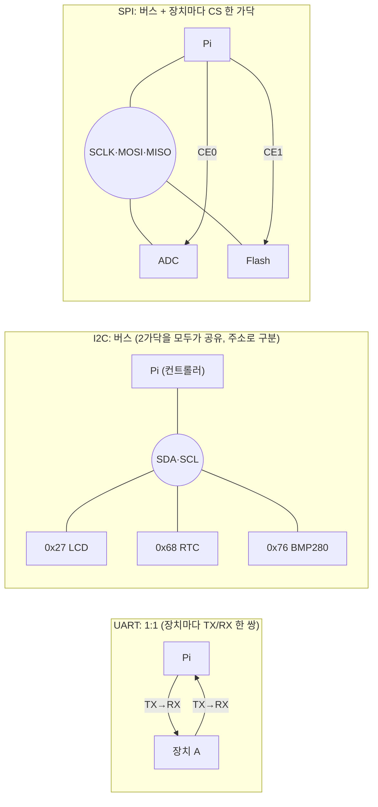
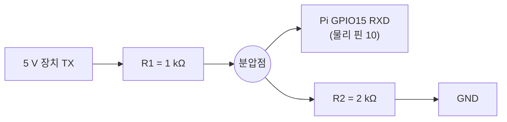
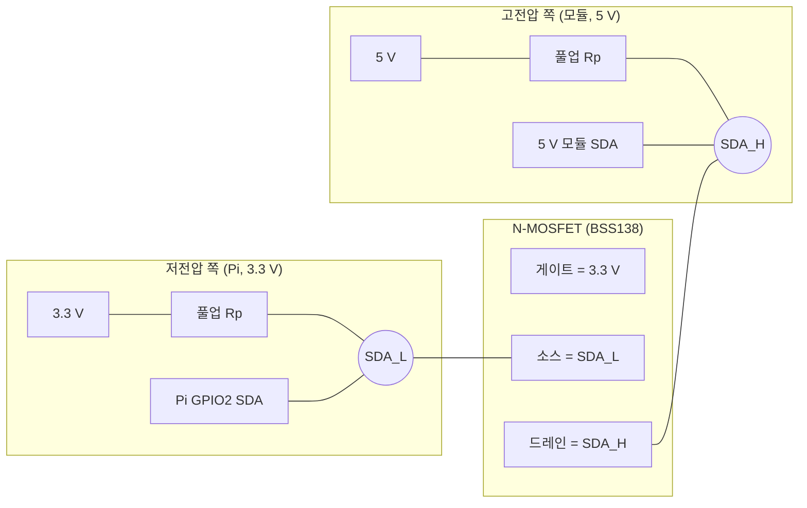
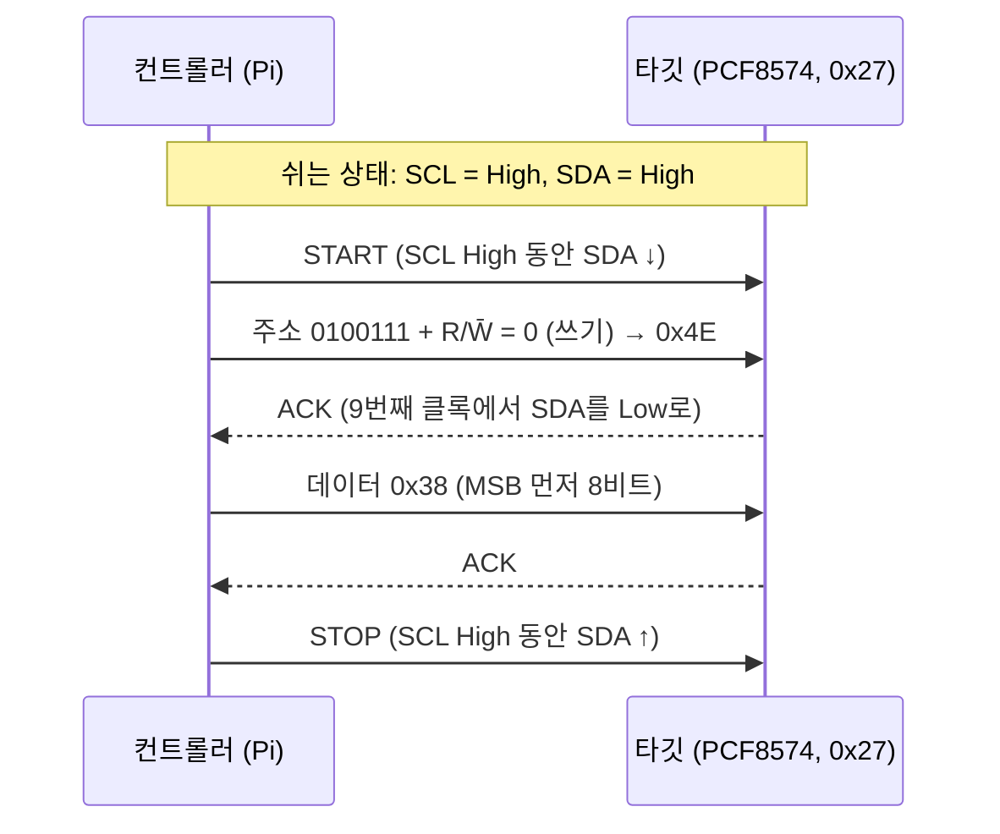
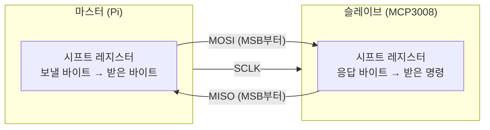

# 12장. 디바이스 간 통신: UART·I2C·SPI

> **학습 목표**
> - 병렬/직렬, 동기/비동기, 단방향/반이중/전이중, 1:1/버스 연결을 구분하고, UART·I2C·SPI를 이 기준으로 분류할 수 있다.
> - 3.3 V TTL, 5 V TTL, RS-232의 전압 레벨 차이를 설명하고, 5 V 장치를 Raspberry Pi에 연결할 때 분압기·MOSFET 레벨 시프터 중 무엇을 써야 하는지 판단할 수 있다. 특히 5 V I2C 모듈의 풀업이 Pi 핀에 거는 전압을 계산하고 측정할 수 있다.
> - Raspberry Pi 4의 UART0, I2C1, SPI0 핀과 장치 파일(`/dev/serial0`, `/dev/i2c-1`, `/dev/spidev0.0`)을 찾고, 인터페이스를 켜고 확인할 수 있다.
> - UART 프레임(시작·데이터·패리티·정지 비트)과 보율·비트 시간을 계산하고, pigpio `ser*` 함수로 루프백과 PC와의 명령 통신을 구현할 수 있다.
> - I2C의 START/STOP, 7비트 주소와 R/W̄, ACK/NACK, 레지스터 포인터 쓰기 후 읽기를 설명하고, `i2cdetect`와 pigpio `i2c*` 함수로 LCD(PCF8574), RTC(DS3231), 센서(BMP280)를 다룰 수 있다.
> - BCD, 2의 보수, 바이트 순서(엔디언), 비트 순서(MSB/LSB 먼저)를 데이터시트에 맞게 해석할 수 있다.
> - SPI의 4선 구조, 전이중 교환, 모드(CPOL/CPHA)를 설명하고, pigpio `spiXfer`로 ADC(MCP3008)를 읽을 수 있다.
> - 표준이 아닌 3선 직렬 장치(DS1302)를 데이터시트의 타이밍 다이어그램만 보고 GPIO 비트뱅으로 구현할 수 있다.
> - 커널 드라이버(i2c-dev, spidev, tty)와 pigpio가 같은 하드웨어를 두고 충돌하는 경우를 알아보고 해결할 수 있다.

[11장](11_process_concurrency.md)까지는 Raspberry Pi 한 대 안에서 일어나는 일을 보았다. GPIO 핀 하나를 High/Low로 움직이고([8장](08_gpio_pigpio.md)), 펄스 폭과 시간을 재고([9장](09_pigpio_advanced.md)), 그 파형을 계측기로 확인했다([10장](10_measurement.md)). 그런데 실제 임베디드 시스템은 혼자 일하지 않는다. 시계는 RTC 칩이 세고, 온도는 센서가 재고, 글자는 LCD가 보여 준다. 이 장은 Pi가 **다른 칩과 대화하는 방법**, 즉 UART·I2C·SPI 세 가지 직렬 통신 규약과, 규약이 정해져 있지 않은 장치를 직접 구현하는 방법(DS1302)을 다룬다. 파형을 측정하는 절차는 [10장](10_measurement.md)의 실습 10-5(UART), 10-6(I2C), 10-7(SPI)에 있으므로 이 장에서는 그 실습으로 연결만 하고, 규약의 의미와 프로그래밍에 집중한다.

---

## 12.1 장치는 왜, 어떻게 대화하는가

### 12.1.1 통신 규약: 협업을 위한 약속

**왜 필요한가.** 하나의 시스템이 모든 일을 직접 할 수는 없다. 2025년 13주차 강의의 말을 빌리면 "다른 장치에 요청하고 그 결과를 받아야 한다. 사람끼리 협업하는 것과 같다". Pi는 시간을 오래 정확히 세는 데 서툴고(전원이 꺼지면 시계가 멈춘다), 아날로그 전압을 읽는 회로(ADC)도 없다. 그래서 그 일을 잘하는 작은 칩(RTC, ADC, 센서)을 붙이고 결과만 받아 온다.

**비유.** 사람이 협업할 때도 약속이 필요하다. 어떤 언어로 말할지, 얼마나 빨리 말할지, 누가 먼저 말할지, 말을 알아들었으면 고개를 끄덕일지. 장치 사이의 이런 약속을 **통신 규약**(communication protocol)이라 한다. 규약을 알면 처음 보는 칩이라도 데이터시트를 읽고 "아, 이건 I2C로 주소 0x68에 레지스터 0을 쓰고 7바이트를 읽으면 되겠구나"라고 판단할 수 있다.

**정확한 정의.** 통신 규약은 ① 전기적 규격(선 몇 가닥, 전압 레벨), ② 비트를 보내는 방법(클록 유무, 비트 순서, 타이밍), ③ 메시지 형식(주소, 명령, 데이터, 응답)을 정한다. 이 장의 UART·I2C·SPI는 주로 ①과 ②를 정하고, ③(어떤 레지스터에 무엇을 쓰는가)은 각 칩의 **데이터시트**가 정한다.

| 구분 | 이 장에서 다루는 것 |
|---|---|
| 표준 규약 | UART(비동기 직렬), I2C(2선 버스), SPI(4선 버스) |
| 표준이 아닌 규약 | DS1302 RTC의 3선 직렬(CE·SCLK·I/O) — 데이터시트가 곧 규약이다 |
| 규약 위의 장치 | PCF8574(I2C GPIO 확장), HD44780 LCD, DS3231·DS1302(RTC), MCP3008(ADC), BMP280(온도·기압) |

**흔한 오해.** "시리얼 통신 = UART"라고 생각하기 쉽다. 2023년 강의에서도 강조했듯이 UART, I2C, SPI, 1-Wire는 **모두 직렬 통신**이다. 다만 관용적으로 "시리얼 포트", "시리얼 콘솔"이라고 하면 UART를 가리키는 경우가 많을 뿐이다.

### 12.1.2 병렬과 직렬

**병렬**(parallel) 통신은 8비트를 8가닥 선으로 **한 번에** 보낸다. **직렬**(serial) 통신은 한 가닥(또는 몇 가닥)으로 비트를 **차례로** 보낸다.

| 방식 | 한 번에 보내는 양 | 핀 수 | 예 |
|---|---|---|---|
| 병렬 | 1바이트 이상 동시에 | 많다(데이터 8~16 + 제어선) | 옛 프린터 포트, 문자 LCD의 D0~D7, 메모리 버스 |
| 직렬 | 1비트씩 여러 번에 나누어 | 적다(1~4) | UART, I2C, SPI, USB, Ethernet |

비유하면 병렬은 8차선 도로에 차 8대를 나란히 보내는 것이고, 직렬은 1차선 도로에 차 8대를 줄 세워 보내는 것이다. 차선이 많으면 한 번에 많이 가지만 도로(핀, 배선)가 비싸다. 게다가 선이 길어지고 빨라지면 8대가 **정확히 같이** 도착하게 맞추기(스큐, skew) 어려워진다. 그래서 핀 수가 귀한 마이크로컨트롤러와 칩 사이 통신은 대부분 직렬을 쓴다. 이 장의 LCD가 좋은 예이다. LCD 자체는 4비트 또는 8비트 **병렬** 입력이지만, 그 앞에 PCF8574를 붙여 Pi와는 **직렬**(I2C) 2가닥으로만 대화한다.

### 12.1.3 동기와 비동기

직렬로 비트를 줄 세워 보내면 받는 쪽은 "지금이 몇 번째 비트인가"를 알아야 한다. 방법은 두 가지이다.

| 방식 | 박자(타이밍)를 맞추는 방법 | 예 |
|---|---|---|
| **동기**(synchronous) | 데이터선과 별도로 **클록선**이 있어, 클록 에지마다 한 비트를 읽는다 | I2C(SCL), SPI(SCLK), DS1302(SCLK) |
| **비동기**(asynchronous) | 클록선이 없다. 양쪽이 **속도를 미리 약속**하고 각자 시계로 시간을 잰다 | UART |

동기식은 지휘자가 박자를 저어 주는 합창이다. 지휘봉(클록)이 내려갈 때마다 한 음(비트)을 낸다. 지휘자가 천천히 저으면 천천히, 빨리 저으면 빨리 노래하면 되므로 속도가 조금 흔들려도 상관없다. 비동기식은 지휘자 없이 "1분에 60박"이라고 미리 정해 놓고 각자 메트로놈을 켜고 부르는 것이다. 메트로놈이 서로 다르면 노래가 어긋난다. UART에서 양쪽 보율(baud rate)이 다르면 글자가 깨지는 이유이다.

### 12.1.4 단방향, 반이중, 전이중

| 방식 | 의미 | 데이터선 | 예 |
|---|---|---|---|
| 단방향(simplex) | 한쪽으로만 보낸다 | 1 | 라디오 방송, TX만 쓰는 디버그 출력 |
| **반이중**(half duplex) | 양방향이지만 **번갈아** 보낸다 | 1(공유) | 무전기, I2C(SDA 한 가닥), DS1302(I/O 한 가닥) |
| **전이중**(full duplex) | 양방향을 **동시에** 보낸다 | 2(송신·수신 따로) | 전화, UART(TX·RX), SPI(MOSI·MISO) |

강의에서 제시한 판별법은 간단하다. **데이터선이 몇 가닥인지 보라.** 클록선은 데이터선이 아니므로 빼고 센다. I2C는 2선이지만 하나는 클록(SCL)이라 데이터선은 1가닥이고, 그래서 반이중일 수밖에 없다. SPI는 데이터선이 MOSI·MISO 2가닥이라 전이중이다.

### 12.1.5 연결 형태: 1:1과 버스, 그리고 상대를 고르는 방법

여러 장치를 붙일 때 선이 몇 가닥 필요한지가 규약마다 다르다(GND는 항상 공통이므로 세지 않는다. [8장](08_gpio_pigpio.md) 8.2.3절).



| 규약 | 연결 형태 | 장치 1개일 때 선 수 | 장치 N개일 때 선 수 | 상대를 고르는 방법 |
|---|---|---|---|---|
| UART | 1:1 | 2 (TX, RX) | 2N | 고를 필요 없음(선이 곧 상대) |
| I2C | 1:N 버스 | 2 (SDA, SCL) | **2** | 데이터선으로 **주소**를 먼저 보낸다 |
| SPI | 1:N 버스 | 4 (SCLK, MOSI, MISO, CS) | **3 + N** | 장치마다 따로 있는 **CS**(칩 선택) 선 |

I2C는 장치가 늘어도 선이 2가닥 그대로라 하드웨어가 가장 단순하다. 대신 매번 주소를 보내야 하므로 그만큼 시간이 더 든다(오버헤드). SPI는 주소를 보내지 않고 CS 선으로 상대를 고르므로 빠르지만, 장치 하나에 선이 하나씩 는다. 2023년 강의에서 SPI의 선 수를 "공유선 3 + 장치마다 CS 1"로 따져 본 것이 바로 이 표이다. SPI에서 선택되지 않은 장치가 MISO를 놓아 주는 원리는 디지털 논리 시간의 **3상태 버퍼**(tri-state buffer)와 같다. CS가 비활성이면 출력이 고임피던스(Z)가 되어 선에서 떨어진 것처럼 된다.

### 12.1.6 마스터와 슬레이브, 컨트롤러와 타깃

버스에서 통신을 **시작하고 클록을 만드는 쪽**을 마스터(master), 불려서 응답하는 쪽을 슬레이브(slave)라고 불러 왔다. 이 교재의 실습에서는 언제나 **Pi가 마스터**이고 붙인 칩이 슬레이브이다. 최근 표준 문서는 용어를 바꾸고 있다. I2C 규격서(NXP UM10204)는 개정 7판(2021)부터 **컨트롤러**(controller)와 **타깃**(target)을 쓰고, SPI 쪽에서도 MOSI/MISO 대신 SDO/SDI, COPI/CIPO 같은 이름이 쓰인다. 데이터시트마다 이름이 다르므로 다음 대응표를 기억해 두자.

| 옛 이름 | 새 이름(예) | 뜻 |
|---|---|---|
| Master / Slave | Controller / Target (I2C), Controller / Peripheral (SPI) | 시작하는 쪽 / 응답하는 쪽 |
| MOSI (Master Out Slave In) | COPI, SDO(컨트롤러 기준) | 마스터 → 슬레이브 데이터 |
| MISO (Master In Slave Out) | CIPO, SDI(컨트롤러 기준) | 슬레이브 → 마스터 데이터 |
| SS, CS, CE | CS | 칩 선택 |

> 📌 **보강:** 용어 변경은 [NXP UM10204 I2C-bus specification and user manual (Rev. 7.0, 2021)](https://www.nxp.com/docs/en/user-guide/UM10204.pdf)의 개정 이력에 있다. Raspberry Pi 공식 문서와 pigpio, Linux 커널은 아직 MOSI/MISO와 master/slave 이름을 함께 쓰므로 이 교재도 두 이름을 병기한다.

### 12.1.7 비트 순서와 바이트 순서

같은 0x61을 보내도 **어느 비트부터** 보내는지는 규약마다 다르다. 또 16비트 이상의 값을 바이트 여러 개로 나눠 보낼 때 **어느 바이트부터** 보내는지(엔디언, [2장](02_computer_arch_arm.md))는 칩마다 다르다. 이 둘을 틀리면 값이 완전히 달라진다.

| 대상 | 비트 순서 | 바이트 순서(여러 바이트 값) | 이 장의 예 |
|---|---|---|---|
| UART | **LSB 먼저** | 규약 없음(응용이 정함) | 'a'(0x61)는 선 위에서 1,0,0,0,0,1,1,0 |
| I2C | **MSB 먼저** | 칩마다 다르다 | ADXL345 가속도는 낮은 바이트 먼저, DS3231 온도는 높은 바이트 먼저 |
| SMBus word(`i2cReadWordData`) | MSB 먼저 | **낮은 바이트 먼저**로 정해져 있다 | BMP280 보정 계수와 맞는다 |
| SPI | 보통 MSB 먼저(설정 가능) | 칩마다 다르다 | MCP3008 결과 B9…B0 |
| DS1302 | **LSB 먼저** | 레지스터마다 1바이트 | 0x81 명령 |

> **흔한 오해.** "I2C는 하위 비트가 먼저 오는 것 같다"는 설명이 2024년 수업 녹화에 있다. I2C는 **MSB 먼저**이다(UM10204 3.1.5절 Byte format, [10장](10_measurement.md) 실습 10-6의 정정). LSB 먼저인 것은 UART와 DS1302이다.

### 12.1.8 오픈 드레인과 풀업: 아무나 끌어내릴 수 있는 줄

[8장](08_gpio_pigpio.md) 8.3.1절에서 출력 방식 가운데 **오픈 드레인**(open-drain)을 보았다. 출력 트랜지스터가 선을 GND로 **끌어내리기만** 하고, High는 외부 **풀업 저항**(pull-up resistor)이 만든다.

**비유.** 천장에 매달린 블라인드 줄을 떠올리자. 스프링(풀업 저항)이 줄을 항상 위로 당기고 있고, 여러 사람(장치)이 아무 때나 줄을 아래로 잡아당길(Low) 수 있다. **아무도 당기지 않으면 위(High)**, <strong>한 사람이라도 당기면 아래(Low)</strong>이다. 누군가 위로 밀어 올리는 사람은 없으므로, 두 사람이 동시에 반대 방향으로 힘을 써서 줄이 끊어지는(단락, short) 일이 없다.

이 성질 덕분에 I2C는 한 가닥 SDA를 여러 장치가 공유하고, 받는 쪽이 SDA를 잠깐 Low로 당겨 "알아들었다(ACK)"고 대답할 수 있다. 만약 push-pull 출력 두 개가 한 선에 붙어 하나는 High, 하나는 Low를 내면 큰 전류가 흘러 둘 다 상할 수 있다.

| 항목 | push-pull | 오픈 드레인 + 풀업 |
|---|---|---|
| High를 만드는 것 | 출력의 위쪽 트랜지스터(세다) | 풀업 저항(약하다) |
| 상승 에지 | 빠르다 | 느리다(저항 × 선 용량) |
| 여러 출력을 한 선에 | 위험(충돌) | 안전(wired-AND) |
| 쓰는 곳 | UART TX, SPI | **I2C SDA·SCL**, DS3231 SQW, 인터럽트 선 |

I2C 파형에서 상승 에지가 둥글게 올라가고 하강 에지는 날카로운 이유가 이것이다([10장](10_measurement.md) 실습 10-6). 그리고 오픈 드레인 선의 High 전압은 **풀업 저항이 연결된 전원 전압**이 결정한다. 12.4절에서 보듯이 5 V 모듈을 다룰 때 이 사실이 결정적으로 중요하다.

---

## 12.2 Raspberry Pi 4의 통신 인터페이스

### 12.2.1 기본 핀 지도

40핀 헤더에서 기본으로 쓰는 통신 핀은 다음과 같다([8장](08_gpio_pigpio.md) 8.2.1절의 핀 맵 참고).

| 인터페이스 | 신호 | BCM | 물리 핀 | 리눅스 장치 | 켜는 방법 |
|---|---|---|---|---|---|
| UART(기본 UART) | TXD | GPIO14 | 8 | `/dev/serial0` → `ttyAMA0`(PL011) 또는 `ttyS0`(mini UART) | `enable_uart=1` ([3장](03_rpi_hw_os.md)) |
| | RXD | GPIO15 | 10 | | |
| I2C1 (`i2c_arm`) | SDA | GPIO2 | 3 | `/dev/i2c-1` | `dtparam=i2c_arm=on` |
| | SCL | GPIO3 | 5 | | |
| SPI0 | MOSI | GPIO10 | 19 | `/dev/spidev0.0` (CE0), `/dev/spidev0.1` (CE1) | `dtparam=spi=on` |
| | MISO | GPIO9 | 21 | | |
| | SCLK | GPIO11 | 23 | | |
| | CE0 | GPIO8 | 24 | | |
| | CE1 | GPIO7 | 26 | | |
| (예약) I2C0 | ID_SD / ID_SC | GPIO0 / GPIO1 | 27 / 28 | HAT의 ID EEPROM용 | 쓰지 않는다 |

- **GPIO2·GPIO3에는 보드에 고정 풀업 저항이 달려 있다.** 공식 문서는 "fixed pull-up resistors"라고만 적고, pigpio 문서는 그 값을 1.8 kΩ(1k8)이라고 안내한다. 그래서 I2C1에는 외부 풀업 없이 바로 장치를 달아도 동작하며, 이 두 핀은 내부 풀다운을 켜도 Low로 내려가지 않는다(버튼 입력에 쓰지 않는 이유, [8장](08_gpio_pigpio.md) 8.3.3절).
- 2025년 13주차 질의응답처럼 SoC에는 I2C 블록이 여러 개 있지만(I2C0, I2C1, …) 헤더의 GPIO2/3에 연결되어 일반 실습에 쓰는 것은 <strong>I2C1 = `/dev/i2c-1`</strong>이다. 그래서 `i2cdetect -y 1`, `i2cOpen(1, …)`처럼 버스 번호 1을 쓴다.

> 📌 **보강 출처:** [Raspberry Pi Documentation – GPIO and the 40-pin header (Alternative functions, Inputs)](https://www.raspberrypi.com/documentation/computers/raspberry-pi.html#gpio), [SPI0 핀 표](https://www.raspberrypi.com/documentation/computers/raspberry-pi.html#spi-overview), [pigpio C 문서 – bbI2COpen의 NOTE("the hardware pull-ups on pins 3 and 5 are 1k8")](https://abyz.me.uk/rpi/pigpio/cif.html#bbI2COpen)

### 12.2.2 Pi 4에만 있는 추가 UART·I2C·SPI (📌 보강)

BCM2711(Pi 4)은 이전 모델보다 UART·I2C·SPI 블록이 더 많다. 기본으로는 꺼져 있고, `config.txt`에 오버레이를 한 줄 넣으면 정해진 GPIO에 나타난다. 장치가 많아 기본 버스가 부족하거나 같은 주소의 칩을 두 개 써야 할 때 쓴다. 다른 기능(PWM, SPI0 등)과 핀이 겹치므로 실습 핀과 충돌하지 않는지 먼저 확인한다.

| 오버레이 | 기본 핀(BCM) | 장치 | 비고 |
|---|---|---|---|
| `dtoverlay=uart2` | TX GPIO0, RX GPIO1 (CTS/RTS GPIO2/3) | `/dev/ttyAMA*` | GPIO0/1은 HAT EEPROM 예약 핀 |
| `dtoverlay=uart3` | TX GPIO4, RX GPIO5 (CTS/RTS GPIO6/7) | | |
| `dtoverlay=uart4` | TX GPIO8, RX GPIO9 (CTS/RTS GPIO10/11) | | SPI0과 겹침 |
| `dtoverlay=uart5` | TX GPIO12, RX GPIO13 (CTS/RTS GPIO14/15) | | 하드웨어 PWM과 겹침 |
| `dtoverlay=i2c3` | GPIO4/5 (기본), `pins_2_3` 선택 가능 | `/dev/i2c-3` 등 | `baudrate=` 매개변수 |
| `dtoverlay=i2c4` | GPIO8/9 (기본), `pins_6_7` | | |
| `dtoverlay=i2c5` | GPIO12/13 (기본), `pins_10_11` | | |
| `dtoverlay=i2c6` | GPIO22/23 (기본), `pins_0_1` | | |
| `dtoverlay=spi3-1cs` … `spi6-2cs` | SPI3: GPIO0~3, SPI4: GPIO4~7, SPI5: GPIO12~15, SPI6: GPIO18~21 | `/dev/spidevN.M` | 공식 문서의 SPI 핀 표 참고 |
| `dtoverlay=i2c-gpio` | SDA GPIO23, SCL GPIO24 (기본) | `/dev/i2c-<n>` | **소프트웨어(비트뱅) I2C**, `i2c_gpio_delay_us=2`면 약 100 kHz |

정확한 매개변수는 Pi에서 `dtoverlay -h uart3`, `dtoverlay -h i2c4`처럼 확인한다([7장](07_boot_kernel.md) 7.8.5절). 위 표의 핀은 오버레이의 **SoC 기본값을 옮긴 참고표**이다. 대부분 이 교재의 표준 배선(LED 바, DS1302, PWM, 서보 등, [8장](08_gpio_pigpio.md) 8.2.4절)과 겹치므로 그대로 꽂지 않는다. 이 교재의 실습은 모두 기본 UART0, I2C1, SPI0만 쓴다.

> 📌 **보강 출처:** [raspberrypi/firmware – boot/overlays/README](https://github.com/raspberrypi/firmware/blob/master/boot/overlays/README) (uart2~uart5, i2c3~i2c6, i2c-gpio 항목), [Raspberry Pi Documentation – SPI hardware (SPI3~SPI6 핀 표)](https://www.raspberrypi.com/documentation/computers/raspberry-pi.html#spi-overview)

---

## 12.3 인터페이스 켜기와 확인

### 12.3.1 raspi-config 또는 config.txt

세 인터페이스 모두 **기본값은 꺼짐**이다. 켜는 방법은 두 가지이고 결과는 같다. `raspi-config`가 하는 일이 바로 `config.txt`의 해당 줄을 고치는 것이다(Raspberry Pi Codes 6.2의 설명).

```bash
sudo raspi-config
#   Interface Options -> I2C         -> Yes
#   Interface Options -> SPI         -> Yes
#   Interface Options -> Serial Port -> login shell? No / hardware? Yes   (실습 12-1, 12-2)
sudo reboot
```

메뉴 앞의 번호(I1, I2, …)는 `raspi-config` 버전에 따라 다르니 이름(I2C, SPI, Serial Port)을 보고 고른다. 직접 고치려면 `/boot/firmware/config.txt`의 `[all]` 아래에 다음 줄이 있는지 본다(Bookworm 경로. 옛 자료의 `/boot/config.txt`는 이전 OS 경로이다).

```ini
dtparam=i2c_arm=on               # I2C1 켜기  -> /dev/i2c-1
dtparam=i2c_arm_baudrate=100000  # (선택) I2C 클록, 기본 100 kHz
dtparam=spi=on                   # SPI0 켜기  -> /dev/spidev0.0, /dev/spidev0.1
enable_uart=1                    # 기본 UART 켜기 (3장에서 이미 넣었다)
dtoverlay=disable-bt             # (3장) PL011을 GPIO14/15로
```

`dtparam`과 `dtoverlay`가 device tree를 어떻게 바꾸는지는 [7장](07_boot_kernel.md) 7.8.5절과 실습 7-2에서 보았다. I2C 기본 클록이 100 kHz이고 `i2c_arm_baudrate`로 바꿀 수 있다는 것은 [10장](10_measurement.md) 실습 10-6의 보강에서 확인했다.

### 12.3.2 켜졌는지 확인하기

```bash
ls -l /dev/i2c-* /dev/spidev* /dev/serial*
lsmod | grep -E 'i2c|spi'
pinctrl get 2,3,7-11,14,15
```

> 출력 출처: Pi 4 실기기 실행 결과(2026-10). 이 Pi는 `i2c_arm=on`, `spi=on`, `enable_uart=1`이고 Bluetooth를 켠 상태(`disable-bt` 없음)였다.

```text
crw-rw---- 1 root i2c   89, 1 2026년  2월  7일 /dev/i2c-1
lrwxrwxrwx 1 root root      5 2026년  2월  7일 /dev/serial0 -> ttyS0
crw-rw---- 1 root spi  153, 0 2026년  2월  7일 /dev/spidev0.0
crw-rw---- 1 root spi  153, 1 2026년  2월  7일 /dev/spidev0.1
spidev                 20480  0
i2c_bcm2835            12288  0
spi_bcm2835            16384  0
i2c_dev                16384  0
 2: a0    pu | hi // GPIO2 = SDA1
 3: a0    pu | hi // GPIO3 = SCL1
 7: op -- pu | hi // GPIO7 = output
 8: op -- pu | hi // GPIO8 = output
 9: a0    pd | lo // GPIO9 = SPI0_MISO
10: a0    pd | lo // GPIO10 = SPI0_MOSI
11: a0    pd | lo // GPIO11 = SPI0_SCLK
14: a5    pn | hi // GPIO14 = TXD1
15: a5    pu | hi // GPIO15 = RXD1
```

출력을 위에서부터 차례로 읽어 보자.

- `ls`: `/dev/i2c-1`, `/dev/spidev0.0`, `/dev/spidev0.1`이 있으면 I2C와 SPI가 켜진 것이다. `/dev/serial0`은 실제 장치를 가리키는 **바로가기**(심볼릭 링크, 맨 앞 글자 `l`)이다.
- `lsmod`: I2C 컨트롤러 드라이버(`i2c_bcm2835`)와 `/dev/i2c-1`을 만들어 주는 `i2c_dev`, SPI 컨트롤러 드라이버(`spi_bcm2835`)와 `/dev/spidev*`를 만들어 주는 `spidev`가 올라와 있다.
- `pinctrl`: `a0`은 ALT0, 즉 핀이 주변장치(I2C1, SPI0)에 연결되었다는 뜻이다. GPIO2/3은 SDA1/SCL1, GPIO9~11은 SPI0의 MISO/MOSI/SCLK이다.
- **GPIO7/8은 `a0`이 아니라 `op`(출력)로 나온다.** 이것이 정상이다. 커널 SPI 드라이버는 칩 선택선 CE0(GPIO8)과 CE1(GPIO7)을 SPI 하드웨어에 맡기지 않고 **보통 GPIO 출력**으로 직접 올리고 내린다(평소에는 `hi`, 통신하는 동안만 `lo`).
- **GPIO14/15는 `a5`(ALT5) = TXD1/RXD1**, 즉 mini UART에 연결되어 있다. 이 Pi는 Bluetooth를 켜 둔 상태라 `serial0 -> ttyS0`(mini UART)이기 때문이다. 3장처럼 `dtoverlay=disable-bt`를 넣었다면 `serial0 -> ttyAMA0`이 되고 GPIO14/15는 `a0`(TXD0/RXD0, PL011)으로 나온다.

여기서 기억할 점은 두 가지이다.

1. **장치 파일의 그룹.** `/dev/i2c-1`은 `i2c` 그룹, `/dev/spidev*`는 `spi` 그룹, 시리얼 포트는 `dialout` 그룹 소유이고 권한은 `rw-rw----`(660)이다. 그 그룹에 든 사용자는 sudo 없이 장치 파일을 열 수 있다([5장](05_sysadmin.md) 5.2절). 이 장의 비교용 프로그램(`uart_termios`, `i2c_dev_ds3231`, `mcp3008_spidev`)이 sudo 없이 도는 이유이다. 반면 pigpio를 쓰는 프로그램(`-lpigpio`)은 `/dev/mem`에 접근하므로 그룹과 상관없이 **sudo가 필요**하다([8장](08_gpio_pigpio.md) 8.5절).
2. **`/dev/serial0`이 가리키는 곳.** `dtoverlay=disable-bt`를 넣었으면 `ttyAMA0`(PL011), 아니면 `ttyS0`(mini UART)이다. 차이와 이유는 [3장](03_rpi_hw_os.md) 3.7.3절에 있다. 프로그램에서는 항상 `/dev/serial0`을 열면 설정과 관계없이 GPIO14/15의 UART가 열린다.

### 12.3.3 누가 하드웨어를 쥐고 있는가: 커널 드라이버와 pigpio

[8장](08_gpio_pigpio.md)에서 pigpio가 `/dev/mem`으로 GPIO 레지스터를 직접 만진다는 것을 보았다. 그런데 통신 함수는 사정이 다르다. pigpio 소스(`pigpio.c`)를 보면 세 함수군이 하드웨어에 닿는 길이 서로 다르다.

| pigpio 함수 | 실제로 하는 일 (`pigpio.c`) | 필요한 설정 | 같은 장치를 쓰는 다른 길 |
|---|---|---|---|
| `serOpen()` | 리눅스 tty 장치(`/dev/serial0`)를 `open()`하고 termios로 raw 모드·보율을 설정 | `enable_uart=1`, 콘솔 해제 | `uart_termios.c`, `screen`, `minicom` |
| `i2cOpen()` | `/dev/i2c-N`을 `open()`하고 `ioctl(I2C_SLAVE)`로 주소 지정. 이후 SMBus ioctl | `dtparam=i2c_arm=on` | `i2c_dev_ds3231.c`, `i2cget`, Python smbus |
| `spiOpen()` (메인 SPI) | 커널을 거치지 않고 **SPI0 레지스터를 직접** 설정하고 GPIO7~11을 ALT0으로 바꾼다. 마지막 `spiClose()`에서 원래 핀 모드와 레지스터 값을 되돌린다 | 없음(`spi=on` 불필요) | `mcp3008_spidev.c`(커널 spidev) |
| `bbSPIOpen()`, `bbI2COpen()` | 아무 GPIO로 비트뱅 | 없음 | — |

즉 pigpio의 UART와 I2C는 **커널 드라이버 위에서** 동작하고, 메인 SPI만 커널을 **우회**한다. 이 차이가 트러블슈팅에서 그대로 드러난다.

- I2C나 UART가 커널에서 꺼져 있으면 pigpio도 실패한다(`i2cOpen` → `PI_BAD_I2C_BUS`, `serOpen` → `PI_SER_OPEN_FAILED`).
- 커널 드라이버가 I2C 주소를 이미 쓰고 있으면(`i2cdetect`의 `UU`) pigpio의 `ioctl(I2C_SLAVE)`가 거부되어 `i2cOpen`이 `PI_I2C_OPEN_FAILED`를 돌려준다(12.6.10절).
- pigpio SPI와 커널 spidev는 **같은 SPI0 레지스터를 서로 모르게** 만진다. 동시에 쓰면 안 된다(12.7.6절).

> 📌 **보강 출처:** pigpio 소스 [`pigpio.c`](https://github.com/joan2937/pigpio/blob/master/pigpio.c)의 `serOpen`, `i2cOpen`, `spiInit`/`spiTerm` 함수(저장소 `Pigpio-master/pigpio.c`로 대조), [pigpio C 문서 – spiOpen](https://abyz.me.uk/rpi/pigpio/cif.html#spiOpen)

---

## 12.4 전압 레벨과 레벨 시프팅

통신 선을 꽂기 **전에** 반드시 확인할 것이 전압이다. 프로그램 오류는 고치면 되지만, 핀에 잘못된 전압을 걸면 Pi가 망가진다.

### 12.4.1 같은 "시리얼"이라도 전기는 다르다

| 규격 | 논리 1 | 논리 0 | 쉬는 상태 | 쓰는 곳 | Pi에 직접 연결 |
|---|---|---|---|---|---|
| **3.3 V TTL/CMOS** | ≈ 3.3 V | 0 V | High | Raspberry Pi, 대부분의 32비트 MCU, 요즘 센서 | **가능** |
| 5 V TTL/CMOS | ≈ 5 V | 0 V | High | 5 V로 동작하는 MCU 보드, 많은 LCD 모듈 | **불가** — 레벨 변환 필요 |
| **RS-232** | **−3 ~ −15 V** | **+3 ~ +15 V** | 음전압 | PC의 옛 DB-9 COM 포트, 산업 장비, 계측기 | **절대 불가** |

Pi의 GPIO는 3.3 V 논리이고 5 V를 견디지 못한다([8장](08_gpio_pigpio.md) 8.1.1절). RS-232는 전압이 높을 뿐 아니라 **극성도 반대**(1이 음전압)이다.

> **원본 자료 정정: UART와 RS-232는 같은 것이 아니다.**
> - Raspberry Pi Codes 9.6.1절은 "UART 통신을 RS232 통신이라고도 부른다"고 했고, 「통신 신호 분석」 슬라이드도 RS232 제목 아래 UART를 설명한다. 2024년 수업 녹화에는 "실제 UART 표준에서는 3.3 V나 5 V가 아니라 12 V, 15 V처럼 훨씬 높다"는 설명이 있다.
> - 정확히는, **UART**는 프레임(시작·데이터·정지 비트)을 만들고 해석하는 **논리 회로·규약**이고, **RS-232**(TIA-232)는 그 비트를 케이블로 보낼 때의 **전기 규격**(±3~15 V, 커넥터, 제어선)이다. 12 V, 15 V는 RS-232의 이야기이다. Pi의 GPIO14/15에서 나오는 것은 **3.3 V 레벨의 UART 신호**이다.
> - 그래서 PC의 DB-9 COM 포트나 "USB to RS232" 케이블을 Pi에 연결하려면 그 사이에 **RS-232 트랜시버**(예: 3.3 V에서 동작하는 MAX3232 계열)가 있어야 한다. 3장에서 쓴 USB-TTL(3.3 V) 어댑터는 트랜시버가 필요 없는 TTL 레벨 장치이다.

### 12.4.2 한 방향 신호: 저항 분압기

> **이 교재의 표준은 레벨 시프터이다.** 표준 핀 계획은 5 V 장치([9장](09_pigpio_advanced.md) HC-SR04의 TRIG/ECHO, 실습 12-3의 PCF8574 LCD)를 모두 **4채널 양방향 BSS138 레벨 시프터 모듈**(LV = 3.3 V, HV = 5 V, GND 공통, 12.4.3절)로 연결한다. 저항 분압기는 **시프터가 없을 때의 대안**으로 원리만 알아 둔다.

시프터가 없을 때 5 V 장치의 **출력**을 Pi의 **입력**으로 받아야 한다면(예: 5 V 보드의 UART TX → Pi RXD, [9장](09_pigpio_advanced.md) HC-SR04의 ECHO) 저항 두 개로 전압을 나누면 된다.

$$ V_{out} = V_{in} \times \frac{R_2}{R_1 + R_2} = 5\,\text{V} \times \frac{2\,\text{k}\Omega}{1\,\text{k}\Omega + 2\,\text{k}\Omega} \approx 3.33\,\text{V} $$



- 분압기는 **한 방향**에만 쓸 수 있다. 저항이 신호를 약하게 만들고, 상승 에지가 느려지므로 아주 빠른 신호(수 MHz 이상)에는 맞지 않는다.
- 반대 방향(Pi TX 3.3 V → 5 V 장치 RX)은 저항으로 전압을 **올릴** 수 없다. 5 V 장치의 입력 High 문턱(V<sub>IH</sub>)이 3.3 V보다 낮으면(예: TTL 입력 2.0 V) 그대로 연결해도 동작하지만, CMOS 입력처럼 V<sub>IH</sub>가 0.7 × V<sub>DD</sub> = 3.5 V이면 3.3 V는 High로 인정되지 않을 수 있다. **상대 데이터시트의 V<sub>IH</sub>를 확인**하고, 모자라면 레벨 시프터를 쓴다.

### 12.4.3 양방향 오픈 드레인 신호: MOSFET 레벨 시프터

I2C의 SDA는 **양방향**이다. 컨트롤러도 끌어내리고 타깃도 끌어내린다(ACK, 읽기 데이터). 분압기로는 안 된다. 이때 쓰는 것이 N채널 MOSFET 한 개와 양쪽 풀업 저항으로 만든 **양방향 레벨 시프터**이다. 시중의 "I2C 레벨 컨버터 모듈"은 대부분 이 회로를 채널마다 하나씩(BSS138 MOSFET) 넣은 것이다. NXP 응용 노트 AN10441이 이 회로의 동작을 설명한다.



| 상황 | 동작 | 결과 |
|---|---|---|
| 아무도 당기지 않음 | V<sub>GS</sub> = 0 → MOSFET 꺼짐. 각 쪽 풀업이 자기 전압으로 올린다 | 3.3 V 쪽 3.3 V, 5 V 쪽 5 V — **Pi 핀에는 3.3 V만 걸린다** |
| Pi가 SDA_L을 Low로 | V<sub>GS</sub> = 3.3 V → MOSFET 켜짐 → SDA_H도 Low | 모듈이 Low를 본다 |
| 모듈이 SDA_H를 Low로 | MOSFET 내부 다이오드로 SDA_L이 내려가고 → V<sub>GS</sub>가 커져 MOSFET 켜짐 | Pi가 Low를 본다 |

SCL도 같은 회로를 하나 더 쓴다. 모듈을 살 때는 "LV(3.3 V)"와 "HV(5 V)" 단자가 따로 있고 채널마다 MOSFET이 있는 **양방향(bi-directional)** 제품을 고른다. TXB0108처럼 push-pull용 자동 방향 감지 변환기는 I2C의 풀업과 잘 맞지 않을 수 있으므로 I2C에는 MOSFET 방식이나 I2C 전용 버퍼(예: NXP PCA9306)를 쓴다.

> 📌 **보강 출처:** [NXP AN10441 Level shifting techniques in I2C-bus design](https://www.nxp.com/docs/en/application-note/AN10441.pdf), [NXP PCA9306 데이터시트](https://www.nxp.com/docs/en/data-sheet/PCA9306.pdf)

### 12.4.4 레벨 시프터로 5 V I2C 모듈(LCD 백팩) 연결하기

[10장](10_measurement.md) 실습 10-6이 "12장의 레벨 시프터 방법"으로 미뤄 둔 내용이 이 절이다. 문제의 핵심은 **I2C 선의 High 전압은 풀업 저항이 정한다**는 12.1.8절의 사실이다.

**왜 위험한가.** 16x2 문자 LCD는 대부분 5 V로 동작한다. 3.3 V로 켜면 글자가 흐리거나 아예 보이지 않는 제품이 많다. 그래서 2025년 수업과 Raspberry Pi Codes 7.3.6절은 LCD 모듈의 VCC를 5 V(물리 핀 2)에 연결했다. 그런데 LCD 뒤의 PCF8574 백팩에는 보통 SDA·SCL을 **모듈 VCC로 끌어올리는 풀업 저항**이 붙어 있다. 그러면 Pi 쪽 풀업(3.3 V)과 모듈 쪽 풀업(5 V)이 한 선에서 만난다.

**계산해 보기.** 저항값은 모듈마다 다르므로 아래는 **예시**이다. Pi 쪽 1.8 kΩ(3.3 V), 모듈 쪽 4.7 kΩ(5 V)이라고 하자. 아무도 선을 당기지 않을 때 선의 전압은 두 전원이 저항을 통해 만나는 점의 전압(밀만의 정리)이다.

$$ V = \frac{3.3/1.8\text{k} + 5/4.7\text{k}}{1/1.8\text{k} + 1/4.7\text{k}} \approx 3.77\,\text{V} $$

**3.3 V를 넘는 전압이 Pi의 GPIO2/3에 계속 걸린다.** 동시에 5 V → 4.7 kΩ → 1.8 kΩ → 3.3 V 경로로 Pi의 3.3 V 전원 쪽으로 전류가 거꾸로 흘러 들어간다. 당장 망가지지 않더라도 사양을 벗어난 사용이다. 모듈 풀업이 더 작으면(예: 2.2 kΩ) 전압은 더 올라간다.

**그렇다면 모듈 풀업을 떼면?** 백팩의 풀업 저항을 떼어 내고 Pi의 3.3 V 풀업만 남기는 방법이 인터넷에 많다. 그런데 NXP PCF8574 데이터시트에서 SCL·SDA의 입력 High 문턱(V<sub>IH</sub>)은 <strong>0.7 × V<sub>DD</sub></strong>이다. V<sub>DD</sub> = 5 V이면 3.5 V 이상이어야 High로 보장되는데, 3.3 V 풀업으로는 이 조건을 만족하지 못한다. "대개 동작한다"와 "사양대로 동작한다"는 다르다. 그래서 이 교재는 이 방법을 권하지 않는다.

**측정 먼저.** 모듈마다 풀업 유무와 값이 다르므로 계산보다 측정이 확실하다. 측정 절차는 [10장](10_measurement.md) 실습 10-6의 "안전 확인"을 그대로 따른다. 요약하면, 모듈에 **전원(VCC, GND)만** 연결한 상태에서 SDA–GND 전압을 재고, 모듈 VCC에 가까운 값(5 V로 켰다면 약 5 V)이 나오면 **그 모듈은 Pi에 직접 연결하지 않는다.** 멀티미터로 재도 되고 AD2의 Voltmeter로 재도 된다.

**선택지 정리**

| 방법 | 모듈 VCC | Pi 쪽 SDA/SCL High | 사양 | 이 교재의 권장 |
|---|---|---|---|---|
| ① 모듈을 3.3 V로 켠다 | 3.3 V | 3.3 V | 만족 (PCF8574는 2.5~6 V 동작) | DS3231, BMP280, PCF8574 단독 모듈, 파형 관찰(10-6) |
| ② MOSFET 양방향 레벨 시프터 | 5 V | 3.3 V | 만족 | **5 V LCD 백팩 (실습 12-3) — 이 교재의 표준 배선** |
| ③ I2C 전용 레벨 변환 IC(PCA9306 등) | 5 V | 3.3 V | 만족 | ②와 같은 목적 |
| ④ 5 V로 켜고 그대로 연결 | 5 V | 약 3.8 V(예시) | **위반** | 금지 |
| ⑤ 모듈 풀업을 떼고 5 V로 켬 | 5 V | 3.3 V | V<sub>IH</sub> 미달 가능 | 권장하지 않음 |

**②가 이 교재의 표준 배선이다.** 표준 핀 계획은 5 V 장치를 모두 4채널 양방향 BSS138 레벨 시프터 모듈로 연결한다. 이유는 두 가지이다.

- **Pi 쪽이 안전하다.** Pi의 GPIO2/3에는 LV 쪽 풀업이 정한 3.3 V만 걸린다(12.4.3절의 표). 5 V → 3.3 V로 전류가 거꾸로 흐르는 경로도 MOSFET이 끊는다.
- **PCF8574 쪽 사양을 만족한다.** HV 쪽 선은 5 V까지 올라가므로 PCF8574의 V<sub>IH</sub> = 0.7 × V<sub>DD</sub> = 0.7 × 5 V = 3.5 V를 넉넉히 넘는다. 3.3 V 신호를 바로 넣으면 이 문턱에 못 미친다.

①(모듈을 3.3 V로 켜기)도 사양은 만족하지만 LCD 글자가 흐리거나 안 보일 수 있어 **시프터가 없을 때의 대안**으로 둔다. 표준 배선은 다음과 같다(실습 12-3).

| Pi | 레벨 시프터 LV 쪽 | 레벨 시프터 HV 쪽 | LCD 백팩 |
|---|---|---|---|
| 3.3 V (물리 핀 1) | LV | — | — |
| 5 V (물리 핀 2) | — | HV | VCC |
| GND (물리 핀 6) | GND | GND | GND |
| GPIO2 SDA (물리 핀 3) | LV1 | HV1 | SDA |
| GPIO3 SCL (물리 핀 5) | LV2 | HV2 | SCL |

연결한 뒤에도 프로그램을 돌리기 전에 Pi 쪽(LV1, LV2)의 쉬는 전압이 3.3 V 이하인지 한 번 더 잰다.

> **레벨 시프터 채널 규약.** 이 교재는 4채널 시프터 모듈 하나의 채널을 용도별로 고정한다. **LV1/HV1 = I2C SDA, LV2/HV2 = I2C SCL**, LV3/HV3과 LV4/HV4는 [9장](09_pigpio_advanced.md) 실습 9-6의 HC-SR04 TRIG/ECHO(GPIO20/21) 몫이다. 그래서 9장에서 꽂아 둔 HC-SR04 배선을 빼지 않고 LCD를 함께 연결해 두어도 된다. LV = 3.3 V(물리 핀 1), HV = 5 V(물리 핀 2), GND는 공통이며, AD2로 잴 때는 Pi가 실제로 보는 **LV 쪽**을 잰다. 전체 배선은 [8장](08_gpio_pigpio.md) 8.2.4절의 표준 배선과 같다.

> 📌 **보강 출처:** [NXP PCF8574/PCF8574A 데이터시트](https://www.nxp.com/docs/en/data-sheet/PCF8574_PCF8574A.pdf) (전원 전압 2.5~6 V, SCL·SDA의 V<sub>IH</sub> = 0.7 V<sub>DD</sub>), [NXP AN10441](https://www.nxp.com/docs/en/application-note/AN10441.pdf)

### 12.4.5 풀업 저항은 얼마가 적당한가 (📌 보강)

풀업이 너무 크면 상승 에지가 느려 클록 주기 안에 High에 도달하지 못하고, 너무 작으면 장치가 Low로 끌어내리지 못한다. UM10204는 두 한계를 다음처럼 준다.

$$ R_{p(min)} = \frac{V_{DD} - V_{OL(max)}}{I_{OL}}, \qquad R_{p(max)} = \frac{t_r}{0.8473 \times C_b} $$

Standard-mode(100 kHz)에서 V<sub>DD</sub> = 3.3 V, V<sub>OL</sub> = 0.4 V, I<sub>OL</sub> = 3 mA이면 R<sub>p(min)</sub> ≈ 0.97 kΩ이다. 상승 시간 한계 t<sub>r</sub> = 1000 ns, 버스 용량 C<sub>b</sub> = 200 pF이면 R<sub>p(max)</sub> ≈ 5.9 kΩ이다. Pi의 1.8 kΩ은 이 범위 안에 있다. 여러 모듈을 붙이면 모듈마다 달린 풀업이 **병렬**로 합쳐져 저항이 작아지므로, 모듈을 서너 개 이상 달 때는 합성 저항이 R<sub>p(min)</sub>보다 작아지지 않는지 확인한다.

> 📌 출처: [NXP UM10204](https://www.nxp.com/docs/en/user-guide/UM10204.pdf)의 풀업 저항 크기 결정(Pull-up resistor sizing)과 SDA·SCL 버스 특성 표

---

## 12.5 UART: 미리 정한 속도로 말하기

### 12.5.1 비유와 정의

**비유.** UART는 **두 사람이 미리 정한 속도로 말하는 것**이다. "1초에 9600음절로 말하자"고 약속해 두고, 말을 시작할 때는 "자!"(시작 비트)라고 외친 뒤 정해진 속도로 여덟 음절을 말하고, "끝"(정지 비트)으로 맺는다. 듣는 사람은 "자!"를 듣는 순간 자기 시계를 켜고, 약속한 간격마다 한 음절씩 받아 적는다. 둘의 속도가 다르면 음절이 밀려 엉뚱한 말이 된다.

**정의.** **UART**(Universal Asynchronous Receiver/Transmitter, 범용 비동기 송수신기)는 병렬 바이트를 직렬 비트열로 바꿔 내보내고(송신), 들어온 비트열을 다시 바이트로 모으는(수신) 하드웨어 블록이다. 클록선이 없는 비동기식이고, TX(송신)와 RX(수신)가 따로 있는 전이중 1:1 연결이다. 연결할 때는 한쪽의 TX를 상대의 RX로 **엇갈려** 잇는다([3장](03_rpi_hw_os.md) 3.9.2절).

### 12.5.2 프레임: 시작·데이터·패리티·정지 비트

UART는 쉬는 동안(idle) 선을 **High**로 둔다. 한 바이트(문자)를 보내는 묶음을 **프레임**(frame)이라 한다.

| 순서 | 필드 | 값 | 역할 |
|---|---|---|---|
| 1 | 시작 비트(start) | 0 (Low) 1비트 | High → Low 하강 에지로 "지금부터 보낸다"고 알린다. 받는 쪽은 이 에지에 시계를 맞춘다 |
| 2 | 데이터 비트 | 5~9비트, 보통 8비트, **LSB 먼저** | 실제 데이터 |
| 3 | 패리티 비트(parity, 선택) | 짝수(even)·홀수(odd)·없음(none) | 1의 개수를 짝수/홀수로 맞춰 1비트 오류를 검출 |
| 4 | 정지 비트(stop) | 1 (High) 1~2비트 | 프레임 끝. 다음 시작 비트의 하강 에지를 만들 수 있게 선을 High로 되돌린다 |

**8N1**은 데이터 **8**비트, 패리티 **N**one, 정지 비트 **1**개이며 가장 흔한 형식이다. 프레임 길이는 시작 1 + 데이터 8 + 정지 1 = **10비트**이다. 슬라이드의 설명대로 시작 비트를 빼고는 길이가 약속하기 나름이다(데이터 비트 수, 패리티, 정지 비트 수). 2023년 강의의 표현을 빌리면 "패리티를 짝수로 할지 홀수로 할지, 아예 안 할지 서로 약속해 놓고 통신한다".

'a'(0x61 = 0110 0001)를 8N1로 보내면 선 위의 모양은 다음과 같다. LSB부터 보내므로 데이터 부분이 2진수를 거꾸로 읽은 1000 0110이 된다.

```text
 쉼  시작 b0  b1  b2  b3  b4  b5  b6  b7  정지 쉼
 ‾‾‾|___|‾‾‾|___|___|___|___|‾‾‾|‾‾‾|___|‾‾‾‾‾‾‾‾
       0   1   0   0   0   0   1   1   0   1
      |<- 비트 시간 x 10 = 한 프레임 ->|
```

0x55(0101 0101)는 선 위에서 시작 비트부터 0,1,0,1,…로 **정확히 번갈아** 나와 보율을 주파수로 바로 잴 수 있다. 0xAA는 반대 순서이다. 「통신 신호 분석」 슬라이드가 0xAA와 0x55를 예로 든 이유이며, 실제 측정은 [10장](10_measurement.md) 실습 10-5에서 한다.

### 12.5.3 보율과 비트 시간

**보율**(baud rate)은 1초에 보내는 기호(심벌) 수이고, UART에서는 한 기호가 1비트이므로 bps(bits per second)와 같다. 비트 하나의 길이는 그 역수이다.

| 보율 (bps) | 비트 시간 = 1/보율 | 8N1 프레임(10비트) | 초당 최대 바이트 | pigpio `serOpen` 지원 |
|---|---|---|---|---|
| 9600 | **104.17 μs** | 1.042 ms | 960 | O |
| 19200 | 52.08 μs | 0.521 ms | 1920 | O |
| 38400 | 26.04 μs | 0.260 ms | 3840 | O |
| 57600 | 17.36 μs | 0.174 ms | 5760 | O |
| 115200 | **8.68 μs** | 86.8 μs | 11520 | O |
| 230400 | 4.34 μs | 43.4 μs | 23040 | O (pigpio가 받는 최댓값) |

- 「통신 신호 분석」 슬라이드의 표(9600 → 104.17 μs, 19200 → 52.08 μs, 115200 → 8.68 μs)가 맞다. 「Analog Discovery 2」 자료의 "104.6 μs"는 측정값이며 이론값은 104.17 μs이다([10장](10_measurement.md) 정정).
- **초당 바이트는 보율 ÷ 10**이다. 115200 bps라고 해서 1초에 14400바이트(÷ 8)를 보내는 것이 아니다. 시작·정지 비트도 시간을 차지한다.
- pigpio의 `serOpen()`은 50, 75, …, 115200, 230400 가운데 하나만 받는다(그 밖의 값은 `PI_BAD_SER_SPEED`). 더 빠른 속도는 termios로 직접 설정해야 한다.

**왜 받는 쪽은 맞게 읽을까.** 받는 쪽 UART는 시작 비트의 하강 에지를 보면 비트 시간의 절반만큼 기다린 뒤, 그때부터 비트 시간마다 **비트의 한가운데**에서 값을 읽는다(실제로는 보율의 16배 같은 빠른 클록으로 여러 번 표본을 뜬다). 그래서 양쪽 시계가 조금 달라도 10비트 동안 누적된 어긋남이 반 비트를 넘지 않으면 제대로 읽힌다. 보율이 크게 다르면 표본 위치가 옆 비트로 넘어가 엉뚱한 글자(쓰레기 문자)가 된다. 10장 실습 10-5에서 해석기의 Baud를 일부러 틀리게 두고 이 현상을 볼 수 있다.

> **원본 자료 정정:** 2023년 강의는 UART를 "보통 R123"(RS-232)이라 부르며 시작했다. 위의 계산은 UART 프레임 이야기이고, 전압이 ±12 V인지 3.3 V인지는 프레임과 무관한 전기 규격 문제이다(12.4.1절).

### 12.5.4 흐름 제어

받는 쪽 버퍼가 가득 찼는데 보내는 쪽이 계속 보내면 데이터를 잃는다. 이를 막는 것이 **흐름 제어**(flow control)이다.

| 방식 | 방법 | 필요한 선 |
|---|---|---|
| 없음(None) | 받는 쪽이 충분히 빠르다고 가정 | TX, RX, GND |
| 하드웨어(RTS/CTS) | 받는 쪽이 "지금 그만"을 별도 선으로 알린다 | + RTS, CTS |
| 소프트웨어(XON/XOFF) | 데이터 중에 특수 문자 0x13(XOFF), 0x11(XON)을 보낸다 | 추가 선 없음. 대신 이진 데이터에 쓰기 어렵다 |

이 장의 실습은 모두 **흐름 제어 없음**이다. 3장에서 PuTTY의 Flow control을 None으로 바꾼 이유가 이것이다. Pi 4의 추가 UART는 오버레이 매개변수 `ctsrts`로 RTS/CTS 핀을 켤 수 있다(12.2.2절).

### 12.5.5 Pi의 UART와 시리얼 콘솔: 먼저 UART를 비워야 한다

[3장](03_rpi_hw_os.md)에서 GPIO14/15의 UART를 **로그인 콘솔**로 쓰도록 설정했다(`enable_uart=1`, `dtoverlay=disable-bt`, `cmdline.txt`의 `console=serial0,115200`). 이 상태에서 내 프로그램이 같은 UART를 쓰면 두 가지가 겹친다.

1. 커널이 부팅 메시지와 커널 로그를 그 UART로 내보낸다(`console=serial0,…`).
2. `serial-getty@ttyAMA0.service`(로그인 프롬프트를 띄우는 getty)가 그 장치를 열고 들어오는 글자를 **가로챈다.**

pigpio의 `serOpen()`은 장치를 **배타적으로 열지 않는다**(`pigpio.c`의 `serOpen`은 `open()`에 독점 플래그를 주지 않는다). 그래서 getty가 붙어 있어도 `serOpen()`은 성공하고, 들어온 글자 일부를 getty가 먼저 읽어 가 버린다. 증상은 "열기는 되는데 글자가 사라지거나, 상대에게 `login:` 같은 엉뚱한 글자가 간다"이다. 실습 12-1, 12-2 전에 반드시 콘솔을 끈다.

```bash
sudo raspi-config
#   Interface Options -> Serial Port
#     Would you like a login shell to be accessible over serial?  -> No
#     Would you like the serial port hardware to be enabled?      -> Yes
sudo reboot

# 확인 (SSH로 접속해서)
cat /proc/cmdline | tr ' ' '\n' | grep console     # console=serial0,... 이 없어야 한다
systemctl status serial-getty@ttyAMA0.service       # inactive 또는 not found 여야 한다
ls -l /dev/serial0                                  # -> ttyAMA0 (disable-bt를 넣은 경우)
```

- 이 메뉴는 `cmdline.txt`에서 `console=serial0,115200`을 지우고 `enable_uart=1`은 남긴다. 콘솔을 끈 뒤에는 **SSH로 접속**해 작업한다([3장](03_rpi_hw_os.md) 3.10절). UART 콘솔로만 접속하던 상태에서 끄면 접속 수단을 잃으므로 SSH가 되는지 먼저 확인한다.
- 실습이 끝나면 같은 메뉴에서 login shell을 **Yes**로 되돌린다. 3장의 "디버그 모듈"(부팅이 안 될 때 원인을 보는 창구)을 다시 살리는 것이다.
- `dtoverlay=disable-bt`가 없으면 `/dev/serial0`은 mini UART(`ttyS0`)이고, mini UART의 보율은 코어 클록에 묶여 있어 클록이 바뀌면 글자가 깨질 수 있다([3장](03_rpi_hw_os.md) 3.7.3절). 이 교재의 설정(disable-bt)에서는 PL011(`ttyAMA0`)을 쓰므로 해당하지 않는다.

> 📌 **보강 출처:** [Raspberry Pi Documentation – Configure UARTs](https://www.raspberrypi.com/documentation/computers/configuration.html#configure-uarts), [raspi-config – Serial Port](https://www.raspberrypi.com/documentation/computers/configuration.html#raspi-config), pigpio 소스 `serOpen()` (`open(tty, O_RDWR | O_NOCTTY | O_NDELAY | O_NONBLOCK)`)

### 12.5.6 pigpio의 UART 함수

| 함수 | 하는 일 | 돌려주는 값 | 주의 |
|---|---|---|---|
| `h = serOpen(dev, baud, 0)` | 장치를 열고 raw 8N1, 보율 설정 | 핸들(≥ 0) 또는 음수 | `dev`는 `char *`이므로 문자열 상수 대신 `char dev[] = "/dev/serial0";` 배열을 넘긴다. 이름은 `/dev/tty` 또는 `/dev/serial`로 시작해야 한다 |
| `serWriteByte(h, b)` | 1바이트 보내기 | 0 또는 음수 | |
| `serWrite(h, buf, n)` | n바이트 보내기 | 0 또는 음수 | 커널 송신 버퍼에 넣으면 바로 돌아온다. 실제로 선에 다 나가는 데는 n × 10 / 보율 초가 걸린다 |
| `serDataAvailable(h)` | 받아 둔 바이트 수 | ≥ 0 | |
| `serReadByte(h)` | 1바이트 읽기 | 0~255 또는 음수 | 데이터가 없으면 **기다리지 않고** `PI_SER_READ_NO_DATA`(−87) |
| `serRead(h, buf, n)` | 최대 n바이트 읽기 | 읽은 수 또는 음수 | 데이터가 없으면 `PI_SER_READ_NO_DATA` |
| `serClose(h)` | 닫기 | 0 또는 음수 | |

WiringPi의 `serialGetchar()`는 데이터가 없으면 최대 10초 기다리지만 pigpio는 바로 돌아온다. 그래서 `serDataAvailable()`로 먼저 확인하거나 반환값이 음수인지 검사해야 한다. 이 차이와 원본 `serialTest.c`의 대응은 [부록 B](appendix_b_gpio_libraries.md) B.4.12절에 정리되어 있다.

> **원본 자료 정정:** Raspberry Pi Codes 4.5절은 `serialTest.c` 실행 시 `Out: 0: Error writing to file descriptor: Success`가 나오면 UART 설정을 고치라고 안내한다. WiringPi 소스(`wiringSerial.c`)를 보면 `serialPutchar()`는 `write()`가 1을 돌려주지 않을 때 `perror()`를 부른다. `write()`가 오류(−1)가 아니라 0바이트를 돌려준 경우에는 `errno`가 0이어서 "Success"가 붙는다. 그래서 이 메시지는 그 자체로는 원인을 알려 주지 않는다. 실제 원인은 대개 UART가 꺼져 있거나 콘솔이 같은 장치를 쓰는 것이다. 또 원본의 `/boot/cmdline.txt`, `/boot/config.txt`, `dtoverlay=pi3-disable-bt`는 Bookworm에서 각각 `/boot/firmware/cmdline.txt`, `/boot/firmware/config.txt`, `dtoverlay=disable-bt`이다.

### 12.5.7 pigpio 없이: POSIX termios

`serOpen()` 안에서 일어나는 일을 리눅스 표준 API로 직접 하면 다음과 같다. 장치를 `open()`하고, `termios` 구조체로 **raw 모드**(줄 편집·에코·특수 문자 해석 끄기), 보율, 8N1, 읽기 대기 시간을 설정한다. pigpio가 필요 없고 `dialout` 그룹이면 sudo도 필요 없다.

**코드** (`code/ch12/uart_termios.c`)

```c
/*
 * uart_termios.c : 12.5절 비교용  pigpio 없이 POSIX termios로 UART 루프백
 *
 * pigpio의 serOpen()이 내부에서 하는 일(장치 열기, raw 모드, 보율 설정)을
 * 리눅스 표준 API로 직접 해 본다. sudo가 필요 없다(dialout 그룹이면 충분).
 *
 * 회로 : 실습 12-1과 같다. GPIO14/TXD (물리 핀 8) <-> GPIO15/RXD (물리 핀 10) 점퍼
 * 빌드 : gcc -Wall -O2 -o uart_termios uart_termios.c
 * 실행 : ./uart_termios
 */
#include <stdio.h>
#include <string.h>
#include <fcntl.h>
#include <unistd.h>
#include <termios.h>

int main(void)
{
    const char *dev = "/dev/serial0";
    const char *msg = "Hello, termios!\n";
    struct termios tio;
    char rx[64];
    int fd, n, got = 0;

    fd = open(dev, O_RDWR | O_NOCTTY);           /* 이 단말을 제어 터미널로 삼지 않는다 */
    if (fd < 0) {
        perror(dev);                             /* Permission denied -> dialout 그룹 */
        return 1;
    }

    tcgetattr(fd, &tio);
    cfmakeraw(&tio);                             /* 줄 편집·에코·특수 문자 처리 끄기 */
    cfsetispeed(&tio, B115200);
    cfsetospeed(&tio, B115200);
    tio.c_cflag |= CLOCAL | CREAD;               /* 모뎀 제어선 무시, 수신 허용 */
    tio.c_cflag &= ~(PARENB | CSTOPB | CRTSCTS); /* 패리티 없음, 정지 비트 1, 흐름 제어 없음 */
    tio.c_cc[VMIN]  = 0;                         /* read()는 */
    tio.c_cc[VTIME] = 5;                         /* 최대 0.5 s 기다린다 */
    tcsetattr(fd, TCSANOW, &tio);
    tcflush(fd, TCIOFLUSH);                      /* 남은 데이터 버리기 */

    if (write(fd, msg, strlen(msg)) < 0) {
        perror("write");
        close(fd);
        return 1;
    }
    while (got < (int)strlen(msg)) {
        n = read(fd, rx + got, sizeof(rx) - 1 - got);
        if (n <= 0)
            break;                               /* 0.5 s 동안 아무것도 안 오면 끝 */
        got += n;
    }
    rx[got] = '\0';

    printf("보냄 %zu B, 받음 %d B: %s", strlen(msg), got, got ? rx : "(없음)\n");
    close(fd);
    return 0;
}
```

| 부분 | 설명 |
|---|---|
| `O_NOCTTY` | 이 장치를 프로그램의 제어 터미널로 삼지 않는다(Ctrl+C 같은 신호가 시리얼에서 오지 않게) |
| `cfmakeraw()` | 터미널이 글자를 가공하지 않게 한다. 빼면 `\n`이 `\r\n`으로 바뀌거나 에코가 생긴다 |
| `VMIN = 0, VTIME = 5` | `read()`가 최대 0.5초(단위 0.1초) 기다리고 그래도 없으면 0을 돌려준다 |
| `tcflush()` | 이전에 쌓인 수신 데이터를 버린다 |

### 12.5.8 누구와 연결하는가

| 상대 | 연결 | 주의 |
|---|---|---|
| PC | **3.3 V USB-TTL 어댑터**(FT232, CP2102, CH340 등). 3장의 콘솔 배선과 같다 | 어댑터의 3.3 V/5 V 점퍼, VCC는 연결하지 않는다 |
| 다른 Pi, 3.3 V MCU(Arduino Zero, nRF52840 보드 등) | TX↔RX 엇갈림 + GND | 상대가 **3.3 V 논리**인지 확인 |
| 5 V MCU 보드 | 양방향 레벨 시프터(BSS138 모듈) 경유로 TX↔RX 엇갈림 + GND. 시프터가 없을 때의 대안: 상대 TX → 분압기 → Pi RX, Pi TX → 상대 RX(상대 V<sub>IH</sub> 확인) | 12.4.2~12.4.3절. 5 V 보드를 직결하지 않는다 |
| RS-232 장비(DB-9) | **RS-232 트랜시버**(MAX3232 계열) 경유 | 12.4.1절. 직결은 절대 금지 |
| Bluetooth 모듈(HC-05 등) | UART로 연결되는 경우가 많다 | 모듈의 I/O 전압 확인. Pi 내장 BLE는 [13장](13_ble_iot.md) |

[3장](03_rpi_hw_os.md)의 정정처럼 UNO R4 Minima는 5 V 보드이므로 Pi UART에 바로 연결하지 않는다. Raspberry Pi Codes 9.6.1절의 아두이노 두 대 통신 예제(0~255를 보내고 받아 출력)는 Pi에서는 실습 12-1의 루프백이나 [부록 B](appendix_b_gpio_libraries.md)의 `serialTest_pigpio.c`로 같은 개념을 확인할 수 있다.

---

## 12.6 I2C: 반장이 출석을 부른다

### 12.6.1 비유와 정의

**비유.** I2C는 **반장(컨트롤러)이 출석을 부르는 교실**이다. 교실(버스)에는 학생(타깃)이 여럿 있고 모두 같은 공간(선 두 가닥)을 공유한다. 반장이 "27번!"(주소)이라고 부르면 27번 학생만 "네!"(ACK) 하고 대답하고 나머지는 가만히 있다. 반장은 이어서 "칠판에 이거 적어"(쓰기) 또는 "어제 숙제 말해 봐"(읽기)라고 하고, 대화가 끝나면 "이상!"(STOP)으로 맺는다. 대답이 없으면(NACK) 그 번호의 학생이 결석한 것이다. `i2cdetect`는 반장이 1번부터 119번까지 차례로 불러 보는 **출석 체크**이다.

**정의.** **I2C**(Inter-Integrated Circuit, 아이스퀘어씨)는 필립스(현 NXP)가 만든 2선 동기식 직렬 버스이다. 두 선은 **SDA**(Serial Data, 데이터)와 **SCL**(Serial Clock, 클록)이며 둘 다 오픈 드레인 + 풀업이다(12.1.8절). 클록은 항상 컨트롤러가 만들고, 데이터는 SDA 한 가닥으로 번갈아 주고받는 반이중이다. 칩의 핀 이름에 SDA·SCL이 보이면 I2C 장치라고 짐작할 수 있다(2023년 강의). 일부 제조사는 상표 문제로 **TWI**(Two-Wire Interface)라고 부른다.

### 12.6.2 속도 등급

| 모드(UM10204 이름) | 최대 클록 | 비고 |
|---|---|---|
| **Standard-mode** (Sm) | 100 kHz | Pi I2C1 기본값. 2025년 수업에서 측정한 10 μs 주기 |
| Fast-mode (Fm) | 400 kHz | 대부분의 센서가 지원 |
| Fast-mode Plus (Fm+) | 1 MHz | |
| High-speed mode (Hs-mode) | 3.4 MHz | |
| Ultra Fast-mode (UFm) | 5 MHz | 단방향 |

> **원본 자료 정정:** 「통신 신호 분석」 슬라이드의 "Stand mode: 100kHz"는 **Standard-mode**가 정확한 이름이다.

`dtparam=i2c_arm_baudrate=400000`으로 Pi 쪽 클록을 올릴 수 있지만, 버스의 **모든** 장치가 그 속도를 지원해야 한다. PCF8574는 100 kHz 장치이므로 LCD와 함께 쓰는 버스는 100 kHz로 둔다. 100 kHz는 느려 보이지만, 2025년 강의의 말처럼 "일반적인 출력 작업에서는 느리다는 느낌을 받지 않을 만큼 빠르다".

### 12.6.3 한 번의 전송: START, 주소, R/W̄, ACK, STOP



| 순서 | 필드 | 비트 수 | 누가 SDA를 움직이나 | 예 (0x27에 0x38 쓰기) |
|---|---|---|---|---|
| 1 | START | — | 컨트롤러 | SCL = High일 때 SDA High → Low |
| 2 | 주소 | 7 | 컨트롤러 | `0100 111` = 0x27 |
| 3 | R/W̄ | 1 | 컨트롤러 | 0 = 쓰기(컨트롤러 → 타깃), 1 = 읽기 |
| 4 | ACK | 1 | **타깃** | 0(Low) = 받았다. 1(High) = NACK |
| 5 | 데이터 | 8 | 쓰기: 컨트롤러, 읽기: 타깃 | `0011 1000` = 0x38 |
| 6 | ACK | 1 | 데이터를 **받은 쪽** | 0 |
| 7 | STOP | — | 컨트롤러 | SCL = High일 때 SDA Low → High |

- 데이터는 **SCL이 Low인 동안 바뀌고 SCL이 High인 동안 안정**되어 있어야 한다. 그 규칙을 일부러 어기는 것이 START와 STOP이다(SCL High 중에 SDA가 바뀜). 그래서 START/STOP은 데이터와 절대 헷갈리지 않는다.
- 바이트마다 클록이 **9개**(데이터 8 + ACK 1)이다. 100 kHz에서 한 바이트는 약 90 μs이다.
- START부터 STOP까지가 하나의 **트랜잭션**이다. 그 사이에 여러 바이트를 연속으로 보낼 수 있다.
- **반복 START**(repeated START, Sr): STOP 없이 다시 START를 보내 방향(쓰기 → 읽기)을 바꾼다. 버스를 놓지 않고 이어서 말하는 것이다(12.6.4절).

**주소 바이트 읽기.** 데이터시트가 주소를 "7비트"로 주는지 "8비트(R/W̄ 포함)"로 주는지 반드시 확인한다. 7비트 주소를 한 칸 왼쪽으로 밀고 맨 끝에 R/W̄를 붙인 것이 선 위의 첫 바이트이다.

| 장치 (슬라이드 예) | 7비트 주소 | 쓰기 바이트 (R/W̄=0) | 읽기 바이트 (R/W̄=1) |
|---|---|---|---|
| PCF8574 LCD 백팩 | 0x27 (`0100 111`) | 0x4E | 0x4F |
| PCF8574A | 0x38~0x3F (`0111 A2A1A0`) | 0x70~0x7E | 0x71~0x7F |
| ADXL345 (가속도, ALT ADDRESS = Low) | 0x53 (`1010 011`) | 0xA6 | 0xA7 |
| HMC5883L (나침반) | 0x1E (`0011 110`) | 0x3C | 0x3D |
| MAG3110 (자력계) | 0x0E (`0001 110`) | **0x1C** | **0x1D** |
| ITG3200 (자이로) | 0x68 또는 0x69 | 0xD0 / 0xD2 | 0xD1 / 0xD3 |
| DS3231 (RTC) | 0x68 | 0xD0 | 0xD1 |
| BMP280 | 0x76 또는 0x77 (SDO 핀) | 0xEC / 0xEE | 0xED / 0xEF |

> **원본 자료 정정:** 「통신 신호 분석」 슬라이드의 MAG3110 설명 "0x0E에서 Read ⇒ 0x1C, Write ⇒ 0x1D"는 반대이다. 마지막 비트가 0이면 쓰기(0x1C), 1이면 읽기(0x1D)이다([10장](10_measurement.md) 실습 10-6과 같은 정정).

pigpio, Linux, `i2cdetect`는 모두 **7비트 주소**(0x27)를 받는다. 데이터시트가 8비트로 0x4E라고 적었으면 오른쪽으로 한 칸 밀어 0x27로 바꿔 넣는다.

**PCF8574의 주소.** 2025년 13주차 수업에서 데이터시트로 확인한 대로, PCF8574의 주소는 앞 4비트 `0100`이 고정이고 뒤 3비트가 주소 핀 A2·A1·A0이다. 핀을 GND에 연결하면 0, VCC에 연결하면 1이다. LCD 백팩은 대개 세 핀이 모두 풀업(1)이라 **0x27**, 단독 확장 모듈은 점퍼로 0x20~0x27을 고른다. PCF8574**A**는 앞 4비트가 `0111`이라 0x38~0x3F이다. 그래서 같은 모양의 LCD 모듈이 0x27이 아니라 **0x3F**로 보이면 칩이 PCF8574A인 것이다. 한 버스에 같은 칩을 최대 8개(주소 8개)까지 달 수 있다.

### 12.6.4 레지스터 읽기와 쓰기: 포인터를 먼저 쓴다

대부분의 I2C 센서는 내부에 **레지스터**(번지가 붙은 작은 메모리 칸)가 있다. 읽고 쓰는 방법은 거의 모든 칩이 같다.

**쓰기**: `START, 주소+W, [ACK], 레지스터 번지, [ACK], 데이터, [ACK], STOP`

**읽기**: 먼저 "어느 번지부터 읽을지"를 **쓰고**, 방향을 바꿔 읽는다.

```text
S  주소+W  [A]  레지스터 번지  [A]  Sr  주소+R  [A]  [데이터0] A  [데이터1] A ... [데이터n] NA  P
        (1) 레지스터 포인터 설정            (2) 반복 START 후 읽기. 마지막 바이트에는 컨트롤러가 NACK
```

`[ ]`는 타깃이 보내는 비트이다. 읽기의 마지막 바이트에 컨트롤러가 **NACK**을 보내는 것은 "이제 그만 보내라"는 뜻이다. 대부분의 칩은 연속으로 읽을 때 레지스터 번지가 자동으로 1씩 증가하므로(auto-increment), 시작 번지만 정하면 여러 레지스터를 한 번에 읽을 수 있다. pigpio의 `i2cReadI2CBlockData()`가 바로 이 순서를 만들어 준다(pigpio 문서의 표기: `S Addr Wr [A] i2cReg [A] S Addr Rd [A] [buf0] A ... [bufn] NA P`).

**슬라이드의 ADXL345 예를 pigpio로.** 「통신 신호 분석」 슬라이드는 아두이노 `Wire` 라이브러리로 ADXL345(주소 0x53)를 설명했다. 같은 일을 pigpio로 쓰면 다음과 같다.

| 하는 일 | 슬라이드(Arduino Wire) | pigpio (Linux) |
|---|---|---|
| 측정 모드 켜기: 레지스터 0x2D(POWER_CTL)에 0x08 쓰기 | `beginTransmission(0x53); write(0x2D); write(0x08); endTransmission();` | `i2cWriteByteData(h, 0x2D, 0x08);` |
| 가속도 6바이트 읽기: 0x32(DATAX0)부터 | `beginTransmission(0x53); write(0x32); endTransmission(); requestFrom(0x53, 6); while (available()) buf[i++] = read();` | `i2cReadI2CBlockData(h, 0x32, buf, 6);` |

> **원본 자료 정정: Wire 함수의 오용.** 슬라이드의 일부 예는 `Wire.requestFrom()` 앞에 `Wire.beginTransmission()`을, 뒤에 `Wire.endTransmission()`을 둘렀다. Arduino 문서에 따르면 `requestFrom()`은 **그 자체로** START, 주소+R, 바이트 수만큼 읽기, STOP(또는 반복 START용 대기)을 수행하는 완결된 읽기 함수이다. `beginTransmission()`/`endTransmission()`은 **쓰기** 전송을 묶는 함수이므로 읽기 앞뒤에 두르면 빈 쓰기 트랜잭션이 추가될 뿐이다. 올바른 순서는 "쓰기 트랜잭션으로 레지스터 번지 설정 → `requestFrom()` → `read()`"이다. ITG3200, HMC5883L 슬라이드도 같은 방식으로 읽으면 된다. 출처: [Arduino Wire – requestFrom()](https://docs.arduino.cc/language-reference/en/functions/communication/wire/requestFrom/), [beginTransmission()](https://docs.arduino.cc/language-reference/en/functions/communication/wire/beginTransmission/)

### 12.6.5 받은 바이트를 숫자로: 2의 보수, 바이트 순서, BCD

I2C가 가져다주는 것은 그냥 바이트이다. 그 바이트가 **무엇을 뜻하는지는 데이터시트**가 정한다. 자주 나오는 세 가지를 연습해 보자.

**① 2의 보수와 리틀 엔디언: ADXL345.** 슬라이드에는 6바이트를 읽은 결과가 "0x0008 = 8 (X), 0x0101 = 257 (Y), 0xFFDC = −36 (Z)"로 나와 있다. ADXL345는 축마다 16비트 값을 **낮은 바이트(DATAx0)가 먼저** 오도록 둔다. 그리고 값은 **2의 보수**(two's complement)이다. 16비트 2의 보수에서 최상위 비트가 1이면 음수이고, 그 값은 (부호 없는 값 − 65536)이다.

| 축 | 받은 바이트(순서대로) | 16비트로 합치기 (hi << 8 \| lo) | 부호 있는 값 | 3.9 mg/LSB일 때 |
|---|---|---|---|---|
| X | 0x08, 0x00 | 0x0008 | 8 | 31.2 mg |
| Y | 0x01, 0x01 | 0x0101 | 257 | 1002.3 mg (≈ 1 g, 이 축이 수직) |
| Z | 0xDC, 0xFF | 0xFFDC | 0xFFDC − 0x10000 = **−36** | −140.4 mg |

C에서는 `int16_t v = (int16_t)(lo | (hi << 8));`처럼 **부호 있는 16비트 형으로 바꾸기만** 하면 컴파일러가 2의 보수로 해석해 준다. `int`나 `unsigned`로 받으면 0xFFDC가 65500이 되어 버린다. 위 표의 값은 이 몇 줄짜리 C 코드를 직접 돌려 확인해 볼 수 있다(스스로 점검 질문 11). 감도 3.9 mg/LSB는 ADXL345 데이터시트의 full-resolution 모드 값이다(📌 [Analog Devices ADXL345 데이터시트](https://www.analog.com/media/en/technical-documentation/data-sheets/adxl345.pdf)).

**② 바이트 순서는 칩마다 다르다.** 같은 "16비트 값"이라도 DS3231 온도는 높은 바이트(0x11)가 먼저이고, BMP280의 측정값은 높은 바이트가 먼저인데 보정 계수는 낮은 바이트가 먼저이다. pigpio의 `i2cReadWordData()`(SMBus read word)는 규격상 **낮은 바이트를 먼저** 받아 합친 값을 돌려주므로, 높은 바이트가 먼저인 칩에서는 결과의 두 바이트를 바꿔야 한다. [부록 B](appendix_b_gpio_libraries.md)의 `wiringPiI2CReadReg16` ↔ `i2cReadWordData` 대응도 같은 규칙을 따른다. 헷갈리면 `i2cReadI2CBlockData()`로 바이트 배열을 받고 데이터시트 순서대로 직접 합치는 것이 가장 안전하다(이 장의 예제가 모두 그렇게 한다).

**③ BCD: RTC가 숫자를 저장하는 방법.** RTC 칩은 시각을 **BCD**(Binary-Coded Decimal, 2진화 10진수)로 저장한다. 한 바이트의 상위 4비트에 십의 자리, 하위 4비트에 일의 자리를 넣는다. 59초는 0x3B(2진 59)가 아니라 **0x59**이다. 16진수로 찍으면 사람이 읽는 숫자 그대로 보여서 디버깅이 편하고, 표시 장치에 자리별로 보내기도 쉽다.

```c
int bcd2dec(int bcd) { return (bcd >> 4) * 10 + (bcd & 0x0F); }   /* 0x59 -> 59 */
int dec2bcd(int dec) { return ((dec / 10) << 4) | (dec % 10); }   /* 59 -> 0x59 */
```

위 두 줄은 `ds3231_rtc.c`와 `ds1302_rtc.c`에 들어 있는 함수와 같은 계산이다(파일에서는 `static`을 붙였다). 원본(Pigpio/ds1302_pigpio.c)의 `val / 16 * 10 + val % 16`도 같은 계산이다. 레지스터에는 BCD가 아닌 비트도 섞여 있으므로(예: 초 레지스터의 비트7, 시 레지스터의 12/24시간제 비트) **마스크로 먼저 걸러 낸 뒤** 변환해야 한다.

### 12.6.6 클록 스트레칭 (📌 확인 필요)

I2C 규격은 타깃이 준비가 덜 되었을 때 **SCL을 Low로 붙잡아** 컨트롤러를 기다리게 하는 것을 허용한다. 이를 **클록 스트레칭**(clock stretching)이라 한다. 반장이 "잠깐만요!" 하고 손을 드는 것이다. 이 장의 장치(PCF8574, DS3231, BMP280)는 클록 스트레칭을 쓰지 않으므로 신경 쓸 필요가 없다. 다만 일부 센서(가스·습도 센서 등)는 이것을 쓴다.

pigpio 문서는 비트뱅 I2C(`bbI2COpen`)가 "표준 I2C 드라이버로는 할 수 없는 동작"으로 클록 스트레칭과 반복 START를 든다. Raspberry Pi의 하드웨어 I2C가 클록 스트레칭을 어디까지 지원하는지는 이 교재를 쓰는 시점에 공식 문서로 확인하지 못했다. 스트레칭을 쓰는 장치가 동작하지 않으면 ① I2C 클록을 낮추거나(`i2c_arm_baudrate`), ② 커널의 소프트웨어 I2C인 `dtoverlay=i2c-gpio`(12.2.2절)나 pigpio `bbI2COpen()`을 쓰는 방법을 시도한다. `i2c-gpio`의 기본 핀 GPIO23/24는 표준 핀 계획에서 LED3/LED4 자리이므로 `dtoverlay=i2c-gpio,i2c_gpio_sda=<핀>,i2c_gpio_scl=<핀>`으로 비어 있는 핀을 지정한다.

> 📌 출처: [pigpio C 문서 – bbI2COpen](https://abyz.me.uk/rpi/pigpio/cif.html#bbI2COpen), [raspberrypi/firmware – overlays README (i2c-gpio)](https://github.com/raspberrypi/firmware/blob/master/boot/overlays/README)

### 12.6.7 i2c-tools: 셸에서 버스 다루기

`i2c-tools` 패키지는 프로그램을 짜기 전에 배선과 주소를 확인하는 도구 모음이다. 모두 7비트 주소를 받고, 첫 인자는 버스 번호(`1`)이다. `-y`는 "정말 하겠느냐"는 확인 질문을 건너뛴다.

```bash
sudo apt install i2c-tools

sudo i2cdetect -l              # 버스 목록 (i2c-1 ... )
sudo i2cdetect -y 1            # 버스 1 출석 체크: 응답한 주소만 숫자로
sudo i2cget -y 1 0x68 0x00     # DS3231 레지스터 0x00(초) 1바이트 읽기 -> 예: 0x42 (42초, BCD)
sudo i2cdump -y 1 0x68         # 레지스터 0x00~0xFF 전체를 표로 (읽기만)
sudo i2cset -y 1 0x27 0x08     # PCF8574 출력 8비트에 0x08 쓰기 (백라이트만 켜기)
sudo i2cset -y 1 0x27 0x00     # 모두 끄기
```

`i2cdetect` 표 읽기:

| 표시 | 의미 |
|---|---|
| `27`, `68` 같은 숫자 | 그 주소에서 ACK가 왔다 = 장치가 있다 |
| `--` | 응답 없음(NACK) |
| `UU` | **커널 드라이버가 그 주소를 쓰고 있어** 검사를 건너뛰었다(12.6.10절) |
| 빈칸 | 검사하지 않은 예약 주소 |

> ⚠ `i2cset`과 `i2cdump`는 남의 칩에 함부로 쓰지 않는다. EEPROM이나 설정 레지스터에 엉뚱한 값을 쓰면 장치 설정이 바뀔 수 있다. 읽기(`i2cget`, `i2cdump`)도 일부 칩에서는 상태를 바꾸므로(읽으면 지워지는 플래그 등) 데이터시트를 먼저 본다. `i2cdetect`가 대부분의 주소에는 quick write를, 0x30~0x37과 0x50~0x5F에는 읽기를 쓰는 것도 같은 이유이다([10장](10_measurement.md) 실습 10-6 보강).

### 12.6.8 pigpio의 I2C 함수

| 함수 | 선 위의 순서(pigpio 문서 표기) | 쓰는 곳 |
|---|---|---|
| `h = i2cOpen(1, addr, 0)` | (전송 없음) `/dev/i2c-1` 열기 + 주소 지정 | 시작할 때 한 번 |
| `i2cWriteQuick(h, bit)` | `S Addr bit [A] P` | 존재 확인 (`i2c_scan.c`) |
| `i2cWriteByte(h, v)` | `S Addr Wr [A] v [A] P` | 레지스터 없는 장치(PCF8574) |
| `i2cReadByte(h)` | `S Addr Rd [A] [v] NA P` | 〃 |
| `i2cWriteByteData(h, reg, v)` | `S Addr Wr [A] reg [A] v [A] P` | 레지스터 1개 쓰기 |
| `i2cReadByteData(h, reg)` | `S Addr Wr [A] reg [A] S Addr Rd [A] [v] NA P` | 레지스터 1개 읽기 |
| `i2cReadWordData(h, reg)` | 위와 같고 2바이트, **낮은 바이트 먼저** | 16비트 레지스터 |
| `i2cReadI2CBlockData(h, reg, buf, n)` | `S Addr Wr [A] reg [A] S Addr Rd [A] [buf0] A … [bufn] NA P` (n = 1~32) | 여러 레지스터 연속 읽기 |
| `i2cWriteI2CBlockData(h, reg, buf, n)` | `S Addr Wr [A] reg [A] buf0 [A] … [A] P` | 여러 레지스터 연속 쓰기 |
| `i2cReadDevice(h, buf, n)` / `i2cWriteDevice(h, buf, n)` | 레지스터 번지 없이 원시 바이트 | 특수한 장치 |
| `i2cClose(h)` | — | 끝낼 때 |

- 반환값이 **음수면 실패**이다. 13주차 강의에서 설명한 대로 핸들은 `fopen()`이 돌려주는 파일 포인터처럼 이후 통신에 쓰는 번호이다. 대표적인 음수: `PI_BAD_I2C_BUS`(−74, `/dev/i2c-1` 없음 = I2C 꺼짐), `PI_I2C_OPEN_FAILED`(−71, 주소를 커널 드라이버가 사용 중), `PI_I2C_WRITE_FAILED`(−82)/`PI_I2C_READ_FAILED`(−83, 대개 NACK = 배선·주소·전원 문제).
- `i2cOpen()`은 **전송을 하지 않는다.** 주소가 틀려도 성공한다. 장치가 있는지는 첫 읽기/쓰기에서 알 수 있다. 그래서 `lcd_pcf8574.c`는 열자마자 `i2cReadByte()`로 응답을 먼저 확인한다.
- 버퍼 인자는 `char *`이다. 받은 바이트를 숫자로 쓸 때는 `(unsigned char)buf[i]`로 바꿔야 0x80 이상의 값이 음수가 되지 않는다.

> 📌 출처: [pigpio C 문서 – I2C](https://abyz.me.uk/rpi/pigpio/cif.html#i2cOpen) (각 함수의 low level transaction 표기), `pigpio.h` 오류 코드 정의

### 12.6.9 pigpio 없이: 커널 i2c-dev 직접 쓰기

pigpio의 I2C 함수도 결국 커널의 **i2c-dev** 인터페이스를 쓴다. 같은 일을 표준 시스템 호출로 직접 하면 다음과 같다. 장치 파일을 열고, `ioctl(fd, I2C_SLAVE, 주소)`로 상대를 정한 뒤, `write()`로 레지스터 번지를 쓰고 `read()`로 읽는다.

**코드** (`code/ch12/i2c_dev_ds3231.c`)

```c
/*
 * i2c_dev_ds3231.c : 12.6절 비교용  pigpio 없이 /dev/i2c-1 로 DS3231 시각 읽기
 *
 * 커널의 i2c-dev 인터페이스(open -> ioctl(I2C_SLAVE) -> write/read)를 직접 쓴다.
 * pigpio의 i2cOpen()/i2cReadI2CBlockData()도 내부에서 같은 장치 파일을 연다.
 * sudo가 필요 없다(i2c 그룹이면 충분).
 *
 * 회로 : 실습 12-4와 같다 (DS3231, 주소 0x68)
 * 빌드 : gcc -Wall -O2 -o i2c_dev_ds3231 i2c_dev_ds3231.c
 * 실행 : ./i2c_dev_ds3231
 */
#include <stdio.h>
#include <fcntl.h>
#include <unistd.h>
#include <sys/ioctl.h>
#include <linux/i2c-dev.h>

#define DS3231_ADDR 0x68

static int bcd2dec(int bcd) { return (bcd >> 4) * 10 + (bcd & 0x0F); }

int main(void)
{
    unsigned char reg = 0x00;          /* 읽기를 시작할 레지스터 주소 */
    unsigned char b[7];
    int fd;

    fd = open("/dev/i2c-1", O_RDWR);
    if (fd < 0) {
        perror("/dev/i2c-1");          /* No such file -> I2C 꺼짐, Permission -> i2c 그룹 */
        return 1;
    }
    if (ioctl(fd, I2C_SLAVE, DS3231_ADDR) < 0) {   /* 이후 read/write의 상대 주소 */
        perror("ioctl(I2C_SLAVE)");    /* Device or resource busy -> 커널 드라이버가 사용 중 */
        close(fd);
        return 1;
    }

    /* 1) 쓰기: START, 0x68+W, 0x00, STOP  -> 레지스터 포인터를 0으로 */
    if (write(fd, &reg, 1) != 1) {
        perror("write");               /* Remote I/O error -> NACK (장치 없음) */
        close(fd);
        return 1;
    }
    /* 2) 읽기: START, 0x68+R, 7바이트, STOP  -> 0x00~0x06 */
    if (read(fd, b, 7) != 7) {
        perror("read");
        close(fd);
        return 1;
    }

    printf("20%02d-%02d-%02d %02d:%02d:%02d\n",
           bcd2dec(b[6]), bcd2dec(b[5] & 0x1F), bcd2dec(b[4] & 0x3F),
           bcd2dec(b[2] & 0x3F), bcd2dec(b[1] & 0x7F), bcd2dec(b[0] & 0x7F));
    close(fd);
    return 0;
}
```

이 방식은 `write()`와 `read()`가 **각각 별도의 트랜잭션**(사이에 STOP)이 된다는 점이 pigpio의 `i2cReadI2CBlockData()`(반복 START)와 다르다. DS3231처럼 STOP이 있어도 레지스터 포인터를 기억하는 칩은 이렇게 읽어도 된다. 반복 START가 꼭 필요한 칩은 `ioctl(fd, I2C_RDWR, …)`로 쓰기·읽기 메시지 두 개를 한 번에 넘기거나, SMBus ioctl(`i2c_smbus_read_i2c_block_data` 등)을 쓴다. 커널 문서는 또 `I2C_SLAVE`가 **이미 커널 드라이버가 쓰는 주소에는 거부된다**(`EBUSY`)고 설명한다. 다음 절의 `UU`가 그 경우이다.

> 📌 출처: [Linux kernel documentation – Implementing I2C device drivers in userspace (i2c/dev-interface)](https://docs.kernel.org/i2c/dev-interface.html)

### 12.6.10 커널이 장치를 잡고 있을 때: `UU`와 RTC 드라이버

[7장](07_boot_kernel.md) 7.8.5절에서 오버레이 예로 `dtoverlay=i2c-rtc,ds3231`을 보았다. 이 줄을 넣으면 커널의 RTC 드라이버가 부팅 때 0x68의 DS3231을 **자기 것으로 잡고**, 시스템 시계와 연결해 준다.

```bash
# /boot/firmware/config.txt 에 dtoverlay=i2c-rtc,ds3231 을 넣고 재부팅한 경우
sudo i2cdetect -y 1          # 60: -- -- -- -- -- -- -- -- UU -- ...  (0x68이 UU)
ls /dev/rtc*                 # /dev/rtc0
sudo hwclock -r              # RTC의 시각 읽기
sudo hwclock -w              # 시스템 시각(NTP로 맞춘 것)을 RTC에 쓰기
```

이 방법은 "Pi가 꺼졌다 켜져도 네트워크 없이 시각을 안다"는 RTC의 원래 목적에는 가장 깔끔하다. 그러나 이 상태에서는 pigpio의 `i2cOpen(1, 0x68, 0)`이 `PI_I2C_OPEN_FAILED`(−71)로 실패한다. 커널 드라이버가 주소를 쓰고 있어 `ioctl(I2C_SLAVE)`가 거부되기 때문이다(pigpio는 강제로 빼앗는 `I2C_SLAVE_FORCE`를 쓰지 않는다). **실습 12-4처럼 레지스터를 직접 다루려면 `config.txt`에서 그 오버레이 줄을 주석 처리하고 재부팅한다.** 둘 중 하나만 쓴다.

> 📌 출처: [raspberrypi/firmware – overlays README (i2c-rtc)](https://github.com/raspberrypi/firmware/blob/master/boot/overlays/README), [Linux i2c dev-interface](https://docs.kernel.org/i2c/dev-interface.html), pigpio 소스 `i2cOpen()`의 `ioctl(fd, PI_I2C_SLAVE, i2cAddr)`

---

## 12.7 SPI: 선생님이 지목한 학생과 1:1 대화

### 12.7.1 비유와 정의

**비유.** SPI는 **선생님(마스터)이 손가락으로 지목(CS)한 학생과만 1:1로 대화하는 교실**이다. I2C처럼 번호를 부르지 않는다. 선생님은 학생마다 연결된 줄(CS)을 하나씩 쥐고 있다가, 대화할 학생의 줄만 당긴다(Low). 지목받은 학생만 대답하고, 나머지는 입을 다문다(MISO를 고임피던스로). 그리고 이 교실의 대화는 특이하다. 선생님이 한 글자 말할 때마다 학생도 **동시에** 한 글자를 말한다(전이중). 선생님이 묻는 말과 학생의 대답이 같은 박자에 겹쳐서 오간다.

**정의.** **SPI**(Serial Peripheral Interface, 직렬 주변장치 인터페이스)는 모토로라가 만든 4선 동기식 직렬 버스이다. 정식 표준 문서는 없고 사실상의 표준이어서, 세부(모드, 비트 수, CS 극성)는 칩 데이터시트를 따른다.

> **원본 자료 정정:** 「통신 신호 분석」 슬라이드의 제목 "SPI (Serial Interface Bus)"는 **Serial Peripheral Interface**가 맞다.

| 신호 | 다른 이름 | 방향 | 역할 |
|---|---|---|---|
| SCLK | SCK, CLK | 마스터 → 슬레이브 | 클록 |
| MOSI | COPI, SDO(마스터 기준), DIN(슬레이브 기준) | 마스터 → 슬레이브 | 데이터 |
| MISO | CIPO, SDI(마스터 기준), DOUT(슬레이브 기준) | 슬레이브 → 마스터 | 데이터 |
| CS | CE, SS, CSB | 마스터 → 슬레이브 | 칩 선택. 보통 **Low일 때 선택**(active low) |

MCP3008 데이터시트의 핀 이름이 DIN/DOUT인 것처럼 **슬레이브 쪽 이름**으로 적힌 경우가 많다. "슬레이브의 DIN ← 마스터의 MOSI", "슬레이브의 DOUT → 마스터의 MISO"로 연결한다. UART처럼 엇갈리는 것이 아니라 **이름의 뜻대로** 잇는다(MOSI는 MOSI끼리).

### 12.7.2 전이중 교환: 두 개의 시프트 레지스터가 고리를 이룬다

SPI의 동작은 마스터와 슬레이브에 하나씩 있는 8비트 **시프트 레지스터**가 MOSI와 MISO로 이어져 **고리**를 이룬 것으로 이해하면 쉽다. 클록 한 번에 마스터는 MSB를 MOSI로 내보내면서 MISO로 들어온 비트를 LSB 쪽에 채워 넣고, 슬레이브도 같은 일을 반대 방향으로 한다. 클록 8번이 지나면 두 레지스터의 내용이 **통째로 바뀌어** 있다.



그래서 SPI에는 "읽기만" 하는 동작이 없다. 읽으려면 **무언가(보통 0x00)를 보내야** 하고, 보내면 **반드시 무언가를 받는다.** pigpio `spiXfer(h, tx, rx, n)`이 보낼 버퍼와 받을 버퍼를 함께 받는 이유이다. [10장](10_measurement.md) 실습 10-7에서 MOSI와 MISO를 점퍼로 이으면 보낸 값이 그대로 돌아오는 루프백도 이 고리 구조로 설명된다.

### 12.7.3 SPI 모드: CPOL과 CPHA

SPI에는 클록의 **쉬는 레벨**(CPOL, clock polarity)과 **어느 에지에서 데이터를 읽는지**(CPHA, clock phase)에 따라 네 가지 모드가 있다. 마스터와 슬레이브의 모드가 같아야 한다. 슬레이브 데이터시트에 지원 모드가 적혀 있으면 마스터(Pi)를 그것에 맞춘다(2024년 강의).

| 모드 | CPOL (쉴 때 SCLK) | CPHA | 데이터를 읽는(샘플) 에지 | 데이터를 바꾸는 에지 |
|---|---|---|---|---|
| **0** | 0 (Low) | 0 | 상승 | 하강 |
| 1 | 0 (Low) | 1 | 하강 | 상승 |
| 2 | 1 (High) | 0 | 하강 | 상승 |
| **3** | 1 (High) | 1 | 상승 | 하강 |

```text
모드 0 (CPOL=0, CPHA=0): 쉴 때 Low, 상승 에지(↑)에서 읽는다
 CS    ‾‾‾\_______________________________________/‾‾‾
 SCLK  _______/‾‾\__/‾‾\__/‾‾\__/‾‾\__/‾‾\__/‾‾\__/‾‾\__/‾‾\______
 MOSI  ----< b7  >< b6 >< b5 >< b4 >< b3 >< b2 >< b1 >< b0 >-----
              ↑     ↑     ↑     ↑     ↑     ↑     ↑     ↑   (샘플)

모드 3 (CPOL=1, CPHA=1): 쉴 때 High, 상승 에지(↑)에서 읽는다
 SCLK  ‾‾‾‾‾‾\__/‾‾\__/‾‾\__/‾‾\__/‾‾\__/‾‾\__/‾‾\__/‾‾\__/‾‾‾‾‾‾
```

- 많은 칩이 **모드 0과 모드 3을 모두** 지원한다. 두 모드는 "상승 에지에서 읽는다"는 점이 같고 쉬는 레벨만 다르다. MCP3008도 0,0과 1,1 두 모드를 지원한다.
- 「통신 신호 분석」 슬라이드의 표에 있는 "Clock Edge(CKE/NCPHA)" 열은 일부 제조사(Microchip 등)가 CPHA를 반대로 정의한 이름이다. 데이터시트마다 표기가 다르므로 **쉬는 클록 레벨과 읽는 에지**로 확인하는 것이 가장 확실하다([10장](10_measurement.md) 실습 10-7의 설명과 같다).

> 📌 출처: [Linux kernel – Overview of Linux kernel SPI support (SPI 모드)](https://docs.kernel.org/spi/spi-summary.html), [pigpio C 문서 – spiOpen](https://abyz.me.uk/rpi/pigpio/cif.html#spiOpen)

### 12.7.4 MCP3008 한 번 읽기: 바이트 3개 교환 (📌 보강)

Pi에는 아날로그 입력이 없다. 가변저항이나 조도 센서처럼 **전압으로 값을 내는** 센서를 읽으려면 ADC(아날로그-디지털 변환기)를 붙여야 한다. **MCP3008**은 8채널 10비트 SPI ADC이다. 데이터시트(Microchip DS21295)의 요점은 다음과 같다.

- 전원 2.7~5.5 V. 3.3 V로 켜면 출력(DOUT)도 3.3 V이므로 Pi에 바로 연결할 수 있다.
- 최대 클록: V<sub>DD</sub> = 5 V에서 3.6 MHz, 2.7 V에서 1.35 MHz. 3.3 V에서는 이 사이이므로 이 교재는 넉넉히 **1 MHz**를 쓴다.
- 변환 결과 = 1024 × V<sub>IN</sub> / V<sub>REF</sub> (0~1023). 그러므로 **V<sub>IN</sub> = 코드 × V<sub>REF</sub> / 1024**.
- SPI 모드 0,0 또는 1,1.

한 번의 변환은 CS를 Low로 내린 뒤 **시작 비트(1)**, **SGL/DIFF**(1 = 단일 입력), 채널 번호 **D2 D1 D0**를 보내면 시작되고, 칩은 이어서 널 비트(0)와 결과 B9~B0을 MSB부터 내보낸다. 바이트 단위로 맞추면 3바이트 교환이 된다.

| 바이트 | MOSI (Pi → MCP3008) | MISO (MCP3008 → Pi) |
|---|---|---|
| 1 | `0000 0001` (마지막 1 = 시작 비트) | (의미 없음) |
| 2 | `1 D2 D1 D0 xxxx` = `0x80 \| (ch << 4)` (SGL = 1) | `xxxx x0 B9 B8` (0은 널 비트) |
| 3 | `xxxx xxxx` (0x00, 결과를 밀어내기 위한 빈 바이트) | `B7 B6 B5 B4 B3 B2 B1 B0` |

결과 = `((rx[1] & 0x03) << 8) | rx[2]`. Raspberry Pi Codes 6.3의 Python 예제와 pigpio 저장소의 `bbSPIOpen` 예제도 같은 3바이트를 쓴다.

> **원본 자료 정정:** Raspberry Pi Codes 6.3은 전압을 `value * (3.3 / 1023.0)`으로 환산했다. MCP3008 데이터시트의 변환식은 V<sub>REF</sub>/**1024** 단위이다(코드 1023은 V<sub>REF</sub>보다 1 LSB 낮은 전압). 차이는 0.1 %로 작지만, 교재 예제는 데이터시트대로 1024를 쓴다.
>
> 📌 출처: [Microchip MCP3004/3008 데이터시트 (DS21295)](https://ww1.microchip.com/downloads/en/DeviceDoc/21295d.pdf)

### 12.7.5 pigpio의 SPI 함수

| 함수 | 하는 일 |
|---|---|
| `h = spiOpen(chan, baud, flags)` | `chan` 0 = CE0(GPIO8), 1 = CE1(GPIO7). `baud`는 32 k~125 MHz(30 MHz 이상은 동작하지 않을 가능성이 크다고 문서에 적혀 있다) |
| `spiXfer(h, tx, rx, n)` | n바이트를 보내면서 동시에 n바이트를 받는다. 반환값 = 주고받은 바이트 수 |
| `spiWrite(h, buf, n)` / `spiRead(h, buf, n)` | 한쪽만 의미 있을 때(받은 값 / 보낸 값은 버림) |
| `spiClose(h)` | 닫기. 마지막 핸들이 닫힐 때 핀 모드와 SPI 레지스터를 열기 전 상태로 되돌린다 |

`flags`(spiFlags)의 주요 비트:

| 비트 | 이름 | 뜻 |
|---|---|---|
| 1~0 | `mm` | SPI 모드 0~3 |
| 4~2 | `p2 p1 p0` | CEx가 active high이면 1 (기본 0 = active low) |
| 7~5 | `u2 u1 u0` | 1이면 CEx 핀을 SPI가 쓰지 않고 일반 GPIO로 남겨 둔다 |
| 8 | `A` | 0 = 메인 SPI(SPI0), 1 = 보조 SPI(SPI1, GPIO16~21). 보조 SPI 핀은 표준 핀 계획의 DS1302(GPIO16/19)·HC-SR04(GPIO20/21) 핀과 겹치므로 이 책에서는 쓰지 않는다 |
| 9 | `W` | 3선 모드(MOSI 한 가닥으로 양방향, 메인 SPI만) |
| 14, 15 | `T`, `R` | LSB 먼저 보내기/받기(**보조 SPI만**) |

대부분은 `flags = 0`(모드 0, CE active low, MSB 먼저)이면 된다. 모드 3이 필요하면 `spiOpen(0, 1000000, 3)`이다. 메인 SPI는 LSB 먼저 전송을 지원하지 않으므로, LSB 먼저인 장치(DS1302 등)는 비트뱅으로 다루거나 소프트웨어에서 비트를 뒤집어야 한다.

> 📌 출처: `pigpio.h`의 `spiOpen` 설명(spiFlags 비트 표)

### 12.7.6 pigpio SPI와 커널 spidev: 동시에 쓰지 않는다 (📌 보강)

12.3.3절에서 보았듯이 pigpio의 `spiOpen()`(메인 SPI)은 커널 드라이버를 거치지 않고 SPI0 레지스터를 **직접** 만진다. 한편 `dtparam=spi=on`을 켜면 커널 드라이버 `spi-bcm2835`가 같은 SPI0을 관리하고 `/dev/spidev0.0`을 만든다. 공식 문서는 이 드라이버가 하드웨어 CS 대신 **GPIO를 CS로 쓴다**(GPIO8/7을 일반 출력으로 잡는다)고 설명하고, "하드웨어를 직접 조작하는 사용자 공간 SPI 라이브러리는 권장하지 않는다"고 적고 있다.

| 상황 | 결과 | 권장 |
|---|---|---|
| `spi=on`, 커널 spidev 프로그램만 사용 | 정상 | 공식 권장 방식 |
| `spi=off`, pigpio `spiOpen()`만 사용 | 정상(pigpio가 핀을 ALT0으로 바꾸고 레지스터를 직접 설정) | 이 장의 실습 12-5 |
| `spi=on` 상태에서 pigpio `spiOpen()` 사용 | pigpio가 핀 모드와 레지스터를 바꾼다. 닫을 때 되돌리기는 하지만, **실행 중에 커널 쪽 SPI 사용과 겹치면** 서로의 설정을 덮어쓴다 | 동시에 쓰지 않는다. 한 가지 방식만 쓰는 것이 가장 안전하다 |

이 교재의 실습 12-5는 pigpio 방식으로, 아래의 `mcp3008_spidev.c`는 커널 방식으로 같은 MCP3008을 읽는다. **두 프로그램을 동시에 실행하지 않는다.**

**코드** (`code/ch12/mcp3008_spidev.c`)

```c
/*
 * mcp3008_spidev.c : 12.7절 비교용  pigpio 없이 커널 spidev로 MCP3008 읽기
 *
 * 커널 SPI 드라이버(spi-bcm2835)가 만든 /dev/spidev0.0 에 ioctl로 전송을 맡긴다.
 * sudo가 필요 없다(spi 그룹이면 충분).
 *
 * 회로 : 실습 12-5와 같다 (MCP3008 CS = CE0)
 * 준비 : dtparam=spi=on (raspi-config > Interface Options > SPI), 재부팅
 *        pigpio로 SPI를 쓰는 프로그램(mcp3008_adc)과 동시에 실행하지 않는다.
 * 빌드 : gcc -Wall -O2 -o mcp3008_spidev mcp3008_spidev.c
 * 실행 : ./mcp3008_spidev       (CH0)
 *        ./mcp3008_spidev 3     (CH3)
 */
#include <stdio.h>
#include <stdlib.h>
#include <string.h>
#include <stdint.h>
#include <fcntl.h>
#include <unistd.h>
#include <sys/ioctl.h>
#include <linux/spi/spidev.h>

int main(int argc, char *argv[])
{
    int ch = (argc > 1) ? atoi(argv[1]) & 7 : 0;
    uint8_t mode = SPI_MODE_0, bits = 8;
    uint32_t speed = 1000000;
    uint8_t tx[3] = { 0x01, (uint8_t)(0x80 | (ch << 4)), 0x00 };
    uint8_t rx[3] = { 0, 0, 0 };
    struct spi_ioc_transfer tr;
    int fd, value;

    fd = open("/dev/spidev0.0", O_RDWR);         /* 버스 0, CS 0 */
    if (fd < 0) {
        perror("/dev/spidev0.0");                /* 없으면 dtparam=spi=on 확인 */
        return 1;
    }
    ioctl(fd, SPI_IOC_WR_MODE, &mode);
    ioctl(fd, SPI_IOC_WR_BITS_PER_WORD, &bits);
    ioctl(fd, SPI_IOC_WR_MAX_SPEED_HZ, &speed);

    memset(&tr, 0, sizeof(tr));
    tr.tx_buf = (unsigned long)tx;               /* 보낼 버퍼와 받을 버퍼를 따로 준다 */
    tr.rx_buf = (unsigned long)rx;
    tr.len = 3;
    tr.speed_hz = speed;
    tr.bits_per_word = bits;

    if (ioctl(fd, SPI_IOC_MESSAGE(1), &tr) < 0) { /* CS Low -> 3바이트 교환 -> CS High */
        perror("SPI_IOC_MESSAGE");
        close(fd);
        return 1;
    }
    value = ((rx[1] & 0x03) << 8) | rx[2];
    printf("CH%d = %d (%.3f V)\n", ch, value, value * 3.3 / 1024.0);
    close(fd);
    return 0;
}
```

`spi_ioc_transfer` 구조체에 보낼 버퍼(`tx_buf`)와 받을 버퍼(`rx_buf`)를 따로 주는 것이 pigpio `spiXfer()`와 같다. WiringPi의 `wiringPiSPIDataRW()`가 한 버퍼를 덮어쓰던 것과 다르다([부록 B](appendix_b_gpio_libraries.md) B.3.5절). 공식 문서는 MOSI–MISO 루프백으로 spidev를 시험하는 `spidev_test`도 소개한다.

> 📌 출처: [Raspberry Pi Documentation – SPI software (Linux driver, spidev, Other SPI libraries)](https://www.raspberrypi.com/documentation/computers/raspberry-pi.html#spi-overview), [Linux kernel – SPI userspace API (spidev)](https://docs.kernel.org/spi/spidev.html)

### 12.7.7 아무 핀으로나 SPI: bbSPI

SPI0 핀이 다른 용도로 쓰이고 있거나 보조 SPI 모드가 맞지 않을 때, pigpio는 **아무 GPIO 4개로** SPI를 비트뱅하는 `bbSPIOpen(CS, MISO, MOSI, SCLK, baud, flags)` / `bbSPIXfer(CS, inBuf, outBuf, n)` / `bbSPIClose(CS)`를 제공한다. 속도는 최대 250 kHz로 느리지만, LSB 먼저(T, R 비트)도 지원한다. `pigpio.h`의 예제는 `bbSPIOpen(CE1, MISO, MOSI, SCLK, 20000, 3)`으로 MCP3008을 모드 3, 20 kHz로 읽는다. 하드웨어 SPI가 있는데 굳이 쓸 일은 많지 않지만, "SPI도 결국 핀을 정해진 순서로 흔드는 것"임을 보여 주는 좋은 예이다. 다음 절의 DS1302가 바로 그 일을 손으로 하는 경우이다.

---

## 12.8 표준이 아닌 직렬 통신: DS1302 3선 비트뱅

### 12.8.1 프로토콜은 약속하기 나름

2025년 13주차 강의는 DS1302를 이렇게 소개했다. "I2C나 SPI는 표준으로 고정되어 있다. 그러나 표준이 아니더라도 서로 약속만 하면 다양한 형태로 쓸 수 있다. **프로토콜이란 약속하기 나름**이다." DS1302 RTC는 클록(SCLK), 데이터(I/O), 칩 선택(CE) 세 선을 쓰는 직렬 장치이다. 모양은 SPI와 비슷하지만 데이터선이 **한 가닥으로 양방향**이고 **LSB 먼저**이며, 읽기 데이터가 나오는 에지가 다르다. 그래서 Pi의 SPI 하드웨어(MSB 먼저, MOSI/MISO 분리)로는 그대로 다룰 수 없고, 로직 분석기도 자동 해석해 주지 않는다. 데이터시트의 타이밍 다이어그램을 보고 **GPIO를 직접 흔들어**(비트뱅, bit-banging) 구현한다. 수업에서 TWI로 분류했던 것도 I2C·SPI 어느 쪽에도 맞지 않기 때문이다.

**왜 비트뱅인가.** 전용 하드웨어가 없는 규약, 핀이 모자랄 때, 프로토콜을 배우고 싶을 때 쓴다. 대신 CPU가 비트마다 일해야 하고, 리눅스처럼 선점형 OS에서는 중간에 다른 프로세스가 끼어들어 타이밍이 늘어질 수 있다. DS1302는 **동기식**(클록을 Pi가 만든다)이라 비트 사이가 조금 늘어져도 괜찮다. 클록이 없는 UART를 비트뱅하기 훨씬 어려운 것과 대조된다.

### 12.8.2 DS1302의 통신 규칙 (📌 보강: Analog Devices DS1302 데이터시트)

| 규칙 | 내용 |
|---|---|
| 전송 시작/끝 | **CE를 High**로 올리면 전송 시작, Low로 내리면 끝(I/O는 고임피던스). 모듈 라벨의 **RST**가 CE이다(데이터시트도 예전 이름이 RST였다고 적고 있다) |
| 비트 순서 | 명령 바이트와 데이터 모두 **LSB 먼저** |
| 쓰기 | 명령 바이트 8비트, 데이터 8비트 모두 SCLK **상승 에지**에서 DS1302가 I/O를 읽는다 |
| 읽기 | 명령 바이트는 상승 에지에서 입력. 명령의 마지막(8번째) 비트를 넣은 클록의 **하강 에지부터** DS1302가 데이터를 내보내고, 이후 하강 에지마다 다음 비트 |
| 명령 바이트 | 비트7 = 1(반드시), 비트6 = RAM(1)/클록(0), 비트5~1 = 레지스터 번지, 비트0 = RD(1)/W̄(0). 그래서 **쓰기는 짝수, 읽기는 홀수(쓰기 + 1)** |
| 전원 | 2.0~5.5 V. Pi와 쓸 때는 **3.3 V**로 켠다(I/O가 Pi에 직접 연결되므로) |

```text
읽기 (0x81 = 초 읽기). 명령: 1000 0001 -> LSB 먼저: 1,0,0,0,0,0,0,1
 CE    __/‾‾‾‾‾‾‾‾‾‾‾‾‾‾‾‾‾‾‾‾‾‾‾‾‾‾‾‾‾‾‾‾‾‾‾‾‾‾‾‾‾‾‾‾‾‾‾‾‾‾‾‾‾\__
 SCLK  _____/‾\_/‾\_/‾\_/‾\_/‾\_/‾\_/‾\_/‾\_/‾\_/‾\_/‾\_/‾\_/‾\_/‾\_/‾\_/‾\___
 I/O   ----<R/W̄=1><A0 ><A1 >...<RAM/CK=0><1 >< d0 >< d1 > ... < d7 >----
            Pi가 내보냄(상승 에지에서 칩이 읽음)  |  칩이 내보냄(하강 에지마다)
```

「Raspberry Pi 실습」 슬라이드의 "0x81, 0x83 이후의 값 — LSB부터 전송되므로 0b1000 0001…"이 바로 이 그림이다. 0x81(`1000 0001`)은 앞뒤가 대칭이라 LSB부터 보내도 모양이 같아 헷갈리기 쉽지만, 0x83(`1000 0011`)은 선 위에서 `1100 0001`로 뒤집혀 보인다. 2025년 강의의 결론처럼 "0번 비트부터냐 7번 비트부터냐, 라이징 에지냐 폴링 에지냐에 따라 값이 완전히 달라지므로" **데이터시트의 타이밍 다이어그램을 먼저 확인**해야 한다.

### 12.8.3 레지스터와 특수 비트

| 쓰기 명령 | 읽기 명령 | 레지스터 | 비트 구성 | 범위 |
|---|---|---|---|---|
| 0x80 | 0x81 | 초 | **CH**(비트7) \| 10초 \| 초 | 00~59 |
| 0x82 | 0x83 | 분 | 0 \| 10분 \| 분 | 00~59 |
| 0x84 | 0x85 | 시 | **12/24**(비트7) \| 0 \| 10시 또는 AM/PM \| 10시 \| 시 | 1~12 또는 0~23 |
| 0x86 | 0x87 | 일 | 0 0 \| 10일 \| 일 | 1~31 |
| 0x88 | 0x89 | 월 | 0 0 0 \| 10월 \| 월 | 1~12 |
| 0x8A | 0x8B | 요일 | 0 0 0 0 0 \| 요일 | 1~7 (무엇이 1인지는 사용자가 정한다) |
| 0x8C | 0x8D | 연 | 10년 \| 년 | 00~99 |
| 0x8E | 0x8F | 제어 | **WP**(비트7) \| 0… | |
| 0x90 | 0x91 | 트리클 충전기 | | 이 교재에서는 쓰지 않는다 |
| 0xBE | 0xBF | 클록 burst | 위 8개(초~제어)를 한 번의 CE 구간에 연속 전송 | |
| 0xC0~0xFC | 0xC1~0xFD | RAM 31바이트 | 백업 전원으로 유지되는 메모 | |

- **CH(Clock Halt)**: 초 레지스터의 비트7이 1이면 발진기가 **멈춰 있다.** 새 칩이나 배터리가 빠졌던 칩은 CH = 1일 수 있으므로, 처음 한 번 CH = 0으로 초를 써서 시계를 출발시킨다. 원본 `ds1302_pigpio.c`의 `ensure_clock_running()`이 이 일을 한다.
- **WP(Write Protect)**: 제어 레지스터의 비트7이 1이면 **모든 쓰기가 무시된다.** 시각을 쓰기 전에 WP = 0, 다 쓴 뒤 WP = 1로 되돌린다. "시간을 썼는데 안 바뀐다"의 첫 번째 원인이다.
- **12/24시간제**: 시 레지스터의 비트7이 1이면 12시간제(비트5 = PM)이다. 원본 코드는 이 비트를 마스크하지 않아 12시간제로 설정된 칩에서 시가 엉뚱하게 나올 수 있었다. 교재 코드는 두 경우를 모두 처리한다.

### 12.8.4 타이밍과 버스 충돌

데이터시트 AC 특성 표는 V<sub>CC</sub> = 2.0 V일 때(가장 느린 조건) CE를 올린 뒤 첫 클록까지 **t<sub>CC</sub> = 4 μs**, CE를 내린 뒤 다시 올릴 때까지 **t<sub>CWH</sub> = 4 μs**, 클록 High/Low 각각 최소 1 μs(최대 클록 0.5 MHz)를 요구한다(5 V에서는 더 빠르다). 3.3 V에서는 그 중간이므로, 교재 코드는 가장 느린 조건을 그대로 지켜 CE 앞뒤 4 μs, 클록 반주기 2 μs를 쓴다. 원본의 `gpioDelay(1)`은 CE 설정 시간을 지키지 못할 수 있었다.

**읽기에서 조심할 점.** 읽기 명령의 8번째 비트 뒤 하강 에지에서 DS1302가 I/O를 **구동하기 시작한다.** 그 순간 Pi도 아직 I/O를 출력으로 구동하고 있으면 두 출력이 한 선에서 부딪힌다(12.1.8절의 push-pull 충돌). 원본 코드는 하강 에지를 만든 **뒤에** 핀을 입력으로 바꾸어 아주 짧은 충돌 구간이 있었다. 교재 코드는 8번째 상승 에지 직후 **먼저 입력으로 바꾸고** 하강 에지를 만든다. 이렇게 "누가 언제 선을 구동하는가"를 따지는 것이 반이중 양방향 선을 비트뱅할 때의 핵심이다.

### 12.8.5 DS1302와 DS3231 비교

| 항목 | DS1302 (실습 12-6) | DS3231 (실습 12-4) |
|---|---|---|
| 인터페이스 | 3선 비표준 직렬(CE, SCLK, I/O), LSB 먼저 | I2C(주소 0x68), MSB 먼저 |
| Pi에서 쓰는 핀 | 일반 GPIO 3개(비트뱅) | I2C1의 SDA·SCL(다른 장치와 공유) |
| 정확도 | 외부 32.768 kHz 크리스털에 좌우(온도 보정 없음) | 온도 보상 발진기(TCXO) 내장, 0~40 °C에서 ±2 ppm(1년에 약 ±1분) |
| 부가 기능 | RAM 31바이트, 트리클 충전기 | 온도 센서(0.25 °C), 알람 2개, 32 kHz·SQW 출력 |
| 커널 드라이버 | (이 교재의 범위 밖) | `dtoverlay=i2c-rtc,ds3231` → `/dev/rtc0`, `hwclock` |
| 장점 | 싸다, 프로토콜 학습에 좋다 | 정확하다, 표준 버스, 리눅스 지원 |

> 📌 출처: [Analog Devices DS1302 데이터시트](https://www.analog.com/media/en/technical-documentation/data-sheets/DS1302.pdf), [Analog Devices DS3231 데이터시트](https://www.analog.com/media/en/technical-documentation/data-sheets/DS3231.pdf)

---

## 12.9 세 규약 한눈에 비교

| 항목 | UART | I2C | SPI | DS1302식 3선 |
|---|---|---|---|---|
| 동기/비동기 | 비동기(보율 약속) | 동기(SCL) | 동기(SCLK) | 동기(SCLK) |
| 신호선(GND 제외) | 2 (TX, RX) | 2 (SDA, SCL) | 4 (SCLK, MOSI, MISO, CS) | 3 (CE, SCLK, I/O) |
| 이중 방식 | 전이중 | 반이중 | 전이중 | 반이중 |
| 연결 형태 | 1:1 | 1:N 버스 | 1:N 버스 | 1:1 |
| 상대 선택 | 필요 없음 | **주소**(7비트) | **CS 선** | CE 선 |
| 장치 N개일 때 선 수 | 2N | 2 | 3 + N | 3N |
| 응답 확인 | 없음(응용 몫) | **ACK/NACK** 비트 | 없음 | 없음 |
| 비트 순서 | LSB 먼저 | MSB 먼저 | 보통 MSB 먼저 | LSB 먼저 |
| 출력 방식 | push-pull | **오픈 드레인 + 풀업** | push-pull | push-pull(양방향 전환) |
| 대표 속도 | 9600~115200 bps | 100 kHz / 400 kHz | 수 MHz~수십 MHz | ~0.5 MHz(2 V) |
| 대략의 거리(강의 슬라이드 기준) | RS-232 레벨로 약 15 m | 약 1 m(버스 용량 400 pF 이내) | 약 20 cm(보드 안) | 보드 안 |
| Pi의 장치 | `/dev/serial0` | `/dev/i2c-1` | `/dev/spidev0.0`, `.1` | (없음, GPIO) |
| pigpio 함수 | `ser*` | `i2c*` | `spi*`, `bbSPI*` | `gpioWrite/Read` |
| 이 장의 장치 | PC, 다른 MCU | PCF8574 LCD, DS3231, BMP280 | MCP3008 | DS1302 |

- 2023년 강의의 정리처럼 **속도는 SPI > I2C > UART** 순이다. SPI는 송수신을 동시에 하고 주소 오버헤드가 없으며, UART는 클록 없이 비트 폭만으로 구분하므로 너무 짧게 하면 오류가 늘어 속도를 크게 올리기 어렵다.
- **거리**는 강의 슬라이드의 대략값이다. 실제 한계는 속도, 케이블 용량, 잡음에 따라 달라진다. I2C 규격서는 거리가 아니라 **버스 용량**(Standard/Fast-mode 400 pF)으로 한계를 정한다. 15 m는 TTL UART가 아니라 RS-232 레벨에서의 이야기이다.
- **응답 확인**은 I2C만 하드웨어에 있다. UART와 SPI는 상대가 없어도 "보내기 성공"이므로, 실습 12-2처럼 응용 단계에서 응답(OK/ERR)을 약속하거나 SPI 칩의 ID 레지스터를 읽어 존재를 확인한다.

---

## 12.10 예제 코드와 Makefile

이 장의 예제는 `code/ch12/`에 있다. pigpio를 쓰는 프로그램과, 비교용으로 커널 인터페이스만 쓰는 프로그램은 링크 옵션과 실행 권한이 다르므로 Makefile에서 두 묶음으로 나누었다. 모든 C 파일은 x86 Linux(WSL)의 gcc 12와 pigpio 헤더로 `-Wall -Wextra` 경고 없이 컴파일·링크되는 것을 확인했다. 실기기 동작은 각 실습의 "결과 확인"으로 점검한다.

| 파일 | 실습 | 방식 | 실행 |
|---|---|---|---|
| `uart_loopback.c` | 12-1 | pigpio `ser*` | `sudo` |
| `uart_cmd.c` | 12-2 | pigpio `ser*` + GPIO | `sudo` |
| `i2c_scan.c` | 12-3 | pigpio `i2c*` | `sudo` |
| `lcd_pcf8574.c` | 12-3 | pigpio `i2c*` | `sudo` |
| `ds3231_rtc.c` | 12-4 | pigpio `i2c*` | `sudo` |
| `mcp3008_adc.c` | 12-5 | pigpio `spi*` + PWM | `sudo` |
| `ds1302_rtc.c` | 12-6 | pigpio GPIO 비트뱅 | `sudo` |
| `bmp280.c` | 12-7 | pigpio `i2c*` | `sudo` (`test`는 sudo 불필요) |
| `uart_termios.c` | 12.5.7 비교 | termios | `dialout` 그룹 |
| `i2c_dev_ds3231.c` | 12.6.9 비교 | i2c-dev | `i2c` 그룹 |
| `mcp3008_spidev.c` | 12.7.6 비교 | spidev | `spi` 그룹 |

**Makefile** (`code/ch12/Makefile`)

```make
CC      = gcc
CFLAGS  = -Wall -O2
# pigpio C 라이브러리(직접 하드웨어 접근, sudo 실행, pigpiod는 꺼 둔다)
LIBS_PIGPIO = -lpigpio -lrt -pthread

# pigpio를 쓰는 실습 프로그램
PIGPIO = uart_loopback uart_cmd i2c_scan lcd_pcf8574 ds3231_rtc \
         mcp3008_adc ds1302_rtc bmp280
# 비교용: 커널 인터페이스(termios, i2c-dev, spidev)만 쓰는 프로그램 (sudo 불필요)
KERNEL = uart_termios i2c_dev_ds3231 mcp3008_spidev

.PHONY: all clean

all: $(PIGPIO) $(KERNEL)

$(PIGPIO): %: %.c
	$(CC) $(CFLAGS) -o $@ $< $(LIBS_PIGPIO)

$(KERNEL): %: %.c
	$(CC) $(CFLAGS) -o $@ $<

clean:
	rm -f $(PIGPIO) $(KERNEL)
```

```bash
cd ~/Textbook/code/ch12
make                 # 11개 모두 빌드
make lcd_pcf8574     # 하나만
make clean
sudo systemctl stop pigpiod     # -lpigpio 프로그램을 실행하기 전에 (8장)
```

---

## 실습 12-1. UART 루프백: 내가 보낸 말을 내가 듣기

**목표**: TX와 RX를 점퍼로 이어 Pi가 보낸 바이트를 Pi가 다시 받는다. 상대 장치 없이 UART 설정, pigpio `ser*` 함수, 보율에 따른 전송 시간을 확인한다.

**준비물**: Raspberry Pi 4, 점퍼선(F-F) 1개. (선택) Analog Discovery 2

**사전 준비**: 12.5.5절대로 시리얼 콘솔을 끄고 재부팅한 뒤 **SSH로 접속**한다. `cat /proc/cmdline`에 `console=serial0`이 없는지 확인한다.

**회로**

| Raspberry Pi | 연결 |
|---|---|
| GPIO14 / TXD (물리 핀 8) | 점퍼선 한쪽 |
| GPIO15 / RXD (물리 핀 10) | 점퍼선 다른 쪽 |
| (선택) AD2 DIO 8 / DIO 9, GND | GPIO14 / GPIO15, GND (물리 핀 6) — [10장](10_measurement.md) 표준 배선 |

3장에서 연결해 둔 USB-TTL 어댑터가 있으면 **뽑는다.** 어댑터의 TXD도 Pi의 RXD를 구동하므로 점퍼와 충돌한다.

**코드** (`code/ch12/uart_loopback.c`)

```c
/*
 * uart_loopback.c : 실습 12-1  UART 루프백(TX와 RX를 점퍼로 연결)으로 송수신 확인
 *
 * 회로 : GPIO14/TXD (물리 핀 8) <-- 점퍼선 --> GPIO15/RXD (물리 핀 10)
 * 준비 : 시리얼 콘솔을 끈다(raspi-config > Interface Options > Serial Port:
 *        login shell = No, serial hardware = Yes, 재부팅). 작업은 SSH로 한다.
 * 빌드 : gcc -Wall -O2 -pthread -o uart_loopback uart_loopback.c -lpigpio -lrt
 * 실행 : sudo ./uart_loopback                     115200 bps, 기본 문장 10회
 *        sudo ./uart_loopback 9600 "Hello UART"    보율과 문장을 지정
 *
 * 원본 : 부록 B의 serialTest_pigpio.c(0~255를 한 바이트씩 보내고 받기)를 바탕으로
 *        보율 인자, 문장 단위 송수신, 틀린 바이트 세기, 걸린 시간 측정을 더했다.
 */
#include <stdio.h>
#include <stdlib.h>
#include <string.h>
#include <stdint.h>
#include <signal.h>
#include <pigpio.h>

#define ROUNDS      10
#define TIMEOUT_US  500000          /* 되돌아오기를 기다리는 최대 시간 0.5 s */

static volatile sig_atomic_t running = 1;

static void on_signal(int signum)
{
    (void)signum;
    running = 0;
}

int main(int argc, char *argv[])
{
    char dev[] = "/dev/serial0";          /* serOpen의 인자는 char * (const 아님) */
    unsigned baud = (argc > 1) ? (unsigned)atoi(argv[1]) : 115200;
    const char *text = (argc > 2) ? argv[2] : "Hello, UART loopback!";
    char tx[128], rx[128];
    int h, len, got, n, i, round;
    int bad_bytes = 0, lost_bytes = 0;
    uint32_t t0, dt;

    if (gpioInitialise() < 0) {
        fprintf(stderr, "pigpio 초기화 실패\n");
        return 1;
    }
    gpioSetSignalFunc(SIGINT, on_signal);

    h = serOpen(dev, baud, 0);
    if (h < 0) {
        fprintf(stderr, "serOpen(%s, %u) 실패 (%d): 보율이 표준값인지, "
                        "UART가 켜져 있는지 확인하라.\n", dev, baud, h);
        gpioTerminate();
        return 1;
    }

    printf("%s, %u bps 8N1. 비트 시간 %.2f us, 바이트(10비트) %.1f us\n",
           dev, baud, 1.0e6 / baud, 10.0e6 / baud);

    for (round = 1; round <= ROUNDS && running; round++) {
        len = snprintf(tx, sizeof(tx), "[%02d] %s\n", round, text);
        if (len >= (int)sizeof(tx))
            len = (int)sizeof(tx) - 1;

        while (serDataAvailable((unsigned)h) > 0)    /* 남아 있던 바이트 비우기 */
            serRead((unsigned)h, rx, sizeof(rx));

        t0 = gpioTick();
        serWrite((unsigned)h, tx, (unsigned)len);

        got = 0;                                     /* len 바이트가 올 때까지 모은다 */
        while (got < len && running) {
            n = serDataAvailable((unsigned)h);
            if (n > 0) {
                if (n > len - got)
                    n = len - got;
                n = serRead((unsigned)h, rx + got, (unsigned)n);
                if (n > 0)
                    got += n;
            }
            if ((uint32_t)(gpioTick() - t0) > TIMEOUT_US)
                break;
            gpioDelay(200);
        }
        dt = gpioTick() - t0;

        for (i = 0; i < got; i++)
            if (rx[i] != tx[i])
                bad_bytes++;
        lost_bytes += len - got;

        printf("보냄 %2d B, 받음 %2d B, %6u us (이론 %6.0f us) : %.*s",
               len, got, dt, len * 10.0e6 / baud,
               got, got > 0 ? rx : "");
        if (got == 0 || rx[got - 1] != '\n')
            printf("\n");
        gpioDelay(200000);
    }

    printf("결과: 틀린 바이트 %d, 잃어버린 바이트 %d\n", bad_bytes, lost_bytes);
    if (lost_bytes > 0)
        printf("받지 못한 바이트가 있다: TX-RX 점퍼, 시리얼 콘솔(getty)이 아직 붙어 있는지 확인하라.\n");

    serClose((unsigned)h);
    gpioTerminate();
    return 0;
}
```

| 부분 | 설명 |
|---|---|
| `serDataAvailable()` + `serRead()` 비우기 | 이전 실행에서 남은 바이트가 이번 결과에 섞이지 않게 한다 |
| `serWrite()` 뒤 수집 루프 | `serWrite()`는 커널 버퍼에 넣고 바로 돌아오므로, 받은 바이트 수가 보낸 수와 같아질 때까지 모은다. 0.5초가 지나면 포기한다(타임아웃이 없으면 점퍼가 빠졌을 때 영원히 기다린다) |
| `gpioTick()` 차이 | 보내기 시작부터 마지막 바이트를 받을 때까지 걸린 시간. 이론값 = 바이트 수 × 10 / 보율 |
| `(uint32_t)(gpioTick() - t0)` | 32비트 tick이 넘어가도 뺄셈은 맞다([부록 B](appendix_b_gpio_libraries.md) B.3.3절) |

**빌드·실행**

```bash
cd ~/Textbook/code/ch12
make uart_loopback
sudo ./uart_loopback                  # 115200 bps
sudo ./uart_loopback 9600             # 9600 bps
sudo ./uart_loopback 9600 "ABCDEFGHIJKLMNOPQRSTUVWXYZ"
```

**결과 확인**

> 출력 출처: 예시(Pi 4 실기기에서 확인 필요: uart_loopback 시간 값) <!-- PI-CHECK -->

```text
/dev/serial0, 115200 bps 8N1. 비트 시간 8.68 us, 바이트(10비트) 86.8 us
보냄 27 B, 받음 27 B,   2650 us (이론   2344 us) : [01] Hello, UART loopback!
보냄 27 B, 받음 27 B,   2610 us (이론   2344 us) : [02] Hello, UART loopback!
...
결과: 틀린 바이트 0, 잃어버린 바이트 0
```

- 측정 시간이 이론값보다 조금 긴 것은 수집 루프가 200 μs마다 확인하고 커널 버퍼를 거치기 때문이다. 9600 bps에서는 이론값이 약 28 ms로 늘어나는 것을 확인한다. 보율이 12배 느리면 시간도 12배이다.
- **점퍼를 뽑고** 실행하면 `받음 0 B`와 "잃어버린 바이트"가 나온다. UART에는 ACK가 없어서 **보내는 쪽은 실패를 모른다.** 받는 쪽이 없어도 `serWrite()`는 성공한다.
- 콘솔을 끄지 않은 상태에서 실행해 보면(실험 후 다시 끈다) 일부 바이트가 사라지거나 `login:` 같은 글자가 섞인다. getty가 같은 장치에서 글자를 가로채기 때문이다(12.5.5절).
- AD2가 있으면 [10장](10_measurement.md) 실습 10-5의 설정으로 DIO 8(TX)과 DIO 9(RX)를 함께 잡는다. 루프백이므로 두 파형이 **똑같아야** 한다.
- 같은 루프백을 pigpio 없이 해 보자: `make uart_termios && ./uart_termios` (sudo 없이 실행된다. `Permission denied`면 `dialout` 그룹 확인).

---

## 실습 12-2. PC에서 Pi로 명령 보내기: 나만의 문자 프로토콜

**목표**: PC 터미널에서 입력한 `LED ON`, `LED OFF` 명령을 Pi가 UART로 받아 GPIO17의 LED를 제어하고, `OK`/`ERR`로 응답한다. 장치 사이의 **응용 규약**(메시지 형식, 줄 끝, 응답)을 직접 정하고 구현해 본다.

**준비물**: 3장의 3.3 V USB-TTL 어댑터, LED, 330 Ω 저항, 점퍼선, PC(PuTTY)

**사전 준비**: 실습 12-1과 같이 시리얼 콘솔을 끄고 SSH로 접속한다. 3장과 같은 어댑터·배선을 그대로 쓰지만, 이제 Pi 쪽에서 그 UART를 쓰는 것은 로그인 콘솔이 아니라 **내 프로그램**이다.

**회로**

| USB-TTL 어댑터 (3.3 V) | Raspberry Pi | 비고 |
|---|---|---|
| GND | GND (물리 핀 6) | 반드시 연결 |
| RXD | GPIO14 / TXD (물리 핀 8) | 엇갈려 연결 |
| TXD | GPIO15 / RXD (물리 핀 10) | |
| VCC | 연결하지 않음 | |
| — | GPIO17 (물리 핀 11) → 330 Ω → LED → GND (물리 핀 9) | [8장](08_gpio_pigpio.md)과 같은 LED |

**규약 정하기.** 두 장치가 대화하려면 UART 프레임(8N1, 115200) 위에 **메시지 형식**을 따로 약속해야 한다. 이 실습의 약속은 다음과 같다.

| 항목 | 약속 |
|---|---|
| 문자 | 출력 가능한 ASCII. 대소문자 구분 없음 |
| 메시지 끝 | CR(`\r`, PuTTY의 Enter), LF(`\n`), CRLF 모두 "한 줄 끝"으로 본다. 빈 줄은 무시 |
| 명령 | `LED ON`, `LED OFF`, `STATUS`, `HELP` |
| 응답 | 성공 `OK ...`, 실패 `ERR ...`, 줄 끝은 CRLF |
| 에코 | Pi가 받은 글자를 그대로 되돌려 보낸다(PC 화면에 입력이 보이도록) |

**코드** (`code/ch12/uart_cmd.c`)

```c
/*
 * uart_cmd.c : 실습 12-2  PC 터미널에서 보낸 문자 명령으로 LED를 켜고 끄기
 *
 * 회로 : USB-TTL 어댑터(3.3 V)  GND -> GND (물리 핀 6)
 *                               RXD -> GPIO14/TXD (물리 핀 8)
 *                               TXD -> GPIO15/RXD (물리 핀 10)
 *        LED : GPIO17 (물리 핀 11) -> 330 Ω -> LED -> GND (8장과 같다)
 * 준비 : 시리얼 콘솔을 끈다(raspi-config > Interface Options > Serial Port:
 *        login shell = No, serial hardware = Yes, 재부팅). Pi 작업은 SSH로 한다.
 *        PC 터미널(PuTTY 등)은 3장과 같은 COM 포트, 115200 8N1, 흐름 제어 None.
 * 빌드 : gcc -Wall -O2 -pthread -o uart_cmd uart_cmd.c -lpigpio -lrt
 * 실행 : sudo ./uart_cmd            (115200 bps)
 *        sudo ./uart_cmd 9600       (PC 터미널도 9600으로 맞춘다)
 *
 * 규약 : 한 줄 = 명령 하나. 줄 끝은 CR, LF, CRLF 모두 받는다. 대소문자 무시.
 *        LED ON | LED OFF | STATUS | HELP  ->  응답 "OK ..." 또는 "ERR ..."
 *        받은 글자를 그대로 되돌려 보내므로(에코) PC 화면에 입력이 보인다.
 */
#include <stdio.h>
#include <stdlib.h>
#include <string.h>
#include <ctype.h>
#include <signal.h>
#include <pigpio.h>

#define LED_GPIO  17               /* 물리 핀 11 */
#define LINE_MAX  32

static volatile sig_atomic_t running = 1;
static int h = -1;                 /* 시리얼 핸들 */

static void on_signal(int signum)
{
    (void)signum;
    running = 0;
}

/* 문자열 한 줄을 PC로 보낸다. 터미널 줄바꿈은 CR+LF이다. */
static void reply(const char *s)
{
    char buf[64];
    int n = snprintf(buf, sizeof(buf), "%s\r\n", s);

    serWrite((unsigned)h, buf, (unsigned)n);
    printf("  -> %s\n", s);
}

/* 완성된 한 줄(명령)을 해석하고 실행한다. */
static void handle_line(char *line)
{
    int i;

    for (i = 0; line[i]; i++)                    /* 대문자로 통일 */
        line[i] = (char)toupper((unsigned char)line[i]);
    printf("받은 명령: \"%s\"\n", line);

    if (strcmp(line, "LED ON") == 0) {
        gpioWrite(LED_GPIO, 1);
        reply("OK LED=1");
    } else if (strcmp(line, "LED OFF") == 0) {
        gpioWrite(LED_GPIO, 0);
        reply("OK LED=0");
    } else if (strcmp(line, "STATUS") == 0) {
        reply(gpioRead(LED_GPIO) ? "OK LED=1" : "OK LED=0");
    } else if (strcmp(line, "HELP") == 0) {
        reply("OK commands: LED ON, LED OFF, STATUS, HELP");
    } else {
        reply("ERR unknown command (try HELP)");
    }
}

int main(int argc, char *argv[])
{
    char dev[] = "/dev/serial0";
    unsigned baud = (argc > 1) ? (unsigned)atoi(argv[1]) : 115200;
    char line[LINE_MAX + 1];
    char echo[2];
    int len = 0, c;

    if (gpioInitialise() < 0) {
        fprintf(stderr, "pigpio 초기화 실패\n");
        return 1;
    }
    gpioSetSignalFunc(SIGINT, on_signal);

    gpioSetMode(LED_GPIO, PI_OUTPUT);
    gpioWrite(LED_GPIO, 0);

    h = serOpen(dev, baud, 0);
    if (h < 0) {
        fprintf(stderr, "serOpen(%s, %u) 실패 (%d)\n", dev, baud, h);
        gpioTerminate();
        return 1;
    }

    printf("%s %u bps에서 명령을 기다린다 (Ctrl+C로 종료)\n", dev, baud);
    reply("READY - type HELP");

    while (running) {
        c = serReadByte((unsigned)h);        /* 데이터가 없으면 바로 음수 */
        if (c < 0) {
            gpioDelay(2000);                 /* 2 ms 쉬고 다시 확인 */
            continue;
        }

        if (c == '\r' || c == '\n') {        /* 줄 끝: CR, LF, CRLF 모두 처리 */
            serWrite((unsigned)h, "\r\n", 2);
            if (len > 0) {                   /* CRLF의 두 번째 글자는 빈 줄 -> 무시 */
                line[len] = '\0';
                handle_line(line);
                len = 0;
            }
        } else if (c == 0x08 || c == 0x7F) { /* Backspace / Delete */
            if (len > 0) {
                len--;
                serWrite((unsigned)h, "\b \b", 3);
            }
        } else if (c >= 0x20 && c < 0x7F) {  /* 출력 가능한 글자만 모은다 */
            if (len < LINE_MAX) {
                line[len++] = (char)c;
                echo[0] = (char)c;
                serWrite((unsigned)h, echo, 1);   /* 에코 */
            }
        }
    }

    reply("BYE");
    gpioWrite(LED_GPIO, 0);
    gpioSetMode(LED_GPIO, PI_INPUT);
    serClose((unsigned)h);
    gpioTerminate();
    printf("\n정상 종료\n");
    return 0;
}
```

| 부분 | 설명 |
|---|---|
| `serReadByte()`가 음수면 2 ms 쉼 | 데이터가 없을 때 바로 돌아오므로, 쉬지 않으면 CPU를 100% 쓴다([8장](08_gpio_pigpio.md) 실습 8-3과 같은 이유) |
| CR/LF 처리 | Windows 터미널은 Enter에 CR을, Linux `screen`은 CR 또는 LF를 보낸다. CRLF가 오면 두 번째 글자는 빈 줄이므로 무시한다 |
| 백스페이스 | 0x08 또는 0x7F가 오면 버퍼에서 한 글자 지우고, 화면에서도 `\b \b`(뒤로, 공백, 뒤로)로 지운다 |
| `LINE_MAX` | 줄 버퍼를 넘치게 보내도 배열 밖에 쓰지 않는다 |
| `reply()` | 응답 문자열 끝에 CRLF를 붙인다. 터미널에서 줄이 바뀌고 커서가 맨 앞으로 간다 |

**PC 쪽 설정**: PuTTY를 3장(3.9.3절)과 같은 COM 포트, **115200, 8N1, Flow control None**으로 연다. 글자가 두 번씩 보이면 PuTTY의 Terminal → Local echo를 **Force off**로 바꾼다(Pi가 이미 에코하므로). Linux PC라면 `screen /dev/ttyUSB0 115200`.

**빌드·실행**

```bash
make uart_cmd
sudo ./uart_cmd
```

**결과 확인**

PC(PuTTY) 화면:

> 출력 출처: 예시(Pi 4 실기기에서 확인 필요) <!-- PI-CHECK -->

```text
READY - type HELP
led on
OK LED=1
status
OK LED=1
LED OFF
OK LED=0
blink
ERR unknown command (try HELP)
```

Pi(SSH) 화면:

> 출력 출처: 예시(Pi 4 실기기에서 확인 필요) <!-- PI-CHECK -->

```text
/dev/serial0 115200 bps에서 명령을 기다린다 (Ctrl+C로 종료)
  -> READY - type HELP
받은 명령: "LED ON"
  -> OK LED=1
```

- `led on`처럼 소문자로 보내도 동작한다(대문자로 바꿔 비교).
- PuTTY와 Pi의 보율을 일부러 다르게(예: PuTTY 9600) 하면 쓰레기 문자가 오가고 명령이 인식되지 않는다. 12.5.3절의 "비트 가운데에서 읽기"가 어긋나는 것이다.
- **생각해 볼 점.** UART에는 ACK가 없으므로, 응답 `OK`가 사실상 응용 수준의 ACK이다. 응답이 일정 시간 안에 안 오면 다시 보내는 규칙(재전송)을 PC 쪽 프로그램에 넣으면 더 믿을 만한 규약이 된다. 실제 산업용 규약(Modbus RTU 등)은 여기에 주소, 길이, 오류 검출(CRC)을 더한 것이다.
- 상대가 PC가 아니라 다른 3.3 V 마이크로컨트롤러여도 배선과 규약은 같다(12.5.8절).

---

## 실습 12-3. I2C 장치 찾기와 PCF8574 LCD

**목표**: I2C 버스를 스캔해 장치 주소를 찾고, PCF8574 I2C 백팩이 달린 16x2 문자 LCD에 문자열과 현재 시각을 표시한다. 전압 확인과 레벨 시프팅을 실제로 적용한다.

**준비물**: 16x2 LCD + PCF8574 백팩 모듈(1학기 키트), 양방향 I2C 레벨 시프터 모듈(BSS138 4채널 등), 멀티미터 또는 AD2, 점퍼선. (대안) PCF8574 단독 확장 모듈(2025년 13주차 배포품)

> ⚠ **연결 전 안전 확인 (반드시 먼저)**
> 1. LCD 모듈에 **5 V와 GND만** 연결하고(SDA·SCL은 아직 Pi에 연결하지 않음) 모듈의 SDA–GND 전압을 잰다. 절차는 [10장](10_measurement.md) 실습 10-6의 "안전 확인"과 같다.
> 2. 약 5 V가 나오면 모듈에 5 V 풀업이 있는 것이다. Pi에 직접 연결하면 GPIO2/3에 3.3 V를 넘는 전압이 걸린다는 뜻이다.
> 3. 0 V 근처면 모듈에 풀업이 없는 것이다. 이 경우에도 PCF8574의 V<sub>IH</sub>(0.7 × 5 V = 3.5 V) 때문에 3.3 V 신호로는 사양을 만족하지 못한다.
> 4. **측정 결과와 관계없이 아래 표준 배선(레벨 시프터 경유)으로 연결한다.** 이 측정은 모듈의 풀업을 확인하고 보고서에 기록하기 위한 것이다.
> 5. 연결을 마친 뒤 Pi 쪽 SDA·SCL(레벨 시프터 LV 쪽)의 쉬는 전압이 **3.3 V 이하**인지 다시 잰다.

**회로 (표준 배선: 12.4.4절의 방법 ②, 레벨 시프터 경유)**

| Raspberry Pi | 레벨 시프터 | LCD 백팩 |
|---|---|---|
| 3.3 V (물리 핀 1) | LV | — |
| 5 V (물리 핀 2) | HV | VCC |
| GND (물리 핀 6) | GND (양쪽 공통) | GND |
| GPIO2 / SDA1 (물리 핀 3) | LV1 ↔ HV1 | SDA |
| GPIO3 / SCL1 (물리 핀 5) | LV2 ↔ HV2 | SCL |

채널은 12.4.4절의 규약(LV1/HV1 = SDA, LV2/HV2 = SCL)을 따른다. LV3/LV4는 9장 HC-SR04(GPIO20/21)의 TRIG/ECHO 자리이므로 HC-SR04가 꽂혀 있어도 그대로 두고, LCD는 1·2번 채널에만 연결한다.

**회로 (대안: 12.4.4절의 방법 ①, 모두 3.3 V. 시프터가 없을 때, 단독 PCF8574 모듈이나 파형 관찰용)**: 모듈 VCC를 3.3 V(물리 핀 1)에, SDA·SCL을 GPIO2/3에 바로 연결한다. LCD는 3.3 V에서 글자가 거의 안 보일 수 있다.

> **원본 자료 정정:** Raspberry Pi Codes 7.3.6절과 2025년 수업은 LCD 모듈 VCC를 5 V(물리 핀 2)에 연결하고 SDA·SCL을 GPIO2/3에 바로 연결했다. 이 연결은 모듈 풀업에 따라 Pi의 I2C 핀에 3.3 V를 넘는 전압을 건다(12.4.4절). 이 교재는 레벨 시프터를 넣는 방법을 표준으로, 3.3 V로 켜는 방법을 대안으로 쓴다.

**단계 1: I2C 켜기와 스캔**

```bash
sudo raspi-config               # Interface Options -> I2C -> Yes, 재부팅
sudo apt install i2c-tools
sudo i2cdetect -y 1             # 27 (또는 3f, 20~27) 이 보이면 연결 성공
make i2c_scan
sudo ./i2c_scan                 # 같은 일을 pigpio로
```

**코드** (`code/ch12/i2c_scan.c`)

```c
/*
 * i2c_scan.c : 실습 12-3  i2cdetect가 하는 일을 pigpio로 직접 해 보기
 *
 * 주소 0x03~0x77에 차례로 "주소 + R/W" 한 바이트만 보내 ACK가 오는지 본다.
 * i2cdetect와 같이 대부분의 주소는 quick write(R/W=0)로, EEPROM이 많이 쓰는
 * 0x30~0x37, 0x50~0x5F는 receive byte(R/W=1)로 확인한다.
 *
 * 회로 : I2C 장치 SDA -> GPIO2/SDA1 (물리 핀 3), SCL -> GPIO3/SCL1 (물리 핀 5),
 *        GND -> GND (물리 핀 6). VCC는 본문 12.4절의 전압 확인을 먼저 한다.
 * 준비 : sudo raspi-config 에서 I2C 켜기 (dtparam=i2c_arm=on), 재부팅
 * 빌드 : gcc -Wall -O2 -pthread -o i2c_scan i2c_scan.c -lpigpio -lrt
 * 실행 : sudo ./i2c_scan          (버스 1)
 */
#include <stdio.h>
#include <stdlib.h>
#include <pigpio.h>

int main(int argc, char *argv[])
{
    unsigned bus = (argc > 1) ? (unsigned)atoi(argv[1]) : 1;
    unsigned addr;
    int h, r, found = 0;

    if (gpioInitialise() < 0) {
        fprintf(stderr, "pigpio 초기화 실패\n");
        return 1;
    }

    printf("     0  1  2  3  4  5  6  7  8  9  a  b  c  d  e  f\n");
    for (addr = 0; addr < 0x80; addr++) {
        if (addr % 16 == 0)
            printf("%02x:", addr);

        if (addr < 0x03 || addr > 0x77) {        /* 예약된 주소는 건너뛴다 */
            printf("   ");
        } else {
            h = i2cOpen(bus, addr, 0);
            if (h == PI_BAD_I2C_BUS) {           /* /dev/i2c-N 자체가 없다 */
                printf("\n/dev/i2c-%u 를 열 수 없다: I2C가 꺼져 있다.\n", bus);
                gpioTerminate();
                return 1;
            }
            if (h < 0) {
                printf(" UU");                   /* 커널 드라이버가 쓰는 중 등 */
            } else {
                if ((addr >= 0x30 && addr <= 0x37) || (addr >= 0x50 && addr <= 0x5F))
                    r = i2cReadByte((unsigned)h);         /* 주소 + R, 1바이트 읽기 */
                else
                    r = i2cWriteQuick((unsigned)h, 0);    /* 주소 + W 뿐 */
                if (r >= 0) {
                    printf(" %02x", addr);       /* ACK가 왔다 = 장치가 있다 */
                    found++;
                } else {
                    printf(" --");               /* NACK */
                }
                i2cClose((unsigned)h);
            }
        }
        if (addr % 16 == 15)
            printf("\n");
    }
    printf("응답한 장치: %d개\n", found);

    gpioTerminate();
    return 0;
}
```

**결과 확인**

> 출력 출처: 예시(Pi 4 실기기에서 확인 필요: i2c_scan 결과) <!-- PI-CHECK -->

```text
     0  1  2  3  4  5  6  7  8  9  a  b  c  d  e  f
00:          -- -- -- -- -- -- -- -- -- -- -- -- --
10: -- -- -- -- -- -- -- -- -- -- -- -- -- -- -- --
20: -- -- -- -- -- -- -- 27 -- -- -- -- -- -- -- --
...
응답한 장치: 1개
```

`i2cdetect`와 같은 표가 나오면 "출석 체크"를 직접 구현한 것이다. AD2가 있으면 [10장](10_measurement.md) 실습 10-6처럼 스캔 중의 파형을 잡아, 없는 주소에는 9번째 클록에서 SDA가 High(NACK), 0x27에는 Low(ACK)가 오는 것을 확인한다. 단독 PCF8574 모듈이면 점퍼(A0~A2)를 바꿔 가며 주소가 0x20~0x27 사이에서 바뀌는 것을 확인한다(2025년 수업 과제).

**단계 2: LCD가 4비트로 동작하는 방법**

백팩의 PCF8574는 8개의 출력 핀(P0~P7)을 LCD에 다음처럼 연결해 둔다(가장 흔한 배치이며 모듈마다 다를 수 있다).

| PCF8574 핀 | P7 | P6 | P5 | P4 | P3 | P2 | P1 | P0 |
|---|---|---|---|---|---|---|---|---|
| LCD 신호 | D7 | D6 | D5 | D4 | 백라이트 | EN | RW | RS |

LCD의 데이터 핀은 D4~D7 네 개만 연결되어 있으므로, 8비트 명령이나 문자를 **상위 4비트 → 하위 4비트** 두 번에 나눠 보낸다. 그리고 4비트를 보낼 때마다 **EN을 High → Low로 흔들어야** LCD가 그 값을 읽는다(하강 에지에서 래치). 그래서 문자 'H'(0x48) 하나를 쓰려면 I2C로 다음 6바이트를 보낸다(RS = 1 문자, 백라이트 = 1).

| 순서 | 내용 | PCF8574에 쓰는 바이트 | 2진수 (D7~D4 BL EN RW RS) |
|---|---|---|---|
| 1 | 상위 니블 0x4, EN = 0 (데이터 준비) | 0x49 | 0100 1 0 0 1 |
| 2 | EN = 1 | 0x4D | 0100 1 1 0 1 |
| 3 | EN = 0 → **LCD가 0x4를 읽음** | 0x49 | 0100 1 0 0 1 |
| 4 | 하위 니블 0x8, EN = 0 | 0x89 | 1000 1 0 0 1 |
| 5 | EN = 1 | 0x8D | 1000 1 1 0 1 |
| 6 | EN = 0 → **LCD가 0x8을 읽음** | 0x89 | 1000 1 0 0 1 |

2025년 수업에서 "LCD 명령은 상하위를 나누고 비트 연산을 해서 보내므로, 보낸 값이 그대로 버스에 나타나지 않는다"고 한 것이 이 표이다. 그래서 파형 관찰용으로는 0, 1, 2를 그대로 보내는 [10장](10_measurement.md)의 `i2c_probe.c`를 따로 만들었다.

**4비트 모드로 들어가는 초기화.** LCD는 전원이 들어오면 8비트 모드로 시작한다고 보장되지 않는다(Pi를 재실행할 때는 이미 4비트 모드일 수도 있다). 그래서 HD44780 데이터시트의 "명령에 의한 초기화" 절차대로, 먼저 "8비트 모드로 설정"의 상위 니블 `0x3`을 **세 번** 보내 어떤 상태에서든 8비트 모드로 맞춘 뒤 `0x2`를 보내 4비트 모드로 바꾼다. 그다음부터 명령을 니블 두 개씩 보낸다.

| 단계 | 보내는 것 | 기다림 | 의미 |
|---|---|---|---|
| 0 | — | 40 ms 이상 | 전원 안정 |
| 1 | 니블 0x3 | 4.1 ms 이상 | 8비트 모드 설정 (1) |
| 2 | 니블 0x3 | 100 μs 이상 | (2) |
| 3 | 니블 0x3 | | (3) |
| 4 | 니블 0x2 | | **4비트 모드로 전환** |
| 5 | 0x28 | 37 μs | Function set: 4비트, 2줄, 5x8 |
| 6 | 0x08 | | 화면 끄기 |
| 7 | 0x01 | **1.52 ms** | 화면 지우기 |
| 8 | 0x06 | | 엔트리 모드: 커서 오른쪽 이동 |
| 9 | 0x0C | | 화면 켜기, 커서 끔 |

**코드** (`code/ch12/lcd_pcf8574.c`)

```c
/*
 * lcd_pcf8574.c : 실습 12-3  PCF8574 I2C 백팩이 달린 16x2 문자 LCD에 글자와 시각 표시
 *
 * 회로 : 양방향 레벨 시프터(BSS138 4채널 모듈) 경유 = 표준 배선 (12.4.4절)
 *          Pi 3.3 V (물리 핀 1)  -> 시프터 LV
 *          Pi 5 V   (물리 핀 2)  -> 시프터 HV, LCD 모듈 VCC
 *          Pi GND   (물리 핀 6)  -> 시프터 GND(양쪽 공통), LCD 모듈 GND
 *          GPIO2/SDA1 (물리 핀 3) <-> LV1 | HV1 <-> LCD 모듈 SDA
 *          GPIO3/SCL1 (물리 핀 5) <-> LV2 | HV2 <-> LCD 모듈 SCL
 *        ※ 5 V로 켠 모듈의 SDA/SCL을 Pi에 바로 연결하지 않는다(모듈 풀업이 5 V).
 *          대안: 모듈 VCC를 3.3 V로 켜면 시프터 없이 직결한다(글자가 흐릴 수 있다).
 * 준비 : sudo raspi-config 에서 I2C 켜기, sudo i2cdetect -y 1 로 주소 확인(0x27 또는 0x3F)
 * 빌드 : gcc -Wall -O2 -pthread -o lcd_pcf8574 lcd_pcf8574.c -lpigpio -lrt
 * 실행 : sudo ./lcd_pcf8574                       주소 0x27, 날짜·시각을 1초마다 표시
 *        sudo ./lcd_pcf8574 0x3F                  주소 지정
 *        sudo ./lcd_pcf8574 0x27 "Hello, Pi 4!" "pigpio + I2C"   두 줄 문자열 표시
 *        Ctrl+C로 끝내면 화면을 지우고 백라이트를 끈다.
 *
 * 원본 : Pigpio/lcd_pcf8574.c (Raspberry Pi Codes 7.3.6, 2025년 13주차 수업)
 * 고친 점 : 전원 인가 후 대기와 초기화 단계별 대기(HD44780 데이터시트 4비트 초기화 절차),
 *           16칸을 넘는 문자열 자르기, 주소·문자열 인자, Ctrl+C 정리, 오류 검사.
 */
#include <stdio.h>
#include <stdlib.h>
#include <string.h>
#include <time.h>
#include <signal.h>
#include <pigpio.h>

#define I2C_BUS    1
#define LCD_COLS   16

/* PCF8574 출력 비트(P0~P7)와 LCD 핀의 연결. 흔한 백팩 기준이며 모듈마다 다를 수 있다. */
#define LCD_RS     0x01            /* P0: 0 = 명령, 1 = 문자 데이터 */
#define LCD_RW     0x02            /* P1: 0 = 쓰기 (이 예제는 쓰기만 한다) */
#define LCD_EN     0x04            /* P2: Enable, High -> Low 에서 LCD가 값을 읽는다 */
#define LCD_BL     0x08            /* P3: 백라이트 트랜지스터 */
                                   /* P4~P7: LCD D4~D7 (4비트 데이터) */

static volatile sig_atomic_t running = 1;
static int handle = -1;
static unsigned backlight = LCD_BL;

static void on_signal(int signum)
{
    (void)signum;
    running = 0;
}

/* PCF8574의 8개 출력 핀을 한 번에 정한다 = I2C로 1바이트 쓰기 */
static void pcf_write(unsigned bits)
{
    if (i2cWriteByte((unsigned)handle, bits | backlight) != 0)
        fprintf(stderr, "I2C 쓰기 실패(NACK?): 배선과 주소를 확인하라\n");
}

/* 상위 니블(4비트)을 D4~D7에 올리고 EN을 High -> Low로 흔들어 LCD가 읽게 한다 */
static void lcd_write4(unsigned nibble_hi, unsigned rs)
{
    unsigned bits = (nibble_hi & 0xF0) | rs;

    pcf_write(bits);               /* 데이터 먼저 안정시키고 */
    pcf_write(bits | LCD_EN);      /* EN High */
    gpioDelay(1);
    pcf_write(bits);               /* EN Low: 이 하강 에지에서 래치 */
    gpioDelay(50);                 /* 일반 명령 실행 시간(37 us)보다 넉넉히 */
}

/* 8비트 값을 상위 4비트, 하위 4비트 순서로 두 번 보낸다 */
static void lcd_send(unsigned value, unsigned rs)
{
    lcd_write4(value & 0xF0, rs);
    lcd_write4((value << 4) & 0xF0, rs);
}

static void lcd_command(unsigned cmd)
{
    lcd_send(cmd, 0);
    if (cmd == 0x01 || cmd == 0x02)  /* Clear, Return home은 1.52 ms 걸린다 */
        gpioDelay(2000);
}

static void lcd_init(void)
{
    gpioDelay(50000);              /* 전원이 들어온 뒤 40 ms 이상 기다린다 */
    /* LCD가 지금 8비트 모드인지 4비트 모드인지 모르므로, "8비트로 설정" 명령의
       상위 니블(0x3)을 세 번 보내 확실히 8비트 상태로 맞춘 뒤 4비트로 바꾼다. */
    lcd_write4(0x30, 0);
    gpioDelay(4500);               /* 4.1 ms 이상 */
    lcd_write4(0x30, 0);
    gpioDelay(150);                /* 100 us 이상 */
    lcd_write4(0x30, 0);
    gpioDelay(150);
    lcd_write4(0x20, 0);           /* 이제부터 4비트 모드 */
    gpioDelay(150);

    lcd_command(0x28);             /* Function set: 4비트, 2줄, 5x8 글꼴 */
    lcd_command(0x08);             /* Display off */
    lcd_command(0x01);             /* Clear display */
    lcd_command(0x06);             /* Entry mode: 쓰면 커서가 오른쪽으로 */
    lcd_command(0x0C);             /* Display on, 커서 끔, 깜빡임 끔 */
}

static void lcd_set_cursor(int row, int col)
{
    lcd_command(0x80 | ((row ? 0x40 : 0x00) + col));   /* DDRAM 주소 설정 */
}

/* 한 줄을 출력한다. 16칸보다 길면 자르고, 짧으면 공백으로 채워 이전 글자를 지운다. */
static void lcd_print_line(int row, const char *s)
{
    int i;

    lcd_set_cursor(row, 0);
    for (i = 0; i < LCD_COLS; i++)
        lcd_send(*s ? (unsigned char)*s++ : ' ', LCD_RS);
}

int main(int argc, char *argv[])
{
    unsigned addr = (argc > 1) ? (unsigned)strtol(argv[1], NULL, 0) : 0x27;
    char line0[LCD_COLS + 1], line1[LCD_COLS + 1];
    time_t now, last = 0;
    struct tm *t;

    if (gpioInitialise() < 0) {
        fprintf(stderr, "pigpio 초기화 실패\n");
        return 1;
    }
    gpioSetSignalFunc(SIGINT, on_signal);

    handle = i2cOpen(I2C_BUS, addr, 0);
    if (handle < 0) {
        fprintf(stderr, "i2cOpen(%d, 0x%02X) 실패: %d\n", I2C_BUS, addr, handle);
        gpioTerminate();
        return 1;
    }
    if (i2cReadByte((unsigned)handle) < 0) {        /* 장치가 대답하는지 먼저 확인 */
        fprintf(stderr, "0x%02X 에서 응답이 없다. i2cdetect -y 1 로 주소를 확인하라.\n", addr);
        i2cClose((unsigned)handle);
        gpioTerminate();
        return 1;
    }

    printf("LCD 초기화 (I2C bus %d, 주소 0x%02X)\n", I2C_BUS, addr);
    lcd_init();

    if (argc > 2) {                                  /* 문자열 모드 */
        lcd_print_line(0, argv[2]);
        lcd_print_line(1, argc > 3 ? argv[3] : "");
        printf("문자열을 표시했다. Ctrl+C로 종료\n");
        while (running)
            gpioDelay(100000);
    } else {                                         /* 시계 모드 */
        printf("날짜와 시각을 1초마다 표시한다. Ctrl+C로 종료\n");
        while (running) {
            now = time(NULL);
            if (now != last) {                       /* 초가 바뀔 때만 다시 쓴다 */
                last = now;
                t = localtime(&now);
                strftime(line0, sizeof(line0), "%Y-%m-%d %a", t);
                strftime(line1, sizeof(line1), "%H:%M:%S", t);
                lcd_print_line(0, line0);
                lcd_print_line(1, line1);
            }
            gpioDelay(100000);                       /* 0.1 s마다 확인 */
        }
    }

    lcd_command(0x01);             /* 화면 지우기 */
    backlight = 0;                 /* 백라이트 끄기 */
    pcf_write(0x00);
    i2cClose((unsigned)handle);
    gpioTerminate();
    printf("\n정상 종료\n");
    return 0;
}
```

> **원본 코드(Pigpio/lcd_pcf8574.c)와 달라진 점**
> - 원본은 `0x33`, `0x32`를 "바이트 단위 명령"으로 보내 니블 0x3, 0x3, 0x3, 0x2 순서는 만들었지만, 데이터시트가 요구하는 **전원 후 40 ms, 첫 니블 뒤 4.1 ms 대기**가 없었다("pigpio init에서 커버됨"이라는 주석은 근거가 없다). 대부분의 모듈은 그래도 동작하지만, 전원을 넣자마자 실행하면 초기화가 실패할 수 있다.
> - 원본의 두 번째 줄 `"pigpio & C Code....."`는 20글자라 16칸 LCD에서 4글자가 화면 밖(DDRAM의 보이지 않는 영역)에 써진다. 교재 코드는 16칸으로 자르고 나머지를 공백으로 채운다.
> - 원본은 `i2c_write_byte()`와 `lcd_toggle_enable()`에서 같은 값을 중복해 보내고 `usleep(500)`을 세 번씩 넣어 문자당 약 3 ms가 걸렸다. 교재 코드는 니블마다 "데이터 → EN High → EN Low" 3바이트만 보낸다. I2C 한 바이트 쓰기 자체가 100 kHz에서 약 0.2 ms 걸리므로 EN 펄스 폭(450 ns 이상)은 저절로 만족한다.
> - 원본은 이 코드가 AI로 생성되었다는 수업 설명이 있다. 13주차 강의의 말처럼 "AI 활용은 권장하되, 코드를 이해해야 디버깅할 수 있다". 위의 차이들이 바로 이해해야 찾을 수 있는 부분이다.
>
> 📌 출처: Hitachi HD44780U 데이터시트 "Initializing by Instruction"(4-bit interface), [NXP PCF8574 데이터시트](https://www.nxp.com/docs/en/data-sheet/PCF8574_PCF8574A.pdf)

**빌드·실행**

```bash
make lcd_pcf8574
sudo ./lcd_pcf8574                               # 시계 모드 (0x27)
sudo ./lcd_pcf8574 0x3F                          # 주소가 0x3F인 모듈
sudo ./lcd_pcf8574 0x27 "Hello, Pi 4!" "pigpio + I2C"
```

**결과 확인**
- LCD 1행에 `2026-10-02 Fri`, 2행에 `14:30:05`처럼 날짜와 시각이 1초마다 바뀐다(예시). 시각은 Pi의 시스템 시계(NTP)에서 온다. 네트워크 없이 Pi를 켜면 시각이 틀리는데, 이것을 해결하는 것이 실습 12-4의 RTC이다.
- Ctrl+C를 누르면 화면이 지워지고 백라이트가 꺼진다.
- **백라이트는 켜졌는데 글자가 안 보이면** 백팩 뒤의 <strong>가변저항(명암, contrast)</strong>을 드라이버로 천천히 돌린다. 가장 흔한 원인이다. 첫 줄에 검은 네모 16개만 보이면 명암은 맞고 초기화가 안 된 것이다(주소, 배선, 전원 확인).
- AD2가 있으면 [10장](10_measurement.md) 실습 10-6의 설정으로 'H' 한 글자의 6바이트(0x49, 0x4D, 0x49, 0x89, 0x8D, 0x89)를 찾아본다. 문자열 모드로 `"H"` 한 글자만 표시하면 찾기 쉽다.

---

## 실습 12-4. I2C RTC(DS3231): 시각·온도 읽기와 설정

**목표**: I2C 레지스터 읽기/쓰기, BCD, 2의 보수를 실제 칩으로 연습한다. 시각 레지스터 7개를 한 번의 트랜잭션으로 읽고, Pi의 시스템 시각을 RTC에 써 넣으며, 알람 플래그를 감시한다.

**준비물**: DS3231 RTC 모듈(코인 배터리 장착), 점퍼선. (선택) 실습 12-3의 LCD를 같은 버스에 함께 연결(이때는 실습 12-3의 양방향 레벨 시프터 모듈도 필요)

**사전 확인**: `config.txt`에 `dtoverlay=i2c-rtc,ds3231`이 **없어야** 한다(있으면 `i2cdetect`에 `UU`가 보이고 pigpio로 열 수 없다. 12.6.10절). DS3231은 2.3~5.5 V에서 동작하므로 **3.3 V로 켜면** 모듈 풀업도 3.3 V가 되어 레벨 변환이 필요 없다.

**회로**

| DS3231 모듈 | Raspberry Pi | 비고 |
|---|---|---|
| VCC | 3.3 V (물리 핀 1) | 5 V에 연결하지 않는다 |
| GND | GND (물리 핀 9) | |
| SDA | GPIO2 / SDA1 (물리 핀 3) | LCD와 함께 쓸 때는 레벨 시프터의 **LV(Pi) 쪽** SDA·SCL에 연결한다(DS3231은 3.3 V로 켠 장치) |
| SCL | GPIO3 / SCL1 (물리 핀 5) | |
| SQW (선택) | GPIO26 (물리 핀 37) — ⚠ 핀 예외 | 알람 때 Low가 되는 오픈 드레인 출력. 아래 상자를 따른다 |
| 32K | 연결하지 않음 | |

> **⚠ 핀 예외: DS3231 SQW를 GPIO26에 연결할 때**
> 표준 핀 계획에서 GPIO26 (물리 핀 37)은 BTN0(버튼) 자리이다. SQW의 알람 신호를 GPIO 입력으로 직접 보고 싶을 때만, **BTN0 버튼 배선을 먼저 뺀 뒤** SQW를 GPIO26에 연결한다(표준 핀 계획에 적힌 예외). SQW는 오픈 드레인 출력이고 알람 때 Low가 되므로 버튼과 같은 active-low 입력이다. 모듈에 SQW 풀업이 없으면 버튼 때처럼 내부 풀업을 켠다(`pinctrl set 26 ip pu`). 모듈은 3.3 V로 켰으므로 모듈 풀업이 있어도 3.3 V이다.
> - `ds3231_rtc.c`는 SQW를 읽지 않고 상태 레지스터의 A1F를 확인하므로 이 연결은 선택이다. 연결했다면 `alarm` 실행 중 `pinctrl get 26`이나 AD2 DIO2(GPIO26의 표준 배선)로 알람 순간 Low가 되는지 확인할 수 있다.
> - 과제 12-2의 `BTN?` 명령은 BTN0을 쓰므로 SQW와 함께 연결하지 않는다. 실습이 끝나면 SQW를 빼고 BTN0을 다시 꽂는다.

`sudo i2cdetect -y 1`에 **68**이 보여야 한다. 모듈에 따라 EEPROM 칩이 함께 달려 있어 주소가 하나 더(0x50~0x57 범위) 보일 수 있다. LCD를 함께 연결했다면 27과 68이 모두 보인다. 한 버스에 두 장치, 선은 그대로 2가닥이다.

**DS3231의 레지스터 (데이터시트 Figure 1 요약)**

| 번지 | 내용 | BCD 외의 비트 |
|---|---|---|
| 0x00 | 초 00~59 | — |
| 0x01 | 분 00~59 | — |
| 0x02 | 시 | 비트6 = 12/24, 비트5 = PM 또는 20시 자리 |
| 0x03 | 요일 1~7 | (무엇을 1로 할지는 사용자가 정한다) |
| 0x04 | 일 01~31 | — |
| 0x05 | 월 01~12 | 비트7 = Century |
| 0x06 | 연 00~99 | — |
| 0x07~0x0A | 알람1 (초, 분, 시, 일/요일) | 각 비트7 = A1Mx 마스크 |
| 0x0E | 제어 | 비트2 INTCN, 비트0 A1IE 등 |
| 0x0F | 상태 | 비트7 **OSF**(발진 정지), 비트0 A1F(알람1 발생) |
| 0x11, 0x12 | 온도 | 10비트 2의 보수, 0.25 °C 단위(약 64초마다 갱신) |

**한 번에 읽는 이유.** 시각을 초, 분, 시 레지스터에서 **따로** 읽으면 그 사이에 시계가 넘어갈 수 있다. 예를 들어 12:59:59에 초를 읽고(59), 다음 순간 13:00:00이 된 뒤 분과 시를 읽으면 13:00:59가 된다. 데이터시트는 "읽기 때는 START 조건마다 내부 레지스터가 사용자 버퍼로 복사되고, 시계가 계속 도는 동안 그 버퍼에서 읽는다"고 설명한다. 즉 **한 번의 START 뒤에 7바이트를 연속으로 읽으면** 같은 순간의 값이 보장된다. 그래서 교재 코드는 `i2cReadI2CBlockData(h, 0x00, b, 7)` 한 번으로 읽는다. 원본(백서)은 레지스터마다 `i2cReadByteData()`를 따로 불렀다.

**온도의 2의 보수.** 0x11은 정수부(부호 포함), 0x12의 상위 2비트는 0.25 °C 단위의 소수부이다. 두 바이트를 16비트로 붙여 `int16_t`로 보면 1/256 °C 단위의 2의 보수가 되므로 `raw / 256.0`이 곧 온도이다. 계산 예: `0x19 0x40` → +25.25 °C, `0xE7 0xC0` → −24.25 °C, `0xFF 0x40` → −0.75 °C. 원본처럼 MSB를 그냥 `int`로 읽으면 영하에서 231 °C 같은 값이 나온다.

**코드** (`code/ch12/ds3231_rtc.c`)

```c
/*
 * ds3231_rtc.c : 실습 12-4  I2C RTC(DS3231)의 시각·온도 읽기, 시각 설정, 알람
 *
 * 회로 : DS3231 모듈 VCC -> 3.3 V (물리 핀 1)
 *                    GND -> GND (물리 핀 9)
 *                    SDA -> GPIO2/SDA1 (물리 핀 3)
 *                    SCL -> GPIO3/SCL1 (물리 핀 5)
 *        (선택) SQW -> GPIO26 (물리 핀 37): 알람 때 Low가 되는 오픈 드레인 출력
 *               ⚠ 핀 예외: BTN0(GPIO26) 버튼 배선을 뺀 뒤 연결한다. 이 프로그램은 SQW를
 *               읽지 않고 상태 레지스터의 A1F를 확인한다.
 * 준비 : I2C 켜기. i2cdetect -y 1 에 68 이 보여야 한다(UU면 커널 RTC 드라이버가 사용 중).
 * 빌드 : gcc -Wall -O2 -pthread -o ds3231_rtc ds3231_rtc.c -lpigpio -lrt
 * 실행 : sudo ./ds3231_rtc            시각과 온도를 1초마다 출력 (기본)
 *        sudo ./ds3231_rtc set        Pi의 현재 시각(NTP로 맞춰진 시스템 시계)을 RTC에 쓴다
 *        sudo ./ds3231_rtc alarm 30   매분 30초에 알람1이 울리게 하고 플래그를 감시한다
 *
 * 원본 : Linux 백서 PIGIO 탭의 DS3231 예제(i2cOpen, BCD, 온도, 알람, CSV 로깅)
 * 고친 점 : 시각 레지스터 7개를 한 번의 I2C 전송으로 읽기(따로 읽으면 초가 넘어가는
 *           순간 값이 섞일 수 있다), 영하 온도(2의 보수) 처리, 12시간제·세기 비트 처리,
 *           설정 후 OSF(발진 정지) 플래그 지우기, 요일 설정, 모의 온도(rand) 제거.
 */
#include <stdio.h>
#include <stdlib.h>
#include <string.h>
#include <stdint.h>
#include <time.h>
#include <signal.h>
#include <pigpio.h>

#define I2C_BUS       1
#define DS3231_ADDR   0x68

/* 레지스터 주소 (DS3231 데이터시트 Figure 1. Timekeeping Registers) */
#define REG_SECONDS   0x00         /* 0x00~0x06: 초 분 시 요일 일 월 연 (BCD) */
#define REG_ALARM1    0x07         /* 0x07~0x0A: 알람1 초 분 시 일 */
#define REG_CONTROL   0x0E
#define REG_STATUS    0x0F
#define REG_TEMP_MSB  0x11         /* 0x11~0x12: 온도 (10비트 2의 보수, 0.25 °C) */

#define CTRL_INTCN    0x04         /* 1 = SQW 핀을 알람 인터럽트 출력으로 */
#define CTRL_A1IE     0x01         /* 알람1 인터럽트 허용 */
#define STAT_OSF      0x80         /* 발진기가 멈춘 적 있음 -> 시각을 믿을 수 없다 */
#define STAT_A1F      0x01         /* 알람1 발생 */

static volatile sig_atomic_t running = 1;
static int h = -1;

static void on_signal(int signum)
{
    (void)signum;
    running = 0;
}

static int bcd2dec(int bcd) { return (bcd >> 4) * 10 + (bcd & 0x0F); }
static int dec2bcd(int dec) { return ((dec / 10) << 4) | (dec % 10); }

/* 0x00~0x06 일곱 바이트를 한 번에 읽어 struct tm으로 바꾼다 */
static int rtc_read(struct tm *t)
{
    char b[7];
    int hour;

    if (i2cReadI2CBlockData((unsigned)h, REG_SECONDS, b, 7) != 7)
        return -1;

    memset(t, 0, sizeof(*t));
    t->tm_sec  = bcd2dec(b[0] & 0x7F);
    t->tm_min  = bcd2dec(b[1] & 0x7F);
    if (b[2] & 0x40) {                       /* 비트6 = 1 : 12시간제 */
        hour = bcd2dec(b[2] & 0x1F) % 12;    /* 12시 -> 0 */
        if (b[2] & 0x20)                     /* 비트5 = PM */
            hour += 12;
    } else {                                 /* 24시간제 */
        hour = bcd2dec(b[2] & 0x3F);
    }
    t->tm_hour = hour;
    t->tm_wday = (b[3] & 0x07) - 1;          /* 이 프로그램은 1 = 일요일로 쓴다 */
    t->tm_mday = bcd2dec(b[4] & 0x3F);
    t->tm_mon  = bcd2dec(b[5] & 0x1F) - 1;   /* struct tm의 월은 0~11 */
    t->tm_year = 100 + bcd2dec((unsigned char)b[6])  /* 2000년 + yy */
               + ((b[5] & 0x80) ? 100 : 0);           /* Century 비트 */
    return 0;
}

/* struct tm 값을 BCD로 바꿔 0x00~0x06에 한 번에 쓴다 (24시간제) */
static int rtc_write(const struct tm *t)
{
    char b[7];
    int status;

    b[0] = (char)dec2bcd(t->tm_sec);
    b[1] = (char)dec2bcd(t->tm_min);
    b[2] = (char)dec2bcd(t->tm_hour);        /* 비트6 = 0 : 24시간제 */
    b[3] = (char)(t->tm_wday + 1);           /* 1 = 일요일 ... 7 = 토요일 */
    b[4] = (char)dec2bcd(t->tm_mday);
    b[5] = (char)dec2bcd(t->tm_mon + 1);     /* 2000~2099년이므로 Century = 0 */
    b[6] = (char)dec2bcd(t->tm_year % 100);
    if (i2cWriteI2CBlockData((unsigned)h, REG_SECONDS, b, 7) != 0)
        return -1;

    status = i2cReadByteData((unsigned)h, REG_STATUS);   /* OSF 지우기 */
    if (status >= 0)
        i2cWriteByteData((unsigned)h, REG_STATUS, (unsigned)status & ~STAT_OSF);
    return 0;
}

/* 온도: 0x11(정수부, 부호 포함)과 0x12(상위 2비트 = 0.25 단위)를 16비트로 붙이면
   1/256 °C 단위의 2의 보수가 된다. */
static double rtc_temperature(void)
{
    char b[2];
    int16_t raw;

    if (i2cReadI2CBlockData((unsigned)h, REG_TEMP_MSB, b, 2) != 2)
        return -999.0;
    raw = (int16_t)(((unsigned char)b[0] << 8) | (unsigned char)b[1]);
    return raw / 256.0;
}

/* 알람1을 "초가 같을 때마다"(매분 한 번)로 설정한다 */
static int alarm1_every_minute(int second)
{
    char a[4];
    int ctrl;

    a[0] = (char)dec2bcd(second);            /* A1M1 = 0 : 초를 비교 */
    a[1] = (char)0x80;                       /* A1M2 = 1 : 분은 무시 */
    a[2] = (char)0x80;                       /* A1M3 = 1 : 시는 무시 */
    a[3] = (char)0x80;                       /* A1M4 = 1 : 날짜·요일은 무시 */
    if (i2cWriteI2CBlockData((unsigned)h, REG_ALARM1, a, 4) != 0)
        return -1;

    ctrl = i2cReadByteData((unsigned)h, REG_CONTROL);
    if (ctrl < 0)
        return -1;
    i2cWriteByteData((unsigned)h, REG_CONTROL, (unsigned)ctrl | CTRL_INTCN | CTRL_A1IE);
    return 0;
}

int main(int argc, char *argv[])
{
    const char *cmd = (argc > 1) ? argv[1] : "read";
    struct tm t;
    time_t now;
    char text[32];
    int status, last_sec = -1;
    static const char *wday[] = { "Sun", "Mon", "Tue", "Wed", "Thu", "Fri", "Sat" };

    if (gpioInitialise() < 0) {
        fprintf(stderr, "pigpio 초기화 실패\n");
        return 1;
    }
    gpioSetSignalFunc(SIGINT, on_signal);

    h = i2cOpen(I2C_BUS, DS3231_ADDR, 0);
    if (h < 0) {
        fprintf(stderr, "i2cOpen(0x%02X) 실패: %d (i2cdetect에서 UU라면 커널 드라이버가 "
                        "사용 중이다)\n", DS3231_ADDR, h);
        gpioTerminate();
        return 1;
    }

    status = i2cReadByteData((unsigned)h, REG_STATUS);
    if (status < 0) {
        fprintf(stderr, "DS3231이 응답하지 않는다: 배선·전원을 확인하라\n");
        goto out;
    }
    if (status & STAT_OSF)
        printf("주의: OSF=1, 발진기가 멈춘 적이 있어 시각을 믿을 수 없다. 'set'으로 맞춰라.\n");

    if (strcmp(cmd, "set") == 0) {
        now = time(NULL);
        localtime_r(&now, &t);
        if (rtc_write(&t) == 0) {
            strftime(text, sizeof(text), "%Y-%m-%d %H:%M:%S", &t);
            printf("RTC에 시스템 시각 %s 를 썼다.\n", text);
        } else {
            fprintf(stderr, "RTC 쓰기 실패\n");
        }
    } else if (strcmp(cmd, "alarm") == 0) {
        int sec = (argc > 2) ? atoi(argv[2]) % 60 : 30;

        if (alarm1_every_minute(sec) != 0) {
            fprintf(stderr, "알람 설정 실패\n");
            goto out;
        }
        printf("알람1: 매분 %02d초. 상태 레지스터의 A1F를 0.2초마다 확인한다 (Ctrl+C로 종료)\n", sec);
        while (running) {
            status = i2cReadByteData((unsigned)h, REG_STATUS);
            if (status >= 0 && (status & STAT_A1F)) {
                if (rtc_read(&t) == 0)
                    printf("알람! %02d:%02d:%02d\n", t.tm_hour, t.tm_min, t.tm_sec);
                i2cWriteByteData((unsigned)h, REG_STATUS, (unsigned)status & ~STAT_A1F);
            }
            gpioDelay(200000);
        }
    } else {                                         /* read */
        printf("DS3231 시각과 온도 (Ctrl+C로 종료)\n");
        while (running) {
            if (rtc_read(&t) != 0) {
                fprintf(stderr, "읽기 실패\n");
                break;
            }
            if (t.tm_sec != last_sec) {              /* 초가 바뀔 때만 출력 */
                last_sec = t.tm_sec;
                printf("%04d-%02d-%02d (%s) %02d:%02d:%02d  %.2f C\n",
                       t.tm_year + 1900, t.tm_mon + 1, t.tm_mday,
                       (t.tm_wday >= 0 && t.tm_wday < 7) ? wday[t.tm_wday] : "???",
                       t.tm_hour, t.tm_min, t.tm_sec, rtc_temperature());
            }
            gpioDelay(100000);
        }
    }

out:
    i2cClose((unsigned)h);
    gpioTerminate();
    return 0;
}
```

> **원본(Linux 백서 PIGIO 탭 DS3231 예제)에서 고친 점**
> - 도입부의 "DS3202가 아닌 DS3231을 말씀하시는 것으로 추정된다" 같은 AI 대화 문장을 지웠다.
> - 데이터 로깅 예제가 `read_temperature() + (rand() % 100) / 100.0`처럼 **실제 온도에 난수를 더한 모의 데이터**를 CSV에 기록했다. 측정 기록에 가짜 값을 섞으면 안 된다. 실제 값만 쓰도록 과제 12-1에서 다시 작성한다.
> - 시각을 레지스터마다 따로 읽던 것을 한 번의 블록 읽기로, 영하 온도와 12시간제·Century 비트를 처리하도록, 시각 설정 뒤 OSF를 지우고 요일도 쓰도록 고쳤다.
> - 알람 설정의 마스크 값(`0x80`)과 INTCN·A1IE 설정은 원본과 같다(매분 정해진 초에 알람).

**빌드·실행**

```bash
make ds3231_rtc
sudo ./ds3231_rtc set          # 먼저 Pi 시각이 맞는지 date 로 확인한 뒤 RTC에 쓴다
sudo ./ds3231_rtc              # 1초마다 출력
sudo ./ds3231_rtc alarm 30     # 매분 30초에 알람
make i2c_dev_ds3231 && ./i2c_dev_ds3231   # 같은 시각을 pigpio 없이 (sudo 불필요)
```

**결과 확인**

> 출력 출처: 예시(Pi 4 실기기에서 확인 필요) <!-- PI-CHECK -->

```text
$ sudo ./ds3231_rtc set
RTC에 시스템 시각 2026-10-02 14:30:00 를 썼다.
$ sudo ./ds3231_rtc
DS3231 시각과 온도 (Ctrl+C로 종료)
2026-10-02 (Fri) 14:30:03  27.25 C
2026-10-02 (Fri) 14:30:04  27.25 C
$ sudo ./ds3231_rtc alarm 30
알람1: 매분 30초. 상태 레지스터의 A1F를 0.2초마다 확인한다 (Ctrl+C로 종료)
알람! 14:30:30
알람! 14:31:30
```

- Pi의 전원을 끄고 **네트워크 케이블도 뺀 채** 다시 켠 뒤 `date`와 `sudo ./ds3231_rtc`를 비교해 보자. Pi의 시스템 시각은 틀릴 수 있지만 RTC는 코인 배터리로 계속 돌았으므로 맞는 시각을 낸다. 2025년 강의의 "핸드폰은 통신으로 시간을 받지만, 통신 기능이 없는 기기는 RTC가 필요하다"가 이것이다.
- 모듈을 손가락으로 감싸 온도가 오르는지 본다. 온도 레지스터는 약 64초마다 갱신되므로 바로 바뀌지 않는다.
- 처음 실행에서 "OSF=1" 경고가 나오면 배터리가 없었거나 처음 쓰는 칩이다. `set` 뒤에는 사라져야 한다.

---

## 실습 12-5. SPI ADC(MCP3008)로 가변저항 읽기

**목표**: SPI 3바이트 교환으로 MCP3008의 10비트 변환값을 읽어 전압으로 바꾸고, 그 값으로 LED 밝기를 조절한다.

**준비물**: MCP3008(DIP 16핀), 10 kΩ 가변저항, LED, 330 Ω 저항, 브레드보드, 점퍼선

**사전 확인**: 이 실습은 pigpio의 SPI를 쓰므로 `dtparam=spi=on`이 **필요 없다.** 켜져 있어도 동작하지만, 커널 spidev 프로그램과 동시에 실행하지 않는다(12.7.6절).

**회로** (MCP3008 핀 번호는 칩 윗면의 홈을 위로 두고 왼쪽 위가 1번, 반시계 방향)

| MCP3008 핀 | 이름 | 연결 |
|---|---|---|
| 1 | CH0 | 가변저항 가운데 다리 |
| 9 | DGND | GND (물리 핀 20) |
| 10 | CS/SHDN | GPIO8 / CE0 (물리 핀 24) |
| 11 | DIN | GPIO10 / MOSI (물리 핀 19) |
| 12 | DOUT | GPIO9 / MISO (물리 핀 21) |
| 13 | CLK | GPIO11 / SCLK (물리 핀 23) |
| 14 | AGND | GND |
| 15 | VREF | 3.3 V (물리 핀 17) |
| 16 | VDD | 3.3 V (물리 핀 17) |
| — | 가변저항 양 끝 | 3.3 V와 GND |
| — | LED (선택) | GPIO18 (물리 핀 12, 표준 핀 계획의 PWM 출력) → 330 Ω → LED → GND. AD2로 볼 때는 DIO1 |

MCP3008을 **3.3 V로 켜야** DOUT 출력이 3.3 V가 되어 Pi의 MISO에 바로 연결할 수 있다. 5 V로 켜면 DOUT이 5 V가 된다. 가변저항의 양 끝도 3.3 V여야 CH0 입력이 V<sub>REF</sub>(3.3 V)를 넘지 않는다.

**코드** (`code/ch12/mcp3008_adc.c`)

```c
/*
 * mcp3008_adc.c : 실습 12-5  SPI ADC(MCP3008)로 가변저항 전압 읽기 (+ LED 밝기 조절)
 *
 * 회로 : MCP3008  VDD(16), VREF(15) -> 3.3 V (물리 핀 17)
 *                 AGND(14), DGND(9) -> GND (물리 핀 20)
 *                 CLK(13)  <- GPIO11/SCLK (물리 핀 23)
 *                 DOUT(12) -> GPIO9/MISO  (물리 핀 21)
 *                 DIN(11)  <- GPIO10/MOSI (물리 핀 19)
 *                 CS(10)   <- GPIO8/CE0   (물리 핀 24)
 *                 CH0(1)   <- 가변저항 가운데 다리 (양 끝은 3.3 V와 GND)
 *        (선택) LED : GPIO18 (물리 핀 12) -> 330 Ω -> LED -> GND  (표준 핀 계획의 PWM 출력 핀)
 * 준비 : pigpio의 spiOpen은 SPI0 레지스터를 직접 다루므로 dtparam=spi=on이 필요 없다.
 *        커널 spidev 프로그램(mcp3008_spidev 등)과 동시에 실행하지 않는다.
 * 빌드 : gcc -Wall -O2 -pthread -o mcp3008_adc mcp3008_adc.c -lpigpio -lrt
 * 실행 : sudo ./mcp3008_adc            CH0을 0.2초마다 출력
 *        sudo ./mcp3008_adc 1          CH1
 *        sudo ./mcp3008_adc 0 led      CH0 값으로 GPIO18 LED 밝기(PWM) 조절 (9장 참고)
 *
 * 원본 : Raspberry Pi Codes 6.3 (Python spidev MCP3008)을 pigpio C로 옮겼다.
 *        전압 환산은 데이터시트대로 VREF/1024를 쓴다 (원본은 /1023).
 */
#include <stdio.h>
#include <stdlib.h>
#include <string.h>
#include <signal.h>
#include <pigpio.h>

#define SPI_CHAN   0               /* CE0 */
#define SPI_BAUD   1000000         /* 1 MHz: 3.3 V에서 데이터시트 한계(2.7 V에서 1.35 MHz) 안쪽 */
#define VREF       3.3
#define LED_GPIO   18              /* 물리 핀 12, AD2 DIO1 */

static volatile sig_atomic_t running = 1;

static void on_signal(int signum)
{
    (void)signum;
    running = 0;
}

/* 단일 입력(single-ended) 채널 ch(0~7)를 읽어 0~1023을 돌려준다. 실패하면 -1. */
static int mcp3008_read(int h, int ch)
{
    char tx[3], rx[3];

    tx[0] = 0x01;                          /* 0000 0001 : 마지막 1이 시작 비트 */
    tx[1] = (char)(0x80 | (ch << 4));      /* SGL/DIFF=1, D2 D1 D0 = 채널, 나머지 0 */
    tx[2] = 0x00;                          /* 결과를 밀어내기 위한 빈 바이트 */
    if (spiXfer((unsigned)h, tx, rx, 3) != 3)
        return -1;
    /* rx[1]의 하위 2비트 = B9 B8, rx[2] = B7~B0 */
    return (((unsigned char)rx[1] & 0x03) << 8) | (unsigned char)rx[2];
}

int main(int argc, char *argv[])
{
    int ch = (argc > 1) ? atoi(argv[1]) & 7 : 0;
    int use_led = (argc > 2 && strcmp(argv[2], "led") == 0);
    int h, value, i, bar;

    if (gpioInitialise() < 0) {
        fprintf(stderr, "pigpio 초기화 실패\n");
        return 1;
    }
    gpioSetSignalFunc(SIGINT, on_signal);

    h = spiOpen(SPI_CHAN, SPI_BAUD, 0);    /* flags 0 = 모드 0, CE active low */
    if (h < 0) {
        fprintf(stderr, "spiOpen 실패: %d\n", h);
        gpioTerminate();
        return 1;
    }

    if (use_led) {
        gpioSetMode(LED_GPIO, PI_OUTPUT);
        gpioSetPWMrange(LED_GPIO, 1023);   /* 듀티 범위를 ADC 범위에 맞춘다 */
    }

    printf("MCP3008 CH%d, SPI0 CE0 %d Hz 모드 0 (Ctrl+C로 종료)\n", ch, SPI_BAUD);
    while (running) {
        value = mcp3008_read(h, ch);
        if (value < 0) {
            fprintf(stderr, "spiXfer 실패\n");
            break;
        }
        bar = value * 40 / 1024;
        printf("\rCH%d = %4d  %.3f V  |", ch, value, value * VREF / 1024.0);
        for (i = 0; i < 40; i++)
            putchar(i < bar ? '#' : ' ');
        putchar('|');
        fflush(stdout);

        if (use_led)
            gpioPWM(LED_GPIO, (unsigned)value);
        gpioDelay(200000);
    }

    if (use_led) {
        gpioPWM(LED_GPIO, 0);
        gpioSetMode(LED_GPIO, PI_INPUT);
    }
    spiClose((unsigned)h);
    gpioTerminate();
    printf("\n정상 종료\n");
    return 0;
}
```

| 부분 | 설명 |
|---|---|
| `tx[0] = 0x01` | 7개의 0 다음 시작 비트 1. 칩은 CS가 내려간 뒤 처음 오는 1을 시작 비트로 본다 |
| `tx[1] = 0x80 \| (ch << 4)` | SGL/DIFF = 1(단일 입력), 이어서 채널 번호 3비트 |
| `rx[1] & 0x03`, `rx[2]` | B9 B8과 B7~B0. 12.7.4절의 표 |
| `char tx[3], rx[3]` | pigpio의 버퍼 인자는 `char *`이다. 값을 꺼낼 때 `unsigned char`로 바꾼다 |
| `gpioSetPWMrange(LED, 1023)` | PWM 듀티 범위를 ADC 범위와 같게 하면 변환 없이 `gpioPWM(LED, value)`로 바로 쓴다([9장](09_pigpio_advanced.md) 9.3절). 눈에 고르게 보이게 하려면 9장의 감마 보정을 더한다 |

**빌드·실행**

```bash
make mcp3008_adc
sudo ./mcp3008_adc            # CH0
sudo ./mcp3008_adc 0 led      # LED 밝기도 같이
```

**결과 확인**

> 출력 출처: 예시(Pi 4 실기기에서 확인 필요) <!-- PI-CHECK -->

```text
MCP3008 CH0, SPI0 CE0 1000000 Hz 모드 0 (Ctrl+C로 종료)
CH0 =  512  1.650 V  |####################                    |
```

- 가변저항을 끝까지 돌리면 0(0.000 V)부터 1023(3.297 V)까지 바뀌어야 한다. 1023 × 3.3 / 1024 = 3.297 V이다.
- 값이 **늘 0** 또는 **늘 1023**이면 트러블슈팅 표를 본다(MISO 배선, CS, VREF, 전원).
- 손으로 만지지 않아도 마지막 자리가 1~2씩 흔들리는 것은 정상이다(양자화 잡음, 전원 잡음). 여러 번 읽어 평균을 내면 줄어든다.
- AD2가 있으면 [10장](10_measurement.md) 실습 10-7의 SPI 배선(DIO 10~13)이 이 실습 핀과 같다. 해석기에서 MOSI `01 80 00`, MISO의 2·3번째 바이트를 찾아 화면의 값과 대조한다.
- 같은 값을 커널 spidev로 읽어 보자: `sudo raspi-config`에서 SPI를 켜고 재부팅한 뒤 `make mcp3008_spidev && ./mcp3008_spidev`. **pigpio 프로그램을 끝낸 뒤** 실행한다.

---

## 실습 12-6. DS1302: 데이터시트만 보고 비트뱅으로 구현하기

**목표**: 표준이 아닌 3선 직렬 RTC를 GPIO 비트뱅으로 읽고 쓴다. LSB 먼저, 에지, 버스 방향 전환, 쓰기 방지, 클록 정지 비트를 코드로 구현하고 DS3231과 비교한다.

**준비물**: DS1302 RTC 모듈(코인 배터리), 점퍼선(F-F) 5개. (선택) AD2

**핀 선택.** 원본 코드는 RST = GPIO10, DAT = GPIO9, CLK = GPIO11, 즉 **SPI0 핀**을 썼다. 그러면 실습 12-5의 MCP3008과 동시에 쓸 수 없다. 교재는 **표준 핀 계획에 따라 DS1302 전용 핀**인 CE = GPIO12 (물리 핀 32), SCLK = GPIO19 (물리 핀 35), I/O = GPIO16 (물리 핀 36)으로 옮겼다. 이 세 핀은 책 전체에서 DS1302만 쓰도록 비워 둔 핀이어서 UART(GPIO14/15), I2C(GPIO2/3), SPI0(GPIO7~11), LED0~7, 버튼 BTN0(GPIO26), PWM(GPIO18·GPIO13), HC-SR04(GPIO20/21) 어느 것과도 겹치지 않는다. 다른 실습 회로를 꽂아 둔 채 연결해도 된다([부록 C 핀 사용표](appendix_c_reference.md)). 세 핀은 헤더 아래쪽에 모여 있고 바로 옆 물리 핀 34가 GND여서 배선도 짧다. GPIO12·GPIO19는 하드웨어 PWM 채널을 GPIO18·GPIO13과 나눠 쓰는 핀이지만([9장](09_pigpio_advanced.md)), 여기서는 PWM이 아니라 **일반 입출력**으로만 쓰므로 PWM 실습과 함께 써도 문제가 없다. 다른 핀을 쓰려면 코드의 `PIN_*` 세 줄만 바꾸면 된다(2025년 강의).

**회로**

| DS1302 모듈 | Raspberry Pi | 비고 |
|---|---|---|
| VCC | 3.3 V (물리 핀 1) | **3.3 V**. 5 V로 켜면 I/O 출력이 5 V가 된다 |
| GND | GND (물리 핀 34) | |
| RST | GPIO12 (물리 핀 32) | CE |
| CLK | GPIO19 (물리 핀 35) | SCLK |
| DAT | GPIO16 (물리 핀 36) | I/O (양방향) |
| (선택) AD2 DIO4 / DIO5 / DIO6 | GPIO12 / GPIO19 / GPIO16에서 분기 (CE / SCLK / I/O) | 표준 AD2 배선([10장](10_measurement.md)). AD2 GND를 Pi GND에 연결 |

**코드** (`code/ch12/ds1302_rtc.c`)

```c
/*
 * ds1302_rtc.c : 실습 12-6  3선 직렬 RTC(DS1302)를 GPIO 비트뱅으로 읽고 쓰기
 *
 * 회로 : DS1302 모듈 VCC -> 3.3 V (물리 핀 1)   ※ 5 V에 연결하지 않는다
 *                    GND -> GND (물리 핀 34)
 *                    RST (CE)   <- GPIO12 (물리 핀 32)
 *                    CLK (SCLK) <- GPIO19 (물리 핀 35)
 *                    DAT (I/O)  <-> GPIO16 (물리 핀 36)
 *        (선택) AD2 DIO4/5/6 <- GPIO12/19/16 (CE/SCLK/IO), GND 공통
 * 빌드 : gcc -Wall -O2 -pthread -o ds1302_rtc ds1302_rtc.c -lpigpio -lrt
 * 실행 : sudo ./ds1302_rtc             시각을 1초마다 출력 (burst 읽기)
 *        sudo ./ds1302_rtc set         Pi의 시스템 시각을 DS1302에 쓴다(처음 한 번)
 *        sudo ./ds1302_rtc raw         0x81(초), 0x83(분) 명령을 한 바이트씩 보내고
 *                                      선 위의 비트 순서(LSB 먼저)를 함께 출력한다
 *
 * 원본 : Pigpio/ds1302_pigpio.c, Pigpio/DS1302_cpp (Raspberry Pi Codes 7.3.6,
 *        2025년 13주차 수업). 원본 배선은 RST=GPIO10, DAT=GPIO9, CLK=GPIO11 이었다.
 * 고친 점 : 핀을 교재 표준 핀 계획의 DS1302 전용 핀(GPIO12/19/16)으로 옮김(원본 핀은
 *           SPI0과 겹쳐 MCP3008(실습 12-5)과 함께 쓸 수 없었다),
 *           데이터시트의 CE·클록 타이밍(VCC 2.0 V 기준)을 지키는 지연, 읽기 명령의
 *           마지막 비트 뒤 DAT를 입력으로 돌린 다음 하강 에지를 만들어 버스 충돌 방지,
 *           시(hour) 레지스터의 12/24시간제 비트 처리, 시각 설정을 명령 인자로 분리,
 *           Ctrl+C 정리.
 */
#include <stdio.h>
#include <string.h>
#include <time.h>
#include <signal.h>
#include <pigpio.h>

#define PIN_CE    12               /* CE(모듈 라벨 RST), 물리 핀 32 */
#define PIN_CLK   19               /* SCLK, 물리 핀 35 */
#define PIN_DAT   16               /* I/O,  물리 핀 36 */

/* 타이밍(us). 데이터시트 AC 특성의 VCC = 2.0 V 값(가장 느린 조건)을 넉넉히 지킨다. */
#define T_CC      4                /* CE High -> 첫 클록까지 (tCC 4 us) */
#define T_CWH     4                /* CE Low 유지 시간 (tCWH 4 us) */
#define T_HALF    2                /* 클록 High/Low 각각 (tCH, tCL 1 us 이상) */

/* 명령 바이트 = 1 | RAM/CK | A4~A0 | RD/W. 짝수 = 쓰기, 홀수(+1) = 읽기 */
#define CMD_SEC       0x80
#define CMD_MIN       0x82
#define CMD_HOUR      0x84
#define CMD_DATE      0x86
#define CMD_MONTH     0x88
#define CMD_DAY       0x8A
#define CMD_YEAR      0x8C
#define CMD_WP        0x8E         /* 쓰기 방지(Write Protect) 레지스터 */
#define CMD_BURST     0xBE         /* 클록 burst: 위 8개를 한 번에 */
#define READ          0x01         /* 명령의 비트0 = 1 이면 읽기 */

#define SEC_CH        0x80         /* 초 레지스터 비트7 = Clock Halt (1이면 멈춤) */
#define WP_ON         0x80

static volatile sig_atomic_t running = 1;

static void on_signal(int signum)
{
    (void)signum;
    running = 0;
}

static int bcd2dec(int bcd) { return (bcd >> 4) * 10 + (bcd & 0x0F); }
static int dec2bcd(int dec) { return ((dec / 10) << 4) | (dec % 10); }

/* 한 바이트를 LSB부터 내보낸다. DS1302는 SCLK 상승 에지에서 I/O를 읽는다.
   last_is_read_cmd가 1이면 마지막 상승 에지 뒤에 DAT를 입력으로 돌려 놓고
   하강 에지를 만든다. 그 하강 에지에서 DS1302가 첫 데이터 비트를 내보내기 때문이다. */
static void ds_write_byte(unsigned byte, int last_is_read_cmd)
{
    int i;

    gpioSetMode(PIN_DAT, PI_OUTPUT);
    for (i = 0; i < 8; i++) {
        gpioWrite(PIN_DAT, (byte >> i) & 1);     /* LSB 먼저 */
        gpioDelay(T_HALF);
        gpioWrite(PIN_CLK, 1);                   /* 상승 에지: DS1302가 읽음 */
        gpioDelay(T_HALF);
        if (i == 7 && last_is_read_cmd)
            gpioSetMode(PIN_DAT, PI_INPUT);      /* 칩이 말할 차례 -> 손을 뗀다 */
        gpioWrite(PIN_CLK, 0);
    }
}

/* 한 바이트를 LSB부터 읽는다. 데이터는 SCLK 하강 에지 뒤에 나와 있다. */
static unsigned ds_read_byte(void)
{
    unsigned byte = 0;
    int i;

    gpioSetMode(PIN_DAT, PI_INPUT);
    for (i = 0; i < 8; i++) {
        gpioDelay(T_HALF);
        byte |= (unsigned)gpioRead(PIN_DAT) << i;
        gpioWrite(PIN_CLK, 1);
        gpioDelay(T_HALF);
        gpioWrite(PIN_CLK, 0);                   /* 하강 에지: 다음 비트가 나온다 */
    }
    return byte;
}

static void ce_begin(void)
{
    gpioWrite(PIN_CLK, 0);                       /* CE를 올리기 전 SCLK는 Low */
    gpioWrite(PIN_CE, 1);
    gpioDelay(T_CC);
}

static void ce_end(void)
{
    gpioWrite(PIN_CE, 0);                        /* CE Low = 전송 끝, I/O는 고임피던스 */
    gpioSetMode(PIN_DAT, PI_INPUT);
    gpioDelay(T_CWH);
}

static void ds_write_reg(unsigned cmd, unsigned value)
{
    ce_begin();
    ds_write_byte(cmd, 0);
    ds_write_byte(value, 0);
    ce_end();
}

static unsigned ds_read_reg(unsigned cmd)
{
    unsigned v;

    ce_begin();
    ds_write_byte(cmd | READ, 1);
    v = ds_read_byte();
    ce_end();
    return v;
}

/* 클록 burst 읽기: 초, 분, 시, 일, 월, 요일, 연, WP 8바이트를 한 번의 CE 구간에 */
static void ds_read_clock(unsigned b[8])
{
    int i;

    ce_begin();
    ds_write_byte(CMD_BURST | READ, 1);
    for (i = 0; i < 8; i++)
        b[i] = ds_read_byte();
    ce_end();
}

static int hour_from_reg(unsigned r)
{
    int hour;

    if (r & 0x80) {                              /* 비트7 = 1 : 12시간제 */
        hour = bcd2dec(r & 0x1F) % 12;
        if (r & 0x20)                            /* 비트5 = PM */
            hour += 12;
        return hour;
    }
    return bcd2dec(r & 0x3F);                    /* 24시간제 */
}

static void set_from_system(void)
{
    time_t now = time(NULL);
    struct tm t;

    localtime_r(&now, &t);
    ds_write_reg(CMD_WP, 0x00);                  /* 1. 쓰기 방지 해제 */
    ds_write_reg(CMD_SEC, dec2bcd(t.tm_sec));    /* 2. CH = 0 -> 발진 시작 */
    ds_write_reg(CMD_MIN, dec2bcd(t.tm_min));
    ds_write_reg(CMD_HOUR, dec2bcd(t.tm_hour));  /*    비트7 = 0 : 24시간제 */
    ds_write_reg(CMD_DATE, dec2bcd(t.tm_mday));
    ds_write_reg(CMD_MONTH, dec2bcd(t.tm_mon + 1));
    ds_write_reg(CMD_DAY, (unsigned)t.tm_wday + 1);   /* 1 = 일요일로 정함 */
    ds_write_reg(CMD_YEAR, dec2bcd(t.tm_year % 100));
    ds_write_reg(CMD_WP, WP_ON);                 /* 3. 쓰기 방지 다시 켬 */
    printf("DS1302에 %04d-%02d-%02d %02d:%02d:%02d 를 썼다.\n",
           t.tm_year + 1900, t.tm_mon + 1, t.tm_mday, t.tm_hour, t.tm_min, t.tm_sec);
}

static void print_wire_order(const char *name, unsigned byte)
{
    int i;

    printf("%s 0x%02X : MSB->LSB ", name, byte);
    for (i = 7; i >= 0; i--)
        printf("%u", (byte >> i) & 1);
    printf("  / 선 위 순서(LSB 먼저) ");
    for (i = 0; i < 8; i++)
        printf("%u", (byte >> i) & 1);
    printf("\n");
}

int main(int argc, char *argv[])
{
    const char *cmd = (argc > 1) ? argv[1] : "read";
    unsigned b[8];
    int last_sec = -1;

    if (gpioInitialise() < 0) {
        fprintf(stderr, "pigpio 초기화 실패\n");
        return 1;
    }
    gpioSetSignalFunc(SIGINT, on_signal);

    gpioWrite(PIN_CE, 0);                        /* 핀을 출력으로 바꾸기 전에 Low로 */
    gpioWrite(PIN_CLK, 0);
    gpioSetMode(PIN_CE, PI_OUTPUT);
    gpioSetMode(PIN_CLK, PI_OUTPUT);
    gpioSetMode(PIN_DAT, PI_INPUT);
    gpioDelay(T_CWH);

    if (strcmp(cmd, "set") == 0) {
        set_from_system();
    } else if (strcmp(cmd, "raw") == 0) {
        unsigned sec = ds_read_reg(CMD_SEC), min = ds_read_reg(CMD_MIN);

        print_wire_order("명령(초 읽기)", CMD_SEC | READ);
        print_wire_order("응답(초)     ", sec);
        print_wire_order("명령(분 읽기)", CMD_MIN | READ);
        print_wire_order("응답(분)     ", min);
        printf("=> %02d분 %02d초 (CH=%u)\n", bcd2dec(min & 0x7F), bcd2dec(sec & 0x7F),
               (sec & SEC_CH) ? 1 : 0);
    } else {
        ds_read_clock(b);
        if (b[0] & SEC_CH)
            printf("주의: CH=1, 시계가 멈춰 있다. 'sudo ./ds1302_rtc set'으로 시각을 쓰면 시작한다.\n");
        printf("DS1302 시각 (Ctrl+C로 종료)\n");
        while (running) {
            ds_read_clock(b);
            if (bcd2dec(b[0] & 0x7F) != last_sec) {
                last_sec = bcd2dec(b[0] & 0x7F);
                printf("20%02d-%02d-%02d (요일 %u) %02d:%02d:%02d  WP=%u\n",
                       bcd2dec(b[6]), bcd2dec(b[4] & 0x1F), bcd2dec(b[3] & 0x3F),
                       b[5] & 0x07, hour_from_reg(b[2]), bcd2dec(b[1] & 0x7F),
                       last_sec, (b[7] & WP_ON) ? 1 : 0);
            }
            gpioDelay(200000);
        }
    }

    gpioWrite(PIN_CE, 0);
    gpioSetMode(PIN_CE, PI_INPUT);
    gpioSetMode(PIN_CLK, PI_INPUT);
    gpioSetMode(PIN_DAT, PI_INPUT);
    gpioTerminate();
    return 0;
}
```

| 함수 | 데이터시트의 어느 부분인가 |
|---|---|
| `ds_write_byte()` | "데이터 입력: SCLK 상승 에지, LSB 먼저". 읽기 명령이면 8번째 상승 에지 뒤 I/O를 입력으로 바꾸고 하강 에지를 만든다(12.8.4절) |
| `ds_read_byte()` | "데이터 출력: SCLK 하강 에지 뒤". 하강 에지 뒤에 읽고 다음 클록을 만든다 |
| `ce_begin()` / `ce_end()` | CE High 후 t<sub>CC</sub> 4 μs, CE Low 후 t<sub>CWH</sub> 4 μs |
| `ds_read_clock()` | 클록 burst(0xBF): 초~제어 8바이트를 한 번의 CE 구간에 |
| `set_from_system()` | WP 해제 → 초(CH = 0)~연 쓰기 → WP 설정 |
| `hour_from_reg()` | 12/24시간제 비트 처리 |

**빌드·실행**

```bash
make ds1302_rtc
sudo ./ds1302_rtc            # 처음에는 "CH=1, 시계가 멈춰 있다"가 나올 수 있다
sudo ./ds1302_rtc set        # 시스템 시각을 쓴다 (처음 한 번)
sudo ./ds1302_rtc            # 1초마다 출력
sudo ./ds1302_rtc raw        # 0x81, 0x83 명령의 비트 순서 보기
```

**결과 확인**

> 출력 출처: 예시(Pi 4 실기기에서 확인 필요: DS1302 burst read, 새 핀 GPIO12/19/16) <!-- PI-CHECK -->

```text
$ sudo ./ds1302_rtc
DS1302 시각 (Ctrl+C로 종료)
2026-10-02 (요일 6) 14:30:12  WP=1
2026-10-02 (요일 6) 14:30:13  WP=1
$ sudo ./ds1302_rtc raw
명령(초 읽기) 0x81 : MSB->LSB 10000001  / 선 위 순서(LSB 먼저) 10000001
응답(초)      0x37 : MSB->LSB 00110111  / 선 위 순서(LSB 먼저) 11101100
명령(분 읽기) 0x83 : MSB->LSB 10000011  / 선 위 순서(LSB 먼저) 11000001
응답(분)      0x30 : MSB->LSB 00110000  / 선 위 순서(LSB 먼저) 00001100
=> 30분 37초 (CH=0)
```

- `raw`의 "선 위 순서"가 「Raspberry Pi 실습」 슬라이드에서 본 비트열이다. 0x81은 대칭이라 같고, 0x83은 뒤집혀 보인다.
- 요일 6은 이 프로그램이 "1 = 일요일"로 정했으므로 금요일이다. DS1302는 요일의 의미를 정하지 않는다.
- AD2가 있으면 DIO4(CE), DIO5(SCLK), DIO6(I/O)를 Signal로 추가하고 DIO4의 상승 에지(CE High)로 트리거한 뒤 `raw`를 실행한다. 표준 프로토콜이 아니어서 해석기가 없으므로, 2025년 강의처럼 **사람이 에지마다 직접 읽는다.** 명령 부분은 상승 에지에서, 응답 부분은 하강 에지 뒤에서 읽어 위 출력과 대조한다.
- 실습 12-4와 이 실습을 함께 돌려 두 RTC의 시각을 하루 이상 비교하면 DS3231(TCXO)과 DS1302(일반 크리스털)의 정확도 차이를 볼 수 있다(과제 12-3).

**원본 대비 고친 점**은 코드 머리 주석과 12.8.3~12.8.4절에 정리했다. 요약하면 SPI 핀 회피, 데이터시트 타이밍 준수, 읽기 시 버스 충돌 제거, 12/24시간제 처리, 설정을 명령 인자로 분리(원본은 주석을 풀고 다시 컴파일해야 했다), Ctrl+C 정리이다. 원본의 C++ 판(`Pigpio/DS1302_cpp`)은 같은 함수를 클래스(`DS1302::begin`, `getTime`, `setTime`)로 묶은 것이며 동작상 차이는 없다.

---

## 실습 12-7 (선택). I2C 센서 BMP280: 데이터시트 보정식 구현

**목표**: 측정값을 그대로 쓰지 못하고 **칩마다 다른 보정 계수**로 계산해야 하는 센서를 다룬다. 리틀 엔디언·부호 있는 보정 계수 읽기, 측정 모드 설정, 데이터시트의 정수 보정식을 구현하고, 데이터시트의 계산 예로 검증한다.

**준비물**: BMP280 모듈(I2C), 점퍼선

**회로**

| BMP280 모듈 | Raspberry Pi | 비고 |
|---|---|---|
| VCC (VIN) | 3.3 V (물리 핀 1) | 모듈에 레귤레이터가 있어 5 V 입력을 받는 제품도 있지만 3.3 V로 쓴다 |
| GND | GND (물리 핀 9) | |
| SCL | GPIO3 / SCL1 (물리 핀 5) | |
| SDA | GPIO2 / SDA1 (물리 핀 3) | |
| SDO | GND → 주소 0x76, 3.3 V → 0x77 | 모듈마다 기본 연결이 다르다. `i2cdetect`로 확인 |
| CSB | 3.3 V 또는 연결 안 함 | Low면 SPI 모드가 된다 |

**보정이 필요한 이유.** BMP280이 내보내는 20비트 원시값(raw)은 칩마다 조금씩 다르게 치우쳐 있다. 공장에서 칩마다 잰 보정 계수 12개(T1~T3, P1~P9)를 칩 안의 0x88~0x9F에 넣어 두었고, 데이터시트의 보정식에 원시값과 계수를 넣어야 실제 온도(°C)와 기압(Pa)이 나온다. 온도를 먼저 계산해 중간값 `t_fine`을 구하고, 기압 계산이 그 값을 다시 쓴다.

**코드** (`code/ch12/bmp280.c`)

```c
/*
 * bmp280.c : 실습 12-7 (선택)  I2C 온도·기압 센서 BMP280 읽기 (Bosch 보정식 전체 구현)
 *
 * 회로 : BMP280 모듈 VCC(VIN) -> 3.3 V (물리 핀 1)
 *                    GND      -> GND (물리 핀 9)
 *                    SDA      -> GPIO2/SDA1 (물리 핀 3)
 *                    SCL      -> GPIO3/SCL1 (물리 핀 5)
 *                    SDO      -> GND 이면 주소 0x76, 3.3 V 이면 0x77 (모듈마다 기본값이 다르다)
 *                    CSB      -> 3.3 V 또는 연결 안 함 (I2C 모드 선택; 모듈 회로도 확인)
 * 빌드 : gcc -Wall -O2 -pthread -o bmp280 bmp280.c -lpigpio -lrt
 * 실행 : sudo ./bmp280            주소 0x76, 1초마다 온도·기압 출력
 *        sudo ./bmp280 0x77       주소 지정
 *        ./bmp280 test            센서 없이 데이터시트의 계산 예(보정값·raw 값)로 보정식 확인
 *
 * 원본 : Raspberry Pi Codes 6.2의 Python smbus BMP280 예제. 원본은 보정 계수를 빅 엔디언·
 *        부호 없는 값으로 읽었고(데이터시트는 리틀 엔디언, T2·T3·P2~P9는 부호 있음),
 *        측정 모드를 켜지 않아(ctrl_meas 미설정) 센서가 sleep 상태로 남았으며,
 *        온도 계산 함수가 비어 있었다. 이를 C와 데이터시트 보정식으로 다시 작성했다.
 */
#include <stdio.h>
#include <stdlib.h>
#include <string.h>
#include <stdint.h>
#include <signal.h>
#include <pigpio.h>

#define I2C_BUS          1
#define REG_CALIB        0x88      /* 0x88~0x9F : 보정 계수 24바이트 */
#define REG_ID           0xD0      /* BMP280 = 0x58 */
#define REG_RESET        0xE0      /* 0xB6을 쓰면 소프트 리셋 */
#define REG_STATUS       0xF3      /* 비트3 measuring */
#define REG_CTRL_MEAS    0xF4      /* osrs_t[7:5] osrs_p[4:2] mode[1:0] */
#define REG_CONFIG       0xF5      /* t_sb[7:5] filter[4:2] spi3w_en[0] */
#define REG_DATA         0xF7      /* 0xF7~0xFC : press(20비트) temp(20비트) */

/* 오버샘플링 온도 x1, 기압 x4, forced 모드(한 번 측정하고 sleep으로 돌아감) */
#define CTRL_MEAS_FORCED ((1 << 5) | (3 << 2) | 1)

struct bmp280_calib {
    uint16_t T1; int16_t T2, T3;
    uint16_t P1; int16_t P2, P3, P4, P5, P6, P7, P8, P9;
};

static volatile sig_atomic_t running = 1;
static int32_t t_fine;             /* 온도 보정 결과를 기압 보정에서 다시 쓴다 */

static void on_signal(int signum)
{
    (void)signum;
    running = 0;
}

/* 아래 두 함수는 BMP280 데이터시트 3.11.3절의 정수 보정식을 그대로 옮긴 것이다. */

/* 온도를 0.01 °C 단위로 돌려준다. 예: 5123 = 51.23 °C */
static int32_t compensate_T(const struct bmp280_calib *c, int32_t adc_T)
{
    int32_t var1, var2;

    var1 = ((((adc_T >> 3) - ((int32_t)c->T1 << 1))) * ((int32_t)c->T2)) >> 11;
    var2 = (((((adc_T >> 4) - ((int32_t)c->T1)) * ((adc_T >> 4) - ((int32_t)c->T1))) >> 12)
            * ((int32_t)c->T3)) >> 14;
    t_fine = var1 + var2;
    return (t_fine * 5 + 128) >> 8;
}

/* 기압을 Q24.8 형식(Pa x 256)으로 돌려준다. 예: 24674867 / 256 = 96386.2 Pa */
static uint32_t compensate_P(const struct bmp280_calib *c, int32_t adc_P)
{
    int64_t var1, var2, p;

    var1 = ((int64_t)t_fine) - 128000;
    var2 = var1 * var1 * (int64_t)c->P6;
    var2 = var2 + ((var1 * (int64_t)c->P5) << 17);
    var2 = var2 + (((int64_t)c->P4) << 35);
    var1 = ((var1 * var1 * (int64_t)c->P3) >> 8) + ((var1 * (int64_t)c->P2) << 12);
    var1 = (((((int64_t)1) << 47) + var1)) * ((int64_t)c->P1) >> 33;
    if (var1 == 0)
        return 0;                  /* 0으로 나누기 방지 */
    p = 1048576 - adc_P;
    p = (((p << 31) - var2) * 3125) / var1;
    var1 = (((int64_t)c->P9) * (p >> 13) * (p >> 13)) >> 25;
    var2 = (((int64_t)c->P8) * p) >> 19;
    p = ((p + var1 + var2) >> 8) + (((int64_t)c->P7) << 4);
    return (uint32_t)p;
}

/* 리틀 엔디언 2바이트(낮은 바이트가 먼저)를 16비트로 */
static uint16_t le16(const char *b)
{
    return (uint16_t)((unsigned char)b[0] | ((unsigned char)b[1] << 8));
}

static void parse_calib(struct bmp280_calib *c, const char *b)
{
    c->T1 = le16(b + 0);
    c->T2 = (int16_t)le16(b + 2);
    c->T3 = (int16_t)le16(b + 4);
    c->P1 = le16(b + 6);
    c->P2 = (int16_t)le16(b + 8);
    c->P3 = (int16_t)le16(b + 10);
    c->P4 = (int16_t)le16(b + 12);
    c->P5 = (int16_t)le16(b + 14);
    c->P6 = (int16_t)le16(b + 16);
    c->P7 = (int16_t)le16(b + 18);
    c->P8 = (int16_t)le16(b + 20);
    c->P9 = (int16_t)le16(b + 22);
}

/* 데이터시트 3.12절 계산 예의 값으로 보정식을 확인한다 (센서 불필요) */
static int self_test(void)
{
    const struct bmp280_calib c = { 27504, 26435, -1000,
                                    36477, -10685, 3024, 2855, 140, -7, 15500, -14600, 6000 };
    int32_t T = compensate_T(&c, 519888);
    uint32_t P = compensate_P(&c, 415148);

    printf("adc_T = 519888 -> t_fine = %d, T = %d.%02d C (데이터시트: 25.08 C)\n",
           t_fine, T / 100, T % 100);
    printf("adc_P = 415148 -> P = %u/256 = %.2f Pa (데이터시트: 100653.27 Pa)\n",
           P, P / 256.0);
    return 0;
}

int main(int argc, char *argv[])
{
    unsigned addr;
    struct bmp280_calib cal;
    char b[24];
    int h, id, st, tries;
    int32_t adc_T, adc_P, T;
    uint32_t P;

    if (argc > 1 && strcmp(argv[1], "test") == 0)
        return self_test();
    addr = (argc > 1) ? (unsigned)strtol(argv[1], NULL, 0) : 0x76;

    if (gpioInitialise() < 0) {
        fprintf(stderr, "pigpio 초기화 실패\n");
        return 1;
    }
    gpioSetSignalFunc(SIGINT, on_signal);

    h = i2cOpen(I2C_BUS, addr, 0);
    if (h < 0) {
        fprintf(stderr, "i2cOpen(0x%02X) 실패: %d\n", addr, h);
        gpioTerminate();
        return 1;
    }

    id = i2cReadByteData((unsigned)h, REG_ID);
    if (id == 0x58) {
        printf("BMP280 발견 (chip_id 0x58, 주소 0x%02X)\n", addr);
    } else if (id == 0x60) {
        printf("chip_id 0x60: BME280이다. 온도·기압만 읽는다(습도 레지스터는 다루지 않음).\n");
    } else {
        fprintf(stderr, "chip_id = %d (0x%02X): BMP280(0x58)이 아니다. 주소·모듈 종류를 확인하라.\n",
                id, id < 0 ? 0 : id);
        goto out;
    }

    i2cWriteByteData((unsigned)h, REG_RESET, 0xB6);        /* 소프트 리셋 */
    gpioDelay(10000);
    if (i2cReadI2CBlockData((unsigned)h, REG_CALIB, b, 24) != 24) {
        fprintf(stderr, "보정 계수 읽기 실패\n");
        goto out;
    }
    parse_calib(&cal, b);
    printf("보정 계수: T1=%u T2=%d T3=%d P1=%u P2=%d ... P9=%d\n",
           cal.T1, cal.T2, cal.T3, cal.P1, cal.P2, cal.P9);
    i2cWriteByteData((unsigned)h, REG_CONFIG, 0x00);       /* 필터 끔 */

    while (running) {
        i2cWriteByteData((unsigned)h, REG_CTRL_MEAS, CTRL_MEAS_FORCED);  /* 측정 시작 */
        tries = 0;
        do {                                               /* 측정이 끝날 때까지 */
            gpioDelay(5000);
            st = i2cReadByteData((unsigned)h, REG_STATUS);
        } while (st >= 0 && (st & 0x08) && ++tries < 20);

        if (i2cReadI2CBlockData((unsigned)h, REG_DATA, b, 6) != 6) {
            fprintf(stderr, "데이터 읽기 실패\n");
            break;
        }
        /* 20비트 값 = MSB(8) LSB(8) XLSB 상위 4비트 */
        adc_P = ((unsigned char)b[0] << 12) | ((unsigned char)b[1] << 4) | ((unsigned char)b[2] >> 4);
        adc_T = ((unsigned char)b[3] << 12) | ((unsigned char)b[4] << 4) | ((unsigned char)b[5] >> 4);
        if (adc_T == 0x80000) {                            /* 측정되지 않은 값 */
            fprintf(stderr, "측정값 없음(0x80000): 측정 모드 설정을 확인하라\n");
        } else {
            T = compensate_T(&cal, adc_T);                 /* 온도를 먼저: t_fine 계산 */
            P = compensate_P(&cal, adc_P);
            printf("T = %6.2f C   P = %8.2f hPa   (raw T=%d, P=%d)\n",
                   T / 100.0, P / 25600.0, adc_T, adc_P);
        }
        gpioDelay(1000000);
    }

out:
    i2cClose((unsigned)h);
    gpioTerminate();
    return 0;
}
```

**센서 없이 보정식부터 검증**

```bash
make bmp280
./bmp280 test
```

`test` 모드는 하드웨어에 접근하지 않으므로 PC에서도 실행된다.

> 출력 출처: WSL Debian 12 실행 결과(x86-64에서 빌드해 `test` 모드만 실행)

```text
adc_T = 519888 -> t_fine = 128422, T = 25.08 C (데이터시트: 25.08 C)
adc_P = 415148 -> P = 25767233/256 = 100653.25 Pa (데이터시트: 100653.27 Pa)
```

온도와 `t_fine`은 데이터시트 계산 예와 정확히 같다. 기압의 0.02 Pa 차이는 데이터시트의 100653.27 Pa가 부동소수점 보정식의 결과이고, 이 코드는 64비트 정수 보정식(결과 단위 1/256 Pa)을 쓰기 때문이다. 하드웨어로 넘어가기 전에 계산 부분을 이렇게 따로 검증해 두면, 실제 센서 값이 이상할 때 원인을 배선·설정 쪽으로 좁힐 수 있다.

**센서 읽기**

```bash
sudo i2cdetect -y 1          # 76 또는 77
sudo ./bmp280                # 0x76
sudo ./bmp280 0x77
```

실제 센서에서는 다음과 같은 모양으로 나온다.

> 출력 출처: 예시(Pi 4 실기기에서 확인 필요: BMP280 실센서 값) <!-- PI-CHECK -->

```text
BMP280 발견 (chip_id 0x58, 주소 0x76)
보정 계수: T1=27504 T2=26435 T3=-1000 P1=36477 P2=-10685 ... P9=6000
T =  26.43 C   P =  1008.52 hPa   (raw T=523456, P=412345)
```

(보정 계수 값은 칩마다 다르다. 위 숫자는 형식을 보이기 위한 예이다.)

- 기압은 해발 0 m에서 약 1013 hPa이고 높이 올라갈수록 낮아진다. 같은 건물에서 층을 옮겨 가며 재면 한 층(약 3 m)에 0.3~0.4 hPa 정도 차이가 난다.
- `chip_id`가 **0x60**이면 BME280(습도 센서 포함)이다. BMP280과 모양이 같아 섞여 팔리는 경우가 많다. 온도·기압 레지스터는 같으므로 이 프로그램으로 읽히지만 습도는 다루지 않는다(📌 BME280 데이터시트로 확인 필요).
- 원시값이 **0x80000**(524288)이면 측정이 수행되지 않은 것이다. 원본 Python 예제가 바로 이 상태였다.

> **원본(Raspberry Pi Codes 6.2 BMP280 Python 예제)에서 고친 점**
> 1. 보정 계수를 `(high << 8) + low`, 즉 **빅 엔디언**으로 읽었다. 데이터시트의 보정 계수는 **낮은 바이트가 먼저**(0x88 = T1의 LSB, 0x89 = MSB)이다.
> 2. 모든 계수를 **부호 없는** 값으로 다뤘다. T1과 P1만 부호 없는 16비트이고 나머지(T2, T3, P2~P9)는 **부호 있는** 16비트이다.
> 3. `ctrl_meas`(0xF4)에 측정 모드를 쓰지 않아 센서가 **sleep 모드**로 남았다. 그러면 데이터 레지스터에는 초기값 0x80000만 있다.
> 4. `calculate_temperature()`가 정의되지 않았고, 기압 보정은 없었다.
> 5. 문서 끝의 "read_i2c 함수 등을 사용해서 가독성이 좋도록 수정해 보라"는 과제는 위 1~4를 먼저 고쳐야 의미가 있다.
>
> 📌 출처: [Bosch Sensortec BMP280 데이터시트 (BST-BMP280-DS001)](https://www.bosch-sensortec.com/media/boschsensortec/downloads/datasheets/bst-bmp280-ds001.pdf) — 메모리 맵, 보정 계수 표, 3.11.3절 보정식, 3.12절 계산 예

---

## 트러블슈팅

**UART**

| 증상 | 원인 | 조치 |
|---|---|---|
| `serOpen` 실패 `PI_SER_OPEN_FAILED`(−72) | UART가 꺼져 있다(`/dev/serial0` 없음), 권한 | `ls -l /dev/serial0`, `enable_uart=1` 확인. pigpio 프로그램은 `sudo` |
| `serOpen` 실패 `PI_BAD_SER_SPEED`(−80) | 9600, 115200 같은 표준 보율이 아니다 | 12.5.3절 표의 값만 쓴다 |
| `serOpen`은 되는데 글자가 사라지거나 `login:`이 섞인다 | 시리얼 콘솔(getty)이 아직 같은 장치에 붙어 있다. pigpio는 장치를 독점하지 않는다 | 12.5.5절대로 login shell = No, 재부팅. `systemctl status serial-getty@ttyAMA0` |
| 부팅 메시지나 커널 로그가 섞여 나온다 | `cmdline.txt`에 `console=serial0,115200`이 남아 있다 | raspi-config로 끄거나 그 항목만 지운다(나머지 줄은 그대로) |
| 쓰레기 문자(`�x�`) | 양쪽 보율 불일치, 8N1 불일치, GND 미연결, (mini UART일 때) 코어 클록 변동 | 보율·형식 통일, GND 연결. `ls -l /dev/serial0`이 `ttyS0`이면 3장의 `disable-bt` 확인 |
| 루프백에서 받음 0 B | 점퍼 빠짐, TX/RX 핀 착오, USB-TTL 어댑터가 RX를 구동 중 | 물리 핀 8 ↔ 10 확인, 어댑터 분리 |
| PC 화면에 글자가 두 번씩 | Pi와 터미널이 둘 다 에코 | PuTTY Local echo = Force off |
| PC에서 Enter를 쳐도 명령이 실행되지 않는다 | 줄 끝 문자 처리 불일치 | CR, LF 모두 받도록(`uart_cmd.c`) |
| `/dev/ttyUSB0`, `/dev/serial0` `Permission denied` (termios 프로그램) | `dialout` 그룹에 없다 | `sudo usermod -aG dialout $USER` 후 다시 로그인([5장](05_sysadmin.md)) |
| Pi의 RXD 핀이 동작하지 않는다(이전에 5 V 장치 연결) | 5 V 또는 RS-232 전압이 들어가 손상되었을 수 있다 | 다른 핀/다른 Pi와 비교. 12.4절의 레벨 변환 사용 |

**I2C**

| 증상 | 원인 | 조치 |
|---|---|---|
| `i2cdetect: command not found` | i2c-tools 미설치 | `sudo apt install i2c-tools` |
| `Error: Could not open file /dev/i2c-1`, `i2cOpen` → `PI_BAD_I2C_BUS`(−74) | I2C가 꺼져 있다 | raspi-config → I2C → Yes, 재부팅. `ls /dev/i2c-*` |
| `i2cdetect`에 아무 주소도 안 보인다 | SDA/SCL 뒤바뀜, 다른 핀(물리 3/5가 아님), 모듈 전원·GND 미연결, 레벨 시프터의 LV/HV 전원 누락, 모듈 불량 | 물리 핀 3 = SDA, 5 = SCL 확인. 모듈 VCC 전압 측정. 레벨 시프터는 LV에 3.3 V, HV에 5 V가 모두 있어야 한다 |
| 모든 주소에 숫자가 보이거나 스캔이 매우 느리다 | SDA나 SCL이 Low에 붙어 있다(단락, 풀업 없음) | 전원을 끄고 배선 점검. 쉬는 상태 SDA·SCL 전압이 High인지 측정 |
| `UU`가 보인다 | **커널 드라이버**가 그 주소를 쓰고 있다(예: `dtoverlay=i2c-rtc,ds3231`) | pigpio로 직접 다루려면 그 오버레이를 지우고 재부팅. 커널 드라이버를 쓸 거면 `hwclock`, `/dev/rtc0` 사용(12.6.10절) |
| `i2cOpen` → `PI_I2C_OPEN_FAILED`(−71) | 위와 같은 이유(주소 사용 중) | 위와 같음 |
| `Remote I/O error`(`-EREMOTEIO`), `i2c*` → `PI_I2C_WRITE_FAILED`(−82)/`READ_FAILED`(−83) | 타깃이 **NACK**: 주소 틀림, 전원 없음, 배선 불량, 칩이 바쁨 | `i2cdetect`로 주소 재확인(0x27 ↔ 0x3F, 0x76 ↔ 0x77), 데이터시트의 7비트/8비트 주소 표기 확인 |
| LCD 백라이트는 켜지는데 글자가 없다 | **명암 가변저항**, 주소 불일치(0x27 vs 0x3F), 초기화 실패, 3.3 V 전원 | 백팩 뒤 가변저항 조절. `i2cdetect`의 주소로 실행. 5 V + 레벨 시프터 |
| LCD 첫 줄에 네모만 보인다 | 전원은 들어왔지만 초기화되지 않았다 | 주소·배선 확인, 프로그램 재실행(초기화 절차가 4비트 상태도 처리한다) |
| LCD에 깨진 글자, 가끔 엉뚱한 위치 | 배선 접촉 불량, 모듈 핀 배치가 다른 백팩(P0~P7 대응이 다름) | 점퍼선 교체. 모듈 회로도로 `LCD_RS`~`LCD_BL` 비트 확인 |
| 5 V 모듈을 연결했더니 Pi I2C가 이상하다 | SDA/SCL에 3.3 V를 넘는 풀업 전압 | 12.4.4절. 즉시 분리하고 레벨 시프터 사용 |
| DS3231 시각이 2000-01-01 근처, OSF=1 | 처음 쓰는 칩이거나 배터리 없음/방전 | `sudo ./ds3231_rtc set`, 코인 배터리 확인 |
| DS3231 온도가 200 °C 이상 | 온도 MSB를 부호 없는 값으로 읽음 | `int16_t`로 2의 보수 해석(실습 12-4) |
| BMP280 `chip_id`가 0x58이 아니다 | 주소 틀림, BME280(0x60), 다른 칩 | `i2cdetect`로 주소 확인, 0x60이면 BME280 |
| BMP280 원시값이 0x80000 | 측정 모드를 켜지 않음(sleep) | `ctrl_meas`(0xF4)에 forced/normal 모드 쓰기 |
| 클록 스트레칭을 쓰는 센서가 가끔 실패 | 하드웨어 I2C의 스트레칭 처리 한계 가능성(📌 확인 필요) | 클록 낮추기, `dtoverlay=i2c-gpio`(핀은 `i2c_gpio_sda/scl`로 지정) 또는 `bbI2COpen` |

**SPI**

| 증상 | 원인 | 조치 |
|---|---|---|
| MCP3008 값이 늘 0 | MISO(DOUT) 미연결, CS가 다른 핀, VREF가 0 V, 칩 전원 없음 | DOUT → GPIO9(물리 21), CS → GPIO8(물리 24), VREF·VDD 3.3 V 확인 |
| MCP3008 값이 늘 1023 | MISO가 떠서 High, 입력이 VREF 이상, AGND 미연결 | 배선 확인, 가변저항 양 끝이 3.3 V/GND인지 |
| 값이 뒤죽박죽 | 모드 불일치, 클록이 너무 빠름, 명령 바이트 오류 | 모드 0 또는 3, 1 MHz 이하, `0x01, 0x80 \| ch<<4, 0x00` |
| `spiOpen` 실패 `PI_BAD_SPI_SPEED`(−78) | baud가 32 kHz 미만 또는 범위 밖 | 32000 이상 |
| `/dev/spidev0.0`이 없다 | `dtparam=spi=on` 미설정 | raspi-config → SPI. (pigpio `spiOpen`은 필요 없다) |
| spidev 프로그램이 pigpio 프로그램 실행 뒤 이상하다 | 두 방식이 SPI0 레지스터·CS 핀을 서로 덮어씀 | 동시에 실행하지 않는다. pigpio 프로그램은 `spiClose()`로 정상 종료 |
| `Can't lock /var/run/pigpio.pid` | pigpiod 데몬이나 다른 pigpio 프로그램이 실행 중 | `sudo systemctl stop pigpiod`([8장](08_gpio_pigpio.md)) |

**DS1302 (비트뱅)**

| 증상 | 원인 | 조치 |
|---|---|---|
| 시각이 모두 0이거나 165년 같은 터무니없는 값 | DAT 배선, CE 미연결, 전원 없음 | GPIO12/19/16(CE/SCLK/I/O), 물리 핀 32/35/36 확인. `PIN_*`와 배선 일치 |
| 시각이 흐르지 않는다(초가 그대로) | CH = 1(발진 정지) | `sudo ./ds1302_rtc set` |
| `set` 해도 시각이 바뀌지 않는다 | WP = 1 상태에서 씀, CE 타이밍 부족 | WP 해제 후 쓰기(코드에 포함), 지연 확인 |
| 시가 이상하게 나온다(예: 81시) | 12시간제 비트(비트7)를 마스크하지 않음 | `hour_from_reg()`처럼 처리 |
| 원본 코드와 SPI 실습을 함께 쓰면 둘 다 이상하다 | 원본 핀(GPIO9/10/11)이 SPI0과 겹침 | 교재 핀(GPIO12/19/16) 사용 |

---

## 정리

- 장치 사이의 통신 규약은 전기 규격, 비트 전송 방법, 메시지 형식을 정한다. <strong>병렬/직렬, 동기(클록선)/비동기(보율 약속), 반이중/전이중(데이터선 수), 1:1/버스(상대 선택 방법)</strong>로 분류하면 UART(비동기·전이중·1:1), I2C(동기·반이중·버스·주소), SPI(동기·전이중·버스·CS)가 한눈에 구분된다.
- **비트 순서**는 UART와 DS1302가 LSB 먼저, I2C와 SPI(보통)가 MSB 먼저이다. **바이트 순서**는 칩마다 다르므로 데이터시트대로 합친다. 2의 보수는 `int16_t`로, RTC의 BCD는 `(b >> 4) * 10 + (b & 0x0F)`로 해석한다.
- **3.3 V TTL, 5 V TTL, RS-232는 다르다.** UART는 프레임 규약이고 RS-232는 ±3~15 V 전기 규격이다. RS-232는 트랜시버 없이 Pi에 연결하지 않는다. 이 교재는 5 V 장치를 모두 **BSS138 양방향 레벨 시프터 모듈**(LV = 3.3 V, HV = 5 V, GND 공통)로 연결한다. 양방향 I2C에는 시프터가 필수이고, 저항 분압기는 시프터가 없을 때 한 방향 신호에만 쓰는 대안이다. 오픈 드레인 선의 High는 **풀업이 연결된 전압**이므로, 5 V로 켠 I2C 모듈은 Pi에 연결하기 전에 SDA 전압을 **측정**한다.
- Pi 4의 기본 인터페이스는 UART0(GPIO14/15, `/dev/serial0`), I2C1(GPIO2/3, 고정 풀업, `/dev/i2c-1`), SPI0(GPIO8~11, CE0/CE1, `/dev/spidev0.x`)이고, 오버레이로 UART2~5, I2C3~6, SPI3~6을 더 켤 수 있다. `raspi-config` 또는 `dtparam=i2c_arm=on`, `dtparam=spi=on`, `enable_uart=1`로 켠다.
- pigpio의 `ser*`와 `i2c*`는 **커널 tty와 i2c-dev 위에서** 동작하고, 메인 `spi*`는 **SPI0 레지스터를 직접** 다룬다. 그래서 UART 콘솔(getty)과 커널 I2C 드라이버(`UU`)는 pigpio와 충돌하고, pigpio SPI는 커널 spidev와 동시에 쓰지 않는다.
- **UART**: 쉴 때 High, 시작 비트(0) + 데이터(LSB 먼저) + (패리티) + 정지 비트(1). 8N1 한 바이트 = 10비트, 비트 시간 = 1/보율(9600 → 104.17 μs, 115200 → 8.68 μs). ACK가 없으므로 응답은 응용 규약(OK/ERR)으로 만든다.
- **I2C**: START/STOP은 SCL High 중 SDA 변화, 7비트 주소 + R/W̄, 바이트마다 ACK. 레지스터 읽기는 "번지 쓰기 → 반복 START → 읽기"이며 `i2cReadI2CBlockData()`가 이를 한 번에 한다. 시각처럼 함께 변하는 값은 한 트랜잭션으로 읽는다.
- **SPI**: CS로 상대를 고르고, 클록마다 MOSI와 MISO가 동시에 한 비트씩 교환된다(읽으려면 보내야 한다). 모드 = CPOL(쉬는 클록) + CPHA(읽는 에지). MCP3008은 3바이트 교환(CH0이면 `01 80 00`)으로 10비트 값을 돌려주고 V = 코드 × V<sub>REF</sub>/1024이다.
- 표준이 아닌 장치(DS1302)는 데이터시트의 타이밍 다이어그램(LSB 먼저, 쓰기 상승 에지, 읽기 하강 에지, CE 설정 시간)을 보고 GPIO로 비트뱅한다. 양방향 선에서는 **누가 언제 선을 구동하는지**를 지켜 버스 충돌을 막는다.

## 스스로 점검 질문

1. 직렬 통신이 병렬 통신보다 칩 사이 연결에 많이 쓰이는 이유를 두 가지 들라. PCF8574 LCD 모듈은 이 관점에서 어떤 일을 하는가?
2. 동기식과 비동기식 통신의 차이를 "클록"으로 설명하고, UART에서 양쪽 보율이 다르면 왜 글자가 깨지는지 비트 샘플링 위치로 설명하라.
3. I2C는 왜 반이중이고 SPI는 왜 전이중인가? 장치 4개를 붙일 때 UART, I2C, SPI에 필요한 신호선 수를 각각 구하라(GND 제외).
4. UART와 RS-232의 차이를 설명하라. PC의 DB-9 COM 포트를 Pi의 GPIO14/15에 연결하려면 무엇이 필요한가?
5. 9600 bps 8N1에서 비트 시간, 한 프레임 시간, 초당 최대 바이트 수를 구하라. 0x61('a')을 보낼 때 선 위의 비트 순서를 시작 비트부터 정지 비트까지 적어라.
6. pigpio `serOpen()`이 시리얼 콘솔이 켜진 상태에서도 성공하는 이유와, 그때 나타나는 증상을 설명하라. 콘솔을 끄는 절차는?
7. 오픈 드레인 출력과 풀업 저항을 블라인드 줄 비유로 설명하라. I2C에 오픈 드레인이 필요한 이유 두 가지는?
8. Pi 쪽 풀업 1.8 kΩ(3.3 V)과 모듈 쪽 풀업 10 kΩ(5 V)이 한 선에 있을 때 쉬는 상태의 선 전압을 계산하라. 이 모듈을 안전하게 연결하는 방법 두 가지를 쓰고, "모듈 풀업을 떼는 방법"이 사양상 문제인 이유를 PCF8574의 V<sub>IH</sub>로 설명하라.
9. I2C 주소 0x27에 쓰기를 할 때 선 위의 첫 바이트는 무엇인가? MAG3110(0x0E)의 읽기 바이트와 쓰기 바이트는 각각 무엇인가?
10. I2C로 레지스터 0x32부터 6바이트를 읽는 트랜잭션을 START, Sr, ACK, NACK, STOP을 포함해 적어라. 슬라이드의 `Wire.beginTransmission()`/`requestFrom()` 사용에서 무엇이 잘못되었는가?
11. ADXL345에서 바이트 0xDC, 0xFF(이 순서로 받음)는 몇인가? DS3231 온도 레지스터가 0xE7, 0xC0이면 몇 °C인가? 계산 과정을 보여라.
12. `i2cdetect`의 `--`, 숫자, `UU`는 각각 무엇을 뜻하는가? `UU`일 때 pigpio `i2cOpen()`이 실패하는 이유를 커널 i2c-dev의 동작으로 설명하라.
13. SPI 모드 0과 모드 3의 공통점과 차이점은? SPI에서 "읽기만" 하는 동작이 없는 이유를 시프트 레지스터 고리로 설명하라.
14. MCP3008에서 CH5를 읽을 때 보내는 3바이트와, 받은 바이트가 `xx 02 9A`일 때의 코드 값과 전압(V<sub>REF</sub> = 3.3 V)을 구하라.
15. DS1302에서 0x83을 보낼 때 선 위의 비트 순서는? 읽기 명령 뒤에 Pi가 I/O 핀을 입력으로 바꾸는 시점이 왜 중요한가? WP와 CH 비트는 각각 무엇을 막거나 나타내는가?

## 과제

> 제출 형식: **PDF로만 제출**한다. 각 과제마다 회로 사진(또는 배선 표), 소스 코드, 실행 화면 캡처, 고찰을 포함한다. 5 V 모듈을 쓴 경우 **연결 전 SDA 전압 측정값**을 반드시 기록한다.

**과제 12-1. RTC + ADC 데이터 로거 (CSV)**
DS3231(I2C, 실습 12-4)과 MCP3008(SPI, 실습 12-5)을 동시에 연결하고, **1초마다** RTC 시각과 CH0 전압(가변저항 또는 조도 센서 분압 회로)을 읽어 CSV 파일에 한 줄씩 추가하는 프로그램을 작성하라.
1. CSV 형식은 `timestamp,adc_code,voltage_V,rtc_temp_C` (예: `2026-10-02 14:30:05,512,1.650,27.25`). 시각은 Pi 시스템 시계가 아니라 **RTC에서 읽은 값**을 쓴다. 모의 데이터(난수)를 섞지 않는다.
2. Ctrl+C로 끝낼 때 파일을 닫고 기록한 줄 수를 출력한다. 매 줄마다 `fflush()`해 갑자기 전원이 꺼져도 앞의 기록이 남게 하라.
3. 5분 이상 기록하면서 가변저항을 돌리고, 결과를 스프레드시트로 그래프로 그려 첨부하라.
4. (선택) 실습 12-3의 LCD에 현재 시각과 전압을 함께 표시하라. 세 장치(LCD, RTC, ADC)가 각각 어느 버스·어느 핀을 쓰는지 표로 정리하라.
5. 고찰: 한 줄을 기록하는 데 걸리는 시간을 `gpioTick()`으로 재고, I2C와 SPI 각각의 몫을 추정하라.

**과제 12-2. UART 명령 프로토콜 확장**
실습 12-2의 `uart_cmd.c`를 확장하라.
1. 명령 추가: `BLINK n`(LED를 n번 깜빡임), `BTN?`(GPIO26 버튼 상태, [8장](08_gpio_pigpio.md) 실습 8-3 배선), `ADC?`(MCP3008 CH0 값, 실습 12-5), `TIME?`(DS3231 시각).
2. 잘못된 인자(`BLINK abc`, `BLINK 1000`)에는 `ERR`로 응답하고 프로그램이 죽지 않아야 한다.
3. PC 쪽에서 명령을 자동으로 보내고 응답을 검사하는 스크립트(Python `pyserial` 등)를 작성하고, 응답이 1초 안에 오지 않으면 재전송하는 규칙을 넣어라.
4. 고찰: 이 프로토콜에 오류 검출(예: 줄 끝에 체크섬 두 자리)을 넣는다면 어떻게 설계하겠는가? UART의 패리티 비트와 무엇이 다른가?

**과제 12-3 (선택). 두 RTC의 정확도 비교와 프로토콜 파형 분석**
1. DS3231과 DS1302를 같은 순간에 `set`한 뒤 24시간 이상 지나서 두 시각과 NTP로 맞춰진 Pi 시스템 시각을 비교하라. 하루 오차를 ppm으로 환산하고(1 ppm = 하루 0.0864초) 데이터시트의 정확도와 비교하라.
2. AD2로 DS1302의 `raw` 실행 파형(CE, SCLK, I/O)을 잡고, 명령 바이트 0x81과 응답 바이트를 **손으로** 읽어 프로그램 출력과 대조하라. 응답 비트가 SCLK의 어느 에지 뒤에 바뀌는지 커서로 표시하라.
3. 같은 방법으로 DS3231의 `i2cReadI2CBlockData(h, 0x00, b, 7)` 한 번을 [10장](10_measurement.md) 실습 10-6처럼 잡아, 주소 바이트(0xD0, 0xD1), 레지스터 번지, **반복 START**, 7바이트, 마지막 NACK을 찾아 표시하라.

---

### 참고 자료 (공식 문서)

- Raspberry Pi Documentation: [GPIO and the 40-pin header](https://www.raspberrypi.com/documentation/computers/raspberry-pi.html#gpio), [SPI](https://www.raspberrypi.com/documentation/computers/raspberry-pi.html#spi-overview), [Configure UARTs](https://www.raspberrypi.com/documentation/computers/configuration.html#configure-uarts), [raspi-config](https://www.raspberrypi.com/documentation/computers/configuration.html#raspi-config), [config.txt](https://www.raspberrypi.com/documentation/computers/config_txt.html) (원문: [github.com/raspberrypi/documentation](https://github.com/raspberrypi/documentation))
- [raspberrypi/firmware – boot/overlays/README](https://github.com/raspberrypi/firmware/blob/master/boot/overlays/README) (`i2c_arm`, `i2c_arm_baudrate`, `spi`, `uart2`~`uart5`, `i2c3`~`i2c6`, `i2c-gpio`, `i2c-rtc`, `disable-bt`)
- Linux kernel documentation: [i2c dev-interface](https://docs.kernel.org/i2c/dev-interface.html), [SPI summary](https://docs.kernel.org/spi/spi-summary.html), [spidev](https://docs.kernel.org/spi/spidev.html)
- pigpio: [C 라이브러리 문서](https://abyz.me.uk/rpi/pigpio/cif.html), 소스 [`pigpio.c`, `pigpio.h`](https://github.com/joan2937/pigpio) (저장소 `Pigpio-master/`로 대조)
- NXP: [UM10204 I2C-bus specification and user manual](https://www.nxp.com/docs/en/user-guide/UM10204.pdf), [AN10441 Level shifting techniques in I2C-bus design](https://www.nxp.com/docs/en/application-note/AN10441.pdf), [PCF8574/PCF8574A](https://www.nxp.com/docs/en/data-sheet/PCF8574_PCF8574A.pdf), [PCA9306](https://www.nxp.com/docs/en/data-sheet/PCA9306.pdf)
- Analog Devices(Maxim): [DS3231](https://www.analog.com/media/en/technical-documentation/data-sheets/DS3231.pdf), [DS1302](https://www.analog.com/media/en/technical-documentation/data-sheets/DS1302.pdf), [ADXL345](https://www.analog.com/media/en/technical-documentation/data-sheets/adxl345.pdf)
- Microchip: [MCP3004/3008 (DS21295)](https://ww1.microchip.com/downloads/en/DeviceDoc/21295d.pdf)
- Bosch Sensortec: [BMP280 데이터시트 (BST-BMP280-DS001)](https://www.bosch-sensortec.com/media/boschsensortec/downloads/datasheets/bst-bmp280-ds001.pdf)
- Hitachi: HD44780U (LCD-II) 데이터시트 — 4비트 인터페이스 초기화 절차
- Arduino: [Wire 라이브러리 – requestFrom(), beginTransmission()](https://docs.arduino.cc/language-reference/en/functions/communication/wire/) (슬라이드 정정용)
