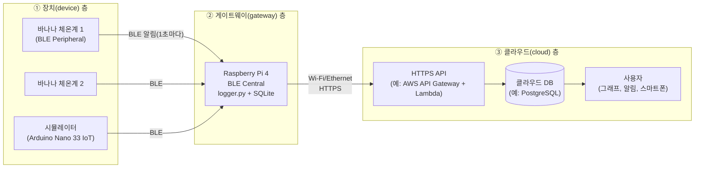
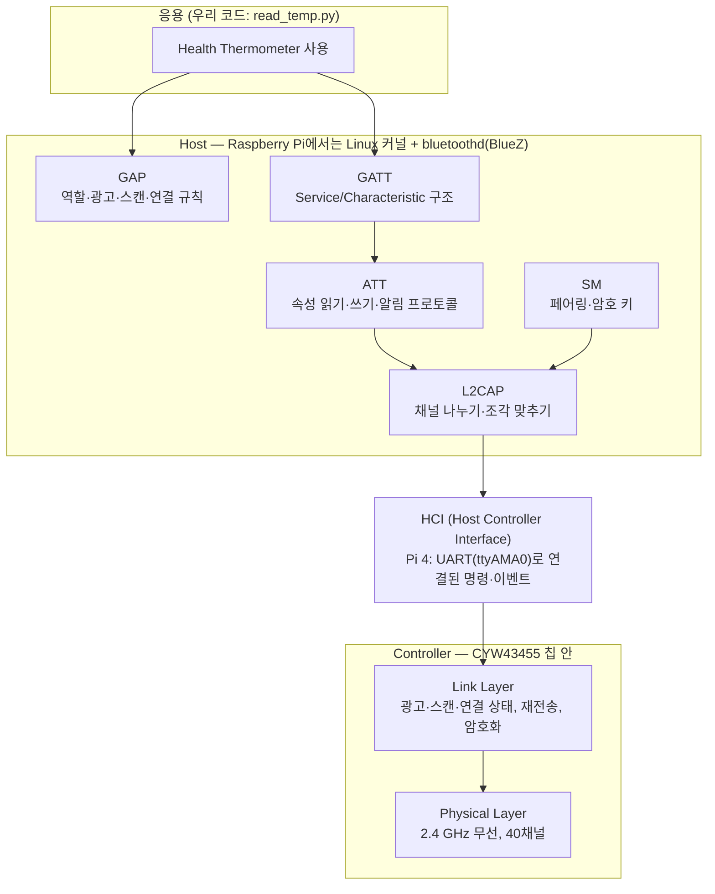
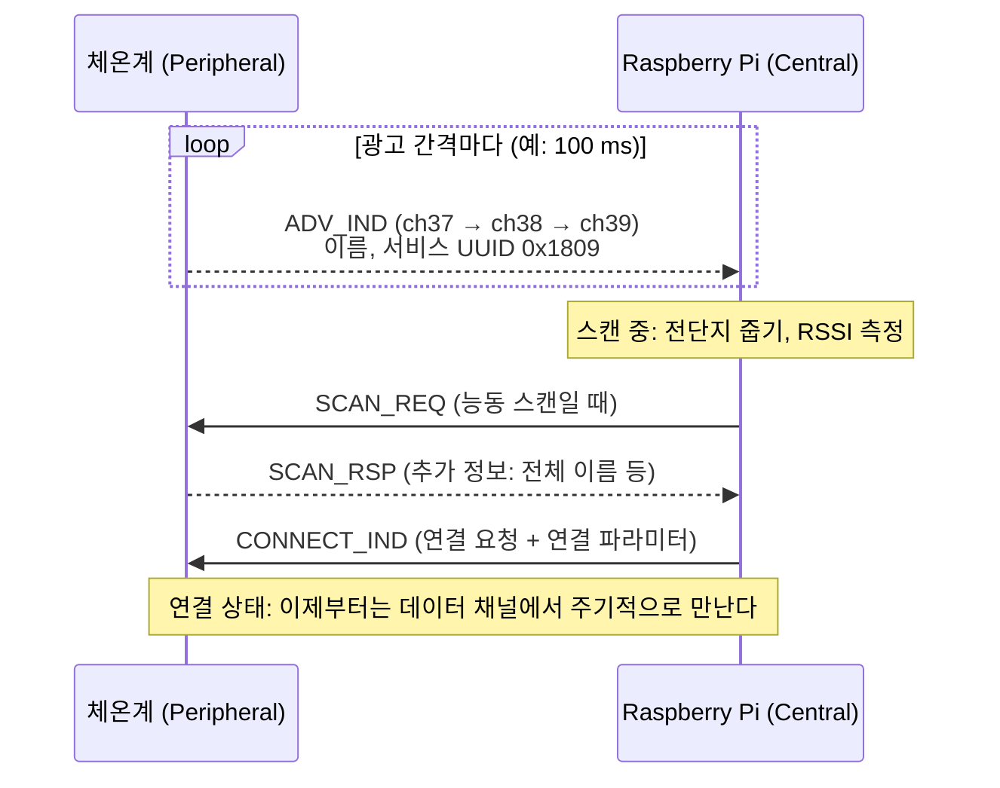
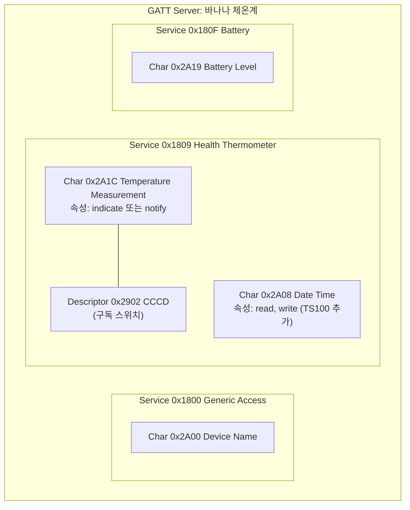
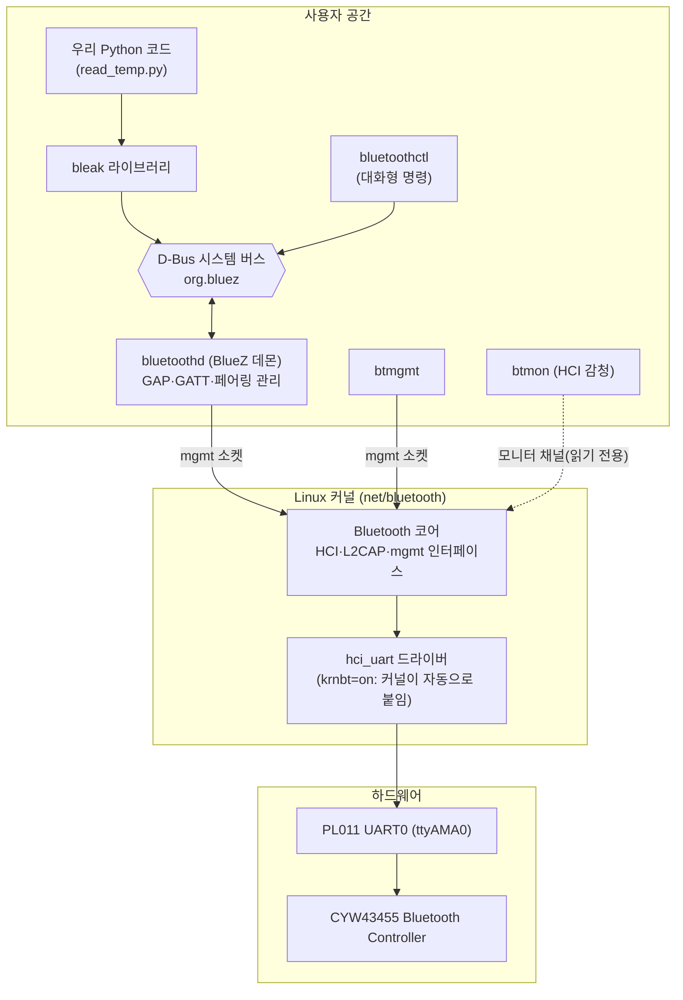
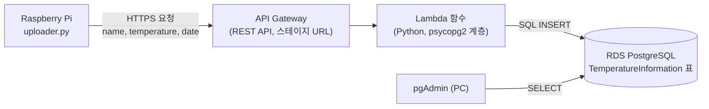
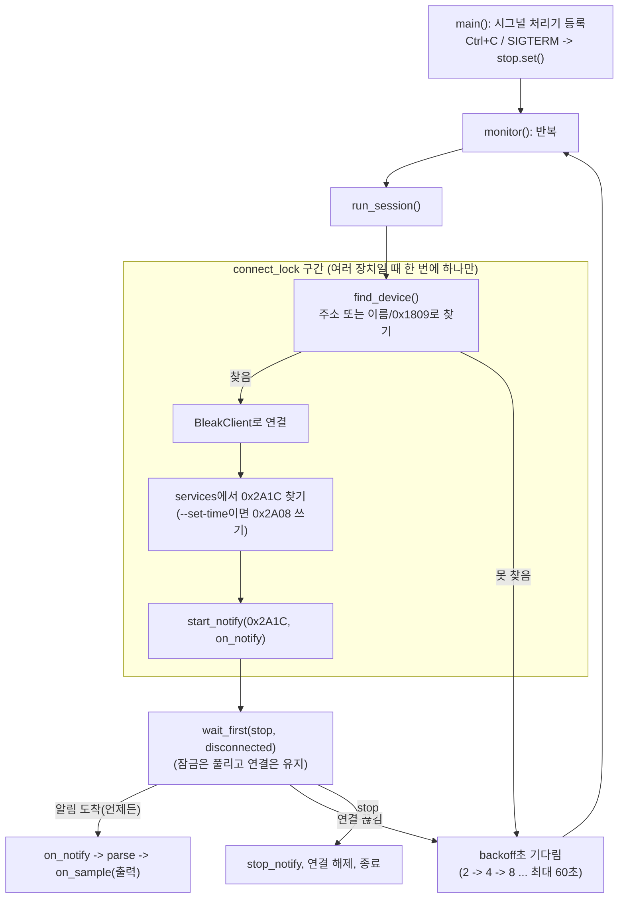

# 13장. BLE와 IoT

> **학습 목표**
> - 3장에서 끈 Raspberry Pi의 Bluetooth를 다시 켜고, 그 대가로 UART 콘솔이 mini UART(`ttyS0`)로 옮겨 간다는 것을 설명할 수 있다.
> - IoT 시스템을 "장치(센서) → 게이트웨이 → 클라우드"의 세 층으로 나누고, Raspberry Pi가 게이트웨이로서 하는 일을 설명할 수 있다.
> - BLE, Bluetooth Classic, Wi-Fi, Zigbee, LoRa의 특징을 비교하고 용도에 맞는 무선 방식을 고를 수 있다.
> - BLE 프로토콜 스택(PHY·LL·HCI·L2CAP·ATT·SM·GATT·GAP)의 각 층이 하는 일과, Central/Peripheral·광고/스캔·연결의 흐름을 설명할 수 있다.
> - GATT의 Service·Characteristic·Descriptor 구조, 16/128비트 UUID, read/write/notify/indicate 속성과 CCCD(0x2902)를 설명할 수 있다.
> - Health Thermometer 서비스의 Temperature Measurement(0x2A1C) 바이트열을 Flags와 IEEE 11073 FLOAT 규칙대로 손으로 해석할 수 있다.
> - Linux의 BLE 스택(커널·`bluetoothd`·D-Bus)을 그림으로 설명하고, `bluetoothctl`, `btmgmt`, `btmon`으로 장치를 찾고 GATT를 탐색할 수 있다.
> - 가상 환경에 bleak를 설치하고 asyncio로 스캔·연결·알림 수신·재연결을 하는 Python 게이트웨이를 만들 수 있다.
> - 측정값을 SQLite에 저장하고 CSV·그래프로 내보내며, 게이트웨이를 systemd 서비스로 등록하고, 비밀 정보를 코드 밖에 두고 클라우드로 올리는 구조를 설명할 수 있다.

지금까지 Raspberry Pi는 선으로 연결된 장치와만 이야기했다. [8장](08_gpio_pigpio.md)·[9장](09_pigpio_advanced.md)의 GPIO는 전선 한 가닥, [12장](12_communication.md)의 UART·I2C·SPI는 전선 몇 가닥이었다. 이 장에서는 **전선 없이** 데이터를 받는다. 주인공은 수업에서 써 온 **바나나 체온계**(TS100)이다. 겨드랑이에 붙이는 작은 체온 패치가 BLE(Bluetooth Low Energy)로 온도를 보내면, Raspberry Pi가 받아서 저장하고 그래프로 그리고, 원하면 인터넷 너머의 클라우드 데이터베이스로 올린다. 이것이 바로 [1장](01_embedded_system.md) 1.1.4절에서 용어로만 만났던 **사물인터넷**(IoT, Internet of Things)의 실제 모습이다.

이 장의 내용은 세 가지 자료를 바탕으로 한다. 첫째, 2023년과 2025년(14주차)의 바나나 체온계 실습 강의, 둘째, 수업용으로 따로 만든 「BLE 바나나 체온계를 활용한 IoT 따라잡기」 GitBook(저장소의 [`../TS100/Gitbook`](../TS100/Gitbook), 온라인판 <https://lstgrp.gitbook.io/banana-thermometer>), 셋째, 그 Python 예제 저장소([`../TS100/python`](../TS100/python))이다. GitBook의 BLE 이론과 Raspberry Pi 부분은 이 장에서 요약하고 다듬었으며, AWS 클라우드 설정(5장)은 화면 캡처가 많은 GitBook 쪽이 낫기 때문에 **링크로 안내**한다.

### 이 장에서만 C 대신 Python을 쓰는 이유

이 교재의 다른 장은 모두 C로 실습했다. 이 장만 Python을 쓰는 이유는 다음과 같다.

| 이유 | 설명 |
|---|---|
| Linux에서 BLE를 다루는 공식 창구가 **D-Bus**이다 | Linux의 Bluetooth 관리 프로그램 `bluetoothd`(BlueZ)는 기능을 **D-Bus**라는 프로세스 간 통신(IPC) 버스로 제공한다(13.11절). 스캔 시작, 연결, 특성 읽기, 알림 구독이 모두 D-Bus 메서드 호출과 시그널이다 |
| C로도 가능하지만 길다 | C에서는 GLib의 GDBus나 systemd의 sd-bus로 D-Bus 메시지를 직접 만들고, 객체 경로를 찾아다니고, 시그널을 구독하는 코드를 모두 써야 한다. 체온 하나 받는 데 수백 줄이 든다. 커널의 HCI 소켓을 직접 여는 방법도 있지만 `bluetoothd`와 충돌하기 쉽다 |
| Python에는 잘 만든 라이브러리가 있다 | **bleak**은 이 D-Bus 대화를 감싸 `await client.start_notify(...)` 한 줄로 만들어 준다. 같은 코드가 Windows·macOS에서도 돈다 |
| 결과를 그래프·데이터베이스로 다루기 쉽다 | 2025년 강의에서도 "결과를 그래픽으로 보여 주므로 C가 아니라 Python으로 되어 있다"고 설명했다. SQLite, CSV, matplotlib이 표준 라이브러리이거나 설치 한 번이면 된다 |
| 프로토타입에 알맞다 | 2023년 강의의 표현대로 Python은 "프로토타입의 가능성"을 빨리 확인하는 언어이다. 동작이 확인되면 필요한 부분만 C로 옮기면 된다 |

Python을 몰라도 걱정하지 않아도 된다. 2025년 강의에서도 "Python을 몰라도 절차대로 따라 하면 된다"고 했다. 이 장의 코드는 C 프로그래머가 읽기 쉽도록 짧은 함수로 나누고 주석을 많이 달았다. C와 다른 점만 13.13절의 표로 정리해 두었다.

---

## 실습 13-0. Bluetooth 다시 켜기와 확인 (가장 먼저 할 일)

**목표**: [3장](03_rpi_hw_os.md) 3.7.3절에서 UART 콘솔을 위해 넣은 `dtoverlay=disable-bt`를 되돌려 Pi 내장 Bluetooth를 살리고, 그 결과 UART 콘솔이 어떻게 바뀌는지 확인한다. 재부팅이 필요하므로 **이 장의 개념을 읽기 전에 먼저** 해 둔다.

**준비물**: Raspberry Pi 4(Bookworm 64비트), 같은 네트워크의 PC(SSH 접속), 필요하면 3장의 USB-TTL 어댑터

### 왜 Bluetooth가 꺼져 있었나

3장에서 `config.txt` 끝에 다음 네 줄을 넣었다.

```ini
enable_uart=1
uart_2ndstage=1
dtoverlay=disable-bt
disable_splash=1
```

그때 설명했듯이 Pi 4에는 헤더의 GPIO14/15와 관련된 UART가 두 개 있다. 성능 좋은 **PL011**(UART0)과 기능이 적고 보율이 GPU 코어(VPU) 클록에 묶인 **mini UART**(UART1)이다. 기본값에서는 좋은 쪽(PL011)을 **Bluetooth 칩**에 주고 헤더에는 mini UART를 준다. `disable-bt`는 Bluetooth를 끄고 PL011을 헤더로 돌려 안정된 콘솔을 얻는 설정이었다. 3장의 비유로 말하면, 좋은 전화선을 손님(우리 PC)에게 돌려주고 Bluetooth의 전화를 끊어 버린 것이다.

이 장에서는 Bluetooth가 필요하므로 **좋은 전화선을 다시 Bluetooth에게 돌려준다.** 그러면 손님에게는 다시 잡음 많은 전화선(mini UART)이 간다.

| 설정 | 헤더 GPIO14/15의 UART | `/dev/serial0` → | `/dev/serial1` → | Bluetooth |
|---|---|---|---|---|
| 3장 설정(`dtoverlay=disable-bt`) | PL011 (UART0) | `ttyAMA0` | (없음) | 꺼짐 |
| **이 장(그 줄을 주석 처리)** | **mini UART (UART1)** | **`ttyS0`** | (없음). PL011은 Bluetooth 칩 쪽에 쓰이지만, Bookworm 기본값(`krnbt=on`)에서는 커널 Bluetooth 드라이버가 직접 쥐므로 `/dev/serial1`도 `/dev/ttyAMA0`도 생기지 않는다(아래 📌) | **켜짐** |
| (참고) `dtoverlay=miniuart-bt` | PL011 (UART0) | `ttyAMA0` | `ttyS0`(Bluetooth 칩 쪽) | 켜짐, 대신 Bluetooth가 mini UART를 씀 |

### 바뀌는 것과 바뀌지 않는 것

**바뀌지 않는 것: 시리얼 콘솔 자체는 계속 동작한다.** `cmdline.txt`에는 `console=serial0,115200`이라고 **별명**(`serial0`)으로 적혀 있다. 펌웨어가 부팅할 때 이 별명을 그때의 실제 장치(`ttyS0`)로 바꿔 커널에 넘기므로 3장의 USB-TTL 어댑터와 PuTTY(115200 8N1)는 그대로 쓸 수 있다. `enable_uart=1`도 그대로 두어야 한다. 기본 UART가 mini UART이면 `enable_uart`의 기본값이 0(꺼짐)이기 때문이다.

**바뀌는 것 ①: 보율이 코어 클록에 묶인다.** mini UART의 보율은 VPU 코어 클록에서 만들어지므로, 코어 클록이 바뀌면 보율도 따라 바뀐다. 공식 문서에 따르면 코어 클록이 변하는 상태에서는 기본 UART가 mini UART일 때 **mini UART가 아예 꺼지고**, `enable_uart=1`을 두면 펌웨어가 **코어 클록을 250 MHz로 고정한 채** mini UART를 켠다. 그래서 `enable_uart=1`만 남아 있으면 따로 `core_freq=250`을 넣지 않아도 콘솔 보율은 고정된다. `core_freq=250`(또는 `force_turbo=1`)을 직접 넣어야 하는 경우는 `miniuart-bt`처럼 mini UART가 **보조** UART(Bluetooth 쪽)가 될 때이다. 콘솔 글자가 깨지면 먼저 `enable_uart=1` 줄이 살아 있는지 확인한다.

**바뀌는 것 ②: `uart_2ndstage=1`의 펌웨어 진단 출력이 헤더로 나오지 않을 수 있다(📌 확인 필요).** 펌웨어의 진단 출력이 PL011(UART0)로 나간다면, 이제 PL011은 Bluetooth 칩에 연결되어 있으므로 헤더에서는 보이지 않는다. 공식 문서는 `uart_2ndstage`가 "UART로 디버그 로그를 내보낸다"고만 적고 어느 UART인지는 밝히지 않으므로, 실기기에서 확인해야 한다. <!-- PI-CHECK: disable-bt 주석 처리 후 uart_2ndstage MESS: 줄이 헤더 UART에 나오는지 --> 커널이 올라온 뒤의 메시지와 로그인 프롬프트는 계속 보인다.

**그래서 이 장에서는 SSH를 주 접속 수단으로 쓴다.** UART 콘솔은 "SSH가 안 될 때의 비상구"로 연결만 해 둔다. 이 장의 실습은 네트워크가 정상인 상태에서 하므로 SSH가 편하다([3장](03_rpi_hw_os.md) 3.10절).

> 📌 **보강:** 공식 문서는 `disable-bt`가 "Bluetooth 장치를 끄고 PL011(UART0)을 기본 UART로 만든다"고 설명하며, 이때 Bluetooth 모뎀을 초기화하는 `hciuart` 서비스를 `systemctl disable hciuart`로 끄라고 한다. `enable_uart`의 기본값은 기본 UART가 mini UART이면 0, PL011이면 1이다. `miniuart-bt`를 쓰면 Bluetooth가 mini UART로 옮겨 가며, 이때 코어 클록을 `core_freq=250` 또는 `force_turbo=1`로 고정해야 한다. 출처: [Raspberry Pi Documentation – Configuration: Configure UARTs](https://www.raspberrypi.com/documentation/computers/configuration.html#configure-uarts) ([adoc 원문](https://github.com/raspberrypi/documentation/blob/master/documentation/asciidoc/computers/configuration/interfaces.adoc)), [config.txt](https://www.raspberrypi.com/documentation/computers/config_txt.html)
>
> 📌 **보강: `krnbt`와 `hciuart`.** 펌웨어 저장소의 오버레이 설명서(`overlays/README`)는 `krnbt` 매개변수를 "hciattach/btattach 없이 Bluetooth 드라이버를 자동으로 붙이는(autoprobe) 기능"이라고 설명하고 기본값을 `on`으로 적는다. 즉 기본 설정에서는 커널이 디바이스 트리 정보로 Bluetooth 드라이버(`hci_uart`)를 붙인다. 별도로 공식 문서의 UART 절은 "Bookworm 이후에는 `/dev/serial1`이 기본으로 없을 수 있으며, 필요하면 `dtparam=krnbt=off`를 넣는다"고 적는다. 예전 방식의 `hciuart.service`(`pi-bluetooth` 패키지)는 `/dev/serial1` 장치가 생길 때 실행되도록(`WantedBy=dev-serial1.device`) 만들어져 있다. 실제 Pi 4(Bookworm, `krnbt` 기본값)에서 확인해 보면 `/dev/serial1`도 `/dev/ttyAMA0`도 없고, `hciuart`는 `enabled`이지만 `inactive (dead)`(한 번도 실행되지 않음)였다. 그래도 `hci0`은 정상으로 생긴다. 커널이 PL011 UART에 Bluetooth 드라이버를 직접 붙였기 때문이다(`/sys/class/bluetooth/hci0`이 `fe201000.serial`, 즉 PL011 아래에 매달려 있다). 이 장의 `systemctl enable hciuart`는 예전 설정(`krnbt=off`)과의 호환을 위한 것이며, 켜 두어도 해가 없다. 출처: [raspberrypi/firmware `boot/overlays/README`의 `krnbt`](https://github.com/raspberrypi/firmware/blob/master/boot/overlays/README), [Configure UARTs (adoc 원문)](https://github.com/raspberrypi/documentation/blob/master/documentation/asciidoc/computers/configuration/interfaces.adoc), [RPi-Distro/pi-bluetooth `hciuart.service`](https://github.com/RPi-Distro/pi-bluetooth/blob/master/debian/pi-bluetooth.hciuart.service)

### 단계 1: 현재 상태 보기 (SSH로 접속해서)

```bash
grep -n 'disable-bt' /boot/firmware/config.txt
ls -l /dev/serial*
bluetoothctl show
```

3장 설정 그대로라면 `dtoverlay=disable-bt` 줄이 보이고, `serial0 -> ttyAMA0`이며, `bluetoothctl show`는 컨트롤러를 찾지 못한다(`No default controller available`).

### 단계 2: 설정 되돌리기

손으로 해도 되고(가)와, 스크립트로 해도 된다(나). 둘 다 결과는 같다.

**(가) 손으로**

```bash
sudo cp /boot/firmware/config.txt /boot/firmware/config.txt.bak   # 백업
sudo nano /boot/firmware/config.txt      # dtoverlay=disable-bt 줄 맨 앞에 # 를 붙인다
sudo systemctl enable hciuart bluetooth  # Bluetooth 칩 초기화 서비스와 bluetoothd를 부팅 때 켜기
sudo rfkill unblock bluetooth            # 소프트웨어 무선 차단이 걸려 있으면 푼다
sudo reboot
```

고친 뒤의 끝부분은 다음과 같아야 한다.

```ini
[all]
# UART 시리얼 콘솔 설정
enable_uart=1
uart_2ndstage=1
# 13장: BLE를 쓰기 위해 Bluetooth를 다시 켠다 (콘솔은 mini UART = ttyS0)
#dtoverlay=disable-bt
disable_splash=1
```

**(나) 스크립트로** — 백업, 주석 처리, 서비스 활성화를 한 번에 한다.

파일: `code/ch13/bt_enable.sh`

```bash
#!/bin/bash
# bt_enable.sh : 실습 13-0  3장에서 끈 Bluetooth를 다시 켠다 (config.txt 수정 + 서비스 활성화)
# 사용법 : sudo bash bt_enable.sh      -> 끝나면 sudo reboot
# 하는 일 : 1) /boot/firmware/config.txt 백업
#           2) dtoverlay=disable-bt 줄 앞에 # 를 붙여 주석 처리
#           3) hciuart(칩 초기화), bluetooth(bluetoothd) 서비스를 부팅 때 켜지도록 enable
#           4) rfkill 소프트 차단 해제
# 되돌리기 : 백업 파일을 config.txt로 복사하고 재부팅(3장 UART 설정으로 돌아간다)

set -eu
CFG=/boot/firmware/config.txt

if [ "$(id -u)" -ne 0 ]; then
    echo "root 권한이 필요하다: sudo bash $0" >&2
    exit 1
fi
if [ ! -f "$CFG" ]; then
    echo "$CFG 가 없다 (Bookworm이 맞는가?)" >&2
    exit 1
fi

# --- 1. 백업 -------------------------------------------------------------
BAK="$CFG.bak.$(date +%Y%m%d-%H%M%S)"
cp "$CFG" "$BAK"
echo "백업: $BAK"

# --- 2. disable-bt 주석 처리 ----------------------------------------------
if grep -Eq '^[[:space:]]*dtoverlay=disable-bt' "$CFG"; then
    sed -i -E 's/^([[:space:]]*)dtoverlay=disable-bt/\1#dtoverlay=disable-bt/' "$CFG"
    echo "dtoverlay=disable-bt 를 주석 처리했다"
else
    echo "활성화된 dtoverlay=disable-bt 줄이 없다 (이미 주석이거나 없음)"
fi
echo "--- 현재 config.txt의 UART·Bluetooth 관련 줄 ---"
grep -nE 'enable_uart|uart_2ndstage|disable-bt|miniuart-bt|core_freq' "$CFG" || true

# --- 3. 서비스 활성화 -----------------------------------------------------
for svc in hciuart bluetooth; do
    if systemctl list-unit-files "$svc.service" --no-legend | grep -q "^$svc.service"; then
        systemctl enable "$svc.service"
        echo "$svc.service: $(systemctl is-enabled "$svc.service")"
    else
        echo "$svc.service 가 없다 -> sudo apt install bluez pi-bluetooth 확인" >&2
    fi
done

# --- 4. rfkill 소프트 차단 해제 -------------------------------------------
rfkill unblock bluetooth || true

echo "완료. 재부팅 후 bash bt_check.sh 로 확인한다: sudo reboot"
```

```bash
cd ~/ch13                 # code/ch13 폴더를 Pi의 ~/ch13로 복사해 두었다고 가정
sudo bash bt_enable.sh
sudo reboot
```

| 줄 | 하는 일 |
|---|---|
| `cp "$CFG" "$BAK"` | 고치기 전에 날짜가 붙은 백업을 만든다. 부팅이 이상하면 SD 카드를 PC에 꽂아 이 파일로 되돌린다(3장 3.7.4절) |
| `sed -i -E 's/^(...)dtoverlay=disable-bt/\1#dtoverlay=disable-bt/'` | 줄을 지우지 않고 앞에 `#`만 붙인다. 나중에 다시 3장 설정으로 돌아가기 쉽다 |
| `systemctl enable hciuart bluetooth` | `hciuart`는 UART로 연결된 Bluetooth 칩을 커널에 붙이는 예전 방식의 일회성 서비스(기본값 `krnbt=on`에서는 커널이 직접 붙이므로 실행되지 않을 수 있다. 위 📌), `bluetooth`는 `bluetoothd` 데몬이다([5장](05_sysadmin.md) 5.5절의 `enable`) |
| `rfkill unblock bluetooth` | 무선 송신을 소프트웨어로 막아 둔 것(rfkill)을 푼다 |

### 단계 3: 재부팅 뒤 확인

파일: `code/ch13/bt_check.sh`

```bash
#!/bin/bash
# bt_check.sh : 실습 13-0  Bluetooth가 살아났는지, UART 콘솔이 어디로 갔는지 한 번에 확인한다
# 사용법 : bash bt_check.sh          (일부 항목은 sudo 암호를 물을 수 있다)
# 읽기만 하고 아무것도 바꾸지 않는다.

# rfkill은 /usr/sbin에 있다. ssh 'bash bt_check.sh'처럼 실행하면 PATH에 없을 수 있어서 더해 둔다
PATH="$PATH:/usr/sbin"

section() { printf '\n===== %s =====\n' "$1"; }

section "1. config.txt (disable-bt 앞에 # 가 있어야 한다)"
grep -nE 'enable_uart|disable-bt|miniuart-bt|core_freq' /boot/firmware/config.txt || echo "(관련 줄 없음)"

section "2. 시리얼 별명: serial0이 ttyS0(mini UART)이면 정상 (Bookworm은 serial1이 없어도 정상)"
ls -l /dev/serial* 2>/dev/null || echo "(/dev/serial* 없음: enable_uart 확인)"

section "3. 서비스 상태 (bluetooth가 active면 정상, hciuart는 inactive여도 정상)"
for svc in hciuart bluetooth; do
    printf '%-10s enabled=%-9s active=%s\n' "$svc" \
        "$(systemctl is-enabled "$svc" 2>/dev/null)" "$(systemctl is-active "$svc" 2>/dev/null)"
done

section "4. rfkill (Soft blocked: no 여야 한다)"
rfkill list bluetooth 2>/dev/null || echo "(rfkill 없음)"

section "5. bluetoothctl show (Controller 줄과 Powered: yes)"
bluetoothctl --version 2>/dev/null
timeout 5 bluetoothctl show 2>&1 | head -12

section "6. btmgmt info (커널 관리 인터페이스에서 본 hci0)"
timeout 5 sudo btmgmt info 2>&1 | head -8

section "7. 내 사용자의 그룹 (Bookworm은 bluetooth 그룹이 없어도 sudo 없이 BLE 사용 가능)"
id -nG

section "8. 커널 로그의 Bluetooth 줄 (최근 10줄)"
journalctl -k -b --no-pager 2>/dev/null | grep -iE 'bluetooth|hci0' | tail -10
```

```bash
bash bt_check.sh
```

> 출력 출처: Pi 4 실기기 실행 결과(2026-10). 이 Pi의 `config.txt`에는 처음부터 `disable-bt` 줄이 없었으므로 1번에 `enable_uart=1` 한 줄만 나왔다. 단계 2를 했다면 `#dtoverlay=disable-bt` 줄도 함께 보인다.

```text
===== 1. config.txt (disable-bt 앞에 # 가 있어야 한다) =====
57:enable_uart=1

===== 2. 시리얼 별명: serial0이 ttyS0(mini UART)이면 정상 (Bookworm은 serial1이 없어도 정상) =====
lrwxrwxrwx 1 root root 5 2026년  2월  7일 /dev/serial0 -> ttyS0

===== 3. 서비스 상태 (bluetooth가 active면 정상, hciuart는 inactive여도 정상) =====
hciuart    enabled=enabled   active=inactive
bluetooth  enabled=enabled   active=active

===== 4. rfkill (Soft blocked: no 여야 한다) =====
0: hci0: Bluetooth
	Soft blocked: no
	Hard blocked: no

===== 5. bluetoothctl show (Controller 줄과 Powered: yes) =====
bluetoothctl: 5.66
Controller DC:A6:32:12:34:56 (public)
	Name: raspberrypi
	Alias: raspberrypi
	Class: 0x006c0000
	Powered: yes
	Discoverable: no
	DiscoverableTimeout: 0x000000b4
	Pairable: no
	UUID: A/V Remote Control        (0000110e-0000-1000-8000-00805f9b34fb)
	UUID: Handsfree Audio Gateway   (0000111f-0000-1000-8000-00805f9b34fb)
	UUID: PnP Information           (00001200-0000-1000-8000-00805f9b34fb)
	UUID: Audio Sink                (0000110b-0000-1000-8000-00805f9b34fb)

===== 6. btmgmt info (커널 관리 인터페이스에서 본 hci0) =====
Index list with 1 item
hci0:	Primary controller
	addr DC:A6:32:12:34:56 version 9 manufacturer 305 class 0x6c0000
	supported settings: powered connectable fast-connectable discoverable bondable link-security ssp br/edr le advertising secure-conn debug-keys privacy configuration static-addr phy-configuration 
	current settings: powered ssp br/edr le secure-conn 
	name raspberrypi
	short name 
hci0:	Configuration options

===== 7. 내 사용자의 그룹 (Bookworm은 bluetooth 그룹이 없어도 sudo 없이 BLE 사용 가능) =====
pi adm dialout cdrom sudo audio video plugdev games users input render netdev lpadmin gpio i2c spi

===== 8. 커널 로그의 Bluetooth 줄 (최근 10줄) =====
 2월 07 08:01:08 raspberrypi kernel: Bluetooth: hci0: BCM: features 0x2f
 2월 07 08:01:08 raspberrypi kernel: Bluetooth: hci0: BCM43455 37.4MHz Raspberry Pi 3+-0190
 2월 07 08:01:08 raspberrypi kernel: Bluetooth: hci0: BCM4345C0 (003.001.025) build 0382
 2월 07 08:01:09 raspberrypi kernel: Bluetooth: BNEP (Ethernet Emulation) ver 1.3
 2월 07 08:01:09 raspberrypi kernel: Bluetooth: BNEP filters: protocol multicast
 2월 07 08:01:09 raspberrypi kernel: Bluetooth: BNEP socket layer initialized
 2월 07 08:01:09 raspberrypi kernel: Bluetooth: MGMT ver 1.23
10월 06 13:17:06 raspberrypi kernel: Bluetooth: RFCOMM TTY layer initialized
10월 06 13:17:06 raspberrypi kernel: Bluetooth: RFCOMM socket layer initialized
10월 06 13:17:06 raspberrypi kernel: Bluetooth: RFCOMM ver 1.11
```

**결과 읽기**

- `bluetoothctl show`에 `Controller …`와 `Powered: yes`가 보이면 성공이다. Controller 뒤의 주소가 이 Pi의 Bluetooth 주소(BD_ADDR)이다. Bookworm의 BlueZ 버전은 **5.66**이다(첫 줄 `bluetoothctl: 5.66`).
- `btmgmt info`의 `version 9`는 HCI 버전 번호로 **Bluetooth 5.0**을 뜻하는 값(Assigned Numbers의 Core Specification Version 표)이다. 칩과 펌웨어에 따라 다르게 나올 수 있다. `manufacturer 305`는 칩 제조사 번호(Cypress)이다. `le`가 `current settings`에 있으면 BLE가 켜져 있다. 8번의 커널 로그에도 칩 이름(`BCM4345C0`, CYW43455의 다른 이름)과 펌웨어 버전이 보인다.
- **2번에 `/dev/serial1`이 없다.** 예전 설정(`krnbt=off`)에서는 `serial1 -> ttyAMA0`(Bluetooth)이 함께 보였다. Bookworm 기본값(`krnbt=on`)에서는 커널 Bluetooth 드라이버가 PL011 UART를 직접 쥐기 때문에 `/dev/ttyAMA0`도 `/dev/serial1`도 생기지 않는다. 5번과 6번에 컨트롤러가 보이면 정상이다.
- **3번의 `hciuart`가 `active=inactive`이다.** 이것도 정상이다. `hciuart`는 `/dev/serial1`이 생길 때만 실행되는데(위 📌), 그 장치가 없으니 실행되지 않은 것이다. Bluetooth 드라이버는 커널이 이미 붙였다.
- **7번에 `bluetooth` 그룹이 없다.** 이 Pi의 첫 사용자는 `bluetooth` 그룹에 들어 있지 않았다. 그래도 `bluetoothctl show`가 sudo 없이 동작했다. Raspberry Pi OS의 D-Bus 정책이 모든 사용자에게 BlueZ 접근을 허용하기 때문이다(13.11.1절).
- `/dev/serial0 -> ttyS0`: 콘솔이 mini UART로 옮겨 갔다. UART 콘솔을 연결해 두었다면 재부팅 중 커널 메시지와 로그인 프롬프트가 그대로 나오는 것을 확인한다.
- `hciconfig`라는 옛 명령을 소개하는 자료가 많다. BlueZ 프로젝트가 **더 이상 권장하지 않는**(deprecated) 도구이고, 배포판에 따라 설치되어 있지 않을 수 있다. 같은 정보는 `bluetoothctl show`와 `btmgmt info`로 본다.

**그래도 컨트롤러가 없을 때**는 트러블슈팅 표의 첫 줄을 본다. 그래도 안 되면 3장 3.12.4절의 최후 수단(Bluetooth 패키지 재설치)을 쓴다.

**되돌리기**: 이 장을 마치고 3장의 PL011 콘솔로 돌아가려면 `#dtoverlay=disable-bt`의 `#`을 지우고 `sudo systemctl disable hciuart` 후 재부팅한다.

---

## 13.1 IoT와 게이트웨이

### 13.1.1 왜 "게이트웨이"가 필요한가

바나나 체온계는 동전 크기의 배터리(코인셀) 하나로 며칠씩 동작해야 한다. 이런 장치에 Wi-Fi를 넣으면 배터리가 금방 닳고, 인터넷 프로토콜(TCP/IP, TLS 암호화)을 돌리기에는 메모리와 계산 능력도 모자란다. 그래서 작은 장치는 **가까운 거리에서 아주 적은 전력으로** 데이터를 던지기만 하고, 그것을 받아 인터넷으로 넘겨주는 일은 전원과 성능에 여유가 있는 다른 장치가 맡는다. 이 "통역 겸 중계" 장치를 **게이트웨이**(gateway)라고 한다.

비유하면 이렇다. 시골 마을의 할머니들(센서)은 휴대전화 없이 마을회관(게이트웨이)에 와서 소식을 전한다. 이장님(게이트웨이)은 그 소식을 모아 정리해 두었다가, 군청(클라우드)에 전화나 인터넷으로 한꺼번에 보고한다. 할머니들은 마을회관까지만 오면 되고, 군청과 통화하는 방법은 몰라도 된다.



| 층 | 이 장의 예 | 하는 일 | 제약 |
|---|---|---|---|
| ① 장치 | 바나나 체온계(TS100), 시뮬레이터 | 측정하고 BLE로 보낸다 | 배터리, 작은 메모리, 짧은 거리 |
| ② 게이트웨이 | **Raspberry Pi 4** | 여러 장치에서 받아 해석·저장하고, 인터넷으로 올린다. 인터넷이 끊겨도 데이터를 잃지 않게 보관한다 | 전원은 넉넉하지만 장치 근처(수~수십 m)에 있어야 한다 |
| ③ 클라우드 | AWS(TS100-Gitbook 5장) | 오래 보관, 여러 게이트웨이의 데이터 모으기, 웹·앱으로 보여 주기 | 인터넷 필요, 비용, 보안 |

### 13.1.2 바나나 체온계 시스템 한눈에

2023년 강의에서 이 제품을 이렇게 소개했다. "원래 몇 년 전에 어린이용 체온계로 나왔던 제품이다. 아이 가슴이나 겨드랑이에 붙여 놓으면 체온을 휴대전화에서 계속 편하게 볼 수 있다. 아이가 열이 나는 것은 가장 위험한 일 중 하나인데, 밤새 체온을 재는 것은 번거로운 일이다." 제품에는 휴대전화 앱(FEMON)이 있지만, 이 수업에서는 **휴대전화 대신 Raspberry Pi가 Central이 되어** 온도를 받는다.

이 장에서 만드는 것을 순서대로 보면 다음과 같다(강의 슬라이드 「바나나 체온계 — 디바이스에서 클라우드까지」의 목차: BLE 이해 → 체온 측정해 보기 → 전체 구성 및 동작 원리 → 개발 환경 구축 → Python 코드로 동작시키고 저장 데이터 확인 → 코드 분석 → 클라우드에 저장 및 보기).

| 실습 | 무엇을 | 코드 |
|---|---|---|
| 13-0 | Bluetooth 다시 켜기 | `bt_enable.sh`, `bt_check.sh` |
| 13-1 | 명령줄 도구로 체온계를 찾고 GATT 구조 들여다보기 | (`bluetoothctl`, `btmon`) |
| 13-2 | Python으로 스캔 | `scan.py` |
| 13-3 | 연결해서 온도 받기, 바이트 해석 | `hts.py`, `test_hts.py`, `read_temp.py` |
| 13-4 | 여러 대에서 받아 SQLite에 저장, CSV·그래프 | `logger.py`, `report.py` |
| 13-5 | 게이트웨이를 systemd 서비스로 | `gateway.service` |
| 13-6(선택) | HTTPS로 클라우드에 올리기 | `uploader.py`, `uploader.service`, `uploader.timer` |

---

## 13.2 무선 통신 방식 고르기

**왜 필요한가?** IoT 장치를 설계할 때 가장 먼저 정하는 것 중 하나가 무선 방식이다. 방식마다 거리·속도·전력·필요한 기반 시설이 크게 다르기 때문이다. 2023년 강의에서 "Wi-Fi와 Bluetooth 중 어느 쪽이 통신 거리가 길까? 한번 찾아보라"고 했던 질문의 답을 표로 정리하자.

| 방식 | 주파수(국내) | 대략의 속도 | 대략의 거리 | 전력 | 망 구조 | 대표 용도 |
|---|---|---|---|---|---|---|
| **BLE** | 2.4 GHz | 125 kbps~2 Mbps(PHY 속도) | 수~수십 m(실내) | **매우 낮음**(코인셀로 수개월~수년) | 1:N 스타, 방송, (메시) | 웨어러블, 의료 센서, 비콘, 스마트폰 액세서리 |
| Bluetooth Classic | 2.4 GHz | 1~3 Mbps | 수~수십 m | 중간 | 피코넷(1:7) | 무선 이어폰·스피커(오디오), 키보드 |
| Wi-Fi | 2.4/5/6 GHz | 수십 Mbps~Gbps | 수십 m | **높음** | 공유기 중심 스타 | 카메라, 게이트웨이 상향 링크, 가전 |
| Zigbee (IEEE 802.15.4) | 2.4 GHz | 250 kbps | 수~수십 m(메시로 확장) | 낮음 | **메시** | 조명, 스마트홈 센서 |
| LoRa / LoRaWAN | 1 GHz 이하(국내 920 MHz 대역) | 수백 bps~수십 kbps | **수 km** | 매우 낮음 | 게이트웨이 중심 스타 | 원격 검침, 농업, 넓은 지역의 센서 |

표를 읽는 요령은 **세 가지는 동시에 가질 수 없다**는 것이다. 멀리, 빠르게, 적은 전력으로 — 이 중 두 가지를 얻으면 하나는 포기해야 한다. Wi-Fi는 빠르지만 전력을 많이 쓰고, LoRa는 멀리 가고 전력도 적지만 아주 느리다. BLE는 거리를 포기하고 **적은 전력과 적당한 속도**를 택했다. 체온 하나(몇 바이트)를 1초에 한 번 보내는 데는 BLE가 딱 알맞다. 그리고 결정적으로 **모든 스마트폰에 BLE가 들어 있다.** 별도의 수신기 없이 휴대전화로 바로 받을 수 있다는 점이 BLE가 개인용 기기에서 이긴 이유이다.

> 📌 **보강:** 수치는 규격의 최대값이 아니라 흔히 보는 범위를 적은 것이며, 안테나·출력·장애물에 따라 크게 달라진다. 각 기술의 공식 설명: [Bluetooth Technology Overview (Bluetooth SIG)](https://www.bluetooth.com/learn-about-bluetooth/tech-overview/), [Wi-Fi Alliance](https://www.wi-fi.org/), [Connectivity Standards Alliance (Zigbee 표준 단체)](https://csa-iot.org/), [LoRa Alliance – What is LoRaWAN](https://lora-alliance.org/about-lorawan/)

---

## 13.3 Bluetooth Classic과 BLE

### 13.3.1 같은 이름, 다른 기술

"Bluetooth"라는 이름 아래에는 사실 서로 다른 두 기술이 있다.

- **Bluetooth Classic**(정식 이름 BR/EDR, Basic Rate/Enhanced Data Rate): 1999년 무렵부터 쓰인 원래의 Bluetooth이다. 무선 이어폰으로 음악을 듣는 것처럼 **연결을 유지한 채 데이터를 계속 흘려보내는** 데 강하다.
- **BLE**(Bluetooth Low Energy, 정식 이름 LE): 2010년 Bluetooth 4.0에서 추가되었다. **대부분의 시간을 잠들어 있다가 잠깐 깨어 몇 바이트만 주고받는** 데 맞춰 처음부터 새로 설계했다. 이름은 Bluetooth이지만 Classic과 **무선 신호도, 프로토콜도 호환되지 않는다.**

2023년 강의의 설명대로 "처음에 Bluetooth가 나왔고, 그것을 저전력으로 바꾼 것이 BLE"라고 이해하면 된다. 다만 "업그레이드"라기보다는 **용도가 다른 형제**이다. 그래서 오늘날 스마트폰과 Raspberry Pi 4의 칩은 두 가지를 모두 지원하는 **듀얼 모드**(dual-mode)이고, 체온계 같은 작은 센서는 BLE만 지원하는 **싱글 모드**(single-mode) 장치이다.

| 항목 | Bluetooth Classic (BR/EDR) | BLE (LE) |
|---|---|---|
| 채널 | 1 MHz 간격 79개 | **2 MHz 간격 40개**(그중 3개는 광고 전용) |
| PHY 속도 | 1 Mbps(BR), 2·3 Mbps(EDR) | 1 Mbps(LE 1M), 2 Mbps(LE 2M, 5.0~), 125/500 kbps(LE Coded, 5.0~, 장거리용) |
| 연결 방식 | 연결을 맺고 계속 유지 | 광고로 존재를 알리고, 필요할 때만 짧게 연결하거나 연결 없이 방송 |
| 망 구조 | 피코넷: 주 장치 1개 + 활성 장치 최대 7개 | 스타(Central 1 : Peripheral N), 방송, (Bluetooth Mesh) |
| 데이터 모델 | 용도별 프로파일(SPP 시리얼, A2DP 오디오, HFP 통화 등) | **GATT**(속성 기반, 13.8절) 하나로 통일 |
| 대표 용도 | 오디오 스트리밍, 옛 시리얼 모듈(HC-05 등) | 센서, 웨어러블, 의료기기, 비콘 (Bluetooth 5.2부터 LE Audio도 추가) |

> **원본 자료 정정:** TS100-Gitbook 3.1절의 비교표에는 바로잡을 곳이 있다. ① Classic의 최대 속도는 2 Mbps가 아니라 EDR 기준 3 Mbps이다. ② Classic의 망 구조는 단순한 "포인트-투-포인트"가 아니라 최대 7개 장치를 묶는 피코넷이다. ③ "Classic의 프로파일은 GAP 기반"이라는 칸은 맞지 않다. GAP은 Classic과 LE 모두에 있는 장치 발견·연결 규칙이고, Classic의 데이터 교환은 SPP·A2DP 같은 개별 프로파일로 이루어진다. ④ BLE의 속도를 "최대 1 Mbps(4.0 기준)"로만 적었는데, Bluetooth 5.0부터는 2 Mbps PHY가 있다. ⑤ 지연 시간·연결 시간(3 ms, 6 ms, 100 ms) 같은 숫자는 연결 파라미터에 따라 크게 달라지는 값이라 이 교재에서는 싣지 않는다. 또 3.2절의 "Peripheral은 한 번에 하나의 Central과만 연결된다"는 많은 제품의 구현이 그렇다는 뜻이지 규격의 제한은 아니다(Bluetooth 4.1부터 한 장치가 여러 역할·연결을 동시에 가질 수 있다).
>
> 📌 출처: [Bluetooth Core Specification](https://www.bluetooth.com/specifications/specs/core-specification/) (Vol 1 Part A: Architecture), [Bluetooth Technology Overview](https://www.bluetooth.com/learn-about-bluetooth/tech-overview/)

### 13.3.2 Raspberry Pi 4의 Bluetooth

Pi 4 보드에는 Wi-Fi와 Bluetooth를 함께 담은 무선 칩(Cypress/Infineon CYW43455)이 있고, 공식 사양은 **Bluetooth 5.0, BLE**이다. 이 칩의 Bluetooth 부분은 SoC(BCM2711)와 **UART**로 연결되어 있다. 실습 13-0에서 PL011을 Bluetooth에 돌려준 이유가 바로 이것이다. Bluetooth 칩과 CPU 사이의 대화도 결국 UART 통신이다([12장](12_communication.md)).

> 📌 출처: [Raspberry Pi 4 Model B 제품 사양](https://www.raspberrypi.com/products/raspberry-pi-4-model-b/specifications/), [Raspberry Pi Documentation – Raspberry Pi hardware](https://www.raspberrypi.com/documentation/computers/raspberry-pi.html)

---

## 13.4 BLE 프로토콜 스택

### 13.4.1 왜 층(stack)으로 나누는가

2025년 강의에서 "통신에는 계층이 나뉘어 있는데, 그 이유는 **개발의 편리성** 때문이다. 하드웨어를 만드는 사람은 윗단을 모두 알 필요 없이 하드웨어만 잘 만들면 되고, 이렇게 분리해 놓으면 유지·관리·보수가 매우 편리하다"고 설명했다. 택배를 생각하면 쉽다. 보내는 사람은 상자에 주소만 쓰면 되고, 트럭 운전사는 상자 안에 무엇이 들었는지 몰라도 되며, 물류 센터는 도로 사정을 몰라도 된다. 각 층은 **바로 위·아래 층과의 약속**만 지키면 된다.

BLE 스택은 크게 **Controller**(무선 칩 안)와 **Host**(운영체제 안)로 나뉘고, 둘 사이를 **HCI**가 잇는다.



| 층 | 풀이 | 하는 일 | 비유 |
|---|---|---|---|
| PHY | Physical Layer | 2.4 GHz 대역을 2 MHz 간격 **40개 채널**로 나누어 전파를 주고받는다. 37·38·39번은 **광고 채널**, 나머지 37개는 연결 후 데이터용이며, 간섭을 피하려 채널을 바꿔 가며 쓴다(주파수 도약) | 도로 |
| LL | Link Layer | 대기(Standby)·광고(Advertising)·스캔(Scanning)·연결 시도(Initiating)·연결(Connection) 상태를 관리하고, 패킷 확인·재전송·암호화를 한다. 시간이 정확해야 하므로 칩 안에서 돈다 | 운전사 |
| HCI | Host Controller Interface | Host가 Controller에 **명령**(command)을 보내고 Controller가 **이벤트**(event)로 답하는 규격화된 통로. UART·USB 등으로 연결된다 | 배차 무전기 |
| L2CAP | Logical Link Control and Adaptation Protocol | 한 연결 위에서 여러 상위 프로토콜(ATT, SM)의 데이터를 나누어 실어 나르고, 긴 데이터를 조각냈다 합친다 | 물류 센터의 분류대 |
| SM | Security Manager | 페어링 절차와 암호 키 생성·보관(13.12절) | 열쇠 관리인 |
| ATT | Attribute Protocol | "핸들 N의 값을 읽어 달라/써 달라", "값이 바뀌었다(알림)" 같은 **속성** 단위 요청·응답 규칙 | 서류 요청서 양식 |
| GATT | Generic Attribute Profile | ATT 위에서 속성들을 **Service–Characteristic–Descriptor**로 묶는 구조와 절차 | 서랍장 정리 규칙 |
| GAP | Generic Access Profile | 장치의 **역할**(Broadcaster/Observer/Peripheral/Central), 광고·스캔·연결 방법, 장치 이름 | 만남의 규칙(누가 먼저 말을 거나) |

2025년 강의의 요약처럼 **응용 개발자에게 가장 중요한 것은 GAP과 GATT 두 가지**이다. GAP으로 "누구와 어떻게 만날지"를 정하고, 만난 뒤에는 GATT로 "무엇을 주고받을지"를 정한다. 아래층은 칩과 운영체제가 해 준다.

> 📌 출처: [Bluetooth Core Specification](https://www.bluetooth.com/specifications/specs/core-specification/) Vol 1 Part A(Architecture), Vol 6(Low Energy Controller: 채널·Link Layer 상태), Vol 3(Host: L2CAP, ATT, GATT, SM, GAP). 원본: TS100-Gitbook 3.3절

---

## 13.5 역할: Central과 Peripheral, 그리고 GATT의 Client와 Server

### 13.5.1 GAP의 네 가지 역할

2025년 강의는 이렇게 시작했다. "휴대폰과 이어폰을 연결하려면 **주종 관계**가 성립해야 한다. 휴대폰이 주가 되고 이어폰이 주변장치가 된다. 주변장치가 Peripheral, 주가 Central이다." 옛 자료의 마스터/슬레이브와 비슷하지만, BLE 규격은 Central/Peripheral이라는 말을 쓴다.

| 역할 | 하는 일 | 연결 | 이 장의 예 |
|---|---|---|---|
| **Peripheral** | **광고**(advertising)로 "나 여기 있다"를 알리고, 연결 요청을 받아들인다 | 함 | 바나나 체온계, 시뮬레이터 |
| **Central** | **스캔**(scanning)으로 광고를 듣고, 골라서 연결을 요청한다. 여러 Peripheral과 동시에 연결할 수 있다 | 함 | **Raspberry Pi**, 스마트폰 |
| Broadcaster | 광고만 한다. 연결을 받지 않는다 | 안 함 | 비콘, 광고 패킷에 온도를 실어 뿌리는 센서 |
| Observer | 광고를 듣기만 한다 | 안 함 | 비콘 수집기 |

2023년 강의의 질문 "Raspberry Pi와 바나나 체온계 중 어느 쪽이 Central일까?"의 답은 Raspberry Pi이다. **받는 쪽이자 주도권을 쥔 쪽이 Central**이다. 하나의 Central에 여러 Peripheral을 붙일 수 있으므로 Pi 한 대가 체온계 여러 대를 맡을 수 있다(실습 13-4).

### 13.5.2 GATT Client와 Server는 다른 축이다

헷갈리기 쉬운 점이 하나 있다. GAP 역할(누가 광고하고 누가 연결을 거나)과 GATT 역할(누가 데이터를 갖고 있나)은 **다른 축**이다.

- **GATT Server**: 데이터(속성 표)를 **가지고 있는** 쪽. 체온계가 서버이다.
- **GATT Client**: 데이터를 **요청하는** 쪽. Raspberry Pi가 클라이언트이다.

대부분은 "Peripheral = Server, Central = Client"이지만 반드시 그런 것은 아니다. 예를 들어 스마트워치(Peripheral)가 스마트폰(Central)의 알림 서비스를 읽을 때는 Peripheral이 Client가 된다. 이 장에서는 늘 "체온계 = Peripheral + Server, Pi = Central + Client"이다.

---

## 13.6 광고와 스캔: 전단지 뿌리기

### 13.6.1 비유: 전단지

BLE Peripheral의 **광고**(advertising)는 길에서 **전단지를 뿌리는 것**과 같다. 2023년 강의에서도 "광고지 홍보하는 거야"라고 했다.

- 전단지에는 가게 이름(장치 이름), 파는 물건(제공하는 서비스의 UUID), 간단한 정보(제조사 데이터, 송신 출력)가 적혀 있다. 크기는 작다(기본 광고 패킷의 데이터 부분은 최대 31바이트).
- 전단지는 **정해진 간격**으로 반복해서 뿌린다(광고 간격, advertising interval). 자주 뿌리면 빨리 발견되지만 전력을 많이 쓴다.
- 전단지는 **세 군데 길목**(광고 채널 37·38·39번)에서 차례로 뿌린다. 한 채널이 Wi-Fi 등으로 시끄러워도 다른 채널로 전달되게 하기 위해서이다.
- 지나가는 사람(Central)은 전단지를 **줍는다**(스캔). 더 알고 싶으면 "자세한 안내서 주세요"라고 요청할 수 있다(**능동 스캔**의 Scan Request → **Scan Response**). 줍기만 하고 요청하지 않으면 **수동 스캔**이다.
- 전단지를 주운 위치에서 신호 세기를 재면 대략 얼마나 가까운지 알 수 있다. 이것이 **RSSI**(Received Signal Strength Indicator, 수신 신호 세기)이다. 단위는 dBm이고 음수이며, **0에 가까울수록(예: -45) 가깝고 강하며, -90쯤이면 멀거나 가려진 것**이다.



### 13.6.2 광고 간격의 실제

광고 간격은 규격상 **20 ms ~ 10.24 s** 범위에서 0.625 ms 단위로 정하고, 여러 장치의 광고가 계속 겹치지 않도록 매번 0~10 ms의 무작위 지연을 더한다. 강의 슬라이드의 nRF52840(Adafruit Feather) BLE UART 예제에는 다음 줄이 있다.

```cpp
Bluefruit.Advertising.setInterval(32, 244);   // 단위 0.625 ms -> 20 ms(빠른 광고) ~ 152.5 ms(느린 광고)
Bluefruit.Advertising.setFastTimeout(30);     // 처음 30초는 빠른 간격으로, 그 뒤 느린 간격으로
```

32 × 0.625 ms = 20 ms, 244 × 0.625 ms = 152.5 ms이다. 처음 30초 동안은 빨리 발견되도록 자주 광고하고, 그 뒤에는 전력을 아끼려 간격을 늘리는 흔한 전략이다. 바나나 체온계도 같은 이유로 **블루투스 버튼을 눌러야 광고를 다시 시작**하거나 절전 모드에서 깨어난다(TS100-Gitbook 1.1절: "패치가 검색되지 않으면 블루투스 체크 버튼을 한 번 누른 뒤 다시 시도").

> 📌 출처: [Bluetooth Core Specification](https://www.bluetooth.com/specifications/specs/core-specification/) Vol 6 Part B(Link Layer: 광고 간격 20 ms~10.24 s와 0~10 ms 무작위 지연), Vol 3 Part C(GAP: 광고·스캔 응답 데이터 형식)

---

## 13.7 연결과 연결 파라미터

### 13.7.1 연결 과정

광고를 보고 Central이 연결 요청을 보내면, 두 장치는 광고 채널을 떠나 **데이터 채널에서 정해진 간격으로 만나는** 연결 상태가 된다. 그다음 Central(GATT Client)이 Server에게 "무슨 서비스가 있나요?"부터 물어 데이터를 주고받는다. TS100-Gitbook 3.5절의 연결 과정을 정리하면 다음과 같다.

| 단계 | 누가 | 무엇을 | bleak에서 |
|---|---|---|---|
| 1. 광고 | Peripheral | 이름·서비스 UUID를 담아 광고 | (장치 쪽 펌웨어) |
| 2. 스캔 | Central | 광고를 모으고 대상을 고른다 | `BleakScanner.discover()`, `find_device_by_…()` |
| 3. 연결 | Central → Peripheral | 연결 요청(연결 파라미터 포함) | `BleakClient.connect()` 또는 `async with BleakClient(...)` |
| 4~5. 서비스 탐색 | Client ↔ Server | 서비스 목록 요청·응답 | 연결할 때 자동으로 하고, 결과가 `client.services`에 들어 있다 |
| 6~7. 특성 탐색 | Client ↔ Server | 각 서비스의 Characteristic·Descriptor 요청·응답 | (위와 같이 자동) |
| 8. 요청 | Client → Server | 읽기·쓰기·알림 구독 | `read_gatt_char()`, `write_gatt_char()`, `start_notify()` |

### 13.7.2 연결 파라미터 (간단히)

연결된 두 장치는 계속 깨어 있지 않는다. 약속한 간격마다 잠깐 깨어 만나고 다시 잔다. 이것이 BLE가 전력을 적게 쓰는 비결이다. 그 약속이 **연결 파라미터**이다.

| 파라미터 | 뜻 | 규격 범위 | 비유 |
|---|---|---|---|
| Connection Interval | 두 장치가 만나는 주기 | 7.5 ms ~ 4 s (1.25 ms 단위) | "매일 저녁 7시에 통화하자" |
| Peripheral Latency | Peripheral이 할 말이 없으면 건너뛸 수 있는 만남 횟수 | 0 ~ 499회 | "할 말 없으면 3번까지는 안 받아도 돼" |
| Supervision Timeout | 이 시간 동안 한 번도 못 만나면 연결이 끊긴 것으로 본다 | 100 ms ~ 32 s | "일주일 연락 없으면 헤어진 걸로" |

간격이 짧으면 반응이 빠르지만 배터리를 많이 쓴다. 체온처럼 1초에 한 번이면 충분한 데이터는 긴 간격으로도 된다. 장치가 멀어지거나 배터리가 떨어져 Supervision Timeout이 지나면 연결이 끊기고, 게이트웨이는 **다시 연결**해야 한다(실습 13-3의 재연결 루프). 이 장의 코드는 연결 파라미터를 직접 바꾸지 않고 BlueZ의 기본값을 쓴다.

> 📌 출처: [Bluetooth Core Specification](https://www.bluetooth.com/specifications/specs/core-specification/) Vol 6 Part B(Link Layer: 연결 간격·Peripheral Latency·Supervision Timeout), Vol 4 Part E(HCI: LE Create Connection 명령의 파라미터 범위)

---

## 13.8 GATT: 서랍장(Service)과 서랍(Characteristic)

### 13.8.1 비유: 서랍장

GATT 서버의 데이터는 **서랍장**처럼 정리되어 있다.

- **Profile**(프로파일): 집 전체의 가구 배치 설명서. "체온계라면 이런 서랍장들을 둔다"는 **규격 문서**이다(예: Health Thermometer Profile). 장치 안에 실제로 저장된 것은 아니다.
- **Service**(서비스): **서랍장 하나**. 관련된 데이터를 묶은 단위이다. 예: Health Thermometer 서비스(0x1809), Battery 서비스(0x180F), Device Information 서비스(0x180A).
- **Characteristic**(특성): 서랍장 안의 **서랍 하나**. 실제 **값 하나**가 들어 있다. 2025년 강의의 말대로 "Characteristic이 곧 데이터"이다. 예: Temperature Measurement(0x2A1C).
- **Descriptor**(기술자): 서랍에 붙은 **메모지·스위치**. 값의 단위나 설명, 그리고 가장 중요한 "알림을 켜고 끄는 스위치"(CCCD, 0x2902)가 여기에 있다.



(위 그림의 0x1800, 0x180F는 흔히 있는 서비스를 예로 든 것이다. 실제 체온계에 어떤 서비스가 있는지는 실습 13-1에서 직접 확인한다.)

### 13.8.2 속성(attribute) 표: GATT의 실체

서랍장이라는 비유 아래의 실체는 **속성 표**(attribute table)이다. GATT 서버는 속성들을 한 줄씩 늘어놓은 표를 가지고 있고, ATT 프로토콜은 이 표의 줄을 **핸들**(handle, 16비트 번호)로 가리켜 읽고 쓴다. 서비스·특성·기술자 모두 표의 한 줄(또는 몇 줄)이다.

| 핸들 | 종류(Type UUID) | 값 | 뜻 |
|---|---|---|---|
| 0x0010 | 0x2800 (Primary Service 선언) | `09 18` | 여기서부터 Health Thermometer 서비스 |
| 0x0011 | 0x2803 (Characteristic 선언) | 속성 `0x20`(indicate) + 값 핸들 0x0012 + UUID `1C 2A` | 다음 줄이 Temperature Measurement |
| 0x0012 | 0x2A1C | (측정값 바이트) | 실제 값 |
| 0x0013 | 0x2902 (CCCD) | `00 00` | 구독 스위치: 꺼짐 |

(핸들 번호는 장치마다 다르다. 위 값은 설명용 예이다.) 0x2A1C를 리틀 엔디언으로 쓰면 `1C 2A`가 된다는 점을 보자. BLE의 여러 바이트 값은 **리틀 엔디언**이다([2장](02_computer_arch_arm.md)의 엔디언).

### 13.8.3 UUID: 16비트와 128비트

서비스와 특성은 **UUID**(Universally Unique Identifier, 128비트 고유 번호)로 구분한다.

- **Bluetooth SIG가 정한 표준 UUID**는 16비트 짧은 번호로 쓴다. 예: 0x1809(Health Thermometer). 실제로는 **Bluetooth 기본 UUID** `0000xxxx-0000-1000-8000-00805F9B34FB`의 `xxxx` 자리에 끼운 128비트 값이다. 그래서 코드에는 `00001809-0000-1000-8000-00805f9b34fb`처럼 적는다.
- **회사나 개인이 만든 UUID**는 128비트 전체를 무작위로 만들어 쓴다. 예: Nordic UART Service(NUS) `6E400001-B5A3-F393-E0A9-E50E24DCCA9E`(TS100 저장소의 `nRF52_BLE_uart.py`), 강의 슬라이드의 ECG 예제 `12345678-1234-5678-1234-56789abcdef0`. 직접 만들 때는 `python3 -c "import uuid; print(uuid.uuid4())"`처럼 무작위로 생성한다. 슬라이드의 `12345678-…`은 설명용이며 실제 제품에 쓰면 남과 겹칠 수 있다.

16비트 번호표는 Bluetooth SIG의 **Assigned Numbers** 문서에 모두 나와 있다(TS100-Gitbook 3.4절의 링크).

| 종류 | UUID | 이름 |
|---|---|---|
| Service | 0x1800 | Generic Access |
| Service | 0x180A | Device Information |
| Service | 0x180D | Heart Rate |
| Service | 0x180F | Battery |
| Service | **0x1809** | **Health Thermometer** |
| Characteristic | 0x2A00 | Device Name |
| Characteristic | 0x2A19 | Battery Level |
| Characteristic | 0x2A37 | Heart Rate Measurement |
| Characteristic | **0x2A1C** | **Temperature Measurement** |
| Characteristic | 0x2A1D | Temperature Type |
| Characteristic | 0x2A1E | Intermediate Temperature |
| Characteristic | 0x2A21 | Measurement Interval |
| Characteristic | **0x2A08** | **Date Time** |
| Descriptor | **0x2902** | **Client Characteristic Configuration (CCCD)** |

> 📌 출처: [Bluetooth SIG – Assigned Numbers](https://www.bluetooth.com/specifications/assigned-numbers/) (16-bit UUIDs: GATT Services, Characteristics, Descriptors), [Bluetooth Core Specification](https://www.bluetooth.com/specifications/specs/core-specification/) Vol 3 Part B 2.5.1(Bluetooth Base UUID)

### 13.8.4 특성의 속성: read, write, notify, indicate

서랍마다 **무엇을 허락하는지**가 정해져 있다. 이를 특성의 **속성**(properties)이라고 한다.

| 속성 | 방향 | 뜻 | 비유 |
|---|---|---|---|
| read | Client ← Server | Client가 요청하면 값을 돌려준다 | 서랍을 열어 본다 |
| write | Client → Server | 값을 쓰고 **확인 응답**을 받는다 | 서랍에 넣고 영수증을 받는다 |
| write without response | Client → Server | 값을 쓰고 응답을 기다리지 않는다(빠르다) | 서랍에 툭 넣고 간다 |
| **notify** | Client ← Server | 값이 바뀌면 Server가 **먼저** 보낸다. 받았다는 확인은 없다 | **구독 알림**(앱 푸시 알림) |
| **indicate** | Client ← Server | notify와 같지만 Client가 **확인**(confirmation)을 보내야 다음 것을 보낸다 | **등기 우편**(받았다고 서명해야 함) |

**알림이 왜 필요한가?** 온도를 알고 싶을 때마다 Pi가 "지금 몇 도야?"라고 묻는(read, 폴링) 방식은 [9장](09_pigpio_advanced.md)의 폴링처럼 낭비가 많다. 체온계는 대부분 잠들어 있어야 하는데 계속 질문을 받으면 잠을 못 잔다. 그래서 "값이 생기면 내가 알려 줄게"라는 **구독** 방식을 쓴다. 9장의 인터럽트·콜백과 같은 생각이다.

**어떻게 구독하나: CCCD(0x2902).** Server가 아무에게나 알림을 보내지는 않는다. Client가 해당 특성의 **CCCD**(Client Characteristic Configuration Descriptor)에 값을 써서 "나 구독할게"라고 해야 보내기 시작한다.

| CCCD 값(리틀 엔디언 2바이트) | 뜻 |
|---|---|
| `00 00` | 알림 끔(기본값) |
| `01 00` | notification 켬 |
| `02 00` | indication 켬 |

bleak의 `start_notify()`가 바로 이 일을 한다. 특성의 속성을 보고 notify면 `01 00`, indicate면 `02 00`을 쓴다(실제로는 BlueZ가 쓴다). indicate의 확인 응답도 BlueZ가 자동으로 보낸다. 그래서 **우리 코드는 notify와 indicate를 구분하지 않아도 된다.** 다만 bleak 3.0부터는 `write_gatt_descriptor()`로 0x2902에 직접 쓰려고 하면 `ValueError`를 낸다. 반드시 `start_notify()`/`stop_notify()`를 쓴다.

**한 번에 얼마나 보낼 수 있나: ATT MTU.** 연결 직후의 ATT MTU(한 번에 보낼 수 있는 ATT 패킷 최대 크기)는 23바이트이고, 그중 3바이트가 머리말이라 알림 하나에 **20바이트**까지 담긴다. 강의 슬라이드의 BLE UART 예제가 `MAX_CHUNK_SIZE 20`으로 데이터를 잘라 보내는 이유이다. 양쪽이 합의하면 MTU를 키울 수 있지만, 체온 측정값(최대 13바이트)은 기본값으로 충분하다.

> 📌 출처: [Bluetooth Core Specification](https://www.bluetooth.com/specifications/specs/core-specification/) Vol 3 Part G(GATT: Characteristic Properties, Client Characteristic Configuration), Vol 3 Part F(ATT: LE의 기본 ATT_MTU 23), [BlueZ – org.bluez.GattCharacteristic](https://github.com/bluez/bluez/blob/master/doc/org.bluez.GattCharacteristic.rst)(StartNotify는 notify와 indicate를 모두 지원, indication 확인은 자동 생성), [bleak changelog](https://bleak.readthedocs.io/en/latest/history.html)(3.0.0: 0x2902 직접 쓰기 시 ValueError)

---

## 13.9 Health Thermometer 서비스와 온도 데이터 형식

### 13.9.1 서비스 구성

체온계가 아무렇게나 데이터를 보내면 앱마다 해석 방법이 달라진다. 그래서 Bluetooth SIG는 체온계용 **표준 서비스**를 정해 두었다. 이 규격을 따르면 어느 회사의 체온계든 같은 코드로 읽을 수 있다.

| 특성 | UUID | 요구 | 필수 속성 | 선택 속성 | 내용 |
|---|---|---|---|---|---|
| Temperature Measurement | 0x2A1C | **필수** | **Indicate** | — | 확정된 측정값 |
| Temperature Type | 0x2A1D | 선택 | Read | — | 측정 부위(고정일 때) |
| Intermediate Temperature | 0x2A1E | 선택 | Notify | — | 측정 중의 중간값 |
| Measurement Interval | 0x2A21 | 선택 | Read | Indicate, Write | 측정 간격(초) |

규격은 Temperature Measurement를 **indicate**로 보내라고 정한다. 확정된 의료 측정값은 빠뜨리면 안 되므로 확인 응답이 있는 방식을 택한 것이다. 그런데 이 장의 시뮬레이터(13.10절)는 같은 UUID를 **notify**로 보낸다. 앞에서 본 대로 bleak는 둘 다 같은 코드로 받으므로 문제는 없지만, 트러블슈팅에서 "알림이 안 온다"를 볼 때 이 차이를 기억해야 한다.

또 하나 알아 둘 점: TS100 예제가 쓰는 **Date Time(0x2A08)은 Health Thermometer 서비스 규격에 들어 있는 특성이 아니다.** 체온계 제조사가 "장치 시계를 맞추는 용도"로 같은 서비스 안에 추가한 것이다. 형식(7바이트)은 표준 Date Time 특성을 따른다. 다른 회사 체온계에는 없을 수 있으므로 코드는 "있으면 쓰고 없으면 넘어간다"로 짰다.

> 📌 출처: [Health Thermometer Service 1.0 (Bluetooth SIG)](https://www.bluetooth.com/specifications/specs/health-thermometer-service-1-0/) — 서비스 특성 표("Temperature Measurement: M, Indicate"), "CCCD가 indication으로 설정되어 있고 측정값이 있으면 이 특성을 indicate해야 한다", "장치가 데이터를 저장하는 기능이 있으면 Time Stamp 필드를 넣어야 한다"

### 13.9.2 Temperature Measurement(0x2A1C)의 구조

알림 하나에 담기는 바이트열은 다음과 같다. 대괄호 항목은 **Flags의 해당 비트가 1일 때만** 있다.

```text
 바이트:  [0]      [1..4]                      [5..11]            [다음 1바이트]
        +--------+---------------------------+------------------+---------------+
        | Flags  | 온도 값 (FLOAT, 4바이트)  | [Time Stamp 7B]  | [Temp Type 1B]|
        +--------+---------------------------+------------------+---------------+
```

| Flags 비트 | 이름 | 0이면 | 1이면 |
|---|---|---|---|
| bit 0 | Temperature Units | 온도 값이 **섭씨**(°C) | 온도 값이 **화씨**(°F) |
| bit 1 | Time Stamp | Time Stamp 없음 | 7바이트 Time Stamp가 온도 뒤에 있음 |
| bit 2 | Temperature Type | 없음 | 1바이트 측정 부위가 맨 뒤에 있음 |
| bit 3~7 | 예약 | — | — |

| 필드 | 형식 | 내용 |
|---|---|---|
| Time Stamp | Date Time과 같은 7바이트 | 연도(uint16, 리틀 엔디언) + 월 + 일 + 시 + 분 + 초(각 uint8). 연·월·일 0은 "모름" |
| Temperature Type | uint8 | 1 겨드랑이, 2 신체 일반, 3 귓불, 4 손가락, 5 위장관, 6 입, 7 직장, 8 발가락, 9 고막 |

### 13.9.3 IEEE 11073 FLOAT: 컴퓨터가 아닌 "의료기기식" 실수

온도 값은 C의 `float`(IEEE 754)가 아니다. 의료기기 통신 규격 **IEEE 11073-20601**의 **FLOAT** 형식이다(Bluetooth 문서에서는 medfloat32라고도 부른다). 구조는 단순하다.

```text
 32비트 = [ 지수(exponent) 8비트, 부호 있음 ][ 가수(mantissa) 24비트, 부호 있음 ]
 값 = 가수 × 10^지수
```

**왜 이런 형식을 쓰나?** 체온 36.4를 IEEE 754 `float`로 저장하면 실제로는 36.40000152…처럼 2진수로 정확히 나타낼 수 없는 값이 된다. FLOAT는 **10진수 지수**를 쓰므로 "364 × 10⁻¹"로 **정확히** 표현된다. 의료기기에서는 "몇 번째 자리까지 의미 있는 값인가"(분해능)도 중요한데, 지수가 그것을 말해 준다. 364 × 10⁻¹이면 0.1 °C 단위, 3640 × 10⁻²이면 0.01 °C 단위로 잰 값이다.

**특수값**도 정해져 있다. 지수가 0이고 가수가 다음 값이면 숫자가 아니라 상태를 뜻한다.

| 32비트 값 | 뜻 |
|---|---|
| `0x007FFFFF` | NaN(Not a Number, 값이 없음) |
| `0x00800000` | NRes(Not at this Resolution, 이 분해능으로 표현 불가) |
| `0x007FFFFE` | +∞ |
| `0x00800002` | −∞ |
| `0x00800001` | 예약 |

> 📌 출처: [GATT Specification Supplement (Bluetooth SIG, 2026-09-09판)](https://btprodspecificationrefs.blob.core.windows.net/gatt-specification-supplement/GATT_Specification_Supplement.pdf) 2.1(“medfloat32는 FLOAT라고도 한다”), 2.1.1 표 2.1(특수값), 3.239(Temperature Measurement 구조와 Flags), 3.80(Date Time), 3.242(Temperature Type). FLOAT의 비트 배치(8비트 지수 + 24비트 가수, 10진 지수)는 [Bluetooth Core Specification](https://www.bluetooth.com/specifications/specs/core-specification/) Vol 1 Part E 2.9의 데이터 형식 정의와 IEEE 11073-20601을 따른다.

### 13.9.4 손으로 해석해 보기 (worked example)

시뮬레이터가 보낸 알림 하나를 손으로 풀어 보자. `btmon`이나 `read_temp.py`의 `raw=` 출력에서 다음 12바이트를 받았다고 하자.

```text
00 38 0E 00 FE E8 07 01 01 00 00 05
```

**① Flags = `0x00`<strong> → bit0 = 0이므로 섭씨, bit1 = 0이므로 Time Stamp 없음, bit2 = 0이므로 Temperature Type 없음. 따라서 </strong>규격상 의미 있는 바이트는 앞의 5개뿐**이다.

**② FLOAT = 바이트 `38 0E 00 FE`** → 리틀 엔디언이므로 거꾸로 읽어 32비트 값 `0xFE000E38`을 만든다.

| 부분 | 비트 | 16진수 | 부호 처리 | 값 |
|---|---|---|---|---|
| 지수 | 상위 8비트 | `0xFE` | 8비트 2의 보수: 0xFE ≥ 0x80이므로 0xFE − 0x100 | **−2** |
| 가수 | 하위 24비트 | `0x000E38` | 24비트 2의 보수: 0x000E38 < 0x800000이므로 양수 | **3640** |

**③ 값** = 3640 × 10⁻² = **36.40 °C**

**④ 남은 7바이트 `E8 07 01 01 00 00 05`<strong> → Flags의 bit1이 0이므로 규격상 Time Stamp가 아니다. 그런데 모양을 보면 Date Time 형식(0x07E8 = 2024년, 1월 1일 00:00:05)이다. 시뮬레이터가 Flags를 켜지 않은 채 날짜를 덧붙인 것이다(13.10.3절). 규격을 따르는 프로그램은 이 바이트를 </strong>무시**해야 한다. 우리 해석기는 이것을 `extra`로 따로 보관하고, 측정 시각으로는 **Pi가 받은 시각**을 쓴다.

**음수는 어떻게 되나?** −1.5 °C라면 가수 −15, 지수 −1이다. 24비트 2의 보수로 −15는 `0xFFFFF1`, 8비트 −1은 `0xFF`이므로 바이트는 `F1 FF FF FF`이다. 이것을 "부호 없는 24비트"로 잘못 읽으면 가수가 16,777,201이 되어 1,677,720.1 °C라는 말도 안 되는 값이 나온다. 체온계에서 음수가 나올 일은 드물지만, 같은 형식을 쓰는 다른 센서(실외 온도 등)에서는 바로 문제가 된다.

> **원본 자료 정정:** TS100-Gitbook 4.1.3절과 `TS100/python/main.py`의 `temperature_calculate(data[1], data[2], data[3], data[4])`는 ① Flags(`data[0]`)를 읽지 않아 화씨·Time Stamp·Temperature Type 여부를 모르고, ② 24비트 가수를 부호 없는 수로 더해 음수를 잘못 계산하며, ③ `data[5:]`를 무조건 날짜로 읽어 Flags에 Time Stamp가 없는 장치에서는 엉뚱한 날짜가 되거나 예외가 난다. 지수(`d`)의 부호 처리는 맞다. 이 장의 `hts.py`는 Flags부터 읽고 두 값 모두 부호를 처리하도록 고쳤다. 또 GitBook의 "날짜정보 수정" 절에는 Date Time UUID가 `00002a08-0000-1000-8000-00805f9634fb`로 한 글자 틀리게 적힌 곳이 있다. 올바른 값은 `…-00805f9b34fb`이다.

이 해석 규칙을 그대로 코드로 옮긴 것이 `hts.py`이다. bleak를 쓰지 않는 순수 계산 코드라서 **PC(WSL)에서도 장치 없이 시험할 수 있다**(실습 13-3 단계 1).

파일: `code/ch13/hts.py`

```python
"""hts.py : 13장  Health Thermometer Service(0x1809) 데이터 해석 모듈

블루투스와 무관한 "순수 계산" 코드만 모았다. bleak가 없어도 import되므로
PC(WSL)에서도 test_hts.py로 바로 시험할 수 있다.

근거 문서(Bluetooth SIG)
  - Health Thermometer Service 1.0 : Temperature Measurement(0x2A1C)는 Indicate 필수
  - GATT Specification Supplement  : 3.239 Temperature Measurement 구조와 Flags,
    3.80 Date Time, 3.242 Temperature Type, 2.1.1 FLOAT(medfloat32) 특수값
원본 : TS100-Gitbook 4.1.3절 temperature_calculate()/date_calculate()를 규격대로 고쳐 씀
  (Flags를 읽지 않던 문제, 24비트 가수의 부호를 무시하던 문제를 바로잡았다)
"""

from dataclasses import dataclass
from datetime import datetime
import math

# --- UUID: 16비트 값을 Bluetooth 기본 UUID(0000xxxx-0000-1000-8000-00805f9b34fb)에 끼운 128비트 형태
HTS_SERVICE_UUID = "00001809-0000-1000-8000-00805f9b34fb"       # Health Thermometer
TEMP_MEASUREMENT_UUID = "00002a1c-0000-1000-8000-00805f9b34fb"  # Temperature Measurement
DATE_TIME_UUID = "00002a08-0000-1000-8000-00805f9b34fb"         # Date Time (TS100 제조사 추가)

# --- Flags 비트 (GATT Specification Supplement 3.239.1) -----------------
FLAG_FAHRENHEIT = 0x01   # bit0: 0 = 섭씨, 1 = 화씨
FLAG_TIMESTAMP = 0x02    # bit1: Time Stamp(7바이트)가 뒤에 있음
FLAG_TEMP_TYPE = 0x04    # bit2: Temperature Type(1바이트)이 뒤에 있음

# --- FLOAT 특수값 (지수 0, 가수만 보고 판단; 규격 표 2.1) -------------------
FLOAT_SPECIAL = {
    0x7FFFFF: math.nan,     # NaN  (Not a Number)
    0x800000: math.nan,     # NRes (Not at this Resolution)
    0x7FFFFE: math.inf,     # +INF
    0x800002: -math.inf,    # -INF
    0x800001: math.nan,     # 예약값(Reserved for Future Use)
}

# --- Temperature Type 값 (GATT Specification Supplement 3.242.1) -------
TEMP_TYPE_NAMES = {
    1: "Armpit(겨드랑이)", 2: "Body(신체 일반)", 3: "Ear(귓불)", 4: "Finger(손가락)",
    5: "GI tract(위장관)", 6: "Mouth(입)", 7: "Rectum(직장)", 8: "Toe(발가락)",
    9: "Tympanum(고막)",
}


def to_signed(value, bits):
    """bits 비트짜리 2의 보수 값을 부호 있는 정수로 바꾼다. 예) to_signed(0xFE, 8) -> -2"""
    if value & (1 << (bits - 1)):        # 맨 위 비트(부호 비트)가 1이면 음수
        value -= 1 << bits
    return value


def decode_float32(raw):
    """IEEE 11073 32비트 FLOAT(4바이트, 리틀 엔디언)를 float로 바꾼다.

    상위 8비트 = 지수(exponent, 부호 있음), 하위 24비트 = 가수(mantissa, 부호 있음)
    값 = 가수 x 10^지수
    """
    if len(raw) != 4:
        raise ValueError("FLOAT는 4바이트여야 한다")
    word = int.from_bytes(raw, "little")      # 리틀 엔디언: 첫 바이트가 가장 낮은 자리
    mantissa_raw = word & 0xFFFFFF            # 하위 24비트
    exponent = to_signed(word >> 24, 8)       # 상위 8비트
    if exponent == 0 and mantissa_raw in FLOAT_SPECIAL:
        return FLOAT_SPECIAL[mantissa_raw]
    mantissa = to_signed(mantissa_raw, 24)
    if exponent >= 0:
        return float(mantissa * 10 ** exponent)
    return mantissa / 10 ** (-exponent)       # 정수로 나누면 반올림 오차가 가장 작다


def decode_date_time(raw):
    """Date Time(7바이트)을 datetime으로 바꾼다. 연·월·일이 0(모름)이면 None."""
    if len(raw) != 7:
        raise ValueError("Date Time은 7바이트여야 한다")
    year = int.from_bytes(raw[0:2], "little")
    month, day, hour, minute, second = raw[2], raw[3], raw[4], raw[5], raw[6]
    if year == 0 or month == 0 or day == 0:
        return None
    return datetime(year, month, day, hour, minute, second)


def encode_date_time(dt):
    """datetime을 Date Time(7바이트)으로 바꾼다. 0x2A08에 쓸 때 사용한다."""
    return bytes([dt.year & 0xFF, (dt.year >> 8) & 0xFF,
                  dt.month, dt.day, dt.hour, dt.minute, dt.second])


@dataclass
class TemperatureMeasurement:
    flags: int
    value: float              # 장치가 보낸 값 그대로(unit 단위)
    unit: str                 # "C" 또는 "F"
    celsius: float            # 섭씨로 맞춘 값(저장·비교용)
    timestamp: datetime = None
    temp_type: int = None
    extra: bytes = b""        # 규격 밖의 남는 바이트(있으면 기록만 해 둔다)

    @property
    def temp_type_name(self):
        if self.temp_type is None:
            return None
        return TEMP_TYPE_NAMES.get(self.temp_type, "Reserved(%d)" % self.temp_type)


def parse_temperature_measurement(data):
    """Temperature Measurement(0x2A1C) 값 한 개를 해석한다.

    구조: Flags(1) + 온도 FLOAT(4) + [Time Stamp(7)] + [Temperature Type(1)]
    대괄호 항목은 Flags의 해당 비트가 1일 때만 있다.
    """
    data = bytes(data)
    if len(data) < 5:
        raise ValueError("길이가 너무 짧다: %d바이트" % len(data))
    flags = data[0]
    value = decode_float32(data[1:5])
    pos = 5
    timestamp = None
    temp_type = None
    if flags & FLAG_TIMESTAMP:
        if len(data) < pos + 7:
            raise ValueError("Time Stamp 비트가 1인데 7바이트가 없다")
        timestamp = decode_date_time(data[pos:pos + 7])
        pos += 7
    if flags & FLAG_TEMP_TYPE:
        if len(data) < pos + 1:
            raise ValueError("Temperature Type 비트가 1인데 1바이트가 없다")
        temp_type = data[pos]
        pos += 1
    unit = "F" if flags & FLAG_FAHRENHEIT else "C"
    celsius = (value - 32.0) * 5.0 / 9.0 if unit == "F" else value
    return TemperatureMeasurement(flags, value, unit, celsius,
                                  timestamp, temp_type, data[pos:])
```

| 부분 | C로 치면 | 설명 |
|---|---|---|
| `to_signed(value, bits)` | `(int32_t)(v << 8) >> 8` 같은 부호 확장 | 맨 위 비트가 1이면 2ⁿ을 빼서 음수로 만든다 |
| `int.from_bytes(raw, "little")` | `raw[0] | raw[1]<<8 | raw[2]<<16 | raw[3]<<24` | 리틀 엔디언 바이트 4개를 32비트 정수로 |
| `word & 0xFFFFFF`, `word >> 24` | 같다 | 하위 24비트(가수), 상위 8비트(지수) 분리 |
| `mantissa / 10 ** (-exponent)` | `mantissa / pow(10, -exp)` | 음수 지수는 10의 거듭제곱으로 **나눈다**. `3640 * 0.01`보다 반올림 오차가 적다 |
| `@dataclass TemperatureMeasurement` | `struct` | 해석 결과를 이름 붙은 필드로 묶는다 |
| `raise ValueError(...)` | 오류 코드 `return -1` | 길이가 모자라면 예외를 던진다. 받는 쪽에서 `try/except`로 처리한다 |

---

## 13.10 바나나 체온계(TS100)와 시뮬레이터

### 13.10.1 바나나 체온계 하드웨어

TS100-Gitbook 2.1절에 따르면 바나나 체온계는 다음으로 구성된다.

| 부품 | 내용 |
|---|---|
| BLE SoC | Dialog Semiconductor(현 Renesas) **DA14583** — Cortex-M0 코어와 BLE 무선, 1 Mbit 플래시를 한 칩에 넣은 Bluetooth 4.2 저전력 SoC |
| 온도 센서 | Silicon Labs **Si7051**, I2C 디지털 온도 센서(±0.1 °C급) — [12장](12_communication.md)의 I2C |
| 전원 | 코인셀 배터리. 전원 버튼을 누르면 MCU가 깨어나 아날로그 스위치로 스스로 전원을 붙잡는다 |
| 버튼·LED | 전원 버튼, 블루투스 버튼(3초: 절전, 6초: 전원 끔), 적색·녹색 LED |

체온계 자체가 하나의 작은 **임베디드 시스템**이다. 센서는 I2C로 MCU에 붙어 있고, MCU는 측정값을 BLE로 보내며, 대부분의 시간은 잠들어 있다. 1장에서 본 "MCU 기반 임베디드 시스템"과 이 장의 Raspberry Pi("OS가 있는 임베디드 리눅스")가 BLE로 대화하는 구조이다.

> **원본 자료 정정:** TS100-Gitbook 2.1절의 DA14583 사양표(Bluetooth 5.2, Cortex-M0+, 64 KB RAM, LE Audio, USB·SDIO 등)는 제조사 자료와 맞지 않는다. Renesas의 제품 소개는 DA14583을 **Bluetooth Low Energy(Bluetooth 4.2 규격) SoC, Cortex-M0 응용 프로세서, 1 Mbit 플래시 내장**으로 설명한다. 나머지 세부 사양은 제조사 데이터시트로 확인한다. 출처: [Renesas – DA14583](https://www.renesas.com/en/products/da14583)

**사용 순서** (TS100-Gitbook 1.1절 요약)

1. 전원 버튼을 약 2초 눌러 켠다. 적색 LED가 1초에 한 번 깜빡인다.
2. 검색되지 않으면 블루투스 버튼을 한 번 짧게 눌러 광고를 다시 시작한다(2023년 강의: "살짝 누르면 깜빡깜빡하면서 페어링 광고가 된다").
3. **처음 연결할 때 6자리 PIN 코드를 묻는다.** 체온계 뒷면 스티커의 숫자를 입력한다(페어링, 13.12절).
4. 온도 센서가 피부에 밀착되도록 붙이면 3~4분 뒤 정확한 체온이 된다. 손에 쥐고 있어도 실습에는 충분하다.

### 13.10.2 PIN 페어링과 Raspberry Pi

GitBook은 Raspberry Pi **데스크톱**에서 예제를 실행했기 때문에, 연결할 때 화면에 PIN 입력 창이 떴다(데스크톱의 Bluetooth 도우미가 **에이전트** 역할을 했다). 우리는 SSH로 접속하므로 그런 창이 없다. 그래서 **처음 한 번은 `bluetoothctl`로 페어링하고 신뢰(trust)해 둔다**(실습 13-1 단계 4). 한 번 페어링하면 키가 Pi에 저장되어(본딩) 다음부터는 bleak가 PIN 없이 연결한다.

시뮬레이터는 PIN을 요구하지 않는다. 시뮬레이터로 실습할 때는 페어링 단계를 건너뛴다.

### 13.10.3 장치가 없을 때: Arduino 시뮬레이터 (선택)

체온계가 모자라거나 배터리가 떨어졌을 때를 위해 Arduino 보드로 **같은 서비스·같은 UUID를 흉내 내는 시뮬레이터** 펌웨어가 있다([`../TS100/firmware`](../TS100/firmware), GitBook의 `2.hardware/src`와 같은 코드).

| 항목 | 내용 |
|---|---|
| 보드 | **Arduino Nano 33 IoT** (MCU는 Microchip SAMD21(Cortex-M0+), 무선은 u-blox NINA-W102 모듈). ArduinoBLE 라이브러리가 동작하는 다른 보드도 된다 |
| 빌드 | PlatformIO(`platformio.ini`의 `board = nano_33_iot`, `lib_deps = arduino-libraries/ArduinoBLE`) |
| 이름 | `TS100-` + 자기 BLE 주소의 끝 4자리 (예: `TS100-A1B2`) → 우리 코드의 `--name TS100`에 그대로 걸린다 |
| 서비스 | 0x1809 안에 0x2A08(Date Time, read/write)과 0x2A1C(Temperature Measurement, **read/notify**) |
| 동작 | 연결되어 있는 동안 1초마다 35.5~37.4 °C의 무작위 온도를 notify로 보낸다. 0x2A08에 시각을 쓰면 그 값을 날짜 칸에 넣는다(시계가 흐르지는 않는다) |
| 페어링 | 필요 없다 |

시뮬레이터를 쓸 때 알아 둘 차이가 두 가지 있다.

1. **notify를 쓴다.** 진짜 Health Thermometer 규격은 indicate이다. 우리 코드는 둘 다 받는다.
2. **Flags를 `0x00`으로 보내면서 날짜 7바이트를 덧붙인다.** 13.9.4절의 예가 바로 시뮬레이터의 패킷이다. 규격대로라면 Flags를 `0x02`(Time Stamp 있음)로 보내야 한다. 펌웨어의 `tempData[0] = 0;`을 `tempData[0] = 0x02;`로 고치면 우리 해석기가 날짜까지 읽는다(과제 13-2).

또 시뮬레이터는 `(int32_t)(temperature * 100)`으로 실수를 정수로 바꾸는데, 이 변환은 소수점 아래를 **버린다**. 36.3 × 100이 2진 실수로는 3629.9999…가 되면 3629, 즉 36.29 °C가 전송될 수 있다. C에서 실수를 정수로 바꿀 때 `lroundf()`로 반올림해야 하는 이유를 보여 주는 좋은 예이다.

**스마트폰을 시뮬레이터로**: Arduino 보드도 없다면 Nordic Semiconductor의 **nRF Connect for Mobile** 앱(Android)의 GATT 서버·광고 기능으로 0x1809 서비스를 흉내 낼 수도 있다. 앱 버전마다 메뉴가 달라 이 교재에서는 단계별로 다루지 않는다. 반대로 이 앱을 **Central**로 써서 체온계나 시뮬레이터의 서비스를 미리 들여다보는 용도로는 매우 편리하다. 출처: [nRF Connect for Mobile (Nordic Semiconductor)](https://www.nordicsemi.com/Products/Development-tools/nRF-Connect-for-mobile)

---

## 13.11 Raspberry Pi의 BLE 소프트웨어 스택: BlueZ와 D-Bus

### 13.11.1 누가 무엇을 하나

[8장](08_gpio_pigpio.md)에서 GPIO에 닿는 경로가 여러 층이었던 것처럼, BLE도 우리 코드에서 무선 칩까지 여러 층을 거친다. Linux의 공식 Bluetooth 스택 이름은 **BlueZ**이다. BlueZ는 커널 안의 부분과 사용자 공간의 데몬 `bluetoothd`로 이루어진다.



| 구성 요소 | 하는 일 | 이 장에서 |
|---|---|---|
| CYW43455 칩(Controller) | PHY와 Link Layer. 광고·스캔·연결 타이밍을 칩이 직접 처리 | 실습 13-0 |
| `hci_uart` 드라이버 | 칩을 UART(PL011)로 커널에 붙여 <strong>`hci0`</strong>이라는 Bluetooth 장치를 만든다. 기본값(`krnbt=on`)에서는 커널이 디바이스 트리를 보고 직접 붙이고, `krnbt=off`에서는 `hciuart.service`(`btuart`)가 붙인다 | `disable-bt`가 있으면 이 단계가 없다 |
| 커널 Bluetooth 코어 | HCI 명령·이벤트 처리, L2CAP, 관리(mgmt) 인터페이스 | `btmgmt`, `btmon`이 직접 본다 |
| **`bluetoothd`** | 장치 목록·페어링 키 보관(`/var/lib/bluetooth/`), GATT Client 동작, 그리고 그 모든 기능을 **D-Bus**로 공개 | `systemctl status bluetooth` |
| **D-Bus** | 프로세스끼리 메서드를 호출하고 시그널(이벤트)을 받는 시스템 메시지 버스. BlueZ는 `org.bluez`라는 이름으로 등록되어 있다 | bleak와 `bluetoothctl`이 이것을 쓴다 |
| `bluetoothctl` | BlueZ의 대화형 명령줄 클라이언트(D-Bus 사용) | 실습 13-1 |
| `btmgmt` | 커널 mgmt 인터페이스를 직접 쓰는 관리 도구 | 실습 13-0 확인 |
| `btmon` | HCI로 오가는 모든 명령·이벤트·데이터를 사람이 읽을 수 있게 보여 주는 **감청기** | 실습 13-1 단계 6 |
| bleak | Python에서 `bluetoothd`의 D-Bus API를 부르는 라이브러리 | 실습 13-2~13-6 |

**왜 D-Bus를 거치나?** 여러 프로그램이 Bluetooth 칩 하나를 동시에 쓰려고 하면 충돌한다. 그래서 칩을 다루는 일은 `bluetoothd` 하나에게 맡기고, 나머지 프로그램은 `bluetoothd`에게 **부탁만** 한다. [8장](08_gpio_pigpio.md)의 `pigpiod` 데몬과 `pigs`/`pigpiod_if2` 클라이언트의 관계와 똑같다. 다른 점은 pigpio가 자체 소켓 프로토콜을 쓰는 데 비해 BlueZ는 Linux 표준 IPC인 D-Bus를 쓴다는 것뿐이다.

D-Bus는 접근 권한을 정책 파일로 관리한다. BlueZ의 정책 파일은 `/etc/dbus-1/system.d/bluetooth.conf`이다. Raspberry Pi OS Bookworm(BlueZ 5.66)에서 이 파일을 열어 보면 다음 세 덩어리가 있다.

1. `<policy user="root">`: root는 `org.bluez`라는 이름을 **차지**(own)할 수 있다. 즉 `bluetoothd`(root로 실행)만 BlueZ 서비스가 될 수 있다.
2. `<policy group="bluetooth">`: `bluetooth` 그룹 사용자는 `org.bluez`에 메시지를 보낼 수 있다.
3. `<policy context="default">`: **그 밖의 모든 사용자도** `org.bluez`에 메시지를 보낼 수 있다(`<allow send_destination="org.bluez"/>`).

3번 때문에 이 OS에서는 `bluetooth` 그룹에 없어도 sudo 없이 BlueZ를 쓸 수 있다. 실제로 실습 13-0의 Pi는 첫 사용자가 `bluetooth` 그룹에 없었지만(`bt_check.sh` 7번) `bluetoothctl`이 sudo 없이 동작했다. 다른 배포판이나 정책을 고친 시스템에서 `AccessDenied` 오류가 나면 그때 `sudo usermod -aG bluetooth $USER` 후 다시 로그인한다([5장](05_sysadmin.md) 5.2.5절).

> 📌 출처: [BlueZ 저장소](https://github.com/bluez/bluez), [BlueZ D-Bus API 문서(org.bluez.Adapter, Device, GattCharacteristic 등)](https://github.com/bluez/bluez/tree/master/doc), [bleak – BlueZ backend: "The Linux backend of Bleak communicates with BlueZ over DBus"](https://bleak.readthedocs.io/en/latest/backends/linux.html). Bookworm의 BlueZ 버전은 실습 13-0의 `bluetoothctl --version`으로 확인한다.

### 13.11.2 bleak 버전에 대하여

bleak는 빠르게 바뀌는 라이브러리이다. 인터넷이나 옛 수업 코드(TS100 저장소)의 예제가 최신 bleak에서 안 도는 일이 흔하다. 이 교재는 **bleak 3.0.2**(2026년 5월, Python 3.10 이상, BlueZ 5.55 이상)를 기준으로 한다. 원본 코드와 달라진 점은 다음과 같다.

| 바뀐 것 | 버전 | 옛 코드 | 이 교재 |
|---|---|---|---|
| 알림 콜백의 첫 인자 | 1.0.0 | 정수 핸들 `def cb(handle, data)` | 특성 객체 `def cb(characteristic, data)` |
| `get_services()` | 3.0.0에서 삭제 | `await client.get_services()` | 연결하면 채워지는 `client.services` |
| `BLEDevice.rssi`, `.metadata` | 3.0.0에서 삭제 | `device.rssi` | `discover(return_adv=True)`로 받은 `AdvertisementData.rssi` |
| 0x2902에 직접 쓰기 | 3.0.0 | `write_gatt_descriptor(…)` | `start_notify()`만 사용(직접 쓰면 `ValueError`) |
| 연결 제한 시간 기본값 | 2.x | 10초 | 30초(3.0.2 소스에서 `timeout: float = 30` 확인) |
| Linux 알림 방식 | 3.0.0·3.0.1 | AcquireNotify가 기본이어서 일부 장치에서 문제 | 3.0.2 이상: 다시 StartNotify가 기본(`requirements.txt`) |
| `asyncio.get_event_loop()` + `run_until_complete()` | (Python 쪽 변화) | GitBook의 방식 | `asyncio.run(main())` |

> 📌 출처: [bleak changelog](https://bleak.readthedocs.io/en/latest/history.html), [bleak PyPI](https://pypi.org/project/bleak/), [bleak – BlueZ backend](https://bleak.readthedocs.io/en/latest/backends/linux.html), [bleak API – BleakClient](https://bleak.readthedocs.io/en/latest/api/client.html), [BleakScanner](https://bleak.readthedocs.io/en/latest/api/scanner.html). 위 API 이름과 시그니처는 WSL Debian 12(Python 3.11.2)에 bleak 3.0.2를 설치해 `inspect.signature()`로 확인했고, StartNotify 기본값(`use_start_notify` 기본 True)과 0x2902 직접 쓰기 시 `ValueError`는 설치된 소스 코드에서 확인했다.

---

## 13.12 BLE 보안 기초: 페어링과 본딩

**왜 필요한가?** 전파는 누구나 들을 수 있다. 체온 같은 건강 정보가 암호화 없이 날아다니면 근처의 누구든 엿볼 수 있고, 남의 체온계에 몰래 연결해 설정을 바꿀 수도 있다. 그래서 BLE에는 **페어링**(pairing)과 **본딩**(bonding)이 있다.

| 용어 | 뜻 | 비유 |
|---|---|---|
| 페어링 | 두 장치가 암호 키를 만들어 나누는 절차. 그 뒤 링크가 암호화된다 | 처음 만난 사람과 암호를 정하기 |
| 본딩 | 페어링으로 만든 키를 **저장**해 두고 다음 연결 때 다시 쓰는 것 | 정한 암호를 수첩에 적어 두기 |
| 신뢰(trust, BlueZ 용어) | 이 장치의 연결 요청을 묻지 않고 받아들이도록 BlueZ에 표시 | 단골 손님 명단 |

2025년 강의에서 "공간에는 무수히 많은 전파가 다니므로 처음에 등록(registration)을 해 주어야 하는데, 이 등록을 BLE에서는 짝을 맞춘다는 뜻으로 페어링이라고 한다"고 설명했다.

**페어링 방식**은 장치에 화면·키패드가 있는지에 따라 정해진다.

| 방식 | 사용자가 하는 일 | 중간자 공격(MITM) 방어 | 예 |
|---|---|---|---|
| Just Works | 아무것도 안 함 | 없음 | 화면·버튼 없는 센서, 시뮬레이터 |
| **Passkey Entry** | 한쪽에 표시되거나 정해진 **6자리 숫자**를 다른 쪽에 입력 | 있음 | **바나나 체온계**(뒷면 PIN 스티커) |
| Numeric Comparison | 양쪽 화면의 6자리 숫자가 같은지 확인 | 있음 | 스마트폰끼리 |
| Out of Band | NFC 등 다른 통로로 키를 교환 | 있음 | NFC 태그가 있는 기기 |

Bluetooth 4.2부터는 타원곡선 키 교환(ECDH)을 쓰는 **LE Secure Connections**가 추가되어, 옛 방식(LE Legacy Pairing)보다 도청에 훨씬 강해졌다. 어느 방식이 쓰였는지는 `btmon` 로그의 SMP(Security Manager Protocol) 패킷에서 볼 수 있다.

**게이트웨이 운영에서 알아 둘 점**

- 페어링 키는 Pi의 `/var/lib/bluetooth/<어댑터 주소>/<장치 주소>/info`에 저장된다(root만 읽을 수 있다). SD 카드를 새로 굽거나 `bluetoothctl remove <주소>`를 하면 키가 사라지므로 **다시 페어링**해야 한다.
- 체온계 쪽이 키를 잊었는데(전원을 완전히 끄면 초기화되는 장치가 많다) Pi만 키를 기억하고 있으면 연결이 실패한다. 이때도 `bluetoothctl remove` 후 다시 페어링한다.
- 암호화가 필요한 특성에 페어링 없이 접근하면 `Insufficient Authentication`/`Insufficient Encryption` 오류가 난다.
- 링크가 암호화되어도 **게이트웨이 안의 데이터**(SQLite 파일)와 **클라우드로 가는 길**은 별개이다. 그 부분은 13.17절의 HTTPS와 비밀 정보 관리로 지킨다.

> 📌 출처: [Bluetooth Core Specification](https://www.bluetooth.com/specifications/specs/core-specification/) Vol 3 Part H(Security Manager: LE Legacy Pairing, LE Secure Connections, 연결 방식), [Bluetooth SIG – Bluetooth Security](https://www.bluetooth.com/learn-about-bluetooth/key-attributes/bluetooth-security/)

---

## 13.13 Python 개발 환경: 가상 환경과 bleak

### 13.13.1 가상 환경을 쓰는 이유 (5장 복습)

Bookworm에서 시스템 Python에 `pip install bleak`를 하면 `error: externally-managed-environment`가 난다. [5장](05_sysadmin.md) 5.3.8절에서 본 PEP 668 때문이다. bleak는 Raspberry Pi OS 저장소의 `apt` 패키지가 우리가 원하는 3.x 버전이 아니므로 **가상 환경**(venv)을 만든다. 이 장의 모든 코드는 `~/ch13` 폴더와 그 안의 `~/ch13/.venv`를 쓴다.

```bash
mkdir -p ~/ch13 && cd ~/ch13
# PC의 code/ch13 파일을 여기로 복사한다(예: PC에서 scp -r code/ch13/* user@192.168.0.xx:~/ch13/)
python3 -m venv .venv                 # 가상 환경 만들기 (한 번만)
source .venv/bin/activate             # 들어가기: 프롬프트 앞에 (.venv)가 붙는다
pip install -r requirements.txt       # bleak, matplotlib 설치
python -c "import bleak, importlib.metadata as m; print('bleak', m.version('bleak'))"
deactivate                            # 나오기
```

`requirements.txt`는 설치할 패키지 목록이다.

파일: `code/ch13/requirements.txt`

```text
# requirements.txt : 13장 가상 환경에 설치할 패키지 (pip install -r requirements.txt)
# bleak 3.0.0, 3.0.1은 Linux에서 AcquireNotify를 기본으로 써서 일부 장치에서 문제가 있었다 -> 3.0.2 이상
bleak>=3.0.2,<4
# report.py plot에만 필요(선택). 설치가 오래 걸리면 sudo apt install python3-matplotlib 후
# venv를 --system-site-packages로 만들어도 된다.
matplotlib
```

- `bleak>=3.0.2,<4`: 3.0.2 이상 4 미만. 4.0에서 또 API가 바뀌더라도 이 교재의 코드가 깨지지 않게 상한을 둔다.
- matplotlib은 실습 13-4의 그래프에만 필요하다. aarch64용 미리 빌드된 패키지(wheel)가 있어 보통 몇 분이면 설치된다. 오래 걸리면 `sudo apt install python3-matplotlib`으로 깔고 `python3 -m venv --system-site-packages .venv`로 가상 환경을 만들어도 된다.
- **스크립트 이름을 `bleak.py`로 짓지 않는다.** bleak 공식 문서의 경고처럼 `import bleak`가 내 파일을 불러와 순환 import 오류가 난다.

### 13.13.2 C 프로그래머를 위한 Python 읽기 요령

| C | Python | 메모 |
|---|---|---|
| `{ … }` 블록 | **들여쓰기**(공백 4칸) | 2023년 강의: "Python은 들여쓰기가 매우 중요하다" |
| `int main(void)` | `if __name__ == "__main__": main()` | 파일을 직접 실행할 때만 `main()`을 부른다. 다른 파일이 `import`할 때는 실행되지 않는다 |
| `#include "hts.h"` | `from hts import parse_temperature_measurement` | 같은 폴더의 `hts.py`를 불러온다. 헤더와 라이브러리가 한 번에 들어온다 |
| `printf("%.2f\n", t)` | `print("%.2f" % t)` | 줄바꿈은 자동 |
| `struct` | `@dataclass` 클래스, 또는 `dict` | |
| 배열 `uint8_t buf[12]` | `bytes` / `bytearray` | `data[0]`, 잘라내기 `data[1:5]`(1~4번), `len(data)` |
| `x << 8`, `x & 0xFF` | 같다 | 정수 크기 제한이 없어 오버플로가 없다(대신 부호 확장은 직접 해야 한다) |
| `return -1`로 오류 알리기 | `raise ValueError(...)` / `try: … except ValueError:` | 예외 |
| 함수 포인터(콜백) | 함수 이름을 그대로 넘김 `start_notify(char, on_notify)` | 함수 안에 함수를 정의할 수도 있다(클로저) |
| `NULL` | `None` | |
| 컴파일 후 실행 | `python 파일.py`로 바로 실행(인터프리터) | 2023년 강의: "Python은 컴파일 과정이 필요 없는 인터프리터 방식" |

---

## 13.14 asyncio 기초: bleak가 `await`를 쓰는 이유

### 13.14.1 왜 비동기인가

BLE 프로그램은 대부분의 시간을 **기다리며** 보낸다. 스캔 5초, 연결 1~2초, 알림은 1초에 한 번 몇 바이트. 그 사이 CPU는 할 일이 없다. 그렇다고 [11장](11_process_concurrency.md)처럼 장치마다 스레드를 만들면, 스레드끼리 공유하는 데이터(DB 연결 등)를 mutex로 지켜야 하는 부담이 생긴다.

Python의 **asyncio**는 다른 해법이다. [1장](01_embedded_system.md)의 **1인 분식집**을 떠올리자. 요리사가 한 명뿐이어도, 라면 물이 끓는 3분 동안 냄비 앞에 서 있지 않고 다른 손님 주문을 받는다. 물이 끓으면(이벤트) 다시 라면으로 돌아온다. 요리사가 한 명이므로 **두 사람이 같은 냄비에 소금을 넣는 일(race condition)이 생기지 않는다.** 대신 요리사가 냄비 앞에 멍하니 서 있으면(블로킹) 가게 전체가 멈춘다.

| 용어 | 뜻 | 분식집 |
|---|---|---|
| **코루틴**(coroutine) | `async def`로 정의한 함수. 실행 중간에 멈췄다 다시 이어 갈 수 있다 | 레시피 한 장(중간에 내려놓을 수 있음) |
| **`await`** | "이 일이 끝날 때까지 나는 쉬고, 그동안 다른 코루틴을 돌려라" | "물 끓는 동안 다른 주문 받을게" |
| **이벤트 루프**(event loop) | 준비된 코루틴을 하나씩 골라 실행하는 반복문 | 요리사의 머릿속 할 일 목록 |
| `asyncio.run(main())` | 이벤트 루프를 만들고 `main()`이 끝날 때까지 돌린 뒤 정리한다 | 가게 문 열고, 다 끝나면 닫기 |
| `asyncio.gather(a(), b())` | 여러 코루틴을 동시에 진행시키고 모두 끝날 때까지 기다린다 | 라면과 주문을 함께 처리 |
| `asyncio.Event` | 한쪽이 `set()`하면 `wait()`하던 쪽이 깨어난다 | 주문 벨 |

**규칙 두 가지**만 지키면 된다.

1. `await`는 `async def` 함수 안에서만 쓸 수 있다. 맨 바깥은 `asyncio.run(main())`으로 시작한다.
2. 코루틴 안에서 **오래 막히는 함수를 부르지 않는다.** `time.sleep()` 대신 `await asyncio.sleep()`, 블로킹 네트워크 호출은 별도 프로그램(실습 13-6의 업로더)으로 분리한다.

### 13.14.2 직접 보기: 기다림을 겹치기

파일: `code/ch13/async_demo.py`

```python
#!/usr/bin/env python3
"""async_demo.py : 13.14절  asyncio 맛보기 - 요리사 한 명이 기다리는 동안 다른 일을 한다

실행 : python3 async_demo.py         (bleak도 블루투스도 필요 없다)
비교 : 1) await asyncio.sleep() -> 세 작업이 겹쳐서 약 3초에 끝난다
       2) time.sleep()          -> 이벤트 루프가 3초 동안 멈춰 주문이 시작조차 못 한다(하면 안 되는 예)
"""

import asyncio
import time

T0 = time.monotonic()


def log(msg):
    print("%4.1f초  %s" % (time.monotonic() - T0, msg))


async def boil_noodles():                  # 라면 물 끓이기: 오래 기다리는 일
    log("라면: 물 올림")
    await asyncio.sleep(3)                 # 기다리는 동안 요리사는 다른 일을 한다
    log("라면: 완성")


async def take_order(table):              # 주문 받기: 짧게 기다리는 일
    log("주문: %d번 테이블 주문 받는 중" % table)
    await asyncio.sleep(1.5)
    log("주문: %d번 테이블 주문 완료" % table)


async def blocking_noodles():             # 나쁜 예: time.sleep은 루프 전체를 멈춘다
    log("라면(막힘): 물 올리고 냄비 앞에서 3초 서 있기")
    time.sleep(3)                          # await가 없으므로 다른 작업에 차례가 가지 않는다
    log("라면(막힘): 완성")


async def main():
    global T0
    print("=== 1) await asyncio.sleep: 협력해서 번갈아 실행 ===")
    T0 = time.monotonic()
    await asyncio.gather(boil_noodles(), take_order(1), take_order(2))
    log("모두 끝")

    print("=== 2) time.sleep: 한 작업이 루프를 붙잡음 ===")
    T0 = time.monotonic()
    await asyncio.gather(blocking_noodles(), take_order(1), take_order(2))
    log("모두 끝")


if __name__ == "__main__":
    asyncio.run(main())
```

```bash
python3 async_demo.py
```

> 출력 출처: WSL Debian 12 실행 결과(Python 3.11.2)

```text
=== 1) await asyncio.sleep: 협력해서 번갈아 실행 ===
 0.0초  라면: 물 올림
 0.0초  주문: 1번 테이블 주문 받는 중
 0.0초  주문: 2번 테이블 주문 받는 중
 1.5초  주문: 1번 테이블 주문 완료
 1.5초  주문: 2번 테이블 주문 완료
 3.0초  라면: 완성
 3.0초  모두 끝
=== 2) time.sleep: 한 작업이 루프를 붙잡음 ===
 0.0초  라면(막힘): 물 올리고 냄비 앞에서 3초 서 있기
 3.0초  라면(막힘): 완성
 3.0초  주문: 1번 테이블 주문 받는 중
 3.0초  주문: 2번 테이블 주문 받는 중
 4.5초  주문: 1번 테이블 주문 완료
 4.5초  주문: 2번 테이블 주문 완료
 4.5초  모두 끝
```

1)에서는 라면(3초)과 주문 두 개(1.5초씩)가 겹쳐 **3초**에 모두 끝났다. 2)에서는 `time.sleep(3)`이 이벤트 루프를 붙잡아 주문이 **3초가 지나서야 시작**되었다. bleak의 알림 콜백이나 스캔도 똑같이 멈춘다. 게이트웨이 코드에서 `time.sleep()`을 쓰면 그동안 들어온 알림 처리가 늦어지고, 심하면 연결이 끊긴다.

### 13.14.3 콜백은 어느 스레드에서 실행되나 (11장과 비교)

[11장](11_process_concurrency.md) 11.11.2절에서 pigpio의 콜백은 **pigpio가 만든 별도 스레드**에서 실행되므로 main 스레드와 공유하는 변수를 mutex로 보호해야 한다고 배웠다. bleak는 다르다. 알림 콜백(`on_notify`)과 연결 끊김 콜백(`on_disconnect`)은 bleak가 **이벤트 루프 안에서** 불러 준다. 즉 우리 코드는 모두 **한 스레드**에서 번갈아 실행된다.

| | pigpio 콜백(11장) | bleak 콜백(이 장) |
|---|---|---|
| 실행 위치 | pigpio의 별도 스레드 | asyncio 이벤트 루프(우리 main과 같은 스레드) |
| 공유 데이터 보호 | mutex·원자 연산 필요 | 필요 없음(동시에 두 곳이 실행되지 않음) |
| 금지 사항 | 콜백 안에서 오래 걸리는 일 | 콜백 안에서 오래 걸리는 일(**같다**) |

그래서 `logger.py`는 여러 체온계의 콜백이 하나의 SQLite 연결(`conn`)에 잠금 없이 쓴다. 다만 콜백은 **짧게** 끝나야 한다는 규칙은 11장과 같다. SQLite에 한 줄 넣고 `commit()`하는 정도(수 ms)는 1초에 한 번 오는 알림에 충분히 짧다.

> 📌 출처: [Python 문서 – asyncio](https://docs.python.org/3/library/asyncio.html), [Coroutines and Tasks](https://docs.python.org/3/library/asyncio-task.html)(`asyncio.run`, `gather`, `wait_for`), [Event Loop – add_signal_handler](https://docs.python.org/3/library/asyncio-eventloop.html#unix-signals), [bleak – BlueZ backend: "Each Bleak object should be created and used from a single asyncio event loop"](https://bleak.readthedocs.io/en/latest/backends/linux.html), [BleakClient – disconnected_callback: "scheduled in the event loop"](https://bleak.readthedocs.io/en/latest/api/client.html)

---

## 13.15 데이터 저장: SQLite와 CSV

### 13.15.1 왜 데이터베이스인가

1초에 한 번씩 온도를 `print`만 하면 프로그램을 끄는 순간 사라진다. 텍스트 파일에 한 줄씩 덧붙여도 되지만, "어제 오후 2시~3시, 체온계 2번의 평균"을 구하려면 파일을 처음부터 다시 읽어야 한다. **데이터베이스**는 데이터를 표(table)로 저장하고 SQL이라는 질의 언어로 찾고 묶고 거르게 해 준다(TS100-Gitbook 4.1.3절 "데이터베이스란").

여러 데이터베이스 중 **SQLite**를 쓰는 이유는 다음과 같다.

| 특징 | 의미 |
|---|---|
| 서버가 없다 | MySQL·PostgreSQL처럼 데몬을 띄울 필요 없이 **파일 하나**(`temperature.db`)가 데이터베이스이다 |
| Python 표준 라이브러리 | `import sqlite3`만 하면 된다. 설치할 것이 없다 |
| 작은 기기에 적합 | 스마트폰·브라우저·자동차 등 수많은 임베디드 기기가 쓴다 |
| 파일을 옮기면 끝 | PC로 복사해 VS Code의 SQLite 확장(GitBook의 SQLite Viewer)이나 `sqlite3` 명령으로 열 수 있다 |

### 13.15.2 표 설계

`logger.py`의 표는 다음과 같다.

| 열 | 형식 | 내용 | 왜 |
|---|---|---|---|
| `id` | INTEGER, 자동 증가 | 일련번호(기본 키) | 한 줄을 정확히 가리키기 위해 |
| `received_at` | TEXT | **Pi가 받은 시각**, `2026-10-02T14:37:05` 형식(ISO 8601) | 장치 시계를 믿을 수 없을 때도 시간 순서가 맞다 |
| `device_name`, `address` | TEXT | 장치 이름, BLE 주소 | 여러 대를 구분 |
| `celsius` | REAL | 섭씨로 맞춘 값 | 화씨 장치가 섞여도 비교 가능 |
| `unit` | TEXT | 장치가 보낸 단위 | 원래 단위 기록 |
| `device_time` | TEXT | 장치가 보낸 Time Stamp(있을 때만) | 장치 기록과 대조 |
| `raw_hex` | TEXT | 받은 바이트 그대로 | **해석 코드에 버그가 있어도 나중에 다시 계산할 수 있다** |
| `uploaded` | INTEGER | 클라우드로 올렸으면 1 | 실습 13-6에서 사용 |

설계에서 강조하고 싶은 것은 두 가지이다.

1. **원시 데이터를 버리지 않는다.** 13.9.4절에서 본 것처럼 원본 해석 코드에는 부호 처리 버그가 있었다. 해석한 값만 저장했다면 과거 데이터는 되살릴 수 없다. `raw_hex`가 있으면 `hts.py`를 고친 뒤 전부 다시 계산할 수 있다.
2. **시각은 문자열(ISO 8601)로 명시해서 저장한다.** Python 3.12부터 `sqlite3`의 datetime 자동 변환 기능이 폐지 예정(deprecated)이 되었다. 처음부터 `isoformat()`으로 문자열을 만들어 넣으면 버전에 상관없이 같은 결과를 얻고, 문자열 정렬이 곧 시간 정렬이 된다.

**Pi의 시계를 믿을 수 있나?** [5장](05_sysadmin.md) 5.12절에서 본 것처럼 Pi 4에는 시계 배터리(RTC)가 없어서, 네트워크로 시간을 맞추기(NTP) 전에는 시각이 틀릴 수 있다. 게이트웨이를 쓰기 전에 `timedatectl`에서 `System clock synchronized: yes`인지 확인한다. 실습 13-3의 `--set-time` 옵션은 Pi의 시각을 체온계(0x2A08)에 써 주므로, Pi의 시각이 틀리면 체온계의 시각도 틀린다.

> 📌 출처: [Python 문서 – sqlite3](https://docs.python.org/3/library/sqlite3.html)(“Default adapters and converters are deprecated as of Python 3.12”, 자리표시자 `?`로 SQL 주입 방지), [SQLite – Appropriate Uses](https://www.sqlite.org/whentouse.html), [Python 문서 – csv](https://docs.python.org/3/library/csv.html)

---

## 13.16 게이트웨이를 서비스로

게이트웨이는 사람이 SSH로 접속해 프로그램을 띄워 주는 장치가 아니다. **전원을 꽂으면 알아서 받기 시작하고, 죽으면 다시 살아나야 한다.** [5장](05_sysadmin.md) 5.5절의 systemd 서비스가 그 답이다. 5장의 `heartbeat.service`와 비교하면 다음이 다르다.

| 항목 | 5장 heartbeat | 13장 gateway | 이유 |
|---|---|---|---|
| 실행 사용자 | `DynamicUser=yes` | **`User=`내 사용자** | 홈 폴더의 venv와 DB 파일에 써야 한다. BlueZ 접근은 Bookworm의 D-Bus 기본 정책이 모든 사용자에게 허용한다(13.11.1절) |
| 실행 파일 | `/usr/local/bin/heartbeat.sh` | `/home/<user>/ch13/.venv/bin/python …/logger.py` | venv 안의 Python을 **절대 경로**로 부르면 `activate`가 필요 없다 |
| 출력 버퍼 | (셸 `echo`는 줄 단위) | `Environment=PYTHONUNBUFFERED=1` | Python도 출력이 파이프면 모아서 내보낸다. 5.5.8절의 `stdbuf -oL`과 같은 이유 |
| 의존 | 없음 | `Wants=`/`After=bluetooth.service` | `bluetoothd`가 먼저 떠 있어야 한다 |
| 종료 시그널 | `trap … TERM` | `loop.add_signal_handler(SIGTERM, …)` | `systemctl stop`의 SIGTERM을 받아 구독을 끊고 정상 종료한다 |

`After=bluetooth.service`는 `bluetoothd`가 **시작된 뒤**라는 뜻일 뿐, 컨트롤러가 켜지고 체온계가 광고 중이라는 보장은 아니다. 그래서 `logger.py` 안에 재연결 루프가 있고, 처음에 장치를 하나도 못 찾으면 종료 코드 1로 끝나 `Restart=on-failure`가 15초 뒤 다시 띄우게 했다. "모든 경우를 미리 막기보다, 실패하면 다시 시도하게 만든다"는 것이 임베디드 게이트웨이의 기본 자세이다.

---

## 13.17 클라우드로 보내기: 전체 흐름과 보안

### 13.17.1 TS100-Gitbook의 AWS 구성

TS100-Gitbook 5장은 AWS(Amazon Web Services)로 클라우드 쪽을 만든다. 화면 캡처를 따라 하는 내용이 대부분이므로 이 교재에서는 구조만 요약하고 세부 절차는 링크로 안내한다.



| 단계 | 내용 | GitBook |
|---|---|---|
| 1 | AWS 계정 만들기, 로그인, 리전을 서울로 | [5.2](../TS100/Gitbook/5.cloud/5.2.sign-up.md)~[5.4](../TS100/Gitbook/5.cloud/5.4.aws-ui.md) |
| 2 | RDS에서 PostgreSQL 데이터베이스 만들기(프리 티어) | [5.5](../TS100/Gitbook/5.cloud/5.5.create-cloud-database.md) |
| 3 | PC에 PostgreSQL·pgAdmin 설치, 보안 그룹 인바운드 규칙, 연결 | [5.6](../TS100/Gitbook/5.cloud/5.6.install-postgresql.md), [5.7](../TS100/Gitbook/5.cloud/5.7.aws-database-connection.md) |
| 4 | 표 `TemperatureInformation(name text, temperature double precision, date timestamp)` 만들기 | [5.8](../TS100/Gitbook/5.cloud/5.8.create-database-table.md) |
| 5 | Lambda 함수 + psycopg2 계층, API Gateway REST API(GET, 쿼리 문자열 name·temperature·date) | [5.9](../TS100/Gitbook/5.cloud/5.9.create-aws-server.md) |
| 6 | Lambda에서 INSERT, Pi에서 API 호출, pgAdmin에서 확인 | [5.10](../TS100/Gitbook/5.cloud/5.10.save-cloud-database.md) |

온라인판: <https://lstgrp.gitbook.io/banana-thermometer>

이 교재의 `uploader.py`는 기본으로 **POST + JSON 본문**을 보내지만, `GATEWAY_UPLOAD_METHOD=GET`으로 설정하면 GitBook 5.10절의 API(쿼리 문자열 `?name=…&temperature=…&date=…`)에 그대로 맞춰 보낸다.

### 13.17.2 게이트웨이와 클라우드 사이의 설계 원칙

**① 게이트웨이에 먼저 저장하고(store), 나중에 보낸다(forward).** 인터넷은 끊긴다. `logger.py`는 받는 즉시 SQLite에 저장하고, `uploader.py`는 `uploaded = 0`인 줄만 골라 보낸 뒤 성공한 줄만 1로 바꾼다. 네트워크가 끊겨도 데이터는 Pi에 남아 있다가 다시 연결되면 올라간다. 수신(실시간)과 업로드(네트워크 대기)를 **다른 프로그램**으로 나누었기 때문에 업로드가 느려도 BLE 수신이 막히지 않는다(13.14절의 "블로킹 금지").

**② 비밀 정보를 코드에 적지 않는다.** 원본 `TS100/python/main_cloud.py`에는 실제 API Gateway 주소가 소스에 그대로 적혀 있었다. 코드를 Git에 올리거나 학생끼리 공유하는 순간 주소가 퍼지고, 누구나 그 주소로 가짜 데이터를 넣을 수 있다. 이 교재의 코드는 주소와 토큰을 **환경 변수**로만 받는다.

| 어디에 | 무엇을 |
|---|---|
| `gateway.env.example` (Git에 올림) | 변수 이름과 동작하지 않는 예시 값(`https://example.invalid/...`) |
| `gateway.env` (Git에 올리지 않음, `chmod 600`) | 실제 주소와 토큰 |
| `uploader.service` | `EnvironmentFile=`로 `gateway.env`를 읽는다. 유닛 파일 자체에는 비밀이 없다 |
| `code/ch13/.gitignore` | `gateway.env`, `*.db`, `*.csv`, `.venv/`를 제외 |

**③ HTTPS만 쓴다.** `uploader.py`는 주소가 `https://`로 시작하지 않으면 실행을 거부한다. HTTP로 보내면 같은 Wi-Fi의 누구든 내용과 토큰을 볼 수 있다.

**④ 클라우드 쪽도 최소 권한으로.** GitBook은 따라 하기 쉽게 하려고 몇 가지를 열어 둔다. 실습이 끝나면 되돌리거나 지운다.

| GitBook의 설정 | 위험 | 권장 |
|---|---|---|
| RDS "퍼블릭 액세스: 예" + 인바운드 소스 "Anywhere-IPv4"(0.0.0.0/0) | 전 세계 누구나 데이터베이스 포트(5432)에 접속 시도 가능 | 소스를 내 IP로 좁히거나, DB는 비공개로 두고 Lambda만 접근 |
| API Gateway에 인증 없음 + GET으로 쓰기 | 주소만 알면 누구나 데이터를 넣을 수 있고, 값이 URL(로그)에 남는다 | API 키·IAM 등 접근 제어, 쓰기는 POST |
| 마스터 비밀번호를 Lambda 코드에 직접 입력 | 코드가 보이는 사람은 DB 전체를 가진다 | Lambda 환경 변수나 비밀 관리 서비스 |
| 프리 티어 | 기간·용량을 넘으면 과금 | 실습 후 RDS·Lambda·API Gateway 삭제 |

> 📌 출처: [AWS – Controlling and managing access to a REST API in API Gateway](https://docs.aws.amazon.com/apigateway/latest/developerguide/apigateway-control-access-to-api.html), [AWS – Controlling access with security groups (RDS)](https://docs.aws.amazon.com/AmazonRDS/latest/UserGuide/Overview.RDSSecurityGroups.html), [AWS – Using Lambda environment variables](https://docs.aws.amazon.com/lambda/latest/dg/configuration-envvars.html), [Python 문서 – urllib.request](https://docs.python.org/3/library/urllib.request.html)(HTTPS 인증서 검증 기본 적용)

---

## 실습 13-1. bluetoothctl로 체온계 찾기, 페어링, GATT 들여다보기

**목표**: 코드를 짜기 전에 명령줄 도구만으로 광고 → 연결 → 서비스 탐색 → 알림 구독의 전 과정을 손으로 해 보고, `btmon`으로 그 밑에서 오가는 HCI 패킷을 본다. 8장에서 C 코드보다 `pigs`를 먼저 해 본 것과 같은 이유이다.

**준비물**: 실습 13-0을 마친 Pi 4(SSH 접속 창 2개), 바나나 체온계(또는 13.10.3절의 시뮬레이터)

### 단계 1: 체온계 켜기

체온계의 전원 버튼을 약 2초 눌러 켜고, 블루투스 버튼을 한 번 짧게 눌러 광고를 시작시킨다(LED 깜빡임). 시뮬레이터는 USB 전원만 넣으면 바로 광고한다.

### 단계 2: 스캔 — 전단지 줍기

```bash
bluetoothctl
```

`[bluetooth]#` 프롬프트가 나오면 다음을 차례로 입력한다(`#` 뒤는 설명이므로 입력하지 않는다).

```text
[bluetooth]# show                 # 컨트롤러 확인 (Powered: yes)
[bluetooth]# scan on              # 스캔 시작: 주변 장치가 [NEW] Device ... 로 쏟아진다
[bluetooth]# devices              # 지금까지 본 장치 목록
[bluetooth]# scan off             # 스캔 중지
```

> 출력 출처: 예시(Pi 4 실기기에서 확인 필요) <!-- PI-CHECK -->

```text
[CHG] Controller D8:3A:DD:xx:xx:xx Discovering: yes
[NEW] Device 6B:12:9C:xx:xx:xx 6B-12-9C-xx-xx-xx
[NEW] Device E4:5F:01:xx:xx:xx TS100-xxxxx
[CHG] Device E4:5F:01:xx:xx:xx RSSI: -58
...
```

`TS100`으로 시작하는 이름을 찾고 그 주소를 메모한다. 이름 없이 주소만 나오는 장치들은 주변의 휴대전화·이어폰 등이다. 휴대전화의 주소는 개인정보 보호를 위해 주기적으로 바뀌는 **임의 주소**(random private address)인 경우가 많다.

### 단계 3: 광고 내용 보기

```text
[bluetooth]# info E4:5F:01:xx:xx:xx
```

> 출력 출처: 예시(Pi 4 실기기에서 확인 필요) <!-- PI-CHECK -->

```text
Device E4:5F:01:xx:xx:xx (public)
	Name: TS100-xxxxx
	Alias: TS100-xxxxx
	Paired: no
	Trusted: no
	Blocked: no
	Connected: no
	LegacyPairing: no
	UUID: Health Thermometer        (00001809-0000-1000-8000-00805f9b34fb)
	RSSI: -58
```

연결하기 전인데도 이름, 주소 종류(public/random), **광고에 실린 서비스 UUID**(0x1809), RSSI가 보인다. 이것이 전단지에 적힌 정보이다. 체온계를 손으로 감싸거나 멀리 가져가면서 `info`를 다시 해 보면 RSSI가 바뀐다.

### 단계 4: 페어링과 신뢰 (진짜 체온계만, 처음 한 번)

바나나 체온계는 처음 연결할 때 6자리 PIN을 묻는다. SSH에는 PIN 입력 창이 없으므로 `bluetoothctl`이 **에이전트**(PIN을 받아 주는 역할)가 되게 한다.

```text
[bluetooth]# agent KeyboardOnly           # 키보드로 PIN을 입력할 수 있는 에이전트 등록
[bluetooth]# default-agent                # 그 에이전트를 기본으로
[bluetooth]# scan on                      # 페어링할 때도 장치가 보이는 상태여야 한다
[bluetooth]# pair E4:5F:01:xx:xx:xx
[agent] Enter passkey (number in 0-999999): 123456     # 체온계 뒷면의 PIN
[bluetooth]# trust E4:5F:01:xx:xx:xx      # 이후 연결 요청을 묻지 않고 허용
[bluetooth]# scan off
```

`Pairing successful`이 나오면 키가 저장되었다. 이후 `info`에서 `Paired: yes`, `Bonded: yes`, `Trusted: yes`가 보인다. **시뮬레이터는 이 단계를 건너뛴다.**

### 단계 5: 연결하고 GATT 들여다보기 — 서랍장 열기

```text
[bluetooth]# connect E4:5F:01:xx:xx:xx
[TS100-xxxxx]# menu gatt                  # GATT 하위 메뉴로
[TS100-xxxxx]# list-attributes            # 모든 서비스·특성·기술자
```

> 출력 출처: 예시(Pi 4 실기기에서 확인 필요: TS100 시뮬레이터 기준 형태) <!-- PI-CHECK -->

```text
Primary Service (Handle 0x0001)
	/org/bluez/hci0/dev_E4_5F_01_xx_xx_xx/service0001
	00001801-0000-1000-8000-00805f9b34fb
	Generic Attribute Profile
...
Primary Service (Handle 0x000a)
	/org/bluez/hci0/dev_E4_5F_01_xx_xx_xx/service000a
	00001809-0000-1000-8000-00805f9b34fb
	Health Thermometer
Characteristic (Handle 0x000b)
	/org/bluez/hci0/dev_E4_5F_01_xx_xx_xx/service000a/char000b
	00002a08-0000-1000-8000-00805f9b34fb
	Date Time
Characteristic (Handle 0x000d)
	/org/bluez/hci0/dev_E4_5F_01_xx_xx_xx/service000a/char000d
	00002a1c-0000-1000-8000-00805f9b34fb
	Temperature Measurement
Descriptor (Handle 0x000f)
	/org/bluez/hci0/dev_E4_5F_01_xx_xx_xx/service000a/char000d/desc000f
	00002902-0000-1000-8000-00805f9b34fb
	Client Characteristic Configuration
```

`/org/bluez/hci0/dev_…/service000a/char000d` 같은 경로는 **D-Bus 객체 경로**이다(13.11절). bleak도 내부적으로 이 경로를 찾아다닌다. 서비스 아래 특성, 특성 아래 CCCD(0x2902)가 매달린 모양이 13.8절의 서랍장 그림 그대로이다.

특성 하나를 골라 속성과 값을 본다.

```text
[TS100-xxxxx]# select-attribute 00002a1c-0000-1000-8000-00805f9b34fb
[TS100-xxxxx:/service000a/char000d]# attribute-info     # Flags: read, notify (또는 indicate)
[TS100-xxxxx:/service000a/char000d]# notify on          # 구독! CCCD에 01 00(또는 02 00)이 써진다
```

> 출력 출처: 예시(Pi 4 실기기에서 확인 필요) <!-- PI-CHECK -->

```text
[CHG] Attribute /org/bluez/hci0/dev_E4_5F_01_xx_xx_xx/service000a/char000d Notifying: yes
[CHG] Attribute /org/bluez/hci0/dev_E4_5F_01_xx_xx_xx/service000a/char000d Value:
  00 38 0e 00 fe e8 07 01 01 00 00 05              .8..........
[CHG] Attribute ... Value:
  00 26 0e 00 fe e8 07 01 01 00 00 06              .&..........
```

1초마다 바이트열이 들어온다. 첫 줄을 13.9.4절처럼 손으로 해석해 보라(`38 0E 00 FE` → 36.40 °C). 두 번째 줄의 `26 0E`는 0x0E26 = 3622 → 36.22 °C이다.

```text
[...]# notify off
[...]# back                                 # 주 메뉴로
[TS100-xxxxx]# disconnect
[bluetooth]# quit
```

### 단계 6: btmon으로 아래층 보기

두 번째 SSH 창에서 `btmon`을 켜 두고 단계 5를 다시 해 본다. Host와 Controller 사이(HCI)를 오가는 모든 것이 기록된다.

```bash
sudo btmon -w ~/ch13/ts100.btsnoop      # 화면 출력 + 파일 저장(Wireshark로 열 수 있다)
```

> 출력 출처: 예시(Pi 4 실기기에서 확인 필요: 발췌. 스캔 명령의 이름과 광고 보고의 형식(Pi 4는 확장 스캔이 아닌 `LE Set Scan Enable`과 `LE Advertising Report (0x02)`를 쓴다)은 Pi 4 실기기의 `btmon`으로 확인했고, TS100 부분은 아직 확인하지 못했다) <!-- PI-CHECK -->

```text
< HCI Command: LE Set Scan Enable (0x08|0x000c) plen 2
        Scanning: Enabled (0x01)
        Filter duplicates: Enabled (0x01)
> HCI Event: LE Meta Event (0x3e) plen 43
      LE Advertising Report (0x02)
        Num reports: 1
        Event type: Connectable undirected - ADV_IND (0x00)
        Address type: Public (0x00)
        Address: E4:5F:01:xx:xx:xx
        Data length: 31
        Name (complete): TS100-xxxxx
        16-bit Service UUIDs (complete): 1 entry
          Health Thermometer (0x1809)
        RSSI: -58 dBm (0xc6)
...
< ACL Data TX: Handle 64 flags 0x00 dlen 9
      ATT: Write Request (0x12) len 4
        Handle: 0x000f Type: Client Characteristic Configuration (0x2902)
          Data: 0100
            Notification (0x01)
> ACL Data RX: Handle 64 flags 0x02 dlen 19
      ATT: Handle Value Notification (0x1b) len 14
        Handle: 0x000d Type: Temperature Measurement (0x2a1c)
          Data: 00380e00fee8070101000005
```

| 줄 | 층 | 뜻 |
|---|---|---|
| `< HCI Command: LE Set … Scan Enable` | HCI | Host가 Controller에 "스캔 시작" 명령(`<`는 보냄) |
| `> HCI Event: … Advertising Report` | HCI | Controller가 "광고를 하나 받았다" 이벤트(`>`는 받음). 광고 데이터 안의 이름·UUID가 보인다 |
| `ATT: Write Request … 0x2902 Data: 0100` | ATT | `notify on`이 실제로 한 일: **CCCD에 `01 00` 쓰기** |
| `ATT: Handle Value Notification … 0x2a1c` | ATT | 체온계가 보낸 알림. indicate인 장치는 `Handle Value Indication`과 우리 쪽의 `Handle Value Confirmation`이 보인다 |

`btmon`은 BLE 문제를 푸는 가장 강력한 도구이다. "Python 코드가 이상한 건지, 장치가 안 보내는 건지"를 가를 수 있다. Ctrl+C로 끝낸다.

**결과 확인**

- [ ] `scan on`으로 TS100을 찾고 `info`에서 0x1809 UUID와 RSSI를 확인했다.
- [ ] (진짜 체온계) `pair`/`trust` 후 `Paired: yes`, `Trusted: yes`가 되었다.
- [ ] `list-attributes`에서 0x1809 → 0x2A1C → 0x2902의 계층을 찾았다. 0x2A1C의 속성이 notify인지 indicate인지 기록했다.
- [ ] `notify on`으로 받은 바이트 하나를 손으로 온도로 바꿨다.
- [ ] `btmon`에서 CCCD 쓰기(`0100` 또는 `0200`)와 알림 패킷을 찾았다.

> 📌 출처: `bluetoothctl`의 `help`, `menu gatt`의 `help`, `man btmon`(BlueZ 5.66). [BlueZ 저장소 – client/(bluetoothctl), monitor/(btmon)](https://github.com/bluez/bluez)

> Pi 실기기 확인 필요: 진짜 TS100의 0x2A1C 속성(notify/indicate), 서비스 목록, PIN 페어링 방식(Passkey Entry, Legacy/SC)을 `list-attributes`와 `btmon`으로 확인해 13.10절과 예시 출력을 갱신할 것. <!-- PI-CHECK -->

---

## 실습 13-2. Python으로 스캔하기: scan.py

**목표**: bleak로 광고를 모아 이름·주소·RSSI·서비스 UUID를 표로 보이고, 이름이나 서비스 UUID로 걸러 낸다.

**준비물**: 실습 13-1의 상태, `~/ch13`의 가상 환경(13.13.1절)

파일: `code/ch13/scan.py`

```python
#!/usr/bin/env python3
"""scan.py : 실습 13-2  주변 BLE 장치를 스캔하여 이름·주소·RSSI·서비스 UUID를 보여 준다

사용법 : python scan.py                      # 5초 동안 스캔, 전부 출력
         python scan.py --name TS100         # 이름이 TS100으로 시작하는 장치만
         python scan.py --hts                # Health Thermometer(0x1809)를 광고하는 장치만
         python scan.py --time 10            # 10초 동안 스캔
원본 : TS100-Gitbook 4.1.3절 scan(), TS100/python/Bleaktest/discover.py
       (bleak 3.x에서 BLEDevice.rssi가 없어졌으므로 AdvertisementData.rssi를 쓰도록 고침)
"""

import argparse
import asyncio

from bleak import BleakScanner

from hts import HTS_SERVICE_UUID


async def main():
    parser = argparse.ArgumentParser(description="BLE 스캐너 (13장)")
    parser.add_argument("--time", type=float, default=5.0, help="스캔 시간(초)")
    parser.add_argument("--name", default="", help="이름 앞부분으로 거르기 (예: TS100)")
    parser.add_argument("--hts", action="store_true", help="0x1809 서비스를 광고하는 장치만")
    args = parser.parse_args()

    print("스캔 중... (%.0f초)" % args.time)
    # return_adv=True: {주소: (BLEDevice, AdvertisementData)} 사전을 돌려준다
    found = await BleakScanner.discover(timeout=args.time, return_adv=True)

    rows = []
    for address, (device, adv) in found.items():
        name = adv.local_name or device.name or ""
        if args.name and not name.startswith(args.name):
            continue
        if args.hts and HTS_SERVICE_UUID not in adv.service_uuids:
            continue
        rows.append((adv.rssi, address, name, adv))

    rows.sort(key=lambda r: r[0], reverse=True)          # 신호가 센(가까운) 순서
    print("%-17s  %5s  %-20s  %s" % ("주소", "RSSI", "이름", "광고한 서비스 UUID"))
    for rssi, address, name, adv in rows:
        uuids = ", ".join(u[4:8] if u.endswith("-0000-1000-8000-00805f9b34fb") else u
                          for u in adv.service_uuids)   # 표준 UUID는 16비트로 줄여 표시
        print("%-17s  %5d  %-20s  %s" % (address, rssi, name or "(이름 없음)", uuids))
        if adv.manufacturer_data:
            for company, payload in adv.manufacturer_data.items():
                print("%17s  제조사 0x%04X 데이터: %s" % ("", company, payload.hex(" ")))
    print("장치 %d개 (전체 %d개 중)" % (len(rows), len(found)))


if __name__ == "__main__":
    asyncio.run(main())
```

| 부분 | 설명 |
|---|---|
| `async def main()` / `asyncio.run(main())` | 13.14절. bleak의 함수는 모두 코루틴이므로 `await`로 부른다 |
| `BleakScanner.discover(timeout=…, return_adv=True)` | 정해진 시간 동안 스캔하고 `{주소: (BLEDevice, AdvertisementData)}` 사전을 돌려준다 |
| `adv.local_name or device.name` | 광고에 실린 이름이 우선. 없으면 BlueZ가 기억하는 이름 |
| `HTS_SERVICE_UUID in adv.service_uuids` | 광고에 0x1809가 있는 장치만. 이름이 바뀌어도 "체온계"라는 것을 알 수 있다 |
| `rows.sort(... reverse=True)` | RSSI가 큰(0에 가까운) 순서 = 가까운 순서 |
| `u[4:8]` | 표준 UUID `0000xxxx-0000-1000-8000-00805f9b34fb`에서 `xxxx`만 잘라 16비트로 보여 준다 |

```bash
cd ~/ch13 && source .venv/bin/activate
python scan.py
python scan.py --name TS100
python scan.py --hts --time 10
```

`--name TS100`의 출력:

> 출력 출처: 예시(Pi 4 실기기에서 확인 필요) <!-- PI-CHECK -->

```text
스캔 중... (5초)
주소                  RSSI  이름                    광고한 서비스 UUID
E4:5F:01:xx:xx:xx    -52  TS100-xxxxx           1809
D4:F9:8D:xx:xx:xx    -71  TS100-yyyyy           1809
장치 2개 (전체 23개 중)
```

**결과 확인**

- [ ] 전체 스캔에서 장치 수가 여러 개인데, `--name TS100`·`--hts`로 체온계만 남는 것을 확인했다.
- [ ] 체온계를 30 cm, 1 m, 3 m, 벽 너머에 두고 RSSI를 각 3회 기록했다(과제 13-1).
- [ ] 체온계 전원을 끄면 목록에서 사라지고, 블루투스 버튼을 누르면 다시 나타나는 것을 확인했다.

---

## 실습 13-3. 연결해서 온도 받기: hts.py, test_hts.py, read_temp.py

**목표**: ① 장치 없이 PC에서 바이트 해석기를 검증하고, ② 체온계에 연결해 0x2A1C를 구독해 온도를 출력하며, ③ 연결이 끊기면 자동으로 다시 연결되는 것을 확인한다.

### 단계 1: 해석기를 먼저 검증한다 (PC의 WSL 또는 Pi)

통신 코드를 만들기 전에 **해석 코드만 따로** 시험한다. 장치가 보낸 값이 이상할 때 "해석이 틀렸나, 장치가 틀렸나"를 가르려면 해석 쪽이 확실해야 하기 때문이다. `hts.py`(13.9.4절)를 13.9절의 예제 바이트로 확인하는 `test_hts.py`는 다음과 같다.

파일: `code/ch13/test_hts.py`

```python
"""test_hts.py : 13장  hts.py 해석 함수를 예제 바이트로 확인한다 (블루투스 장치 불필요)

실행 : python3 test_hts.py        -> 각 예제의 결과를 출력하고, 틀리면 AssertionError로 멈춘다
"""

import math
from datetime import datetime

from hts import (decode_float32, decode_date_time, encode_date_time,
                 parse_temperature_measurement)


def show(title, hexstr):
    data = bytes.fromhex(hexstr)
    m = parse_temperature_measurement(data)
    print("%-28s %-40s -> %s %s, time=%s, type=%s, extra=%s"
          % (title, hexstr, m.value, m.unit, m.timestamp, m.temp_type_name,
             m.extra.hex(" ") or "-"))
    return m


# 1) 가장 단순한 경우: Flags=0x00(섭씨, 부가 필드 없음)
#    FLOAT = 0xFE000DDE -> 지수 0xFE = -2, 가수 0x000DDE = 3550 -> 3550 x 10^-2 = 35.50
m = show("1) 섭씨 35.50", "00 DE 0D 00 FE")
assert m.unit == "C" and m.value == 35.5 and m.timestamp is None

# 2) TS100 시뮬레이터가 보내는 12바이트: Flags=0x00인데 뒤에 날짜 7바이트가 더 붙어 있다
#    규격대로 읽으면 날짜는 '남는 바이트(extra)'가 된다 -> Pi의 수신 시각을 쓰면 된다
m = show("2) 시뮬레이터 36.40", "00 38 0E 00 FE E8 07 01 01 00 00 05")
assert m.value == 36.4 and m.timestamp is None and len(m.extra) == 7

# 3) Time Stamp 비트(0x02)가 켜진 경우: 2025-12-11 14:37:00
#    연도 2025 = 0x07E9 -> 리틀 엔디언으로 E9 07
m = show("3) 시각 포함 36.50", "02 6D 01 00 FF E9 07 0C 0B 0E 25 00")
assert m.value == 36.5 and m.timestamp == datetime(2025, 12, 11, 14, 37, 0)

# 4) Temperature Type 비트(0x04)까지: 0x06 = 시각+종류, 종류 1 = 겨드랑이
m = show("4) 시각+종류 37.2", "06 74 01 00 FF E9 07 0C 0B 0E 25 00 01")
assert m.value == 37.2 and m.temp_type == 1

# 5) 화씨(Flags bit0 = 1): 98.6 F = 37.0 C
m = show("5) 화씨 98.6", "01 DA 03 00 FF")
assert m.unit == "F" and m.value == 98.6 and abs(m.celsius - 37.0) < 1e-9

# 6) 음수: -1.5 C. 가수 -15 = 0xFFFFF1(24비트 2의 보수), 지수 -1 = 0xFF
#    원본 코드(부호 무시)로 계산하면 16777201 x 0.1 = 1677720.1 이라는 엉뚱한 값이 나온다
m = show("6) 음수 -1.5", "00 F1 FF FF FF")
assert m.value == -1.5
naive = (0xF1 + (0xFF << 8) + (0xFF << 16)) * 10 ** -1
print("   (원본 방식으로 계산하면 %.1f)" % naive)

# 7) 특수값: NaN(0x007FFFFF), +INF(0x007FFFFE)
assert math.isnan(decode_float32(bytes.fromhex("FF FF 7F 00")))
assert decode_float32(bytes.fromhex("FE FF 7F 00")) == math.inf
print("7) 특수값 NaN, +INF 확인")

# 8) Date Time 왕복 변환 (0x2A08에 쓸 바이트)
dt = datetime(2026, 10, 2, 9, 5, 30)
raw = encode_date_time(dt)
print("8) Date Time %s -> %s" % (dt, raw.hex(" ")))
assert raw == bytes.fromhex("EA 07 0A 02 09 05 1E") and decode_date_time(raw) == dt

# 9) 잘못된 길이는 예외로 알려 준다
try:
    parse_temperature_measurement(bytes.fromhex("02 6D 01 00 FF E9 07"))
except ValueError as e:
    print("9) 짧은 데이터 -> ValueError:", e)
else:
    raise AssertionError("ValueError가 나야 한다")

print("모든 예제 통과")
```

```bash
python3 test_hts.py
```

> 출력 출처: WSL Debian 12 실행 결과(Python 3.11.2)

```text
1) 섭씨 35.50                  00 DE 0D 00 FE                           -> 35.5 C, time=None, type=None, extra=-
2) 시뮬레이터 36.40               00 38 0E 00 FE E8 07 01 01 00 00 05      -> 36.4 C, time=None, type=None, extra=e8 07 01 01 00 00 05
3) 시각 포함 36.50               02 6D 01 00 FF E9 07 0C 0B 0E 25 00      -> 36.5 C, time=2025-12-11 14:37:00, type=None, extra=-
4) 시각+종류 37.2                06 74 01 00 FF E9 07 0C 0B 0E 25 00 01   -> 37.2 C, time=2025-12-11 14:37:00, type=Armpit(겨드랑이), extra=-
5) 화씨 98.6                   01 DA 03 00 FF                           -> 98.6 F, time=None, type=None, extra=-
6) 음수 -1.5                   00 F1 FF FF FF                           -> -1.5 C, time=None, type=None, extra=-
   (원본 방식으로 계산하면 1677720.1)
7) 특수값 NaN, +INF 확인
8) Date Time 2026-10-02 09:05:30 -> ea 07 0a 02 09 05 1e
9) 짧은 데이터 -> ValueError: Time Stamp 비트가 1인데 7바이트가 없다
모든 예제 통과
```

| 예 | 바이트 | 확인한 것 |
|---|---|---|
| 1 | `00 DE 0D 00 FE` | 가장 단순한 경우: 3550 × 10⁻² = 35.50 |
| 2 | 시뮬레이터 12바이트 | Flags=0이므로 뒤의 7바이트는 Time Stamp가 아니라 `extra` |
| 3, 4 | Flags `02`, `06` | Time Stamp(2025-12-11 14:37:00)와 Temperature Type(겨드랑이)을 Flags에 따라 읽음 |
| 5 | Flags `01` | 화씨 98.6 → 섭씨 37.0 |
| 6 | `F1 FF FF FF` | 24비트 부호 확장: −1.5(원본 방식이면 1677720.1) |
| 7 | `0x007FFFFF` 등 | 특수값 NaN, +∞ |
| 8 | 2026-10-02 09:05:30 | 0x2A08에 쓸 7바이트 `EA 07 0A 02 09 05 1E`와 왕복 변환 |
| 9 | 길이 부족 | 예외로 알림 |

### 단계 2: 수신 프로그램

파일: `code/ch13/read_temp.py`

```python
#!/usr/bin/env python3
"""read_temp.py : 실습 13-3  체온계에 연결해 Temperature Measurement(0x2A1C)를 구독하고 출력한다

사용법 : python read_temp.py --name TS100              # 이름이 TS100으로 시작하는 첫 장치
         python read_temp.py --address XX:XX:XX:XX:XX:XX
         python read_temp.py --name TS100 --set-time   # 연결 직후 0x2A08에 Pi의 현재 시각을 쓴다
끝내기 : Ctrl+C (SIGINT) 또는 kill (SIGTERM) -> 구독을 끊고 정상 종료
원본 : TS100-Gitbook 4.1.3절 connect(), get_service_and_characteristic(), notify_callback()
       (tkinter 선택 창 대신 명령줄 인자, 연결이 끊기면 다시 연결, bleak 1.x 이후 콜백 형식)
       여러 장치 연결 시 잠금(connect_lock): bleak 저장소 examples/two_devices.py의 방법
"""

import argparse
import asyncio
import contextlib
import signal
from datetime import datetime

from bleak import BleakClient, BleakScanner
from bleak.exc import BleakError

from hts import (HTS_SERVICE_UUID, TEMP_MEASUREMENT_UUID, DATE_TIME_UUID,
                 parse_temperature_measurement, encode_date_time)


async def wait_first(*events):
    """여러 asyncio.Event 중 하나라도 set되면 돌아온다."""
    tasks = [asyncio.create_task(e.wait()) for e in events]
    try:
        await asyncio.wait(tasks, return_when=asyncio.FIRST_COMPLETED)
    finally:
        for t in tasks:
            t.cancel()


async def find_device(address, name, scan_time):
    """주소가 있으면 주소로, 없으면 이름 앞부분 또는 0x1809 광고로 장치를 찾는다."""
    if address:
        return await BleakScanner.find_device_by_address(address, timeout=scan_time)

    def match(device, adv):
        dev_name = adv.local_name or device.name or ""
        if name:
            return dev_name.startswith(name)
        return HTS_SERVICE_UUID in adv.service_uuids

    return await BleakScanner.find_device_by_filter(match, timeout=scan_time)


async def run_session(address, name, on_sample, stop, set_time=False, scan_time=10.0,
                      connect_lock=None, timeout=30.0):
    """찾기 -> 연결 -> 구독한 뒤, stop이 set되거나 연결이 끊길 때까지 머문다.

    찾은 장치의 주소를 돌려준다(못 찾으면 None). connect_lock을 주면 찾기~구독 구간만
    잠가서, 여러 장치를 동시에 찾고 연결하다 BlueZ에서 생기는 충돌을 피한다.
    """
    disconnected = asyncio.Event()
    async with contextlib.AsyncExitStack() as stack:      # 블록을 나갈 때 연결을 끊어 준다
        async with (connect_lock or contextlib.nullcontext()):
            device = await find_device(address, name, scan_time)
            if device is None:
                print("장치를 찾지 못했다 (%s)" % (address or name or "0x1809"))
                return None

            def on_disconnect(client):                   # bleak가 이벤트 루프에서 불러 준다
                print("[%s] 연결 끊김" % device.address)
                disconnected.set()

            def on_notify(characteristic, data):         # bleak 1.x 이후: (특성, bytearray)
                try:
                    m = parse_temperature_measurement(data)
                except ValueError as e:
                    print("[%s] 해석 실패(%s): %s" % (device.address, e, bytes(data).hex(" ")))
                    return
                on_sample(device, m, bytes(data))

            client = await stack.enter_async_context(
                BleakClient(device, disconnected_callback=on_disconnect, timeout=timeout))
            print("[%s] 연결됨: %s" % (device.address, device.name))
            char = client.services.get_characteristic(TEMP_MEASUREMENT_UUID)
            if char is None:
                raise BleakError("0x2A1C 특성이 없다 (Health Thermometer 장치가 맞는가?)")
            print("[%s] 0x2A1C 속성: %s" % (device.address, ", ".join(char.properties)))
            if "notify" not in char.properties and "indicate" not in char.properties:
                raise BleakError("0x2A1C가 notify/indicate를 지원하지 않는다")

            if set_time:
                dt_char = client.services.get_characteristic(DATE_TIME_UUID)
                if dt_char is not None and "write" in dt_char.properties:
                    await client.write_gatt_char(dt_char, encode_date_time(datetime.now()),
                                                 response=True)
                    print("[%s] 0x2A08에 현재 시각을 썼다" % device.address)

            # notify든 indicate든 start_notify 하나로 된다(CCCD 0x2902에 알맞은 값을 써 준다)
            await client.start_notify(char, on_notify)
        # 여기서 잠금이 풀린다. 연결은 유지되고, 다른 장치가 찾기·연결을 시작할 수 있다

        await wait_first(stop, disconnected)
        if client.is_connected:
            await client.stop_notify(char)
    return device.address


async def monitor(address, name, on_sample, stop, set_time=False, scan_time=10.0,
                  connect_lock=None):
    """찾기 -> 연결 -> 구독을 반복한다. 끊기거나 실패하면 점점 길게 기다렸다가 다시 시도한다."""
    backoff = 2.0
    while not stop.is_set():
        try:
            found = await run_session(address, name, on_sample, stop, set_time,
                                      scan_time, connect_lock)
            if found:
                address = found                        # 한 번 찾으면 그 장치만 계속 쓴다
                backoff = 2.0                          # 정상 연결 뒤에는 대기 시간을 처음으로
        except (BleakError, asyncio.TimeoutError, OSError) as e:
            print("오류: %s: %s" % (type(e).__name__, e))
        if stop.is_set():
            break
        print("%.0f초 뒤 다시 시도" % backoff)
        try:
            await asyncio.wait_for(stop.wait(), timeout=backoff)
        except asyncio.TimeoutError:
            pass
        backoff = min(backoff * 2, 60.0)


def print_sample(device, m, raw):
    now = datetime.now().strftime("%H:%M:%S")
    text = "%s  %-14s %.2f %s" % (now, device.name or device.address, m.value, m.unit)
    if m.timestamp:
        text += "  (장치 시각 %s)" % m.timestamp
    if m.temp_type is not None:
        text += "  [%s]" % m.temp_type_name
    print(text + "  raw=" + raw.hex(" "))


async def main():
    parser = argparse.ArgumentParser(description="Health Thermometer 수신기 (13장)")
    parser.add_argument("--address", help="장치 주소 XX:XX:XX:XX:XX:XX")
    parser.add_argument("--name", default="", help="장치 이름 앞부분 (예: TS100)")
    parser.add_argument("--set-time", action="store_true", help="0x2A08에 현재 시각 쓰기")
    args = parser.parse_args()

    stop = asyncio.Event()
    loop = asyncio.get_running_loop()
    for sig in (signal.SIGINT, signal.SIGTERM):
        loop.add_signal_handler(sig, stop.set)        # Ctrl+C, systemctl stop 모두 정상 종료

    await monitor(args.address, args.name, print_sample, stop, args.set_time)
    print("종료")


if __name__ == "__main__":
    asyncio.run(main())
```

프로그램의 흐름을 그림으로 보면 다음과 같다.



| 부분 | 설명 |
|---|---|
| `find_device()` | 주소를 알면 `find_device_by_address`, 모르면 `find_device_by_filter`로 이름 앞부분(또는 0x1809 광고)이 맞는 **첫 장치**를 찾는다. 찾으면 바로 스캔을 멈추므로 `discover()`보다 빠르다 |
| `BleakClient(device, disconnected_callback=…, timeout=…)` | 연결 대상과 "끊겼을 때 부를 함수"를 준다 |
| `AsyncExitStack` + `enter_async_context(BleakClient(…))` | `async with BleakClient(…)`와 같은 효과: `stack` 블록을 벗어날 때(정상·예외 모두) **반드시** 연결을 끊어 준다(C의 `fclose`를 잊지 않게 해 주는 장치). 잠금 블록과 연결 수명을 따로 정하려고 이 형태를 썼다 |
| `async with (connect_lock or contextlib.nullcontext())` | 잠금이 주어지면 **찾기~구독까지만** 잠근다. 여러 장치를 동시에 스캔·연결하면 BlueZ에서 `InProgress` 같은 오류가 나기 쉽기 때문이다(bleak 공식 예제 `two_devices.py`의 방법). 구독이 끝나면 잠금이 풀리고 연결은 유지되므로, 다음 장치가 찾기·연결을 시작한다. 장치가 하나뿐인 이 실습에서는 잠금 없이(`nullcontext`) 돈다 |
| `client.services.get_characteristic(UUID)` | 연결할 때 탐색이 끝난 서비스 목록에서 특성을 찾는다. 없으면 `None` |
| `char.properties` | `['read', 'notify']`처럼 속성 목록. notify도 indicate도 없으면 구독할 수 없다 |
| `write_gatt_char(dt_char, …, response=True)` | 0x2A08에 Pi의 현재 시각을 응답 있는 쓰기로 쓴다(TS100 원본의 `current_date()`) |
| `start_notify(char, on_notify)` | CCCD에 구독 값을 쓰고, 알림이 올 때마다 `on_notify(특성, 바이트)`를 부르게 한다 |
| `wait_first(stop, disconnected)` | "그만하라" 또는 "끊겼다" 중 먼저 오는 것을 기다린다. 기다리는 동안 이벤트 루프는 알림 콜백을 처리한다 |
| `monitor()`의 `backoff` | 실패할 때마다 대기 시간을 두 배로 늘린다(최대 60초). 장치가 꺼져 있을 때 1초마다 스캔하며 무선과 CPU를 낭비하지 않게 한다 |
| `loop.add_signal_handler(SIGTERM, stop.set)` | `systemctl stop`이나 `kill`도 Ctrl+C처럼 정상 종료하게 한다(5.5.8절의 KillSignal 문제를 코드에서 해결) |
| `on_sample` 인자 | "온도를 받으면 무엇을 할지"를 밖에서 넘겨받는다. 여기서는 출력(`print_sample`), 실습 13-4에서는 DB 저장. 같은 `monitor()`를 재사용하기 위한 함수 포인터이다 |

### 단계 3: 실행

```bash
cd ~/ch13 && source .venv/bin/activate
python read_temp.py --name TS100 --set-time
```

시뮬레이터에 연결했을 때의 출력:

> 출력 출처: 예시(Pi 4 실기기에서 확인 필요: TS100 시뮬레이터 기준 형태) <!-- PI-CHECK -->

```text
[E4:5F:01:xx:xx:xx] 연결됨: TS100-xxxxx
[E4:5F:01:xx:xx:xx] 0x2A1C 속성: read, notify
[E4:5F:01:xx:xx:xx] 0x2A08에 현재 시각을 썼다
14:37:05  TS100-xxxxx    36.40 C  raw=00 38 0e 00 fe ea 07 0a 02 0e 25 04
14:37:06  TS100-xxxxx    35.70 C  raw=00 4e 0d 00 fe ea 07 0a 02 0e 25 05
14:37:07  TS100-xxxxx    36.90 C  raw=00 6a 0e 00 fe ea 07 0a 02 0e 25 06
^C[E4:5F:01:xx:xx:xx] 연결 끊김
종료
```

`raw=`의 끝 7바이트가 `ea 07 0a 02 …`(2026-10-02 …)로 바뀐 것은 `--set-time`이 시뮬레이터의 시계를 맞췄기 때문이다. 시뮬레이터는 Flags를 0으로 보내므로 해석기는 이 날짜를 장치 시각으로 쓰지 않는다(13.10.3절).

> Pi 실기기 확인 필요: 진짜 TS100에서 `--set-time`의 쓰기 성공 여부, Flags 값(Time Stamp 비트가 켜져 있는지), 페어링 후 bleak 연결이 PIN 없이 되는지 확인해 출력 예를 갱신할 것. bleak가 BlueZ에서 indicate 특성에 `start_notify`를 했을 때 정상 수신되는지도 함께 확인한다. <!-- PI-CHECK -->

### 단계 4: 연결 끊김과 재연결 시험

프로그램을 켠 채로 다음을 해 본다.

1. 체온계(또는 시뮬레이터의 USB 전원)를 끈다 → `연결 끊김` → `장치를 찾지 못했다` → `2초 뒤 다시 시도`, `4초 뒤…`처럼 간격이 늘어난다.
2. 다시 켠다(체온계는 블루투스 버튼) → 다음 시도에서 `연결됨`이 나오고 온도가 다시 들어온다.
3. 다른 창에서 `pkill -TERM -f read_temp.py` → Ctrl+C와 똑같이 `종료`가 찍힌다.

**결과 확인**

- [ ] `test_hts.py`가 PC(또는 Pi)에서 `모든 예제 통과`로 끝났다.
- [ ] `read_temp.py`로 1초마다 온도가 출력되었고, `raw=`의 한 줄을 손으로 해석해 출력값과 맞는지 확인했다.
- [ ] 전원을 껐다 켜서 자동 재연결과 대기 시간 증가를 확인했다.
- [ ] SIGTERM으로도 정상 종료되었다.

---

## 실습 13-4. 여러 대에서 받아 저장하기: logger.py, report.py

**목표**: 체온계 여러 대(또는 체온계 + 시뮬레이터)에 동시에 연결해 측정값을 SQLite에 저장하고, 요약표·CSV·그래프로 꺼내 본다. TS100-Gitbook 4.1.4절의 "2대 이상 기기 연결"을 tkinter 화면 없이 구현한 것이다.

파일: `code/ch13/logger.py`

```python
#!/usr/bin/env python3
"""logger.py : 실습 13-4  여러 체온계의 온도를 동시에 받아 SQLite 데이터베이스에 저장한다

사용법 : python logger.py --name TS100                    # 이름이 TS100으로 시작하는 장치 모두
         python logger.py --address AA:.. --address BB:..  # 주소를 직접 지정(여러 개 가능)
         python logger.py --name TS100 --db ~/ch13/temperature.db
끝내기 : Ctrl+C 또는 systemctl stop gateway (SIGTERM)
원본 : TS100-Gitbook 4.1.3절 "데이터 저장", 4.1.4절 "2대 이상 기기 연결"
       (tkinter 화면 대신 장치마다 asyncio 태스크 하나, 수신 시각·원시 바이트까지 저장)
"""

import argparse
import asyncio
import signal
import sqlite3
from datetime import datetime

from bleak import BleakScanner

from hts import HTS_SERVICE_UUID
from read_temp import monitor

SCHEMA = """
CREATE TABLE IF NOT EXISTS temperature (
    id           INTEGER PRIMARY KEY AUTOINCREMENT,
    received_at  TEXT    NOT NULL,          -- Pi가 받은 시각(ISO 8601, 지역 시각)
    device_name  TEXT,
    address      TEXT    NOT NULL,
    celsius      REAL,                      -- 섭씨로 맞춘 값
    unit         TEXT,                      -- 장치가 보낸 단위 C/F
    device_time  TEXT,                      -- 장치가 보낸 Time Stamp(있을 때만)
    raw_hex      TEXT    NOT NULL,          -- 받은 바이트 그대로(나중에 다시 해석할 수 있게)
    uploaded     INTEGER NOT NULL DEFAULT 0 -- 실습 13-6 업로더가 1로 바꾼다
);
CREATE INDEX IF NOT EXISTS idx_temperature_time ON temperature(received_at);
"""


def open_db(path):
    conn = sqlite3.connect(path, timeout=10)  # 업로더가 동시에 읽어도 10초까지 기다린다
    conn.executescript(SCHEMA)
    return conn


async def discover_targets(name, scan_time):
    """이름 앞부분(없으면 0x1809 광고)으로 장치 주소 목록을 만든다."""
    found = await BleakScanner.discover(timeout=scan_time, return_adv=True)
    targets = []
    for address, (device, adv) in found.items():
        dev_name = adv.local_name or device.name or ""
        if (name and dev_name.startswith(name)) or \
           (not name and HTS_SERVICE_UUID in adv.service_uuids):
            targets.append(address)
    return sorted(targets)


async def main():
    parser = argparse.ArgumentParser(description="BLE 체온 게이트웨이 로거 (13장)")
    parser.add_argument("--address", action="append", default=[], help="장치 주소(반복 가능)")
    parser.add_argument("--name", default="", help="장치 이름 앞부분 (예: TS100)")
    parser.add_argument("--db", default="temperature.db", help="SQLite 파일 경로")
    parser.add_argument("--scan-time", type=float, default=10.0, help="처음 찾기 시간(초)")
    parser.add_argument("--set-time", action="store_true", help="연결 때 0x2A08에 현재 시각 쓰기")
    args = parser.parse_args()

    conn = open_db(args.db)
    count = 0

    def save(device, m, raw):                     # 모든 장치의 콜백이 이 함수를 부른다
        nonlocal count
        now = datetime.now().isoformat(timespec="seconds")
        conn.execute(
            "INSERT INTO temperature (received_at, device_name, address, celsius, unit,"
            " device_time, raw_hex) VALUES (?, ?, ?, ?, ?, ?, ?)",
            (now, device.name, device.address, m.celsius, m.unit,
             m.timestamp.isoformat() if m.timestamp else None, raw.hex()))
        conn.commit()
        count += 1
        print("%s  %-14s %.2f C  (저장 %d건)" % (now, device.name or device.address,
                                               m.celsius, count))

    stop = asyncio.Event()
    loop = asyncio.get_running_loop()
    for sig in (signal.SIGINT, signal.SIGTERM):
        loop.add_signal_handler(sig, stop.set)

    targets = args.address or await discover_targets(args.name, args.scan_time)
    if not targets:
        print("대상 장치를 찾지 못했다. 장치가 광고 중인지 확인한다.")
        conn.close()
        raise SystemExit(1)                       # systemd의 Restart=on-failure가 다시 띄운다
    print("대상 %d대: %s" % (len(targets), ", ".join(targets)))

    # 장치마다 monitor() 하나씩: 한 대가 끊겨도 나머지는 계속 받는다.
    # 찾기·연결은 한 번에 한 장치만 하도록 잠금 하나를 함께 쓴다(BlueZ 충돌 방지)
    connect_lock = asyncio.Lock()
    await asyncio.gather(*(monitor(addr, "", save, stop, args.set_time,
                                   connect_lock=connect_lock)
                           for addr in targets))
    conn.close()
    print("종료: 이번 실행에서 %d건 저장" % count)


if __name__ == "__main__":
    asyncio.run(main())
```

| 부분 | 설명 |
|---|---|
| `SCHEMA`의 `CREATE TABLE IF NOT EXISTS` | 표가 없을 때만 만든다. 원본은 `try: CREATE TABLE … except: print("already created")`로 **모든 오류를 삼켰는데**, 그러면 다른 오류(디스크 가득 참 등)도 "이미 있음"으로 보인다 |
| `sqlite3.connect(path, timeout=10)` | 다른 프로그램(업로더)이 잠깐 잠그고 있어도 10초까지 기다린다 |
| `discover_targets()` | 처음에 한 번 스캔해 조건에 맞는 **모든** 장치의 주소를 모은다 |
| `save(device, m, raw)` | 모든 장치의 알림이 이 함수로 온다. `device` 인자로 어느 장치인지 안다. 원본 4.1.4절은 "특성 → 장치 이름" 사전(`sender_dict`)을 따로 관리했지만, 여기서는 `run_session`이 장치 정보를 함께 넘겨 주므로 필요 없다 |
| `?` 자리표시자 | SQL 문자열에 값을 직접 이어 붙이지 않는다(SQL 주입 방지, 따옴표·날짜 형식 문제 예방) |
| `asyncio.gather(*(monitor(addr, …) for addr in targets))` | 장치마다 13-3의 `monitor()`를 하나씩 띄워 동시에 진행한다. 한 대가 끊겨 재연결을 기다리는 동안에도 나머지는 계속 받는다 |
| `connect_lock = asyncio.Lock()` | 모든 `monitor()`가 **같은 잠금 하나**를 나눠 쓴다. 찾기·연결·구독은 한 번에 한 장치씩, 수신은 동시에. 꺼진 장치를 찾는 동안(최대 10초) 다른 장치의 재연결이 잠깐 기다릴 수 있다 |
| `raise SystemExit(1)` | 장치가 하나도 없으면 실패 코드로 끝낸다. 서비스로 돌릴 때 systemd가 다시 띄운다(실습 13-5) |

```bash
cd ~/ch13 && source .venv/bin/activate
python logger.py --name TS100 --set-time
# 몇 분 받은 뒤 Ctrl+C
```

> 출력 출처: 예시(Pi 4 실기기에서 확인 필요) <!-- PI-CHECK -->

```text
대상 2대: D4:F9:8D:xx:xx:xx, E4:5F:01:xx:xx:xx
[D4:F9:8D:xx:xx:xx] 연결됨: TS100-yyyyy
[E4:5F:01:xx:xx:xx] 연결됨: TS100-xxxxx
...
2026-10-02T14:40:01  TS100-xxxxx    36.40 C  (저장 1건)
2026-10-02T14:40:01  TS100-yyyyy    36.10 C  (저장 2건)
2026-10-02T14:40:02  TS100-xxxxx    36.90 C  (저장 3건)
^C... 
종료: 이번 실행에서 312건 저장
```

이제 모은 데이터를 꺼내 보는 `report.py`이다.

파일: `code/ch13/report.py`

```python
#!/usr/bin/env python3
"""report.py : 실습 13-4  logger.py가 모은 데이터를 표로 보고, CSV로 내보내고, 그래프(PNG)로 그린다

사용법 : python report.py summary                    # 장치별 건수·최저·최고·평균
         python report.py csv out.csv                # CSV 파일로 내보내기(엑셀에서 열 수 있다)
         python report.py plot out.png --last 300    # 최근 300건을 그래프로(matplotlib 필요)
         (공통 옵션) --db temperature.db
원본 : TS100-Gitbook 4.1.3절 "데이터 그래프로 그리기"(plt.ion 실시간 창)를
       화면 없이도(SSH, systemd) 동작하도록 PNG 파일 저장 방식으로 바꿈
"""

import argparse
import csv
import sqlite3


def cmd_summary(conn, args):
    rows = conn.execute(
        "SELECT COALESCE(device_name, address), COUNT(*), MIN(celsius), MAX(celsius),"
        " AVG(celsius), MIN(received_at), MAX(received_at)"
        " FROM temperature GROUP BY address ORDER BY 1").fetchall()
    print("%-14s %6s %6s %6s %6s  %s ~ %s" % ("장치", "건수", "최저", "최고", "평균", "처음", "마지막"))
    for name, n, lo, hi, avg, first, last in rows:
        print("%-14s %6d %6.2f %6.2f %6.2f  %s ~ %s" % (name, n, lo, hi, avg, first, last))


def cmd_csv(conn, args):
    cur = conn.execute("SELECT id, received_at, device_name, address, celsius, unit,"
                       " device_time FROM temperature ORDER BY id")
    # utf-8-sig: 엑셀이 한글·BOM을 알아보도록 BOM을 붙인다
    with open(args.out, "w", newline="", encoding="utf-8-sig") as f:
        writer = csv.writer(f)
        writer.writerow([d[0] for d in cur.description])     # 첫 줄: 열 이름
        n = 0
        for row in cur:
            writer.writerow(row)
            n += 1
    print("%s에 %d건을 썼다" % (args.out, n))


def cmd_plot(conn, args):
    import matplotlib
    matplotlib.use("Agg")                  # 화면(X window) 없이 파일로만 그린다
    import matplotlib.pyplot as plt
    from datetime import datetime

    rows = conn.execute("SELECT received_at, COALESCE(device_name, address), celsius"
                        " FROM temperature ORDER BY id DESC LIMIT ?", (args.last,)).fetchall()
    series = {}
    for t, name, c in reversed(rows):      # 오래된 것부터
        series.setdefault(name, ([], []))
        series[name][0].append(datetime.fromisoformat(t))
        series[name][1].append(c)

    fig, ax = plt.subplots(figsize=(9, 4))
    for name, (xs, ys) in series.items():
        ax.plot(xs, ys, marker=".", linewidth=1, label=name)
    ax.set_xlabel("time")
    ax.set_ylabel("temperature (deg C)")
    ax.set_title("BLE thermometer (last %d samples)" % len(rows))
    ax.grid(True, alpha=0.3)
    if series:
        ax.legend()
    fig.autofmt_xdate()
    fig.tight_layout()
    fig.savefig(args.out, dpi=100)
    print("%s 저장 (%d건)" % (args.out, len(rows)))


def main():
    parser = argparse.ArgumentParser(description="온도 데이터 보고서 (13장)")
    parser.add_argument("--db", default="temperature.db")
    sub = parser.add_subparsers(dest="cmd", required=True)
    sub.add_parser("summary")
    p = sub.add_parser("csv")
    p.add_argument("out")
    p = sub.add_parser("plot")
    p.add_argument("out")
    p.add_argument("--last", type=int, default=300)
    args = parser.parse_args()

    conn = sqlite3.connect(args.db)
    {"summary": cmd_summary, "csv": cmd_csv, "plot": cmd_plot}[args.cmd](conn, args)
    conn.close()


if __name__ == "__main__":
    main()
```

| 부분 | 설명 |
|---|---|
| `GROUP BY address` + `COUNT/MIN/MAX/AVG` | SQL이 장치별로 묶어 건수·최저·최고·평균을 계산한다. Python에서 반복문을 돌릴 필요가 없다 |
| `encoding="utf-8-sig"` | 파일 앞에 BOM을 붙여 Windows 엑셀이 UTF-8로 알아보게 한다 |
| `matplotlib.use("Agg")` | **화면 없이** 그림을 파일로만 그리는 백엔드. SSH나 systemd에는 X 화면이 없어 원본의 `plt.ion()` 실시간 창은 뜨지 않는다(2025년 강의에서 원격 데스크톱으로 실행해야 했던 이유) |
| `datetime.fromisoformat(t)` | 저장해 둔 ISO 문자열을 다시 시각으로 바꿔 x축에 쓴다 |

```bash
python report.py summary
python report.py csv temperature.csv
python report.py plot temperature.png --last 600
```

가짜 BLE 장치 두 대로 흐름을 시험했을 때의 출력(13.18절 참고):

> 출력 출처: WSL Debian 12 실행 결과(가짜 BLE 장치 두 대로 시험, 13.18절)

```text
장치                 건수     최저     최고     평균  처음 ~ 마지막
TS100-0001          6  36.40  36.42  36.41  2026-10-02 19:23:06 ~ 2026-10-02 19:23:08
TS100-0001          3  36.40  36.42  36.41  2026-10-02 19:23:06 ~ 2026-10-02 19:23:06
o.csv에 9건을 썼다
o.png 저장 (9건)
```

(시험 스크립트가 파일 이름을 `o.csv`, `o.png`로 주었고, 가짜 장치 두 대가 같은 이름을 썼기 때문에 이름이 같게 보인다. 실제로는 장치(주소)마다 다른 이름이 나온다.)

PNG를 PC로 가져와 본다(PC의 명령 프롬프트·PowerShell에서).

```bash
scp user@192.168.0.xx:~/ch13/temperature.png .
```

`sqlite3` 명령으로 직접 질의해 볼 수도 있다(`sudo apt install sqlite3`).

```bash
sqlite3 -header -column temperature.db \
  "SELECT received_at, device_name, celsius FROM temperature ORDER BY id DESC LIMIT 5;"
sqlite3 temperature.db "SELECT COUNT(*) FROM temperature WHERE celsius >= 37.5;"   # 발열 기준 이상
```

**결과 확인**

- [ ] 두 대 이상(또는 체온계 + 시뮬레이터)에서 동시에 저장되는 것을 확인했다.
- [ ] 한 대의 전원을 끈 동안에도 다른 한 대의 저장이 계속되는 것을 `summary`의 건수로 확인했다.
- [ ] CSV를 엑셀에서 열고, PNG 그래프를 PC에서 확인했다.
- [ ] `raw_hex` 한 줄을 골라 `python3 -c "from hts import *; print(parse_temperature_measurement(bytes.fromhex('…')))"`로 다시 해석해 `celsius`와 같은지 확인했다.

---

## 실습 13-5. 게이트웨이를 systemd 서비스로: gateway.service

**목표**: `logger.py`를 부팅 때 자동 실행되고, 죽으면 다시 살아나고, 로그가 journal에 남는 서비스로 만든다([5장](05_sysadmin.md) 실습 5-4의 응용).

파일: `code/ch13/gateway.service`

```ini
# gateway.service : 실습 13-5  logger.py(BLE 체온 게이트웨이)를 부팅 때 자동 실행하는 systemd 서비스
# @USER@ 를 자기 사용자 이름으로 바꿔 설치한다(가상 환경과 DB가 그 사용자의 홈에 있기 때문).
# 설치 : sed "s/@USER@/$USER/g" gateway.service | sudo tee /etc/systemd/system/gateway.service
#        sudo systemctl daemon-reload
#        sudo systemctl enable --now gateway
# 로그 : journalctl -u gateway -f

[Unit]
Description=BLE thermometer gateway logger (textbook ch13)
# bluetoothd가 먼저 떠 있어야 D-Bus로 BlueZ를 부를 수 있다
Wants=bluetooth.service
After=bluetooth.service

[Service]
Type=simple
# DynamicUser는 쓰지 않는다: 홈의 venv·DB를 써야 하기 때문이다
# (BlueZ 접근은 D-Bus 기본 정책이 모든 사용자에게 허용하므로 bluetooth 그룹은 필요 없다)
User=@USER@
WorkingDirectory=/home/@USER@/ch13
# venv 안의 python을 절대 경로로 부른다(activate가 필요 없다)
ExecStart=/home/@USER@/ch13/.venv/bin/python /home/@USER@/ch13/logger.py --name TS100 --db /home/@USER@/ch13/temperature.db
# print가 버퍼에 쌓이지 않고 바로 journal에 보이게 한다(5장 stdbuf와 같은 이유)
Environment=PYTHONUNBUFFERED=1
# logger.py는 SIGTERM을 받으면 구독을 끊고 스스로 끝낸다
Restart=on-failure
RestartSec=15

[Install]
WantedBy=multi-user.target
```

설정의 이유는 13.16절의 표에 정리했다. `@USER@`는 설치할 때 `sed`로 내 사용자 이름으로 바꾼다. 경로에 사용자 이름이 들어가야 하는데 사람마다 다르기 때문이다.

### 단계 1: 손으로 먼저 돌려 본다

서비스로 만들기 전에, 서비스가 실행할 명령을 **그대로** 손으로 실행해 본다(5장 실습 5-4의 교훈).

```bash
/home/$USER/ch13/.venv/bin/python /home/$USER/ch13/logger.py --name TS100 --db /home/$USER/ch13/temperature.db
# 온도가 저장되는 것을 확인하고 Ctrl+C
```

### 단계 2: 설치하고 시작

```bash
cd ~/ch13
sed "s/@USER@/$USER/g" gateway.service | sudo tee /etc/systemd/system/gateway.service > /dev/null
sudo chmod 644 /etc/systemd/system/gateway.service
grep -n "$USER" /etc/systemd/system/gateway.service       # @USER@가 바뀌었는지 확인
sudo systemd-analyze verify /etc/systemd/system/gateway.service
sudo systemctl daemon-reload
sudo systemctl enable --now gateway
systemctl status gateway --no-pager
journalctl -u gateway -f            # Ctrl+C로 보기만 끝낸다(서비스는 계속 돈다)
```

### 단계 3: 부팅 자동 실행과 재시작 시험

```bash
sudo reboot
# 다시 접속한 뒤
systemctl is-active gateway
journalctl -u gateway -b --no-pager | head -20
MP=$(systemctl show -p MainPID --value gateway); sudo kill -9 $MP
sleep 20; systemctl show -p NRestarts -p ActiveState gateway   # NRestarts=1, active
sudo systemctl stop gateway
journalctl -u gateway -n 3 --no-pager                            # 마지막 줄: 종료: 이번 실행에서 N건 저장
```

`kill -9`(SIGKILL)는 프로그램이 처리할 수 없으므로 `Restart=on-failure`가 다시 띄운다. `systemctl stop`(SIGTERM)은 `add_signal_handler`가 받아 정상 종료하므로 마지막 줄에 `종료: …`가 남는다.

### 단계 4: 정리 (실습을 마치면)

```bash
sudo systemctl disable --now gateway
sudo rm /etc/systemd/system/gateway.service
sudo systemctl daemon-reload
```

**결과 확인**

- [ ] 재부팅 뒤 로그인하지 않아도 `journalctl -u gateway`에 온도가 쌓였다.
- [ ] `kill -9` 뒤 `NRestarts`가 늘고 다시 수신하는 것을 확인했다.
- [ ] `systemctl stop` 뒤 journal 마지막 줄이 `종료: …`인 것을 확인했다.

> 📌 D-Bus 권한은 실기기에서 확인했다. 로그인 세션 없이 서비스로 실행한 일반 사용자 프로세스(`sudo systemd-run --uid=<사용자> --wait -P busctl call org.bluez / org.freedesktop.DBus.ObjectManager GetManagedObjects`)도 `bluetooth` 그룹 없이 BlueZ의 객체 목록을 정상으로 받았다(13.11.1절의 `context="default"` 정책).
>
> Pi 실기기 확인 필요: 부팅 직후 `bluetoothd`보다 먼저 스캔해 실패하는 경우 `Restart=on-failure`로 회복되는지 확인할 것. <!-- PI-CHECK -->

---

## 실습 13-6. (선택) 클라우드로 올리기: uploader.py

**목표**: Pi에 쌓인 측정값 중 아직 올리지 않은 것을 HTTPS로 클라우드 API에 보내고, 실패하면 다음 번에 다시 보내는 구조를 만든다. 주소와 토큰은 코드가 아닌 환경 변수 파일에 둔다.

**준비물**: 실습 13-4·13-5의 DB, 받는 쪽 API — TS100-Gitbook 5장대로 만든 AWS API Gateway 주소, 또는 교수자가 제공하는 시험용 HTTPS 주소

파일: `code/ch13/uploader.py`

```python
#!/usr/bin/env python3
"""uploader.py : 실습 13-6(선택)  아직 올리지 않은 측정값을 HTTPS로 클라우드 API에 보낸다

설정은 코드가 아니라 환경 변수로 받는다(비밀번호·토큰을 소스에 적지 않는다).
  GATEWAY_UPLOAD_URL    올릴 주소. 반드시 https://  (예: https://example.invalid/api/temperature)
  GATEWAY_API_TOKEN     (선택) 인증 토큰. Authorization: Bearer <토큰> 헤더로 보낸다
  GATEWAY_UPLOAD_METHOD (선택) POST(기본, JSON 본문) 또는 GET(TS100-Gitbook 5.10절 API 형식)
사용법 : python uploader.py --once          # 한 번 올리고 끝(systemd 타이머용)
         python uploader.py --interval 60   # 60초마다 반복
원본 : TS100/python/main_cloud.py send_cloud() (주소를 코드에 적던 방식을 환경 변수로 바꾸고,
       실패한 건은 DB에 남겨 두었다가 다음에 다시 보내도록 고침)
"""

import argparse
import json
import os
import sqlite3
import sys
import time
import urllib.error
import urllib.parse
import urllib.request


def load_config():
    url = os.environ.get("GATEWAY_UPLOAD_URL", "")
    if not url.startswith("https://"):
        sys.exit("GATEWAY_UPLOAD_URL이 없거나 https://로 시작하지 않는다")
    method = os.environ.get("GATEWAY_UPLOAD_METHOD", "POST").upper()
    if method not in ("POST", "GET"):
        sys.exit("GATEWAY_UPLOAD_METHOD는 POST 또는 GET")
    return url, os.environ.get("GATEWAY_API_TOKEN", ""), method


def send_one(url, token, method, row):
    """측정값 한 건을 보낸다. 성공(2xx)이면 True."""
    rid, received_at, name, address, celsius = row
    record = {"name": name or address, "address": address,
              "temperature": round(celsius, 2), "date": received_at.replace("T", " ")}
    headers = {"User-Agent": "ch13-gateway"}
    if token:
        headers["Authorization"] = "Bearer " + token
    if method == "GET":                     # 쿼리 문자열: ?name=..&temperature=..&date=..
        query = urllib.parse.urlencode({k: record[k] for k in ("name", "temperature", "date")})
        req = urllib.request.Request(url + "?" + query, headers=headers, method="GET")
    else:                                   # JSON 본문
        headers["Content-Type"] = "application/json"
        req = urllib.request.Request(url, data=json.dumps(record).encode("utf-8"),
                                     headers=headers, method="POST")
    try:
        with urllib.request.urlopen(req, timeout=10) as resp:
            return 200 <= resp.status < 300
    except urllib.error.HTTPError as e:     # 서버가 4xx/5xx로 답함
        print("id=%d 거부됨: HTTP %d" % (rid, e.code))
    except (urllib.error.URLError, TimeoutError, OSError) as e:   # 네트워크 문제
        print("id=%d 전송 실패: %s" % (rid, e))
    return False


def upload_pending(db, url, token, method, batch):
    conn = sqlite3.connect(db, timeout=10)
    rows = conn.execute("SELECT id, received_at, device_name, address, celsius FROM temperature"
                        " WHERE uploaded = 0 AND celsius IS NOT NULL ORDER BY id LIMIT ?",
                        (batch,)).fetchall()
    ok = 0
    for row in rows:
        if not send_one(url, token, method, row):
            break                           # 실패하면 멈추고 다음 번에 그 건부터 다시
        conn.execute("UPDATE temperature SET uploaded = 1 WHERE id = ?", (row[0],))
        conn.commit()
        ok += 1
    conn.close()
    print("올림 %d건 / 대기 %d건" % (ok, len(rows)))
    return ok


def main():
    parser = argparse.ArgumentParser(description="측정값 클라우드 업로더 (13장, 선택)")
    parser.add_argument("--db", default="temperature.db")
    parser.add_argument("--batch", type=int, default=100, help="한 번에 올릴 최대 건수")
    parser.add_argument("--once", action="store_true", help="한 번만 실행")
    parser.add_argument("--interval", type=float, default=60.0, help="반복 간격(초)")
    args = parser.parse_args()

    url, token, method = load_config()
    print("업로드 대상: %s (%s, 토큰 %s)" % (urllib.parse.urlsplit(url).netloc, method,
                                         "있음" if token else "없음"))   # 토큰 값은 출력하지 않는다
    while True:
        upload_pending(args.db, url, token, method, args.batch)
        if args.once:
            break
        time.sleep(args.interval)


if __name__ == "__main__":
    main()
```

| 부분 | 설명 |
|---|---|
| `os.environ.get("GATEWAY_UPLOAD_URL")` | 주소를 코드가 아닌 **환경 변수**에서 읽는다. 없거나 `https://`가 아니면 바로 끝낸다 |
| `Authorization: Bearer <토큰>` | 서버가 요구하면 토큰을 헤더로 보낸다. 토큰 값은 화면·로그에 **출력하지 않는다** |
| `GET` 모드 | GitBook 5.10절의 Lambda가 읽는 `queryStringParameters`(name, temperature, date) 형식. `urlencode`가 공백·콜론을 올바르게 바꾼다(원본은 `'`(작은따옴표)를 값에 붙여 보내는 버그가 있었다) |
| `urllib.request` | 표준 라이브러리. 설치할 것이 없고, HTTPS 인증서를 기본으로 검증한다 |
| 실패하면 `break` | 하나라도 실패하면 멈추고, 그 건부터 다음 실행 때 다시 보낸다. 순서가 뒤섞이지 않는다 |
| `UPDATE … SET uploaded = 1` | **성공한 건만** 표시한다. 네트워크가 끊겨도 데이터를 잃지 않는다(store-and-forward) |

설정 파일 견본과 주기 실행용 유닛:

파일: `code/ch13/gateway.env.example`

```bash
# gateway.env.example : 실습 13-6(선택)  업로더 설정 견본
# 사용 : cp gateway.env.example gateway.env && chmod 600 gateway.env && nano gateway.env
# gateway.env에는 실제 주소와 토큰이 들어가므로 Git에 올리지 않는다(이 견본 파일만 올린다).

# 올릴 주소(반드시 https://). 아래는 동작하지 않는 예시 주소이다.
GATEWAY_UPLOAD_URL=https://example.invalid/api/temperature
# 서버가 요구하면 토큰을 적는다. 필요 없으면 비워 둔다.
GATEWAY_API_TOKEN=
# POST(JSON 본문, 기본) 또는 GET(TS100-Gitbook 5.10절의 API Gateway 쿼리 형식)
GATEWAY_UPLOAD_METHOD=POST
```

파일: `code/ch13/uploader.service`

```ini
# uploader.service : 실습 13-6(선택)  uploader.py --once를 한 번 실행한다(uploader.timer가 주기적으로 부른다)
# 설치 : sed "s/@USER@/$USER/g" uploader.service | sudo tee /etc/systemd/system/uploader.service
#        sudo cp uploader.timer /etc/systemd/system/
#        sudo systemctl daemon-reload && sudo systemctl enable --now uploader.timer
# 비밀 정보는 이 파일이 아니라 EnvironmentFile(권한 600)에 둔다.

[Unit]
Description=Upload pending temperature rows over HTTPS (textbook ch13)
Wants=network-online.target
After=network-online.target

[Service]
Type=oneshot
User=@USER@
WorkingDirectory=/home/@USER@/ch13
EnvironmentFile=/home/@USER@/ch13/gateway.env
ExecStart=/home/@USER@/ch13/.venv/bin/python /home/@USER@/ch13/uploader.py --once --db /home/@USER@/ch13/temperature.db
Environment=PYTHONUNBUFFERED=1
```

파일: `code/ch13/uploader.timer`

```ini
# uploader.timer : 실습 13-6(선택)  부팅 2분 뒤부터 1분마다 uploader.service를 실행한다
# 확인 : systemctl list-timers uploader.timer

[Unit]
Description=Run uploader.service every minute (textbook ch13)

[Timer]
OnBootSec=2min
OnUnitActiveSec=1min

[Install]
WantedBy=timers.target
```

```bash
cd ~/ch13
cp gateway.env.example gateway.env
chmod 600 gateway.env                 # 나만 읽고 쓸 수 있게
nano gateway.env                      # 실제 주소(와 토큰)를 적는다
# 손으로 한 번 시험: 환경 변수 파일을 읽어 와 실행
set -a; source gateway.env; set +a
.venv/bin/python uploader.py --once
# 타이머로 1분마다
sed "s/@USER@/$USER/g" uploader.service | sudo tee /etc/systemd/system/uploader.service > /dev/null
sudo cp uploader.timer /etc/systemd/system/
sudo chmod 644 /etc/systemd/system/uploader.*
sudo systemctl daemon-reload
sudo systemctl enable --now uploader.timer
systemctl list-timers uploader.timer
journalctl -u uploader -n 5 --no-pager
```

`set -a; source gateway.env; set +a`는 파일의 `이름=값` 줄을 현재 셸의 환경 변수로 내보낸다([4장](04_linux_shell.md)의 환경 변수). 서비스에서는 `EnvironmentFile=`이 같은 일을 한다. 업로더는 측정값 수신과 **다른 프로세스**이므로, 업로드가 오래 걸리거나 네트워크가 끊겨도 `gateway.service`의 BLE 수신은 영향을 받지 않는다.

**흐름 시험(WSL, 가짜 서버)**: 실제 서버 없이 `urlopen`을 가짜로 바꿔 보낸 요청을 확인했다(13.18절). POST에는 JSON 본문과 `Authorization` 헤더가, GET에는 `?name=TS100-0001&temperature=36.41&date=2026-10-02+19%3A22%3A53` 같은 쿼리 문자열이 만들어졌고, `http://` 주소는 거부되었다.

**결과 확인**

- [ ] `gateway.env`의 권한이 `-rw-------`이고 `git status`에 나타나지 않는다.
- [ ] 업로드 후 `sqlite3 temperature.db "SELECT uploaded, COUNT(*) FROM temperature GROUP BY uploaded;"`로 올라간 건수가 늘었다.
- [ ] 네트워크를 잠시 끊었다가(`sudo nmcli radio wifi off` 후 다시 `on`, 유선이면 케이블) 다시 연결했을 때, 밀린 건이 올라가는 것을 확인했다.
- [ ] (AWS를 썼다면) pgAdmin에서 `SELECT * FROM "TemperatureInformation" ORDER BY date DESC LIMIT 10;`으로 확인하고, 실습 후 AWS 자원을 삭제했다.

---

## 13.18 이 장의 코드를 어떻게 검증했나

Raspberry Pi와 체온계 없이 PC에서 확인할 수 있는 것은 모두 확인했다. 실기기에서만 확인할 수 있는 부분은 본문에 "Pi 실기기 확인 필요" 상자와 `> 출력 출처: 예시(Pi 4 실기기에서 확인 필요)` 표시로 남겼다([머리말](00_preface.md) 「이 책의 표기 규칙」).

| 확인 | 방법(WSL Debian 12, Python 3.11.2) | 결과 |
|---|---|---|
| 문법 | 모든 `.py`에 `python3 -m py_compile`, 모든 `.sh`에 `bash -n` | 통과 |
| 해석기 | `test_hts.py`(13.9절의 예제 9종) | 통과(실습 13-3 출력) |
| asyncio 동작 | `async_demo.py` | 13.14.2절 출력 |
| bleak API | bleak 3.0.2를 가상 환경에 설치하고 `inspect.signature()`로 `discover(return_adv)`, `find_device_by_filter`, `BleakClient(…, disconnected_callback, timeout)`, `start_notify` 콜백 형식, `services.get_characteristic`, `get_services` 삭제를 확인 | 코드와 일치 |
| 연결·재연결·종료 흐름 | `read_temp.BleakClient`와 `find_device`를 가짜로 바꿔, 두 장치가 알림을 보내고 그중 하나가 중간에 끊긴 뒤 다시 연결되는 상황을 실행 | 재연결(대기 2초 후 재연결), 잘못된 패킷 무시, stop 시 `stop_notify` 확인. **가짜 장치이므로 BlueZ에서의 실제 동시 스캔·연결 충돌은 시험하지 못했다**(Pi 실기기 확인 필요) |
| 저장·보고서 | 위 시험의 결과를 `logger.open_db()`의 표에 저장하고 `report.py`의 summary·csv·plot 실행 | 통과(PNG 생성) |
| 업로더 | `urlopen`을 가짜로 바꿔 POST/GET 요청 내용, 헤더, 실패 시 재시도 표시, http 거부 확인 | 통과 |
| 유닛 파일 | `@USER@`를 바꿔 `systemd-analyze verify`(systemd 252) | 오류 없음 |

---

## 트러블슈팅

| 증상 | 원인 | 해결 |
|---|---|---|
| `bluetoothctl show` → `No default controller available`, `hci0`이 없다 | ① `config.txt`의 `dtoverlay=disable-bt`가 아직 살아 있다(주석 처리 안 함, 저장 안 함, 재부팅 안 함) ② (`krnbt=off`로 쓰는 경우) `hciuart`가 disable 상태 ③ rfkill 차단 | ① 실습 13-0을 다시: `grep disable-bt /boot/firmware/config.txt` ② `krnbt=off`이면 `sudo systemctl enable --now hciuart`, `systemctl status hciuart`(기본 `krnbt=on`에서는 해당 없음, 실습 13-0의 📌) ③ `rfkill list` → `sudo rfkill unblock bluetooth`. 그래도 안 되면 3장 3.12.4절의 재설치 |
| 컨트롤러는 있는데 `Powered: no` | 전원이 꺼진 상태로 시작 | `bluetoothctl power on`. `/etc/bluetooth/main.conf`의 `AutoEnable=true` 확인 |
| Bluetooth를 켠 뒤 UART 콘솔 글자가 깨진다 | 콘솔이 mini UART(`ttyS0`)로 옮겨 갔는데 `enable_uart=1`이 빠져 코어 클록이 고정되지 않음 | `config.txt`에 `enable_uart=1`이 살아 있는지 확인(있으면 펌웨어가 코어 클록을 250 MHz로 고정한다). 그래도 깨지면 `core_freq=250` 추가 후 재부팅. 또는 SSH 사용(이 장의 권장) |
| UART에 펌웨어 진단 메시지가 안 나온다 | `uart_2ndstage` 출력이 PL011로 간다면 PL011이 Bluetooth로 갔기 때문(📌 확인 필요, 실습 13-0) | 정상. 이 장을 마치고 `disable-bt`로 되돌리면 다시 나온다 |
| 스캔에 체온계가 안 보인다 | ① 체온계가 광고 중이 아니다(절전, 이미 다른 기기(휴대전화 FEMON 앱)와 연결됨) ② 너무 멀거나 금속·몸에 가려짐 ③ 배터리 부족 | ① 블루투스 버튼을 짧게 눌러 광고 재시작, 휴대전화의 Bluetooth를 끈다(Peripheral은 보통 한 번에 한 Central만 받는다) ② 30 cm 안에서 시험 ③ 배터리 교체. `bluetoothctl scan on`에도 안 보이면 Python 문제가 아니다 |
| 스캔은 되는데 이름이 `None`/주소뿐 | 이름이 Scan Response에 들어 있는데 아직 못 받음 | 스캔 시간을 늘린다(`--time 10`). 이름 대신 `--hts`(서비스 UUID)나 주소로 거른다 |
| 연결이 `TimeoutError`/`BleakError: … not found`로 실패 | ① 연결 직전에 장치가 광고를 멈춤 ② 다른 Central과 이미 연결 ③ BlueZ의 캐시가 꼬임 | ① 다시 광고시키고 재시도(코드가 자동으로 함) ② 휴대전화 앱·다른 Pi의 연결 해제 ③ `bluetoothctl remove <주소>` 후 다시 스캔 |
| 연결 중 `Authentication Failed`, `Insufficient Authentication`, 또는 연결 직후 끊김(진짜 TS100) | 페어링하지 않았거나, 체온계가 키를 잊었다(전원을 완전히 끔) | 실습 13-1 단계 4의 `pair`/`trust`. 키가 어긋났으면 `bluetoothctl remove <주소>` 후 다시 `pair` |
| 연결은 되는데 알림(온도)이 안 온다 | ① 구독을 안 함(`start_notify` 누락, 또는 `read_gatt_char`만 함) ② 특성이 indicate인데 확인 응답을 안 보내는 도구를 씀 ③ UUID 오타(`…f9634fb` 같은) ④ 시뮬레이터는 **연결된 동안에만** 보낸다 | ① `start_notify` 확인. `btmon`에서 0x2902 쓰기(`0100`/`0200`)가 나가는지 본다 ② bleak·bluetoothctl은 자동 처리하므로 이 장의 코드는 해당 없음 ③ `hts.py`의 상수를 쓴다 ④ 연결 상태 확인 |
| 같은 알림이 두 번씩 온다 | 같은 특성에 `start_notify`를 두 번 했거나, 프로그램을 두 개 띄움 | `ps aux \| grep read_temp`, 서비스(`gateway`)와 손으로 띄운 프로그램이 동시에 돌고 있지 않은지 확인 |
| 온도가 1677720.1 같은 터무니없는 값 / 날짜에서 `ValueError: month must be in 1..12` | 원본 해석 코드(부호 무시, Flags 무시)를 씀 | `hts.py`의 `parse_temperature_measurement()` 사용(13.9.4절) |
| `error: externally-managed-environment` | 시스템 Python에 `pip install` | 가상 환경에서 설치(13.13.1절). `--break-system-packages`·`sudo pip`는 쓰지 않는다 |
| `ModuleNotFoundError: No module named 'bleak'` | 가상 환경 밖에서 실행, 또는 서비스가 시스템 Python을 씀 | `source ~/ch13/.venv/bin/activate` 후 실행. 서비스는 `ExecStart=`에 `.venv/bin/python` 절대 경로 |
| `AttributeError: 'BLEDevice' object has no attribute 'rssi'`, `… has no attribute 'get_services'`, 콜백에서 `handle`이 정수가 아님 | bleak 3.x에서 옛 예제(TS100 저장소, 인터넷 글)를 실행 | 13.11.2절의 표대로 고친다: `discover(return_adv=True)`의 `adv.rssi`, `client.services`, 콜백 첫 인자는 특성 객체 |
| `ValueError` … `0x2902` | bleak 3.0부터 CCCD 직접 쓰기 금지 | `start_notify()`/`stop_notify()` 사용 |
| `org.freedesktop.DBus.Error.AccessDenied`, `Permission denied`(sudo 없이 실행할 때) | D-Bus 정책이 그 사용자를 막는다. Bookworm 기본 정책은 모든 사용자를 허용하므로(13.11.1절) 정책 파일을 고쳤거나 다른 배포판일 때 생긴다 | `sudo usermod -aG bluetooth $USER` 후 **다시 로그인**. 서비스는 `User=`가 그 사용자인지 확인 |
| `org.bluez.Error.InProgress`, `Operation already in progress` | 스캔·연결을 동시에 여러 개 시작했다(다른 프로그램이 스캔 중 포함) | 다른 BLE 프로그램 종료. `logger.py`처럼 한 프로그램 안에서 관리하고, 실패 시 대기 후 재시도 |
| 가끔 `Not connected`, 광고가 띄엄띄엄 들어온다 | Pi 4는 Wi-Fi와 Bluetooth가 한 칩·한 안테나를 나누어 쓴다(공존 간섭) | 유선 LAN을 쓰고 `sudo nmcli radio wifi off`로 시험해 본다(bleak 공식 문제 해결 문서의 권고). 지속되면 USB Bluetooth 어댑터 |
| 서비스 로그(`journalctl -u gateway`)에 아무것도 안 나온다 | Python 출력 버퍼링 | 유닛의 `Environment=PYTHONUNBUFFERED=1` 확인 |
| 그래프 창이 안 뜬다 / `cannot connect to X server` | SSH·서비스에는 화면이 없다 | `report.py plot`처럼 `matplotlib.use("Agg")`로 PNG 저장. 실시간 창이 필요하면 원격 데스크톱(3장 3.11절)에서 실행 |
| `uploader.py`가 `HTTP 403`/`401` | 토큰이 틀리거나 API가 다른 방식(GET/POST)을 기대 | `gateway.env`의 토큰과 `GATEWAY_UPLOAD_METHOD` 확인. GitBook 5.10절 API는 GET |
| 측정 시각이 1970년이나 엉뚱한 날짜 | Pi 시계가 NTP로 맞춰지기 전에 기록 | `timedatectl`에서 동기화 확인(5장 5.12절). 장치 시각보다 `received_at`을 기준으로 쓴다 |

디버그 정보가 더 필요하면 `BLEAK_LOGGING=1 python read_temp.py --name TS100`처럼 bleak의 상세 로그를 켜고, 동시에 `sudo btmon`을 띄워 HCI 수준에서 무엇이 오가는지 본다.

> 📌 출처: [bleak – Troubleshooting](https://bleak.readthedocs.io/en/latest/troubleshooting.html)(Raspberry Pi의 Wi-Fi 간섭과 `rfkill block wlan`/`nmcli radio wifi off`, `bluetoothctl -- remove`로 캐시 지우기, `BLEAK_LOGGING=1`), [bleak – Usage](https://bleak.readthedocs.io/en/latest/usage.html)(스크립트 이름을 `bleak.py`로 하지 말 것)

---

## 정리

- 3장의 `dtoverlay=disable-bt`는 Bluetooth를 끄고 PL011을 콘솔에 준 설정이었다. 이 장에서는 그 줄을 **주석 처리**하고 `hciuart`·`bluetooth`를 enable한 뒤 재부팅해 Bluetooth를 살렸다(`krnbt=on` 기본값에서는 `hciuart` 없이 커널이 Bluetooth 드라이버를 붙인다. 실습 13-0의 📌). 대가로 콘솔은 <strong>mini UART(`ttyS0`)</strong>로 옮겨 가며(`serial0 → ttyS0`), 보율이 코어 클록에 묶이고 펌웨어 진단 출력은 사라진다. 그래서 이 장은 **SSH**를 주로 쓴다. 확인은 `bluetoothctl show`, `btmgmt info`, `rfkill list`.
- IoT는 **장치 → 게이트웨이 → 클라우드**의 세 층이다. 배터리로 도는 센서는 BLE로 가까이만 보내고, 전원과 성능이 넉넉한 **Raspberry Pi가 게이트웨이**로서 받고, 저장하고, 인터넷으로 올린다.
- BLE는 Classic Bluetooth와 이름만 같은 **다른 기술**이다. 2 MHz 간격 40채널, 광고 채널 3개, 대부분 잠들어 있다 잠깐 깨는 구조로 전력을 아낀다.
- 스택은 Controller(PHY·LL)와 Host(L2CAP·ATT·SM·GATT·GAP)로 나뉘고 HCI가 잇는다. 응용 개발자에게 중요한 것은 **GAP**(누구와 어떻게 만날까: Central/Peripheral, 광고/스캔, 연결)과 **GATT**(무엇을 주고받을까)이다.
- **광고 = 전단지 뿌리기**, 스캔 = 줍기, RSSI = 전단지를 주운 곳의 신호 세기. 연결 뒤에는 연결 간격마다 잠깐 만난다.
- GATT는 <strong>서랍장(Service) – 서랍(Characteristic) – 메모지·스위치(Descriptor)</strong>이다. 표준은 16비트 UUID(기본 UUID에 끼움), 직접 만든 것은 128비트 UUID. 속성은 read/write/notify/indicate. **notify = 구독 알림, indicate = 확인 응답이 있는 등기 우편**, 구독 스위치는 <strong>CCCD(0x2902)</strong>이며 `start_notify()`가 써 준다.
- Health Thermometer(0x1809)의 Temperature Measurement(0x2A1C)는 <strong>Flags(1) + FLOAT(4) + [Time Stamp(7)] + [Type(1)]</strong>이다. FLOAT는 **8비트 부호 있는 지수 + 24비트 부호 있는 가수, 값 = 가수 × 10^지수**. `38 0E 00 FE` → 3640 × 10⁻² = 36.40 °C. 원본 코드는 Flags와 가수의 부호를 무시했다.
- Linux에서 BLE는 **커널 + `bluetoothd`(BlueZ) + D-Bus**를 거친다. `bluetoothctl`로 손으로 해 보고, `btmon`으로 HCI를 감청하고, Python의 **bleak**로 프로그램을 만든다. C로도 가능하지만 D-Bus를 직접 다뤄야 해서 길다.
- bleak는 **asyncio** 기반이다. `async def`·`await`·`asyncio.run()`, 그리고 "코루틴 안에서 블로킹 금지". 콜백은 이벤트 루프(한 스레드)에서 돌므로 11장과 달리 mutex가 필요 없다.
- 게이트웨이는 **받으면 바로 SQLite에 저장**(원시 바이트·수신 시각 포함)하고, 업로드는 **별도 프로세스**가 HTTPS로 하며, 성공한 것만 표시한다(store-and-forward). 비밀 정보는 <strong>환경 변수 파일(권한 600)</strong>에 둔다.
- `gateway.service`는 `User=`, venv 절대 경로, `PYTHONUNBUFFERED=1`, `After=bluetooth.service`, `Restart=on-failure`로 만든다. SIGTERM은 코드의 시그널 처리기가 받아 정상 종료한다.

---

## 스스로 점검 질문

1. 3장에서 넣은 `dtoverlay=disable-bt`를 주석 처리하면 `/dev/serial0`과 `/dev/serial1`은 각각 무엇을 가리키게 되는가(`/dev/serial1`이 없다면 그 이유는 무엇인가)? UART 콘솔은 계속 동작하는가? 무엇을 잃는가?
2. Bluetooth가 살아났는지 확인하는 명령 세 가지를 쓰고, 각각 무엇을 보면 되는지 설명하라. `hciconfig`를 권장하지 않는 이유는?
3. IoT 시스템의 세 층(장치·게이트웨이·클라우드)을 바나나 체온계 예로 설명하고, 체온계가 직접 Wi-Fi로 클라우드에 보내지 않는 이유를 두 가지 들어라.
4. BLE, Wi-Fi, LoRa 중 ① 한 건물 안 수백 개의 배터리 센서 ② 수 km 떨어진 논의 수위계 ③ 실시간 영상 카메라에 각각 무엇이 알맞은가? 이유는?
5. Bluetooth Classic과 BLE의 차이를 채널 수, 연결 방식, 데이터 모델 측면에서 비교하라.
6. BLE 스택에서 HCI는 무엇과 무엇 사이의 인터페이스인가? Raspberry Pi 4에서 HCI는 어떤 물리적 통로로 연결되어 있으며, 그것이 실습 13-0과 어떤 관계인가?
7. Central/Peripheral과 GATT Client/Server는 어떻게 다른가? 이 장의 Raspberry Pi와 체온계는 각각 무엇인가?
8. 광고를 "전단지"에 비유했을 때 광고 간격, 광고 채널 3개, 능동 스캔, RSSI는 각각 무엇에 해당하는가?
9. Profile, Service, Characteristic, Descriptor의 관계를 서랍장 비유로 설명하고, 0x1809, 0x2A1C, 0x2902를 각 위치에 배치하라.
10. notify와 indicate의 차이는? Health Thermometer 규격은 Temperature Measurement에 어느 쪽을 요구하는가? 시뮬레이터는 어느 쪽을 쓰는가? bleak 코드는 둘을 어떻게 구분하는가?
11. CCCD(0x2902)에 `01 00`과 `02 00`을 쓰면 각각 무엇이 되는가? `btmon`에서 이것을 어떻게 확인하는가?
12. 바이트열 `02 6D 01 00 FF E9 07 0C 0B 0E 25 00`을 Flags, 온도, 시각으로 손으로 해석하라.
13. `F1 FF FF FF`를 원본 코드 방식(부호 없는 24비트)과 규격 방식으로 각각 해석하면 어떤 값이 나오는가? 차이의 원인은?
14. bleak가 `async`/`await`를 쓰는 이유는 무엇이며, 게이트웨이 코드에서 `time.sleep()`을 쓰면 어떤 일이 생기는가? bleak 콜백에 mutex가 필요 없는 이유를 11장의 pigpio 콜백과 비교해 설명하라.
15. 게이트웨이가 측정값을 클라우드로 바로 보내지 않고 SQLite에 먼저 저장하는 이유는? 원본 `main_cloud.py`처럼 API 주소를 코드에 적으면 어떤 문제가 생기며, 이 장에서는 어떻게 해결했는가?

---

## 과제

> 제출은 **PDF 한 파일**로 한다. 명령과 출력은 텍스트로 붙이고, 사진·그래프는 PDF 안에 넣는다. 다른 사람의 BLE 주소·PIN·API 주소·토큰은 지우거나 `xx`로 가린다.

**과제 13-1. BLE 탐험 보고서**

1. 실습 13-0의 `bt_check.sh` 출력 전체와, 3장 설정일 때(`disable-bt` 적용)의 `ls -l /dev/serial*` 출력을 나란히 놓고 차이를 설명한다.
2. 실습 13-1의 `list-attributes` 출력에서 Health Thermometer 서비스 부분을 붙이고, 서비스·특성·기술자를 13.8절의 그림처럼 직접 그린다(손그림 사진 가능). 0x2A1C의 속성이 notify인지 indicate인지 쓰고, 규격과 같은지 다른지 밝힌다.
3. `btmon` 로그에서 ① 광고 보고(Advertising Report) 1개 ② CCCD 쓰기 ③ 알림 1개를 찾아 붙이고, ③의 바이트를 13.9.4절처럼 표로 손 해석한다.
4. `scan.py`로 체온계를 30 cm, 1 m, 3 m, 벽 너머에서 각 3회씩 RSSI를 재어 표와 그래프로 정리하고, 거리와 RSSI의 관계 및 측정값이 흔들리는 이유를 쓴다.

**과제 13-2. 게이트웨이 운영 보고서**

1. `gateway.service`로 **30분 이상** 수집한 뒤 `report.py summary` 결과와 `plot` 그래프를 붙인다. 가능하면 체온계 두 대(또는 체온계 + 시뮬레이터)로 한다.
2. 수집 중에 ① 체온계 전원을 1분 끄기 ② `sudo kill -9`로 서비스 죽이기를 각각 한 번씩 하고, `journalctl -u gateway`에서 해당 부분을 찾아 무슨 일이 일어났는지 설명한다. 그래프에 빈 구간이 생겼다면 표시한다.
3. 다음 중 **하나**를 골라 코드를 고치고, 바꾼 부분(diff)과 실행 결과를 붙인다.
   - (가) `logger.py`에 "37.5 °C 이상이 3번 연속이면 경고를 출력하고 [8장](08_gpio_pigpio.md)의 LED(GPIO17, 물리 핀 11)를 켠다"를 추가한다(pigpio Python 클라이언트, `pigpiod` 필요).
   - (나) 시뮬레이터 펌웨어(`TS100/firmware/src/main.cpp`)의 Flags를 `0x02`로 바꾸고 온도 변환을 반올림(`lroundf`)으로 고친 뒤, `read_temp.py`가 장치 시각을 읽는지 확인한다. 고치기 전후의 `raw=` 바이트를 비교한다.
   - (다) `report.py`에 `hourly` 명령(시간대별 평균, SQL의 `substr(received_at, 1, 13)`으로 묶기)을 추가한다.

**과제 13-3. (선택) 클라우드 연동과 보안 점검**

1. TS100-Gitbook 5장 또는 교수자가 제공한 HTTPS 주소로 실습 13-6을 하고, 클라우드 쪽에서 확인한 화면(pgAdmin 질의 결과 등)을 붙인다. **주소·토큰·비밀번호는 모두 가린다.**
2. 네트워크를 10분 끊었다 연결했을 때 밀린 데이터가 올라가는 과정을 `uploaded` 열의 건수 변화로 보인다.
3. 13.17.2절의 표를 참고해, 자신이 만든 클라우드 구성의 보안 문제 세 가지와 개선 방법을 쓴다. 실습 후 AWS 자원을 삭제했다는 화면을 붙인다.
