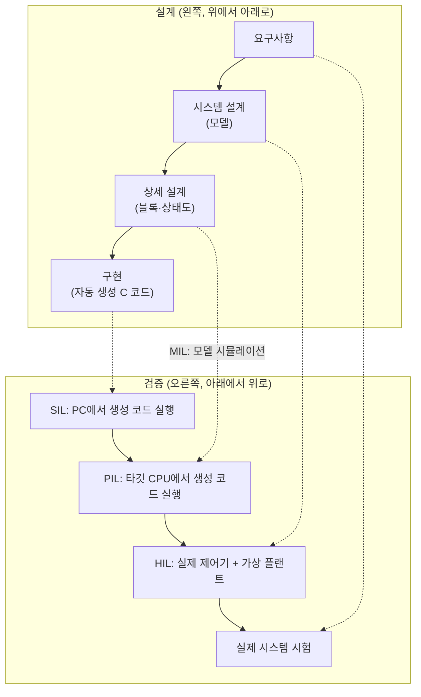
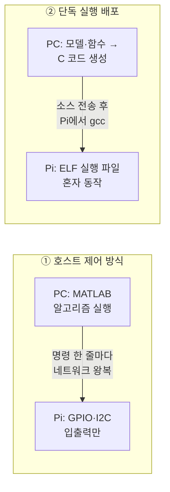
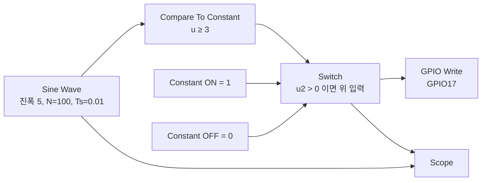
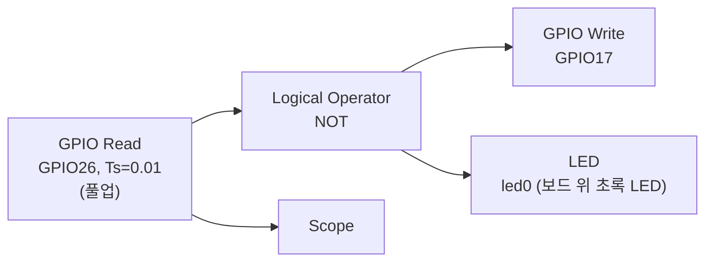
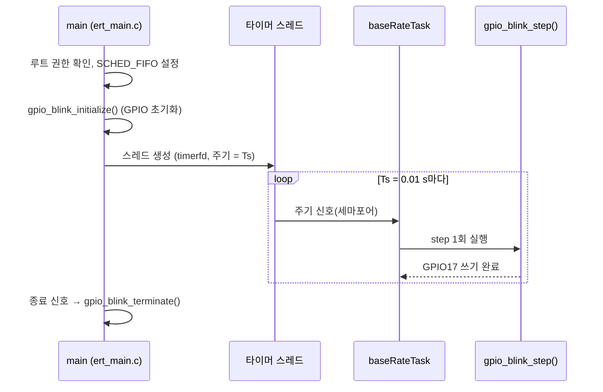
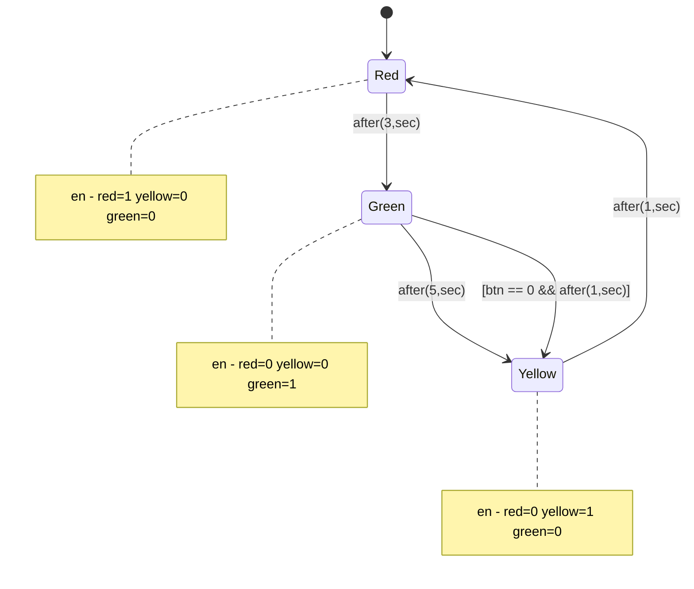

# 부록 A. MATLAB/Simulink 모델 기반 설계

> **학습 목표**
> - 모델 기반 설계(Model-Based Design, MBD)가 무엇이고 왜 쓰는지, V-모델의 MIL·SIL·PIL·HIL 검증 단계와 연결해 설명할 수 있다.
> - MATLAB, Simulink, Stateflow, MATLAB Coder, Simulink Coder, Embedded Coder가 각각 무엇을 하는지 구분하고, Raspberry Pi 작업에 필요한 제품을 고를 수 있다.
> - MATLAB에서 Pi를 쓰는 두 방식(호스트 제어 방식과 단독 실행 배포)의 차이를 설명하고, `raspi` 객체와 `raspberrypi` 객체를 용도에 맞게 쓸 수 있다.
> - 지원 패키지를 설치하고 Hardware Setup을 마친 뒤, MATLAB 명령 창에서 Pi의 셸 명령과 GPIO(LED GPIO17, 버튼 GPIO26)를 다룰 수 있다.
> - MATLAB Coder로 MATLAB 함수를 C 코드로 바꾸고, 직접 쓴 `main.c`와 함께 Pi에서 `gcc`·`make`로 빌드할 수 있다.
> - Simulink로 GPIO 모델을 만들어 PC 시뮬레이션, Monitor & Tune(External Mode), Build, Deploy & Start로 실행하고, 생성된 코드와 ELF 파일을 6장의 지식으로 읽을 수 있다.
> - Stateflow로 간단한 상태 기계(신호등)를 만들고, `after(n,sec)` 시간 논리를 쓸 수 있다.
> - MATLAB에서 FIR/IIR 필터를 설계하고 같은 필터를 C로 구현해 결과를 비교할 수 있다.

이 교재의 본문은 C 언어로 레지스터와 라이브러리를 직접 다루었다. 그런데 졸업 작품이나 연구실 프로젝트를 해 보면, 정작 시간을 많이 써야 할 곳은 **알고리즘**(모터의 PID 제어, 생체 신호 필터, 영상 처리)인데 실제로는 GPIO 초기화, 타이머, 빌드 오류 같은 저수준 작업에 에너지를 다 써 버리는 경우가 많다. 강의에서 "C 코드에 울렁증이 있지만 아이디어는 정말 괜찮은 사람도 충분히 아이디어를 구현해 볼 수 있다"고 소개한 방법이 이 부록의 주제인 **MATLAB/Simulink 모델 기반 설계**이다.

2025년 강의에서는 3주차에 아두이노로 모델 기반 설계를 맛보았고(ADC 값이 기준보다 크면 LED를 켜는 알고리즘을 PC에서 먼저 검증한 뒤 입출력 블록만 바꾸어 보드에 올렸다), 12주차에 Raspberry Pi 지원 패키지를 설치했으며, 13주차에 Simulink 모델을 Pi에서 실행했다. 이 부록은 그 흐름을 Raspberry Pi 4B와 Raspberry Pi OS 64비트(Bookworm) 기준으로 처음부터 끝까지 따라 할 수 있게 정리하고, 강의 자료(「Matlab 백서」, 「Raspberry Pi Codes」 §10, 저장소 `Simulink/` 폴더)의 오류를 바로잡았다.

예제 파일은 [`code/appendix_a/`](code/appendix_a/)에 있다.

| 실습 | 내용 | 파일 | 필요한 제품(📌 보강, A.2.3절) |
|---|---|---|---|
| A-1 | MATLAB에서 Pi 연결, 셸 명령 | `connect_pi.m` | MATLAB + Pi 지원 패키지 |
| A-2 | MATLAB에서 LED·버튼 | `led_blink.m`, `button_read.m` | MATLAB + Pi 지원 패키지 |
| A-3 | MATLAB Coder로 이동 평균 필터 C 코드 생성 → Pi에서 빌드 | `moving_average.m`, `build_ma.m`, `main.c`, `Makefile` | MATLAB + MATLAB Coder |
| A-4 | Simulink GPIO 모델: 시뮬레이션, Monitor & Tune, 배포 | (모델은 직접 만든다), `manage_model.m` | + Simulink, Embedded Coder |
| A-5 | Stateflow 신호등 | (차트는 직접 만든다) | + Stateflow |
| A-6 | FIR/IIR 필터 설계와 C 구현 비교 | `design_filter.m`, `filter_demo.c` | MATLAB + Signal Processing Toolbox (C는 gcc만) |

> **실행 확인 상태.** 이 부록의 C 프로그램(`filter_demo.c`, `main.c`, `Makefile`)은 WSL(Debian 12, gcc 12.2, Pi OS Bookworm과 같은 컴파일러 버전)에서 `-Wall`로 빌드·실행해 확인했고, 본문에 실제 출력을 실었다(`> 출력 출처: WSL Debian 12 실행 결과`). 집필 환경의 MATLAB은 실행할 수 없어서 `.m` 파일과 Simulink·Stateflow 절차는 <strong>(MATLAB + Pi 4에서 확인 필요)</strong>로 표시했다. 출력 출처 표기는 [머리말](00_preface.md) 「이 책의 표기 규칙」을 따른다. 수업 전에 실제 MATLAB과 Pi에서 한 번 실행해 보고 화면을 채워 넣어야 한다.

---

## A.1 모델 기반 설계란 무엇인가

### A.1.1 왜 필요한가: 집을 짓기 전에 설계도와 모형을 만든다

집을 지을 때 바로 벽돌부터 쌓지 않는다. 설계도를 그리고, 모형을 만들어 햇빛이 어떻게 드는지 보고, 구조 계산으로 무너지지 않는지 확인한 다음에 현장에 간다. 현장에서 잘못을 발견하면 고치는 비용이 설계도에서 고치는 비용보다 훨씬 크기 때문이다.

임베디드 소프트웨어도 같다. 아두이노나 Raspberry Pi에 바로 C 코드를 짜서 올리면, 알고리즘이 틀렸는지, 배선이 틀렸는지, 타이밍이 틀렸는지 한꺼번에 섞여서 원인을 찾기 어렵다. 3주차 강의의 예처럼 "ADC 값이 500보다 크면 LED를 켠다"는 단순한 알고리즘조차, 하드웨어에서 시험하려면 외부에서 실제 전압을 넣어 주어야 한다. 반면 PC에서 **입력 신호를 가상으로 만들어** 알고리즘만 먼저 확인하면, 하드웨어 없이도 "알고리즘은 맞다"는 것을 확인할 수 있다. 그다음 입력 블록을 실제 Analog Input으로, 출력 블록을 GPIO로 바꾸기만 하면 된다. 보드마다 다른 ADC·GPIO 처리에 신경 쓰지 않고 **"무엇을 할 것인가"에 집중**할 수 있다는 것이 강의에서 강조한 장점이다.

### A.1.2 정의

**모델 기반 설계**(Model-Based Design, MBD)는 **실행 가능한 모델**(executable model)을 개발의 중심에 두는 방법이다. 여기서 모델은 그림이 아니라 **시뮬레이션할 수 있는 블록 다이어그램이나 상태도**이다. 이 모델 하나로 다음 일을 모두 한다.

1. **명세**: 요구사항을 모델로 표현한다("입력이 3보다 크면 GPIO17을 High").
2. **시뮬레이션**: PC에서 가상 입력을 넣어 동작을 확인한다.
3. **자동 코드 생성**(automatic code generation): 검증한 모델에서 C 코드를 만든다.
4. **검증**: 생성된 코드가 모델과 같은지, 실제 하드웨어에서 제시간에 도는지 단계별로 확인한다.

> 📌 **보강:** MathWorks는 모델 기반 설계를 "개발 과정 전체에서 모델을 체계적으로 사용하는 것"으로 정의하고, 모델링·시뮬레이션으로 아이디어를 빠르게 반복 시험하며 코딩·검증 같은 단계를 자동화해 사람의 실수를 줄이는 것을 장점으로 든다. 출처: [Model-Based Design (MathWorks)](https://www.mathworks.com/solutions/model-based-design.html)


### A.1.3 V-모델과 검증 단계

자동차·항공 분야에서 오래 써 온 **V-모델**(V-model)은 왼쪽 위에서 요구사항을 정하고 아래로 내려가며 설계·구현한 뒤, 오른쪽으로 올라가며 각 단계에 맞는 시험을 하는 개발 절차이다. 모델 기반 설계는 V의 왼쪽 단계마다 실행 가능한 모델이 있으므로, 오른쪽의 시험을 **앞당겨** 할 수 있다.



| 단계 | 무엇을 무엇과 비교하나 | 이 부록에서 |
|---|---|---|
| **MIL**(Model-in-the-Loop) | 모델을 PC에서 시뮬레이션 | 실습 A-4의 Run, A-5의 차트 시뮬레이션 |
| **SIL**(Software-in-the-Loop) | 생성된 C 코드를 PC에서 컴파일해 모델 결과와 비교 | 실습 A-6에서 C 결과를 MATLAB `filter` 결과와 비교 |
| **PIL**(Processor-in-the-Loop) | 생성된 코드를 **타깃 CPU**(Pi의 Cortex-A72)에서 실행해 비교 | A.12절 (Embedded Coder 필요) |
| **HIL**(Hardware-in-the-Loop) | 실제 제어기에 **가상 환경**(플랜트 모델)을 실시간으로 연결 | A.12절 개념 |

> 📌 **보강:** Embedded Coder 문서는 SIL을 "생성 코드를 개발용 컴퓨터에서 컴파일해 실행하는 시뮬레이션", PIL을 "소스를 교차 컴파일해 타깃 프로세서(또는 같은 명령어 집합의 시뮬레이터)에서 실행하는 시뮬레이션"으로 정의하고, 둘 다 일반 모델 시뮬레이션 결과와 비교해 모델과 생성 코드가 수치적으로 같은지 확인하는 데 쓴다. HIL은 제어기 하드웨어의 실제 입출력을 물리 시스템을 흉내 내는 가상 환경에 연결해 시험하는 기법이다. MIL과 V-모델은 업계에서 널리 쓰는 용어이며, 이 표는 그 정의에 맞추어 정리한 것이다. 출처: [SIL and PIL Simulations](https://www.mathworks.com/help/ecoder/ug/about-sil-and-pil-simulations.html), [Hardware-in-the-Loop Simulation](https://www.mathworks.com/discovery/hardware-in-the-loop-hil.html)

### A.1.4 흔한 오해

- **"코드를 몰라도 된다."** 반만 맞다. 알고리즘은 블록으로 그리지만, 생성된 코드는 결국 C 소스와 Makefile(`.mk`)이고, Pi에서 `gcc`로 빌드된 **ELF 실행 파일**이다. 빌드가 실패하거나 권한 오류가 나면 [6장](06_c_build.md)과 [8장](08_gpio_pigpio.md)의 지식으로 해결해야 한다. A.8절에서 생성 코드를 직접 열어 보는 이유이다.
- **"시뮬레이션이 맞으면 하드웨어도 맞다."** 시뮬레이션은 이상적인 수학 환경이다. 실제 하드웨어에는 잡음, 지연, 운영체제의 스케줄링 지터가 있다(A.13절).
- **"Simulink는 MATLAB과 다른 프로그램이다."** Simulink는 MATLAB 위에서 돌고, Stateflow는 Simulink 안의 블록(Chart)으로 존재한다. 셋은 한 묶음이다.

---

## A.2 MATLAB 제품군 한눈에 보기

### A.2.1 무엇이 무엇을 하는가

| 제품 | 한 줄 설명 | 비유 | 이 부록에서 |
|---|---|---|---|
| **MATLAB** | 행렬 계산 중심의 프로그래밍 언어와 개발 환경 | 공학용 계산기 + 스크립트 언어 | A-1, A-2, A-6 |
| **Simulink** | 블록을 선으로 이어 동적 시스템을 모델링·시뮬레이션 | 그리면 그대로 돌아가는 회로도 | A-4 |
| **Stateflow** | 상태 기계(state machine)와 흐름도를 그려 Simulink 안에서 실행 | 디지털 논리의 상태도를 실행 가능하게 | A-5 |
| **MATLAB Coder** | MATLAB 함수(`.m`)를 C/C++ 소스로 변환 | 번역가 | A-3 |
| **Simulink Coder** | Simulink·Stateflow 모델에서 C/C++ 코드 생성 (예전 이름 Real-Time Workshop) | 모델 번역가 | A-4 내부 |
| **Embedded Coder** | Simulink Coder의 상위판. 임베디드용 최적화, 이름·파일 구조 제어, MISRA C·AUTOSAR 지원, SIL/PIL 검증 | 양산용 번역가 | A-4의 배포(ERT 타깃) |
| **Signal Processing Toolbox** | `fir1`, `butter`, `freqz` 등 필터 설계·분석 함수 | 필터 설계 도구 상자 | A-6 |
| **DSP System Toolbox** | Simulink용 필터 블록, 스트리밍 신호 처리 | 실시간 신호 처리 블록 | 참고 |
| **Raspberry Pi 지원 패키지 / Raspberry Pi Blockset** | Pi 연결 객체, GPIO·I2C·SPI·카메라 함수와 블록, 빌드·배포 기능 | Pi 전용 어댑터 | 전부 |

강의 백서의 설명을 정리하면, **Simulink Coder**는 모델에서 이식 가능한 C 코드를 만드는 기본 도구이고, **Embedded Coder**는 그 위에 "메모리를 줄이고, 생성되는 함수·파일·변수 이름을 회사 규칙에 맞추고, 산업 표준을 지키는" 기능을 더한 것이다. Raspberry Pi에 모델을 배포할 때 쓰는 코드 생성 타깃은 `ert.tlc`(Embedded Real-Time Target)이며, 저장소의 Simulink 모델 설정에도 `SystemTargetFile = ert.tlc`로 저장되어 있다. 그래서 Pi 배포에는 Embedded Coder가 필요하다(A.2.3절).

> **`filter`와 `fir1`의 차이.** `filter`(필터 적용)는 MATLAB 기본 함수이지만, `fir1`·`butter`·`freqz`(필터 설계·분석)는 Signal Processing Toolbox 함수이다. 툴박스가 없으면 A-6의 설계 부분이 실행되지 않는다.

### A.2.2 Raspberry Pi 지원 제품의 이름이 바뀌었다 (📌 보강)

강의 자료에는 세 가지 이름이 섞여 나온다. 모두 같은 계열의 제품이다.

| MATLAB 릴리스 | 제품 이름 | 비고 |
|---|---|---|
| R2025b 이하 | **MATLAB Support Package for Raspberry Pi Hardware** (MATLAB 명령용, `raspi` 객체) | 강의 12주차에 "MATLAB용 패키지"로 소개 |
| R2025b 이하 | **Simulink Support Package for Raspberry Pi Hardware** (Simulink 블록, 배포, `raspberrypi` 객체) | 강의에서 "필수"로 설치. 저장소의 `.slx`는 R2025b로 저장됨 |
| R2026a 이상 | **Raspberry Pi Blockset** | 위의 두 패키지를 대신하는 하나의 제품 |

MathWorks 문서는 "R2026a부터 Raspberry Pi Blockset이 MATLAB Support Package for Raspberry Pi Hardware와 Simulink Support Package for Raspberry Pi Hardware를 대체한다"고 밝힌다. 백서의 "예전에는 Support Package라고 불렸다"는 설명은 이것을 가리킨다. 이 교재의 환경인 **Raspberry Pi OS Bookworm 64비트**는 Raspberry Pi Blockset(R2026a 이상)과, 이전 패키지로는 MATLAB Support Package(R2025a~R2025b)·Simulink Support Package(R2024b~R2025b)에서 지원된다. 다른 OS나 릴리스 조합은 공식 호환표를 직접 확인한다.

출처: [Raspberry Pi Blockset 문서](https://www.mathworks.com/help/raspberrypi/index.html), [Compatibility of MathWorks Products with Raspberry Pi Hardware and Operating System](https://www.mathworks.com/help/raspberrypi/gs/validate-release-wise-compatibility-of-mathworks-products-with-raspberry-pi-hardware-and-operating-system.html), [Hardware Support – Raspberry Pi](https://www.mathworks.com/hardware-support/raspberry-pi.html)

### A.2.3 무엇을 하려면 어떤 제품이 필요한가 (📌 보강)

| 하려는 일 | 필요한 제품 |
|---|---|
| MATLAB 명령 창에서 Pi I/O 제어(A-1, A-2) | MATLAB + Pi 지원 패키지(Blockset) |
| Simulink 모델을 PC에서 실행하며 Pi의 I/O 사용(Connected I/O) | + Simulink |
| Simulink 모델을 Pi에 배포(Build, Deploy & Start), 실행 중 모니터링·튜닝(Monitor & Tune), PIL | + Simulink + **Embedded Coder** |
| MATLAB 함수를 Pi의 단독 실행 파일로 배포(`deploy`), MATLAB PIL | + **Embedded Coder** |
| MATLAB 함수를 이식 가능한 C 소스로만 생성(실습 A-3의 방법) | MATLAB + **MATLAB Coder** (Pi 패키지 불필요) |

Embedded Coder는 MATLAB Coder와 Simulink Coder를 바탕으로 동작하므로 함께 설치되어 있어야 한다. 출처: [Product Stack for Raspberry Pi Blockset](https://www.mathworks.com/help/raspberrypi/gs/understand-product-stack-for-raspberry-pi-blockset.html)

> **라이선스 안내.** 학교의 캠퍼스 라이선스(Campus-Wide License)에 어떤 툴박스가 포함되는지는 학교마다 다르다. MathWorks 계정을 **학교 이메일**로 만들면 캠퍼스 라이선스에 연결된다(강의 12주차 안내). 설치 전에 Home → Help → Licensing에서 내 라이선스에 MATLAB Coder, Embedded Coder, Stateflow, Signal Processing Toolbox가 있는지 확인한다. 명령 창에서 `license('test','RTW_Embedded_Coder')`처럼 확인할 수도 있다(1이면 사용 가능).

---

## A.3 MATLAB으로 Pi를 쓰는 두 가지 방법

### A.3.1 사령관과 현장 작업자, 그리고 독립한 현장

강의 백서는 두 방식을 이렇게 비유한다.

- **호스트 제어 방식**(interactive, 대화형): PC가 사령관이고 Pi는 현장 작업자이다. 복잡한 설계 계산은 건축 사무소(PC)에서 하고, 현장(Pi)은 지시에 따라 재료를 놓는다(데이터 입출력). PC에서 MATLAB 코드가 한 줄 실행될 때마다 네트워크로 Pi에 명령이 가고 결과가 돌아온다.
- **단독 실행 배포**(standalone deployment): 설계도를 통째로 외운 작업자가 현장에서 혼자 건물을 짓는다. 알고리즘을 C 코드로 바꾸어 Pi 안에 실행 파일로 심어 두면, PC를 끊어도 전원만 있으면 계속 돈다.



| 비교 항목 | ① 호스트 제어 방식 | ② 단독 실행 배포 |
|---|---|---|
| 알고리즘이 도는 곳 | **PC** (MATLAB 엔진) | **Pi** (Cortex-A72에서 C 코드) |
| 연결 | PC와 계속 네트워크 연결 필요 | 배포 후에는 필요 없음 |
| 쓰는 도구 | 명령 창, `raspi` 객체 함수 | MATLAB Coder, Simulink + Embedded Coder |
| 장점 | 바로 해 볼 수 있다. MATLAB의 그래프·툴박스를 그대로 쓴다. 컴파일 없음 | 빠르고 지연이 일정하다. PC 없이 독립 동작. 제품에 가깝다 |
| 단점 | 명령마다 네트워크 왕복이 생겨 **빠른 제어에는 못 쓴다**. PC를 끄면 멈춘다 | 코드 생성이 지원되는 함수만 쓸 수 있다. 빌드 시간이 걸린다. 라이선스가 더 필요하다 |
| 어울리는 일 | 센서 값 확인, 데이터 수집과 시각화, 프로토타입 디버깅 | 실시간 필터링, 제어 루프, 장시간 무인 동작 |

### A.3.2 Simulink의 실행 모드 세 가지와 시뮬레이션

Simulink에서는 같은 구분이 툴스트립 버튼으로 나타난다. 강의 백서의 표(아두이노 기준)를 Raspberry Pi에 맞게 고쳐 정리하면 다음과 같다.

| 구분 | **Run** (Simulation 탭) | **Connected I/O** (Run with I/O) | **Monitor & Tune** (External Mode) | **Build, Deploy & Start** |
|---|---|---|---|---|
| 알고리즘 실행 위치 | PC | PC | **Pi** | **Pi** |
| Pi의 역할 | 없음 | PC의 입출력 장치 | 독립된 컴퓨터 | 독립된 컴퓨터 |
| PC의 역할 | 모든 계산 | 모든 계산 | 신호 모니터링·파라미터 튜닝 | 코드 생성·전송·시작 |
| 코드 생성 | 없음 | 없음 | 있음 (통신 코드 포함) | 있음 (통신 코드 없음) |
| PC 연결 | — | 항상 필요 | 항상 필요 | 시작 후 불필요 |
| 목적 | 알고리즘의 이론적 검증 | PC 자원으로 실제 I/O 시험 | 실제 하드웨어에서 성능 확인·디버깅 | 최종 배포 |

강의 13주차에 본 것은 Run(PC 시뮬레이션), Build, Deploy & Start, Monitor & Tune이었다. 실습 A-4에서 세 가지를 모두 해 본다.

### A.3.3 `raspi` 객체와 `raspberrypi` 객체 (원본 자료 정정)

강의 자료에는 Pi 연결 객체가 두 가지 나온다. 이름이 비슷해서 자주 섞어 쓰는데, **하는 일이 다르다**.

| | `raspi` | `raspberrypi` |
|---|---|---|
| 원래 소속(R2025b 이하) | MATLAB Support Package | Simulink Support Package |
| 하는 일 | **하드웨어 I/O**: `configurePin`, `writeDigitalPin`, `readDigitalPin`, `i2cdev`, `spidev`, 카메라, 그리고 `system`, `getFile`, `putFile` | **배포한 애플리케이션 관리**: `runModel`, `stopModel`, `isModelRunning`, `runExecutable`, `addToRunOnBoot`, 그리고 `system`, `getFile`, `putFile` |
| 이 부록에서 | 실습 A-1, A-2 | 실습 A-4 (`manage_model.m`) |

> **원본 자료 정정.**
> - 「Raspberry Pi Codes」 §10은 `pi = raspberrypi('…')`로 만든 객체에 `configurePin`, `writeDigitalPin`을 썼다. 저장소의 `Simulink/raspberrypi_doc.mlx`에 저장된 실행 결과를 보면 바로 이 줄에서 `Incorrect number or types of inputs or outputs for function configurePin.` 오류가 났다. GPIO 함수는 **`raspi` 객체**에 쓴다.
> - 같은 예제는 변수 이름을 `pi`로 지었다. MATLAB에서 `pi`는 원주율 상수 함수이므로, 이 변수를 만든 뒤에는 `sin(2*pi*f*t)` 같은 식이 엉뚱하게 계산된다. 백서의 `i2cdev = i2cdev(rpi, …)`도 같은 실수로, 변수 이름이 함수 이름을 가려 두 번째 호출부터 실패한다. 이 부록은 `rpi`, `board`, `sensor` 같은 이름을 쓴다.
> - 같은 예제는 `try … catch … finally`를 썼지만 MATLAB에는 `finally`가 없다. 정리 작업은 `onCleanup`으로 한다(실습 A-2).
> - 백서와 강의 자료의 `raspi('192.168.1.100', 'pi', 'password')`처럼 사용자 `pi`를 가정한 예는 Bookworm에서는 그대로 쓸 수 없다. 2022년 4월 릴리스부터 기본 사용자 `pi`가 없으므로 Imager에서 만든 사용자([3장](03_rpi_hw_os.md))를 쓴다. MathWorks 문서의 `raspi` 설명에도 기본값 `pi`/`raspberry`가 나오는데, 이는 옛 OS 이미지 기준이다.

---

## A.4 설치와 준비

### A.4.1 PC 쪽 준비

1. **MATLAB 설치와 로그인**: 학교 이메일로 만든 MathWorks 계정으로 로그인한다. 지원 패키지 설치에도 로그인이 필요하다.
2. **지원 패키지 설치**: MATLAB의 **APPS** 탭 → **Get More Apps**(또는 **Home** 탭 → **Add-Ons** → **Get Add-Ons**)를 열고 "Raspberry Pi"로 검색한다.
   - R2026a 이상: **Raspberry Pi Blockset**을 설치한다.
   - R2025b 이하: **Simulink Support Package for Raspberry Pi Hardware**(필수)와 **MATLAB Support Package for Raspberry Pi Hardware**를 모두 설치한다.

<!-- 그림 필요: Add-On Explorer에서 "Raspberry Pi" 검색 결과 화면 (MATLAB R2026a) -->

3. **설치 확인**: 명령 창에서 다음을 입력하면 설치된 지원 패키지 목록이 나온다.

```matlab
>> sp = matlabshared.supportpkg.getInstalled;  {sp.Name}'
```

### A.4.2 Pi 쪽 요구 사항

MATLAB은 **SSH로 Pi에 접속해서** 모든 일을 한다. 그래서 [3장](03_rpi_hw_os.md)과 [5장](05_sysadmin.md)에서 한 기본 설정이 그대로 전제 조건이 된다.

| 항목 | 확인 방법 | 왜 필요한가 |
|---|---|---|
| Raspberry Pi OS **Bookworm 64비트** | `cat /etc/os-release`, `uname -m` → `aarch64` | 지원 패키지 버전과 OS가 맞아야 한다(A.2.2절) |
| Imager에서 만든 **사용자·암호** | 로그인해 본다 | 기본 사용자 `pi`가 없다 |
| **SSH 활성화** | PC에서 `ssh student@192.168.0.xx` | MATLAB은 SSH로 명령과 파일을 보낸다 |
| **PC와 같은 네트워크**, IP 확인 | Pi에서 `hostname -I` | MATLAB이 Pi를 찾을 방법은 IP뿐이다 |
| 사용자에게 **sudo 권한** | `sudo -v` | 라이브러리 설치와 생성 코드 실행(A.8.4절)에 필요 |
| Pi의 **인터넷 연결** | `ping -c 3 deb.debian.org` | Hardware Setup이 `apt`로 라이브러리를 설치한다 |
| 다른 GPIO 프로그램 정리 | `pgrep -a pigpio` | 같은 핀을 pigpio 프로그램과 함께 쓰면 서로 덮어쓴다 |

강의에서 강조했듯이 **MATLAB에서 연결하기 전에 먼저 PC에서 SSH로 접속되는지 확인**한다. SSH가 되면 네트워크 문제는 없는 것이다.

### A.4.3 Hardware Setup 마법사

지원 패키지를 설치하면 Hardware Setup 마법사가 이어서 실행된다. 나중에 다시 열려면 명령 창에서 `raspisetup`을 입력하거나(Blockset), Add-On Manager에서 패키지 옆의 Setup을 누르거나, Simulink 모델의 **Hardware** 탭 → **Hardware Board** → **Setup Hardware**를 고른다(📌 보강, 출처: [Hardware Setup for Raspberry Pi Blockset](https://www.mathworks.com/help/raspberrypi/gs/hardware-setup-for-raspberry-pi-blockset.html)).

강의 13주차에 따라간 순서는 다음과 같다. 릴리스마다 화면 이름은 조금씩 다르다.

| 단계 | 할 일 | 주의 |
|---|---|---|
| 1. 보드 선택 | **Raspberry Pi 4 Model B**를 고른다 | 처음에는 화면의 설명을 한 번 읽어 본다. 영어가 어려우면 번역 도구를 쓴다 |
| 2. OS 준비 | "이미 OS가 설치된 SD 카드를 쓴다"를 고른다 | 3장에서 설치한 Bookworm 64비트를 그대로 쓴다 |
| 3. 연결 정보 | IP 주소(`192.168.0.xx`), 사용자 이름, 암호 입력 | 실습실 IP는 강의 시간에 안내받는다 |
| 4. **Test Connection** | 네트워크(ping), **SSH 접속**, **sudo 권한**, **인터넷 연결**을 차례로 검사 | 하나라도 실패하면 A.4.2절 표로 돌아간다 |
| 5. 라이브러리 설치 | Standard 또는 Custom. Custom에서는 **Core**만 골라도 GPIO 실습에는 충분 | MATLAB이 Pi에 필요한 패키지를 설치한다. 로그를 열어 무엇이 설치되는지 본다 |
| 6. 주변장치 설정 | `raspi-config`와 같은 화면. 카메라는 disable, **UART·I2C는 enable** | 여기서 Reboot는 PC가 아니라 **Pi**의 재부팅이다 |
| 7. 완료 | Finish | Hardware 탭에서 보드가 연결된 것으로 보인다 |

<!-- 그림 필요: Hardware Setup의 Test Connection 결과 화면(4개 항목 통과) -->
<!-- 그림 필요: 라이브러리 설치 Custom 화면에서 Core만 선택한 모습 -->

> **Pi에 무엇이 깔리나?** 설치 로그를 열어 보면 MathWorks가 Pi에서 쓰는 라이브러리와 Debian 패키지가 설치되는 것을 볼 수 있다. A.8.3절에서 실제 실행 파일이 어떤 라이브러리(`libmwraspiperipheral.so`, `libgpiod.so.2`)를 필요로 하는지 `readelf`로 확인한다.

---

## 실습 A-1. MATLAB에서 Pi에 연결하고 셸 명령 실행

**목표**: `raspi` 객체를 만들고, `system()` 함수로 Pi의 셸 명령을 MATLAB에서 실행한다. SSH 창에서 하던 일을 MATLAB 명령 창에서 할 수 있음을 확인한다.

**준비물**: A.4절을 마친 PC와 Pi(같은 네트워크)

**회로·핀 표**: 없음 (마지막 명령에서 GPIO17 상태만 읽는다)

**코드** (`code/appendix_a/connect_pi.m`)

```matlab
% connect_pi.m : 실습 A-1  MATLAB에서 Raspberry Pi에 연결하고 Linux 명령 실행
%
% 필요 : MATLAB + Raspberry Pi 지원 패키지
%        (R2026a 이상: Raspberry Pi Blockset,
%         R2025b 이하: MATLAB Support Package for Raspberry Pi Hardware)
% 실행 : >> connect_pi
% 주의 : IP와 사용자 이름은 자신의 Pi에 맞게 고친다. 암호는 파일에 적지 않는다.
%        변수 이름을 pi로 하지 않는다(MATLAB의 원주율 상수 pi를 가린다).

ipAddr   = '192.168.0.xx';               % Pi에서 hostname -I 로 확인한 주소
userName = 'student';                    % Raspberry Pi Imager에서 만든 사용자
passWord = input('Pi 암호: ', 's');      % 실행할 때 입력받는다

rpi = raspi(ipAddr, userName, passWord); % SSH로 접속해 하드웨어 연결 객체를 만든다
clear passWord
disp(rpi)                                % BoardName, AvailableDigitalPins 등 확인

% system(): Pi의 셸에서 명령을 실행하고 결과를 문자열로 돌려받는다
fprintf('%s', system(rpi, 'uname -a'));          % 커널 버전, 아키텍처(aarch64)
fprintf('%s', system(rpi, 'cat /etc/os-release | head -4'));
fprintf('%s', system(rpi, 'free -h'));           % 메모리
fprintf('%s', system(rpi, 'pinctrl get 17'));    % LED 핀 상태 (8장 8.8절)

% 다음 실습부터는 rpi = raspi(); 만으로 마지막 연결 정보를 다시 쓴다.
clear rpi                                % 연결 닫기
```

| 부분 | 설명 |
|---|---|
| `input('Pi 암호: ', 's')` | 암호를 파일에 적지 않는다. 저장소에 올린 `.m`이나 `.mlx`에 암호가 남는 사고를 막는다 |
| `raspi(ip, user, pw)` | SSH로 접속해 하드웨어 연결 객체를 만든다. 한 번 성공하면 MATLAB이 정보를 기억해 다음부터는 `raspi()`만 써도 된다 |
| `disp(rpi)` | `BoardName`, `AvailableDigitalPins`, `AvailableI2CBuses`, `AvailableSPIChannels` 같은 속성을 보여 준다 |
| `system(rpi, '명령')` | Pi의 셸에서 명령을 실행하고 표준 출력을 **문자열**로 돌려준다 |
| `clear rpi` | 연결을 닫는다. Simulink가 같은 보드에 연결할 때 충돌하지 않도록, 실습이 끝나면 지운다 |

**빌드·실행**: MATLAB의 현재 폴더를 `code/appendix_a`로 바꾼 뒤 명령 창에서 `connect_pi`를 입력한다. 파일 첫 줄의 `ipAddr`, `userName`을 자신의 값으로 먼저 고친다.

**결과 확인** (MATLAB + Pi 4에서 확인 필요) <!-- PI-CHECK -->

- 연결 객체의 속성이 출력되고, `BoardName`에 `Raspberry Pi 4 Model B`가 보인다.
- `uname -a` 결과에 `aarch64`가 보인다. 강의 자료에 기록된 실제 출력은 다음과 같다(`raspberrypi` 객체의 `system`으로 실행한 결과).

> 출력 출처: Pi 4 실기기 캡처(강의 자료 Matlab 백서 §4.2)

```text
Linux raspberrypi 6.12.34+rpt-rpi-v8 #1 SMP PREEMPT Debian 1:6.12.34-1+rpt1~bookworm (2025-06-26) aarch64 GNU/Linux
```

> 출력 출처: Pi 4 실기기 캡처(강의 자료 Matlab 백서 §4.2)

```text
               총계         사용        여분      공유    버퍼/캐시    가용
메모리:        1.8Gi       207Mi       1.0Gi       1.3Mi       656Mi       1.6Gi
스  왑:        511Mi          0B       511Mi
```

- `rpt-rpi-v8`은 Raspberry Pi 커널의 64비트(ARMv8) 판, `PREEMPT`는 선점형 커널이라는 뜻이다([7장](07_boot_kernel.md) 7.9.4절). `free -h` 결과가 한국어로 나오는 것은 Pi의 로캘이 한국어이기 때문이다.
- SSH 창에서 같은 명령을 쳐서 결과가 같은지 비교한다. MATLAB의 `system()`도 결국 **SSH로 명령을 보내는 것**이다.

---

## 실습 A-2. MATLAB에서 LED 깜빡이기와 버튼 읽기

**목표**: 호스트 제어 방식으로 GPIO 출력과 입력을 다루고, 8장의 C 프로그램과 무엇이 다른지(특히 속도) 체감한다.

**준비물**: LED 1개, 330 Ω 저항, 푸시 버튼 1개, 점퍼선 (8장과 같다)

**회로·핀 표**

| 부품 | 연결 |
|---|---|
| LED 애노드(긴 다리) | 330 Ω을 거쳐 GPIO17 (물리 핀 11) |
| LED 캐소드(짧은 다리) | GND (물리 핀 9) |
| 버튼 한쪽 | GPIO26 (물리 핀 37) |
| 버튼 다른 쪽(대각선 다리) | GND (물리 핀 39) |

**코드 ①** (`code/appendix_a/led_blink.m`)

```matlab
function led_blink(nBlink)
% led_blink : 실습 A-2  MATLAB에서 GPIO17 LED 깜빡이기 (호스트 제어 방식)
%   >> led_blink        5번 깜빡인다
%   >> led_blink(10)    10번 깜빡인다
%
% 회로 : GPIO17 (물리 핀 11) -> 330 Ω -> LED(애노드→캐소드) -> GND (물리 핀 9)
% 준비 : connect_pi.m 으로 한 번 연결에 성공해 두면 raspi()가 그 정보를 다시 쓴다.
%
% 원본 「Raspberry Pi Codes」 §10 예제를 고쳤다.
%   - raspberrypi 객체에 configurePin을 씀 → GPIO 함수는 raspi 객체에서 쓴다
%   - 변수 이름 pi → rpi (원주율 상수 pi를 가리지 않게)
%   - MATLAB에 없는 try/catch/finally 문법 → onCleanup으로 정리 보장

if nargin < 1
    nBlink = 5;
end
ledPin = 17;                                   % BCM 번호

rpi = raspi();                                 % 마지막으로 성공한 연결 재사용
configurePin(rpi, ledPin, 'DigitalOutput');

% 함수가 끝나거나 Ctrl+C로 멈춰도 LED를 끄도록 정리 작업을 예약한다
cleanupObj = onCleanup(@() ledOff(rpi, ledPin)); %#ok<NASGU>

for k = 1:nBlink
    writeDigitalPin(rpi, ledPin, 1);
    fprintf('LED ON  (%d/%d)\n', k, nBlink);
    pause(0.5);
    writeDigitalPin(rpi, ledPin, 0);
    fprintf('LED OFF (%d/%d)\n', k, nBlink);
    pause(0.5);
end
end

function ledOff(rpi, pin)
writeDigitalPin(rpi, pin, 0);
fprintf('LED를 끄고 종료\n');
end
```

| 부분 | 설명 |
|---|---|
| `function led_blink(nBlink)` | 스크립트가 아니라 **함수**로 만들었다. `onCleanup`은 함수 안에서 써야 "끝날 때 반드시 실행"이 보장된다 |
| `configurePin(rpi, ledPin, 'DigitalOutput')` | 8장의 `gpioSetMode(17, PI_OUTPUT)`에 해당한다. 핀 번호는 **BCM 번호**이다 |
| `onCleanup(@() ledOff(rpi, ledPin))` | 함수가 정상으로 끝나든, 오류가 나든, Ctrl+C로 멈추든 `ledOff`가 실행된다. 8장에서 `gpioSetSignalFunc`로 한 일과 같은 목적이다 |
| `pause(0.5)` | MATLAB의 0.5초 대기. 여기에 네트워크 왕복 시간이 더해진다 |

**코드 ②** (`code/appendix_a/button_read.m`)

```matlab
function button_read(durationSec)
% button_read : 실습 A-2  GPIO26 버튼을 읽어 GPIO17 LED에 반영 (호스트 제어 방식)
%   >> button_read       20초 동안 실행
%   >> button_read(5)    5초 동안 실행
%
% 회로 : GPIO26 (물리 핀 37) - 버튼 - GND (물리 핀 39), 내부 풀업 사용
%        GPIO17 (물리 핀 11) - 330 Ω - LED - GND      (8장 실습 8-3과 같다)
% 동작 : 풀업이므로 안 누르면 1, 누르면 0(active-low). LED는 그 반대로 켠다.
%        마지막에 한 번 읽는 데 걸린 평균 시간을 출력한다.

if nargin < 1
    durationSec = 20;
end
btnPin = 26;
ledPin = 17;

rpi = raspi();
configurePin(rpi, btnPin, 'DigitalInput');
configurePin(rpi, ledPin, 'DigitalOutput');
% configurePin에는 풀업 옵션이 없으므로 Pi의 pinctrl 명령으로 내부 풀업을 켠다
system(rpi, 'pinctrl set 26 ip pu');
cleanupObj = onCleanup(@() writeDigitalPin(rpi, ledPin, 0)); %#ok<NASGU>

fprintf('%d초 동안 버튼을 읽는다 (Ctrl+C로 중단)\n', durationSec);
prev  = -1;
nRead = 0;
t0 = tic;
while toc(t0) < durationSec
    level = readDigitalPin(rpi, btnPin);      % 1 = 안 누름, 0 = 누름
    nRead = nRead + 1;
    writeDigitalPin(rpi, ledPin, double(~level));
    if level ~= prev                           % 바뀔 때만 출력
        fprintf('%6.2f s  button=%d  LED=%d\n', toc(t0), level, ~level);
        prev = level;
    end
end
fprintf('읽기+쓰기 %d회, 1회 평균 %.1f ms (네트워크 왕복 포함)\n', ...
        nRead, 1000 * toc(t0) / nRead);
end
```

| 부분 | 설명 |
|---|---|
| `system(rpi, 'pinctrl set 26 ip pu')` | `configurePin`의 모드는 `DigitalInput`, `DigitalOutput`, `PWM`, `Servo`, `Unset` 등이고 풀업·풀다운 옵션은 없다(📌 보강, 출처: [configurePin](https://www.mathworks.com/help/releases/R2025b/matlab/supportpkg/raspberrypiio.configurepin.html)). 그래서 [8장](08_gpio_pigpio.md) 8.8절의 `pinctrl`로 내부 풀업을 켰다. 외부 10 kΩ 풀업 저항을 달아도 된다 |
| `double(~level)` | 풀업 회로는 누르면 0(active-low)이므로 반전해서 LED에 쓴다 |
| `nRead`와 평균 시간 | 읽기 한 번 + 쓰기 한 번에 걸린 시간을 잰다. 호스트 제어 방식의 한계를 숫자로 확인한다 |

**빌드·실행**: 명령 창에서 `led_blink`, 그다음 `button_read(10)`을 입력한다.

**결과 확인** (MATLAB + Pi 4에서 확인 필요) <!-- PI-CHECK -->

- LED가 5번 깜빡이고 `LED를 끄고 종료`가 출력된다. 깜빡이는 도중 Ctrl+C를 눌러도 LED가 꺼진 채 끝나야 한다.
- 버튼을 누르면 `button=0  LED=1`, 떼면 `button=1  LED=0`이 출력된다.
- 마지막 줄의 **1회 평균 시간**을 기록한다. 매 호출이 네트워크를 왕복하므로 밀리초 단위가 나올 것이다. 8장 실습 8-3의 C 프로그램은 `gpioRead()` 한 번이 마이크로초 단위이다. 이 차이가 "호스트 제어 방식은 빠른 제어에 못 쓴다"는 말의 근거이다. 유선 LAN과 Wi-Fi에서 각각 재 보면 차이가 더 분명하다.
- 다른 터미널(SSH)에서 `pinctrl get 17`, `pinctrl get 26`을 실행해 핀 상태가 MATLAB의 동작과 같이 바뀌는지 본다.

---

## A.5 I2C·SPI·카메라도 같은 방식으로 (📌 보강)

`raspi` 객체로 I2C·SPI 장치와 카메라도 다룰 수 있다. 사용법은 GPIO와 같다. "장치 객체를 만들고 → 읽고 쓰고 → `clear`로 닫는다". 통신 원리는 [12장](12_communication.md)에서 다룬다. 다음은 명령 창에서 입력하는 예이다(주소 `0x48`은 예시).

```matlab
>> rpi = raspi();
>> scanI2CBus(rpi, 'i2c-1')                   % i2cdetect -y 1 과 같은 일
>> sensor = i2cdev(rpi, 'i2c-1', '0x48');     % 변수 이름을 i2cdev로 짓지 않는다
>> raw = read(sensor, 2);                      % 2바이트 읽기
>> val = readRegister(sensor, 0, 'uint16');    % 0번 레지스터를 16비트로 읽기
>> adc = spidev(rpi, 'CE0');                   % SPI0, 칩 선택 CE0 (GPIO8)
>> rx  = writeRead(adc, [1 128 0]);            % 3바이트 보내며 동시에 받기 (MCP3008 형식)
>> clear sensor adc rpi
```

I2C와 SPI는 Hardware Setup의 주변장치 설정(A.4.3절 6단계)이나 `raspi-config`에서 켜 두어야 한다. 카메라는 `cameraboard`(Raspberry Pi 카메라 모듈)나 `webcam`(USB 카메라) 객체로 영상을 받아 MATLAB의 영상 처리 함수에 바로 넘길 수 있다. 영상 처리처럼 계산이 많은 일은 호스트 제어 방식으로 알고리즘을 먼저 다듬고, 완성되면 단독 실행으로 옮기는 것이 일반적인 순서이다. 출처: [I2C Interface](https://www.mathworks.com/help/releases/R2025b/matlab/raspberrypiio-i2c-interface.html), [SPI Interface](https://www.mathworks.com/help/releases/R2025b/matlab/raspberrypiio-spi-interface.html), [Camera Board](https://www.mathworks.com/help/releases/R2025b/matlab/raspberrypiio-camera-board.html)

---

## A.6 MATLAB Coder: MATLAB 함수를 C 코드로

### A.6.1 무엇을 하는가

MATLAB Coder는 MATLAB 함수(`.m`)를 읽어 **같은 일을 하는 C 소스 코드**를 만든다. 사람이 MATLAB으로 검증한 알고리즘을 C로 다시 짜면, 옮기는 과정에서 실수가 생기고 둘이 같은지 또 확인해야 한다. 코드 생성을 쓰면 그 과정을 줄일 수 있다. 다만 MATLAB은 변수의 크기와 형식이 실행 중에 바뀌어도 되는 언어이고 C는 그렇지 않으므로, 코드를 생성하려면 몇 가지 약속을 지켜야 한다.

| 약속 | 의미 | 실습 A-3에서 |
|---|---|---|
| `%#codegen` 지시어 | "이 함수는 코드 생성용"이라고 표시한다. 편집기의 코드 분석기가 코드 생성에서 안 되는 문법을 미리 경고한다 | `moving_average.m` 첫 줄 |
| **입력의 크기·형식 지정** | C 함수의 매개변수 형식을 정하려면 입력이 `1x100 double`인지 미리 알아야 한다 | `-args {zeros(1,100)}` |
| 지원 함수만 사용 | `plot`, `disp` 같은 화면 함수나 일부 툴박스 함수는 C로 바뀌지 않는다 | `filter`는 지원된다 |
| **진입점 함수**(entry-point function) | C에서 직접 부를 최상위 함수. 생성된 C 함수 이름이 된다 | `moving_average` |

### A.6.2 생성되는 파일

`codegen/lib/moving_average/` 폴더에 다음과 같은 파일이 생긴다(릴리스와 설정에 따라 조금 다르다).

| 파일 | 내용 |
|---|---|
| `moving_average.c`, `.h` | 알고리즘 본체. `void moving_average(const double x[100], double y[100])` 형태의 C 함수 |
| `moving_average_initialize.c`, `.h` | 프로그램 시작 때 한 번 부른다. `persistent` 변수 같은 **전역 상태를 초기화**한다 |
| `moving_average_terminate.c`, `.h` | 프로그램 끝에 한 번 부른다. 정리 작업 자리 |
| `moving_average_data.c`, `.h` | (`persistent`를 쓰면) 전역 상태 변수 |
| `moving_average_types.h`, `rtwtypes.h` | MATLAB 형식(`real_T`, `int32_T`, `boolean_T`)을 C 형식으로 대응시키는 헤더 |
| `examples/main.c` | 생성기가 만든 **예시** `main`. 참고만 하고, 우리는 직접 쓴 `main.c`를 쓴다 |
| `html/` 보고서 | 코드 생성 보고서. MATLAB 줄과 C 줄을 서로 연결해 보여 준다 |

C의 관점에서 보면 이 폴더는 [6장](06_c_build.md)에서 만든 "헤더 + 소스 + 라이브러리"와 똑같다. **헤더는 선언, `.c`는 정의**이고, `main.c`에서 헤더를 `#include`한 뒤 모든 `.c`를 함께 컴파일·링크하면 실행 파일이 된다. 수학 함수를 쓰면 `-lm`이 필요한 것도 같다.

### A.6.3 Pi로 가져가는 두 가지 길

| | (A) 소스만 생성해 Pi에서 직접 빌드 (이 부록의 방법) | (B) MATLAB이 Pi에서 빌드까지 |
|---|---|---|
| 설정 | `coder.config('lib')`, `GenCodeOnly = true` | `targetHardware('Raspberry Pi (64bit)')` + `deploy`, 또는 `coder.config('exe')` + `coder.hardware('Raspberry Pi')` |
| 필요한 제품 | MATLAB Coder | MATLAB Coder + **Embedded Coder** + Pi 지원 패키지 |
| `main` | 직접 쓴다(센서 읽기, 루프, 출력) | (`deploy`) 함수 자체가 프로그램이 된다. 입력·출력 인수가 있는 함수는 이 방법으로 배포할 수 없다 |
| 빌드 | Pi에서 `make` (6장의 지식 그대로) | MATLAB이 소스와 `.mk`를 Pi로 보내 원격으로 빌드 |
| 결과 위치 | 내가 정한 폴더 | Pi의 `~/MATLAB_ws/R20xx/…` |
| 장점 | 생성 코드를 다른 C 프로젝트(pigpio 등)와 자유롭게 섞을 수 있다 | 버튼 하나로 끝난다 |

강의 백서의 예는 (B)를 의도했지만, `raspi('192.168.1.100', 'pi', 'password')`로 연결한 뒤 `cfg = coder.config('exe')`에 `cfg.Hardware = coder.hardware('Raspberry Pi')`만 지정했다. 실행 파일(`exe`)을 만들려면 `main` 함수가 있어야 하는데 그 설정이 빠져 있고, 이 경로에 Embedded Coder가 필요하다는 점도 언급하지 않았다. 또 결과 파일 위치를 `/home/pi/MATLAB_ws/`로 적었으나 Bookworm에는 `pi` 사용자가 없다. (B)를 쓰려면 MathWorks의 [Deploy and Run Custom MATLAB Functions on Raspberry Pi](https://www.mathworks.com/help/raspberrypi/ref/getting-started-with-deploying-a-matlab-function-on-the-raspberry-pi-hardware.html) 절차를 따른다(📌 보강). 이 부록은 원리가 그대로 보이는 (A)를 쓴다.

---

## 실습 A-3. 이동 평균 필터를 C로 생성해 Pi에서 빌드하기

**목표**: 생체 신호(맥파, PPG)를 흉내 낸 신호에 5점 이동 평균 필터를 거는 MATLAB 함수를 C 코드로 바꾸고, 직접 쓴 `main.c`와 함께 Pi에서 빌드해 실행한다. 블록 단위 처리에서 **필터 상태를 유지해야 하는 이유**를 숫자로 확인한다.

**준비물**: MATLAB Coder가 있는 PC, Pi(gcc, make). 회로 없음.

**회로·핀 표**: 없음

### 1단계: MATLAB 함수 작성

**코드** (`code/appendix_a/moving_average.m`)

```matlab
function y = moving_average(x) %#codegen
% moving_average : 실습 A-3  5점 이동 평균 필터 (C 코드 생성용)
%   y = moving_average(x)
%   x : 1x100 double, 한 번에 들어오는 신호 블록 (fs = 100 Hz이면 1초 분량)
%   y : 1x100 double, 필터 출력
%
% 블록을 여러 번 나누어 넣어도 필터가 끊기지 않도록, 앞 블록의 마지막
% 입력(필터 상태 zi)을 persistent 변수에 보관한다. persistent 변수는
% 생성된 C 코드에서 전역 상태가 되고, moving_average_initialize()가 초기화한다.
%
% 원본 「Matlab 백서」 예제는 블록마다 filter(b,a,x)를 새로 불러 블록 경계에서
% 필터가 0부터 다시 시작했다(경계마다 출력이 출렁인다). 이를 고쳤다.

windowSize = 5;
b = ones(1, windowSize) / windowSize;   % 계수 0.2가 5개
a = 1;                                  % FIR이므로 분모는 1

persistent zi
if isempty(zi)
    zi = zeros(windowSize - 1, 1);      % 처음 한 번만 0으로 (열 벡터)
end

[y, zi] = filter(b, a, x, zi);          % 상태를 넣고, 바뀐 상태를 돌려받는다
end
```

이동 평균(moving average)은 최근 5개 샘플의 평균을 출력하는 가장 단순한 저역통과 FIR 필터이다. 계수 `b = [0.2 0.2 0.2 0.2 0.2]`이고 분모 `a = 1`이다.

> **원본 자료 정정: 블록 경계에서 필터가 끊긴다.** 백서의 원래 함수는 `y = filter(b, a, x)`였다. 이 함수를 100샘플 블록마다 부르면, 매번 필터의 기억(앞 샘플 4개)이 0에서 다시 시작한다. 그러면 블록의 처음 4개 출력은 "앞에 0이 있었다"고 계산되어 값이 뚝 떨어진다. 고친 함수는 필터 상태 `zi`를 `persistent` 변수에 보관하고 `[y, zi] = filter(b, a, x, zi)`로 다음 블록에 넘긴다. `persistent` 변수는 C에서 **전역 변수**가 되므로, 생성된 `moving_average_initialize()`가 그것을 처음 상태로 돌리는 역할을 맡는다.

### 2단계: MATLAB에서 확인하고 C 코드 생성

**코드** (`code/appendix_a/build_ma.m`)

```matlab
% build_ma.m : 실습 A-3  moving_average.m 을 MATLAB Coder로 C 소스 코드로 변환
%
% 필요 : MATLAB Coder 라이선스 (이 방법은 Raspberry Pi 지원 패키지 없이도 된다)
% 실행 : moving_average.m 이 있는 폴더에서 >> build_ma
% 결과 : codegen/lib/moving_average/ 에 .c/.h 파일과 보고서가 생긴다.
%        이 폴더를 Pi의 같은 위치(~/Textbook/code/appendix_a/)로 복사한 뒤
%        Pi에서 make ma 로 빌드한다.

%% 1) MATLAB에서 먼저 확인: 원래 filter와 결과가 같은가
x = sin(2*pi*1.2*(0:99)/100);           % 1.2 Hz, 100샘플
clear moving_average                    % persistent 상태 비우기
y1 = moving_average(x);
yref = filter(ones(1,5)/5, 1, x);
fprintf('MATLAB 확인: 최대 오차 = %g\n', max(abs(y1 - yref)));
clear moving_average                    % 확인용으로 바뀐 상태를 다시 비운다

%% 2) 코드 생성 설정
cfg = coder.config('lib');              % 라이브러리용 소스. main()은 우리가 쓴다
cfg.TargetLang     = 'C';
cfg.GenCodeOnly    = true;              % PC에서 컴파일하지 않고 소스만 만든다
cfg.GenerateReport = true;              % 코드 생성 보고서(HTML)
% 타깃 CPU 정보: Raspberry Pi 4 + 64비트 OS (int, long, 포인터 크기가 정해진다)
cfg.HardwareImplementation.ProdHWDeviceType = 'ARM Compatible->ARM Cortex-A (64-bit)';

%% 3) 코드 생성: 입력 x는 1x100 double 이라고 예시 값으로 알려 준다
codegen -config cfg moving_average -args {zeros(1,100)}

disp('생성된 파일:');
disp(ls(fullfile('codegen', 'lib', 'moving_average', '*.c')));
```

| 부분 | 설명 |
|---|---|
| 1) 확인 | 코드를 만들기 전에 MATLAB에서 함수가 원래 `filter`와 같은 값을 내는지 본다(MIL). `clear moving_average`는 `persistent` 상태를 비운다 |
| `coder.config('lib')` | 실행 파일이 아니라 "다른 프로그램에 넣을 함수"용 소스를 만든다. `main`은 우리가 쓴다 |
| `GenCodeOnly = true` | PC에서 컴파일하지 않는다. PC는 x86-64, Pi는 AArch64이므로 PC에서 빌드한 결과물은 Pi에서 돌지 않는다([6장](06_c_build.md) 6.1절 교차 개발) |
| `ProdHWDeviceType` | 타깃 CPU를 알려 준다. `int`, `long`, 포인터의 크기와 엔디언이 정해진다. 값 `'ARM Compatible->ARM Cortex-A (64-bit)'`는 저장소의 Simulink 모델 설정(R2025b)에 저장된 것과 같은 문자열이다 |
| `-args {zeros(1,100)}` | "입력은 1x100 double"이라는 것을 예시 값으로 알려 준다. 그래서 C 함수가 `const double x[100]`을 받는다 |

**실행**: MATLAB에서 `build_ma`를 입력한다(MATLAB에서 확인 필요 <!-- PI-CHECK: build_ma 실행 -->). `MATLAB 확인: 최대 오차 = 0`이 출력되고 `codegen/lib/moving_average/` 폴더가 생기면 성공이다. 보고서 링크를 열어 MATLAB의 `filter` 줄이 C의 어떤 반복문이 되었는지 확인해 보자.

### 3단계: `main.c` 작성

**코드** (`code/appendix_a/main.c`)

```c
/*
 * main.c : 실습 A-3  MATLAB Coder가 만든 moving_average()를 부르는 메인 프로그램
 *
 * 준비 : build_ma.m 으로 만든 codegen/lib/moving_average/ 폴더를 이 파일 옆에 둔다.
 * 빌드 : make ma
 *        (직접 하면) main.c와 codegen/lib/moving_average 폴더의 모든 .c 파일을
 *        -I codegen/lib/moving_average 옵션과 함께 gcc로 컴파일하고 -lm을 링크한다.
 * 실행 : ./bio_signal_processor
 *        nohup ./bio_signal_processor > signal_output.log 2>&1 &   (로그아웃해도 계속)
 *
 * 원본 : 「Matlab 백서」 2.3절 main.c를 고쳤다.
 *        - rand()를 쓰면서 stdlib.h가 없음 → 직접 만든 고정 시드 난수로 대체
 *        - 의미 없는 난수 대신 맥파(PPG)와 비슷한 1.2 Hz 신호 + 잡음을 만든다
 *        - 블록 경계에서 출력이 이어지는지(필터 상태 유지) 확인하는 출력 추가
 */
#include <stdio.h>
#include <math.h>
#include <unistd.h>                      /* usleep */
#include "moving_average.h"              /* MATLAB Coder가 만든 헤더 */
#include "moving_average_initialize.h"
#include "moving_average_terminate.h"

#ifndef M_PI
#define M_PI 3.14159265358979323846
#endif

#define BLOCK   100      /* moving_average.m 입력 크기(1x100)와 반드시 같아야 한다 */
#define FS      100.0    /* 샘플링 주파수 [Hz] → 블록 하나 = 1초 */
#define NBLOCK  5        /* 처리할 블록 수 */

static unsigned int seed = 12345u;

static double noise(void)                 /* -0.5 ~ +0.5, 실행할 때마다 같은 값 */
{
    seed = seed * 1103515245u + 12345u;
    return ((seed >> 16) & 0x7FFF) / 32768.0 - 0.5;
}

/* 센서를 읽는 자리. 실제로는 I2C/SPI ADC(12장)를 읽는다.
 * 여기서는 분당 72회 맥박(1.2 Hz) 비슷한 사인파에 잡음을 더한다. */
static void read_sensor(double *buf, int n, long start)
{
    for (int i = 0; i < n; i++) {
        double t = (start + i) / FS;
        buf[i] = sin(2.0 * M_PI * 1.2 * t) + 0.5 * noise();
    }
}

/* 거칠기: 이웃한 두 샘플 차이의 RMS. 잡음이 많을수록 크다 */
static double roughness(const double *s, int n)
{
    double acc = 0.0;
    for (int i = 1; i < n; i++)
        acc += (s[i] - s[i - 1]) * (s[i] - s[i - 1]);
    return sqrt(acc / (n - 1));
}

int main(void)
{
    double x[BLOCK], y[BLOCK];
    double last_y = 0.0;

    moving_average_initialize();          /* persistent 상태(필터 지연값) 초기화 */
    printf("이동 평균 필터 시작: %d블록 x %d샘플\n", NBLOCK, BLOCK);

    for (int k = 0; k < NBLOCK; k++) {
        read_sensor(x, BLOCK, (long)k * BLOCK);
        moving_average(x, y);             /* MATLAB에서 만든 알고리즘 호출 */

        printf("block %d: 거칠기 입력 %.3f -> 출력 %.3f, 경계 y[99]->y[0] 변화 %+.3f\n",
               k, roughness(x, BLOCK), roughness(y, BLOCK),
               (k == 0) ? 0.0 : y[0] - last_y);
        last_y = y[BLOCK - 1];

        usleep(100000);  /* 실제 센서라면 다음 블록(1초)을 기다리는 자리. 예제는 0.1초 */
    }

    moving_average_terminate();
    return 0;
}
```

| 부분 | 설명 |
|---|---|
| `#include "moving_average.h"` 등 | 생성된 함수의 **선언**. 정의는 생성된 `.c`에 있다 |
| `moving_average_initialize()` | 생성 코드를 쓰기 전에 한 번 부른다. 전역 상태(필터 지연값)가 초기화된다 |
| `read_sensor()` | 실제 제품이라면 SPI ADC(MCP3008)나 I2C 센서를 읽는 자리이다([12장](12_communication.md)). 여기서는 1.2 Hz 사인파(분당 72회 맥박)에 잡음을 더해 만든다 |
| `roughness()` | 이웃 샘플 차이의 RMS. 잡음이 많을수록 크다. 필터 효과를 숫자 하나로 본다 |
| `y[0] - last_y` | 앞 블록의 마지막 출력과 이번 블록의 첫 출력 차이. 필터 상태가 이어지면 작아야 한다 |
| 고정 시드 난수 | 원본은 `rand()`를 쓰면서 `<stdlib.h>`를 넣지 않았다(암시적 선언 경고, [6장](06_c_build.md) 6.4.1절). 실행할 때마다 같은 값이 나와야 결과를 비교할 수 있으므로 직접 만든 난수를 쓴다 |

### 4단계: Pi로 복사하고 빌드

**코드** (`code/appendix_a/Makefile`)

```make
# 부록 A  실습 A-3(MATLAB Coder 생성 코드 + main.c), 실습 A-6(필터 C 구현)
#
#   make          filter_demo 빌드 (MATLAB 없이 바로 된다)
#   make ma       bio_signal_processor 빌드 (codegen/lib/moving_average 폴더가 있어야 한다)
#   make clean    실행 파일과 결과 파일 삭제

CC     = gcc
CFLAGS = -Wall -O2
LDLIBS = -lm

# MATLAB Coder가 만든 소스 폴더. 그 안의 .c를 모두 모은다(examples/ 하위 폴더는 제외됨)
GEN     = codegen/lib/moving_average
GEN_SRC = $(wildcard $(GEN)/*.c)

.PHONY: all ma clean

all: filter_demo

filter_demo: filter_demo.c
	$(CC) $(CFLAGS) -o $@ $< $(LDLIBS)

ma: bio_signal_processor

bio_signal_processor: main.c $(GEN_SRC)
	@test -d $(GEN) || { echo "$(GEN) 폴더가 없다. PC에서 build_ma.m을 실행해 만든 뒤 복사하라."; exit 1; }
	$(CC) $(CFLAGS) -I$(GEN) -o $@ main.c $(GEN_SRC) $(LDLIBS)

clean:
	rm -f filter_demo bio_signal_processor filter_out.csv signal_output.log
```

`$(wildcard $(GEN)/*.c)`는 생성 폴더의 `.c` 파일을 모두 모은다. 생성되는 파일 목록은 릴리스와 사용한 함수에 따라 달라지므로 이름을 하나하나 적지 않았다. 하위 폴더 `examples/`의 `main.c`는 이 패턴에 걸리지 않으므로 우리 `main.c`와 충돌하지 않는다. 기본 대상(`make`만 입력)은 MATLAB 없이도 빌드되는 `filter_demo`(실습 A-6)로 정했다.

```bash
# PC(PowerShell)에서: 생성된 폴더를 Pi로 복사 (scp는 Windows OpenSSH에 들어 있다)
scp -r codegen student@192.168.0.xx:~/Textbook/code/appendix_a/

# Pi에서:
cd ~/Textbook/code/appendix_a
make ma
./bio_signal_processor
```

**결과 확인**

아래는 생성 코드 대신 **같은 계산을 하는 C 함수**(상태 4개를 유지하는 5점 이동 평균)를 넣어 WSL에서 미리 돌려 본 출력이다. MATLAB Coder가 만든 코드로 Pi에서 실행해 같은 값이 나오는지 확인해야 한다(MATLAB + Pi 4에서 확인 필요). <!-- PI-CHECK: MATLAB Coder 생성 코드의 Pi 실행 결과 -->

> 출력 출처: WSL Debian 12 실행 결과(생성 코드 대신 같은 계산의 C 함수 사용)

```text
이동 평균 필터 시작: 5블록 x 100샘플
block 0: 거칠기 입력 0.223 -> 출력 0.067, 경계 y[99]->y[0] 변화 +0.000
block 1: 거칠기 입력 0.198 -> 출력 0.061, 경계 y[99]->y[0] 변화 +0.023
block 2: 거칠기 입력 0.228 -> 출력 0.067, 경계 y[99]->y[0] 변화 -0.042
block 3: 거칠기 입력 0.197 -> 출력 0.065, 경계 y[99]->y[0] 변화 -0.151
block 4: 거칠기 입력 0.227 -> 출력 0.069, 경계 y[99]->y[0] 변화 +0.017
```

- 거칠기가 약 0.22에서 0.065로 줄었다. 이동 평균이 빠르게 변하는 잡음을 줄인 것이다.
- 같은 대용 함수에서 상태를 매번 0으로 지우게(원본 백서 방식) 바꾸면 블록 1~4의 경계 변화가 `-0.672`, `-0.697`, `+0.141`, `+0.746`으로 커진다. 블록 경계마다 출력이 출렁이는 것이다. 상태를 유지한 위 결과는 경계 변화가 잡음에 따른 보통의 변화 수준이다.
- 백그라운드로 계속 실행하려면 `nohup ./bio_signal_processor > signal_output.log 2>&1 &`를 쓴다([5장](05_sysadmin.md)). 전원을 넣으면 저절로 돌아야 하는 장치라면 systemd 서비스로 만든다.

---

## A.7 Simulink 기초

### A.7.1 블록, 신호선, 시간

Simulink 모델은 **블록**(block)과 블록을 잇는 **신호선**(signal line)으로 이루어진다. 블록은 입력을 받아 출력을 내는 작은 함수이고, 신호선은 시간에 따라 변하는 값이 흐르는 전선이다. 회로도를 그리는 것과 비슷하지만, 그린 그림이 **시간을 따라 계산된다**는 점이 다르다.

| 용어 | 뜻 | 예 |
|---|---|---|
| 소스 블록(source) | 입력 없이 신호를 만든다 | Sine Wave, Constant, Pulse Generator, **GPIO Read** |
| 싱크 블록(sink) | 신호를 받기만 한다 | Scope, Display, **GPIO Write**, **LED** |
| 샘플 시간(sample time) | 블록이 몇 초마다 한 번 계산되는가 | `0.01`이면 100 Hz |
| 솔버(solver) | 시간을 어떻게 진행시키며 계산하는가 | 고정 스텝(fixed-step), 가변 스텝(variable-step) |
| 정지 시간(stop time) | 언제까지 실행하는가 | `10`, 계속 돌리려면 `inf` |

편집 요령(백서): 블록 사이를 선으로 잇고, Ctrl 키를 누른 채 끌면 기존 선에서 가지를 친다. 스크롤 휠로 확대·축소하고, 스페이스바를 누르면 모델 전체가 화면에 맞춰진다. 블록 파라미터에 숫자 대신 `myGain` 같은 변수 이름을 쓰고 MATLAB 작업 공간에서 값을 정하면, 모델을 고치지 않고 값을 바꿔 가며 시험할 수 있다.

### A.7.2 샘플 시간: 디지털은 샘플링이 신호를 정한다

강의 13주차에서 가장 강조한 내용이다. Sine Wave 블록을 **Sample based** 방식으로 쓰면 "주기당 샘플 수 N"과 "샘플 시간 Ts"로 사인파를 만든다. 한 주기 = N × Ts이다.

| 샘플 시간 Ts | 주기당 샘플 수 N | 한 주기 = N·Ts | 주파수 | 모양 |
|---|---|---|---|---|
| 0.1 s | 10 | 1 s | 1 Hz | 1초에 점 10개 → 계단 파형 |
| 0.01 s | 100 | 1 s | 1 Hz | 매끄러운 파형 |
| 0.1 s | 100 | 10 s | 0.1 Hz | 1초 동안 한 주기도 안 나온다 |

아날로그에서는 "1 Hz"라고 정하면 끝이지만, 디지털에서는 **샘플링을 어떻게 정하느냐에 따라 같은 설정이 전혀 다른 신호가 된다.** 이 차이는 알고리즘 결과도 바꾼다. 강의 모델처럼 진폭 5의 사인파가 "3 이상이면 1"을 출력하게 하면, 샘플이 10개일 때는 값이 0, 2.94, 4.76, 4.76, 2.94, 0, …이므로 3 이상인 샘플은 <strong>2개(20 %)</strong>뿐이다. 샘플을 100개로 늘리면 29개(29 %)가 되어 연속 신호에서 기대하는 값(약 29.5 %)에 가까워진다.

샘플 시간 파라미터의 값은 다음 뜻을 가진다.

| 값 | 뜻 |
|---|---|
| `-1` | 상속(inherited): 앞 블록의 샘플 시간을 따른다. 가장 흔한 기본값 |
| 양수(예: `0.01`) | 이산 시간(discrete): 그 간격마다 계산 |
| `0` | 연속 시간(continuous): 솔버가 정하는 모든 시점에서 계산 |

> **원본 자료 정정.** 백서는 Unit Delay 블록의 샘플 시간을 0(연속)으로 두면 Memory 블록처럼 동작한다고 설명했다. Unit Delay의 샘플 시간은 <strong>이산 간격(양수) 또는 상속(-1)</strong>으로 지정한다. 연속 신호를 한 스텝 늦추고 싶으면 처음부터 **Memory** 블록을 쓴다(📌 보강, 출처: [Unit Delay](https://www.mathworks.com/help/simulink/slref/unitdelay.html)). 또 백서의 7-세그먼트 디코더 예는 1-D Lookup Table 블록의 기본 보간법(Linear point-slope) 때문에 2.5 같은 입력에서 0과 1 사이의 값이 나올 수 있다. 정수 입력을 표에서 그대로 꺼내려면 보간법을 **Flat**이나 **Nearest**로 바꾸거나, 보간이 없는 **Direct Lookup Table (n-D)** 블록을 쓴다(출처: [1-D Lookup Table](https://www.mathworks.com/help/simulink/slref/1dlookuptable.html)).

### A.7.3 임베디드 코드에는 고정 스텝 솔버

PC 시뮬레이션에서는 가변 스텝 솔버가 정확도와 속도를 알아서 조절해 주어 편하다. 그러나 코드 생성과 하드웨어 실행에는 **고정 스텝**(fixed-step) 솔버가 필요하다. 생성 코드는 "Ts마다 한 번 `step()` 함수를 부르는" 구조이기 때문이다(A.8.2절). 연속 상태(적분기 등)가 없는 GPIO 모델이면 솔버는 <strong>discrete (no continuous states)</strong>로 충분하다. Hardware board로 Raspberry Pi를 고르면 Simulink가 하드웨어 실행용 설정(Run on Hardware Configuration)을 만들어 준다. 저장소 모델도 이 설정이 활성화되어 있다.

| 설정 (Model Settings, Ctrl+E) | 실습 A-4 값 |
|---|---|
| Solver → Type | Fixed-step |
| Solver → Solver | discrete (no continuous states) 또는 auto |
| Solver → Fixed-step size | auto (블록 샘플 시간 중 가장 작은 값) |
| Stop time | 시뮬레이션은 `10`, 하드웨어에서 계속 돌리려면 `inf` |
| Hardware Implementation → Hardware board | **Raspberry Pi (64bit)** |

---

## 실습 A-4. Simulink로 GPIO 모델 만들고 Pi에서 실행하기

**목표**: 강의 13주차의 "입력이 기준보다 크면 LED On" 모델을 직접 만들어 ① PC 시뮬레이션, ② Monitor & Tune으로 Pi에서 실행하며 기준값 바꾸기, ③ Build, Deploy & Start로 단독 실행을 차례로 해 본다. 이어서 버튼 입력 모델을 만든다.

**준비물**: A.4절을 마친 PC(Simulink, Embedded Coder), 실습 A-2의 회로(LED GPIO17, 버튼 GPIO26)

**회로·핀 표**: 실습 A-2와 같다.

> 이 실습은 MATLAB 화면 조작이 중심이라 코드 파일이 없다. 모델 파일은 각자 `code/appendix_a/`에 `gpio_blink.slx`, `button_led.slx`로 저장한다. 아래 절차는 강의 13주차 시연과 저장소 모델을 바탕으로 정리했으며, 메뉴 이름은 릴리스마다 다를 수 있다(MATLAB + Pi 4에서 확인 필요). <!-- PI-CHECK: A-4 Simulink 절차와 메뉴 이름 -->

### A-4a. 기준값 비교 → GPIO17 (`gpio_blink`)



**1) 모델 만들기**

1. MATLAB 명령 창에서 `simulink`를 입력하고 Simulink 시작 화면에서 "Raspberry Pi"로 검색한다. 지원 패키지 예제 중 **Basic Model** 템플릿을 고르고 **Create Model**을 누르면 영역별 안내("Add Simulation Sources", "Design your algorithm here", "Add RaspberryPi Actuators & Outputs" 등)가 들어 있는 모델이 열린다. 저장소의 모델도 이 템플릿에서 시작했다. 빈 모델(Blank Model)에서 시작해도 된다.
2. Library Browser에서 다음 블록을 끌어다 놓는다.
   - Simulink → Sources → **Sine Wave**, **Constant** 2개
   - Simulink → Logic and Bit Operations → **Compare To Constant**
   - Simulink → Signal Routing → **Switch**
   - Simulink → Sinks → **Scope** (입력 포트 2개로 설정)
   - Raspberry Pi 라이브러리(명령 창에서 `raspberrypilib`로도 열린다) → **GPIO Write**
3. 블록 파라미터를 정한다.

| 블록 | 파라미터 |
|---|---|
| Sine Wave | Sine type: **Sample based**, Amplitude: `5`, Samples per period: `100`, Sample time: `0.01` |
| Compare To Constant | Operator: `>=`, Constant value: `3`, Output data type: boolean |
| Constant (ON / OFF) | `1` / `0` |
| Switch | Criteria: `u2 > Threshold`, Threshold: `0` (가운데 입력이 참이면 위 입력 ON을 내보낸다) |
| GPIO Write | Pin number: **17** |

4. Model Settings(Ctrl+E) → Hardware Implementation → Hardware board를 <strong>Raspberry Pi (64bit)</strong>로 바꾸고, Target hardware resources의 Board Parameters에 IP 주소(`192.168.0.xx`), 사용자 이름, 암호를 넣는다. Solver는 A.7.3절 표대로 확인한다.
5. 모델을 `code/appendix_a/gpio_blink.slx`로 저장하고, **MATLAB의 현재 폴더도 이 폴더로** 바꾼다. 코드 생성 결과 폴더(`slprj/`, `gpio_blink_ert_rtw/`)가 MATLAB의 현재 폴더에 생기기 때문이다.

<!-- 그림 필요: 완성된 gpio_blink 모델 화면 -->

**2) PC에서 시뮬레이션 (MIL)**

**Simulation** 탭에서 Stop time을 `10`으로 두고 **Run**을 누른다. 이때는 입력 신호도 PC에서 만들어지고 결과도 PC의 Scope에 나온다. GPIO Write 블록은 시뮬레이션에서는 하드웨어를 움직이지 않는다. Scope에서 사인파가 3 이상인 구간에만 출력이 1이 되는지 확인한다(1초마다 0.29초). 샘플 수를 10, 샘플 시간을 0.1로 바꿔 다시 실행하고 A.7.2절의 표처럼 출력이 0.2초로 줄어드는 것을 본다.

**3) Monitor & Tune (External Mode)**

1. **Hardware** 탭 → Mode에서 **Run on board**를 고르고 **Monitor & Tune**을 누른다. Stop time은 `inf`로 둔다.
2. Simulink가 모델에서 C 코드를 만들고, 통신 코드(XCP on TCP/IP)를 덧붙여 Pi로 보내 빌드·실행한 뒤 PC와 연결한다. 처음에는 1~2분 걸린다.
3. LED가 1초마다 짧게(0.29초) 켜진다. 이제 계산은 **Pi에서** 일어나고, PC의 Scope는 Pi가 보내 준 값을 그린다.
4. 실행 중에 Compare To Constant의 Constant value를 `3`에서 `0`으로 바꾼다. 다시 빌드하지 않았는데 LED가 켜져 있는 시간이 약 0.5초로 늘어난다(100샘플 중 51개). 이것이 **실시간 파라미터 튜닝**이다. 파라미터가 생성 코드에서 상수로 굳지 않고 메모리의 변수로 남아 있어야 가능한데, 저장소의 세 모델은 모두 `DefaultParameterBehavior = Tunable`(Model Settings → Code Generation → Optimization → Default parameter behavior)로 저장되어 있다. `Inlined`이면 튜닝되지 않는다.
5. **Stop**을 누른다.

<!-- 그림 필요: Monitor & Tune 실행 중 Scope 화면과 상단 진행 표시 -->

**4) Build, Deploy & Start (단독 실행)**

**Hardware** 탭에서 **Build, Deploy & Start**를 누른다. 코드 생성 → Pi로 전송 → Pi에서 빌드 → 실행까지 한 번에 진행되고, 진단 창(Diagnostic Viewer)에 빌드 로그가 나온다. 이번에는 PC와의 통신 코드가 없으므로 MATLAB을 꺼도 LED가 계속 깜빡인다.

Pi의 터미널에서 다음을 확인한다.

```bash
ls ~                                   # MATLAB_ws 폴더가 새로 생겼다 (직접 만드는 것이 아니다)
find ~/MATLAB_ws -name "*.elf"         # 릴리스 이름(R2025b 등) 아래에 gpio_blink.elf
ps -eo pid,cls,rtprio,args | grep gpio_blink   # CLS가 FF = SCHED_FIFO 실시간 정책
pinctrl get 17                         # op 상태, hi/lo가 바뀌는 것 확인
```

정지는 MATLAB에서 `manage_model.m`의 `stopModel`을 쓰거나, Pi에서 `sudo kill <PID>`로 한다.

> **Stop time 주의.** 하드웨어에서 계속 돌려야 하는 모델은 Stop time을 `inf`로 둔다. 저장소의 `gpio_digitalwrite.slx`는 5, `untitled.slx`는 10으로 저장되어 있다. 유한한 값이면 배포한 프로그램도 그 시간이 지나면 끝날 수 있으므로, "LED가 몇 초 깜빡이다 멈춘다"면 먼저 Stop time을 확인한다.

### A-4b. 버튼으로 LED 켜기 (`button_led`)



1. 새 모델에 **GPIO Read**(Pin 26, Sample time `0.01`), Simulink → Logic and Bit Operations → **Logical Operator**(Operator: `NOT`), **GPIO Write**(Pin 17), **LED** 블록(led0), Scope를 놓고 잇는다.
2. 버튼은 풀업 회로이므로 누르면 0이다. NOT으로 뒤집어야 "누르면 켜짐"이 된다.
3. 풀업: GPIO Read 블록 대화상자에 내부 저항(pull-up/pull-down) 선택 항목이 있으면 **Pull-up**을 고른다(저장소 모델의 GPIO Read 블록에는 `internalResistor` 파라미터가 저장되어 있다). 그런 항목이 없는 릴리스라면 배포 전에 Pi에서 `pinctrl set 26 ip pu`를 실행하거나 외부 10 kΩ 풀업 저항을 단다.
4. Monitor & Tune으로 실행하고 버튼을 누르며 Scope를 본다. 보드 위의 초록 LED(ACT)도 함께 켜진다.

> **LED 블록 주의.** led0은 평소 SD 카드 접근을 표시하는 ACT LED이다. 모델이 이 LED를 쓰면 원래 기능이 잠시 바뀐다. 모델을 멈춘 뒤 원래대로 돌아오지 않으면 재부팅한다.

### A-4c. 저장소의 모델 읽기

저장소 `RaspberryPi/Simulink/` 폴더에는 2025년 강의 때 만든 모델 세 개와 Pi에서 빌드된 실행 파일이 있다. `.slx`는 ZIP 압축 파일이므로 압축을 풀면 `simulink/systems/system_root.xml`에서 블록과 파라미터를 읽을 수 있다. 세 모델 모두 R2025b로 저장되었고, Hardware board는 `gpio_digitalwrite`·`digitalIn`이 **Raspberry Pi (64bit)**, `untitled`가 Raspberry Pi(32비트)이다.

| 파일 | 구성 | 저장된 핀 |
|---|---|---|
| `digitalWrite/gpio_digitalwrite.slx` | Sine Wave(Sample based, 진폭 5, 주기당 100샘플, Ts 0.01) → Compare To Constant(`>= 0`) → Switch(ON/OFF) → GPIO Write 2개 + Scope. Stop time 5 | 쓰기 GPIO17, GPIO27 |
| `digitalIn/digitalIn.slx` | Sine Wave(진폭 1000, Ts 0.1)와 **GPIO Read** 중 하나를 **Manual Switch**로 골라 → Subsystem(Compare To Constant `>= 1`) → GPIO Write + **LED**(led0) + Scope. 시뮬레이션 때는 사인파, 하드웨어에서는 GPIO 입력을 쓰도록 만든 구조. Stop time inf | 읽기 GPIO17, 쓰기 GPIO27 |
| `untitled.slx` | 강의 13주차의 기본 모델과 같은 구조: Sine Wave(진폭 5, Ts 0.1, 주기당 10샘플) → Compare To Constant(`>= 3`) → Switch → GPIO Write + Scope. Stop time 10 | 쓰기 GPIO27 |
| `*/*.elf` | 위 두 모델을 Pi에서 빌드한 실행 파일(A.8.3절) | — |
| `raspberrypi_doc.mlx` | `raspberrypi`·`raspi` 연결과 `configurePin` 시험 기록(A.3.3절의 오류가 저장되어 있다) | — |

`gpio_digitalwrite`는 진폭 5의 사인파가 0 이상인 동안(100샘플 중 51개) 출력이 1이므로 LED가 1초 주기로 약 0.5초씩 켜진다. `untitled`는 10샘플 중 2개만 3 이상이므로 1초에 0.2초만 켜진다(A.7.2절).

> **핀 번호는 블록 대화상자에서 확인한다.** 저장된 XML에는 GPIO 블록마다 `gpio`와 `PinNumber` 두 값이 있고 서로 다른 경우가 있다(예: `gpio = 27`, `PinNumber = 17`). 빌드된 `gpio_digitalwrite.elf`와 `digitalIn.elf`의 기계어를 확인하면 `gpio` 값(17·27)이 실제로 쓰인다. 강의 13주차에는 "GPIO17이 켜진다"고 했지만 저장소의 `untitled.slx`는 GPIO27로 저장되어 있다. 남의 모델을 열면 **블록을 더블클릭해 핀 번호부터 확인**하고, 이 교재의 표준 핀 계획(LED0 GPIO17, LED1 GPIO27, BTN0 GPIO26)에 맞게 고친다. 특히 `digitalIn.slx`는 GPIO17을 **읽도록** 저장되어 있는데, 표준 핀 계획에서 GPIO17은 LED0 **출력**이다. GPIO Read 블록은 GPIO26(BTN0, 풀업)으로, GPIO Write 블록은 GPIO17(LED0) 또는 GPIO27(LED1)로 바꾼다.

---

## A.8 생성된 코드와 ELF 둘러보기

### A.8.1 `모델이름_ert_rtw` 폴더

Build를 하면 MATLAB의 현재 폴더에 `slprj/`와 `gpio_blink_ert_rtw/` 폴더가 생긴다. `slprj/`는 빌드 중간 파일이라 지워도 된다. `_ert_rtw`(Embedded Real-Time 타깃 출력)가 핵심이다. 같은 소스가 Pi의 `~/MATLAB_ws/R20xx/…` 아래로 복사되어 그곳에서 빌드된다.

| 파일 | 내용 | 6장과 연결 |
|---|---|---|
| `gpio_blink.c`, `.h` | 모델 로직. `gpio_blink_initialize()`, `gpio_blink_step()`, `gpio_blink_terminate()` 세 함수 | 블록 = C 문장 |
| `gpio_blink_data.c` | 튜닝 가능한 파라미터 구조체(예: 비교 기준 3, ON/OFF 값) | `.data` 섹션 |
| `gpio_blink_types.h`, `rtwtypes.h` | `real_T`(double), `boolean_T` 같은 형식 정의 | `typedef` |
| `ert_main.c` | `main()`. 타이머로 주기마다 `step()`을 부르는 실행 틀 | 시작 코드 다음의 `main` |
| `MW_raspi_init.c` 등 | Pi 지원 패키지가 넣는 하드웨어 초기화 코드 | — |
| `gpio_blink.mk` | 이 프로젝트의 **Makefile**. `make -f gpio_blink.mk`로 실행된다 | [6장](06_c_build.md) 6.9.10절 |
| `codertarget_assembly_flags.mk` 등 | 타깃 CPU용 컴파일 옵션 조각. 주 `.mk`가 `include`한다 | 6.9절 |
| `gpio_blink.elf` (Pi에만) | 최종 실행 파일 | 6.6절 ELF |

### A.8.2 실행 구조: `ert_main.c`가 하는 일

생성된 프로그램의 뼈대는 언제나 같다. **초기화 한 번 → 주기마다 step → 끝나면 terminate**이다. 아두이노의 `setup()`/`loop()`와 같은 생각이지만, `loop()`가 "가능한 한 빨리 반복"인 것과 달리 `step()`은 **정해진 샘플 시간마다 한 번** 불린다.



이 순서는 저장소의 `gpio_digitalwrite.elf`에 들어 있는 함수 이름(`main`, `gpio_digitalwrite_initialize`, `gpio_digitalwrite_step`, `baseRateTask`, `mw_CreateArmedTimer`, `mw_WaitForTimerEvent`)과 사용하는 C 라이브러리 함수(`timerfd_create`, `timerfd_settime`, `pthread_create`, `sched_setscheduler`, `sem_wait`, `sem_post`)로 확인할 수 있다. `step()` 함수가 하는 일을 개념적으로 쓰면 다음과 같다(실제 생성 코드가 아니라 이해를 돕는 의사 코드이다).

```c
/* 의사 코드 (컴파일용 아님): gpio_blink_step()이 하는 일 */
void gpio_blink_step(void)
{
    double u = 5.0 * sin(2.0 * PI * k / 100.0);       /* Sine Wave (Sample based) */
    k = (k + 1) % 100;
    bool above = (u >= P.CompareToConstant_const);    /* 튜닝하면 이 값이 바뀐다 */
    double out = above ? P.ON_Value : P.OFF_Value;    /* Switch */
    gpio_write(17, (uint8_t)out);                     /* GPIO Write */
}
```

### A.8.3 ELF 들여다보기 ([6장](06_c_build.md) 6.6절 복습)

저장소의 실행 파일을 WSL에서 `file`, `readelf`, `size`로 보았다.

> 출력 출처: WSL Debian 12 실행 결과(저장소의 aarch64 실행 파일을 분석)

```text
$ file digitalWrite/gpio_digitalwrite.elf
digitalWrite/gpio_digitalwrite.elf: ELF 64-bit LSB pie executable, ARM aarch64, version 1 (SYSV), dynamically linked, interpreter /lib/ld-linux-aarch64.so.1, BuildID[sha1]=8a11e16e00588fdde2074529d9ae921f2745d604, for GNU/Linux 3.7.0, not stripped

$ readelf -h digitalWrite/gpio_digitalwrite.elf | grep -E 'Class|Machine|Entry'
  Class:                             ELF64
  Machine:                           AArch64
  Entry point address:               0x1800

$ readelf -d digitalWrite/gpio_digitalwrite.elf | grep NEEDED
 0x0000000000000001 (NEEDED)             Shared library: [libmwraspiperipheral.so]
 0x0000000000000001 (NEEDED)             Shared library: [libgpiod.so.2]
 0x0000000000000001 (NEEDED)             Shared library: [libm.so.6]
 0x0000000000000001 (NEEDED)             Shared library: [libstdc++.so.6]
 0x0000000000000001 (NEEDED)             Shared library: [libc.so.6]

$ size */*.elf
   text	   data	    bss	    dec	    hex	filename
  80858	   3907	 125640	 210405	  335e5	digitalIn/digitalIn.elf
  12692	   1225	  65800	  79717	  13765	digitalWrite/gpio_digitalwrite.elf
```

이 출력에서 읽을 수 있는 것:

| 관찰 | 의미 |
|---|---|
| `ELF 64-bit … ARM aarch64` | 64비트 Pi OS용으로 빌드되었다. PC(x86-64)에서는 실행되지 않는다 |
| `pie executable`, `dynamically linked` | 위치 독립 실행 파일이고, 실행할 때 공유 라이브러리를 찾는다(6.5절) |
| `libgpiod.so.2` | GPIO를 **libgpiod**(커널 GPIO 문자 디바이스)로 다룬다. `.so.2`는 libgpiod 1.x 판의 이름(soname)이다([부록 B](appendix_b_gpio_libraries.md) B.1.2절). pigpio와는 다른 경로이다 |
| `libmwraspiperipheral.so` | MathWorks가 Hardware Setup 때 Pi에 설치한 주변장치 라이브러리. 이 파일이 없는 Pi에서는 실행되지 않는다 |
| `digitalIn.elf`가 훨씬 크다 | `file` 결과에 `with debug_info`가 붙어 있고, `nm`으로 보면 XCP 통신 관련 심볼이 180개 가까이 들어 있다. Monitor & Tune으로 빌드한 것이다 |

### A.8.4 왜 `sudo`로 실행해야 하나

생성된 실행 파일 안의 문자열을 보면 이유가 적혀 있다.

> 출력 출처: WSL Debian 12 실행 결과(저장소의 aarch64 실행 파일을 분석)

```text
$ strings digitalWrite/gpio_digitalwrite.elf | grep -A2 "root privileges"
You must have root privileges to run the generated code because
generated code requires SCHED_FIFO scheduling class to run correctly.
Try running the executable with the following command: sudo ./<executable name>
```

생성 코드는 주기 작업의 지연을 줄이려고 스레드를 **실시간 스케줄링 정책 SCHED_FIFO**로 실행한다([11장](11_process_concurrency.md) 11.5.4절). 일반 사용자는 실시간 우선순위를 마음대로 가질 수 없으므로 root 권한이 필요하다. 이것은 **GPIO 접근 권한과는 다른 문제**이다. 사용자를 `gpio` 그룹에 넣어도 이 오류는 없어지지 않는다. Build, Deploy & Start는 MATLAB이 sudo로 실행해 주므로(Test Connection이 sudo 권한을 검사하는 이유) 신경 쓸 일이 없지만, Pi에서 직접 실행할 때는 `sudo ./gpio_blink.elf`로 실행한다.

---

## A.9 배포한 애플리케이션 관리

### A.9.1 Hardware Resource Manager와 Resource Monitor

백서는 "Simulink Support Package가 애플리케이션을 **만드는** 도구라면, Hardware Resource Manager는 이미 만든 애플리케이션이 Pi에서 **어떻게 돌고 있는지** 확인하고 관리하는 도구"라고 설명한다. MATLAB 명령 창에서 `raspberryPiResourceMonitor`를 입력하면 앱이 열린다. 처음에는 IP·사용자·암호를 넣고, 그 뒤로는 기억한 정보로 연결한다. CPU·메모리 사용량, 실행 중인 프로세스를 보고, 배포한 애플리케이션을 시작·정지·삭제할 수 있다. Home 탭 → Hardware Manager에서 보드를 추가해 같은 앱을 열 수도 있다. 예를 들어 LED 모델을 배포했는데 예기치 않게 멈춘다면, 이 앱에서 CPU·메모리 상태부터 확인한다.

<!-- 그림 필요: Raspberry Pi Resource Monitor 화면 (CPU·메모리·실행 중인 애플리케이션) -->

### A.9.2 `raspberrypi` 객체로 관리하기

강의 자료에 기록된 `methods(r)` 실제 출력(R2025b, `raspberrypi` 객체)은 다음과 같다. 이름만 보아도 무엇을 하는지 알 수 있다.

> 출력 출처: Pi 4 실기기 캡처(강의 자료 Matlab 백서 §4.2, MATLAB R2025b 출력)

```text
Methods for class raspberrypi:

addToRunOnBoot         loadExecutable         startroscore
deleteFile             loadModel              stopExecutable
dir                    openShell              stopModel
getFile                putFile                stopROSNode
getRunOnBoot           removeRunOnBoot        stoproscore
isModelRunning         runExecutable          system
killApplication        runModel
killProcess            runROSNode
listAudioDevices       startDashboardBrowser
```

**코드** (`code/appendix_a/manage_model.m`)

```matlab
% manage_model.m : 실습 A-4  Pi에 배포한 Simulink 애플리케이션을 MATLAB에서 관리
%
% 필요 : Simulink용 Raspberry Pi 지원 패키지 (R2026a 이상은 Raspberry Pi Blockset)
% 실행 : 실습 A-4에서 Build, Deploy & Start를 한 번 한 뒤 >> manage_model
% 참고 : raspberrypi 객체는 배포·파일·프로세스 관리용이다(GPIO 함수는 raspi 객체).

modelName = 'gpio_blink';                       % 실습 A-4에서 만든 모델 이름
board = raspberrypi('192.168.0.xx', 'student', input('Pi 암호: ', 's'));

% 1) 지금 실행 중인가?
fprintf('%s 실행 중? %d\n', modelName, isModelRunning(board, modelName));

% 2) Pi에 저장된 실행 파일(.elf) 찾기: MATLAB_ws 아래 릴리스별 폴더에 있다
fprintf('%s', system(board, 'find ~/MATLAB_ws -name "*.elf" | head'));

% 3) 프로세스와 스케줄링 정책 보기 (FF = SCHED_FIFO)
fprintf('%s', system(board, ['ps -eo pid,cls,rtprio,pcpu,args | grep ' ...
                             modelName ' | grep -v grep']));

% 4) 멈추기와 다시 시작하기
stopModel(board, modelName);
fprintf('정지 후 실행 중? %d\n', isModelRunning(board, modelName));
runModel(board, modelName);
fprintf('재시작 후 실행 중? %d\n', isModelRunning(board, modelName));

% 부팅할 때 자동 실행: methods(board)에 보이는 addToRunOnBoot / removeRunOnBoot,
% 또는 Raspberry Pi Resource Monitor 앱을 쓴다(사용법은 help로 확인).
```

**결과 확인** (MATLAB + Pi 4에서 확인 필요 <!-- PI-CHECK -->): `ps` 결과의 `CLS` 열이 `FF`(SCHED_FIFO)로 나오고, `stopModel` 뒤에 `0`, `runModel` 뒤에 `1`이 출력되며 LED가 멈췄다 다시 깜빡인다.

> **부팅 때 자동 실행.** 장치처럼 전원을 넣으면 바로 돌게 하려면 Resource Monitor의 Run on boot 기능이나 `addToRunOnBoot`를 쓴다. 우리가 직접 만든 프로그램(실습 A-3)은 [5장](05_sysadmin.md)의 systemd 서비스로 등록하는 것이 표준 방법이다.

---

## A.10 Stateflow: 상태 기계를 그려서 실행한다

### A.10.1 왜 상태 기계인가

임베디드 시스템은 대개 **외부 사건(event)에 반응**한다. 버튼이 눌리면, 온도가 기준을 넘으면, 시간이 지나면 동작이 바뀐다. 이때 "지금 입력"만으로는 무엇을 할지 정할 수 없고 <strong>"지금 어떤 상태에 있는가"</strong>도 함께 보아야 한다. 같은 버튼을 눌러도 꺼져 있으면 켜지고 켜져 있으면 꺼지는 스위치가 가장 단순한 예이다. 이렇게 유한한 개수의 상태와 상태 사이의 전이 규칙으로 동작을 표현한 것이 **유한 상태 기계**(Finite State Machine, FSM)이다. 디지털 논리 과목의 순차 회로 상태도와 같은 개념이며, 강의 14주차에 설명했듯이 이를 명령어로 일반화한 것이 CPU의 제어 장치이다([2장](02_computer_arch_arm.md)).

C로 상태 기계를 짜면 `switch (state)`와 `if`가 얽혀 금방 읽기 어려워진다. **Stateflow**는 상태도를 그림으로 그리면 그대로 시뮬레이션되고 C 코드로 생성되게 해 준다. Stateflow는 독립 프로그램이 아니라 Simulink 안의 **Chart** 블록이다. 명령 창에서 `sfnew`를 입력하면 Chart가 들어 있는 빈 모델이 열린다.

### A.10.2 용어

| 용어 | 뜻 | 표기 |
|---|---|---|
| 상태(state) | 시스템이 머무르는 모드. 한 계층에서는 한 번에 하나만 활성 | 둥근 사각형 |
| 전이(transition) | 상태에서 상태로 옮겨 가는 화살표 | `event[condition]{condition_action}/transition_action` |
| 기본 전이(default transition) | 처음 시작할 상태를 가리킨다. **빠뜨리기 쉬우니 꼭 넣는다** | 점에서 출발하는 화살표 |
| 상태 액션 | `entry`(들어갈 때 1번), `during`(머무는 동안 매번), `exit`(나갈 때 1번) | `en:`, `du:`, `ex:` |
| 조건 액션과 전이 액션 | 조건 액션 `{}`은 조건이 참이 되자마자 실행(전이가 끝내 안 일어나도), 전이 액션 `/`은 전이가 확정된 뒤 실행 | |
| 실행 순서 | 원래 상태의 exit → 전이 액션 → 새 상태의 entry | |
| 접합점(junction) | 여러 갈래로 나누거나 합치는 점. 머무를 수 없다 | 작은 원 |
| 상위·하위 상태 | 상태 안에 상태. 상위가 활성이면 하위 중 하나는 반드시 활성 | 중첩 사각형 |
| 병렬 상태(parallel) | 동시에 활성인 상태들. 점선 테두리, 실행 순서 번호가 붙는다 | 점선 사각형 |
| 시간 논리(temporal logic) | `after(n,sec)`: 상태에 들어온 뒤 n초 이상 지나면 참. `after(n,tick)`: 차트가 n번 깨어난 뒤 참 | |

Mealy 기계(출력이 상태와 입력에 따라 정해짐)와 Moore 기계(출력이 상태로만 정해짐)도 Stateflow로 그대로 표현된다. 디지털 논리 과목에서 다룬 "101 검출기" 같은 순서 검출 회로가 좋은 연습 문제이다(과제 A-2).

> 📌 **보강: 절대 시간 시간 논리.** `after(n,sec)`는 "n초 이상 지났으면 참"이다. 코드 생성을 할 차트는 **이산 샘플 시간**(예: 0.1)을 주는 것이 좋다. 그러면 생성 코드가 Simulink 시간 대신 정수 카운터로 시간을 세어 효율적이고 SIL/PIL에서도 같게 동작한다. `at(n,sec)`는 쓰지 말고 `after(n,sec)`로 바꾸며, `every`는 절대 시간에 쓸 수 없다. 출처: [Control Chart Execution by Using Temporal Logic](https://www.mathworks.com/help/stateflow/ug/using-temporal-logic-in-state-actions-and-transitions.html)

---

## 실습 A-5. Stateflow 신호등

**목표**: 빨강 → 초록 → 노랑 → 빨강을 반복하는 신호등을 Stateflow로 만들고, 보행자 버튼으로 초록 신호를 줄이는 기능을 더한다. PC에서 시뮬레이션한 뒤 Pi에 배포한다.

**준비물**: LED 3개(빨강·노랑·초록), 330 Ω 저항 3개, 버튼 1개 (표준 핀 계획의 LED0~LED2와 BTN0을 그대로 쓴다)

**회로·핀 표**

| 신호 | GPIO | 물리 핀 |
|---|---|---|
| LED0 빨강 | GPIO17 | 11 |
| LED1 노랑 | GPIO27 | 13 |
| LED2 초록 | GPIO22 | 15 |
| BTN0 보행자 버튼(내부 풀업, 누르면 0) | GPIO26 | 37 |
| GND | — | 9, 39 |

**상태도**



**만드는 순서** (MATLAB + Pi 4에서 확인 필요) <!-- PI-CHECK -->

1. 새 모델을 만들고 Library Browser → Stateflow → **Chart**를 놓는다. 더블클릭해 차트를 연다.
2. 상태 세 개 `Red`, `Green`, `Yellow`를 그리고 각 상태에 entry 액션을 적는다. 예를 들어 `Red` 상태의 라벨은 다음과 같다.
   ```text
   Red
   en: red = 1; yellow = 0; green = 0;
   ```
3. 기본 전이를 `Red`에 연결한다.
4. 전이 라벨을 적는다: `Red → Green`에 `after(3,sec)`, `Green → Yellow`에 `after(5,sec)`, `Yellow → Red`에 `after(1,sec)`. 보행자 버튼용으로 `Green → Yellow` 화살표를 하나 더 그리고 `[btn == 0 && after(1,sec)]`를 적는다(초록이 최소 1초는 켜진 뒤 버튼이 눌려 있으면 바로 노랑).
5. **Modeling → Symbols Pane**에서 `red`, `yellow`, `green`을 Output(형식 boolean), `btn`을 Input으로 정한다. Chart 속성(Modeling → Chart Properties)에서 Sample time을 `0.1`로 준다.
6. 차트 밖에 GPIO Write 3개(17, 27, 22)를 출력에, GPIO Read(26, 풀업)를 `btn` 입력에 연결한다. 풀업 설정은 실습 A-4b의 3번(블록의 Pull-up 항목, 없으면 배포 전 `pinctrl set 26 ip pu`)과 같다. PC 시뮬레이션 때는 GPIO Read 대신 Constant(1)나 Pulse Generator로 버튼을 흉내 낸다(저장소 `digitalIn.slx`의 Manual Switch 방식).
7. **Run**으로 시뮬레이션하면 차트에서 활성 상태가 강조되며 바뀌는 애니메이션을 볼 수 있다. 실제 시간과 맞추려면 Simulation 탭의 Run 메뉴에서 **Simulation Pacing**을 켠다. Scope로 세 출력을 본다.
8. Monitor & Tune 또는 Build, Deploy & Start로 Pi에서 실행한다.

**결과 확인** (MATLAB + Pi 4에서 확인 필요) <!-- PI-CHECK -->

- 빨강 3초 → 초록 5초 → 노랑 1초가 반복된다. 초록일 때 버튼을 누르고 있으면 초록이 1초 지난 시점에 바로 노랑으로 바뀐다.
- 생성된 `모델이름.c`를 열어 보면 차트가 `switch (상태 변수)` 구조와 시간을 세는 정수 카운터로 바뀌어 있다. 손으로 짰다면 이 부분을 직접 작성하고 시험해야 했을 것이다.

> 강의 백서에는 이 밖에도 자판기(동전 3개, 취소·주문 이벤트), 온도에 따른 팬 2개 제어(병렬 상태, `in()` 함수, `after`로 잦은 켜짐·꺼짐 막기), JK 플립플롭, 카운터 예가 있다. 팬 제어 예는 "병렬 상태의 실행 순서"와 "기본 전이를 빠뜨리는 실수"를 보여 주는 좋은 다음 단계 연습이다.

---

## A.11 필터 설계: MATLAB에서 설계하고 C로 옮기기

### A.11.1 FIR과 IIR

디지털 필터는 지금 입력과 과거 입력(그리고 과거 출력)에 계수를 곱해 더하는 계산이다. MATLAB의 `y = filter(b, a, x)`는 다음 **차분 방정식**(difference equation)을 계산한다.

$$a_0\,y[n] = \sum_{k=0}^{M} b_k\,x[n-k] \;-\; \sum_{k=1}^{N} a_k\,y[n-k]$$

| | **FIR**(Finite Impulse Response, 유한 임펄스 응답) | **IIR**(Infinite Impulse Response, 무한 임펄스 응답) |
|---|---|---|
| 과거 **출력**을 쓰나 | 아니오 (`a = 1`) | 예 (되먹임) |
| 같은 성능에 필요한 차수 | 높다 (예: 20차, 계수 21개) | 낮다 (예: 2차, 계수 5개) |
| 위상 | 계수가 좌우 대칭이면 **선형 위상**: 모든 주파수가 같은 시간만큼 늦는다 | 비선형: 주파수마다 늦는 정도가 다르다 |
| 안정성 | 항상 안정 | 극점이 단위원 밖이면 발산할 수 있다 |
| 어울리는 곳 | 파형 모양이 중요한 생체 신호(ECG, PPG) | 계산 자원이 적고 위상이 덜 중요한 곳 |

백서의 말대로 "FIR은 위상이 선형이라 생체 신호에 더 적합하지만, 이상적인 주파수 특성을 갖기 위해서는 차수가 높아야 한다." 실습 A-6에서 이 말을 숫자로 확인한다.

### A.11.2 원본 코드에서 고친 점

> **원본 자료 정정 (「Matlab 백서」 Filter Design).**
> - MATLAB 코드: 변수는 `filterType`으로 만들고 `if`에서는 정의되지 않은 `Type`을 썼다 → 오류. `filterType` 하나로 통일했다.
> - MATLAB 코드: IIR(`butter`)로 설계하고도 `filter(b, 1, signal)`로 걸렀다. 분모 `a`를 버리면 IIR이 아니라 엉뚱한 FIR이 된다 → `filter(b, a, x)`.
> - MATLAB 코드: `butter(20, …)`처럼 높은 차수를 `[b, a]` 전달함수 형태로 쓰면 계수의 반올림 오차 때문에 극점이 단위원 밖으로 밀려 **불안정**해질 수 있다. MathWorks 문서는 전달함수 형태에서 "차수 4 정도부터도" 수치 불안정이 생길 수 있다고 경고한다(📌 보강, 출처: [butter](https://www.mathworks.com/help/signal/ref/butter.html)). 2차로 충분하고, 고차가 필요하면 `[z,p,k] = butter(…)` → `zp2sos` → `sosfilt`처럼 2차 구간(second-order sections)으로 나누어 쓴다.
> - C 코드: FIR 예제는 `sin`, `M_PI`를 쓰면서 `<math.h>`가 없었다. `<math.h>`를 넣고 `-lm`으로 링크하며, `M_PI`가 정의되지 않는 컴파일 옵션에 대비해 직접 정의한다([6장](06_c_build.md) 6.4절).
> - C 코드: `rand()`로 잡음을 만들어 실행 환경마다 결과가 달랐다 → 고정 시드 난수.
> - C 코드: IIR 함수가 `b`와 `a`의 길이를 하나(`numCoeffs`)로 받아, 길이가 다른 필터에는 쓸 수 없었다. 또 예제의 `a = {1, -0.5, 0.25, …}`는 설계 결과가 아니라 임의의 값이었다 → 길이를 따로 받고, 설계식으로 계수를 직접 계산한다.

---

## 실습 A-6. FIR·IIR 필터: MATLAB 설계와 C 구현 비교

**목표**: 5 Hz, 20 Hz, 30 Hz가 섞인 신호에서 10 Hz 저역통과 필터로 5 Hz만 남긴다. MATLAB(`fir1`, `butter`)으로 설계한 결과와, 같은 설계식을 C로 구현해 Pi에서 실행한 결과를 비교한다. FIR의 선형 위상과 IIR의 비선형 위상을 숫자로 확인한다.

**준비물**: Pi(gcc), MATLAB + Signal Processing Toolbox(설계·그래프 부분)

**회로·핀 표**: 없음

### C 구현

**코드** (`code/appendix_a/filter_demo.c`)

```c
/*
 * filter_demo.c : 실습 A-6  FIR·IIR 저역통과 필터를 C로 구현하고 MATLAB 설계와 비교
 *
 * 빌드 : gcc -Wall -O2 -o filter_demo filter_demo.c -lm      (또는 make)
 * 실행 : ./filter_demo                  계수와 주파수 성분 크기 요약
 *        ./filter_demo csv > filter_out.csv   MATLAB에서 그래프로 비교할 데이터
 *
 * 신호 : fs = 100 Hz, 2초(200샘플). 5 Hz + 20 Hz + 30 Hz 사인(진폭 1) + 작은 잡음
 * 필터 : 차단 주파수 10 Hz 저역통과
 *        FIR = MATLAB fir1(20, 10/50)과 같은 방법(해밍 창, DC 이득 1)
 *        IIR = MATLAB butter(2, 10/50)과 같은 방법(사전 왜곡 쌍선형 변환)
 *
 * 원본 : 「Matlab 백서」 Filter Design의 FIR/IIR C 코드를 고쳤다.
 *        - math.h 누락(sin, M_PI) → 포함하고 -lm 링크, M_PI가 없을 때를 대비
 *        - rand()를 쓰면서 시드가 없어 결과 비교가 어려움 → 고정 시드 난수 사용
 *        - IIR 함수가 b와 a의 길이를 같다고 가정 → 길이를 따로 받는다
 *        - 계수를 손으로 옮겨 적음 → 같은 설계식으로 프로그램이 직접 계산한다
 */
#include <stdio.h>
#include <string.h>
#include <math.h>

#ifndef M_PI
#define M_PI 3.14159265358979323846
#endif

#define FS     100.0           /* 샘플링 주파수 [Hz] */
#define FC     10.0            /* 차단 주파수 [Hz] */
#define FIR_N  20              /* FIR 차수. 탭(계수) 수는 차수 + 1 */
#define NTAP   (FIR_N + 1)
#define LEN    200             /* 신호 길이: 2초 */

/* ---------- 재현 가능한 잡음: 고정 시드 선형 합동 난수 ---------- */
static unsigned int seed = 2026u;

static double noise(void)                 /* -0.5 ~ +0.5 균등 분포 */
{
    seed = seed * 1103515245u + 12345u;
    return ((seed >> 16) & 0x7FFF) / 32768.0 - 0.5;
}

/* ---------- 설계 ① FIR: 창 함수법 (MATLAB fir1과 같은 순서) ---------- */
static void design_fir(double h[NTAP])
{
    double wn = FC / (FS / 2.0);          /* 나이퀴스트 주파수로 정규화 (0~1) */
    double sum = 0.0;

    for (int n = 0; n < NTAP; n++) {
        double m = n - FIR_N / 2.0;       /* 가운데를 0으로: 좌우 대칭 */
        double ideal = (m == 0.0) ? wn : sin(M_PI * wn * m) / (M_PI * m);
        double hamming = 0.54 - 0.46 * cos(2.0 * M_PI * n / FIR_N);
        h[n] = ideal * hamming;
        sum += h[n];
    }
    for (int n = 0; n < NTAP; n++)        /* 직류(0 Hz) 이득을 정확히 1로 */
        h[n] /= sum;
}

/* ---------- 설계 ② IIR: 2차 버터워스 (MATLAB butter(2, Wn)과 같은 결과) ---------- */
static void design_butter2(double b[3], double a[3])
{
    double k = tan(M_PI * FC / FS);       /* 주파수 사전 왜곡(prewarping) */
    double r2 = sqrt(2.0);                /* 2차 버터워스의 감쇠 계수 2ζ = √2 */
    double norm = 1.0 / (1.0 + r2 * k + k * k);

    b[0] = k * k * norm;
    b[1] = 2.0 * b[0];
    b[2] = b[0];
    a[0] = 1.0;
    a[1] = 2.0 * (k * k - 1.0) * norm;
    a[2] = (1.0 - r2 * k + k * k) * norm;
}

/* ---------- 필터링: MATLAB y = filter(b, a, x) 와 같은 차분 방정식 ----------
 *   a[0]·y[n] = Σ b[k]·x[n-k]  −  Σ(k≥1) a[k]·y[n-k]
 *   FIR은 a = {1} 인 특별한 경우이다(nb = 탭 수, na = 1).                    */
static void filter_ba(const double *b, int nb, const double *a, int na,
                      const double *x, double *y, int len)
{
    for (int n = 0; n < len; n++) {
        double acc = 0.0;
        for (int k = 0; k < nb && k <= n; k++)
            acc += b[k] * x[n - k];
        for (int k = 1; k < na && k <= n; k++)
            acc -= a[k] * y[n - k];
        y[n] = acc / a[0];
    }
}

/* ---------- 한 주파수 성분의 크기와 위상 (DFT 한 칸) ----------
 *   from부터 count개 샘플을 쓴다. count 안에 정수 개 주기가 들어가면 정확하다. */
static void tone(const double *s, int from, int count, double f,
                 double *amp, double *phase)
{
    double re = 0.0, im = 0.0;
    for (int n = from; n < from + count; n++) {
        double w = 2.0 * M_PI * f * n / FS;
        re += s[n] * cos(w);
        im -= s[n] * sin(w);
    }
    *amp = 2.0 * sqrt(re * re + im * im) / count;
    *phase = atan2(im, re);
}

static void print_coef(const char *name, const double *c, int n)
{
    printf("%s = [", name);
    for (int i = 0; i < n; i++) {
        double v = (fabs(c[i]) < 5e-7) ? 0.0 : c[i];   /* -0.000000 표시 방지 */
        printf("%s%.6f", i ? " " : "", v);
    }
    printf("]\n");
}

int main(int argc, char *argv[])
{
    static double x[LEN], y_fir[LEN], y_iir[LEN];
    double h[NTAP], b[3], a[3];
    const double one = 1.0;
    const double freqs[3] = { 5.0, 20.0, 30.0 };

    /* 1) 시험 신호 만들기 */
    for (int n = 0; n < LEN; n++) {
        double t = n / FS;
        x[n] = sin(2 * M_PI * 5 * t) + sin(2 * M_PI * 20 * t)
             + sin(2 * M_PI * 30 * t) + 0.2 * noise();
    }

    /* 2) 필터 설계와 적용 */
    design_fir(h);
    design_butter2(b, a);
    filter_ba(h, NTAP, &one, 1, x, y_fir, LEN);
    filter_ba(b, 3, a, 3, x, y_iir, LEN);

    /* 3-a) CSV 모드: MATLAB에서 readmatrix로 읽어 그래프를 그린다 */
    if (argc > 1 && strcmp(argv[1], "csv") == 0) {
        printf("n,t,x,y_fir,y_iir\n");
        for (int n = 0; n < LEN; n++)
            printf("%d,%.2f,%.6f,%.6f,%.6f\n", n, n / FS, x[n], y_fir[n], y_iir[n]);
        return 0;
    }

    /* 3-b) 요약 모드 */
    printf("fs = %.0f Hz, fc = %.0f Hz, FIR %d차(%d탭), IIR 2차 버터워스\n\n",
           FS, FC, FIR_N, NTAP);
    print_coef("b_fir", h, NTAP);
    print_coef("b_iir", b, 3);
    print_coef("a_iir", a, 3);

    /* 처음 100샘플은 필터가 자리 잡는 구간(과도 응답)이므로 뒤 1초만 분석한다 */
    printf("\n성분      입력   FIR출력  IIR출력   FIR지연   IIR지연  (지연 단위: 샘플)\n");
    for (int i = 0; i < 3; i++) {
        double a_in, p_in, a_fir, p_fir, a_iir, p_iir;
        tone(x, 100, 100, freqs[i], &a_in, &p_in);
        tone(y_fir, 100, 100, freqs[i], &a_fir, &p_fir);
        tone(y_iir, 100, 100, freqs[i], &a_iir, &p_iir);
        /* 위상 차이를 샘플 수로 바꾼 것 = 그 주파수가 늦게 나오는 정도 */
        double per = FS / freqs[i];                      /* 한 주기의 샘플 수 */
        double d_fir = fmod(p_in - p_fir + 4 * M_PI, 2 * M_PI) / (2 * M_PI) * per;
        double d_iir = fmod(p_in - p_iir + 4 * M_PI, 2 * M_PI) / (2 * M_PI) * per;
        printf("%4.0f Hz  %6.3f  %7.3f  %7.3f", freqs[i], a_in, a_fir, a_iir);
        /* 출력이 거의 0이면 위상은 잡음에 묻혀 의미가 없으므로 '-'로 표시한다 */
        if (a_fir > 0.05) printf("   %7.2f", d_fir); else printf("   %7s", "-");
        if (a_iir > 0.05) printf("   %7.2f", d_iir); else printf("   %7s", "-");
        printf("\n");
    }
    return 0;
}
```

| 부분 | 설명 |
|---|---|
| `design_fir()` (📌 보강) | 이상적인 저역통과 필터의 임펄스 응답(sinc 함수)을 21개 잘라 **해밍 창**(Hamming window)을 곱하고, 계수 합이 1(직류 이득 1)이 되게 나눈다. MATLAB `fir1`은 창을 지정하지 않으면 해밍 창을 쓰고, 기본 옵션 `"scale"`로 통과 대역 중심(저역통과는 0 Hz)의 크기가 1이 되게 정규화한다. `Wn`은 나이퀴스트 주파수를 1로 둔 값이다. 출처: [fir1](https://www.mathworks.com/help/signal/ref/fir1.html) |
| `design_butter2()` (📌 보강) | 아날로그 2차 버터워스 필터를 **쌍선형 변환**(bilinear transform)으로 디지털로 바꾼다. `tan()`으로 주파수를 미리 왜곡(prewarping)해 10 Hz에서 정확히 -3 dB가 되게 한다. MATLAB `butter`도 아날로그 원형을 만들고 주파수를 사전 왜곡한 뒤 `bilinear`로 디지털 필터를 얻는다. 출처: [butter](https://www.mathworks.com/help/signal/ref/butter.html) |
| `filter_ba()` | MATLAB `filter(b, a, x)`와 같은 차분 방정식. FIR은 `a = {1}`인 경우이다 |
| `tone()` | 한 주파수 성분의 크기와 위상을 구하는 DFT 한 칸 계산. 뒤 1초(100샘플)에는 5·20·30 Hz가 모두 정수 주기로 들어가므로 정확하다 |
| 지연(샘플) | 입력과 출력의 위상 차이를 샘플 수로 바꾼 값. 그 주파수 성분이 몇 샘플 늦게 나오는가 |
| `csv` 인수 | 그래프용 데이터를 CSV로 출력한다. MATLAB에서 같은 입력으로 비교한다 |

**빌드·실행**

```bash
cd ~/Textbook/code/appendix_a
make                                   # gcc -Wall -O2 -o filter_demo filter_demo.c -lm
./filter_demo
./filter_demo csv > filter_out.csv     # MATLAB 비교용
```

**결과 확인**

> 출력 출처: WSL Debian 12 실행 결과(gcc 12.2)

```text
fs = 100 Hz, fc = 10 Hz, FIR 20차(21탭), IIR 2차 버터워스

b_fir = [0.000000 -0.002122 -0.006325 -0.011612 -0.012355 0.000000 0.031774 0.081436 0.137494 0.182125 0.199169 0.182125 0.137494 0.081436 0.031774 0.000000 -0.012355 -0.011612 -0.006325 -0.002122 0.000000]
b_iir = [0.067455 0.134911 0.067455]
a_iir = [1.000000 -1.142981 0.412802]

성분      입력   FIR출력  IIR출력   FIR지연   IIR지연  (지연 단위: 샘플)
   5 Hz   1.005    0.920    0.977     10.00      2.33
  20 Hz   1.017    0.002    0.199         -      1.97
  30 Hz   0.999    0.001    0.055         -      1.49
```

이 결과를 해석해 보자.

1. **계수 모양**: FIR 계수는 가운데(11번째, 0.199)를 중심으로 **좌우 대칭**이다. 대칭이면 선형 위상이 된다. IIR은 계수 5개(b 3개 + a 2개)뿐이다.
2. **걸러진 정도**: 20 Hz 성분은 FIR에서 1.017 → 0.002(약 -54 dB), IIR에서 0.199(약 -14 dB)로 줄었다. 30 Hz도 FIR이 훨씬 많이 줄였다. 같은 차단 주파수라도 **차수가 높은 FIR이 차단 대역을 훨씬 깊게 누른다.** 그 대신 한 샘플마다 FIR은 곱셈을 21번, IIR은 5번 한다.
3. **지연**: FIR은 5 Hz 성분이 정확히 **10샘플(= 차수 20의 절반, 0.1초)** 늦게 나온다. 선형 위상 FIR은 모든 주파수가 이만큼 똑같이 늦으므로 파형 모양이 유지된다. IIR은 5 Hz 2.33샘플, 20 Hz 1.97샘플, 30 Hz 1.49샘플로 **주파수마다 지연이 다르다**(비선형 위상). 대신 지연 자체는 IIR이 짧다. 실시간 제어처럼 지연이 짧아야 하는 곳에서 IIR을 쓰는 이유이다.
4. 출력이 거의 0인 성분(FIR의 20·30 Hz)은 위상이 잡음에 묻혀 의미가 없으므로 `-`로 표시했다.

같은 소스를 Pi에서 빌드해도 출력된 자릿수 안에서는 같은 값이 나와야 한다(Pi 4 실기기에서 확인 필요). <!-- PI-CHECK: filter_demo Pi 실행 --> 난수를 직접 만들었으므로 입력 신호는 똑같다. 다만 AArch64용 gcc는 `-O2`에서 `a*b+c`를 곱셈-덧셈 한 명령(`fmadd`)으로 합치는 등 x86-64와 계산 순서·반올림이 조금 다를 수 있어, 마지막 비트까지 같다고 기대하지는 않는다([6장](06_c_build.md) 6.8절 최적화).

### MATLAB 설계와 비교

**코드** (`code/appendix_a/design_filter.m`)

```matlab
% design_filter.m : 실습 A-6  저역통과 FIR·IIR 필터를 설계하고 C 구현 결과와 비교
%
% 필요 : MATLAB + Signal Processing Toolbox (fir1, butter, freqz)
%        filter 함수는 MATLAB 기본 함수이다.
% 실행 : >> design_filter
%        Pi에서 만든 filter_out.csv(./filter_demo csv > filter_out.csv)를
%        이 파일과 같은 폴더에 두면, 같은 입력을 MATLAB으로 걸러 C 결과와 비교한다.
%
% 원본 : 「Matlab 백서」 Filter Design 코드를 고쳤다.
%        - if 문에서 정의되지 않은 변수 Type을 사용 → filterType 하나로 통일
%        - IIR인데 filter(b,1,x)로 거름(분모 a를 무시) → filter(b,a,x)
%        - butter(20,...)를 (b,a) 전달함수 형태로 사용 → 수치적으로 불안정하므로
%          2차를 쓰고, 고차가 필요하면 [z,p,k] → zp2sos → sosfilt 를 쓴다

fs = 100;                 % 샘플링 주파수 [Hz]
fc = 10;                  % 차단 주파수 [Hz]
Wn = fc / (fs/2);         % 나이퀴스트 주파수로 정규화한 차단 주파수 (0.2)
N  = 20;                  % FIR 차수 (계수 21개)
filterType = 'low';       % 'low' | 'high' (대역 필터는 Wn을 [f1 f2]/(fs/2)로)

%% 1) 설계
bFir = fir1(N, Wn, filterType);          % 해밍 창(기본값), DC 이득 1로 정규화
aFir = 1;
[bIir, aIir] = butter(2, Wn, filterType);% 2차 버터워스

printCoef('b_fir', bFir);                % filter_demo.c 출력과 같은 형식
printCoef('b_iir', bIir);
printCoef('a_iir', aIir);
fprintf('IIR 극점 크기: %s (모두 1보다 작아야 안정)\n', mat2str(abs(roots(aIir)).', 4));

%% 2) 주파수 응답 비교
[Hf, f] = freqz(bFir, aFir, 1024, fs);
Hi      = freqz(bIir, aIir, 1024, fs);
figure(1); clf;
subplot(2,1,1);
plot(f, 20*log10(abs(Hf)), f, 20*log10(abs(Hi)), '--'); grid on;
xlabel('주파수 [Hz]'); ylabel('크기 [dB]'); ylim([-80 5]);
legend('FIR 20차', 'IIR 2차 버터워스'); title('저역통과 필터 크기 응답');
subplot(2,1,2);
plot(f, unwrap(angle(Hf)), f, unwrap(angle(Hi)), '--'); grid on;
xlabel('주파수 [Hz]'); ylabel('위상 [rad]'); title('위상 응답 (FIR은 직선)');

%% 3) 시간 영역 시험: C 결과가 있으면 같은 입력으로 비교
if isfile('filter_out.csv')
    d = readmatrix('filter_out.csv');    % 열: n, t, x, y_fir, y_iir
    t = d(:,2);  x = d(:,3);
    yFirC = d(:,4);  yIirC = d(:,5);
    src = 'C(filter_demo)와 같은 입력';
else
    t = (0:199).' / fs;
    rng(0);                              % 재현 가능한 잡음
    x = sin(2*pi*5*t) + sin(2*pi*20*t) + sin(2*pi*30*t) + 0.2*(rand(size(t))-0.5);
    yFirC = [];  yIirC = [];
    src = 'MATLAB에서 만든 입력';
end
yFir = filter(bFir, aFir, x);
yIir = filter(bIir, aIir, x);            % IIR은 반드시 분모 a까지 넘긴다

if ~isempty(yFirC)
    fprintf('MATLAB과 C의 최대 차이: FIR %.2e, IIR %.2e\n', ...
            max(abs(yFir - yFirC)), max(abs(yIir - yIirC)));
end

figure(2); clf;
plot(t, x, 'Color', [0.7 0.7 0.7]); hold on;
plot(t, yFir, t, yIir, '--'); grid on;
if ~isempty(yFirC)
    plot(t(1:5:end), yFirC(1:5:end), 'o', t(1:5:end), yIirC(1:5:end), 'x');
    legend('입력', 'FIR (MATLAB)', 'IIR (MATLAB)', 'FIR (C)', 'IIR (C)');
else
    legend('입력', 'FIR (MATLAB)', 'IIR (MATLAB)');
end
xlabel('시간 [s]'); title(['5 Hz만 남기는 저역통과 필터 - ' src]);

%% 로컬 함수
function printCoef(name, c)
    c(abs(c) < 5e-7) = 0;                % -0.000000 표시 방지(C 쪽과 같게)
    fprintf('%s = [%s]\n', name, strtrim(sprintf('%.6f ', c)));
end
```

**실행**: Pi에서 만든 `filter_out.csv`를 PC의 `code/appendix_a/`로 가져온 뒤(`scp student@192.168.0.xx:~/Textbook/code/appendix_a/filter_out.csv .`) MATLAB에서 `design_filter`를 실행한다.

**결과 확인** (MATLAB + Pi 4에서 확인 필요) <!-- PI-CHECK -->

- MATLAB이 출력한 `b_fir`, `b_iir`, `a_iir`가 C 출력과 소수 여섯째 자리까지 같은지 비교한다. C 코드는 `fir1`·`butter`와 **같은 알고리즘**으로 계수를 계산하므로 같아야 하지만, 집필 환경에서 MATLAB으로 직접 대조하지는 못했다.
- `IIR 극점 크기`가 모두 1보다 작으면 안정한 필터이다(이 필터는 약 0.64). `butter(20, Wn)`으로 바꿔 극점 크기를 확인하고 1에 얼마나 가까워지는지 본다.
- `MATLAB과 C의 최대 차이`는 CSV에 소수 6자리까지만 저장했으므로 10<sup>-6</sup> 정도가 나와야 한다. 이것이 SIL 검증의 축소판이다. "모델(MATLAB)과 코드(C)에 같은 입력을 넣으면 같은 출력이 나오는가?"
- 그림 1에서 FIR의 위상 응답은 통과 대역에서 **직선**이고, IIR은 휘어 있다. 그림 2에서 FIR 출력이 IIR 출력보다 늦게 따라오는 것을 본다.

<!-- 그림 필요: design_filter.m의 그림 1(크기·위상 응답)과 그림 2(시간 영역 비교) -->

> **Simulink에서는?** 백서의 예처럼 DSP System Toolbox의 Lowpass Filter 블록과 Audio Capture/Playback 블록을 연결하면, USB 마이크로 들어온 소리를 Pi에서 실시간으로 거르고 Monitor & Tune으로 Scope를 보며 필터를 시험할 수 있다. 원리는 이 실습과 같다.

---

## A.12 검증 단계: MIL, SIL, PIL, HIL

강의 백서는 HIL(Hardware-in-the-Loop)을 자동차 엔진 제어기(ECU) 예로 설명한다. 실제 ECU를 시뮬레이터에 연결하고, 시뮬레이터가 운전자가 가속 페달을 밟는 상황에 맞는 엔진 회전수·차속·산소 센서 값을 계산해 ECU에 보낸다. ECU는 그 값을 진짜 센서 값으로 알고 연료 분사량을 계산해 내보내며, 시뮬레이터는 그 결과로 엔진이 어떻게 변하는지 다시 계산한다. 이렇게 하면 위험한 고장 상황을 안전하게, 같은 조건으로 몇 번이든 반복해 시험할 수 있고, 값비싼 시제품 없이 제어기를 검증할 수 있다.

| 단계 | 제어 알고리즘이 있는 곳 | 제어 대상(플랜트)이 있는 곳 | 확인하는 것 | 이 교재 환경에서 |
|---|---|---|---|---|
| MIL | Simulink 모델 (PC) | 모델 (PC) | 알고리즘이 맞는가 | Run |
| SIL | 생성 C 코드 (PC에서 컴파일) | 모델 (PC) | 코드 생성이 알고리즘을 바꾸지 않았나 | A-6의 MATLAB↔C 비교 |
| PIL | 생성 C 코드 (**Pi의 CPU**) | 모델 (PC) | 타깃 컴파일러·CPU에서도 같은가, 실행 시간은 | Embedded Coder의 PIL 시뮬레이션(📌 보강) |
| HIL | 실제 제어기 (Pi) | **실시간 시뮬레이터**가 계산한 가상 플랜트 | 실제 I/O·실시간 조건에서 맞는가 | 별도의 실시간 시뮬레이터 필요 |
| 실제 시험 | 실제 제어기 | 실제 플랜트 | 최종 확인 | Build, Deploy & Start 후 실물 |

> **헷갈리기 쉬운 점.** 백서의 아두이노 절은 Connected I/O(Run with I/O)를 "PC 자원을 활용한 HIL 테스트"라고 표현했다. 엄밀히 말하면 Connected I/O는 알고리즘이 **PC**에서 돌고 하드웨어는 I/O만 하므로 HIL과 방향이 반대이다. HIL은 **제어기가 진짜이고 환경이 가상**인 경우를 말한다.

PIL에서는 Embedded Coder로 생성한 코드를 Pi에서 실행하면서 Simulink 시뮬레이션과 한 스텝씩 결과를 비교하고, 실행 시간 프로파일도 얻을 수 있다(출처: [Program Raspberry Pi Using Simulink](https://www.mathworks.com/help/raspberrypi/raspberrypi-workflows-in-simulink.html)).

---

## A.13 한계와 주의할 점

1. **Linux는 하드 실시간 OS가 아니다.** 생성 코드는 SCHED_FIFO 우선순위와 `timerfd` 타이머로 주기를 맞추려 하지만, 표준 Raspberry Pi OS 커널은 `PREEMPT`(선점형)일 뿐 `PREEMPT_RT`가 아니다. 다른 프로세스, 인터럽트, 메모리 관리 때문에 주기가 흔들리는 **지터**(jitter)가 생긴다. 샘플 시간 10 ms 정도는 대개 문제없지만 1 ms 이하의 빠르고 정확한 제어가 필요하면 측정해 보고 판단한다. 지터를 재는 방법은 [11장](11_process_concurrency.md) 실습 11-8, 실시간 커널은 [7장](07_boot_kernel.md) 7.9.8절을 본다. 모델이 한 스텝을 샘플 시간 안에 끝내지 못하면 **오버런**(overrun)이 일어난다(생성 코드에 `reportOverrun` 함수가 들어 있다).
2. **호스트 제어 방식은 느리다.** 함수 호출마다 네트워크를 왕복한다(실습 A-2). 제어 루프는 반드시 배포 방식으로 한다.
3. **버전이 서로 묶여 있다.** MATLAB 릴리스, 지원 패키지 버전, Pi OS 버전, Pi에 설치된 MathWorks 라이브러리가 맞아야 한다. MATLAB을 업그레이드하면 Hardware Setup을 다시 하고, Pi의 결과 폴더도 `~/MATLAB_ws/R2025b`, `~/MATLAB_ws/R2026a`처럼 릴리스별로 따로 생긴다.
4. **핀을 두 프로그램이 함께 쓰지 않는다.** 생성 코드는 libgpiod로, pigpio는 `/dev/mem`으로 GPIO에 닿는다([8장](08_gpio_pigpio.md) 8.4절). 같은 핀을 둘이 건드리면 서로 덮어쓰거나 `Device or resource busy`가 난다.
5. **생성 코드도 결국 C이다.** 빌드 오류, 링크 오류, 권한 오류는 6장의 방법으로 해결한다. 생성 코드는 사람이 읽기 좋게 쓰인 코드가 아니므로 "알고리즘은 모델에서, 하드웨어 연결은 손으로 쓴 C에서" 나누어 관리하는 실습 A-3의 구조가 실무에서 자주 쓰인다.
6. **라이선스와 비용.** Embedded Coder, Stateflow 같은 제품은 별도 라이선스이다. 졸업 후 회사에서 같은 환경을 쓸 수 있는지도 고려한다. 알고리즘 검증용으로만 MATLAB을 쓰고 최종 코드는 직접 작성하는 방법도 있다.
7. **암호를 파일에 남기지 않는다.** 모델 설정(Board Parameters)과 라이브 스크립트(`.mlx`)에는 입력한 IP·사용자·암호가 저장될 수 있다. 저장소에 올리기 전에 반드시 확인한다.

---

## 트러블슈팅

| 증상 | 원인 | 조치 |
|---|---|---|
| `raspi(...)` 또는 Test Connection에서 연결 실패 | IP가 바뀌었거나 다른 네트워크, SSH 꺼짐, 사용자·암호 오류 | 먼저 PC에서 `ssh student@192.168.0.xx`가 되는지 확인. Pi에서 `hostname -I`로 IP 재확인, `sudo systemctl status ssh` |
| Test Connection의 sudo 항목 실패 | 사용자에게 sudo 권한이 없음 | Imager로 만든 첫 사용자는 sudo 그룹이다. 다른 사용자라면 `sudo usermod -aG sudo 사용자` |
| 인터넷 항목 실패, 라이브러리 설치 실패 | Pi가 인터넷에 못 나감, `apt` 저장소 문제 | `ping deb.debian.org`, `sudo apt update`로 오류 메시지 확인. 실습실 프록시·DNS 확인 |
| 지원 패키지가 OS를 지원하지 않는다는 메시지, 설치는 됐는데 빌드·실행 오류 | MATLAB 릴리스와 Pi OS 버전 조합이 호환표 밖(예: R2024b + Bookworm 64비트의 MATLAB 패키지) | A.2.2절 호환표 확인. MATLAB을 올리거나 지원되는 OS 이미지 사용 |
| `configurePin`에서 `Incorrect number or types of inputs…` | `raspberrypi` 객체에 GPIO 함수 사용 | `rpi = raspi(...)`로 만든 객체를 쓴다 |
| `sin(2*pi*t)` 결과가 이상하다 | 변수 이름 `pi`가 원주율을 가림 | `clear pi`, 변수 이름을 `rpi`로 |
| 두 번째 `i2cdev(...)`가 실패 | 변수 이름 `i2cdev`가 함수를 가림 | `clear i2cdev`, 변수 이름을 `sensor` 등으로 |
| 버튼 값이 제멋대로 바뀐다 | 풀업이 없음(`configurePin`에는 풀업 옵션이 없다) | `system(rpi,'pinctrl set 26 ip pu')` 또는 외부 풀업 |
| Simulink에 Hardware 탭이 없음 | 지원 패키지 미설치, Hardware board 미설정 | 설치 확인 후 Model Settings → Hardware board → Raspberry Pi (64bit) |
| Build 중 `make` 오류, 헤더·라이브러리 없음 | Hardware Setup의 라이브러리 설치를 건너뜀, OS를 새로 설치함 | Hardware Setup을 다시 실행해 라이브러리 설치 단계까지 진행. 진단 창의 첫 오류 줄을 6장 6.4절 표와 대조 |
| Monitor & Tune이 연결 단계에서 시간 초과 | 방화벽·백신이 MATLAB의 접속을 막음, VPN, Wi-Fi 불안정, 빌드가 오래 걸림 | Windows 방화벽에서 MATLAB 허용, VPN 끄기, 유선 LAN 사용. Pi에서 `ps aux \| grep elf`로 프로그램이 떴는지 확인. 저장소 모델의 External Mode 포트 설정은 17725이다 |
| 한 번 Monitor & Tune 후 다시 하면 연결 실패 | 이전 실행 파일이 아직 돌며 포트를 잡고 있음 | `stopModel`, 또는 Pi에서 `sudo pkill -f 모델이름.elf` 후 재시도 |
| Pi에서 직접 `./모델.elf` 실행 시 `You must have root privileges…SCHED_FIFO` | 생성 코드가 실시간 스케줄링 사용 | `sudo ./모델.elf`. `gpio` 그룹에 넣는 것으로는 해결되지 않는다 |
| `error while loading shared libraries: libmwraspiperipheral.so` | Hardware Setup을 하지 않은 Pi에 `.elf`만 복사 | 그 Pi에서 Hardware Setup 실행. ELF를 다른 Pi로 옮기면 의존 라이브러리도 필요하다(`readelf -d`로 확인) |
| `.elf`를 못 찾겠다 | 위치가 릴리스·경로에 따라 다름 | `find ~/MATLAB_ws -name "*.elf"`. 주로 `~/MATLAB_ws/R20xx/` 아래에 PC 쪽 폴더 경로를 본뜬 하위 폴더가 생긴다 |
| PC에 `slprj/`, `*_ert_rtw/`가 엉뚱한 곳에 생김 | MATLAB의 **현재 폴더**에 생성된다 | 모델이 있는 폴더로 `cd` 한 뒤 빌드 |
| LED가 몇 초 깜빡이다 멈춘다 | Stop time이 유한함(저장소 모델은 5, 10) | Stop time을 `inf`로 |
| 모델은 도는데 LED가 반응 없음 | 블록의 핀 번호가 배선과 다름(저장소 모델은 GPIO27 등) | 블록 더블클릭으로 핀 확인, `pinctrl get 17`로 레벨 변화 확인 |
| GPIO가 `Device or resource busy` | 다른 libgpiod 프로그램, 이전 모델 실행 파일이 같은 핀 사용 | `gpioinfo`로 사용자(consumer) 확인, 다른 프로그램 종료 |
| `codegen`에서 `filter` 상태 관련 크기 오류 | `persistent` 상태 `zi`의 크기·방향(행/열)이 호출마다 바뀜 | `zi`를 열 벡터 `zeros(windowSize-1,1)`로 초기화(벡터 입력의 필터 상태는 열 벡터로 돌아온다) |
| `make ma`에서 `codegen/lib/moving_average 폴더가 없다` | 생성 폴더를 복사하지 않음 | PC에서 `build_ma` 후 `scp -r codegen …` |
| `undefined reference to 'sin'` | `-lm` 누락 | Makefile의 `LDLIBS = -lm` 확인([6장](06_c_build.md) 6.4.3절) |
| MATLAB Coder·Embedded Coder 메뉴가 없음, 라이선스 오류 | 캠퍼스 라이선스에 해당 제품 없음 | `license('test','MATLAB_Coder')`로 확인, 학교 라이선스 관리자에게 문의 |

---

## 정리

- **모델 기반 설계**는 실행 가능한 모델을 중심에 두고, PC 시뮬레이션으로 알고리즘을 먼저 검증한 뒤 **자동 코드 생성**으로 하드웨어에 옮기는 방법이다. V-모델의 오른쪽 검증(MIL → SIL → PIL → HIL)을 앞당길 수 있다.
- MATLAB(계산), Simulink(블록 모델), Stateflow(상태 기계), MATLAB Coder(`.m` → C), Simulink Coder/Embedded Coder(모델 → C, Pi 배포는 Embedded Coder 필요). R2026a부터 두 Raspberry Pi 지원 패키지가 **Raspberry Pi Blockset** 하나로 바뀌었다.
- MATLAB으로 Pi를 쓰는 방법은 **호스트 제어 방식**(PC가 계산, Pi는 I/O, `raspi` 객체, 명령마다 네트워크 왕복)과 **단독 실행 배포**(C 코드를 Pi에서 빌드한 ELF가 혼자 동작) 두 가지이다. Simulink에서는 Run, Connected I/O, **Monitor & Tune**(Pi에서 실행 + PC에서 모니터링·튜닝), **Build, Deploy & Start**(단독 실행)로 나타난다.
- `raspi`는 하드웨어 I/O용, `raspberrypi`는 배포한 애플리케이션 관리용이다. 변수 이름을 `pi`, `i2cdev`로 짓지 않는다. Bookworm에는 기본 사용자 `pi`가 없다.
- MATLAB Coder는 `%#codegen`, 입력 크기 지정(`-args`), 진입점 함수, `initialize`/`terminate` 함수로 이루어진 C 소스를 만든다. 생성 코드도 헤더·소스이므로 6장의 방법으로 `main.c`와 함께 빌드한다. 블록 처리에서는 필터 상태를 `persistent`로 유지해야 경계가 끊기지 않는다.
- Simulink에서는 **샘플 시간**이 신호와 결과를 정한다. 임베디드 코드에는 고정 스텝 솔버를 쓰고, 생성 코드는 `initialize` → 주기마다 `step` → `terminate` 구조이다. 생성된 ELF는 AArch64용이며 libgpiod와 MathWorks 라이브러리를 링크하고, **SCHED_FIFO 때문에 root 권한**으로 실행된다.
- Stateflow는 상태·전이·액션·시간 논리(`after(n,sec)`)로 이벤트 중심 동작을 그림으로 설계하고 코드로 만든다. 기본 전이를 빠뜨리지 않는다.
- FIR은 선형 위상(모든 주파수가 차수/2 샘플만큼 똑같이 지연)이지만 차수가 높고, IIR은 낮은 차수로 효율적이지만 위상이 비선형이고 고차에서 불안정해질 수 있다. 같은 설계를 MATLAB과 C에서 실행해 같은 입력에 같은 출력이 나오는지 비교하는 것이 SIL 검증의 기본이다.

## 스스로 점검 질문

1. 모델 기반 설계에서 "모델"은 일반적인 설계 그림과 무엇이 다른가? 3주차 아두이노 예(ADC 값이 500보다 크면 LED On)를 MBD 순서로 설명하라.
2. MIL, SIL, PIL, HIL에서 각각 알고리즘(제어기)과 플랜트는 어디에 있는가? Connected I/O가 HIL이 아닌 이유는?
3. 호스트 제어 방식과 단독 실행 배포의 차이를 "알고리즘이 도는 곳", "PC 연결", "속도" 측면에서 비교하라. 실습 A-2에서 측정한 1회 평균 시간으로 1 kHz 제어 루프를 만들 수 있는지 판단하라.
4. `raspi`와 `raspberrypi` 객체는 각각 무엇에 쓰는가? `pi = raspberrypi(...)` 다음 `configurePin(pi, 4, 'DigitalOutput')`에서 생길 수 있는 문제 두 가지를 설명하라.
5. MATLAB Coder로 코드를 생성하려면 왜 입력의 크기와 형식을 미리 알려 주어야 하는가? `-args {zeros(1,100)}`는 생성되는 C 함수의 모양을 어떻게 정하는가?
6. `moving_average_initialize()`는 무엇을 초기화하는가? 원본 백서의 `y = filter(b,a,x)`를 블록마다 부르면 어떤 문제가 생기며, 고친 코드는 이를 어떻게 해결했는가?
7. Sine Wave(Sample based, 진폭 5)를 "3 이상이면 1"로 판정할 때, 주기당 샘플이 10개인 경우와 100개인 경우 출력이 1인 비율은 각각 얼마인가? 이 차이가 주는 교훈은?
8. Simulink 모델을 Pi에 배포할 때 고정 스텝 솔버가 필요한 이유를 생성 코드의 `step()` 호출 구조와 연결해 설명하라.
9. Monitor & Tune 실행 중 Compare To Constant의 기준값을 바꿨을 때 다시 빌드하지 않아도 반영되는 이유는 무엇인가? 어떤 설정이 필요한가?
10. 생성된 `.elf`를 Pi에서 직접 실행하면 root 권한을 요구한다. 그 이유는 무엇이며, `gpio` 그룹에 사용자를 넣는 것으로 해결되지 않는 이유는?
11. Stateflow에서 entry, exit 액션과 전이 액션의 실행 순서는? 기본 전이를 빠뜨리면 어떤 일이 생기는가?
12. 실습 A-6의 결과에서 FIR의 지연이 10샘플인 이유는 무엇인가? IIR의 지연이 주파수마다 다르다는 것은 생체 신호 처리에서 어떤 의미가 있는가?

## 과제

> 제출 형식: **PDF로만 제출**한다. 각 과제마다 모델 화면 캡처(또는 소스 코드), 실행 화면, Pi 터미널 출력, 고찰을 포함한다. 고찰에는 "내가 확실히 이해한 것"을 조목조목 구체적으로 쓴다. 보고서에 IP 주소와 암호가 보이지 않게 가린다.

**과제 A-1. 같은 알고리즘, 세 가지 실행 방법 비교**

"GPIO26 버튼을 누르고 있는 동안 GPIO17 LED가 2 Hz로 깜빡이고, 떼면 꺼진다"는 동작을 다음 세 가지로 구현하라.
1. MATLAB 호스트 제어 방식(`raspi` 객체, 실습 A-2 참고)
2. Simulink 모델 + Build, Deploy & Start(Pulse Generator와 Logical Operator 블록 활용)
3. 8장의 pigpio C 프로그램

각 방법에 대해 (가) 코드나 모델, (나) PC를 끈 뒤에도 동작하는지, (다) 버튼을 누른 순간부터 LED가 반응하기까지 걸리는 시간(가능하면 [10장](10_measurement.md)의 AD2 Logic으로 GPIO26(DIO2)과 GPIO17(DIO0)을 함께 측정하고, 장비가 없으면 체감으로 비교), (라) Simulink 실행 파일은 `ps -eo pid,cls,rtprio,pcpu,args`로 본 스케줄링 정책과 CPU 사용률을 표로 정리하고, 어떤 상황에 어떤 방법이 알맞은지 결론을 써라.

**과제 A-2. Stateflow로 "101" 검출기 만들기**

GPIO26 버튼을 1초에 한 번씩 읽어(누르면 1, 안 누르면 0으로 해석) 입력 비트열에서 `1, 0, 1`이 연속으로 나오면 GPIO17 LED를 0.5초 동안 켜는 순서 검출기를 Stateflow로 만들어라. 겹치는 패턴도 검출해야 한다(예: `10101`이면 두 번 검출).
1. 상태도를 먼저 손으로 그리고 Mealy 기계로 할지 Moore 기계로 할지 정한 뒤, 이유를 써라.
2. PC 시뮬레이션에서 Signal Editor나 Repeating Sequence Stair 블록으로 입력 `0 1 0 1 0 1 1 0 1`을 만들어 검출 시점이 맞는지 Scope로 확인하라.
3. Pi에 배포해 실제 버튼으로 시험하고, 생성된 C 코드에서 상태 변수와 `switch` 문 부분을 찾아 보고서에 붙인 뒤, 각 `case`가 상태도의 어느 상태에 해당하는지 표시하라.
