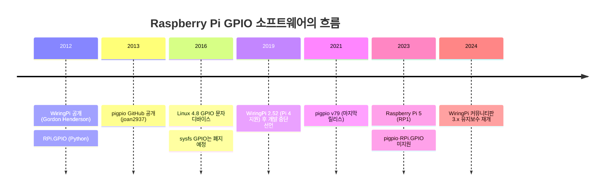
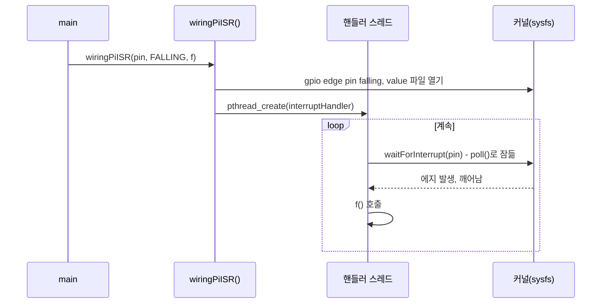

# 부록 B. GPIO 라이브러리의 변천과 WiringPi ↔ pigpio 대응

> **학습 목표**
> - WiringPi, sysfs, libgpiod, pigpio, RPi.GPIO, gpiozero가 등장하고 바뀐 과정을 설명하고, Raspberry Pi 4와 Pi 5에서 각각 어떤 라이브러리를 쓸 수 있는지 판단할 수 있다.
> - WiringPi 번호(wPi), BCM 번호, 물리 핀 번호를 서로 바꾸고, `gpio readall`이 하던 일을 `pinout`, `pinctrl`, pigpio 프로그램으로 대신할 수 있다.
> - WiringPi 함수에 대응하는 pigpio C 함수와 `pigs` 명령을 찾고, 의미가 달라지는 부분(PWM 범위, 블로킹 여부, 인터럽트 방식)을 설명할 수 있다.
> - 기존 강의의 WiringPi 예제를 pigpio로 옮기고, 원본에 있던 오류(공유 PWM 채널, 세마포어 예제의 논리 오류, 스레드 인자 수명, 바쁜 대기)를 찾아 고칠 수 있다.

이전 학기 강의 자료(「Raspberry Pi Codes」 §3~§4)의 C 예제는 대부분 **WiringPi**로 작성되었다. `pinMode()`, `digitalWrite()`, `delay()`처럼 아두이노와 같은 이름을 써서 배우기 쉬웠기 때문이다. 그러나 원작자가 2019년에 개발 중단을 선언했고, 이 교재는 정밀한 타이밍과 원격 제어를 지원하는 **pigpio**를 기본 라이브러리로 쓴다([8장](08_gpio_pigpio.md)). 지금도 인터넷 자료와 이전 학기 보고서에는 WiringPi 코드가 많다. 이 부록은 그런 코드를 읽고 pigpio로 옮길 수 있도록 라이브러리의 역사, 핀 번호 대응, 함수 대응표, 그리고 강의에서 쓴 **모든 WiringPi 예제의 pigpio 판**을 정리한다.

예제 코드는 [`code/appendix_b/`](code/appendix_b/)에 있다. `*_pigpio.c`가 pigpio 판이고, [`code/appendix_b/wiringpi/`](code/appendix_b/wiringpi/)에는 비교용으로 원본 WiringPi 코드를 그대로 두었다(머리말에 출처만 덧붙임). 8장에서 이미 옮긴 네 예제(`led_blink.c`, `button_led.c`, `led_sweep.c`, `led_blink_if2.c`)는 [`code/ch08/`](code/ch08/)에 있다.

> **핀 배치.** pigpio 판은 모두 책 전체에 하나뿐인 **표준 핀 계획**([부록 C.4](appendix_c_reference.md))을 따른다. LED는 8-LED 바 LED0~LED7 = GPIO {17, 27, 22, 23, 24, 25, 5, 6}, 버튼은 BTN0 = GPIO26 (물리 핀 37, 내부 풀업, 누르면 GND = active-low), 하드웨어 PWM·부저는 GPIO18, 서보는 GPIO13, DHT11/RHT03은 GPIO4이다. 원본 WiringPi 예제는 강의마다 핀을 제각각 썼으므로(LED를 SPI 핀에 달거나, 버튼을 3.3 V 쪽에 달고 풀다운으로 읽는 등) 그대로 옮기지 않고 이 계획에 맞춰 바꾸었다. 무엇을 어디로 옮겼는지는 B.4 표의 "원본 핀 → 교재 표준 핀" 열에 모아 두었다. `wiringpi/` 폴더의 원본은 역사 자료이므로 핀을 고치지 않았다.

## B.1 GPIO 라이브러리의 변천



연도는 각 프로젝트의 저장소·PyPI 릴리스 기록과 커널 문서를 기준으로 했다(📌 보강).

### B.1.1 WiringPi: 탄생, 중단, 이어받기

WiringPi는 Gordon Henderson이 만든 C 라이브러리이다. 아두이노의 "Wiring" 함수 이름(`pinMode`, `digitalWrite`, `digitalRead`, `delay`, `millis`)을 그대로 빌려 와 마이크로컨트롤러를 다뤄 본 사람이 곧바로 쓸 수 있었다. 라이브러리와 함께 `gpio`라는 명령줄 도구를 설치해 주었는데, 그중 `gpio readall`은 40핀 헤더의 상태를 한 표로 보여 주어 강의에서도 자주 썼다. 고유한 핀 번호 체계(wPi 번호, B.2절)를 쓴다는 점이 특징이자 혼란의 원인이었다.

> 📌 **보강: 개발 중단과 이어받기.** 원작자는 2019년 8월 6일 「wiringPi – deprecated…」라는 글에서, 직전에 Pi 4B를 지원하는 2.52를 낸 뒤 더 이상 공개 개발을 하지 않겠다고 밝혔다. 이유로는 라이브러리를 정적 링크한 제품의 지원 요청이 쏟아진 일, 다른 보드로 옮긴 판본에 대한 문의 등을 들었다(출처: [wiringpi.com, 2019-08-06, archive.org 사본](https://web.archive.org/web/2020/http://wiringpi.com/wiringpi-deprecated/)). 이후 GitHub의 [WiringPi/WiringPi](https://github.com/WiringPi/WiringPi) 저장소가 2.50 원본을 이어받아 3.x 판을 내고 있다. 저장소 README에 따르면 2024년부터 GC2가 유지보수를 맡아 새 OS와 Pi 5를 지원하며(Pi 5에서는 GPCLK 기능만 미지원), 2026년 9월 1일 3.20이 나왔다(출처: [WiringPi releases](https://github.com/WiringPi/WiringPi/releases)). 3.x의 인터럽트(`wiringPiISR`)는 sysfs 대신 GPIO 문자 디바이스(`/dev/gpiochipN`)를 쓴다. 강의 저장소의 `WiringPi-master`는 3.10이다.

따라서 "WiringPi는 단종되었다"는 말은 **원작자 판(2.x)에 대해서는 맞고, 커뮤니티 판(3.x)에 대해서는 맞지 않는다.** 강의 슬라이드의 "커뮤니티 지원 제한적(2023년으로 종료)"도 지금은 사실과 다르다. 그래도 이 교재가 pigpio를 쓰는 이유는 바뀌지 않는다. pigpio는 DMA로 **모든 GPIO에서 지터가 작은 PWM**과 서보 펄스를 만들고, <strong>알림 콜백에 μs 타임스탬프(tick)</strong>를 붙여 주며, 웨이브폼으로 임의 파형을 만들고, **pigpiod 데몬으로 원격 제어**까지 한 라이브러리에서 제공한다([9장](09_pigpio_advanced.md)). 이 기능들은 측정·통신 실습([10장](10_measurement.md), [12장](12_communication.md))의 바탕이 된다.

### B.1.2 sysfs에서 libgpiod로

리눅스가 GPIO를 사용자 공간에 처음 열어 준 방법은 **sysfs**(`/sys/class/gpio`)였다. 셸에서 `echo`만으로 핀을 다룰 수 있어 편했지만, 전역 번호 체계가 하드웨어 구성에 따라 바뀌고, 프로그램이 죽으면 핀이 export된 채 남는 문제가 있었다. Linux 4.8(2016)부터 커널은 **GPIO 문자 디바이스**(`/dev/gpiochipN`)를 제공하고 sysfs 방식은 폐지 예정(obsolete)으로 분류했다(📌 보강, 출처: [Linux kernel – GPIO Sysfs Interface (obsolete)](https://docs.kernel.org/userspace-api/gpio/sysfs.html), [GPIO Character Device Userspace API](https://docs.kernel.org/userspace-api/gpio/chardev.html)). 강의 슬라이드의 "2015년 이후부터 중단"은 이 흐름을 가리키지만, 실제로는 Raspberry Pi OS 커널에 sysfs가 아직 들어 있다. 다만 최근 커널은 sysfs 번호에 오프셋(예: 512)을 더하므로 옛 코드가 그대로는 동작하지 않는다([8.4절](08_gpio_pigpio.md)).

**libgpiod**는 문자 디바이스를 쓰기 쉽게 감싼 C 라이브러리이자 명령줄 도구 모음(`gpiodetect`, `gpioinfo`, `gpioset`, `gpioget`)이다. 커널이 "어느 줄(line)을 누가 쓰는지"를 관리하므로 두 프로그램이 같은 핀을 잡으면 두 번째가 `EBUSY`로 실패한다. root 권한이 필요 없고(`gpio` 그룹), Pi 5에서도 그대로 동작한다. 8장 실습 8-6에서 명령줄 도구를 써 보았으므로 여기서는 C API로 같은 LED를 점멸한다.

> 📌 **보강: libgpiod 버전.** Raspberry Pi OS Bookworm 저장소의 libgpiod는 1.6.x(v1 API)이다. libgpiod 2.x(현재 2.3 계열)는 API가 완전히 바뀌어 `gpiod_chip_get_line()` 대신 `gpiod_line_settings`, `gpiod_line_config`, `gpiod_line_request`를 조합한다. 인터넷 예제를 볼 때는 어느 판인지부터 확인한다. 출처: [libgpiod (kernel.org)](https://git.kernel.org/pub/scm/libs/libgpiod/libgpiod.git/)

### 실습 B-1. libgpiod C API로 LED 점멸

**목표**: 커널 문자 디바이스를 쓰는 libgpiod(v1) C API로 8장과 같은 LED를 점멸하고, 커널이 핀 소유권을 관리하는 모습을 확인한다.

**준비물**: Raspberry Pi 4, LED 1개, 330 Ω 저항 1개, 점퍼선, `libgpiod-dev` 패키지

**회로**

| 부품 | 연결 |
|---|---|
| LED 애노드(긴 다리) | 330 Ω을 거쳐 GPIO17 (물리 핀 11) |
| LED 캐소드(짧은 다리) | GND (물리 핀 9) |

실행 전에 같은 핀을 쓰는 pigpio 프로그램이나 pigpiod가 없어야 한다.

**코드** `code/appendix_b/led_blink_gpiod.c`

```c
/*
 * led_blink_gpiod.c : 부록 B  libgpiod(v1 API) C 라이브러리로 LED 점멸
 *
 * 회로 : GPIO17 (물리 핀 11) -> 330 Ω -> LED -> GND   (실습 8-2와 같다)
 * 준비 : sudo apt install libgpiod-dev      (Bookworm 저장소: libgpiod 1.6.x)
 * 빌드 : gcc -Wall -o led_blink_gpiod led_blink_gpiod.c -lgpiod
 * 실행 : ./led_blink_gpiod                  (gpio 그룹 사용자는 sudo 불필요)
 *
 * pigpio 판(8장 led_blink.c)과 비교
 *   gpioInitialise()        -> gpiod_chip_open_by_name("gpiochip0")   칩을 연다
 *   gpioSetMode(17, OUTPUT) -> gpiod_chip_get_line() + gpiod_line_request_output()
 *                              "이 줄(line)은 내가 쓴다"고 커널에 요청한다. 다른 프로그램이
 *                              이미 요청한 줄이면 EBUSY로 실패한다(커널이 소유권 관리).
 *   gpioWrite(17, v)        -> gpiod_line_set_value(line, v)
 *   gpioTerminate()         -> gpiod_line_release() + gpiod_chip_close()
 *   pigpio와 달리 /dev/mem을 쓰지 않으므로 root가 필요 없고, Pi 5에서도 동작한다.
 *   (Pi 5의 40핀 헤더는 커널 6.6.47 이후 gpiochip0, 그 전에는 gpiochip4 - gpiodetect로 확인)
 *
 * 주의 : libgpiod 2.x는 API가 완전히 바뀌었다(gpiod_line_request, gpiod_line_settings 등).
 *        이 파일은 Bookworm 기본 패키지인 1.6.x 기준이다.
 */
#include <stdio.h>
#include <signal.h>
#include <unistd.h>
#include <gpiod.h>

#define CHIP_NAME  "gpiochip0"
#define LED_LINE   17                    /* 칩 안의 오프셋 = BCM 번호 */

static volatile sig_atomic_t running = 1;

static void on_signal(int signum)
{
    (void)signum;
    running = 0;
}

int main(void)
{
    struct gpiod_chip *chip;
    struct gpiod_line *line;

    signal(SIGINT, on_signal);           /* libgpiod는 시그널을 대신 받아 주지 않는다 */

    chip = gpiod_chip_open_by_name(CHIP_NAME);
    if (!chip) {
        perror("gpiod_chip_open_by_name");
        return 1;
    }
    line = gpiod_chip_get_line(chip, LED_LINE);
    if (!line || gpiod_line_request_output(line, "led_blink_gpiod", 0) < 0) {
        perror("gpiod_line_request_output");   /* 다른 프로그램이 쓰고 있으면 EBUSY */
        gpiod_chip_close(chip);
        return 1;
    }

    printf("%s line %d LED 점멸 (Ctrl+C로 종료)\n", CHIP_NAME, LED_LINE);
    while (running) {
        gpiod_line_set_value(line, 1);
        usleep(500000);
        gpiod_line_set_value(line, 0);
        usleep(500000);
    }

    gpiod_line_set_value(line, 0);
    gpiod_line_release(line);            /* 줄을 놓으면 커널이 다른 사용자에게 줄 수 있다 */
    gpiod_chip_close(chip);
    printf("\n정상 종료\n");
    return 0;
}
```

**빌드·실행**

```bash
sudo apt install libgpiod-dev
gcc -Wall -o led_blink_gpiod led_blink_gpiod.c -lgpiod
./led_blink_gpiod
# 다른 터미널에서: 사용자(consumer) 이름이 보이는지 확인
gpioinfo gpiochip0 | grep -E "line +17:"
```

**결과 확인**: LED가 0.5초 간격으로 깜빡이고, `gpioinfo` 출력의 17번 줄에 `"led_blink_gpiod" output active-high [used]`처럼 사용자 이름과 출력 방향이 보이면 성공이다. 프로그램을 띄운 채 `gpioset gpiochip0 17=1`을 실행하면 `Device or resource busy`가 나는 것도 확인해 본다.

### B.1.3 Python 라이브러리: RPi.GPIO와 gpiozero

| 라이브러리 | 하는 일 | 현재 상태 (📌 보강) |
|---|---|---|
| **RPi.GPIO** | Python에서 `GPIO.setup()`, `GPIO.output()`으로 핀 제어. 레지스터 직접 접근 + sysfs 인터럽트 | 마지막 릴리스 0.7.1(2022-02). sysfs가 없는 커널·Pi 5에서는 쓸 수 없고, 같은 API를 **lgpio**(GPIO 문자 디바이스를 직접 쓰는 라이브러리) 위에 구현한 **rpi-lgpio**로 바꿔 설치한다(두 패키지는 동시에 설치할 수 없다) |
| **gpiozero** | `LED`, `Button`처럼 부품 단위 객체. 아래 "핀 팩토리(pin factory)"를 백엔드로 고른다 | 2.x 활발. 기본 시도 순서는 lgpio → RPi.GPIO → pigpio → native. **Pi 5에서는 lgpio만 동작**. 원격 GPIO는 pigpio 팩토리로 한다 |
| **lgpio** (C·Python) | pigpio 작성자가 만든 후속 라이브러리. GPIO 문자 디바이스 위에서 동작, `rgpiod` 데몬으로 원격 제어 | Pi 5 지원. pigpio와 함수 이름이 비슷하지만 같지는 않다 |

출처: [PyPI RPi.GPIO](https://pypi.org/project/RPi.GPIO/), [rpi-lgpio 문서](https://rpi-lgpio.readthedocs.io/), [gpiozero – API Pins](https://gpiozero.readthedocs.io/en/stable/api_pins.html), [lg (joan2937/lg)](https://github.com/joan2937/lg)

### B.1.4 Raspberry Pi 5와 pigpio

Pi 5는 GPIO가 SoC(BCM2712)가 아니라 별도의 I/O 칩 **RP1**에 있어 레지스터 주소와 구조가 다르다. pigpio는 BCM283x/2711 레지스터를 `/dev/mem`으로 직접 다루므로 Pi 5에서는 초기화 단계에서 멈춘다.

> 📌 **보강:** pigpio의 마지막 릴리스는 2021년 3월의 v79이며, Pi 5 지원 요청 이슈(#589 "pigpio will not run on a Pi 5", 2023-11-07 등록)는 아직 열려 있다. 출처: [pigpio releases](https://github.com/joan2937/pigpio/releases), [issue #589](https://github.com/joan2937/pigpio/issues/589)

Pi 5에서 C로 GPIO를 다루려면 **libgpiod**(실습 B-1), **lgpio**, **WiringPi 3.x** 중 하나를 쓴다. 이 교재의 실습은 Pi 4 기준이므로 pigpio를 그대로 쓴다.

### B.1.5 라이브러리 6종 비교

강의 슬라이드(「Raspberry Pi 실습」)의 비교표를 2026년 현재 상태로 고쳤다. **굵게** 표시한 칸이 슬라이드와 달라진 곳이고, 언어·하드웨어 접근·Pi 5 행은 새로 더했다.

| 특징 | RPi.GPIO | pigpio | gpiozero | WiringPi | RPIO | libgpiod |
|---|---|---|---|---|---|---|
| 언어 | Python | C, Python, 셸(`pigs`) | Python | C, 셸(`gpio`) | Python | C, C++, Python, 셸 |
| 하드웨어 접근 | 레지스터 직접 | 레지스터 직접 + DMA | 백엔드에 따름 | 레지스터 직접(3.x는 인터럽트에 문자 디바이스) | 레지스터 직접 + DMA | 커널 문자 디바이스 |
| 설치 용이성 | 높음 | 중간 | 높음(기본 설치) | 중간 | 중간 | 중간 |
| 사용 난이도 | 중간 | 높음 | 낮음 | 중간 | 중간 | 중간 |
| 성능 | 중간 | 높음 | 중간 | 높음 | 높음 | 높음 |
| 하드웨어 PWM | 미지원 | 지원 | 지원\* | 지원 | **DMA PWM** | 미지원(커널 PWM 드라이버 별도) |
| 원격 제어 | 미지원 | 지원(pigpiod) | 지원\*(pigpio 팩토리) | **제한적**(실험적 `wiringPiD`) | 미지원 | 미지원 |
| 개발 상태 | **정체(2022년 0.7.1 이후 릴리스 없음)** | **정체(2021년 v79 이후 릴리스 없음)** | 활성 | **커뮤니티 판 활성(3.x)** | 중단(2013년) | 활성 |
| Pi 5 | **미지원(rpi-lgpio로 대체)** | **미지원** | **lgpio 백엔드로 지원** | **지원(GPCLK 제외)** | 미지원 | 지원 |
| Python 3 | 지원 | 지원 | 지원 | 지원(별도 바인딩) | 제한적 | 지원 |

\* gpiozero는 핀 팩토리(백엔드)에 따라 기능이 달라진다.

고친 이유는 다음과 같다(모두 📌 보강).
- pigpio "활성" → 정체: 2021-03 v79 이후 릴리스가 없고 Pi 5 이슈가 열려 있다.
- WiringPi "중단" → 커뮤니티 판 활성: B.1.1. 원격 제어는 저장소의 `wiringPiD`(drcNet) 디렉터리가 있어 "제한적"으로 적었다.
- RPi.GPIO "활성" → 정체: PyPI의 마지막 릴리스가 0.7.1(2022-02-06)이다.
- RPIO: PyPI 마지막 릴리스가 0.10.0(2013-03)이다. Pi 1(BCM2835) 시절 라이브러리이므로 Pi 4에서의 동작을 기대하지 않는다. PWM은 PWM 주변장치 출력이 아니라 DMA로 만든 펄스이므로 "DMA PWM"으로 적었다.
- RPi.GPIO·gpiozero의 Pi 5 칸은 gpiozero 문서의 "Only lgpio works on the Pi 5"를 근거로 했다.

## B.2 핀 번호 체계 대응

| 체계 | 정하는 쪽 | 예 (같은 핀) | 쓰는 곳 |
|---|---|---|---|
| **물리 핀** | 40핀 헤더 위치 1~40 | 11 | 배선, `pinctrl -p`, `wiringPiSetupPhys()` |
| **BCM** | SoC의 GPIO 번호 | GPIO17 | pigpio, libgpiod, pinctrl, gpiozero, 커널, `wiringPiSetupGpio()` |
| **wPi** | WiringPi 고유 번호 | 0 | `wiringPiSetup()`, `gpio` 명령(`-g` 없이) |

wPi 번호는 "초창기 Model B에서 쓰기 쉬운 핀부터 0, 1, 2…"로 매긴 번호이다. 그래서 0~7은 연속이지만 BCM으로는 17, 18, 27, 22, 23, 24, 25, 4로 흩어진다. WiringPi 예제를 pigpio로 옮길 때는 **맨 먼저 이 표로 번호를 바꾼다.** 그러면 원본이 실제로 어느 핀을 썼는지 알 수 있다. 예를 들어 wPi 0~7을 쓴 원본은 BCM `{17, 18, 27, 22, 23, 24, 25, 4}`에 LED를 달았다.

그런데 이 교재의 표준 배선에서 GPIO18은 하드웨어 PWM·부저 자리이고 GPIO4는 DHT11/RHT03 자리이다. 그래서 이 부록의 pigpio 판은 번호를 바꾼 결과를 그대로 쓰지 않고 **"원본의 i번 LED → 교재 표준 LED i"** 로 옮겼다. 곧 wPi 0~7의 LED 8개는 8-LED 바 `{17, 27, 22, 23, 24, 25, 5, 6}`(물리 핀 11, 13, 15, 16, 18, 22, 29, 31)이 된다. 프로그램 안에서는 인덱스(LED 번호)와 핀 번호를 배열로 분리해 두었으므로, 배선이 다르면 배열 한 줄만 고치면 된다. 핀을 옮긴 예제와 그 이유는 B.4 표에 정리했다.

| wPi | BCM | 물리 핀 | 기본 기능 / `gpio readall` 이름 | wPi | BCM | 물리 핀 | 기본 기능 / 이름 |
|:-:|:-:|:-:|---|:-:|:-:|:-:|---|
| 0 | GPIO17 | 11 | GPIO.0 | 16 | GPIO15 | 10 | UART RXD |
| 1 | GPIO18 | 12 | GPIO.1, PWM0 | 21 | GPIO5 | 29 | GPIO.21 |
| 2 | GPIO27 | 13 | GPIO.2 | 22 | GPIO6 | 31 | GPIO.22 |
| 3 | GPIO22 | 15 | GPIO.3 | 23 | GPIO13 | 33 | GPIO.23, PWM1 |
| 4 | GPIO23 | 16 | GPIO.4 | 24 | GPIO19 | 35 | GPIO.24, PWM1 |
| 5 | GPIO24 | 18 | GPIO.5 | 25 | GPIO26 | 37 | GPIO.25 |
| 6 | GPIO25 | 22 | GPIO.6 | 26 | GPIO12 | 32 | GPIO.26, PWM0 |
| 7 | GPIO4 | 7 | GPIO.7, GPCLK0 | 27 | GPIO16 | 36 | GPIO.27 |
| 8 | GPIO2 | 3 | I2C1 SDA | 28 | GPIO20 | 38 | GPIO.28 |
| 9 | GPIO3 | 5 | I2C1 SCL | 29 | GPIO21 | 40 | GPIO.29 |
| 10 | GPIO8 | 24 | SPI0 CE0 | 30 | GPIO0 | 27 | ID_SD (HAT EEPROM) |
| 11 | GPIO7 | 26 | SPI0 CE1 | 31 | GPIO1 | 28 | ID_SC (HAT EEPROM) |
| 12 | GPIO10 | 19 | SPI0 MOSI | | | | |
| 13 | GPIO9 | 21 | SPI0 MISO | | | | |
| 14 | GPIO11 | 23 | SPI0 SCLK | | | | |
| 15 | GPIO14 | 8 | UART TXD | | | | |

- wPi 17~20(BCM 28~31)은 옛 Model B Rev 2의 P5 보조 헤더 핀으로 40핀 헤더에는 없다.
- 전원·GND 핀(1, 2, 4, 6, 9, 14, 17, 20, 25, 30, 34, 39)은 번호 체계와 무관하다([8.2절](08_gpio_pigpio.md)).
- 이 표는 WiringPi 소스의 `pinToGpioR2[]`(Pi 2 이후 40핀 보드용)와 대조했다.

### B.2.1 `gpio readall`을 대신하는 도구

| 도구 | 설치 | 보여 주는 것 | 비고 |
|---|---|---|---|
| `gpio readall` (WiringPi) | WiringPi 설치 필요 | BCM·wPi·이름·모드·레벨·물리 핀 | 3.x에서 Pi 5까지 지원 |
| `pinout` | 기본 설치(gpiozero) | 보드 그림 + 헤더 표(BCM·물리) | 현재 상태(모드·레벨)는 보여 주지 않는다 |
| `pinctrl` / `pinctrl -p` | 기본 설치(Bookworm) | 모드(ip/op/a0~a5), 풀(pu/pd/pn), 레벨 | 물리 핀 순서(`-p`) 지원, Pi 5 지원. [8.8절](08_gpio_pigpio.md) |
| `readall_pigpio` (이 부록) | pigpio | BCM·wPi·이름·모드·레벨·물리 핀 | 풀 상태는 읽지 못한다. pigpiod가 떠 있으면 실패 |

`readall_pigpio.c`는 `gpio readall`과 같은 모양의 표를 `gpioGetMode()`와 `gpioRead()`만으로 만든다. 핵심은 모드 번호를 이름으로 바꾸는 부분이다. pigpio의 모드 상수는 BCM2711의 GPFSEL 3비트 값을 그대로 쓰므로 ALT0이 4, ALT5가 2처럼 순서가 뒤섞여 있다.

```c
/* gpioGetMode()의 반환값 -> 이름 (pigpio.h: PI_INPUT 0, PI_OUTPUT 1, PI_ALT0 4 ...) */
static const char *mode_name(int m)
{
    static const char *names[8] = {
        "IN", "OUT", "ALT5", "ALT4", "ALT0", "ALT1", "ALT2", "ALT3"
    };
    return (m >= 0 && m < 8) ? names[m] : "?";
}
```

```bash
gcc -Wall -pthread -o readall_pigpio readall_pigpio.c -lpigpio -lrt
sudo ./readall_pigpio
pinctrl -p          # 결과 비교: 모드와 레벨이 같은지, 풀 상태는 pinctrl에서만 보인다
```

명령줄 도구끼리의 대응은 다음과 같다. `gpio`는 `-g`를 붙이면 BCM 번호, 붙이지 않으면 wPi 번호를 쓴다.

| 하려는 일 | WiringPi `gpio` | pigpio `pigs` (pigpiod 필요) | `pinctrl` |
|---|---|---|---|
| 출력으로 설정 | `gpio -g mode 17 out` (= `gpio mode 0 out`) | `pigs m 17 w` | `pinctrl set 17 op` |
| High 쓰기 | `gpio -g write 17 1` | `pigs w 17 1` | `pinctrl set 17 dh` |
| 읽기 | `gpio -g read 17` | `pigs r 17` | `pinctrl get 17` |
| 내부 풀업 | `gpio -g mode 26 up` | `pigs pud 26 u` | `pinctrl set 26 pu` |
| 내부 풀다운 | `gpio -g mode 26 down` | `pigs pud 26 d` | `pinctrl set 26 pd` |
| 토글 | `gpio -g toggle 17` | (없음) | (없음) |
| 하드웨어 PWM | `gpio -g mode 18 pwm` → `gpio -g pwm 18 512` | `pigs hp 18 1000 500000` | (모드만: `pinctrl set 18 a5`) |
| 전체 상태 | `gpio readall` | (없음) → `readall_pigpio` | `pinctrl -p` |

## B.3 API 대응표

아래 표의 pigpio 이름과 인자는 강의 저장소의 `Pigpio-master/pigpio.h`(v79)와 [pigpio C 인터페이스 문서](https://abyz.me.uk/rpi/pigpio/cif.html)로 확인했다. `pigs` 열의 명령은 **pigpiod 데몬이 떠 있을 때만** 쓸 수 있고, 데몬이 떠 있으면 `-lpigpio` 프로그램은 `Can't lock /var/run/pigpio.pid`로 실패한다. 한 번에 둘 중 하나만 쓴다([8.5절](08_gpio_pigpio.md)).

### B.3.1 초기화·모드·디지털 입출력

| WiringPi | pigpio C | pigs | 비고 |
|---|---|---|---|
| `wiringPiSetup()` / `wiringPiSetupGpio()` / `wiringPiSetupPhys()` | `gpioInitialise()` | (데몬 시작: `sudo systemctl start pigpiod`) | pigpio는 BCM 번호만 쓴다. 반환값이 음수면 실패. 끝낼 때 `gpioTerminate()` |
| `wiringPiSetupSys()` | (없음) | — | sysfs 방식. 쓰지 않는다 |
| (없음, 종료 처리 없음) | `gpioTerminate()` | — | DMA·메모리·스레드를 정리한다. 반드시 부른다 |
| `pinMode(pin, INPUT/OUTPUT)` | `gpioSetMode(gpio, PI_INPUT/PI_OUTPUT)` | `m g r` / `m g w` | ALT 기능은 `PI_ALT0`~`PI_ALT5` (`m g 0`~`5`) |
| `pinMode(pin, PWM_OUTPUT)` | (불필요) `gpioHardwarePWM()`이 ALT 모드로 바꾼다 | — | B.3.2 |
| `pinMode(pin, GPIO_CLOCK)` + `gpioClockSet(pin, f)` | `gpioHardwareClock(gpio, f)` | `hc g f` | GPCLK 핀(GPIO4 등)만 |
| — | `gpioGetMode(gpio)` | `mg g` | 현재 모드 읽기(B.2.1) |
| `pullUpDnControl(pin, PUD_UP/PUD_DOWN/PUD_OFF)` | `gpioSetPullUpDown(gpio, PI_PUD_UP/PI_PUD_DOWN/PI_PUD_OFF)` | `pud g u/d/o` | 강의 자료의 `gpioSetPullUpDn`은 없는 이름이다 |
| `digitalRead(pin)` | `gpioRead(gpio)` | `r g` | |
| `digitalWrite(pin, v)` | `gpioWrite(gpio, v)` | `w g v` | |
| `digitalWriteByte(v)` | `gpioWrite_Bits_0_31_Set(m)` / `_Clear(m)` | `bs1 m` / `bc1 m` | pigpio는 비트마스크로 여러 핀을 한 번에. 읽기는 `gpioRead_Bits_0_31()` (`br1`) |
| `piBoardRev()`, `wiringPiVersion()` | `gpioHardwareRevision()`, `gpioVersion()` | `hwver`, `pigpv` | |

### B.3.2 PWM·톤·서보

| WiringPi | pigpio C | pigs | 비고 |
|---|---|---|---|
| `pwmSetMode(PWM_MODE_MS)` | (항상 mark-space) | — | |
| `pwmWrite(pin, 0~1024)` (하드웨어) | `gpioHardwarePWM(gpio, freq, 0~1000000)` | `hp g f d` | GPIO12/13/18/19만. **12와 18, 13과 19는 같은 채널**이라 주파수·듀티를 공유한다. 듀티는 백만 분율 |
| `pwmSetRange(r)`, `pwmSetClock(d)` | (주파수를 Hz로 직접 지정) | — | 실제 단계 수는 BCM2711에서 375M/freq |
| `softPwmCreate(pin, init, range)` | `gpioSetPWMrange(gpio, range)` + `gpioSetPWMfrequency(gpio, f)` | `prs g r`, `pfs g f` | 아무 GPIO(0~31)에서 DMA PWM. 기본 범위 255, 기본 800 Hz |
| `softPwmWrite(pin, v)` | `gpioPWM(gpio, v)` | `p g v` | `p`는 듀티, `pfs`는 주파수이다 |
| `softPwmStop(pin)` | `gpioPWM(gpio, 0)` | `p g 0` | |
| `softToneCreate(pin)` + `softToneWrite(pin, f)` | `gpioHardwarePWM(gpio, f, 500000)` (정확, 4핀만) 또는 `gpioSetPWMfrequency` + `gpioPWM` (아무 핀, 주파수 18단계로 반올림) | `hp g f 500000` | B.4.15 |
| `softServoSetup()` + `softServoWrite()` | `gpioServo(gpio, 500~2500)` | `s g pw` | 펄스 폭을 μs로(0은 끔). 50 Hz로 갱신하며, 다른 주기는 PWM 함수로 만든다. [9장](09_pigpio_advanced.md) |

### B.3.3 시간

| WiringPi | pigpio C | pigs | 비고 |
|---|---|---|---|
| `delay(ms)` | `gpioDelay(ms * 1000)` 또는 `time_sleep(초)` | `mils ms` | `gpioDelay`는 100 μs 이하면 바쁜 대기, 넘으면 sleep |
| `delayMicroseconds(us)` | `gpioDelay(us)` | `mics us` | |
| `micros()` | `gpioTick()` | `t` | 부팅 후 μs, `uint32_t`라 약 72분마다 0으로 돌아간다 |
| `millis()` | `(uint32_t)(gpioTick() - start) / 1000` 또는 `time_time()` (초, `double`) | — | `gpioTick() / 1000`을 그대로 쓰면 넘어가는 순간 뺄셈이 틀린다. μs 차이를 먼저 구하고 나눈다 |

`gpioTick()`은 32비트이므로 72분마다 4294967295에서 0으로 넘어간다. 그래도 **두 시각의 차이를 `uint32_t` 뺄셈으로 구하면** 넘어가는 순간에도 올바른 값이 나온다. 대소 비교(`now > nextTime`)는 넘어가는 순간 틀리므로 쓰지 않는다. `serialTest_pigpio.c`는 다음처럼 비교한다.

```c
        /* 시각 비교는 뺄셈 결과를 부호 있는 수로 본다 -> 72분 랩어라운드에도 안전 */
        if ((int32_t)(gpioTick() - nextTime) >= 0) {
            printf("\nOut: %3d: ", count);
            fflush(stdout);
            serWriteByte(h, (unsigned)count);
            nextTime += 300000;
            ++count;
        }
```

### B.3.4 인터럽트·스레드·우선순위

| WiringPi | pigpio C | pigs | 비고 |
|---|---|---|---|
| `wiringPiISR(pin, INT_EDGE_FALLING, f)` | `gpioSetAlertFunc(gpio, f)` (권장) | `nb`, `no` (알림 파이프) | DMA가 5 μs마다 샘플링해 **모든 레벨 변화**를 tick과 함께 콜백으로 알린다. 에지는 콜백의 `level`로 거른다. 콜백 형태가 `void f(void)`에서 `void f(int gpio, int level, uint32_t tick)`로 바뀐다 |
| 〃 | `gpioSetISRFunc(gpio, FALLING_EDGE, timeout, f)` | — | 커널 인터럽트(sysfs) 사용. 지정한 에지만, 지연 약 50 μs. v79는 sysfs 번호 오프셋 문제로 최신 커널에서 실패할 수 있다 |
| (디바운스 직접 구현) | `gpioGlitchFilter(gpio, us)`, `gpioNoiseFilter()` | `fg g us`, `fn g s a` | 알림 콜백에만 적용된다 |
| `waitForInterrupt(pin, ms)` | `gpioSetISRFunc`의 timeout 또는 직접 구현(B.4.11) | — | 시간 초과 시 콜백의 level이 2(`PI_TIMEOUT`) |
| — | `gpioSetWatchdog(gpio, ms)` | `wdog g ms` | 변화가 없으면 주기적으로 level 2 콜백 |
| `PI_THREAD(f)` + `piThreadCreate(f)` | `pthread_create()` (11장) 또는 `gpioStartThread(f, arg)` | — | `gpioStopThread()`는 스레드를 강제 취소한다. 플래그로 끝내는 편이 안전 |
| `piLock(n)` / `piUnlock(n)` | `pthread_mutex_lock()` / `unlock()` | — | pigpio에 따로 없다 |
| `piHiPri(prio)` | `pthread_setschedparam()` / `sched_setscheduler()` (SCHED_FIFO), 셸은 `chrt` | — | pigpio는 DMA 샘플링이라 대부분 필요 없다 |

### B.3.5 I2C·SPI·시리얼·기타

| WiringPi | pigpio C | pigs | 비고 |
|---|---|---|---|
| `fd = wiringPiI2CSetup(addr)` | `h = i2cOpen(1, addr, 0)` | `i2co 1 addr 0` | 버스 번호(1)를 직접 준다. 닫기 `i2cClose(h)` |
| `wiringPiI2CRead(fd)` / `Write(fd, v)` | `i2cReadByte(h)` / `i2cWriteByte(h, v)` | `i2crs h` / `i2cws h v` | |
| `wiringPiI2CReadReg8(fd, r)` / `WriteReg8(fd, r, v)` | `i2cReadByteData(h, r)` / `i2cWriteByteData(h, r, v)` | `i2crb h r` / `i2cwb h r v` | |
| `wiringPiI2CReadReg16` / `WriteReg16` | `i2cReadWordData` / `i2cWriteWordData` | `i2crw` / `i2cww` | [12장](12_communication.md) |
| `wiringPiSPISetup(ch, speed)` / `SetupMode(ch, speed, mode)` | `h = spiOpen(ch, baud, flags)` | `spio c b f` | 모드는 flags 하위 2비트 |
| `wiringPiSPIDataRW(ch, buf, len)` | `spiXfer(h, tx, rx, len)` | `spix h ...` | WiringPi는 **한 버퍼를 덮어쓰고**, pigpio는 보낼 버퍼와 받을 버퍼를 따로 준다 |
| `fd = serialOpen("/dev/ttyAMA0", baud)` | `h = serOpen("/dev/serial0", baud, 0)` | `sero dev b 0` | 장치 이름은 `/dev/serial0` 권장. 인자 형식이 `char *`라 문자열 상수 대신 배열을 넘긴다 |
| `serialPutchar(fd, c)` / `serialPuts(fd, s)` | `serWriteByte(h, c)` / `serWrite(h, s, strlen(s))` | `serwb h c` / `serw h ...` | |
| `serialDataAvail(fd)` | `serDataAvailable(h)` | `serda h` | |
| `serialGetchar(fd)` | `serReadByte(h)` | `serrb h` | WiringPi는 데이터가 없으면 **최대 10초 기다리고**, pigpio는 **바로** 음수(`PI_SER_READ_NO_DATA`)를 돌려준다 |
| `serialClose(fd)` | `serClose(h)` | `serc h` | |
| `shiftOut(d, c, order, v)` / `shiftIn` | (없음) `gpioWrite` 비트뱅 루프, 또는 `bbSPIOpen`/`bbSPIXfer` | — | 74HC595 등 |
| `lcdInit()`, `lcdPuts()` … (devLib) | (없음) | — | I2C 백팩(PCF8574) LCD는 [12장](12_communication.md) |
| `readRHT03()` (devLib maxdetect) | (없음) 알림 콜백으로 직접 구현 | — | B.4.16 |

## B.4 예제 대응 목록

| # | 원본 예제 (WiringPi) | 원본 위치 | pigpio 판 | 원본 핀 → 교재 표준 핀 | 다루는 장 |
|:-:|---|---|---|---|---|
| 1 | `blink.c` (= `led_onoff.c`) | Codes §4.1.1, `WiringPi/led_onoff.c` | [`ch08/led_blink.c`](code/ch08/led_blink.c) | wPi 0 (GPIO17) → LED0 GPIO17 (그대로) | 8장 실습 8-2 |
| 2 | `blink8.c` | Codes §4.1.2 | [`blink8_pigpio.c`](code/appendix_b/blink8_pigpio.c) | wPi 0~7 (GPIO17·18·27·22·23·24·25·4) → LED0~7 (GPIO17·27·22·23·24·25·5·6) | 8장(부록) |
| 3 | `blink_sweep.c` | Codes §4.1.3 | [`ch08/led_sweep.c`](code/ch08/led_sweep.c) | wPi 0~7 → LED0~7 (2번과 같다) | 8장 실습 8-4 |
| 4 | `blink12.c` | Codes §4.1.4 | [`blink12_pigpio.c`](code/appendix_b/blink12_pigpio.c) | wPi 0~7 + 10~13 (SPI0 GPIO8·7·10·9) 12개 → LED0~7 8개. SPI0 핀은 MCP3008 자리라 뺐다 | 8장(부록) |
| 5 | `blink_thread.c` | Codes §4.1.5 | [`blink_thread_pigpio.c`](code/appendix_b/blink_thread_pigpio.c) | wPi 0 (GPIO17) → LED0 GPIO17 (그대로) | 11장 |
| 6 | `blink_thread2.c` | Codes §4.1.5 | [`blink_thread2_pigpio.c`](code/appendix_b/blink_thread2_pigpio.c) | wPi 0·1 (GPIO17·18) → LED0·LED1 (GPIO17·27) | 11장 |
| 7 | `sharedCounter.c` | Codes §4.1.6, `Codes/` | [`sharedCounter_pigpio.c`](code/appendix_b/sharedCounter_pigpio.c) | GPIO 안 씀 | 11장 |
| 8 | `semaphore_led.c` | Codes §4.1.7, `Codes/` | [`semaphore_led_pigpio.c`](code/appendix_b/semaphore_led_pigpio.c) (오류 수정) | LED wPi 0·1·2 (GPIO17·18·27) → LED0·1·2 (GPIO17·27·22). 버튼 wPi 3 (GPIO22, 3.3 V 쪽·풀다운·누르면 1) → BTN0 GPIO26 (GND 쪽·풀업·누르면 0) | 11장 |
| 9 | `pullupdown.c` | Codes §4.2.1 | [`pullupdown_pigpio.c`](code/appendix_b/pullupdown_pigpio.c) | wPi 0 (GPIO17, 빈 핀) → BTN0 GPIO26 (GPIO17은 LED0이라 결과가 달라진다) | 8장(과제 8-3) |
| 10 | `gpio_read.c` | Codes §4.2.2 | [`ch08/button_led.c`](code/ch08/button_led.c) | 입력 wPi 0 (GPIO17, 풀다운) → BTN0 GPIO26 (풀업). 출력 wPi 1 (GPIO18) → LED0 GPIO17 | 8장 실습 8-3 |
| 11 | `speed.c` | Codes §4.2.3 | [`speed_pigpio.c`](code/appendix_b/speed_pigpio.c) | wPi 0 = BCM 17 = 물리 11 → LED0 GPIO17 (그대로) | 10장 |
| 12 | `gpio readall` (`gpio.c`, `readall.c`) | Codes §4.3 | [`readall_pigpio.c`](code/appendix_b/readall_pigpio.c) | 모든 핀을 읽기만 한다 (해당 없음) | 부록 B.2.1 |
| 13 | `isr.c` | Codes §4.4.1 | [`isr_pigpio.c`](code/appendix_b/isr_pigpio.c) | 입력 wPi 0~7 8개 (풀다운) → BTN0 GPIO26 하나 (풀업). 여러 핀을 다루는 구조는 유지 | 9장 |
| 14 | `wiringPiISR.c` (라이브러리 내부) | Codes §4.4.2 | [`wiringPiISR_pigpio.c`](code/appendix_b/wiringPiISR_pigpio.c) | (발췌본이라 핀 없음) → BTN0 GPIO26 (풀업) | 9장, 11장 |
| 15 | `serialTest.c` | Codes §4.5 | [`serialTest_pigpio.c`](code/appendix_b/serialTest_pigpio.c) | UART GPIO14/15 (그대로) | 12장 |
| 16 | `serialTest2.c` | Codes §4.5 | [`serialTest2_pigpio.c`](code/appendix_b/serialTest2_pigpio.c) | UART GPIO14/15 (그대로) | 12장 |
| 17 | `pwm1.c` | Codes §4.6.1 | [`pwm1_pigpio.c`](code/appendix_b/pwm1_pigpio.c) (오류 수정) | GPIO12·18 (PWM0), GPIO13 (PWM1) → GPIO18 (PWM0), GPIO13 (PWM1, 서보 대신 LED). GPIO12의 고정 밝기 LED → LED0 GPIO17 (DMA PWM) | 9장 |
| 18 | `softpwm.c` | Codes §4.6.2 | [`softpwm_pigpio.c`](code/appendix_b/softpwm_pigpio.c) | wPi 0~7 → LED0~7 (2번과 같다) | 9장 |
| 19 | `softTone.c` | Codes §4.6.3 | [`softTone_pigpio.c`](code/appendix_b/softTone_pigpio.c) | wPi 3 (GPIO22) → 부저 GPIO18 (두 빌드 모두) | 9장 |
| 20 | `rht03.c` | Codes §9.2.3 | [`rht03_pigpio.c`](code/appendix_b/rht03_pigpio.c) | wPi 7 (GPIO4) → GPIO4 (그대로) | 9장 |
| 21 | `dht11.c` | Codes §9.3.2 | [`dht11_pigpio.c`](code/appendix_b/dht11_pigpio.c) | wPi 29 (GPIO21) → GPIO4 (GPIO21은 HC-SR04 ECHO 자리) | 9장 |
| — | (WiringPi 원본 없음) | — | [`ch08/led_blink_if2.c`](code/ch08/led_blink_if2.c), [`led_blink_gpiod.c`](code/appendix_b/led_blink_gpiod.c) | LED0 GPIO17 | 8장 실습 8-5, 부록 실습 B-1 |

"Codes §"는 강의 자료 「Raspberry Pi Codes」의 절 번호이다. 원본은 모두 [`code/appendix_b/wiringpi/`](code/appendix_b/wiringpi/)에 같은 이름으로 있다.

핀을 옮긴 원칙은 세 가지이다. ① **한 핀 = 한 역할.** 원본이 LED로 쓴 SPI0 핀(GPIO7~10), PWM 핀(GPIO12·18), 센서 핀(GPIO4·21)은 다른 실습의 장치 자리이므로 LED를 8-LED 바로 모은다. ② **입력은 BTN0 하나.** 원본은 버튼을 3.3 V 쪽에 달고 내부 풀다운으로 읽어 누르면 1(active-high)이었다. 교재는 8장 실습 8-3처럼 버튼을 GND 쪽에 달고 내부 풀업으로 읽으므로 누르면 0(active-low)이다. 그래서 "눌림"을 찾는 코드는 상승 에지(0→1) 대신 **하강 에지(1→0)** 를 본다. ③ **하드웨어 PWM은 채널마다 한 핀**: PWM0은 GPIO18, PWM1은 GPIO13만 쓴다(B.4.13).

pigpio 판은 모두 8장의 골격을 따른다. `gpioInitialise()`의 반환값을 확인하고, 계속 도는 예제는 `gpioSetSignalFunc(SIGINT, …)`로 Ctrl+C를 플래그(`volatile sig_atomic_t`)로 받아 루프를 끝낸 뒤 출력 핀을 끄고 입력으로 되돌리고 `gpioTerminate()`를 부른다(곧바로 끝나는 `readall_pigpio.c`, `sharedCounter_pigpio.c`는 시그널 처리 없이 `gpioTerminate()`만 부른다). WiringPi 원본에는 이 종료 처리가 없어 Ctrl+C 뒤에 LED가 켜진 채 남는 일이 많았다. 아래에서는 이 공통 부분을 빼고 **달라지는 곳**만 비교한다.

### B.4.1 blink.c, gpio_read.c, blink_sweep.c → 8장

세 예제는 8장 실습에서 이미 옮겼다. 바뀐 점만 요약한다.

| 원본 | pigpio 판 | 바뀐 점 |
|---|---|---|
| `blink.c` / `led_onoff.c` | `ch08/led_blink.c` | wPi 0 → GPIO17, `delay(500)` → `gpioDelay(500000)`, Ctrl+C 정리 추가 |
| `gpio_read.c` | `ch08/button_led.c` | 풀다운·active-high(입력 wPi 0) → 풀업·active-low(GPIO26). 매 루프 출력 → 바뀔 때만 출력, 5 ms 폴링으로 CPU 100% 문제 해결 |
| `blink_sweep.c` | `ch08/led_sweep.c` | `for (i = 0; i < 8; i++) pinMode(i, …)` → BCM 번호 배열. 지연을 명령줄 인자로 |

### B.4.2 blink8.c

LED 8개를 차례로 켜서 모두 켠 다음 차례로 끈다. 원본은 wPi 번호 0~7이 연속이라는 점을 이용해 `for` 문의 변수 `led`를 그대로 핀 번호로 썼다.

**원본** `wiringpi/blink8.c`

```c
  for (;;)
  {
    for (led = 0 ; led < 8 ; ++led)
    {
      digitalWrite (led, 1) ;
      delay (100) ;
    }

    for (led = 0 ; led < 8 ; ++led)
    {
      digitalWrite (led, 0) ;
      delay (100) ;
    }
  }
```

**pigpio** `blink8_pigpio.c`

```c
/*                         LED:   0   1   2   3   4   5   6   7 */
/*                     물리 핀:  11  13  15  16  18  22  29  31 */
static const unsigned leds[] = { 17, 27, 22, 23, 24, 25,  5,  6 };
```

```c
    while (running) {
        for (i = 0; i < N_LEDS && running; i++) {   /* 하나씩 켜서 모두 켠다 */
            gpioWrite(leds[i], 1);
            gpioDelay(STEP_US);
        }
        for (i = 0; i < N_LEDS && running; i++) {   /* 하나씩 끈다 */
            gpioWrite(leds[i], 0);
            gpioDelay(STEP_US);
        }
    }
```

- 인덱스 `i`와 핀 번호 `leds[i]`를 분리했다. 배선을 바꾸면 배열만 고친다.
- 원본의 wPi 0~7(GPIO17, 18, 27, 22, 23, 24, 25, 4)을 그대로 옮기지 않고 교재 표준 8-LED 바(LED0~LED7)에 연결한다(B.2). 원본의 i번째 LED가 LED i가 되므로 켜지는 순서는 같다.
- 안쪽 루프에도 `&& running`을 넣어 Ctrl+C에 1초 안에 반응하게 했다.

### B.4.3 blink12.c

LED를 데이터 표 `{LED, 상태, 지속시간}`으로 움직이는 시퀀서이다. 동작을 코드가 아니라 **표(데이터)** 로 정의하므로, 패턴을 바꿀 때 루프는 건드리지 않고 표만 고친다.

원본은 LED 12개를 wPi 0~7, 그다음 wPi 11, 10, 13, 12 순서로 연결했다. 뒤의 네 개(wPi 10~13 = GPIO8·7·10·9)는 **SPI0 핀**이다. 교재 표준 배선에서 SPI0은 [12장](12_communication.md)의 MCP3008이 쓰므로(한 핀 = 한 역할) LED를 달 수 없다. 그래서 pigpio 판은 LED를 8-LED 바 8개로 줄이고 표도 LED 번호 0~7로 다시 썼다. "다음 LED를 켜고 0.1초 뒤 이전 LED를 끈다"(두 개가 겹쳐 켜진 채 흐르는) 원본의 패턴, 끝에서 한 번 쉬고 되돌아오는 흐름은 같다.

**원본** `wiringpi/blink12.c` (앞부분)

```c
int data[] =
    {
        0, 1, 1, 1, 1, 1,
        0, 0, 0, 2, 1, 1,
        1, 0, 0, 3, 1, 1,
```

**pigpio** `blink12_pigpio.c`

```c
/* LED 번호 -> BCM 번호 (교재 표준 8-LED 바) */
/*  LED:                        0   1   2   3   4   5   6   7 */
/*  물리 핀:                   11  13  15  16  18  22  29  31 */
static const unsigned leds[] = {17, 27, 22, 23, 24, 25,  5,  6};
```

```c
        gpioWrite(leds[l], s);
        gpioDelay(d * 100000);  /* delay(d * 100) ms -> us */
```

- 표의 숫자는 핀 번호가 아니라 **LED 번호**이다. 출력할 때 `leds[]`로 BCM 번호로 바꾸므로, 원본처럼 "wPi 번호 = LED 번호"라는 우연에 기대지 않는다.
- 원본은 wPi 0~13을 모두 출력으로 만들었다. 그러면 쓰지도 않는 wPi 8·9(GPIO2·3, I2C)와 SPI0 핀까지 출력이 되어, 그 핀에 달린 장치(DS3231, MCP3008 등)와 충돌한다. pigpio 판은 실제로 쓰는 8개만 출력으로 설정한다.

### B.4.4 blink_thread.c, blink_thread2.c

WiringPi의 `PI_THREAD(blinky)`는 `void *blinky(void *dummy)` 함수를 선언하는 매크로이고, `piThreadCreate(blinky)`는 내부에서 `pthread_create()`를 부른다. 그러니 [11장](11_process_concurrency.md)에서 배우는 POSIX 스레드를 그대로 쓰면 된다.

**원본** `wiringpi/blink_thread.c`

```c
PI_THREAD (blinky)
{
  for (;;)
  {
    digitalWrite (LED, HIGH) ; // On
    delay (500) ;  // mS
    digitalWrite (LED, LOW) ; // Off
    delay (500) ;
  }
}
```

**pigpio** `blink_thread_pigpio.c`

```c
static void *blinky(void *arg)
{
    (void)arg;
    while (running) {
        gpioWrite(LED_GPIO, 1);          /* On */
        gpioDelay(500000);               /* 500 ms */
        gpioWrite(LED_GPIO, 0);          /* Off */
        gpioDelay(500000);
    }
    return NULL;
}
```

```c
    if (pthread_create(&th, NULL, blinky, NULL) != 0) {   /* piThreadCreate(blinky) */
        fprintf(stderr, "스레드 생성 실패\n");
        gpioTerminate();
        return 1;
    }
```

- 원본의 스레드는 무한 루프라 끝낼 방법이 없다. pigpio 판은 `running` 플래그를 보고 스스로 빠져나오고, main은 `pthread_join()`으로 기다린 뒤 LED를 끈다.
- pigpio의 `gpioStartThread(f, arg)` / `gpioStopThread(th)`도 같은 일을 한다. 다만 `gpioStopThread`는 스레드를 강제로 취소(`pthread_cancel`)하므로 LED가 켜진 상태에서 멈출 수 있다.

`blink_thread2.c`는 핀과 주기만 다른 스레드 함수 두 개(`blinky`, `blinky2`)를 만들었다. pigpio 판은 함수 하나에 "핀과 반주기"를 인자로 넘긴다.

```c
static const struct blink_arg args[2] = {
    { 17, 10000 },                       /* LED0: 물리 핀 11 (원본 wPi 0), 10 ms */
    { 27, 20000 },                       /* LED1: 물리 핀 13 (원본 wPi 1), 20 ms */
};
```

원본의 두 번째 LED는 wPi 1 = GPIO18이었다. GPIO18은 교재 표준 배선에서 하드웨어 PWM·부저 자리이므로 8-LED 바의 LED1(GPIO27)로 옮겼다.

```c
        pthread_create(&th[i], NULL, blinky, (void *)&args[i]);
```

스레드 인자로 **지역 변수의 주소를 넘기면 안 된다.** 스레드가 실행되기 전에 그 변수가 바뀌거나(반복문의 `i`) 사라질(함수 반환) 수 있다. 여기서는 프로그램이 끝날 때까지 살아 있는 `static const` 배열 원소의 주소를 넘겼다.

### B.4.5 sharedCounter.c

두 스레드가 전역 변수를 10만 번씩 증가시키며 뮤텍스의 필요성을 보여 준다. GPIO는 쓰지 않고, `delayMicroseconds(1)`만 `gpioDelay(1)`로 바꾸면 된다. pigpio 판에는 뮤텍스를 끄는 `nolock` 옵션을 더해 두 결과를 비교할 수 있게 했다.

```c
        if (use_lock)
            pthread_mutex_lock(&lock);       /* === 임계 구역 진입 === */

        int temp = sharedCounter;            /* 읽고 */
        temp = temp + 1;                     /* 고치고 */
        gpioDelay(1);                        /* 하드웨어 접근 같은 미세 지연 흉내 */
        sharedCounter = temp;                /* 쓴다 */

        if (use_lock)
            pthread_mutex_unlock(&lock);     /* === 임계 구역 탈출 === */
```

```bash
sudo ./sharedCounter_pigpio          # 결과: 성공 (200000)
sudo ./sharedCounter_pigpio nolock   # 결과: 실패 - 몇 회가 손실되는지 기록
```

원본 `Codes/sharedCounter.c`는 `delayMicroseconds(1)`의 주석이 풀려 있고, 「Raspberry Pi Codes」 문서에는 주석 처리되어 있다. 지연이 있으면 임계 구역이 길어져 충돌이 훨씬 잦아진다. 결과 해석은 11장에서 다룬다.

### B.4.6 semaphore_led.c (오류 수정)

버튼을 누를 때마다 스레드를 만들고, 세마포어(초기값 2)로 "동시에 켜지는 LED는 최대 2개"를 보장하려는 예제이다. 원본에는 의도와 다른 부분이 있다.

**원본** `wiringpi/semaphore_led.c`

```c
    sem_wait(&sem_led);

    // --- 여기부터는 허용된 스레드만 진입 가능 (최대 2명) ---
    
    printf("  >> [진입] %d번 스레드: 자원을 획득했습니다! LED ON\n", thread_id);

    // 가상의 '사용 가능한' LED를 찾아 켜는 로직
    // (단순화를 위해 실제 핀 제어는 모든 핀을 켜는 척하거나 랜덤하게 수행)
    // 여기서는 시각적 확인을 위해 모든 LED 핀에 신호를 주지만,
    // 실제로는 물리적으로 2개만 켜지도록 제한하는 논리적 구역임.
    digitalWrite(LED_1, HIGH); 
    digitalWrite(LED_2, HIGH);
    
    // 3초간 점등 (자원 점유 시간)
    sleep(3);

    digitalWrite(LED_1, LOW);
    digitalWrite(LED_2, LOW);
```

1. **LED_3을 한 번도 켜지 않는다.** 모든 스레드가 LED_1과 LED_2를 **함께** 켜고 끈다. 스레드가 하나 들어와도 둘 들어와도 LED 모양이 같으므로 세마포어의 효과가 보이지 않는다. 더구나 먼저 끝난 스레드가 LED를 끄면 아직 3초가 지나지 않은 다른 스레드의 LED도 꺼진다.
2. `int *` 인자를 `malloc`으로 넘긴 것은 올바르지만(지역 변수 주소 문제를 피함), 정수 하나라면 값 자체를 포인터 크기 정수로 넘기는 편이 간단하다.
3. 종료 처리가 없다. 분리(detach)된 스레드가 GPIO를 쓰는 중에 프로그램이 끝날 수 있다.

pigpio 판은 LED 3개를 **자리(slot)** 로 본다. 세마포어를 통과한 스레드는 빈 자리 하나를 골라 **그 LED만** 켠다. 자리는 3개지만 세마포어가 2이므로 켜진 LED는 언제나 2개 이하이고, 세 번째 요청은 앞의 하나가 반납할 때까지 기다린다. 빈 자리는 지난번에 고른 자리의 다음부터 돌아가며 찾는다. 늘 첫 번째 빈 자리를 고르면 반납이 `sem_post()`보다 먼저 일어나므로 LED0과 LED1만 번갈아 쓰이고 세 번째 LED(LED2, GPIO22)는 한 번도 켜지지 않는다(자세한 설명은 [11장 실습 11-6](11_process_concurrency.md)). 빈 자리를 고르는 일도 공유 자원을 건드리므로 뮤텍스로 보호한다. 세마포어는 "몇 개까지", 뮤텍스는 "한 번에 하나만"이라는 차이가 코드에 그대로 드러난다.

**pigpio** `semaphore_led_pigpio.c`

```c
    sem_wait(&sem_led);                  /* P 연산: 자리가 없으면 여기서 잠든다 */

    if (atomic_load(&running)) {
        pthread_mutex_lock(&slot_lock);  /* 빈 LED 고르기 (임계 구역) */
        for (i = 0; i < N_SLOTS; i++) {
            int s = (next_slot + i) % N_SLOTS;   /* 지난번 다음 자리부터 돌아가며 */
            if (!slot_busy[s]) {
                slot_busy[s] = 1;
                slot = s;
                next_slot = (s + 1) % N_SLOTS;
                break;
            }
        }
        pthread_mutex_unlock(&slot_lock);

        printf("  >> [진입] %d번 스레드: LED%d(GPIO%u) ON\n", id, slot, slot_gpio[slot]);
        gpioWrite(slot_gpio[slot], 1);
        for (i = 0; i < ON_TIME_STEPS && atomic_load(&running); i++)
            gpioDelay(100000);
        gpioWrite(slot_gpio[slot], 0);

        pthread_mutex_lock(&slot_lock);
        slot_busy[slot] = 0;
        pthread_mutex_unlock(&slot_lock);
        printf("  << [반납] %d번 스레드: LED%d OFF\n", id, slot);
    }
    sem_post(&sem_led);                  /* V 연산: 자리 반납, 대기 스레드 하나를 깨움 */
```

```c
            if (pthread_create(&t_id, NULL, blinkTask, (void *)(intptr_t)task_count) == 0) {
                pthread_detach(t_id);              /* 끝나면 자원을 스스로 회수 */
            } else {
                printf("스레드 생성 실패!\n");
                pthread_mutex_lock(&count_lock);
                outstanding--;
                pthread_mutex_unlock(&count_lock);
            }
```

- 종료할 때는 `running`을 0으로 바꾼 뒤(여러 스레드가 읽으므로 `atomic_int`로 둔다) 남은 스레드 수(`outstanding`)가 0이 될 때까지 기다리고 나서 `gpioTerminate()`를 부른다. 점등 중인 스레드는 100 ms 안에 LED를 끄고 `sem_post()`를 하고, 그 신호로 깨어난 대기 스레드는 `running`이 0인 것을 보고 바로 빠져나온다.
- **핀을 교재 표준 배선으로 옮겼다.** LED는 원본의 wPi 0·1·2(GPIO17·18·27) 대신 8-LED 바의 LED0·LED1·LED2 = GPIO17 (물리 핀 11), GPIO27 (물리 핀 13), GPIO22 (물리 핀 15)이다. 버튼은 원본의 "3.3 V–버튼–GPIO22, 내부 풀다운, 누르면 1" 대신 BTN0 = GPIO26 (물리 핀 37)–버튼–GND, 내부 풀업, **누르면 0**(active-low)이다.
- 그래서 "눌리는 순간"을 찾는 조건이 `level == 1 && last == 0`(상승 에지)에서 `level == 0 && last == 1`(하강 에지)로 바뀐다. `last`의 처음 값은 1로 못 박지 않고, 풀업을 켜고 1 ms 기다린 뒤 실제로 읽은 값으로 둔다. GPIO26의 리셋 기본값은 풀다운이라 풀업을 켠 직후에는 아직 0이 읽힐 수 있고, 그러면 시작하자마자 버튼이 한 번 눌린 것으로 잘못 셀 수 있기 때문이다.

```c
    gpioSetPullUpDown(BUTTON_GPIO, PI_PUD_UP);     /* 원본 PUD_DOWN -> 풀업(active-low) */
    gpioDelay(1000);                               /* 1 ms: 풀업이 핀을 끌어올릴 시간 */
    last = gpioRead(BUTTON_GPIO);                  /* 시작 레벨을 실제로 읽어 둔다 */
```

### B.4.7 pullupdown.c

아무것도 연결하지 않은 입력 핀에 내부 풀업과 풀다운을 번갈아 켜며 읽는다. 코드는 함수 이름만 바꾸면 되고, 핀은 아래처럼 BTN0으로 옮겼다.

**원본** `wiringpi/pullupdown.c`

```c
        pullUpDnControl(INPUT_PIN, PUD_UP);
        printf("digitalRead (INPUT_PIN) : %d\n", digitalRead(INPUT_PIN));
```

**pigpio** `pullupdown_pigpio.c`

```c
        gpioSetPullUpDown(INPUT_GPIO, PI_PUD_UP);
        gpioDelay(1000);                 /* 1 ms: 풀업이 핀 전압을 끌어올릴 시간 */
        printf("PUD_UP   -> gpioRead(%d) : %d\n", INPUT_GPIO, gpioRead(INPUT_GPIO));
```

- **핀을 옮겼다.** 원본은 아무것도 연결하지 않은 wPi 0(GPIO17)을 읽었다. 교재 표준 배선에서 GPIO17은 LED0이라 330 Ω과 LED가 핀을 GND 쪽으로 당기므로 풀업 결과가 달라진다. 그래서 입력 핀인 BTN0 = GPIO26 (물리 핀 37)을 쓴다. 버튼을 떼고 있으면 핀은 아무 데도 연결되지 않은 것과 같아 원본과 같은 결과(풀업 → 1, 풀다운 → 0)가 나오고, 버튼을 누른 채로 두면 GND에 직접 연결되어 둘 다 0이 나온다.
- 풀을 바꾼 직후에는 핀 전압이 올라가거나 내려갈 시간이 필요하므로 1 ms 기다린 뒤 읽는다(내부 저항 수십 kΩ과 핀·배선 용량으로 정해지는 시간이다).
- 종료할 때 BTN0의 표준 설정인 풀업으로 되돌린다. 참고로 BCM2711의 리셋 기본값은 GPIO0~8 풀업, GPIO9~27 풀다운이므로 GPIO26은 전원을 켠 직후에는 풀다운이다.
- 8장 과제 8-3은 같은 GPIO26으로 이 동작을 직접 작성하고 `pinctrl get 26`으로 관찰하는 과제이다. 과제를 먼저 해 본 뒤 이 예제와 비교한다.

### B.4.8 speed.c

> 측정 방법과 결과 기록표는 [10장 실습 10-1](10_measurement.md)에서 다룬다. 이 절의 표는 10-1에서 직접 잰 값으로 채운다.

원본은 같은 핀을 wPi/BCM/물리 번호, sysfs, 문자 디바이스 방식으로 바꿔 가며 `digitalWrite(pin, 1)`을 천만 번씩 반복하고 초당 쓰기 횟수를 계산했다.

> **원본 측정값은 옮기지 않는다.** 강의 자료에는 다섯 방식 모두 초당 약 4700만~5600만 회로 적혀 있다. 그러나 파일 쓰기를 거치는 sysfs가 레지스터 직접 쓰기와 비슷한 속도라는 결과는 믿기 어렵다(예를 들어 sysfs 경로가 실제로는 다른 방식으로 처리되었을 수 있다). 이 교재는 이 값을 근거로 쓰지 않고 다시 측정한다([10장](10_measurement.md)).

pigpio에는 sysfs·문자 디바이스 경로가 없으므로, pigpio 판은 "함수 호출로 쓰기"와 "레지스터에 비트마스크로 쓰기"를, 같은 값 반복과 토글 두 경우로 비교한다.

```c
    printf("\nB. gpioWrite_Bits_0_31_Set(1<<%d) x %d\n  ", PIN, COUNT);
    for (sum = 0, i = 0; i < PASSES && running; i++) {
        t0 = now_ms();
        for (n = 0; n < COUNT; n++)
            gpioWrite_Bits_0_31_Set(mask);
        dt = now_ms() - t0;
        sum += dt;
        printf(" %7.1f", dt);
        fflush(stdout);
    }
    if (!running) goto done;
    report("Bits_Set", sum, 1);
```

pigpio 소스(`pigpio.c`)를 보면 `gpioWrite()`는 인자 검사, (처음 한 번) PWM·서보 해제, 그리고 **매번** 출력 모드 설정(GPFSEL 레지스터 읽고-고쳐-쓰기)을 거친 뒤 GPSET0/GPCLR0 레지스터에 쓴다. `gpioWrite_Bits_0_31_Set()`은 검사 없이 비트마스크를 GPSET0에 그대로 쓴다. 이 차이가 A와 B의 속도 차이로 나타날 것이다. 측정 결과를 다음 표에 기록한다(값은 직접 측정해 채운다).

| 방식 | 평균 시간 [ms] (10<sup>7</sup>회) | 초당 쓰기 횟수 | 계측기로 본 토글 주파수 |
|---|---|---|---|
| A. `gpioWrite(17, 1)` 반복 | (측정) | (측정) | — |
| B. `gpioWrite_Bits_0_31_Set` 반복 | (측정) | (측정) | — |
| C. `gpioWrite` 1/0 토글 | (측정) | (측정) | (측정) |
| D. Set/Clear 토글 | (측정) | (측정) | (측정) |

- 결과는 CPU 클럭 조정(전원 관리), 다른 프로세스, 최적화 옵션(`-O2`)에 따라 달라진다. 같은 조건으로 여러 번 재고, 토글 주파수는 오실로스코프나 로직 분석기로 확인한 값을 쓴다.
- 쓰기 횟수로 계산한 "이론 토글 주파수"와 계측기로 본 주파수가 다르면, 그 차이가 어디서 오는지(버스 쓰기 버퍼, 캐시, 인터럽트) 생각해 본다.

### B.4.9 gpio readall → readall_pigpio.c

B.2.1에서 다루었다. WiringPi의 `readall.c`는 `gpio` 유틸리티의 일부라 따로 빌드되지 않으므로 원본 폴더에는 참고용으로만 두었다.

### B.4.10 isr.c

입력 핀의 하강 에지를 세는 예제이다. 원본은 wPi 0~7 여덟 핀을 풀다운 입력으로 두고, 핀마다 콜백 함수를 따로 만들었다(`myInterrupt0`~`myInterrupt7`). pigpio의 콜백은 **어느 핀인지(gpio), 새 레벨(level), 시각(tick)** 을 인자로 받으므로 함수 하나로 충분하다.

교재 표준 배선에서 wPi 0~7(GPIO17, 18, 27, 22, 23, 24, 25, 4)은 LED 바·PWM·DHT 자리이고 입력은 **BTN0(GPIO26) 하나**뿐이다. 그래서 pigpio 판은 감시할 핀을 배열 `pins[]`에 두고 기본값으로 BTN0만 넣었다. 배열 크기는 `N_PINS`로 계산하므로, 콜백 하나가 `gpio` 인자로 여러 핀을 구별하는 구조는 원본과 같이 살아 있다. 버튼은 GND 쪽에 달고 내부 풀업을 켜므로 **누르는 순간이 하강 에지**이다(원본의 풀다운 배선에서는 떼는 순간이었다).

```c
/* 감시할 입력 핀 (BCM). 기본은 BTN0 하나 */
static const unsigned pins[] = { 26 };
#define N_PINS       (sizeof(pins) / sizeof(pins[0]))
```

**원본** `wiringpi/isr.c`

```c
void myInterrupt0(void) { ++globalCounter[0]; }
void myInterrupt1(void) { ++globalCounter[1]; }
```

```c
    wiringPiISR(0, INT_EDGE_FALLING, &myInterrupt0);
    wiringPiISR(1, INT_EDGE_FALLING, &myInterrupt1);
```

**pigpio** `isr_pigpio.c`

```c
static void on_edge(int gpio, int level, uint32_t tick)
{
    (void)tick;
    if (level == 0)                      /* 0 = 하강 에지 (1 = 상승, 2 = 타임아웃) */
        ++globalCounter[index_of[gpio]];
}
```

```c
#ifdef USE_ISR
        if (gpioSetISRFunc(pins[i], FALLING_EDGE, 0, on_edge) != 0)
            fprintf(stderr, "GPIO%u: gpioSetISRFunc 실패 (sysfs 번호 문제일 수 있음)\n", pins[i]);
#else
        gpioGlitchFilter(pins[i], DEBOUNCE_US);
        gpioSetAlertFunc(pins[i], on_edge);
#endif
```

- **알림(alert)과 인터럽트(ISR)의 차이.** `gpioSetAlertFunc`는 pigpio가 DMA로 GPIO 레벨을 주기적으로(기본 5 μs) 샘플링하다가 바뀐 것을 콜백으로 알려 준다. 모든 변화가 오므로 `level == 0`으로 하강 에지만 고른다. `gpioGlitchFilter`로 짧은 변화(채터링)를 걸러낼 수 있다. `gpioSetISRFunc`는 커널의 GPIO 인터럽트를 쓰며, 지정한 에지만 오지만 지연이 50 μs 안팎으로 들쭉날쭉하다([9장](09_pigpio_advanced.md)).
- `-DUSE_ISR`로 빌드하면 `gpioSetISRFunc` 판이 된다. pigpio v79는 sysfs의 GPIO 번호를 BCM 번호 그대로 쓰므로, sysfs 번호에 오프셋이 붙는 최신 커널에서는 등록이 실패할 수 있다. 실패하면 오류를 출력하도록 해 두었다.
- 원본의 main은 `for (;;)` 안에서 쉬지 않고 카운터를 비교해 CPU 한 코어를 100% 썼다. pigpio 판은 10 ms마다 확인한다.
- **시험 방법.** BTN0을 누르면 한 번씩 센다. 버튼 없이 시험하려면 풀 저항을 바꿔 에지를 만든다. 원본은 다른 터미널에서 `gpio mode 0 up` / `gpio mode 0 down`을 썼다. `pigs pud`는 pigpiod가 필요해 이 프로그램과 함께 쓸 수 없으므로 `pinctrl`을 쓴다. 프로그램이 풀업을 켜 두므로 먼저 풀다운으로 바꿔야 하강 에지가 생긴다.

```bash
sudo ./isr_pigpio &          # 또는 다른 터미널에서 실행
pinctrl set 26 pd            # 하강 에지 -> " Int on GPIO26: Counter:     1"
pinctrl set 26 pu            # 상승 에지 -> 세지 않음 (표준 설정으로 되돌림)
```

### B.4.11 wiringPiISR.c → 핸들러 스레드 구조

강의 자료 §4.4.2는 `wiringPiISR()`가 **내부에서 어떻게 동작하는지** 보여 주려고 라이브러리 소스 일부를 옮겨 놓았다. 구조는 다음과 같다.



그런데 옮겨 놓은 발췌본에는 문제가 있다.

```c
  pthread_create(&threadId, NULL, interruptHandler, &pin) ;
```

`pin`은 `wiringPiISR()`의 매개변수(지역 변수)이다. 함수가 반환하면 그 메모리는 다른 용도로 쓰이므로, 새 스레드가 `*(int *)arg`를 읽기 전에 값이 바뀔 수 있다. 실제 WiringPi는 전역 변수 `pinPass`에 핀 번호를 넣고 스레드가 그것을 읽을 때까지 기다리는 방식으로 이 문제를 피한다. 발췌본은 끝부분이 잘려 있고 `modes`, `fName` 선언이 빠져 있어 컴파일도 되지 않는다(원본 폴더에는 그대로 두었다).

pigpio 판은 같은 구조를 pigpio 위에 다시 만든다. 커널 대신 pigpio의 알림 콜백이 에지를 감지하고, 조건 변수(condition variable)로 핸들러 스레드를 깨운다. 스레드 인자는 전역 배열 원소의 주소이므로 수명 문제가 없다.

```c
/* waitForInterrupt()에 해당: 에지가 올 때까지 잠든다. 종료 요청이면 0 */
static int wait_for_edge(struct isr_slot *s)
{
    int got = 0;

    pthread_mutex_lock(&s->lock);
    while (s->pending == 0 && running)
        pthread_cond_wait(&s->cond, &s->lock);
    if (s->pending > 0) {
        s->pending--;
        got = 1;
    }
    pthread_mutex_unlock(&s->lock);
    return got && running;
}
```

```c
/* interruptHandler()에 해당 */
static void *handler(void *arg)
{
    struct isr_slot *s = arg;

    while (wait_for_edge(s))
        s->func();                       /* 사용자 함수는 이 스레드에서 실행된다 */
    return NULL;
}
```

버튼은 isr과 같이 BTN0 = GPIO26 (물리 핀 37)–버튼–GND, 내부 풀업이므로 `FALLING_EDGE`로 등록하면 누를 때마다 사용자 함수가 한 번 불린다. 버튼 없이는 `pinctrl set 26 pd`(하강 에지) / `pinctrl set 26 pu`로 시험한다.

이렇게 나누면 사용자 함수가 오래 걸려도 pigpio의 콜백 스레드를 막지 않는다. 콜백(인터럽트 문맥)에서는 짧게 기록만 하고 무거운 일은 다른 스레드에 넘기는 이 구조는 [11장](11_process_concurrency.md)에서 스레드와 인터럽트를 비교할 때 다시 본다.

### B.4.12 serialTest.c, serialTest2.c

UART 함수는 이름이 거의 일대일로 대응한다. 차이는 두 가지이다.

1. **장치 이름.** 원본은 `/dev/ttyAMA0`을 열었다. Pi 4에서 Bluetooth를 켜 두면 GPIO14/15에는 mini UART(`ttyS0`)가 연결되고 `ttyAMA0`은 Bluetooth가 쓴다. `/dev/serial0`은 "GPIO14/15에 연결된 UART"를 가리키는 별칭이므로 설정과 관계없이 같은 이름으로 열 수 있다.
2. **읽기 블로킹.** `serialGetchar()`는 데이터가 없으면 최대 10초 기다리지만, `serReadByte()`는 바로 음수를 돌려준다. 반드시 `serDataAvailable()`로 먼저 확인하거나 반환값을 검사한다.

**원본** `wiringpi/serialTest.c`

```c
    while (serialDataAvail (fd))
    {
      printf (" -> %3d", serialGetchar (fd)) ;
      fflush (stdout) ;
    }
```

**pigpio** `serialTest_pigpio.c`

```c
        while (serDataAvailable(h) > 0) {
            c = serReadByte(h);
            if (c < 0)
                break;
            printf(" -> %3d", c);
            fflush(stdout);
        }
```

UART 준비는 다음과 같다. 강의 자료에는 `/boot/config.txt`, `dtoverlay=pi3-disable-bt`로 적혀 있으나 Bookworm에서는 경로가 `/boot/firmware/`이고 오버레이 이름은 `disable-bt`이다.

```bash
sudo raspi-config        # Interface Options -> Serial Port
                         #   login shell over serial? -> No
                         #   serial port hardware enabled? -> Yes
# 또는 직접 편집
#   /boot/firmware/config.txt  : enable_uart=1   (PL011을 쓰려면 dtoverlay=disable-bt 추가)
#   /boot/firmware/cmdline.txt : console=serial0,115200 항목 삭제
sudo reboot
ls -l /dev/serial0       # 어느 장치(ttyAMA0 / ttyS0)를 가리키는지 확인
```

`serialTest2.c`는 아두이노처럼 `setup()`/`loop()` 구조로 3초마다 `"Pong!\n"`과 `'A'`를 보내고, 받은 문자를 출력한다. `millis()-time>=3000`은 `(uint32_t)(gpioTick() - last_us) >= 3000000u`로 바뀐다.

```c
    if ((uint32_t)(gpioTick() - last_us) >= 3000000u) {
        printf("Sending: Pong!\n");
        serWrite(h, msg, strlen(msg));
        printf("Sending: A\n");
        serWriteByte(h, 65);
        last_us = gpioTick();
    }
```

상대 장치는 반드시 **3.3 V 논리**여야 한다. PC와 연결할 때는 3.3 V USB-TTL 변환기를 쓰고 GND를 공통으로 연결한다(RS-232 레벨(±12 V)의 포트를 바로 연결하면 안 된다, [12장](12_communication.md)).

### B.4.13 pwm1.c (오류 수정)

하드웨어 PWM 핀 세 개로 LED 밝기를 바꾸는 예제이다.

**원본** `wiringpi/pwm1.c`

```c
        for (intensity = 0; intensity < 1024; ++intensity)
        {  
            pwmWrite(BCM12_PWM0, 500);
            pwmWrite(BCM18_PWM0, intensity);
            pwmWrite(BCM13_PWM1, 1024 - intensity);
            delay(1);
        }
```

여기에는 하드웨어 제약을 놓친 부분이 있다. **GPIO12와 GPIO18은 같은 PWM 채널(PWM0)** 에 연결된다(GPIO13과 GPIO19는 PWM1). 한 채널의 듀티는 하나뿐이므로 `pwmWrite(12, 500)` 다음에 `pwmWrite(18, intensity)`를 쓰면 마지막 값이 두 핀에 모두 적용되어, 주석의 의도와 달리 GPIO12도 GPIO18과 함께 밝기가 변한다.

pigpio 판은 하드웨어 PWM을 **채널마다 한 핀씩**, GPIO18 (물리 핀 12, PWM0)과 GPIO13 (물리 핀 33, PWM1)만 쓴다. 원본에서 GPIO12에 달았던 고정 밝기 LED는 아무 핀에서나 되는 DMA PWM(`gpioPWM`)으로 옮겨 LED0 = GPIO17 (물리 핀 11)에서 낸다. GPIO12는 교재 표준 배선에서 [12장](12_communication.md) DS1302의 CE 자리이므로 이 예제에서도 쓰지 않는다. WiringPi의 0~1024 값은 pigpio 하드웨어 PWM의 0~1,000,000으로 바꾼다.

| LED | 원본 | pigpio 판 | 방식 |
|---|---|---|---|
| 점점 밝아짐 | GPIO18 (PWM0) | GPIO18 (물리 핀 12) | 하드웨어 PWM0 |
| 점점 어두워짐 | GPIO13 (PWM1) | GPIO13 (물리 핀 33) | 하드웨어 PWM1 |
| 고정 밝기 (500/1024) | GPIO12 (PWM0, GPIO18과 채널 공유) | LED0 GPIO17 (물리 핀 11) | DMA PWM (`gpioPWM`) |

> **배선 주의.** 교재 표준 배선에서 GPIO13은 [9장](09_pigpio_advanced.md) 서보의 신호 핀이다. 이 예제는 GPIO13에 1 kHz PWM을 내므로, 실행하기 전에 **서보를 빼고** 그 자리에 330 Ω + LED를 꽂는다. 서보는 50 Hz, 0.5~2.5 ms 펄스만 받아야 하며 1 kHz 신호를 넣으면 떨리거나 과열될 수 있다.

**pigpio** `pwm1_pigpio.c`

```c
/* WiringPi 0~1024 값 -> pigpio 하드웨어 PWM 듀티 0~1000000 */
static unsigned to_duty(int value)
{
    return (unsigned)((long)value * PI_HW_PWM_RANGE / WPI_RANGE);
}
```

```c
    gpioSetPWMrange(LED0_SOFT, WPI_RANGE);       /* DMA PWM 범위를 0~1024로 */
    gpioPWM(LED0_SOFT, 500);                     /* 원본의 pwmWrite(12, 500) */
```

- `gpioHardwarePWM(gpio, 0, 0)`(주파수 0)으로 끈다.
- Pi 4의 3.5 mm 아날로그 오디오도 PWM 주변장치를 쓰므로, 소리를 재생 중이면 하드웨어 PWM 출력이 영향을 받을 수 있다.

### B.4.14 softpwm.c

WiringPi `softPwm`은 핀마다 스레드를 하나씩 만들어 `delayMicroseconds()`로 High/Low 시간을 만든다(한 단계 100 μs, 범위 100이면 주기 10 ms = 100 Hz). pigpio의 `gpioPWM`은 DMA가 미리 만든 패턴을 5 μs마다 GPIO 레지스터에 써 넣으므로 CPU를 거의 쓰지 않고 흔들림(지터)이 작다.

**원본** `wiringpi/softpwm.c`

```c
        softPwmCreate(ledMap[i], 0, RANGE);
```

**pigpio** `softpwm_pigpio.c`

```c
        int f = gpioSetPWMfrequency(ledMap[i], 100);   /* 실제로 설정된 주파수 반환 */
        gpioSetPWMrange(ledMap[i], RANGE);
        gpioPWM(ledMap[i], 0);
```

- `gpioSetPWMfrequency()`는 요청한 주파수와 가장 가까운 허용 값을 돌려준다. 기본 샘플링 5 μs에서 고를 수 있는 값은 8000, 4000, 2000, 1600, 1000, 800, 500, 400, 320, 250, 200, 160, 100, 80, 50, 40, 20, 10 Hz의 18개이다. 100 Hz는 표에 있으므로 원본과 같은 주기가 된다.
- LED는 원본의 wPi 0~7 대신 교재 표준 8-LED 바 `ledMap[] = { 17, 27, 22, 23, 24, 25, 5, 6 }`(LED0~LED7)에 연결한다. DMA PWM은 아무 GPIO에서나 되므로 LED 바 그대로 밝기를 바꿀 수 있다.
- 범위(range)는 25~40000 사이에서 정할 수 있다. 범위를 100으로 하면 `gpioPWM(g, 50)`이 50 %이다.
- 원본은 `fgets()`로 Enter를 기다린다. pigpio의 시그널 처리기는 시스템 호출을 다시 시작하지 않으므로 Ctrl+C를 누르면 `fgets()`가 `NULL`을 돌려준다. pigpio 판은 이것을 이용해 Enter를 기다리는 중에도 Ctrl+C로 끝낼 수 있다.

### B.4.15 softTone.c

WiringPi `softTone`은 스레드가 반주기(500000/f μs)마다 핀을 뒤집어 아무 핀에서 소리를 낸다(최대 5 kHz). pigpio에는 같은 함수가 없으므로 두 가지로 옮긴다.

```c
static int tone_write(unsigned freq)
{
#ifdef USE_DMA_PWM
    int real = gpioSetPWMfrequency(PIN, freq);    /* 가장 가까운 허용 주파수 */
    gpioPWM(PIN, freq ? gpioGetPWMrange(PIN) / 2 : 0);  /* 듀티 50 % */
    return real;
#else
    gpioHardwarePWM(PIN, freq, freq ? 500000 : 0);   /* 듀티 50 % (백만 분율) */
    return freq;
#endif
}
```

| 방법 | 핀 | 주파수 정확도 | 비고 |
|---|---|---|---|
| `gpioHardwarePWM(18, f, 500000)` (기본) | GPIO12/13/18/19만 | 1 Hz 단위로 정확 | 피에조를 원본의 GPIO22(wPi 3)에서 교재 표준 부저 핀 GPIO18 (물리 핀 12)로 옮긴다 |
| `gpioSetPWMfrequency` + `gpioPWM` (`-DUSE_DMA_PWM`) | 아무 핀 (이 예제는 같은 GPIO18) | 18단계로 반올림 | 262 Hz(도)는 250 Hz, 440 Hz(라)는 400 Hz가 되어 음계가 무너진다 |
| 웨이브폼 `gpioWave*` | 아무 핀 | μs 단위 | [9장](09_pigpio_advanced.md) |

- 두 빌드 모두 GPIO18 하나를 쓴다. 원본의 GPIO22는 교재 표준 배선에서 LED2 자리이다. DMA PWM은 아무 핀에서나 되지만 같은 핀을 쓰면 **배선을 그대로 둔 채 방식만 바꿔** 소리를 비교할 수 있다.
- `-DUSE_DMA_PWM` 판은 요청 주파수와 실제 주파수를 함께 출력하므로, 반올림 때문에 음이 어떻게 바뀌는지 귀와 화면으로 확인할 수 있다.
- **수동 피에조**(passive)를 쓴다. 전원만 주면 스스로 울리는 능동 부저(active buzzer)는 주파수를 바꿔도 음이 거의 같다.

### B.4.16 rht03.c, dht11.c: 펄스 폭을 tick으로 재기

DHT11과 RHT03(DHT22, AM2302)은 선 하나로 40비트를 보내는 온습도 센서이다. 비트 0과 1을 **High 펄스의 길이**(약 26~28 μs와 70 μs)로 구분하므로, 수십 μs를 정확히 재는 것이 핵심이다.

| 단계 | 누가 | 신호 |
|---|---|---|
| 시작 | Pi | 출력 Low 18 ms(DHT11) / 1~10 ms(RHT03), 그 뒤 입력으로 전환 → 풀업이 High로 |
| 응답 | 센서 | Low 80 μs, High 80 μs |
| 데이터 | 센서 | 비트마다 Low 50 μs + High 26~28 μs(0) 또는 70 μs(1), 40비트 |
| 데이터 형식 | | DHT11: 습도 정수·소수, 온도 정수·소수, 체크섬 / RHT03: 습도 16비트, 온도 16비트(최상위 비트 = 부호), 체크섬. RHT03 값은 10배 정수 |

**원본** `wiringpi/dht11.c`는 `digitalRead()`를 돌리며 `delayMicroseconds(1)`을 몇 번 돌았는지(`counter`)로 펄스 길이를 어림했다.

```c
        while (digitalRead(DHTPIN) == laststate)
        {
            counter++;
            delayMicroseconds(1);
            if (counter == 255)
            {
                break;
            }
        }
```

```c
            if (counter > 16)
                dht11_dat[j / 8] |= 1;
```

`counter > 16`이라는 문턱값은 "한 바퀴가 몇 μs인가"에 달려 있는데, 이것은 CPU 속도와 그 순간의 스케줄링에 따라 변한다. 그래서 Pi 모델이 바뀌거나 다른 프로그램이 돌면 "Data not good"이 잦아진다. RHT03 원본(`rht03.c`)은 WiringPi devLib의 `readRHT03()`에 읽기를 맡기고 `piHiPri(55)`로 우선순위를 올려 이 문제를 줄였다.

**pigpio 판**은 알림 콜백의 `tick`(μs 타임스탬프)으로 High 펄스의 폭을 **직접** 잰다. 레벨 샘플링은 DMA가 5 μs마다 하므로 CPU 부하와 무관하다. pigpio의 Python 예제(`EXAMPLES/Python/DHT11_SENSOR/dht11.py`, `DHT22_AM2302_SENSOR/DHT22.py`)와 같은 방식이다.

```c
static void on_edge(int gpio, int level, uint32_t tick)
{
    (void)gpio;
    if (level == 1) {                    /* 상승: High 시작 시각 기억 */
        rise_tick = tick;
        have_rise = 1;
    } else if (level == 0 && have_rise) {/* 하강: High 폭 = 지금 - 시작 */
        if (n_pulses < MAX_PULSES)
            widths[n_pulses++] = tick - rise_tick;   /* uint32_t 뺄셈: 랩어라운드 안전 */
        have_rise = 0;
    }
}
```

```c
    /* High 펄스: [호스트가 놓은 직후 짧은 High] [응답 80 us] [데이터 40개]
     * 앞부분은 상황에 따라 1~2개이므로 "마지막 40개"를 데이터로 쓴다. */
    if (n_pulses < 40)
        return 0;
    base = n_pulses - 40;

    for (i = 0; i < 5; i++)
        data[i] = 0;
    for (i = 0; i < 40; i++) {
        data[i / 8] <<= 1;
        if (widths[base + i] > ONE_THRESH_US)
            data[i / 8] |= 1;
    }
    return data[4] == (uint8_t)(data[0] + data[1] + data[2] + data[3]);
```

- 시작 신호 직후 호스트가 선을 놓을 때 생기는 짧은 High와 센서의 응답 High(80 μs)가 데이터 앞에 오므로, 기록된 High 펄스 중 **마지막 40개**를 데이터로 쓴다.
- 5 μs 샘플링이므로 측정 폭에는 ±5 μs 정도의 오차가 있다. 0(26~28 μs)과 1(70 μs)의 차이가 충분히 커서 문턱값 50 μs로 구분된다.
- `rht03_pigpio.c`는 같은 방식에 16비트 해석, 부호 처리, `readRHT03()`과 같은 "한 번 더 읽기"와 범위 검사(습도 > 99.9 %, 온도 > 80 ℃ 또는 < −40 ℃이면 버림)를 더했다. 센서 사양상 DHT11은 1초, RHT03은 2초에 한 번까지만 읽는다.

```c
    *rh = d[0] * 256 + d[1];
    *temp = (d[2] & 0x7F) * 256 + d[3];
    if (d[2] & 0x80)                     /* 음수 */
        *temp = -*temp;
```

**배선.** 두 센서 모두 DATA를 교재 표준 핀 GPIO4 (물리 핀 7)에 연결한다. RHT03 원본(wPi 7)은 원래 GPIO4였고, DHT11 원본(`DHTPIN 29` = wPi 29)은 GPIO21이었다. GPIO21은 교재 표준 배선에서 HC-SR04의 ECHO 자리이므로 DHT11도 GPIO4로 옮겼다.

**배선 주의.** 센서 VCC를 **3.3 V**에 연결한다. 5 V로 구동하면 DATA 선의 High도 5 V가 되어 GPIO를 손상시킬 수 있다. DATA와 3.3 V 사이에 4.7~10 kΩ 풀업을 단다(3핀 모듈은 보통 기판에 달려 있다). 프로그램은 내부 풀을 끈다(`PI_PUD_OFF`).

## B.5 빌드·실행 차이

| 항목 | WiringPi | pigpio (`-lpigpio`) | pigpiod 클라이언트 (`-lpigpiod_if2`) | libgpiod (v1) |
|---|---|---|---|---|
| 헤더 | `wiringPi.h` (+ `softPwm.h`, `softTone.h`, `wiringSerial.h`, …) | `pigpio.h` 하나 | `pigpiod_if2.h` | `gpiod.h` |
| 링크 | `-lwiringPi` (devLib은 `-lwiringPiDev`) | `-lpigpio -lrt -pthread` | `-lpigpiod_if2 -lrt -pthread` | `-lgpiod` |
| 설치 | GitHub 릴리스의 `.deb` 또는 소스 빌드 | `sudo apt install pigpio` | 같음 | `sudo apt install libgpiod-dev` |
| 실행 권한 | 기본 GPIO는 `/dev/gpiomem`으로 일반 사용자 가능, PWM·클록 등은 root | **항상 root**(`/dev/mem`, DMA) | 일반 사용자(데몬이 root) | 일반 사용자(`gpio` 그룹) |
| 데몬 | 없음 | **pigpiod가 떠 있으면 안 된다** | **pigpiod가 떠 있어야 한다** | 없음 |
| 핀 번호 | wPi/BCM/물리 중 선택 | BCM | BCM | 칩 + 오프셋(=BCM) |
| Pi 5 | 3.x 지원 | 미지원 | 미지원 | 지원 |

이 부록의 예제는 `code/appendix_b/Makefile`로 한꺼번에 빌드한다. `wiringpi/` 폴더의 원본은 WiringPi가 설치되어 있지 않다고 보고 빌드하지 않는다.

```makefile
# 부록 B  WiringPi 예제의 pigpio 대응판 빌드
#   make            : pigpio 판 전부 (sudo로 실행, pigpiod가 떠 있으면 먼저 멈춘다)
#   make variants   : 컴파일 옵션을 바꾼 판 (isr_pigpio_isr, softTone_dma)
#   make gpiod      : libgpiod 판 (sudo apt install libgpiod-dev 필요)
#   wiringpi/ 폴더의 원본은 참고용이라 빌드하지 않는다(WiringPi 미설치 가정).
#   8장 대응판(led_blink, button_led, led_sweep)은 ../ch08 에서 빌드한다.

CC          = gcc
CFLAGS      = -Wall -O2
LIBS_PIGPIO = -lpigpio -lrt -pthread
LIBS_GPIOD  = -lgpiod

PROGS = blink8_pigpio blink12_pigpio blink_thread_pigpio blink_thread2_pigpio \
        sharedCounter_pigpio semaphore_led_pigpio pullupdown_pigpio speed_pigpio \
        readall_pigpio isr_pigpio wiringPiISR_pigpio serialTest_pigpio \
        serialTest2_pigpio pwm1_pigpio softpwm_pigpio softTone_pigpio \
        dht11_pigpio rht03_pigpio
VARIANTS = isr_pigpio_isr softTone_dma
GPIOD    = led_blink_gpiod

.PHONY: all variants gpiod clean

all: $(PROGS)

variants: $(VARIANTS)

gpiod: $(GPIOD)

$(PROGS): %: %.c
	$(CC) $(CFLAGS) -o $@ $< $(LIBS_PIGPIO)

isr_pigpio_isr: isr_pigpio.c
	$(CC) $(CFLAGS) -DUSE_ISR -o $@ $< $(LIBS_PIGPIO)

softTone_dma: softTone_pigpio.c
	$(CC) $(CFLAGS) -DUSE_DMA_PWM -o $@ $< $(LIBS_PIGPIO)

$(GPIOD): %: %.c
	$(CC) $(CFLAGS) -o $@ $< $(LIBS_GPIOD)

clean:
	rm -f $(PROGS) $(VARIANTS) $(GPIOD)
```

```bash
cd code/appendix_b
sudo systemctl stop pigpiod      # 데몬이 떠 있으면 먼저 멈춘다
make                             # pigpio 판 전부
make variants                    # isr_pigpio_isr (gpioSetISRFunc), softTone_dma (DMA PWM)
make gpiod                       # libgpiod 판 (libgpiod-dev 필요)
sudo ./blink8_pigpio
```

> **한 프로그램 안에서 WiringPi와 pigpio를 섞지 않는다.** 둘 다 GPIO 레지스터를 직접 매핑하고, pigpio는 DMA로 레지스터를 계속 쓰므로 서로의 설정을 덮어쓴다. 같은 이유로 pigpio 프로그램이 도는 동안 같은 핀을 `pinctrl`이나 libgpiod로 건드리면 나중에 쓴 쪽이 이긴다(커널은 pigpio가 그 핀을 쓰는 줄 모른다).

## 트러블슈팅

| 증상 | 원인 | 조치 |
|---|---|---|
| `fatal error: wiringPi.h: No such file or directory` | WiringPi 미설치(기본 설치되어 있지 않다. Raspberry Pi 저장소에는 옛 2.x armhf 패키지만 있다) | 원본을 꼭 돌려야 하면 WiringPi 3.x `.deb` 설치. 아니면 `*_pigpio.c` 사용 |
| `initInitialise: Can't lock /var/run/pigpio.pid` | pigpiod 또는 다른 pigpio 프로그램이 실행 중 | `sudo systemctl stop pigpiod`, 다른 pigpio 프로그램 종료 |
| 옮긴 프로그램에서 엉뚱한 LED가 켜진다 | wPi 번호를 BCM으로 바꾸지 않음(`gpioWrite(0, 1)` 등) | B.2 표로 변환. wPi 0 = GPIO17 |
| `gpioSetISRFunc`가 `PI_BAD_ISR_INIT`(음수)을 돌려준다 | pigpio v79의 sysfs 번호 문제(최신 커널) | `gpioSetAlertFunc`로 바꾼다(isr_pigpio.c 기본 빌드) |
| 알림 콜백이 버튼 한 번에 여러 번 온다 | 채터링 | `gpioGlitchFilter(gpio, 5000)` 등 |
| `pigs pud 26 d`로 isr 시험을 하려는데 `socket connect failed` | pigs는 pigpiod가 필요하다 | 시험 중에는 `pinctrl set 26 pd`/`pu` 사용 |
| 버튼을 떼는 순간에 세어진다, 또는 누르지 않았는데 시작하자마자 한 번 세어진다 | 원본처럼 3.3 V–버튼·풀다운으로 배선했거나, 풀업을 켠 직후의 레벨을 읽지 않고 이전 값을 가정함 | 교재 표준대로 GPIO26–버튼–GND, 내부 풀업. 시작 레벨은 1 ms 뒤 `gpioRead`로 읽어 둔다(B.4.6) |
| `pwm1_pigpio` 실행 중 서보가 떨리거나 뜨거워진다 | GPIO13(서보 신호 자리)에 1 kHz PWM이 나간다 | 서보를 빼고 LED를 꽂은 뒤 실행(B.4.13) |
| GPIO12와 GPIO18의 PWM 듀티를 따로 줄 수 없다 | 같은 PWM0 채널 | 한쪽은 GPIO13/19(PWM1)로 옮기거나 `gpioPWM`(DMA PWM) 사용 |
| `gpioHardwarePWM`이 `PI_NOT_HPWM_GPIO` | GPIO12/13/18/19가 아닌 핀 | 핀을 바꾸거나 `gpioPWM` 사용 |
| `softTone_dma`의 음계가 이상하다 | DMA PWM 주파수는 18단계로 반올림 | 하드웨어 PWM 판 사용 |
| `serOpen` 실패(`PI_SER_OPEN_FAILED`) | UART 비활성 또는 시리얼 콘솔이 사용 중 | B.4.12의 UART 준비, `ls -l /dev/serial0` |
| 시리얼 루프백에서 아무것도 돌아오지 않는다 | TX–RX 점퍼 누락, 다른 장치(Bluetooth)가 UART 사용 | GPIO14 (물리 핀 8)–GPIO15 (물리 핀 10) 연결 확인 |
| 시리얼 읽기 값이 −2 같은 음수로 찍힌다 | `serReadByte`는 데이터가 없으면 바로 음수를 돌려준다 | `serDataAvailable()`로 먼저 확인 |
| DHT/RHT03에서 계속 `Data not good` | 풀업 없음, 5 V/3.3 V 혼동, 너무 자주 읽음, 긴 배선 | 4.7~10 kΩ 풀업, 3.3 V 구동, 1~2초 간격, `pulses=` 출력으로 펄스 수 확인 |
| `gpioset … Device or resource busy` | 다른 프로그램(또는 led_blink_gpiod)이 그 줄을 요청 중 | `gpioinfo`로 소유자 확인 후 종료 |
| semaphore 예제에서 Ctrl+C 후 바로 끝나지 않는다 | 점등 중인 스레드가 LED를 끄고 반납할 때까지 기다림(최대 약 0.1초 × 대기열) | 정상 동작. 5초 뒤에는 강제로 정리한다 |

## 정리

- WiringPi는 아두이노식 이름으로 Raspberry Pi GPIO를 다루게 해 준 C 라이브러리이다. 원작자는 2019년 2.52를 끝으로 개발을 멈췄고, GitHub 커뮤니티 판(3.x)이 2024년부터 다시 유지보수되어 Pi 5까지 지원한다. 이 교재는 DMA PWM, μs 타임스탬프 콜백, 웨이브폼, 원격 제어 때문에 pigpio를 쓴다.
- 리눅스 GPIO의 표준은 sysfs에서 문자 디바이스(libgpiod)로 바뀌었다. pigpio(v79, 2021)와 RPi.GPIO는 Pi 5를 지원하지 않으며, Pi 5에서는 libgpiod, lgpio, WiringPi 3.x, gpiozero(lgpio 백엔드)를 쓴다.
- WiringPi 예제를 옮길 때는 **번호 변환(wPi → BCM)** 부터 한다. wPi 0~7은 BCM 17, 18, 27, 22, 23, 24, 25, 4이다. 그다음 교재 표준 핀 계획(부록 C.4)에 맞춰 역할별로 옮긴다: LED는 8-LED 바 {17, 27, 22, 23, 24, 25, 5, 6}, 버튼은 BTN0 GPIO26(풀업, active-low이므로 "눌림" = 하강 에지), 하드웨어 PWM·부저는 GPIO18, PWM1은 GPIO13, DHT 센서는 GPIO4.
- 대응 규칙: `pinMode` → `gpioSetMode`, `pullUpDnControl` → `gpioSetPullUpDown`, `digitalRead/Write` → `gpioRead/Write`, `delay(ms)` → `gpioDelay(ms*1000)`, `millis/micros` → `gpioTick`(32비트, `uint32_t` 뺄셈), `pwmWrite`(0~1024) → `gpioHardwarePWM`(Hz, 0~1,000,000), `softPwm*` → `gpioPWM`, `wiringPiISR` → `gpioSetAlertFunc`(또는 `gpioSetISRFunc`), `piThreadCreate` → `pthread_create`, `serial*` → `ser*`.
- 의미가 달라지는 곳: 하드웨어 PWM 채널 공유(12·18, 13·19), DMA PWM 주파수의 18단계 반올림, `serReadByte`의 비블로킹, 알림 콜백은 모든 변화를 알려 준다는 점.
- 원본에서 고친 오류: semaphore_led의 LED 슬롯 논리, pwm1의 PWM0 공유, wiringPiISR 발췌본의 지역 변수 주소 전달, isr·gpio_read·serialTest2의 바쁜 대기, 모든 예제의 종료 처리 누락, dht11의 CPU 속도 의존 타이밍.

## 스스로 점검 질문

1. WiringPi 코드에 `pinMode(7, OUTPUT); digitalWrite(7, HIGH);`가 있다. `wiringPiSetup()`으로 초기화했다면 물리 몇 번 핀이 High가 되며, pigpio로는 어떻게 쓰는가? `wiringPiSetupGpio()`였다면 어떻게 달라지는가?
2. "WiringPi는 단종되었다"는 문장이 맞는 경우와 틀린 경우를 구분해 설명하라. 그런데도 이 교재가 pigpio를 쓰는 이유 두 가지를 들어라.
3. Raspberry Pi 5에서 C로 LED를 점멸하려면 어떤 라이브러리를 쓸 수 있는가? pigpio가 Pi 5에서 동작하지 않는 구조적 이유는 무엇인가?
4. `pwm1.c`에서 GPIO12에 500, GPIO18에 `intensity`를 썼을 때 실제로 어떤 일이 일어나는가? pigpio 판은 이를 어떻게 해결했는가?
5. `gpioSetAlertFunc`와 `gpioSetISRFunc`는 에지를 감지하는 방법, 콜백이 오는 경우, 지연에서 어떻게 다른가? `gpioGlitchFilter`는 둘 중 어느 쪽에 적용되는가?
6. 원본 `semaphore_led.c`에서 세마포어 초기값을 1로 바꾸든 2로 바꾸든 LED 모양이 같아 보이는 이유는 무엇인가? pigpio 판에서 세마포어와 뮤텍스는 각각 무엇을 보호하는가?
7. `pthread_create(&t, NULL, f, &pin)`에서 `pin`이 지역 변수일 때 생길 수 있는 문제를 설명하고, 안전하게 값을 넘기는 방법을 두 가지 들어라.
8. `gpioTick()`이 약 72분마다 0으로 돌아가는데도 `(uint32_t)(now - start)`로 구한 경과 시간이 올바른 이유를 설명하라. `if (gpioTick() > nextTime)`이 위험한 이유는?
9. `softTone`을 `gpioSetPWMfrequency`로 옮기면 왜 음계가 무너지는가? 정확한 음을 내려면 어떤 방법이 있는가?
10. DHT11 원본(`counter > 16`)과 pigpio 판(tick 차이 > 50 μs)의 비트 판별 방식을 비교하고, 어느 쪽이 CPU 부하에 강한지 이유와 함께 설명하라.

## 과제

> 제출 형식: **PDF로만 제출**한다. 각 과제마다 회로 사진(또는 배선 표), 소스 코드, 실행 화면 캡처, 고찰을 포함한다. 고찰에는 "내가 확실히 이해한 것"을 조목조목 구체적으로 쓴다.

**과제 B-1. WiringPi 코드 포팅 보고서**
인터넷이나 이전 학기 자료에서 이 부록에 없는 WiringPi 예제 하나(GPIO 입출력이 3개 이상 들어간 것)를 골라 pigpio로 옮겨라.
1. 원본에 쓰인 WiringPi 함수를 모두 나열하고, B.3의 표를 참고해 대응하는 pigpio 함수와 의미 차이를 표로 정리하라.
2. 핀 번호 변환표(wPi 또는 물리 → BCM)를 작성하고, 실제 배선 사진과 대조하라.
3. 옮긴 코드에 Ctrl+C 종료 처리를 넣고, 종료 뒤 `pinctrl -p`로 출력 핀이 꺼져 있는지(또는 입력으로 돌아갔는지) 캡처하라.
4. 원본에서 발견한 문제(바쁜 대기, 종료 처리 누락, 공유 채널 등)가 있으면 어떻게 고쳤는지 쓰라.

**과제 B-2. 에지 감지 방식 비교 실험**
`isr_pigpio.c`를 바탕으로 BTN0(GPIO26 (물리 핀 37)–버튼–GND, 내부 풀업)을 30번 눌렀을 때 세어진 하강 에지 수(누를 때마다 1이 정상)를 다음 세 조건에서 각각 기록하라.
1. `gpioSetAlertFunc` + 글리치 필터 없음(`DEBOUNCE_US`를 0으로)
2. `gpioSetAlertFunc` + `gpioGlitchFilter` 1 ms, 5 ms
3. `-DUSE_ISR` (`gpioSetISRFunc`). 등록에 실패하면 오류 메시지를 캡처하고 원인을 B.4.10의 설명과 연결하라.

결과를 표로 정리하고, 채터링의 길이를 오실로스코프나 로직 분석기로 측정한 파형([10장](10_measurement.md))과 함께 어느 설정이 적절한지 근거를 들어 결론을 쓰라.
